# BizPilot AI — API Contract & Design Specification

**Author:** Principal API Architect / Distinguished Software Engineer / Staff Backend Engineer
**Status:** v1.0 — API Design Document (pre-implementation)
**Depends on (immutable, not redesigned here):** [`docs/PRD.md`](PRD.md) · [`docs/DATABASE.md`](DATABASE.md) / [`backend/prisma/schema.prisma`](../backend/prisma/schema.prisma) · [`docs/AUTH_ARCHITECTURE.md`](AUTH_ARCHITECTURE.md)
**Audience:** Senior backend engineers implementing the API; frontend/mobile engineers consuming it; future public-API partners.

> **A note on how to read this document.** A resource-by-resource restatement of every field this API returns would just be `docs/DATABASE.md` copy-pasted 37 times with different formatting — that's a maintenance liability, not documentation (Decision #8). Instead: **§2 defines every cross-cutting behavior exactly once** (pagination, filtering, errors, idempotency, etc.), and **§5's per-resource sections document only what's specific to that resource** — its endpoints, its permissions, and any deviation from the shared rules. Field shapes are the DB model, serialized per §2.6–§2.9's rules; when in doubt about a field, `docs/DATABASE.md` is the source of truth.

---

## 0. Executive Summary

BizPilot AI's API is a **versioned, resource-oriented REST API** (Richardson Maturity Level 2, with Level 3 hypermedia links on collection/detail responses — §0.3) exposed at a single origin, workspace-scoped by URL path, authenticated by a JWT/cookie/API-key trio that maps directly onto `docs/AUTH_ARCHITECTURE.md`'s design, and authorized by the exact permission-evaluation pipeline that document already specifies. Four decisions carry the most weight:

1. **One convention layer, not 37 copies of it.** Pagination, filtering, errors, idempotency, and caching are specified once (§2) and inherited by every resource — this is what keeps a 37-resource API *consistent* rather than merely *complete*.
2. **Cursor pagination as the default**, because the collections that matter most at scale (`AuditLog`, `AIUsage`, `Activity`) are high-volume and concurrently written — offset pagination degrades exactly where it matters.
3. **AI generation is a first-class, content-negotiated endpoint** (`POST .../ai/generations`), not bolted onto the chat-message endpoint — it supports both a synchronous JSON response and a Server-Sent Events stream from the same URL, because not every AI action in the product (per `docs/PRD.md` §8.6) is a chat turn.
4. **RFC 7807 Problem Details, extended** — a standards-based error shape rather than a bespoke one, so tooling (and future public-API partners) get something they already know how to parse.

### 0.1 Scope

Full API surface for every resource named in the assignment (§5's 18 resource groups, traceability table in §0.5). Covers HTTP/REST design only — no GraphQL, no gRPC (both discussed and deferred in §7.3/§7.4).

### 0.2 Non-Goals

- Redesigning the database or the auth/session model — both are inputs, treated as fixed.
- A generated, line-by-line OpenAPI 3.1 YAML document for all ~37 resources (would be tens of thousands of lines and is a build artifact, not an architecture decision) — §6 instead specifies the **structure** the generated spec must follow, with 2–3 fully worked examples demonstrating the pattern.
- Client SDK design.

### 0.3 Design Principles Applied

| Principle | How it shows up |
|---|---|
| REST Best Practices / Richardson Maturity | Resources + nouns in URLs (Level 1), correct HTTP verb/status semantics (Level 2), relationship links (`links.self`, `links.related`) on responses (Level 3-lite) — full HATEOAS-driven client navigation is explicitly *not* attempted (§0.4, rejected) |
| Consistency & Predictability | §2's single convention layer; identical envelope, error, and pagination shape everywhere |
| Versioning | URI-based `/v1/`, additive-change-first policy, formal deprecation/sunset process (§2.1) |
| Idempotency | `Idempotency-Key` header convention (§2.17), required on financially/credit-consequential POSTs |
| Security by Default | Every route authenticated unless explicitly listed as public (§4); default-deny authorization inherited from `docs/AUTH_ARCHITECTURE.md` §4.5 |
| Least Privilege | No `/v1/users` directory (Decision #11); API keys scoped narrower than their creator by construction (`AUTH_ARCHITECTURE.md` §3.12) |
| Clean Architecture / DDD | Route → validation → authorization → application/domain service → Prisma is a one-directional layering (§1.1); resource groupings in §5 mirror the bounded contexts already established in `docs/DATABASE.md` §1.1 |

### 0.4 Richardson Maturity Level — Explicit Statement

This API targets **Level 2 (resources + HTTP verbs, correct status codes) as the floor, with selective Level 3 elements** (relationship `links` on responses, §2.20) where they materially help client navigation (e.g., a `Conversation`'s response links to its `messages` collection). **Full Level 3 HATEOAS** (clients navigate the entire API by following links with no out-of-band URL knowledge) is a **deliberate, rejected alternative**: it optimizes for a kind of client flexibility this API's actual consumers (a first-party SPA that's built and deployed in lockstep with the API, plus future SDK-driven mobile/desktop/partner clients that want *predictable, documented* URLs) don't need, at the cost of meaningfully more complex response payloads and server logic. Selective links are kept because they're cheap and genuinely reduce client-side URL construction bugs; a full hypermedia-driven client is not the goal.

### 0.5 Resource Traceability Table

Every resource named in the assignment, mapped to where it's specified.

| Requested resource | Specified in |
|---|---|
| Authentication | §5.1 |
| Workspace | §5.2 |
| Users | §5.3 (`/me` only — see Decision #11) |
| Members | §5.2 |
| Roles | §5.2 |
| Permissions | §5.2 |
| Invitations | §5.2 |
| Business Profiles | §5.4 |
| Projects | §5.5 |
| Folders | §5.5 |
| Files | §5.6 |
| Images | §5.6 |
| Templates | §5.7 |
| Template Categories | §5.7 |
| Prompts | §5.8 |
| Prompt Versions | §5.8 |
| Prompt Categories | §5.8 |
| Conversations | §5.9 |
| Messages | §5.9 |
| AI Generation | §5.10 |
| AI Usage | §5.10 |
| AI Credits | §5.10 |
| Subscriptions | §5.11 |
| Plans | §5.11 |
| Invoices | §5.11 |
| Payments | §5.11 |
| Notifications | §5.12 |
| Notification Preferences | §5.12 |
| Audit Logs | §5.13 |
| Activity Feed | §5.13 |
| API Keys | §5.14 |
| Webhooks | §5.15 |
| Feature Flags | §5.16 |
| Settings | §5.2 (workspace singleton) |
| Search | §5.17 |
| Health Checks | §5.18 |
| System Status | §5.18 |

### 0.6 Architecture Decision Log

| # | Decision | Chosen | Rejected Alternative | Why | § |
|---|---|---|---|---|---|
| 1 | API style | REST, Richardson Level 2 (+selective Level 3 links) | GraphQL as the primary API | Simpler caching/rate-limiting/tooling story; maps directly onto the resource-oriented Prisma schema; GraphQL reconsidered only as a future BFF layer | 0.4, 7.3 |
| 2 | Versioning | URI path (`/v1/`) | Header-based (`Accept: vnd.bizpilot.v1+json`) | Simpler routing, caching, and DX; matches Stripe/GitHub/Twilio precedent | 2.1 |
| 3 | Base URL | Single origin `api.bizpilot.ai`, workspace as a path segment | Subdomain-per-workspace (`{slug}.bizpilot.ai/api`) | Matches the cookie-scoping decision already made in `AUTH_ARCHITECTURE.md` §5.2 | 2.2 |
| 4 | Pagination | Cursor-based default; offset opt-in for small static collections | Offset-only | Cursor pagination is stable under concurrent writes and scales to millions of rows (`AuditLog`, `AIUsage`); offset kept only where genuinely useful (`Plans`, `Permissions`) | 2.10 |
| 5 | Error format | RFC 7807 Problem Details, extended with `code`/`requestId`/`traceId`/`errors[]` | Fully custom error envelope | Standards-compliant and tooling-interoperable, while RFC 7807's extension-member allowance covers BizPilot-specific needs | 3 |
| 6 | Auth header | Single `Authorization: Bearer <token>` for both JWTs and API keys; cookie for the browser SPA | Separate `X-Api-Key` header | One authentication code path to secure and document, disambiguated by token format; matches Stripe's own convention | 4.1, 4.5 |
| 7 | AI generation delivery | Content-negotiated: JSON (sync, default) or SSE stream via `Accept: text/event-stream` | WebSocket-only streaming | SSE is plain HTTP — works unchanged through existing proxies/rate limiters, and the need is unidirectional (server → client token stream) | 5.10 |
| 8 | Resource field docs | Defined once in `docs/DATABASE.md`; this document specifies wire-format/behavior only | Re-deriving full field lists per resource here | Single source of truth; prevents the two documents drifting out of sync | throughout |
| 9 | Concurrency control | Optimistic locking via `ETag`/`If-Match` on mutable, multi-editor resources | Pessimistic server-side locks | Locks don't survive a dropped connection and don't scale across stateless instances (`AUTH_ARCHITECTURE.md` §8.3); ETags are stateless | 2.18 |
| 10 | Bulk operations | Opt-in `/batch` sub-resource on select collections only | A universal bulk endpoint on every resource | Most resources never need it; ubiquitous bulk endpoints are speculative complexity (YAGNI) | 2.16 |
| 11 | User directory | No `/v1/users` collection endpoint exists at all | A global user search/listing endpoint | Data minimization / no user-enumeration surface, matching `AUTH_ARCHITECTURE.md` §2.1's anti-enumeration stance — users are only ever visible as workspace `Members` | 5.3 |
| 12 | Payment data | API never accepts raw card data; billing endpoints return Stripe-hosted session URLs only | `POST /payments` accepting card details directly | Keeps PCI scope entirely with Stripe, per `AUTH_ARCHITECTURE.md` §5.7/§6.3 | 5.11 |

### 0.7 Diagram Index

| Diagram | Location |
|---|---|
| API layer / component diagram | §1.1 |
| Request lifecycle (sequence) | §1.2 |
| Middleware pipeline (flowchart) | §1.3 |
| Authentication resolution flow | §1.4 |
| Authorization flow | §1.5 |
| Validation pipeline | §1.6 |
| Error handling pipeline | §1.7 |
| Cursor pagination mechanics | §2.10 |
| Idempotency key sequence | §2.17 |
| Conditional write (`ETag`/`If-Match`) sequence | §2.18 |
| AI generation — synchronous vs. streaming (sequence) | §5.10 |
| Webhook delivery + retry (sequence) | §5.15 |

---

## 1. API Architecture

### 1.1 Component / Layer Diagram

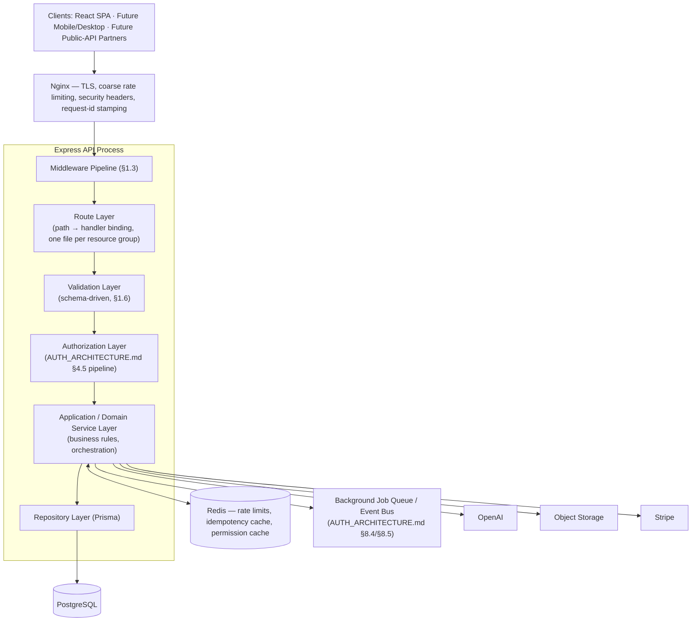

**Design Decisions:** the layering is strictly one-directional (Router never calls Repo directly, Service never imports Express types) — this is Clean Architecture's dependency rule applied literally, and it's what makes `docs/AUTH_ARCHITECTURE.md` §8.6's future microservice extraction (Identity & Access first, other bounded contexts later) a matter of moving a folder, not rewriting call graphs. Each resource group in §5 corresponds to one Router module and one Service module, mirroring `docs/DATABASE.md` §1.1's bounded contexts (Identity & Access, Tenancy, Billing, AI Platform, Content & Files, Collaboration & Governance, Extensibility).

**Trade-offs:** a stricter hexagonal/ports-and-adapters structure (explicit interface types between every layer) was considered and deferred — the four-layer structure above already gets the testability and extraction-readiness benefits that matter; full ports-and-adapters is more ceremony than a team of this size needs at launch, and nothing here blocks adopting it later per-module.

### 1.2 Request Lifecycle (Sequence)

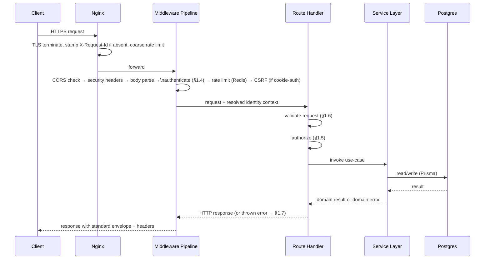

### 1.3 Middleware Pipeline (Ordered)

```mermaid
flowchart LR
    A["1. Request-ID / trace context"] --> B["2. CORS"]
    B --> C["3. Security headers"]
    C --> D["4. Body parsing + size limit"]
    D --> E["5. Authentication\n(§1.4)"]
    E --> F["6. Rate limiting\n(Redis, per-identity + per-IP)"]
    F --> G["7. CSRF check\n(cookie-authenticated state-changing requests only)"]
    G --> H["8. Idempotency-Key check\n(if header present, §2.17)"]
    H --> I["9. Route handler:\nvalidation → authorization → service"]
    I --> J["10. Response envelope + cache headers"]
    J --> K["11. Error handler\n(catches anything thrown at any stage, §1.7)"]
```

**Design Decisions:** ordering is deliberate and load-bearing — authentication happens *before* rate limiting so limits can be applied per-identity (not just per-IP, matching `AUTH_ARCHITECTURE.md` §5.4's dual-keyed rationale) rather than per-IP alone; CSRF only engages for cookie-authenticated requests (Bearer/API-key requests are structurally immune, per `AUTH_ARCHITECTURE.md` §5.3); the idempotency check runs *before* the handler so a replayed request never re-executes business logic at all, not even partially.

### 1.4 Authentication Resolution Flow

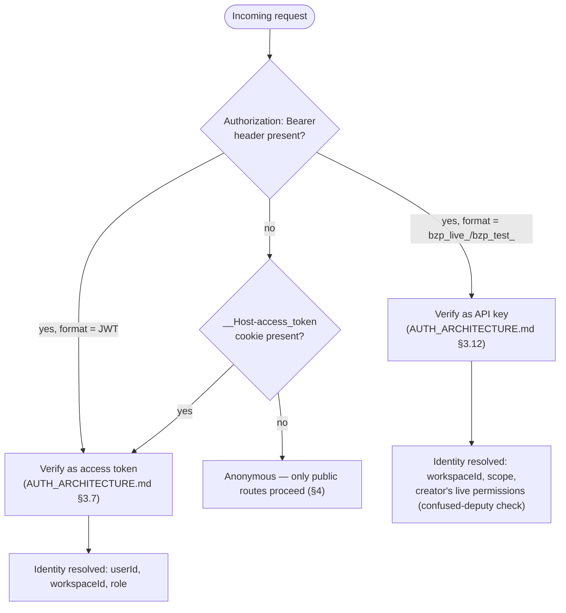

This is a routing decision on top of `docs/AUTH_ARCHITECTURE.md`'s already-specified verification mechanics — no new authentication logic is introduced here, only the rule for *which* mechanism a given request uses.

### 1.5 Authorization Flow

Identical to `docs/AUTH_ARCHITECTURE.md` §4.5's Permission Evaluation Pipeline — **not redesigned or duplicated here.** Each endpoint table in §5 states the `Permission.key` it requires; the middleware/handler layer runs that key through the existing pipeline unchanged. The one API-layer-specific addition: **path-parameter `workspaceId` must equal the token's `workspaceId` claim** (or, for API keys, the key's `workspaceId`) — a mismatch is a `404 Not Found`, not `403 Forbidden` (§3.2 — never confirm a resource exists in a workspace the caller can't access).

### 1.6 Validation Pipeline

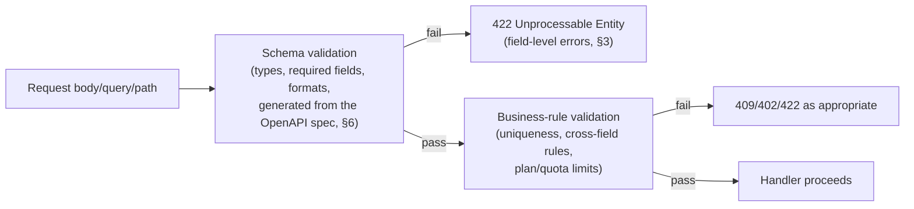

**Design Decisions:** schema validation (types/formats/required-ness) is mechanically generated from the OpenAPI spec's request-body schemas (§6) — the spec **is** the validator's source of truth, so the documented contract and the enforced contract cannot drift apart by definition. Business-rule validation (e.g., "workspace has reached its plan's `maxActiveProjects`") is a distinct, later stage specifically because it needs live data the schema layer doesn't have access to.

### 1.7 Error Handling Pipeline

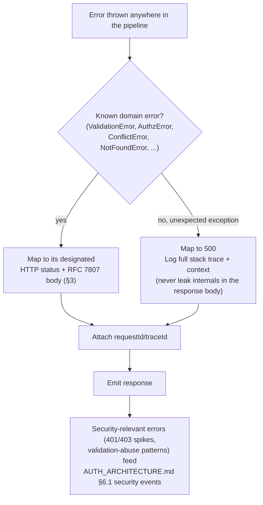

---

## 2. API Conventions

Everything in this section applies to **every** resource in §5 unless that resource's section explicitly states an override.

### 2.1 Versioning Strategy

- **URI-based:** `/v1/...`. The version denotes a *breaking-change boundary*, not a release train — most changes ship additively within `v1` (new optional fields, new endpoints, new enum values consumers must tolerate per §2.8).
- **Breaking-change policy:** a breaking change (removing/renaming a field, changing a field's type or semantics, removing an endpoint, tightening validation on existing input) requires a new version (`/v2`). Non-breaking additions never do.
- **Deprecation:** a deprecated endpoint/field is marked in the OpenAPI spec (`deprecated: true`) and returns a `Deprecation` and `Sunset` response header (per the IETF draft conventions of the same name) for at least **6 months** before removal in the next major version. `v1` is never silently removed while `v2` exists without an announced, dated sunset.
- **Rejected alternative:** header-based content negotiation for versioning (`Accept: application/vnd.bizpilot.v1+json`). Rejected for developer-experience reasons — URI versioning is trivially testable in a browser/curl/Postman, cacheable by path, and routable at the Nginx layer without inspecting headers; the "purity" argument for header versioning doesn't outweigh those practical costs here.

### 2.2 Base URL & Environments

| Environment | Base URL |
|---|---|
| Production | `https://api.bizpilot.ai/v1` |
| Staging | `https://api.staging.bizpilot.ai/v1` |
| Local development | `http://localhost:4000/v1` |

The API lives on its **own subdomain** (`api.bizpilot.ai`), separate from the app frontend (`app.bizpilot.ai`), and **workspace context is a path segment, never a subdomain** (`/v1/workspaces/{workspaceId}/...`) — this is the direct, deliberate continuation of `AUTH_ARCHITECTURE.md` §5.2's recommendation to keep the API on a single origin even if the frontend later adopts per-workspace subdomains, preserving the `__Host-`-prefixed cookie's protections unchanged (Decision #3).

### 2.3 Resource Naming & Pluralization

- Collection paths are **plural nouns**, lowercase, kebab-case for multi-word resources: `/projects`, `/business-profiles`, `/api-keys`, `/prompt-categories`.
- No verbs in URLs for standard CRUD (`POST /projects`, not `/createProject`). Verb-like endpoints are reserved for genuine actions with no resource-state CRUD equivalent (`POST /auth/logout`, `POST /invites/{token}/accept`, `POST /ai/generations`) — modeled as **creating a new resource representing the action's outcome or side effect**, keeping the API's uniform interface intact even for actions.
- Nesting reflects **ownership**, capped at two levels to keep URLs legible: `/workspaces/{workspaceId}/projects/{projectId}` is as deep as paths go; a `Project`'s `Folder`s are addressed as `/workspaces/{workspaceId}/folders?projectId={projectId}` (filter, not further nesting) — see §2.3.1.

**2.3.1 Rejected alternative:** unlimited nesting depth mirroring the full DB relationship graph (e.g., `/workspaces/{id}/projects/{id}/folders/{id}/files/{id}`). Rejected — deep nesting produces brittle, hard-to-construct client URLs and forces every intermediate ID to be known even when irrelevant to the request; BizPilot AI instead nests exactly one level (ownership by `Workspace`) and expresses finer relationships as **query filters** or **expansion** (§2.15), which scales to arbitrarily complex relationship graphs without URL depth exploding.

### 2.4 HTTP Method Semantics

| Method | Semantics | Idempotent? | Safe? |
|---|---|---|---|
| `GET` | Retrieve a resource or collection | Yes | Yes |
| `POST` | Create a resource, or trigger an action | No (unless `Idempotency-Key` used, §2.17) | No |
| `PATCH` | Partial update | Yes (same input → same resulting state) | No |
| `PUT` | Full replace — **not used in this API**; every mutable resource uses `PATCH` | — | — |
| `DELETE` | Remove (soft-delete where `docs/DATABASE.md` §3.4 specifies it) | Yes | No |

**Rejected alternative:** supporting `PUT` for full-resource replacement alongside `PATCH`. Rejected — with `docs/DATABASE.md`'s soft-delete/audit-heavy model, "replace the whole resource" is rarely the right primitive (it invites accidentally clobbering fields a client's stale copy doesn't know about); `PATCH` with explicit field-level updates, combined with `If-Match` (§2.18) for concurrency safety, is strictly better here.

### 2.5 Identifiers

All resource IDs are **UUIDv4** (matching `docs/DATABASE.md` §3.5's `gen_random_uuid()`), serialized as lowercase, hyphenated strings (`"3fa85f64-5717-4562-b3fc-2c963f66afa6"`). `ApiKey` and future public-API tokens use a **prefixed, non-UUID format** (`bzp_live_...`) specifically so token *shape* alone disambiguates it from a resource ID or a JWT at a glance — both in logs and in the authentication-resolution flow (§1.4).

### 2.6 Date & Time Format

All timestamps are **ISO 8601 / RFC 3339, UTC, millisecond precision**: `"2026-08-07T14:32:05.123Z"`. Never a Unix epoch integer, never a local/offset timezone — clients localize for display; the wire format is always UTC. Date-only fields (rare in this schema) use `"YYYY-MM-DD"`.

### 2.7 Enum Serialization

Enums are serialized as their **exact Prisma enum member string** (`"ACTIVE"`, `"SYSTEM"`, `"BLOCKED_BY_CREDIT_LIMIT"`) — no translation layer, no numeric codes. This is a direct, deliberate choice to keep the API and database vocabulies identical (Decision #8's philosophy applied to a specific field type): a new `AIActionType` value added to the schema is usable by API consumers the moment it's seeded, with no separate "API enum mapping" to update and get out of sync.

### 2.8 Enum & Field Forward-Compatibility

Clients **must** tolerate unrecognized enum values and unrecognized additional response fields without erroring (treat unknown enum values as "other/unhandled" in UI, ignore unknown fields) — stated explicitly here because it's what makes §2.1's "most changes are additive, not breaking" claim actually true in practice, not just in policy.

### 2.9 Boolean Serialization

JSON native `true`/`false` only — never `"true"` strings, never `0`/`1`.

### 2.10 Pagination

**Two supported modes, cursor is the default and recommended mode.**

**Cursor pagination** (default): `GET /v1/workspaces/{id}/audit-logs?limit=25&cursor=eyJpZCI6Ii4uLiJ9`

```json
{
  "data": [ /* 25 items */ ],
  "pagination": {
    "nextCursor": "eyJpZCI6IjNmYTg1ZjY0In0",
    "hasMore": true,
    "limit": 25
  }
}
```

The cursor is an **opaque, base64url-encoded pointer** (conceptually `{ sortKey, id }` of the last item on the page) — clients must never parse or construct it, only pass it back verbatim. This is what makes cursor pagination correct under concurrent inserts (a new `AuditLog` row written between two page requests never causes a duplicate or skipped row the way offset-based `LIMIT/OFFSET` can).

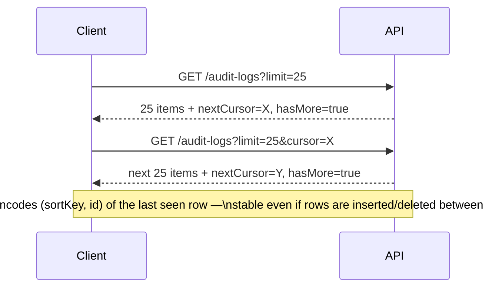

**Offset pagination** (opt-in, `?page=2&perPage=25`, only offered on `Plans`, `Permissions`, and other small/static catalogs): returns `{ "pagination": { "page": 2, "perPage": 25, "totalItems": 143, "totalPages": 6 } }`. **Not offered** on high-volume, high-write collections (`AuditLog`, `AIUsage`, `Activity`, `Messages`) — documented per-resource in §5 (Decision #4).

- Default `limit`/`perPage`: 20. Maximum: 100 (`400 Bad Request` above that, not a silent clamp — silent clamping hides client bugs).

### 2.11 Sorting

`?sort=field` (ascending) or `?sort=-field` (descending, leading hyphen), comma-separated for multi-key: `?sort=-createdAt,name`. Each resource's §5 entry lists its sortable fields (always a bounded allowlist, never "any column" — an unbounded sort surface is both a performance risk and an information-disclosure risk for fields that shouldn't be sortable, e.g. `passwordHash` obviously never is, but the principle is general).

### 2.12 Filtering

`?field=value` for exact match; bracketed operators for comparisons: `?createdAt[gte]=2026-01-01&creditsConsumed[lt]=100`. Supported operators: `eq` (default/bare), `ne`, `gt`, `gte`, `lt`, `lte`, `in` (comma-separated), `contains` (string fields only, case-insensitive). Each resource's §5 entry lists its filterable fields and which operators apply (e.g., `contains` never applies to an enum field). Combining filters is implicit `AND`; `OR` across different fields is **not supported** in `v1` (a deliberate scope cut — see §2.12.1).

**2.12.1 Rejected alternative:** a generic, arbitrarily-composable query language (Mongo-style `$or`/`$and` trees, or a full query-string DSL). Rejected for `v1` — the product's actual filtering needs (per `docs/PRD.md`'s features) are simple conjunctive filters; a composable query language is real complexity (parsing, injection-surface review, query-planner cost analysis) that isn't justified yet. Flagged as a `v2`-candidate if a genuine advanced-filtering product need (e.g., a custom report builder, `docs/PRD.md` §8.5) emerges — that feature is more likely to warrant its own purpose-built query endpoint than a general filter-DSL retrofit anyway.

### 2.13 Search

Full-text-style search uses a dedicated `q` query parameter, never overloaded onto `filter`: `?q=quarterly launch`. Two forms:
- **Resource-scoped search:** `?q=` on a resource's own list endpoint (e.g., `GET /projects?q=launch` searches project names/descriptions).
- **Federated search:** the dedicated `/v1/workspaces/{id}/search` endpoint (§5.17) searching across resource types at once, ranked, permission-filtered.

### 2.14 Field Selection (Sparse Fieldsets)

`?fields=id,name,status` restricts the response to only the named top-level fields — reduces payload size for bandwidth-constrained clients (a direct, deliberate accommodation for the "Future Mobile Apps" requirement, usable starting on day one even before a mobile client exists). Nested/expanded objects (§2.15) are included whole or not at all; sparse fieldsets don't reach inside expansions in `v1`.

### 2.15 Expansion

`?expand=businessProfile,project` inlines related resources instead of returning only their IDs, avoiding client-side N+1 fetches. Each resource's §5 entry lists its **expandable relations** (a fixed allowlist per resource, never arbitrary/recursive expansion — bounding this is a deliberate scalability guard against a client requesting an unbounded object graph in one request). Un-expanded relations appear as `{ "id": "..." }` reference stubs, never bare ID strings, so the shape is consistent whether a relation is expanded or not (a client can always safely do `resource.project.id`).

### 2.16 Bulk & Batch Operations

Offered **selectively**, as an explicit `/batch` sub-resource, only where a real product need exists (bulk member invite, per `docs/PRD.md` §8.9's future improvement; bulk file/folder move) — see the relevant §5 entries. Shape: `POST /{collection}/batch` with `{ "operations": [{ "method": "POST", "body": {...} }, ...] }` (max 25 operations per request), returning `{ "results": [{ "status": 201, "data": {...} }, { "status": 422, "error": {...} }, ...] }` — **partial success is explicit and per-operation**, never all-or-nothing, since a mid-batch failure (e.g., one invalid email in a bulk invite) shouldn't block the 24 valid ones. (Decision #10 — not offered universally.)

### 2.17 Idempotency Keys

For `POST` requests that create a resource or have a real-world side effect (AI generation, credit consumption, payment/checkout-session creation, invites), clients **may** (and for the specific endpoints marked "**Required**" in §5, **must**) send an `Idempotency-Key: <client-generated-uuid>` header. The server caches `(idempotencyKey, route, requestBodyHash) → response` for **24 hours** in Redis; a retried request with the same key and body returns the cached response **without re-executing** the operation. A retry with the *same key* but a *different body* is a `409 Conflict` (`idempotency_key_reused` — protects against accidental key collisions masking a genuinely different request).

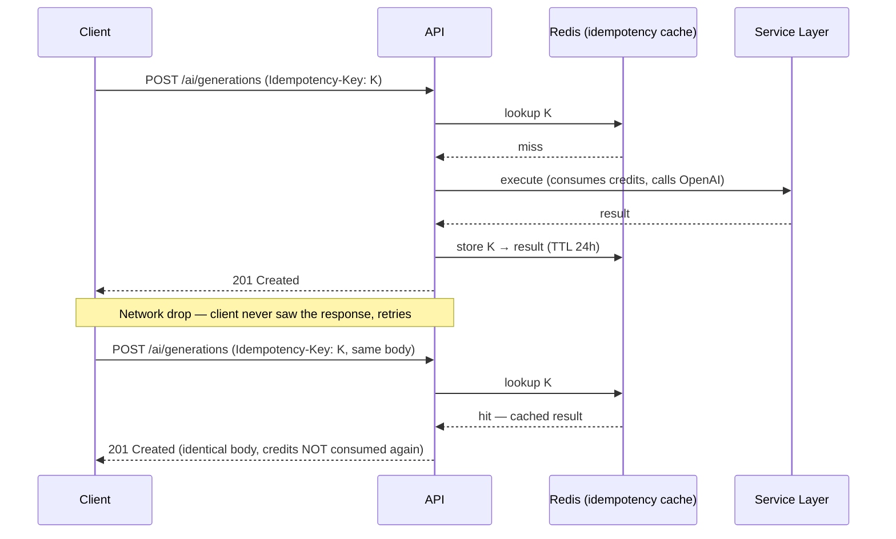

**Security Considerations:** this is the primary defense against duplicate credit-consumption/duplicate-billing from client retries (network blips, double-clicks) — distinct from, and complementary to, `AUTH_ARCHITECTURE.md` §5.5's replay-attack protections, which guard against *malicious* replay rather than accidental client retry.

### 2.18 ETags & Conditional Requests

Every `GET` on a single resource returns an `ETag` header (a hash of the resource's `updatedAt` + `id`, cheap to compute, no need to hash the full body). Clients may send `If-None-Match` on subsequent `GET`s — a match returns `304 Not Modified` with an empty body (bandwidth savings, standard HTTP caching semantics). **Mutable, multi-editor resources** (`Project`, `BusinessProfile`, `Prompt`/`PromptVersion` content, `Settings`, `Template`) additionally support `PATCH` with a **required** `If-Match` header — a mismatch (someone else edited it first) returns `412 Precondition Failed` with the current resource state in the body, so the client can re-render and let the user reconcile rather than silently overwriting a concurrent edit (Decision #9).

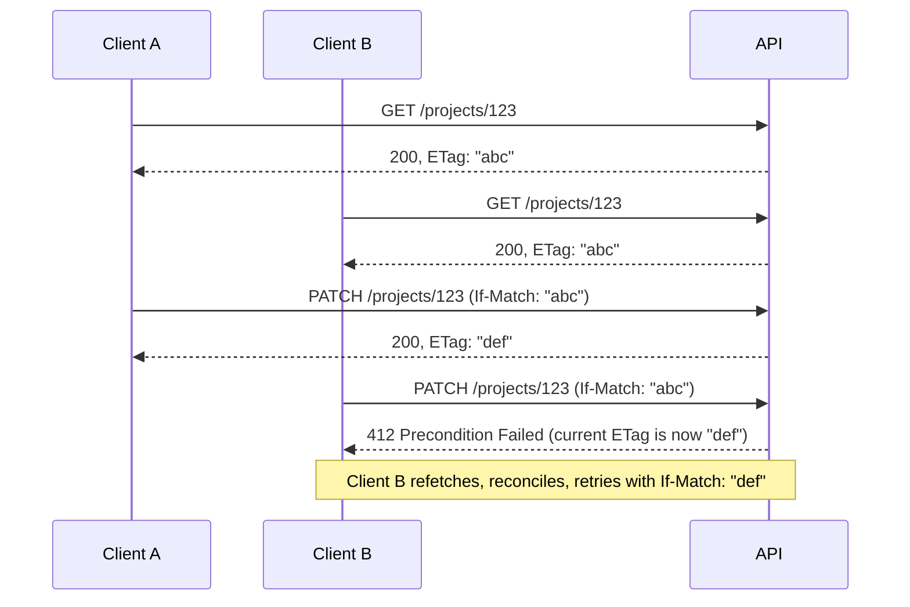

### 2.19 Rate Limit Headers & Tiers

Every response includes `X-RateLimit-Limit`, `X-RateLimit-Remaining`, `X-RateLimit-Reset` (Unix seconds). Limits are tiered by **subscription plan** (matching `docs/PRD.md` §9), applied per-workspace for workspace-scoped routes and per-user for `/me`/`/auth` routes:

| Plan | General API (req/min) | AI generation (req/min) | Auth endpoints (req/min, per-account) |
|---|---|---|---|
| Free | 60 | 5 | 10 |
| Starter | 120 | 15 | 10 |
| Pro | 300 | 40 | 10 |
| Business | 600 | 100 | 10 |
| Enterprise | Custom (negotiated) | Custom | 10 |

AI generation limits are deliberately **independent of** general API limits (a workspace generating heavily shouldn't starve its own dashboard/CRUD traffic, and vice versa) and independent of AI credit balance (§5.10) — credits bound *cost*, this rate limit bounds *burst request rate*, and both are needed (a workspace could have ample credits but still shouldn't be able to fire 500 concurrent generation requests). Auth-endpoint limits are intentionally **plan-independent** (identical for Free through Enterprise) since brute-force/credential-stuffing risk doesn't scale with subscription tier. `429 Too Many Requests` responses include `Retry-After`.

### 2.20 Standard Response Envelope

**Single resource:**
```json
{
  "data": { "id": "...", "...": "..." },
  "links": { "self": "/v1/workspaces/.../projects/123" },
  "meta": { "requestId": "req_01HXYZ...", "traceId": "00-abc...-01" }
}
```

**Collection:**
```json
{
  "data": [ { "...": "..." } ],
  "pagination": { "nextCursor": "...", "hasMore": true, "limit": 25 },
  "links": { "self": "/v1/workspaces/.../projects?limit=25" },
  "meta": { "requestId": "req_...", "traceId": "..." }
}
```

`links` on a detail response also includes resource-appropriate relationship links (§0.4's Level-3-lite element), e.g. a `Conversation`'s `links.messages`.

### 2.21 HTTP Status Code Matrix

| Code | Meaning | Used for |
|---|---|---|
| `200 OK` | Success | `GET`, `PATCH`, action `POST`s that don't create a new resource |
| `201 Created` | Resource created | `POST` that creates a resource (includes `Location` header) |
| `202 Accepted` | Accepted, processing async | Long-running operations not using SSE (rare — most async work here is either fast enough for `201` or offered as a stream) |
| `204 No Content` | Success, no body | `DELETE`; some action `POST`s (e.g., mark-notification-read) |
| `304 Not Modified` | Cache hit | Conditional `GET` (§2.18) |
| `400 Bad Request` | Malformed request | Unparseable JSON, malformed query params |
| `401 Unauthorized` | Not authenticated | Missing/invalid/expired credentials |
| `402 Payment Required` | Plan entitlement denial | `AUTH_ARCHITECTURE.md` §4.5 step 7 — feature/module not on the workspace's plan |
| `403 Forbidden` | Not authorized | RBAC denial (authenticated, but not permitted) |
| `404 Not Found` | Not found, or not authorized-to-know-it-exists | Genuinely missing resource, **or** a workspace-scope mismatch (§1.5) |
| `405 Method Not Allowed` | Wrong verb for this path | — |
| `409 Conflict` | State conflict | Duplicate unique field, invalid state transition, reused idempotency key with different body |
| `412 Precondition Failed` | `If-Match` mismatch | Concurrent edit conflict (§2.18) |
| `413 Payload Too Large` | Body/file exceeds limit | Large uploads (§5.6) |
| `415 Unsupported Media Type` | Wrong `Content-Type` | — |
| `422 Unprocessable Entity` | Semantically invalid, well-formed request | Field-level validation failures |
| `429 Too Many Requests` | Rate limited | §2.19 |
| `500 Internal Server Error` | Unexpected server fault | — |
| `502 Bad Gateway` | Upstream provider failure | OpenAI/Stripe unreachable or erroring |
| `503 Service Unavailable` | Dependency down | Database/Redis unavailable (see also `/health/ready`, §5.18) |

**Design note:** `404` is used deliberately for cross-tenant access attempts instead of `403` (§1.5) — this is a considered security trade (never confirm a resource's *existence* to a caller who can't access it), consistent with `AUTH_ARCHITECTURE.md`'s anti-enumeration discipline (§2.1/§3.3 of that document) applied at the API layer.

---

## 3. Unified Error Specification

### 3.1 Standard Error Object (RFC 7807 Problem Details, extended)

`Content-Type: application/problem+json`

```json
{
  "type": "https://developers.bizpilot.ai/errors/validation_error",
  "title": "Validation Failed",
  "status": 422,
  "detail": "One or more fields failed validation.",
  "instance": "/v1/workspaces/abc/projects",
  "code": "VALIDATION_FAILED",
  "requestId": "req_01HXYZ123ABC",
  "traceId": "00-4bf92f3577b34da6a3ce929d0e0e4736-00f067aa0ba902b7-01",
  "errors": [
    { "field": "name", "code": "REQUIRED", "message": "name is required" },
    { "field": "status", "code": "INVALID_ENUM_VALUE", "message": "status must be one of DRAFT, ACTIVE, ON_HOLD, COMPLETED, ARCHIVED" }
  ]
}
```

`type` is a stable, dereferenceable URL (a future public error-code documentation page) — per RFC 7807, clients may match on `type` (or the BizPilot-specific `code`, which is the more ergonomic machine-matching field in practice) rather than parsing `title`/`detail` prose, which may be reworded over time without being a breaking change. `errors[]` (field-level detail) only appears for validation errors; other categories omit it.

### 3.2 Error Taxonomy

| Category | HTTP status | `code` prefix | Example |
|---|---|---|---|
| Validation | `422` (or `400` for malformed JSON) | `VALIDATION_*` | `VALIDATION_FAILED`, `INVALID_ENUM_VALUE` |
| Authentication | `401` | `AUTH_*` | `AUTH_TOKEN_EXPIRED`, `AUTH_TOKEN_INVALID`, `AUTH_REQUIRED` |
| Authorization | `403` / `402` | `AUTHZ_*` / `BILLING_*` | `AUTHZ_INSUFFICIENT_PERMISSION`, `BILLING_PLAN_LIMIT_REACHED` |
| Business rule | `409` / `422` | `BUSINESS_*` | `BUSINESS_INVALID_STATE_TRANSITION`, `BUSINESS_DUPLICATE_INVITE` |
| Rate limit | `429` | `RATE_LIMIT_*` | `RATE_LIMIT_EXCEEDED`, `RATE_LIMIT_AI_GENERATION` |
| Conflict | `409` / `412` | `CONFLICT_*` | `CONFLICT_DUPLICATE_SLUG`, `CONFLICT_STALE_WRITE` |
| Not found | `404` | `NOT_FOUND` | `NOT_FOUND` (deliberately generic — never `NOT_FOUND_PROJECT` vs. `NOT_FOUND_NO_ACCESS`, per §2.21's anti-enumeration note) |
| Server | `500`/`502`/`503` | `SERVER_*` | `SERVER_ERROR`, `SERVER_UPSTREAM_UNAVAILABLE` |

### 3.3 Correlation ID / Trace ID / Request ID

| Header | Direction | Purpose |
|---|---|---|
| `X-Request-Id` | Server-generated (or client-supplied and echoed, if provided) | Identifies **this single HTTP request** uniquely — the first thing support/on-call asks for |
| `X-Correlation-Id` | Client-supplied, optional | Threads together multiple requests belonging to one logical client-side operation (e.g., a multi-step wizard) — opaque to the server, purely echoed |
| `traceId` (in `meta`, sourced from `traceparent`) | Propagated per [W3C Trace Context](https://www.w3.org/TR/trace-context/) | Distributed-tracing correlation — the field that will matter most once `AUTH_ARCHITECTURE.md` §8.6's microservice split happens, since a single logical request may then span multiple services |

All three appear in every error body and every success response's `meta`; `X-Request-Id` is additionally always a response header (present even on responses that fail before reaching JSON-serialization, e.g. a raw `502` from a misbehaving upstream proxy).

---

## 4. Security Design

*(This section applies API-layer conventions on top of `docs/AUTH_ARCHITECTURE.md`'s mechanisms — it does not redefine them.)*

### 4.1 JWT Usage

`Authorization: Bearer <access_token>` for non-browser clients (mobile/desktop/partner integrations, per `AUTH_ARCHITECTURE.md` A2); the `__Host-access_token` cookie for the first-party browser SPA. Both are accepted on every authenticated route (§1.4) — a route never assumes one mechanism exclusively, since the same API surface serves both today's SPA and tomorrow's mobile app without a fork.

### 4.2 Cookie Usage

Exactly as specified in `AUTH_ARCHITECTURE.md` §5.2 — `__Host-`-prefixed, `HttpOnly`, `Secure`, `SameSite=Strict`. Not re-derived here.

### 4.3 CSRF

Required (double-submit token, custom header) on state-changing requests **only when cookie-authenticated** — Bearer/API-key-authenticated requests skip this check entirely, since they're not susceptible to CSRF by construction (no ambient browser credential is being exploited). Enforced at middleware stage 7 (§1.3).

### 4.4 CORS

Strict origin allowlist (`app.bizpilot.ai` and configured staging/preview origins), `credentials: true` only for allowlisted origins, per `AUTH_ARCHITECTURE.md` §5.3. The public-API surface (§7.2, future) will require a **separate**, more permissive CORS posture for third-party integrations — explicitly deferred, not designed into `v1`'s CORS policy, since first-party-only CORS is strictly safer and the public API doesn't exist yet.

### 4.5 API Keys

`Authorization: Bearer bzp_live_<prefix>_<secret>` (or `bzp_test_...` for a future sandbox/test-mode environment, mirroring Stripe's live/test key convention as a deliberate, recognizable pattern for integrators). Scope + confused-deputy resolution exactly as `AUTH_ARCHITECTURE.md` §3.12 specifies.

### 4.6 Webhook Signatures

Outbound (BizPilot → customer) exactly as `AUTH_ARCHITECTURE.md` §3.13 specifies (HMAC-SHA256 over `{timestamp}.{rawBody}`). The delivered payload's shape is documented per event type in §5.15/§6.5.

### 4.7 Replay Attack Prevention

Short-TTL access tokens, single-use refresh-token rotation, and webhook timestamp windows are all inherited from `AUTH_ARCHITECTURE.md` §5.5 unchanged. **API-layer addition:** the `Idempotency-Key` mechanism (§2.17), while primarily a *reliability* feature (safe client retries), incidentally narrows one replay vector too — a captured-and-resent request with a previously-used idempotency key returns the cached original response rather than re-executing.

### 4.8 Request Signing (Future)

Bearer-token auth is sufficient for `v1`. **Future:** for the highest-security public-API integrations (§7.2), full request signing (AWS SigV4-style — signing the method, path, and body hash, not just presenting a bearer credential) is a documented future option, primarily valuable once BizPilot AI has partners operating in regulated/high-assurance environments that specifically require it; not built now because Bearer + TLS + short token TTLs already meet the security bar for every currently-planned client type.

### 4.9 Rate Limiting

Specified fully in §2.19.

### 4.10 Input Validation & Output Encoding

Input: schema-driven (§1.6), rejecting unknown top-level fields by default (`additionalProperties: false` in the generated schemas) — an unrecognized field in a request body is a `422`, not silently ignored, since silently ignoring it is how clients ship bugs unnoticed (this is a deliberate asymmetry with §2.8's "clients must tolerate unknown *response* fields" — servers are strict about what they accept, lenient about what they promise, the long-standing "robustness principle" applied correctly in the direction that actually matters for a service boundary). Output: `Content-Type: application/json` exclusively — the API never renders HTML, so injection into an HTML-rendering context is structurally a frontend concern (`AUTH_ARCHITECTURE.md` §5.3), not an API-response concern; the API's own obligation is simply to never let a client-supplied string alter the *structure* of the JSON response (standard JSON-serializer behavior, not a bespoke escaping scheme).

### 4.11 Security Headers

Baseline headers on every API response (distinct from, and simpler than, the frontend's CSP-heavy header set in `AUTH_ARCHITECTURE.md` §5.3, since the API never serves renderable HTML): `X-Content-Type-Options: nosniff`, `Strict-Transport-Security` (long max-age, inherited from the Nginx edge config, §1.1), `Cache-Control: no-store` by default on authenticated routes (explicitly overridden to allow caching on the small set of routes where `ETag`-based caching is intended, §2.18).

---

## 5. Resource Specifications

Endpoint tables use this legend: **Auth** = authentication required (✅ always for workspace-scoped resources; a small, explicitly-marked set of routes are public). **Perm** = the `Permission.key` required (from `AUTH_ARCHITECTURE.md` §4.4's catalog; "—" = authentication alone suffices, no additional permission check; "Owner" = hardcoded Owner-only per `AUTH_ARCHITECTURE.md` §4.7). Unless noted otherwise, every collection endpoint supports the standard pagination/sorting/filtering/search/expansion/rate-limit/caching conventions from §2.

### 5.1 Authentication & Session

**Purpose:** Credential exchange and session lifecycle — the API surface for every flow `AUTH_ARCHITECTURE.md` §2–§3 already designed. This section is a thin routing layer over that document; no new auth mechanics are introduced.
**Base path:** `/v1/auth`

| Method | Path | Summary | Auth | Perm | Idempotent |
|---|---|---|---|---|---|
| `POST` | `/auth/register` | Create account (`AUTH_ARCHITECTURE.md` §3.2) | ❌ Public | — | Recommended |
| `POST` | `/auth/login` | Password login (§3.3) | ❌ Public | — | No (returns fresh tokens every call by design) |
| `POST` | `/auth/logout` | End current session (§3.4) | ✅ | — | Yes |
| `POST` | `/auth/logout-all` | End every session (§3.4) | ✅ | — | Yes |
| `POST` | `/auth/refresh` | Rotate tokens (§3.8) | ✅ (refresh cookie) | — | No — each call rotates by design |
| `POST` | `/auth/verify-email` | Confirm email (§2.7) | ❌ Public (token-bearing body) | — | Yes (idempotent state transition) |
| `POST` | `/auth/resend-verification` | Resend verification email | ✅ | — | Yes, rate-limited hard (§2.19 auth tier) |
| `POST` | `/auth/forgot-password` | Request reset (§2.8) | ❌ Public | — | Yes (always `202`, anti-enumeration) |
| `POST` | `/auth/reset-password` | Complete reset (§2.8) | ❌ Public (token-bearing body) | — | No — a second call with an already-used token `409`s |
| `POST` | `/auth/change-password` | Change password, session active (§2.9) | ✅ (re-auth required in body) | — | No |
| `POST` | `/auth/change-email` | Begin email change (§2.9) | ✅ (re-auth required in body) | — | No |
| `POST` | `/auth/workspace-switch` | Re-scope access token (§2.3 of AUTH doc) | ✅ | — | Yes |

**Request/Response notes:** `POST /auth/forgot-password` **always** responds `202 Accepted` regardless of whether the email matches an account (§3.2/§2.8 of `AUTH_ARCHITECTURE.md`'s documented enumeration trade-off) — this is the one endpoint in the entire API where success/failure status is deliberately uninformative by design, not an oversight. `POST /auth/login`/`refresh`/`workspace-switch` set the `__Host-*` cookies directly (browser flow) **and** return the tokens in the JSON body (non-browser flow) — the same endpoint serves both client types per §4.1, with the cookie as the browser-preferred delivery channel and the body as the mobile/desktop-preferred one.
**Rate limits:** the fixed, plan-independent auth tier (§2.19) applies to every route in this group.
**Future Extensions:** `POST /auth/mfa/challenge`, `POST /auth/mfa/verify` (`AUTH_ARCHITECTURE.md` §7.4), `GET /auth/oauth/{provider}/start` + `/callback` (§7.1), `POST /auth/passkeys/*` (§7.5), `POST /auth/magic-link` (§7.6) — all additive, no change to routes listed above.

### 5.2 Workspace & Tenancy (Workspace, Members, Roles, Permissions, Invitations, Settings)

**Purpose:** The tenant boundary and everything governing who can act within it.
**Base path:** `/v1/workspaces`

| Method | Path | Summary | Auth | Perm |
|---|---|---|---|---|
| `GET` | `/workspaces` | List the caller's workspaces | ✅ | — |
| `POST` | `/workspaces` | Create a workspace | ✅ | — (any verified user; becomes Owner) |
| `GET` | `/workspaces/{workspaceId}` | Get workspace | ✅ | `workspace.view` |
| `PATCH` | `/workspaces/{workspaceId}` | Update name/branding | ✅ | `workspace.manage` |
| `DELETE` | `/workspaces/{workspaceId}` | Soft-delete workspace | ✅ | **Owner** |
| `GET` | `/workspaces/{workspaceId}/members` | List members | ✅ | `team.view` |
| `POST` | `/workspaces/{workspaceId}/members/batch` | Bulk-update member roles (§2.16) | ✅ | `team.manage` |
| `GET` | `/workspaces/{workspaceId}/members/{memberId}` | Get member | ✅ | `team.view` |
| `PATCH` | `/workspaces/{workspaceId}/members/{memberId}` | Change role/module scope/status | ✅ | `team.manage` |
| `DELETE` | `/workspaces/{workspaceId}/members/{memberId}` | Remove member | ✅ | `team.manage` |
| `GET` | `/workspaces/{workspaceId}/roles` | List roles (system + custom) | ✅ | `team.view` |
| `POST` | `/workspaces/{workspaceId}/roles` | Create custom role | ✅ | `team.manage` + Business/Enterprise plan gate |
| `GET` | `/workspaces/{workspaceId}/roles/{roleId}` | Get role | ✅ | `team.view` |
| `PATCH` | `/workspaces/{workspaceId}/roles/{roleId}` | Update custom role's permissions | ✅ | `team.manage` |
| `DELETE` | `/workspaces/{workspaceId}/roles/{roleId}` | Delete custom role | ✅ | `team.manage` (`409` if members still assigned, §4.3 of AUTH doc) |
| `GET` | `/permissions` | List the global permission catalog | ✅ | — (read-only, not workspace-scoped) |
| `GET` | `/workspaces/{workspaceId}/invites` | List pending invites | ✅ | `team.invite` |
| `POST` | `/workspaces/{workspaceId}/invites` | Invite a member | ✅ | `team.invite` |
| `POST` | `/workspaces/{workspaceId}/invites/batch` | Bulk CSV-style invite (§2.16) | ✅ | `team.invite` |
| `DELETE` | `/workspaces/{workspaceId}/invites/{inviteId}` | Revoke a pending invite | ✅ | `team.invite` |
| `GET` | `/invites/{token}` | View invite details (pre-accept) | ❌ Public | — |
| `POST` | `/invites/{token}/accept` | Accept invite | ✅ (email must match, §2.6 of AUTH doc) | — |
| `POST` | `/invites/{token}/decline` | Decline invite | ✅ | — |
| `GET` | `/workspaces/{workspaceId}/settings` | Get settings (singleton) | ✅ | `workspace.view` |
| `PATCH` | `/workspaces/{workspaceId}/settings` | Update settings | ✅ | `workspace.manage`, `If-Match` required (§2.18) |

**Request/Response notes:** `POST /workspaces` is **not** workspace-scoped (no `workspaceId` in the path — the workspace doesn't exist yet); every other route in this group is. `PATCH /members/{memberId}` cannot be used to change a member to/from `Owner` role (ownership transfer is a distinct, more sensitive action — see Future Extensions) and cannot let a non-Owner remove the Owner. `DELETE /workspaces/{workspaceId}` is Owner-only and soft-delete (per `docs/DATABASE.md` §3.4); it queues a background job, does not synchronously cascade.
**Filtering/Sorting:** `members` filterable by `status`, `roleId`; sortable by `joinedAt`, `createdAt`. `invites` filterable by `status`.
**Expansion:** `members` → `?expand=role,invitedBy`.
**Concurrency:** `Settings` and custom `Role` updates require `If-Match` (multi-admin editing risk).
**Future Extensions:** `POST /workspaces/{workspaceId}/transfer-ownership` (a dedicated, extra-friction endpoint — not a side effect of the generic member `PATCH`, matching `AUTH_ARCHITECTURE.md` §4.7's treatment of ownership transfer as maximally sensitive); `/workspaces/{workspaceId}/sso-config` once SAML SSO ships (`AUTH_ARCHITECTURE.md` §7.3).

### 5.3 Users (`/me`)

**Purpose:** The authenticated caller's own identity and account-level resources. **There is no `/v1/users` collection** (Decision #11) — a `User` is only ever visible to others as a workspace `Member` (§5.2), never directly.
**Base path:** `/v1/me`

| Method | Path | Summary | Auth | Perm |
|---|---|---|---|---|
| `GET` | `/me` | Get own profile | ✅ | — |
| `PATCH` | `/me` | Update `fullName`/`avatarUrl`/`timezone`/`locale` | ✅ | — |
| `GET` | `/me/sessions` | List active sessions/devices (`AUTH_ARCHITECTURE.md` §3.11) | ✅ | — |
| `DELETE` | `/me/sessions/{sessionId}` | Revoke one device | ✅ | — |
| `GET` | `/me/workspaces` | List workspace memberships (same data as `GET /workspaces`, kept for symmetry with the rest of `/me`) | ✅ | — |
| `DELETE` | `/me` | Self-service account deletion (§2.4 of AUTH doc) | ✅ (re-auth required) | — |

**Request/Response notes:** `PATCH /me` explicitly rejects `email`/`passwordHash`-equivalent fields — those go through `/auth/change-email`/`/auth/change-password` (§5.1) specifically because those require step-up re-authentication that a generic profile `PATCH` shouldn't silently also trigger.
**Future Extensions:** `/me/notification-preferences` (§5.12), `/me/api-keys` view-across-workspaces (currently API keys are only listable per-workspace, §5.14 — a cross-workspace view is a plausible future convenience, not built now).

### 5.4 Business Profiles

**Purpose:** The AI grounding-context object (`docs/DATABASE.md` §2's `BusinessProfile`).
**Base path:** `/v1/workspaces/{workspaceId}/business-profiles`

| Method | Path | Summary | Perm |
|---|---|---|---|
| `GET` | `/business-profiles` | List | `workspace.view` |
| `POST` | `/business-profiles` | Create (Pro+ for a 2nd+ profile, plan-gated `402`) | `workspace.manage` |
| `GET` | `/business-profiles/{id}` | Get | `workspace.view` |
| `PATCH` | `/business-profiles/{id}` | Update | `workspace.manage`, `If-Match` required |
| `DELETE` | `/business-profiles/{id}` | Soft-delete | `workspace.manage` (`409` if it's the sole/default profile) |
| `POST` | `/business-profiles/{id}/set-default` | Mark as default | `workspace.manage` |

**Request/Response notes:** setting a new default is a dedicated action endpoint, not a generic `PATCH {isDefault: true}` — this lets the server atomically un-default the previous one server-side (the partial-unique-index gap noted in `docs/DATABASE.md` §1.3 is exactly why this must be a transactional server-side operation, not something a naive two-request client PATCH sequence could get right).
**Concurrency:** `If-Match` required — `toneAttributes`/`socialLinks`/`offerings` are free-form `Json` fields multiple editors could clobber.
**Future Extensions:** `POST /business-profiles/{id}/import-from-url` (the PRD's onboarding "paste your website" AI-assisted draft, `docs/PRD.md` §12) is modeled as an **AI Generation** action (§5.10) whose output populates a draft profile, not a bespoke endpoint here — reuses the one generation pathway rather than inventing a second.

### 5.5 Projects & Folders

**Purpose:** The organizing containers for workspace content (`docs/DATABASE.md` §5).
**Base path:** `/v1/workspaces/{workspaceId}/projects`, `/v1/workspaces/{workspaceId}/folders`

| Method | Path | Summary | Perm |
|---|---|---|---|
| `GET` | `/projects` | List (filter: `status`, `businessProfileId`, `ownerUserId`; search: `?q=`) | `project.view` |
| `POST` | `/projects` | Create (optionally `createdFromTemplateId`) | `project.create`, plan-gated `maxActiveProjects` (`402`) |
| `GET` | `/projects/{id}` | Get | `project.view` |
| `PATCH` | `/projects/{id}` | Update | `project.edit`, `If-Match` required |
| `DELETE` | `/projects/{id}` | Soft-delete | `project.delete` |
| `GET` | `/projects/{id}/members` | List project members | `project.view` |
| `POST` | `/projects/{id}/members` | Add a workspace member to the project | `project.manage` (must already be a `WorkspaceMember`, per `docs/DATABASE.md` §1.3's structural guarantee) |
| `DELETE` | `/projects/{id}/members/{memberId}` | Remove from project | `project.manage` |
| `GET` | `/folders` | List (filter: `projectId`, `parentFolderId`) | `project.view` |
| `POST` | `/folders` | Create | `project.edit` |
| `GET` | `/folders/{id}` | Get | `project.view` |
| `PATCH` | `/folders/{id}` | Rename / move (`parentFolderId`) | `project.edit` |
| `DELETE` | `/folders/{id}` | Soft-delete (contents re-parent to `null`, never cascade-delete files) | `project.edit` |

**Sorting:** `projects` by `createdAt`, `updatedAt`, `name`, `status`. **Expansion:** `projects` → `?expand=businessProfile,owner,createdFromTemplate`.
**Concurrency:** `Folder` move validated server-side against §2.3.1's DB-doc-noted invariant (same-workspace parent) — a cross-workspace move attempt is `422`, not silently corrected.
**Future Extensions:** project templates apply at creation (`createdFromTemplateId`) — a richer "clone with all content" is a plausible future `POST /projects/{id}/duplicate`, not built now.

### 5.6 Files & Images

**Purpose:** Generic asset storage plus AI-image-specific metadata (`docs/DATABASE.md` §5's `File`/`Image` composition).
**Base path:** `/v1/workspaces/{workspaceId}/files`, `/v1/workspaces/{workspaceId}/images`

| Method | Path | Summary | Perm |
|---|---|---|---|
| `POST` | `/files/upload-url` | Request a pre-signed direct-to-object-storage upload URL | `project.edit` |
| `POST` | `/files` | Register file metadata after direct upload completes | `project.edit` |
| `GET` | `/files` | List (filter: `folderId`, `projectId`, `kind`) | `project.view` |
| `GET` | `/files/{id}` | Get metadata (+ signed download URL) | `project.view` |
| `PATCH` | `/files/{id}` | Rename / move folder | `project.edit` |
| `DELETE` | `/files/{id}` | Soft-delete | `project.edit` |
| `GET` | `/images/{fileId}` | Get image-specific metadata for a file | `project.view` |
| `POST` | `/images/generate` | AI-generate an image (creates `File`+`Image`) | `content.create`, AI credits required, `Idempotency-Key` **required** |

**Design Decisions:** file **upload is two-phase** (`upload-url` then `files` registration) — the client uploads bytes **directly to object storage**, never through the API process, which never buffers file bytes in memory/disk (a deliberate scalability and cost decision: the API tier stays stateless and cheap to scale regardless of upload volume/size, matching the layered architecture's stated goal). `GET /files/{id}` returns a **freshly signed, short-TTL download URL** each time (never a permanent public URL) — access control for private files is enforced by *not issuing* the signed URL to unauthorized callers, not by the storage layer's own ACLs alone (defense in depth).
**Request Body (`POST /files`):** `{ storageKey, fileName, mimeType, sizeBytes, folderId?, projectId? }` — `storageKey` must reference a key the caller's own just-issued `upload-url` targeted (server-validated, preventing a client from registering metadata for an object it didn't actually upload).
**Validation:** `sizeBytes` checked against a plan-tiered max (`413` if exceeded); `mimeType` checked against an allowlist per `FileKind`.
**Future Extensions:** resumable/chunked upload support for very large files; `WebhookEventType`-driven virus/content scanning hook before a file transitions `PROCESSING` → `READY`.

### 5.7 Templates & Template Categories

**Purpose:** Reusable content structures (`docs/DATABASE.md` §4's `Template`/`TemplateCategory`).
**Base path:** `/v1/workspaces/{workspaceId}/templates`, `/v1/workspaces/{workspaceId}/template-categories`

| Method | Path | Summary | Perm |
|---|---|---|---|
| `GET` | `/templates` | List (system + workspace; filter: `type`, `categoryId`, `visibility`) | `content.view` |
| `POST` | `/templates` | Create (personal or workspace-shared per `visibility`) | `content.create` |
| `GET` | `/templates/{id}` | Get | `content.view` |
| `PATCH` | `/templates/{id}` | Update | `content.edit` (own, if `visibility=PERSONAL`) or `content.manage` (workspace-shared), `If-Match` required |
| `DELETE` | `/templates/{id}` | Soft-delete | same as `PATCH` |
| `GET` | `/template-categories` | List | `content.view` |
| `POST` | `/template-categories` | Create | `content.manage` |

**Request/Response notes:** **system templates** (`workspaceId = null` in the DB) appear in every workspace's `GET /templates` response automatically (unioned server-side) and are **read-only** to every workspace (`PATCH`/`DELETE` on a system template's ID is `403` regardless of role — only BizPilot's internal tooling manages the system catalog, out of scope for this customer-facing API).
**Filtering:** `type` (`CONTENT`/`EMAIL`/`SALES`/`SUPPORT`/`PROJECT`), `visibility`.
**Future Extensions:** template marketplace listing/install endpoints (`docs/PRD.md` §21) — deliberately not designed now; noted as the eventual home for a `POST /templates/{id}/install-from-marketplace`-shaped action once that system exists.

### 5.8 Prompts, Prompt Versions & Prompt Categories

**Purpose:** The Prompt Library (`docs/DATABASE.md` §4's `Prompt`/`PromptVersion`/`PromptCategory`/`PromptPin`).
**Base path:** `/v1/workspaces/{workspaceId}/prompts`, `/v1/workspaces/{workspaceId}/prompt-categories`

| Method | Path | Summary | Perm |
|---|---|---|---|
| `GET` | `/prompts` | List (filter: `visibility`, `categoryId`, `targetFeature`; sort: `usageCount`) | `content.view` |
| `POST` | `/prompts` | Create (creates the `Prompt` + its first `PromptVersion` atomically) | `content.create` |
| `GET` | `/prompts/{id}` | Get (includes `currentVersion` expanded by default — see note) | `content.view` |
| `PATCH` | `/prompts/{id}` | Update mutable fields (`categoryId`, `visibility`) — **not** `title`/`body`, see below | `content.edit`/`content.manage` per `visibility` |
| `DELETE` | `/prompts/{id}` | Soft-delete | same |
| `GET` | `/prompts/{id}/versions` | List version history | `content.view` |
| `POST` | `/prompts/{id}/versions` | Create a new version (this is how `title`/`body` are "edited" — §5.8 design note) | `content.edit`/`content.manage` |
| `POST` | `/prompts/{id}/versions/{versionId}/activate` | Set as `currentVersion` (e.g., rollback) | `content.edit`/`content.manage` |
| `POST` | `/prompts/{id}/pin` | Pin for the calling user | — (any member with view access) |
| `DELETE` | `/prompts/{id}/pin` | Unpin | — |
| `GET` | `/prompt-categories` | List | `content.view` |
| `POST` | `/prompt-categories` | Create | `content.manage` |

**Design Decisions:** `title`/`body` are **not** directly `PATCH`-able on `/prompts/{id}` — editing content is modeled as `POST .../versions` (creating a new immutable version and, implicitly, activating it), which is the API-layer expression of `docs/DATABASE.md`'s explicit "every prompt is versioned" design (§4's `Prompt`/`PromptVersion` split). This is a deliberate divergence from the generic `PATCH`-for-updates convention (§2.4), called out here precisely because it's the one place in the API where the standard verb mapping doesn't apply, and doing so silently would be confusing.
**Expansion:** `?expand=currentVersion,category,author` (default response includes `currentVersion` inline without needing `?expand`, since a `Prompt` without its current content is rarely useful — the one resource in this API where an expansion is on by default, documented explicitly as an exception).
**Future Extensions:** prompt marketplace (`docs/PRD.md` §21), same treatment as §5.7's templates.

### 5.9 Conversations & Messages

**Purpose:** AI chat/generation threads (`docs/DATABASE.md` §4's `Conversation`/`Message`).
**Base path:** `/v1/workspaces/{workspaceId}/conversations`

| Method | Path | Summary | Perm |
|---|---|---|---|
| `GET` | `/conversations` | List (filter: `source`, `projectId`; sort: `updatedAt`) | `ai.view` |
| `POST` | `/conversations` | Create (usually implicit — see note) | `ai.use` |
| `GET` | `/conversations/{id}` | Get | `ai.view` |
| `PATCH` | `/conversations/{id}` | Rename (`title`) | `ai.use` (own) or `ai.manage` |
| `DELETE` | `/conversations/{id}` | Soft-delete (retains underlying `AIUsage`/billing records, per `docs/DATABASE.md` §1.3) | same |
| `GET` | `/conversations/{id}/messages` | List messages, cursor-paginated ascending by `createdAt` | `ai.view` |
| `POST` | `/conversations/{id}/messages` | Post a user message — **see §5.10, this is the chat-mode entry into AI Generation** | `ai.use`, AI credits required |

**Design Decisions:** most conversations are created **implicitly** by the first call to `POST /ai/generations` (§5.10) with no `conversationId` supplied — a client rarely needs to `POST /conversations` explicitly first; that endpoint exists for the minority case of creating an empty, titled conversation ahead of any messages (e.g., a "New chat" UI affordance). `POST /conversations/{id}/messages` **creates a `USER`-role message and triggers generation of the `ASSISTANT` reply as one logical operation** — see §5.10 for the full request/response/streaming contract, since it's shared with the standalone generation endpoint.
**Expansion:** `?expand=businessProfile,project`.
**Future Extensions:** message-level reactions/feedback (thumbs up/down on an AI response) as a quality-signal input to future model routing (`AUTH_ARCHITECTURE.md`-adjacent future note in `docs/DATABASE.md` §4's `AIActionType` discussion).

### 5.10 AI Generation, AI Usage & AI Credits

**Purpose:** The AI platform's action surface (**AI Generation** — triggering a generation) and its ledgers (**AI Usage** — the consumption record, **AI Credits** — the balance/supply record), all backed by `docs/DATABASE.md` §4's `AIUsage`/`AICredit`. **AI Generation and AI Usage are two API views over the same underlying `AIUsage` row** — generation is the write/action surface, usage is the read/analytics surface (Decision, stated explicitly to preempt confusion about why there are two sections for one table).
**Base path:** `/v1/workspaces/{workspaceId}/ai`

| Method | Path | Summary | Perm |
|---|---|---|---|
| `POST` | `/ai/generations` | Trigger a generation (sync JSON or SSE stream, see below) | `ai.use`, AI credits required, `Idempotency-Key` **required** |
| `GET` | `/ai/generations/{id}` | Get a past generation's result (same shape as the sync response) | `ai.view` |
| `GET` | `/ai/usage` | List usage/consumption history (filter: `actionType`, `status`, `userId`; sort: `-createdAt`) | `ai.view` (own) / `billing.view` (workspace-wide) |
| `GET` | `/ai/usage/summary` | Aggregated usage (by day/actionType/user) for dashboards | `analytics.view` |
| `GET` | `/ai/credits/balance` | Current balance (derived, §7 note) | `ai.view` |
| `GET` | `/ai/credits/transactions` | The `AICredit` ledger, paginated | `billing.view` |
| `POST` | `/ai/credits/topups` | Purchase a top-up pack (returns a Stripe Checkout URL, see §5.11) | `billing.manage` |

**Request Body (`POST /ai/generations`):**
```json
{
  "actionType": "CONTENT_LONGFORM",
  "conversationId": null,
  "businessProfileId": "3fa8...",
  "promptId": "9c2e...",
  "input": { "topic": "Q2 product launch blog post", "tone": "confident" },
  "model": null
}
```
`conversationId` omitted → a new `Conversation` (`source` inferred from `actionType`) is created implicitly (§5.9). `model` is optional and normally omitted — per `AUTH_ARCHITECTURE.md`... *(correction: model routing is a Database-doc concern, `AIActionType`/multi-model routing)* — per `docs/DATABASE.md` §4's `AIUsage.modelProvider`/`modelName`, explicit model selection is an advanced/internal capability, not typically client-supplied; exposed here only for future power-user/Enterprise use.

**Response — synchronous (`Accept: application/json`, default), `201 Created`:**
```json
{
  "data": {
    "id": "aiusage_...",
    "status": "SUCCEEDED",
    "actionType": "CONTENT_LONGFORM",
    "creditsConsumed": 12,
    "conversationId": "conv_...",
    "messageId": "msg_...",
    "output": { "content": "..." },
    "createdAt": "2026-08-07T14:32:05.123Z"
  }
}
```

**Response — streaming (`Accept: text/event-stream`):**
```
event: delta
data: {"delta": "Q2 is shaping up to be "}

event: delta
data: {"delta": "our strongest launch yet..."}

event: done
data: {"id": "aiusage_...", "status": "SUCCEEDED", "creditsConsumed": 12, "output": {...}}
```
An `event: error` frame (with the standard error object as `data`) replaces `done` on failure — per `docs/DATABASE.md` §4's `AICredit`/`AIUsage` design, **credits are only consumed for the tokens actually generated before a mid-stream failure**, never the full estimated cost (direct continuity with that document's "guardrail-blocked or failed generations are not charged" rule, extended correctly to partial-stream failures).

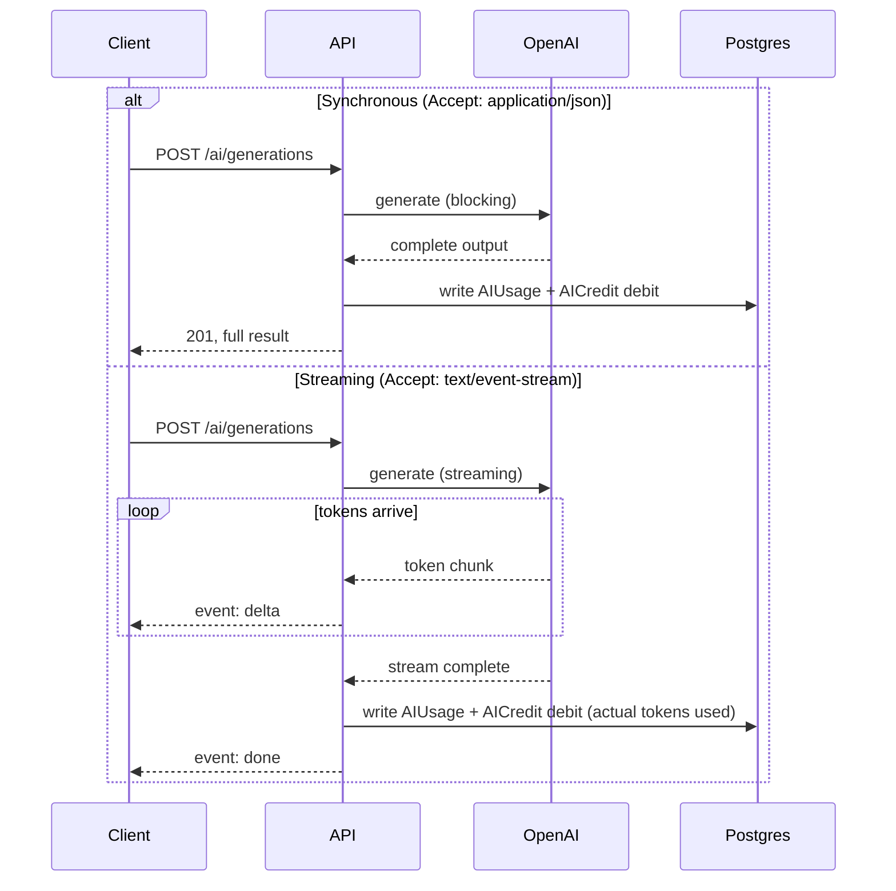

**Validation:** `402 Payment Required` (`BILLING_INSUFFICIENT_CREDITS`) if the workspace's credit balance (§ `AUTH_ARCHITECTURE.md`-adjacent, `docs/DATABASE.md` §4's `AIOverageMode`) would go negative under `HARD_STOP` policy; proceeds (and bills overage, per `docs/DATABASE.md`) under `SOFT_ALLOW`.
**Rate limit:** the dedicated AI-generation tier (§2.19), independent of general API limits and independent of, but compounding with, credit-balance gating.
**Caching:** `GET /ai/generations/{id}` is cacheable (`ETag`, immutable once `status` is terminal); `GET /ai/credits/balance` is explicitly **not** cached (`Cache-Control: no-store`) — it must always reflect the live, just-computed balance, never a stale snapshot, given its direct billing consequence.
**Idempotency:** **required**, not merely recommended, on `POST /ai/generations` — the one endpoint in the API where this document elevates §2.17's optional convention to mandatory, because the consequence of an accidental duplicate (double credit consumption, a duplicate OpenAI charge) is materially worse here than almost anywhere else in the system.
**Future Extensions:** `POST /ai/generations/{id}/cancel` for long-running streams; per-request model/cost estimation preview (`GET /ai/generations/estimate`) before committing credits.

### 5.11 Billing: Subscriptions, Plans, Invoices, Payments

**Purpose:** `docs/DATABASE.md` §3's billing models, exposed with the explicit PCI-avoidance posture of Decision #12.
**Base path:** `/v1/plans` (global), `/v1/workspaces/{workspaceId}/subscription`, `/v1/workspaces/{workspaceId}/invoices`, `/v1/workspaces/{workspaceId}/payments`

| Method | Path | Summary | Perm |
|---|---|---|---|
| `GET` | `/plans` | List the public plan catalog (offset-paginated, small/static, §2.10) | ❌ Public |
| `GET` | `/plans/{id}` | Get a plan | ❌ Public |
| `GET` | `/workspaces/{workspaceId}/subscription` | Get current subscription | `billing.view` |
| `POST` | `/workspaces/{workspaceId}/billing/checkout-session` | Start a plan purchase/change (returns Stripe Checkout URL) | `billing.manage`, `Idempotency-Key` **required** |
| `POST` | `/workspaces/{workspaceId}/billing/portal-session` | Get a Stripe Billing Portal URL (payment method mgmt, cancellation) | `billing.manage` |
| `POST` | `/workspaces/{workspaceId}/subscription/cancel` | Cancel at period end | **Owner** |
| `GET` | `/workspaces/{workspaceId}/invoices` | List invoices | `billing.view` |
| `GET` | `/workspaces/{workspaceId}/invoices/{id}` | Get invoice (incl. `items`) | `billing.view` |
| `GET` | `/workspaces/{workspaceId}/invoices/{id}/pdf` | Redirect to hosted PDF | `billing.view` |
| `GET` | `/workspaces/{workspaceId}/payments` | List payment history | `billing.view` |
| `POST` | `/webhooks/stripe` | **Inbound** Stripe webhook receiver | ❌ Not user-authenticated — Stripe-signature-verified (`AUTH_ARCHITECTURE.md` §3.13) |

**Design Decisions:** there is **no `POST /payments`** — every payment-collecting action redirects to a Stripe-hosted surface (Checkout/Portal) and BizPilot AI's own API only ever *reads* the resulting `Payment`/`Invoice` records, written server-side from the `POST /webhooks/stripe` handler (Decision #12). `Subscription.status`/plan changes are therefore always **eventually consistent** with Stripe (typically sub-second in practice, driven by the webhook) rather than synchronously returned from the checkout-session call — documented explicitly so client UX accounts for a brief "processing" state after redirect-back from Stripe rather than assuming the new plan is active immediately.
**Caching:** `GET /plans` is aggressively cacheable (`Cache-Control: public, max-age=300`) — it's public, workspace-independent data.
**Future Extensions:** self-serve proration preview (`GET /subscription/preview-change?planId=`) before committing to a plan change.

### 5.12 Notifications & Notification Preferences

**Purpose:** `docs/DATABASE.md` §6's `Notification`/`NotificationPreference` — **user-centric, not workspace-nested** (§5.3's `/me` philosophy extended, matching GitHub's own `/notifications` precedent).
**Base path:** `/v1/me/notifications`, `/v1/me/notification-preferences`

| Method | Path | Summary | Perm |
|---|---|---|---|
| `GET` | `/me/notifications` | List (filter: `workspaceId`, `category`, `readAt[isnull]`) | — |
| `POST` | `/me/notifications/{id}/read` | Mark read | — |
| `POST` | `/me/notifications/read-all` | Mark all read (optionally scoped `?workspaceId=`) | — |
| `DELETE` | `/me/notifications/{id}` | Dismiss (client-side hide; does not delete the audit-relevant row) | — |
| `GET` | `/me/notification-preferences` | List (filter: `workspaceId`) | — |
| `PATCH` | `/me/notification-preferences` | Bulk-upsert `{category, channel, enabled}` tuples | — |

**Request/Response notes:** `PATCH /me/notification-preferences` accepts an **array** of preference tuples in one call (a deliberate, small, resource-appropriate exception to "no `PUT`/bulk-by-default," since the entire preference set is naturally edited as one form in the product UI — this is not the same as §2.16's generic `/batch`, it's a purpose-built shape for exactly one resource's exactly-one real usage pattern).
**Realtime note:** `v1` is poll/fetch-based (`GET /me/notifications`, client-side polling or on-focus refetch); a WebSocket/SSE push channel for live notification delivery is a documented **Future Extension**, not built now — deferred because it's materially more operational complexity (persistent connections, presence, horizontal-scaling fan-out) than the launch requirement justifies, and `AUTH_ARCHITECTURE.md` §8.5's event bus is the natural backend for it once built.

### 5.13 Audit Logs & Activity Feed

**Purpose:** `docs/DATABASE.md` §6's `AuditLog` (immutable compliance record) and `Activity` (human-facing feed) — **read-only via this API**; both are written exclusively as a server-internal side effect of other operations, never directly by a client (stated explicitly, since the absence of `POST`/`PATCH`/`DELETE` here is a deliberate security property per `AUTH_ARCHITECTURE.md` §6.1, not an oversight).
**Base path:** `/v1/workspaces/{workspaceId}/audit-logs`, `/v1/workspaces/{workspaceId}/activity`

| Method | Path | Summary | Perm |
|---|---|---|---|
| `GET` | `/audit-logs` | List, cursor-paginated only (§2.10 — never offset, high-volume table) | `audit.view` (Owner/Admin only) |
| `GET` | `/audit-logs/{id}` | Get one entry | `audit.view` |
| `GET` | `/audit-logs/export` | Trigger an async export job (returns a job resource; result delivered as a signed download URL once ready) | `audit.view`, Business/Enterprise plan gate |
| `GET` | `/activity` | List, cursor-paginated (filter: `type`, `actorUserId`) | `team.view` (all members) |

**Filtering:** `audit-logs` by `action`, `entityType`, `actorUserId`, `createdAt[gte]`/`[lte]`.
**Caching:** none — always live (audit data must never be served stale to a compliance reviewer).
**Future Extensions:** SIEM streaming export (`AUTH_ARCHITECTURE.md` §6.1's future improvement) as a `Webhook`-style subscription rather than a pull export, once that need materializes.

### 5.14 API Keys

**Purpose:** `docs/DATABASE.md` §7's `ApiKey`, programmatic access per `AUTH_ARCHITECTURE.md` §3.12.
**Base path:** `/v1/workspaces/{workspaceId}/api-keys`

| Method | Path | Summary | Perm |
|---|---|---|---|
| `GET` | `/api-keys` | List (never returns `hashedKey` or the raw secret — only `keyPrefix`, `name`, `scope`, `status`, `lastUsedAt`) | `apikey.view` |
| `POST` | `/api-keys` | Create — **raw key returned exactly once**, in this response only, never retrievable again | `apikey.manage`; `FULL_ACCESS` scope requires **Owner/Admin** specifically (least-privilege escalation gate) |
| `PATCH` | `/api-keys/{id}` | Rename / change `expiresAt` (cannot change `scope` post-creation — see note) | `apikey.manage` |
| `DELETE` | `/api-keys/{id}` | Revoke | `apikey.manage` |

**Design Decisions:** `scope` is **immutable after creation** — narrowing or widening a live key's scope is deliberately not offered as a `PATCH`; a scope change is modeled as revoke-and-reissue, which forces the new (possibly-narrower, possibly-wider) grant through the same explicit, auditable creation flow rather than a quiet in-place escalation.
**Future Extensions:** per-key rate-limit override, usage analytics (`AUTH_ARCHITECTURE.md` §3.12's future note).

### 5.15 Webhooks

**Purpose:** `docs/DATABASE.md` §7's `Webhook` — the customer's *outbound* subscriptions (distinct from `POST /webhooks/stripe`, §5.11's *inbound* receiver).
**Base path:** `/v1/workspaces/{workspaceId}/webhooks`

| Method | Path | Summary | Perm |
|---|---|---|---|
| `GET` | `/webhooks` | List (never returns `secret` in full — only whether one is set) | `webhook.manage` |
| `POST` | `/webhooks` | Create — **`secret` returned exactly once**, at creation | `webhook.manage` (Owner/Admin) |
| `PATCH` | `/webhooks/{id}` | Update `url`/`eventTypes`/`status` | `webhook.manage` |
| `DELETE` | `/webhooks/{id}` | Delete | `webhook.manage` |
| `POST` | `/webhooks/{id}/rotate-secret` | Issue a new signing secret (old one invalidated) | `webhook.manage` |
| `POST` | `/webhooks/{id}/test` | Send a synthetic test event | `webhook.manage` |

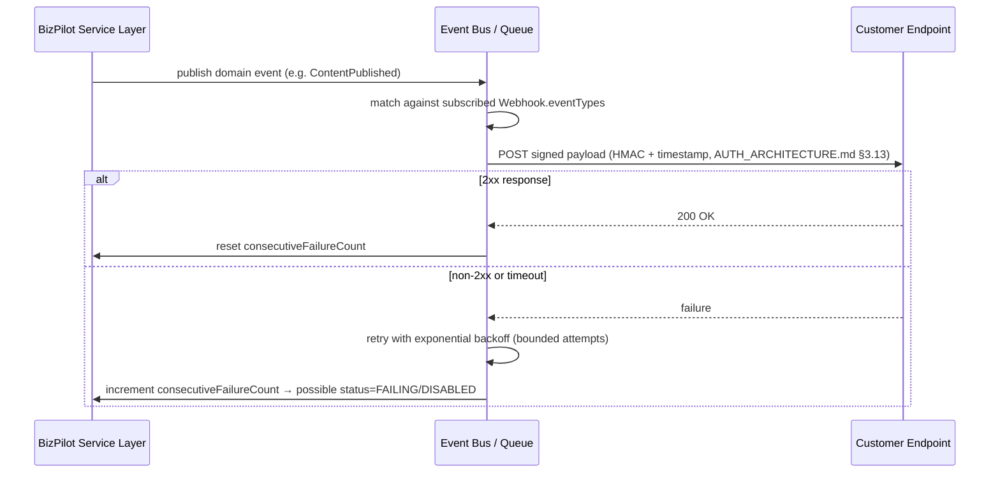

**Future Extensions:** `GET /webhooks/{id}/deliveries` once `WebhookDelivery` (`docs/DATABASE.md` §7's deferred model) ships, giving customers per-attempt delivery logs.

### 5.16 Feature Flags

**Purpose:** `docs/DATABASE.md` §2's `FeatureFlag` — primarily an internal rollout/ops tool; the customer-facing surface is narrow and read-only.
**Base path:** `/v1/workspaces/{workspaceId}/feature-flags`

| Method | Path | Summary | Perm |
|---|---|---|---|
| `GET` | `/feature-flags` | List the **resolved, effective** flags for this workspace (override merged with global default, per `docs/DATABASE.md`'s read pattern) | `workspace.view` (any member — used to gate client UI) |

**Design Decisions:** this is deliberately the **only** route in this group exposed to customers — creating/editing flag definitions and setting per-workspace overrides is an internal-tooling capability (`isSystemAdmin`-gated, likely never exposed on this public-facing API surface at all, consistent with `AUTH_ARCHITECTURE.md` §4.7's treatment of internal-staff capabilities as structurally separate from the customer-facing permission pipeline). No write endpoints are specified here for that reason — not an omission.
**Caching:** short client-side cache is appropriate (`Cache-Control: private, max-age=60`) — flags change rarely and a UI gate being up to 60s stale is an acceptable trade against fetching on every page load.

### 5.17 Search

**Purpose:** Federated, permission-filtered search across resource types within a workspace (§2.13).
**Base path:** `/v1/workspaces/{workspaceId}/search`

| Method | Path | Summary | Perm |
|---|---|---|---|
| `GET` | `/search?q=&types=` | Federated search | Results filtered per-item by the caller's actual permission on that item's type (never returns an item the caller couldn't `GET` directly) |

**Response shape:** results grouped by type, each item carrying `type`, a type-appropriate summary projection (not the full resource — a second `GET` on the item's own endpoint is expected for full detail), and a relevance `score`.
```json
{
  "data": {
    "projects": [ { "id": "...", "name": "...", "score": 0.92 } ],
    "files": [ { "id": "...", "fileName": "...", "score": 0.81 } ],
    "prompts": [ { "id": "...", "title": "...", "score": 0.77 } ]
  },
  "meta": { "requestId": "...", "queryTimeMs": 42 }
}
```
**Security Considerations:** search is the one endpoint most at risk of accidentally leaking cross-permission data if implemented as "search everything, filter after" at scale — the specified behavior is to **apply the permission filter as part of the query itself** (scoped by the caller's `moduleScope`/role) wherever the underlying store supports it, not as a post-hoc filter over an unrestricted result set, precisely to avoid a timing/relevance-ranking side channel revealing the *existence* of inaccessible items even when their content isn't returned.
**Future Extensions:** cross-workspace search for agency users (`docs/PRD.md` §11/§17's noted future rollup) — explicitly deferred, since it requires deliberately punching through the single-workspace isolation boundary `docs/DATABASE.md` §3.1 establishes, and must be designed as its own explicit, permissioned aggregation, never a silent widening of this endpoint.

### 5.18 Health Checks & System Status

**Purpose:** Infrastructure-level liveness/readiness and a public status summary — **not versioned, not tenant-scoped, not authenticated.**
**Base path:** `/healthz` (unversioned, matches common infra/k8s-probe convention), `/v1/status` (versioned, public-facing)

| Method | Path | Summary | Auth |
|---|---|---|---|
| `GET` | `/healthz` | Liveness — process is up | ❌ Public, no version prefix |
| `GET` | `/healthz/ready` | Readiness — dependencies (Postgres, Redis) reachable | ❌ Public |
| `GET` | `/v1/status` | Public component-status summary (for a future status page) | ❌ Public |

**Design Decisions:** liveness/readiness are deliberately **outside** `/v1` — they're infrastructure contracts (load balancer/orchestrator probes), not product API surface, and must never be affected by an API version bump. Both return minimal, non-sensitive bodies (`{"status": "ok"}` / `{"status": "degraded", "checks": {"database": "ok", "redis": "unavailable"}}`) — **never** stack traces, connection strings, or internal topology, even on failure (a health endpoint is a favorite reconnaissance target, and this is a deliberate, security-reviewed minimal-disclosure design, not laziness).
**Rate limits:** exempt from the standard tiers (§2.19) — probed frequently by design (load balancers, uptime monitors) — but still coarsely rate-limited at the Nginx edge layer against abuse.
**Caching:** `Cache-Control: no-store` — always live.

---

## 6. OpenAPI Documentation Strategy

### 6.1 Document Structure

The generated `openapi.yaml` (the actual, tooling-consumed spec — a build artifact this document does not inline in full, per §0.2) follows this top-level shape:

```yaml
openapi: 3.1.0
info:
  title: BizPilot AI API
  version: 1.0.0
  description: |
    See docs/API_CONTRACT.md for full design rationale.
  contact: { url: https://developers.bizpilot.ai }
servers:
  - url: https://api.bizpilot.ai/v1
    description: Production
  - url: https://api.staging.bizpilot.ai/v1
    description: Staging
security:
  - bearerAuth: []
  - cookieAuth: []
tags:
  - name: Authentication
  - name: Workspaces
  - name: Members
  # ... one tag per §5 resource group
components:
  securitySchemes:
    bearerAuth: { type: http, scheme: bearer, bearerFormat: JWT }
    cookieAuth: { type: apiKey, in: cookie, name: __Host-access_token }
  schemas:
    # generated from the same validation schemas the API enforces (§1.6) — single source of truth
  parameters:
    CursorParam: { name: cursor, in: query, schema: { type: string } }
    LimitParam: { name: limit, in: query, schema: { type: integer, default: 20, maximum: 100 } }
  responses:
    ValidationError: { description: 422, content: { application/problem+json: { schema: { $ref: '#/components/schemas/ProblemDetails' } } } }
    # one shared response component per §3's error categories, referenced everywhere rather than repeated
```

### 6.2 Tag Organization

One tag per §5 resource group (18 tags), each with a `description` linking back to this document's corresponding section — keeps the generated interactive docs (Swagger UI / Redoc) navigable at the same granularity this document uses, so a reader moving between the two never has to re-map a mental model.

### 6.3 OperationId Convention

`{verb}{Resource}` in `camelCase`, resource name singular for item operations, plural for collection operations: `listProjects`, `createProject`, `getProject`, `updateProject`, `deleteProject`; action endpoints use their verb phrase directly: `acceptInvite`, `generateAiContent`, `rotateWebhookSecret`. This convention is what client-SDK generators (a likely future tool once §7.2's public API exists) turn directly into method names — chosen now specifically so that future generation produces an SDK that reads naturally (`client.projects.create(...)`, `client.invites.accept(...)`) without a later renaming pass.

### 6.4 Worked Examples (representative, not exhaustive)

**Example 1 — simple CRUD (`GET /workspaces/{workspaceId}/projects`):**
```yaml
/workspaces/{workspaceId}/projects:
  get:
    operationId: listProjects
    tags: [Projects]
    parameters:
      - $ref: '#/components/parameters/WorkspaceIdPath'
      - $ref: '#/components/parameters/CursorParam'
      - $ref: '#/components/parameters/LimitParam'
      - { name: status, in: query, schema: { $ref: '#/components/schemas/ProjectStatus' } }
      - { name: q, in: query, schema: { type: string } }
    responses:
      '200':
        description: A page of projects
        content:
          application/json:
            schema: { $ref: '#/components/schemas/ProjectListResponse' }
            example:
              data:
                - id: "3fa85f64-5717-4562-b3fc-2c963f66afa6"
                  name: "Q2 Product Launch"
                  status: "ACTIVE"
                  createdAt: "2026-08-01T10:00:00.000Z"
              pagination: { nextCursor: "eyJpZCI6Ii4uLiJ9", hasMore: true, limit: 20 }
      '401': { $ref: '#/components/responses/AuthError' }
      '403': { $ref: '#/components/responses/AuthzError' }
```

**Example 2 — action endpoint with idempotency (`POST /workspaces/{workspaceId}/ai/generations`):**
```yaml
/workspaces/{workspaceId}/ai/generations:
  post:
    operationId: createAiGeneration
    tags: [AI]
    parameters:
      - $ref: '#/components/parameters/WorkspaceIdPath'
      - { name: Idempotency-Key, in: header, required: true, schema: { type: string, format: uuid } }
      - { name: Accept, in: header, schema: { type: string, enum: [application/json, text/event-stream] } }
    requestBody:
      required: true
      content:
        application/json:
          schema: { $ref: '#/components/schemas/CreateAiGenerationRequest' }
    responses:
      '201':
        description: Generation complete (synchronous mode)
        content:
          application/json: { schema: { $ref: '#/components/schemas/AiGeneration' } }
          text/event-stream: { schema: { $ref: '#/components/schemas/AiGenerationStreamEvent' } }
      '402': { $ref: '#/components/responses/InsufficientCreditsError' }
      '409': { $ref: '#/components/responses/IdempotencyConflictError' }
      '422': { $ref: '#/components/responses/ValidationError' }
```

**Example 3 — webhook payload documentation (`components.webhooks`, OpenAPI 3.1's native webhook-description support):**
```yaml
webhooks:
  contentPublished:
    post:
      requestBody:
        content:
          application/json:
            schema: { $ref: '#/components/schemas/ContentPublishedEvent' }
            example:
              id: "evt_01HXYZ"
              type: "CONTENT_PUBLISHED"
              createdAt: "2026-08-07T14:32:05.123Z"
              data: { projectId: "...", fileId: "..." }
      responses:
        '200': { description: Acknowledged }
```

**Error example (shared across all operations via `components.responses`):**
```json
{
  "type": "https://developers.bizpilot.ai/errors/authz_insufficient_permission",
  "title": "Insufficient Permission",
  "status": 403,
  "detail": "This action requires the 'team.manage' permission.",
  "code": "AUTHZ_INSUFFICIENT_PERMISSION",
  "requestId": "req_01HXYZ456",
  "traceId": "00-4bf9...-01"
}
```

**Pagination example:** shown fully in §2.10.

**Authentication example (curl, illustrative only — not implementation):**
```
GET /v1/workspaces/{id}/projects
Authorization: Bearer eyJhbGciOi...
```
```
GET /v1/workspaces/{id}/projects
Cookie: __Host-access_token=eyJhbGciOi...
```

OpenAPI 3.1's native JSON Schema compatibility (a key reason `3.1` was specified over `3.0`) is used directly for request/response schemas — no lossy translation layer between "what the validator enforces" and "what the spec documents" (reinforcing §1.6's single-source-of-truth design).

---

## 7. Future Extensions

### 7.1 Future Mobile & Desktop Apps

No API changes required to *support* these — they're already first-class per §4.1's dual auth-delivery design and §2.14's field-selection convention (bandwidth-conscious by default). The one genuinely mobile-specific future addition: push-notification device-token registration (`POST /me/devices` — a new, small resource, not a redesign of anything above) once `AUTH_ARCHITECTURE.md` §6/`docs/DATABASE.md`'s `NotificationChannel.PUSH` is actually implemented end-to-end.

### 7.2 Future Public API / Developer Platform

The `ApiKey` resource (§5.14) already *is* the foundation — a third-party integrator authenticates identically to how BizPilot's own frontend does for server-to-server calls today. Becoming a genuine public developer platform additionally needs: a relaxed, per-partner CORS posture (§4.4, deliberately not built into `v1`'s strict allowlist); published, versioned SDKs generated from the OpenAPI spec (§6.3's `operationId` convention exists specifically to make this mechanical); a developer portal with interactive docs (Swagger UI/Redoc, directly fed by §6's spec); and formal rate-limit tiers for partner keys independent of the workspace-plan tiers in §2.19. None of this requires a breaking change to anything specified above — it's additive surface area, which is the entire point of designing the core contract this disciplined from day one.

### 7.3 GraphQL / BFF Layer — Considered and Deferred

A GraphQL layer (either replacing REST or as a Backend-for-Frontend sitting in front of it) was evaluated (Decision #1) and deferred, not rejected outright. It would most plausibly earn its keep as a **BFF specifically for a future mobile app** (reducing round trips for screen-specific data shapes) rather than as the primary API — if built, it would sit *behind* this REST API's service layer (§1.1), never replace the service layer's own contract, keeping this document's REST surface as the stable, durable contract regardless of what sits in front of it for any one client.

### 7.4 Microservices Routing Evolution

Directly continues `AUTH_ARCHITECTURE.md` §8.6's three-phase extraction plan: today, one Express process routes every resource group in §5; as bounded contexts (Identity & Access first, per that document) extract into separate services, this API's **external contract does not change** — an API gateway/reverse proxy takes over routing `/v1/auth/*` to the extracted Identity service while every other path continues to the monolith, entirely invisible to clients. This is the direct payoff of §1.1's strict layering and §5's resource grouping already mirroring `docs/DATABASE.md`'s bounded contexts — the API design and the eventual service boundaries were drawn along the same lines on purpose.

---

## 8. Consolidated Risks & Trade-offs

| Risk / Trade-off | Severity | Mitigation | Residual risk accepted |
|---|---|---|---|
| Cross-tenant `404`-masking (§2.21) makes legitimate "resource genuinely doesn't exist" and "you can't see it" indistinguishable to the caller | Low | Deliberate, matches `AUTH_ARCHITECTURE.md`'s anti-enumeration posture | Slightly worse client-side error messaging in exchange for not leaking tenant data existence — judged the correct trade |
| SSE streaming (§5.10) is stateful per-connection, a different scaling profile than the rest of the (fully stateless) API | Medium | Bounded by the same short-lived nature as any HTTP request; no session affinity required since the connection itself, not server memory, carries state | At extreme AI-generation concurrency, connection-count limits per instance become a real capacity-planning input — flagged for load testing before general availability |
| Two-phase file upload (§5.6) requires the client to correctly complete both phases | Low | Orphaned `storageKey`s (phase 1 done, phase 2 never called) are swept by a scheduled cleanup job (`AUTH_ARCHITECTURE.md` §8.4-style background job) | Acceptable, standard pattern (identical to S3 presigned-upload flows used industry-wide) |
| `Idempotency-Key` cache (Redis, §2.17) unavailability | Medium | Falls back to executing the request normally (best-effort idempotency, not a hard guarantee) rather than blocking all writes | Matches `AUTH_ARCHITECTURE.md` §8.1's "Redis is cache, not source of truth, degrade gracefully" philosophy exactly |
| Federated search (§5.17) permission-filtering complexity across many resource types | Medium | Filter-at-query-time discipline stated explicitly as a hard requirement, not an implementation detail left to chance | Requires ongoing vigilance as new searchable resource types are added — each addition must implement the same filter-at-source discipline |
| No `v1` GraphQL/BFF means every future client (mobile especially) pays REST's over/under-fetching cost | Low–Medium | §2.14 (sparse fieldsets) and §2.15 (expansion) directly mitigate the common cases | Accepted per §7.3 — revisit specifically when a mobile app's real usage data justifies a BFF, not speculatively now |

---

*End of API Contract & Design Specification.*
