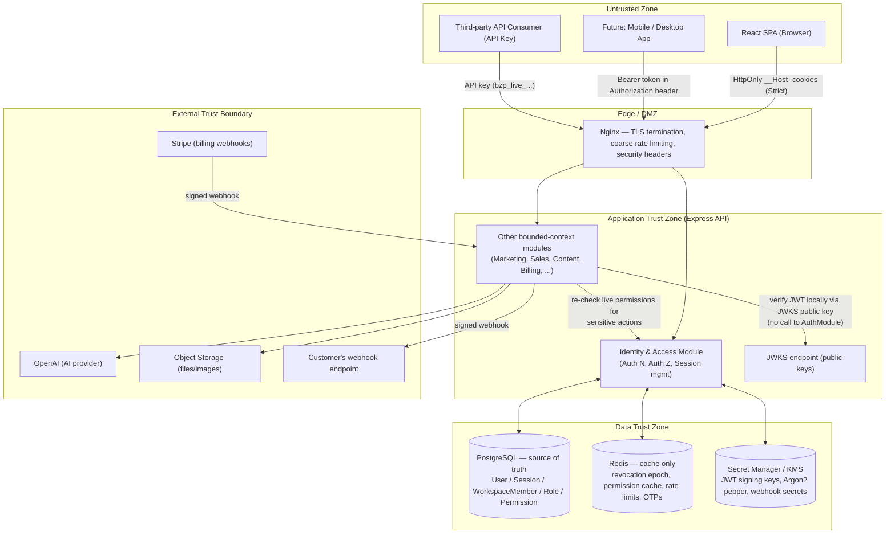
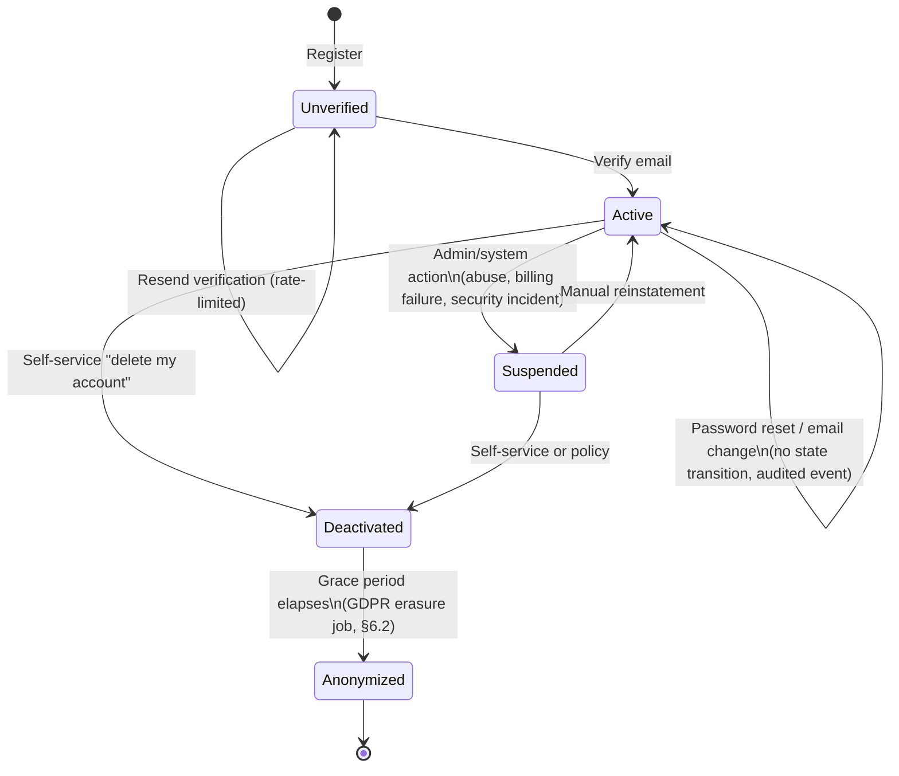
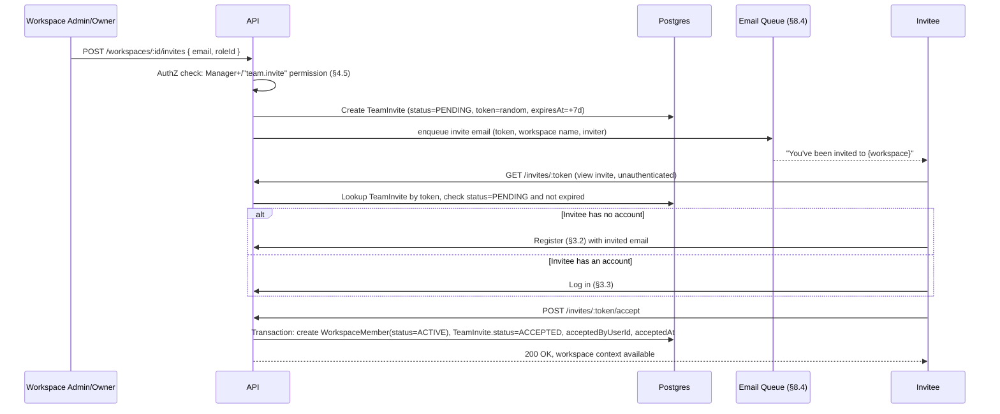
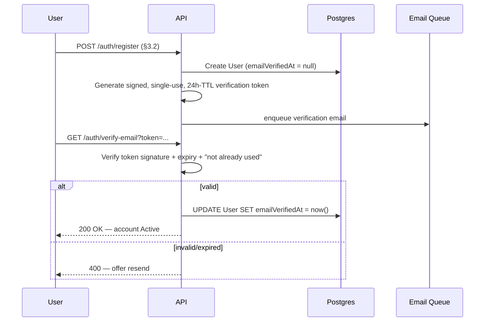
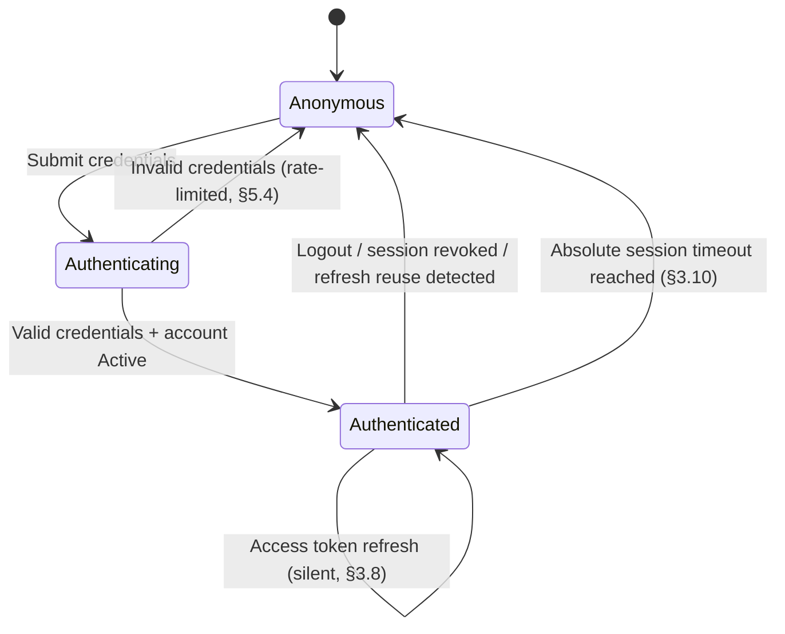
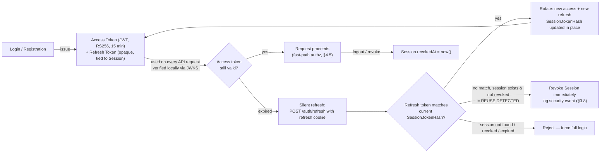
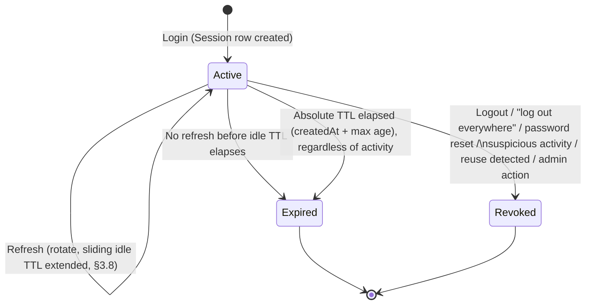
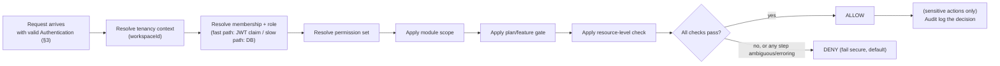
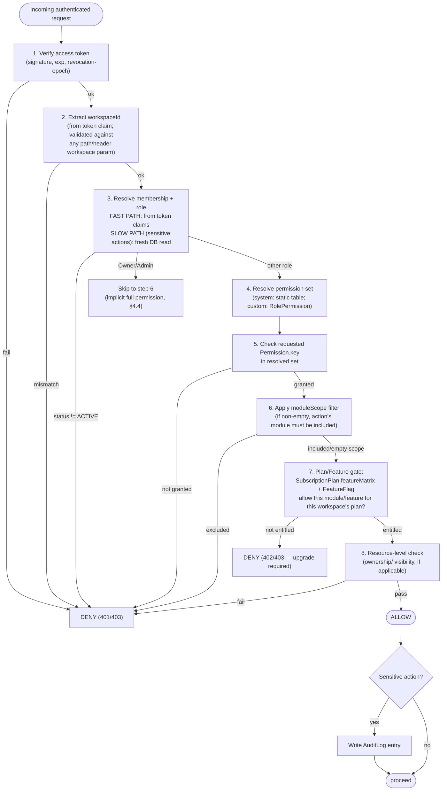

# BizPilot AI — Authentication & Authorization Architecture

**Author:** Principal Security Architect / Staff Backend Engineer / Enterprise Identity Architect
**Status:** v1.0 — Architecture Design Document (pre-implementation)
**Audience:** Senior backend engineers implementing the system; security reviewers; future team members
**Depends on:** [`docs/DATABASE.md`](DATABASE.md) / [`backend/prisma/schema.prisma`](../backend/prisma/schema.prisma) — **this document treats the existing schema as immutable.** Every mechanism described here is designed to work with the `User`, `Session`, `Workspace`, `WorkspaceMember`, `Role`, `Permission`, `RolePermission`, `TeamInvite`, `ApiKey`, `Webhook`, `AuditLog`, `FeatureFlag`, `SubscriptionPlan`, and `Settings` models exactly as they are defined today. Where a future capability would benefit from a new column or table, it is explicitly marked **(future schema extension, not required today)** rather than silently assumed.

---

## 0. Executive Summary

BizPilot AI's identity system is built on four pillars:

1. **Stateless, short-lived, workspace-scoped JWT access tokens** (RS256), verified in-process by any service with only a public key — no auth-service round trip on the hot path, which is what makes this design credible at millions-of-users scale and compatible with a future microservices split.
2. **Stateful, rotating, opaque refresh tokens** bound to a durable `Session` row — because the one thing a stateless token can never do well is get revoked before it expires, and refresh-token revocability is where BizPilot AI's actual security posture lives.
3. **A two-axis authorization model** — RBAC (*is this user allowed to do X*) composed with subscription/feature gating (*does this workspace's plan even include X*) — evaluated through one shared, fail-secure pipeline (§4.5) rather than scattered ad-hoc checks.
4. **A Redis-backed revocation layer that is a cache, never a source of truth** — Postgres remains authoritative for every security-relevant fact, so the system degrades gracefully (slightly slower, not insecure or down) if Redis is unavailable.

### 0.1 Scope

This document covers everything under "Identity," "Authentication," "Authorization," "Security," "Enterprise Readiness," "Future Architecture," and "Operational Architecture" as scoped by the assignment. It is an architecture document: it specifies *what* the system does, *why*, and the *contracts* between its parts — not endpoint signatures, code, or SQL.

### 0.2 Non-Goals (out of scope for this document)

- Redesigning the database. Every mechanism here is mapped onto the existing schema; extension points are called out explicitly as future migrations.
- Billing/Stripe integration logic (covered only where it intersects auth — plan-based feature gating).
- Frontend component design (covered only where it constrains the security model — token storage location).
- Concrete cryptographic library selection or code.

### 0.3 Assumptions

- **A1.** The API is a single Node.js/Express monolith at launch, deployed behind Nginx, with a path to splitting bounded contexts into services later (§8.6). Auth is designed as an internally clean bounded context from day one specifically so that split is cheap later.
- **A2.** The primary client is the React SPA (first-party, same organization, cookie-based auth). Mobile/desktop clients (§ throughout, marked "future") are a different trust profile (public clients) and use the token-in-response-body pattern, not cookies.
- **A3.** Redis is provisioned but not yet load-bearing for correctness — "future-ready" per the stated stack, used here as a performance/UX cache with defined graceful-degradation behavior if absent.
- **A4.** `Workspace.slug` may become a routing subdomain later (`{slug}.bizpilot.ai`); the cookie strategy (§5.2) is chosen to be safe under that assumption even though the assumption isn't confirmed.
- **A5.** BizPilot AI is a "Bring Your Own Auth" system at launch (email + password) with SSO/MFA as fast-follow, not launch-blocking — consistent with the PRD's plan-gated feature rollout.

### 0.4 Design Principles Applied

| Principle | How it shows up concretely in this design |
|---|---|
| Security First | Argon2id, RS256, HttpOnly+`__Host-` cookies, default-deny authorization |
| Zero Trust | Every request is re-authenticated and re-authorized regardless of network origin; sensitive actions never trust JWT claims alone (§4.5) |
| Least Privilege | Module-scoped `WorkspaceMember`, atomic `Permission` composition, internal admin access is a proposed time-boxed grant, not a standing flag (§4.7) |
| Separation of Concerns | Authentication (who are you) and Authorization (what can you do) are two independent pipelines composed at the request boundary, never conflated |
| Defense in Depth | Password hashing + rate limiting + lockout + breach-list checking all independently mitigate credential attacks; cookie flags + CSRF token + SameSite all independently mitigate CSRF |
| OWASP Top 10 | Directly addressed per-topic in §5 |
| Secure by Default | New workspaces/members start at least-privilege; MFA/SSO additive, never weakening the default path |
| Fail Secure | Ambiguous/erroring authorization checks deny by default (§4.5); Redis outage narrows to "trust bounded by short TTL," never to "skip verification" |
| Immutable Audit Trail | Built directly on the existing `AuditLog` model (no `updatedAt`, append-only by schema design) |
| Horizontal Scalability | Stateless access-token verification; Session/Permission state either in Postgres (authoritative) or Redis (cache), never in-process memory |
| Clean Architecture / DDD | Auth modeled as a bounded context (Identity & Access) with its own domain rules, independent of Sales/Support/Marketing bounded contexts (per `docs/DATABASE.md` §3.7) |
| Future Microservices Compatibility | RS256 + JWKS means any future service verifies tokens without calling the auth service (§8.6) |

### 0.5 Architecture Decision Log

The single highest-value table in this document — every major "why" in one place. Full reasoning for each row lives in the referenced section.

| # | Decision Area | Chosen | Rejected Alternative(s) | Why (short) | § |
|---|---|---|---|---|---|
| 1 | Access token format | Short-lived JWT (RS256), 15 min TTL | Opaque token, DB-verified every request | Stateless verification scales horizontally with zero DB/cache hit on the hot path | 3.7 |
| 2 | Refresh token format | Opaque, composite (`sessionId.secret`), hash stored in existing `Session.tokenHash` | Refresh token as a JWT | JWTs can't be revoked before expiry without a denylist; DB-backed opaque tokens are instantly revocable | 3.8 |
| 3 | Refresh rotation model | Rotate-in-place: `Session.id` stable for the session's life, `tokenHash` mutates each rotation | New `Session` row per rotation linked by a `familyId` | The schema has no `familyId`/`replacedBy` column and must not be redesigned; rotate-in-place gets identical reuse-detection guarantees at zero schema cost, and doubles as the device-session record | 3.8, 3.11 |
| 4 | JWT signing algorithm | RS256 (asymmetric) | HS256 (symmetric) | Any future microservice/resource server verifies tokens with only a public key (JWKS) — no shared-secret distribution | 3.7, 5.1 |
| 5 | Access token content | Workspace-scoped (`workspaceId`, `roleKey`, permission snapshot) | Workspace-agnostic, resolved fresh every request | Avoids a DB hit on the common path; staleness bounded by 15 min TTL + Redis revocation-epoch for immediate invalidation | 3.7, 4.5 |
| 6 | Auth cookie shape | `__Host-`-prefixed, `Path=/`, `HttpOnly`, `Secure`, `SameSite=Strict` | Narrow `Path`-scoped cookie without `__Host-` | `__Host-` and narrow `Path` scoping are mutually exclusive per spec; host-locking (blocks subdomain cookie injection) is the higher-value protection, esp. given A4 | 5.2 |
| 7 | Password hashing | Argon2id | bcrypt | Memory-hardness resists GPU/ASIC cracking far better than bcrypt's fixed cost factor; supersedes the placeholder `bcrypt` dependency from initial project scaffolding | 5.8 |
| 8 | Redis role | Cache only (revocation epoch, permission-set cache, rate limits, OTP storage) | Redis as primary session store | Postgres stays authoritative — system degrades gracefully, never insecurely, if Redis is down | 8.1, 8.2 |
| 9 | Concurrent-rotation race | Postgres row lock (`SELECT ... FOR UPDATE`) inside the rotation transaction | Redis distributed lock | Correct from day one with zero new infrastructure; Redis locking is a documented future step for multi-region writes | 3.8, 8.1 |
| 10 | Internal staff access to tenant data | Time-boxed, audited "Support Access Grant" **(future control)** | Standing, silently-usable `isSystemAdmin` flag | Least Privilege + Zero Trust demand internal access be explicit, logged, and ideally tenant-visible | 4.7 |
| 11 | CSRF defense | `SameSite=Strict` cookies + custom-header requirement + double-submit token on state-changing requests | Rely on `SameSite` alone | Defense in depth — protects against `SameSite` bypass bugs and legacy browsers | 5.3 |
| 12 | MFA/SSO/Passkeys | Deferred, additive, schema-compatible extension points identified now | Building a generic pluggable auth-provider framework at launch | YAGNI — the extension points (§7) are cheap to add later precisely because the core model (opaque sessions, RS256 tokens, nullable `passwordHash`) was already designed to allow it | 7 |

### 0.6 Diagram Index

| Diagram | Location |
|---|---|
| High-level component & trust-boundary diagram | §1.1 |
| Identity lifecycle (state diagram) | §2.4 |
| Invitation sequence | §2.6 |
| Email verification sequence | §2.7 |
| Password reset sequence | §2.8 |
| Registration sequence | §3.2 |
| Login sequence | §3.3 |
| Token lifecycle (issue → use → rotate → expire/revoke) | §3.6 |
| Refresh token rotation & reuse-detection sequence | §3.8 |
| Session lifecycle (state diagram) | §3.10 |
| Workspace switching sequence | §2.3 |
| Permission evaluation pipeline (flowchart) | §4.5 |
| Authorization lifecycle (overview) | §4.1 |
| Future auth microservice extraction path | §8.6 |

---

## 1. High-Level Architecture

### 1.1 Component Diagram & Trust Boundaries



**Trust boundary reasoning:**
- The **Untrusted Zone** is anything the client controls — this is why access tokens are short-lived and refresh tokens are HttpOnly (removing them from JavaScript's reach even on the legitimate client).
- **Edge** terminates TLS and applies coarse, IP-level protections (§5.4) before a request ever reaches application code — first line of defense, not the only one (defense in depth).
- Inside the **Application Trust Zone**, `AppModules` (Marketing/Sales/Content/etc.) verify JWTs **locally** using the public key from `JWKS` — this is the crux of the "future microservices compatible" requirement: those modules never need network access to `AuthModule` to authenticate a request, only to re-verify live permissions for sensitive actions (§4.5) or to handle session/token lifecycle events (login, refresh, logout), which remain `AuthModule`'s exclusive responsibility.
- **Data Trust Zone**: Postgres is the only place where a security decision's *ground truth* lives. Redis is explicitly a cache — nothing in this system is ever correct-but-only-in-Redis.

---

## 2. Identity Architecture

### 2.1 Global User Model

**Purpose:** Represent one human (or, in the future, one machine identity) with exactly one account, independent of any workspace, matching the existing `User` model.

**Design Decisions:**
- `User` is the **root identity**. It is deliberately thin — authentication material (`passwordHash`), verification state (`emailVerifiedAt`), and profile basics only. Nothing workspace-specific lives here; that's `WorkspaceMember`'s job (§2.2). This separation is what makes multi-workspace membership, workspace switching, and the agency use case "just work" without special-casing.
- `passwordHash` is nullable **by original database design** — this was already correctly anticipated for SSO-only accounts (§7) before this document was written; no schema change is needed to support "sign in with Google only, no password" users.
- `email` is the sole login identifier (§2.10 — no username). It is unique at the database level and is treated as case-insensitively unique at the application level (stored lowercased at write time) — a documented reliance on app-layer normalization until a `citext` migration (a `docs/DATABASE.md` §1.3-flagged future improvement) lands.
- `isSystemAdmin` marks internal BizPilot staff. It is **not** a workspace role and grants no workspace access by itself — see §4.7 for why standing global admin flags are treated as a Zero-Trust risk to be constrained further.

**Security Considerations:** the `User` row is the single point of compromise that matters most (password hash, email, recovery path) — it gets the strictest access controls of any table (only the Identity & Access module writes to it; every write is audit-logged).

**Trade-offs:** Storing `email` as the login identifier (vs. a separate immutable `username`) trades "handle stability" (an email can change) for simplicity and matches how the product is actually used (B2B SaaS login, not a social handle system). **Rejected alternative:** a separate mutable `username` field — deferred because nothing in the product surface (no public profiles, no @mentions across workspaces) currently needs one; §2.10 documents the reintroduction path.

**Scalability:** `User` is looked up by `email` (unique index) on login and by `id` (PK) everywhere else — both O(1). At millions of users this table is the first candidate for read replicas (profile reads) while writes (rare: registration, password change) stay on the primary.

**Failure Scenarios:** a leaked `User` table (full DB compromise) exposes hashed passwords only (Argon2id, §5.8) and no plaintext recovery material — email verification/reset tokens are single-use and hashed at rest too (§2.7, §2.8), not stored as recoverable secrets.

**Best Practices:** never log `passwordHash` or raw tokens, even at DEBUG level; every mutation to `User` sensitive fields (email, password) triggers a notification to the user's *old* email (§2.9) as a tamper-evidence signal, independent of the audit log.

**Future Improvements:** `AuthIdentity`/`OAuthAccount` child table for multi-provider SSO (§7.1 — already flagged as a future scalability note in the database design, reused here); optional `username`/handle field if public profiles ever ship; `citext` migration for true case-insensitive email uniqueness.

### 2.2 Organizations, Workspaces & Membership

**Purpose:** Model "who can act as what, where" — the core of BizPilot AI's multi-tenancy.

**Design Decisions:** BizPilot AI does not have a separate "Organization" entity above `Workspace` in the current schema — `Workspace` **is** the tenant/organization boundary (per `docs/DATABASE.md` §3.1). A `User`'s relationship to a `Workspace` is entirely captured by `WorkspaceMember` (role, status, module scope). This means:
- **Global identity, local access:** one `User`, arbitrarily many `WorkspaceMember` rows, each with an independent `Role`. An agency employee can be `Owner` in one client workspace and `Member` in another, simultaneously, with zero special-casing — this *is* the "Organizations" and "Multiple Workspaces" requirement, satisfied by composition rather than a new concept.
- `WorkspaceMember.status` (`INVITED`/`ACTIVE`/`SUSPENDED`/`REMOVED`) is the authoritative gate — a `SUSPENDED` member fails authorization even with a perfectly valid, unexpired access token (checked at both the fast-path claim level via revocation epoch, §4.5, and the slow-path DB level for sensitive actions).
- `WorkspaceMember.moduleScope` (a string array) implements least-privilege at the *feature-module* granularity beneath the role level — e.g., a `Manager` scoped to `["sales"]` gets full Sales access and no Support/Marketing access, without needing a distinct role per module combination.

**Security Considerations:** membership status changes (suspend, remove) must take effect **fast** — this is precisely why the Redis revocation-epoch mechanism (§4.5, §8.1) exists: without it, a suspended member could keep acting for up to the access token's full 15-minute TTL.

**Trade-offs:** **Rejected alternative:** introducing a distinct `Organization` entity as a parent of multiple `Workspace`s (a "company" containing several "workspaces"). Rejected because the PRD's actual multi-tenancy need (agencies managing many clients) is already fully served by one `User` holding many independent `WorkspaceMember`s — adding an `Organization` layer would be structure without a corresponding requirement (YAGNI), and it isn't in the existing schema to redesign around.

**Scalability:** membership checks are the single most frequent authorization query in the system; §4.5's caching strategy exists primarily for this reason.

**Failure Scenarios:** if a `WorkspaceMember` row is deleted/soft-deleted while a session is active, the user's *next* sensitive-action check or *next* token refresh (whichever comes first) will fail closed — they are never silently left with access beyond the bounded staleness window.

**Best Practices:** always resolve membership by the *live* `WorkspaceMember.status`, never assume "session exists" implies "still a member."

**Future Improvements:** if a genuine "Organization owns multiple Workspaces with shared billing" requirement emerges, it layers on top of the existing model as a new parent table without touching `WorkspaceMember`'s shape.

### 2.3 Workspace Switching

**Purpose:** Let a user move between the workspaces they belong to without re-authenticating.

**Design Decisions:** Because the access token is workspace-scoped (Decision #5), "switching workspace" is architecturally a **token re-issuance**, not a new login. The refresh token / `Session` is **not** workspace-scoped (a `Session` represents "this device is logged in as this user," full stop) — only the short-lived access token carries `workspaceId`. Switching workspace therefore:
1. Validates the target `WorkspaceMember` exists and `status = ACTIVE` for the current user.
2. Issues a **new access token** scoped to the target workspace (same `Session`, same refresh token — no re-login).
3. Does **not** rotate the refresh token (no security boundary is crossed — same device, same authenticated user).

```mermaid
sequenceDiagram
    participant U as User (Browser)
    participant API as API (Auth Module)
    participant DB as Postgres

    U->>API: POST /auth/workspace-switch { workspaceId }
    Note over API: Verify current access token (any workspace)
    API->>DB: SELECT WorkspaceMember WHERE userId, workspaceId
    DB-->>API: membership row (status, role, moduleScope)
    alt not found or status != ACTIVE
        API-->>U: 403 Forbidden
    else valid membership
        API->>API: Mint new access token (workspaceId, roleKey, permissions)
        API-->>U: Set-Cookie __Host-access_token (new); 200 OK { workspace, role }
    end
```

**Security Considerations:** workspace switching **re-validates membership from the database every time** (no fast path here) — it's a low-frequency, deliberate user action, so the extra DB round trip is free from a UX standpoint and necessary from a security standpoint (never trust a stale claim for a context change).

**Trade-offs:** **Rejected alternative:** a single "super-token" embedding *all* of a user's workspace memberships and permissions at once, letting the client pick a workspace purely client-side with no server round trip. Rejected — it would bloat the token with every workspace a power user belongs to (unbounded token size for agency users with dozens of clients), and it would make revoking access to *one* workspace impossible without invalidating the user's access to *all* workspaces.

**Scalability:** O(1) indexed lookup (`WorkspaceMember.[workspaceId, userId]` unique index already exists).

**Failure Scenarios:** switching to a workspace the user was just removed from correctly 403s — this is the same code path as any other request's membership check, not a special case, which is itself a best practice (one authorization pipeline, no parallel logic to drift out of sync).

**Best Practices:** the frontend persists "last active workspace" client-side (a preference, not a security control) to restore context on next login; the server never trusts that preference without re-validating membership.

**Future Improvements:** a "recent workspaces" quick-switcher backed by a small Redis-cached list per user for agencies with many workspaces.

### 2.4 Identity Lifecycle

**Purpose:** Define every state a `User` account can be in and the legal transitions between them.



**Design Decisions:** mapped onto existing columns, not new state — `Unverified` = `emailVerifiedAt IS NULL`; `Active` = `emailVerifiedAt IS NOT NULL AND deletedAt IS NULL` (and, implicitly, no active suspension flag — see Future Improvements); `Deactivated`/soft-deleted = `deletedAt IS NOT NULL`; `Anonymized` = `deletedAt IS NOT NULL` **and** PII fields overwritten (§6.2) — same row, no new state column required. An `Unverified` user **can** log in (so they aren't locked out of fixing a typo'd email or resending verification) but is blocked from workspace-creating/sensitive actions by the authorization pipeline (§4.5) until verified — this is a policy check, not a login-time block, keeping the authentication and authorization concerns cleanly separated (Separation of Concerns).

**Security Considerations:** `Suspended` (§ Future Improvements below — not a distinct column today) must be checkable fast and must forcibly invalidate all live sessions, unlike a routine permission change — implemented as an immediate Redis revocation-epoch bump (§8.1) plus best-effort revocation of all `Session` rows for that user.

**Trade-offs:** The diagram shows `Suspended` as a distinct state, but the **current schema has no explicit suspension column on `User`** (only `deletedAt` and, at the workspace-membership level, `WorkspaceMemberStatus.SUSPENDED`). **This is called out deliberately, not glossed over:** account-level suspension (as opposed to membership-level suspension) is a **(future schema extension, not required today)** — until it exists, platform-level abuse/fraud response uses the blunter but already-available tool of revoking all sessions + soft-deleting the account, with reinstatement being "un-delete." This is a real, documented gap between the ideal lifecycle and what ships first, not an oversight.

**Scalability:** lifecycle checks are part of every authentication, so they're folded into the same fast-path claim (§4.5), not a separate query.

**Failure Scenarios:** a user stuck `Unverified` indefinitely (never clicks the link) is a normal, expected state, not a failure — verification tokens simply expire and can be resent (§2.7), rate-limited to prevent email-bombing abuse.

**Best Practices:** every lifecycle transition is an `AuditLog` entry (`entityType = "User"`) — including self-service ones — so "when did this account get verified/deactivated" is always answerable.

**Future Improvements:** a first-class `User.status` enum (`ACTIVE`/`SUSPENDED`/`PENDING_DELETION`) as a dedicated future migration once account-level (not just membership-level) suspension becomes a real product requirement (e.g., ToS enforcement at the platform level).

### 2.5 Guest Users

**Purpose:** Let an external party (e.g., a client reviewing one report) get scoped access without becoming a full workspace member.

**Design Decisions:** Guest access is modeled as the existing `Role.key = "GUEST"` **system role** (already anticipated in the permission-system design of `docs/PRD.md` §10) combined with a `WorkspaceMember` row scoped via `moduleScope` to exactly the resource(s) shared — e.g., a single Project. A Guest is **still a `User`** (they must have an account to be issued a session) — BizPilot AI does not implement anonymous/unauthenticated resource sharing at launch; a Guest goes through the same lightweight registration as anyone invited (§2.6), just lands with the most restrictive role.

**Security Considerations:** Guest is authorization's floor, not a separate authentication mechanism — this keeps the auth pipeline single and uniform (no parallel "public link" auth path to secure separately, which is a common source of vulnerabilities in other products' "share link" features).

**Trade-offs:** **Rejected alternative:** unauthenticated, token-in-URL "share links" (no login required). Rejected at this stage for security posture (URL-embedded tokens leak via browser history, referrer headers, and shoulder-surfing) — deferred as a **future, explicitly scoped, single-resource, view-only capability** if product need justifies it, built as its own narrow mechanism (a signed, resource-specific, short-TTL token — the same pattern as email verification) rather than widening the Guest role's meaning.

**Scalability / Failure Scenarios / Best Practices:** identical to standard `WorkspaceMember` (§2.2) since Guest is not architecturally distinct — this reuse is itself the design win.

**Future Improvements:** scoped, unauthenticated view-only share links as a separate, narrowly-defined mechanism if/when required.

### 2.6 Invitations

**Purpose:** Bring a new or existing user into a workspace with a specific role, matching the existing `TeamInvite` model.



**Design Decisions:** `TeamInvite.token` is a high-entropy random value (not a JWT — no need for it to be self-contained or verifiable offline; it's a one-time DB lookup key, same philosophy as the refresh token). Accepting an invite is a single DB transaction (create `WorkspaceMember` + update `TeamInvite`) so a crash mid-operation can never leave a "half-accepted" invite. If the invitee's account email doesn't yet exist, registration is required first — the invite email is **pre-verified proof of email ownership by construction** (the invite itself only works if the click came from that inbox), a nuance that lets registration-via-invite optionally **skip the separate email-verification step** (§2.7) since equivalent proof was already established.

**Security Considerations:** invite tokens are single-use (`status` transitions out of `PENDING` on accept/decline/expiry — a second accept attempt fails); `[workspaceId, email]` is indexed specifically to support the "already invited?" duplicate-prevention check (§ `docs/DATABASE.md`).

**Trade-offs:** **Rejected alternative:** allowing an invite to be accepted by any authenticated user regardless of their account email matching the invited email. Rejected — it would let a user guess/intercept an invite link and self-escalate into a workspace they weren't meant to join; the accept flow strictly requires the logged-in user's `email` to match `TeamInvite.email`.

**Scalability:** invite emails go through the async email queue (§8.4), never sent synchronously in the request path.

**Failure Scenarios:** expired invites (`status` still `PENDING` but `expiresAt` passed) are treated as invalid at accept-time and require the inviter to resend (a fresh `TeamInvite` row) — old tokens are never resurrected.

**Best Practices:** invite acceptance is audit-logged with both `invitedByUserId` and `acceptedByUserId` for a complete provenance trail.

**Future Improvements:** bulk CSV invite; domain-verified auto-join for Enterprise SSO workspaces (§7.3) — both noted in `docs/PRD.md` §8.9/§8.2 and require no schema change, just more `TeamInvite` rows generated programmatically.

### 2.7 Email Verification & Account Activation

**Purpose:** Prove the registrant controls the email address they registered with, and gate account "activation" (§2.4) on that proof.



**Design Decisions:** the verification token is a **signed, stateless, single-use-by-convention token** (HMAC or asymmetric signature over `{userId, purpose: "email_verify", exp}`), *not* a DB-stored row — chosen deliberately to avoid needing a new table for something this narrow. "Single-use" is enforced by the transition it causes being idempotent-safe-but-one-way: once `emailVerifiedAt` is set, re-submitting the same (still cryptographically valid) token is a harmless no-op, not a security hole — an important distinction from tokens that grant an *action* (like password reset) versus tokens that grant a *state confirmation* (like this one), where replay has no adverse effect.

**Security Considerations:** the token purpose (`"email_verify"`) is embedded and checked so a verification-purpose token can never be replayed against the password-reset endpoint or vice versa — a general rule applied to every signed single-purpose token in this system (§2.8 magic-link-style tokens follow the same rule).

**Trade-offs:** **Rejected alternative:** a numeric one-time code (like a 6-digit SMS code) instead of a link. Rejected for email verification specifically (a link is lower-friction and email delivery doesn't have SMS's real-time UX expectations); numeric codes are the right choice for MFA (§7.4), a different problem with different constraints (must be enterable on a second device).

**Scalability:** stateless verification means no DB read on the "click the link" hot path before validation — only a write once confirmed valid.

**Failure Scenarios:** expired token → resend flow (rate-limited per email to prevent enumeration/spam abuse, §5.4).

**Best Practices:** verification links are single-purpose URLs with no other side effects, safe to prefetch/scan by corporate email security scanners (a known real-world gotcha — some verification schemes get "used up" by automated link-scanners; this is mitigated by making the endpoint idempotent as designed above rather than strictly one-shot-and-burn).

**Future Improvements:** magic-link login (§7.6) reuses this exact token pattern for a different purpose (authentication instead of confirmation).

### 2.8 Account Recovery & Password Reset

**Purpose:** Let a user regain access without their password, without becoming the weakest link in the system.

```mermaid
sequenceDiagram
    participant U as User
    participant API
    participant DB as Postgres
    participant Mail as Email Queue

    U->>API: POST /auth/forgot-password { email }
    API->>DB: Lookup User by email
    Note over API: Always return 200 regardless of match\n(prevents email enumeration)
    alt user exists
        API->>API: Generate signed, single-use, 15min-TTL reset token
        API->>Mail: enqueue reset email
    end
    API-->>U: 200 OK "If that email exists, a link was sent"
    U->>API: POST /auth/reset-password { token, newPassword }
    API->>API: Verify token signature + expiry + purpose="password_reset"
    API->>API: Validate new password strength + breach-list check (§5.4)
    API->>DB: Transaction: UPDATE User.passwordHash; REVOKE all Sessions for user
    API->>Mail: enqueue "your password was changed" notice to the email on file
    API-->>U: 200 OK — must log in again
```

**Design Decisions:** the reset endpoint returns an identical response whether or not the email exists — the single most important, easy-to-get-wrong anti-enumeration control in any auth system, applied consistently. A successful reset **revokes every existing `Session`** for the account (§3.10) — a password reset is exactly the moment to assume the old password (and anything authenticated under it) may be compromised; forcing full re-login everywhere is the fail-secure choice, not an inconvenience to be optimized away.

**Security Considerations:** reset tokens are short-TTL (15 minutes, deliberately much shorter than email-verification's 24h — a reset token is a bearer credential to *take over* the account, not merely confirm ownership, so its blast-radius window must be tight); rate-limited per email **and** per IP (§5.4) to blunt both targeted and broad abuse.

**Trade-offs:** **Rejected alternative:** security questions as a recovery fallback. Rejected outright — security questions are a well-documented anti-pattern (low entropy, often publicly discoverable answers); email-based recovery, hardened as above, is the industry-correct baseline, with MFA-aware recovery (§7.4) as the future enhancement for accounts with a second factor enrolled.

**Scalability:** identical shape to email verification — stateless signed token, no new table.

**Failure Scenarios:** if the notification email (to the *old*/current address) about "your password was changed" itself fails to send, the password change still succeeds — notification is best-effort defense-in-depth, never a blocking dependency for the security-critical operation itself (Fail Secure applied correctly means the *security action* proceeds; a side-channel notification failing shouldn't leave the account in a worse state by blocking the fix).

**Best Practices:** never send the new/temporary password anywhere via email — the flow always ends with the user *choosing* their own new password over an authenticated, TLS-protected connection, never receiving one in a message.

**Future Improvements:** step-up MFA challenge inserted into this flow once MFA ships (§7.4), so an attacker with only email access (not the second factor) cannot complete a reset.

### 2.9 Password Change & Email Change (Sensitive Profile Changes)

**Purpose:** Handle two "this account's core identity is changing" operations with a shared, elevated-trust pattern.

**Design Decisions:** both operations require **re-authentication within the current session** (re-enter current password, or a fresh MFA challenge once §7.4 ships) even though the user is already logged in — a deliberate "step-up" requirement, because a hijacked-but-authenticated session (e.g., someone using a friend's unlocked laptop) should not be able to silently take over the account by changing its email/password. Email change additionally requires verifying the **new** email (§2.7's mechanism, reused) before it takes effect — the account's `email` column is only updated after the new address is confirmed, and a notification goes to the **old** address either way (tamper-evidence, even if the old inbox can't stop it).

**Security Considerations:** both operations revoke all *other* sessions (keeping the current one alive, unlike a full password reset which revokes everything including the current session) — this is the correct middle ground: "someone changed something sensitive" should log out every other device, but the person actively performing the (re-authenticated) change shouldn't be logged out of their own action.

**Trade-offs:** **Rejected alternative:** allowing email change to take effect immediately, verifying the new address after the fact. Rejected — an attacker with a hijacked session could redirect all future account-recovery communication to an address they control before the legitimate owner notices; requiring new-address verification *before* the switch closes that window.

**Scalability/Failure Scenarios:** shares the stateless-token mechanism of §2.7/§2.8; no new infrastructure.

**Best Practices:** both changes are `AuditLog`'d with before/after values (`previousValue`/`newValue` — note: for password, only a hash-changed marker is logged, never the hash itself).

**Future Improvements:** require MFA step-up specifically (not just password re-entry) for these operations once §7.4 ships, since a compromised password is exactly the scenario these operations exist to contain.

### 2.10 Username Policy & Profile Security

**Purpose:** Define the account handle policy and protect the profile surface from tampering/abuse.

**Design Decisions:** BizPilot AI has **no username** at launch — `email` is the sole login identifier and display name comes from `User.fullName` (free text, not unique, not used for auth). This is a deliberate simplicity choice appropriate for a B2B tool with no public user-discovery surface (no @mentions across workspace boundaries, no public profile pages). `fullName`/`avatarUrl` are considered low-sensitivity, editable at will with no re-authentication required (unlike §2.9), but still audit-logged and subject to standard input validation/sanitization (stored as plain text, rendered with output-encoding on the frontend — XSS defense, §5.3 — never trusted as HTML).

**Security Considerations:** `avatarUrl`, if user-suppliable as an arbitrary URL rather than an upload through BizPilot's own file pipeline (`docs/DATABASE.md` `File` model), is a potential SSRF/tracking-pixel vector — mitigated by preferring the internal upload path and, if an external URL is ever allowed, proxying/re-hosting it rather than hot-linking directly.

**Trade-offs:** **Rejected alternative:** requiring a unique `username` at registration "for future-proofing." Rejected as premature — adding it later is a strictly additive, low-risk migration (nullable column, backfill, no auth-logic change) whenever a real product need (public profiles, @mentions) appears; requiring it now would add registration friction for zero present-day benefit.

**Scalability/Failure Scenarios:** none beyond standard profile-field editing.

**Best Practices:** profile fields never appear in JWT claims (§3.7) beyond what's needed for UI display convenience (`fullName` is a reasonable inclusion; nothing more).

**Future Improvements:** optional unique handle if/when public-facing profile or marketplace-creator-attribution (`docs/PRD.md` §21) features ship.

---

## 3. Authentication Architecture

### 3.1 Authentication Lifecycle (Overview)



This is the single umbrella state machine every subsection below (§3.2–§3.13) implements a piece of.

### 3.2 Registration

```mermaid
sequenceDiagram
    participant U as User
    participant API
    participant DB as Postgres

    U->>API: POST /auth/register { email, password, fullName }
    API->>API: Rate-limit check (IP + email, §5.4)
    API->>API: Validate email format; password strength + breach-list check (§5.4, §5.8)
    API->>DB: SELECT User WHERE email (case-insensitive)
    alt email already registered
        API-->>U: 409 (or ambiguous 200, see note below)
    else new email
        API->>API: Hash password (Argon2id, §5.8)
        API->>DB: INSERT User (emailVerifiedAt = null)
        API->>API: Trigger email verification (§2.7)
        API-->>U: 201 Created — account Unverified
    end
```

**Purpose:** Create a new `User` and begin the identity lifecycle at `Unverified`.

**Design Decisions:** registration does **not** immediately issue a session/tokens in the strictest-posture design — but for UX parity with modern SaaS (Notion/Linear-style "log in immediately, verify in the background"), BizPilot AI **does** issue a session at registration (frictionless first-session UX, matching the PRD's onboarding design goal of reaching a "quick win" before deep configuration), while the *authorization pipeline* (§4.5) blocks verification-gated actions until `emailVerifiedAt` is set. This keeps authentication permissive and authorization strict — the correct layer for this policy to live in.

**Security Considerations:** the "email already registered" response is a documented **judgment call**: a hard `409` is better UX (tells the user to log in instead) but is a *user enumeration* vector; an ambiguous `200`-always response closes the enumeration vector but confuses legitimate users. **Decision: return `409` for registration** (enumeration risk here is judged lower-severity than the login/reset flows, and is offset by mandatory rate limiting + CAPTCHA-after-N-attempts, §5.4) while §2.8's forgot-password flow — a much more attractive enumeration target for attackers — uses the strict ambiguous-response pattern. This asymmetry is intentional, not inconsistent.

**Trade-offs:** see above — documented enumeration trade-off is the main one.

**Scalability:** registration is inherently low-QPS relative to login/refresh; no special scaling concerns beyond standard rate limiting.

**Failure Scenarios:** if verification email delivery fails after `User` creation succeeds, the account exists in `Unverified` limbo — mitigated by an idempotent "resend verification" affordance and a background job (§8.4) that retries failed sends.

**Best Practices:** password strength feedback (entropy estimate, breach-list hit) is given at submission time, not after account creation.

**Future Improvements:** social registration (§7.1) short-circuits password creation entirely; invite-based registration (§2.6) skips the separate verification step.

### 3.3 Login

```mermaid
sequenceDiagram
    participant U as User (Browser)
    participant API
    participant DB as Postgres
    participant Redis

    U->>API: POST /auth/login { email, password, rememberMe }
    API->>API: Rate-limit check (IP + email, §5.4)
    API->>DB: SELECT User WHERE email
    alt not found or account not Active-eligible
        API-->>U: 401 (generic "invalid credentials")
    else found
        API->>API: Verify password (Argon2id constant-time compare)
        alt invalid password
            API->>Redis: increment failure counter (backoff, §5.4)
            API-->>U: 401 (generic "invalid credentials")
        else valid password
            Note over API: (future) MFA challenge step, §7.4
            API->>DB: INSERT Session (tokenHash, userAgent, ipAddress, expiresAt per rememberMe, §3.5)
            API->>DB: UPDATE User.lastLoginAt
            API->>DB: INSERT AuditLog (action=LOGIN)
            API->>API: Determine active workspace (last used, or single membership, or "choose workspace")
            API->>API: Mint access token (workspace-scoped) + refresh token
            API-->>U: Set-Cookie __Host-access_token, __Host-refresh_token; 200 OK
        end
    end
```

**Purpose:** Exchange long-term credentials (password) for short-term, workspace-scoped session material.

**Design Decisions:** the failure response is **identical** for "no such user" and "wrong password" — standard, non-negotiable anti-enumeration practice. Failed attempts increment a Redis counter keyed by both `email` and IP (dual-axis, §5.4) that drives exponential backoff. On success, workspace context resolution follows this order: (1) last-active workspace if the membership is still `ACTIVE`, (2) the user's only membership if they have exactly one, (3) a "choose a workspace" client-side prompt if they have several and no recent preference, (4) workspace-creation onboarding if they have none (first-time user, per `docs/PRD.md` §12 onboarding design).

**Security Considerations:** the password comparison is inherently constant-time because Argon2id's own verification function is used (never a manual `===` on a decoded hash) — timing-attack resistance comes from the primitive, not from the calling code needing to remember to do it right.

**Trade-offs:** **Rejected alternative:** locking the account entirely after N failed attempts (hard lockout). Rejected — hard lockout is itself an attacker-triggerable denial-of-service against a victim (attacker deliberately fails login 5 times to lock a legitimate user out); BizPilot AI uses **exponential backoff + CAPTCHA challenge** instead (§5.4), which slows an attacker without giving them a free DoS lever.

**Scalability:** login is the highest-QPS auth endpoint at scale; the Redis failure-counter check is O(1) and sits in front of the (more expensive) Argon2id hash computation specifically so that a distributed brute-force burst is throttled before paying the CPU cost of hashing on every attempt.

**Failure Scenarios:** Redis unavailable at login → the system fails toward **availability with a reduced defense layer** (login still works, purely DB-backed, but the fast brute-force counter is temporarily unavailable — see §5.4 and §8.1 for the documented, deliberate degradation policy) rather than blocking all logins.

**Best Practices:** `lastLoginAt` and a `LOGIN` `AuditLog` entry are written on every successful login, including `ipAddress`/`userAgent`, forming the raw material for future "new device" anomaly detection (§7.4-adjacent, flagged as future).

**Future Improvements:** new-device/new-location detection triggering a step-up email confirmation; MFA challenge insertion point (§7.4) is explicitly reserved between password verification and token issuance in the sequence above.

### 3.4 Logout

**Purpose:** End the current session (or all sessions) on demand.

**Design Decisions:** two variants — **"log out this device"** (revoke the current `Session` row: `revokedAt = now()`) and **"log out everywhere"** (revoke all `Session` rows for the user, exposed as a Device Management action, §3.11). Both clear the browser's auth cookies regardless of server-side outcome (defense in depth — even if the revoke write somehow failed, the client stops sending the cookie).

**Security Considerations:** logout is one of the few operations that should **never fail closed in a way that traps the user logged in** — cookie clearing happens client-side unconditionally; the server-side revoke is best-effort-but-should-succeed (and alerted on if it doesn't, since a failed revoke means the refresh token is technically still valid server-side until natural expiry).

**Trade-offs:** access tokens are **not** individually revoked on logout (they can't be, cheaply — that's the nature of stateless JWTs) — they simply expire naturally within 15 minutes. This is an accepted, bounded window, not an oversight: logout's real security guarantee is "no further refresh is possible," and the access token's blast radius is already capped at 15 minutes by design (Decision #1/#5).

**Scalability:** single-row update, trivial cost.

**Failure Scenarios:** none of note beyond the best-effort-write consideration above.

**Best Practices:** logout is audit-logged (`LOGOUT` action, already in the `AuditLogAction` enum).

**Future Improvements:** if access-token blast radius ever needs to shrink to zero on logout (e.g., a compliance requirement), the Redis revocation-epoch mechanism (§8.1) can be bumped per-session on logout too, at the cost of an extra Redis check on every request — deferred because 15 minutes is judged an acceptable window today.

### 3.5 Remember Me

**Purpose:** Trade session longevity for convenience, explicitly and reversibly.

**Design Decisions:** "Remember Me" controls the **refresh token's** lifetime policy, never the access token's (which is always 15 minutes regardless). Checked: idle timeout 30 days (sliding — extended on each rotation, §3.8), absolute timeout 90 days (hard cap from `Session.createdAt`, §3.10). Unchecked: idle timeout 24 hours, absolute cap 24 hours, **and** the refresh cookie is set as a browser session cookie (no `Max-Age`) as an additional signal that this session shouldn't outlive the browser session — belt-and-suspenders with the server-side cap, since browser session-cookie behavior alone is not a security guarantee (some browsers/extensions restore session cookies across restarts).

**Security Considerations:** the *server-side* cap is what actually matters; the cookie's session/persistent nature is a UX nicety layered on top, never relied upon alone (this is the correct way to reason about "Remember Me" — the checkbox affects a durability policy enforced server-side, not just a cookie flag).

**Trade-offs:** **Rejected alternative:** a single fixed session length regardless of user choice. Rejected — it either annoys frequent users (too short) or leaves casual/shared-device users exposed longer than necessary (too long); making it explicit and user-controlled, with sane server-enforced ceilings either way, is the standard SaaS pattern (matches GitHub, Slack, Notion behavior).

**Scalability/Failure Scenarios:** no additional concerns — same mechanism as standard session issuance, different TTL parameters.

**Best Practices:** the two TTL profiles are configuration values, not hardcoded per-callsite, so they can be tuned centrally (and, per plan tier, potentially tightened for Enterprise — see §3.11 concurrent-session policy for the same pattern).

**Future Improvements:** per-workspace admin-configurable session-length policy for Enterprise (a common enterprise IT request — "sessions must expire within X hours on managed devices").

### 3.6 Token Strategy Overview & Token Lifecycle

**Purpose:** Establish the two-token model (access + refresh) and its end-to-end lifecycle, which every subsection below implements a stage of.



**Purpose (recap):** the access token answers "who is this, in which workspace, with what role, right now" cheaply and statelessly; the refresh token answers "is this device still allowed to obtain new access tokens," and is the actual revocable, stateful security boundary.

**Design Decisions:** this two-token split is the industry-standard pattern (OAuth 2.0's access/refresh token model, as used by every platform named in this document's persona) precisely because it resolves the fundamental tension between **statelessness (scalability)** and **revocability (security)** — one token type optimizes for each, and neither compromises the other's job.

**Security Considerations:** the access token's 15-minute TTL is the **entire blast radius** of a stolen access token (can't be revoked early, by design) — this number is a deliberate risk/scalability trade rather than an arbitrary default; shortening it further reduces blast radius but increases refresh-endpoint load, lengthening it does the reverse. 15 minutes is a well-established industry middle ground.

**Trade-offs:** already covered in Decisions #1, #2, #3, #4, #5 of the decision log — this section is their synthesis.

**Scalability:** access-token verification (the overwhelming majority of requests) touches **no database and no Redis** in the common case — pure CPU-bound signature verification against a cached public key. This is what allows the system to scale horizontally to many stateless application instances/services with zero shared-state coordination on the read path.

**Failure Scenarios:** covered in depth in §3.8 (rotation/reuse) and §8.1 (Redis unavailability).

**Best Practices:** access tokens are never persisted anywhere (not in `localStorage`, not logged, not stored server-side) — they exist only in transit and in the cookie jar; refresh tokens are never sent anywhere except the dedicated refresh/logout endpoints (enforced by cookie scoping intent, §5.2).

**Future Improvements:** per-service/audience-scoped access tokens (`aud` claim differentiation) once a genuine second consuming service exists (§8.6).

### 3.7 Access Token Lifecycle

**Purpose:** Specify exactly what the access token is, contains, and how it's verified.

**Design Decisions:** a JWT, RS256-signed, containing at minimum: `sub` (userId), `workspaceId`, `roleKey`, a compact permission representation (either the role key alone, resolved against a small in-memory/JWKS-adjacent static permission table for system roles, or an explicit permission-key array for custom roles — kept small since custom roles are an Enterprise-only, low-cardinality feature), `sessionId` (the owning `Session.id`, used to correlate a still-valid access token back to its session for the revocation-epoch check), `iat`, `exp` (iat + 15 min), `jti` (unique token ID, for audit correlation, not a denylist — no denylist exists for access tokens by design, see §3.6). Verification: (1) signature check against the current/next public key from JWKS by `kid`, (2) `exp` not passed, (3) Redis revocation-epoch check: is `iat` older than the most recent revocation event recorded for this `userId`/`sessionId`/`workspaceId`'s `WorkspaceMember`? If Redis is unreachable, this check is **skipped** (fail-open, bounded by the 15-minute TTL — a documented, deliberate availability/security trade, §8.1) rather than failing every request closed.

**Security Considerations:** the permission snapshot embedded in the token is **advisory for the fast path only** — §4.5 mandates that sensitive/high-impact operations always re-verify against live data regardless of what the token claims, which is what keeps this design honest under Zero Trust despite embedding claims that could theoretically go stale.

**Trade-offs:** covered in Decision #5 — the alternative (no embedded permissions, DB lookup every request) was rejected on scalability grounds; this section's Redis revocation-epoch mechanism is what makes the embedding safe enough to accept.

**Scalability:** verification cost is dominated by RSA signature verification (cheap, milliseconds) plus an optional Redis round trip (sub-millisecond, same-region) — both trivially horizontally scalable.

**Failure Scenarios:** a signing key compromise requires immediate key rotation (§5.9) and, because access tokens can't be denylisted individually, a **global revocation-epoch bump for all users** as the contained-blast-radius response (worst case: every user's next request beyond 15 minutes requires a fresh refresh — an acceptable, bounded incident-response cost, not indefinite exposure).

**Best Practices:** the public verification key set is served from a `JWKS` endpoint (§5.9) so any current or future service verifies tokens without ever touching the private key or calling the Identity module.

**Future Improvements:** per-audience token variants once multiple services need differently-scoped tokens (§8.6).

### 3.8 Refresh Token Rotation

**Purpose:** The actual, revocable security boundary of a logged-in session — and the mechanism most worth getting exactly right.

```mermaid
sequenceDiagram
    participant U as Client
    participant API
    participant DB as Postgres (Session row, row-locked)

    U->>API: POST /auth/refresh (Cookie: __Host-refresh_token = sessionId.secret)
    API->>API: Parse sessionId (public prefix) + secret from token
    API->>DB: BEGIN; SELECT Session WHERE id = sessionId FOR UPDATE
    alt Session not found, revoked, or expired
        API-->>U: 401 — force full login
    else Session found and live
        API->>API: hash(secret) == Session.tokenHash ?
        alt hash matches (expected, legitimate rotation)
            API->>API: generate new secret, compute new hash
            API->>DB: UPDATE Session SET tokenHash = newHash,\n  expiresAt = now() + idleTTL (sliding, capped by absolute TTL)
            API->>DB: COMMIT
            API->>API: mint new access token
            API-->>U: Set-Cookie new access + refresh tokens
        else hash does NOT match (stale token replayed)
            Note over API: REUSE DETECTED — likely token theft
            API->>DB: UPDATE Session SET revokedAt = now()
            API->>DB: COMMIT
            API->>API: log SECURITY EVENT (§6.1), optionally notify user
            API-->>U: 401 — session terminated, force full login
        end
    end
```

**Design Decisions (this is Decision #2/#3 in full):** the refresh token is an **opaque, composite, self-describing value**: `base64url(Session.id) + "." + base64url(highEntropySecret)`. The `Session.id` portion is not sensitive (it's a UUID, already the row's public primary key) — the `secret` portion is the actual bearer credential, and only `hash(secret)` is ever persisted (`Session.tokenHash`). Rotation **mutates the existing `Session` row in place** rather than creating a new row per rotation — this is the schema-compatible design (Decision #3) that also, as a bonus, gives Device Management (§3.11) a stable per-device identifier across the device's entire login lifetime, not a churning chain of rows to reconstruct. **Reuse detection is the core value of rotation:** if a presented token's secret doesn't match the *current* `tokenHash`, the token being presented is provably stale — meaning either (a) a race condition (see Failure Scenarios) or (b) the refresh token was captured by an attacker and both the attacker and the legitimate user have now raced to use it, with one of them "winning" the legitimate rotation and invalidating the other's copy. Either way, the safe response is identical: **kill the session immediately.**

**Security Considerations:** the entire operation is wrapped in a single DB transaction with `SELECT ... FOR UPDATE` row-locking the `Session` row — this closes a genuine race condition (see Failure Scenarios) that a naive read-then-write implementation would have.

**Trade-offs:** already covered in Decision #2/#3/#9. One more, specific to this section: **rejected alternative — a separate "used refresh tokens" denylist table** to detect reuse after the fact even without a matching current session. Rejected because the in-place-mutation design achieves the identical detection guarantee (a stale hash simply won't match) without needing to ever store or grow a denylist table — reuse detection falls out of the rotation design for free.

**Scalability:** refresh is a moderate-frequency operation (roughly once per 15 minutes per active user session) — the row lock is held for a single, fast read-compare-write, not a long-running operation, so lock contention is not a practical concern even at scale; the natural next step at extreme multi-region scale is a Redis distributed lock ahead of the DB transaction (Decision #9's noted future step) to avoid cross-region lock latency.

**Failure Scenarios:**
- **Race condition:** two concurrent refresh requests using the *same, still-valid* token (e.g., a flaky network causes the client to retry a refresh that actually already succeeded). Without the row lock, both could read the same `tokenHash`, both pass the compare, and both "successfully" rotate — the second write would silently overwrite the first, and the *first* response (already sent to the client, now holding a token that no longer matches) would look like a reuse-detected theft on its *next* refresh. The `FOR UPDATE` lock serializes these: the second request blocks until the first's transaction commits, then reads the *already-rotated* hash and correctly falls into the reuse-detected branch — which is then a **known, benign false-positive class**, not a true theft. **Mitigation:** the client-side refresh logic uses a single in-flight-refresh guard (never issue two concurrent refresh calls from one client) to make this rare in practice, but the server-side lock is what makes the outcome *correct* (fail secure) even when it happens.
- **Clock skew / expired-but-not-yet-cleaned-up sessions:** handled by the `expiresAt` check preceding the hash comparison.

**Best Practices:** reuse-detection events are always logged as security events (§6.1), never silently swallowed — even the benign race-condition case is worth having in the log for pattern analysis (a user who "steals from themselves" via flaky network shouldn't be indistinguishable from a real incident in the data, which is why the raw event is logged either way and any *response escalation*, like notifying the user, is a judgment layer on top, not baked into the logging itself).

**Future Improvements:** Redis distributed locking for multi-region write scenarios (Decision #9); optional aggressive containment mode (revoke *all* of a user's sessions, not just the affected one, on reuse detection) as a configurable security posture for Enterprise workspaces.

### 3.9 Token Revocation

**Purpose:** Consolidate every path by which a token stops being honored, since it's scattered across the sections above by necessity.

| Token type | Revocation mechanism | Latency to effect |
|---|---|---|
| Access token | Cannot be individually revoked (stateless). Bounded by 15 min TTL. Redis revocation-epoch bump provides near-immediate invalidation for account-level events (suspension, password reset, forced logout) when Redis is available. | ≤15 min (or near-instant via epoch bump) |
| Refresh token / Session | `Session.revokedAt = now()` — checked on every refresh attempt | Immediate |
| TeamInvite | `status` transitions to `REVOKED`/`EXPIRED` | Immediate |
| ApiKey | `status = REVOKED`, `revokedAt` set | Immediate (verified per-request, no caching of revocation state for API keys — see §3.12) |
| Webhook | `status = DISABLED` | Immediate |

**Design Decisions/Security Considerations:** this table is the honest accounting of "how fast can BizPilot AI actually cut someone off," which is exactly the question an enterprise security reviewer will ask — every row above is deliberately traceable to a concrete mechanism already described, not hand-waved.

**Trade-offs:** the access token's non-zero worst-case revocation latency (15 minutes without Redis) is the single biggest "why not just make everything instantly revocable" trade-off in this document — accepted because the alternative (DB-verified access tokens) sacrifices the scalability goal that's equally load-bearing in the assignment's objectives ("scalable... for millions of users").

**Future Improvements:** shrinking access-token TTL further (e.g., to 5 minutes) as a config-only change if a future compliance requirement demands a tighter bound, trading refresh-endpoint load for revocation latency.

### 3.10 Session Lifecycle



**Purpose:** Define the full state machine of the `Session` row underneath a refresh token.

**Design Decisions:** `Idle Timeout` = `Session.expiresAt`, reset forward on every successful rotation (sliding window) — represents "log me out if I go quiet for N days." `Absolute Timeout` = computed as `Session.createdAt + absoluteMaxAge` at verification time (no separate column needed — `createdAt` already exists) — represents "log me out after N days no matter what, periodic re-auth is healthy even for active users." Both checks run on every refresh attempt (§3.8); whichever is stricter wins.

**Security Considerations:** absolute timeout exists specifically to bound the lifetime of a *stolen-and-successfully-rotating* refresh token — reuse detection (§3.8) catches theft when the legitimate user and attacker both try to use the token, but if an attacker steals a token and the legitimate user never refreshes again from their own device (e.g., they lost the device), reuse detection never triggers; absolute timeout is the backstop that still eventually kills that session.

**Trade-offs:** idle 30d/absolute 90d (Remember Me) and idle 24h/absolute 24h (default) are starting defaults, not hardcoded forever — configurable per deployment and, per §3.5's future improvement, potentially per-workspace for Enterprise.

**Scalability:** a scheduled background job (§8.4) periodically hard-deletes `Session` rows well past `expiresAt`/`revokedAt` (data hygiene, not a security control — an expired session is already unusable regardless of row presence) to bound table growth.

**Failure Scenarios:** a session stuck `Active` past its intended timeout only if *both* the sliding-window check and the cleanup job are broken simultaneously — two independent layers protecting the same invariant (defense in depth applied to session hygiene, not just attack surfaces).

**Best Practices:** every state transition other than routine rotation is audit-logged.

**Future Improvements:** per-workspace configurable timeout policy (Enterprise); idle-timeout warning UX (client-side "you'll be logged out soon" prompt) as a pure frontend concern layered on the existing `expiresAt` value already available to the client via the access token's issuance response.

### 3.11 Device Management, Trusted Devices & Concurrent Sessions

**Purpose:** Give users and Enterprise admins visibility into and control over "what's logged in as me."

**Design Decisions:** because refresh rotation mutates `Session` in place (§3.8), each `Session` row **is** a stable device/browser entry for its entire lifetime — "Device Management" is simply a UI over `SELECT Session WHERE userId = ? AND revokedAt IS NULL`, displaying `userAgent`, `ipAddress` (coarse-grained, e.g. city-level via lookup, not raw IP, for privacy), and `createdAt`/`updatedAt` (last-rotation-as-proxy-for-last-active). "Revoke this device" is a targeted `revokedAt` update on one row — the same primitive as logout, scoped by session `id` instead of "current session." **Concurrent Sessions:** no hard cap by default; a configurable `maxConcurrentSessions` policy is available as an Enterprise control (§ tie to `SubscriptionPlan`), enforced at login time by revoking the oldest session(s) beyond the cap (LRU eviction) rather than blocking the new login (a UX choice — "logging in here signed you out over there" is the standard, expected behavior users are familiar with from Netflix/Slack-style apps).

**Security Considerations:** exposing `ipAddress` to the user themselves in the device list is intentional (helps them spot an unfamiliar login); it is **never** exposed to other workspace members regardless of role — device/session data is strictly self-scoped, with the one exception of an Enterprise admin's aggregate, anonymized "active session count" for the workspace (no per-session PII), a deliberate privacy boundary.

**Trade-offs:** **"Trusted Devices"** (a device that skips a friction step, e.g. MFA step-up, on future logins) is designed as a **(future schema extension)** — conceptually a `trustedUntil` timestamp or a dedicated flag associated with a `Session`/device fingerprint, deferred because it's meaningless until MFA (§7.4) exists to have a step to skip; noted here so the future column is anticipated rather than retrofitted awkwardly.

**Scalability:** the device list query is a simple indexed scan (`Session.userId`, already indexed) bounded by a realistic per-user session count (tens, not thousands).

**Failure Scenarios:** a user who revokes their *only* active device by mistake simply needs to log in again — not a lockout, just a normal login.

**Best Practices:** revoking a device is itself audit-logged and, ideally, triggers a notification distinct from the device that performed the revocation (so a legitimate "I lost my phone, revoke it from my laptop" action doesn't look identical in the notification stream to a potential attacker cleaning up after themselves — both get logged with full context either way for later review).

**Future Improvements:** `trustedUntil`/device-fingerprint column for Trusted Devices (post-MFA); geo-velocity anomaly detection ("impossible travel" between two logins) as an advanced future security signal.

### 3.12 API Authentication (API Keys)

**Purpose:** First-class, non-cookie authentication for programmatic/server-to-server access, matching the existing `ApiKey` model.

**Design Decisions:** an API key is shown once at creation (`bzp_live_<prefix>_<secret>`), with only `keyPrefix` (for UI display/identification) and `hashedKey` persisted — identical hashing philosophy to passwords/refresh tokens (never store the recoverable secret). Presented via `Authorization: Bearer <key>` header (never a cookie — API keys are for non-browser, non-CSRF-relevant clients by design). Verification is a DB lookup by `hashedKey` (indexed, unique) — **not** JWT-style stateless verification, since API keys are long-lived, coarse-grained credentials meant to be individually and immediately revocable (the opposite trade-off from access tokens, and correctly so, since API key holders are typically automated systems where a 15-minute compromise window is far more consequential than for an interactive user session). `lastUsedAt` is updated (best-effort, can be batched/debounced) for visibility.

**Security Considerations:** **the "confused deputy" prevention rule:** an API key's effective authorization is the **intersection** of its own `scope` (`READ_ONLY`/`READ_WRITE`/`FULL_ACCESS`) **and** the live, current permissions of the `createdByUserId` user in that workspace — re-resolved on every request through the same permission pipeline (§4.5) real user sessions use, not cached at key-creation time. This means demoting or removing the key's creator automatically and immediately constrains (or disables) every API key they ever created — a critical, easy-to-miss requirement for a system where API keys otherwise tend to become permanent, un-auditable backdoors that outlive the employee who made them.

**Trade-offs:** **Rejected alternative:** API keys as JWTs for stateless verification symmetry with access tokens. Rejected — the individually-revocable, coarse-grained, long-lived nature of API keys is a fundamentally different requirement than access tokens', and forcing symmetry here would mean either giving up instant revocability (unacceptable for a credential that might live for years) or reintroducing a denylist (defeating the point of using a JWT).

**Scalability:** DB-lookup-per-request is an accepted cost for API-key traffic (expected to be a small fraction of total request volume vs. interactive session traffic); Redis caching of the `hashedKey → {workspaceId, scope, createdByUserId}` mapping (with a short TTL, e.g. 60s) is the documented scaling lever once API traffic volume justifies it (§8.1).

**Failure Scenarios:** a leaked API key is contained by the scope+creator-permission intersection above even before manual revocation; manual revocation (`status = REVOKED`) takes effect on the very next request, no propagation delay, since there's no positive caching of "this key is currently valid" without also checking `status` in the same query.

**Best Practices:** API key creation/revocation is always audit-logged; keys are scoped as narrowly as the use case allows at creation time (Least Privilege), never defaulted to `FULL_ACCESS`.

**Future Improvements:** per-key rate limiting and usage analytics; short-lived, auto-expiring keys as an option for CI/CD-style ephemeral use cases.

### 3.13 Webhook Authentication

**Purpose:** Two distinct directions, both covered — BizPilot AI receiving webhooks (from Stripe) and BizPilot AI sending webhooks (to customers, via the existing `Webhook` model).

**Design Decisions — Inbound (Stripe → BizPilot AI):** verified using Stripe's own signing-secret-and-timestamp scheme (`Stripe-Signature` header) — the secret is provisioned per-environment and lives in Secret Management (§5.7), entirely separate from the `Webhook` table (which models *BizPilot's customers'* outbound subscriptions, not inbound integrations). **Outbound (BizPilot AI → customer endpoint):** every delivery is signed HMAC-SHA256 over `"{timestamp}.{rawPayloadBody}"` using that `Webhook.secret`, sent as a signature header alongside a timestamp header — the customer's receiver is expected to recompute the HMAC and reject anything outside a reasonable clock-skew/replay window (industry-standard, Stripe-style pattern, chosen specifically because it's what integrators already expect and have tooling for).

**Security Considerations:** the timestamp-in-signature is what defends against **replay** (§5's Replay Attack Protection) — an intercepted, validly-signed payload can't be re-sent later and still pass the receiver's freshness check. `consecutiveFailureCount` (already in the `Webhook` model) drives automatic `status = FAILING` → eventual `DISABLED` transition for endpoints that are unreachable or rejecting deliveries, preventing BizPilot AI from indefinitely hammering a dead/compromised customer endpoint.

**Trade-offs:** **Rejected alternative:** mutual TLS (mTLS) for webhook delivery instead of payload signing. Rejected as the default — far higher integration burden for customers (certificate management on their end) for marginal security benefit over HMAC signing at this trust level; noted as a possible **Enterprise-only future option** for customers with strict infra requirements.

**Scalability:** webhook delivery is inherently async (§8.4/§8.5 — queued, retried with backoff, never synchronous with the triggering user action).

**Failure Scenarios:** covered by the `consecutiveFailureCount`/`status` state machine above.

**Best Practices:** the raw request body (not a re-serialized version of parsed JSON) is what gets signed and verified, on both inbound and outbound sides — a common, subtle bug (re-serialization can change byte-for-byte formatting, breaking signature verification) avoided by design discipline.

**Future Improvements:** mTLS option for Enterprise; webhook delivery/attempt log (`WebhookDelivery`, already flagged as a deferred future model in `docs/DATABASE.md` §1.3).

---

## 4. Authorization Architecture

### 4.1 Authorization Lifecycle (Overview)



This is the umbrella pipeline; §4.5 details each stage.

### 4.2 RBAC Model

**Purpose:** Establish role-based access control as the primary authorization mechanism, matching `Role`/`Permission`/`RolePermission`/`WorkspaceMember`.

**Design Decisions:** BizPilot AI uses **composable RBAC**, not a flat role-to-permission hardcode: `Permission` is an atomic catalog (`billing.manage`, `content.publish`, ...), `Role` is a named bundle of permissions via `RolePermission`, and `WorkspaceMember` binds exactly one `Role` to one user in one workspace (per `docs/DATABASE.md` §1.3 — a documented, deliberate simplification: one role per membership today, with a clear upgrade path to multi-role if ever needed). This is the standard, well-understood RBAC shape (as opposed to ABAC/PBAC) — chosen because the product's access-control needs (a fixed, well-understood set of roles per workspace, occasionally customized at Enterprise) map cleanly onto RBAC without the implementation and reasoning complexity of full attribute-based policies.

**Security Considerations:** permission checks are always **allow-list**, never deny-list — a role/permission that doesn't explicitly grant an action results in denial, never "everything except X."

**Trade-offs:** **Rejected alternative:** full ABAC (attribute-based access control, e.g. OPA/Rego-style policies evaluating arbitrary request/resource/environment attributes). Rejected as over-engineering for the current requirement set — RBAC-with-module-scoping (§2.2) already covers everything in the PRD's permission design (§10), and ABAC's flexibility comes with meaningfully higher implementation, testing, and mental-model cost. Documented as a **future migration path** if/when genuinely attribute-dependent policies are needed (e.g., "only during business hours," "only from company IP ranges") — RBAC's `Permission` catalog is structured (key + module) specifically so it could feed into a future policy engine without a full rewrite.

**Scalability:** the entire `Permission`/`RolePermission` catalog is small (tens to low hundreds of rows) and effectively static — a prime candidate for full in-memory caching at the application-instance level (invalidated on the rare `PERMISSION_CHANGE` event) rather than a per-request DB hit, independent of the Redis layer.

**Failure Scenarios:** a `Role` with zero `RolePermission` rows (misconfiguration) correctly results in zero granted permissions (fail secure) — not an error, not a fallback to some default set.

**Best Practices:** the six system roles (Owner/Admin/Manager/Member/Viewer/Guest) ship with their `RolePermission` grants seeded via migration, never constructed ad hoc in application code.

**Future Improvements:** ABAC/policy-engine layer if genuinely attribute-dependent rules emerge; role hierarchy/inheritance for custom-role composition (already flagged in `docs/DATABASE.md`).

### 4.3 System, Workspace & Custom Roles

**Purpose:** Distinguish the three "shapes" of role in the system.

**Design Decisions:** **System roles** (`Role.workspaceId = null`, `type = SYSTEM`) — Owner, Admin, Manager, Member, Viewer, Guest — are global, immutable definitions available to every workspace; their `RolePermission` grants are centrally seeded and not editable per-workspace (predictability — "what can a Manager do" means the same thing everywhere, a property enterprise customers explicitly value for reasoning about access). **Workspace roles** in this document's usage = the *assignment* of a system (or custom) role to a member within a specific workspace via `WorkspaceMember`, not a distinct role type. **Custom roles** (`Role.workspaceId = <workspace>`, `type = CUSTOM`) — an **Enterprise-tier** capability (per `docs/PRD.md` §9's plan matrix) — let a workspace compose its own named role from the same atomic `Permission` catalog system roles draw from, enforced by the plan/feature gate (§4.6), not by RBAC itself (a workspace on a lower plan simply never gets the *option* to create one, checked before the RBAC layer is even reached).

**Security Considerations:** because custom roles draw from the *same* atomic permission catalog as system roles, there is no way for a custom role to grant a capability that doesn't exist as a defined `Permission` — closed-world, enumerable permission surface, never an open-ended capability string a workspace admin could invent.

**Trade-offs:** **Rejected alternative:** letting any workspace (any plan) create custom roles. Rejected as a deliberate monetization/complexity-gating decision matching the PRD, not a security one — custom roles add real operational complexity (more to reason about, more to audit) that's appropriate to reserve for customers sophisticated enough to need it.

**Scalability:** custom roles are low-cardinality even in aggregate (Enterprise-only, and few workspaces need more than a handful of custom roles) — no scaling concern.

**Failure Scenarios:** deleting/soft-deleting a custom `Role` while members are still assigned to it — handled by the existing `onDelete: Cascade` from `Role` to `WorkspaceMember` at the DB level (per `docs/DATABASE.md`) being **deliberately avoided in favor of an application-layer block**: the API layer must prevent deleting a `Role` with active `WorkspaceMember` assignments, requiring reassignment first — a business rule enforced above the DB cascade, not relied upon from it (the DB cascade exists as a safety net for orphan cleanup in exceptional paths, not the primary UX).

**Best Practices:** custom role creation/modification is always audit-logged (`PERMISSION_CHANGE`).

**Future Improvements:** role templates/cloning ("start from the Manager role and add X") for custom role creation UX.

### 4.4 Permissions & Inherited Permissions

**Purpose:** Define the atomic unit of authorization and how broader roles subsume narrower ones.

**Design Decisions:** a `Permission.key` follows a `module.action` convention (e.g., `content.publish`, `billing.manage`, `team.invite`) — `module` doubles as the axis `WorkspaceMember.moduleScope` filters against (§2.2), so module-scoping and permission-granting compose cleanly rather than being two unrelated concepts that happen to both exist. "**Inherited Permissions**" in this system is **not** a role-hierarchy tree (Role A inherits Role B's permissions) — it is the simpler, well-understood convention that **Owner and Admin implicitly satisfy every permission check** regardless of `RolePermission` rows (a deliberate escape hatch so the two most-trusted roles never get accidentally locked out of a capability by an incomplete seed/migration) — documented explicitly as a special case in the evaluation pipeline (§4.5, step 3), not left implicit.

**Security Considerations:** the Owner/Admin "implicitly satisfies everything" rule is powerful and therefore double-edged — it's exactly why Owner/Admin assignment itself is one of the most sensitive actions in the system (only an existing Owner/Admin can grant Owner/Admin, and workspace-deletion/billing/ownership-transfer are further gated to Owner alone even within that group, §4.7).

**Trade-offs:** **Rejected alternative:** true hierarchical role inheritance (e.g., Manager automatically inherits everything Member has, plus more). Rejected — it reintroduces implicit, hard-to-audit permission grants (exactly the "hidden inheritance chain" problem enterprise security reviewers flag) in exchange for marginal convenience; explicit `RolePermission` grants per role (with the single documented Owner/Admin exception above) are more auditable, matching the Immutable-Audit-Trail and Least-Privilege principles.

**Scalability/Failure Scenarios:** covered under §4.2 (same catalog).

**Best Practices:** every `Permission` has a human-readable `description` (already a schema field) specifically so a permission audit (§6.4) is legible to a non-engineer reviewer, not just to the implementer.

**Future Improvements:** genuine role-hierarchy support if the flat-plus-Owner/Admin-exception model proves insufficient at larger Enterprise customers with deeper org structures.

### 4.5 Permission Evaluation Pipeline

**Purpose:** The single, shared code path every authorization decision in the system flows through — detailed version of §4.1.



**Design Decisions:** this pipeline is implemented **once**, as a shared middleware/guard, never duplicated per route/module — every one of the ~91 features enumerated in `docs/PRD.md` §8 authorizes through this exact sequence, which is what makes "is this system secure" a tractable question (audit one pipeline, not dozens of ad hoc checks). The **fast path vs. slow path** split at step 3 is the concrete mechanism behind Decision #5: routine reads/writes trust the JWT's embedded role/permission snapshot; a defined allowlist of **sensitive actions** (billing changes, permission/role changes, workspace deletion, API key issuance, member removal, ownership transfer, data export) always force the slow path (fresh DB read of `WorkspaceMember`/`Role`), regardless of what the token claims — this is precisely how Zero Trust and horizontal scalability coexist in one pipeline instead of fighting each other.

**Security Considerations:** **default deny** is structural, not a convention to remember — every branch in the flowchart above that isn't an explicit "granted/entitled/pass" arrow leads to `Deny`; there is no fallthrough path that reaches `Allow` without passing every gate.

**Trade-offs:** running the plan/feature gate (step 7) *after* the RBAC check (steps 4–6) rather than before is a deliberate ordering choice — it means a Viewer on an Enterprise plan gets a cleaner "you don't have permission" (RBAC) rather than a confusing "upgrade required" (plan) message for an action their role could never do regardless of plan; **rejected alternative:** checking plan entitlement first — rejected because it can leak information about what features exist on higher plans to users who wouldn't even be authorized to use them if the workspace had that plan, a minor but real information-disclosure nuance.

**Scalability:** the fast path (the overwhelming majority of requests) does zero DB/Redis I/O beyond the token verification already covered in §3.7; the slow path's DB read is a single indexed `WorkspaceMember` lookup, acceptable for the low-frequency sensitive-action set it's reserved for.

**Failure Scenarios:** any exception/error thrown mid-pipeline (DB timeout during a slow-path check, malformed claim, etc.) is caught by a top-level handler that resolves to `Deny` — the pipeline has no code path where an internal error results in an authorization decision defaulting to `Allow`.

**Best Practices:** the "sensitive action" allowlist (step 9 in the diagram, "Audit" branch) is a maintained, explicit list reviewed whenever a new feature is added — not inferred implicitly from HTTP method or naming convention, which tends to drift and miss things.

**Future Improvements:** promoting this pipeline to a standalone internal library/package as the first concrete step of the future microservices extraction (§8.6), so other services import the *same* evaluation logic rather than reimplementing it against the shared JWKS-verified claims.

### 4.6 Feature Access, Subscription-based Authorization & Feature Flags

**Purpose:** The second, independent axis of authorization — *entitlement*, distinct from *permission*.

**Design Decisions:** entitlement answers "does this workspace's plan include this at all," resolved via `SubscriptionPlan.featureMatrix` (the workspace's current `Subscription.plan`) as the baseline, with `FeatureFlag` overrides layered on top per the read pattern already established in `docs/DATABASE.md` (workspace-specific override row checked first, global default as fallback). This lets BizPilot AI do three independent things through one mechanism: (1) plan-tier gating (Free vs. Enterprise feature sets), (2) gradual rollout (`PERCENTAGE_ROLLOUT` flags for shipping a feature to a subset of workspaces before general availability), and (3) per-customer overrides (an Enterprise deal that includes a feature outside their nominal plan tier — a real, common sales/success requirement) — all via the same `FeatureFlag` override row shape, never three separate systems.

**Security Considerations:** entitlement checks live in the **same pipeline** as RBAC (§4.5, step 7), not a separate, easily-forgotten check sprinkled into individual route handlers — this is the concrete mechanism that prevents "we forgot to gate this one endpoint by plan" bugs, a common real-world SaaS authorization gap.

**Trade-offs:** **Rejected alternative:** hardcoding plan-feature checks (`if (plan === 'free') return 403`) inline in each feature's handler. Rejected — scattered checks are exactly what drifts out of sync with the actual plan matrix as it evolves (see `docs/PRD.md` §9); a single `featureMatrix`-driven check keeps the plan comparison table (the PRD document) and the enforcement mechanism (this pipeline) reading from the same source of truth.

**Scalability:** `SubscriptionPlan` rows are effectively static/cacheable in-process (same reasoning as §4.2's `Permission` catalog); `FeatureFlag` override lookups are low-cardinality per workspace and Redis-cacheable (§8.1).

**Failure Scenarios:** an unrecognized/malformed `featureMatrix` entry for a requested module defaults to **not entitled** (fail secure) — a missing or corrupt config entry never silently grants access.

**Best Practices:** `featureMatrix` changes (plan definition updates) are themselves reviewable/versioned data changes, not code deploys — allowing a plan's entitlements to be adjusted (e.g., a promotional upgrade) without a release.

**Future Improvements:** self-serve "you've hit a plan limit, upgrade now" UX driven directly off a `Deny2` (step 7 mismatch) response, closing the loop between this architecture and `docs/PRD.md`'s Plan Upgrade/Downgrade Flow feature.

### 4.7 Admin & Owner Permissions

**Purpose:** The two highest-trust tiers in the system — workspace-level (`Owner`) and platform-level (`isSystemAdmin`) — and why they're treated very differently despite both being "admin."

**Design Decisions:** **Workspace Owner** is unique per workspace (`Workspace.ownerUserId`, kept in sync with the corresponding `WorkspaceMember.role = Owner` row) and is the *only* role that can: delete the workspace, transfer ownership, and manage billing/subscription — even `Admin` (which implicitly satisfies every ordinary `Permission` check, §4.4) is explicitly excluded from these three via dedicated checks that test role identity directly rather than the permission catalog (a deliberate, hardcoded exception — these three actions are consequential and irreversible enough to warrant a check that can't be quietly altered by editing `RolePermission` rows). **Platform-level `isSystemAdmin`** (internal BizPilot staff) is architecturally **separate from and orthogonal to** every workspace's RBAC — it is *not* a `WorkspaceMember` role and grants no workspace access through the normal pipeline at all. Instead, internal staff access to a specific tenant's data is designed as a **(future control, not built today) "Support Access Grant"**: a time-boxed, explicitly-requested, fully-audited elevation (ideally visible to the workspace's own Owner/Admin, and in the strongest form requiring their consent), rather than `isSystemAdmin` being a silent, standing backdoor into every tenant.

**Security Considerations:** this is one of the most consequential trust decisions in the whole document — a standing "staff can see everything, always, unaudited beyond a boolean flag" model is precisely the kind of finding that fails a SOC 2 Type II audit and erodes enterprise customer trust the moment they ask "who at BizPilot can see our data, and how would we know." Designing the *constrained* version now (even if the full Support-Access-Grant tooling ships later) means `isSystemAdmin` from day one is treated in code review and process as "must go through an explicit, logged elevation path," not "an always-on master key" — a cultural/process commitment that's far harder to retrofit than to start with.

**Trade-offs:** **Rejected alternative:** giving `isSystemAdmin` blanket implicit access through the same "Owner/Admin satisfies everything" shortcut used within a workspace (§4.4). Rejected explicitly — conflating "trusted within one tenant you belong to" with "trusted across every tenant on the platform" is a category error that RBAC systems get wrong distressingly often; keeping them structurally separate (different pipeline entirely, not just a higher role number) is the correct fix.

**Scalability:** irrelevant — this is a vanishingly low-frequency, high-scrutiny path by design, never optimized for throughput.

**Failure Scenarios:** if `isSystemAdmin` access is ever used *without* going through whatever elevation/audit mechanism exists at the time, that itself should be treated as a security incident worth its own alerting — a process/tooling requirement to design into whatever ships for this in §7's timeframe.

**Best Practices:** every `isSystemAdmin`-authenticated action against tenant data is audit-logged with maximum detail (this is non-negotiable, unlike the "sensitive action allowlist" sampling used for normal workspace actions — everything here is logged, always).

**Future Improvements:** the full time-boxed Support Access Grant system (request → optional customer approval → time-limited elevated token → mandatory audit trail → automatic expiry) is the single highest-priority Enterprise-trust feature not yet built, flagged here as the primary future item for this section.

---

## 5. Security Architecture

### 5.1 JWT Strategy

**Purpose:** Specify the access token's cryptographic and claims design in full (building on §3.7).

**Design Decisions:** **RS256** (RSA-2048 minimum, RSA-3072 preferred) over HS256, for the reason established in Decision #4 — any future verifier needs only the public key. Claims kept minimal and non-sensitive (§3.7's list) — **no PII beyond what's needed for immediate UI convenience**, since JWT payloads are base64-encoded, not encrypted, and must be treated as visible to the token holder (this is a common JWT misuse to explicitly guard against: a JWT is a *signed*, not a *confidential*, container).

**Security Considerations:** algorithm confusion attacks (a classic JWT vulnerability class — accepting `alg: none` or accepting an attacker-chosen algorithm) are prevented by the verifier **hardcoding acceptance to RS256 only**, never trusting the `alg` header from the token itself to select the verification method.

**Trade-offs:** ES256 was considered and is noted as a viable future optimization (Decision #4's discussion) — deferred in favor of RS256's broader tooling/ecosystem compatibility, which matters more given this system's stated ambition to support future enterprise SSO/OIDC integrations that are more likely to have mature RSA support.

**Scalability:** covered in §3.7 (cheap, local, stateless verification).

**Failure Scenarios:** key compromise response covered in §3.7/§5.9.

**Best Practices:** `kid` (key ID) header always present, enabling zero-downtime key rotation (§5.9); tokens are never accepted without explicit `exp` validation (no "trust an unexpiring token" code path exists).

**Future Improvements:** ES256 migration once broad ecosystem compatibility is confirmed for all consuming services.

### 5.2 Cookie Strategy

**Purpose:** Specify exactly how tokens reach the browser and under what protections (building on Decision #6).

**Design Decisions:** two cookies, both `__Host-access_token` and `__Host-refresh_token` — `HttpOnly` (inaccessible to JavaScript, the primary XSS-token-theft mitigation), `Secure` (HTTPS-only, never sent in cleartext), `SameSite=Strict` (never sent on cross-site requests, including top-level cross-site navigation — appropriate because BizPilot AI's SPA never legitimately needs the cookie attached to a cross-site request), `Path=/` (required by the `__Host-` prefix), no `Domain` attribute (also required by `__Host-` — locks the cookie to the exact host, preventing a compromised or malicious sibling subdomain from ever reading or overwriting it, directly relevant given assumption A4 about possible future `{slug}.bizpilot.ai` routing).

**Security Considerations:** the `__Host-` prefix is a browser-enforced guarantee, not just convention — a cookie named with that prefix that doesn't meet all the required attributes is **rejected by the browser entirely**, meaning a misconfiguration fails loudly (cookie simply doesn't get set, login visibly breaks) rather than silently shipping a weaker cookie — a nice, free "secure by default, fail loud" property.

**Trade-offs:** covered in Decision #6 (the mutually-exclusive `__Host-` vs. narrow-`Path` choice).

**Scalability:** N/A — cookie overhead is negligible.

**Failure Scenarios:** if a future subdomain-per-workspace architecture (A4) is adopted, cookies scoped this way (host-locked, no `Domain`) will **not** automatically work across `{slug}.bizpilot.ai` variants — this is flagged now as a known future migration consideration: subdomain routing would require either (a) a shared parent-domain cookie (`Domain=.bizpilot.ai`, giving up the `__Host-` guarantee) or (b) keeping the API on a single origin (e.g., `api.bizpilot.ai`) regardless of which workspace subdomain the frontend is served from, with the frontend making cross-origin-but-same-site credentialed requests — **(b) is the recommended future path**, preserving this section's protections unchanged.

**Best Practices:** cookies are set only by the server (`Set-Cookie` response header), never constructed client-side.

**Future Improvements:** the subdomain-routing migration note above; cookie-based CSRF token issuance (§5.3) alongside these.

### 5.3 Browser Security Headers & Policies

**Purpose:** Group CSRF, CORS, XSS, CSP, and Clickjacking protections — a defense-in-depth cluster best reasoned about together, since they overlap in what they protect against.

| Threat | Primary control | Supporting/defense-in-depth control |
|---|---|---|
| **CSRF** | `SameSite=Strict` cookies (§5.2) — cross-site requests never carry the auth cookie at all | Double-submit CSRF token (a non-`HttpOnly` cookie or response-header-delivered token echoed back in a custom request header) required on all state-changing (`POST`/`PUT`/`PATCH`/`DELETE`) requests, as a second, independent layer against `SameSite` implementation bugs or legacy-browser gaps (Decision #11) |
| **CORS** | Strict origin allowlist (known frontend origin(s) only, never `*`), `credentials: true` only for allowlisted origins, `Origin: null` explicitly rejected | Preflight response caching to bound overhead |
| **XSS** | React's default JSX output-escaping (first line of defense at the framework level) | Strict CSP (below); `HttpOnly` cookies mean even a successful XSS payload cannot exfiltrate access/refresh tokens directly — the *token theft* consequence of XSS is architecturally closed off even though XSS itself is still a bug worth fixing for other reasons (session-adjacent API calls made *as* the victim within their live page, data exfiltration of on-screen content, etc.) |
| **CSP** | Strict policy: no `unsafe-inline`, no `unsafe-eval`; nonce- or hash-based `script-src`; `object-src 'none'`; `base-uri 'self'` | Report-only mode during rollout, then enforced; CSP violation reports collected as a security-events input (§6.1) |
| **Clickjacking** | `X-Frame-Options: DENY` and CSP `frame-ancestors 'none'` (redundant by design — two mechanisms, since `X-Frame-Options` is the older, more broadly-supported header and `frame-ancestors` is the modern CSP-native equivalent) | N/A |

**Design Decisions/Security Considerations:** all of the above are applied at the **Nginx edge layer** where static/global (security headers, CSP) and at the **application layer** where dynamic/per-request (CORS origin-matching, CSRF token issuance/validation) — matching the trust-boundary diagram in §1.1 (edge does what it can statically, app does what needs request-specific logic).

**Trade-offs:** the double-submit CSRF token is arguably redundant given `SameSite=Strict` alone would stop the overwhelming majority of real-world CSRF — **kept anyway** per Defense in Depth as an explicit design principle, and because `SameSite` support/behavior has historically had browser-specific edge cases and bugs that a fully independent second control isn't vulnerable to simultaneously.

**Scalability:** all of the above are static config or O(1) per-request checks — no scaling concern.

**Failure Scenarios:** a CSP misconfiguration that's *too* strict (breaks legitimate functionality, e.g. blocks a needed third-party script for Stripe Elements) is mitigated by rolling out new/changed CSP rules in `report-only` mode first, monitoring violation reports, before enforcing.

**Best Practices:** security headers are centrally configured (Nginx config / a shared middleware), never per-route, so there's one place to audit and update them.

**Future Improvements:** Trusted Types API adoption (a stronger, DOM-XSS-specific browser mitigation) as CSP tooling matures further in the ecosystem.

### 5.4 Rate Limiting, Bot & Brute-Force Protection

**Purpose:** Layer coarse and fine-grained throttling against automated abuse.

**Design Decisions:** **layered rate limiting** — Nginx (edge, coarse, IP-based, cheap, stops the bluntest floods before they reach application code) → application-layer, Redis-backed, **dual-keyed** limiting (per-IP *and* per-account, specifically because a distributed low-and-slow attack against one account from many IPs defeats IP-only limiting, and a broad scan across many accounts from one IP defeats account-only limiting — both axes are needed together). Failed-login backoff is **exponential, not a hard lockout** (per §3.3's stated rejection of hard lockout as an attacker-triggerable DoS vector). A **CAPTCHA challenge** is inserted after a threshold of failed attempts from the same IP/account (bot protection) — chosen over requiring CAPTCHA on every login (unacceptable UX cost for legitimate users) or never using it (leaves scripted credential-testing unthrottled beyond backoff alone).

**Security Considerations:** rate-limit state is Redis-backed specifically because it must be shared across all application instances (an in-process counter would be trivially bypassed by load-balancer round-robin across instances) — this is one of the two genuinely load-bearing (not just cache-for-performance) uses of Redis in this architecture, alongside the revocation epoch, and its unavailability is handled explicitly below.

**Trade-offs:** **Rejected alternative:** IP-only rate limiting (simpler). Rejected — insufficient against both distributed and residential-proxy-based credential-stuffing botnets, which is exactly the "Credential Stuffing Protection" requirement this section also covers: per-account limiting is what actually stops a botnet trying *one* password against *many* accounts, one attempt per IP, which IP-based limiting alone never catches.

**Scalability:** Redis `INCR`-with-`EXPIRE` sliding/fixed-window counters are the standard, cheap, horizontally-scalable pattern — negligible overhead per request.

**Failure Scenarios (Redis unavailable):** **documented, deliberate degradation** — the fine-grained, Redis-backed limiter is skipped, falling back to Nginx's coarser edge-layer, non-distributed limiting alone. This is an accepted, bounded-duration weakening of one defense layer (not a total loss — Nginx-layer protection remains, and Argon2id's inherent CPU cost, §5.8, still throttles brute-force *effectiveness* even without an explicit counter) rather than either blocking all logins (unacceptable availability cost) or silently having zero brute-force protection (unacceptable security cost). This is the same "fail toward bounded availability, not toward silent insecurity or total outage" philosophy applied consistently throughout this document (§3.7, §3.3).

**Best Practices:** rate-limit thresholds and backoff curves are configuration, tuned based on observed real traffic patterns post-launch, not fixed at arbitrary launch-day guesses.

**Future Improvements:** IP/device reputation scoring (third-party threat-intel feed integration) as a further bot-protection layer; progressive friction (CAPTCHA difficulty scaling with risk score) rather than binary CAPTCHA on/off.

### 5.5 Credential Stuffing & Replay Attack Protection

**Purpose:** Address two related-but-distinct attack classes explicitly (the dual-keyed rate limiting above is necessary but not sufficient for either).

**Design Decisions — Credential Stuffing:** in addition to §5.4's rate limiting, BizPilot AI performs a **breached-password check** at registration and password-change time (a k-anonymity-style check against a known-breach corpus, e.g. the Have-I-Been-Pwned range API pattern — only a prefix of the password's hash ever leaves the system, never the password or its full hash) — this is a *proactive* control (stops a user from ever setting a password known to be compromised elsewhere) distinct from rate limiting's *reactive* control (slows an attacker trying compromised passwords against BizPilot AI's login form). **Design Decisions — Replay:** access tokens are short-lived with `iat`/`exp` bounds (§3.7); refresh tokens are strictly single-use via rotation (§3.8 — the *rotation* mechanism itself is the replay defense: presenting the same refresh token twice never succeeds twice, the second presentation is definitionally a reuse/replay); webhook signatures include a timestamp checked against a freshness window (§3.13).

**Security Considerations:** these three replay defenses (access token expiry, refresh rotation, webhook timestamp+signature) are independent mechanisms for three independent token *types* — there is no single "anti-replay module," because each token type's replay risk and appropriate defense differ by design, which is itself the correct architecture (a one-size-fits-all replay defense would be either too weak somewhere or too heavy elsewhere).

**Trade-offs:** the breached-password check is an **external dependency at a security-critical moment** (registration/password-change) — designed to **fail open with a warning, not fail closed**: if the breach-check service is unreachable, the operation proceeds (with strength validation still enforced locally) rather than blocking account creation/password changes on a third-party dependency's availability — another instance of the "bounded availability over total outage" philosophy, applied because the breach check is a *defense-in-depth* addition on top of Argon2id + strength rules, not the only password-quality control.

**Scalability:** the breach-check's k-anonymity design means it's a single external HTTPS call per event (registration/password-change, both low-frequency), negligible load.

**Failure Scenarios:** covered above (fail-open breach check).

**Best Practices:** never log the password (even partially) in the course of performing the breach check.

**Future Improvements:** periodic re-check of existing users' passwords against newly-disclosed breach data (proactive, not just at-change-time), prompting a forced reset if a match is found post-hoc.

### 5.6 Session Hijacking Protection

**Purpose:** Consolidate the layered defenses against a stolen, still-live session.

**Design Decisions:** the **primary** defense is refresh-token rotation + reuse detection (§3.8) — this is what actually catches an attacker using a stolen refresh token, since their use of it (or the legitimate user's next use) will desynchronize from the current `tokenHash` and trigger session termination. Secondary, risk-signal-only defenses: coarse device/context binding (`userAgent`/`ipAddress` recorded per session, §3.11) used to **flag** anomalies (new device, new geography) for user notification or future step-up-auth triggers — deliberately **not** used as a hard block, because IP address legitimately changes constantly for mobile users and strict binding would produce unacceptable false-positive lockouts.

**Security Considerations:** `HttpOnly` cookies (§5.2) close off the most common *initial* hijacking vector (XSS-based token exfiltration) before rotation/reuse-detection ever needs to engage as the second layer.

**Trade-offs:** **Rejected alternative:** strict IP-binding (invalidate session on any IP change). Rejected for the false-positive reason above — the security gain is marginal against a sophisticated attacker (who can often match the victim's rough network context, especially for the "same public WiFi" or "same corporate network" theft scenarios that matter most) while the UX cost to legitimate mobile users is severe.

**Scalability/Failure Scenarios:** inherits §3.8/§3.11's analysis.

**Best Practices:** anomaly-flagging data (device/location context) is retained per-session specifically to support future proactive notification ("new login from a device you don't recognize") without needing a schema change to add it later.

**Future Improvements:** geo-velocity ("impossible travel") anomaly detection; step-up re-authentication triggered by risk score once MFA (§7.4) provides a step to step up to.

### 5.7 Secret Management

**Purpose:** Specify where the system's cryptographic secrets live and how they're protected — the foundation every other security control in this document assumes is solid.

**Design Decisions:** three categories of secret, each with distinct handling: (1) **JWT signing keys** (RSA private key) — held in a secrets manager/KMS (cloud-provider-agnostic language deliberately used here since infrastructure vendor isn't finalized; the requirement is "never in source control, never in a plain environment variable file checked into any repo, never logged"), with the public key freely distributed via JWKS (§5.9); (2) **Application secrets** (database connection strings, Stripe API keys, OpenAI API keys, the Argon2 pepper) — same secrets-manager requirement, injected into the running process at deploy time, never baked into container images; (3) **Per-resource secrets already in the data model** (`Webhook.secret`, `ApiKey.hashedKey`) — application-managed, but the *encryption key* used to protect `Webhook.secret` at rest (per `docs/DATABASE.md`'s note that this needs infra-layer encryption) is itself Category 1/2 — a secrets-manager-held key, not a hardcoded application constant.

**Security Considerations:** the distinction between "hashed" (passwords, refresh tokens, API keys — one-way, never need the original back) and "encrypted" (`Webhook.secret` — the system *does* need the original back, to sign outgoing requests) is deliberate and load-bearing; using the wrong one for the wrong field is a common, serious mistake this document explicitly guards against by being precise about which fields are which throughout (§2.1, §3.8, §3.12, §3.13).

**Trade-offs:** a full HSM (hardware security module) for private key storage is the strongest possible option but is judged disproportionate infrastructure investment before there's a concrete enterprise-customer requirement for it — a cloud KMS (software-protected, still never exposing raw key material to application code) is the pragmatic today-choice, with HSM-backed keys flagged as a future upgrade for the highest compliance tiers.

**Scalability:** secret retrieval is cached in-process at application startup/rotation time, never fetched per-request.

**Failure Scenarios:** secrets-manager unavailability at application startup should **fail the deployment/health check**, not start the application in a degraded, secret-less state — this is one of the few places in this document where "fail closed" (refuse to start) is unambiguously correct, since there's no meaningful "bounded availability" trade to make about an application that cannot cryptographically function at all.

**Best Practices:** secrets are rotated on a schedule (not just reactively after a suspected compromise, §5.9) and access to the secrets manager itself is scoped/audited independently of the application's own audit log.

**Future Improvements:** HSM-backed key storage for Enterprise/compliance-driven customers.

### 5.8 Password Hashing Strategy

**Purpose:** Specify exactly how `User.passwordHash` is computed (Decision #7 in full).

**Design Decisions:** **Argon2id**, OWASP's current recommendation, with parameters in the OWASP-suggested range (memory cost ≈ 19–64 MiB, iteration count 2–3, parallelism 1 — tuned to target a specific verification latency budget, e.g. ~250–500ms per hash on production hardware, balancing brute-force resistance against login-endpoint latency/cost). A server-side **pepper** (a secret, application-wide value, distinct from Argon2's own per-hash salt) is mixed in before hashing and stored in Secret Management (§5.7) — defense in depth specifically against the "database leaked, application secrets did not" scenario, where the pepper alone makes offline cracking of leaked hashes infeasible even for weak passwords, buying time for a mandatory reset rollout.

**Security Considerations:** Argon2id specifically (not Argon2i or Argon2d alone) is chosen for its hybrid resistance to both side-channel (Argon2i's strength) and GPU-cracking (Argon2d's strength) attacks — the correct variant per current cryptographic consensus.

**Trade-offs:** covered in Decision #7 (vs. bcrypt) — one addition: **rejected alternative — scrypt**. Rejected because Argon2id is the more recent, purpose-designed Password Hashing Competition winner with broader current tooling/library support and is what OWASP leads with today; scrypt remains a reasonable alternative but offers no advantage over Argon2id for this use case.

**Scalability:** hashing cost is a deliberate, tunable trade against login-endpoint throughput — parameters should be periodically re-evaluated as hardware improves (the entire point of a memory/CPU-hard function is that "acceptable cost" shifts over time and needs re-tuning, unlike a fixed-cost scheme that just becomes weaker).

**Failure Scenarios:** if hashing parameters are increased in the future, **existing hashes are not retroactively upgraded in bulk** (would require knowing plaintext passwords, which the system never has) — instead, a standard **upgrade-on-login** pattern applies: verify against the old parameters, and if successful, re-hash with the new parameters and update the stored hash transparently, so the hash population migrates to the stronger parameters gradually and only for users who actually log in (a well-known, correct pattern for this exact situation, requiring no schema change — `passwordHash` already stores the algorithm parameters inline per Argon2's standard encoded-hash format).

**Best Practices:** password strength is validated *before* hashing (entropy estimate + breach-list check, §5.5) — hashing strength alone never substitutes for the input actually being a reasonable password.

**Future Improvements:** periodic parameter re-evaluation as a standing engineering-calendar item, not a one-time decision.

### 5.9 Token Signing & Key Rotation Strategy

**Purpose:** Specify how the RSA key pair behind §5.1 is managed over time.

**Design Decisions:** a `/.well-known/jwks.json` endpoint publishes the **current and next** public keys, each tagged with a `kid`. Rotation cadence: scheduled (e.g., every 90 days) **and** on-demand (suspected compromise, §3.7's incident-response note). Rotation procedure: (1) generate new key pair, (2) publish its public key in JWKS *alongside* the still-active old one (a grace period), (3) switch signing to the new private key, (4) after a grace period at least as long as the access-token TTL (so no valid, already-issued token can outlive the old key's presence in JWKS), remove the old public key from JWKS. This is the standard, zero-downtime rotation pattern.

**Security Considerations:** because verification always checks the token's `kid` against the currently-published JWKS set (§5.1), rotation is transparent to every consumer (including future microservices, §8.6) with no coordinated deploy required — a direct payoff of the RS256/JWKS decision (#4).

**Trade-offs:** the grace-period requirement (old key must remain published until every token it signed has naturally expired) means key rotation is **not instantaneous** in the sense of immediately invalidating everything signed by the old key — this is an accepted trade given the access token's already-short 15-minute lifetime (the grace period is correspondingly short); for the emergency-compromise case, the faster containment tool is the Redis global revocation-epoch bump (§3.7's Failure Scenarios), not waiting out the grace period.

**Scalability:** JWKS is a small, cacheable, rarely-changing public document — trivially served/cached at the edge (Nginx/CDN-cacheable with a short TTL).

**Failure Scenarios:** a rotation performed *without* the grace period (old key pulled immediately) would invalidate every currently-live access token system-wide simultaneously — explicitly called out as the wrong way to rotate except in a genuine active-compromise emergency, where that blast radius is the accepted cost of containment.

**Best Practices:** rotation is scripted/repeatable, not a manual, error-prone one-off procedure, given how easy it is to get the grace-period sequencing wrong.

**Future Improvements:** automated rotation scheduling with alerting; per-environment (staging/prod) independent key material, never shared.

---

## 6. Enterprise Readiness

### 6.1 Audit Logging & Security Events

**Purpose:** Build the "who did what, when, provably" record enterprise customers and compliance frameworks require, on top of the existing `AuditLog` model.

**Design Decisions:** every sensitive action identified throughout this document (§4.5's allowlist, plus every explicit "audit-logged" callout in §2/§3) writes an `AuditLog` row: `action` drawn from the existing `AuditLogAction` enum (`CREATE`/`UPDATE`/`DELETE`/`RESTORE`/`PERMISSION_CHANGE`/`LOGIN`/`LOGOUT`/`BILLING_CHANGE`/`SETTINGS_CHANGE` — already anticipates the core auth events this document specifies), `actorUserId` (null for system-initiated events, e.g. an automatic session-expiry cleanup), `entityType`/`entityId` identifying what changed, `previousValue`/`newValue` for field-level before/after where meaningful (never including the password hash itself, per §2.1's best practice). **"Security Events"** as a concept in this document = the subset of audit events that are specifically security-relevant (login failures, reuse-detection triggers, permission escalations, suspicious-device flags) — architecturally the *same* `AuditLog` table and write path as ordinary business audit events (no separate "security event" table, avoiding two audit systems that could drift or be reviewed inconsistently), distinguished only by `action`/`entityType` values and, operationally, by which events feed into alerting (§ below) versus which are purely for after-the-fact review.

**Security Considerations:** the table is append-only by construction (no `updatedAt` column, per `docs/DATABASE.md` §3.3's explicit, deliberate design) — this document's audit-logging strategy inherits that immutability guarantee for free rather than needing to build it.

**Trade-offs:** logging *every* read/view action (not just mutations) was considered and rejected as the default — the volume would be enormous relative to its investigative value for most actions; instead, a curated set of security-and-compliance-relevant events (this section) plus the "sensitive action allowlist" (§4.5) is the chosen scope, with the explicit exception that `isSystemAdmin` cross-tenant access (§4.7) logs *everything*, no sampling, given its uniquely high sensitivity.

**Scalability:** high write-volume over time is expected and accepted — `docs/DATABASE.md` §1.3/§3.8 already flags monthly partitioning and cold-storage export as the scaling path for this exact table, referenced rather than re-derived here.

**Failure Scenarios:** a failed audit-log write for a security-critical action (e.g., permission change) should be treated as **failing the triggering action itself** wherever feasible (wrap both in one transaction) — an action that isn't auditable shouldn't silently succeed unaudited; where the two genuinely cannot be atomic (e.g., logging a login that already happened via a separate async write), the write is retried with alerting on persistent failure rather than silently dropped.

**Best Practices:** `AuditLog` is read-only from every application code path except the one write path that creates entries — no update/delete capability exists in the application layer at all, structurally, not just by convention.

**Future Improvements:** real-time security-event alerting (Slack/PagerDuty integration) for a defined high-severity subset (repeated reuse-detection triggers, `isSystemAdmin` access, mass permission changes); SIEM export for customers with their own compliance tooling.

### 6.2 Compliance: GDPR Readiness

**Purpose:** Map the authentication/identity system's design onto GDPR's core individual-rights requirements.

**Design Decisions:**
- **Right to erasure:** `User.deletedAt` (soft delete, existing schema) initiates a grace period, after which a scheduled job **anonymizes** rather than hard-deletes the row — overwriting `email`, `fullName`, `avatarUrl`, `phone` with non-identifying placeholders while preserving the row's `id` (referential integrity for records that must legally persist regardless of the person's erasure request — `Payment`/`Invoice`/`AuditLog` rows referencing that `actorUserId`/`initiatedByUserId`, per `docs/DATABASE.md` §3.4's explicit note that financial/audit records are never deleted). This is the standard, correct resolution of the tension between "right to erasure" and "must retain financial records for tax/audit law" — pseudonymization satisfies both.
- **Right to access/portability:** a data-export capability is a **(future feature, not built today)** — flagged here as a requirement this identity system's data model already supports (every table is keyed by `userId`/`workspaceId`, making a "give me everything about me" export a tractable, well-scoped query against existing structure).
- **Consent:** registration-time consent capture (ToS/privacy policy acceptance timestamp) is a **(future schema extension)** — noted rather than assumed to already exist.
- **Data minimization:** already reflected throughout this document's design choices (§2.1's thin `User` model, §5.1's minimal JWT claims, §3.11's coarse rather than precise location display).

**Security Considerations:** anonymization must be genuinely irreversible (no "soft-anonymize" that leaves the original values recoverable from a backup taken minutes later without its own retention policy) — a data-retention-and-backup-policy question that extends beyond this document's scope but is explicitly flagged as a dependency.

**Trade-offs:** hard-deleting `User` rows entirely (simpler than anonymization) was rejected — it would break referential integrity with immutable financial/audit records that must persist, forcing an ugly choice between violating GDPR (keep identifying data anyway) or violating financial-record-retention law (delete records that must be kept) — anonymization avoids the false dilemma.

**Scalability/Failure Scenarios:** the anonymization job is a standard background job (§8.4), idempotent and safely re-runnable.

**Best Practices:** the grace period between soft-delete and anonymization exists specifically to allow accidental-deletion recovery (a UX safety net) without compromising the eventual compliance guarantee.

**Future Improvements:** consent-timestamp capture; self-serve data export; data-residency options tied to `docs/DATABASE.md` §3.1's workspace-sharding note (Enterprise customers requiring EU-only data storage).

### 6.3 Compliance: SOC 2 Readiness

**Purpose:** Map this design onto SOC 2's Trust Service Criteria at the level relevant to an identity system.

| Criterion | How this design addresses it |
|---|---|
| **Security** | The entirety of §5 — this is the primary criterion an auth system is judged on |
| **Availability** | Stateless access-token verification means no single point of failure on the read path (§3.6); Redis is cache-only, never a dependency whose outage causes an outage (§8.1); documented, deliberate graceful-degradation behavior throughout (§3.3, §3.7, §5.4, §5.5) rather than undocumented failure modes |
| **Processing Integrity** | The permission evaluation pipeline (§4.5) is a single, auditable, default-deny code path — the concrete artifact a SOC 2 auditor would review to confirm authorization is applied consistently |
| **Confidentiality** | TLS in transit (Nginx termination), Argon2id + hashing/encryption distinctions (§5.7/§5.8) at rest, least-privilege module scoping (§2.2) limiting who can see what within a tenant |
| **Privacy** | §6.2's GDPR alignment; audit trail (§6.1) providing the evidentiary record privacy commitments require |

**Design Decisions:** this document is written, deliberately, in a form (explicit decisions, explicit rejected alternatives, explicit failure-mode handling) that **doubles as SOC 2 audit-readiness evidence** — a Type II audit is fundamentally "show me your controls are designed appropriately and operating consistently," and a document like this is exactly the artifact auditors ask for as a starting point.

**Security Considerations/Trade-offs:** SOC 2 does not mandate specific technical choices (no single "correct" TTL or hashing algorithm) — it mandates that choices be *deliberate, documented, and consistently applied*, which is the standard this entire document has been held to throughout, not just in this section.

**Scalability/Failure Scenarios:** N/A — a compliance/process concern, not a technical scaling one.

**Best Practices:** §6.4 (below) is where the ongoing, *operational* half of SOC 2 readiness (not just design-time) lives — access reviews and permission audits are recurring processes, not one-time architecture decisions.

**Future Improvements:** formal engagement with a SOC 2 auditor once the platform has enough operating history to demonstrate "operating effectiveness" (Type II's actual requirement, distinct from Type I's "designed appropriately" snapshot).

### 6.4 Least Privilege, Access Reviews & Permission Auditing

**Purpose:** The operational, ongoing counterpart to the design-time Least Privilege principle (§0.4) — controls don't stay correct on their own.

**Design Decisions:** **Access reviews** — a recurring (e.g., quarterly, and mandatory before any SOC 2 audit window) process where each workspace's Owner/Admin reviews their `WorkspaceMember` list and role assignments, and BizPilot AI internally reviews all `isSystemAdmin` accounts — supported technically by a report-style query over existing tables (no new schema needed: `WorkspaceMember` joined with `Role`/`User`, filterable by last-active/`lastLoginAt`, surfacing likely-stale access for review). **Permission auditing** — because every `PERMISSION_CHANGE` is already an `AuditLog` entry (§6.1), "who granted this role/permission, and when" is always a queryable fact, not something that has to be reconstructed.

**Security Considerations:** access reviews are how "least privilege at grant time" (the design-time principle) stays true over the life of an account — a Member promoted to Manager for one project and never demoted back is a real, common drift pattern this process exists to catch.

**Trade-offs:** fully automated access-review enforcement (auto-revoking unused permissions after N days of non-use) was considered and **deferred, not rejected outright** — flagged as a strong future direction once usage data (already available via `AIUsage`/`Activity`, per `docs/DATABASE.md`) is mature enough to distinguish "unused" from "used but not everyday," which matters to avoid false-positive auto-revocation frustrating legitimate infrequent users.

**Scalability:** access-review queries are inherently low-frequency, run-on-demand or scheduled-batch, not hot-path — no scaling concern.

**Failure Scenarios:** a workspace that never performs access reviews doesn't fail *technically* (nothing breaks) but degrades its *security posture* over time — this is explicitly a process/governance risk (§12) rather than a system failure mode, and is exactly the kind of gap a periodic internal check-in (or, longer-term, in-product nudges — "you haven't reviewed workspace access in 90 days") should surface.

**Best Practices:** internal `isSystemAdmin` account reviews are held to a *stricter* cadence than customer workspace reviews, given their cross-tenant blast radius (§4.7).

**Future Improvements:** in-product access-review reminders/tooling; usage-informed auto-flagging of likely-stale grants (not auto-revocation, initially — flagging for human review first).

---

## 7. Future Architecture

Every mechanism in this section is designed to attach to the **existing** identity model (nullable `passwordHash`, the opaque-session design, the signed-single-purpose-token pattern) without requiring changes to how `User`/`Session`/`WorkspaceMember` work today — each is additive.

### 7.1 OAuth 2.0 / Social Login (Google, Microsoft, GitHub, Apple)

**Purpose:** Let users authenticate via a third-party identity provider instead of (or in addition to) a BizPilot AI password.

**Design Decisions:** BizPilot AI acts as an OAuth 2.0 **client** (relying party) using the **Authorization Code flow with PKCE** (the current best-practice flow for a public/SPA client — no implicit flow, which is deprecated for good reason: it exposes tokens in the URL fragment). A successful provider login resolves to a `User` via a new, **(future schema extension) `AuthIdentity`/`OAuthAccount` table** (`userId`, `provider` enum, `providerAccountId`, `connectedAt`) — exactly the extension point already flagged in `docs/DATABASE.md` §1.3's "Future scalability" note for `User`, referenced here rather than re-derived, demonstrating the two documents were designed with each other in mind. Account linking: if the OAuth provider's verified email matches an existing BizPilot AI `User.email`, the flow offers **linking** (with re-authentication of the existing account required first, to prevent account-takeover-via-OAuth-registration on an email the attacker doesn't actually control but the OAuth provider happens to have verified for a *different* identity than expected — a known, subtle OAuth-linking vulnerability class this design explicitly guards against) rather than silently merging.

**Security Considerations:** PKCE is non-negotiable for a public client (the SPA) — protects the authorization code exchange even without a client secret (which a browser-based app can't keep confidential anyway).

**Trade-offs:** **Rejected (for now) alternative:** building this on a third-party auth-as-a-service platform (Auth0/Clerk/Firebase Auth) rather than owning OAuth integration directly. Noted as a **reasonable alternative reconsidered if the team ever needs to move faster than in-house OAuth integration allows** — not built now because it would introduce a hard dependency on an external identity provider for the *entire* system's authentication (not just the optional OAuth path), a significant architectural commitment better made deliberately later than defaulted into now.

**Scalability:** OAuth login is inherently low-frequency per user (once, at initial connection); token refresh with the provider (if BizPilot AI needs ongoing API access to the provider, e.g. Google Calendar integration) is a separate, provider-token-lifecycle concern from BizPilot AI's own session model.

**Failure Scenarios:** provider outage degrades only that specific login *method* — password login (and any other connected method) remains available, since `AuthIdentity` is additive to, never a replacement for, the core `User`/password model.

**Best Practices:** always verify the provider's returned email is itself marked verified by the provider before treating it as proof of ownership (not every provider guarantees this by default for every scope).

**Future Improvements:** the `AuthIdentity` table generalizes cleanly to §7.2/§7.3 (OIDC, SAML) as more provider *types*, not fundamentally different mechanisms.

### 7.2 OpenID Connect

**Purpose:** The identity layer on top of OAuth 2.0 — how BizPilot AI actually gets a verified identity claim, not just API access, from providers like Google/Microsoft.

**Design Decisions:** where a provider supports OIDC (Google and Microsoft both do), BizPilot AI uses it in preference to bare OAuth — the ID Token (a signed JWT from the provider, distinct from BizPilot AI's own access tokens) is verified (signature, `iss`, `aud`, `exp`) and its claims (`sub`, `email`, `email_verified`) are what populate the `AuthIdentity` link in §7.1, rather than an extra API call to a userinfo endpoint. GitHub (OAuth-only, no native OIDC) and Apple (OIDC-based, with its own quirks — email-relay addresses, first-login-only name delivery) are each handled per their actual protocol, unified behind the same internal `AuthIdentity` abstraction.

**Security Considerations:** ID Token verification follows the exact same "never trust `alg` from the token, hardcode expected algorithm" discipline as §5.1's own token verification — the same class of vulnerability, same fix, applied consistently to third-party tokens too.

**Trade-offs/Scalability/Failure Scenarios:** inherit §7.1's analysis (OIDC is a refinement of the same integration, not a separate system).

**Best Practices:** provider metadata (JWKS endpoints, issuer URLs) is fetched from each provider's `.well-known/openid-configuration` and cached, never hardcoded, so provider-side key rotation doesn't require a BizPilot AI deploy.

**Future Improvements:** generic OIDC support (any compliant provider, not just the four named) as a self-serve Enterprise SSO configuration option, converging with §7.3.

### 7.3 SAML SSO & Enterprise SSO

**Purpose:** Support enterprise customers' existing corporate identity providers (Okta, Azure AD, OneLogin, etc.) as the mandatory login path for their workspace.

**Design Decisions:** BizPilot AI acts as a SAML **Service Provider (SP)**; each Enterprise workspace optionally configures its own IdP metadata — a **(future schema extension) `WorkspaceSsoConfig`** table (`workspaceId`, IdP metadata/certificate, SAML or OIDC mode, domain(s) for auto-matching). **Just-in-Time (JIT) provisioning:** a first-time successful SSO login for a workspace with SSO configured automatically creates the `User` (if new) and a `WorkspaceMember` row (default role per the workspace's configured default) — directly reusing §2.6's Invitation infrastructure's *intent* (bringing a new member into a workspace with a role) without requiring an actual `TeamInvite` row for every SSO-provisioned user, since the IdP relationship itself **is** the trust/authorization signal that would otherwise come from an invite. **Domain-verified auto-join:** once a workspace's email domain is SSO-verified, any user authenticating via that IdP with a matching domain auto-joins — the same future capability already flagged in `docs/PRD.md` §8.9.

**Security Considerations:** an Enterprise workspace with SSO configured should be able to **mandate** SSO-only login (disabling password login for that workspace's members) — a common, explicit enterprise IT requirement ("no password fallback that bypasses our IdP's own MFA/conditional-access policies") — enforced at the authentication pipeline's earliest stage (password-login attempts for an SSO-mandatory workspace's domain are rejected before even reaching password verification, redirecting to the SSO flow instead).

**Trade-offs:** **Rejected alternative:** requiring customers to pre-provision every user manually before SSO login (no JIT). Rejected — it's the single biggest friction point enterprise IT teams cite with SSO integrations that lack JIT provisioning; supporting it is table-stakes for genuine "Enterprise Readiness," not a nice-to-have.

**Scalability:** SAML assertion validation is a per-login-event cost, not a hot-path concern.

**Failure Scenarios:** IdP outage on the customer's side locks out that workspace's SSO-mandatory users entirely by design (that's what "mandatory" means) — mitigated only by the customer's own IdP's own availability practices, explicitly outside BizPilot AI's control, and should be clearly communicated as such in any SSO-mandatory configuration UX.

**Best Practices:** SAML assertion replay protection (`InResponseTo`, assertion `NotOnOrAfter`) is mandatory, not optional, in the SP implementation — SAML has its own, protocol-specific replay-attack surface distinct from this document's other replay discussions (§5.5).

**Future Improvements:** SCIM support (automated user provisioning/deprovisioning from the customer's IdP, beyond just JIT-on-login) as the natural next step after basic SSO for large Enterprise accounts.

### 7.4 Multi-Factor Authentication (TOTP, Hardware Keys, Biometric Login)

**Purpose:** A second factor beyond "something you know" (password).

**Design Decisions:** **TOTP** (RFC 6238, e.g. Google Authenticator-compatible) is the first factor type to ship — a **(future schema extension) `MfaFactor`** table (`userId`, `type`, encrypted secret, `verifiedAt`) plus a set of one-time, hashed **recovery codes** (generated at enrollment, each single-use, the standard "in case you lose your phone" fallback). MFA insertion point in the login sequence is **already reserved** in §3.3's diagram (between password verification and token issuance) — nothing about the core login flow needs to change shape when this ships, only a conditional branch gets filled in. **Hardware keys** and **biometric login** are, architecturally, both just **WebAuthn authenticator types** (§7.5) — not separate systems; this section clarifies that unification explicitly since it's a common point of confusion (a YubiKey and Face ID are the same protocol from the server's perspective, differing only in the client-side authenticator).

**Security Considerations:** TOTP secrets are encrypted at rest (Secret Management pattern, §5.7 — an encryption, not hashing, case, since the server must compute against the live secret each time, same category as `Webhook.secret`); recovery codes are hashed (one-way, like passwords — the server only ever needs to verify a presented code matches, never recover it).

**Trade-offs:** **Rejected alternative:** SMS-based OTP as a second factor. Deliberately **not** the recommended path — SMS is vulnerable to SIM-swapping and is explicitly deprecated by NIST (SP 800-63B) as an authenticator; TOTP and, better still, WebAuthn (§7.5) are recommended instead, with SMS OTP noted only as a possible lowest-common-denominator fallback for users without a compatible device, not a first-class factor.

**Scalability:** MFA verification is a cheap, local computation (TOTP) or a fast public-key operation (WebAuthn) — no scaling concern.

**Failure Scenarios:** lost-device recovery uses the hashed recovery codes; if those are also lost, account recovery falls back to a heightened-scrutiny manual support process (identity verification beyond email alone) — explicitly *not* a self-service email-reset bypass of MFA, since that would defeat MFA's entire purpose.

**Best Practices:** enabling/disabling MFA is itself a §2.9-style sensitive operation (requires re-authentication, notifies the user, revokes other sessions) — disabling MFA in particular should require the *current* MFA factor as proof, not just the password, otherwise a stolen password alone could strip MFA protection.

**Future Improvements:** WebAuthn/passkeys (§7.5) as the strategic long-term primary factor, TOTP as the accessible baseline; risk-based/adaptive MFA (only challenge on anomalous logins, §5.6, rather than every login) once anomaly signals are mature.

### 7.5 Passkeys / WebAuthn

**Purpose:** Phishing-resistant, and eventually password-*replacing*, authentication using public-key cryptography bound to the origin.

**Design Decisions:** standard WebAuthn/FIDO2 registration (browser generates a key pair, private key never leaves the authenticator — device secure enclave, hardware key, or platform authenticator like Face ID/Touch ID/Windows Hello, all interchangeable from the server's viewpoint) and assertion (challenge-response signed by the private key) flows, backed by a **(future schema extension) `WebAuthnCredential`** table (`userId`, `credentialId`, `publicKey`, `signCount` — used to detect cloned-authenticator anomalies, since a legitimate authenticator's counter only increases — `deviceType`). Can be used as an MFA factor (§7.4) **or**, once passkey UX/adoption matures, as a **primary, passwordless** login method in its own right.

**Security Considerations:** WebAuthn is **origin-bound by the protocol itself** — a credential registered for `bizpilot.ai` cryptographically cannot be used to authenticate a phishing site at a look-alike domain, which is precisely what makes it phishing-*resistant* in a way TOTP (a code a user could still be tricked into typing into a fake site) is not.

**Trade-offs:** **Rejected (for now) alternative:** treating passkeys as a distant, low-priority future item given current adoption maturity. Reconsidered — noted instead as the **strategic direction** worth designing toward now (data model flagged, insertion points reserved) precisely because retrofitting phishing-resistant auth into a system that wasn't designed with it in mind is far more disruptive than reserving the extension point today, even if the feature ships later.

**Scalability:** public-key signature verification is cheap; no scaling concern.

**Failure Scenarios:** a lost authenticator with no other registered factor/recovery method falls back to the same heightened-scrutiny manual recovery as §7.4 — WebAuthn credential loss is architecturally identical to MFA-factor loss.

**Best Practices:** support registering **multiple** passkeys per account from day one of this feature (different devices) — a single-passkey design is a well-known, avoidable UX/lockout trap.

**Future Improvements:** full passwordless-primary login once adoption data supports deprecating password-as-default for opted-in users; synced passkeys (platform-vendor cloud sync, e.g. iCloud Keychain/Google Password Manager) reduce the "lost device" failure scenario's frequency over time as an ecosystem trend, not something BizPilot AI needs to build itself.

### 7.6 Magic Links & Passwordless Login

**Purpose:** Email-based login without a password, for users who prefer it or as a fallback.

**Design Decisions:** **directly reuses the signed, single-use, short-TTL token pattern already established for email verification (§2.7) and password reset (§2.8)** — a magic link is architecturally "a password-reset-shaped token whose successful use results in login instead of a password change," with `purpose: "magic_link"` distinguishing it in the token's signed payload from the other two uses of the same underlying pattern (per §2.7's stated rule that purpose-tagging prevents cross-purpose token replay). This is a deliberate example of this document's broader design discipline: a new-sounding feature (§7.6) required **zero new mechanisms**, only a new application of an existing one.

**Security Considerations:** same short-TTL (align with §2.8's 15 minutes, since a magic link — like a reset token — is a bearer credential that grants account access, a higher-stakes token than email verification's 24h confirmation-only token) and same rate-limiting/anti-enumeration discipline as §2.8.

**Trade-offs:** **Rejected alternative:** a numeric one-time code instead of a link, for parity with typical "passwordless" UX elsewhere. Noted as a legitimate alternative/addition, not strictly rejected — a code is more mobile-friendly (no need to open the link on the same device that requested it) at the cost of slightly more user friction (manual entry); both can coexist since they're the same underlying token mechanism delivered two different ways.

**Scalability/Failure Scenarios:** inherits §2.7/§2.8's analysis entirely — no new failure surface introduced.

**Best Practices:** a magic-link login still creates a normal `Session` and issues normal access/refresh tokens — passwordless is about the *authentication method*, not a different *session* model; everything in §3.6–§3.11 applies unchanged downstream of a magic-link login.

**Future Improvements:** promoting magic links to a fully first-class, equally-prominent login option (not just a "forgot password" adjacent feature) once product direction confirms demand.

---

## 8. Operational Architecture

### 8.1 Redis Integration & Caching Strategy

**Purpose:** Define precisely what Redis is for in this system — and, equally important, what it is deliberately never for (Decision #8).

**Design Decisions — what Redis holds (all cache/ephemeral, all reconstructible from Postgres or naturally self-healing if lost):**

| Use | Key shape (conceptual) | TTL | Consequence if lost |
|---|---|---|---|
| Access-token revocation epoch | `revocation:user:{userId}` / `revocation:member:{workspaceMemberId}` → timestamp | Matches longest relevant window (≈15 min rolling) | §3.7: falls back to "trust JWT until natural expiry" — bounded staleness, not a security hole, just a narrower window of enforcement |
| Login/refresh rate-limit counters | `ratelimit:login:{ip}`, `ratelimit:login:{email}` | Sliding window (minutes) | §5.4: falls back to Nginx-edge-only limiting — reduced but non-zero protection |
| Resolved permission-set cache | `perms:{workspaceMemberId}` → role/permission snapshot | Short (seconds–low minutes), invalidated on `PERMISSION_CHANGE` | Slow-path DB lookup instead — correct, just slower |
| API key metadata cache | `apikey:{hashedKey}` → scope/workspace/creator | Short, invalidated on revoke | DB lookup instead — correct, just slower |
| OTP / magic-link / short-TTL codes **(future, §7.4/§7.6)** | `otp:{userId}` | Matches code TTL | Natural fit for Redis's own expiry — no meaningful "fallback," this use case simply requires *some* fast-expiring store |

**Security Considerations:** the table above is exhaustive by design — if a future engineer is tempted to add "just one more thing" to Redis, the question this document poses is: *is Postgres still the source of truth, and does losing this Redis key degrade gracefully rather than incorrectly?* If not, it doesn't belong in Redis under this architecture's rules.

**Trade-offs:** covered in Decision #8 — the alternative (Redis as primary session store) would make Redis a hard dependency for the entire system's correctness, directly contradicting the "cache-only, never source of truth" principle that makes every graceful-degradation story in this document (§3.3, §3.7, §5.4) actually true.

**Scalability:** Redis is horizontally scalable (clustering) independent of this design's correctness — because nothing here depends on Redis for correctness, only performance, scaling Redis is a pure performance decision with no data-consistency implications to reason about.

**Failure Scenarios:** consolidated in the table above — this is the canonical reference for "what happens if Redis goes down," a question every one of the individual sections (§3.3, §3.7, §5.4, §5.5) answers consistently with the same underlying philosophy.

**Best Practices:** every Redis read path has an explicit, tested fallback to the Postgres-backed slow path — "Redis is down" should be a routine, load-tested failure mode, not an emergency.

**Future Improvements:** Redis Cluster for horizontal scale once single-instance throughput becomes a bottleneck; Redis-backed distributed locking for multi-region refresh-rotation (Decision #9).

### 8.2 Session Storage Strategy

**Purpose:** Restate, explicitly, where "the session" actually lives (a frequent point of confusion in systems with both JWTs and a `Session` table).

**Design Decisions:** the `Session` table in Postgres **is** the session — authoritative, durable, the only place `revokedAt`/`expiresAt`/device info live. The access token is a **derived, cached credential** with a 15-minute shadow of that session's authority, not the session itself. This framing resolves what's otherwise a common architectural ambiguity in JWT-based systems ("wait, are we stateless or not?") — BizPilot AI is stateless **for verification** and stateful **for the actual session record**, and both statements are true simultaneously because they describe different tokens (§3.6).

**Security Considerations/Trade-offs/Scalability/Failure Scenarios:** this section is a synthesis of §3.6–§3.10 rather than introducing new analysis — included here specifically because "session storage strategy" as an explicit topic deserves a direct, unambiguous answer rather than requiring a reader to infer it from the token sections.

**Best Practices:** any future engineer asking "where do I check if a session is still valid" should be pointed at `Session` (Postgres), never at "decode the JWT and check `exp`" — the latter answers "is this *token* still valid," a materially different and narrower question.

**Future Improvements:** none beyond what's already covered in §3.10/§8.1.

### 8.3 Distributed Authentication

**Purpose:** Confirm the design holds under horizontal scaling — multiple application instances, no shared in-process state.

**Design Decisions:** every mechanism in this document is explicitly instance-agnostic: JWT verification needs only the (shared, JWKS-published) public key, never in-process state (§3.7); rate limiting and the revocation epoch are Redis-backed, shared across instances by construction (§5.4, §8.1); the `Session` row lock (§3.8) is a Postgres-level lock, correctly serializing concurrent rotation attempts *regardless* of which application instance handles each request. There is **no session affinity / sticky-session requirement anywhere in this design** — any request can be handled by any instance, which is what makes it compatible with standard stateless horizontal scaling and, later, a load balancer with no special configuration.

**Security Considerations:** the absence of any in-process auth state is itself a security property, not just an operational one — it means there's no instance-local cache that could serve stale-but-plausible authorization decisions inconsistently across a fleet (a subtle class of bug distributed systems without this discipline can develop).

**Trade-offs:** none distinct from what's already covered — this section exists to state the *property* explicitly rather than leave it implicit.

**Scalability:** this is the section where the payoff of Decisions #1/#4/#8/#9 all converges — the system scales by adding stateless application instances behind a load balancer, full stop, with Postgres and Redis (each independently scalable on their own terms) as the only shared-state dependencies.

**Failure Scenarios:** an application instance crashing mid-request loses nothing durable (no in-process session state to lose) — the client simply retries against a different instance, which sees the exact same Postgres/Redis state any other instance would.

**Best Practices:** load/chaos testing should explicitly include "kill a random instance mid-refresh-rotation" as a test case, verifying the row-lock/transaction design (§3.8) leaves the system in a consistent state (either fully rotated or not rotated at all, never half-rotated) regardless of which instance was mid-flight when it died.

**Future Improvements:** §8.6's microservice split is the natural continuation of this section's properties — a system with no cross-instance state dependency is already most of the way to a system with no cross-*service* state dependency.

### 8.4 Background Jobs & Email Queue

**Purpose:** Move everything that doesn't need to block a request's response off the request path.

**Design Decisions:** email sends (verification, password reset, magic links, invite notifications, "your password changed" tamper-evidence notices, security-event alerts) are **always enqueued, never sent synchronously** — the triggering request returns as soon as the job is queued, decoupling email-provider latency/availability from the user-facing operation's success. Recurring maintenance jobs: expired-session cleanup (§3.10), TOTP/WebAuthn-adjacent housekeeping (future), audit-log archival/partitioning (§6.1, referencing `docs/DATABASE.md`'s scaling notes), GDPR anonymization (§6.2). **Phased implementation:** Phase 1 (launch) — simple scheduled/interval jobs querying Postgres directly (no new infrastructure, correct and sufficient at initial scale); Phase 2 (growth) — migrate to a Redis-backed job queue (e.g., BullMQ, a natural fit given Redis is already in the stack per the assignment) once volume/reliability/retry requirements outgrow simple cron.

**Security Considerations:** the email queue is where §3.13's outbound-webhook-style delivery-and-retry discipline gets reused conceptually for a different channel (email) — failed sends retry with backoff rather than being silently dropped, since several of these emails (password-changed notices, security alerts) are themselves security-relevant.

**Trade-offs:** **Rejected alternative:** building on the Redis queue from day one. Deferred, not rejected — correctly sequenced as a Phase 2 item since introducing queue infrastructure before there's real load to justify it is premature optimization; the phased approach is itself the considered decision, not an oversight.

**Scalability:** Phase 2's queue-based design scales by adding worker processes, independent of the API's own horizontal scaling (§8.3) — a deliberately separate scaling axis, since email-sending load and API-request load don't necessarily correlate.

**Failure Scenarios:** a job that fails permanently (exhausts retries) should land in a dead-letter state that's alertable/reviewable, never silently discarded — particularly critical for the security-notification-class emails.

**Best Practices:** jobs are idempotent wherever feasible (safe to retry without duplicate side effects) — e.g., the anonymization job checks current state before acting, rather than assuming it's running for the first time.

**Future Improvements:** Phase 2 migration itself; per-job-type priority queues (security notifications ahead of routine digest emails).

### 8.5 Event Bus

**Purpose:** Decouple "something happened in Identity & Access" from "everything that needs to react to it."

**Design Decisions:** domain events (`UserRegistered`, `EmailVerified`, `SessionCreated`, `SessionRevoked`, `PasswordChanged`, `WorkspaceMemberInvited`, `PermissionChanged`, `SecurityEventDetected`, etc.) are published by the Identity & Access module and consumed by whatever needs to react — sending an email (§8.4), writing an `AuditLog` entry (§6.1), updating the human-facing `Activity` feed (per `docs/DATABASE.md`'s note that `Activity` is "the natural fan-in point for future microservices' domain events"), notifying an outbound `Webhook` subscriber (§3.13) — **without** the Identity module needing to know about or directly call any of those consumers. **Phased implementation**, matching §8.4's pattern: Phase 1 — an in-process event emitter (simplest correct implementation at monolith scale, zero new infrastructure); Phase 2 — a real broker (Redis Streams as the lowest-friction next step given Redis's existing role, with Kafka/SQS as options if/when true multi-service, multi-language consumption is needed, §8.6).

**Security Considerations:** using an event bus (rather than the Identity module directly calling `sendEmail()`, `writeAuditLog()`, etc. inline) is what keeps the module boundary clean per Clean Architecture/DDD (§0.4) — the Identity bounded context's responsibility ends at "this happened," not "and therefore do these seven other things," which is exactly the coupling that makes a future microservice extraction (§8.6) expensive if not designed against from the start.

**Trade-offs:** **Rejected alternative:** direct synchronous calls between modules (Identity module calls the Notification module's function directly). Rejected for the coupling reason above — while it would work fine at current scale, it actively works *against* the stated "future microservices compatibility" requirement, so the event-bus indirection is adopted now specifically because retrofitting it later (once a dozen call sites have grown directly coupled) is materially more expensive than building it in from the start, even in-process.

**Scalability:** Phase 1's in-process emitter has no scaling properties of its own (it's just function dispatch within one process) — scaling arrives with Phase 2's broker, at which point publishers and consumers can scale independently.

**Failure Scenarios:** Phase 1 (in-process): a consumer throwing an exception must not be allowed to fail the publishing action itself (e.g., a broken audit-log listener must never prevent a login from succeeding) — event dispatch is isolated/caught per-listener. Phase 2 (broker-based): standard broker failure handling (retry, dead-letter) applies, same discipline as §8.4's job queue.

**Best Practices:** events are named and shaped as **facts that already happened** (past tense: `UserRegistered`, not commands like `RegisterUser`) — a standard, important domain-event-design discipline that keeps the bus a one-way notification mechanism, never accidentally a hidden second way to *trigger* actions (which would blur the Separation-of-Concerns line this whole section exists to protect).

**Future Improvements:** Phase 2 broker migration; event schema versioning once external (customer-facing, via `Webhook`) event consumption grows beyond the current `WebhookEventType` enum's fixed set.

### 8.6 Future Authentication Microservice

**Purpose:** Describe the concrete, low-risk path from "Identity & Access is a module in the monolith" to "Identity & Access is its own deployable service" — and why nearly every decision in this document was made with this path in mind.

**Design Decisions — three phases:**

1. **Today: Bounded context within the monolith.** Identity & Access (User, Session, Role, Permission, RolePermission, TeamInvite, and everything in §2–§5 of this document) is developed as an internally clean module — its own layering (domain rules → application/use-case layer → infrastructure/Prisma access), no other module reaches into its tables directly, every cross-module interaction goes through either (a) the shared JWT-verification contract (§3.7 — any module can verify a token without calling Identity code) or (b) the event bus (§8.5 — any module reacts to Identity events without Identity knowing about them) or (c) an explicit internal API call for the rare case that genuinely needs live, synchronous data (e.g., §4.5's slow-path permission re-check). This is DDD's bounded-context discipline applied *before* a physical service boundary exists, which is precisely what makes step 2 cheap later.

2. **Growth: Internal API boundary, still one deployment.** If team size or deploy-cadence friction justifies it before a full physical split is warranted, Identity & Access's internal API (from 1c above) becomes a formal internal HTTP/RPC boundary within the same deployable unit — a low-risk intermediate step that validates the boundary is clean without yet paying for separate infrastructure/on-call/networking overhead.

3. **Future: Physical extraction.** Identity & Access becomes its own deployed service, with its own database connection (to the same Postgres instance initially, per `docs/DATABASE.md` §3.7's own recommended sequencing for bounded-context extraction — "start in the same instance, split the database only once write-volume/ownership genuinely diverges"). Every other service becomes a **pure JWT verifier**: it calls the Identity service's JWKS endpoint (cacheable, rarely changes) and otherwise never talks to it on the request hot path — the *exact* payoff of Decision #4 (RS256/JWKS), chosen at the very start of this document specifically to make this final step nearly free when it happens, rather than requiring a redesign at extraction time.

**Security Considerations:** the token-verification contract (§3.7) is deliberately the **only** hard dependency other modules/services have on Identity & Access — everything else (session management, refresh rotation, MFA, SSO) is entirely Identity's internal concern, invisible to and unneeded by any consumer, which is what keeps the extraction's blast radius small whenever it happens.

**Trade-offs:** extracting *too early* (before real multi-team/multi-deploy-cadence pain exists) trades simplicity for speculative flexibility — this document explicitly does **not** recommend extracting now; it recommends building *as if* extraction will eventually happen, which is a materially cheaper and lower-risk commitment.

**Scalability:** post-extraction, Identity & Access scales independently from every other bounded context (Marketing/Sales/Support/Billing) — appropriate, since authentication/session traffic (every request) and, say, AI content-generation traffic have very different load profiles and scaling triggers.

**Failure Scenarios:** post-extraction, an Identity service outage would still only block *new* logins/refreshes/session-lifecycle operations — already-issued, unexpired access tokens continue to verify successfully against the cached JWKS public key with **zero dependency on the Identity service being up**, a direct, load-bearing payoff of the stateless-verification design threaded through this entire document.

**Best Practices:** treat §0.4's "Clean Architecture / DDD" principle as binding *starting now*, in the monolith — the biggest risk to this migration path isn't a wrong technology choice, it's module boundaries eroding through convenience shortcuts (a Sales feature reaching directly into the `User` table because it's "right there in the same database") before extraction ever becomes a live conversation.

**Future Improvements:** this section *is* the future-improvement roadmap for the system's deployment topology — phases 2 and 3 above, triggered by real operational signal (team size, deploy friction, differential scaling needs), not by a calendar date.

---

## 9. Consolidated Risks

| Risk | Severity | Mitigation | Residual risk accepted |
|---|---|---|---|
| Redis unavailability narrows (never removes) several defense layers simultaneously (rate limiting, revocation epoch) | Medium | Each layer's fallback is independently documented and load-bearing-tested (§8.1) | A coordinated attack timed to a Redis outage has a genuinely larger (though still bounded by token TTLs) window than normal — accepted given the availability trade is deliberate |
| Access-token compromise has a non-zero (≤15 min, or instant-with-Redis) blast radius by design | Low–Medium | Short TTL, Redis revocation epoch, workspace-scoping limits blast radius to one tenant | Fundamental to the stateless-JWT trade-off; the alternative (DB-verified access tokens) reintroduces the scalability risk this design exists to avoid |
| `isSystemAdmin` is a standing flag today, not yet the time-boxed Support Access Grant described as the target design (§4.7) | High (trust/compliance) | Process discipline (code review, logging) as an interim control | This is the single most important gap flagged in this document for prioritization before any Enterprise/SOC 2-sensitive customer relies on the platform |
| Custom-role/permission misconfiguration by a workspace Admin could over-grant within that workspace | Low | Closed permission catalog (§4.2), audit logging of all `PERMISSION_CHANGE` events, access reviews (§6.4) | Scoped entirely to the misconfiguring workspace's own data — no cross-tenant blast radius |
| Third-party dependency (email delivery, breach-list API, OAuth/SSO providers) outages | Low–Medium | Documented fail-open/fail-bounded behavior per dependency (§5.5, §7.1) | Accepted as standard external-dependency risk, mitigated by never letting a third-party outage fully block core login |
| Key-rotation grace-period logic implemented incorrectly | Medium | Scripted, tested rotation procedure (§5.9), not manual | Residual risk inherent to any cryptographic rotation process; mitigated, not eliminated, by tooling |

## 10. Future Migration Roadmap (Consolidated)

| Item | Depends on | Priority rationale |
|---|---|---|
| Support Access Grant (time-boxed internal admin access) | None — can build independently | Highest priority; closes the largest trust/compliance gap (§4.7, §9) |
| `AuthIdentity`/`OAuthAccount` table + OAuth/OIDC login (Google/Microsoft/GitHub/Apple) | None | High — commonly requested, low complexity given `passwordHash` was already designed nullable |
| TOTP MFA (`MfaFactor` table) | None | High — table-stakes enterprise security expectation |
| WebAuthn/Passkeys (`WebAuthnCredential` table) | Benefits from MFA infrastructure existing first, not strictly blocked by it | Medium-high — strategic direction, adoption-dependent timing |
| Magic links / passwordless | None — reuses existing token pattern entirely | Low complexity, medium priority, product-direction-dependent |
| SAML SSO + JIT provisioning (`WorkspaceSsoConfig` table) | Benefits from OAuth/OIDC groundwork | High for Enterprise segment specifically, not launch-blocking otherwise |
| `User.status` enum (true account-level suspension) | None | Medium — current soft-delete-based approach is a documented, acceptable interim |
| Redis-backed job queue / event broker (Phase 2 of §8.4/§8.5) | Real production load signal | Triggered operationally, not calendar-driven |
| Physical Auth microservice extraction (§8.6 phase 3) | Team/scale signal, not a fixed date | Triggered operationally |
| `citext` email uniqueness, data export, consent-timestamp capture | None | Lower urgency, straightforward additive migrations |

---

*End of Authentication & Authorization Architecture document.*
