# BizPilot AI — Backend Core Architecture

**Author:** Distinguished Software Engineer / Principal Backend Architect / Staff Platform Engineer
**Status:** v1.0 — Backend Architecture Design Document (pre-implementation)
**Depends on (immutable, not redesigned here):** [`docs/PRD.md`](PRD.md) · [`docs/DATABASE.md`](DATABASE.md) / [`backend/prisma/schema.prisma`](../backend/prisma/schema.prisma) · [`docs/AUTH_ARCHITECTURE.md`](AUTH_ARCHITECTURE.md) · [`docs/API_CONTRACT.md`](API_CONTRACT.md)
**Audience:** The senior engineering team implementing BizPilot AI's backend; future maintainers; anyone designing the eventual microservice split.

> **How this document relates to the four before it.** `PRD.md` says *what* to build. `DATABASE.md` says *where data lives*. `AUTH_ARCHITECTURE.md` says *how identity and access work*. `API_CONTRACT.md` says *what the wire protocol looks like*. This document says **how the codebase itself is organized** — the internal structure that turns those four contracts into a maintainable system for the next ten years. Nothing here overrides them; every external behavior (endpoints, tokens, tables, error shapes) was already decided. This document's job is everything *behind* that surface.

---

## 0. Executive Summary

Three structural decisions carry more weight than any other in this document:

1. **Modules are bounded contexts, and each module is internally layered like a hexagon.** `src/modules/{context}/` mirrors `docs/DATABASE.md` §1.1's seven bounded contexts exactly; *inside* each module, code is organized by Clean Architecture layer (`domain/application/infrastructure/presentation`), not by technical role at the top level. This is the "vertical-slice + hexagonal" hybrid — the synthesis of DDD modularity and Clean Architecture layering, chosen over both a pure layer-first structure (all controllers together, all services together — unmaintainable past a handful of resources) and pure feature-folders-with-no-internal-discipline (fast to start, degrades into a mud ball by month six). §3 covers this in full, once, as a template every module follows — not repeated 20 times.
2. **Modules never import each other's internals.** Cross-module communication is exactly two mechanisms: a module's own published `index.ts` interface (synchronous, for reads that need strong consistency) or the Event Bus (asynchronous, for everything else — notifications, webhooks, audit, activity). This single rule is what makes `docs/AUTH_ARCHITECTURE.md` §8.6's microservice-extraction roadmap and `docs/DATABASE.md` §3.7's bounded-context split cheap later instead of theoretical.
3. **Every external integration sits behind a port.** OpenAI, Stripe, S3, Redis, the search index, the secrets manager — none of them are imported directly by domain or application code. This is what makes "swap providers," "add a second AI provider," and "extract this into its own service" additive changes instead of rewrites, and it is the single idea this document returns to more than any other.

### 0.1 Scope

The internal architecture of the Node.js/Express/TypeScript/Prisma backend: layering, module system, DDD tactical patterns, the AI/Billing/Notification/Webhook/Search/Audit/Activity/Feature-Flag/Plugin engines, asynchronous processing, resilience patterns, observability, security-as-infrastructure, file/media processing, the complete folder structure, and engineering governance (ADRs, standards, testing, CI/CD, DR/BC).

### 0.2 Non-Goals

- Redesigning anything in the four prerequisite documents. Where this document names a mechanism they already specified (JWT verification, refresh rotation, the permission pipeline, the REST conventions, the Prisma schema), it is **cited**, not redrawn.
- Infrastructure-as-code / Kubernetes manifests / Dockerfiles — the deployment *shape* is diagrammed (§13.2) but not its declarative implementation.
- Any actual code, pseudocode, SQL, or Prisma schema changes.

### 0.3 Design Principles Applied

| Principle | How it shows up |
|---|---|
| Clean Architecture / Hexagonal | §1's dependency rule; every external system behind a port (§1.3) |
| DDD | Modules = bounded contexts (§3); Entities/VOs/Aggregates/Factories/Policies/Specifications with real BizPilot examples (§4) |
| SOLID | Dependency Inversion is the backbone of §1/§2 (DI container, ports); Open/Closed shows up in every "swap the adapter, don't touch the domain" decision throughout |
| CQRS-ready | Use Cases are already split by intent (command vs. query) at the Application layer, §3.2 — full read/write model separation deferred until a real read-scaling need exists (§13.1), not built speculatively |
| Event-driven-ready | The Event Bus (§13.1) is designed Kafka-compatible from day one behind a port, even while running in-process |
| Twelve-Factor App | §2.4's config strategy (env-only config, no in-code environment branching); stateless processes (§1); logs as event streams (§5.6); dev/prod parity via Docker (§13.2) |
| KISS / YAGNI | Postgres full-text search before a dedicated search engine (§7.4); in-process event emitter before Kafka (§13.1); scheduled jobs before a queue (§8.1) — every "future" item is future because today's simpler option is provably sufficient, not because it was overlooked |
| Fail Fast | Config validated at boot, not on first use (§2.4); domain entities validate invariants at construction (§4) |
| Defense in Depth / Least Privilege | Plugin sandboxing (§7.9); field-level encryption scoped narrowly (§11.2); inherited from `AUTH_ARCHITECTURE.md` throughout |
| Horizontal Scalability | No in-process state survives a request (§1); the Phase 1→2 job-scheduling migration (§8) exists specifically because naive cron is *not* horizontally safe |
| Backward Compatibility | §14.6's versioning strategy; the module public-interface boundary (§3.3) is itself a compatibility contract between modules, mirroring `API_CONTRACT.md`'s external one |

### 0.4 Architecture Decision Record (ADR) Log

Full context for each ADR is in the section referenced; this table is the scannable index. ADRs use the lightweight Context → Decision → Consequences format.

| ADR | Decision | Rejected Alternative | Why | § |
|---|---|---|---|---|
| ADR-001 | Modules = bounded contexts, internally layered (vertical-slice + hexagonal hybrid) | Layer-first top-level folders (`controllers/`, `services/`, `repositories/` at repo root) | Layer-first scales the *pattern* but not the *team* — every change touches N top-level folders; module-first scales with the domain and matches `DATABASE.md`'s bounded contexts exactly | 1, 3 |
| ADR-002 | Cross-module communication is public-interface-call or Event Bus only, never internal imports | Modules freely import each other's repositories/services | Prevents circular dependencies structurally and is the precondition for `AUTH_ARCHITECTURE.md` §8.6's microservice extraction being cheap later | 3.3 |
| ADR-003 | Postgres full-text search (`tsvector`) is the launch search implementation, behind a `SearchPort` | Elasticsearch/Algolia/Typesense from day one | Zero new infrastructure, sufficient at launch scale, and the port makes swapping later non-disruptive (YAGNI applied correctly, not as an excuse) | 7.4 |
| ADR-004 | Two-tier cache: small, static catalogs (`Permission`, `SubscriptionPlan`) cached in-process (L1); everything else that needs cross-instance sharing goes through Redis (L2) | Redis-only caching everywhere | The L1 tier removes a network hop for data so small and so rarely-changing that per-instance duplication costs nothing and saves real latency on the hottest path in the system (every authorization check) | 5.9 |
| ADR-005 | Third-party plugin execution is out-of-process/sandboxed by default | In-process plugin execution (`require()`-style) | Third-party code with full Node process access is a Zero-Trust violation carried over from `AUTH_ARCHITECTURE.md`'s own principles — a misbehaving or malicious plugin must not be able to read another tenant's memory or exhaust the API process | 7.9 |
| ADR-006 | The background worker is a separate deployable artifact from the API process, starting the moment Phase 2 async processing ships | Running queue workers inside the API process | Workers and API traffic have different, uncorrelated scaling triggers (`AUTH_ARCHITECTURE.md` §8.6 already made this exact argument for Identity extraction — applied here to workers, which need it *first*, before any bounded-context split) | 8.2, 13.2 |
| ADR-007 | The Event Bus is designed against a Kafka-compatible mental model (event-type namespacing, consumer-group semantics) from Phase 1 (in-process), even though Phase 1 has no Kafka | Design Phase 1 as ad hoc pub/sub and rework the model when Kafka is actually adopted | A future Kafka swap becomes a port-implementation change, not an application-level event-schema rewrite — the same hexagonal-adapter philosophy applied to eventing | 13.1 |
| ADR-008 | Domain layer throws typed domain errors only; infrastructure exceptions (Prisma errors, network errors) are translated to domain errors at the port boundary and never cross it | Let raw Prisma/HTTP-client exceptions propagate to the Application/Presentation layers | Keeps the error-handling pipeline (`API_CONTRACT.md` §1.7/§3) exhaustive and typed instead of a catch-all `try { } catch (e: any)` guessing game | 5.5 |
| ADR-009 | AI credit debits use Postgres row-level locking (`SELECT ... FOR UPDATE`), not a distributed lock, for launch | Redis/Redlock-based distributed locking for credit consumption | Identical reasoning to `AUTH_ARCHITECTURE.md` ADR/Decision #9 (refresh-token rotation) applied to a second, structurally identical race condition — correct today with zero new infrastructure | 6.5 |
| ADR-010 | `types/` and `interfaces/` are not separate top-level folders; both live as `common/types/` alongside the code that owns them elsewhere | Separate top-level `types/` and `interfaces/` directories as named in the assignment | TypeScript doesn't structurally distinguish "type" from "interface" the way some languages separate contracts from data shapes — an artificial folder split adds navigation cost with no corresponding clarity gain; genuinely global, ownerless generics get one shared home | 14 |

### 0.5 Diagram Index

| # | Diagram | § | Status |
|---|---|---|---|
| 1 | Overall Backend Architecture | 1.1 | New |
| 2 | Layer Diagram | 1.2 | New |
| 3 | Dependency Graph | 1.4 | New |
| 4 | Application Bootstrap | 2.1 | New |
| 5 | Request Lifecycle | 2.3 | Extends `API_CONTRACT.md` §1.2 |
| 6 | Response Lifecycle | 2.3 | New |
| 7 | Validation Pipeline | 2.3 | Extends `API_CONTRACT.md` §1.6 |
| 8 | Error Pipeline | 5.5 | Extends `API_CONTRACT.md` §1.7 |
| 9 | Logging Pipeline | 5.6 | New |
| 10 | Authentication Pipeline | — | See `AUTH_ARCHITECTURE.md` §1.4 — not redrawn |
| 11 | Authorization Pipeline | — | See `AUTH_ARCHITECTURE.md` §4.5 / `API_CONTRACT.md` §1.5 — not redrawn |
| 12 | AI Request Pipeline | 6.4 | New |
| 13 | Streaming Pipeline | 6.4 | New |
| 14 | Storage Pipeline | 12.1 | New |
| 15 | Queue Pipeline | 8.2 | New |
| 16 | Webhook Pipeline | 7.3 | Extends `API_CONTRACT.md` §5.15 |
| 17 | Notification Pipeline | 7.2 | New |
| 18 | Billing Pipeline | 7.1 | New |
| 19 | Plugin Pipeline | 7.9 | New |
| 20 | Future Microservices | 13.4 | Extends `AUTH_ARCHITECTURE.md` §8.6 / `DATABASE.md` §3.7 / `API_CONTRACT.md` §7.4 |
| 21 | Deployment Diagram | 13.2 | New |

---

## 1. Architectural Foundations

### 1.1 Overall Backend Architecture

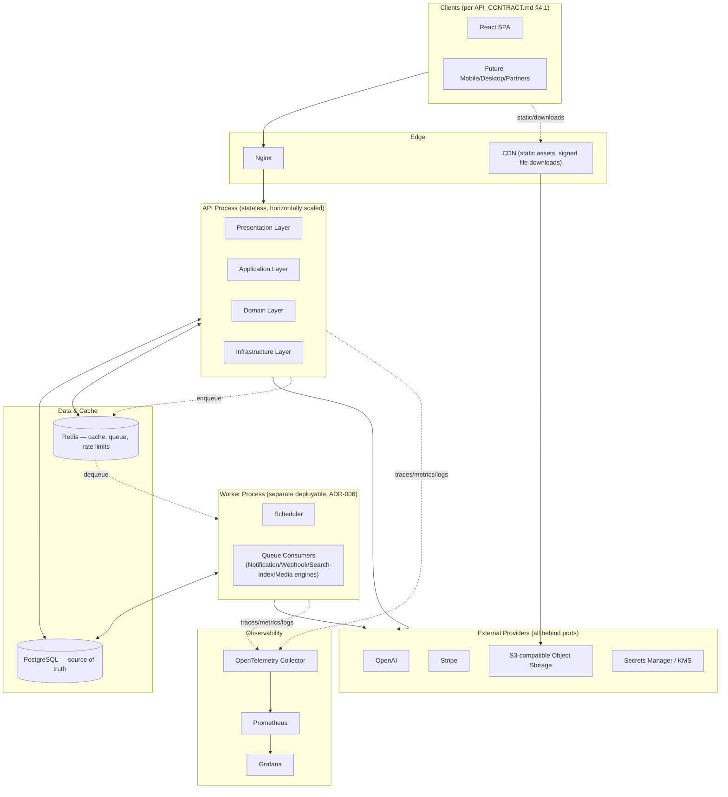

**Design Decisions:** the API process and Worker process are drawn as separate boxes deliberately (ADR-006) even though, at the smallest deployment scale (§ "10 users"), they may run as a single process for simplicity — the *architecture* keeps them separable from day one so that separating them later is a deployment-config change, not a code change. Every arrow leaving `APIProcess`/`WorkerProcess` toward `External` crosses a port (§1.3) — none of those boxes are ever imported directly by domain code.

### 1.2 Layer Diagram (Clean Architecture / Hexagonal)

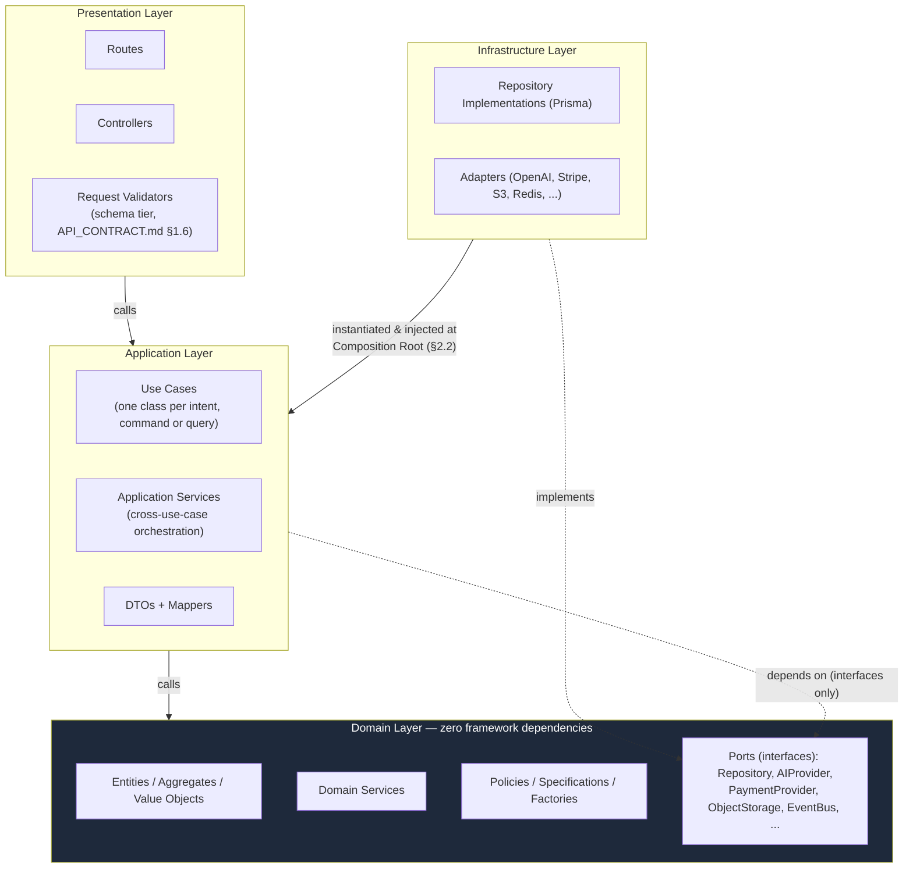

**The Dependency Rule, stated precisely:** source-code dependencies point only *inward*. Domain depends on nothing else in this system. Application depends on Domain. Infrastructure depends on Domain (to implement its ports) but is *never imported by* Domain or Application — Application only ever holds a reference to a **port** (an interface defined in Domain), and the concrete Infrastructure implementation is wired in by the Composition Root (§2.2), never referenced by type name inside Application code. Presentation depends on Application only; it never imports Domain or Infrastructure types directly (a controller doesn't know what a `Prisma.ProjectWhereInput` is, and it doesn't know an OpenAI SDK type either — it knows DTOs).

**Trade-offs:** this is more ceremony per module than a typical Express+Prisma "fat controller" tutorial structure. The payoff is specifically the thing a decade-horizon platform needs and a weekend project doesn't: the Domain layer is 100% unit-testable with no database, no HTTP server, and no network — a `CreditLedgerService`'s balance-invariant logic (§6.5) is tested by constructing plain objects and asserting on returned values, in milliseconds, in the thousands of times a CI run needs to. **Rejected alternative:** a lighter "3-layer" structure (routes → services → Prisma, no separate domain layer) — this is exactly what most Express tutorials teach, and it is explicitly rejected here because it makes the Prisma client the domain model, which means every business rule either lives inside a route handler (untestable without an HTTP mock) or gets duplicated across handlers that need the same rule. The four-layer structure is the one architectural choice in this document with the highest "looks like overkill for 10 users, is the thing that saves you at 100,000" ratio — stated explicitly because the mission brief demands designing for the whole range, not the first data point.

### 1.3 Ports & Adapters Catalog

Every external system this backend touches is defined as a **port** (an interface, owned by whichever layer needs it — usually Domain, sometimes Application) with one or more **adapters** (concrete implementations, always in Infrastructure or `src/providers/`, §14).

| Port | Owning module | Adapter(s) today | Future adapters |
|---|---|---|---|
| `RepositoryPort<T>` (base) | `core/` | Prisma repository per module | — |
| `AIProviderPort` | `ai-platform` | `OpenAIAdapter` | `AnthropicAdapter`, `AzureOpenAIAdapter` (§6.3) |
| `PaymentProviderPort` | `billing` | `StripeAdapter` | — (Stripe is a deliberate, not-provider-agnostic choice per `AUTH_ARCHITECTURE.md` §5.7's PCI reasoning; the port exists for testability, not multi-provider ambition) |
| `ObjectStoragePort` | `content` | `S3Adapter` | `R2Adapter`, `GCSAdapter`, local disk (dev/test) |
| `SearchPort` | `platform` | `PostgresFullTextSearchAdapter` (ADR-003) | `ElasticsearchAdapter`, `TypesenseAdapter` |
| `EventBusPort` | `core` | `InProcessEventEmitterAdapter` | `RedisStreamsAdapter`, `KafkaAdapter` (ADR-007, §13.1) |
| `SecretsProviderPort` | `core` | Environment-variable adapter (dev) / cloud KMS adapter (prod) | HSM-backed adapter for highest compliance tiers (`AUTH_ARCHITECTURE.md` §5.7) |
| `EmailProviderPort` | `collaboration` | Transactional-email adapter (e.g. SES/Postmark-shaped) | — |
| `ImageProcessingPort` | `content` | In-process library adapter | Dedicated media-processing service adapter (§12.2) |
| `CachePort` | `core` | Redis adapter (L2) + in-process adapter (L1) | — |
| `RateLimiterPort` | `core` | Redis token-bucket adapter | — |
| `DistributedLockPort` | `core` | Postgres row-lock adapter (ADR-009) | Redis/Redlock adapter (§9.6) |

This table is the single most reused artifact in this document — every "engine" section below (§6, §7) is, structurally, "a domain service or two, consuming one or more of these ports."

### 1.4 Dependency Graph (Module-Level)

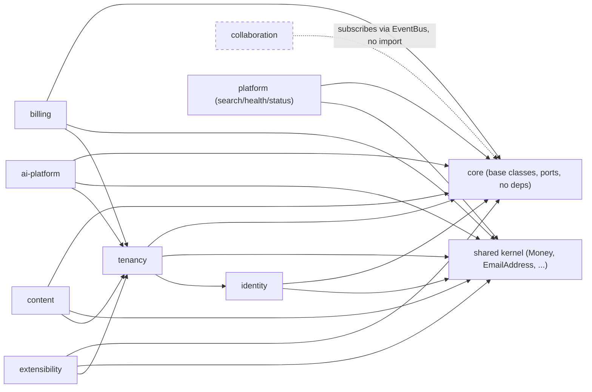

**Design Decisions:** solid arrows are **allowed synchronous dependencies** (a module may import another's `index.ts` public interface, never its internals — ADR-002); the dashed relationship shows `collaboration` (Notification/Audit/Activity) deliberately having **no compile-time dependency on anything** — it only ever reacts to events, which is precisely why it can subscribe to every other module without appearing as an edge from them. `tenancy` sits below `billing`/`ai-platform`/`content`/`extensibility` because those all need to resolve "which workspace, which member, which role" — this is the same dependency shape as `DATABASE.md`'s bounded-context diagram, reproduced here as a code-level constraint, not just a data-modeling one.

**Circular Dependency Prevention:** the graph above is enforced, not just documented — a dependency-analysis lint rule (tooling recommendation: `dependency-cruiser` or an equivalent import-boundary linter, configured in CI) fails the build if any module imports another module's non-`index.ts` path, or if the module graph ever contains a cycle. Because the *only* legal cross-module edge is "import another module's public interface," and the Event Bus is inherently one-directional (a publisher never imports its subscribers — it doesn't know they exist), the two historically common sources of circular dependencies (module A's service calling module B's service which calls back into module A) become structurally unrepresentable rather than merely discouraged. Where two modules seem to need each other synchronously, that is treated as a **design smell** with two standard fixes: extract the shared concept into `shared/` (the Shared Kernel), or convert one direction of the relationship to an event.

---

## 2. Application Bootstrap, Configuration & Request/Response Lifecycle

### 2.1 Application Bootstrap

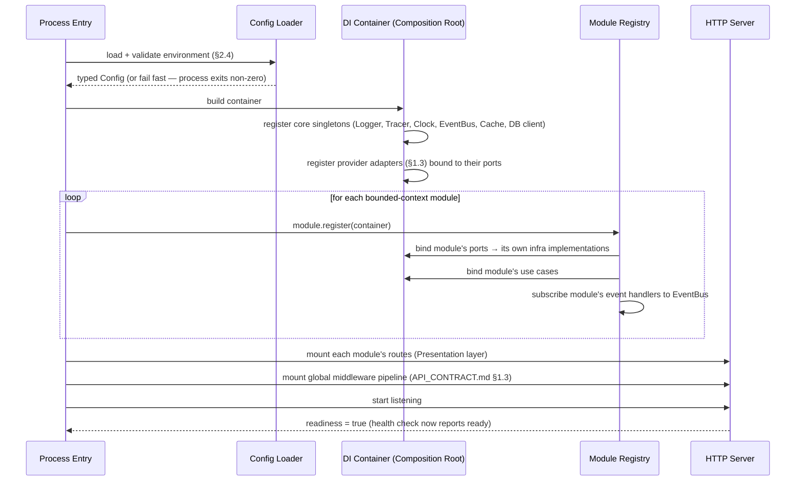

**Design Decisions:** boot order is deliberate — configuration is validated **before** anything else runs (Fail Fast: a missing `DATABASE_URL` or malformed `JWT_PRIVATE_KEY` crashes the process at second zero with a clear error, never three requests into production traffic). Module registration happens in dependency order matching §1.4's graph (`core` → `shared` → `identity` → everything else) — the registry topologically sorts modules by their declared dependencies rather than relying on file-import order, so registration order can never silently drift from the enforced dependency graph. The server only reports itself `ready` (`API_CONTRACT.md` §5.18) after every module has finished registering — a request arriving during boot gets routed to a 503, never to a half-wired handler.

### 2.2 Dependency Injection & the Composition Root

**Design Decisions:** DI is **constructor injection only**, resolved from a single container built once at boot (the **Composition Root** — the *only* place in the entire codebase allowed to know about concrete Infrastructure classes). A Use Case's constructor declares the ports it needs (`constructor(private projectRepo: ProjectRepositoryPort, private eventBus: EventBusPort)`) — it never calls a service-locator (`container.get(...)`) itself, and it never constructs its own dependencies. This is Dependency Inversion applied literally, not just as a principle to gesture at.

**Rejected alternative:** a heavyweight decorator-based DI framework (e.g., a full IoC container with reflection-based auto-wiring, `@Injectable()`-style metadata). Considered and rejected for `v1` — a lightweight, explicit composition function (still just "a container object holding registered factories," but without decorator metadata/reflection magic) is easier to reason about, has zero build-step dependency on `reflect-metadata` or experimental TS decorators, and keeps "what does this class actually depend on" answerable by reading its constructor rather than by understanding a framework's registration conventions. Revisit only if module count grows large enough that manual registration wiring becomes the bottleneck (not expected before dozens of modules — BizPilot AI has seven bounded contexts today, per `DATABASE.md` §1.1).

### 2.3 Request & Response Lifecycle (Internal Continuation)

`API_CONTRACT.md` §1.2/§1.3 already specifies the full HTTP-level pipeline (Nginx → middleware → handler → response). This section adds the part that happens **inside** a route handler, which that document deliberately left as "invoke the service layer."

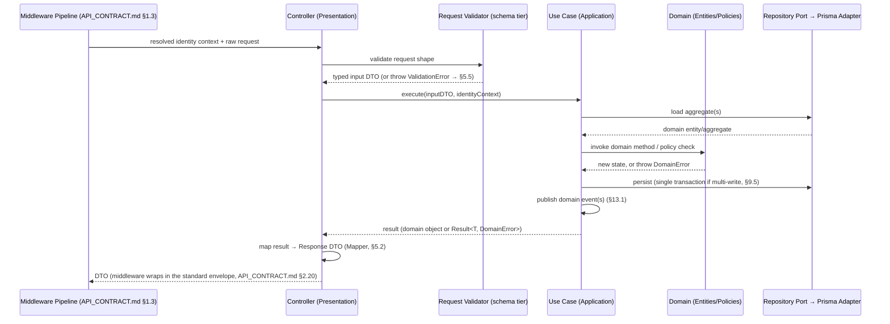

**Response Lifecycle** is the mirror image, worth stating explicitly since `API_CONTRACT.md` specified the *envelope shape* but not how a domain object becomes one: **a domain Entity or Aggregate is never returned from a controller.** The Controller always passes the Use Case's result through a Mapper (§5.2) to produce a DTO, and DTOs are the only objects the response-enveloping middleware ever serializes. This is the concrete mechanism (not just a rule) that guarantees `passwordHash`/`tokenHash`/`hashedKey`/`secret` (every field `DATABASE.md` and `AUTH_ARCHITECTURE.md` say must never leave the server) *cannot* leak — they don't exist on the DTO type at all, so there is no field to accidentally forget to strip.

**Validation Pipeline (internal detail):** `API_CONTRACT.md` §1.6 defined the two tiers (schema validation, then business-rule validation). This document places them precisely: schema validation is a Presentation-layer concern (`presentation/validators/`, generated from the OpenAPI request schemas, per that document's stated single-source-of-truth design) and produces the typed input DTO the Use Case receives; business-rule validation is **not a separate pipeline stage** but simply *what a Use Case and the Domain layer's Policies/Specifications do as part of normal execution* — there is no "business rule validator" class parallel to the schema validator, because business rules are the domain logic itself, not a gate in front of it.

---

## 3. Module Architecture

### 3.1 Modules Are Bounded Contexts

Every entry in `src/modules/` corresponds 1:1 to a bounded context already established in `docs/DATABASE.md` §1.1, with one adjustment: `Collaboration & Governance` and `Extensibility` remain separate contexts (matching that document), and a new `platform` module houses the API-layer-only concerns that own no `DATABASE.md` tables at all (`Search`, `Health`, `Status`, per `API_CONTRACT.md` §5.17/§5.18).

| Module | Bounded context (`DATABASE.md` §1.1) | Owns (Prisma models) |
|---|---|---|
| `identity` | Identity & Access (user-facing half) | `User`, `Session` |
| `tenancy` | Identity & Access (access half) + Tenancy | `Role`, `Permission`, `RolePermission`, `Workspace`, `WorkspaceMember`, `TeamInvite`, `BusinessProfile`, `Settings`, `FeatureFlag` |
| `billing` | Billing & Subscriptions | `SubscriptionPlan`, `Subscription`, `Payment`, `Invoice`, `InvoiceItem` |
| `ai-platform` | AI Platform | `AICredit`, `AIUsage`, `Conversation`, `Message`, `PromptCategory`, `Prompt`, `PromptVersion`, `PromptPin`, `TemplateCategory`, `Template` |
| `content` | Content & Files | `Project`, `ProjectMember`, `Folder`, `File`, `Image` |
| `collaboration` | Collaboration & Governance | `NotificationPreference`, `Notification`, `AuditLog`, `Activity` |
| `extensibility` | Extensibility | `ApiKey`, `Webhook` |
| `platform` | — (no owned tables; orchestrates read-only views across the above) | — |

**Design Decisions:** `identity` and `tenancy` are split from `DATABASE.md`'s single "Identity & Access" section into two modules — `identity` owns *who a user is* (`User`, `Session`), `tenancy` owns *what they can do where* (`Role` through `FeatureFlag`). This split exists because `identity` must be extractable **first** in the microservice roadmap (`AUTH_ARCHITECTURE.md` §8.6 names Identity & Access as the first extraction candidate specifically) — keeping it as its own module today, rather than folded into a larger "auth" module, means that extraction is "move one folder," not "carefully untangle two contexts that grew together."

### 3.2 The Module Template

Every module in the table above has **exactly this internal shape** — defined once, here, so §3's catalog and every "engine" in §6/§7 can simply say "standard module template" and mean something precise.

```
modules/{context}/
├── domain/
│   ├── entities/            — mutable, identity-bearing objects (Project, Prompt, Conversation, ...)
│   ├── value-objects/       — immutable, self-validating (WorkspaceSlug, CreditAmount, ...)
│   ├── aggregates/          — entities that enforce a cross-entity invariant (§4.3)
│   ├── events/              — this module's DomainEvent subtypes (e.g. ProjectCreated, InviteAccepted)
│   ├── policies/            — pure business-rule decisions (CreditOveragePolicy, PlanEntitlementPolicy)
│   ├── specifications/      — composable query predicates (ActiveProjectsSpecification, §4.6)
│   ├── factories/           — invariant-preserving multi-object construction (WorkspaceFactory, §4.5)
│   └── ports/                — interfaces this module needs from Infrastructure (its own repository port,
│                                plus any external port it consumes, e.g. ai-platform's AIProviderPort)
├── application/
│   ├── use-cases/            — one class per intent: CreateProjectUseCase, InviteMemberUseCase, ...
│   ├── services/              — orchestration spanning >1 use case within this module only
│   ├── dto/                   — request/response DTOs (never domain entities cross this boundary)
│   └── mappers/                — Entity → DTO (one direction; see §5.2)
├── infrastructure/
│   ├── repositories/           — Prisma implementations of this module's repository port(s)
│   └── adapters/                — implementations of any external port this module privately owns
│                                   (most shared adapters live in src/providers/ instead — see §14)
├── presentation/
│   ├── routes/                  — Express Router definitions (paths from API_CONTRACT.md §5)
│   ├── controllers/              — thin: validate → call use case → map → respond
│   └── validators/                — schema-tier request validators (API_CONTRACT.md §1.6 tier 1)
├── module.ts                     — registration: binds ports→adapters, registers use cases with
│                                    the DI container, subscribes this module's event handlers
└── index.ts                      — THE PUBLIC INTERFACE. Only file other modules may import from.
```

**Public Interfaces:** a module's `index.ts` exports a small, deliberate surface — typically a handful of **query functions** other modules legitimately need synchronously (e.g., `tenancy` exports `getEffectiveWorkspaceMember(userId, workspaceId)`, which `content`, `billing`, and `ai-platform` all call to resolve permissions without duplicating that logic or reaching into `tenancy`'s Prisma tables directly) — and re-exports the module's public DTO types. It **never** exports entities, repositories, or use case classes — those are module-private by construction (not by convention: they simply aren't in `index.ts`, so nothing outside the module can import them, enforced the same way as any other TypeScript module boundary, backed by the lint rule from §1.4).

**Lifecycle:** a module's `module.ts:register(container)` runs once at boot (§2.1); nothing about a module is re-initialized per-request — Use Cases are constructed once (their dependencies are singletons or scoped appropriately) and reused, consistent with the "no in-process per-request state" rule that keeps the API process stateless and horizontally scalable.

**Scalability Strategy (shared across every module):** because a module has no per-request or per-instance mutable state of its own, horizontal scaling of the API process requires zero module-level coordination — any instance can serve any request. Module-specific scaling levers (e.g., `ai-platform`'s independent rate-limit tier, `content`'s direct-to-storage upload bypassing the API process entirely) are documented in their own sections and are refinements on top of this baseline, not exceptions to it.

**Security Considerations (shared):** every module's `presentation/controllers/` is the *only* place `AUTH_ARCHITECTURE.md` §4.5's permission pipeline is invoked (via a shared `authorize(permissionKey)` guard, §14) — Use Cases and Domain code assume they are already running in an authorized context and never re-check permissions themselves, keeping the authorization decision in exactly one place per request (avoiding the classic bug pattern of a permission check that's present at the route but silently skippable via a different, unguarded code path into the same Use Case — impossible here, since Use Cases have no other entry point).

**Failure Handling / Recovery (shared):** a Use Case failure surfaces as a typed `DomainError` (§5.5), caught by the shared error-handling middleware, never a raw 500 with a leaked stack trace. A module's `infrastructure/repositories/` layer translates any Prisma-level failure (constraint violation, connection error) into the appropriate domain error *before* it can propagate past the port boundary (ADR-008) — Application code never handles a `Prisma.PrismaClientKnownRequestError` directly.

**Rejected Alternatives (module template as a whole):** (1) *Layer-first* (ADR-001) — rejected, discussed in §1.2. (2) *One Prisma model = one "resource module" with no domain/application split* — this is essentially the "3-layer" rejection from §1.2, restated at the module level; rejected for the same testability reasoning. (3) *A shared, generic CRUD-module generator* (a factory that stamps out a full module from a Prisma model definition) — tempting given how many modules in §3.1's table are "fairly standard CRUD," and explicitly considered; rejected because BizPilot AI's modules are *not* uniformly CRUD once domain rules are added (`ai-platform`'s credit-balance invariant, `tenancy`'s ownership-transfer restrictions, `billing`'s Stripe-eventual-consistency handling) — a generator either can't express those (defeating its purpose) or grows enough escape hatches to become more complex than just writing the module, a classic case of premature abstraction the YAGNI principle exists to catch.

### 3.3 Module Communication Patterns

| Pattern | When to use | Example |
|---|---|---|
| **Public-interface synchronous call** | The calling module needs a strongly-consistent answer *right now* to proceed (can't tolerate eventual consistency) | `content`'s `CreateProjectUseCase` calls `tenancy.getEffectiveWorkspaceMember(...)` to check `maxActiveProjects` entitlement before creating |
| **Domain event, fire-and-forget** | The calling module doesn't need to know or care who (if anyone) reacts | `content` publishes `ProjectCreated`; `collaboration` reacts by writing an `Activity` row; nothing in `content` knows `collaboration` exists |
| **Domain event, requesting side-effect completion is NOT expected** | Any cross-cutting reaction that is inherently "eventually consistent" — notifications, audit (non-sensitive tier), search-index updates, webhook delivery | See §7's engines — every one of them is exclusively an event consumer |

**Design Decisions:** the deciding question for "sync call vs. event" is always **"does the current operation's correctness depend on this happening first?"** — if yes (an entitlement check, a permission resolution), it's a synchronous public-interface call; if the answer is "no, but it should happen soon" (send a notification, log an audit trail, update a search index), it's an event. This single heuristic, applied consistently, is what prevents the Event Bus from becoming a dumping ground for things that actually needed synchronous guarantees (a known failure mode of over-eager event-driven design) while also preventing modules from synchronously coupling to things that don't need it (a known failure mode of under-using events).

---

## 4. Domain-Driven Design Tactical Patterns

Applied *selectively* — not every module needs every pattern, and forcing rich DDD tactical patterns onto a module with no real invariants is itself an anti-pattern (over-engineering, directly against KISS/YAGNI). Each pattern below states which modules genuinely warrant it.

### 4.1 Entities

Objects with identity that persists across state changes. Every module has entities corresponding to its Prisma models (§3.1's table) — `Project`, `Prompt`, `Conversation`, `Message`, `Workspace`, etc. An Entity's constructor/factory validates its own invariants at creation (Fail Fast) — e.g., a `WorkspaceSlug` value object (below) rejects an invalid slug *before* a `Workspace` entity can ever hold one, rather than relying on a database `CHECK` constraint to catch it after the fact (defense in depth: both layers validate, but the domain layer's validation is what produces a clean `ValidationError` instead of a raw constraint-violation surfacing from Postgres).

### 4.2 Value Objects

Immutable, compared by value, self-validating. Concrete BizPilot examples: `EmailAddress` (format + normalization, used by `identity`), `WorkspaceSlug` (format per `DATABASE.md` §1.3's noted future `CHECK` constraint — enforced here at the domain layer *today*, ahead of that DB-level hardening), `CreditAmount` (a non-negative integer wrapper used throughout `ai-platform`, preventing the entire class of bugs where a raw negative `number` accidentally gets passed where a credit amount is expected), `Money` (cents + ISO currency code, used by `billing`). Value Objects with genuine cross-module relevance (`Money`, `EmailAddress`) live in the **Shared Kernel** (`src/shared/`, §14); value objects meaningful only within one bounded context (`CreditAmount`, `WorkspaceSlug`) live in that module's `domain/value-objects/`.

### 4.3 Aggregates

An Aggregate is an Entity (the **aggregate root**) plus the cluster of objects that must change together to preserve an invariant, always loaded/saved as a unit through the root. BizPilot AI deliberately has **few** rich aggregates — most entities are simple enough to not need one:

| Aggregate root | Cluster | Invariant enforced |
|---|---|---|
| `Prompt` | `Prompt` + its `PromptVersion`s | Exactly one `currentVersion` at all times; a new version is only ever added *through* the `Prompt` aggregate's `createVersion()` method, never by writing a `PromptVersion` directly (mirrors `API_CONTRACT.md` §5.8's API-level rule — the domain layer is *why* that API rule is enforceable, not just documented) |
| `CreditLedger` (per workspace) | The workspace's `AICredit` entries + derived balance | Balance never goes negative under `HARD_STOP` (§6.5); every debit is atomic with its balance check |
| `Conversation` | `Conversation` + its `Message`s | Message ordering/consistency; a `Message` is only ever appended through the `Conversation` aggregate |
| `Workspace` (membership sub-aggregate) | `Workspace` + the *count/limits* of `WorkspaceMember`s, `BusinessProfile`s, active `Project`s | Plan-tier limits (`maxTeamSeats`, `maxBusinessProfiles`, `maxActiveProjects`) — checked at the aggregate boundary before any operation that would exceed them |

Every other entity in the system (`File`, `Folder`, `Template`, `ApiKey`, `Webhook`, ...) is treated as a **standalone entity**, not wrapped in an aggregate — there is no cross-entity invariant worth protecting for a `File`'s relationship to its `Folder`, for instance (moving a file to a different folder doesn't threaten any invariant), so modeling one would be pure ceremony.

### 4.4 Domain Services

Stateless operations that don't naturally belong to one entity because they span several. Examples: `PermissionResolutionService` (spans `WorkspaceMember` + `Role` + `Permission`, implementing the *domain* half of `AUTH_ARCHITECTURE.md` §4.5's pipeline — the pipeline's steps 4–6 are, precisely, this domain service), `CreditConsumptionPolicy`'s companion `CreditLedgerService` (§6.5), `PromptAssemblyService` (§6.2, spans `BusinessProfile` + `Prompt`/`PromptVersion` + `Conversation` history — none of which is any one of those entities' own responsibility to know how to combine).

### 4.5 Factories

Encapsulate invariant-preserving construction that spans more than one write. `WorkspaceFactory.createWithOwner(user, name)` — constructs the `Workspace`, its default `Settings` row, and the Owner's `WorkspaceMember`/`Role` assignment as one atomic operation (§9.5's transaction rule), so "a workspace that exists but has no owner membership" is a state the type system and the transaction boundary both make unreachable, not just an assumption the rest of the codebase happens to rely on. `PromptFactory.createWithInitialVersion(...)` — same reasoning, resolving the "chicken-and-egg" creation order already flagged in `DATABASE.md` §4's `Prompt`/`PromptVersion` design note.

### 4.6 Policies & Specifications

**Policies** encapsulate a business *decision* with more than one legitimate outcome depending on configuration or state: `CreditOveragePolicy` (given a workspace's `AIOverageMode` and current balance, decide `ALLOW` / `ALLOW_WITH_OVERAGE_BILLING` / `REJECT`), `PlanEntitlementPolicy` (given a `SubscriptionPlan.featureMatrix` and a requested module/feature, decide entitled or not — the domain-layer counterpart to `API_CONTRACT.md` §1.5/`AUTH_ARCHITECTURE.md` §4.6's plan-gate step).

**Specifications** are composable predicates usable both in-memory (checking a domain rule against an already-loaded entity) and translated to a Prisma query filter at the repository boundary (implementing `API_CONTRACT.md` §2.12's filtering conventions *from* the domain layer, so "what fields are filterable and how" is a domain-expressed concept, not something reverse-engineered from a query-builder function scattered across controllers). Example: `ActiveProjectsSpecification` — used both by `WorkspaceFactory`-adjacent limit-checking logic (in-memory) and by `ProjectRepository.findMany({ specification: ActiveProjectsSpecification })` (translated to `WHERE status = 'ACTIVE' AND deletedAt IS NULL`).

**Trade-offs:** Specifications add a translation layer (Specification → Prisma `where` clause) that a repository method taking raw query parameters wouldn't need. Accepted because the alternative — letting `API_CONTRACT.md`'s filter query-string syntax translate *directly* into a Prisma `where` object inside a controller — would put query-construction logic in the Presentation layer, violating the dependency rule (§1.2) the moment a filter needs to express a genuine business rule (e.g., "active" isn't just `status = 'ACTIVE'`, it also excludes soft-deleted rows — a rule that belongs in the domain, not re-derived ad hoc per controller).

---

## 5. Cross-Cutting Strategies

### 5.1 DTO Strategy

Every request body and every response body is a DTO — plain, serializable data shapes with no methods, no domain invariants, defined in each module's `application/dto/`. Domain entities are constructed *from* validated request DTOs by Use Cases (via Factories or aggregate methods — never by a generic "hydrate an entity from a DTO" mapper, which would bypass invariant validation) and are converted *to* response DTOs by Mappers before ever reaching Presentation. This asymmetry (write-side: DTO → domain via explicit construction; read-side: domain → DTO via a Mapper) is deliberate — write-side "mapping" isn't really mapping, it's validated construction, and treating it as a symmetric operation to the read side would hide that distinction.

### 5.2 Mapper Strategy

One Mapper per Entity/DTO pair, pure functions (`toDTO(entity): ResponseDTO`), colocated in `application/mappers/`. A Mapper is the **single, exhaustive point** where sensitive fields are excluded — `UserMapper.toDTO()` simply has no line that copies `passwordHash`, so there is no field to forget across the dozens of places a `User` might otherwise be serialized. Mappers also apply `API_CONTRACT.md` §2.6–§2.9's wire-format rules (dates to ISO strings, enums pass through verbatim, `BigInt` `sizeBytes` to a JSON-safe number) in exactly one place per entity type, rather than at every call site that happens to serialize one.

### 5.3 Validation Strategy

Two tiers, precisely located (§2.3): schema tier in `presentation/validators/` (structural — types, required-ness, formats, generated from the OpenAPI spec per `API_CONTRACT.md` §1.6/§6.1); business-rule tier is simply the Domain layer's Policies/Specifications/entity invariants, invoked naturally as part of Use Case execution — not a separate pipeline stage, a point worth restating from §2.3 because it's the answer to "where do I add a new validation rule" for any future contributor: structural rule → the validator; business rule → the domain.

### 5.4 Serialization Strategy

JSON exclusively (`API_CONTRACT.md` §4.10). One shared serializer (used by the response-enveloping middleware, §2.3) is the only code that touches `Date` → ISO-string conversion and `BigInt` → number conversion — never ad hoc `JSON.stringify` calls scattered through controllers, which is how format drift (a rogue endpoint returning a Unix timestamp instead of ISO-8601) happens in systems without this discipline.

### 5.5 Error Strategy

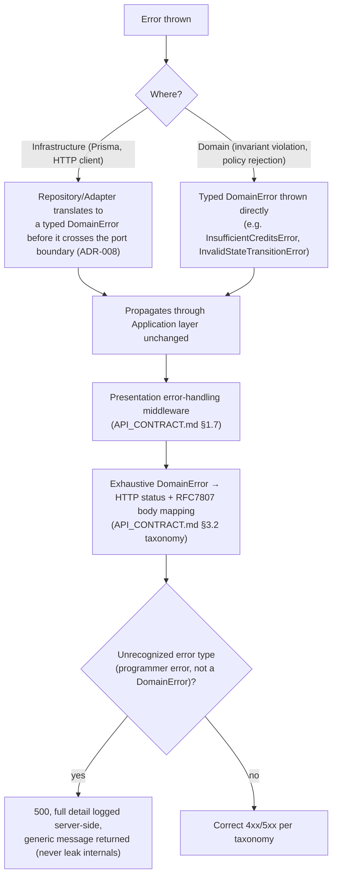

**Design Decisions:** the `DomainError` hierarchy (root type in `errors/`, §14) is small and closed: `ValidationError`, `NotFoundError`, `ConflictError`, `AuthorizationError`, `EntitlementError` (→ `402`, the plan-gate case), `RateLimitedError`, and a narrow set of named business errors (`InsufficientCreditsError`, `InvalidStateTransitionError`, `DuplicateInviteError`, ...) that extend `ConflictError`/`ValidationError` as appropriate. The mapping from this hierarchy to `API_CONTRACT.md` §3.2's taxonomy is a single exhaustive `switch`/lookup table — TypeScript's exhaustiveness checking (a `never`-typed default branch) means adding a new `DomainError` subtype without updating the mapping table is a **compile error**, not a runtime surprise discovered in production (a small but genuinely valuable Fail-Fast guarantee).

### 5.6 Logging Strategy

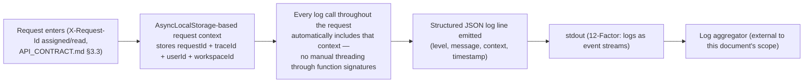

**Design Decisions:** structured JSON, not human-formatted text — required for log aggregation/search at any scale beyond "tail a file on one server." `AsyncLocalStorage` (a Node.js core API) is the mechanism that gets `requestId`/`traceId` into every log line automatically, without a Logger instance being manually passed into every function several layers deep — a genuinely important, Node.js-specific technique named explicitly because getting this wrong (falling back to a global mutable "current request" variable) breaks under concurrent requests. Log level mapping follows the error taxonomy: `ValidationError`/`NotFoundError` log at `info` (expected, user-caused, not actionable by an on-call engineer); `DomainError` business-rule rejections log at `warn`; unrecognized/`500`-class errors log at `error` and are the only tier that pages anyone.

### 5.7 Monitoring & Tracing Strategy

OpenTelemetry provides vendor-neutral instrumentation: automatic spans for inbound HTTP, Prisma queries, and outbound calls (OpenAI, Stripe), plus **one manual span per Use Case execution** — a deliberate, consistent granularity that makes "which use case is slow" always answerable from a trace waterfall without hunting. Metrics exported in Prometheus format, visualized in Grafana (per the stated stack), organized by the two standard SRE frameworks: **RED** (Rate, Errors, Duration — per Use Case and per HTTP route) for request-serving code, and **USE** (Utilization, Saturation, Errors) for infrastructure resources (DB connection-pool usage, Redis connection count, queue depth, Node.js event-loop lag). Event-loop lag specifically is flagged as the single most important Node.js-specific health signal to alert on — a rising event-loop lag is the leading indicator of a Node process that's about to stop serving requests promptly, well before CPU/memory alarms would fire.

### 5.8 Caching Strategy (ADR-004)

Two tiers:
- **L1 (in-process):** for data that is small, workspace/tenant-independent, and changes rarely — the `Permission` catalog and `SubscriptionPlan` catalog (both already flagged as "prime candidates for in-process caching" in `AUTH_ARCHITECTURE.md` §4.2/§4.6). Bounded in size by construction (both catalogs are inherently small, tens to low-hundreds of rows) — this is not a general-purpose unbounded cache, which is exactly why it's safe to keep in-process despite horizontal scaling (each instance's copy is small and cheap to rebuild).
- **L2 (Redis):** everything else that benefits from caching but needs cross-instance consistency or is too large/tenant-specific for L1 — resolved permission sets per `WorkspaceMember` (`AUTH_ARCHITECTURE.md` §8.1's table), API-key metadata, resolved feature flags.

**Invalidation:** event-driven wherever correctness matters (a `PermissionChanged` event invalidates the specific cache key; a `RoleUpdated` event invalidates every affected member's resolved-permission cache entry) — TTL-only invalidation is reserved for data where staleness has a bounded, acceptable cost (feature flags, per `AUTH_ARCHITECTURE.md` §8.1's precedent). Both tiers are strictly caches — Postgres remains authoritative, and every cache read path has a documented fallback to the source of truth, inherited unchanged from `AUTH_ARCHITECTURE.md` §8.1's philosophy.

### 5.9 Storage Strategy

Covered in depth in §12; the summary relevant here: all object storage access goes through `ObjectStoragePort` (§1.3) — no module holds an S3 SDK client directly.

---

## 6. The AI Layer

The most differentiated subsystem in this backend — five engines working together to turn a `POST /ai/generations` request (`API_CONTRACT.md` §5.10) into a billed, persisted, optionally-streamed AI response.

### 6.1 Conversation Engine

**Purpose:** own the `Conversation`/`Message` aggregate's lifecycle and keep prompt-construction cost bounded regardless of how long a conversation runs.
**Responsibilities:** append messages (only through the `Conversation` aggregate, §4.3); maintain a **context window** — once a conversation's accumulated token count crosses a configured threshold, a background job (§8) summarizes older messages into a compact rolling summary stored alongside the conversation, which future prompt assembly (§6.2) uses in place of the full raw history. This is the specific, concrete answer to "what happens to a conversation with 500 messages" — without it, every subsequent turn's cost and latency would grow unbounded with conversation length, a real and easy-to-overlook AI-infrastructure failure mode.
**Public Interface:** `appendUserMessage`, `getContextForGeneration` (returns the bounded history/summary the Prompt Engine needs), `renameConversation`.
**Dependencies:** `EventBusPort` (publishes `MessageAppended`); consumed by `ai-platform`'s own Use Cases, not called cross-module (the Conversation Engine is internal to the `ai-platform` module, not a top-level module of its own).
**Scalability:** summarization runs as an async job (§8), never blocking the synchronous generation path.
**Failure Handling:** a failed summarization job retries per §8.3's standard policy; until it succeeds, the (slightly more expensive, but correct) full raw history is used — a degraded-performance fallback, never a correctness failure.
**Trade-offs / Rejected Alternatives:** truncating (simply dropping old messages) instead of summarizing was considered and rejected — truncation silently loses context a user may reference later ("what did you say about the budget three messages ago"), while summarization preserves it at a bounded cost. Summarizing on *every* message (rather than only past a threshold) was rejected as wasted cost for the overwhelming majority of conversations that never get long enough to need it.
**Future Evolution:** per-conversation user-adjustable summarization aggressiveness; multi-modal message content (images, files as message attachments) once the product surface needs it.

### 6.2 Prompt Engine

**Purpose:** assemble the actual text (or structured input) sent to an AI provider. **Not to be confused** with the customer-facing Prompt Library (`Prompt`/`PromptVersion`, a standard module per §3.2) — the Prompt *Engine* is the internal assembly pipeline; the Prompt *Library* is one of several inputs it may draw from.
**Responsibilities:** compose, in order: (1) the workspace's `BusinessProfile` grounding context (auto-injected per `DATABASE.md` §2's design), (2) the selected `Prompt`/`PromptVersion`'s body with `{{variable}}` substitution (reusing `DATABASE.md` §4's Template variable-token pattern), (3) the bounded conversation context from §6.1, (4) the immediate user input. Composition logic lives in a `PromptAssemblyService` (domain service, §4.4) operating on a `PromptTemplate` value object.
**Public Interface:** `assemble(actionType, businessProfileId, promptVersionId?, conversationContext?, userInput) → AssembledPrompt`.
**Dependencies:** `tenancy` (BusinessProfile, via public interface), `ai-platform`'s own Prompt Library entities, Conversation Engine.
**Security Considerations:** user-supplied `input` fields are never interpolated into the assembled prompt in a way that could be mistaken for system instructions by the provider (basic prompt-injection hygiene — user content is clearly delimited from grounding/instruction content in the assembled structure) — a concrete, necessary defensive measure for a product whose entire surface is "send user text to an LLM."
**Failure Handling:** a missing/invalid `promptVersionId` reference is a `ValidationError` (caught at the schema tier, `API_CONTRACT.md` §5.10's request validation) — assembly itself has no meaningful partial-failure state; it's a pure function.
**Trade-offs:** centralizing assembly logic in one service (rather than letting each `AIActionType`'s handler build its own prompt ad hoc) trades a small amount of per-action-type flexibility for a single, auditable place where "what exactly are we sending to OpenAI" can be reviewed, tested, and version-controlled independently of the individual use cases that trigger generation.
**Future Evolution:** per-`AIActionType` assembly strategies (today one generic composer; some future action types may need genuinely different structuring, e.g. a multi-document RAG-style assembly).

### 6.3 Provider Router

**Purpose:** decouple the rest of the AI Layer from any single AI provider's API shape, implementing the multi-provider extensibility already flagged in `DATABASE.md` §4 (`AIUsage.modelProvider`/`modelName`).
**Responsibilities:** own the `AIProviderPort` (§1.3) and its `OpenAIAdapter` implementation; apply a `ProviderRoutingPolicy` (domain policy, §4.6) deciding which provider/model serves a given `AIActionType` — today a static, config-driven mapping (not hardcoded in source — changeable via config/feature-flag without a deploy), explicitly designed to later support cost/quality/latency-aware dynamic routing without changing any caller.
**Public Interface:** `generate(assembledPrompt, routingHint) → AIProviderResponse | TokenStream` (the latter for streaming, handed to the Streaming Engine).
**Dependencies:** `SecretsProviderPort` (API keys, never read from `process.env` directly — §11.1), Circuit Breaker (§9.1) wrapping every outbound call.
**Scalability:** stateless; provider connection pooling lives in the adapter (`src/providers/`, §14), shared across the process, not per-request.
**Security Considerations:** the adapter is the *only* code in the system holding an OpenAI SDK client instance — no module constructs its own.
**Failure Handling:** provider timeout/error → circuit breaker records the failure (§9.1); on an open circuit, generation requests fail fast with a clear `502`-mapped `DomainError` rather than each hanging until its own timeout independently.
**Trade-offs:** a thin routing policy (today: static config) versus building a sophisticated cost-optimizing router now. Rejected building the sophisticated version now — no production usage data yet to optimize against (YAGNI); the port/adapter boundary is what makes adding it later free of any caller-side change.
**Rejected Alternatives:** calling the OpenAI SDK directly from the Conversation/Prompt engines. Rejected — this is precisely the hexagonal-adapter principle (§1.3); without the port, adding a second provider means touching every call site instead of adding one adapter class.
**Future Evolution:** `AnthropicAdapter`, `AzureOpenAIAdapter`; dynamic, usage-informed routing; per-workspace provider preference (Enterprise).

### 6.4 Streaming Engine

**Purpose:** the internal implementation behind `API_CONTRACT.md` §5.10's SSE contract.

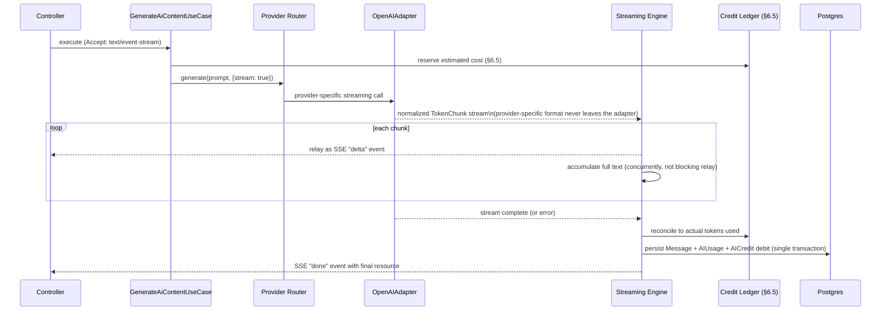

**Design Decisions:** every provider adapter normalizes its own streaming wire format into one internal `TokenChunk` shape *inside the adapter* (§1.3's hexagonal principle applied specifically to streaming) — the Streaming Engine, and everything above it, never sees an OpenAI-specific chunk shape. Relaying to the client and accumulating the full text happen concurrently, not sequentially — the client sees tokens as they arrive (the whole point of streaming), while the eventual DB write is prepared in the background, ready to commit the instant the stream confirms completion.
**Failure Handling:** a mid-stream provider error triggers the `event: error` SSE frame (`API_CONTRACT.md` §5.10) and reconciles credits to only the tokens actually streamed before failure — never the full reserved estimate (directly implementing the "guardrail-blocked or failed generations are not charged" rule from `DATABASE.md`, extended correctly to the partial-stream case, as already noted in `API_CONTRACT.md` §5.10).
**Performance Considerations:** the SSE connection is held open only as long as generation takes — bounded by the same tiered-timeout policy as any other outbound call (§9.2), with a maximum stream duration beyond which the connection is force-closed with an error frame rather than held indefinitely.
**Trade-offs:** WebSocket was the rejected alternative here too (restating `API_CONTRACT.md` Decision #7's reasoning at the implementation level) — SSE's unidirectional nature matches the Streaming Engine's actual job exactly (relay provider output; the client never needs to push mid-stream), and it requires no new connection-management infrastructure beyond what any HTTP-serving process already has.

### 6.5 AI Credits Engine

**Purpose:** the `CreditLedger` aggregate's (§4.3) enforcement mechanism — implements, at the service-architecture level, what `DATABASE.md` §4 already fully specified at the data level.
**Responsibilities:** `CreditLedgerService` (domain service) exposes `reserve(workspaceId, estimatedAmount)`, `reconcile(reservationId, actualAmount)`, and `getBalance(workspaceId)`, all going through the **exact same concurrency-control pattern** `AUTH_ARCHITECTURE.md` §3.8 already established for refresh-token rotation: a `SELECT ... FOR UPDATE` row lock (on a per-workspace credit-summary row, held only for the duration of the check-and-debit) prevents the classic race — two concurrent generation requests both reading balance=10, both concluding an 8-credit request is affordable, both proceeding, and the balance going negative. This is ADR-009, and it is the single clearest concurrency-control worked example in this document.
**Public Interface (to other `ai-platform` internals only — not exported to other modules):** as above.
**Dependencies:** Postgres transaction/row-lock (no Redis dependency for correctness, matching `AUTH_ARCHITECTURE.md`'s Decision #9 precedent exactly).
**Security Considerations:** `CreditOveragePolicy` (§4.6) is the only code path allowed to decide `HARD_STOP` vs. `SOFT_ALLOW` behavior — never duplicated inline in a Use Case.
**Failure Handling:** if reservation succeeds but the generation itself fails before any tokens are produced, the reservation is released in full (not reconciled to a nonzero amount) — a clean rollback, not a partial charge.
**Recovery Strategy:** a scheduled reconciliation job (§8) periodically re-derives each workspace's balance from the full `AICredit`/`AIUsage` ledger sum and compares it to the cached `AICredit.balanceAfter` snapshot (`DATABASE.md` §1.3's documented denormalization) — a mismatch is alerted (never silently auto-corrected without investigation, since a drift indicates a bug worth finding, not just a value worth patching).
**Performance Considerations:** the row lock is held only across a single fast read-compare-write, not the full generation duration (reservation and reconciliation are two separate, short transactions bracketing the — potentially long — generation call, not one transaction spanning it) — this is deliberate and important: holding a row lock for the entire duration of an OpenAI call would serialize every generation request for a workspace behind the slowest one currently in flight, an unacceptable scalability regression.
**Trade-offs:** the reserve-then-reconcile two-phase approach is more complex than a single "check balance, generate, debit" sequence — accepted specifically because the naive sequence either (a) doesn't lock across the generation call and reintroduces the race condition, or (b) does lock across it and destroys concurrency, per the Performance Considerations above. Two-phase is the only option that gets both correctness and concurrency.
**Rejected Alternatives:** Redis-based distributed locking for the debit (ADR-009's explicit rejection) — unnecessary complexity given the workspace-scoped row lock already provides a correct, sufficient, zero-new-infrastructure solution at the monolith's current single-database scale.
**Future Evolution:** per-member credit budgets (`docs/PRD.md` §15's noted future improvement) layers on top of this exact mechanism with an additional dimension on the reservation check, not a redesign.

---

## 7. Platform Engines

Every engine in this section (except Billing Integration and Settings) follows the same shape: **it is exclusively an Event Bus consumer** — it has no callers, only subscriptions, per §3.3's communication-pattern heuristic.

### 7.1 Billing Integration

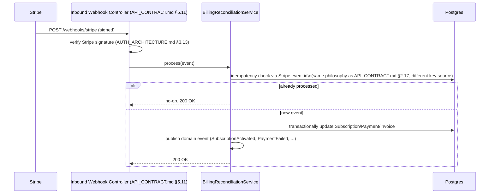

**Purpose:** the only writer of `Subscription`/`Payment`/`Invoice` rows (`API_CONTRACT.md` §5.11's Decision #12 — no `POST /payments` exists).
**Responsibilities:** `PaymentProviderPort` + `StripeAdapter` (§1.3); `BillingReconciliationService` processes inbound Stripe events idempotently (Stripe's own at-least-once delivery guarantee means the same `evt_...` may arrive more than once — processing must be a safe no-op on replay); publishes domain events other modules react to (`ai-platform`'s credit-grant logic reacts to `SubscriptionActivated` to grant the new plan's monthly `AICredit` allowance, per `DATABASE.md` §4's `PLAN_GRANT` transaction type).
**Dependencies:** `SecretsProviderPort` (Stripe webhook signing secret), `tenancy` (resolve `workspaceId` from Stripe customer metadata).
**Failure Handling:** a processing failure returns a non-2xx to Stripe, which retries per Stripe's own schedule — the idempotency check means retries are safe; a permanently-failing event is alerted, never silently dropped (same DLQ philosophy as §8.4, applied to inbound webhook processing).
**Trade-offs:** processing synchronously within the webhook handler (rather than enqueuing and returning immediately) was chosen for `v1` because Stripe events are low-volume and reconciliation is fast — revisit (move to the Queue, §8) only if Stripe's own delivery-timeout tolerance becomes a real constraint at higher volume.
**Future Evolution:** self-serve proration preview (`API_CONTRACT.md` §5.11's noted future extension) needs a synchronous, read-only Stripe call (not just webhook-driven reconciliation) — a distinct, additive capability on the same `PaymentProviderPort`.

### 7.2 Notification Engine

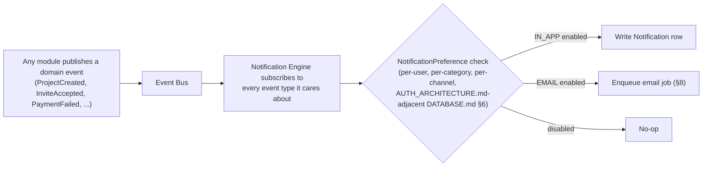

**Purpose:** the internal producer of `Notification` rows (`DATABASE.md` §6), reacting to the platform's entire domain-event vocabulary without any other module knowing it exists — the clearest illustration of why the Event Bus pattern (§3.3) earns its keep.
**Public Interface:** none exported — pure event consumer.
**Dependencies:** `EventBusPort`, `tenancy` (resolve `NotificationPreference`), `EmailProviderPort` (§1.3), Queue (§8) for email dispatch.
**Failure Handling:** a failed in-app `Notification` write is retried (idempotent — the underlying event carries enough identity to avoid duplicate notifications on retry); a failed email enqueue follows the standard Queue retry/DLQ policy (§8.3/§8.4).
**Future Evolution:** the real-time push channel `API_CONTRACT.md` §5.12 explicitly deferred (WebSocket/SSE notification delivery) attaches here as a new consumer branch reacting to the same events, once built — no change to any publisher.

### 7.3 Webhook Engine

Delivery/retry/signing mechanics are fully specified in `API_CONTRACT.md` §5.15 (sequence diagram included there) and `AUTH_ARCHITECTURE.md` §3.13 (signing). This section adds only the internal architecture: the Webhook Engine is an Event Bus consumer (like Notification), filtering each event against every workspace's subscribed `Webhook.eventTypes`, and it owns a **per-webhook circuit breaker** (§9.1) — the existing `WebhookStatus.FAILING`→`DISABLED` state machine (`DATABASE.md` §7) *is* a circuit breaker, now named as such: `consecutiveFailureCount` crossing a threshold trips the breaker (`FAILING`), and continued failure trips it fully open (`DISABLED`), stopping delivery attempts to a dead endpoint rather than retrying indefinitely against it.

### 7.4 Search Engine (ADR-003)

**Purpose:** implement `API_CONTRACT.md` §5.17's federated search endpoint.
**Responsibilities:** `SearchPort` + `PostgresFullTextSearchAdapter` — Postgres `tsvector` columns (generated/maintained via a database trigger or, more consistently with this document's "Postgres is source of truth, side effects are explicit" philosophy, updated by an async job reacting to content-change domain events, kept as an explicit engineering choice to make later since either is viable at launch scale) with GIN indexes, queried via `tsquery` ranked results. Every result is filtered through the requesting user's live permissions (`API_CONTRACT.md` §5.17's stated filter-at-query-time requirement) — implemented as an additional `WHERE` predicate joining through each searchable entity's ownership chain, never a post-hoc filter over an unrestricted result set.
**Dependencies:** each module that wants to be searchable registers its indexable fields with the Search Engine at boot (a small, explicit registration contract — not reflection-based auto-discovery, which would make "is this field searchable" hard to answer by reading code).
**Scalability:** Postgres FTS scales adequately into the hundreds of thousands of rows per workspace with proper indexing; the `SearchPort` abstraction is what makes swapping to a dedicated engine (Elasticsearch/Typesense) a contained, single-adapter change when/if that ceiling is reached — explicitly not built now (YAGNI, ADR-003).
**Rejected Alternatives:** standing up Elasticsearch at launch. Rejected as premature infrastructure — an entire additional stateful system to operate, back up, and secure, for a search volume that Postgres handles comfortably at every scale point through "100,000 users" and likely well beyond.

### 7.5 Activity Engine & 7.6 Audit Engine

Both are Event Bus consumers writing to `Activity` and `AuditLog` (`DATABASE.md` §6) respectively — kept as **two separate consumers**, not one "logging engine," because they have different write-criticality: `Activity` writes are pure best-effort/async (a dropped activity-feed entry is a minor UX gap, not a compliance problem), while the **sensitive-action subset** of `AuditLog` entries (`AUTH_ARCHITECTURE.md` §4.5's allowlist — permission changes, billing changes, workspace deletion, API key issuance) are written **synchronously, in the same transaction as the triggering change** (per that document's explicit "an action that isn't auditable shouldn't silently succeed unaudited" rule) — meaning the sensitive-action audit write happens inside the originating Use Case's own transaction, not via the Event Bus at all, while the *rest* of `AuditLog` (routine, lower-sensitivity entries) flows through the Event Bus like `Activity` does. This reconciliation — stated precisely here because it's easy to get subtly wrong — is why `AuditLog` is listed as *mostly* an event consumer with one explicit, documented synchronous exception, not a blanket async engine.

### 7.7 Feature Flag Engine

Thin: `FeatureFlagResolver` (domain service) implements `DATABASE.md` §2's override-then-default read pattern, Redis-cached (§5.8's L2 tier) and invalidated on flag-definition-change events. No further architecture beyond the standard module template + this one resolver.

### 7.8 Settings Engine

Thinner still: `Settings` is a workspace singleton (`DATABASE.md` §2) with no additional internal complexity beyond the standard module template and the `If-Match` optimistic-concurrency handling already fully specified in `API_CONTRACT.md` §2.18/§5.2. Documented here only because the assignment named it explicitly — there is nothing architecturally novel to add.

### 7.9 Plugin Engine & Marketplace Extension Layer (ADR-005)

The most forward-looking system in this document — nothing customer-facing exists for it yet (`docs/PRD.md` §21's marketplace is explicitly future), but the extension points are designed in now because retrofitting a safe extension model later is far more disruptive than reserving the shape today.

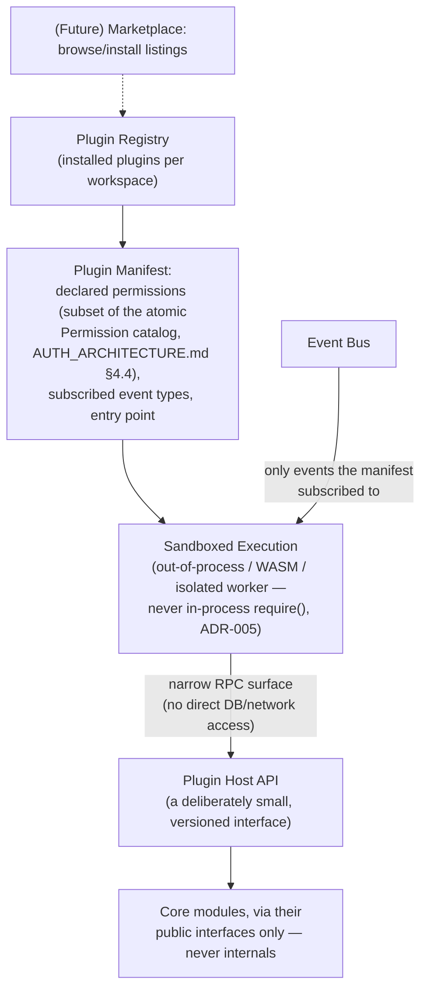

**Purpose:** a safe, least-privilege extension point for future first- and third-party functionality (`docs/PRD.md` §21's Template/Prompt marketplace, and beyond).
**Responsibilities:** a `PluginPort` interface defining the extension contract (`onInstall`, `onUninstall`, `onEvent`); a manifest-driven permission model where a plugin **declares** the atomic `Permission`s (reusing `AUTH_ARCHITECTURE.md` §4.4's exact catalog, not a parallel plugin-specific permission system) and event types it needs, granted explicitly at install time (workspace-owner-visible and revocable, mirroring the Support Access Grant pattern `AUTH_ARCHITECTURE.md` §4.7/§9 already establishes for a structurally identical "outside code needs scoped access" problem).
**Security Considerations (the core of this section):** third-party plugin code is **never executed in-process** — ADR-005 rejects the fast, simple `require()`-a-plugin-module approach specifically because it would hand arbitrary third-party code full access to the Node process (every tenant's data flowing through the same memory space, every environment secret readable). The sandboxed model (a separate worker process or WASM runtime per plugin invocation, communicating over a narrow, versioned RPC surface that exposes *only* the specific core-module public interfaces the plugin's manifest was granted) is the Zero Trust principle from `AUTH_ARCHITECTURE.md` §0.4 extended to its logical conclusion: code you didn't write is untrusted code, full stop, regardless of how it's distributed.
**Failure Handling:** a plugin that crashes, hangs, or exceeds a resource budget (CPU/memory/execution-time quota, enforced by the sandbox) is terminated without affecting the host process — isolation is the whole point.
**Trade-offs:** sandboxing has real latency and engineering cost compared to in-process execution — accepted unconditionally for third-party code; **first-party** "plugins" (BizPilot's own bundled integrations, if that pattern is ever used internally before a real marketplace exists) may reasonably run in-process, since they carry the same trust level as the rest of the codebase — the sandboxing requirement specifically tracks *trust boundary*, not "is it technically a plugin."
**Rejected Alternatives:** in-process execution with a "permissions" object passed by convention (no real enforcement, just an honor system). Rejected outright — an honor-system permission model provides no actual security boundary against a malicious or buggy plugin, which defeats the purpose of having a permission manifest at all.
**Future Evolution:** this section describes the *shape*; the marketplace UI/listing/install-flow itself is `docs/PRD.md` §21 territory and is not designed here, deliberately — this document stops at "here is the safe extension point the marketplace will eventually be built on top of."

---

## 8. Asynchronous Processing Subsystem

Scheduler, Cron Jobs, Background Workers, Queue Workers, Job Processing, Retry Strategy, and Dead Letter Queue Strategy are one cohesive subsystem, not seven independent ones.

### 8.1 Phasing

| Phase | Mechanism | Used for | Horizontally safe? |
|---|---|---|---|
| **Phase 1 (launch)** | Scheduled interval jobs querying Postgres directly, running inside the API process | Session cleanup, GDPR anonymization, credit expiration, audit-log archival (all per `AUTH_ARCHITECTURE.md` §8.4's already-stated Phase 1 list) | **No** — see below |
| **Phase 2 (growth)** | Redis-backed queue (BullMQ, per `AUTH_ARCHITECTURE.md` §8.4's named choice), consumed by the separate Worker process (ADR-006) | Everything in Phase 1, plus: email dispatch, webhook delivery, file/image processing, conversation summarization, search-index updates, AI-usage aggregation | Yes |

**Design Decisions:** Phase 1 is explicitly documented as **not horizontally safe** — a naive `setInterval`-based cron running inside every API process instance means every instance runs the same scheduled job simultaneously the moment the API scales past one instance, a real and common bug (duplicate emails sent, duplicate cleanup work racing itself). This is stated as a **hard requirement, with a trigger condition**: Phase 2 must ship *before* the API process is horizontally scaled past one instance, not as a someday-nice-to-have — the mission brief's "10 → 1,000,000 users" range guarantees this trigger condition will be hit, so Phase 2's design (below) is fully specified now even though Phase 1 may be all that exists at the very start.

### 8.2 Queue Pipeline

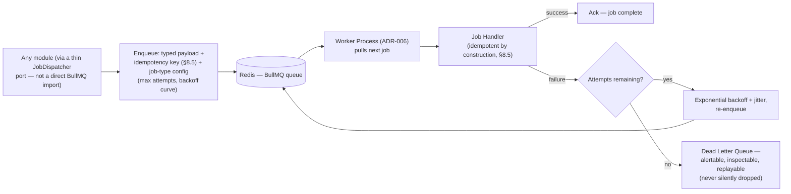

**Design Decisions:** producers never import BullMQ directly — a thin `JobDispatcherPort` (§1.3-style) means the queue implementation itself is swappable (Redis/BullMQ today; a cloud-managed queue or Kafka-backed consumer group later, §13.1) without touching every module that enqueues work. Job payloads are versioned and schema-validated at enqueue time (Fail Fast — malformed job data is rejected before it ever reaches Redis, not discovered by a worker crash later).

### 8.3 Retry Strategy

Exponential backoff with jitter (avoiding thundering-herd re-attempt synchronization across many failed jobs), bounded max attempts, **per-job-type configurable** — a transient network blip retries quickly with a generous attempt budget (e.g., email sending); a job whose failure likely indicates a genuine data problem retries more conservatively. This mirrors the Webhook Engine's already-established retry shape (§7.3) — the same pattern, generalized to every job type in the system rather than reimplemented per-engine.

### 8.4 Dead Letter Queue Strategy

A job that exhausts its retry budget moves to a DLQ — never silently discarded (`AUTH_ARCHITECTURE.md` §8.4's rule, now given a concrete mechanism). DLQ entries are inspectable and manually replayable via an internal operations tool (out of scope for this document's design, but the DLQ's existence as an addressable, queryable store is the requirement this document commits to). A sustained DLQ growth rate for one job type is a Prometheus-alertable signal (§5.7/§10.2) — treated as an incident, not background noise.

### 8.5 Idempotency in Job Processing

Every job handler is written assuming **at-least-once delivery** — the queue may, under failure/retry conditions, invoke a handler more than once for logically "the same" unit of work, and the handler must produce the same end state either way. This is the same idempotency philosophy as `API_CONTRACT.md` §2.17 (client-facing) and §7.1's Stripe-event processing, applied a third time at the job-processing layer — stated explicitly as **one unified philosophy applied at three layers**, not three unrelated mechanisms that happen to look similar. **Exactly-once delivery is deliberately not promised** — it's a well-known distributed-systems near-impossibility to achieve cheaply, and at-least-once-plus-idempotent-handlers delivers the same practical guarantee (no double-processing effects) at a fraction of the engineering cost.

### 8.6 Scheduler (Cron)

Phase 1: raw interval timers (explicitly not horizontally safe, §8.1). Phase 2: BullMQ's repeatable-job feature, which is Redis-coordinated — only one worker instance picks up a given scheduled run regardless of how many worker instances are deployed, and the schedule itself survives a process restart (state lives in Redis, not in an in-process timer that resets on deploy).

---

## 9. Resilience & Concurrency

### 9.1 Circuit Breakers

Applied at every outbound-adapter boundary named in §1.3's port table (OpenAI, Stripe, S3, per-customer webhook endpoints) — standard closed/open/half-open state machine, **independent breaker state per adapter instance** (an OpenAI outage never trips the Stripe breaker) and, for the Webhook Engine specifically, **independent state per customer endpoint** (already the existing `WebhookStatus` state machine, §7.3, now formally named as this pattern). Configurable failure-rate threshold and reset (half-open probe) timeout per adapter type, since an AI provider's acceptable failure tolerance and a payment provider's are not the same number.

### 9.2 Timeout Strategy

Every outbound call has an explicit, bounded timeout — "wait forever" is never a valid state. Tiered by call type: fast internal operations (a few seconds ceiling), AI generation (tens of seconds to low minutes, still bounded — and the Streaming Engine, §6.4, is the better UX answer to "this might take a while" regardless of the hard ceiling), webhook delivery to customer endpoints (a few seconds — a slow customer endpoint must not tie up a delivery worker indefinitely).

### 9.3 Rate Limiting (Internal Mechanism)

`API_CONTRACT.md` §2.19 fully specifies the external contract (tiers, headers). Internally: a Redis-backed token-bucket algorithm (atomic via a Lua script or Redis's native rate-limiting command patterns), consulted through a `RateLimiterPort` (§1.3) — same graceful-degradation philosophy as every other Redis-dependent mechanism in this system (§5.8, `AUTH_ARCHITECTURE.md` §8.1): Redis unavailability narrows this defense layer, it never blocks all traffic.

### 9.4 Concurrency Control

Optimistic (via `ETag`/`If-Match`, fully specified at the API layer in `API_CONTRACT.md` §2.18) for multi-editor resource updates; pessimistic (Postgres row locks) only where a true check-then-act invariant must never race, per §6.5's Credit Ledger and `AUTH_ARCHITECTURE.md` §3.8's refresh-token rotation — the same two patterns, applied consistently, never a third ad hoc mechanism introduced per-feature.

### 9.5 Transactions

**Rule, stated once, applied everywhere:** any Use Case performing more than one write across an aggregate boundary **must** wrap them in a single Prisma `$transaction` — no exceptions, no "it's probably fine." This is exactly the Factory pattern's job (§4.5) — `WorkspaceFactory`/`PromptFactory` exist specifically to encapsulate these multi-write invariants so no Use Case has to remember to wrap them correctly ad hoc.

### 9.6 Distributed Locks

Postgres row-level locking (`SELECT ... FOR UPDATE`) is the **default, correct mechanism** for single-row invariant protection at BizPilot AI's current (monolith, single-database) architecture — proven out twice already in this document's dependency chain (`AUTH_ARCHITECTURE.md` §3.8's refresh rotation, §6.5's credit ledger). Redis-based distributed locking (Redlock or a simpler single-instance lock) is reserved, explicitly, for coordination a single Postgres row cannot express — a need that does not exist today given the monolith's single-database transactionality already covers every current invariant, and is flagged as a concrete trigger condition for the post-microservice-extraction future (§13.4), where a genuinely cross-database invariant might first appear.

### 9.7 Idempotency (Consolidated Reference)

Fully specified across three layers, cross-referenced rather than restated: client-facing (`API_CONTRACT.md` §2.17), inbound webhook processing (§7.1), and job processing (§8.5) — one philosophy, three mechanisms matched to their layer.

---

## 10. Observability & Operations

### 10.1 Health, Readiness & Liveness Checks

Extends `API_CONTRACT.md` §5.18's external contract with the internal composition rule: the readiness check aggregates independent sub-checks (Postgres connectivity, Redis connectivity if configured) each with its **own bounded timeout** — a hanging dependency check must never hang the readiness probe itself (a probe that never returns is functionally worse than one that returns "not ready" quickly, since orchestrators/load balancers depend on a timely answer to route traffic correctly). Liveness (`/healthz`) checks only "is the process able to respond at all" — it deliberately does **not** check downstream dependencies (a Postgres outage should mark the process **not ready**, not **not alive** — killing/restarting a healthy process because its database is down would make an outage worse, not better, a subtle but important distinction between the two checks).

### 10.2 Metrics & Performance Monitoring

Covered in §5.7 (RED/USE frameworks). This section adds the alerting posture: RED-method error-rate and duration-percentile (p95/p99) alerts per critical Use Case (login, AI generation, checkout), USE-method saturation alerts on DB connection-pool exhaustion, Redis memory pressure, and queue depth (§8.4's DLQ growth signal).

### 10.3 Memory Management

Node.js-specific guidance, concretely: (1) the two-tier cache (§5.8) has an explicitly bounded L1 size — no unbounded in-process cache is ever introduced; (2) large file operations never buffer in the API process (§5.6/§12.1's direct-to-storage design already avoids this by construction, called out here as a memory-management win, not just an upload-flow detail); (3) event-loop lag (§5.7) is monitored as the leading indicator of memory-pressure-adjacent degradation (excessive GC pause time shows up as event-loop lag before it shows up as an OOM kill).

---

## 11. Security Layer (Backend Infrastructure View)

Extends `AUTH_ARCHITECTURE.md` §5.7/§5.9 (which specified the *policy*) with the *module* that implements it.

### 11.1 Secrets Management

A `SecretsProviderPort` (§1.3), injected via DI, is the **only** legal way any code obtains a secret — `process.env` is read exactly once, at boot, by the Config Loader (§2.4), and never again anywhere else in the codebase. Centralizing all secret access through one port is precisely what makes rotation (§11.3) operationally tractable: every consumer resolves the *current* value through the port (subject to the port's own defined cache TTL), never a value captured and held stale at boot.

### 11.2 Encryption

`EncryptionService` (a domain-adjacent utility in `core/` or `shared/`) implements envelope encryption (a data-encryption key wrapped by a master key held in the secrets provider) applied **selectively** — only to the specific fields `DATABASE.md`/`AUTH_ARCHITECTURE.md` already flagged as needing it (`Webhook.secret` today; a future `MfaFactor` TOTP secret). Blanket database-wide encryption is explicitly rejected: it would add overhead everywhere for benefit nowhere, and it would break the query/filter/sort capabilities `API_CONTRACT.md` §2.11/§2.12 promise on fields that don't actually need confidentiality-at-rest beyond Postgres's own disk encryption.

### 11.3 Key Rotation

The JWT signing-key rotation *policy* is fully specified in `AUTH_ARCHITECTURE.md` §5.9; this document's contribution is that it is implemented as a **scheduled job** (§8) — not a manual, ad hoc procedure — precisely because that document already flagged manual rotation as error-prone (grace-period sequencing mistakes). The same job-based rotation pattern extends to the Argon2 pepper and any future envelope-encryption master key.

---

## 12. File & Media Pipeline

### 12.1 Storage Pipeline

```mermaid
sequenceDiagram
    participant C as Client
    participant API as API Process
    participant S3 as Object Storage
    participant Q as Queue
    participant W as Worker

    C->>API: POST /files/upload-url
    API-->>C: pre-signed PUT URL (short TTL)
    C->>S3: PUT bytes directly (never through API process)
    C->>API: POST /files (register metadata)
    API->>API: verify storageKey matches the issued upload-url (API_CONTRACT.md §5.6)
    API->>Q: enqueue FileProcessing job
    API-->>C: 201, File.status = PROCESSING
    Q->>W: dequeue
    W->>S3: fetch object (streamed, never fully buffered)
    W->>W: virus/malware scan (future); if FileKind.IMAGE: extract dimensions,\ngenerate thumbnail, extract dominant color
    W->>API: (via repository) update File.status = READY, populate Image metadata
```

**Design Decisions:** already established at the API-contract level (`API_CONTRACT.md` §5.6) that the API process never buffers file bytes — this section adds the *processing* stage, which happens entirely in the Worker process (§8), never the API process, keeping the API tier's memory footprint independent of file size or processing complexity regardless of scale.

### 12.2 Image Processing Pipeline & Media Storage

An `ImageProcessingPort` (§1.3) behind which today's implementation is an in-process image library running inside the Worker (not the API) process; the port is what allows a future swap to a dedicated media-processing service (relevant once thumbnail/transcoding volume or format diversity — video, per `FileKind.VIDEO`'s already-reserved enum value — outgrows in-process processing) without touching the `content` module's domain or application code. Media is served via the CDN (§1.1) fronting Object Storage with short-TTL signed URLs (`API_CONTRACT.md` §5.6's stated design), never proxied through the API process.

---

## 13. Future Evolution

### 13.1 Future Event Bus, Redis Layer & Kafka Compatibility (ADR-007)

The `EventBusPort` (§1.3) is implemented today by an `InProcessEventEmitterAdapter` — but is **designed against a Kafka-compatible mental model from day one**: events are namespaced by type the way Kafka topics are, and consumers are structured with consumer-group-like semantics (each consumer type — Notification, Webhook, Activity, Audit — processes every event of the types it subscribes to, independently of every other consumer type, exactly matching how independent Kafka consumer groups read the same topic). This is deliberate, not incidental: Phase 2 (Redis Streams, per `AUTH_ARCHITECTURE.md` §8.5's already-named choice) and a hypothetical Phase 3 (real Kafka, once event volume or true multi-service, multi-language fan-out genuinely needs it) are both **adapter swaps behind the same port**, not application-level rewrites — the same hexagonal-adapter philosophy this document has applied to every other external system, now applied to eventing itself, which is precisely why it's worth stating as its own explicit architectural commitment (ADR-007) rather than leaving it implicit.

### 13.2 Deployment Diagram

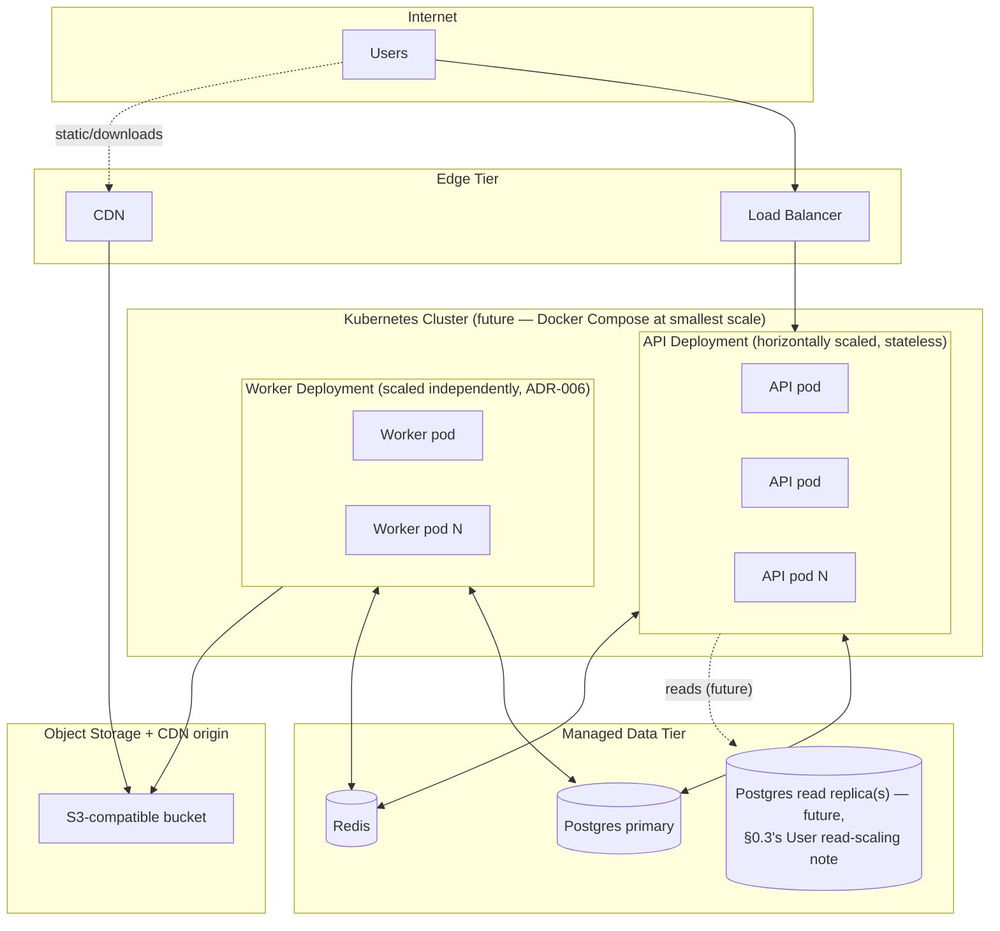

**Design Decisions:** the API and Worker deployments scale on **independent triggers** (API: request rate/latency; Worker: queue depth) — this is ADR-006's payoff made concrete at the infrastructure level. At the smallest deployment scale ("10 users"), this entire diagram collapses to a single Docker Compose file running one API container, one Worker container (or the Phase-1-only variant with no separate Worker at all, §8.1), one Postgres container, one Redis container — the *architecture* doesn't change between these two extremes, only how many replicas of each box exist, which is exactly the "no major redesign across the user-count range" mission requirement made literal.

### 13.3 Read/Write Model Separation (CQRS-Readiness)

Use Cases are already split by intent at the Application layer (§0.3) — a `CreateProjectUseCase` (command) and a `ListProjectsUseCase` (query) are separate classes today, both reading/writing the same Postgres tables through the same repository. **Full CQRS** (a genuinely separate read model — a denormalized read-store, or the Postgres read replica shown in §13.2) is not built now: the command/query class separation already in place is what makes introducing a distinct read path later a matter of pointing query Use Cases at a new data source, not a redesign of the Application layer's shape.

### 13.4 Future Microservice Boundaries

Directly extends `AUTH_ARCHITECTURE.md` §8.6's three-phase plan (Identity & Access first) and `DATABASE.md` §3.7's bounded-context sequencing recommendation, unified into one diagram:

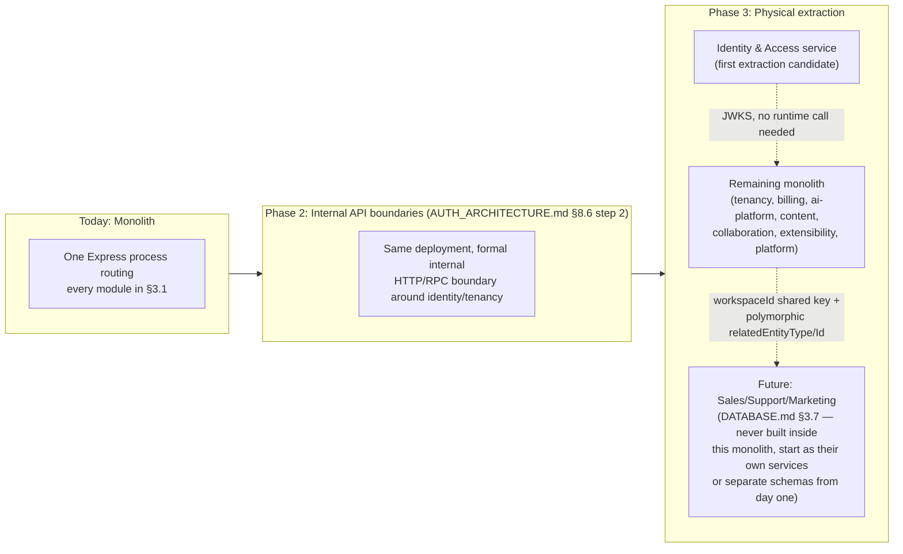

**Design Decisions:** every module in §3.1 is *already* a candidate extraction unit by construction (ADR-002's public-interface-only communication rule is precisely what makes this true) — the sequencing shown (Identity first) is inherited unchanged from `AUTH_ARCHITECTURE.md` §8.6, not re-derived. `Sales`/`Support`/`Marketing` (`DATABASE.md` §3.7's explicitly deferred domains) are shown as never having existed inside this monolith at all — when built, they attach via the same `workspaceId`-shared-key and polymorphic-reference patterns that document already established, arriving as genuinely new services or schemas from their first line of code, not as a future extraction from this codebase.

---

## 14. Complete Project Structure

```
backend/
├── src/
│   ├── main.ts                       — API process entry point: load config → build container →
│   │                                    register modules → mount routes/middleware → listen (§2.1)
│   ├── worker.ts                     — Worker process entry point (ADR-006): same container/module
│   │                                    registration, different bootstrap tail (queue consumers, not HTTP)
│   │
│   ├── bootstrap/
│   │   ├── container.ts              — the Composition Root (§2.2): the ONLY file that imports every
│   │   │                                concrete Infrastructure class and wires it to its port
│   │   ├── module-registry.ts        — topological module registration in dependency order (§1.4, §2.1)
│   │   └── middleware-pipeline.ts    — assembles API_CONTRACT.md §1.3's ordered middleware stack
│   │
│   ├── config/
│   │   ├── schema.ts                 — the typed, validated environment schema (§2.4) — Fail Fast root
│   │   └── index.ts                  — loads + validates once at boot; the ONLY `process.env` reader
│   │                                    in the entire codebase (§11.1)
│   │
│   ├── core/                         — Clean Architecture "kernel": framework-agnostic, BizPilot-agnostic
│   │   ├── entity.ts                 — base Entity/AggregateRoot classes
│   │   ├── value-object.ts           — base ValueObject class
│   │   ├── domain-event.ts           — base DomainEvent type
│   │   ├── result.ts                 — Result<T, E> type for railway-oriented domain error handling
│   │   └── ports/                    — the base ports every module composes with its own:
│   │                                    RepositoryPort<T>, EventBusPort, CachePort, SecretsProviderPort,
│   │                                    RateLimiterPort, DistributedLockPort, JobDispatcherPort (§1.3)
│   │
│   ├── shared/                       — Shared Kernel: cross-bounded-context DOMAIN concepts
│   │                                    (distinct from core/ — this is BizPilot-specific, core/ is not)
│   │   ├── value-objects/            — Money, EmailAddress, and other VOs genuinely used by >1 module
│   │   └── specifications/           — cross-module specification base utilities
│   │
│   ├── modules/                      — one folder per bounded context (§3.1), each following the
│   │   │                                Module Template (§3.2) exactly
│   │   ├── identity/
│   │   ├── tenancy/
│   │   ├── billing/
│   │   ├── ai-platform/
│   │   ├── content/
│   │   ├── collaboration/
│   │   ├── extensibility/
│   │   └── platform/
│   │
│   ├── providers/                    — SHARED infrastructure adapters (§1.3), used by DI-injection into
│   │   │                                multiple modules — placed here rather than inside one module's
│   │   │                                infrastructure/ specifically because the underlying resource
│   │   │                                (client, connection pool) is process-wide, not module-private
│   │   ├── openai/                   — OpenAIAdapter (implements ai-platform's AIProviderPort)
│   │   ├── stripe/                   — StripeAdapter (implements billing's PaymentProviderPort)
│   │   ├── object-storage/           — S3Adapter (implements content's ObjectStoragePort)
│   │   ├── redis/                    — CachePort/RateLimiterPort/JobDispatcherPort Redis implementations
│   │   ├── secrets/                  — SecretsProviderPort implementation (env var dev / KMS prod)
│   │   ├── email/                    — EmailProviderPort implementation
│   │   ├── logger/                   — structured logger + AsyncLocalStorage request-context (§5.6)
│   │   └── telemetry/                — OpenTelemetry tracer/meter setup (§5.7)
│   │
│   ├── workers/                      — Worker-process-only job HANDLERS (the code that runs when a
│   │   │                                queued job is dequeued) — organized by owning module, but kept
│   │   │                                centrally listed since the Worker process needs one registry
│   │   ├── notification/
│   │   ├── webhook-delivery/
│   │   ├── file-processing/
│   │   ├── conversation-summarization/
│   │   ├── billing-reconciliation/
│   │   └── maintenance/              — session cleanup, GDPR anonymization, credit expiry, audit archival
│   │
│   ├── jobs/                         — job PAYLOAD SCHEMAS + per-job-type retry/backoff/DLQ config (§8.2)
│   │                                    — the contract between a producer (in a module) and its handler
│   │                                    (in workers/); kept separate from workers/ so a module can
│   │                                    depend on a job's schema (to enqueue it) without depending on
│   │                                    the Worker-process-only handler code
│   │
│   ├── events/                       — the Event Bus's shared event-type CATALOG: a central registry of
│   │                                    every domain event name in the system (§13.1) — needed so
│   │                                    cross-cutting consumers (collaboration's engines) have one place
│   │                                    to discover "what events exist" without importing every module
│   │
│   ├── common/                       — cross-cutting code that IS framework-aware (imports Express types),
│   │   │                                unlike core/ — the practical home for the assignment's named
│   │   │                                middlewares/guards/interceptors/filters/utils/types/constants
│   │   ├── middlewares/              — request-id, CORS, security headers, body parsing, rate limiting,
│   │   │                                CSRF, idempotency-key handling (API_CONTRACT.md §1.3)
│   │   ├── guards/                   — the shared `authorize(permissionKey)` guard (§3.2) invoking
│   │   │                                AUTH_ARCHITECTURE.md §4.5's permission pipeline
│   │   ├── interceptors/             — response-envelope wrapping (API_CONTRACT.md §2.20), ETag generation
│   │   ├── filters/                  — the global error-handling filter (§5.5's mapping table)
│   │   ├── utils/                    — generic, ownerless helper functions (no business meaning)
│   │   └── types/                    — generic, ownerless TypeScript utility types (Nullable<T>,
│   │                                    PaginatedResult<T>, ...) — see ADR-010 for why this replaces
│   │                                    a separate top-level interfaces/ folder
│   │
│   ├── errors/                       — the complete DomainError hierarchy (§5.5) + the exhaustive
│   │                                    DomainError→HTTP-status/RFC7807 mapping table
│   │                                    (API_CONTRACT.md §3.2's taxonomy, implemented here)
│   │
│   ├── testing/                      — shared test utilities used across every module's test suite:
│   │   ├── builders/                 — entity/DTO test-data builders (fast, readable test setup)
│   │   └── fakes/                    — in-memory fake implementations of core/ ports (FakeRepository,
│   │                                    FakeEventBus, FakeClock) enabling Domain/Application unit tests
│   │                                    with zero database, per §1.2's testability payoff
│   │
│   └── scripts/                      — one-off operational scripts (Permission/Role catalog seeding,
│                                        manual reconciliation runners) — explicitly NEVER imported by
│                                        src/main.ts or src/worker.ts; run only via a separate CLI
│                                        invocation, so a "seed script" import can never leak into the
│                                        production runtime bundle
│
├── prisma/
│   └── schema.prisma                 — unchanged, per docs/DATABASE.md — the only file this document's
│                                        modules/*/infrastructure/repositories/ layer is allowed to
│                                        generate types from
│
└── tests/                            — integration/e2e tests spanning multiple modules or requiring a
                                         real database — module-local unit tests live beside their
                                         source (§14.1's Testing Strategy) rather than here
```

### 14.1 Why `domain/`, `application/`, `infrastructure/` Are Not Top-Level Folders

Stated explicitly since the assignment names them as top-level folders and this document deliberately does not place them there (ADR-001, §1.2, §3.2): a top-level `domain/` folder would force every module's domain code into one undifferentiated directory, which is precisely the "layer-first" structure §1.2 rejects — it optimizes for "find all the entities" (rare) over "find everything about Projects" (constant, the actual day-to-day navigation need for a team organized around features). `domain/application/infrastructure/presentation` are real, load-bearing folder names in this architecture — they simply exist **inside each module**, not once at the repository root.

---

## 15. Engineering Quality & Governance

### 15.1 Coding Standards & Naming Conventions

| Concept | Convention | Rationale |
|---|---|---|
| Files | `kebab-case.ts` | Matches the URL/resource kebab-casing already established in `API_CONTRACT.md` §2.3, one fewer convention to hold in your head |
| Classes/Types | `PascalCase` | Standard TypeScript convention |
| Use Cases | `{Verb}{Noun}UseCase` (`CreateProjectUseCase`) | Self-documenting; an `ls` of `use-cases/` is a readable index of everything a module *does* |
| Ports (interfaces) | `{Noun}Port` (`ObjectStoragePort`) | Immediately distinguishes a port from its adapter at a glance |
| Adapters | `{Provider}Adapter` (`OpenAIAdapter`) | Same reasoning, opposite side |
| Domain Errors | `{Reason}Error`, extends the taxonomy root (`InsufficientCreditsError`) | Matches `API_CONTRACT.md` §3.2's error-code style |
| Domain Events | `{Entity}{PastTenseVerb}` (`ProjectCreated`, `InviteAccepted`) | Events are facts that already happened — past tense is a deliberate, load-bearing convention (`AUTH_ARCHITECTURE.md` §8.5's exact rule, restated here since it applies platform-wide, not just to the auth module) |

### 15.2 Dependency Rules (Consolidated)

The complete, enforced rule set, gathered from §1.2/§1.4/§3.3 into one place for reference: (1) Presentation → Application only. (2) Application → Domain (ports) only, never concrete Infrastructure. (3) Infrastructure → Domain (implements ports), never imported by Domain/Application by type name. (4) Modules → other modules' `index.ts` only, or the Event Bus — never another module's `domain/application/infrastructure/presentation` internals. (5) `core/` and `shared/` have no dependencies on any module. Enforced in CI via an import-boundary linter (dependency-cruiser or equivalent), not by code review discipline alone — a rule that only exists in a document is a rule that erodes; a rule the build fails on does not.

### 15.3 Migration & Versioning Strategy

**Database migrations:** Prisma Migrate, unchanged from `docs/DATABASE.md`'s scope — this document adds only the *process* rule: a migration that changes a column's meaning or removes one follows the same additive-first, deprecate-then-remove discipline as `API_CONTRACT.md` §2.1's API versioning (add the new column, dual-write/backfill, migrate readers, then drop the old column in a later, separate deploy — never a single "rename in place" migration for anything already serving production traffic). **API versioning:** fully specified in `API_CONTRACT.md` §2.1, unchanged here. **Internal module public-interface versioning:** a module's `index.ts` is a compatibility contract between modules the same way the REST API is a contract between the frontend and backend — a breaking change to a module's public interface requires updating every internal caller in the same change set (enforced trivially by TypeScript's own compiler, since this is all in one codebase/build — the discipline that requires *documentation* at the external API boundary is enforced *automatically* at the internal module boundary, one of the concrete advantages of the monolith-with-clean-module-boundaries structure this document commits to).

### 15.4 Testing Strategy

| Layer | What's tested | How | Speed |
|---|---|---|---|
| Domain | Entities, Value Objects, Policies, Specifications, Domain Services | Pure unit tests — plain object construction, no mocks needed beyond `testing/fakes/` (§14) | Milliseconds, thousands per CI run |
| Application | Use Cases | Unit tests against `testing/fakes/` port implementations (FakeRepository, FakeEventBus) — no real database | Milliseconds |
| Infrastructure | Repository/adapter implementations | Integration tests against a real (test) Postgres/Redis instance — verifying the Prisma query actually does what the domain port contract promises | Seconds |
| Presentation | Routes/controllers | Integration tests through the real Express app (supertest-style), real middleware pipeline, test database | Seconds |
| Cross-module | Multi-module flows (e.g., "creating a project triggers an activity entry") | End-to-end tests in `tests/`, exercising the real Event Bus | Seconds |

**Design Decisions:** the pyramid is intentionally bottom-heavy — the Clean Architecture layering (§1.2) exists specifically to make the largest, cheapest, fastest test tier (Domain unit tests) able to cover the majority of actual business-rule complexity (credit balance invariants, permission resolution, plan entitlement logic) without touching a database at all, which is what keeps a CI run fast even as the domain-rule surface grows over a decade.

### 15.5 CI/CD & Deployment Readiness

Every commit: typecheck, lint (including the dependency-boundary rule, §15.2), the full test pyramid (§15.4), `prisma migrate diff` validation against the target database. Every deploy: database migrations run and confirmed **before** the new application version receives traffic (never the reverse — a new version expecting a column that doesn't exist yet is a Fail-Fast-violating, self-inflicted outage). The API and Worker processes (§13.2) are independently deployable artifacts from one codebase and one CI pipeline — a Worker-only change (e.g., a new job handler) does not require an API redeploy, and vice versa, reducing blast radius per deploy.

### 15.6 Disaster Recovery & Business Continuity

Postgres is the single source of truth for every correctness-relevant fact in this system (§0.1's opening claim, reinforced throughout) — DR planning therefore centers entirely on Postgres backup/restore (point-in-time recovery, cross-region replication as a future hardening step tied to `DATABASE.md` §3.1's workspace-sharding note for Enterprise data-residency). Redis's total, permanent loss is — by the cache-only design commitment made and re-proven in `AUTH_ARCHITECTURE.md` §8.1 and every subsequent section of this document that touches Redis — a **performance degradation event, never a data-loss event**: nothing in this backend is ever correct-but-only-in-Redis. Object storage (files/images) requires its own backup/versioning policy (provider-level, e.g. S3 versioning/cross-region replication), independent of the Postgres story.

### 15.7 Performance Strategy

Consolidated from throughout: stateless horizontal scaling of the API tier (§1, §9.4's no-in-process-state rule); independent Worker scaling on queue-depth rather than request-rate (§8, §13.2); the two-tier cache removing the hottest, smallest reads from the database entirely (§5.8); direct-to-storage file transfer removing the largest-payload operations from the API process entirely (§12.1); bounded conversation context preventing unbounded per-request AI cost growth (§6.1); a read-replica-ready query path (Use Case command/query separation, §13.3) for the eventual read-scaling need. No single mechanism carries this document's performance story — it is the sum of every "don't hold state, don't buffer what can stream, don't compute what can be cached, don't block what can be async" decision made throughout.

### 15.8 Security Strategy

This document's contribution to security is entirely at the **architecture-enables-security** level, not policy (which is `AUTH_ARCHITECTURE.md`'s domain, unchanged): the Dependency Rule (§1.2) means a compromised Infrastructure adapter can't corrupt Domain invariants (Domain never trusts Infrastructure's raw output — it only accepts values that have passed through construction/validation); the module-boundary rule (§3.3) means a bug in one bounded context's code cannot directly reach into another's data; the Plugin Engine's sandboxing (§7.9) extends Zero Trust to third-party code specifically; and centralized secret access (§11.1) is what makes credential rotation and audit-of-secret-access tractable platform-wide rather than needing to be verified file-by-file.

### 15.9 Developer Experience Strategy

Fail Fast at every layer (config validation at boot, TypeScript's compiler enforcing exhaustive error mapping, the dependency-boundary linter catching architecture violations before code review) means the feedback a developer gets is as close to "at the keystroke" as this stack allows, not "discovered in staging." The Module Template (§3.2) being identical across all eight modules means a developer who has worked in one module already knows the shape of every other — onboarding cost for module #2 through #8 is materially lower than module #1, a deliberate, compounding DX investment.

### 15.10 Technical Debt Policy

Every deliberate scope-cut in this document (Postgres FTS before Elasticsearch, in-process events before Kafka, scheduled jobs before a queue, static provider routing before dynamic) is **documented, not silent** — each carries an explicit trigger condition for revisiting it (§7.4, §8.1, §13.1, §6.3). This is the technical debt policy stated as a practice rather than a paragraph: debt taken on knowingly, with its repayment trigger written down next to it, is a normal and healthy engineering tool; debt that's invisible until it causes an incident is the only kind this document treats as a failure mode to avoid.

---

## 16. Consolidated Risks

| Risk | Severity | Mitigation | Residual risk accepted |
|---|---|---|---|
| Phase 1 async processing (§8.1) is not horizontally safe | Medium, time-bounded | Explicit, documented trigger condition: Phase 2 must ship before the API scales past one instance | Acceptable only for the earliest deployment stage; tracked as a hard blocker, not a someday-item |
| Module-template ceremony (four layers per module) is more code than a minimal CRUD backend needs at "10 users" scale | Low | The mission brief explicitly demands designing for the full range up to 1,000,000+ users without redesign — the ceremony is the cost of that requirement, paid once, not per scale-up | Slower initial module scaffolding, judged worthwhile given the stated 10-year horizon |
| Plugin sandboxing (§7.9) adds real engineering cost before any marketplace customer exists | Low | Only the extension *points* are designed now (event catalog, permission-manifest shape); the sandbox runtime itself is not built until `docs/PRD.md` §21 is prioritized | None — this section is deliberately design-only, not a build commitment |
| Two-phase AI credit reservation (§6.5) is more complex than a single-step check-and-debit | Low | The single-step alternative is provably incorrect under concurrency (§6.5's Trade-offs) — complexity here is not optional | None — this is the correct solution to a real race condition, not gold-plating |
| Postgres FTS (ADR-003) may not scale to very large per-workspace content volumes indefinitely | Low–Medium | `SearchPort` abstraction makes the swap to a dedicated engine a contained, single-adapter change | Acceptable given no current workspace is remotely close to the volume where this would matter |

---

*End of Backend Core Architecture document.*
