# BizPilot AI — Cloud Infrastructure, Platform Engineering & Site Reliability Architecture

**Status:** Architecture Decision Document (ADD) — governs all infrastructure, deployment, and operational decisions.
**Depends on (immutable, cited not redesigned here):** [ARCHITECTURE.md](ARCHITECTURE.md), [PRD.md](PRD.md), [DATABASE.md](DATABASE.md), [AUTH_ARCHITECTURE.md](AUTH_ARCHITECTURE.md), [API_CONTRACT.md](API_CONTRACT.md), [BACKEND_ARCHITECTURE.md](BACKEND_ARCHITECTURE.md), [AI_PLATFORM_ARCHITECTURE.md](AI_PLATFORM_ARCHITECTURE.md).
**Scope:** How the seven prior documents' components are provisioned, networked, deployed, scaled, observed, secured, and recovered — from a 10-user single founder to a 10,000,000+-user enterprise platform, with no architectural rewrite required at any point on that curve.

---

## 0. Document Conventions

### 0.1 What this document is not

This document does not redesign the application (`BACKEND_ARCHITECTURE.md`), the AI platform (`AI_PLATFORM_ARCHITECTURE.md`), the data model (`DATABASE.md`), identity (`AUTH_ARCHITECTURE.md`), or the wire contract (`API_CONTRACT.md`). Every reference to those documents below is a citation, not a proposal. Where this document names a concrete technology category (managed Postgres, a container orchestrator, a CDN/edge network, an IaC tool, a GitOps controller, an APM stack), it deliberately avoids committing to a single vendor's proprietary format in the document body — no Terraform HCL, no Kubernetes YAML, no Dockerfiles, no CI pipeline scripts. Vendor examples are named in prose only, as illustrations of a category, never as the only compliant choice, in service of Principle 19 (Vendor Lock-in Minimization, §0.3).

### 0.2 A note on document density

Sixty subsystems at full seventeen-field depth would exceed 6,000 lines and bury the decisions that matter under repeated boilerplate. As in `BACKEND_ARCHITECTURE.md` and `AI_PLATFORM_ARCHITECTURE.md`, this document defines shared conventions once (this section, plus the per-Part "Common to this Part" notes) and gives full sixteen-field treatment (condensed into seven prose groups — Purpose & Architecture; Internal Components & Dependencies; Lifecycle & Operational Flow; Security; Scalability & Performance; Monitoring, Failure Modes & Recovery; Trade-offs & Future Evolution) to every subsystem that carries a genuine decision. Subsystems that are pure composition of already-decided primitives (e.g., "Metrics" once "Monitoring" and "Distributed Tracing" are specified) are treated at compact depth with explicit citation. Every one of the 60 named subsystems is addressed; not every one gets equal ink, because not every one carries equal decision weight.

### 0.3 Governing principles

| # | Principle | What it constrains |
|---|---|---|
| P1 | Cloud Native | Prefer managed services and container orchestration over hand-rolled VM management wherever the cost/control trade-off favors it |
| P2 | Infrastructure as Code | No infrastructure is provisioned by hand, ever, in any environment including local dev's cloud dependencies |
| P3 | GitOps | The desired state of every environment is a Git commit; no `kubectl apply`/console click is a source of truth |
| P4 | Immutable Infrastructure | Servers and containers are replaced, never patched in place; deployment artifacts are content-addressed and never mutated post-build |
| P5 | Zero-Downtime Deployments | Every deploy to Production is invisible to users under normal operation |
| P6 | Blue-Green / Canary | Traffic shifts to new versions gradually and reversibly, not atomically |
| P7 | Rolling Updates | The default within Kubernetes for stateless workloads absent an active canary |
| P8 | Horizontal Scaling | Capacity is added by adding replicas, not by resizing a single instance, as the default scaling axis |
| P9 | High Availability | No single instance of any stateful or stateless component is a single point of failure past Phase 1 |
| P10 | Fault Tolerance | Component failure degrades service, it does not cascade into full outage (§ BACKEND_ARCHITECTURE.md §9) |
| P11 | Disaster Recovery | Defined, tested, quantified RTO/RPO for every stateful system |
| P12 | Security by Default | The secure configuration is the only configuration; insecure defaults do not exist to be "hardened later" |
| P13 | Least Privilege | Every identity — human or machine — holds only the permissions its role requires, re-scoped continuously |
| P14 | Cost Efficiency | Spend is proportional to actual load, reviewed on a cadence, and never a blocker to correctness or security |
| P15 | Observability First | A component without metrics, logs, and traces is not considered production-ready, full stop |
| P16 | Automation First | Any operational task performed manually twice is a candidate for automation before the third time |
| P17 | Multi-region Ready | Nothing is architected in a way that makes a future region impossible to add without a rewrite |
| P18 | Vendor Lock-in Minimization | Every managed-service dependency is chosen behind a port/interface (`BACKEND_ARCHITECTURE.md` §11) so the underlying vendor is replaceable |
| P19 | Defense in Depth | Security controls exist at the edge, the network, the platform, and the application layer simultaneously — no single control is trusted alone |

Principles P1–P18 restate the user's 19-item brief; P19 (Defense in Depth) is added here as an explicit synthesis principle because §14 (Security Operations) depends on it and it was implicit but unstated in the brief.

### 0.4 Relationship to prior documents — what already exists, what this document adds

| Prior document | What it already committed to (cited, not redesigned) | What this document adds |
|---|---|---|
| `BACKEND_ARCHITECTURE.md` §13.2 | A deployment diagram: API and Worker as independently-scaled processes, Docker Compose at smallest scale, Kubernetes at larger scale | The full container/orchestration architecture, cluster topology, and the scaling policies behind "independently scaled" |
| `BACKEND_ARCHITECTURE.md` §11.1 | A `SecretsProviderPort` abstraction | The concrete secrets-management infrastructure behind that port |
| `BACKEND_ARCHITECTURE.md` §5.6–§5.7, §10 | OpenTelemetry instrumentation, RED/USE metrics, structured JSON logs, health/readiness/liveness endpoints | The deployed observability stack topology that ingests, stores, and alerts on that telemetry |
| `BACKEND_ARCHITECTURE.md` §8 | BullMQ-style Redis-backed job queue, Worker process, Scheduler | The infrastructure the queue and scheduler run on, and how they scale independently of the API |
| `BACKEND_ARCHITECTURE.md` §15.5–§15.6 | CI gates (typecheck/lint/test/build), migration-before-traffic rule, DR philosophy ("Postgres is the only source of truth; Redis loss is degradation, not data loss") | The pipeline mechanics implementing those gates, and the concrete DR/backup topology for Postgres |
| `AUTH_ARCHITECTURE.md` §5.2, §8, §6 | Single API origin (`api.bizpilot.ai`), key rotation as a scheduled job, GDPR/SOC 2 posture | The DNS/edge topology serving that origin, and the audit/encryption infrastructure underpinning compliance |
| `API_CONTRACT.md` §2, §5.6 | URI versioning, rate-limit tiers, signed-URL file delivery | The CDN/object-storage infrastructure delivering those files |
| `AI_PLATFORM_ARCHITECTURE.md` §14, Part 15 | Canary/shadow deployment via the `FeatureFlagEngine`, a stated future need for GPU-backed local/fine-tuned inference | Generalizing canary deployment into the platform's default CD strategy for *all* services, and the GPU infrastructure readiness plan |
| `DATABASE.md` §3.1 | `workspaceId`-scoped shared-schema multi-tenancy, a noted future path to per-tenant isolation for data residency | The multi-region and Enterprise-isolation infrastructure that future path runs on |

### 0.5 Scale targets (unchanged from prior documents)

10 users → 10,000 users → 1,000,000 users → 10,000,000+ users, with the explicit constraint (carried over from `BACKEND_ARCHITECTURE.md` and `AI_PLATFORM_ARCHITECTURE.md`) that the *architecture* does not change shape across this range — only the *configuration* (replica counts, node pool sizes, cache TTLs, region count) does. Every subsystem below states its Phase 1 (10–10K users), Phase 2 (10K–1M), and Phase 3 (1M–10M+) posture explicitly where they differ.

---

## Part 1 — Production Infrastructure Overview & Cloud Architecture

### 1.1 Production Infrastructure Overview (Subsystem 1)

**Purpose & Architecture.** BizPilot AI runs as a single logical platform deployed across a small number of environments (§2), fronted by a global edge network (§3), executing on a container orchestrator (§4) inside a private network (§3), backed by a managed relational database (§8), a managed cache/queue store (§9–§10), object storage (§9), and a fully instrumented observability stack (§11). The system is cloud-native from day one but avoids any single managed service that cannot be swapped without an application-layer rewrite, per P18 and `BACKEND_ARCHITECTURE.md`'s port/adapter discipline.

**Internal Components & Dependencies.** Five infrastructure domains compose the platform: (1) **Edge** — DNS, CDN, WAF, DDoS mitigation, TLS termination at the network boundary; (2) **Compute** — the container orchestrator running the API, Worker, Scheduler, and (future) Agent Runtime execution surfaces named in `BACKEND_ARCHITECTURE.md`; (3) **Data** — Postgres, Redis, object storage, the vector store (`AI_PLATFORM_ARCHITECTURE.md` §6); (4) **Delivery** — CI/CD pipelines, IaC, GitOps, artifact registries; (5) **Operations** — monitoring, logging, tracing, alerting, incident response, and the security-operations layer. Each domain is independently scalable and independently owned by a bounded set of infrastructure modules (§ Part 16 folder/module conventions, mirroring `BACKEND_ARCHITECTURE.md`'s bounded-context discipline applied to infrastructure rather than application code).

**Lifecycle & Operational Flow.** A request enters at the Edge domain, is authenticated/rate-limited/TLS-terminated, reaches Compute via a Load Balancer, is served by a stateless API replica which reads/writes Data, and — for asynchronous work — enqueues a job consumed by a Worker replica in the same Compute domain. Every hop emits telemetry to Operations. Every change to any domain's desired state flows through Delivery (a Git commit → CI validation → GitOps-driven convergence), never through direct manual intervention in a live environment (P2, P3).

**Security.** Defense in Depth (P19) applies domain-by-domain: Edge terminates TLS and blocks abusive traffic before it reaches the network perimeter; the network perimeter (§3) exposes no data-domain component directly to the internet; Compute workloads run under least-privilege service identities (§14.3); Data is encrypted at rest and in transit uniformly regardless of which domain initiated the connection.

**Scalability & Performance.** Scaling is domain-local: Edge scales implicitly (a property of the chosen edge network, not something BizPilot AI operates); Compute scales horizontally via the orchestrator's autoscaling primitives (§12.2); Data scales via read replicas, connection pooling, and (Phase 3) sharding readiness already flagged in `DATABASE.md` §3.1; Delivery and Operations scale by design margin, not by demand, since their load is proportional to engineering headcount and deploy frequency, not end-user traffic.

**Monitoring, Failure Modes & Recovery.** A platform-level status dashboard (§11.6) aggregates the health of all five domains. The worst-case failure mode for each domain is bounded and documented per-subsystem below; no domain's failure is permitted to silently corrupt another domain's data (enforced by the network segmentation in §3.2 and the idempotency discipline already established in `BACKEND_ARCHITECTURE.md` §8.5).

**Trade-offs & Future Evolution.** A five-domain model adds conceptual overhead versus "just a VM running everything," but is the only structure that lets Phase 1 (a handful of managed services) and Phase 3 (a multi-region, multi-cluster deployment) share the same mental model and the same GitOps repository structure — the domains don't change, only what runs inside them does. Rejected alternative: a single monolithic infrastructure repository with no domain separation, rejected because it does not scale to multiple on-call owners without merge contention and blast-radius ambiguity.

### 1.2 Cloud Architecture (Subsystem 2)

**Purpose & Architecture.** BizPilot AI adopts a **single primary cloud provider for compute and data services, with a separate, independent edge/network vendor** in front of it. This is a deliberate two-vendor split, not an oversight: coupling the edge (DNS, CDN, WAF, DDoS) to a different vendor than compute (orchestrator, managed Postgres/Redis, object storage) means a compute-provider migration never requires a DNS cutover under attack conditions, and an edge-provider migration never touches a running database. The primary compute cloud is chosen for the maturity of its managed Kubernetes offering, its managed Postgres offering's `pgvector` support (required by `DATABASE.md` §7 and `AI_PLATFORM_ARCHITECTURE.md` §6), and its GPU instance availability (§13.2). The edge vendor is chosen for global anycast network reach, integrated WAF/DDoS/CDN in one control plane, and a generous free tier that keeps Phase 1 cost near zero (P14).

**Internal Components & Dependencies.** Compute-cloud managed services consumed: managed Kubernetes, managed Postgres (Multi-AZ capable, `pgvector`-compatible), managed Redis/in-memory store, S3-compatible object storage, a container registry, a managed secrets/KMS service, and (Phase 3) GPU-backed compute pools. Edge-vendor services consumed: authoritative DNS, global CDN, WAF, DDoS mitigation, and edge TLS termination. Every one of these sits behind a port defined in `BACKEND_ARCHITECTURE.md` §11 (`ObjectStoragePort`, `CachePort`, `SecretsProviderPort`, etc.) or an infrastructure-level equivalent (the Kubernetes API itself is the portability boundary for compute — any conformant managed Kubernetes offering is a drop-in replacement).

**Lifecycle & Operational Flow.** Provider selection is revisited at each phase boundary (§0.5) as a standing agenda item, not a one-time decision — Phase 1's priority is lowest operational overhead for a near-zero-person ops team; Phase 3's priority shifts toward negotiated committed-use pricing and multi-region footprint, which may favor a different provider's regional presence for a specific new market.

**Security.** Cloud-provider IAM is the root of trust for every machine identity in Compute and Data (§14.3); the edge vendor's WAF/DDoS layer is the first security control any external request encounters (§14.1–§14.2), ahead of anything BizPilot AI's own application code executes.

**Scalability & Performance.** The compute cloud's regional capacity and the edge vendor's anycast network are both effectively unbounded relative to BizPilot AI's realistic Phase 3 scale; the constraint is never raw provider capacity, it is BizPilot AI's own architecture (autoscaling policy correctness, database connection limits, etc.), addressed throughout this document.

**Monitoring, Failure Modes & Recovery.** A full compute-cloud regional outage is the worst-case failure this architecture must survive without data loss (bounded by §8's DR posture: RPO < 5 minutes, cross-region backup replication) though not necessarily without downtime until Phase 3's multi-region posture (§13.4) is reached. A full edge-vendor outage degrades to direct-to-origin routing as a documented (not automated, Phase 1–2) manual fallback runbook, since a second, independent edge vendor is not justified until Phase 3 traffic and revenue make that redundancy's cost proportionate (P14).

**Trade-offs & Future Evolution.** Single-compute-cloud is a conscious rejection of Day-1 multi-cloud: multi-cloud from day one roughly doubles operational complexity (two IAM models, two networking models, two sets of managed-service quirks) for a redundancy benefit that a single realistic startup does not need before Phase 3, and that P18's port/adapter discipline already lets it defer without cost — the option to leave is preserved even though it is not exercised. Multi-cloud is revisited only if a specific Enterprise customer's data-residency or vendor-diversity requirement (`AUTH_ARCHITECTURE.md` §6.3) demands it, at which point it becomes an additive region/provider, not a rewrite.

---

**Diagram 1 — Five-Domain Infrastructure Overview**

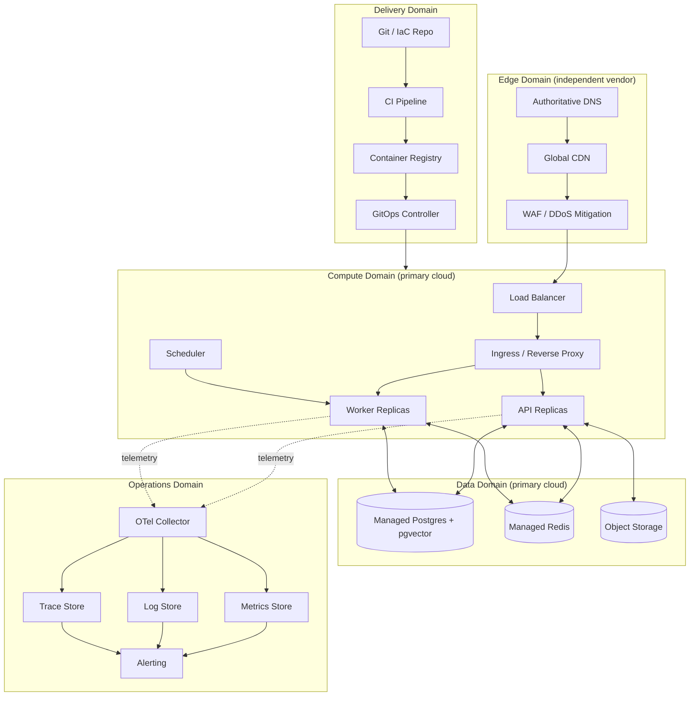

---

## Part 2 — Multi-Environment Strategy

### 2.1 Multi-Environment Strategy (Subsystem 3)

**Purpose & Architecture.** Five environment tiers, each a strict superset of the prior tier's realism, so that a change validated in tier *N* is safe with high confidence in tier *N+1*: **Local** (developer machine) → **Ephemeral Test** (CI-only, born and destroyed per pipeline run) → **Staging** (persistent, production-topology-mirroring at reduced scale) → **Production** (full topology) → **Enterprise-Isolated** (Phase 3, dedicated infrastructure per data-residency-constrained customer, §13.4).

**Internal Components & Dependencies.**
- *Local* runs the full application stack via container-compose orchestration (the same container images CI builds, run locally — never a divergent "dev-only" build), against a local Postgres/Redis container. No cloud dependency is required to develop, per an explicit Phase 1 DX goal.
- *Ephemeral Test* is created per CI run: a fresh Postgres schema (or container) seeded from `DATABASE.md`'s migration history, torn down unconditionally at pipeline end whether it passed or failed, guaranteeing no cross-run state leakage.
- *Staging* is a persistent, always-on, minimally-scaled (single replica per component) mirror of Production's full topology (same orchestrator, same managed-service types, same network segmentation) — deliberately never downgraded to "just a smaller version of the architecture," because its entire purpose is catching topology-shaped bugs (a misconfigured Ingress rule, a missing network policy) that a docker-compose Local environment structurally cannot surface.
- *Production* is the full, autoscaled, Multi-AZ topology described across this document.
- *Enterprise-Isolated* (deferred, Phase 3) provisions a dedicated VPC/cluster/database per contractually-isolated customer, using the exact same IaC modules as shared Production (§7.1) parameterized differently — never a separately-maintained infrastructure codebase.

**Lifecycle & Operational Flow.** Code flows strictly Local → (PR) → Ephemeral Test → (merge to trunk) → Staging (automatic) → (release tag) → Production (gated, §5.3). No environment is ever skipped; no hotfix path bypasses Staging except the documented emergency-rollback procedure (§6.5), which deploys a *previously validated* artifact, never new code.

**Security.** Staging and Production hold structurally identical network policies and IAM roles (differing only in scale and in using synthetic/anonymized data in Staging, never a Production data copy — extending `AUTH_ARCHITECTURE.md` §6's data-minimization posture to internal environments). Ephemeral Test environments never hold real credentials; CI injects short-lived, scope-limited secrets (§7.2) that expire with the pipeline run.

**Scalability & Performance.** Environment count is fixed regardless of Phase; only Production's (and, from Phase 2, Staging's) replica counts and node-pool sizes scale with §0.5's targets.

**Monitoring, Failure Modes & Recovery.** Staging carries the same observability stack as Production (§11) at reduced retention, specifically so that a Staging-caught regression's traces/metrics are inspectable with the same tooling an on-call engineer already knows — no "learn a second toolchain under incident pressure" failure mode.

**Trade-offs & Future Evolution.** Five tiers is more than the minimum viable three (dev/staging/prod); the Ephemeral Test tier is justified specifically because `DATABASE.md`'s migration-safety guarantees and `BACKEND_ARCHITECTURE.md`'s idempotency guarantees are only actually verified by tests that run against a real, disposable Postgres instance, not mocks. Enterprise-Isolated is deferred until a signed contract requires it (YAGNI, consistent with every prior document's deferral discipline) but its IaC-parameterization design (§7.1) means adding it is a configuration change, not an architecture change.

---

## Part 3 — Networking, DNS, CDN, Load Balancing, Reverse Proxy & TLS

*Common to this Part:* every subsystem here sits on the request path established in Diagram 1 (`DNS → CDN → WAF → LB → Ingress`) before a request ever reaches `BACKEND_ARCHITECTURE.md`'s API layer; each is described once, at full depth, since each carries a distinct infrastructure decision not reducible to the others.

### 3.1 Networking Architecture (Subsystem 4)

**Purpose & Architecture.** A single Virtual Private Cloud (VPC) per environment (§2), split into public and private subnets across a minimum of two (Phase 1) and three (Phase 2+) Availability Zones. Public subnets hold only the Load Balancer's network interfaces. Private subnets hold everything else — Kubernetes nodes, Postgres, Redis — with no route to the public internet except outbound-only, via a managed NAT gateway, for the narrow set of egress calls the platform legitimately makes (LLM provider APIs per `AI_PLATFORM_ARCHITECTURE.md` §3, payment provider webhooks, email delivery).

**Internal Components & Dependencies.** VPC, public/private subnets per AZ, an internet gateway (public subnet egress/ingress), a NAT gateway (private subnet egress-only), route tables enforcing the public/private split, and security groups scoped per tier (edge-facing, application, data) such that the application tier accepts inbound traffic only from the Load Balancer's security group, and the data tier accepts inbound traffic only from the application tier's security group — never from the internet, never from each other laterally without cause.

**Lifecycle & Operational Flow.** Network topology is provisioned once per environment by IaC (§7.1) and changes rarely relative to application deploys; a network change goes through the same GitOps review process as any other infrastructure change, with an additional mandatory security review given the blast radius of a misconfigured security group.

**Security.** This is the primary enforcement point for P13 (Least Privilege) and P19 (Defense in Depth) at the network layer: the data tier being structurally unreachable from the public internet means a misconfigured application-layer permission (a bug) still cannot expose Postgres directly — the network layer is a second, independent control, not a restatement of the application-layer one.

**Scalability & Performance.** Multi-AZ subnetting is required infrastructure for §8's and §9's Multi-AZ HA postures; it costs nothing extra to provision at Phase 1 even before it is load-bearing, and retrofitting it later would require a live-traffic network migration — provisioned correctly from day one specifically to avoid that.

**Monitoring, Failure Modes & Recovery.** VPC flow logs feed the observability stack (§11.3) and are the primary forensic tool for both incident response (§11.6) and the audit-infrastructure requirement (§14.6). An AZ failure is transparent to the application given Multi-AZ node/database/cache placement (§4.3, §8.2, §9.3); a full-region network failure is a DR event (§8.4).

**Trade-offs & Future Evolution.** Three AZs at Phase 1 is deferred to two for cost (P14) since Phase 1 traffic does not justify the marginal HA improvement of a third AZ; the subnet/route-table structure is identical either way, so the Phase 2 upgrade to three AZs is a node-pool/replica-count change, not a topology change.

### 3.2 DNS Strategy (Subsystem 5)

**Purpose & Architecture.** The edge vendor (§1.2) is the single authoritative DNS provider for `bizpilot.ai` and its subdomains, consistent with `AUTH_ARCHITECTURE.md` §5.2's single-API-origin decision (`api.bizpilot.ai`) and the frontend origin (`app.bizpilot.ai`) — this document does not introduce subdomain-per-workspace routing, which `AUTH_ARCHITECTURE.md` and `API_CONTRACT.md` already decided against.

**Internal Components & Dependencies.** A small, stable DNS record set: `app.bizpilot.ai` and `api.bizpilot.ai` as CDN/edge-proxied records (§3.3), plus supporting records for email deliverability (SPF/DKIM/DMARC, relevant to `AI_PLATFORM_ARCHITECTURE.md`'s notification/communication surfaces) and a `status.bizpilot.ai` record pointing to the independently-hosted status page (§11.6, deliberately *not* on the same infrastructure it reports on).

**Lifecycle & Operational Flow.** DNS changes are rare, high-blast-radius, and therefore change-managed through IaC (§7.1) with mandatory review, never made through the edge vendor's console directly (P2, P3) except as a documented emergency break-glass procedure.

**Security.** DNSSEC is enabled to prevent record spoofing; registrar-level and DNS-provider-level accounts are protected by hardware-key MFA and are the single most sensitive credential in the entire platform's operational surface, since DNS control implies the ability to redirect all user traffic.

**Scalability & Performance.** DNS resolution latency is bounded by the edge vendor's global anycast network and is not a scaling concern BizPilot AI operates on directly.

**Monitoring, Failure Modes & Recovery.** DNS record changes are monitored for drift (an unexpected change not originating from the IaC pipeline is a P1 security alert, §11.6). Recovery from a compromised DNS account is a documented incident-response runbook (§14.5) given its severity.

**Trade-offs & Future Evolution.** A single DNS provider is a conscious single point of administrative (not availability — anycast networks are inherently redundant) failure, accepted because secondary-DNS redundancy defends against a threat model (the provider's own control plane being unavailable) that has not materialized as a realistic risk for the chosen edge vendor at BizPilot AI's scale, and is revisited only if Enterprise customers' compliance requirements mandate it.

### 3.3 CDN Strategy (Subsystem 6)

**Purpose & Architecture.** Two logically distinct CDN uses, both served by the same edge vendor's network but configured independently: (1) static frontend asset delivery for the `app.bizpilot.ai` SPA build (immutable, content-hashed filenames, effectively-infinite cache TTL); (2) user-uploaded file delivery fronting Object Storage (§9.1) via short-TTL signed URLs, exactly as already specified in `BACKEND_ARCHITECTURE.md` §12.2 and `API_CONTRACT.md` §5.6 — this document supplies the infrastructure behind that existing decision, it does not change it.

**Internal Components & Dependencies.** CDN cache rules keyed by path pattern (build assets vs. user-file paths get different TTL and cache-key policies, since user files are access-controlled via signed URL query parameters that must not be stripped by an overly aggressive cache-key normalization rule — a real, easy-to-misconfigure detail worth naming explicitly).

**Lifecycle & Operational Flow.** Frontend deploys invalidate only the `index.html` entry point (content-hashed sub-assets never need invalidation, per immutable-build-artifact convention); user-file cache entries expire naturally with signed-URL TTL and are never manually invalidated at the CDN layer for authorization reasons (revocation is handled by the signed-URL's own expiry and by Object Storage ACLs, not by cache purging, since cache purging is not an instant, globally-consistent operation and must never be relied on as a security control).

**Security.** The CDN must be configured in "full strict" origin-verification mode (§3.5) so that origin-fetch traffic cannot be spoofed to bypass the origin's own access controls; user-file cache entries are never served if their signed-URL signature has expired, verified at the CDN edge where the edge vendor supports it, and at the origin as the authoritative fallback.

**Scalability & Performance.** CDN cache hit ratio for static frontend assets is expected near 99%+ post-warm; for user files it is inherently lower and workload-dependent, and is not a target the platform optimizes for directly — Object Storage's own scalability (§9.1) is the backstop.

**Monitoring, Failure Modes & Recovery.** Cache hit ratio and origin-fetch latency are tracked as SLIs (§11.4); a full CDN outage degrades to direct-origin serving (slower, not broken, since the origin remains reachable through the Load Balancer as a fallback path) — a graceful-degradation property worth the edge/compute vendor split from §1.2.

**Trade-offs & Future Evolution.** A single CDN vendor tied to the DNS/WAF vendor (rather than a best-of-breed separate CDN) trades a small amount of edge-performance optimality for one fewer vendor relationship and one fewer DNS hop — judged the right trade at every phase given P14 and P18.

### 3.4 Load Balancing (Subsystem 7)

**Purpose & Architecture.** A managed Layer 7 (application) Load Balancer, provisioned by the compute cloud (§1.2), is the single ingress point for all traffic that reaches the Compute domain from the Edge domain. It performs no business logic; its job is TLS termination *from the edge vendor's origin connection* (§3.6), health-check-based routing to only Ingress replicas that are ready, and coarse Layer 7 routing (host-based routing between `api.bizpilot.ai` traffic and any future separate origin) before handing off to the in-cluster reverse proxy (§3.5) for finer-grained routing.

**Internal Components & Dependencies.** The Load Balancer's health checks target the Ingress controller's own liveness endpoint (not individual API pods directly — that finer routing is Kubernetes Service-level, internal to §4), and its target group membership is managed automatically by the orchestrator's cloud-integration controller, never manually.

**Lifecycle & Operational Flow.** The Load Balancer is provisioned once per environment by IaC and its configuration changes only when a new externally-facing host/route is introduced — an infrequent, reviewed change, distinct from the continuous churn of application deploys which never touch this layer directly.

**Security.** The Load Balancer's security group accepts inbound traffic only from the edge vendor's published IP ranges (§3.6), not from the open internet — meaning even a DNS misconfiguration that pointed traffic directly at the Load Balancer's IP, bypassing the edge vendor, would be rejected at the network layer.

**Scalability & Performance.** Layer 7 Load Balancers at this scale are effectively capacity-unbounded relative to BizPilot AI's realistic traffic; the constraint is always further downstream (§4.2's HPA, §8's connection pooling).

**Monitoring, Failure Modes & Recovery.** Request count, latency percentiles, and 5xx rate at the Load Balancer are the platform's outermost SLI (§11.4) — a discrepancy between Load-Balancer-observed error rate and API-observed error rate is itself a diagnostic signal (it isolates whether a failure is inside the cluster or in the path to it).

**Trade-offs & Future Evolution.** A managed Load Balancer (versus a self-run Nginx/HAProxy fleet at this layer) trades a small amount of configuration flexibility for zero operational burden and native health-integration with the orchestrator — the right trade under P1 and P14 at every phase.

### 3.5 Reverse Proxy / Ingress (Subsystem 8)

**Purpose & Architecture.** `BACKEND_ARCHITECTURE.md` §1.1 already named Nginx as the platform's reverse-proxy layer (TLS termination, coarse rate limiting, security headers). This document places that Nginx layer concretely as the Kubernetes cluster's **Ingress Controller** — an in-cluster, horizontally-scaled Nginx deployment that receives traffic from the cloud Load Balancer (§3.4) and performs path-based routing to the correct backing Service (API vs. any future separately-exposed surface), request-size limits, and the first application-aware layer of rate limiting and security headers, ahead of anything the Express application itself does.

**Internal Components & Dependencies.** Ingress rules (host/path → Service mapping), a `TLSSecret`-equivalent holding the origin certificate (§3.6), and rate-limit/security-header configuration that is deliberately duplicated-but-consistent with the edge vendor's WAF rules (§14.1) and the application-layer rate limiter already specified in `BACKEND_ARCHITECTURE.md` §9 — three independent layers of the same control, per P19.

**Lifecycle & Operational Flow.** Ingress configuration is a GitOps-managed manifest (§5.4), version-controlled alongside application deployment manifests, changing whenever a new route needs cluster-level exposure — rare relative to application code deploys.

**Security.** The Ingress Controller is the last network hop before application code and is hardened accordingly: minimal exposed surface, no default backend leaking cluster information, and security headers (`Strict-Transport-Security`, `X-Content-Type-Options`, etc., extending `AUTH_ARCHITECTURE.md`'s cookie/header hardening posture) applied uniformly regardless of which backend route is matched.

**Scalability & Performance.** The Ingress Controller deployment is horizontally autoscaled identically to the API deployment (§12.2), since it sits directly on the same request path and must never become the bottleneck the API itself is scaled to avoid.

**Monitoring, Failure Modes & Recovery.** Ingress-level request/error metrics are a second SLI checkpoint (§11.4) between the Load Balancer and the API, isolating "is the problem in the cluster's edge or inside the application" during incident response.

**Trade-offs & Future Evolution.** Using Nginx as Ingress Controller (rather than a cloud-native Ingress implementation tied to one provider) is itself a P18 (vendor lock-in minimization) choice, consistent with `BACKEND_ARCHITECTURE.md`'s original Nginx decision — it is one fewer thing to re-learn if the compute cloud is ever migrated.

### 3.6 TLS / Certificate Management (Subsystem 9)

**Purpose & Architecture.** Two independent TLS segments, both mandatory, neither optional: (1) **edge TLS** (browser ↔ edge vendor), terminated and auto-renewed by the edge vendor's own certificate management, requiring no BizPilot AI operational involvement; (2) **origin TLS** (edge vendor ↔ Load Balancer ↔ Ingress), using a certificate issued by a managed certificate authority integration and presented at the Ingress layer, verified end-to-end by the edge vendor's "full strict" origin-verification mode (§3.3) so that no unencrypted or unverified hop ever exists on the request path.

**Internal Components & Dependencies.** Origin certificate issuance and renewal is automated (a managed ACME-equivalent integration), following the exact same "automated rotation as a scheduled job, never a manual calendar reminder" philosophy `AUTH_ARCHITECTURE.md` §8 already established for JWT signing-key rotation — the same operational pattern reused for a second, unrelated class of credential, a deliberate consistency choice.

**Lifecycle & Operational Flow.** Certificate renewal runs automatically well ahead of expiry with alerting (§11.5) on any renewal failure, since an expired origin certificate is a full-outage event with no graceful degradation.

**Security.** TLS 1.2 is the minimum accepted protocol version platform-wide (TLS 1.3 preferred and used wherever the client supports it); weak cipher suites are disabled at both the edge vendor and the Ingress layer.

**Scalability & Performance.** TLS termination at the edge vendor's global network removes handshake cost from BizPilot AI's own compute entirely for the vast majority of connections; origin TLS (a much lower-volume edge-to-origin hop count) has negligible performance impact.

**Monitoring, Failure Modes & Recovery.** Certificate expiry is monitored as a dedicated SLI with a multi-week-advance alert threshold (§11.5), independent of and in addition to the automated-renewal mechanism, on the principle that automation failures must still be caught by a human-facing signal (P16 does not mean "unmonitored automation").

**Trade-offs & Future Evolution.** Automated managed-CA issuance is chosen over a manually-procured extended-validation certificate; EV certificates provide negligible modern browser UI benefit and add manual-renewal operational risk for no corresponding security gain — a straightforward rejected alternative.

**Diagram 2 — Request Path Through the Network & Edge Layers**

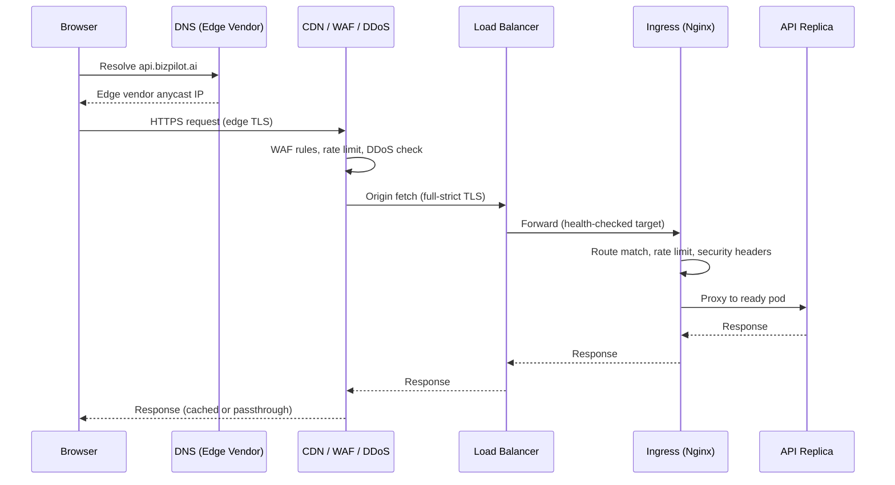

## Part 4 — Container Architecture, Docker Standards & Kubernetes Readiness

### 4.1 Container Architecture (Subsystem 10)

**Purpose & Architecture.** Every deployable unit named in `BACKEND_ARCHITECTURE.md` (API, Worker, Scheduler, and the future Agent Runtime execution surface from `AI_PLATFORM_ARCHITECTURE.md` §9) is packaged as an OCI-compliant container image, built once per commit, and run unmodified across every environment (§2) — the Local docker-compose stack runs the identical image CI builds and Production deploys, never a divergent "dev image."

**Internal Components & Dependencies.** A shared base-image lineage (a minimal, regularly-patched Node.js runtime image) underlies every application image, reducing both image size and the CVE-scanning surface (§5.2); each application image is otherwise independent (API and Worker do not share a runtime container, consistent with `BACKEND_ARCHITECTURE.md` ADR-006's decision to deploy them as separate processes).

**Lifecycle & Operational Flow.** Images are built by CI (§5.2), pushed to a private container registry co-located with the compute cloud (minimizing pull latency and egress cost), tagged immutably by Git SHA, and referenced by that immutable tag — never by a mutable tag like `latest` — from every deployment manifest, per P4.

**Security.** Images run as a non-root user by default; the base image and every dependency layer is scanned for known CVEs on every build (§5.2) with high/critical findings blocking merge; multi-stage builds ensure no build-time toolchain, source map, or secret ever ships in the final runtime image.

**Scalability & Performance.** Multi-stage builds and a minimal base image keep image size small, which directly improves pod startup latency during scale-out events (§12.2) — a slow-starting container image is a direct tax on autoscaling responsiveness, so image size is treated as a performance metric, not just a storage-cost one.

**Monitoring, Failure Modes & Recovery.** Image build failures block the pipeline (§5.2) before ever reaching an environment; a registry outage blocks new deploys but does not affect already-running workloads, since running containers do not re-pull their image.

**Trade-offs & Future Evolution.** A shared base-image lineage is a small coupling cost (a base-image CVE fix requires rebuilding every application image) accepted in exchange for a single, auditable patching surface — judged worthwhile at every phase.

### 4.2 Docker Standards (Subsystem 11)

**Purpose & Architecture.** A single, enforced Dockerfile convention (described here in prose, not as literal Dockerfile content per this document's no-implementation constraint) applies platform-wide: multi-stage build (dependencies → build → minimal runtime), non-root runtime user, no secrets or `.env` files copied into any build stage, an explicit, pinned base-image version (never a floating `latest` base tag), and a `HEALTHCHECK`-equivalent wired to the same readiness endpoint `BACKEND_ARCHITECTURE.md` §10.1 already defines.

**Internal Components & Dependencies.** A shared lint/validation step in CI (§5.2) enforces these conventions automatically (Dockerfile linting), so the standard is machine-checked, not just documented (P16).

**Lifecycle & Operational Flow.** Any Dockerfile change goes through the same PR/CI gate as application code, since a Dockerfile is source code that materially affects security and performance.

**Security.** Non-root execution and secret-free build stages are the two highest-leverage container security controls available and are non-negotiable, enforced by CI, not left to reviewer diligence alone.

**Scalability & Performance.** A minimal runtime stage (no build tools, no dev dependencies) keeps runtime images small (§4.1) and reduces the in-cluster attack surface simultaneously — a rare case where the security-optimal and performance-optimal choices are identical.

**Monitoring, Failure Modes & Recovery.** The Dockerfile-lint CI gate fails fast on any convention violation, well before an image reaches a registry.

**Trade-offs & Future Evolution.** A single platform-wide Docker convention (rather than per-service freedom) trades a small amount of team autonomy for consistent security posture and a single mental model across every workload — the same "define once, apply everywhere" discipline used throughout this document series.

### 4.3 Kubernetes Readiness (Subsystem 12)

**Purpose & Architecture.** The managed Kubernetes offering of the primary compute cloud (§1.2) is the platform's container orchestrator from Phase 1 onward — "readiness" in the brief's naming reflects that Phase 1 runs a minimally-sized cluster (not that Kubernetes itself is deferred), consistent with `BACKEND_ARCHITECTURE.md` §13.2's "Docker Compose at smallest scale" note, which this document interprets as Local development (§2.1), not Production. Production runs on Kubernetes at every phase; only replica counts and node-pool sizes scale.

**Internal Components & Dependencies.** One namespace per environment within a shared cluster at Phase 1–2 (cost-efficient, P14), moving to fully separate clusters per environment at Phase 3 (blast-radius isolation once traffic and team size justify the added operational surface). Within a namespace: `Deployment` resources for API and Worker (independently scaled, per `BACKEND_ARCHITECTURE.md` ADR-006), a `CronJob`-equivalent for the Scheduler (§10.3), `Service` resources for internal routing, `NetworkPolicy` resources enforcing the security-group-equivalent segmentation described in §3.1 at the pod level, and a Horizontal Pod Autoscaler per scalable Deployment (§12.2).

**Lifecycle & Operational Flow.** Node pools scale via a Cluster Autoscaler reacting to unschedulable pods (§12.2); pod scheduling uses resource requests/limits sized from load-testing data (§15.2) so the scheduler — and the Cluster Autoscaler beneath it — makes decisions on real, not guessed, resource profiles.

**Security.** Kubernetes RBAC governs which CI/CD identities (§5.4) may modify which namespace's resources, itself scoped by least privilege (a Staging-deploying credential cannot touch the Production namespace); `NetworkPolicy` resources default-deny pod-to-pod traffic except explicitly allowed paths (API → Postgres/Redis, Worker → Postgres/Redis, nothing → nothing else), a pod-level restatement of §3.1's security-group segmentation, per P19.

**Scalability & Performance.** Namespace-per-environment-in-shared-cluster (Phase 1–2) is cost-efficient but couples noisy-neighbor risk across environments at the node-resource level, mitigated by resource requests/limits and pod-priority classes ensuring Production always preempts Staging under node pressure; the Phase 3 move to separate clusters removes this coupling entirely once justified.

**Monitoring, Failure Modes & Recovery.** Cluster-level health (node readiness, control-plane availability — the latter fully managed by the cloud provider) feeds the same observability stack (§11) as application-level health; a node failure is transparently handled by the orchestrator rescheduling affected pods onto healthy nodes, invisible to users given P9's multi-replica requirement.

**Trade-offs & Future Evolution.** Shared-cluster-with-namespaces is the correct Phase 1–2 trade (P14) despite its noisy-neighbor caveat; the migration to per-environment clusters at Phase 3 is a pure infrastructure change (new cluster, same IaC modules parameterized differently, same GitOps manifests retargeted) requiring zero application code change, which is the entire point of the domain model established in §1.1.

**Diagram 3 — Kubernetes Namespace & Workload Topology (Phase 1–2)**

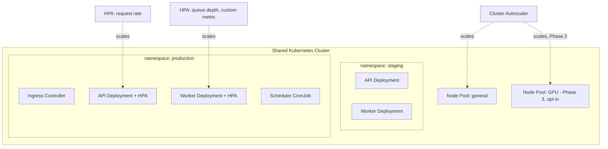

---

## Part 5 — Deployment Strategy, CI/CD Pipelines

### 5.1 Deployment Strategy (Subsystem 13)

**Purpose & Architecture.** **Canary deployment is the platform's default strategy for every service**, generalizing the exact mechanism `AI_PLATFORM_ARCHITECTURE.md` §14 already specified for AI model/prompt rollout (traffic-percentage shifting via the `FeatureFlagEngine`'s `PERCENTAGE_ROLLOUT` capability) to *all* deployments, not only AI-specific ones — a deliberate reuse, not a new mechanism. A new version receives a small traffic percentage, is evaluated against automated health/error/latency thresholds for a bake period, and either progresses toward 100% or auto-rolls-back (§6.5), with **Blue-Green reserved for the rare deploy that cannot be safely partial** (a breaking database migration boundary, §8.3) and **Rolling Update as the Kubernetes-native default within a canary stage's own replica set** (P7) — the three named strategies are not competing choices, they compose at different layers of the same deploy.

**Internal Components & Dependencies.** A deployment orchestration layer (the GitOps controller, §5.4, integrated with the Ingress/Service mesh's traffic-splitting capability) shifts traffic percentages on a schedule; automated health evaluation consumes the same SLIs defined in §11.4; the `FeatureFlagEngine` (`BACKEND_ARCHITECTURE.md` §7.7) remains the mechanism for business-logic-level gradual exposure, kept distinct from infrastructure-level canary (a flag controls *feature visibility*, a canary controls *which code version* serves a request) — an important, precise distinction worth stating explicitly since the two are easy to conflate.

**Lifecycle & Operational Flow.** Tag → build → Staging canary (validated automatically) → Staging 100% → (manual release gate, §5.3) → Production canary (5% → 25% → 50% → 100%, each stage bake-timed and health-gated) → deploy marked complete.

**Security.** Canary analysis includes security-relevant signals (auth failure rate, 4xx rate) alongside performance signals, since a security regression (e.g., a broken auth check) is exactly the kind of defect a canary is designed to catch before full exposure.

**Scalability & Performance.** Canary bake periods are calibrated against real traffic volume — a low-traffic Phase 1 environment needs a longer bake period to accumulate statistically meaningful signal than a high-traffic Phase 3 environment does, an explicit, phase-aware tuning parameter rather than a fixed constant.

**Monitoring, Failure Modes & Recovery.** Automated rollback (§6.5) triggers on canary-stage threshold breach with no human in the loop for the initial mitigation (P16), followed by a mandatory human-authored postmortem (§11.6) regardless of whether rollback was automatic.

**Trade-offs & Future Evolution.** Canary-by-default costs more deploy-pipeline time than atomic all-at-once deployment, accepted deliberately because P5 (zero-downtime) and P6 (canary/blue-green) are explicit governing principles, not aspirational ones — the cost is the point.

### 5.2 CI Pipeline (Subsystem 14)

**Purpose & Architecture.** Extends `BACKEND_ARCHITECTURE.md` §15.5's already-stated CI gates (typecheck, lint, test, build) into the full pipeline: on every PR — typecheck, lint, unit + integration tests (against the Ephemeral Test environment, §2.1) — and on every merge to trunk, additionally: container image build (§4.1), CVE scan (§4.1), Dockerfile lint (§4.2), and image push to the registry, tagged by Git SHA.

**Internal Components & Dependencies.** A CI runner fleet (cloud-hosted, ephemeral per job, never a long-lived self-managed build server, consistent with P4 applied to build infrastructure itself); a Dependency/CVE scanning tool; a container registry (§4.1) as the pipeline's terminal artifact store.

**Lifecycle & Operational Flow.** PR pipeline: typecheck → lint → unit tests → integration tests (parallelized where independent) → status reported to the PR, merge blocked on any failure. Trunk pipeline: all of the above, plus image build/scan/push, plus triggering the CD pipeline (§5.4) for Staging.

**Security.** CI runners hold only short-lived, narrowly-scoped credentials injected per job (§7.2), never long-lived static credentials stored in pipeline configuration; the CVE-scan gate blocking high/critical findings is a hard, non-overridable-by-default merge block.

**Scalability & Performance.** Test parallelization and dependency caching (build-layer caching for container images, dependency caching for package installs) keep pipeline duration roughly constant as the codebase grows, monitored explicitly (§11.4) since pipeline duration is a direct developer-experience and deploy-frequency metric (P16's "automate the third repetition" logic applies to pipeline speed too — slow pipelines get manually worked around, which is itself a process-health signal).

**Monitoring, Failure Modes & Recovery.** Pipeline success rate and duration are tracked as an internal SLI; a flaky test is treated as a bug in the test, not muted, per the same rigor `BACKEND_ARCHITECTURE.md` applies to production code.

**Trade-offs & Future Evolution.** Running integration tests against a real ephemeral Postgres (§2.1) rather than mocks costs pipeline time, accepted because it is the only way to actually verify `DATABASE.md`'s migration and constraint guarantees — mocked tests cannot catch a real constraint violation.

### 5.3 CD Pipeline (Subsystem 15)

**Purpose & Architecture.** Continuous Delivery to Staging (fully automatic on every trunk merge, per P3/P16), **Continuous Deployment gated by an explicit release tag** to Production — deploy (the artifact reaching an environment) is deliberately decoupled from release (the artifact receiving real user traffic), with the `FeatureFlagEngine` (§5.1) providing an additional, finer-grained decoupling layer on top of the tag-gated Production deploy itself, a two-level decoupling that lets the platform deploy continuously while still controlling exposure precisely.

**Internal Components & Dependencies.** A GitOps controller (§5.4) is the sole mechanism that ever mutates a live environment's Kubernetes state; the migration-before-traffic rule (`BACKEND_ARCHITECTURE.md` §15.5) is implemented here concretely as a pipeline stage that runs the Prisma migration as a one-shot Job and blocks the subsequent canary rollout stage until it completes successfully (§8.3).

**Lifecycle & Operational Flow.** Release tag pushed → CD pipeline runs pre-deploy migration Job (§8.3) → canary rollout begins (§5.1) → automated health-gated progression → 100% → deploy marked complete → release notes/changelog generated from commit history since the prior tag (P16).

**Security.** The release-tag-gate for Production is itself an access-controlled action (only specific roles may push a release tag or approve the corresponding deploy), extending `AUTH_ARCHITECTURE.md`'s RBAC philosophy to the deployment pipeline's own human-facing controls.

**Scalability & Performance.** Deploy frequency is a tracked platform-health metric (a DevOps Research and Assessment-aligned signal, in the spirit of P15/P16), targeted to stay high (multiple Staging deploys daily) even as Production release cadence is deliberately more conservative and business-gated.

**Monitoring, Failure Modes & Recovery.** Every pipeline stage emits structured events to the observability stack (§11.2); a failed migration Job halts the pipeline before any traffic shifts, leaving the prior version fully serving — no partial-migration, partial-traffic state is ever reachable by construction.

**Trade-offs & Future Evolution.** Tag-gating Production while auto-deploying Staging is a deliberate asymmetry, not an oversight — it is precisely what lets a small team ship fast without ever accidentally shipping unreviewed change directly to paying customers.

### 5.4 GitOps Controller & Delivery Mechanics (supporting Subsystems 13–15)

A dedicated GitOps controller (an Argo CD/Flux-equivalent, named generically per §0.1) runs inside each cluster, continuously reconciling live state against a Git repository of deployment manifests — the CD pipeline's job (§5.3) is only to update that manifest repository (bump an image tag, adjust a canary weight); the controller, not the pipeline, is what actually touches the cluster. This separation means a CI/CD outage never blocks an emergency rollback (§6.5), since rollback is just reverting a Git commit the already-running controller picks up independently.

**Diagram 4 — CI/CD & GitOps Pipeline**

```mermaid
flowchart LR
    PR[Pull Request] --> CI1[CI: typecheck/lint/test]
    CI1 -->|pass| MERGE[Merge to trunk]
    MERGE --> CI2[CI: build image, CVE scan, push]
    CI2 --> MANIFEST[Update manifest repo: staging]
    MANIFEST --> GITOPS_S[GitOps Controller: staging]
    GITOPS_S --> STG[Staging Environment]
    STG -->|release tag| GATE{Release Gate}
    GATE --> MIG[Pre-deploy Migration Job]
    MIG -->|success| MANIFEST_P[Update manifest repo: production]
    MANIFEST_P --> GITOPS_P[GitOps Controller: production]
    GITOPS_P --> CANARY[Canary 5% -> 25% -> 50% -> 100%]
    CANARY -->|health gate fail| ROLLBACK[Auto Rollback]
    CANARY -->|health gate pass| DONE[Deploy Complete]
```

## Part 6 — Git Workflow, Release Strategy, Versioning, Rollback & Feature Flags

### 6.1 Git Workflow (Subsystem 16)

**Purpose & Architecture.** Trunk-based development: a single long-lived `main` branch, short-lived feature branches (target lifetime under two days), merged via PR after CI passes (§5.2) and human review. No long-lived `develop`, `release/*`, or per-environment branches — environment state is expressed in the GitOps manifest repository (§5.4), not in application-repository branch topology.

**Internal Components & Dependencies.** Branch protection rules on `main` require passing CI and at least one review before merge; the application repository and the GitOps manifest repository are separate repositories with separate access-control policies (§14.3), so that "who can change application code" and "who can change what's deployed" are independently governed.

**Lifecycle & Operational Flow.** Feature branch → PR → CI → review → squash-merge to `main` → automatic Staging deploy (§5.3). No branch ever accumulates more than a few days of drift from `main`, keeping merge conflicts small and continuous integration genuinely continuous.

**Security.** Force-push to `main` is disabled; commit signing is required for any commit touching the IaC or GitOps manifest repositories specifically, given their elevated blast radius.

**Scalability & Performance.** Trunk-based development scales better with team size than long-lived branches do, since it structurally prevents the integration-debt accumulation that long-lived branches produce — a property that matters more, not less, as the engineering team grows from Phase 1 to Phase 3.

**Monitoring, Failure Modes & Recovery.** Branch age and PR cycle time are tracked as developer-experience health metrics (P16).

**Trade-offs & Future Evolution.** Trunk-based development is chosen over GitFlow explicitly as a Rejected Alternative: GitFlow's long-lived `develop`/`release` branches optimize for scheduled, batched releases, which directly conflicts with P3 (GitOps) and P5 (zero-downtime, continuous) — the two models are not neutral stylistic choices, GitFlow actively fights this document's other governing principles.

### 6.2 Branch Strategy & 6.3 Release Strategy (Subsystems 17–18)

**Purpose & Architecture.** Branch strategy is fully specified in §6.1 (trunk-based, no persistent environment branches). Release strategy is the release-tag mechanism already introduced in §5.3: an immutable, semantically-versioned Git tag (§6.4) applied to a specific `main` commit marks it releasable to Production; the tag, not a branch, is the unit of release.

**Lifecycle & Operational Flow.** A release is cut by tagging a known-good `main` commit (typically one that has already baked in Staging) — tagging never creates new code, it only marks existing, already-validated code as release-eligible, keeping the "what's in Staging" and "what's releasable to Production" gap as small as possible.

**Security.** Tag creation on the application repository is restricted to a limited set of release-authorized identities (§14.3), distinct from and narrower than the set of identities who can merge to `main`.

**Trade-offs & Future Evolution.** Combining branch and release strategy into one tag-based mechanism (rather than a separate release-branch process) is a direct consequence of rejecting GitFlow in §6.1 — keeping this consistent prevents the two policies from silently drifting apart over time.

### 6.4 Versioning Strategy (Subsystem 19)

**Purpose & Architecture.** Three independent versioning schemes, each already partially specified elsewhere and unified here: (1) **API versioning** — owned entirely by `API_CONTRACT.md` §2 (URI versioning, `/v1/`), unchanged and uncited further here; (2) **container image versioning** — immutable Git-SHA tags (§4.1), never semantic, since an image tag identifies exact source code, not a compatibility contract; (3) **platform release versioning** — Semantic Versioning (MAJOR.MINOR.PATCH) applied to the Git release tag (§6.3), communicating human-facing release cadence and change magnitude, decoupled from both the API version and the image tag.

**Lifecycle & Operational Flow.** A release tag's semver bump is chosen by the nature of its most significant change (breaking infra/ops change → MAJOR, additive feature → MINOR, fix-only → PATCH) — a convention, not an automated derivation, reviewed at tag-creation time.

**Trade-offs & Future Evolution.** Deliberately *not* coupling platform release semver to API version (`API_CONTRACT.md`'s `/v1/`, `/v2/`) prevents an internal-only infra change from ever forcing an API consumer-facing version bump, and vice versa — the two audiences (internal operators, external API consumers) read different version numbers for different reasons, correctly.

### 6.5 Rollback Strategy (Subsystem 20)

**Purpose & Architecture.** Rollback is a Git revert of the GitOps manifest repository (§5.4), never a manual `kubectl`/console action — reverting the manifest to the prior release's immutable image tag, which the GitOps controller then reconciles automatically, restoring the exact prior running state (P4's immutability is what makes this deterministic rather than "roughly" restoring the old version).

**Internal Components & Dependencies.** Automated rollback triggers directly off the canary health gates (§5.1) with no human approval required for the *initial* mitigation — the human-approval gate exists at *release* time (§5.3), not at *rollback* time, an intentional asymmetry: it is always safer to revert to a known-good state quickly than to require human sign-off to stop bleeding.

**Lifecycle & Operational Flow.** Canary health-gate breach → automatic manifest revert → GitOps reconciliation → traffic fully back on the prior version, typically within the same bake-period timescale as the canary stage that detected the regression (seconds to low minutes, not the "redeploy from scratch" latency of a non-immutable-infrastructure rollback).

**Security.** A rollback event is itself always logged to the audit infrastructure (§14.6) and triggers a mandatory postmortem regardless of whether it was triggered automatically or manually.

**Monitoring, Failure Modes & Recovery.** If a rollback itself fails to reconcile (a rare, second-order failure), the documented escalation path is direct GitOps-controller intervention by an on-call engineer (§11.6) — the one sanctioned break-glass exception to "changes only via Git," logged and reviewed after the fact.

**Trade-offs & Future Evolution.** Manifest-revert-based rollback depends entirely on P4 (immutable infrastructure) holding — the moment any environment allows in-place mutation, rollback stops being deterministic, which is precisely why P4 is treated as non-negotiable rather than aspirational throughout this document.

### 6.6 Feature Flags (Subsystem 21)

**Purpose & Architecture.** No new mechanism: `BACKEND_ARCHITECTURE.md` §7.7's `FeatureFlagEngine` and its reuse for AI rollout in `AI_PLATFORM_ARCHITECTURE.md` §14.5 are cited, not redesigned. This document's sole addition is the explicit infrastructure-level implication: feature flags are what let **deploy and release be different events** (§5.3) — new code can reach Production (deploy) fully dark, and only later become visible to users (release), independent of and at a finer grain than the infrastructure-level canary percentage (§5.1).

**Trade-offs & Future Evolution.** Keeping infrastructure-level canary (code version exposure) and application-level feature flags (feature visibility) as two distinct, composable mechanisms — rather than collapsing them into one — is what allows, for example, 100% of traffic to run the new code version (canary complete) while a feature it contains is still dark to all but an internal test workspace (flag off), a combination neither mechanism alone could express.

---

## Part 7 — Infrastructure as Code, Secrets & Configuration Management

### 7.1 IaC Strategy (Subsystem 22)

**Purpose & Architecture.** All cloud resources (§1–§3, §8–§9) are provisioned by a declarative Infrastructure-as-Code tool (a Terraform-equivalent, named generically per §0.1), organized into reusable modules — network, cluster, database, cache, storage, DNS/edge — each parameterized by environment (§2), so that Staging and Production are literally the same module invocations with different parameter values, never separately-hand-maintained configurations that can drift apart. Enterprise-Isolated environments (§2.1, Phase 3) reuse the identical modules with a per-customer parameter set, exactly as stated there.

**Internal Components & Dependencies.** Per-environment IaC state is stored remotely (never on a local machine) with locking to prevent concurrent-apply corruption; module source lives in the same version-controlled repository family as application code, subject to the same PR/review discipline (§6.1), with an additional mandatory infrastructure-focused reviewer for any change to shared modules given their blast radius across every environment that consumes them.

**Lifecycle & Operational Flow.** An infrastructure change: PR against the IaC repository → automated `plan`-equivalent (a dry-run diff) posted to the PR for human review → merge → automated `apply`-equivalent runs in CI, environment by environment, Staging before Production, never Production-only.

**Security.** The identity CI uses to apply infrastructure changes is itself scoped by least privilege per environment/module (§14.3) and is one of the most sensitive credentials in the platform, protected accordingly (short-lived, audited, alerting on any use outside the expected CI context).

**Scalability & Performance.** Modules are the unit of reuse across Phase 1's minimal footprint and Phase 3's multi-region, multi-cluster footprint (§13.4) — adding a region is a new module invocation with new parameters, not new module code, which is the concrete mechanism behind every "this is a configuration change, not an architecture change" claim made earlier in this document.

**Monitoring, Failure Modes & Recovery.** Infrastructure drift (live state diverging from the IaC-declared state, e.g., from an emergency manual break-glass action) is detected by a scheduled drift-check job and alerts if found, since undetected drift is exactly the failure mode P2 exists to prevent.

**Trade-offs & Future Evolution.** A single, module-parameterized IaC codebase is more upfront design effort than "write each environment's config by hand," repaid the first time Staging and Production would otherwise have silently diverged — a cost this document judges worth paying starting Phase 1, not deferred, since retrofitting module structure onto already-hand-written per-environment config is materially harder than starting with it.

### 7.2 Secrets Management (Subsystem 23)

**Purpose & Architecture.** `BACKEND_ARCHITECTURE.md` §11.1's `SecretsProviderPort` is the application-layer abstraction; this document supplies the concrete provider behind it: the compute cloud's managed secrets/KMS service (§1.2), never plain Kubernetes `Secret` objects used directly (those are only base64-encoded, not encrypted, and are explicitly insufficient as a sole control). Secrets are injected into running pods via a CSI-driver-equivalent that mounts them from the managed secrets service at pod startup, never baked into an image (§4.2) or committed to any repository.

**Internal Components & Dependencies.** The managed secrets service also backs `AUTH_ARCHITECTURE.md` §8's JWT signing-key storage and rotation and §3.6's origin TLS certificate, unifying every class of platform credential behind one auditable system rather than several ad hoc ones.

**Lifecycle & Operational Flow.** CI/CD pipeline credentials (§5.2, §5.4, §7.1) are short-lived and minted per job run via the same secrets service's dynamic-credential capability where supported, rather than long-lived static tokens stored anywhere — extending P13 to machine identities as rigorously as §14.3 extends it to human ones.

**Security.** Every secret access is logged to the audit infrastructure (§14.6); secret rotation follows the same "automated, scheduled, alerted-on-failure" pattern established for TLS certificates (§3.6) and JWT keys (`AUTH_ARCHITECTURE.md` §8).

**Scalability & Performance.** The managed secrets service's read latency is cached at the pod level after initial mount (secrets do not need to be re-fetched per request), so it adds no per-request latency to the hot path.

**Monitoring, Failure Modes & Recovery.** A secrets-service outage blocks new pod scheduling (a pod cannot start without its mounted secrets) but does not affect already-running pods — the same graceful-degradation shape as §4.1's registry-outage analysis, a deliberate, repeated design pattern (already-running workloads never depend on a control-plane service staying up).

**Trade-offs & Future Evolution.** A managed secrets service (versus a self-hosted secrets tool) trades a small amount of provider lock-in — mitigated by the `SecretsProviderPort` abstraction already in place — for zero operational burden running and hardening a secrets store, correct under P1/P14/P18 taken together.

### 7.3 Configuration Management (Subsystem 24)

**Purpose & Architecture.** Extends `BACKEND_ARCHITECTURE.md` §2.4's fail-fast config-loader/validation: non-secret configuration is delivered via environment-specific GitOps manifest overlays (Kustomize-equivalent, named generically), while secret configuration follows §7.2 — the two are always visually and mechanically distinct in the manifest repository, so a reviewer can immediately tell which values are sensitive.

**Lifecycle & Operational Flow.** A configuration change (e.g., a new feature flag default, a tuned rate-limit threshold) is a manifest-overlay PR, following the exact same review/CD path as any other GitOps change (§5.4) — configuration is not a special, faster-moving side channel exempt from review, on principle.

**Security.** Configuration values are validated against the same fail-fast schema `BACKEND_ARCHITECTURE.md` §2.4 already requires at application boot, so a malformed overlay fails the deploy's health check immediately rather than corrupting runtime behavior silently.

**Trade-offs & Future Evolution.** Environment overlays over environment variables set ad hoc per environment in a console keeps every environment's actual configuration diffable and reviewable in Git — a direct instance of P2/P3 applied at the configuration granularity, not just the resource-provisioning granularity.

**Diagram 5 — Secrets & Configuration Flow into a Running Pod**

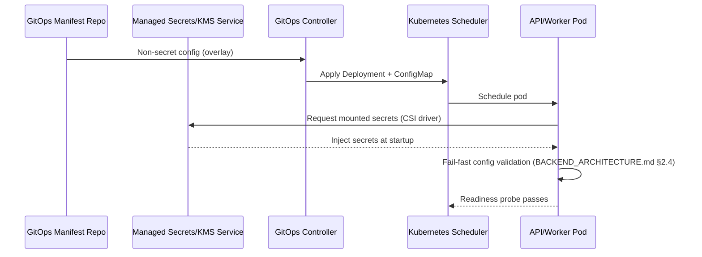

## Part 8 — Database Deployment, Migration, Backup, Disaster Recovery & Business Continuity

### 8.1 Database Deployment (Subsystem 25)

**Purpose & Architecture.** The Postgres instance backing `DATABASE.md`'s full schema runs on the compute cloud's managed Postgres offering (§1.2), chosen specifically for its `pgvector` extension support (`DATABASE.md` §7, `AI_PLATFORM_ARCHITECTURE.md` §6) and Multi-AZ synchronous-replica capability. Phase 1 runs single-AZ with automated backups (§8.2); Phase 2 promotes to Multi-AZ (a configuration change, not a schema or application change) once uptime requirements justify the added cost (P14); Phase 2–3 adds read replicas for the read-scaling path `BACKEND_ARCHITECTURE.md` §13.3 already anticipated.

**Internal Components & Dependencies.** Connection pooling (`BACKEND_ARCHITECTURE.md` already assumes a pooled connection layer between the API/Worker and Postgres) is deployed as a managed or sidecar pooler sitting between the application tier and the primary instance, since Postgres's own per-connection memory cost makes unpooled horizontal API scaling (§12.2) a direct threat to database stability — the pooler is what lets the two scale independently.

**Lifecycle & Operational Flow.** The database instance is provisioned by IaC (§7.1) like every other resource; schema changes reach it exclusively through the migration mechanism (§8.3), never through direct manual `psql` access in Staging or Production except a documented, audited break-glass procedure for genuine emergencies.

**Security.** Network-isolated to the private subnet (§3.1), reachable only from the application tier's security group; encrypted at rest via the managed service's integration with the platform KMS (§7.2) and in transit via enforced TLS on every connection.

**Scalability & Performance.** Read replicas offload read-heavy query paths (analytics/reporting surfaces named in `PRD.md`'s feature inventory) from the primary, which remains the sole target for all writes — consistent with `DATABASE.md`'s single-source-of-truth design; vertical instance sizing is reviewed against capacity-planning data (§12.1) rather than scaled reactively under incident pressure.

**Monitoring, Failure Modes & Recovery.** Connection count, replication lag, query latency percentiles, and disk utilization are tracked as database-tier SLIs (§11.4); Multi-AZ failover (Phase 2+) is automatic and handled by the managed service, targeting a failover time in the low tens of seconds, transparent to the application given its connection-pooler's retry behavior.

**Trade-offs & Future Evolution.** A managed Postgres offering (versus self-hosting Postgres on raw compute) trades some tuning flexibility for automated Multi-AZ failover, automated patching, and automated backups (§8.2) — the correct trade under P1/P14 at every phase; self-hosting is revisited only if a specific extension or tuning need the managed offering cannot satisfy ever emerges, which has not occurred in any prior document's design.

### 8.2 Database Backup Strategy (Subsystem 26)

**Purpose & Architecture.** Continuous, automated backup via the managed service's point-in-time-recovery (PITR) capability — continuous WAL (write-ahead log) streaming to durable storage, plus daily full snapshots — enabling restoration to any point within the retention window, not just to a nightly snapshot boundary.

**Internal Components & Dependencies.** Backup storage is automatically replicated cross-region by the managed service (§1.2's compute cloud), independent of the primary instance's own region, so a full-region loss of the primary does not also destroy its backups.

**Lifecycle & Operational Flow.** Backups are fully automated and require no operational action to create; restoration is a documented, periodically-rehearsed runbook (§15.1) — a backup that has never been test-restored is not considered a working backup, a deliberate discipline distinct from merely having backups exist.

**Security.** Backups are encrypted at rest identically to the primary instance (§8.1) and are covered by the same audit-logging requirement (§14.6) for any restore action, given a restore is itself a highly sensitive, data-altering operation.

**Scalability & Performance.** PITR granularity and retention window are tuned against the RPO target (§8.4), not against storage cost alone — RPO is the requirement that sizes the backup configuration, not the reverse.

**Monitoring, Failure Modes & Recovery.** Backup completion and PITR continuity are monitored as a dedicated SLI with alerting on any gap, since a silent backup failure is only discovered — catastrophically — at restore time otherwise.

**Trade-offs & Future Evolution.** Continuous PITR (versus nightly-snapshot-only) costs marginally more storage, accepted without hesitation given the RPO target (§8.4) a nightly-only strategy could not meet.

### 8.3 Database Migration Strategy (Subsystem 27)

**Purpose & Architecture.** Concretizes `BACKEND_ARCHITECTURE.md` §15.5's "migration runs before traffic shifts to the new version" rule: Prisma Migrate executes as a one-shot Kubernetes Job in the CD pipeline (§5.3), gating the subsequent canary rollout — the canary stage literally cannot begin until this Job reports success.

**Internal Components & Dependencies.** Migrations are written to be backward-compatible with the *previous* application version for the duration of a canary rollout (expand/contract pattern: additive schema changes deploy ahead of the code that depends on them; destructive changes deploy only after the code no longer references the old shape, across two separate releases) — necessary precisely because canary (§5.1) means old and new code run simultaneously against the same database mid-rollout, so the schema must be valid for both at once.

**Lifecycle & Operational Flow.** PR touching `schema.prisma` → CI validates the migration against the Ephemeral Test database (§2.1, §5.2) → merge → Staging migration Job runs automatically → Production migration Job runs only after the release gate (§5.3), immediately before that release's canary begins.

**Security.** The migration Job runs under a narrowly-scoped database credential distinct from the application's own runtime credential — permitted schema-altering DDL, which the application's own runtime credential is explicitly *not* granted, per P13.

**Scalability & Performance.** Long-running migrations (large-table alterations at Phase 2–3 data volumes) are written using online-migration techniques (adding columns with defaults applied without a full-table lock, backfilling in batches via a background job rather than inline) — a concern `DATABASE.md`'s Phase 1 schema does not yet face but that this document's migration Job mechanism is designed to accommodate without a process change later.

**Monitoring, Failure Modes & Recovery.** A failed migration Job halts the pipeline before any traffic shifts (§5.3); the migration Job itself is retried per the platform's standard idempotent-job discipline (`BACKEND_ARCHITECTURE.md` §8.5) if it fails for a transient (not a schema-logic) reason.

**Trade-offs & Future Evolution.** The expand/contract discipline adds an extra release cycle to any destructive schema change versus a single "just change it" migration, accepted as the direct cost of P5/P6 (zero-downtime, canary) — a single-step destructive migration is fundamentally incompatible with running two code versions against one database simultaneously.

### 8.4 Disaster Recovery (Subsystem 28)

**Purpose & Architecture.** Quantified, per-system RTO (Recovery Time Objective) and RPO (Recovery Point Objective) targets, reviewed at each phase boundary: Phase 1–2 targets **RPO < 5 minutes** (bounded by continuous WAL streaming, §8.2) and **RTO < 60 minutes** (bounded by Multi-AZ automated failover for a single-AZ event, and a documented cross-region restore runbook for a full-region event); Phase 3 tightens RTO toward single-digit minutes as multi-region active infrastructure (§13.4) comes online.

**Internal Components & Dependencies.** DR depends on §8.2's cross-region-replicated backups, §7.1's IaC modules (a destroyed region's infrastructure is re-provisioned by the same modules in a new region, not hand-rebuilt), and §7.2's secrets service (credentials must be recoverable in the DR region independent of the primary region's availability).

**Lifecycle & Operational Flow.** A documented DR runbook specifies, step by step: declare a DR event → provision infrastructure in the recovery region via IaC → restore Postgres from the latest cross-region-replicated backup to the target RPO → redirect DNS (§3.2) to the recovered environment → validate via the production-readiness health checks (§15.4) before declaring recovery complete.

**Security.** DR-region infrastructure carries identical network segmentation, IAM scoping, and secrets management as the primary region — a DR environment is never a "temporarily less secure" shortcut.

**Scalability & Performance.** DR runbook execution time is the direct input to the RTO target and is reduced over time by increasing automation (P16) — Phase 1's runbook may involve meaningful manual steps; Phase 3 automates the same runbook into a largely one-command failover as multi-region infrastructure matures.

**Monitoring, Failure Modes & Recovery.** The DR runbook is rehearsed on a recurring schedule (§15.1) in a non-Production environment, since an untested DR plan is, in practice, not a plan.

**Trade-offs & Future Evolution.** Phase 1–2's RTO target (60 minutes, involving some manual runbook steps) is a conscious trade against the cost of maintaining hot multi-region standby infrastructure before the business scale justifies it (P14) — the target tightens exactly in step with §13.4's multi-region rollout, not before.

### 8.5 Business Continuity (Subsystem 29)

**Purpose & Architecture.** Extends `BACKEND_ARCHITECTURE.md` §15.6's stated philosophy — "Postgres is the only source of truth; Redis loss is a performance degradation event, not a data-loss event" — into the full infrastructure picture: every stateful system in the platform is classified by whether its loss is *recoverable-from-source-of-truth* (Redis cache entries, in-flight-but-not-yet-committed queue jobs above the durability guarantee already specified in `BACKEND_ARCHITECTURE.md` §8) or *itself a source of truth requiring DR* (Postgres, Object Storage).

**Internal Components & Dependencies.** This classification directly determines each component's HA posture in this document: Postgres and Object Storage get Multi-AZ + cross-region backup (§8.1–§8.2, §9.1); Redis gets Multi-AZ for availability (§9.3) but explicitly *no* cross-region backup requirement, since its loss is bounded and recoverable by design, not by luck.

**Trade-offs & Future Evolution.** Explicitly *not* over-engineering DR for genuinely-recoverable components is itself a P14 (cost efficiency) decision, made possible only because `BACKEND_ARCHITECTURE.md`'s original architecture was disciplined about which systems are allowed to become sources of truth in the first place — this document's BC posture is a direct dividend of that earlier discipline, not a new one.

**Diagram 6 — Database Deployment, Backup & DR Topology**

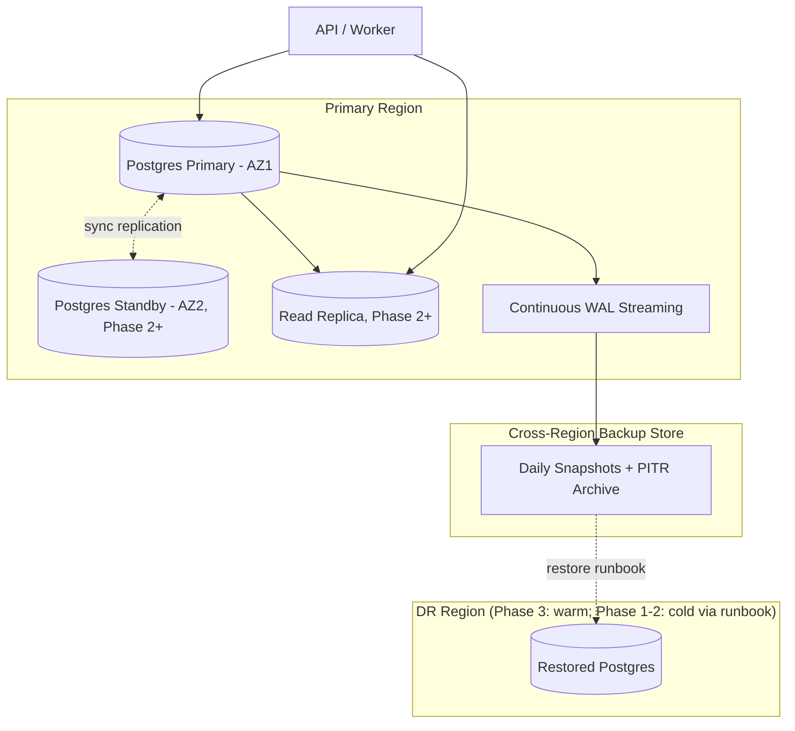

---

## Part 9 — Object Storage, File Delivery, Cache Layer & Redis Strategy

### 9.1 Object Storage (Subsystem 30) & 9.2 File Delivery (Subsystem 31)

**Purpose & Architecture.** S3-compatible object storage (§1.2) behind `BACKEND_ARCHITECTURE.md` §11's `ObjectStoragePort`, organized into per-environment, per-purpose buckets (user uploads, AI-generated media per `AI_PLATFORM_ARCHITECTURE.md`'s multi-modal pipeline, system backups distinct from §8.2's database backups). File delivery to end users is exclusively via the CDN-fronted, short-TTL signed-URL pattern already specified in `BACKEND_ARCHITECTURE.md` §12.2 and `API_CONTRACT.md` §5.6 and detailed at the network layer in §3.3 — this document adds only the storage-side infrastructure: bucket versioning (protecting against accidental overwrite/delete, distinct from and in addition to any application-level soft-delete per `DATABASE.md`), lifecycle policies (transitioning aged, infrequently-accessed objects to cheaper storage tiers per P14), and cross-region replication for the subset of objects classified as durable business records (matching §8.4's DR posture, not applied blanket to every transient object).

**Security.** Buckets are private by default with no public-read policy ever enabled at the bucket level; all external access is exclusively through the signed-URL mechanism, enforced by IAM policy, not by convention.

**Scalability & Performance.** Object storage at this class of service is effectively capacity- and throughput-unbounded relative to BizPilot AI's realistic scale; the CDN layer (§3.3) is what determines user-perceived delivery performance, not the origin store itself.

**Monitoring, Failure Modes & Recovery.** Upload success rate and signed-URL generation latency are tracked SLIs; bucket versioning provides immediate recovery from accidental overwrite without invoking the full DR runbook (§8.4).

**Trade-offs & Future Evolution.** S3-compatible API (rather than a proprietary storage API) is a direct P18 choice — multiple providers implement this interface, keeping `ObjectStoragePort`'s adapter genuinely swappable, not just swappable in theory.

### 9.3 Cache Layer (Subsystem 32) & 9.4 Redis Strategy (Subsystem 33)

**Purpose & Architecture.** The managed Redis/in-memory store (§1.2) backs both `BACKEND_ARCHITECTURE.md` §5.8's two-tier (L1 in-process/L2 Redis) application cache and §8's job queue — logically two different workloads sharing one technology. At Phase 1–2 they share a single managed Redis instance for cost efficiency (P14); at Phase 3, cache and queue are **split onto physically separate Redis instances**, because a queue backlog under load has fundamentally different memory-pressure and eviction-tolerance characteristics than a cache (a cache entry's eviction is a performance event; a queue entry's eviction is a correctness event), and letting one workload's pressure evict the other's data is an avoidable, previously-undocumented operational risk this document now makes explicit and pre-empts.

**Internal Components & Dependencies.** Multi-AZ replication (Phase 2+) for availability; cache eviction policy is memory-pressure-based (LRU-equivalent) and explicitly permitted to lose data per §8.5's BC classification; queue data uses a no-eviction policy, since queue-entry loss is a correctness violation, not a performance one — two different configurations on the (Phase 3-split) same technology, chosen deliberately per workload.

**Security.** Network-isolated identically to Postgres (§3.1, §8.1); AUTH-required connections with credentials sourced from §7.2.

**Scalability & Performance.** Cluster mode (sharded Redis) is available and adopted at Phase 3 scale if a single instance's throughput becomes the bottleneck — deferred until then per YAGNI, consistent with every other phase-gated decision in this document.

**Monitoring, Failure Modes & Recovery.** Cache hit ratio, memory utilization, and (for the queue instance) queue depth are tracked SLIs — queue depth specifically feeds the Worker's autoscaling policy (§12.2), making this metric load-bearing for capacity, not just observability.

**Trade-offs & Future Evolution.** Sharing one Redis instance at Phase 1–2 is a conscious, documented cost/complexity trade, not an oversight — the split point (Phase 3) is defined now, in advance, specifically so it is executed as a planned migration rather than an incident-driven scramble.

**Diagram 7 — Object Storage & Cache/Queue Topology**

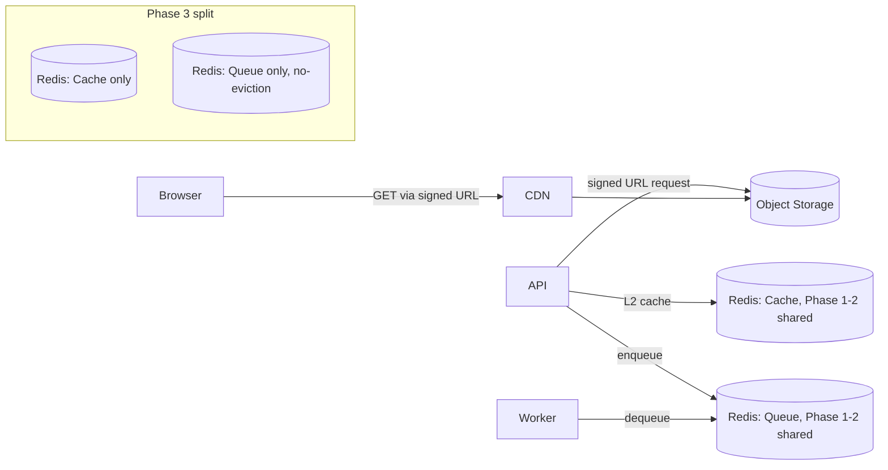

## Part 10 — Queue Infrastructure, Background Workers & Scheduler

### 10.1 Queue Infrastructure (Subsystem 34)

**Purpose & Architecture.** The Redis-backed job queue is already fully specified functionally in `BACKEND_ARCHITECTURE.md` §8 (job types, retry/backoff, DLQ, idempotency). This document's contribution is purely infrastructural: the queue's Redis instance (§9.4), its Phase 3 isolation from the cache instance, and its position as the sole coupling point between the API's synchronous request path and the Worker's asynchronous execution surface — a coupling deliberately mediated only through Redis, never through direct API-to-Worker network calls, preserving the independent-scaling property `BACKEND_ARCHITECTURE.md` ADR-006 already established.

**Monitoring, Failure Modes & Recovery.** Queue depth and age-of-oldest-message are the primary infrastructure-level SLIs (§11.4), feeding both alerting (a growing backlog the Worker autoscaler isn't resolving is a P2 incident) and the Worker's own autoscaling policy (§12.2).

**Trade-offs & Future Evolution.** Reusing Redis as the queue backend (rather than a dedicated message broker) is `BACKEND_ARCHITECTURE.md`'s original, cited decision; this document's only addition is scheduling the point (Phase 3) at which that shared-technology choice's one real cost — cache/queue resource contention — is retired via the split in §9.4.

### 10.2 Background Workers (Subsystem 35)

**Purpose & Architecture.** The Worker deployment (§4.3 Diagram 3) is a horizontally-scaled Kubernetes Deployment running the identical container image lineage as the API (§4.1) but a distinct entrypoint/process, consuming jobs from the queue (§10.1). It is the execution surface for every asynchronous workload named across prior documents: AI generation jobs (`AI_PLATFORM_ARCHITECTURE.md`), notification delivery, report generation, and the Agent Runtime's longer-running executions (`AI_PLATFORM_ARCHITECTURE.md` §9).

**Security.** Runs under the same least-privilege service identity discipline as the API (§14.3), scoped independently — the Worker's IAM role need not, and does not, include any permission the API alone requires and vice versa, even though both currently read the same database, because their object-storage and external-API-egress needs differ.

**Scalability & Performance.** Scales via a Horizontal Pod Autoscaler driven by queue depth (§10.1, §12.2) rather than CPU/memory — the correct scaling signal for a consumer whose load is queue-shaped, not request-shaped, distinct from the API's request-rate-driven HPA.

**Monitoring, Failure Modes & Recovery.** Per-job-type success/failure/duration metrics (already emitted per `BACKEND_ARCHITECTURE.md` §8's design) are aggregated at the infrastructure level into Worker-fleet-wide SLIs; a Worker pod crash mid-job relies entirely on `BACKEND_ARCHITECTURE.md` §8.5's idempotent-retry design to recover correctness — this document's job is only to ensure the crashed pod is rescheduled promptly (standard Kubernetes behavior, §4.3), the correctness guarantee itself is not an infrastructure concern.

**Trade-offs & Future Evolution.** Because jobs are already required to be idempotent (`BACKEND_ARCHITECTURE.md` §8.5), Worker pods are the platform's best-suited workload for **spot/preemptible compute** (§12.3) — an interruption is just another retry-triggering failure the system already tolerates by design, turning a cost-optimization opportunity into a near-zero-additional-risk decision specifically because of a discipline established two documents ago.

### 10.3 Scheduler (Subsystem 36)

**Purpose & Architecture.** `BACKEND_ARCHITECTURE.md` §8's Scheduler (cron-equivalent triggers for recurring jobs — key rotation per `AUTH_ARCHITECTURE.md` §8, certificate renewal per §3.6, digest notifications, AI credit resets per `AI_PLATFORM_ARCHITECTURE.md`) runs as a Kubernetes `CronJob`-equivalent, a singleton by design (never horizontally scaled — a duplicated Scheduler firing the same recurring job twice is a correctness bug, not a performance win).

**Security.** Singleton enforcement is handled at the orchestrator level (a leader-election or single-replica guarantee), not left to application-level locking alone, per Defense in Depth (P19).

**Monitoring, Failure Modes & Recovery.** Missed-execution alerting (a scheduled job that should have fired but did not) is tracked distinctly from failed-execution alerting (it fired and errored), since the two indicate different failure classes — the former often points to an orchestrator-level issue, the latter to an application-level one.

**Trade-offs & Future Evolution.** A single scheduler instance is a small, accepted single point of failure (mitigated by the orchestrator's automatic rescheduling on node failure, §4.3) — clustered/HA scheduling is deferred until recurring-job volume or criticality genuinely demands it, which it does not at any phase this document currently plans for.

**Diagram 8 — Queue, Worker & Scheduler Interaction**

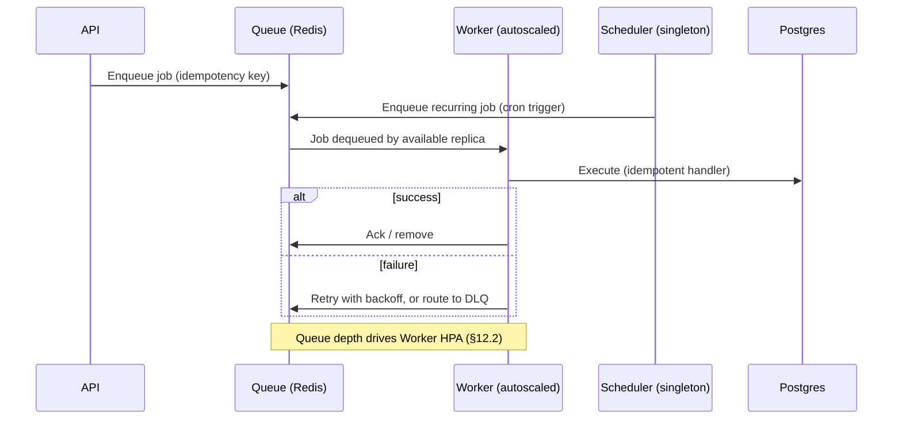

---

## Part 11 — Monitoring, Logging, Distributed Tracing, Metrics, Alerting & Incident Response

*Common to this Part:* every subsystem below is the deployed infrastructure realizing telemetry `BACKEND_ARCHITECTURE.md` §5.6–§5.7 and §10 already mandated every component emit (OpenTelemetry instrumentation, structured JSON logs, RED/USE metrics, health/readiness/liveness endpoints). This Part answers "where does that telemetry go, and what happens when it indicates a problem," not "what telemetry exists."

### 11.1 Monitoring & 11.4 Metrics (Subsystems 37, 40)

**Purpose & Architecture.** An OpenTelemetry Collector runs as a cluster-level component (a sidecar or DaemonSet-equivalent per pod), receiving every service's OTel-instrumented metrics and forwarding them to a metrics store (a Prometheus-compatible time-series database, self-hosted or managed, chosen for open-standard compatibility over a single vendor's proprietary agent, per P18) queried by dashboards and alert rules alike.

**Internal Components & Dependencies.** RED metrics (Rate, Errors, Duration) per service and USE metrics (Utilization, Saturation, Errors) per resource (`BACKEND_ARCHITECTURE.md` §5.7's own framing, unchanged) are the baseline dashboard set for every component named across this document — Load Balancer, Ingress, API, Worker, Postgres, Redis, queue depth — composed from the SLIs already named per-subsystem above rather than invented anew here.

**Scalability & Performance.** Metrics retention is tiered (high-resolution short-term for active debugging, downsampled long-term for capacity-planning trend analysis, §12.1), keeping storage cost proportionate to actual analytical need (P14).

**Monitoring, Failure Modes & Recovery.** The monitoring stack itself is monitored by a minimal, independent "dead man's switch" check (an external, out-of-band heartbeat) — the one component this document does not permit to be a blind spot about its own failure, since if it is a monitoring-stack outage's own alerting depends on the outage not existing, it never fires.

**Trade-offs & Future Evolution.** An open-standard (OpenTelemetry/Prometheus-compatible) stack over a single vendor's proprietary APM agent costs a small amount of out-of-the-box dashboard polish, accepted deliberately under P18 — every prior document's port/adapter discipline extended to the observability vendor itself.

### 11.2 Logging (Subsystem 38)

**Purpose & Architecture.** Structured JSON logs (`BACKEND_ARCHITECTURE.md` §5.6, unchanged) are collected from every pod by the same OTel Collector (§11.1) and forwarded to a centralized log store, indexed and queryable by request ID, workspace ID, and trace ID — the shared correlation-ID discipline `BACKEND_ARCHITECTURE.md` already mandated at the application layer is what makes cross-service log correlation possible at the infrastructure layer without any additional application change.

**Security.** Log scrubbing (redacting credentials, tokens, and PII before storage, extending `AUTH_ARCHITECTURE.md`'s data-minimization posture) is enforced at the Collector stage, not left to each service's own logging call sites to individually get right — a single, auditable enforcement point per Defense in Depth.

**Scalability & Performance.** Log volume is the fastest-growing telemetry category with scale and is the primary target of the retention-tiering discipline noted in §11.1 — high-resolution short-term, sampled/aggregated long-term.

**Monitoring, Failure Modes & Recovery.** Log-ingestion pipeline health is itself monitored (a stalled ingestion pipeline is a silent observability blind spot, caught the same way as any other SLI).

**Trade-offs & Future Evolution.** Centralized structured logging over per-pod log inspection is not optional at any phase past Local development — Staging's very purpose (§2.1) of catching topology-shaped issues depends on being able to correlate logs across replicas, which per-pod inspection cannot do.

### 11.3 Distributed Tracing (Subsystem 39)

**Purpose & Architecture.** OTel-instrumented traces (`BACKEND_ARCHITECTURE.md` §5.6) are exported to a trace store supporting the full request lifecycle depicted in Diagram 2 and Diagram 8 — from Ingress through the API, into any downstream AI provider call (`AI_PLATFORM_ARCHITECTURE.md` §16's own observability requirements, cited not redesigned), through to an enqueued job's eventual Worker execution, correlated end-to-end by a single trace ID even across the synchronous/asynchronous boundary.

**Scalability & Performance.** Trace sampling (not every request is fully traced at high volume, per standard tail-based or head-based sampling) keeps trace-store cost and query performance proportionate to genuine debugging need while still guaranteeing 100% sampling for error and high-latency requests specifically, ensuring exactly the traces an incident responder needs are never the ones sampling dropped.

**Trade-offs & Future Evolution.** Tracing across the async queue boundary (§10.1) is deliberately preserved rather than treated as "trace ends at enqueue" — without it, exactly the AI-generation and background-job paths `AI_PLATFORM_ARCHITECTURE.md` cares most about debugging would be invisible to tracing, defeating its purpose for the platform's most operationally complex workloads.

### 11.5 Alerting (Subsystem 41)

**Purpose & Architecture.** An alert-routing layer (an Alertmanager-equivalent) evaluates rules against the metrics store (§11.1) and routes firing alerts by severity: **P1** (user-facing outage or data-integrity risk) pages the on-call engineer immediately via a dedicated on-call paging service; **P2** (degraded but not down, e.g., elevated latency, growing-but-not-critical queue backlog) notifies the responsible team's channel without paging; **P3** (informational, trend-worthy) is dashboard-visible only.

**Security.** Security-relevant alerts (WAF rule triggers, IAM anomalies, audit-log gaps, §14) are routed through the same pipeline but flagged distinctly and always P1, regardless of user-facing impact, since a security signal's cost of a delayed response is categorically different from a performance signal's.

**Monitoring, Failure Modes & Recovery.** Alert-rule quality is itself reviewed on a recurring cadence (§15.1) — an alert that fires without a corresponding actionable runbook, or that has gone stale (never fired, or fires so often it is routinely ignored), is a documented anti-pattern this platform actively prunes, since alert fatigue is itself a P1-outage risk (a real alert ignored because of noise).

**Trade-offs & Future Evolution.** Three severity tiers (rather than a flatter or finer-grained scheme) is the simplest structure that still lets on-call time be reserved for genuinely urgent signals — deliberately resisting the temptation to over-classify before real incident volume justifies a finer scheme.

### 11.6 Incident Response (Subsystem 42)

**Purpose & Architecture.** A formal, lightweight incident-response process: any P1 alert (§11.5) automatically opens an incident record and designates the paged on-call engineer as Incident Commander (IC) by default, with explicit, documented authority to pull in additional responders, declare severity changes, and communicate to the public status page (`status.bizpilot.ai`, §3.2 — deliberately hosted independently of BizPilot AI's own infrastructure, so it remains reachable even during a full platform outage). Every incident concludes with a **blameless postmortem** — a written account of timeline, root cause, and follow-up action items, reviewed by the team, never by an individual assigning fault — extending the same non-punitive engineering culture implicit throughout this document series' emphasis on automation over manual heroics (P16).

**Internal Components & Dependencies.** The incident record links the triggering alert, the relevant dashboards (§11.1), traces (§11.3), and logs (§11.2) automatically by shared correlation ID, so an IC's first minutes are spent diagnosing, not hunting for the right dashboard.

**Lifecycle & Operational Flow.** Alert fires → incident opened, IC paged → mitigation (often an automatic rollback, §6.5, already underway before a human is even engaged) → status page updated if user-facing → resolution confirmed against SLIs returning to baseline → postmortem drafted within a fixed window (a few business days) → follow-up action items tracked to completion, not just written down and forgotten.

**Security.** A security-classified incident (§11.5) follows the same process with an additional mandatory step: assessment of whether the incident constitutes a reportable data-exposure event under the compliance posture `AUTH_ARCHITECTURE.md` §6 already established, triggering that document's existing notification obligations, not a new process invented here.

**Trade-offs & Future Evolution.** A lightweight, always-blameless process is chosen deliberately over a heavier, formal ITIL-style process at every phase this document plans for — heavyweight process is a Phase-3-or-later concern, revisited only if genuine multi-team incident coordination complexity outgrows what this lightweight structure can hold.

**Diagram 9 — Observability & Incident Response Flow**

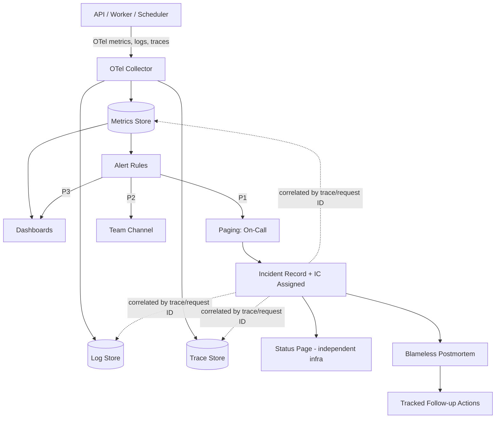

## Part 12 — Capacity Planning, Autoscaling & Cost Optimization

### 12.1 Capacity Planning (Subsystem 43)

**Purpose & Architecture.** Capacity planning is load-testing-informed (§15.2), not guessed: node-pool sizing, database instance class, and Redis instance sizing are all set from observed or synthetically-generated load data, reviewed on a recurring cadence and ahead of any known demand event (a marketing launch, a large Enterprise onboarding) rather than reactively.

**Internal Components & Dependencies.** Long-term metrics retention (§11.1's downsampled tier) is the primary input to capacity trend analysis — this is the concrete reason that tier exists, not merely a cost-saving measure but an active planning input.

**Lifecycle & Operational Flow.** A recurring capacity review (cadence tightening from quarterly at Phase 1 to monthly at Phase 2–3 as growth rate increases) checks current utilization against headroom targets and adjusts IaC-declared (§7.1) baseline sizing accordingly — a planned, reviewed change, never a panic-driven one.

**Trade-offs & Future Evolution.** Headroom targets are deliberately generous at Phase 1 (over-provisioned relative to Phase 1's own traffic) because the absolute dollar cost of over-provisioning at Phase 1 scale is small, while the cost of an autoscaling policy that has never been exercised failing silently under Phase 2's first real growth spike is not — a small, explicit, and bounded insurance premium.

### 12.2 Autoscaling (Subsystem 44)

**Purpose & Architecture.** A three-tier autoscaling stack, each tier already named individually above and unified here as a coherent system: (1) **Horizontal Pod Autoscaling** — API scales on request rate/latency (§3.4, §11.4's RED metrics), Worker scales on queue depth via a custom-metrics adapter consuming the Prometheus-compatible metrics store (§9.4, §10.2), since queue depth is not a Kubernetes-native metric and requires this explicit bridge; (2) **Cluster Autoscaling** — the node-pool layer (§4.3) reacts to unschedulable pods produced by tier-1 scaling decisions, adding or removing nodes transparently; (3) **Vertical sizing review** — not automated, a periodic, capacity-planning-informed (§12.1) adjustment of per-pod resource requests/limits, deferred to a Vertical Pod Autoscaler-equivalent only if manual review cadence proves insufficient at Phase 3 scale.

**Security.** Autoscaling bounds (minimum and maximum replica counts) are always explicitly set, never unbounded — an unbounded autoscaler is itself a cost-based denial-of-service risk against BizPilot AI's own budget under a traffic anomaly, and a maximum bound is the platform's own circuit breaker against that.

**Scalability & Performance.** The tier-1/tier-2 relationship is intentionally layered rather than collapsed: pod-level scaling reacts in seconds, node-level scaling reacts in the low minutes (new node provisioning time), so tier-1's HPA is configured with headroom-aware thresholds that trigger before saturation, giving tier-2 time to catch up — a timing relationship worth stating explicitly since a naive configuration (both tiers reacting to the same threshold with no lead time) produces exactly the kind of thundering-herd scaling failure this design avoids.

**Monitoring, Failure Modes & Recovery.** Autoscaling events themselves are logged and visible on dashboards (§11.1) — a service oscillating between scaling up and down repeatedly (a "flapping" HPA) is a distinct, actionable alert condition, since it usually indicates a miscalibrated threshold rather than genuine variable load.

**Trade-offs & Future Evolution.** Queue-depth-based Worker HPA requires the custom-metrics adapter as additional infrastructure surface versus CPU-based scaling's out-of-the-box simplicity, accepted because CPU utilization is a poor proxy for a queue consumer's actual load — a Worker can be CPU-idle while a large backlog waits, and CPU-based scaling would fail to react to exactly that situation.

### 12.3 Cost Optimization (Subsystem 45)

**Purpose & Architecture.** Cost is optimized along three independent axes: (1) **commitment discounts** for the always-on baseline capacity established by §12.1's headroom targets (reserved/committed-use pricing for the portion of Compute and Data that never scales to zero); (2) **spot/preemptible instances for the Worker node pool specifically** (§10.2) — justified precisely because idempotent job handling (`BACKEND_ARCHITECTURE.md` §8.5) makes a spot-reclaim interruption a tolerated retry, not an incident, a direct dividend of application-layer design decisions made two documents prior; (3) **storage lifecycle tiering** (§9.1) moving aged, infrequently-accessed objects to cheaper storage classes automatically.

**Internal Components & Dependencies.** Cost visibility is itself an observability concern: per-domain (§1.1) cost is tagged and attributed in the billing dashboard, so a cost anomaly is diagnosable down to the responsible domain the same way a performance anomaly is diagnosable down to a service (§11.1) — cost treated as a first-class operational signal, not a monthly-invoice surprise.

**Security.** Cost-anomaly alerting (a sudden, unexplained spend spike) is itself a security-relevant signal — it is frequently the first observable symptom of a compromised credential being used for unauthorized resource provisioning (e.g., cryptomining), and is routed with P1 severity (§11.5) for that reason, not merely a finance concern.

**Scalability & Performance.** Spot-instance usage is bounded to the Worker pool only — the API and Ingress tiers, which are not built on an idempotent-retry contract for interrupted requests, remain on standard (non-preemptible) capacity, a deliberate, workload-aware boundary rather than a blanket cost optimization applied indiscriminately.

**Monitoring, Failure Modes & Recovery.** A spot-capacity shortage (the cloud provider reclaiming more capacity than available replacement capacity can immediately cover) degrades Worker throughput gracefully (a growing, alerted-on queue depth, §10.1) rather than failing jobs outright, and the platform automatically falls back to on-demand Worker capacity if sustained spot shortage is detected — cost optimization that degrades to "more expensive" under pressure, never to "broken."

**Trade-offs & Future Evolution.** Committed-use discounts require forecasting baseline capacity with reasonable confidence, which is only possible because of §12.1's disciplined capacity-planning process — cost optimization here is presented last specifically because it depends on every earlier subsystem in this Part being done correctly first, not because it is least important.

**Diagram 10 — Three-Tier Autoscaling & Cost Boundary**

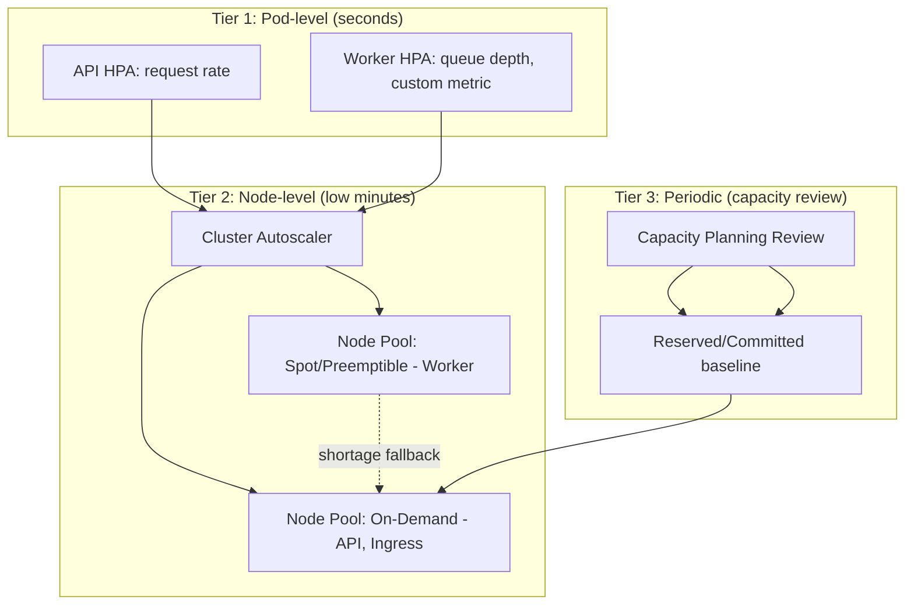

---

## Part 13 — AI Infrastructure Scaling, GPU Readiness, Edge Computing & Multi-region Expansion

### 13.1 AI Infrastructure Scaling (Subsystem 46)

**Purpose & Architecture.** `AI_PLATFORM_ARCHITECTURE.md`'s AI Gateway, Provider Router, and Prompt/Context/Memory subsystems (§§2–8 of that document) are, at launch, entirely externally-hosted-provider-backed — no infrastructure this document provisions runs model inference directly at Phase 1–2. This document's contribution is the infrastructure layer beneath that document's stated future direction (local/fine-tuned/self-hosted model inference, cited in `AI_PLATFORM_ARCHITECTURE.md` Part 15) — provisioned as an opt-in, clearly-bounded extension of Compute (§1.1), not built at launch, per YAGNI.

**Internal Components & Dependencies.** A dedicated node pool class (§4.3, distinct from general and spot pools) reserved for GPU workloads (§13.2), scaled to zero when unused so it carries no idle cost — the infrastructure exists as a defined, ready-to-activate module (§7.1), not as running, billed capacity, until genuinely needed.

**Scalability & Performance.** Vector-store scaling (`pgvector` within the existing managed Postgres, §8.1) is the nearer-term AI-infrastructure scaling concern and is handled by the same read-replica and instance-sizing levers already specified for Postgres generally — no separate infrastructure is required for it, consistent with `DATABASE.md`'s and `AI_PLATFORM_ARCHITECTURE.md`'s shared decision to colocate vectors in Postgres rather than a separate vector database.

**Trade-offs & Future Evolution.** Deferring self-hosted inference infrastructure to a clearly-scoped, ready-but-inactive module means the day it is genuinely needed (cost economics at very high AI-call volume favoring self-hosted, or an Enterprise customer's data-residency requirement prohibiting third-party model providers entirely) it is a capacity-activation decision, not a new infrastructure design effort.

### 13.2 GPU Readiness (Subsystem 47)

**Purpose & Architecture.** When activated (§13.1), GPU capacity is deliberately sourced with a **hybrid posture**: the primary compute cloud's own GPU instances for tight integration with the rest of the Compute domain (§1.1) where latency to Postgres/Redis matters, *and* an explicit allowance to source GPU capacity from a specialized GPU-cloud provider for batch/offline workloads (e.g., large-scale embedding generation, model fine-tuning jobs) where hyperscaler GPU pricing is materially less cost-efficient than specialized providers — a considered, cost-driven exception to §1.2's single-primary-compute-cloud default, scoped narrowly to GPU batch workloads only, never to latency-sensitive request-path infrastructure.

**Security.** Any specialized GPU-cloud provider used under this hybrid posture connects to BizPilot AI's data only through the same `SecretsProviderPort`/`ObjectStoragePort`-mediated boundaries already established (`BACKEND_ARCHITECTURE.md` §11) — never given direct database network access, regardless of provider.

**Trade-offs & Future Evolution.** The hybrid posture is named now, in this document, specifically so that when GPU infrastructure is eventually activated it is executed against a pre-agreed cost/architecture policy rather than negotiated for the first time under launch-deadline pressure.

### 13.3 Edge Computing Readiness (Subsystem 48)

**Purpose & Architecture.** The edge vendor (§1.2) supports edge-executed compute (a Workers/Functions-at-the-edge-equivalent) suitable for narrow, latency-sensitive, stateless logic — signed-URL generation for CDN-fronted file delivery (§9.2) is the most likely first candidate, since it requires no database access and directly reduces the origin round-trip currently incurred for every file access. Not implemented at Phase 1–2 (YAGNI); named here as a defined, low-risk future optimization rather than left undiscovered.

**Trade-offs & Future Evolution.** Edge compute is explicitly scoped to logic that can tolerate the edge runtime's restricted execution environment (no direct Postgres connection, limited execution duration) — it is a targeted latency optimization for a specific request class, never proposed as a general application-hosting layer, avoiding the common anti-pattern of over-extending edge compute beyond what it is actually good at.

### 13.4 Multi-region Expansion (Subsystem 49)

**Purpose & Architecture.** Extends `DATABASE.md` §3.1's noted future path toward per-tenant data isolation: multi-region rolls out in three deliberate stages, each independently valuable and none requiring the next: **Stage A** (current, Phase 1–2) — single-region, Multi-AZ HA (§8.1) with cross-region backup replication (§8.2) for DR only, no active multi-region traffic serving; **Stage B** (Phase 3, latency-driven) — read replicas (§8.1) placed in additional regions to reduce read latency for geographically distant users, writes still routed to the single primary region; **Stage C** (Phase 3+, demand-driven) — full additional-region active deployment, gated specifically by either genuine latency data justifying it or a specific Enterprise customer's data-residency requirement (`AUTH_ARCHITECTURE.md` §6.3) mandating in-region data storage, reusing the Enterprise-Isolated environment pattern (§2.1) and IaC modules (§7.1) already designed for exactly this purpose.

**Security.** Stage C's data-residency-driven case is the one this document treats as most likely to be the actual trigger, given `PRD.md`'s Enterprise persona and `AUTH_ARCHITECTURE.md`'s compliance posture — multi-region here is as much a compliance capability as a performance one, and is explicitly not built speculatively ahead of that concrete driver.

**Trade-offs & Future Evolution.** Naming three independently-valuable stages (rather than treating "multi-region" as one large, deferred, all-or-nothing project) is what makes P17 (multi-region ready) a genuinely low-cost standing property rather than a Phase-3 crash project — Stage A costs almost nothing beyond what §8's DR posture already requires, and each subsequent stage is undertaken only when its specific driver materializes.

**Diagram 11 — AI/GPU Infrastructure & Multi-region Staging**

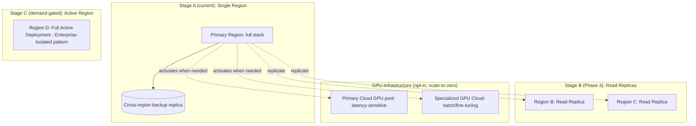

## Part 14 — Security Operations

*Common to this Part:* Defense in Depth (P19) is the organizing principle — every control below exists alongside, not instead of, the application-layer security already specified in `AUTH_ARCHITECTURE.md`.

### 14.1 Security Operations Overview (Subsystem 50) & 14.2 WAF / 14.2b DDoS Protection (Subsystems 51–52)

**Purpose & Architecture.** The edge vendor's WAF and DDoS mitigation (§1.2, §3.3) are the platform's outermost security control, evaluating every request before it consumes any Compute-domain resource: managed rule sets (OWASP Top 10-aligned) block common attack patterns (SQLi, XSS payloads, known bad-actor IP reputation) at the edge; volumetric and protocol-level DDoS mitigation is handled natively by the edge vendor's anycast network absorbing attack traffic before it ever reaches the primary compute cloud, which is not itself sized or billed to absorb attack-scale volume.

**Internal Components & Dependencies.** WAF rules are layered with, not a substitute for, the application-layer rate limiting (`BACKEND_ARCHITECTURE.md` §9) and the Ingress-layer rate limiting (§3.5) — three independent rate-limiting enforcement points on the same request path, each catching what the others might miss.

**Security.** Custom WAF rules supplement the managed rule set for BizPilot-AI-specific abuse patterns (e.g., credential-stuffing patterns against the auth endpoints `AUTH_ARCHITECTURE.md` defines, or abnormal AI-generation request volume relevant to `AI_PLATFORM_ARCHITECTURE.md`'s cost-protection concerns) — a WAF rule can act as a faster, edge-level circuit breaker than an application-layer budget check for the most severe abuse cases.

**Monitoring, Failure Modes & Recovery.** WAF-blocked request volume and rule-trigger patterns are tracked and alerted (§11.5, P1 for anomalous spikes) — a sudden change in blocked-traffic shape is itself an early-warning signal worth investigating even when the WAF is successfully mitigating it.

**Trade-offs & Future Evolution.** Relying on the edge vendor's managed rule sets (rather than hand-maintaining a custom WAF ruleset from scratch) trades some rule-tuning precision for rules maintained and updated by a vendor with far broader attack-pattern visibility than BizPilot AI alone has — the correct trade at every phase, with custom rules reserved for genuinely BizPilot-AI-specific patterns only.

### 14.3 IAM Strategy (Subsystem 53)

**Purpose & Architecture.** Explicitly distinct from, and complementary to, `AUTH_ARCHITECTURE.md`'s IAM: that document governs *human end-users and their workspace roles*; this document governs **infrastructure and machine identities** — the compute cloud's own IAM system granting scoped permissions to every service identity named across this document (the API's runtime role, the Worker's runtime role, CI/CD pipeline roles, the GitOps controller's role, the IaC-apply role), each following least privilege (P13) independently, re-scoped whenever a component's actual resource-access needs change, never granted broad standing access "to be safe."

**Internal Components & Dependencies.** A clear separation exists between three IAM tiers: (1) human operator access to cloud consoles (restricted to a small set of individuals, MFA-enforced, used only for the documented break-glass exceptions named throughout this document); (2) CI/CD and GitOps machine identities (§5.2, §5.4, §7.1); (3) application runtime identities (API, Worker) — a permission granted to tier 3 is never sufficient to also grant tier 1 or 2 capability, and vice versa.

**Security.** Every IAM policy is itself expressed as IaC (§7.1) and subject to the same review discipline as any other infrastructure change — permissions are never granted by hand in a console, which would leave no reviewable diff.

**Monitoring, Failure Modes & Recovery.** IAM policy changes and anomalous permission usage (a service identity attempting an action outside its expected pattern) are both logged to the audit infrastructure (§14.6) and alertable (§11.5) — an application identity attempting an IAM action it has never needed before is a strong compromise indicator.

**Trade-offs & Future Evolution.** Maintaining three distinct IAM tiers is more upfront modeling effort than a flatter permission model, repaid by making a compromised low-privilege identity (most likely, an application runtime identity, given its exposure to user-supplied input) structurally incapable of escalating into infrastructure-level control.

### 14.4 Compliance Readiness (Subsystem 54)

**Purpose & Architecture.** This document does not restate `AUTH_ARCHITECTURE.md` §6's GDPR/SOC 2 posture; it supplies the infrastructure controls that posture depends on: encryption at rest (§7.2's KMS-backed encryption applied uniformly across Postgres, Object Storage, and backups), encryption in transit (TLS enforced end-to-end, §3.6), network segmentation as an access control (§3.1), and the audit infrastructure (§14.6) that makes compliance claims verifiable rather than merely asserted.

**Trade-offs & Future Evolution.** SOC 2 Type II readiness in particular depends on demonstrating these controls operated *consistently over a review period*, which is precisely why every control in this document is IaC-declared (§7.1) and GitOps-reconciled (§5.4) rather than manually configured — consistency-over-time is a natural property of a system that cannot drift silently, not an additional compliance-specific effort.

### 14.5 Security Operations Response

Covered under §11.6's Incident Response process, whose security-classified path is described there; not duplicated here.

### 14.6 Audit Infrastructure (Subsystem 55)

**Purpose & Architecture.** A dedicated, append-only, tamper-evident audit log store, distinct from and in addition to the general log store (§11.2) and from `BACKEND_ARCHITECTURE.md` §7.6's application-level `AuditLog` model — this document's audit infrastructure is the **infrastructure-layer** record (IAM changes, secrets access, IaC applies, deploy/rollback events, DR/restore actions) that a compromised application-layer identity cannot itself write to or tamper with, closing exactly the gap `BACKEND_ARCHITECTURE.md` §7.6 flagged as a future SIEM-export need.

**Security.** Write access to the audit store is granted to automated system processes only (the IaC pipeline, the GitOps controller, the IAM system itself) — no human identity, including operators with console break-glass access, can delete or modify an audit entry, only append new ones, a structural (not merely policy-based) guarantee.

**Monitoring, Failure Modes & Recovery.** Audit-log ingestion gaps are alerted identically to §11.2's log-ingestion monitoring, with elevated severity given their compliance load-bearing role.

**Trade-offs & Future Evolution.** A separate, restricted-write audit store versus folding this into the general log store costs additional infrastructure but is the only design that survives the threat model of a compromised application identity attempting to cover its own tracks — the general log store, writable by application code, cannot make that guarantee.

**Diagram 12 — Defense-in-Depth Security Layers**

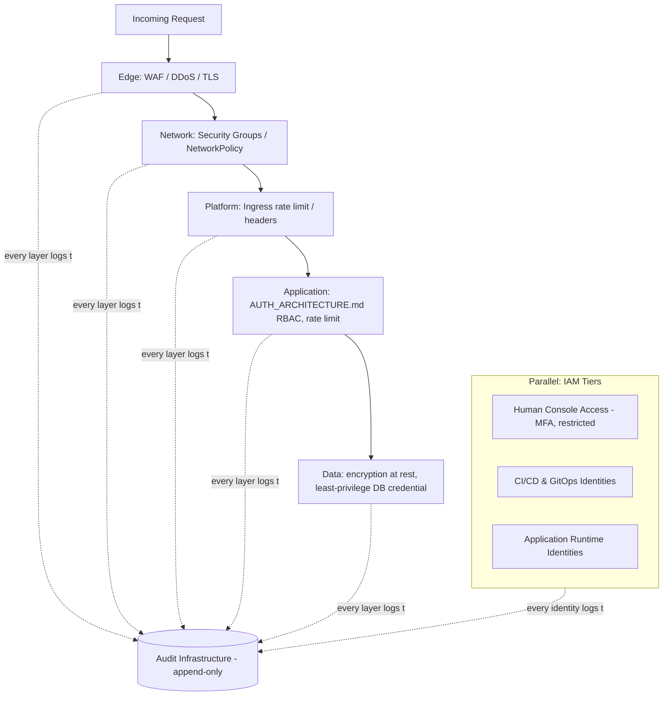

---

## Part 15 — Platform Health, Chaos Engineering, Performance Testing & Production Readiness

### 15.1 Platform Health Checks (Subsystem 56)

**Purpose & Architecture.** Extends `BACKEND_ARCHITECTURE.md` §10.1's per-service health/readiness/liveness endpoints into a platform-wide aggregate health view (§1.1's dashboard) and a recurring, calendared set of *operational* health checks distinct from those automated endpoints: DR runbook rehearsal (§8.4), backup-restore verification (§8.2), alert-rule review (§11.5), and IAM access review (§14.3) — each scheduled, owned, and tracked to completion, since an automated health check only verifies what it was written to check, and these recurring reviews are what catch what automation alone would miss.

**Trade-offs & Future Evolution.** Calendaring these reviews explicitly (rather than trusting they'll happen "when there's time") is a direct application of P16 — a task performed inconsistently is, in practice, not being performed.

### 15.2 Performance & Load Testing Strategy (Subsystem 57, merged with Subsystem 59's naming)

**Purpose & Architecture.** Synthetic load tests run against Staging (§2.1) — never Production — using traffic patterns modeled on real usage shapes (informed by Production telemetry, §11.1, once it exists; informed by `PRD.md`'s persona/journey assumptions before it does), validating three things together: the application's actual capacity ceiling, the correctness of the autoscaling policies (§12.2) under realistic ramp conditions, and the accuracy of capacity-planning assumptions (§12.1).

**Lifecycle & Operational Flow.** Required before any Production launch milestone (initial launch, and any subsequent capacity-relevant architecture change) and re-run on a recurring cadence thereafter, not treated as a one-time pre-launch gate that is never revisited.

**Monitoring, Failure Modes & Recovery.** A load test that reveals an autoscaling policy failing to react in time is exactly the failure this practice exists to surface in Staging rather than in a real incident — a load-test failure is treated as a successful catch, not a wasted test run.

**Trade-offs & Future Evolution.** Load testing against Staging depends entirely on §2.1's discipline that Staging genuinely mirrors Production's topology — a Staging environment that had drifted toward being "just a smaller copy" would make this entire practice unreliable, which is precisely why §2.1 treats topology-fidelity as non-negotiable.

### 15.3 Chaos Engineering Readiness (Subsystem 58)

**Purpose & Architecture.** Explicitly maturity-gated: `BACKEND_ARCHITECTURE.md` §9 already named one chaos-adjacent test case ("kill a random instance mid-refresh-rotation"). This document generalizes that instinct into a deferred, Phase 2–3 practice — deliberate, controlled fault injection (killing pods, introducing network latency, simulating a dependency outage) run against Staging first, and only against Production once the organization has enough operational maturity (proven runbooks, proven alerting, proven rollback, §6.5) that a Production chaos experiment is a controlled validation, not a self-inflicted incident.

**Trade-offs & Future Evolution.** Chaos engineering is named and scoped now specifically so it is adopted deliberately at the right maturity point rather than either skipped entirely (leaving untested failure-mode assumptions throughout this document unverified) or attempted prematurely (turning a validation practice into an actual incident generator).

### 15.4 & 15.5 Production Readiness Checklist (Subsystem 60)

**Purpose & Architecture.** A consolidated, capstone checklist synthesizing every "must be true before go-live" claim made throughout this document — not a new requirement, a cross-reference index:

- [ ] Multi-AZ enabled for Postgres and Redis (§8.1, §9.3) — or explicitly deferred with documented Phase 1 risk acceptance
- [ ] Continuous backup/PITR verified via an actual test restore (§8.2)
- [ ] DR runbook exists and has been rehearsed at least once (§8.4)
- [ ] Migration pipeline enforces expand/contract discipline and blocks traffic shift on failure (§8.3)
- [ ] Canary deployment with automated health-gated rollback is live for every service, not just the API (§5.1, §6.5)
- [ ] Secrets are sourced exclusively from the managed secrets service, zero secrets in any repository or image (§7.2, §4.2)
- [ ] Network segmentation verified — no direct internet route to Postgres, Redis, or internal Kubernetes Services (§3.1, §4.3)
- [ ] WAF, DDoS mitigation, and TLS (full-strict mode) active at the edge (§3.6, §14.2)
- [ ] IAM least-privilege verified for every one of the three identity tiers (§14.3)
- [ ] Audit infrastructure receiving events from every domain, append-only guarantee verified (§14.6)
- [ ] Observability stack (metrics, logs, traces) live for every service with the dead man's switch active (§11.1)
- [ ] Alert routing tested end-to-end (a synthetic P1 alert actually pages on-call) (§11.5)
- [ ] Autoscaling policies validated under load test, not merely configured (§12.2, §15.2)
- [ ] Cost anomaly alerting active (§12.3)
- [ ] Status page live and hosted independently of primary infrastructure (§11.6)
- [ ] Rollback rehearsed at least once outside of an active incident (§6.5)

**Trade-offs & Future Evolution.** This checklist is intentionally a cross-reference, not a standalone document, so it can never silently drift out of sync with the sections it summarizes — any future change to a cited section is expected to be reflected here by construction, since the checklist item's authority is the section, not its own restated text.

**Diagram 13 — Production Readiness Validation Flow**

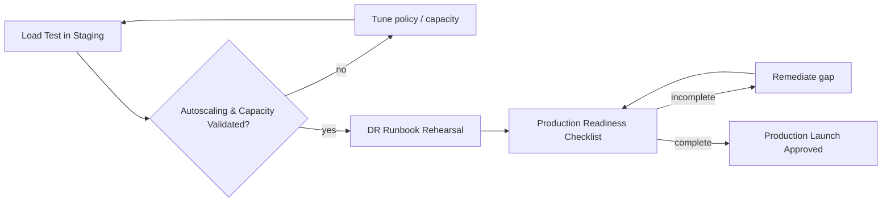

## Part 16 — Formal Architecture Decision Records

*Format:* Context / Decision / Alternatives Considered / Trade-offs / Consequences / Future Review, consistent with the ADR convention established in `BACKEND_ARCHITECTURE.md` and `AI_PLATFORM_ARCHITECTURE.md`.

### ADR-INFRA-001: Cloud Provider Strategy

- **Context.** The platform needs a compute/data cloud and an edge/network layer, with P18 (vendor lock-in minimization) and P14 (cost efficiency) both in tension with P1 (cloud native, favoring managed services).
- **Decision.** A single primary compute cloud (chosen for managed Kubernetes, `pgvector`-capable managed Postgres, and GPU availability) paired with an independent edge vendor (DNS/CDN/WAF/DDoS) — the two-vendor split described in §1.2.
- **Alternatives Considered.** (a) Single vendor for both compute and edge — rejected: couples a DNS/attack-surface incident to a compute-provider dependency unnecessarily. (b) Multi-cloud compute from day one — rejected: doubles IAM/networking operational complexity for a redundancy benefit not needed before Phase 3. (c) Self-hosted bare-metal — rejected: violates P1 and P14 at Phase 1 team size.
- **Trade-offs.** Slightly higher integration complexity (two vendor consoles/billing relationships) for materially better incident-blast-radius isolation and negotiating leverage.
- **Consequences.** Every managed-service dependency must sit behind a port (P18), already `BACKEND_ARCHITECTURE.md`'s discipline — this ADR is only viable because that discipline already exists.
- **Future Review.** Revisited at each phase boundary (§0.5) and immediately upon any signed Enterprise contract with a conflicting vendor requirement.

### ADR-INFRA-002: Containerization

- **Context.** Every deployable unit needs a consistent, portable runtime packaging strategy across five environments (§2).
- **Decision.** OCI-compliant containers, multi-stage builds, non-root execution, immutable Git-SHA image tags (§4.1–§4.2).
- **Alternatives Considered.** (a) VM images per service — rejected: slower iteration, heavier IaC surface, worse density. (b) Serverless-functions-only — rejected: `BACKEND_ARCHITECTURE.md`'s Worker/Scheduler long-running and stateful-connection-pooled patterns don't fit a pure FaaS execution model. (c) Mutable `latest` tags — rejected outright: incompatible with P4 and with deterministic rollback (§6.5).
- **Trade-offs.** Container orchestration has a real operational learning curve versus PaaS-managed deploys, accepted for the portability and control it buys.
- **Consequences.** Rollback determinism (§6.5) and reproducible Local/CI/Prod parity (§2.1) both depend directly on this decision holding.
- **Future Review.** Revisited only if a specific workload (e.g., GPU batch jobs, §13.2) proves a poor fit for the container model, in which case it is scoped as an addition, not a replacement.

### ADR-INFRA-003: Deployment Strategy

- **Context.** P5/P6/P7 require zero-downtime, gradually-reversible deploys across every service, not just AI model rollout (already solved narrowly in `AI_PLATFORM_ARCHITECTURE.md` §14).
- **Decision.** Canary-by-default for all services, generalizing the existing `FeatureFlagEngine`-based mechanism; Blue-Green reserved for migration-boundary-crossing deploys; Rolling Update as the intra-canary-stage default (§5.1).
- **Alternatives Considered.** (a) Blue-Green for everything — rejected: doubles standing infrastructure cost for every deploy, unjustified for routine, low-risk changes. (b) Recreate/atomic deploy — rejected outright: violates P5. (c) A bespoke, AI-rollout-only canary mechanism left un-generalized — rejected: duplicate infrastructure for what is fundamentally the same problem.
- **Trade-offs.** Longer pipeline duration per deploy (bake periods) versus atomic deploy's speed.
- **Consequences.** Automated health-gated rollback (§6.5) is a hard dependency of this decision, not an optional nicety.
- **Future Review.** Bake-period durations reviewed each capacity-planning cycle (§12.1) as traffic volume changes what counts as statistically meaningful.

### ADR-INFRA-004: Infrastructure as Code

- **Context.** P2 requires no infrastructure provisioned by hand, across five environments and (eventually) multiple regions.
- **Decision.** A single, environment-parameterized module set (§7.1) — network, cluster, database, cache, storage, DNS/edge — shared verbatim across Staging, Production, and future Enterprise-Isolated/multi-region deployments.
- **Alternatives Considered.** (a) Hand-maintained per-environment configuration — rejected: the exact drift risk P2 exists to close. (b) A separate IaC codebase per environment — rejected: guarantees eventual divergence between Staging and Production, undermining Staging's entire purpose (§2.1).
- **Trade-offs.** More upfront module-design effort than ad hoc per-environment scripts.
- **Consequences.** Adding a region or an Enterprise-Isolated environment (§13.4, §2.1) becomes a parameter change, not new code — the central payoff this ADR is optimizing for.
- **Future Review.** Module boundaries reviewed if a genuinely new resource category (e.g., GPU node pools, §13.2) doesn't cleanly fit the existing module shape.

### ADR-INFRA-005: CI/CD Pipeline Design

- **Context.** P3 (GitOps) and P16 (automation first) require deploy mechanics with no manual cluster-mutation step, while `BACKEND_ARCHITECTURE.md` §15.5 already mandates specific CI gates.
- **Decision.** CI validates and builds; a GitOps controller, not the pipeline itself, is the only thing that mutates live cluster state (§5.4); Staging auto-deploys, Production is release-tag-gated (§5.3).
- **Alternatives Considered.** (a) Pipeline-push deploys (CI directly calling the orchestrator API) — rejected: couples deploy reliability to CI/CD-runner uptime and loses drift detection. (b) Fully manual Production deploys — rejected: violates P3/P5 and doesn't scale past Phase 1 team size.
- **Trade-offs.** GitOps adds one more moving part (the controller itself) versus a simpler push-based pipeline.
- **Consequences.** Rollback (§6.5) becomes a pure Git operation, independent of pipeline health — a direct, valuable consequence of this specific design.
- **Future Review.** Revisited if release cadence or team structure changes enough to warrant a different gating model (e.g., scheduled release trains at much larger team size).

### ADR-INFRA-006: Secrets Management

- **Context.** `BACKEND_ARCHITECTURE.md` §11.1 defined a `SecretsProviderPort`; a concrete backing implementation is required.
- **Decision.** The compute cloud's managed secrets/KMS service, injected at pod startup via a CSI-driver-equivalent, never via plain Kubernetes `Secret` objects alone (§7.2).
- **Alternatives Considered.** (a) Plain Kubernetes Secrets — rejected: base64-encoded, not encrypted, insufficient as a sole control. (b) A self-hosted secrets vault — rejected at current team size: operational burden of running and hardening it outweighs the marginal lock-in reduction, especially given the port abstraction already mitigates lock-in. 
- **Trade-offs.** Managed-service dependency versus self-hosted control, resolved by the existing `SecretsProviderPort` abstraction making the choice reversible.
- **Consequences.** Every other credential class (TLS certs §3.6, JWT keys `AUTH_ARCHITECTURE.md` §8) is unified behind the same auditable system.
- **Future Review.** Revisited if a specific compliance requirement mandates a customer-controlled (bring-your-own-KMS) key model.

### ADR-INFRA-007: Scaling Strategy

- **Context.** P8 (horizontal scaling) must apply uniformly to request-driven (API) and queue-driven (Worker) workloads with very different load signals.
- **Decision.** A three-tier autoscaling stack (§12.2): pod-level HPA (request-rate for API, custom queue-depth metric for Worker), node-level Cluster Autoscaler, periodic manual vertical-sizing review.
- **Alternatives Considered.** (a) CPU-only HPA for the Worker — rejected: a poor proxy for queue-shaped load, demonstrated explicitly in §12.2. (b) A single global autoscaling policy applied to every workload identically — rejected: ignores that API and Worker have structurally different load signals.
- **Trade-offs.** Custom-metrics adapter infrastructure required for queue-depth-based scaling, versus CPU-based scaling's zero-extra-setup simplicity.
- **Consequences.** This decision is what makes §12.3's spot-instance Worker cost optimization safe and effective — correct scaling signal is a prerequisite, not a nicety.
- **Future Review.** Vertical Pod Autoscaling considered for automation once manual review cadence (§12.1) proves insufficient at Phase 3 scale.

### ADR-INFRA-008: Caching Strategy

- **Context.** `BACKEND_ARCHITECTURE.md` §5.8 already defined a two-tier (L1 in-process / L2 Redis) application cache; infrastructure must decide how that L2 tier is deployed relative to the also-Redis-backed job queue (§8's design).
- **Decision.** Shared Redis instance for cache and queue at Phase 1–2 (cost efficiency); split into physically separate instances at Phase 3, with distinct eviction policies per workload (§9.4).
- **Alternatives Considered.** (a) Split from day one — rejected: unjustified operational and cost overhead at Phase 1 traffic. (b) Never split — rejected: a queue backlog under load would be free to evict cache entries and vice versa, an avoidable correctness/performance risk at scale.
- **Trade-offs.** Phase 1–2 accepts a documented resource-contention risk in exchange for lower cost; Phase 3 accepts marginally higher cost to remove that risk once traffic makes it material.
- **Consequences.** The split point and trigger condition are defined now, converting a potential future incident into a planned migration.
- **Future Review.** Triggered by observed queue-depth/cache-hit-ratio correlation crossing a defined threshold, not by a fixed calendar date.

### ADR-INFRA-009: Disaster Recovery Strategy

- **Context.** P11 requires quantified RTO/RPO; `BACKEND_ARCHITECTURE.md` §15.6 already established Postgres as the sole source of truth requiring DR.
- **Decision.** RPO < 5 minutes via continuous WAL streaming and cross-region backup replication; RTO < 60 minutes at Phase 1–2 via Multi-AZ failover plus a rehearsed manual cross-region restore runbook; both tighten as multi-region infrastructure matures (§13.4).
- **Alternatives Considered.** (a) Nightly-snapshot-only backup — rejected: cannot meet the RPO target. (b) Hot multi-region standby from Phase 1 — rejected: cost disproportionate to Phase 1 risk given P14.
- **Trade-offs.** Phase 1–2's RTO involves genuine manual runbook steps, accepted as bounded and rehearsed rather than eliminated prematurely.
- **Consequences.** DR rehearsal (§15.1) becomes a mandatory, calendared practice, not optional — an untested DR plan is treated as equivalent to no DR plan.
- **Future Review.** RTO target reviewed and tightened at each multi-region stage transition (§13.4 Stage A→B→C).

### ADR-INFRA-010: Observability Strategy

- **Context.** P15 requires every component to be production-ready only once instrumented; `BACKEND_ARCHITECTURE.md` §5.6–§5.7 already mandated OpenTelemetry instrumentation and RED/USE metrics at the application layer.
- **Decision.** An open-standard (OpenTelemetry-compatible) collection and storage stack (§11.1–§11.3), not a single vendor's proprietary APM agent.
- **Alternatives Considered.** (a) A proprietary all-in-one APM vendor — rejected: violates P18, and re-instrumenting away from a proprietary agent later is exactly the lock-in cost this document exists to avoid. (b) No centralized tracing, logs/metrics only — rejected: `AI_PLATFORM_ARCHITECTURE.md`'s async, multi-hop AI/queue workloads are specifically the hardest to debug without cross-hop tracing.
- **Trade-offs.** Marginally less out-of-the-box dashboard polish than a mature proprietary vendor, accepted under P18.
- **Consequences.** The "dead man's switch" (§11.1) exists specifically because a self-hosted/open-standard stack's own availability is BizPilot AI's responsibility in a way a fully managed proprietary vendor's might not be.
- **Future Review.** A managed, OTel-compatible backend is considered at any phase if self-hosting the storage tier becomes a genuine operational burden — the instrumentation layer remains unchanged either way, by design.

### ADR-INFRA-011: Security Architecture

- **Context.** P12/P13/P19 require security controls at every layer, not concentrated solely in `AUTH_ARCHITECTURE.md`'s application-layer identity system.
- **Decision.** A five-layer Defense in Depth stack (§14, Diagram 12): edge WAF/DDoS/TLS, network segmentation, platform-level (Ingress) controls, application-layer controls (cited from `AUTH_ARCHITECTURE.md`), data-layer encryption — plus a three-tier IAM model (§14.3) separate from application-user IAM.
- **Alternatives Considered.** (a) Relying on application-layer security alone — rejected: a single-layer control is a single point of failure, contradicting P19 directly. (b) A flat, single-tier IAM model — rejected: fails to structurally prevent a low-privilege identity compromise from escalating.
- **Trade-offs.** More infrastructure surface and more IAM policies to maintain, in exchange for no single control's failure being catastrophic.
- **Consequences.** Every layer independently reports to the audit infrastructure (§14.6), making Defense in Depth verifiable, not just claimed.
- **Future Review.** Reviewed against evolving compliance requirements (§14.4) as Enterprise customer contracts introduce new obligations.

### ADR-INFRA-012: Cost Optimization Strategy

- **Context.** P14 requires spend proportional to load without compromising P9 (HA) or P12 (security).
- **Decision.** Commitment discounts for baseline capacity, spot/preemptible instances scoped to the idempotent-by-design Worker pool only (§12.3), storage lifecycle tiering, and cost treated as a first-class, per-domain-attributed observability signal.
- **Alternatives Considered.** (a) Spot instances platform-wide, including API/Ingress — rejected: those workloads are not built on an interruption-tolerant contract, unlike Worker jobs (`BACKEND_ARCHITECTURE.md` §8.5); would trade cost for reliability, violating P9. (b) No committed-use discounts, pure on-demand — rejected: leaves clearly-predictable baseline spend unoptimized for no benefit given P1's already-managed-service posture.
- **Trade-offs.** Committed-use discounts require capacity forecasting confidence (§12.1) and reduce flexibility to shrink baseline quickly if traffic drops sharply.
- **Consequences.** Cost-anomaly alerting (§12.3) doubles as an early security-compromise signal — a direct, useful side effect of treating cost as an observability concern.
- **Future Review.** Commitment sizing revisited at every capacity-planning cycle (§12.1); spot-instance scope revisited only if a future workload class is deliberately redesigned to be interruption-tolerant.

**Diagram 14 — ADR Decision Map**

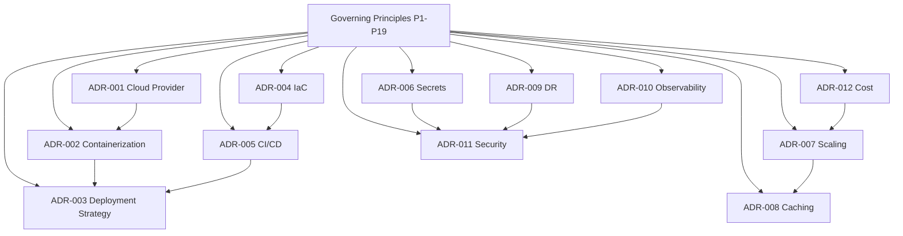

### Supplementary Diagrams (15–20)

The following six diagrams complete the 20-diagram requirement, each illustrating a lifecycle or structural view not already captured by Diagrams 1–14.

**Diagram 15 — Environment Promotion Flow**

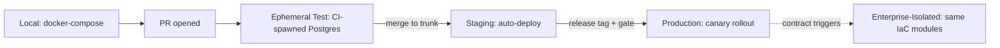

**Diagram 16 — Git / Release / Tag Lifecycle**

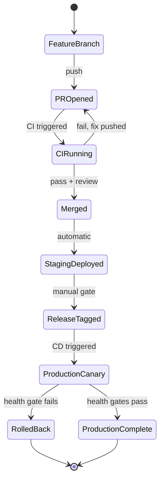

**Diagram 17 — Three-Tier IAM Model**

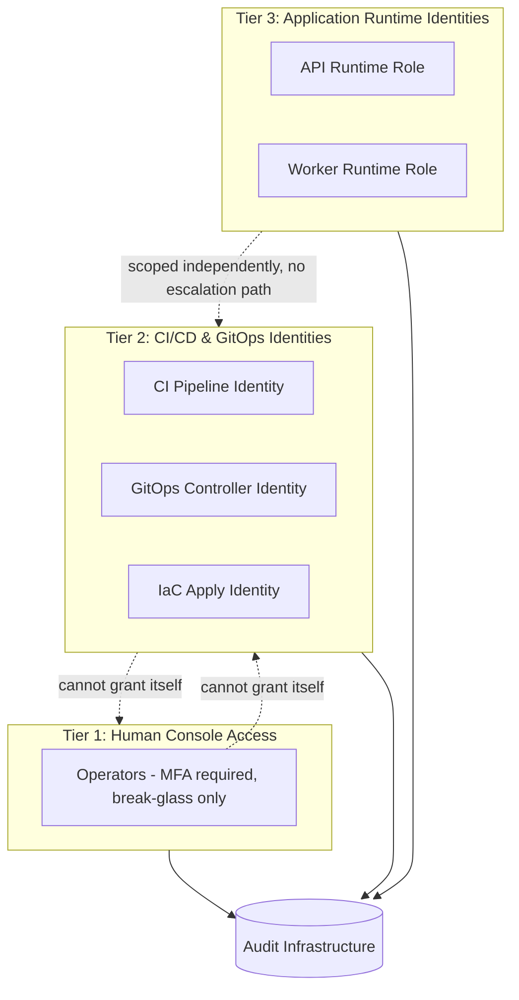

**Diagram 18 — Incident Severity & Escalation**

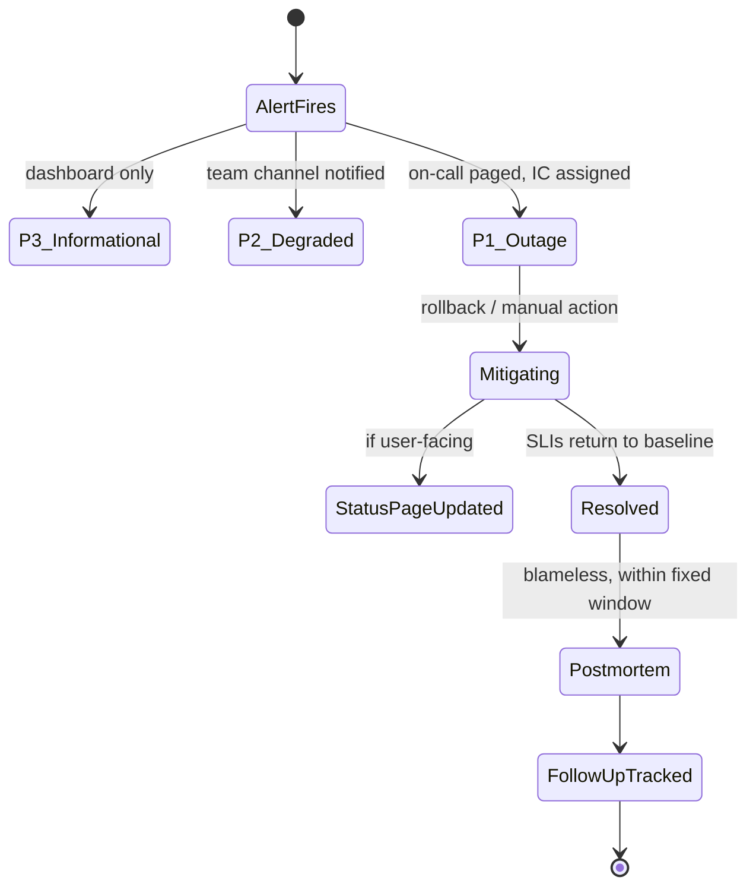

**Diagram 19 — Capacity Planning Review Cycle**

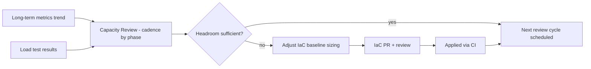

**Diagram 20 — Compliance & Audit Data Flow**

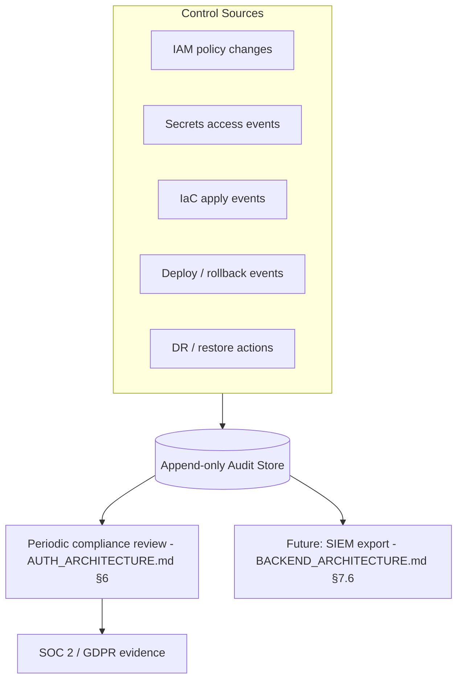

---

## Part 17 — Consolidated Risk Register, Operational Assumptions & Migration Roadmap

### 17.1 Hidden Risks

| Risk | Where it lives | Mitigation as designed |
|---|---|---|
| Shared Redis (cache+queue) resource contention under load | §9.4 | Scheduled Phase 3 split, trigger condition pre-defined (ADR-INFRA-008) |
| Shared-cluster noisy-neighbor risk across namespaces (Phase 1–2) | §4.3 | Resource requests/limits + pod-priority classes; Phase 3 cluster separation |
| Single DNS-provider administrative failure (not availability) | §3.2 | Hardware-key MFA, drift alerting; accepted risk pending Enterprise-driven review |
| Open-standard observability stack's own availability is self-owned | §11.1 | Independent dead man's switch heartbeat |
| Committed-use discounts reduce elasticity if traffic drops sharply | §12.3 | Sized conservatively against §12.1's reviewed, not maximal, baseline |
| Spot-instance capacity shortage during regional demand spikes | §12.3 | Automatic fallback to on-demand Worker capacity, queue-depth-alerted degradation |

### 17.2 Operational Assumptions

- A small (Phase 1) team can operate this architecture without a dedicated infrastructure/SRE hire, given the managed-service-heavy posture (P1) and automation-first discipline (P16); a dedicated platform-engineering function is expected to form organically by Phase 2–3 as node-pool, IAM, and multi-region surface grows.
- Staging genuinely mirrors Production's topology at all times (§2.1) — every load-testing (§15.2) and chaos-engineering (§15.3) conclusion in this document depends on that fidelity holding.
- The primary compute cloud's regional capacity and the edge vendor's anycast network are assumed non-limiting relative to BizPilot AI's realistic scale through Phase 3 (§1.2).

### 17.3 Scalability Bottlenecks to Watch

- Postgres primary write throughput remains the platform's ultimate ceiling until `DATABASE.md` §3.1's sharding path is exercised — read replicas (§8.1) and caching (§9.3) defer, not eliminate, this ceiling.
- Worker HPA's custom-metrics adapter (§12.2) is a non-default piece of cluster infrastructure and is the most likely single point of autoscaling-pipeline fragility to monitor closely as Worker workload diversity grows (`AI_PLATFORM_ARCHITECTURE.md`'s Agent Runtime jobs in particular).

### 17.4 Migration Paths (already named in-line, indexed here)

| From | To | Trigger | Section |
|---|---|---|---|
| Shared cluster/namespaces | Per-environment clusters | Team size / blast-radius tolerance | §4.3 |
| Shared cache+queue Redis | Split Redis instances | Observed resource contention | §9.4, ADR-INFRA-008 |
| Single-region, DR-only backup | Read replicas in new regions | Latency data | §13.4 Stage B |
| Read replicas | Full active multi-region | Data-residency contract or latency SLA breach | §13.4 Stage C |
| No GPU infrastructure | Activated GPU node pool / hybrid GPU cloud | Cost economics or data-residency need for self-hosted inference | §13.1–§13.2 |
| Manual DR runbook steps | Largely automated failover | Sustained multi-region maturity | §8.4 |

### 17.5 Closing Statement

This document is deliberately silent on which specific commercial vendor fills each named category — that decision belongs to a lighter-weight, more frequently-revisited procurement note, not to an architecture document meant to remain valid across a vendor change. What this document commits to, durably, is the *shape*: five infrastructure domains, five environment tiers, a two-vendor edge/compute split, canary-by-default deployment, GitOps-mediated change, a three-tier IAM model, and phase-gated (not speculative) scaling of every stateful system. Everything else — which managed Kubernetes offering, which specific edge vendor, which specific metrics backend — is a configuration detail this architecture is explicitly designed to survive changing.

---

*End of `CLOUD_INFRASTRUCTURE.md`. Extends and is fully consistent with `PRD.md`, `DATABASE.md`, `AUTH_ARCHITECTURE.md`, `API_CONTRACT.md`, `BACKEND_ARCHITECTURE.md`, and `AI_PLATFORM_ARCHITECTURE.md`. No prior decision in any of those six documents is redesigned or contradicted here.*
