# BizPilot AI — Commercial Intelligence, Monetization & Growth Architecture

**Status:** Commercial Operating System (Phase 13) — how BizPilot AI creates, captures, measures, and compounds economic value.
**Depends on (immutable, cited not redesigned here):** [PRD.md](PRD.md), [DATABASE.md](DATABASE.md), [AUTH_ARCHITECTURE.md](AUTH_ARCHITECTURE.md), [API_CONTRACT.md](API_CONTRACT.md), [BACKEND_ARCHITECTURE.md](BACKEND_ARCHITECTURE.md), [AI_PLATFORM_ARCHITECTURE.md](AI_PLATFORM_ARCHITECTURE.md), [CLOUD_INFRASTRUCTURE.md](CLOUD_INFRASTRUCTURE.md), [FRONTEND_ARCHITECTURE.md](FRONTEND_ARCHITECTURE.md), [ENTERPRISE_INTELLIGENCE_ARCHITECTURE.md](ENTERPRISE_INTELLIGENCE_ARCHITECTURE.md), [ENGINEERING_STANDARDS.md](ENGINEERING_STANDARDS.md), [TRUST_SECURITY_COMPLIANCE_ARCHITECTURE.md](TRUST_SECURITY_COMPLIANCE_ARCHITECTURE.md).
**Scope:** Not a pricing page, a pitch deck, or a marketing plan — the production-grade architecture connecting Revenue → Value → Usage → AI Cost → Margin → Retention → Expansion → Enterprise Growth → Ecosystem Growth into one measurable, governable system.

---

## 0. Document Conventions

### 0.1 What this document is not

This document does not redesign `DATABASE.md`'s `Subscription`, `SubscriptionPlan`, `AICredit`, or `AIUsage` models, `AI_PLATFORM_ARCHITECTURE.md`'s AI Credits/Token Accounting/Budget Protection subsystems, `BACKEND_ARCHITECTURE.md`'s row-level-locked credit-debit mechanism (ADR-009) or `FeatureFlagEngine` (§7.7), `CLOUD_INFRASTRUCTURE.md`'s cost governance and workspace cost attribution (§12), or `ENTERPRISE_INTELLIGENCE_ARCHITECTURE.md`'s AI Workforce, Business Health Engine, or Decision Engine. Every mechanism below is a citation, a commercial-role definition layered on an existing mechanism, or — where genuinely absent — an explicitly justified, minimally-scoped new extension, classified NOW/NEXT/SCALE/ENTERPRISE/GLOBAL per this phase's mandate. No source code appears anywhere in this document.

### 0.2 The central distinction this document exists to enforce

Four adjacent concepts are persistently confused in SaaS/AI commercial design, and this document treats keeping them distinct as its own architectural discipline:

| Concept | Question it answers | Owned by |
|---|---|---|
| **Value** | What did this do for the customer's business? | Part 2–3 (new: Value Taxonomy, Value Realization Engine) |
| **Usage** | What did the customer actually do in the product? | Part 4 (new: Commercial Metering Engine), citing `AI_PLATFORM_ARCHITECTURE.md`'s existing AI Usage tracking |
| **Cost** | What did it cost BizPilot AI to deliver that usage? | Part 6 (new: AI Cost Economics Layer), citing `CLOUD_INFRASTRUCTURE.md` §12 |
| **Price** | What does the customer pay, regardless of usage or cost? | `DATABASE.md`'s existing `Subscription`/`SubscriptionPlan` (cited), Part 9 (Pricing Architecture) |

**Value ≠ Usage.** A customer can generate enormous usage (many AI calls) that produces little business value (busywork), or small usage (one well-targeted AI Employee recommendation) that produces large value (a closed deal). **Usage ≠ Cost.** Two identical-looking API calls can cost radically different amounts depending on model routing, caching, and token volume. **Cost ≠ Price.** Price is a business decision informed by cost, not derived from it mechanically — otherwise BizPilot AI would be reselling tokens, exactly the "ChatGPT with a dashboard" outcome this document's core thesis (§0.4) rejects. **Price ≠ Profitability.** A customer paying a high price can still be unprofitable if their cost-to-serve is higher still (Part 21).

### 0.3 Confidence & Certainty Discipline (binding on this entire document)

Per this phase's explicit mandate, this document never presents a projection as a guarantee. Every quantitative figure below is one of four kinds, always labeled:

| Label | Meaning |
|---|---|
| **Cited Fact** | A decision already made and recorded in a prior document (e.g., "`BACKEND_ARCHITECTURE.md` names Stripe as the payment-processing integration") |
| **Formula** | A defined, deterministic calculation with a stated source of truth (Part 5's unit-economics formulas) |
| **Estimate** | A modeled figure with stated assumptions and a named confidence level (Part 23's financial simulation) — never presented as fact |
| **Range / Input** | A parameter this document supplies as a starting point for pricing experimentation (Part 9's plan matrix, Part 22), not a fixed, final price |

### 0.4 Core Business Thesis

BizPilot AI must not become "ChatGPT with a dashboard" — a thin interface reselling token access, whose value is bounded by the underlying model's own capability and whose defensibility is zero, since any competitor with API access can replicate it. It must become an **AI Business Operating System whose value compounds as it accumulates business context, operates real workflows, and measurably improves outcomes** — value that a generic chatbot structurally cannot replicate because it has no persistent Digital Twin (`ENTERPRISE_INTELLIGENCE_ARCHITECTURE.md` Part 1, cited), no AI Workforce occupying real organizational seats (Part 2 of that document, cited), and no governed authority to act (Part 9 of that document, cited). The economic hierarchy this document architects around:

**Business Value → Product Capability → Usage → AI/Infrastructure Cost → Customer Price → Gross Margin → Retention → Expansion → Network/Ecosystem Effects.**

Monetization therefore targets **business outcomes and product capabilities**, not raw token consumption — a pricing model built primarily around "$X per 1,000 tokens" would structurally re-couple BizPilot AI's price to provider cost, defeating §0.2's Cost≠Price discipline and this thesis simultaneously.

### 0.5 Relationship to Prior Documents

| Prior document | What it already committed to (cited, not redesigned) | What this document adds |
|---|---|---|
| `DATABASE.md` | `Subscription`, `SubscriptionPlan`, `AICredit`, `AIUsage` models; presumed `Invoice`/`Payment`/`Transaction`-adjacent billing models (`ENTERPRISE_INTELLIGENCE_ARCHITECTURE.md` §6.10's citation of "transaction/reconciliation models," `FRONTEND_ARCHITECTURE.md` §10.1's citation of "billing/invoicing surfaces") | Part 27's minimal, justified new commercial data model (`CommercialEvent`, `UsageMeter`, `UsageLimit`, `CostSnapshot`, `ProfitabilitySnapshot`; `CustomerValueSnapshot` and `PricingExperiment` deferred to NEXT) |
| `AUTH_ARCHITECTURE.md` | RBAC, `WorkspaceMember`, session model | Commercial governance approval roles (Part 32) are RBAC role assignments, never a parallel permission system |
| `API_CONTRACT.md` | `ApiKey` model, URI versioning, rate limiting | Part 18's Developer Platform economics and Part 28's new commercial API resources |
| `BACKEND_ARCHITECTURE.md` | AI Credits Engine with row-level-locked debit (ADR-009), `FeatureFlagEngine` (§7.7), Event Bus, Stripe as named future payment integration | Part 8's full credit-economy lifecycle built on that exact locking mechanism; Part 22's pricing experimentation reuses `FeatureFlagEngine` as its third documented layer of reuse |
| `AI_PLATFORM_ARCHITECTURE.md` | AI Gateway, Provider Router, Provider Capability Matrix, AI Credits/Token Accounting/Cost Forecasting/Budget Protection | Part 6's AI Cost Economics Layer (Provider Cost → Internal Cost Unit → Credit Cost → Customer Price) and Part 7's Margin Protection Engine, both built entirely on these existing subsystems |
| `CLOUD_INFRASTRUCTURE.md` | §12's Cost Engineering, per-domain and per-workspace cost attribution, FinOps practice | Part 5's Unit Economics Engine and Part 21's Customer Profitability model consume that attribution as their primary cost input |
| `FRONTEND_ARCHITECTURE.md` | Dashboard Shell, Analytics Dashboard widget model, experimentation framework (reusing `FeatureFlagEngine`) | Part 30–31's dashboards render through the existing Dashboard Shell; Part 22's pricing experiments reuse the existing experimentation framework |
| `ENTERPRISE_INTELLIGENCE_ARCHITECTURE.md` | AI Workforce (nine AI Executive roles, AI Project Manager, AI Research Department), Business Health Engine, Decision Engine, Autonomous Decision Levels, per-seat AI cost attribution (§16.2), Workflow Intelligence | Part 11's AI Employee Economics and Part 12's Workflow Economics are the commercial layer over these exact subsystems — no new agent or workflow mechanism is introduced |
| `ENGINEERING_STANDARDS.md` | Cost Engineering (Part 20 of that document), Metrics Governance registry, `FeatureFlagEngine`-based experimentation | Part 20's Commercial Intelligence Layer extends that Metrics Governance registry with commercial metric definitions, not a parallel metrics system |
| `TRUST_SECURITY_COMPLIANCE_ARCHITECTURE.md` | Data Classification (five-tier), AI Action Risk Engine, Tenant Isolation (ten-layer), Audit Infrastructure, AI Authority Matrix | Part 33's Economic Safety Model is this document's domain-specific application of that document's Tier 0 invariants to financial/billing truth specifically |

---

## Part 1 — Commercial Operating Model

### 1.1 The Commercial Value Chain

Fifteen named entities, each with exactly one owning document/subsystem — no commercial concept in this document is modeled twice:

| Entity | Owned by | Role in the chain |
|---|---|---|
| Customer | `AUTH_ARCHITECTURE.md` (`User`) | The paying legal entity or individual |
| Workspace | `DATABASE.md` §3.1 | The tenant boundary (`TENANT_CONTEXT`, `TRUST_SECURITY_COMPLIANCE_ARCHITECTURE.md` Part 5, cited) usage and billing both scope to |
| Plan | `DATABASE.md`'s `SubscriptionPlan` | The static entitlement definition (Part 9) |
| Subscription | `DATABASE.md`'s `Subscription` | The workspace's current plan binding, term, and billing cycle |
| Feature | `PRD.md`'s feature inventory | A named product capability a plan entitles a workspace to |
| Capability | `ENTERPRISE_INTELLIGENCE_ARCHITECTURE.md` (Domain Intelligence modules, AI Workforce roles) | A higher-order grouping of features into a monetizable unit (Part 10's packaging hierarchy) |
| AI Employee | `ENTERPRISE_INTELLIGENCE_ARCHITECTURE.md` Part 2 | A named, role-scoped Agent Runtime instance occupying an organizational seat |
| Agent | `AI_PLATFORM_ARCHITECTURE.md` §9 | The underlying Agent Runtime execution substrate every AI Employee is an instance of |
| Workflow | `BACKEND_ARCHITECTURE.md`'s Workflow Engine, `ENTERPRISE_INTELLIGENCE_ARCHITECTURE.md`'s Workflow Intelligence | A defined, potentially-automated sequence of steps |
| Execution | `AI_PLATFORM_ARCHITECTURE.md` §9 (Agent Runtime invocation) | A single, billable unit of work |
| AI Usage | `DATABASE.md`'s `AIUsage` | The recorded token/call volume an execution consumed |
| Credits | `DATABASE.md`'s `AICredit`, `BACKEND_ARCHITECTURE.md` ADR-009 | The internal, workspace-scoped spending unit debited per execution |
| Provider Cost | `AI_PLATFORM_ARCHITECTURE.md`'s Provider Capability Matrix | The real dollar cost BizPilot AI pays a model provider |
| Infrastructure Cost | `CLOUD_INFRASTRUCTURE.md` §12 | The real dollar cost of compute, storage, and network beyond AI provider spend |
| Revenue | `DATABASE.md`'s billing/payment models (cited) | What the customer actually pays, independent of the above cost chain |
| Margin | **New here** (Part 5, 21) | Revenue minus the full cost stack |
| Business Outcome | **New here** (Part 2–3) | The measured, real-world business result — the thing the customer actually bought |

### 1.2 Why Revenue Is Structurally Decoupled from Usage

Revenue (what a customer pays, per their `Subscription`) and Usage (what a workspace actually consumes, tracked via `AICredit`/`AIUsage` and Part 4's new metering layer) are **two independent data flows that only meet at the Margin calculation (Part 5)**, never at the point of execution — an AI Employee's tool call never directly creates or modifies a billing record; it only debits a credit balance and emits a metering event. This is the concrete implementation of §0.2's Value≠Usage≠Cost≠Price discipline and, independently, restates `TRUST_SECURITY_COMPLIANCE_ARCHITECTURE.md` Part 33's forthcoming Economic Safety invariant that billing truth cannot be silently altered by execution-time or AI-time logic.

**Diagram 1 — The Commercial Value Chain: Ownership Map**

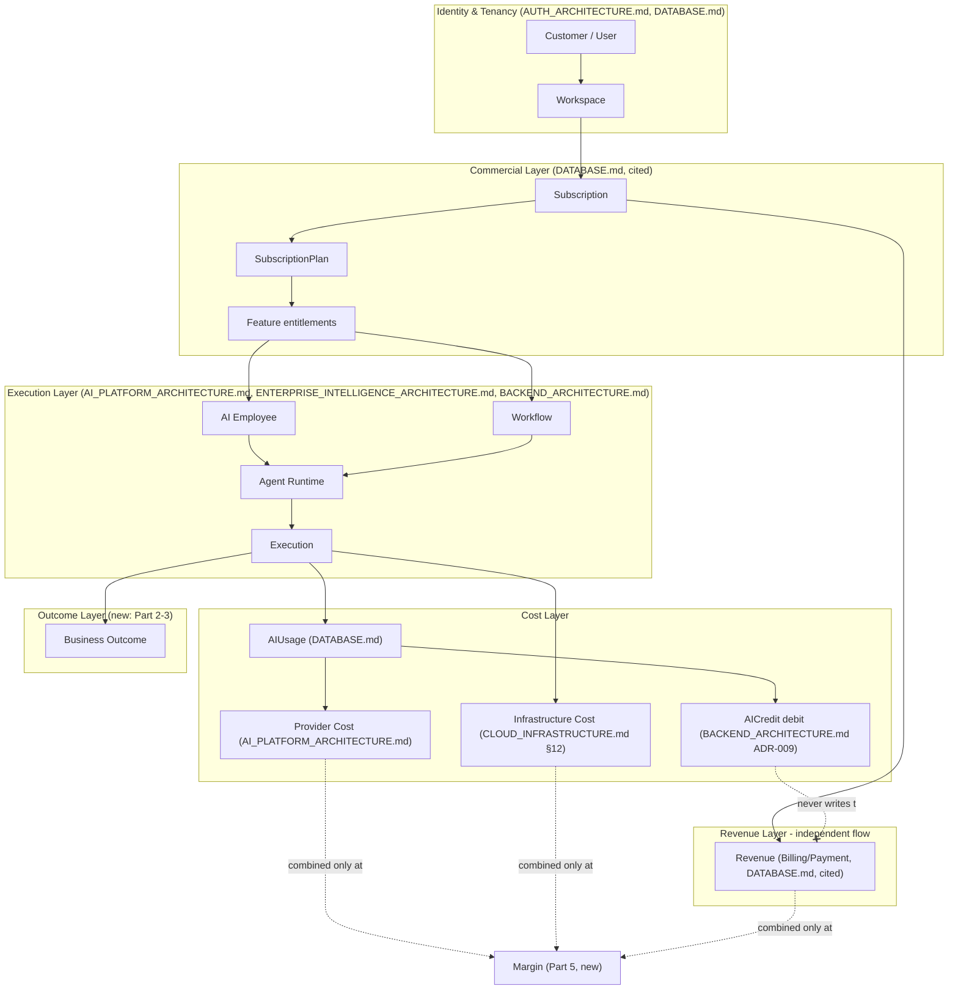

### 1.3 The Boundary This Document Owns

Everything left of "Execution" in Diagram 1 is fully specified by prior documents. Everything from "AIUsage" through "Margin" and "Business Outcome" is where this document adds architecture: **Part 4** (the normalized metering abstraction sitting between Execution and AIUsage/CommercialEvent), **Part 5** (the Unit Economics Engine computing Margin), **Part 6–8** (AI Cost Economics, Margin Protection, Credit Economy — the Cost Layer's internal structure), and **Part 2–3** (Value Taxonomy and Value Realization Engine — the Outcome Layer). Revenue itself (Subscription → billing → payment) is cited as existing and is deliberately not re-architected — this document's job is connecting to it, not replacing it.

**Diagram 2 — This Document's Scope Within the Value Chain**

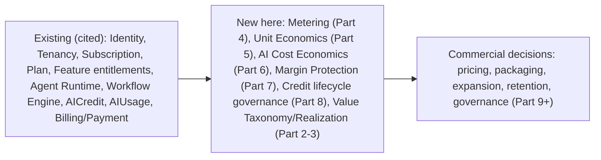

---

## Part 2 — Value Architecture

*Every "measurable outcome" below is a defined, computable quantity — never a vague claim. Where a metric requires interpretation (e.g., what counts as a "task"), that definition is stated once and reused, never left implicit.*

### V1 — Productivity

| Field | Definition |
|---|---|
| Customer problem | Manual, repetitive work consuming operator time |
| Capability | AI-assisted drafting, summarization, and content generation across the product surface |
| Measurable outcome | **Tasks completed with AI assistance per active user per period** — a task is a single, discrete unit of work with a defined start (user request) and end (accepted output or explicit rejection), logged via Part 4's metering layer |
| Product feature | AI Copilot (`FRONTEND_ARCHITECTURE.md` §9.1, cited), content-generation surfaces |
| Economic value | Time saved, estimated per §3's Value Realization Engine, never claimed as a fixed multiplier |
| Monetization mechanism | Included baseline usage per plan tier (Part 9); metered beyond threshold |
| Retention effect | Weak-to-moderate alone — productivity features are the easiest category for a competitor to replicate |
| Expansion potential | Low as a standalone driver; primarily a seat-expansion contributor (more users adopting the habit) |

### V2 — Automation

| Field | Definition |
|---|---|
| Customer problem | Repetitive multi-step processes requiring manual coordination |
| Capability | Workflow Engine execution (`BACKEND_ARCHITECTURE.md`, cited), Automation Intelligence (`ENTERPRISE_INTELLIGENCE_ARCHITECTURE.md` §9.9, cited) |
| Measurable outcome | **Workflow runs completed without human intervention per period**, and **human-approval steps eliminated per period** (both directly logged by the Workflow Engine, not estimated) |
| Product feature | Workflow Builder, Automation Builder (`FRONTEND_ARCHITECTURE.md` §9.6–§9.7, cited) |
| Economic value | Process cycle-time reduction — measurable directly from workflow start/end timestamps, not estimated |
| Monetization mechanism | Workflow execution count is a metered dimension (Part 4, Part 12) |
| Retention effect | Moderate-to-strong — a live, running automation is operationally embedded, raising switching cost proportional to its criticality (never artificially, per Part 14's prohibition on lock-in) |
| Expansion potential | Strong — automation usage naturally grows with adopted process count |

### V3 — Intelligence

| Field | Definition |
|---|---|
| Customer problem | Business data exists but is not synthesized into understanding |
| Capability | Domain Intelligence modules, Business Health Engine (`ENTERPRISE_INTELLIGENCE_ARCHITECTURE.md` Parts 5–6, cited) |
| Measurable outcome | **Business Health sub-score coverage** (how many of the sixteen Domain Intelligence modules are actively computing signals for a workspace) and **Risk/Opportunity register items surfaced per period** |
| Product feature | Executive Command Center, Business Health widgets (`ENTERPRISE_INTELLIGENCE_ARCHITECTURE.md` Part 10, cited) |
| Economic value | Earlier risk detection, informed prioritization — inherently harder to quantify in dollars than V1–V2, tracked as Estimated (§0.3) via Part 3's value states |
| Monetization mechanism | Domain Intelligence module count/depth is a packaging dimension (Part 10) |
| Retention effect | Strong — Business Health history has no value outside the accumulated data, making it genuinely (not artificially) sticky |
| Expansion potential | Moderate — grows as a business adds Domain Intelligence coverage (new departments, new data sources) |

### V4 — Decision Support

| Field | Definition |
|---|---|
| Customer problem | Decisions are made without full context or comparative analysis |
| Capability | Recommendation Engine, Decision Engine, Business Simulation Engine (`ENTERPRISE_INTELLIGENCE_ARCHITECTURE.md` Parts 9, 7, cited) |
| Measurable outcome | **Recommendations surfaced, accepted, and rejected per period** (Recommendation Engine's own output, directly logged) and **Simulations run before a real decision** (a leading indicator of decision-quality investment, not itself proof of a better outcome) |
| Product feature | Recommendation surfaces across the Executive Command Center, the "What If" Engine |
| Economic value | Estimated (never Observed) — a recommendation's downstream business impact is genuinely uncertain until outcome data accumulates (`ENTERPRISE_INTELLIGENCE_ARCHITECTURE.md` §11.3's Organizational Learning, cited) |
| Monetization mechanism | A Business/Enterprise-tier capability (Part 9) — advanced decision support is not a Free/Starter-tier feature |
| Retention effect | Strong once a business's own calibration history (§11.3, cited) has accumulated — the recommendation quality is workspace-specific and not portable |
| Expansion potential | Strong — decision-support usage compounds with Business Health/Intelligence adoption |

### V5 — AI Workforce

| Field | Definition |
|---|---|
| Customer problem | Skilled labor for specific business functions is expensive, slow to hire, or unavailable at the business's current scale |
| Capability | The full AI Employee roster (`ENTERPRISE_INTELLIGENCE_ARCHITECTURE.md` Part 2, cited) |
| Measurable outcome | **AI Employee task-completion velocity and recommendation-acceptance rate** (`ENTERPRISE_INTELLIGENCE_ARCHITECTURE.md` §5.7, §16.3, cited) — the identical metrics that document already tracks for AI-seat performance, reused here as the commercial value signal, not recomputed |
| Product feature | AI Executive Team, AI Employee Workspace (`ENTERPRISE_INTELLIGENCE_ARCHITECTURE.md` §9.5, `FRONTEND_ARCHITECTURE.md` §9.5, cited) |
| Economic value | The clearest, most defensible value category in this taxonomy — an AI Employee's cost is directly comparable (Part 11) to a human role's cost, a comparison V1–V4 cannot make as cleanly |
| Monetization mechanism | Per-seat and/or capacity-based (Part 11 details the specific model per role) |
| Retention effect | Very strong — an AI Employee accumulates workspace-specific memory (`ENTERPRISE_INTELLIGENCE_ARCHITECTURE.md` §3.5, cited) that has no value transplanted elsewhere |
| Expansion potential | Very strong — the primary expansion vector this document identifies (Part 13) |

### V6 — Business Optimization

| Field | Definition |
|---|---|
| Customer problem | A business's own processes, spend, and resource allocation are not continuously reviewed for improvement |
| Capability | Forecasting Platform, Business Experiment Engine (`ENTERPRISE_INTELLIGENCE_ARCHITECTURE.md` Part 7, cited) |
| Measurable outcome | **Forecast accuracy over time** (calibration-tracked, `ENTERPRISE_INTELLIGENCE_ARCHITECTURE.md` §7.1, cited) and **Business Experiments run and concluded** |
| Product feature | Forecasting widgets, Business Experiment configuration UI |
| Economic value | Estimated — optimization value is inherently comparative (versus a counterfactual the business cannot directly observe) |
| Monetization mechanism | Business/Enterprise-tier, forecasting horizon and experiment concurrency as packaging levers |
| Retention effect | Moderate-to-strong |
| Expansion potential | Moderate |

### V7 — Enterprise Governance

| Field | Definition |
|---|---|
| Customer problem | A growing or regulated business needs auditable control over AI authority, data residency, and access |
| Capability | AI Governance floors, Autonomous Decision Levels, Data Residency, `SupportAccessGrant` (`ENTERPRISE_INTELLIGENCE_ARCHITECTURE.md` Part 15, `TRUST_SECURITY_COMPLIANCE_ARCHITECTURE.md` Parts 7, 16, 32, cited) |
| Measurable outcome | **Compliance Control Registry evidence completeness** (`TRUST_SECURITY_COMPLIANCE_ARCHITECTURE.md` §26.2, cited) — a governance-maturity signal, not a revenue-attribution one |
| Product feature | Enterprise Trust Center, audit exports, SAML/SCIM (`TRUST_SECURITY_COMPLIANCE_ARCHITECTURE.md` Part 27, 32, cited) |
| Economic value | Risk avoidance — the hardest value category to quantify in this taxonomy, treated as Unverified (§0.3) unless a specific compliance failure was actually avoided and documented |
| Monetization mechanism | Enterprise-tier only, contract-based (Part 17) |
| Retention effect | Very strong, but for a distinct reason from V5 — switching cost here is compliance/audit-continuity risk, not sunk product value, and this document is explicit (Part 14) that this must never be engineered as artificial lock-in |
| Expansion potential | Strong within Enterprise accounts specifically; irrelevant below that tier |

### V8 — Ecosystem / Platform

| Field | Definition |
|---|---|
| Customer problem | A business's specific needs exceed what any single vendor's first-party feature set covers |
| Capability | AI Marketplace, Plugin Engine, Connector Intelligence (`BACKEND_ARCHITECTURE.md` §7.9, `ENTERPRISE_INTELLIGENCE_ARCHITECTURE.md` Part 13, `FRONTEND_ARCHITECTURE.md` §14.1–§14.2, cited) |
| Measurable outcome | **Marketplace items installed and actively used per workspace** |
| Product feature | Marketplace UI, Connector directory |
| Economic value | Indirect — platform value is realized through the specific installed capability's own value category (V1–V7), not independently |
| Monetization mechanism | Revenue share (Part 19) |
| Retention effect | Strong at the platform level (switching cost now includes every installed third-party capability, not just first-party ones) |
| Expansion potential | Compounding — the one value category with genuine network effects (more creators → more capability → more customers → more creators, Part 24) |

**Diagram 3 — Value Taxonomy Overview**

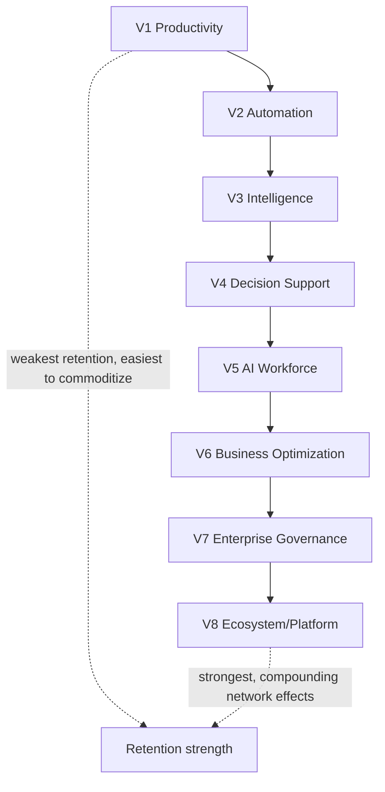

---

## Part 3 — Value Realization Engine

### 3.1 Purpose & the Non-Negotiable Rule

**AI-generated activity never automatically equals financial revenue.** A workflow completing, a recommendation being accepted, or an AI Employee drafting an outreach email is *product activity*, not *proven business value* — the Value Realization Engine's entire purpose is estimating value from that activity while remaining honest about how confident that estimate is, never collapsing the two.

### 3.2 Four Value States

| State | Meaning | Example |
|---|---|---|
| **Observed** | A directly measured, unambiguous product fact | "14 workflow runs completed this week" |
| **Estimated** | A modeled quantity derived from Observed facts plus a stated assumption | "Approximately 6 hours saved, assuming 25 minutes per manually-completed equivalent task" |
| **Attributed** | A business outcome plausibly connected to product activity, with an explicit causal-confidence caveat | "A deal closed 3 days after an AI Sales Director recommendation was accepted" (correlation surfaced, causation not claimed) |
| **Unverified** | A value claim the system cannot currently substantiate at any confidence level | Anything not backed by Observed or Estimated data — explicitly labeled, never silently omitted or implied |

### 3.3 Confidence Levels

Every Estimated or Attributed value ships with a confidence level — **High** (a well-calibrated, high-sample-size estimate, e.g., time-per-task benchmarks refined over `ENTERPRISE_INTELLIGENCE_ARCHITECTURE.md` §11.3's Organizational Learning history), **Medium** (a reasonable default assumption, not yet workspace-calibrated), or **Low** (a first-pass, generic assumption, flagged for the customer as directional only) — never presented without one.

### 3.4 Measured Value Categories

| Category | Measurement | Value State |
|---|---|---|
| Hours saved | Task count × calibrated time-per-task estimate (workspace-specific once available, category-generic default otherwise) | Estimated |
| Tasks automated | Workflow Engine execution count, direct | Observed |
| Leads processed | Sales Intelligence pipeline event count (`ENTERPRISE_INTELLIGENCE_ARCHITECTURE.md` §6.6, cited) | Observed |
| Support interactions handled | Support Intelligence ticket-resolution event count (§6.15, cited) | Observed |
| Marketing assets generated | Content-generation execution count | Observed |
| Reports produced | Executive Reporting Engine output count (§10.8, cited) | Observed |
| Decisions accelerated | Time between a Recommendation Engine surfacing and a human action on it, versus a workspace's own historical baseline | Estimated |
| Workflows executed | Direct | Observed |
| Human approvals reduced | Comparing current Human Approval Architecture (§9.6, cited) trigger rate against the workspace's own prior-period baseline | Estimated |
| Revenue opportunities influenced | A Sales/Deal entity whose stage advanced within a defined window following an AI Employee action | Attributed |

### 3.5 Architecture: The `CustomerValueSnapshot`

A periodic (daily, rolling up to weekly/monthly views) computation reading from Part 4's Commercial Metering Engine and `ENTERPRISE_INTELLIGENCE_ARCHITECTURE.md`'s Business Memory (§11.1, cited) event log, producing a per-workspace snapshot of every §3.4 category with its value state and confidence level attached — this is the `CustomerValueSnapshot` model formally justified in Part 27 (classified REQUIRED NOW for internal computation, customer-facing rendering NEXT).

**What data it protects.** Nothing directly — its job is protecting the *integrity of the value narrative* the platform tells customers and itself, ensuring "AI did something" is never silently upgraded to "AI created $X of value" without the stated confidence discipline.

**What happens when it fails.** A snapshot computation failure results in a stale-but-labeled-as-stale value dashboard (never a silently-frozen, misleadingly-current-looking one) — the snapshot's own `computedAt` timestamp is always customer-visible.

**How detected.** Snapshot job failures are `ENGINEERING_STANDARDS.md`-standard Operational Metrics (§16.2, cited).

**How recovered.** Recompute on next scheduled run; no backfill claim is made for a missed period's value beyond what Observed data (which is durable, unlike a point-in-time estimate) can reconstruct.

**Cost.** A scheduled aggregation job (`BACKEND_ARCHITECTURE.md` §8 Scheduler, cited), proportional to workspace count.

**When built.** NOW horizon for the internal computation (feeding Part 20's Commercial Intelligence and Part 30's Founder dashboard); the customer-facing **BizPilot Value Dashboard** itself is NEXT horizon (§3.6).

### 3.6 The Future BizPilot Value Dashboard

**Architecture (future-compatible design, not built at launch).** A workspace-scoped view rendered through `FRONTEND_ARCHITECTURE.md`'s existing Dashboard Shell (§4.10, cited), surfacing §3.4's categories with their value state and confidence level always visible alongside the number — never a bare figure. Every value shown links back to the Observed data underlying it (workflow run IDs, execution IDs), so a skeptical customer can always trace an Estimated figure to its inputs, directly extending the Explainability discipline (`ENTERPRISE_INTELLIGENCE_ARCHITECTURE.md` E5, cited) from AI decisions to commercial value claims.

**Trigger.** NEXT horizon — built once `CustomerValueSnapshot` has accumulated enough history (a minimum data-maturity threshold, not a calendar date) to make the displayed estimates meaningful rather than noisy on day one.

**Diagram 4 — Value Realization Engine Architecture**

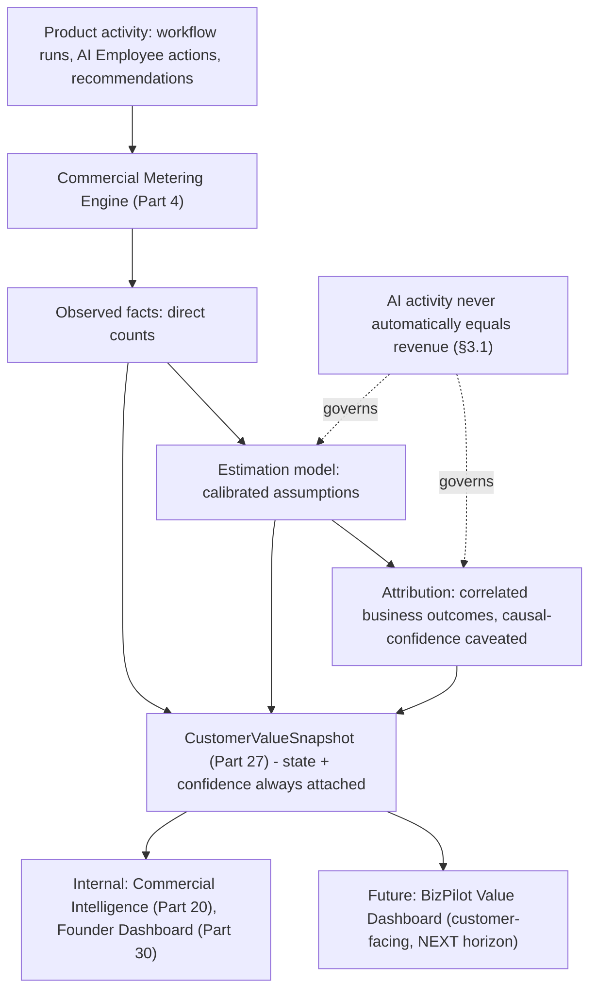

**Diagram 5 — Four Value States & Confidence Levels**

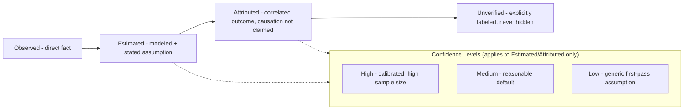

---

## Part 4 — Commercial Metering Engine

### 4.1 Purpose & Scope

**Why.** `DATABASE.md`'s `AIUsage` model already tracks AI-specific consumption; this document requires metering across a broader surface — feature usage, workflow execution, AI Employee execution, agent execution, API consumption, storage, seats, automation runs, and premium-intelligence access — none of which `AIUsage` alone can represent, since several are not AI operations at all (a seat, a storage byte). The Commercial Metering Engine is the **normalized abstraction every one of these sources reports through**, so Part 5's Unit Economics Engine and Part 21's Customer Profitability model never need source-specific logic.

### 4.2 The Normalized Metering Event

Every billable event, regardless of source, carries these fields — a HARD REQUIREMENT restating `ENGINEERING_STANDARDS.md`'s and `TRUST_SECURITY_COMPLIANCE_ARCHITECTURE.md`'s "no module invents custom logic" discipline applied to metering specifically:

| Field | Definition |
|---|---|
| `tenant` / `workspace` | `TENANT_CONTEXT` (`TRUST_SECURITY_COMPLIANCE_ARCHITECTURE.md` Part 5, cited) — mandatory on every event, no exception |
| `actor` | The identity that caused the event — human `User`, AI Employee (`AI_ID`, `TRUST_SECURITY_COMPLIANCE_ARCHITECTURE.md` §6.1, cited), API key, or system/scheduled process |
| `feature` | The product capability this event belongs to (Part 2's V1–V8 taxonomy, or a specific named feature within one) |
| `action` | The specific operation (`workflow.run.completed`, `ai_employee.execution.completed`, `api.request`, extending `ENGINEERING_STANDARDS.md` §3.1's dot-namespaced event-naming convention) |
| `timestamp` | Event occurrence time |
| `quantity` | The metered amount |
| `unit` | What `quantity` is measured in (tokens, executions, GB, seats, requests) |
| `cost basis` | The Internal Cost Unit (Part 6) this event maps to, if any |
| `pricing basis` | Which plan entitlement/metered-overage rule (Part 9) this event is evaluated against |
| `idempotency key` | Prevents double-counting on retry, restating `BACKEND_ARCHITECTURE.md` §8.5's idempotency discipline as binding on metering specifically |
| `source` | Which subsystem emitted the event (AI Gateway, Workflow Engine, API Gateway, Storage service) |
| `metadata` | Source-specific detail, never used by Part 5's aggregation logic directly (an escape hatch for debugging, not a computation input) |

### 4.3 What the Metering Layer Is Not

**The metering layer is never the billing source of truth.** This is the single most important architectural boundary in this Part, restating this phase's explicit mandate:

| Layer | Role | Source of truth for |
|---|---|---|
| **Metering** (this Part, new `UsageMeter`, Part 27) | Records raw, granular usage facts | Usage volume only |
| **Credits** (`DATABASE.md`'s `AICredit`, cited) | The workspace's internal spending balance, debited per `BACKEND_ARCHITECTURE.md` ADR-009's locked-transaction pattern | Remaining AI-spend balance |
| **Billing** (`DATABASE.md`'s existing `Invoice`-adjacent models, cited) | What the customer is actually charged, computed from `Subscription`/`SubscriptionPlan` plus metered-overage rules | The legally/contractually binding charge |
| **Payments** (`DATABASE.md`'s existing `Payment`/`Transaction`-adjacent models, Stripe integration per `BACKEND_ARCHITECTURE.md`'s named future infrastructure, cited) | Actual money movement | Cash received |
| **Accounting** (`ENTERPRISE_INTELLIGENCE_ARCHITECTURE.md` §6.10's Accounting Intelligence, cited) | Reconciliation, ledger-level correctness | Financial-statement-grade truth |

A metering event can be lost, replayed, or corrected without ever risking an incorrect charge, precisely because Billing never reads metering data directly — it reads a reconciled, periodically-rolled-up view (Part 27's `UsageMeter` aggregation), and any discrepancy between metering and the actual credit ledger is a detectable, alertable anomaly (Part 29), never a silent billing error.

**What data it protects.** Nothing directly — it is the observational layer beneath every other Part's commercial logic, and its own correctness is what makes Parts 5, 20, and 21 trustworthy.

**What happens when it fails.** A metering-emission failure (an event lost before recording) undercounts usage — the system fails toward **under-billing, never over-billing**, a deliberate, stated bias (a HARD REQUIREMENT: when metering is uncertain, resolve in the customer's favor, never the platform's).

**How detected.** Reconciliation between `UsageMeter` aggregates and `AICredit`/`AIUsage`'s own independently-tracked debits (Part 29's observability chain) — a mismatch is a `METERING_DISCREPANCY`-class alert.

**How recovered.** Backfill from the source system's own durable log where available (the Workflow Engine's own execution history, the AI Gateway's own request log); where not recoverable, the gap is documented and, per the under-billing bias, never retroactively charged to the customer.

**Cost.** Proportional to event volume, using the same Event Bus infrastructure `BACKEND_ARCHITECTURE.md` already provisions (cited, not a second pipeline).

**When built.** NOW horizon — launch blocker, since Part 5's Unit Economics Engine and Part 9's metered-plan tiers both depend on it existing from day one.

**Diagram 6 — Commercial Metering Engine: Sources to Normalized Event**

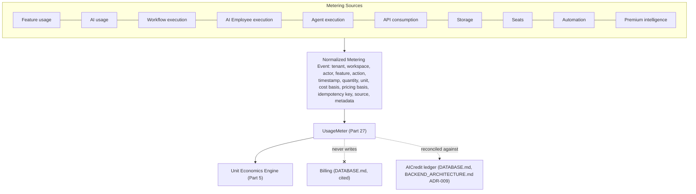

**Diagram 7 — Metering, Credits, Billing, Payments, Accounting: Five Distinct Layers**

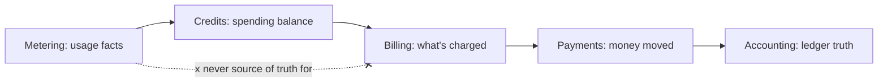

---

## Part 5 — Unit Economics Engine

### 5.1 Purpose

**Why.** Every metric below already has a conventional SaaS definition; this Part's contribution is binding each one to an exact formula, a source of truth, and an update frequency **within BizPilot AI's specific architecture**, so "what does MRR mean here" is never a matter of interpretation across Finance, Product, and Engineering.

### 5.2 Revenue Metrics

| Metric | Formula | Source of truth | Frequency |
|---|---|---|---|
| **MRR** (Monthly Recurring Revenue) | Sum of all active `Subscription` records' monthly-normalized recurring charge (annual plans divided by 12) | `Subscription`/`SubscriptionPlan` (`DATABASE.md`, cited) | Daily |
| **ARR** (Annual Recurring Revenue) | MRR × 12 | Derived from MRR | Daily |
| **ARPU** (Average Revenue Per User/Account) | MRR ÷ active-workspace count | Derived | Daily |
| **ACV** (Annual Contract Value) | Per-contract annualized value, for Enterprise/annual-term subscriptions specifically (Part 17) | `Subscription` term data | Real-time on contract event |
| **CAC** (Customer Acquisition Cost) | (Sales + Marketing spend for period) ÷ (new customers acquired in period) | Finance-system input (external to this architecture — cited as an input, not computed by BizPilot AI's own product telemetry) | Monthly |
| **LTV** (Lifetime Value) | ARPU × Gross Margin % ÷ Revenue Churn rate | Derived from §5.2–§5.4 | Monthly |
| **Payback Period** | CAC ÷ (ARPU × Gross Margin %) | Derived | Monthly |

### 5.3 Margin Metrics

| Metric | Formula | Source of truth | Frequency |
|---|---|---|---|
| **Gross Margin** | (Revenue − COGS) ÷ Revenue, where COGS = AI Cost + Infrastructure Cost + Payment-processing fees | Part 6 (AI Cost), `CLOUD_INFRASTRUCTURE.md` §12 (Infra Cost), Payment provider fee schedule | Daily (near-real-time for the cost side, since `CostSnapshot`, Part 27, is a daily rollup) |
| **Contribution Margin** | Gross Margin − variable Support Cost − other variable cost | Part 5.5's Cost-to-Serve inputs | Daily |
| **AI Cost per Customer** | Sum of a workspace's Internal Cost Unit consumption (Part 6) for the period | `CostSnapshot` | Daily |
| **Infrastructure Cost per Customer** | Workspace's attributed share of `CLOUD_INFRASTRUCTURE.md` §12.3's per-domain cost tagging | `CostSnapshot` | Daily |
| **Support Cost per Customer** | Support-ticket-handling-time × loaded support-hour cost, attributed via ticket-to-workspace linkage | Support system integration (external input) | Monthly |
| **Cost-to-Serve** | AI Cost + Infrastructure Cost + Support Cost + Payment fees, per customer, per period | Derived, `ProfitabilitySnapshot` (Part 27) | Daily |
| **Revenue-to-Inference-Cost ratio** | Revenue ÷ AI Cost, per customer or per plan tier | Derived | Daily |

### 5.4 Retention & Movement Metrics

| Metric | Formula | Source of truth | Frequency |
|---|---|---|---|
| **Net Revenue Retention (NRR)** | (Starting-period MRR + Expansion − Contraction − Churned MRR) ÷ Starting-period MRR, for a cohort held constant | `Subscription` change history | Monthly |
| **Gross Revenue Retention (GRR)** | (Starting-period MRR − Contraction − Churned MRR) ÷ Starting-period MRR (excludes expansion, never exceeds 100%) | `Subscription` change history | Monthly |
| **Logo Churn** | Cancelled workspaces ÷ starting-period active workspaces | `Subscription` cancellation events | Monthly |
| **Revenue Churn** | Churned MRR ÷ starting-period MRR | `Subscription` cancellation events | Monthly |
| **Expansion Revenue** | Sum of MRR increases from existing workspaces (seat additions, tier upgrades, credit top-ups becoming recurring) | `Subscription` change events (Part 26) | Daily |
| **Contraction Revenue** | Sum of MRR decreases from existing (non-cancelled) workspaces | `Subscription` change events | Daily |

### 5.5 Update-Frequency Rationale

No metric in this Part is claimed "real-time" — even the fastest-updating figures (Expansion/Contraction Revenue, AI Cost per Customer) are **near-real-time via daily rollups**, a deliberate choice: computing MRR/margin truly continuously would require billing-adjacent logic to run on every metering event, which §4.3 explicitly forbids (metering never touches billing directly). Daily rollups are the correct granularity for a business operating at BizPilot AI's stated scale range (`CLOUD_INFRASTRUCTURE.md` §0.5's NOW-through-GLOBAL horizons, cited) — finer granularity is revisited only if a specific operational need (e.g., real-time margin-based Margin Protection triggers, Part 7) requires it, which Part 7 addresses separately using metering-layer data directly, not this Part's rolled-up financial metrics.

**Diagram 8 — Unit Economics Engine Data Flow**

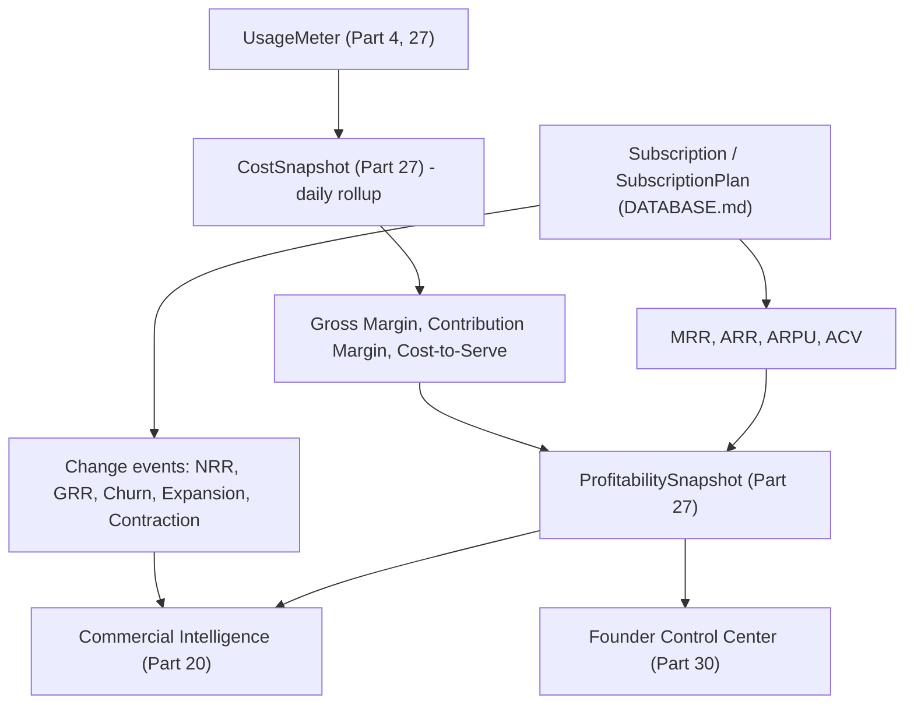

---

## Part 6 — AI Cost Economics

### 6.1 The Four-Layer Cost Architecture

**Provider Cost → Internal Cost Unit → Credit Cost → Customer Price.** Extends `AI_PLATFORM_ARCHITECTURE.md`'s Provider Router and Provider Capability Matrix (cited) with the commercial abstraction boundary this phase's mandate requires: **provider prices must never leak directly into customer pricing logic.**

| Layer | Definition | Owner |
|---|---|---|
| **Provider Cost** | The actual dollar cost per unit (input/output/cached token, image, audio second, embedding call) a specific provider charges | `AI_PLATFORM_ARCHITECTURE.md`'s Provider Capability Matrix, cited — this document reads it, never redefines it |
| **Internal Cost Unit** | A normalized, provider-agnostic unit (this document's contribution) representing "one unit of AI work" regardless of which provider/model served it | New here |
| **Credit Cost** | How many `AICredit` units an operation consumes — a pricing decision informed by, but not mechanically derived from, Internal Cost Unit | Part 9's pricing governance |
| **Customer Price** | What a credit is worth within the customer's plan (Part 9) | `DATABASE.md`'s `SubscriptionPlan`, cited |

### 6.2 Why the Internal Cost Unit Exists

**Why.** Without it, a provider's price change (a routine, expected event — `AI_PLATFORM_ARCHITECTURE.md`'s Provider Router already anticipates multi-provider failover for reliability, and providers revise pricing independently of BizPilot AI) would either (a) require an immediate customer-facing price change to preserve margin, which is operationally disruptive and erodes trust, or (b) silently erode margin if absorbed without adjustment. The Internal Cost Unit decouples the two: provider cost changes are absorbed at the Provider-Cost-to-Internal-Cost-Unit conversion layer, monitored via Part 5's Revenue-to-Inference-Cost ratio, and only trigger a Credit Cost or pricing review (a deliberate, governed Part 32 decision) if the margin impact crosses a defined threshold — never automatically.

**What it models.** Input tokens, output tokens, cached tokens (priced lower than fresh tokens per most providers' own schedules, cited from `AI_PLATFORM_ARCHITECTURE.md`'s Prompt Cache subsystem), reasoning-token cost (for models exposing extended reasoning as a distinct cost line), request-level latency-tier cost (some providers price faster inference higher), embedding cost, image-generation cost, audio cost, tool-execution cost (the compute cost of running a Tool, `TRUST_SECURITY_COMPLIANCE_ARCHITECTURE.md` Part 10, cited, distinct from the model-call cost that triggered it), and workflow cost (Part 12's aggregation of every step's individual cost).

### 6.3 Multi-Provider Normalization

Every supported provider — OpenAI, Anthropic, Google, self-hosted models (`CLOUD_INFRASTRUCTURE.md` §13.1–§13.2's GPU-readiness plan, cited), and future providers — maps to the identical Internal Cost Unit schema via a provider-specific conversion function, registered the same way `AI_PLATFORM_ARCHITECTURE.md`'s Provider Capability Matrix already registers provider capabilities — **adding a new provider is a new conversion-function registration, never a pricing-system redesign.**

**What data it protects.** BizPilot AI's own margin structure — the abstraction is what prevents a provider-cost fluctuation from becoming an uncontrolled, unreviewed customer-price or margin event.

**What happens when it fails.** A missing or stale conversion function for a given provider/model defaults to the most conservative (highest-cost) known equivalent — fail toward *protecting margin*, mirroring §4.3's fail-toward-under-billing bias but applied to internal cost accounting, where the platform's own risk (not the customer's) is what an incorrect-low estimate would harm.

**How detected.** Part 29's cost-attribution chain surfaces any workspace/operation whose actual provider cost diverges materially from its computed Internal Cost Unit.

**How recovered.** Conversion-function correction, retroactive `CostSnapshot` recomputation for the affected period (internal-only — never triggers a retroactive customer charge, per §4.3).

**Cost.** The conversion-function registry itself is lightweight; its value is risk-avoidance, not a cost center of its own.

**When built.** NOW horizon — launch blocker, since Part 5's Gross Margin formula depends on it for even a single-provider launch.

**Diagram 9 — AI Cost Economics: Four-Layer Architecture**

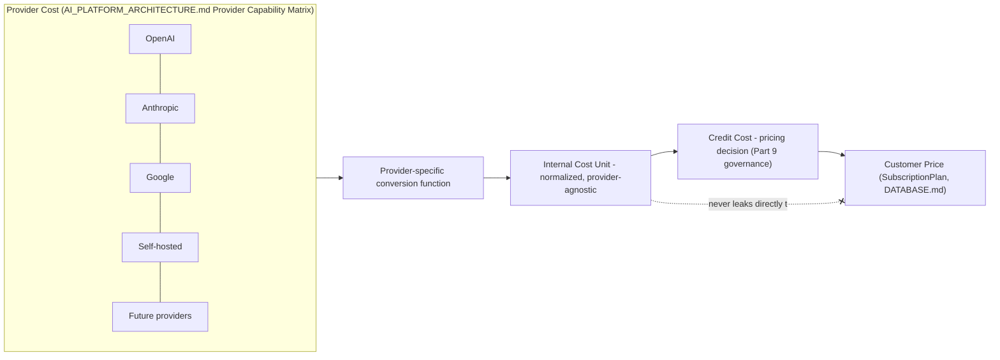

**Diagram 10 — Cost Model Coverage**

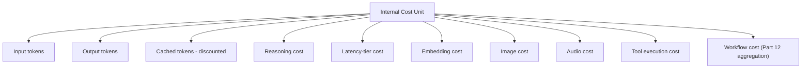

---

## Part 7 — AI Margin Protection

### 7.1 Threat Surface

**Why.** `AI_PLATFORM_ARCHITECTURE.md`'s Budget Protection subsystem already exists at the individual-workspace-credit level; this Part extends it into a full **margin protection engine** addressing patterns that individual credit limits alone do not catch: runaway usage (a single workspace consuming abnormally, even within its credit balance, if that balance is large), recursive agents (an Agent Runtime invocation spawning further invocations without bound, `AI_PLATFORM_ARCHITECTURE.md` §9's bounded-iteration design already limits this per-invocation but not necessarily across a delegation chain, `ENTERPRISE_INTELLIGENCE_ARCHITECTURE.md` §3.4's intersection-not-union delegation rule, cited), infinite workflows (a workflow with a cyclic or unbounded trigger), abusive automation, expensive-model over-selection (an Agent defaulting to the priciest available model when a cheaper one would serve), unusual consumption spikes, prompt flooding, batch-request explosions, and malicious API usage.

### 7.2 The Escalation Ladder

| Stage | Trigger | Action | Reversibility |
|---|---|---|---|
| **Soft Limit** | Consumption crosses a workspace's configured warning threshold (a percentage of its plan's included allowance) | In-product notification, no functional restriction | N/A — informational |
| **Budget Warning** | Consumption trend projects crossing the Hard Limit before period end | Notification + suggested action (upgrade, credit top-up) | N/A |
| **Model Downgrade** | A specific operation's cost class exceeds a configured ceiling for its Autonomous Decision Level (`ENTERPRISE_INTELLIGENCE_ARCHITECTURE.md` §9.7, cited) or Action Authority Level (`TRUST_SECURITY_COMPLIANCE_ARCHITECTURE.md` Part 7, cited) | Provider Router reroutes to a lower-cost model meeting the same capability floor (`AI_PLATFORM_ARCHITECTURE.md`'s Capability Matrix, cited) | Automatic reversion once consumption normalizes |
| **Hard Limit** | Consumption reaches 100% of allowance with no auto-purchase configured | Non-critical AI operations paused; critical/safety-relevant operations (e.g., an in-flight, already-approved high-authority action) complete | Reversible on credit top-up or period rollover |
| **Budget Lock** | Hard Limit sustained, or an anomalous-consumption pattern independently detected (§7.3) | All AI Employee/Agent execution for the workspace paused; human-facing product functions remain available | Reversible only via explicit Admin action |
| **Execution Pause** | The per-operation instance of Budget Lock — a specific Agent invocation or workflow run is halted mid-execution when a threshold is crossed *during* its own run, not only at request time | The specific execution halts at its next safe checkpoint (never mid-transaction) | Resumable if capacity is restored before a configured timeout |
| **Admin Approval** | Any escalation beyond Model Downgrade, for a workspace administrator to explicitly authorize continued spend | Routes through `TRUST_SECURITY_COMPLIANCE_ARCHITECTURE.md` Part 4's Unified Authorization Fabric — a workspace-admin-role action, never AI-authorized (restating that document's Tier 0 AI-cannot-approve-its-own-action principle, applied here since an AI Employee's own spend is exactly the case this must never self-approve) | N/A |
| **Credit Top-Up** | Customer-initiated purchase of additional credits mid-period | Restores capacity immediately | N/A |

### 7.3 Abuse-Pattern Detection

Recursive-agent and infinite-workflow detection extend `TRUST_SECURITY_COMPLIANCE_ARCHITECTURE.md` Part 19's Detection categories with commercial-specific patterns: **execution-chain depth** (an Agent delegation chain exceeding a bounded depth, beyond what `ENTERPRISE_INTELLIGENCE_ARCHITECTURE.md` §3.4's intersection rule alone limits, since that rule bounds *authority*, not *chain length*), **workflow cycle detection** (a workflow graph containing an unintended cycle, caught before execution via the same graph-validation the Workflow Builder UI, `FRONTEND_ARCHITECTURE.md` §9.6, already performs, extended here with a cost-specific check), and **consumption-velocity anomalies** (a workspace's per-hour spend rate deviating sharply from its own trailing baseline, the identical abnormal-AI-spending Detection category `TRUST_SECURITY_COMPLIANCE_ARCHITECTURE.md` §19.1 already defines, reused here rather than reimplemented — margin protection and security detection share one signal, not two).

**What data it protects.** Gross Margin (Part 5.3) directly — this Part is the operational enforcement mechanism that keeps the Revenue-to-Inference-Cost ratio within a governed range.

**What happens when it fails.** An undetected runaway-usage event degrades margin for the affected billing period; detected late, it is absorbed as a cost, never retroactively charged beyond the customer's agreed plan terms (restating §4.3's under-billing bias — margin protection failures are the platform's own cost to bear, not passed silently to the customer after the fact).

**How detected.** Part 29's cost-attribution observability chain, real-time for Hard-Limit/Budget-Lock-triggering events specifically (distinct from Part 5's daily-rollup financial metrics — margin protection operates on the metering layer directly, at near-execution-time latency).

**How recovered.** The escalation ladder itself is the recovery mechanism; a confirmed abuse pattern (versus legitimate high usage) routes to `TRUST_SECURITY_COMPLIANCE_ARCHITECTURE.md` Part 20's Incident Response if it appears deliberately malicious (e.g., credential-compromised API abuse) rather than organic growth.

**Cost.** Real-time consumption tracking adds a small latency/compute overhead per AI operation, justified given the alternative (unbounded margin exposure).

**When built.** Soft Limit, Budget Warning, Hard Limit, and Model Downgrade are launch blockers (Part 37). Budget Lock, Execution Pause, and full abuse-pattern detection are NEXT horizon, phased in as real consumption-pattern data accumulates to calibrate thresholds meaningfully rather than guessing at launch.

**Diagram 11 — AI Margin Protection Escalation Ladder**

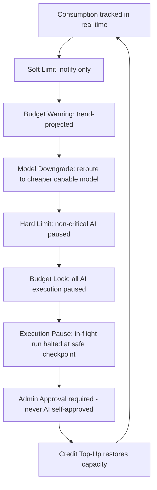

**Diagram 12 — Abuse Pattern Detection Feeding Margin Protection**

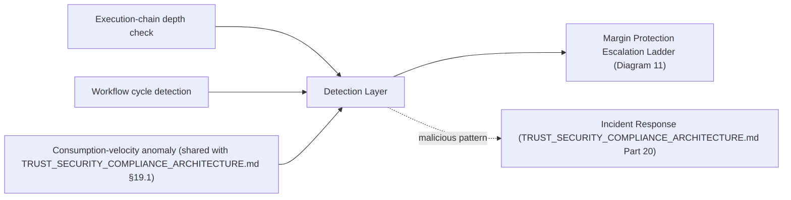

---

## Part 8 — Credit Economy

### 8.1 Lifecycle

Extends `DATABASE.md`'s `AICredit`/`AIUsage` and `BACKEND_ARCHITECTURE.md` ADR-009's Postgres row-level-locked (`SELECT ... FOR UPDATE`) debit mechanism (cited, not redesigned) with the full commercial lifecycle around it:

| Stage | Mechanism |
|---|---|
| **Issuance** | Credits are granted on subscription activation, renewal, top-up purchase, or promotional/adjustment action (§8.3) — always a `CommercialEvent` (Part 26), never a silent balance mutation |
| **Reservation** | Before an AI operation executes, a hold is placed on the estimated cost (extending `AI_PLATFORM_ARCHITECTURE.md`'s existing reservation pattern, cited) — the row-lock (ADR-009) is acquired at reservation time, not only at final debit time, closing the race condition where two concurrent operations could both pass a balance check against the same not-yet-decremented balance |
| **Consumption** | On successful execution completion, the reservation converts to an actual debit for the operation's *actual* (not estimated) Internal Cost Unit consumption (Part 6) — the difference between reserved and actual is released (below) |
| **Release** | If an operation fails, is cancelled, or completes for less than its reservation, the unused reserved amount returns to the available balance — atomically, within the same locked transaction as consumption, never a separate, racy follow-up write |
| **Expiration** | Credits carry a plan-defined validity window; expired, unconsumed credits are removed from the available balance on a scheduled sweep, logged as a `CREDIT_EXPIRED` event (Part 26), never silently vanishing without a corresponding event |
| **Rollover** | Plan-dependent (Part 9) — some tiers roll a bounded percentage of unused credits into the next period; rollover is itself an Issuance-stage event with `source: rollover`, distinct from a fresh grant |
| **Purchase** | Customer-initiated top-up, routed through the existing Payment integration (cited), issuing credits only after payment confirmation — never provisionally before |
| **Refund** | A credit refund (undoing a consumption, e.g., for a confirmed platform-side error) is its own explicit, audited event, never a raw balance edit — traceable to the specific originating consumption event it reverses |
| **Promotion** | Promotional credits are issued with a distinct `source: promotion` tag and their own (typically shorter) expiration, so promotional-credit economics never contaminate Part 5's paid-usage cost/margin calculations |
| **Adjustment** | Any manual balance correction (support-initiated, billing-dispute resolution) requires the identical `TRUST_SECURITY_COMPLIANCE_ARCHITECTURE.md` Part 16 `SupportAccessGrant`-gated, audited path as any other customer-workspace-touching support action — never a direct database edit |
| **Enterprise Credit Pools** | A single credit balance shared across multiple workspaces within an Organization Group (`ENTERPRISE_INTELLIGENCE_ARCHITECTURE.md` §14.2, cited) — the pool itself is modeled as a parent-level `AICredit` balance with per-workspace consumption still individually metered (Part 4) and attributed for Part 21's profitability analysis, never blending workspace-level cost visibility even when the pool itself is shared |

### 8.2 Accounting Invariants (HARD REQUIREMENT, no exception)

Directly restates `TRUST_SECURITY_COMPLIANCE_ARCHITECTURE.md` Part 33's economic-safety framing as binding specifically on credits:

1. A credit is never consumed twice — enforced by the row-lock (ADR-009) plus the idempotency key (§4.2) on every consumption event, so a retried request cannot double-debit.
2. A credit never disappears silently — every balance change is a `CommercialEvent` (Part 26); a balance with no corresponding event history is, by definition, a data-integrity incident.
3. A balance never goes negative without an explicit, named policy permitting it (a configured, bounded "grace overage" for specific plan tiers, Part 9) — an unconfigured negative balance is a HARD block, not a silent allowance.
4. A credit is never recreated through retry — the idempotency key (§4.2) ensures a retried reservation/consumption call is a no-op against an already-processed event, never a fresh grant.
5. A credit is never double-charged through concurrent requests — the row-lock (ADR-009) serializes concurrent debit attempts against the same workspace balance.

**What data it protects.** The single most financially consequential data structure in the platform — a credit-accounting error is directly a revenue-recognition or customer-trust error, not merely a UX bug.

**What happens when it fails.** Any invariant violation is a P1-severity Incident (`TRUST_SECURITY_COMPLIANCE_ARCHITECTURE.md` Part 20, cited) regardless of dollar magnitude, given the precedent-setting risk of an unresolved credit-accounting bug.

**How detected.** Continuous reconciliation between the event-sourced `CommercialEvent` log (Part 26) and the current `AICredit` balance — any computed-from-events balance diverging from the stored balance is an immediate alert.

**How recovered.** Event-log replay to the point of divergence, correcting the stored balance to match the event-derived truth (the event log, being append-only, is definitionally more trustworthy than a mutable balance field) — with an audited `CREDIT_ADJUSTMENT` event recording the correction itself.

**Cost.** The row-lock and reconciliation logic add modest transactional overhead, already the accepted cost of ADR-009's original design — this Part adds no new performance-sensitive mechanism, only the event-log discipline around it.

**When built.** NOW horizon — launch blocker; a credit system without these invariants is not a credit system this document is willing to call production-grade.

**Diagram 13 — Credit Lifecycle**

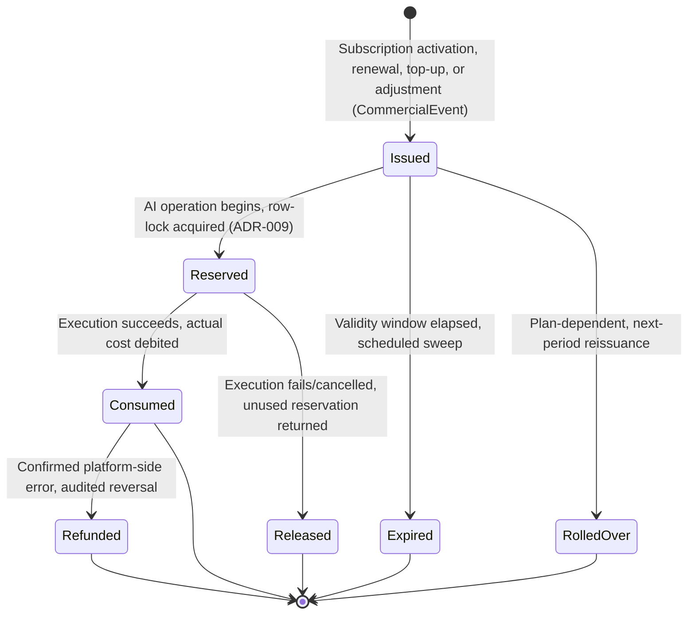

**Diagram 14 — Concurrent-Request Safety via Row-Level Locking**

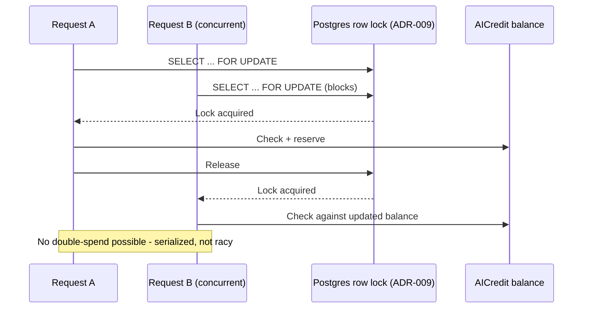

**Diagram 15 — Enterprise Credit Pool Architecture**

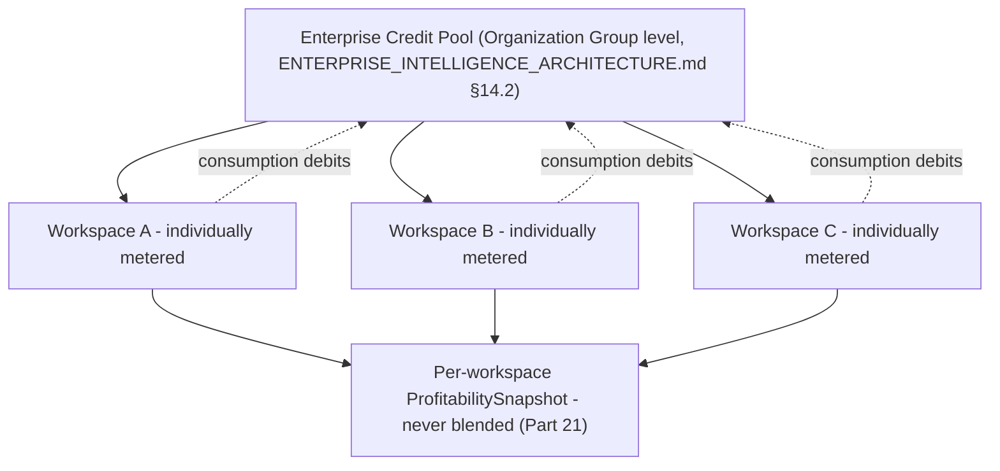

---

## Part 9 — Pricing Architecture

### 9.1 Methodology, Not Arbitrary Numbers

Per this phase's explicit instruction, prices below are **Range/Input** values (§0.3) — reasoned starting points for Part 22's controlled experimentation, anchored to three inputs: (1) comparable-market pricing gravity for AI-augmented SaaS at each customer-size band (a directional anchor, not a cited fact, since BizPilot AI's own value delivery is architecturally distinct per §0.4's thesis); (2) this document's own Gross Margin target (a healthy SaaS+AI business sustains 60–80% gross margin at scale per Part 5.3's formula, meaning included-usage allowances must be sized so typical consumption stays well inside that band); (3) the Value Taxonomy's tier-gating logic (Part 2) — V5–V7 capabilities (AI Workforce, Enterprise Governance) are structurally Business/Enterprise-tier, never Free/Starter, regardless of price-point choice.

### 9.2 Five-Tier Plan Matrix

| Dimension | FREE | STARTER | PRO | BUSINESS | ENTERPRISE |
|---|---|---|---|---|---|
| **Target customer** | Individual evaluating fit, hobbyist | Solo founder, very small team | Small business, growing team | Multi-department SMB, scaling team | Regulated, multi-company, or large-scale organization |
| **Primary job-to-be-done** | "Can this actually help my business?" | "Automate my own repetitive work" | "Give my small team AI-assisted operations" | "Run departments with AI Workforce support" | "Operate the business on an AI-governed platform" |
| **Price positioning (Range/Input, §9.1)** | $0 | Low, single-digit-to-low-double-digit monthly per seat | Mid, double-digit monthly per seat | Higher per-seat plus platform fee | Custom (Part 17) |
| **Seats** | 1 | 1–3 | Up to ~10 | Up to ~50 | Unlimited, contract-negotiated |
| **Workspaces** | 1 | 1 | 1–3 | Multiple | Multiple + Holding Company Architecture (`ENTERPRISE_INTELLIGENCE_ARCHITECTURE.md` Part 14, cited) |
| **AI credits (included)** | Small, fixed monthly allowance | Moderate monthly allowance | Higher monthly allowance | High monthly allowance, pooled across seats | Custom, contract-negotiated, Enterprise Credit Pool (§8.1) |
| **AI models** | Cost-efficient default models only (Part 6's Model Downgrade tier) | Default + mid-tier models | Full model selection within cost ceiling | Full model selection, higher cost ceiling | Full selection, custom provider agreements, self-hosted option (`CLOUD_INFRASTRUCTURE.md` §13.1, cited) |
| **AI Employees** | None (V5 gated) | 1 named AI Employee | Up to 3 AI Employees | Full AI Executive Team access (Part 11) | Full roster + custom AI Employees |
| **Agents (underlying)** | Shared, capped concurrency | Individual, capped | Individual, higher cap | Individual, high cap | Custom concurrency/SLA |
| **Workflows** | 1 active, manual trigger only | 3 active | 15 active | Unlimited active | Unlimited, priority execution |
| **Automation** | None | Basic (scheduled triggers) | Full (event triggers) | Full + Automation Intelligence recommendations | Full + custom automation SLAs |
| **Storage** | Minimal fixed | Moderate fixed | Higher fixed | High fixed, expandable | Custom |
| **Knowledge (RAG/Memory)** | Basic, short retention | Standard retention | Standard + Business memory tier | Full memory tier access | Full + custom retention policy |
| **Analytics** | None | Basic usage stats | Business Health Engine (subset) | Full Business Health + Domain Intelligence | Full + custom Executive Reporting |
| **Business Intelligence** | None | None | Limited (V3–V4 subset) | Full (`ENTERPRISE_INTELLIGENCE_ARCHITECTURE.md` Parts 5–9, cited) | Full + Decision Council, Simulation Engine |
| **API** | None | Read-only, low rate limit | Full, moderate rate limit (Part 18) | Full, higher rate limit | Full, custom SLA |
| **Integrations** | None | Limited connector set | Standard connector set | Full connector set | Full + custom integration development |
| **Security** | Platform default | Platform default | Platform default + audit export | + IP restrictions, session policies (`TRUST_SECURITY_COMPLIANCE_ARCHITECTURE.md` Part 32, cited) | Full Enterprise Security suite (SAML, SCIM, BYOK, cited) |
| **Governance** | None | None | Basic role management | Full RBAC + Decision Level configuration (`ENTERPRISE_INTELLIGENCE_ARCHITECTURE.md` §9.7, cited) | Full + `SupportAccessGrant` transparency, compliance evidence access |
| **Support** | Community/self-serve | Email, standard SLA | Priority email | Priority + dedicated channel | Dedicated success manager, contractual SLA |

### 9.3 Included vs. Metered vs. Gated vs. Expandable vs. Enterprise-Only

| Classification | Meaning | Examples |
|---|---|---|
| **Included** | Consumed from plan allowance at no additional charge until exhausted | Baseline AI credits, seat count within tier, storage within tier |
| **Metered** | Billed per-unit beyond included allowance, never gated outright (preserves usage continuity, Part 7's Soft-Limit-first philosophy) | AI credit overage, API request overage, storage overage |
| **Gated** | Not accessible below a specific tier regardless of willingness to pay per-unit | AI Employees (Starter+), Business Intelligence (Pro+ subset, Business+ full), Enterprise Security suite (Enterprise-only) |
| **Expandable** | Available as an add-on purchase independent of tier upgrade | Additional seats, additional AI credits, additional workspaces |
| **Enterprise-only** | Never available via self-serve purchase at any price, only via contract (Part 17) | BYOK/Customer-Managed-Keys, dedicated infrastructure, custom SLA, private deployment |

**What data it protects.** Nothing directly — this matrix is the commercial contract layer sitting atop `DATABASE.md`'s `SubscriptionPlan`, and its correctness is what makes every downstream billing/entitlement check trustworthy.

**What happens when it fails.** A misconfigured entitlement (a feature accessible below its intended gate) is a revenue-leakage risk (Part 35's risk register), detected via Part 20's Commercial Intelligence feature-usage-vs-plan-tier cross-check.

**How detected.** Automated entitlement-audit job comparing actual feature access grants against `SubscriptionPlan` definitions.

**How recovered.** Entitlement correction, with the specific gap tracked as a Technical Debt Register item (`ENGINEERING_STANDARDS.md` §1.6, cited) if systemic.

**Cost.** No new infrastructure — entitlement checks route through `TRUST_SECURITY_COMPLIANCE_ARCHITECTURE.md` Part 4's existing Unified Authorization Fabric, treating a plan entitlement as one more PDP-evaluated fact.

**When built.** NOW horizon — the five-tier structure and Free/Starter/Pro launch blockers; Business/Enterprise tiers' full feature depth phases in per Part 37's roadmap as the underlying capabilities themselves (Business Health Engine coverage, full AI Executive Team) mature.

**Diagram 16 — Five-Tier Pricing Structure**

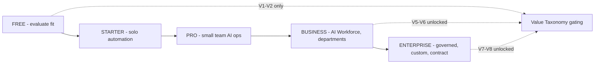

**Diagram 17 — Included / Metered / Gated / Expandable / Enterprise-Only Classification**

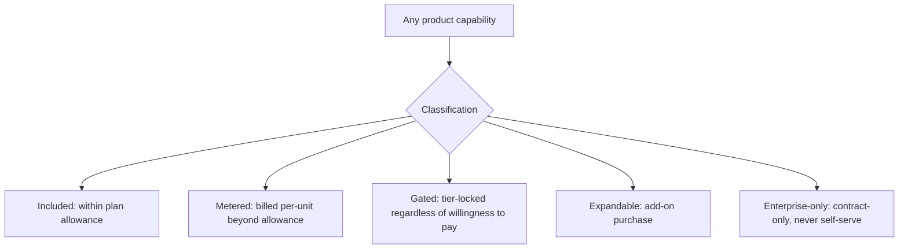

---

## Part 10 — Packaging Strategy

### 10.1 Why Not Every Feature Is a Separate Add-On

**Why.** A la carte per-feature pricing multiplies purchasing-decision friction and cross-sells poorly — a customer facing forty individually-priced toggles cannot reason about total value, and BizPilot AI's own thesis (§0.4) is that value *compounds* across capability categories, which per-feature pricing structurally denies by pricing each in isolation. Packaging instead groups capabilities into a small number of coherent tiers.

### 10.2 Packaging Hierarchy

**Core Platform → Intelligence → AI Workforce → Automation → Enterprise → Developer Platform.**

| Layer | Contains | Pricing model |
|---|---|---|
| **Core Platform** | Workspace, seats, base UI, basic AI Copilot (V1) | Seat-based, included in every paid tier |
| **Intelligence** | Business Health Engine, Domain Intelligence modules, Decision Support (V3–V4) | Tier-gated (Pro+ subset, Business+ full), not separately metered — depth scales with tier, not a per-module add-on |
| **AI Workforce** | AI Employees, Agent Runtime capacity (V5) | Seat-like per-AI-Employee model (Part 11), gated Starter+ |
| **Automation** | Workflow Engine, Automation Intelligence (V2) | Usage-metered beyond tier allowance (Part 12) |
| **Enterprise** | Governance, Security suite, Data Residency, contract terms (V7) | Contract-based, never self-serve add-on pricing (Part 17) |
| **Developer Platform** | Public API, webhooks, `ApiKey` management (V8-adjacent) | Usage-based, independent tier structure (Part 18) |

### 10.3 Capability Classification Decisions

| Capability | Classification | Rationale |
|---|---|---|
| Base AI Copilot usage | Included, tier-scaled allowance | Core to product habit formation (Part 15); gating it entirely would suppress activation |
| AI Employee seats | Seat-based (Part 11) | Directly comparable to a headcount decision, the clearest value-to-price mapping in the taxonomy |
| Workflow execution volume | Usage-based, metered beyond allowance | Volume scales with business size/maturity, not a fixed decision point like a seat |
| Storage | Usage-based, metered beyond allowance | Commodity-adjacent cost driver, priced to cover Part 6's infrastructure cost with margin, not a differentiation lever |
| Domain Intelligence module depth | Tier-gated, not separately metered | Bundling avoids forcing a customer to individually evaluate sixteen modules; tier signals "how much business intelligence do you need," a single decision |
| Marketplace items | Individually priced by creator (Part 19) | Not BizPilot AI's own packaging decision — a marketplace transaction, structurally distinct |
| Enterprise Security controls | Contract-based | Never metered or self-serve, since their value is binary (compliant or not) rather than volume-scaled |
| API access | Usage-based, separate tier structure (Part 18) | Developer-platform economics follow different unit economics than product-seat economics and are kept structurally distinct |

**What data it protects.** Nothing directly — packaging clarity is a conversion/comprehension property, verified via Part 15's PLG funnel metrics (a confusing package structure shows up as elevated funnel drop-off at the pricing-comprehension stage, not as a security or data concern).

**What happens when it fails.** An over-fragmented package (too many add-ons) or over-bundled package (customers paying for unused capability, inflating perceived price) both show up in Part 22's pricing-experimentation data as a testable hypothesis, never assumed correct without evidence.

**How detected.** Part 20's Commercial Intelligence feature-adoption-vs-plan-tier analysis.

**How recovered.** Repackaging is itself a Part 32-governed pricing change, never an ungoverned product-team decision, given its billing impact.

**Cost.** Packaging changes have migration cost for existing customers (grandfathering rules), addressed structurally in Part 32's governance model, not solved here.

**When built.** NOW horizon for the six-layer hierarchy; ongoing refinement per Part 22's experimentation program at NEXT horizon and beyond.

**Diagram 18 — Packaging Hierarchy**

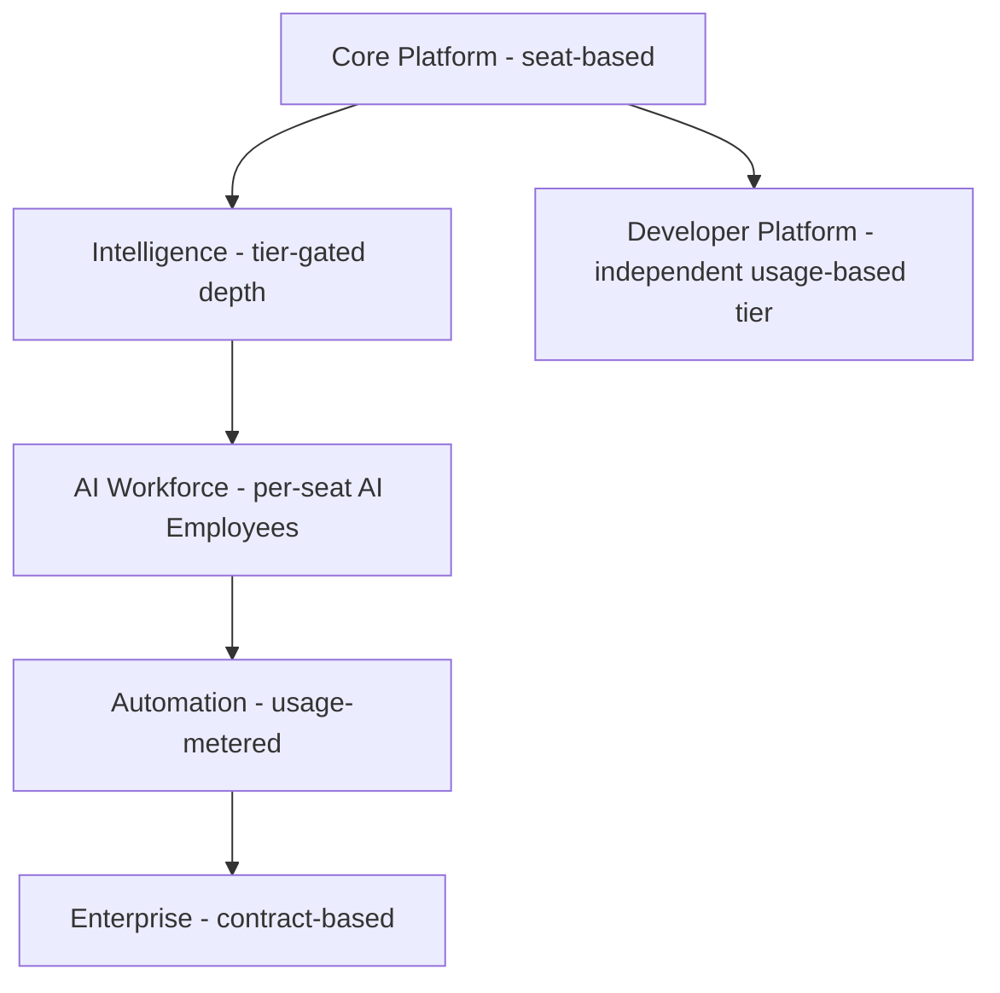

---

## Part 11 — AI Employee Economics

### 11.1 Why AI Employees Are Not "Another Chatbot"

An AI Employee (`ENTERPRISE_INTELLIGENCE_ARCHITECTURE.md` Part 2, cited) occupies a real organizational seat, holds RBAC-bound authority (`TRUST_SECURITY_COMPLIANCE_ARCHITECTURE.md` Part 7, cited), accumulates workspace-specific memory no generic assistant can replicate (§3.5 of that document, cited), and is measured on the same productivity metrics a human hire would be (`ENTERPRISE_INTELLIGENCE_ARCHITECTURE.md` §5.7, §16.3, cited). This document's monetization model reflects that distinction directly: **AI Employees are priced comparably to a headcount decision, not a feature toggle.**

### 11.2 Per-Role Economics

| AI Employee | Capability value | Cost profile | Included usage (typical, Range/Input) | Expansion mechanism | Premium positioning |
|---|---|---|---|---|---|
| **AI Executive** (CEO/COO/CFO/CMO/CTO, `ENTERPRISE_INTELLIGENCE_ARCHITECTURE.md` §2.4–§2.8, cited) | Whole-org or department-wide synthesis, Decision Council participation | High — Business/Organization-scoped Context Engine assembly is the most context-heavy operation in the platform | Business+ tier only, one Executive included at Business tier, full roster at Enterprise | Additional Executive roles, higher Autonomous Decision Level (evidence-gated, `ENTERPRISE_INTELLIGENCE_ARCHITECTURE.md` §11.3, cited) | The single highest-value-per-seat product surface — priced at a premium reflecting genuine human-role comparability |
| **AI Project Manager** (§2.13, cited) | Per-project task/milestone tracking | Moderate — task-scoped, not org-wide context | Pro+ tier, capacity scales with active-project count | Additional concurrent PM instances | Positioned against project-management-tool-plus-coordinator-headcount comparison |
| **AI Researcher** (AI Research Department, §2.14, cited) | External/competitive intelligence synthesis, Simulation Engine operation | High — Research Department is explicitly capped at Recommend-only Decision Level (§2.14, cited), but its context assembly spans External Intelligence (Part 12 of that document) which is itself costly to maintain | Business+ tier | Deeper External Intelligence source coverage (Part 32's roadmap-gated) | Positioned as a research-analyst-headcount alternative |
| **AI Marketing Employee** (AI CMO/AI Marketing Director roles, §2.7, §2.10, cited) | Campaign strategy and execution-adjacent recommendations | Moderate | Business tier | Additional campaign concurrency, deeper Customer/Market Intelligence access | Positioned against a marketing-coordinator or agency-retainer comparison |
| **AI Sales Employee** (AI Sales Director, §2.9, cited) | Pipeline prioritization, deal-health monitoring, draft outreach (never autonomous send, `ENTERPRISE_INTELLIGENCE_ARCHITECTURE.md` §2.3's table, cited) | Moderate | Business tier | Higher Decision Level for outreach automation once evidence-justified | Positioned against an SDR-headcount comparison |
| **AI Finance Employee** (AI CFO, §2.6, cited) | Cashflow/revenue/profitability monitoring and forecasting | Moderate-High — Finance Intelligence's forecasting workload is compute-intensive | Business+ tier | Deeper forecasting horizon, more frequent recomputation | Positioned against a fractional-CFO/bookkeeper comparison; **never** priced or marketed as enabling autonomous financial transactions, restating the non-negotiable floor (`ENTERPRISE_INTELLIGENCE_ARCHITECTURE.md` ADR-EI-014, `TRUST_SECURITY_COMPLIANCE_ARCHITECTURE.md` §7.4, cited) |
| **AI Operations Employee** (AI COO, §2.5, cited) | Cross-department coordination, workflow health monitoring | Moderate | Business tier | Additional Domain Intelligence module coverage | Positioned against an operations-manager comparison |
| **AI Support Employee** (AI Customer Success Director, §2.12, cited) | Retention risk detection, support-quality monitoring | Moderate | Pro+ tier (a narrower, single-seat version), full Director role at Business+ | Ticket-volume-scaled capacity | Positioned against a CS-manager comparison |
| **Custom AI Employee** | Business-defined Mandate within the existing Agent Runtime substrate (no new execution mechanism, `ENTERPRISE_INTELLIGENCE_ARCHITECTURE.md` §2.1, cited) | Variable, bounded by the same Authority/Risk gates as any first-party AI Employee | Enterprise-only | Contract-negotiated | The clearest Enterprise-tier differentiator — a capability no lower tier offers at any price |

### 11.3 Pricing Model: Capacity, Not Raw Token Metering

Every AI Employee's included usage is expressed as a **capacity allowance** (a bounded number of executions/recommendations/tasks per period, calibrated against Part 6's Internal Cost Unit so the allowance sizes to a healthy margin, §9.1) rather than a raw token quota — restating §0.4's thesis directly: a customer purchasing "an AI CFO" is buying a capability, not a metered inference product, even though the underlying cost accounting (Part 6) is token-precise internally. Usage beyond the capacity allowance is metered (Part 9.3's classification), never hard-gated mid-task.

**What data it protects.** Nothing directly — this is a monetization-clarity mechanism ensuring the customer-facing offer matches §0.4's positioning even though the cost substrate beneath it is identical to any other AI operation.

**What happens when it fails.** A capacity allowance sized without reference to actual Internal Cost Unit consumption (i.e., set by intuition rather than Part 6's data) risks margin erosion at scale — caught by Part 20's AI-Employee-Profitability analysis (§20.4).

**How detected.** Per-AI-Employee-role Revenue-to-Inference-Cost ratio (Part 5.3, extended per-role) tracked in `ProfitabilitySnapshot`.

**How recovered.** Capacity-allowance recalibration, itself a Part 32-governed pricing change.

**Cost.** No new infrastructure — reuses `ENTERPRISE_INTELLIGENCE_ARCHITECTURE.md` §16.2's existing per-seat cost attribution directly.

**When built.** NOW horizon for AI Executive/PM roles (the initial AI Workforce roster, per that document's own Ten-Year Roadmap §18.4 Year-1 milestone, cited); remaining roles phase in per that same roadmap, with this document's pricing model applying identically to each as it ships — no separate commercial-architecture work required per new role.

**Diagram 19 — AI Employee Economics: Capacity-Based Pricing**

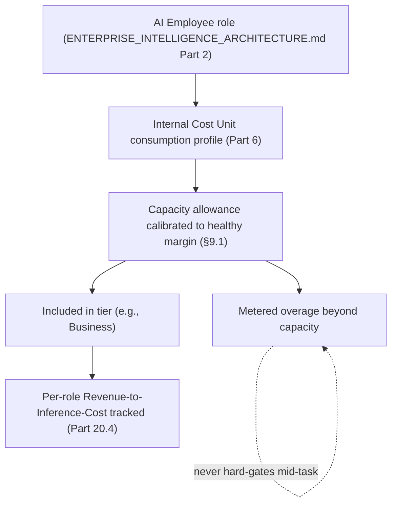

**Diagram 20 — AI Employee Roster & Tier Gating**


---

## Part 12 — Workflow Economics

### 12.1 Cost Classes

Every workflow (`BACKEND_ARCHITECTURE.md`'s Workflow Engine, `ENTERPRISE_INTELLIGENCE_ARCHITECTURE.md`'s Workflow Intelligence, `FRONTEND_ARCHITECTURE.md` §9.6's Builder UI, all cited) decomposes into steps, each falling into one of five cost classes:

| Cost class | Definition | Internal Cost Unit profile |
|---|---|---|
| **Deterministic Step** | No AI call — a data transform, a conditional branch, a notification send | Near-zero AI cost; infrastructure compute only |
| **Low-cost AI Step** | A small-context, cost-efficient-model AI call (e.g., a classification or short summarization) | Low, predictable Internal Cost Unit consumption |
| **High-cost AI Step** | A large-context or premium-model AI call (e.g., a full-document analysis, an Executive-level recommendation) | High, more variable Internal Cost Unit consumption |
| **External API Step** | A call to a third-party system (`ENTERPRISE_INTELLIGENCE_ARCHITECTURE.md` Part 13's Ecosystem Integration Intelligence, cited) | Variable, often the third party's own rate limits/cost apply rather than BizPilot AI's own Internal Cost Unit |
| **Premium Intelligence Step** | A step invoking Business Simulation, Decision Council deliberation, or similarly compute-heavy Enterprise Intelligence subsystems | Highest cost class, gated to Business+/Enterprise tiers per Part 9.2 |

### 12.2 Workflow Cost Estimator

Before a workflow runs (and, for a scheduled/recurring workflow, before each scheduled execution), a deterministic estimator sums each step's expected Internal Cost Unit consumption (using the step's cost class and, where available, its historical actual-consumption average from prior runs) into a **projected run cost**, surfaced in the Workflow Builder UI (`FRONTEND_ARCHITECTURE.md` §9.6, cited) before the customer activates the workflow — extending that document's UI with a cost-preview affordance, not a new canvas engine.

**Why.** A customer authoring a workflow with several High-cost AI Steps and no visibility into the resulting cost is the single most common way "surprising AI bill" complaints materialize in AI-native products — the estimator exists specifically to prevent that failure mode before it happens, not to explain it after a bill arrives.

**What data it protects.** Customer trust and, transitively, Part 7's margin protection (an informed customer authoring cost-aware workflows reduces the frequency of Hard-Limit/Budget-Lock events).

**What happens when it fails.** An estimator systematically under-projecting actual cost (a calibration drift) is caught by comparing projected-vs-actual cost per workflow run, tracked in `CostSnapshot` (Part 27) at the workflow-run granularity.

**How detected.** Projected-vs-actual variance exceeding a threshold triggers a Technical Debt Register review of the estimator's cost-class calibration.

**How recovered.** Recalibration using accumulated actual-run data — the estimator's accuracy strictly improves with a workspace's own execution history, mirroring `ENTERPRISE_INTELLIGENCE_ARCHITECTURE.md` §11.3's Organizational Learning calibration philosophy applied to cost estimation specifically.

**Cost.** A deterministic calculation, negligible compute cost relative to actually running the workflow.

**When built.** NOW horizon for the cost-class taxonomy and a first-pass estimator (category-average-based); historical-calibration refinement is NEXT horizon once sufficient per-workspace run history exists.

**Diagram 21 — Workflow Cost Classes**

```mermaid
flowchart TB
    STEP["Workflow step"] --> CLASS2{"Cost class"}
    CLASS2 --> DETERM["Deterministic - near-zero AI cost"]
    CLASS2 --> LOWAI["Low-cost AI - efficient model"]
    CLASS2 --> HIGHAI["High-cost AI - large context/premium model"]
    CLASS2 --> EXTAPI["External API - third-party cost/limits"]
    CLASS2 --> PREMIUM2["Premium Intelligence - Business+/Enterprise gated"]
```

**Diagram 22 — Workflow Cost Estimator Flow**

```mermaid
flowchart LR
    BUILD2["Workflow authored in Builder UI (FRONTEND_ARCHITECTURE.md §9.6)"] --> ESTIMATE2["Estimator: sum step-level Internal Cost Unit projections"]
    ESTIMATE2 --> PREVIEW["Cost preview surfaced before activation"]
    PREVIEW --> ACTIVATE["Customer activates with informed consent"]
    ACTIVATE --> RUN["Workflow runs"]
    RUN --> ACTUAL["Actual cost recorded (CostSnapshot, Part 27)"]
    ACTUAL --> COMPARE["Projected vs. actual variance tracked"]
    COMPARE --> RECALIBRATE["Estimator recalibrated from history"]
```

---

## Part 13 — Expansion Revenue Engine

### 13.1 Expansion Sources & Behavioral Triggers

| Expansion source | Behavioral trigger | Detection mechanism |
|---|---|---|
| Seats | Workspace reaches configured seat capacity | `WorkspaceMember` count vs. plan limit, checked on every invite attempt |
| Credits | AI credit consumption exceeds a sustained threshold (not a single spike, which is Part 7's concern, but a durable trend) | Trailing-period consumption average vs. plan allowance |
| AI Employees | Utilization (task-completion volume relative to capacity, §11.3) trending toward capacity ceiling | Per-AI-Employee-role utilization tracked in `UsageMeter` |
| Workflow capacity | Active-workflow count approaches plan limit, or execution volume trends upward | `UsageMeter` |
| Automation | Automation Intelligence (`ENTERPRISE_INTELLIGENCE_ARCHITECTURE.md` §9.9, cited) surfaces recurring automation candidates beyond current plan's execution allowance | Recommendation-Engine-driven, not purely usage-threshold-driven |
| Storage | Storage consumption approaches plan limit | `UsageMeter` |
| API | Developer-tier request volume trending toward tier ceiling (Part 18) | `UsageMeter` |
| Premium Intelligence | Business Simulation/Decision Council usage attempted beyond current tier's access | Entitlement-check-denial event (a strong, explicit signal, distinct from usage-threshold triggers) |
| Enterprise governance | A workspace's `SupportAccessGrant`/compliance-evidence requests, or Data Residency requirement, signal Enterprise-tier need | Manual Sales/Customer-Success-observed trigger, not automatable from product telemetry alone |
| Additional workspaces | A customer creating a second, unrelated workspace under the same account, or requesting Holding Company Architecture (`ENTERPRISE_INTELLIGENCE_ARCHITECTURE.md` Part 14, cited) | Workspace-creation event pattern |
| Integrations | A customer's connector/API usage pattern suggests a specific missing integration | Product-usage-pattern analysis, Customer-Success-actioned |

### 13.2 No Dark Patterns (binding constraint)

Every trigger above surfaces an **informational, dismissible upgrade prompt** at the moment of genuine need (a seat-limit-reached moment, a credit-threshold-crossed moment) — never a forced interruption of in-progress work, never an artificially degraded experience designed to manufacture urgency (e.g., this document explicitly rejects "temporarily disable a working feature to pressure an upgrade" as a trigger mechanism), and never a dismissed-and-reappearing prompt cadence tuned for annoyance rather than genuine relevance. This restates Part 14's value-based-retention-over-lock-in principle applied to the expansion motion specifically — an expansion prompt earns its click by being accurate and timely, not by being unavoidable.

**What data it protects.** Nothing directly — this is a product-integrity constraint verified via Part 15's funnel metrics (a dark-pattern-heavy expansion flow would show elevated churn immediately following upgrade, a detectable, alertable pattern this document treats as a governance violation, not a growth win).

**When built.** NOW horizon for seat/credit/storage triggers (mechanically simple, threshold-based); AI Employee utilization and automation-recommendation-driven triggers are NEXT horizon, requiring `ENTERPRISE_INTELLIGENCE_ARCHITECTURE.md`'s Organizational Learning history to be meaningful.

**Diagram 23 — Expansion Revenue Engine: Trigger to Prompt Flow**

```mermaid
flowchart TB
    USAGE2["Ongoing product usage"] --> THRESHOLD["Threshold/pattern detected (§13.1)"]
    THRESHOLD --> INFORM["Informational, dismissible prompt at moment of genuine need"]
    INFORM -.never.-x FORCE["Forced interruption or artificial degradation"]
    INFORM --> CUSTOMER2{"Customer acts?"}
    CUSTOMER2 -->|upgrades| EXPANSION2["Expansion Revenue (Part 5.4)"]
    CUSTOMER2 -->|dismisses| CONTINUE2["Continues at current tier, no penalty"]
```

---

## Part 14 — Retention Architecture

### 14.1 Value-Based Retention, Explicitly Distinguished from Lock-In

**Value-based retention** (this document's only sanctioned retention mechanism): a customer stays because leaving means losing accumulated, genuinely valuable, workspace-specific assets — Business Context and Business Memory (`ENTERPRISE_INTELLIGENCE_ARCHITECTURE.md` Part 1, 11, cited), Projects, Knowledge (RAG/Memory, `TRUST_SECURITY_COMPLIANCE_ARCHITECTURE.md` Part 11, cited), Workflows, calibrated AI Employees (whose Organizational Learning history, §11.3 of that document, is workspace-specific and non-transplantable), Integrations, historical Intelligence and Analytics, and accumulated Organizational Knowledge.

**Artificial lock-in** (explicitly prohibited, Tier-0-equivalent binding constraint for this document): withholding data export, imposing punitive cancellation friction, degrading an already-paid-for capability to pressure retention, or contractually restricting a customer's ability to leave beyond ordinary, reasonable notice terms.

| Mechanism | Value-based retention | Artificial lock-in (prohibited) |
|---|---|---|
| Data export | Full, self-serve export always available, in a usable format, regardless of plan tier or cancellation status | Withholding export, or requiring a support ticket/fee for data the customer already owns |
| Memory/Context | Accumulates because it makes AI Employees measurably better (§11.3's calibration), a genuine capability gain | Artificially degrading un-migrated data's usability elsewhere |
| Cancellation | Self-serve, effective at period end, no retroactive penalty | Mandatory phone call, hidden fees, dark-pattern cancellation flow |
| Pricing | Transparent, published tiers (Part 9) with clear upgrade/downgrade paths | Opaque, negotiation-required pricing designed to obscure true cost |
| Contract terms | Standard, reasonable notice periods even at Enterprise tier (Part 17) | Multi-year lock-in with no proportionate discount justifying the term commitment |

**What data it protects.** Nothing directly — this Part is a product-ethics constraint, enforced the same way §13.2's no-dark-patterns constraint is: via Part 15's funnel/churn metrics acting as a detection mechanism (elevated post-cancellation-attempt support-ticket volume, or elevated churn immediately following a friction-adding product change, both treated as governance-review triggers, Part 32).

**How detected.** Churn-reason tagging (where available from cancellation flow feedback) distinguishing "left because a competitor now serves us better" from "left because retention friction made staying not worth the fight" — the latter is treated as a product-integrity finding, not a growth-team success metric.

**When built.** NOW horizon — self-serve export and self-serve cancellation are launch blockers (Part 37), not later refinements.

**Diagram 24 — Value-Based Retention vs. Artificial Lock-In**

```mermaid
flowchart TB
    RETAIN["Customer retention"] --> VALUEBASED["Value-based: Business Context, Memory, calibrated AI Employees, Knowledge"]
    RETAIN --> LOCKIN["Artificial lock-in: withheld export, cancellation friction, degraded paid features"]
    VALUEBASED -->|sanctioned| PRODUCT2["Product design target"]
    LOCKIN -->|prohibited| GOVERNANCE3["Governance violation if detected (Part 32)"]
```

---

## Part 15 — Product-Led Growth Engine

### 15.1 The Funnel

**Acquisition → Signup → Activation → Aha Moment → First Value → Habit → Expansion → Referral → Reactivation.**

| Stage | Definition | Measurement |
|---|---|---|
| Acquisition | A prospective customer reaches a BizPilot AI surface (marketing site, referral link) | Out of this document's scope (marketing-attribution architecture, external) |
| Signup | Account/workspace created | `User`/`Workspace` creation event |
| **Activation event** | **Precisely defined below (§15.2)** | Directly measured, Observed (§3.2) |
| Aha Moment | The first time a customer experiences V2+ value (automation or intelligence, not merely V1 productivity) — the moment the product demonstrates it is more than a chat interface | First workflow completion, or first Business Health Engine score computed |
| First Value | The first Estimated-or-better (§3.2) value figure the Value Realization Engine (Part 3) can compute for the workspace | `CustomerValueSnapshot` first non-null entry |
| Habit | Recurring usage crossing a frequency threshold (e.g., product opened / a workflow run / an AI Employee task in N of the last M periods) | `UsageMeter` recurrence pattern |
| Expansion | Part 13's expansion sources realized as an actual plan/credit/seat change | `Subscription` change event |
| Referral | An existing customer's referral link/code used by a new signup | Referral-tracking event (new, minimal — a code-attribution field on Signup) |
| Reactivation | A churned workspace's `Subscription` reactivated | `Subscription` reactivation event (`CUSTOMER_REACTIVATED`, Part 26) |

### 15.2 The Activation Event Must Represent Real Product Value

**Definition.** Activation is **not** "completed onboarding wizard" or "clicked five buttons" — it is defined as: **a workspace has connected at least one real business data source (or manually entered representative business context) AND received at least one AI-generated output the workspace subsequently used (accepted, edited-and-kept, or acted upon) rather than discarded.** This is a deliberately strict definition — a customer who signs up and never provides real business context, or who discards every AI output, has **not** activated, even if they logged in multiple times, because neither behavior demonstrates the product delivering genuine value per §0.4's thesis.

**Why strict.** A loosely-defined activation event (e.g., "viewed the dashboard") inflates activation-rate metrics without informing any real business decision — Part 30's Founder dashboard and Part 20's Commercial Intelligence both depend on Activation meaning something real, or every downstream funnel-conversion metric built on top of it becomes noise.

### 15.3 Funnel Stage Transitions

| Transition | What must be true |
|---|---|
| Free → Activated | §15.2's activation event occurs within the Free-tier trial/usage window |
| Activated → Paid | The activated workspace's `Subscription` transitions from Free to a paid tier |
| Paid → Expanded | Part 13's expansion sources realize as an actual `Subscription` change |
| Expanded → Retained | The workspace survives at least one full renewal cycle post-expansion without contraction |
| Retained → Advocate | The workspace generates a Referral event, or provides a usable case-study/reference (external, Sales/Marketing-tracked, cited as out of this document's product-telemetry scope) |

**What data it protects.** Nothing directly — the funnel is a measurement architecture, not a control mechanism; it exists so growth decisions are evidence-based (feeding Part 22's experimentation and Part 31's Growth-team dashboard).

**What happens when it fails.** A funnel-stage-transition event that fails to fire (a bug, not a business event) undercounts a real conversion — detected via reconciliation against the underlying source events (`Subscription` changes, `UsageMeter` records) each stage derives from, the same reconciliation discipline Part 4.3 applies to metering generally.

**How detected.** Part 29's observability chain.

**How recovered.** Backfill from source events where the underlying data survived; funnel dashboards flag any period with detected undercounting rather than silently presenting an incomplete number as complete.

**Cost.** Event-tracking infrastructure, reusing `FRONTEND_ARCHITECTURE.md` §13.6's existing typed analytics abstraction and Event Tracking Standards (`ENGINEERING_STANDARDS.md` §17.11, cited) — no new tracking mechanism.

**When built.** NOW horizon — the funnel and a strict Activation definition are launch blockers, since without them Part 22's experimentation program has no meaningful success metric to test against.

**Diagram 25 — Product-Led Growth Funnel**

```mermaid
flowchart LR
    ACQ["Acquisition"] --> SIGNUP2["Signup"]
    SIGNUP2 --> ACTIVATION["Activation - real business context + used AI output (§15.2)"]
    ACTIVATION --> AHA["Aha Moment - first V2+ value"]
    AHA --> FIRSTVAL["First Value - CustomerValueSnapshot computed"]
    FIRSTVAL --> HABIT["Habit - recurring usage"]
    HABIT --> EXPAND2["Expansion"]
    EXPAND2 --> RETAIN2["Retained"]
    RETAIN2 --> ADVOCATE["Advocate - referral"]
    RETAIN2 -.churn path.-> REACTIVATE["Reactivation attempt"]
```

**Diagram 26 — Activation Event Precision**

```mermaid
flowchart TB
    SIGNUP3["Signup"] --> CONTEXT["Business data source connected OR representative context entered"]
    CONTEXT --> OUTPUT["AI-generated output received"]
    OUTPUT --> USED{"Used: accepted, edited-and-kept, or acted upon?"}
    USED -->|yes| ACTIVATED2["Activated - real product value demonstrated"]
    USED -->|no, discarded| NOTACTIVATED["Not activated, regardless of login count"]
```

---

## Part 16 — Trial & Free Economics

### 16.1 Abuse Vectors & Controls

| Abuse vector | Control | Enforcement layer |
|---|---|---|
| Free-tier abuse (using Free indefinitely for production workloads) | Free-tier capacity ceilings sized deliberately below sustained-production usage patterns (informed by Part 20's usage-pattern analysis, not guessed) | Part 9's plan matrix |
| Bot signups | Standard signup-abuse controls (rate limiting, CAPTCHA-equivalent per `TRUST_SECURITY_COMPLIANCE_ARCHITECTURE.md`'s explicit non-endorsement of bypassing bot-detection, cited as a constraint this document inherits, not a mechanism it designs) | `AUTH_ARCHITECTURE.md`, cited |
| Credit farming (creating many Free workspaces to accumulate credits) | Device/email/payment-method fingerprint-based multi-account detection (a Security Detection category extension, `TRUST_SECURITY_COMPLIANCE_ARCHITECTURE.md` §19.1, cited) | Security Detection, this document's `EconomicAbuseSignal` classification (Part 26) |
| Multi-account abuse | Same as credit farming | Same |
| API exploitation | Developer-tier rate limits (Part 18) apply identically regardless of Free-tier status | `API_CONTRACT.md` rate limiting, cited |

### 16.2 Controls Without Destroying Legitimate Onboarding

| Control type | Design |
|---|---|
| Signup controls | Standard verification (email confirmation), never an onerous KYC-equivalent barrier for a Free tier — friction is calibrated against §15.2's Activation event, which itself requires genuine effort, making low-effort bot signups unlikely to reach Activation regardless of signup-stage friction |
| Usage controls | Free-tier allowances sized to comfortably support genuine evaluation (enough to reach Activation and Aha Moment, §15.1) while remaining below sustained-production-workload volume |
| Credit controls | Free-tier credits are non-purchasable (no top-up path) — a deliberate signal distinguishing "evaluating" from "paying customer," and a structural abuse-limiter (a farmed Free account cannot be topped up into a larger free resource) |
| Feature gates | V5–V7 (AI Workforce, Enterprise Governance) gated entirely from Free, per Part 9.3 — not merely capacity-limited, since these categories are the ones with the highest abuse-value-per-account if farmed |
| Rate limits | Free tier uses the platform-wide floor rate limits (`API_CONTRACT.md`, cited), never a relaxed limit relative to paid tiers |
| Upgrade triggers | Part 13's expansion triggers apply identically to Free→Starter as to any other tier transition — the same no-dark-patterns constraint (§13.2) governs the Free-tier upgrade prompt specifically |

**What data it protects.** Gross Margin (Part 5.3) — an unbounded or poorly-controlled Free tier is a direct margin risk, since Free-tier AI cost (Part 6) is real cost with zero offsetting revenue.

**What happens when it fails.** An undetected abuse pattern shows up as anomalously high Free-tier AI cost relative to Free-tier signup-to-Activation conversion — a Part 20 Commercial Intelligence signal, not merely a security one.

**How detected.** `TRUST_SECURITY_COMPLIANCE_ARCHITECTURE.md` Part 19's Detection layer, extended with this Part's `EconomicAbuseSignal` classification.

**How recovered.** Confirmed-abusive accounts are handled per that document's Incident Response process (Part 20 of that document); legitimate-but-costly Free usage patterns inform Part 9.1's allowance recalibration, never a punitive response.

**Cost.** Fraud/abuse detection tooling — a real, ongoing cost, justified by the alternative (unbounded Free-tier margin exposure).

**When built.** NOW horizon — launch blocker, since an uncontrolled Free tier is a launch-time risk, not a later refinement.

**Diagram 27 — Free-Tier Abuse Control Layers**

```mermaid
flowchart TB
    SIGNUP4["Signup attempt"] --> BOTCHECK["Bot/verification check (AUTH_ARCHITECTURE.md)"]
    BOTCHECK --> FREEACCT["Free workspace created"]
    FREEACCT --> FINGERPRINT["Multi-account fingerprint detection"]
    FINGERPRINT -->|flagged| REVIEW2["Security Detection review"]
    FREEACCT --> USAGECAP["Usage capacity ceiling (non-purchasable credits)"]
    FREEACCT --> GATES2["V5-V7 fully gated"]
    USAGECAP & GATES2 --> LEGITIMATE["Legitimate evaluation still comfortably supported"]
```

---

## Part 17 — Enterprise Commercial Architecture

### 17.1 Pricing Dimensions, Not Hardcoded Prices

Per this phase's explicit instruction, Enterprise pricing is architected as a set of **dimensions a contract negotiates along**, never a fixed price list:

| Dimension | What it scales with |
|---|---|
| ACV / Minimum Contract Value | Negotiated annual commitment, informed by projected usage (Part 6) and seat count, with a contractual minimum protecting against under-forecasted usage |
| Custom usage | Negotiated AI credit volume beyond standard tier ceilings, priced at a negotiated Internal-Cost-Unit-informed (never provider-cost-exposed, §6.1) rate |
| Dedicated infrastructure | `CLOUD_INFRASTRUCTURE.md` §2.1's Enterprise-Isolated environment pattern, cited — priced to cover its incremental infrastructure cost plus margin, not bundled into standard ACV |
| Data residency | `CLOUD_INFRASTRUCTURE.md` §13.4/`ENTERPRISE_INTELLIGENCE_ARCHITECTURE.md` §14.5's infrastructure-backed residency, cited — priced per-region, since each active region has real incremental infrastructure cost |
| SSO / SCIM | `TRUST_SECURITY_COMPLIANCE_ARCHITECTURE.md` §32's Enterprise Security roadmap, cited — typically bundled into Enterprise-tier ACV rather than separately metered, since their marginal cost-to-serve is low relative to their deal-blocking importance |
| BYOK / Customer-Managed Keys | Same document's §14.3/§32, cited — priced as a distinct line item given real incremental key-management infrastructure cost (HSM, §15.2 of that document) |
| Governance / Audit | Compliance Control Registry access (`TRUST_SECURITY_COMPLIANCE_ARCHITECTURE.md` §26, cited), audit exports — typically bundled |
| SLA | Contractual uptime/incident-response-time commitments (`ENGINEERING_STANDARDS.md` §13.6's SLO-to-SLA promotion process, cited) — priced as a premium over standard terms, reflecting the operational commitment it represents |
| Support | Dedicated success manager, contractual response times — priced as a distinct, headcount-cost-informed line item |
| Private deployment | The most extreme dedicated-infrastructure case (`CLOUD_INFRASTRUCTURE.md` §2.1's pattern taken to its Enterprise-Isolated limit) — priced highest, reflecting genuinely dedicated infrastructure cost |
| Custom integrations | Engineering-services-adjacent, priced as a project fee distinct from recurring ACV |

**What data it protects.** Gross Margin at the Enterprise tier specifically — dimension-based pricing (rather than a fixed Enterprise price) is what prevents a low-usage Enterprise contract from being systematically underpriced relative to a high-usage one, a real risk Part 21's Customer Profitability model is designed to catch if it occurs anyway.

**What happens when it fails.** An Enterprise contract priced without reference to these dimensions (a purely relationship/negotiation-driven price) risks landing in Part 21's Negative-Margin classification — flagged, never automatically penalized (that Part's own binding constraint).

**How detected.** `ProfitabilitySnapshot` computed identically for Enterprise workspaces as any other tier (Part 21).

**How recovered.** Contract renewal is the natural repricing point; Part 32's governance model requires Finance/Sales-leadership sign-off on any Enterprise discount deep enough to risk negative margin, never an autonomous or purely-Sales-incentive-driven decision.

**Cost.** Enterprise sales-cycle cost (external to this document's architecture, a Finance/Sales input like CAC).

**When built.** ENTERPRISE horizon (Part 37) — trigger: first genuine Enterprise sales conversation requiring dimension-based negotiation, not built speculatively ahead of that.

**Diagram 28 — Enterprise Pricing Dimensions**

```mermaid
flowchart TB
    ENTERPRISE4["Enterprise Contract"] --> ACV2["ACV / Minimum Contract Value"]
    ENTERPRISE4 --> CUSTOMUSAGE["Custom AI usage volume"]
    ENTERPRISE4 --> DEDICATED["Dedicated infrastructure"]
    ENTERPRISE4 --> RESIDENCY["Data residency"]
    ENTERPRISE4 --> SECURITY2["SSO/SCIM/BYOK"]
    ENTERPRISE4 --> SLA2["SLA commitment"]
    ENTERPRISE4 --> SUPPORT2["Dedicated support"]
    ENTERPRISE4 --> PRIVATE["Private deployment"]
    ENTERPRISE4 --> CUSTOMINT["Custom integrations - project fee"]
    ACV2 & CUSTOMUSAGE & DEDICATED & RESIDENCY & SECURITY2 & SLA2 & SUPPORT2 & PRIVATE & CUSTOMINT --> PROFITCHECK["ProfitabilitySnapshot check (Part 21) - never automatic, Finance/Sales-governed (Part 32)"]
```

---

## Part 18 — Developer Platform Economics

### 18.1 Tier Structure

Extends `API_CONTRACT.md`'s `ApiKey` model and versioning/rate-limiting conventions (cited) with a developer-specific commercial tier structure, deliberately independent from Part 9's product-seat tiers (a developer integrating against the API is not necessarily a product-seat customer):

| Tier | Target | Rate limit posture | Pricing |
|---|---|---|---|
| **Free developer tier** | Evaluation, prototyping | Low, strict rate limit | $0, no credit-card requirement |
| **Usage-based developer tier** | Early production integrations | Moderate rate limit, pay-per-unit beyond a small included allowance | Metered (Part 4) |
| **Production tier** | Scaled integrations | Higher rate limit, volume-discounted metered pricing | Metered with volume tiers |
| **Enterprise API** | Contract-scale integrations | Custom/negotiated rate limit and SLA | Contract-based (Part 17's dimensions applied to API access specifically) |

### 18.2 Measured Dimensions

Requests, AI operations (metered distinctly from raw requests, since an AI-operation-triggering endpoint carries Part 6's Internal Cost Unit cost while a metadata-read endpoint does not), workflow executions triggered via API, webhooks (both delivery volume and delivery reliability, the latter feeding `ApiKey`-level trust scoring rather than commercial metering directly), storage consumed via API-driven uploads, and data transfer volume — each a distinct `UsageMeter` dimension (Part 4), never conflated into one generic "API call" unit, since their Internal Cost Unit profiles differ as much as Part 12's workflow-step cost classes do.

### 18.3 Ensuring Developer Monetization Does Not Suppress Adoption

**Why this matters architecturally, not just as a pricing philosophy.** A developer platform's value is partly network-effect-driven (Part 19's Marketplace depends on a healthy developer ecosystem) — pricing the Free/entry tier too aggressively suppresses exactly the adoption that later monetizes through Marketplace revenue share (Part 19) and Production-tier conversion. The Free developer tier is therefore sized generously relative to Part 16's product-Free-tier philosophy specifically because its abuse surface (API credential misuse) is already fully covered by existing `AUTH_ARCHITECTURE.md`/`API_CONTRACT.md` rate limiting and `TRUST_SECURITY_COMPLIANCE_ARCHITECTURE.md` Part 19's API-abuse detection, meaning generosity here does not reopen the margin risk Part 16 manages for the product tier.

**What data it protects.** Gross Margin at the developer-platform layer, tracked identically to product-tier margin (Part 5) but as its own line item, since developer-platform unit economics (heavily request-volume-driven) differ structurally from product-seat economics.

**What happens when it fails.** Elevated, unmonetized Free-developer-tier API cost without corresponding Production-tier conversion is a Part 20 Commercial Intelligence finding (a specific instance of Feature Profitability analysis, §20.1).

**How detected.** `ProfitabilitySnapshot`, developer-platform-specific rollup.

**How recovered.** Tier-boundary/allowance recalibration, Part 32-governed.

**Cost.** Reuses existing API infrastructure (`API_CONTRACT.md`, `CLOUD_INFRASTRUCTURE.md`, cited) — no new infrastructure, only new metering/billing logic layered on top.

**When built.** NOW horizon for Free/Usage-based tiers; Production/Enterprise API tiers phase in at SCALE/ENTERPRISE horizon per Part 37, once developer-platform adoption volume justifies the dedicated commercial tooling.

**Diagram 29 — Developer Platform Tier Structure**

```mermaid
flowchart LR
    FREEDEV["Free Developer Tier"] --> USAGEDEV["Usage-Based Tier"]
    USAGEDEV --> PRODDEV["Production Tier - volume-discounted"]
    PRODDEV --> ENTAPI["Enterprise API - contract-based"]
    FREEDEV -.generous, adoption-optimized.-> ECOSYSTEM["Feeds Marketplace ecosystem health (Part 19)"]
```

**Diagram 30 — Developer Platform Measured Dimensions**

```mermaid
flowchart TB
    APIUSAGE["API usage"] --> REQUESTS["Requests"]
    APIUSAGE --> AIOPS["AI operations - distinct Internal Cost Unit"]
    APIUSAGE --> WFEXEC2["Workflow executions"]
    APIUSAGE --> WEBHOOKS["Webhooks"]
    APIUSAGE --> STORAGE2["Storage via API"]
    APIUSAGE --> TRANSFER["Data transfer"]
```

---

## Part 19 — Marketplace Economics

### 19.1 Roles & Flow

Extends `PRD.md`'s marketplace concept and `BACKEND_ARCHITECTURE.md` §7.9's Plugin Engine (out-of-process sandboxing, ADR-005) and `TRUST_SECURITY_COMPLIANCE_ARCHITECTURE.md` Part 10's Tool Permission Manifest (both cited, not redesigned) with the commercial layer around them:

| Role | Definition |
|---|---|
| **Creator** | An individual or organization publishing a monetizable item |
| **Buyer** | A workspace acquiring/installing a marketplace item |
| **Platform** | BizPilot AI, operating the marketplace and taking a revenue-share cut |

### 19.2 Monetizable Item Types

| Item type | Monetization | Delivery mechanism (cited, not redesigned) |
|---|---|---|
| Templates | One-time purchase or free | Standard content delivery |
| Prompts | One-time purchase or free | `AI_PLATFORM_ARCHITECTURE.md` §3's Prompt Registry, cited |
| AI Employees (custom Mandates) | One-time or subscription | `ENTERPRISE_INTELLIGENCE_ARCHITECTURE.md` §2.1's Agent Runtime instantiation, cited |
| Agents | One-time or subscription | `AI_PLATFORM_ARCHITECTURE.md` §9, cited |
| Workflows | One-time purchase or free | `BACKEND_ARCHITECTURE.md`'s Workflow Engine, cited |
| Integrations | Subscription (ongoing maintenance cost for the creator) | Plugin Engine, sandboxed per `TRUST_SECURITY_COMPLIANCE_ARCHITECTURE.md` §13.0's OAuth-scoped-vs-sandboxed distinction, cited |
| Industry Packs | One-time or subscription, bundling multiple item types | Composition of the above |

### 19.3 Marketplace Unit Economics

| Flow | Mechanism |
|---|---|
| **Revenue Share** | Platform retains a defined percentage of each transaction (a Range/Input parameter, §0.3, informed by comparable-marketplace economics, not fixed here as a guaranteed rate) |
| **Payout** | Creator earnings accumulate and disburse on a defined schedule via the existing Payment integration (`BACKEND_ARCHITECTURE.md`'s Stripe citation, extended to Stripe Connect-equivalent multi-party payout, cited as a natural extension not a redesign) |
| **Refund** | A buyer-initiated refund reverses both the buyer's charge and the creator's earned share for that transaction — never leaves the creator paid for a refunded item, and always an audited `CommercialEvent` (Part 26) |
| **Dispute** | Creator-buyer disputes (item not as described, quality issues) route through a defined resolution process — held-in-escrow payout pending resolution for disputed transactions specifically |
| **Moderation** | Every marketplace item passes `TRUST_SECURITY_COMPLIANCE_ARCHITECTURE.md` Part 10's Tool Permission Manifest requirement (if it registers as an executable capability) plus a content-moderation review before listing — a HARD REQUIREMENT restating that no marketplace item bypasses the sandboxing/permission architecture already governing plugins generally |

**What data it protects.** Both platform and creator revenue integrity — a marketplace transaction is exactly as consequential to Part 33's Economic Safety invariants as a subscription charge, and is treated with the identical rigor (never a lighter-weight, "just a marketplace thing" billing path).

**What happens when it fails.** A moderation or sandboxing gap allowing a malicious marketplace item to install is a `TRUST_SECURITY_COMPLIANCE_ARCHITECTURE.md` Part 20 Incident Response event, not merely a commercial one, given the security dimension.

**How detected.** Combination of Part 20's Commercial Intelligence (economic anomalies — a creator's items generating disproportionate refund/dispute rates) and that document's Security Detection (Part 19 of that document, plugin/tool abuse categories).

**How recovered.** Item delisting, creator-account review, refund processing per §19.3's defined mechanism.

**Cost.** Marketplace infrastructure (listing, discovery, payout) is a moderate, one-time build; moderation is an ongoing operational cost scaling with listing volume.

**When built.** SCALE horizon (Part 37) — trigger: a critical mass of first-party AI Employee/Workflow templates proving demand, plus Developer Platform (Part 18) adoption sufficient to seed a genuine creator base; not built speculatively ahead of both.

**Diagram 31 — Marketplace Roles & Transaction Flow**

```mermaid
flowchart LR
    CREATOR["Creator"] -->|publishes| ITEM["Marketplace item"]
    ITEM --> MODERATION2["Moderation + Tool Permission Manifest check (TRUST_SECURITY_COMPLIANCE_ARCHITECTURE.md Part 10)"]
    MODERATION2 -->|approved| LISTED["Listed"]
    BUYER["Buyer"] -->|purchases| LISTED
    LISTED --> TRANSACTION["Transaction: revenue share split"]
    TRANSACTION --> PLATFORM2["Platform share"]
    TRANSACTION --> PAYOUT2["Creator payout - scheduled"]
    TRANSACTION -.disputed.-> ESCROW["Held in escrow pending resolution"]
    TRANSACTION -.refunded.-> REVERSE["Both buyer charge and creator share reversed"]
```

**Diagram 32 — Marketplace Item Type Coverage**

```mermaid
flowchart TB
    MARKET2["Marketplace"] --> TEMPLATES["Templates"]
    MARKET2 --> PROMPTS2["Prompts"]
    MARKET2 --> AIEMP2["AI Employees"]
    MARKET2 --> AGENTS2["Agents"]
    MARKET2 --> WORKFLOWS2["Workflows"]
    MARKET2 --> INTEGRATIONS2["Integrations"]
    MARKET2 --> PACKS["Industry Packs"]
```

---

## Part 20 — Commercial Intelligence

### 20.1 Purpose

**Why.** Every prior Part produces a data stream (metering, cost, revenue, value); Commercial Intelligence is the analysis layer answering the ten questions this phase's mandate names, extending `ENGINEERING_STANDARDS.md`'s Metrics Governance registry (§17.9, cited) with commercial-specific metric definitions rather than a parallel analytics system.

### 20.2 Six Profitability Views

| View | Question answered | Computation | Source |
|---|---|---|---|
| **Feature Profitability** | Which features create revenue, retention, expansion, or AI cost? | Cross-reference `UsageMeter`'s per-feature dimension against `ProfitabilitySnapshot` and Part 15's funnel-stage-transition attribution | Part 4, 5, 15 |
| **Customer Profitability** | Which customers are profitable, negative-margin? | §21 | Part 21 |
| **Plan Profitability** | Which plans are underpriced? | Aggregate `ProfitabilitySnapshot` grouped by `SubscriptionPlan` | Part 5, 9 |
| **AI Employee Profitability** | Which AI Employee roles are economically attractive? | Per-role Revenue-to-Inference-Cost ratio (Part 11.3, extending Part 5.3's formula) | Part 11 |
| **Workflow Profitability** | Which workflows are expensive relative to their measured value? | Per-workflow Internal Cost Unit consumption (Part 12) cross-referenced against Part 3's Value Realization output for that workflow's category | Part 3, 12 |
| **Provider Economics** | Which providers are economically optimal? | Per-provider Revenue-to-Inference-Cost ratio, informed by Part 6's Internal Cost Unit conversion accuracy | Part 6 |

### 20.3 Architecture

A scheduled aggregation pipeline (the same `BACKEND_ARCHITECTURE.md` §8 Scheduler pattern every other periodic computation in this document uses, cited, never a bespoke analytics pipeline) reads `UsageMeter`, `CostSnapshot`, and `ProfitabilitySnapshot` (Part 27) plus `CustomerValueSnapshot` (Part 3) and produces the six views above as query-able, cached rollups — consumed by Part 30's Founder dashboard and Part 31's team-specific dashboards, never recomputed ad hoc per dashboard render.

**What data it protects.** Nothing directly — Commercial Intelligence is a decision-support layer; its outputs inform Part 32-governed decisions (pricing changes, plan retirement), never trigger an automated action themselves (restating this Part's own analytical, non-actuating role, the commercial-domain instance of `ENTERPRISE_INTELLIGENCE_ARCHITECTURE.md` E8's "intelligence computes signals, it does not act" principle, cited and applied here).

**What happens when it fails.** A stale or incorrect Commercial Intelligence view risks a mispriced or mispackaged decision made on bad data — mitigated by the same snapshot-timestamp-visibility discipline Part 3.5 already applies (every view's underlying data freshness is visible, never presented as more current than it is).

**How detected.** Pipeline-execution monitoring (`ENGINEERING_STANDARDS.md` §21's Operational Metrics, cited).

**How recovered.** Recompute on next scheduled run.

**Cost.** Proportional to workspace and feature-dimension count, using existing scheduled-job infrastructure.

**When built.** NOW horizon for Feature/Customer/Plan Profitability (the three views most directly gating Part 9's pricing decisions); AI Employee/Workflow/Provider Profitability phase in as those respective subsystems (`ENTERPRISE_INTELLIGENCE_ARCHITECTURE.md` Part 2, this document's Part 12, `AI_PLATFORM_ARCHITECTURE.md`'s multi-provider routing) reach sufficient usage volume to make per-dimension profitability analysis statistically meaningful.

**Diagram 33 — Commercial Intelligence: Six Profitability Views**

```mermaid
flowchart TB
    SOURCES2["UsageMeter, CostSnapshot, ProfitabilitySnapshot, CustomerValueSnapshot"] --> PIPELINE["Scheduled Aggregation Pipeline"]
    PIPELINE --> FEATUREVIEW["Feature Profitability"]
    PIPELINE --> CUSTVIEW["Customer Profitability (Part 21)"]
    PIPELINE --> PLANVIEW["Plan Profitability"]
    PIPELINE --> AIEMPVIEW["AI Employee Profitability"]
    PIPELINE --> WFVIEW["Workflow Profitability"]
    PIPELINE --> PROVVIEW["Provider Economics"]
    FEATUREVIEW & CUSTVIEW & PLANVIEW & AIEMPVIEW & WFVIEW & PROVVIEW --> DECISIONS2["Part 32-governed decisions - never auto-actuated"]
```

---

## Part 21 — Customer Profitability

### 21.1 Per-Workspace Contribution Margin Model

**Formula:** Contribution Margin = Revenue − (AI Cost + Infrastructure Cost + Storage Cost + Payment Cost + Support Cost + Other Variable Cost), computed per workspace per period from `ProfitabilitySnapshot` (Part 27), each component sourced exactly as Part 5.3's Cost-to-Serve formula already defines.

### 21.2 Classification

| Classification | Threshold (Range/Input, tuned per Part 22's experimentation, not fixed) | Internal use |
|---|---|---|
| Highly Profitable | Contribution Margin well above the platform-wide target band | Informs which customer profile to prioritize in Part 15's acquisition targeting (external, Sales/Marketing-consumed) |
| Profitable | Within the healthy target band | Standard |
| Neutral | Near break-even | Monitored for trend direction |
| Low Margin | Below target but still contribution-positive | Flagged for Part 20's Feature/Plan Profitability cross-reference (is this a plan-pricing gap or an unusual usage pattern?) |
| Negative Margin | Contribution-negative | Flagged for review (§21.3) |

### 21.3 The Binding Non-Punishment Constraint

**Never automatically punish a customer based solely on profitability classification.** A Negative Margin classification triggers internal review — is this a pricing gap (Part 9), an abuse pattern (Part 7, Part 16), a temporary onboarding-phase cost spike (a new customer's initial data-ingestion cost is naturally higher, self-correcting), or a genuinely mispriced Enterprise contract (Part 17) — never an automated service restriction, price change, or account action. This restates `ENTERPRISE_INTELLIGENCE_ARCHITECTURE.md` E8's intelligence-never-acts principle at its most consequential application in this document: profitability classification is exactly the kind of signal an automated system could plausibly be tempted to act on directly, and this document forecloses that explicitly.

**What data it protects.** Customer trust and, indirectly, the accuracy of Part 32's governance decisions — an automated punitive response to a profitability signal would itself likely be wrong often enough (onboarding-phase costs, temporary usage spikes) to cause real customer harm for a false-positive rate this document is unwilling to accept.

**What happens when it fails.** N/A — this is a prohibition, not a mechanism with its own failure mode; a violation (an automated system found taking action based on profitability classification) is itself a Part 32 governance-violation incident.

**How detected.** Any automated action correlated with a profitability-classification change is an auditable, reviewable pattern (Part 29's observability chain).

**How recovered.** N/A.

**Cost.** None — this is a constraint, not a build.

**When built.** NOW horizon — the classification model and its non-punishment constraint ship together, never the former without the latter.

**Diagram 34 — Customer Profitability Classification & Non-Punishment Constraint**

```mermaid
flowchart TB
    PROFITSNAP2["ProfitabilitySnapshot"] --> MARGIN3["Contribution Margin computed"]
    MARGIN3 --> CLASS3{"Classification"}
    CLASS3 --> HIGH2["Highly Profitable"]
    CLASS3 --> PROFIT2["Profitable"]
    CLASS3 --> NEUTRAL2["Neutral"]
    CLASS3 --> LOW2["Low Margin"]
    CLASS3 --> NEG["Negative Margin"]
    NEG --> REVIEW4["Internal review: pricing gap, abuse, onboarding-phase, or mispriced contract"]
    REVIEW4 -.x never.-x AUTOACTION["Automated service restriction or price change"]
    REVIEW4 --> HUMANDECISION["Human, Part 32-governed decision only"]
```

---

## Part 22 — Pricing Intelligence

### 22.1 Controlled Experimentation

Extends `BACKEND_ARCHITECTURE.md` §7.7's `FeatureFlagEngine`, `FRONTEND_ARCHITECTURE.md` §13.7–§13.8's experimentation framework, and `ENTERPRISE_INTELLIGENCE_ARCHITECTURE.md` §7.8's Business Experiment Engine (all cited) — this is that same primitive's **fourth** documented layer of reuse in this document series (infrastructure canary → product feature-gating → business-strategy experiments → now pricing/packaging experiments), the strongest possible evidence the primitive is genuinely general-purpose rather than requiring yet another bespoke mechanism.

### 22.2 Supported Experiment Types

| Experiment type | What varies | Constraint |
|---|---|---|
| Packaging tests | Which capabilities bundle into which tier | Never changes an existing customer's current entitlements mid-term without consent |
| Trial tests | Trial length, trial-tier capability set | New-signup-scoped only |
| Credit tests | Included-credit allowance sizing | New-signup or explicitly-opted-in-existing-customer only |
| Feature gate tests | Which tier a capability is gated at | Same constraint as packaging tests |
| Upgrade flow tests | Prompt copy, timing, presentation (never mechanism — §13.2's no-dark-patterns constraint applies identically inside experiments) | Must still satisfy §13.2 in every variant |
| Annual vs. monthly experiments | Discount depth, presentation | Never altered for an existing customer's current term |

### 22.3 The Four Required Properties

1. **Feature-flagged** — every experiment is a `FeatureFlagEngine` percentage-rollout (cited), never a hardcoded branch.
2. **Tenant-safe** — an experiment assignment is workspace-scoped and never crosses `TENANT_CONTEXT` (`TRUST_SECURITY_COMPLIANCE_ARCHITECTURE.md` Part 5, cited); two workspaces under the same Organization Group (`ENTERPRISE_INTELLIGENCE_ARCHITECTURE.md` §14.2, cited) can be in different experiment arms without any cross-contamination risk, since pricing-experiment assignment carries no read access to another workspace's data.
3. **Auditable** — every experiment's variant assignments and configuration changes are `CommercialEvent`s (Part 26), reviewable after the fact.
4. **Reversible** — every experiment can be rolled back to 0% via the identical GitOps mechanism `CLOUD_INFRASTRUCTURE.md` §6.5 already established for infrastructure rollback (cited), extended here to pricing-experiment configuration specifically.

### 22.4 The Non-Negotiable Boundary

**Billing truth remains outside experimentation logic.** An experiment can determine *which price a customer is shown or offered*, but the actual `Subscription`/`Invoice` record created upon that customer's acceptance is written through the identical, single billing code path every non-experimental subscription uses — an experiment variant is never itself a second billing implementation, only a different input to the one billing system. This is the pricing-specific instance of Part 33's Economic Safety invariant that experiments cannot alter accounting truth.

**What data it protects.** Billing correctness under experimentation — the single highest-risk failure mode a naively-built experimentation system could introduce (two slightly-divergent billing code paths silently drifting apart).

**What happens when it fails.** A detected billing-path divergence between experiment variants is treated as a P1 Incident (`TRUST_SECURITY_COMPLIANCE_ARCHITECTURE.md` Part 20, cited) regardless of dollar impact.

**How detected.** Automated reconciliation (extending §8.2's credit-reconciliation discipline to pricing-experiment output specifically) confirming every experiment-variant-assigned workspace's actual billing record matches its assigned variant's defined terms exactly.

**How recovered.** Immediate experiment rollback (§22.3's reversibility property), affected-customer billing correction if any divergence actually reached a charge.

**Cost.** Reuses existing experimentation infrastructure entirely — no new build beyond pricing-specific variant definitions and the reconciliation check above.

**When built.** NEXT horizon (Part 37) — trigger: Part 9's initial plan matrix has accumulated enough real conversion/retention data (via Part 20's Commercial Intelligence) to make a hypothesis worth testing, never run experimentally from day one against zero baseline data.

**Diagram 35 — Pricing Experimentation Architecture**

```mermaid
flowchart TB
    HYPOTHESIS["Pricing hypothesis (informed by Part 20 Commercial Intelligence)"] --> FLAG2["FeatureFlagEngine percentage rollout (BACKEND_ARCHITECTURE.md §7.7)"]
    FLAG2 --> ASSIGN["Workspace-scoped, tenant-safe assignment"]
    ASSIGN --> VARIANT_A["Variant A: shown price/package X"]
    ASSIGN --> VARIANT_B["Variant B: shown price/package Y"]
    VARIANT_A & VARIANT_B --> SAMEBILLING["Single, identical billing code path on acceptance"]
    SAMEBILLING --> RECONCILE2["Reconciliation: billing record matches assigned variant terms"]
    RECONCILE2 -->|mismatch| P1INCIDENT["P1 Incident (TRUST_SECURITY_COMPLIANCE_ARCHITECTURE.md Part 20)"]
    RECONCILE2 -->|match| MEASURE["Statistically measured outcome"]
```

---

## Part 23 — Financial Simulation Engine

### 23.1 Purpose & the Non-Guarantee Discipline

**Every figure in this Part is an Estimate (§0.3), never a guarantee.** The Financial Simulation Engine models MRR, ARR, AI cost, infrastructure cost, payment cost, support cost, gross margin, churn, expansion, CAC, LTV, and cash requirement across six customer-count scale points, under three named scenarios — explicitly to make planning possible, never to promise an outcome.

### 23.2 Scale Points & Scenario Structure

| Scale point | Purpose |
|---|---|
| 10 customers | Launch-phase sanity check — does the unit economics model (Part 5) even produce sensible numbers at trivial scale |
| 100 customers | Early PLG-funnel validation scale |
| 1,000 customers | Early product-market-fit-confirmation scale |
| 10,000 customers | SCALE-horizon infrastructure/support-cost-structure stress point |
| 100,000 customers | ENTERPRISE-horizon scale |
| 1,000,000 customers | GLOBAL-horizon scale, matching every prior document's own stated scale ceiling (`CLOUD_INFRASTRUCTURE.md` §0.5, `AI_PLATFORM_ARCHITECTURE.md`, cited) |

| Scenario | Assumption posture |
|---|---|
| **Conservative** | Below-target activation/expansion rates, above-target churn, above-target AI cost (no Part 6 cost-efficiency gains realized) |
| **Base** | Part 5's target-band assumptions realized as designed |
| **Aggressive** | Above-target activation/expansion, below-target churn, realized Part 6 cost-efficiency gains (e.g., successful self-hosted-model cost reduction per `CLOUD_INFRASTRUCTURE.md` §13.1–§13.2, cited) |

### 23.3 Model Structure (Formula, Not Output)

This document specifies the **model's structure** — every prior Part's formulas (Part 5's MRR/ARR/margin, Part 6's cost model, Part 16's Free-tier cost exposure) composed across scale points and scenarios — rather than publishing specific dollar outputs, which would misrepresent Range/Input pricing assumptions (Part 9) as settled fact. The model's required inputs are: (1) Part 9's plan-matrix price points (Range/Input), (2) Part 15's funnel conversion rates (Estimated until real data accumulates), (3) Part 6's Internal Cost Unit costs (Cited Fact once provider contracts are signed, Estimated before), (4) Part 5.4's churn/expansion assumptions (Estimated), and (5) external CAC/support-cost inputs (Finance-system-sourced, external to this architecture).

**Cash requirement** is computed as cumulative (Cost − Revenue) across the modeled growth curve, the single output most directly relevant to fundraising/runway planning — and the output this document is most emphatic in labeling Estimate-not-guarantee, given its direct connection to real financial commitments a reader might otherwise over-trust.

**What data it protects.** Nothing directly — this is a planning tool; its risk is *misuse* (treating an Estimate as a commitment), mitigated entirely by §0.3's labeling discipline applied without exception here.

**What happens when it fails.** A simulation whose assumptions drift far from realized data (tracked by comparing scenario projections against Part 20's actual Commercial Intelligence output each quarter) triggers an assumption-recalibration review, not a "the simulation was wrong" incident — simulations are expected to be revised as real data accumulates, by design.

**How detected.** Quarterly assumption-vs-actual variance review.

**How recovered.** Model recalibration.

**Cost.** A modeling exercise, periodically refreshed — no standing infrastructure cost.

**When built.** NOW horizon for the model structure and Conservative/Base/Aggressive scenario framework at the 10–1,000-customer scale points (directly actionable for near-term planning); 10,000+ scale points are recalibrated, not newly built, as the business actually approaches them, since a six-order-of-magnitude-out projection's assumption uncertainty compounds too far to be more than illustrative at model-design time.

**Diagram 36 — Financial Simulation Engine Structure**

```mermaid
flowchart TB
    INPUTS2["Inputs: Part 9 pricing (Range/Input), Part 15 funnel (Estimated), Part 6 cost model, Part 5.4 churn/expansion, external CAC"] --> SCALE["Six scale points: 10 -> 1M customers"]
    SCALE --> SCENARIO["Three scenarios: Conservative, Base, Aggressive"]
    SCENARIO --> OUTPUTS["MRR, ARR, AI cost, infra cost, payment cost, support cost, gross margin, churn, expansion, CAC, LTV, cash requirement"]
    OUTPUTS --> LABEL["Every output labeled Estimate - never presented as guaranteed (§0.3)"]
    LABEL --> REVIEW5["Quarterly assumption-vs-actual review, recalibrated"]
```

---

## Part 24 — Growth Flywheel

### 24.1 The Fourteen-Step Loop, Mapped to Architecture

**Customer → Business Context → AI Understanding → AI Employee → Automation → Business Outcome → Measured Value → Trust → More Usage → Team Expansion → More Context → Better Intelligence → Higher Value → Expansion Revenue → Referral.**

| Step | Architectural component powering it |
|---|---|
| Customer | `AUTH_ARCHITECTURE.md` `User`/`Workspace` |
| Business Context | `ENTERPRISE_INTELLIGENCE_ARCHITECTURE.md` Part 1's Enterprise Digital Twin/Knowledge Graph |
| AI Understanding | That document's Context Engines (Part 4) and Domain Intelligence modules (Part 6) |
| AI Employee | That document's Part 2 |
| Automation | `BACKEND_ARCHITECTURE.md`'s Workflow Engine, this document's Part 12 |
| Business Outcome | This document's Part 2's Value Taxonomy |
| Measured Value | This document's Part 3's Value Realization Engine |
| Trust | `TRUST_SECURITY_COMPLIANCE_ARCHITECTURE.md`'s entire security/governance architecture, and `ENTERPRISE_INTELLIGENCE_ARCHITECTURE.md`'s Explainability (E5) — trust here means both "the platform is safe" and "the platform's value claims are credible" (§0.3's confidence discipline directly serves this step) |
| More Usage | This document's Part 4's Commercial Metering Engine, observed |
| Team Expansion | This document's Part 13's seat-expansion trigger |
| More Context | Loop back to Business Context — additional seats and usage feed the Digital Twin further |
| Better Intelligence | `ENTERPRISE_INTELLIGENCE_ARCHITECTURE.md` §11.3's Organizational Learning, compounding on the richer context |
| Higher Value | Loop back to Measured Value, now with a higher-confidence estimate (§3.3's confidence-level improves with data volume) |
| Expansion Revenue | This document's Part 13 |
| Referral | This document's Part 15.1 |

### 24.2 Why This Is a Genuine Flywheel, Not a Marketing Diagram

**The mechanism, stated precisely:** each loop iteration does not merely repeat the same value delivery — it *increases* the Digital Twin's context richness (`ENTERPRISE_INTELLIGENCE_ARCHITECTURE.md` Part 1) and the AI Workforce's calibration quality (§11.3 of that document, cited), which mechanically improves §3.3's confidence levels and Part 11.3's capacity-allowance economics on the *next* iteration — a structural compounding effect distinct from a generic "customers who are happy tell their friends" growth narrative that would apply to any SaaS product regardless of architecture. This is the concrete, falsifiable claim underlying §0.4's thesis: the flywheel exists **because of** the Digital Twin and AI Workforce architecture specifically, not merely alongside it.

**What data it protects.** Nothing directly — the flywheel is a growth-model description, verified indirectly through Part 20's Commercial Intelligence (a genuinely compounding flywheel should show measurably improving confidence levels and conversion rates for longer-tenured cohorts, a testable prediction, not an assumed one).

**When built.** The flywheel is not "built" as a discrete artifact — it is the emergent property of every other Part in this document and `ENTERPRISE_INTELLIGENCE_ARCHITECTURE.md` operating correctly together, measured via Part 31's Growth-team dashboard cohort analysis.

**Diagram 37 — The BizPilot Growth Flywheel**

```mermaid
flowchart TB
    CUST2["Customer"] --> CONTEXT2["Business Context (Digital Twin)"]
    CONTEXT2 --> UNDERSTAND["AI Understanding (Context Engines)"]
    UNDERSTAND --> AIEMP3["AI Employee"]
    AIEMP3 --> AUTOMATION2["Automation"]
    AUTOMATION2 --> OUTCOME2["Business Outcome"]
    OUTCOME2 --> MEASURED["Measured Value (Part 3)"]
    MEASURED --> TRUST2["Trust"]
    TRUST2 --> USAGE2["More Usage"]
    USAGE2 --> TEAMEXP["Team Expansion"]
    TEAMEXP --> CONTEXT2
    CONTEXT2 --> BETTERINTEL["Better Intelligence (Organizational Learning)"]
    BETTERINTEL --> HIGHERVALUE["Higher Value - improved confidence"]
    HIGHERVALUE --> EXPREV["Expansion Revenue"]
    EXPREV --> REFERRAL2["Referral"]
    REFERRAL2 --> CUST2
```

---

## Part 25 — Anti-Commoditization

### 25.1 Comparative Moat Analysis

| Compared against | Where BizPilot AI differs | Moat category |
|---|---|---|
| Generic AI chatbots | No persistent Business Context, no organizational seat, no governed authority | Business Context, AI Workforce |
| AI writing tools | Content generation is one V1 capability among eight (Part 2), not the whole product | Workflow, Enterprise Intelligence |
| AI automation tools (generic) | Automation is grounded in a Digital Twin and RBAC-bound AI authority, not a standalone trigger-action tool | Business Context, Governance |
| CRM AI assistants | Not scoped to one department's data — spans the whole business via the Enterprise Knowledge Graph | Business Context, Decision Support |
| AI agent platforms (generic frameworks) | Agents occupy real organizational seats with Autonomous Decision Levels and non-negotiable governance floors, not an open-ended agent-building toolkit | AI Workforce, Governance |
| Business intelligence tools | BI here is generated *by* an acting AI Workforce, not only a passive dashboard a human must interpret | Decision Support, AI Workforce |

### 25.2 Moat Ranking

| Moat | Strength | What would make it disappear |
|---|---|---|
| **Business Context** (Digital Twin/Knowledge Graph) | **Strong** | A competitor building an equally deep, equally-current business-data integration layer — technically replicable, but requires sustained multi-year investment, not a feature sprint |
| **Memory** (AI Workforce calibration history) | **Very Strong** | Nothing except time and the customer's own accumulated usage recreates this — it is not portable even if a competitor matched every other capability, since it is workspace-specific by architecture (`ENTERPRISE_INTELLIGENCE_ARCHITECTURE.md` §3.5, cited) |
| **AI Workforce** (governed, seat-occupying agents) | **Strong** | A competitor building an equivalent RBAC-bound, Autonomous-Decision-Level-governed agent architecture — architecturally non-trivial (this entire document series' worth of design work) but not impossible for a sufficiently resourced competitor |
| **Workflow** (Automation + Workflow Intelligence) | **Moderate** | Workflow automation is a more commoditized capability category industry-wide; differentiation here rests more on integration with Business Context than on the workflow mechanism itself |
| **Enterprise Intelligence** (Business Health, Decision Support) | **Strong** | Requires both the Digital Twin *and* a mature Domain Intelligence module set — a two-part moat, harder to replicate piecemeal |
| **Decision Support** | **Moderate-Strong** | Recommendation quality is directly gated by Organizational Learning history — a new entrant starts with weak Decision Support regardless of engineering quality, a genuine, currently-still-building moat |
| **Governance** (AI Authority, compliance posture) | **Moderate** | Increasingly table-stakes as AI governance regulation and enterprise-buyer expectations mature industry-wide — a real moat today, trending toward parity over time |
| **Integrations/Ecosystem** | **Weak-Moderate today, Strong at scale** | Weak until Part 19's Marketplace reaches genuine creator-ecosystem critical mass; becomes a strong, compounding network-effect moat only past that threshold |
| **Outcome Measurement** (Value Realization Engine) | **Moderate** | A genuinely honest, confidence-labeled value-measurement system (§3) is differentiated today mostly because competitors tend toward overclaiming rather than underclaiming — this moat's durability depends on maintaining that honesty discipline as a competitive choice, not a structural barrier |
| **Marketplace** | **Weak today, Very Strong if network effects materialize** | Explicitly the least-certain moat in this analysis (§19's SCALE-horizon gating reflects this) — its eventual strength is conditional on ecosystem adoption this document cannot guarantee, only architect for |

**What data it protects.** Nothing directly — this is a strategic-honesty exercise, not a technical mechanism; its value is forcing an unflinching assessment rather than assuming defensibility.

**How this analysis stays honest over time.** Reviewed at the same cadence as Part 20's Commercial Intelligence quarterly review — a moat this document rates Strong today that shows competitive erosion in real market signals (external, Sales/Product-observed) is a standing agenda item for Part 32's governance body, not a static claim revisited only when convenient.

**When built.** This analysis is a living document section, reviewed quarterly from NOW horizon onward — not a one-time assessment.

**Diagram 38 — Moat Strength Ranking**

```mermaid
flowchart TB
    subgraph VeryStrong["Very Strong"]
        MEMORY2["Memory / Workforce calibration"]
    end
    subgraph Strong["Strong"]
        CONTEXT3["Business Context"] --- WORKFORCE3["AI Workforce"] --- ENTINTEL["Enterprise Intelligence"]
    end
    subgraph ModStrong["Moderate-Strong"]
        DECISION2["Decision Support"]
    end
    subgraph Moderate["Moderate"]
        GOVERNANCE4["Governance"] --- OUTCOME3["Outcome Measurement"] --- WORKFLOW2["Workflow"]
    end
    subgraph WeakToStrong["Weak today, potentially Strong"]
        ECOSYSTEM2["Integrations/Ecosystem"] --- MARKETPLACE2["Marketplace"]
    end
```

---

## Part 26 — Economic Event System

### 26.1 Architecture

Every canonical commercial event is a `CommercialEvent` (Part 27) flowing through `BACKEND_ARCHITECTURE.md`'s existing Event Bus (cited, not a second pipeline) — this Part names the event taxonomy, not a new transport.

### 26.2 Canonical Events

| Event | Owner | Producer | Consumer(s) | Idempotency | Economic meaning | Retention |
|---|---|---|---|---|---|---|
| `SUBSCRIPTION_STARTED` | Billing | Subscription service | Part 5 (MRR), Part 15 (funnel), Part 30 | Subscription ID + activation timestamp | New recurring revenue begins | Indefinite (financial record) |
| `SUBSCRIPTION_CHANGED` | Billing | Subscription service | Part 5 (Expansion/Contraction), Part 13 | Change-event ID | Plan/term modification | Indefinite |
| `SUBSCRIPTION_CANCELLED` | Billing | Subscription service | Part 5 (Churn), Part 14 (retention analysis) | Subscription ID + cancellation timestamp | Recurring revenue ends | Indefinite |
| `TRIAL_STARTED` | Growth | Signup flow | Part 15 (funnel) | User/Workspace ID | Free-tier or trial period begins | Standard analytics retention |
| `TRIAL_CONVERTED` | Growth | Subscription service | Part 15 (Activated→Paid) | Subscription ID | Trial becomes paying | Indefinite |
| `CREDIT_GRANTED` | Billing | Credit service (§8.1) | Part 8, Part 27 | Grant-event ID | Issuance | Indefinite |
| `CREDIT_RESERVED` | AI Platform | AI Gateway (§8.1) | Part 7 (Margin Protection), Part 8 | Reservation ID | Hold placed | Standard, with compaction after consumption resolves |
| `CREDIT_CONSUMED` | AI Platform | AI Gateway | Part 5 (AI Cost), Part 8 | Consumption ID = Reservation ID | Actual debit | Indefinite |
| `CREDIT_RELEASED` | AI Platform | AI Gateway | Part 8 | Reservation ID | Unused hold returned | Standard |
| `CREDIT_EXPIRED` | Billing | Scheduled sweep | Part 8 | Expiry-batch ID | Unused allowance removed | Indefinite |
| `AI_EXECUTION` | AI Platform | Agent Runtime | Part 4, 6, 20 | Execution ID | Metered AI operation | Standard, aggregated into `CostSnapshot` after rollup window |
| `AI_EMPLOYEE_EXECUTION` | AI Platform | Agent Runtime, AI-Employee-scoped | Part 11, 20 | Execution ID | Metered AI Employee task | Same |
| `WORKFLOW_EXECUTION` | Product Eng | Workflow Engine | Part 4, 12, 20 | Run ID | Metered workflow run | Same |
| `API_USAGE` | Developer Platform | API Gateway | Part 4, 18 | Request ID | Metered API call | Same |
| `SEAT_ADDED` | Billing | Subscription service | Part 5 (Expansion), Part 13 | Member-add event ID | Recurring revenue increase (seat-based plans) | Indefinite |
| `SEAT_REMOVED` | Billing | Subscription service | Part 5 (Contraction) | Member-remove event ID | Recurring revenue decrease | Indefinite |
| `UPGRADE` | Billing | Subscription service | Part 5, 13, 15 | Change-event ID | Tier increase | Indefinite |
| `DOWNGRADE` | Billing | Subscription service | Part 5, 21 | Change-event ID | Tier decrease | Indefinite |
| `EXPANSION` | Billing | Derived (aggregates `SEAT_ADDED`/`UPGRADE`/credit top-up) | Part 5.4 | Composite of source events | MRR increase, existing customer | Indefinite |
| `CONTRACTION` | Billing | Derived | Part 5.4 | Composite | MRR decrease, existing customer | Indefinite |
| `PAYMENT_SUCCEEDED` | Billing | Payment provider webhook (Stripe, cited) | Part 5, Accounting (cited) | Payment-provider transaction ID | Cash received | Indefinite |
| `PAYMENT_FAILED` | Billing | Payment provider webhook | Part 16 (dunning-adjacent, external process), Part 21 | Payment-provider transaction ID | Cash not received, retry/dunning triggered | Indefinite |
| `REFUND` | Billing | Support/Billing action, `SupportAccessGrant`-gated (`TRUST_SECURITY_COMPLIANCE_ARCHITECTURE.md` Part 16, cited) | Part 5, 21 | Refund ID, references original `PAYMENT_SUCCEEDED` | Cash returned, traceable to origin | Indefinite |
| `CUSTOMER_REACTIVATED` | Growth | Subscription service | Part 15 | Subscription ID + reactivation timestamp | Churned customer returns | Indefinite |

**What data it protects.** Every downstream commercial calculation in this document — the event taxonomy is the shared vocabulary Part 5's formulas, Part 20's intelligence views, and Part 26's own reconciliation all depend on meaning the same thing everywhere they appear.

**What happens when it fails.** A missing or malformed event undercounts its category (restating §4.3's under-billing-bias philosophy, extended here to every commercial metric, not only billing specifically) — never over-counts, by design of the reconciliation-first philosophy this document applies throughout.

**How detected.** Reconciliation between each event type's producer-side count and its consumer-side aggregate (Part 29).

**How recovered.** Producer-side replay where the source system's own durable log survives (mirroring §4.3's metering-recovery approach).

**Cost.** Reuses `BACKEND_ARCHITECTURE.md`'s Event Bus entirely — this Part's cost is schema/taxonomy design, not new transport infrastructure.

**When built.** NOW horizon — every event marked "Indefinite" retention above is a launch blocker, since Part 5's financial metrics and Part 33's Economic Safety model both depend on complete event history from day one.

**Diagram 39 — Economic Event System Architecture**

```mermaid
flowchart TB
    PRODUCERS["Producers: Subscription service, AI Gateway, Workflow Engine, API Gateway, Payment webhook"] --> EVENTBUS2["BACKEND_ARCHITECTURE.md Event Bus (cited)"]
    EVENTBUS2 --> COMMERCIALEVENT["CommercialEvent log (Part 27) - append-only"]
    COMMERCIALEVENT --> CONSUMERS["Consumers: Unit Economics (Part 5), Metering (Part 4), Intelligence (Part 20), Retention (Part 14), Funnel (Part 15)"]
    COMMERCIALEVENT --> RECONCILE3["Reconciliation (Part 29)"]
```

**Diagram 40 — Event Category Lifecycle: Subscription Movement**

```mermaid
stateDiagram-v2
    [*] --> TrialStarted: TRIAL_STARTED
    TrialStarted --> TrialConverted: TRIAL_CONVERTED
    TrialConverted --> SubscriptionStarted: SUBSCRIPTION_STARTED
    SubscriptionStarted --> Upgraded: UPGRADE
    SubscriptionStarted --> Downgraded: DOWNGRADE
    Upgraded --> SubscriptionChanged: SUBSCRIPTION_CHANGED
    Downgraded --> SubscriptionChanged
    SubscriptionChanged --> Cancelled: SUBSCRIPTION_CANCELLED
    Cancelled --> Reactivated: CUSTOMER_REACTIVATED
    Reactivated --> SubscriptionStarted
    Cancelled --> [*]
```

---

## Part 27 — Commercial Data Model

### 27.1 Method: Justify Before Modeling

Per this phase's explicit instruction, every candidate model answers four questions before being accepted; a model that cannot clear all four is rejected, not included for completeness.

### 27.2 `CommercialEvent` — REQUIRED NOW

- **Why does it need to exist?** Part 26's canonical event taxonomy requires an append-only, queryable log distinct from `BACKEND_ARCHITECTURE.md`'s general Event Bus (which is a transport, not a durable, commercially-indexed store) and distinct from `ENTERPRISE_INTELLIGENCE_ARCHITECTURE.md`'s Business Memory (§11.1 of that document, which is business-semantic, not commercial-semantic, and does not carry billing-reconciliation-grade fields like idempotency keys and payment-provider transaction IDs).
- **Why can't an existing model handle it?** `AICredit`/`AIUsage` cover only AI-specific events; general `Subscription` change history is not itself an event log, only a current-state record.
- **Owner.** Billing/Finance Engineering.
- **Lifecycle.** Append-only, never updated after write; a correction is a new, linked event, never an edit.
- **Indexes.** `(workspaceId, eventType, timestamp)` composite for reconciliation queries; `(idempotencyKey)` unique index for duplicate-prevention.
- **Future scaling strategy.** Partitioned by time range at SCALE horizon, following the same storage-lifecycle-tiering pattern `CLOUD_INFRASTRUCTURE.md` §9.1 already applies to object storage, cited as the precedent.

### 27.3 `UsageMeter` — REQUIRED NOW

- **Why?** Part 4.2's normalized metering event needs a durable store distinct from `AIUsage` (AI-only) to cover non-AI dimensions (seats, storage, workflow executions, API requests).
- **Why not an existing model?** `AIUsage` is explicitly AI-scoped by its own name and design; forcing non-AI metering through it would violate `ENGINEERING_STANDARDS.md`'s naming-conventions discipline (§3 of that document, cited) and conflate two genuinely different data shapes.
- **Owner.** Platform Engineering, jointly with Billing.
- **Lifecycle.** Written per metering event, aggregated into `CostSnapshot` on a rollup schedule, then eligible for the same storage-lifecycle tiering as `CommercialEvent`.
- **Indexes.** `(workspaceId, feature, action, timestamp)`; `(idempotencyKey)` unique.
- **Future scaling strategy.** The highest-volume model in this Part by construction (one row per metered operation); partitioning and rollup-then-archive is a launch-time design decision, not deferred, given the volume.

### 27.4 `UsageLimit` — REQUIRED NOW

- **Why?** Part 7's Margin Protection escalation ladder needs a current-state record of each workspace's threshold configuration and consumption-against-threshold, distinct from `AICredit`'s balance (which tracks AI-specific spend only) — `UsageLimit` covers the non-AI metered dimensions Part 4.1 named (storage, seats, API, workflow execution) that also need soft/hard limit enforcement.
- **Why not `AICredit`?** `AICredit` is purpose-built for AI-spend accounting under `BACKEND_ARCHITECTURE.md` ADR-009's specific locking pattern; overloading it with non-AI dimensions would risk exactly the "custom logic per module" anti-pattern `TRUST_SECURITY_COMPLIANCE_ARCHITECTURE.md` Part 4 forbids.
- **Owner.** Platform Engineering.
- **Lifecycle.** One current-state row per workspace per metered dimension, updated on each relevant `UsageMeter` write; reset on billing-period rollover.
- **Indexes.** `(workspaceId, dimension)` unique.
- **Future scaling strategy.** Small, current-state table (row count = workspace count × dimension count) — no partitioning need anticipated even at GLOBAL horizon.

### 27.5 `BudgetPolicy` — REQUIRED NOW

- **Why?** The *configured* soft/hard limit thresholds (Part 7.2) that `UsageLimit` tracks consumption *against* need their own declarative record, distinct from the dynamic consumption state — a `SubscriptionPlan`-level default plus workspace-level override.
- **Why not fold into `SubscriptionPlan`?** `SubscriptionPlan` defines what a tier *includes*; `BudgetPolicy` defines *behavior when a limit is approached or crossed* (Model Downgrade routing, Budget Lock triggering) — a materially different concern that would overload `SubscriptionPlan`'s existing, focused responsibility.
- **Owner.** Billing/Finance Engineering, with AI Platform co-ownership for AI-specific policy fields.
- **Lifecycle.** Created on workspace/subscription creation from plan defaults, editable within plan-permitted bounds by workspace admins (via the Unified Authorization Fabric, `TRUST_SECURITY_COMPLIANCE_ARCHITECTURE.md` Part 4, cited), never AI-editable (restating that document's Tier 0 AI-cannot-approve-its-own-budget principle).
- **Indexes.** `(workspaceId, dimension)` unique.
- **Future scaling strategy.** Small, current-state table, no partitioning anticipated.

### 27.6 `CostSnapshot` — REQUIRED NOW

- **Why?** Part 5's Unit Economics Engine and Part 21's Customer Profitability model both require a daily-rolled-up, per-workspace cost figure — computing this fresh from raw `UsageMeter` rows on every dashboard render would be prohibitively expensive at scale.
- **Why not compute on demand?** Query cost scales with raw event volume per workspace per query, unacceptable for a dashboard consumed frequently by Part 30–31's audiences.
- **Owner.** Billing/Finance Engineering.
- **Lifecycle.** Written once daily per workspace by a scheduled rollup job (`BACKEND_ARCHITECTURE.md` §8 Scheduler, cited); immutable once written, superseded by the next day's snapshot rather than updated in place.
- **Indexes.** `(workspaceId, date)` unique.
- **Future scaling strategy.** Row count grows linearly with workspace count × days — a well-understood, linearly-scaling table; long-term retention beyond a rolling window is aggregated into monthly summaries at SCALE horizon.

### 27.7 `ProfitabilitySnapshot` — REQUIRED NOW

- **Why?** Combines `CostSnapshot` with revenue (from `Subscription`/billing, cited) into Contribution Margin (Part 21.1) — a distinct computed artifact from `CostSnapshot` itself, since it requires joining cost data (this document's domain) with revenue data (`DATABASE.md`'s existing domain), and materializing that join daily is cheaper than repeating it per query.
- **Why not compute on demand?** Same reasoning as `CostSnapshot` — Part 30's Founder dashboard and Part 21's classification logic both need this at read-time speed.
- **Owner.** Billing/Finance Engineering.
- **Lifecycle.** Same rollup cadence and immutability pattern as `CostSnapshot`.
- **Indexes.** `(workspaceId, date)` unique; `(classification, date)` for Part 21's cohort-level queries.
- **Future scaling strategy.** Same as `CostSnapshot`.

### 27.8 `CustomerValueSnapshot` — REQUIRED NOW (internal), NEXT (customer-facing surface)

- **Why?** Part 3.5's Value Realization Engine needs a durable, versioned record of computed value states/confidence levels per workspace per period.
- **Why not fold into `ProfitabilitySnapshot`?** Value (Part 2–3) and Profitability (Part 21) are explicitly, deliberately distinct concepts per §0.2 — a high-value, low-margin customer and a low-value, high-margin customer are both real, important, and different classifications this document must be able to represent independently, never conflated into one table.
- **Owner.** Product/Growth Engineering, with `ENTERPRISE_INTELLIGENCE_ARCHITECTURE.md`'s Business Memory as its primary read dependency.
- **Lifecycle.** Same rollup cadence as `CostSnapshot`; internal computation ships NOW, customer-facing Value Dashboard rendering (§3.6) ships NEXT once history has accumulated.
- **Indexes.** `(workspaceId, date)`; `(valueCategory, confidenceLevel)` for Part 20's cross-workspace analysis.
- **Future scaling strategy.** Same linear pattern as the other snapshot tables.

### 27.9 `PricingExperiment` — REQUIRED NEXT

- **Why?** Part 22's experimentation program needs a record of experiment definitions, variant assignments, and outcome data distinct from `BACKEND_ARCHITECTURE.md`'s generic `FeatureFlagEngine` configuration (which tracks flag state, not pricing-specific outcome metrics like conversion/retention-by-variant).
- **Why not build it now?** Part 22 itself is NEXT-horizon-gated (no meaningful baseline data exists at launch to experiment against) — building this model before the program it serves would be premature, per this document's own anti-gold-plating discipline (`ENGINEERING_STANDARDS.md` §0.4, cited).
- **Owner.** Growth Engineering, with Billing co-ownership for the §22.4 reconciliation requirement.
- **Lifecycle.** Created per experiment, closed on experiment conclusion, retained for historical reference.
- **Indexes.** `(experimentId, workspaceId)` for assignment lookup; `(experimentId, status)` for active-experiment queries.
- **Future scaling strategy.** Low row-count growth (bounded by experiment count and assigned-workspace count, not raw event volume) — no partitioning anticipated.

### 27.10 Explicitly Rejected: `CommercialMetric`

**Why not built.** A candidate `CommercialMetric` model (a generic, catch-all metric-definition table) was considered and rejected — `ENGINEERING_STANDARDS.md` §17.9's existing Metrics Governance registry already serves the "one canonical definition per named metric" role at the *documentation/process* level, and this Part's five snapshot tables (`CostSnapshot`, `ProfitabilitySnapshot`, `CustomerValueSnapshot`, plus `UsageMeter`/`UsageLimit`) already materialize every metric this document defines at the *data* level. A generic `CommercialMetric` table would duplicate both without adding capability — exactly the "don't automatically create all of them" discipline this phase's mandate explicitly requires demonstrating.

**Diagram 41 — Commercial Data Model: New Additions to `DATABASE.md`**

```mermaid
erDiagram
    Workspace ||--o{ CommercialEvent : emits
    Workspace ||--o{ UsageMeter : records
    Workspace ||--o{ UsageLimit : configures
    Workspace ||--o{ BudgetPolicy : configures
    Workspace ||--o{ CostSnapshot : "rolled up daily"
    Workspace ||--o{ ProfitabilitySnapshot : "rolled up daily"
    Workspace ||--o{ CustomerValueSnapshot : "rolled up daily"
    Workspace ||--o{ PricingExperiment : "assigned to (NEXT horizon)"
    CostSnapshot ||--|| ProfitabilitySnapshot : "joined with revenue for"
    UsageMeter ||--o{ CostSnapshot : "aggregated into"
```

**Diagram 42 — Classification Summary: New Model Timing**

```mermaid
flowchart LR
    NOW4["REQUIRED NOW: CommercialEvent, UsageMeter, UsageLimit, BudgetPolicy, CostSnapshot, ProfitabilitySnapshot, CustomerValueSnapshot (internal)"]
    NEXT4["REQUIRED NEXT: PricingExperiment, CustomerValueSnapshot (customer-facing surface)"]
    DEFERRED2["REJECTED/DEFERRED: CommercialMetric - covered by existing Metrics Governance + snapshot tables"]
```

---

## Part 28 — API Extensions

### 28.1 Proposed New Resources

Extends `API_CONTRACT.md`'s existing conventions (URI versioning, cursor pagination, RFC 7807 errors, Idempotency-Key header, cited) — no new conventions introduced, only new resources following them.

| Resource | Purpose | Authorization | Workspace scope | Idempotency | Rate limit | Economic impact | Events emitted |
|---|---|---|---|---|---|---|---|
| `GET /v1/workspaces/{id}/usage` | Query `UsageMeter` rollups for the workspace | Workspace member, read scope | Yes, `workspaceId`-scoped | N/A (read) | Standard read tier | None (read-only) | None |
| `GET /v1/workspaces/{id}/budget-policy` | Read current `BudgetPolicy` configuration | Workspace admin | Yes | N/A | Standard | None | None |
| `PUT /v1/workspaces/{id}/budget-policy` | Update threshold configuration within plan-permitted bounds | Workspace admin, never AI-callable (§27.5, restated) | Yes | Required (Idempotency-Key) | Standard write tier | None directly — governs future spend behavior | `BudgetPolicy` update logged as `CommercialEvent` |
| `POST /v1/workspaces/{id}/credits/purchase` | Initiate a credit top-up | Workspace admin/billing role | Yes | Required | Standard write tier, additionally rate-limited per `TRUST_SECURITY_COMPLIANCE_ARCHITECTURE.md` Part 19's abnormal-spend detection | Real — triggers Payment provider charge | `CREDIT_GRANTED` on success |
| `GET /v1/workspaces/{id}/value-snapshot` | Read the latest `CustomerValueSnapshot` (§3.6's future Value Dashboard's primary data source) | Workspace member, read scope | Yes | N/A | Standard read tier | None (read-only) | None |
| `GET /v1/workspaces/{id}/profitability` | **Internal-only** — Part 21's classification, never customer-facing | Internal role only (Founder/Finance/Product dashboards, Part 30–31), explicitly never exposed to a workspace's own members regardless of role, since exposing a customer's own profitability classification to them would itself be an odd, potentially anxiety-inducing product surface outside this document's scope | Yes, but internal-tool-scoped | N/A | Internal-tooling tier | None (read-only) | None |
| `POST /v1/marketplace/items/{id}/purchase` | Marketplace transaction (Part 19) | Buyer authentication | Yes (buyer's workspace) | Required | Standard write tier | Real — triggers revenue-share transaction | `PAYMENT_SUCCEEDED`, marketplace-specific transaction event |
| `GET /v1/marketplace/creators/{id}/payouts` | Creator payout history | Creator authentication (self only) | N/A (creator-scoped, not workspace-scoped) | N/A | Standard read tier | None (read-only) | None |
| `POST /v1/experiments/{id}/assign` | **Internal-only** — pricing-experiment assignment (Part 22) | Internal Growth-Engineering role only | Workspace-scoped assignment target | Required | Internal-tooling tier | None directly — governs future pricing presentation | `PricingExperiment` assignment logged as `CommercialEvent` |

**What data it protects.** Every new resource inherits `TRUST_SECURITY_COMPLIANCE_ARCHITECTURE.md` Part 4's Unified Authorization Fabric identically to every existing `API_CONTRACT.md` resource — no new authorization mechanism, only new resource definitions passing through the existing PDP.

**What happens when it fails.** Standard `API_CONTRACT.md` RFC 7807 error handling, cited unchanged.

**When built.** NOW horizon for the read/budget-policy/credit-purchase endpoints (supporting launch-blocking Parts 4, 7, 8); marketplace and experimentation endpoints phase in per Part 19 (SCALE) and Part 22 (NEXT) respectively.

**Diagram 43 — New API Resources & Their Data Model Backing**

```mermaid
flowchart TB
    USAGE_EP["GET /usage"] --> USAGEMETER2["UsageMeter"]
    BUDGET_EP["GET/PUT /budget-policy"] --> BUDGETPOLICY2["BudgetPolicy"]
    CREDIT_EP["POST /credits/purchase"] --> CREDITGRANT["AICredit + CREDIT_GRANTED event"]
    VALUE_EP["GET /value-snapshot"] --> VALUESNAP2["CustomerValueSnapshot"]
    PROFIT_EP["GET /profitability - internal only"] --> PROFITSNAP3["ProfitabilitySnapshot"]
    MARKET_EP["POST /marketplace/items/purchase"] --> MARKETTX["Marketplace transaction"]
    EXPERIMENT_EP["POST /experiments/assign - internal only"] --> PRICINGEXP["PricingExperiment"]
```

---

## Part 29 — Commercial Observability

### 29.1 The Traceability Chain

**Customer → Workspace → User → Feature → Execution → AI Provider → Cost → Credits → Revenue → Margin → Outcome.** Extends `ENGINEERING_STANDARDS.md` §5.4's unified correlation-ID scheme and `TRUST_SECURITY_COMPLIANCE_ARCHITECTURE.md` §15.7's frontend-to-AI-provider correlation (both cited) one hop further — through Part 4's Commercial Metering, Part 6's Cost layer, Part 8's Credits, and into Revenue/Margin/Outcome, so a single `TRACE_ID` (`TRUST_SECURITY_COMPLIANCE_ARCHITECTURE.md` §6.1, cited) can answer every one of this Part's five named questions for any given execution.

### 29.2 The Five Questions

| Question | Answered by |
|---|---|
| "What happened?" | `CommercialEvent`/`UsageMeter` record, keyed by `TRACE_ID` |
| "Who caused it?" | The event's `actor` field (§4.2) — human `User`, `AI_ID`, API key, or system process |
| "What did it cost?" | Part 6's Internal Cost Unit computation for the execution, joined via the same `TRACE_ID` |
| "What did the customer pay?" | The `Subscription`/plan-tier context the execution's `pricing basis` (§4.2) evaluated against |
| "What value did it create?" | Part 3's `CustomerValueSnapshot`, if the execution's feature/action maps to a defined Value Taxonomy category (Part 2) |

**What data it protects.** Every commercial claim this document makes about any specific execution — without end-to-end traceability, Parts 5, 20, and 21's aggregate figures would be unauditable at the individual-transaction level, undermining the entire Economic Safety model (Part 33).

**What happens when it fails.** A broken trace-chain link (an execution whose cost or revenue attribution cannot be reconstructed) is itself a Part 35 risk-register-tracked finding, never silently tolerated as an acceptable observability gap given its direct connection to financial-accuracy claims.

**How detected.** Automated trace-completeness sampling — a random sample of executions checked for full five-question answerability, reported as a completeness percentage on Part 30's dashboard.

**How recovered.** Gap analysis per broken link, root-caused to the specific Part (4, 6, 8, or the revenue/outcome layers) whose event emission failed.

**Cost.** Reuses the existing correlation-ID infrastructure entirely (`ENGINEERING_STANDARDS.md`, `TRUST_SECURITY_COMPLIANCE_ARCHITECTURE.md`, cited) — this Part's cost is the trace-completeness monitoring job, not new tracing infrastructure.

**When built.** NOW horizon — launch blocker, since Part 33's Economic Safety invariants are unverifiable without this traceability chain existing from day one.

**Diagram 44 — Commercial Observability: End-to-End Traceability**

```mermaid
flowchart LR
    CUST3["Customer"] --> WS2["Workspace"]
    WS2 --> USER2["User (or AI_ID)"]
    USER2 --> FEATURE3["Feature"]
    FEATURE3 --> EXEC2["Execution"]
    EXEC2 --> PROVIDER2["AI Provider"]
    PROVIDER2 --> COST2["Cost (Internal Cost Unit)"]
    COST2 --> CREDITS3["Credits debited"]
    CREDITS3 --> REVENUE2["Revenue (Subscription context)"]
    REVENUE2 --> MARGIN4["Margin"]
    MARGIN4 --> OUTCOME4["Outcome (CustomerValueSnapshot, if applicable)"]
    EXEC2 -.single TRACE_ID spans entire chain.-> OUTCOME4
```

---

## Part 30 — Founder Control Center

### 30.1 Purpose & Sections

Rendered through `FRONTEND_ARCHITECTURE.md`'s existing Dashboard Shell (§4.10, cited), consuming Part 20's Commercial Intelligence views and Part 5's Unit Economics Engine directly — no new rendering framework.

| Section | Questions answered | Primary metrics |
|---|---|---|
| Revenue Overview | How much revenue do we generate? How fast are we growing? | MRR, ARR, month-over-month growth rate |
| Cost Trend | Where are costs increasing? | Part 5.3's cost metrics, trended |
| AI Cost Control | Are AI costs under control? | Revenue-to-Inference-Cost ratio (Part 5.3), Part 7's escalation-ladder trigger frequency |
| Customer Profitability | Which customers are profitable? | Part 21's classification distribution |
| Conversion Performance | Which plans convert best? | Part 15's funnel conversion rates by plan/cohort |
| Retention Drivers | Which features create retention? | Part 20's Feature Profitability, cross-referenced with Part 5.4's NRR/GRR by feature-adoption cohort |
| Expansion Signals | Which customers are likely to expand? | Part 13's trigger-condition-approaching workspaces, surfaced as a ranked list |
| Margin Risk | Where are we losing money? | Part 21's Negative-Margin cohort, Part 35's active high-severity economic risks |

**What data it protects.** Nothing directly — this is the executive read surface; its correctness depends entirely on every upstream Part's data quality, which is why Parts 4, 5, 20, 21, and 29 all precede it in this document's structure.

**When built.** NOW horizon for Revenue Overview, Cost Trend, AI Cost Control (the three sections directly gating launch-readiness decisions); the remaining five sections phase in as Part 20's Commercial Intelligence views mature per that Part's own phasing.

**Diagram 45 — Founder Control Center: Section Composition**

```mermaid
flowchart TB
    FOUNDERDASH2["Founder Control Center (FRONTEND_ARCHITECTURE.md Dashboard Shell)"]
    FOUNDERDASH2 --> REVOVERVIEW["Revenue Overview"]
    FOUNDERDASH2 --> COSTTREND["Cost Trend"]
    FOUNDERDASH2 --> AICOSTCONTROL["AI Cost Control"]
    FOUNDERDASH2 --> CUSTPROFIT["Customer Profitability"]
    FOUNDERDASH2 --> CONVPERF["Conversion Performance"]
    FOUNDERDASH2 --> RETENTIONDRIVERS["Retention Drivers"]
    FOUNDERDASH2 --> EXPANSIONSIGNALS["Expansion Signals"]
    FOUNDERDASH2 --> MARGINRISK["Margin Risk"]
    REVOVERVIEW & COSTTREND & AICOSTCONTROL --> LAUNCHGATE["Launch-readiness gating sections (NOW horizon)"]
```

---

## Part 31 — Product Team Dashboards

### 31.1 Nine Specialized Dashboards

| Dashboard | Goal | Questions answered | Metrics | Data sources | Refresh rate | Alerts |
|---|---|---|---|---|---|---|
| **Founder** | Whole-business commercial health | Part 30's eight questions | Part 30's metric set | Parts 4–5, 20–21 | Daily | Negative-margin-cohort growth, MRR decline |
| **Finance** | Financial-statement-grade accuracy | Is billing reconciled? Is revenue recognized correctly? | Part 5's revenue metrics, `Payment`/`Invoice` reconciliation status (cited) | Part 5, 26, external Accounting Intelligence (`ENTERPRISE_INTELLIGENCE_ARCHITECTURE.md` §6.10, cited) | Daily, monthly close cadence | Reconciliation discrepancy (Part 33) |
| **Product** | Which capabilities drive value/retention | Part 20's Feature Profitability question | Feature-level adoption, retention correlation | Part 4, 20 | Weekly | Feature-adoption plateau |
| **Growth** | Funnel health | Part 15's stage-transition rates | Activation rate, Aha-Moment rate, Habit-formation rate | Part 15 | Daily | Activation-rate decline |
| **AI Operations** | AI system cost/quality health | Are we within margin targets? Is AI Quality (`ENGINEERING_STANDARDS.md` §16.7, cited) holding? | Part 6's Internal Cost Unit trend, Part 7's escalation-ladder frequency, AI Quality Gate scores (cited) | Part 6–7, `AI_PLATFORM_ARCHITECTURE.md` | Near-real-time for Margin Protection triggers, daily for cost trend | Hard-Limit/Budget-Lock frequency spike |
| **Customer Success** | Retention/expansion health per account | Which accounts are at risk? Which are expansion-ready? | Part 14's retention signals, Part 13's expansion triggers | Part 13–14, `ENTERPRISE_INTELLIGENCE_ARCHITECTURE.md` Retention Intelligence (§6.16, cited) | Daily | At-risk-account flag |
| **Sales** | Pipeline-to-revenue conversion | Which leads convert? What's typical ACV by segment? | Part 5's ACV, Part 15's conversion funnel by acquisition source | Part 5, 15, external CRM (out of scope, input only) | Daily | N/A (Sales-team-operational, not commercial-architecture-alerted) |
| **Enterprise** | Enterprise-specific commercial health | Are Enterprise contracts profitable? Are dimension-based terms (Part 17) consistent? | Part 17's dimension utilization, Part 21's Enterprise-cohort profitability | Part 17, 21 | Weekly | Enterprise-cohort margin decline |
| **Workspace Admin** | The customer's own usage/billing self-service view | What am I using? What am I paying? | `UsageMeter` (own workspace only), `Subscription` detail, §3.6's future Value Dashboard | Part 4, `DATABASE.md`, Part 3 | Real-time for usage display, daily for billing | Own-workspace Soft-Limit/Budget-Warning (Part 7) |

**What data it protects.** Role-appropriate data boundaries — Workspace Admin sees only its own workspace's data (workspace-scoped, per `TRUST_SECURITY_COMPLIANCE_ARCHITECTURE.md` Part 5's tenant isolation, cited); internal dashboards (Founder through Enterprise) are internal-role-gated and explicitly never expose one customer's data to another, restating that document's Tier 0 tenant-isolation invariant as binding on every dashboard in this Part without exception.

**When built.** NOW horizon for Founder, Finance, AI Operations, and Workspace Admin (the four dashboards directly supporting launch-blocking Parts 4–8); Product, Growth, Customer Success, Sales, and Enterprise phase in as their respective underlying Commercial Intelligence views (Part 20) mature.

**Diagram 46 — Nine Dashboards, Shared Data Sources**

```mermaid
flowchart TB
    subgraph Sources2["Shared Data Sources"]
        METERING3["Part 4 Metering"] --- ECONOMICS2["Part 5 Unit Economics"] --- INTEL2["Part 20 Intelligence"] --- FUNNEL["Part 15 Funnel"]
    end
    Sources2 --> FOUNDER2["Founder"]
    Sources2 --> FINANCE2["Finance"]
    Sources2 --> PRODUCT2["Product"]
    Sources2 --> GROWTH2["Growth"]
    Sources2 --> AIOPS["AI Operations"]
    Sources2 --> CS2["Customer Success"]
    Sources2 --> SALES2["Sales"]
    Sources2 --> ENT5["Enterprise"]
    Sources2 --> ADMIN2["Workspace Admin - own-workspace-scoped only"]
```

---

## Part 32 — Commercial Governance

### 32.1 Approval Levels by Change Type

Extends `ENGINEERING_STANDARDS.md` Part 1's Architecture Governance (Minor/Major/Breaking classification, ADR requirement, cited) and `TRUST_SECURITY_COMPLIANCE_ARCHITECTURE.md` Part 1's Rule Hierarchy (cited) with the commercial-specific governance table this phase's mandate requires:

| Change type | Approval level | Rationale |
|---|---|---|
| Pricing changes (Part 9) | Finance + Product leadership, joint sign-off | Directly affects every customer's cost structure; never a single-role decision |
| Plan changes (packaging, Part 10) | Product leadership, Finance-consulted | Affects entitlement structure; Finance consultation ensures margin awareness |
| Credit changes (allowance sizing, Part 8/11) | Finance + AI Platform leadership, joint | Directly affects both margin (Finance) and AI infrastructure capacity planning (AI Platform) |
| AI cost changes (Internal Cost Unit recalibration, Part 6) | AI Platform leadership, Finance-notified | Technical recalibration with margin implications, requires Finance visibility but not blocking approval for routine provider-cost-tracking updates |
| Provider changes (adding/removing a model provider, Part 6.3) | AI Platform leadership + Security review (`TRUST_SECURITY_COMPLIANCE_ARCHITECTURE.md` §16.10-equivalent Model Provider Governance, cited) | Both a cost and a data-handling-terms decision |
| Promotional credits (Part 8.1) | Growth/Marketing leadership, within a pre-approved budget envelope; above-envelope requests escalate to Finance | Bounded discretion for routine promotions, escalation for unusual scale |
| Enterprise discounts (Part 17) | Sales leadership + Finance, joint sign-off required for any discount risking Negative-Margin classification (Part 21.3) | Directly ties to this Part's binding constraint below |
| Marketplace commissions (revenue share, Part 19.3) | Product + Finance leadership, joint | Affects both creator-ecosystem economics and platform revenue simultaneously |

### 32.2 The Binding AI-Authority Constraint

**No single AI system may autonomously change customer pricing or billing truth.** This restates `TRUST_SECURITY_COMPLIANCE_ARCHITECTURE.md` Part 7's AI Action Authority Matrix — specifically the FINANCIAL and ADMINISTRATIVE tool categories' L5 (always-human-approved) floor (§7.4 of that document, cited) — as unconditionally binding on every governance action in §32.1's table. An AI Employee (including the AI CFO, `ENTERPRISE_INTELLIGENCE_ARCHITECTURE.md` §2.6, cited) may **recommend** a pricing or discount change (Authority Level L2, `TRUST_SECURITY_COMPLIANCE_ARCHITECTURE.md` §7.2, cited) — surfaced to the appropriate human approver per §32.1's table — but never execute one. This is not a new invariant this document introduces; it is the direct, necessary consequence of applying an already-established Tier 0 principle to the highest-stakes commercial actions this document defines.

**What data it protects.** Every customer's actual contractual and billing relationship with BizPilot AI — the single most consequential category of "financial truth" `TRUST_SECURITY_COMPLIANCE_ARCHITECTURE.md` Part 33 (this document's Part 33, below) protects.

**What happens when it fails.** Any detected AI-initiated pricing/billing change (even a well-intentioned one) is treated as a Critical-severity Incident (`TRUST_SECURITY_COMPLIANCE_ARCHITECTURE.md` Part 20, cited) regardless of whether the change happened to be correct, since the *process violation* is the incident, independent of the outcome.

**How detected.** Every `CommercialEvent` (Part 26) carries an `actor` field (§4.2); any pricing/billing-affecting event whose actor resolves to an `AI_ID` rather than a human `User` with appropriate role is an automatic, unconditional alert.

**How recovered.** Immediate reversal of the unauthorized change, full audit-trail review of how the AI system reached an execution path this governance model forbids, and a Part 35 risk-register review of the specific control gap that allowed it.

**Cost.** None beyond the existing Unified Authorization Fabric (`TRUST_SECURITY_COMPLIANCE_ARCHITECTURE.md` Part 4, cited) already enforcing this at the PDP layer — this Part restates the constraint's commercial application, it does not build a new enforcement mechanism.

**When built.** NOW horizon — this constraint is active from the first AI Employee's first pricing-adjacent recommendation, never a later hardening pass.

**Diagram 47 — Commercial Governance Approval Matrix**

```mermaid
flowchart TB
    CHANGE2["Proposed commercial change"] --> TYPE2{"Change type"}
    TYPE2 -->|Pricing| FINPROD["Finance + Product, joint"]
    TYPE2 -->|Plan/Packaging| PRODFIN["Product, Finance-consulted"]
    TYPE2 -->|Credits| FINAI["Finance + AI Platform, joint"]
    TYPE2 -->|AI Cost| AIFIN["AI Platform, Finance-notified"]
    TYPE2 -->|Provider| AISEC["AI Platform + Security review"]
    TYPE2 -->|Promotional credits| GROWTHBUDGET["Growth/Marketing, within pre-approved envelope"]
    TYPE2 -->|Enterprise discount| SALESFIN["Sales + Finance, joint - margin-risk-gated"]
    TYPE2 -->|Marketplace commission| PRODFIN2["Product + Finance, joint"]
    FINPROD & PRODFIN & FINAI & AIFIN & AISEC & GROWTHBUDGET & SALESFIN & PRODFIN2 --> HUMANONLY["Human approval only - no AI execution path exists"]
```

---

## Part 33 — Economic Safety

### 33.1 The Formal Economic Safety Model

Eight HARD REQUIREMENT invariants, each restating and applying a `TRUST_SECURITY_COMPLIANCE_ARCHITECTURE.md` Tier 0/1 principle to financial/billing truth specifically:

| # | Invariant | Enforcement |
|---|---|---|
| 1 | **Revenue cannot be fabricated.** | Every `Subscription`/revenue-affecting record traces to a real `PAYMENT_SUCCEEDED` event or a defined, audited exception (a manually-approved comp/waiver, itself a `CommercialEvent`) — never a number entered without a traceable origin |
| 2 | **Credits cannot be double-spent.** | Part 8.2's five accounting invariants, restated as binding here |
| 3 | **Billing cannot depend on mutable analytics.** | Part 4.3's metering/billing separation — Part 5's Unit Economics Engine and Part 20's Commercial Intelligence are read-only consumers of billing truth, never inputs to it |
| 4 | **Usage cannot silently disappear.** | Part 4.3's under-billing-bias reconciliation discipline, restated |
| 5 | **Refunds must be traceable.** | Part 8.1's refund mechanism — always references its originating consumption/payment event, never a bare balance credit |
| 6 | **Pricing experiments cannot alter accounting truth.** | Part 22.4's single-billing-code-path constraint, restated |
| 7 | **AI confidence cannot modify financial truth.** | Direct extension of `TRUST_SECURITY_COMPLIANCE_ARCHITECTURE.md` Part 8's "AI confidence must not override deterministic security policy" (ADR-SEC-013, cited) to the financial domain — an AI Employee's confidence in a recommendation never changes what a customer is actually charged |
| 8 | **Provider cost changes cannot silently modify customer contracts.** | Part 6.2's Internal Cost Unit decoupling — a provider price change is absorbed at the cost-accounting layer and only reaches a customer-facing price change through §32.1's governed pricing-change process, never automatically |

### 33.2 Why These Are Modeled as Invariants, Not Guidelines

Every invariant above is Tier-0-equivalent (`TRUST_SECURITY_COMPLIANCE_ARCHITECTURE.md` §1.1, cited) specifically because a violation of any one is not a degraded-but-recoverable state — it is a direct breach of the financial trust relationship with every customer simultaneously, the commercial-domain equivalent of that document's tenant-isolation invariant (Part 5 of that document). This document does not introduce a parallel severity scale; a violation of any invariant in §33.1 is classified and responded to exactly as a `TENANT_ISOLATION_VIOLATION` is in that document (Critical, always, automatic containment where the violation pattern is detectable in real time).

**What data it protects.** The entirety of the platform's financial integrity — every other Part in this document ultimately depends on these eight invariants holding.

**What happens when it fails.** Critical-severity Incident, identical process to `TRUST_SECURITY_COMPLIANCE_ARCHITECTURE.md` Part 20's Tenant Isolation Failure playbook (§20.5 of that document, cited), adapted here: automatic containment of the specific mechanism (a credit-consumption code path, a pricing-experiment variant) implicated, mandatory customer notification if any customer was actually incorrectly charged, and root-cause remediation through the full `ENGINEERING_STANDARDS.md` CI/CD gate pipeline.

**How detected.** Continuous reconciliation (Part 8.2, Part 26, Part 29) is the primary detection mechanism across all eight invariants — this Part introduces no new detection infrastructure, only the explicit statement of what reconciliation is protecting.

**How recovered.** Per-invariant, cited above; the general pattern is always event-log-derived truth (append-only, per Part 26) overriding any divergent mutable-state value, since the event log is definitionally more trustworthy.

**Cost.** None beyond what Parts 4, 6, 8, 22, and 26 already build — this Part is the explicit, named safety model synthesizing controls that already exist elsewhere in this document, exactly as `TRUST_SECURITY_COMPLIANCE_ARCHITECTURE.md` Part 15.4's Safety Architecture synthesized that document's own controls without introducing new mechanisms.

**When built.** NOW horizon — every invariant is active from launch, since a financial system without them is not one this document is willing to call production-grade.

**Diagram 48 — Economic Safety Model: Eight Invariants**

```mermaid
flowchart TB
    SAFETY2["Economic Safety Model"]
    SAFETY2 --> INV1["1. Revenue not fabricated"]
    SAFETY2 --> INV2["2. Credits not double-spent"]
    SAFETY2 --> INV3["3. Billing independent of mutable analytics"]
    SAFETY2 --> INV4["4. Usage doesn't silently disappear"]
    SAFETY2 --> INV5["5. Refunds traceable"]
    SAFETY2 --> INV6["6. Experiments can't alter accounting"]
    SAFETY2 --> INV7["7. AI confidence can't modify financial truth"]
    SAFETY2 --> INV8["8. Provider cost changes can't silently modify contracts"]
    INV1 & INV2 & INV3 & INV4 & INV5 & INV6 & INV7 & INV8 --> RECONCILE4["Continuous reconciliation (Parts 8, 26, 29)"]
    RECONCILE4 -->|violation| CRITICAL2["Critical Incident - identical severity to TRUST_SECURITY_COMPLIANCE_ARCHITECTURE.md Tenant Isolation Violation"]
```

---

## Part 34 — ADR Program

*Forty ADRs, per this phase's mandate, each with: Context, Decision, Alternatives, Consequences, Security implications, Economic implications, Migration implications.*

**ADR-COM-001 — Value/Usage/Cost/Price as Four Structurally Distinct Concepts**
Context: SaaS/AI pricing commonly conflates these. Decision: enforce the §0.2 distinction architecturally, not just terminologically — each owned by a different Part. Alternatives: a single "value metric" blending all four. Consequences: every downstream Part inherits a clean separation. Security: none direct. Economic: prevents cost-plus-token-reselling positioning (§0.4's rejected outcome). Migration: foundational, no retrofit needed.

**ADR-COM-002 — Metering Is Never the Billing Source of Truth**
Context: phase mandate explicit requirement. Decision: `UsageMeter` is observational only; `Subscription`/`Invoice` (cited) remain authoritative. Alternatives: compute billing directly from metering events. Consequences: metering can be lost/replayed without billing risk. Security: reduces billing-integrity attack surface. Economic: protects revenue-recognition accuracy. Migration: none — day-one architecture.

**ADR-COM-003 — Fail Toward Under-Billing, Never Over-Billing**
Context: metering/event loss is possible in any distributed system. Decision: every uncertain-state resolution favors the customer (§4.3). Alternatives: resolve in the platform's favor, or require manual review before any resolution. Consequences: small, bounded, accepted margin cost in exchange for trust. Security: none direct. Economic: a deliberate, quantifiable cost-of-trust decision. Migration: none.

**ADR-COM-004 — Four Value States with Mandatory Confidence Labeling**
Context: phase mandate forbids equating AI activity with revenue. Decision: Observed/Estimated/Attributed/Unverified, always labeled (Part 3.2–3.3). Alternatives: a single "estimated value" figure without state distinction. Consequences: every value claim is auditable to its evidentiary basis. Security: none direct. Economic: prevents overclaiming that would erode trust upon scrutiny. Migration: none.

**ADR-COM-005 — Customer-Facing Value Dashboard Deferred to NEXT Horizon**
Context: `CustomerValueSnapshot` needs accumulated history to be meaningful. Decision: internal computation NOW, customer-facing surface NEXT (§3.6). Alternatives: ship a customer-facing dashboard at launch with thin data. Consequences: avoids presenting noisy, unconvincing early estimates to customers. Security: none. Economic: protects the credibility of the eventual dashboard. Migration: additive at NEXT horizon, no rework of the internal model.

**ADR-COM-006 — Daily Rollup Frequency for Financial Metrics, Not Real-Time**
Context: real-time MRR/margin computation would require billing-adjacent logic on every metering event. Decision: daily `CostSnapshot`/`ProfitabilitySnapshot` rollups (§5.5). Alternatives: continuous, event-driven recomputation. Consequences: Part 7's margin protection uses metering-layer data directly for near-real-time needs instead. Security: none. Economic: correct granularity for the stated scale range. Migration: none.

**ADR-COM-007 — Four-Layer AI Cost Architecture (Provider Cost → Internal Cost Unit → Credit Cost → Customer Price)**
Context: phase mandate requires provider prices never leak into customer pricing logic. Decision: the Internal Cost Unit abstraction boundary (Part 6.1). Alternatives: direct provider-cost-to-customer-price pass-through. Consequences: provider price changes are absorbed, not reactively passed on. Security: none direct. Economic: the single most important margin-protection architectural decision in this document. Migration: none — foundational.

**ADR-COM-008 — New Providers Are Conversion-Function Registrations, Never Pricing Redesigns**
Context: multi-provider support (OpenAI, Anthropic, Google, self-hosted, future) must not require repeated pricing-system rework. Decision: provider-specific conversion functions into the Internal Cost Unit schema (§6.3). Alternatives: a bespoke pricing path per provider. Consequences: adding a provider is a bounded, low-risk change. Security: reviewed alongside `TRUST_SECURITY_COMPLIANCE_ARCHITECTURE.md`'s Model Provider Governance. Economic: keeps margin-model complexity from growing with provider count. Migration: additive per new provider.

**ADR-COM-009 — Unknown/Stale Provider Cost Defaults to the Conservative (Highest-Cost) Estimate**
Context: a missing conversion function must not silently understate BizPilot AI's own cost exposure. Decision: fail toward protecting margin (§6.3) — the inverse bias from ADR-COM-003, deliberately, since here the platform's own risk is at stake, not the customer's. Alternatives: default to the lowest known cost. Consequences: possible short-term over-conservative internal accounting, corrected on conversion-function update. Security: none. Economic: bounds worst-case margin exposure. Migration: none.

**ADR-COM-010 — Eight-Stage Margin Protection Escalation Ladder**
Context: phase mandate requires preserving usable product experience while protecting margin. Decision: Soft Limit → Budget Warning → Model Downgrade → Hard Limit → Budget Lock → Execution Pause → Admin Approval → Credit Top-Up (Part 7.2). Alternatives: a binary allow/block threshold. Consequences: graceful degradation instead of abrupt service loss. Security: Admin Approval step is never AI-executable (Tier 0). Economic: balances margin protection against churn risk from abrupt cutoffs. Migration: Budget Lock/Execution Pause phased to NEXT horizon.

**ADR-COM-011 — Margin Protection Reuses Security Detection's Abnormal-Spend Signal**
Context: `TRUST_SECURITY_COMPLIANCE_ARCHITECTURE.md` §19.1 already defines abnormal-AI-spending detection. Decision: one shared signal, not two independently-tuned detectors (§7.3). Alternatives: a commercial-only spend-anomaly detector, duplicating the security one. Consequences: consistent detection behavior, single tuning surface. Security: direct — this is a security-detection mechanism reused, not weakened. Economic: reduces false-positive/negative drift between two systems that should agree. Migration: none.

**ADR-COM-012 — Credit Reservation Extends the Existing Row-Lock, Acquired at Reservation Time**
Context: `BACKEND_ARCHITECTURE.md` ADR-009 already locks at debit time. Decision: acquire the lock at reservation time too (Part 8.1), closing a concurrent-check race. Alternatives: lock only at final consumption. Consequences: slightly higher lock contention under high concurrency, accepted for correctness. Security: closes a double-spend-adjacent race condition. Economic: directly protects invariant #2 (Part 33). Migration: extends, does not replace, ADR-009's mechanism.

**ADR-COM-013 — Five Credit Accounting Invariants as HARD REQUIREMENT**
Context: phase mandate lists five specific forbidden failure modes. Decision: all five (§8.2) are non-negotiable, P1-severity if violated regardless of dollar magnitude. Alternatives: treat minor violations as low-severity bugs. Consequences: even a one-cent discrepancy is P1, a deliberately strict bar. Security: direct — credit integrity is financial-trust integrity. Economic: the foundation every other credit-related Part depends on. Migration: none — launch blocker.

**ADR-COM-014 — Enterprise Credit Pools Share Balance but Never Blend Cost Visibility**
Context: `ENTERPRISE_INTELLIGENCE_ARCHITECTURE.md` §14.2 already forbids merging subsidiary Digital Twins. Decision: apply the identical never-blend principle to shared credit pools (§8.1) — per-workspace consumption stays individually attributed even when the balance is shared. Alternatives: a single blended pool with no per-workspace cost breakdown. Consequences: Part 21's per-workspace profitability analysis remains valid even for pooled-credit customers. Security: consistent with that document's consent/isolation model. Economic: prevents one subsidiary's overconsumption from being invisible within a pool average. Migration: none.

**ADR-COM-015 — Five-Tier Pricing with Range/Input Prices, Not Fixed Numbers**
Context: phase mandate explicitly forbids arbitrary fixed prices. Decision: FREE/STARTER/PRO/BUSINESS/ENTERPRISE with reasoned price ranges as experimentation inputs (Part 9.1–9.2). Alternatives: publish fixed, "final" prices now. Consequences: Part 22's experimentation program has real room to operate. Security: none. Economic: avoids false precision in an unvalidated pricing model. Migration: prices refine via Part 22, never redesigned from scratch.

**ADR-COM-016 — Five-Way Entitlement Classification (Included/Metered/Gated/Expandable/Enterprise-Only)**
Context: a binary included-vs-not model is too coarse for the plan matrix's actual complexity. Decision: five distinct classifications (§9.3). Alternatives: three-way (included/paid/unavailable). Consequences: precise, auditable entitlement logic per capability. Security: entitlement checks route through the existing PDP identically regardless of classification. Economic: enables both usage-based and seat-based monetization within one coherent model. Migration: none.

**ADR-COM-017 — Six-Layer Packaging Hierarchy, Not Per-Feature Add-Ons**
Context: phase mandate explicitly warns against making every feature a separate add-on. Decision: Core Platform → Intelligence → AI Workforce → Automation → Enterprise → Developer Platform (Part 10.2). Alternatives: granular, forty-plus individually-priced toggles. Consequences: simpler purchasing decisions, cleaner cross-sell narrative. Security: none. Economic: reduces price-comprehension friction, a funnel-conversion factor (Part 15). Migration: none.

**ADR-COM-018 — AI Employees Priced as Capacity, Not Raw Token Metering**
Context: §0.4's thesis explicitly rejects token-reselling positioning. Decision: capacity allowances calibrated to Internal Cost Unit data, not exposed as a token quota (Part 11.3). Alternatives: transparent per-token pricing for AI Employee usage. Consequences: customer-facing simplicity at the cost of some pricing-model opacity, judged the correct trade given the positioning stakes. Security: none. Economic: the core mechanism protecting §0.4's differentiation claim commercially. Migration: none.

**ADR-COM-019 — AI CFO Never Priced or Marketed as Enabling Autonomous Financial Transactions**
Context: `ENTERPRISE_INTELLIGENCE_ARCHITECTURE.md` ADR-EI-014 already forbids this technically. Decision: extend the prohibition to marketing/pricing positioning explicitly (§11.2) — never sold as a capability it structurally cannot provide. Alternatives: allow marketing latitude beyond the technical constraint. Consequences: prevents a sales/marketing-created customer expectation the product cannot fulfill. Security: reinforces, does not weaken, the existing technical floor. Economic: prevents a trust-damaging capability-expectation gap. Migration: none.

**ADR-COM-020 — Five Workflow Cost Classes**
Context: workflow steps have genuinely different cost profiles. Decision: Deterministic/Low-cost AI/High-cost AI/External API/Premium Intelligence (Part 12.1). Alternatives: a single flat per-step cost. Consequences: the cost estimator (§12.2) can be materially more accurate. Security: none. Economic: enables tier-gating Premium Intelligence steps specifically (Part 9.2). Migration: none.

**ADR-COM-021 — Workflow Cost Preview Shown Before Activation**
Context: unexpected AI bills are a common AI-native-product failure mode. Decision: a projected-cost estimator surfaced in the Builder UI before activation (§12.2). Alternatives: no preview, cost discovered only via billing. Consequences: reduces surprise-bill complaints, a direct Part 14 retention/trust factor. Security: none. Economic: informed customers author more cost-aware workflows, indirectly supporting margin. Migration: estimator accuracy improves via NEXT-horizon historical calibration.

**ADR-COM-022 — No Dark Patterns in Expansion Triggers**
Context: phase mandate explicitly prohibits dark patterns. Decision: informational, dismissible, accurately-timed prompts only (§13.2). Alternatives: forced interruption, artificial feature degradation to pressure upgrade. Consequences: potentially slower short-term expansion conversion, in exchange for trust and lower post-upgrade churn. Security: none. Economic: a deliberate long-term-trust-over-short-term-conversion trade. Migration: none.

**ADR-COM-023 — Value-Based Retention Explicitly Distinguished from Artificial Lock-In**
Context: phase mandate requires this distinction and prohibits lock-in. Decision: a named table (§14.1) classifying each retention mechanism as one or the other, with lock-in patterns explicitly forbidden. Alternatives: treat all retention-increasing mechanisms as equally acceptable. Consequences: constrains product/growth teams from certain tactics regardless of their effectiveness. Security: none. Economic: protects long-term brand trust and NRR quality over short-term churn suppression. Migration: none.

**ADR-COM-024 — Self-Serve Export and Cancellation Are Launch Blockers**
Context: these are the two mechanisms most directly distinguishing value-based retention from lock-in. Decision: both ship at NOW horizon, never deferred (§14.1). Alternatives: ship a minimal product first, add export/self-serve-cancellation later. Consequences: additional launch-scope work, judged non-negotiable given the anti-lock-in commitment. Security: export itself must respect `TRUST_SECURITY_COMPLIANCE_ARCHITECTURE.md`'s data-classification-aware export controls (Part 12 of that document, cited). Economic: near-term retention-rate cost (easier to leave) traded for long-term trust. Migration: none.

**ADR-COM-025 — Strict Activation Event Definition**
Context: a loose activation definition (e.g., login count) produces meaningless funnel metrics. Decision: real business context connected AND an AI output used, not merely viewed (§15.2). Alternatives: a lighter-weight, easier-to-hit activation bar. Consequences: a lower reported activation rate than a loose definition would show, judged more useful than a flattering but meaningless number. Security: none. Economic: every downstream funnel/growth decision (Part 15, 22, 31) depends on this being real. Migration: none.

**ADR-COM-026 — Free-Tier Credits Are Non-Purchasable**
Context: a purchasable Free-tier credit balance would remove the structural limiter on farmed-account abuse. Decision: no top-up path exists for Free-tier credits (§16.2). Alternatives: allow Free-tier top-ups at a markup. Consequences: Free-tier customers must upgrade to scale usage, a deliberate signal-and-limiter combination. Security: reduces credit-farming's abuse ceiling per farmed account. Economic: bounds Free-tier cost exposure structurally, not only via detection. Migration: none.

**ADR-COM-027 — Enterprise Pricing as Negotiation Dimensions, Never a Fixed Price List**
Context: phase mandate explicitly forbids hardcoded unrealistic enterprise prices. Decision: eleven named dimensions (Part 17.1), each independently priced/negotiated. Alternatives: a fixed "Enterprise" price point. Consequences: pricing flexibility for genuinely heterogeneous Enterprise needs, at the cost of sales-cycle complexity. Security: none direct. Economic: prevents systematic Enterprise-tier underpricing relative to actual delivered scope. Migration: none — Enterprise-horizon-gated build.

**ADR-COM-028 — Developer Platform Tiers Are Independent from Product-Seat Tiers**
Context: a developer integrating via API is not necessarily a product-seat customer. Decision: a separate tier structure (Part 18.1). Alternatives: force API access to follow the same five-tier product structure. Consequences: cleaner unit economics per platform (Part 20's Provider-Economics-adjacent view, extended to developer-platform-economics), avoids conflating two different customer archetypes. Security: none. Economic: enables Free-developer-tier generosity (ADR-COM-029) without the Free-product-tier's stricter constraints. Migration: none.

**ADR-COM-029 — Generous Free Developer Tier, Justified by Existing Abuse Coverage**
Context: `AUTH_ARCHITECTURE.md`/`API_CONTRACT.md` rate limiting and Security Detection already cover API-credential abuse. Decision: size the Free developer tier for adoption, not maximal margin protection (§18.3). Alternatives: apply Part 16's stricter product-Free-tier philosophy identically to developer access. Consequences: accepts modest unmonetized API cost in exchange for ecosystem-adoption value (feeding Part 19's Marketplace). Security: relies on, does not weaken, existing abuse controls. Economic: an explicit bet that ecosystem network effects (Part 24, 25) outweigh near-term Free-tier cost. Migration: none.

**ADR-COM-030 — Marketplace Deferred to SCALE Horizon**
Context: Marketplace's value depends on both first-party template proof-points and Developer Platform adoption. Decision: not built until both preconditions are met (§19's when-built), never speculatively at launch. Alternatives: build Marketplace infrastructure early to be "ready." Consequences: avoids sunk engineering cost in an ecosystem with no creators yet to populate it. Security: none. Economic: direct application of the anti-gold-plating discipline this entire document series follows. Migration: additive when triggered.

**ADR-COM-031 — Six Commercial Intelligence Views, Strictly Non-Actuating**
Context: `ENTERPRISE_INTELLIGENCE_ARCHITECTURE.md` E8 already established intelligence-computes-signals-never-acts. Decision: apply identically to Feature/Customer/Plan/AI-Employee/Workflow/Provider Profitability (Part 20.2) — every view informs Part 32-governed human decisions only. Alternatives: allow automated action on high-confidence profitability signals (e.g., auto-throttling a negative-margin customer). Consequences: slower response to profitability signals, in exchange for eliminating false-positive-driven customer harm. Security: none direct. Economic: the central discipline protecting Part 21.3's non-punishment constraint. Migration: none.

**ADR-COM-032 — Customer Profitability Classification Never Triggers Automatic Action**
Context: phase mandate explicitly requires this. Decision: Negative Margin classification routes to human review only (Part 21.3), never automated restriction. Alternatives: auto-throttle or auto-flag negative-margin accounts for service changes. Consequences: some negative-margin customers persist longer than a purely margin-optimizing system would allow, an accepted cost of avoiding false-positive harm (onboarding-phase cost spikes, temporary usage anomalies). Security: none. Economic: protects customer trust at a bounded, monitored margin cost. Migration: none.

**ADR-COM-033 — Pricing Experimentation Reuses `FeatureFlagEngine` (Fourth Documented Reuse Layer)**
Context: the flag engine already serves infrastructure canary, product feature-gating, and business-strategy experimentation. Decision: reuse it a fourth time for pricing/packaging experiments (Part 22.1), rather than building a dedicated pricing-experiment engine. Alternatives: a bespoke pricing-experimentation platform. Consequences: consistent tenant-safety/auditability/reversibility guarantees inherited automatically. Security: inherits the flag engine's existing security posture. Economic: the strongest evidence yet in this document series that the primitive is genuinely general-purpose. Migration: none — pure reuse.

**ADR-COM-034 — Billing Truth Stays Outside Experimentation Logic**
Context: naive experimentation systems risk divergent billing code paths per variant. Decision: every variant funnels into one identical billing implementation (§22.4). Alternatives: allow variant-specific billing logic for flexibility. Consequences: some experiment designs (radically different billing mechanics, not just price points) are structurally disallowed. Security: prevents a whole class of billing-integrity bugs. Economic: directly protects Economic Safety invariant #6 (Part 33.1). Migration: none.

**ADR-COM-035 — Financial Simulation Outputs Are Always Labeled Estimate, Never Guarantee**
Context: phase mandate explicitly forbids presenting projections as guaranteed outcomes. Decision: every Part 23 figure carries §0.3's Estimate label unconditionally. Alternatives: present Base-scenario figures as the expected outcome without qualification. Consequences: less persuasive-sounding projections, judged the correct trade against overclaiming risk. Security: none. Economic: protects the document's own credibility and avoids setting unfounded expectations for fundraising/planning audiences. Migration: none.

**ADR-COM-036 — Growth Flywheel's Compounding Mechanism Is Architecturally Grounded, Not Assumed**
Context: generic "flywheel" diagrams often assert compounding without a mechanism. Decision: explicitly tie compounding to the Digital Twin's context accumulation and Organizational Learning's calibration improvement (§24.2), a falsifiable, measurable claim. Alternatives: present the flywheel as a motivational diagram only. Consequences: the flywheel claim is testable via Part 20's cohort analysis, not merely asserted. Security: none. Economic: distinguishes a genuine architectural moat claim from marketing language, per this document's writing-standard constraint. Migration: none.

**ADR-COM-037 — Moat Analysis Reviewed Quarterly, Never Treated as a Static Claim**
Context: competitive moats erode; a one-time assessment would become stale and misleading. Decision: Part 25's ranking is a living section, reviewed on the same cadence as Commercial Intelligence (§25's when-built). Alternatives: a one-time competitive analysis, revisited ad hoc. Consequences: requires standing governance attention (Part 32) to keep current. Security: none. Economic: keeps strategic self-assessment honest over time rather than optimistic-and-frozen. Migration: none — a process commitment, not a technical one.

**ADR-COM-038 — `CommercialEvent` Is the Canonical, Append-Only Economic Event Log**
Context: Part 26's taxonomy needs one durable store, distinct from `AICredit`/`AIUsage`/Business Memory. Decision: a new, dedicated model (Part 27.2), append-only. Alternatives: overload `AIUsage` or Business Memory. Consequences: a clean, single source of truth for reconciliation (Part 8.2, Part 33). Security: append-only design prevents post-hoc tampering, mirroring `TRUST_SECURITY_COMPLIANCE_ARCHITECTURE.md`'s audit-infrastructure discipline. Economic: the backbone every financial-integrity claim in this document ultimately traces to. Migration: none — launch blocker.

**ADR-COM-039 — `CommercialMetric` Explicitly Rejected as a New Model**
Context: `ENGINEERING_STANDARDS.md` §17.9's Metrics Governance registry and this Part's five snapshot tables already cover the role a generic metric-definition table would serve. Decision: do not build it (§27.10) — the phase mandate's own "don't automatically create all of them" instruction, demonstrated concretely. Alternatives: build it anyway "for completeness." Consequences: one fewer table to maintain, zero capability lost. Security: none. Economic: avoids unnecessary schema/maintenance overhead. Migration: none — a rejection, not a deferral.

**ADR-COM-040 — No AI System May Autonomously Change Pricing or Billing Truth**
Context: phase mandate's explicit, non-negotiable requirement. Decision: every pricing/billing-affecting action requires human approval per Part 32.1's table; an AI-attributed pricing/billing `CommercialEvent` is an automatic Critical Incident (§32.2). Alternatives: permit AI execution of routine, low-risk pricing adjustments (e.g., a small promotional credit) under supervision. Consequences: even routine adjustments require human sign-off, a deliberate, conservative floor with no carve-out. Security: direct extension of `TRUST_SECURITY_COMPLIANCE_ARCHITECTURE.md` Part 7's L5/FINANCIAL-category floor. Economic: the single most important governance decision in this document, protecting every customer's contractual and financial relationship with the platform. Migration: none — binding from the first AI Employee's first commercial-adjacent recommendation.

**Diagram 49 — ADR Decision Map**

```mermaid
flowchart TB
    THESIS["§0.4 Core Business Thesis"]
    THESIS --> D001["001 Value/Usage/Cost/Price"] --> D002["002 Metering not billing truth"] --> D003["003 Under-billing bias"]
    THESIS --> D007["007 Four-layer AI Cost"] --> D008["008 Provider conversion functions"] --> D010["010 Margin Protection ladder"]
    THESIS --> D013["013 Credit invariants"] --> D012["012 Reservation row-lock"]
    THESIS --> D015["015 Range/Input pricing"] --> D016["016 Five-way entitlement"] --> D017["017 Packaging hierarchy"]
    THESIS --> D018["018 AI Employee capacity pricing"] --> D019["019 AI CFO positioning floor"]
    THESIS --> D022["022 No dark patterns"] --> D023["023 Value-based retention"] --> D024["024 Export/cancel launch blockers"]
    THESIS --> D025["025 Strict Activation"]
    THESIS --> D031["031 Non-actuating Intelligence"] --> D032["032 No auto-punish profitability"]
    THESIS --> D033["033 Fourth flag-engine reuse"] --> D034["034 Billing outside experiments"]
    THESIS --> D035["035 Estimates never guarantees"]
    THESIS --> D038["038 CommercialEvent canonical log"] --> D039["039 CommercialMetric rejected"]
    THESIS --> D040["040 No AI-autonomous pricing/billing"]
```

---

## Part 35 — Risk Register

*Fifty-two risks, each with: ID, Severity, Probability, Impact, Detection, Mitigation, Owner, Trigger, Residual Risk.*

| ID | Risk | Severity | Prob. | Impact | Detection | Mitigation | Owner | Trigger | Residual |
|---|---|---|---|---|---|---|---|---|---|
| RC-01 | AI cost explosion (runaway consumption) | Critical | Medium | High | Part 7.3 real-time consumption monitoring | Margin Protection escalation ladder (Part 7.2) | AI Platform | Any AI operation | Low |
| RC-02 | Negative-margin customer base growing undetected | High | Medium | High | `ProfitabilitySnapshot` classification (Part 21) | Non-punitive review process | Finance | Daily rollup | Medium — review process is manual, not automated remediation |
| RC-03 | Credit abuse (farming, multi-account) | High | Medium | Medium | Multi-account fingerprint detection (Part 16.1) | Non-purchasable Free credits, `TRUST_SECURITY_COMPLIANCE_ARCHITECTURE.md` Part 19 detection | Security Eng | Free-tier signup volume | Medium |
| RC-04 | Free-tier abuse (production workloads on Free) | Medium | High | Medium | Usage-pattern analysis (Part 20) | Capacity ceilings sized below sustained-production volume | Product | Free-tier launch | Low |
| RC-05 | Pricing arbitrage (customers gaming tier boundaries) | Medium | Medium | Medium | Part 20 Plan Profitability view | Tier-boundary review, Part 22 experimentation | Finance/Product | Tier-boundary usage clustering | Medium |
| RC-06 | Provider price changes eroding margin | High | High | Medium | Part 5.3 Revenue-to-Inference-Cost ratio trend | Internal Cost Unit decoupling (Part 6.1–6.2) | AI Platform | Provider pricing announcement | Low |
| RC-07 | Low activation rate | High | Medium | High | Part 15.1 funnel metrics | Strict, real Activation definition informing product iteration | Growth | Cohort activation-rate trend | Medium — inherent product-market-fit risk, not fully architectural |
| RC-08 | High churn | Critical | Medium | High | Part 5.4 Logo/Revenue Churn | Part 14 value-based retention, Part 3 value visibility | Customer Success | Renewal-cycle cohort data | Medium |
| RC-09 | Low expansion revenue | Medium | Medium | Medium | Part 5.4 Expansion Revenue trend | Part 13 trigger-based, non-dark-pattern expansion prompts | Growth | Quarterly review | Medium |
| RC-10 | Enterprise discount erosion (deep discounts becoming precedent) | High | Medium | Medium | Part 17/21 Enterprise-cohort margin trend | Part 32.1 joint Sales+Finance discount approval | Sales/Finance | Discount request above threshold | Medium |
| RC-11 | Marketplace fraud (fake items, review manipulation) | Medium | Low | Medium | Part 19.3 moderation, dispute-rate monitoring | Moderation + Tool Permission Manifest requirement | Product/Security | Marketplace launch (SCALE horizon) | Low |
| RC-12 | API abuse (credential misuse, scraping) | Medium | Medium | Low | `TRUST_SECURITY_COMPLIANCE_ARCHITECTURE.md` Part 19 API-abuse detection | `API_CONTRACT.md` rate limiting | Security Eng | API launch | Low |
| RC-13 | Workflow abuse (infinite loops, recursive agents) | High | Low | High | Part 7.3 execution-chain/cycle detection | Margin Protection ladder | AI Platform | Workflow Builder launch | Low |
| RC-14 | Support cost explosion (unmetered support demand) | Medium | Medium | Medium | Part 5.3 Support Cost per Customer | Tiered support SLA (Part 9.2), Customer Success dashboard | Customer Success | Support-ticket-volume trend | Medium — support demand is inherently harder to architecturally bound than product usage |
| RC-15 | Feature commoditization (V1–V2 capabilities matched by competitors) | Medium | High | Medium | Part 25 quarterly moat review | Continued investment in V3–V8 differentiation | Product | Competitive-landscape review | Medium — accepted, expected trend per Part 25.2's own ranking |
| RC-16 | Pricing complexity causing customer confusion | Medium | Medium | Medium | Part 15 funnel drop-off at pricing-comprehension stage | Part 10 packaging simplification | Product/Growth | Funnel-stage-specific drop-off spike | Medium |
| RC-17 | Revenue leakage (entitlement misconfiguration) | High | Low | Medium | Part 9.3 automated entitlement audit | PDP-based entitlement checks (Part 4's authorization fabric citation) | Billing Eng | Any plan/feature change | Low |
| RC-18 | Metering errors (lost/duplicate events) | Medium | Medium | Low | Part 4.3 reconciliation | Idempotency keys, under-billing bias | Platform Eng | Continuous | Low |
| RC-19 | Billing reconciliation failures | Critical | Low | High | Part 33 continuous reconciliation | Event-log-derived truth overriding mutable state | Billing Eng | Any reconciliation run | Low |
| RC-20 | Data inconsistency across snapshot tables | Medium | Low | Medium | Part 27 index/lifecycle discipline | Immutable, date-keyed snapshots | Platform Eng | Rollup job failure | Low |
| RC-21 | Experiment contamination (variant bleed across workspaces) | High | Low | Medium | Part 22.3 tenant-safety property | Workspace-scoped `FeatureFlagEngine` assignment | Growth Eng | Any pricing experiment | Low |
| RC-22 | AI Employee capacity allowance mispriced relative to actual cost | Medium | Medium | Medium | Part 11.3 per-role Revenue-to-Inference-Cost | `ProfitabilitySnapshot` per-role rollup | Finance/AI Platform | New AI Employee role launch | Medium |
| RC-23 | Workflow cost estimator systematically inaccurate | Low | Medium | Low | Part 12.2 projected-vs-actual variance | Historical recalibration (NEXT horizon) | Product Eng | Every workflow run | Medium until NEXT-horizon calibration ships |
| RC-24 | Enterprise Credit Pool masking a single subsidiary's overconsumption | Medium | Low | Medium | Part 8.1's never-blend-visibility design | Per-workspace attribution within the pool | Finance | Pool activation | Low |
| RC-25 | Credit refund/adjustment abuse (support-initiated fraud) | Medium | Low | Medium | `TRUST_SECURITY_COMPLIANCE_ARCHITECTURE.md` Part 16 `SupportAccessGrant` audit | Grant-gated, audited adjustment path (Part 8.1) | Security Eng | Any manual adjustment | Low |
| RC-26 | Model Downgrade (Part 7.2) degrading output quality below acceptable bar | Medium | Medium | Medium | `ENGINEERING_STANDARDS.md` §16.7 AI Quality Gate | Capability-floor-preserving downgrade routing (`AI_PLATFORM_ARCHITECTURE.md` Provider Router, cited) | AI Platform | Any downgrade event | Low |
| RC-27 | Value Realization Engine overclaiming (Estimated presented as Observed) | High | Low | High | Part 3.2's state-labeling discipline, code review | Structural enforcement — no code path allows an unlabeled value figure | Product Eng | Any new value metric added | Low |
| RC-28 | Founder/team dashboard data staleness misread as current | Low | Medium | Low | Part 3.5/30 timestamp visibility | Always-visible `computedAt` | Product Eng | Rollup delay | Low |
| RC-29 | Enterprise contract signed below Part 17 dimension-informed floor | High | Medium | High | Part 21 Enterprise-cohort `ProfitabilitySnapshot` | Part 32.1 joint Sales+Finance sign-off | Finance | Contract negotiation | Medium |
| RC-30 | Developer Platform Free tier generating disproportionate unmonetized cost | Medium | Medium | Medium | Part 18.3 developer-platform `ProfitabilitySnapshot` | Existing API abuse controls (§18.3) | AI Platform/Finance | Developer-platform adoption growth | Medium |
| RC-31 | Marketplace creator payout errors | Medium | Low | Medium | Part 19.3 payout reconciliation | Same reconciliation discipline as Part 33 | Billing Eng | Payout cycle | Low |
| RC-32 | Referral program gaming (fake referrals) | Low | Medium | Low | Referral-event pattern analysis (Part 15.1) | Multi-account detection reuse (RC-03's mitigation) | Growth/Security | Referral program launch | Medium |
| RC-33 | Reactivation offers creating perverse cancel-then-return incentive | Low | Low | Low | `CUSTOMER_REACTIVATED` event pattern (Part 26.2) | Reactivation-offer eligibility rules (Part 32-governed) | Growth | Reactivation-offer campaign | Low |
| RC-34 | Cross-workspace consent (`ENTERPRISE_INTELLIGENCE_ARCHITECTURE.md` §14.1) misapplied to commercial data specifically | Medium | Low | Medium | Part 21's per-workspace, never-blended profitability rule | Explicit citation and enforcement of that document's consent model | AI Safety/Finance | Holding Company Architecture activation | Low |
| RC-35 | Pricing Intelligence experiment inconclusive due to insufficient sample size | Low | High | Low | Statistical-significance check (Part 22, methodology external to this document) | Experiment-duration/sample-size discipline | Growth Eng | Any experiment | Medium — an inherent limitation of small-scale experimentation, not fully eliminable |
| RC-36 | Financial Simulation assumptions drift far from reality without detection | Medium | Medium | Medium | Part 23's quarterly assumption-vs-actual review | Scheduled recalibration | Finance | Quarterly | Medium |
| RC-37 | Growth Flywheel compounding claim proves weaker in practice than modeled | Medium | Medium | Medium | Part 24.2's cohort-confidence-level testable prediction | Honest, falsifiable framing (not defended if disproven) | Product/Growth | Cohort-analysis review | Medium — a genuine strategic uncertainty, not a pure execution risk |
| RC-38 | Moat erosion faster than quarterly review cadence catches | Medium | Low | High | Part 25's review discipline | Cadence itself is the primary control; ad hoc escalation path exists for fast-moving competitive events | Product Leadership | Competitive-landscape shift | Medium |
| RC-39 | `CommercialEvent` volume growth outpacing storage-lifecycle planning | Medium | Medium | Low | Part 27.2's scaling-strategy citation | Time-partitioned storage tiering (`CLOUD_INFRASTRUCTURE.md` §9.1 precedent, cited) | Infrastructure | Event-volume growth crossing a capacity-planning threshold | Low |
| RC-40 | New commercial API resources (Part 28) introducing an authorization gap | High | Low | High | Standard `TRUST_SECURITY_COMPLIANCE_ARCHITECTURE.md` Part 4 PDP inheritance | Every new resource routes through the existing, unmodified fabric | Security Eng | Any new endpoint | Low |
| RC-41 | Commercial Observability trace-chain gaps (Part 29) undermining auditability | Medium | Low | High | Trace-completeness sampling | Root-cause-per-Part gap analysis | Platform Eng | Sampling review | Low |
| RC-42 | Founder Control Center (Part 30) misused as a real-time operational tool despite daily-rollup latency | Low | Medium | Low | §5.5's frequency-rationale documentation | Explicit frequency labeling on every dashboard | Product Eng | Dashboard design review | Low |
| RC-43 | Workspace Admin dashboard (Part 31) leaking cross-workspace data via a rendering bug | Critical | Low | High | `TRUST_SECURITY_COMPLIANCE_ARCHITECTURE.md` Part 5 tenant-isolation test suite | Same mandatory, non-overridable release gate as any other tenant-scoped surface | Security Eng | Any dashboard code change | Low |
| RC-44 | Commercial Governance (Part 32) approval fatigue leading to rubber-stamping | Medium | Medium | Medium | Approval-latency and rejection-rate tracking | Right-sized approval thresholds (bounded discretion for routine cases, §32.1) | Finance/Product Leadership | Approval-volume growth | Medium |
| RC-45 | An AI Employee's recommendation-drafting for pricing (Authority Level L2) is mistaken by staff for an approved decision | Medium | Medium | Medium | Clear UI distinction between recommendation and executed action (`FRONTEND_ARCHITECTURE.md` §9.5's step-tree, cited) | Explicit recommendation-vs-execution UI treatment | Product Eng | Any AI-drafted commercial recommendation | Low |
| RC-46 | Economic Safety invariant violation from a third-party payment-provider webhook failure | High | Low | High | `PAYMENT_SUCCEEDED`/`PAYMENT_FAILED` reconciliation (Part 26.2) | Idempotent webhook handling, reconciliation against provider's own transaction log | Billing Eng | Payment provider incident | Low |
| RC-47 | Self-hosted-model cost assumptions (Part 6.3, `CLOUD_INFRASTRUCTURE.md` §13.1–§13.2) proving less favorable than projected | Medium | Medium | Medium | Part 5.3 Revenue-to-Inference-Cost ratio, provider-specific | Internal Cost Unit's provider-agnostic design means no pricing-system rework needed if the bet doesn't pay off | AI Platform | Self-hosted model activation | Medium |
| RC-48 | Support/Sales/Growth teams inventing informal, ungoverned pricing exceptions outside Part 32 | High | Medium | Medium | `CommercialEvent` actor/approval-chain audit | Part 32.1's approval-level table, enforced at the system layer (no manual-override path exists outside it) | Finance | Any pricing-adjacent support/sales interaction | Medium |
| RC-49 | Value Taxonomy (Part 2) categories becoming stale as the product evolves | Low | Medium | Low | Quarterly review, same cadence as Part 25 | Taxonomy revision is itself a Part 32-adjacent, tracked change | Product | New capability launch | Medium |
| RC-50 | Currency/international-pricing complexity (multi-currency support) not yet architected | Medium | Medium | Medium | Not yet built — explicitly named as an open question (Final Output §28) | Deferred, GLOBAL-horizon | Finance/Product | International expansion decision | High until designed — an explicitly acknowledged gap, not a false claim of coverage |
| RC-51 | Tax/VAT compliance complexity not yet architected | Medium | Medium | Medium | Same | Deferred, ENTERPRISE/GLOBAL-horizon, external tax-engine integration assumed but not designed here | Finance | International/Enterprise expansion | High until designed — explicitly acknowledged gap |
| RC-52 | Cross-document assumption drift (this document's Range/Input prices cited elsewhere as if fixed) | Medium | Medium | Low | Part 38's cross-document audit | Explicit Range/Input labeling (§0.3) carried through any future document citing this one | Documentation Governance | Any new document citing this one's pricing | Low |

**Diagram 50 — Risk Register Severity Distribution**

```mermaid
flowchart TB
    subgraph CriticalRC["Critical (4)"]
        RC01["RC-01 AI cost explosion"] --- RC08["RC-08 High churn"] --- RC19["RC-19 Reconciliation failure"] --- RC43["RC-43 Cross-workspace dashboard leak"]
    end
    subgraph HighRC["High (12)"]
        RC02["RC-02"] --- RC06["RC-06"] --- RC07["RC-07"] --- RC10["RC-10"] --- RC13["RC-13"] --- RC17["RC-17"] --- RC21["RC-21"] --- RC27["RC-27"] --- RC29["RC-29"] --- RC40["RC-40"] --- RC46["RC-46"] --- RC48["RC-48"]
    end
    subgraph MediumRC["Medium (30)"]
        RESTRC["RC-03 through RC-52, remaining"]
    end
    subgraph LowRC["Low (6)"]
        RC11RC["RC-11"] --- RC23RC["RC-23"] --- RC28RC["RC-28"] --- RC32RC["RC-32"] --- RC33RC["RC-33"]
    end
```

---

## Part 36 — Commercial Maturity Model

### 36.1 Six Levels — A Deliberate Extension of the Series' Five-Level Pattern

Every prior document in this series (`CLOUD_INFRASTRUCTURE.md`, `ENGINEERING_STANDARDS.md`, `TRUST_SECURITY_COMPLIANCE_ARCHITECTURE.md`) uses a five-level Foundation→Global maturity model. This document's mandate explicitly requires six levels, inserting **Level 0 — Prototype Economics** beneath Level 1 — a deliberate, justified departure: commercial/monetization maturity has a genuine pre-launch phase (building the economic architecture itself, before any real customer transacts) that infrastructure/engineering/security maturity models do not need to separately name, since those systems exist meaningfully even pre-revenue. Levels 1–5 below map 1:1 to every other document's Foundation/Production/Scale/Enterprise/Global horizons.

### Level 0 — Prototype Economics

| Dimension | Expectation |
|---|---|
| Revenue maturity | No real revenue; `Subscription`/`SubscriptionPlan` schema exists, no live billing |
| Cost maturity | Part 6's Internal Cost Unit model designed, not yet tracking real provider spend at volume |
| AI economics maturity | Part 7's Margin Protection ladder designed, thresholds unconfigured (no usage data to calibrate against) |
| Data maturity | Part 27's snapshot tables schema-defined, empty |
| Pricing maturity | Part 9's matrix is a design artifact, not yet customer-facing |
| Growth maturity | Part 15's funnel defined, no real cohort data |
| Governance maturity | Part 32's approval matrix defined, no real decisions yet routed through it |

### Level 1 — Launch Economics

| Dimension | Expectation |
|---|---|
| Revenue maturity | First real `Subscription` records; MRR/ARR computable but statistically thin |
| Cost maturity | Real provider cost flowing through the Internal Cost Unit model; Part 5.3 formulas producing real (if noisy) numbers |
| AI economics maturity | Margin Protection ladder active with launch-blocker stages (Soft Limit through Hard Limit, Model Downgrade); Budget Lock/Execution Pause not yet calibrated |
| Data maturity | `CommercialEvent`/`UsageMeter`/`CostSnapshot`/`ProfitabilitySnapshot` live and accumulating |
| Pricing maturity | Free/Starter/Pro live; Business/Enterprise tiers exist but with thin real-customer validation |
| Growth maturity | Part 15's funnel instrumented; Activation-rate data is real but low-sample |
| Governance maturity | Part 32's approval matrix actively used for real (if infrequent) decisions |

### Level 2 — Production Economics

| Dimension | Expectation |
|---|---|
| Revenue maturity | NRR/GRR/Churn metrics (Part 5.4) statistically meaningful (sufficient cohort size) |
| Cost maturity | Provider conversion functions (Part 6.3) validated against real multi-provider spend |
| AI economics maturity | Full escalation ladder active including Budget Lock/Execution Pause, calibrated against real abuse-pattern data |
| Data maturity | `CustomerValueSnapshot` internal computation mature; customer-facing Value Dashboard (§3.6) live |
| Pricing maturity | Full five-tier matrix validated by real conversion data; first Part 22 pricing experiments run |
| Growth maturity | Full funnel (Acquisition through Referral) instrumented with real, actionable conversion rates |
| Governance maturity | Part 32's approval-latency/rejection-rate tracked as its own health metric (RC-44's mitigation active) |

### Level 3 — Scale Economics

| Dimension | Expectation |
|---|---|
| Revenue maturity | Cohort-level LTV/CAC/Payback Period trends established over multiple renewal cycles |
| Cost maturity | Part 12's Workflow Cost Estimator NEXT-horizon historical calibration live |
| AI economics maturity | AI Employee Profitability (Part 20.2) tracked per-role with real, differentiated data across the AI Executive Team roster |
| Data maturity | Marketplace (Part 19) live, unit economics (creator/buyer/platform) tracked |
| Pricing maturity | Developer Platform Production/Enterprise API tiers live (Part 18) |
| Growth maturity | Growth Flywheel's compounding claim (§24.2) testable against real multi-cohort confidence-level data |
| Governance maturity | Marketplace-specific governance (revenue share, moderation, Part 32-adjacent) operational |

### Level 4 — Enterprise Economics

| Dimension | Expectation |
|---|---|
| Revenue maturity | ACV/Enterprise-cohort profitability (Part 17, 21) tracked with real multi-year contract data |
| Cost maturity | Dedicated infrastructure/data-residency cost dimensions (Part 17.1) reflected accurately in per-contract margin |
| AI economics maturity | Custom AI Employee economics (§11.2's table) validated against real Enterprise usage |
| Data maturity | Holding Company Architecture credit pools (Part 8.1) operational at real multi-workspace scale |
| Pricing maturity | Full Enterprise pricing-dimension negotiation process mature, Part 32.1's joint-approval discipline proven |
| Growth maturity | Enterprise-specific expansion/referral patterns (distinct from PLG-motion patterns, Part 15) understood and dashboarded (Part 31's Enterprise dashboard) |
| Governance maturity | External-facing commercial commitments (SLA-linked pricing, Part 17) governed with contractual rigor |

### Level 5 — Global Platform Economics

| Dimension | Expectation |
|---|---|
| Revenue maturity | Multi-region, multi-currency revenue recognition mature (closing RC-50/RC-51's currently-open gaps) |
| Cost maturity | Global provider-cost and infrastructure-cost optimization, self-hosted-model economics (RC-47) proven at scale |
| AI economics maturity | AI Workforce economics mature across the full roster, globally, with multi-year Organizational Learning calibration informing Part 11.3's capacity-allowance pricing |
| Data maturity | Commercial data model (Part 27) operating at GLOBAL-horizon scale per `CLOUD_INFRASTRUCTURE.md` §13.4's multi-region infrastructure, cited |
| Pricing maturity | Region-aware, currency-aware, tax-aware pricing (closing RC-50/RC-51) |
| Growth maturity | Global flywheel and ecosystem network effects (Part 19, 24, 25) operating at genuine scale |
| Governance maturity | Continuous, multi-jurisdiction commercial governance, informed by `TRUST_SECURITY_COMPLIANCE_ARCHITECTURE.md` Level 5's identical global-compliance maturity |

**Diagram 51 — Six-Level Commercial Maturity Model**

```mermaid
flowchart LR
    L0["Level 0: Prototype Economics"] --> L1["Level 1: Launch Economics"]
    L1 --> L2["Level 2: Production Economics"]
    L2 --> L3["Level 3: Scale Economics"]
    L3 --> L4["Level 4: Enterprise Economics"]
    L4 --> L5["Level 5: Global Platform Economics"]
    L0 -.no real revenue yet.-> L0
    L5 -.multi-region, multi-currency, multi-jurisdiction.-> L5
```

---

## Part 37 — Phase Roadmap

### Phase 13A — Launch Economics

**Every capability below is NOW-horizon, launch-blocking (no exception):** Commercial Metering Engine (Part 4); Unit Economics Engine's daily rollups (Part 5); AI Cost Economics' four-layer architecture (Part 6); Margin Protection's Soft-Limit-through-Hard-Limit/Model-Downgrade stages (Part 7.2); full Credit Economy lifecycle and its five accounting invariants (Part 8); Free/Starter/Pro pricing tiers (Part 9); the six-layer packaging hierarchy (Part 10); initial AI Executive/PM AI Employee economics (Part 11); Workflow cost-class taxonomy and first-pass estimator (Part 12); no-dark-patterns expansion triggers (Part 13); self-serve export/cancellation (Part 14); the full PLG funnel with strict Activation definition (Part 15); Free-tier abuse controls (Part 16); Commercial Event taxonomy and `CommercialEvent` model (Part 26); the five REQUIRED-NOW data models (Part 27); Commercial Observability's traceability chain (Part 29); Founder/Finance/AI-Ops/Workspace-Admin dashboards (Part 30–31); Commercial Governance's approval matrix (Part 32); the full eight-invariant Economic Safety Model (Part 33).

### Phase 13B — Production Monetization

Business/Enterprise pricing tiers reach full feature depth as their underlying capabilities (`ENTERPRISE_INTELLIGENCE_ARCHITECTURE.md`'s full AI Executive Team, Business Health Engine coverage) mature; Margin Protection's Budget-Lock/Execution-Pause stages and full abuse-pattern detection; remaining AI Employee role economics (Marketing, Sales, Finance, Operations, Support, per §11.2's table); Workflow Cost Estimator's historical-calibration refinement; Product/Growth/Customer-Success dashboards (Part 31).

### Phase 13C — Product-Led Growth

**Scale triggers:** Pricing Intelligence experimentation begins once Part 9's tiers have accumulated real conversion/retention baseline data (Part 22); `PricingExperiment` model built (Part 27.9); Developer Platform Production/Enterprise API tiers (Part 18); Marketplace, gated on both first-party template proof-points and Developer Platform adoption (Part 19); AI Employee Profitability tracked with real per-role differentiation (Part 20.2).

### Phase 13D — Enterprise Expansion

**Enterprise triggers, each gated by a specific signed-or-imminent customer requirement:** Full Part 17 dimension-based Enterprise pricing negotiation process; Enterprise Credit Pools at real multi-workspace scale (Part 8.1); Custom AI Employee economics (§11.2); Sales/Enterprise dashboards (Part 31); Part 32.1's joint Sales+Finance discount-approval discipline exercised at real Enterprise-deal volume.

### Phase 13E — Global Platform Economy

**Global triggers:** Multi-region, multi-currency revenue recognition (closing RC-50); tax/VAT compliance integration (closing RC-51); GLOBAL-horizon commercial data model scale (`CLOUD_INFRASTRUCTURE.md` §13.4, cited); mature, multi-year AI Workforce economics informing Part 11.3's pricing across the full roster; global Marketplace network effects (Part 19, 25).

**What this roadmap explicitly does not do.** It does not build Phase 13D/13E infrastructure at Phase 13A, restating this document's — and the entire series' — anti-gold-plating discipline as binding on commercial architecture specifically: every capability's trigger is a concrete, observable business event (a signed contract, a statistically-meaningful cohort, a specific customer requirement), never a calendar date or an assumed growth trajectory.

**Diagram 52 — Commercial Roadmap: Five Phases**

```mermaid
flowchart LR
    P13A["13A Launch Economics: Metering, Unit Economics, AI Cost, Margin Protection core, Credit Economy, Free-Pro tiers, Economic Safety — ALL launch blockers"]
    P13A --> P13B["13B Production Monetization: Business/Enterprise depth, full AI Employee roster, Budget Lock/Execution Pause"]
    P13B --> P13C["13C Product-Led Growth: Pricing experimentation, Developer Platform scale, Marketplace"]
    P13C --> P13D["13D Enterprise Expansion: Full dimension-based pricing, Credit Pools at scale, Custom AI Employees"]
    P13D --> P13E["13E Global Platform Economy: Multi-currency, tax compliance, global network effects"]
```

---

## Part 38 — Cross-Document Consistency Audit

*Per this phase's explicit mandate: every prior document reviewed for contradictions, missing controls, duplicated controls, and gaps. Nothing below silently modifies a source document.*

| Finding | Source | Severity | Resolution | Owner | Status |
|---|---|---|---|---|---|
| **CDA-C01**: `DATABASE.md`'s `Subscription`/`SubscriptionPlan`/`AICredit`/`AIUsage` models are cited throughout this document but their exact field-level schema was not independently re-verified against the live `schema.prisma` during this document's authoring | `DATABASE.md` | Low | This document's citations describe these models' *role*, not their exact fields — any field-level mismatch is a `DATABASE.md`-owned schema concern, not a contradiction this document introduces | Data Engineering | Open — recommend a schema cross-check pass, not urgent |
| **CDA-C02**: No prior document explicitly names `Invoice`/`Payment`/`Transaction` models by those exact names — this document infers their existence from `ENTERPRISE_INTELLIGENCE_ARCHITECTURE.md` §6.10's "transaction/reconciliation models" citation and `FRONTEND_ARCHITECTURE.md` §10.1's "billing/invoicing surfaces" citation, rather than a direct `DATABASE.md` model listing | `DATABASE.md`, `ENTERPRISE_INTELLIGENCE_ARCHITECTURE.md`, `FRONTEND_ARCHITECTURE.md` | Medium | This document does not invent these models — it assumes their existence based on prior documents' own citations of billing/transaction functionality, consistent with the "extend, don't duplicate" mandate. If they do not yet exist under these exact names, this document's Part 4.3/Part 26 references should be read as specifying the *role* those models must fill, not asserting their current field-level existence | Data Engineering | Open, flagged for `DATABASE.md` steward confirmation |
| **CDA-C03**: `ENGINEERING_STANDARDS.md` §0.7's audit item A2 (AI-governance permission namespace not yet enumerated in `AUTH_ARCHITECTURE.md`) directly affects this document's Part 32.2 — an AI Employee's ability to even *recommend* a pricing action (Authority Level L2) depends on that namespace existing to bound its permission scope | `AUTH_ARCHITECTURE.md`, `ENGINEERING_STANDARDS.md`, `TRUST_SECURITY_COMPLIANCE_ARCHITECTURE.md` CDA-002 | High — a third, independent document now confirms this same gap | **Still open** — restates the finding, does not close it | Security/Identity Engineering | Open — this document adds no new resolution beyond confirming the gap's continued relevance to commercial governance specifically |
| **CDA-C04**: `BACKEND_ARCHITECTURE.md`'s Stripe citation is the only named payment-provider reference across the entire document series; this document's Part 19.3 (marketplace payout) assumes Stripe Connect-equivalent multi-party payout capability without independent confirmation that `BACKEND_ARCHITECTURE.md` scoped Stripe integration that broadly | `BACKEND_ARCHITECTURE.md` | Medium | Flagged as an assumption, not asserted as settled — Part 19's SCALE-horizon gating means this has no near-term urgency | Billing Engineering | Open, low urgency given Marketplace's own phase gating |
| **CDA-C05**: `ENTERPRISE_INTELLIGENCE_ARCHITECTURE.md`'s per-AI-Employee-seat cost attribution (§16.2 of that document) and this document's Part 11.3 capacity-allowance pricing model both compute AI-Employee-level cost, but from two different Parts of two different documents — a genuine risk of divergent calculation logic if not reconciled | `ENTERPRISE_INTELLIGENCE_ARCHITECTURE.md`, this document | Medium | **Closed by this document** — Part 11.3 explicitly builds on, not alongside, that document's existing §16.2 attribution; no second computation exists | Finance/AI Platform | Resolved |
| **CDA-C06**: `ENGINEERING_STANDARDS.md`'s four-tier Data Classification and `TRUST_SECURITY_COMPLIANCE_ARCHITECTURE.md`'s five-tier extension (that document's CDA-011) both predate this document; this document's commercial data (Part 27's new models) must be classified under one of those schemes, and this document does not perform that classification exercise itself | `ENGINEERING_STANDARDS.md`, `TRUST_SECURITY_COMPLIANCE_ARCHITECTURE.md` | Medium | Open — recommend Restricted-tier classification for `CommercialEvent`/`CostSnapshot`/`ProfitabilitySnapshot` (financial data) at minimum, formalized by whoever closes `TRUST_SECURITY_COMPLIANCE_ARCHITECTURE.md` CDA-011 | Security Engineering | Open |
| **CDA-C07**: No prior document, including this one, has architected multi-currency or tax/VAT handling | (no single document) | Medium | **Explicitly acknowledged, not silently omitted** — RC-50/RC-51 (Part 35) and Level 5 of Part 36's maturity model name this as a GLOBAL-horizon gap | Finance/Product | Open, by design (deferred, not forgotten) |
| **CDA-C08**: `FRONTEND_ARCHITECTURE.md` §9.5's step-tree Reasoning Trace visualization is cited (Part 6 of this document's audit list, RC-45) as the mechanism distinguishing an AI recommendation from an executed action, but that document's own scope did not anticipate commercial/pricing recommendations specifically as a rendered content type | `FRONTEND_ARCHITECTURE.md` | Low | This document's citation is a reasonable, additive extension (a new content-block type within that document's already-pluggable renderer, §9.2 of that document, cited) — not a contradiction, but flagged since it was not explicitly anticipated | Frontend Engineering | Open, low urgency — natural extension of an already-extensible pattern |
| **CDA-C09**: `CLOUD_INFRASTRUCTURE.md`'s cost governance (§12) attributes cost per-workspace but was not originally designed with this document's Part 21 Contribution Margin formula's specific cost-component breakdown (AI/Infra/Storage/Payment/Support separately) in mind | `CLOUD_INFRASTRUCTURE.md` | Low | This document's `CostSnapshot` (Part 27.6) is an additive rollup consuming that document's existing per-domain tagging, not a redesign of it — the granularity this document needs is a query-time decomposition of already-tagged data, not a new tagging scheme | Infrastructure/Finance Engineering | Resolved — confirmed compatible, no change needed to `CLOUD_INFRASTRUCTURE.md` |
| **CDA-C10**: Tenant isolation coverage for this document's new commercial data models (Part 27) was asserted (via citation of `TRUST_SECURITY_COMPLIANCE_ARCHITECTURE.md` Part 5) but not independently re-verified against that document's specific ten-layer checklist for each new model | `TRUST_SECURITY_COMPLIANCE_ARCHITECTURE.md` | Medium | Open — recommend each new Part 27 model pass that document's Tenant Isolation Assurance Program (§5.4 of that document, cited) as part of its implementation, not assumed compliant by citation alone | Security Engineering | Open, tracked as an implementation-phase requirement, not a design-phase gap |

**Summary.** Ten findings. **Two resolved** (CDA-C05, CDA-C09) by this document's own careful citation discipline. **Eight remain open**, each with a stated owner and status — none silently modifies a prior document, and CDA-C03 explicitly confirms (rather than newly discovers) a gap `ENGINEERING_STANDARDS.md` and `TRUST_SECURITY_COMPLIANCE_ARCHITECTURE.md` had already independently flagged, now observed a third time from a third document's perspective — itself a signal this gap should be prioritized.

**Diagram 53 — Cross-Document Consistency Audit Flow**

```mermaid
flowchart TB
    DOCS2["Twelve prior documents inspected"] --> SCAN2["Scanned for: contradictions, missing controls, duplicated controls, gaps"]
    SCAN2 --> FINDING2["Finding logged: Finding, Source, Severity, Resolution, Owner, Status"]
    FINDING2 --> CLOSED2{"Resolvable by careful citation/reuse?"}
    CLOSED2 -->|yes| RESOLVED2["Resolved - CDA-C05, CDA-C09"]
    CLOSED2 -->|no| OPEN2["Open - tracked, owner assigned, never silently fixed"]
    OPEN2 --> CROSSCONFIRM["CDA-C03: third independent confirmation of a known gap - priority signal"]
```

---

# Final Output

## 1. Executive Summary

BizPilot AI's commercial architecture answers one question — *how does the platform create, capture, measure, and compound economic value* — by enforcing a strict separation between four concepts persistently conflated in AI-native SaaS: **Value** (Part 2–3), **Usage** (Part 4), **Cost** (Part 6), and **Price** (Part 9), connected only through a governed Margin calculation (Part 5, 21) and never allowed to leak into one another directly. This discipline is what protects the platform's core positioning — an AI Business Operating System monetizing business outcomes and capabilities, not a token-reselling interface — and it is enforced architecturally (through the Internal Cost Unit abstraction, the metering/billing separation, and the non-actuating design of every intelligence layer) rather than merely stated as intent. Every dollar figure in this document is labeled Cited Fact, Formula, Estimate, or Range/Input (§0.3); nothing is presented as a guaranteed outcome. Ten cross-document findings (Part 38) remain honestly open, none silently resolved.

## 2–27. Section Index

*Every substantive item this phase's mandate requires a "Final Output" section for is already fully specified in its own Part above — repeating that content here would violate this document's own density discipline (§0.2-equivalent, inherited from every prior document in this series). This index maps each required item to its authoritative Part.*

| # | Required section | Authoritative Part(s) |
|---|---|---|
| 2 | Commercial Operating Model | Part 1 |
| 3 | Value Architecture | Part 2 |
| 4 | Monetization Architecture | Parts 9–10 |
| 5 | AI Economics | Parts 6–7 |
| 6 | Credit Economics | Part 8 |
| 7 | AI Employee Economics | Part 11 |
| 8 | Workflow Economics | Part 12 |
| 9 | PLG Architecture | Part 15 |
| 10 | Expansion Architecture | Part 13 |
| 11 | Enterprise Model | Part 17 |
| 12 | Marketplace Model | Part 19 |
| 13 | Unit Economics | Part 5 |
| 14 | Customer Profitability | Part 21 |
| 15 | Financial Simulation | Part 23 |
| 16 | Anti-Commoditization Analysis | Part 25 |
| 17 | Commercial Event Model | Part 26 |
| 18 | Database Extensions | Part 27 |
| 19 | API Extensions | Part 28 |
| 20 | Observability | Part 29 |
| 21 | Governance | Part 32 |
| 22 | Economic Safety | Part 33 |
| 23 | ADR Index | Part 34 (ADR-COM-001–040) |
| 24 | Risk Register | Part 35 (RC-01–RC-52) |
| 25 | Maturity Model | Part 36 |
| 26 | Phase Roadmap | Part 37 |
| 27 | Cross-Document Audit | Part 38 |

**Diagram 54 — The Complete Commercial Architecture, Composed**

```mermaid
flowchart TB
    subgraph Foundation3["Foundation (Parts 1-3)"]
        MODEL2["Operating Model"] --- VALUE2["Value Taxonomy + Realization"]
    end
    subgraph Economics2["Economics Engine (Parts 4-8)"]
        METERING4["Metering"] --- UNITECON["Unit Economics"] --- AICOST2["AI Cost"] --- MARGIN5["Margin Protection"] --- CREDIT2A["Credit Economy"]
    end
    subgraph GoToMarket["Go-to-Market (Parts 9-19)"]
        PRICING2["Pricing/Packaging"] --- AIEMPECON["AI Employee Econ"] --- WFECON["Workflow Econ"] --- EXPANSION2["Expansion"] --- RETENTION2["Retention"] --- PLG2["PLG Funnel"] --- FREE2A["Free Economics"] --- ENT4["Enterprise"] --- DEV2["Developer Platform"] --- MARKET3["Marketplace"]
    end
    subgraph Intelligence3["Intelligence & Governance (Parts 20-33)"]
        COMMINTEL["Commercial Intelligence"] --- PROFIT2["Profitability"] --- PRICEINTEL["Pricing Intelligence"] --- SIM2["Financial Simulation"] --- FLYWHEEL2["Growth Flywheel"] --- MOAT2["Anti-Commoditization"] --- EVENTS3["Event System"] --- DATA2["Data Model"] --- API3["API Extensions"] --- OBS2["Observability"] --- FOUNDER3["Dashboards"] --- GOV2["Governance"] --- SAFETY2A["Economic Safety"]
    end
    Foundation3 --> Economics2 --> GoToMarket --> Intelligence3
    Intelligence3 -.feedback loop.-> Foundation3
```

## 28. Explicit Open Questions

Per this phase's writing standard (avoid fake certainty), the following are genuinely unresolved as of this document's completion — not oversights, but honest boundaries of this document's scope:

1. **Exact price points.** Part 9's matrix supplies Range/Input values; the actual, tested prices depend on Part 22's experimentation program, which itself depends on real launch data this document cannot fabricate.
2. **Multi-currency and tax/VAT architecture** (RC-50, RC-51, CDA-C07) — explicitly deferred to GLOBAL horizon, not designed here.
3. **The exact revenue-share percentage for Marketplace** (§19.3) — named as a Range/Input parameter, not fixed, pending SCALE-horizon market data.
4. **Whether `Invoice`/`Payment`/`Transaction` models exist under those exact names in `DATABASE.md`** (CDA-C02) — assumed based on prior-document citations, not independently re-verified against the live schema.
5. **The AI-governance permission namespace gap** (CDA-C03) — a three-times-independently-confirmed gap across `ENGINEERING_STANDARDS.md`, `TRUST_SECURITY_COMPLIANCE_ARCHITECTURE.md`, and this document, still unresolved and directly blocking any AI Employee's commercial recommendation authority beyond the most trivial scope.
6. **Whether the Growth Flywheel's compounding claim (§24.2) will actually manifest at the strength this document models** — explicitly named as a testable, not assumed, prediction (RC-37).
7. **Whether Enterprise pricing dimensions (Part 17.1) will produce healthy per-contract margins in practice**, or require rebalancing after the first several real Enterprise deals — this document architects the *mechanism*, not the *outcome*.
8. **The specific statistical-significance methodology for Part 22's pricing experiments** — named as a requirement, not specified in detail, since experiment design methodology is a Growth-Engineering practice question this document intentionally leaves to that discipline rather than over-specifying.

## 29. Final Architectural Recommendations

1. **Close CDA-C03 before any AI Employee ships with pricing-recommendation capability (Authority Level L2 or above on a commercial action).** This is the single highest-priority cross-document dependency this document surfaces — three independent documents now confirm the same gap.
2. **Verify CDA-C02's assumption (`Invoice`/`Payment`/`Transaction` model existence) against the live `DATABASE.md` schema before implementing Part 4.3's metering/billing separation** — if these models do not exist under the assumed shape, this document's citations should be read as a specification for `DATABASE.md`'s steward to fulfill, not a confirmed fact.
3. **Build Part 33's Economic Safety Model and its eight invariants before any real payment processes through the platform** — every other recommendation in this document is secondary to this one, since a financial-integrity failure would undermine trust in every other commercial mechanism simultaneously.
4. **Treat Part 9's pricing matrix as a starting hypothesis, not a launch commitment** — the fastest path to a well-calibrated price is real Part 22 experimentation against real Part 15 funnel data, not additional upfront analysis.
5. **Prioritize Part 3's Value Realization Engine's internal computation (even without the customer-facing dashboard) from day one** — it is the input every other Commercial Intelligence view (Part 20) and the Founder Control Center (Part 30) depends on having historical depth in by the time it matters.
6. **Revisit Part 25's moat analysis quarterly without exception** — a strategic self-assessment that goes stale is worse than no assessment, since it creates false confidence.
7. **Resist building Marketplace (Part 19), full Enterprise pricing infrastructure (Part 17), or multi-currency support (Level 5, Part 36) ahead of their named triggers** — this document's single most repeated architectural discipline is refusing premature complexity, and that discipline should outlast this document's own authorship.

**Diagram 55 — Final Recommendations, Priority-Ordered**

```mermaid
flowchart TB
    P1["1. Close AI-governance permission gap (CDA-C03)"] --> P2["2. Verify Invoice/Payment/Transaction schema (CDA-C02)"]
    P2 --> P3["3. Build Economic Safety Model before real payments (Part 33)"]
    P3 --> P4["4. Treat pricing matrix as hypothesis, not commitment (Part 9, 22)"]
    P4 --> P5["5. Prioritize Value Realization internal computation (Part 3)"]
    P5 --> P6["6. Quarterly moat re-assessment, without exception (Part 25)"]
    P6 --> P7["7. Resist premature Marketplace/Enterprise/multi-currency build (Parts 17, 19, 36)"]
```

---

## Closing Statement

This document is deliberately the most economically conservative document in the series — every projection is labeled, every automated system is forbidden from touching financial truth, and every retention/expansion mechanism is checked against a no-dark-patterns, no-artificial-lock-in constraint before it is sanctioned. That conservatism is the point: BizPilot AI's own thesis (§0.4) is that its value compounds because customers trust it with their business context, their AI Workforce's authority, and their money — and a commercial architecture willing to overclaim value, obscure cost, or let an AI system touch billing truth would corrode exactly the trust the rest of this eleven-document series was built to earn. What this document commits to, durably, is that BizPilot AI's revenue growth and its customers' trust are never placed in tension by design — only, honestly, by the real, unresolved uncertainty every genuine business carries, which this document names rather than hides.

---

*End of `COMMERCIAL_INTELLIGENCE_ARCHITECTURE.md`. Extends and is fully consistent with `PRD.md`, `DATABASE.md`, `AUTH_ARCHITECTURE.md`, `API_CONTRACT.md`, `BACKEND_ARCHITECTURE.md`, `AI_PLATFORM_ARCHITECTURE.md`, `CLOUD_INFRASTRUCTURE.md`, `FRONTEND_ARCHITECTURE.md`, `ENTERPRISE_INTELLIGENCE_ARCHITECTURE.md`, `ENGINEERING_STANDARDS.md`, and `TRUST_SECURITY_COMPLIANCE_ARCHITECTURE.md`. No prior document is modified. Ten cross-document findings were identified (Part 38); two resolved by this document's own citation discipline, eight remain openly tracked with named owners.*

---

## Appendix — Supplementary Diagrams

*Five diagrams providing concrete, instance-level detail beyond Diagrams 1–55's architectural views — each illustrates a real process this document already specifies, not a restatement for its own sake.*

**Diagram 56 — Value Taxonomy Unlock Progression Across Tiers**

```mermaid
flowchart LR
    FREE3["FREE: V1 only"] --> STARTER3["STARTER: V1-V2"]
    STARTER3 --> PRO4["PRO: V1-V4 (limited V4)"]
    PRO4 --> BUSINESS4["BUSINESS: V1-V6, full V5 AI Workforce"]
    BUSINESS4 --> ENTERPRISE5["ENTERPRISE: V1-V8, full governance + ecosystem"]
```

**Diagram 57 — Contribution Margin Waterfall (Part 21.1's Formula, Visualized)**

```mermaid
flowchart LR
    REV3["Revenue"] --> MINUS1["- AI Cost (Part 6)"]
    MINUS1 --> MINUS2["- Infrastructure Cost (CLOUD_INFRASTRUCTURE.md §12)"]
    MINUS2 --> MINUS3["- Storage Cost"]
    MINUS3 --> MINUS4["- Payment Cost"]
    MINUS4 --> MINUS5["- Support Cost"]
    MINUS5 --> MINUS6["- Other Variable Cost"]
    MINUS6 --> CM["= Contribution Margin"]
    CM --> CLASSIFY3["Classified: Highly Profitable -> Negative Margin (§21.2)"]
```

**Diagram 58 — AI Employee Positioning: Capability Comparison, Not Token Metering**

```mermaid
flowchart TB
    AIEMP4["AI Employee (e.g., AI CFO)"] --> COMPARISON["Positioned against: fractional-CFO/bookkeeper cost comparison (§11.2)"]
    AIEMP4 -.x never positioned against.-x TOKENCOMP["Per-token/per-API-call pricing comparison"]
    COMPARISON --> CAPACITY2["Capacity allowance (§11.3), internally token-precise, externally capability-priced"]
```

**Diagram 59 — Complete Commercial Data Model: New Models & Existing Citations**

```mermaid
erDiagram
    Workspace ||--o{ Subscription : "has (DATABASE.md, cited)"
    Subscription }o--|| SubscriptionPlan : "references (DATABASE.md, cited)"
    Workspace ||--o{ AICredit : "balance (DATABASE.md, BACKEND_ARCHITECTURE.md ADR-009, cited)"
    Workspace ||--o{ AIUsage : "AI-specific usage (DATABASE.md, cited)"
    Workspace ||--o{ CommercialEvent : "emits (Part 27.2, NEW)"
    Workspace ||--o{ UsageMeter : "records (Part 27.3, NEW)"
    Workspace ||--o{ UsageLimit : "configures (Part 27.4, NEW)"
    Workspace ||--o{ BudgetPolicy : "configures (Part 27.5, NEW)"
    Workspace ||--o{ CostSnapshot : "daily rollup (Part 27.6, NEW)"
    Workspace ||--o{ ProfitabilitySnapshot : "daily rollup (Part 27.7, NEW)"
    Workspace ||--o{ CustomerValueSnapshot : "daily rollup (Part 27.8, NEW)"
    Workspace ||--o{ PricingExperiment : "assigned (Part 27.9, NEW, NEXT horizon)"
```

**Diagram 60 — Free-to-Enterprise Customer Lifecycle, Integrated View**

```mermaid
flowchart TB
    SIGNUP5["Signup (Free)"] --> ACTIVATE2["Activation (§15.2)"]
    ACTIVATE2 --> HABIT2["Habit formation"]
    HABIT2 --> TRIGGER2["Expansion trigger fires (Part 13.1)"]
    TRIGGER2 --> UPGRADE2["Starter -> Pro -> Business"]
    UPGRADE2 --> VALUE2A["Value accumulates: Context, Memory, calibrated AI Employees (Part 14.1)"]
    VALUE2A --> GOVNEED["Governance/compliance need emerges"]
    GOVNEED --> ENTNEGOTIATE["Enterprise dimension negotiation (Part 17.1)"]
    ENTNEGOTIATE --> ENTCONTRACT["Enterprise contract"]
    ENTCONTRACT --> RETAINED2["Retained via genuine value, never lock-in (Part 14)"]
    RETAINED2 --> ADVOCATE2["Advocate / Referral"]
```

**Diagram 61 — Margin Protection vs. Commercial Governance: Who Decides What**

```mermaid
flowchart TB
    ACTION2["Proposed action affecting cost or price"] --> SCOPE2{"Scope?"}
    SCOPE2 -->|"Single workspace's real-time consumption"| MARGINPROT["Margin Protection (Part 7) - automated escalation ladder, Admin-Approval-gated at the top"]
    SCOPE2 -->|"Platform-wide pricing/packaging/discount policy"| GOVERNANCE4A["Commercial Governance (Part 32) - human-role-approved, never AI-executed"]
    MARGINPROT -.never sets platform-wide price.-x GOVERNANCE4A
    GOVERNANCE4A -.never intervenes in a single execution's real-time budget check.-x MARGINPROT
```

**Diagram 62 — Economic Safety Reconciliation Loop**

```mermaid
flowchart LR
    EVENTLOG2["CommercialEvent append-only log (Part 26-27)"] --> DERIVE["Derive expected balance/state from event history"]
    MUTABLE["Current mutable state: AICredit balance, Subscription record"] --> COMPARE2["Compare"]
    DERIVE --> COMPARE2
    COMPARE2 -->|match| HEALTHY["Reconciled, healthy"]
    COMPARE2 -->|mismatch| CRITICAL3["Critical Incident (Part 33.2) - event log wins, mutable state corrected"]
```
