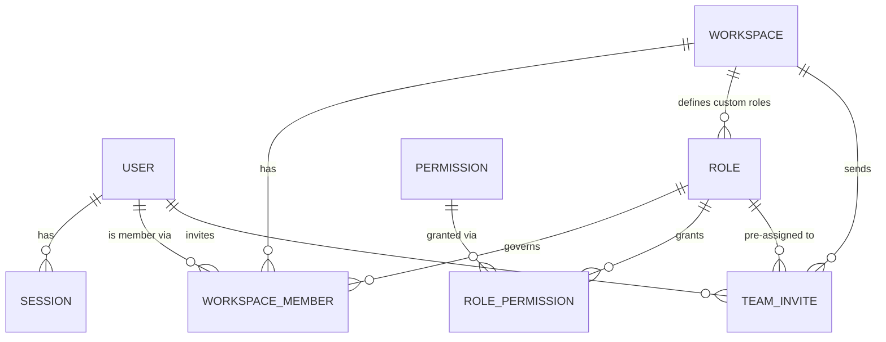
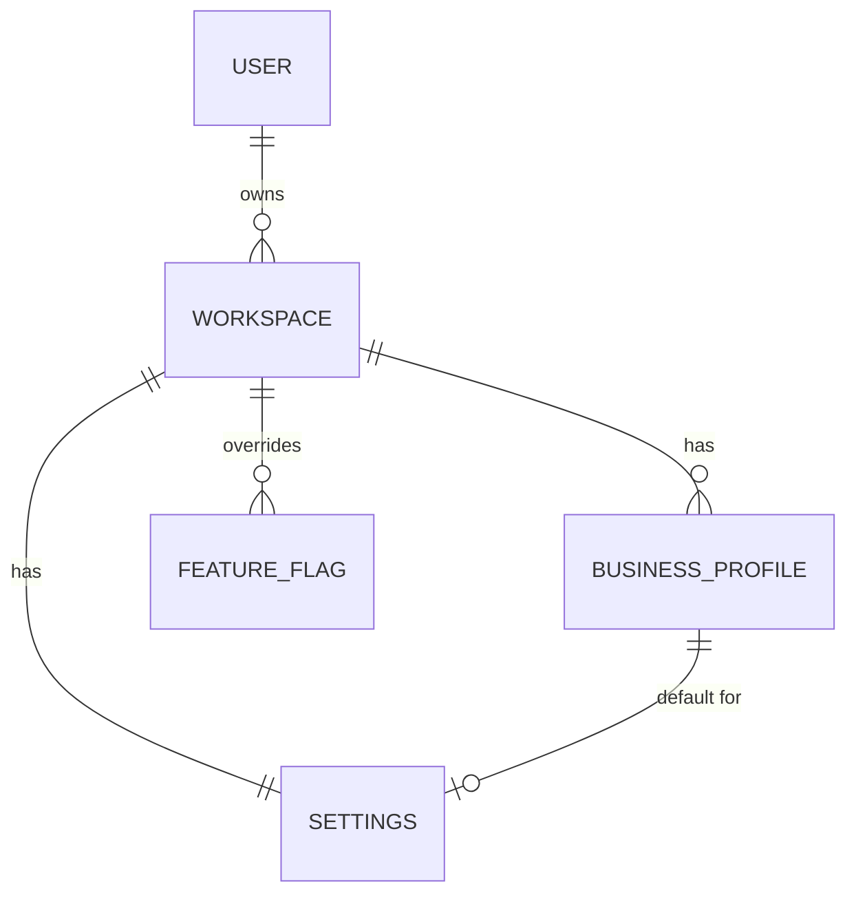
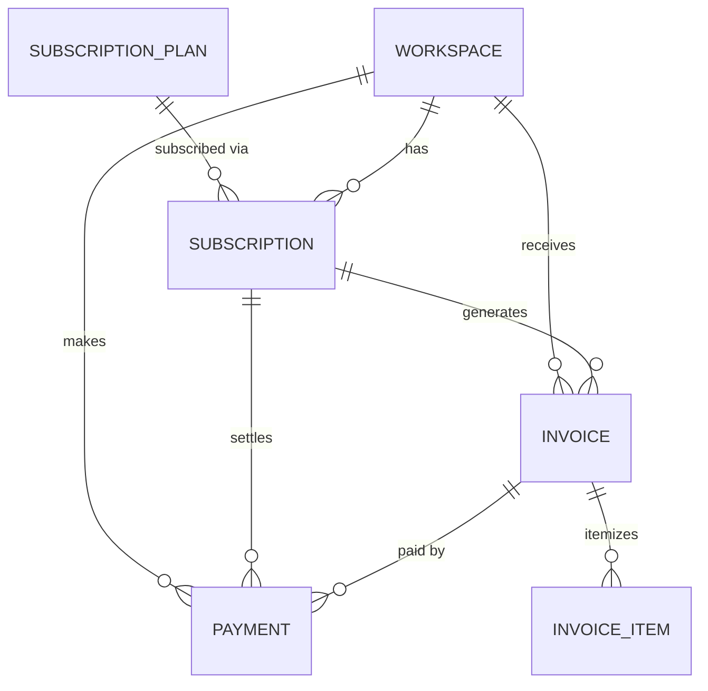
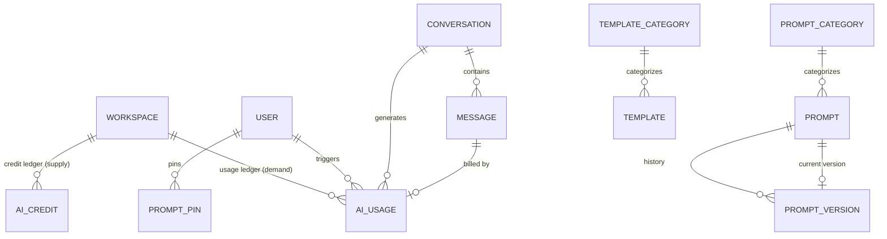
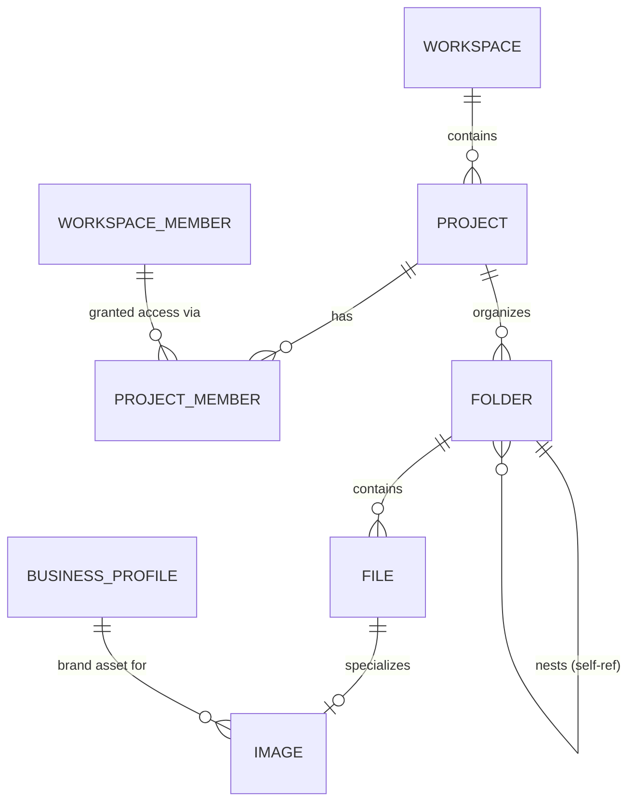
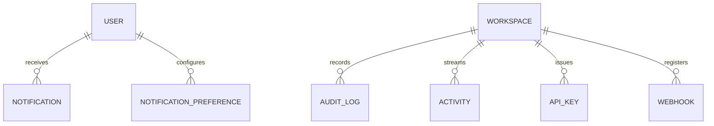

# BizPilot AI — Database Design

**Author:** Principal Database Architect
**Stack:** PostgreSQL 15+ · Prisma ORM 6
**Schema file:** [`backend/prisma/schema.prisma`](../backend/prisma/schema.prisma) (validated with `prisma validate` / `prisma format`)
**Scope:** the platform core only — Identity & Access, Tenancy, Billing, AI Platform, Content & Knowledge, Collaboration & Governance, Extensibility. Domain modules (Sales CRM, Support Helpdesk, Marketing Campaigns) are an intentional exclusion — see [§3.7](#37-bounded-contexts--future-microservices).

> Field-by-field types live in the schema itself (§2) — this document does not repeat every column, only what the schema alone can't tell you: *why* each model exists, how it relates to the rest of the system, and what changes as the product scales.

---

## 1. ERD Explanation

### 1.1 Bounded contexts

The schema is organized into seven sections, each a cohesive sub-graph of models. This grouping is not cosmetic — it's the intended seam line if/when a section is extracted into its own service and database (see §3.7).

| # | Context | Models |
|---|---|---|
| 1 | **Identity & Access** | User, Session, Role, Permission, RolePermission |
| 2 | **Tenancy** | Workspace, WorkspaceMember, TeamInvite, BusinessProfile, Settings, FeatureFlag |
| 3 | **Billing & Subscriptions** | SubscriptionPlan, Subscription, Payment, Invoice, InvoiceItem |
| 4 | **AI Platform** | AICredit, AIUsage, Conversation, Message, PromptCategory, Prompt, PromptVersion, PromptPin, TemplateCategory, Template |
| 5 | **Content & Files** | Project, ProjectMember, Folder, File, Image |
| 6 | **Collaboration & Governance** | NotificationPreference, Notification, AuditLog, Activity |
| 7 | **Extensibility** | ApiKey, Webhook |

Every model in sections 2–7 ultimately traces back to a `Workspace` — either directly via a `workspaceId` column, or transitively (e.g. `Message.conversationId → Conversation.workspaceId`). `Workspace` is the tenant boundary and the sharding key referenced throughout this document.

### 1.2 Diagrams

Diagrams are split by bounded context rather than one 37-model graph, which would be unreadable. Only primary keys and foreign-key relationships are shown; see §2 for full attribute lists.

#### Identity & Access



#### Tenancy



#### Billing & Subscriptions



#### AI Platform



#### Content & Files



#### Collaboration, Governance & Extensibility



### 1.3 Per-model reference

Purpose / Relations / Indexes / Constraints / Future scalability for every model. Fields are intentionally not re-listed here — see the schema (§2) for exact column names and types.

#### Section 1 — Identity & Access

**User**
- **Purpose:** the single global identity. A user is not tied to one workspace — they hold independent memberships (and roles) across any number of workspaces (§3.2).
- **Relations:** root of ~25 back-relations (sessions, memberships, authored content, audit/activity actor, etc.) — every "who did this" pointer in the schema ultimately points here.
- **Indexes:** `email` unique; `deletedAt` indexed for filtering active accounts.
- **Constraints:** `email` required + unique; `passwordHash` nullable (SSO-only accounts).
- **Future scalability:** add an `AuthIdentity`/`OAuthAccount` child model for multi-provider SSO; add Postgres `citext` for case-insensitive email uniqueness instead of app-layer lowercasing.

**Session**
- **Purpose:** durable record of an authenticated session/refresh token, enabling device lists and "revoke all sessions."
- **Relations:** belongs to `User` (cascade — a session is meaningless without its user).
- **Indexes:** `tokenHash` unique; `userId`, `expiresAt` indexed for cleanup jobs.
- **Constraints:** `tokenHash` stores a hash, never the raw token.
- **Future scalability:** move active-session lookups to Redis at high traffic; this table remains the durable source of truth for the device list / audit trail.

**Role**
- **Purpose:** the six seeded SYSTEM roles (Owner/Admin/Manager/Member/Viewer/Guest, `workspaceId = null`) plus, on Enterprise, workspace-scoped CUSTOM roles.
- **Relations:** optional `Workspace`; many `RolePermission`; many `WorkspaceMember`/`TeamInvite`.
- **Indexes:** `[workspaceId, key]` unique; `type` indexed.
- **Constraints:** `type = CUSTOM` requires `workspaceId` set — app-layer enforced (Prisma can't express cross-column conditional constraints). System-role key uniqueness (`workspaceId IS NULL`) needs a hand-written Postgres partial unique index, since composite unique constraints treat every `NULL` as distinct.
- **Future scalability:** role inheritance/composition for Enterprise customers building custom roles from a base role.

**Permission**
- **Purpose:** static, centrally-seeded catalog of atomic permissions (`billing.manage`, `content.publish`, ...) — a table rather than an enum specifically so CUSTOM roles can be composed from it at runtime without a schema migration.
- **Relations:** many `RolePermission`.
- **Indexes:** `key` unique; `module` indexed for admin-UI grouping.
- **Constraints:** never user-deletable; seeded via migration.
- **Future scalability:** add `deprecatedAt` if a permission's meaning needs to evolve without breaking existing role grants.

**RolePermission**
- **Purpose:** many-to-many join granting a `Permission` to a `Role`.
- **Relations:** `Role`, `Permission`, both cascade on delete.
- **Indexes:** `[roleId, permissionId]` unique; `permissionId` indexed.
- **Constraints:** uniqueness prevents duplicate grants.
- **Future scalability:** add `grantedByUserId` for compliance-grade "who granted this permission" tracking.

#### Section 2 — Tenancy

**Workspace**
- **Purpose:** the tenant boundary — billing, data isolation, and the AI credit pool all scope to this row.
- **Relations:** owns nearly every other model in the schema (directly or transitively); `ownerUserId` is a denormalized fast-path pointer (see §3.4).
- **Indexes:** `slug` unique; `ownerUserId`, `deletedAt` indexed.
- **Constraints:** `slug` unique, intended URL-safe (regex validation is app-layer; a Postgres `CHECK` constraint is a documented hardening follow-up).
- **Future scalability:** the primary future sharding/partitioning key — large workspaces or data-residency (Enterprise) requirements shard or relocate by `workspaceId`.

**WorkspaceMember**
- **Purpose:** the access-control join — which `Role` a `User` holds in a `Workspace`, plus optional module-level scoping.
- **Relations:** `Workspace`, `User` (named `WorkspaceMemberUser`), `Role`, optional inviter `User` (named `WorkspaceMemberInviter`).
- **Indexes:** `[workspaceId, userId]` unique; `userId`, `roleId`, `status` indexed.
- **Constraints:** one membership row per (workspace, user) — a user cannot hold two simultaneous roles in the same workspace under the current design.
- **Future scalability:** documented upgrade path to a `WorkspaceMemberRole` many-to-many join if multi-role-per-member becomes a requirement.

**TeamInvite**
- **Purpose:** the invitation lifecycle (pending → accepted/declined/expired/revoked) preceding a `WorkspaceMember` row.
- **Relations:** `Workspace`, `Role` (pre-assigned), inviter `User`, optional `acceptedBy User`.
- **Indexes:** `token` unique; `[workspaceId, email]`, `status`, `expiresAt` indexed.
- **Constraints:** `token` unique (invite-link security); at-most-one-PENDING-per-email is app-enforced.
- **Future scalability:** bulk CSV invite and domain-based auto-join (Enterprise) both fit the existing shape — just more rows, no schema change.

**BusinessProfile**
- **Purpose:** the AI grounding-context object — brand voice, audience, offerings — auto-applied to nearly every AI generation in the workspace.
- **Relations:** `Workspace`; optional `logoFile → File`; referenced by `Project`, `Conversation`, `Image`, `Settings.defaultBusinessProfileId`.
- **Indexes:** `workspaceId` indexed.
- **Constraints:** at-most-one `isDefault = true` per workspace is app-enforced (partial-unique-index caveat, as with `Role`).
- **Future scalability:** a `BrandVoiceSample` child table to store the raw training samples once the Brand Voice Trainer feature is built.

**Settings**
- **Purpose:** one-row-per-workspace operational defaults (timezone, branding, AI overage mode). Not user notification preferences (`NotificationPreference`) and not billing (`Subscription`).
- **Relations:** 1:1 `Workspace`; optional `defaultBusinessProfile`.
- **Indexes:** `workspaceId` unique.
- **Constraints:** exactly one row per workspace.
- **Future scalability:** split into `WorkspaceSettings`/`WorkspaceBillingSettings` if the field count grows; unnecessary today.

**FeatureFlag**
- **Purpose:** global flag definitions (`workspaceId = null`) plus optional per-workspace override rows, backing gradual rollout and plan-gated features.
- **Relations:** optional `Workspace`.
- **Indexes:** `[key, workspaceId]` unique.
- **Constraints:** override rows are looked up first, falling back to the global definition's default.
- **Future scalability:** a `FeatureFlagRule` model with JSON targeting rules if audience targeting needs to go beyond single-workspace/percentage rollout (e.g. by plan tier or cohort).

#### Section 3 — Billing & Subscriptions

**SubscriptionPlan**
- **Purpose:** the plan catalog (Free/Starter/Pro/Business/Enterprise, or a bespoke Enterprise row).
- **Relations:** many `Subscription`.
- **Indexes:** `key` unique; `tier`, `isActive` indexed.
- **Constraints:** plans are never hard-deleted — `isActive = false` retires a plan from the catalog while historical `Subscription` rows keep a valid FK.
- **Future scalability:** extract Stripe/provider-specific price IDs into a `PlanPriceExternalRef` model if multiple payment providers run simultaneously.

**Subscription**
- **Purpose:** a workspace's subscription to a plan over a billing period; historical (not just current) rows are kept for billing-dispute and analytics purposes.
- **Relations:** `Workspace`, `SubscriptionPlan`; many `Payment`, `Invoice`, `AICredit`.
- **Indexes:** `workspaceId`, `status`, `[workspaceId, status]` indexed; `externalProviderId` unique.
- **Constraints:** app-enforced — at most one row with status `TRIALING`/`ACTIVE`/`PAST_DUE` per workspace at a time.
- **Future scalability:** `provider` + namespaced `externalProviderId` already accommodate a second payment provider (e.g. PayPal) without a schema change.

**Payment**
- **Purpose:** a payment attempt/settlement. Never stores raw payment-method data — `paymentMethodSummary` is a display-only snapshot ("Visa •••• 4242"); the real instrument lives with the provider (PCI scope stays out of this database).
- **Relations:** `Workspace`; optional `Subscription`, `Invoice`, `initiatedBy User`.
- **Indexes:** `workspaceId`, `status`, `subscriptionId` indexed; `externalPaymentId` unique.
- **Constraints:** immutable once in a terminal status (app-enforced).
- **Future scalability:** first candidate to move to a dedicated Billing microservice if payment volume or compliance scope (SOC2/PCI) grows.

**Invoice**
- **Purpose:** the billing document, itemized via `InvoiceItem`.
- **Relations:** `Workspace`, optional `Subscription`; many `InvoiceItem`, `Payment`, `AICredit`.
- **Indexes:** `workspaceId`, `status` indexed; `number`, `externalInvoiceId` unique.
- **Constraints:** `number` is the human-readable, unique invoice identifier.
- **Future scalability:** direct accounting-software sync (QuickBooks/Xero) reads from this + `InvoiceItem` without schema changes.

**InvoiceItem**
- **Purpose:** normalizes invoice line items (subscription charge, AI credit top-up, overage, tax, discount) instead of a JSON array on `Invoice` — supports per-line reporting and future per-item traceability.
- **Relations:** `Invoice` (cascade).
- **Indexes:** `invoiceId` indexed.
- **Constraints:** `amountCents = quantity × unitAmountCents` (app-enforced).
- **Future scalability:** an optional FK back to the specific `AICredit` row it bills, once usage-based billing traceability matures.

#### Section 4 — AI Platform

**AICredit**
- **Purpose:** the credit **supply** ledger — plan grants, rollovers, top-up purchases, refunds, manual adjustments, expirations. Never mutated after insert.
- **Relations:** `Workspace`; optional `relatedSubscription`, `relatedPayment`, `relatedInvoice`, `createdBy User`.
- **Indexes:** `[workspaceId, createdAt]` (primary ledger-scan pattern), `type` indexed.
- **Constraints:** `balanceAfter` is a deliberate denormalized running-balance snapshot for O(1) "current balance" reads, avoiding a full ledger sum on every read — documented tradeoff, reconciled by the source-of-truth sum if drift is ever suspected.
- **Future scalability:** highest-write-volume table alongside `AIUsage` — first candidate for Postgres native partitioning by month, and for extraction into an event-sourced Billing/Credits microservice.

**AIUsage**
- **Purpose:** the credit **demand** ledger — one row per AI action taken, whatever feature triggered it.
- **Relations:** `Workspace`; optional `User`, `Conversation`, `Message` (1:1), `Prompt`; optional reverse `Image` (if the action generated one).
- **Indexes:** `[workspaceId, createdAt]`, `userId`, `actionType`, `[relatedEntityType, relatedEntityId]`.
- **Constraints:** `relatedEntityType`/`relatedEntityId` is a **deliberate polymorphic pointer** (plain strings, not a foreign key) — the only way this table can reference entities that will live in future microservices (a Sales `Deal`, a Support `Ticket`) without a cross-database FK. `creditsConsumed ≥ 0` is app-enforced.
- **Future scalability:** same partitioning note as `AICredit`; natural source for a future analytics/BI pipeline via change-data-capture rather than live heavy queries against OLTP.

**Conversation**
- **Purpose:** a chat/AI-generation thread — the Copilot, a content-generation session, or an automation run.
- **Relations:** `Workspace`; optional `Project`, `BusinessProfile`, `createdBy User`; many `Message`, `AIUsage`.
- **Indexes:** `workspaceId`, `projectId`, `createdByUserId` indexed.
- **Constraints:** soft-deletable (`deletedAt`) so a user can "delete" a conversation from their view without losing the underlying `AIUsage`/billing trail.
- **Future scalability:** Postgres partitioning by `conversationId` hash, or a dedicated store, if message volume grows very large; full-text search via `tsvector` is a near-term, non-schema-breaking addition.

**Message**
- **Purpose:** one turn in a `Conversation`.
- **Relations:** `Conversation` (cascade); optional `author User`; optional 1:1 `AIUsage` (the billing record for assistant messages).
- **Indexes:** `[conversationId, createdAt]` — the primary "fetch conversation in order" access pattern.
- **Constraints:** immutable after insert (no `updatedAt` — see §3.3); `creditsConsumed` is a denormalized display copy of `AIUsage.creditsConsumed`.
- **Future scalability:** archival/cold-storage strategy shared with `Conversation`.

**PromptCategory** / **TemplateCategory**
- **Purpose:** shared categorization for the Prompt Library and Template Library, respectively — global (`workspaceId = null`) or workspace-custom.
- **Relations:** optional `Workspace`; many `Prompt`/`Template`.
- **Indexes:** `[workspaceId, slug]` unique.
- **Constraints:** slugs unique per workspace scope (global categories share the `null` scope).
- **Future scalability:** none needed — this is a stable, low-churn shape.

**Prompt**
- **Purpose:** the stable identity/container for a reusable AI instruction. The actual editable content lives in `PromptVersion` — every edit creates a new version rather than overwriting (§ product design requirement).
- **Relations:** `Workspace`, optional `PromptCategory`, `author User`; `currentVersion` (1:1 pointer) and `versions` (1:many history) — **two distinct named relations to `PromptVersion`**; many `PromptPin`, `AIUsage`.
- **Indexes:** `[workspaceId, visibility]`, `categoryId`, `authorUserId`.
- **Constraints:** `currentVersionId` is nullable to resolve the chicken-and-egg problem at creation time (create `Prompt` → create first `PromptVersion` → point `currentVersionId` at it, all in one transaction, app-layer sequenced).
- **Future scalability:** this exact Prompt/PromptVersion split is reused as-is for the future Prompt Marketplace (§3.7 / PRD §21) — a listing simply points at a `Prompt` authored by a verified creator.

**PromptVersion**
- **Purpose:** one immutable, numbered revision of a Prompt's title/body.
- **Relations:** `Prompt` (cascade, the `versions` side); reverse `currentForPrompt` (the `currentVersion` side); `createdBy User`; reverse `Image[]` (AI-generated images produced from this version).
- **Indexes:** `[promptId, versionNumber]` unique.
- **Constraints:** version numbers are sequential per prompt (app-assigned).
- **Future scalability:** diffing/rollback UI is a pure read over this table — no schema change needed.

**PromptPin**
- **Purpose:** a user's personal favorite/pin — deliberately its own join rather than a boolean on `Prompt`, since pinning is per-user, not global.
- **Relations:** `User`, `Prompt` (both cascade).
- **Indexes:** `[userId, promptId]` unique.
- **Future scalability:** none needed.

**Template**
- **Purpose:** a reusable content artifact structure (content/email/sales/support/project) with `{{variable}}` tokens resolved from `BusinessProfile`/the record it's applied to.
- **Relations:** optional `Workspace` (null = system template), optional `TemplateCategory`, optional `author User`; reverse `projectsCreated` (Projects created from this template).
- **Indexes:** `[workspaceId, type]`, `categoryId`, `visibility`.
- **Constraints:** `variableSchema` (Json) declares the tokens a template expects — schemaless by design since it varies per template.
- **Future scalability:** version history (mirroring `Prompt`/`PromptVersion`) is the natural next step if template iteration needs the same audit trail; deliberately not built now (PRD does not require it, avoiding speculative symmetry).

#### Section 5 — Content & Files

**Project**
- **Purpose:** the organizing container for related work (a campaign, a client engagement) — sits above content/files/tasks/AI threads, below the workspace.
- **Relations:** `Workspace`, optional `BusinessProfile`, optional `createdFromTemplate`; `owner User`; many `ProjectMember`, `Folder`, `File`, `Conversation`.
- **Indexes:** `workspaceId`, `status`, `ownerUserId`.
- **Constraints:** soft-deletable; `Archived` status keeps data but removes it from active-project plan-limit counts.
- **Future scalability:** cross-workspace rollup reporting for agencies is a read-model concern, not a schema change.

**ProjectMember**
- **Purpose:** project-level access, deliberately referencing `WorkspaceMember` (not `User` directly) so project membership is *structurally* guaranteed to be a subset of workspace membership.
- **Relations:** `Project`, `WorkspaceMember` (both cascade).
- **Indexes:** `[projectId, workspaceMemberId]` unique.
- **Future scalability:** none needed.

**Folder**
- **Purpose:** hierarchical organization of files, workspace-level or project-scoped.
- **Relations:** `Workspace`, optional `Project`; self-referential `parent`/`children` (named relation `FolderHierarchy`); many `File`.
- **Indexes:** `workspaceId`, `projectId`, `parentFolderId`.
- **Constraints:** a folder's parent (if set) must share its `workspaceId` — app-enforced, not expressible as a declarative Prisma constraint.
- **Future scalability:** materialized path / nested-set columns if deep trees need fast "all descendants" queries; today's adjacency list is sufficient for typical shallow business-asset hierarchies.

**File**
- **Purpose:** the generic asset record. Binary content never lives in Postgres — `storageKey` points at an object-storage bucket (S3-compatible).
- **Relations:** `Workspace`, optional `Folder`, `Project`, `uploadedBy User`; optional reverse `Image` (1:1 specialization); reverse `businessProfileLogos` (a `BusinessProfile` may point at this file as its logo).
- **Indexes:** `workspaceId`, `folderId`, `projectId`, `checksum`.
- **Constraints:** `sizeBytes` is `BigInt` (beyond `Int` range for large files).
- **Future scalability:** `checksum` already supports de-duplication; the storage abstraction is what lets file storage move to a dedicated Asset microservice later without touching this table's shape.

**Image**
- **Purpose:** specializes `File` with image-only metadata (dimensions, alt text, AI generation provenance) — composition, not inheritance, so `File` stays generic for every asset kind.
- **Relations:** 1:1 `File` (cascade); optional `generatedByPromptVersion`, `generatedByAiUsage` (AI generation provenance), optional `BusinessProfile` (if used as a brand asset).
- **Indexes:** `fileId` unique.
- **Future scalability:** a perceptual-hash column for visual similarity search/dedup once AI Image Generator volume grows.

#### Section 6 — Collaboration & Governance

**NotificationPreference**
- **Purpose:** per-user, per-workspace, per-category, per-channel opt-in/out — the normalized alternative to a preferences JSON blob.
- **Relations:** `User`, `Workspace` (both cascade).
- **Indexes:** `[userId, workspaceId, category, channel]` unique.
- **Future scalability:** digest-scheduling (daily/weekly rollup) is an app-layer scheduling concern layered on top of this table, no schema change.

**Notification**
- **Purpose:** the durable notification-center record (distinct from a transient UI `Toast`, which fires once and isn't persisted).
- **Relations:** optional `Workspace`, required `recipient User`.
- **Indexes:** `[recipientUserId, readAt]`, `[workspaceId, category]`, `createdAt`.
- **Constraints:** `relatedEntityType`/`relatedEntityId` polymorphic pointer, same justification as `AIUsage`.
- **Future scalability:** first candidate to move delivery/read-state to a queue-backed system once volume grows; this table stays the durable, queryable record either way.

**AuditLog**
- **Purpose:** the immutable compliance record — permission changes, deletions, billing changes, logins.
- **Relations:** `Workspace`, optional `actor User`.
- **Indexes:** `[workspaceId, createdAt]`, `[entityType, entityId]`, `actorUserId`.
- **Constraints:** deliberately **no `updatedAt`** — rows are append-only by design, never mutated (see §3.3 for the reasoning).
- **Future scalability:** partition by month; export-to-cold-storage after the plan's retention window; candidate for a dedicated append-only event store for SOC2/HIPAA-track customers.

**Activity**
- **Purpose:** the lightweight, human-facing "what just happened" feed — explicitly *not* the compliance record.
- **Relations:** `Workspace`, optional `actor User`.
- **Indexes:** `[workspaceId, createdAt]`.
- **Constraints:** `summary` is pre-rendered/denormalized text (e.g. "Maya published *Q2 Launch Blog Post*") for fast feed rendering without joining across every possible entity type; no `updatedAt` (immutable).
- **Future scalability:** the natural fan-in point for future microservices' domain events (a Sales deal moving, a Support ticket resolving) — a good candidate to back with a message queue rather than direct writes once those services exist.

#### Section 7 — Extensibility

**ApiKey**
- **Purpose:** scoped, workspace-issued API credentials for programmatic access.
- **Relations:** `Workspace`, `createdBy User`.
- **Indexes:** `workspaceId`, `status`; `hashedKey` unique.
- **Constraints:** only a hash is stored — the raw key is shown once at creation and never persisted.
- **Future scalability:** live rate-limit counters belong in Redis, not this table; this table stays the source of truth for identity/scope.

**Webhook**
- **Purpose:** outbound event subscriptions for workspace integrations.
- **Relations:** `Workspace`, `createdBy User`.
- **Indexes:** `workspaceId`, `status`.
- **Constraints:** `secret` (HMAC signing key) must be encrypted at rest via the infrastructure/secrets layer — not a Prisma field-level concern.
- **Future scalability:** a `WebhookDelivery` model (per-attempt log: response status, latency, retry count) is the deliberately-deferred next addition once webhook volume justifies it.

---

## 2. Prisma Schema

```prisma
// =============================================================================
// BizPilot AI — Core Platform Database Schema
// =============================================================================
// Scope: Identity & Access, Tenancy, Billing & Subscriptions, AI Platform,
// Content & Knowledge (Projects/Files/Prompts/Templates), Collaboration &
// Governance (Notifications/Audit/Activity), and Extensibility (API/Webhooks).
//
// Domain modules (Sales CRM, Support Helpdesk, Marketing Campaigns, Analytics
// warehouse) are deliberately out of scope for this schema — see "Bounded
// Contexts & Future Microservices" in the accompanying architecture doc.
// They will get their own schemas/databases, joined to this one only via
// `workspaceId` (and the polymorphic `relatedEntityType`/`relatedEntityId`
// pattern used by AIUsage/Notification/Activity/AuditLog).
// =============================================================================

generator client {
  provider        = "prisma-client-js"
  previewFeatures = ["postgresqlExtensions"]
}

datasource db {
  provider   = "postgresql"
  url        = env("DATABASE_URL")
  extensions = [pgcrypto]
}

// =============================================================================
// SECTION 1 — Identity & Access
// =============================================================================

model User {
  id              String    @id @default(dbgenerated("gen_random_uuid()")) @db.Uuid
  email           String    @unique
  emailVerifiedAt DateTime?
  passwordHash    String? // null for SSO-only accounts
  fullName        String
  avatarUrl       String?
  phone           String?
  timezone        String    @default("UTC")
  locale          String    @default("en")
  isSystemAdmin   Boolean   @default(false) // internal BizPilot staff, not a workspace role
  lastLoginAt     DateTime?
  deletedAt       DateTime?
  createdAt       DateTime  @default(now())
  updatedAt       DateTime  @updatedAt

  sessions                Session[]
  ownedWorkspaces         Workspace[]              @relation("WorkspaceOwner")
  workspaceMemberships    WorkspaceMember[]        @relation("WorkspaceMemberUser")
  invitedWorkspaceMembers WorkspaceMember[]        @relation("WorkspaceMemberInviter")
  sentTeamInvites         TeamInvite[]             @relation("TeamInviteInviter")
  acceptedTeamInvites     TeamInvite[]             @relation("TeamInviteAcceptedBy")
  aiCreditAdjustments     AICredit[]
  aiUsages                AIUsage[]
  conversations           Conversation[]
  messages                Message[]
  promptsAuthored         Prompt[]
  promptVersionsCreated   PromptVersion[]
  promptPins              PromptPin[]
  templatesAuthored       Template[]
  projectsOwned           Project[]
  filesUploaded           File[]
  notifications           Notification[]
  notificationPreferences NotificationPreference[]
  auditLogs               AuditLog[]
  activities              Activity[]
  apiKeysCreated          ApiKey[]
  webhooksCreated         Webhook[]
  paymentsInitiated       Payment[]

  @@index([deletedAt])
  @@map("users")
}

model Session {
  id        String    @id @default(dbgenerated("gen_random_uuid()")) @db.Uuid
  userId    String    @db.Uuid
  tokenHash String    @unique
  userAgent String?
  ipAddress String?
  expiresAt DateTime
  revokedAt DateTime?
  createdAt DateTime  @default(now())
  updatedAt DateTime  @updatedAt

  user User @relation(fields: [userId], references: [id], onDelete: Cascade)

  @@index([userId])
  @@index([expiresAt])
  @@map("sessions")
}

/// A Role is workspace-scoped (`workspaceId` set → CUSTOM role, Enterprise
/// only) or global (`workspaceId` null → one of the six SYSTEM roles seeded
/// once and reused by every workspace: Owner/Admin/Manager/Member/Viewer/Guest).
model Role {
  id          String    @id @default(dbgenerated("gen_random_uuid()")) @db.Uuid
  workspaceId String?   @db.Uuid
  key         String // e.g. "OWNER", "ADMIN", or a custom slug
  name        String
  description String?
  type        RoleType
  isDefault   Boolean   @default(false) // assigned automatically to new invites
  deletedAt   DateTime?
  createdAt   DateTime  @default(now())
  updatedAt   DateTime  @updatedAt

  workspace        Workspace?        @relation(fields: [workspaceId], references: [id], onDelete: Cascade)
  rolePermissions  RolePermission[]
  workspaceMembers WorkspaceMember[]
  teamInvites      TeamInvite[]

  // NOTE: Prisma cannot express a partial unique index ("unique key WHERE
  // workspaceId IS NULL") declaratively — Postgres treats every NULL as
  // distinct in a composite unique constraint. System-role key uniqueness
  // is therefore enforced by the seed script; a follow-up hand-written
  // migration adds `CREATE UNIQUE INDEX ... WHERE workspace_id IS NULL`.
  @@unique([workspaceId, key])
  @@index([type])
  @@map("roles")
}

enum RoleType {
  SYSTEM
  CUSTOM
}

/// Static, centrally-seeded catalog of atomic permissions. Never user-deletable.
model Permission {
  id          String   @id @default(dbgenerated("gen_random_uuid()")) @db.Uuid
  key         String   @unique // e.g. "billing.manage", "content.publish"
  description String?
  module      String // groups permissions for admin-UI display, e.g. "billing"
  createdAt   DateTime @default(now())
  updatedAt   DateTime @updatedAt

  rolePermissions RolePermission[]

  @@index([module])
  @@map("permissions")
}

/// Join table: which Permissions a Role grants.
model RolePermission {
  id           String   @id @default(dbgenerated("gen_random_uuid()")) @db.Uuid
  roleId       String   @db.Uuid
  permissionId String   @db.Uuid
  createdAt    DateTime @default(now())

  role       Role       @relation(fields: [roleId], references: [id], onDelete: Cascade)
  permission Permission @relation(fields: [permissionId], references: [id], onDelete: Cascade)

  @@unique([roleId, permissionId])
  @@index([permissionId])
  @@map("role_permissions")
}

// =============================================================================
// SECTION 2 — Tenancy (Workspace, Membership, Business Profile, Settings)
// =============================================================================

/// The tenant boundary. Every business-data row in this schema traces back
/// to exactly one Workspace, either directly (`workspaceId`) or transitively.
model Workspace {
  id          String    @id @default(dbgenerated("gen_random_uuid()")) @db.Uuid
  name        String
  slug        String    @unique
  logoUrl     String?
  ownerUserId String    @db.Uuid
  isActive    Boolean   @default(true) // operational suspend flag, distinct from deletedAt
  deletedAt   DateTime?
  createdAt   DateTime  @default(now())
  updatedAt   DateTime  @updatedAt

  owner                   User                     @relation("WorkspaceOwner", fields: [ownerUserId], references: [id])
  members                 WorkspaceMember[]
  teamInvites             TeamInvite[]
  roles                   Role[]
  businessProfiles        BusinessProfile[]
  settings                Settings?
  featureFlags            FeatureFlag[]
  subscriptions           Subscription[]
  payments                Payment[]
  invoices                Invoice[]
  aiCredits               AICredit[]
  aiUsages                AIUsage[]
  projects                Project[]
  folders                 Folder[]
  files                   File[]
  conversations           Conversation[]
  prompts                 Prompt[]
  promptCategories        PromptCategory[]
  templates               Template[]
  templateCategories      TemplateCategory[]
  notifications           Notification[]
  notificationPreferences NotificationPreference[]
  auditLogs               AuditLog[]
  activities              Activity[]
  apiKeys                 ApiKey[]
  webhooks                Webhook[]

  @@index([ownerUserId])
  @@index([deletedAt])
  @@map("workspaces")
}

/// The single most important join in the schema: a User's access to a
/// Workspace, and which Role governs that access. One row per (user,
/// workspace) pair — see "Future scalability" if multi-role-per-member is
/// ever required.
model WorkspaceMember {
  id              String                @id @default(dbgenerated("gen_random_uuid()")) @db.Uuid
  workspaceId     String                @db.Uuid
  userId          String                @db.Uuid
  roleId          String                @db.Uuid
  status          WorkspaceMemberStatus
  moduleScope     String[] // e.g. ["sales"] for a module-scoped Manager/Member; empty = full role scope
  invitedByUserId String?               @db.Uuid
  joinedAt        DateTime?
  deletedAt       DateTime?
  createdAt       DateTime              @default(now())
  updatedAt       DateTime              @updatedAt

  workspace          Workspace       @relation(fields: [workspaceId], references: [id], onDelete: Cascade)
  user               User            @relation("WorkspaceMemberUser", fields: [userId], references: [id], onDelete: Cascade)
  role               Role            @relation(fields: [roleId], references: [id])
  invitedBy          User?           @relation("WorkspaceMemberInviter", fields: [invitedByUserId], references: [id])
  projectMemberships ProjectMember[]

  @@unique([workspaceId, userId])
  @@index([userId])
  @@index([roleId])
  @@index([status])
  @@map("workspace_members")
}

enum WorkspaceMemberStatus {
  INVITED
  ACTIVE
  SUSPENDED
  REMOVED
}

model TeamInvite {
  id               String       @id @default(dbgenerated("gen_random_uuid()")) @db.Uuid
  workspaceId      String       @db.Uuid
  email            String
  roleId           String       @db.Uuid
  invitedByUserId  String       @db.Uuid
  token            String       @unique
  status           InviteStatus
  expiresAt        DateTime
  acceptedAt       DateTime?
  acceptedByUserId String?      @db.Uuid
  createdAt        DateTime     @default(now())
  updatedAt        DateTime     @updatedAt

  workspace  Workspace @relation(fields: [workspaceId], references: [id], onDelete: Cascade)
  role       Role      @relation(fields: [roleId], references: [id])
  invitedBy  User      @relation("TeamInviteInviter", fields: [invitedByUserId], references: [id])
  acceptedBy User?     @relation("TeamInviteAcceptedBy", fields: [acceptedByUserId], references: [id])

  // App-layer enforces at most one PENDING invite per (workspaceId, email);
  // a Postgres partial unique index is the recommended hardening follow-up.
  @@index([workspaceId, email])
  @@index([status])
  @@index([expiresAt])
  @@map("team_invites")
}

enum InviteStatus {
  PENDING
  ACCEPTED
  DECLINED
  EXPIRED
  REVOKED
}

/// The grounding context object referenced by nearly every AI-generating
/// feature. Deliberately workspace-level (not project-level) so voice/brand
/// stays consistent across everything generated in that workspace.
model BusinessProfile {
  id             String    @id @default(dbgenerated("gen_random_uuid()")) @db.Uuid
  workspaceId    String    @db.Uuid
  name           String
  industry       String?
  description    String?
  targetAudience String?
  toneAttributes Json? // structured, evolving voice attributes — see docs
  voiceNotes     String?
  logoFileId     String?   @db.Uuid
  primaryColor   String?
  secondaryColor String?
  website        String?
  socialLinks    Json? // [{ platform, url }]
  offerings      Json? // [{ name, description }]
  isDefault      Boolean   @default(true)
  deletedAt      DateTime?
  createdAt      DateTime  @default(now())
  updatedAt      DateTime  @updatedAt

  workspace         Workspace      @relation(fields: [workspaceId], references: [id], onDelete: Cascade)
  logoFile          File?          @relation(fields: [logoFileId], references: [id], onDelete: SetNull)
  settingsAsDefault Settings[]
  projects          Project[]
  conversations     Conversation[]
  images            Image[]

  // App-layer enforces at most one isDefault=true row per workspace
  // (same partial-unique-index caveat as Role above).
  @@index([workspaceId])
  @@map("business_profiles")
}

/// One row per Workspace. Operational defaults — not user notification
/// preferences (see NotificationPreference) and not billing (see Subscription).
model Settings {
  id                       String        @id @default(dbgenerated("gen_random_uuid()")) @db.Uuid
  workspaceId              String        @unique @db.Uuid
  defaultBusinessProfileId String?       @db.Uuid
  timezone                 String        @default("UTC")
  locale                   String        @default("en")
  weekStartsOn             Int           @default(1)
  aiOverageMode            AIOverageMode @default(HARD_STOP)
  brandingPrimaryColor     String?
  brandingSecondaryColor   String?
  createdAt                DateTime      @default(now())
  updatedAt                DateTime      @updatedAt

  workspace              Workspace        @relation(fields: [workspaceId], references: [id], onDelete: Cascade)
  defaultBusinessProfile BusinessProfile? @relation(fields: [defaultBusinessProfileId], references: [id], onDelete: SetNull)

  @@map("workspace_settings")
}

enum AIOverageMode {
  HARD_STOP
  SOFT_ALLOW
}

/// Global flag definitions (`workspaceId` null) plus optional per-workspace
/// overrides (`workspaceId` set). Read pattern: look up the override row
/// first, fall back to the global definition's `isEnabledByDefault`.
model FeatureFlag {
  id                 String          @id @default(dbgenerated("gen_random_uuid()")) @db.Uuid
  key                String
  name               String
  description        String?
  type               FeatureFlagType
  isEnabledByDefault Boolean         @default(false)
  rolloutPercentage  Int? // 0-100, used when type = PERCENTAGE_ROLLOUT
  workspaceId        String?         @db.Uuid
  isEnabled          Boolean? // override value; only meaningful on workspace-scoped rows
  createdAt          DateTime        @default(now())
  updatedAt          DateTime        @updatedAt

  workspace Workspace? @relation(fields: [workspaceId], references: [id], onDelete: Cascade)

  @@unique([key, workspaceId])
  @@map("feature_flags")
}

enum FeatureFlagType {
  BOOLEAN
  PERCENTAGE_ROLLOUT
  PLAN_GATED
}

// =============================================================================
// SECTION 3 — Billing & Subscriptions
// =============================================================================

model SubscriptionPlan {
  id                   String   @id @default(dbgenerated("gen_random_uuid()")) @db.Uuid
  key                  String   @unique // "free" | "starter" | "pro" | "business" | "enterprise" | custom
  tier                 PlanTier
  name                 String
  description          String?
  priceMonthlyCents    Int? // null for "contact us" custom Enterprise pricing
  priceAnnualCents     Int?
  currency             String   @default("usd")
  aiCreditsPerMonth    Int
  maxWorkspaces        Int? // null = unlimited
  maxTeamSeats         Int?
  maxBusinessProfiles  Int?
  maxActiveProjects    Int?
  historyRetentionDays Int
  featureMatrix        Json // per-module capability matrix, see PRD §9
  isActive             Boolean  @default(true) // catalog visibility; plans are never hard-deleted
  sortOrder            Int      @default(0)
  createdAt            DateTime @default(now())
  updatedAt            DateTime @updatedAt

  subscriptions Subscription[]

  @@index([tier])
  @@index([isActive])
  @@map("subscription_plans")
}

enum PlanTier {
  FREE
  STARTER
  PRO
  BUSINESS
  ENTERPRISE
}

model Subscription {
  id                 String             @id @default(dbgenerated("gen_random_uuid()")) @db.Uuid
  workspaceId        String             @db.Uuid
  planId             String             @db.Uuid
  status             SubscriptionStatus
  billingInterval    BillingInterval
  currentPeriodStart DateTime
  currentPeriodEnd   DateTime
  cancelAtPeriodEnd  Boolean            @default(false)
  canceledAt         DateTime?
  trialEndsAt        DateTime?
  provider           PaymentProvider    @default(STRIPE)
  externalProviderId String?            @unique
  createdAt          DateTime           @default(now())
  updatedAt          DateTime           @updatedAt

  workspace Workspace        @relation(fields: [workspaceId], references: [id], onDelete: Cascade)
  plan      SubscriptionPlan @relation(fields: [planId], references: [id])
  payments  Payment[]
  invoices  Invoice[]
  aiCredits AICredit[]

  // App-layer enforces at most one row with status IN (TRIALING, ACTIVE,
  // PAST_DUE) per workspace at a time (partial-unique-index caveat, as above).
  @@index([workspaceId])
  @@index([status])
  @@index([workspaceId, status])
  @@map("subscriptions")
}

enum SubscriptionStatus {
  TRIALING
  ACTIVE
  PAST_DUE
  CANCELED
  EXPIRED
  PAUSED
}

enum BillingInterval {
  MONTHLY
  ANNUAL
}

enum PaymentProvider {
  STRIPE
  PAYPAL
  MANUAL
}

/// Never stores raw payment method data (PCI scope stays with the provider).
model Payment {
  id                   String          @id @default(dbgenerated("gen_random_uuid()")) @db.Uuid
  workspaceId          String          @db.Uuid
  subscriptionId       String?         @db.Uuid
  invoiceId            String?         @db.Uuid
  amountCents          Int
  currency             String          @default("usd")
  status               PaymentStatus
  provider             PaymentProvider
  externalPaymentId    String?         @unique
  paymentMethodSummary String? // display-only snapshot, e.g. "Visa •••• 4242"
  failureReason        String?
  initiatedByUserId    String?         @db.Uuid
  createdAt            DateTime        @default(now())

  workspace    Workspace     @relation(fields: [workspaceId], references: [id], onDelete: Cascade)
  subscription Subscription? @relation(fields: [subscriptionId], references: [id], onDelete: SetNull)
  invoice      Invoice?      @relation(fields: [invoiceId], references: [id], onDelete: SetNull)
  initiatedBy  User?         @relation(fields: [initiatedByUserId], references: [id], onDelete: SetNull)
  aiCredits    AICredit[]

  @@index([workspaceId])
  @@index([status])
  @@index([subscriptionId])
  @@map("payments")
}

enum PaymentStatus {
  PENDING
  SUCCEEDED
  FAILED
  REFUNDED
  PARTIALLY_REFUNDED
}

model Invoice {
  id                String        @id @default(dbgenerated("gen_random_uuid()")) @db.Uuid
  workspaceId       String        @db.Uuid
  subscriptionId    String?       @db.Uuid
  number            String        @unique
  status            InvoiceStatus
  subtotalCents     Int
  taxCents          Int           @default(0)
  totalCents        Int
  currency          String        @default("usd")
  dueAt             DateTime?
  paidAt            DateTime?
  pdfUrl            String?
  externalInvoiceId String?       @unique
  createdAt         DateTime      @default(now())
  updatedAt         DateTime      @updatedAt

  workspace    Workspace     @relation(fields: [workspaceId], references: [id], onDelete: Cascade)
  subscription Subscription? @relation(fields: [subscriptionId], references: [id], onDelete: SetNull)
  items        InvoiceItem[]
  payments     Payment[]
  aiCredits    AICredit[]

  @@index([workspaceId])
  @@index([status])
  @@map("invoices")
}

enum InvoiceStatus {
  DRAFT
  OPEN
  PAID
  VOID
  UNCOLLECTIBLE
}

model InvoiceItem {
  id              String          @id @default(dbgenerated("gen_random_uuid()")) @db.Uuid
  invoiceId       String          @db.Uuid
  type            InvoiceItemType
  description     String
  quantity        Int             @default(1)
  unitAmountCents Int
  amountCents     Int
  createdAt       DateTime        @default(now())

  invoice Invoice @relation(fields: [invoiceId], references: [id], onDelete: Cascade)

  @@index([invoiceId])
  @@map("invoice_items")
}

enum InvoiceItemType {
  SUBSCRIPTION
  AI_CREDIT_TOPUP
  OVERAGE
  ADJUSTMENT
  TAX
  DISCOUNT
}

// =============================================================================
// SECTION 4 — AI Platform (Credits, Usage, Conversations, Prompts, Templates)
// =============================================================================

/// Ledger of credit SUPPLY (grants, top-ups, rollovers, refunds, manual
/// adjustments). Consumption is recorded separately in AIUsage — balance is
/// always `sum(AICredit.amount) - sum(AIUsage.creditsConsumed)`.
model AICredit {
  id                    String                  @id @default(dbgenerated("gen_random_uuid()")) @db.Uuid
  workspaceId           String                  @db.Uuid
  type                  AICreditTransactionType
  amount                Int // positive = credit added, negative = removed (EXPIRATION, clawback)
  balanceAfter          Int // denormalized running-balance snapshot — see docs for the tradeoff
  relatedSubscriptionId String?                 @db.Uuid
  relatedPaymentId      String?                 @db.Uuid
  relatedInvoiceId      String?                 @db.Uuid
  note                  String?
  expiresAt             DateTime?
  createdByUserId       String?                 @db.Uuid
  createdAt             DateTime                @default(now())

  workspace           Workspace     @relation(fields: [workspaceId], references: [id], onDelete: Cascade)
  relatedSubscription Subscription? @relation(fields: [relatedSubscriptionId], references: [id], onDelete: SetNull)
  relatedPayment      Payment?      @relation(fields: [relatedPaymentId], references: [id], onDelete: SetNull)
  relatedInvoice      Invoice?      @relation(fields: [relatedInvoiceId], references: [id], onDelete: SetNull)
  createdBy           User?         @relation(fields: [createdByUserId], references: [id], onDelete: SetNull)

  @@index([workspaceId, createdAt])
  @@index([type])
  @@map("ai_credits")
}

enum AICreditTransactionType {
  PLAN_GRANT
  ROLLOVER
  TOPUP_PURCHASE
  PROMOTIONAL
  REFUND
  MANUAL_ADJUSTMENT
  EXPIRATION
}

/// One row per AI action taken — the consumption DEBIT ledger.
/// `relatedEntityType`/`relatedEntityId` is a deliberate polymorphic pointer
/// (string, not FK) so future microservices (Sales/Support/Marketing) can be
/// referenced without a cross-database foreign key.
model AIUsage {
  id                String        @id @default(dbgenerated("gen_random_uuid()")) @db.Uuid
  workspaceId       String        @db.Uuid
  userId            String?       @db.Uuid // null for system/automation-triggered actions
  actionType        AIActionType
  status            AIUsageStatus
  creditsConsumed   Int
  conversationId    String?       @db.Uuid
  messageId         String?       @unique @db.Uuid
  promptId          String?       @db.Uuid
  relatedEntityType String?
  relatedEntityId   String?
  modelProvider     String?
  modelName         String?
  latencyMs         Int?
  createdAt         DateTime      @default(now())

  workspace      Workspace     @relation(fields: [workspaceId], references: [id], onDelete: Cascade)
  user           User?         @relation(fields: [userId], references: [id], onDelete: SetNull)
  conversation   Conversation? @relation(fields: [conversationId], references: [id], onDelete: SetNull)
  message        Message?      @relation(fields: [messageId], references: [id], onDelete: SetNull)
  prompt         Prompt?       @relation(fields: [promptId], references: [id], onDelete: SetNull)
  generatedImage Image?

  @@index([workspaceId, createdAt])
  @@index([userId])
  @@index([actionType])
  @@index([relatedEntityType, relatedEntityId])
  @@map("ai_usages")
}

enum AIActionType {
  COPILOT_CHAT
  CONTENT_SHORT
  CONTENT_LONGFORM
  IMAGE_GENERATION
  CALL_SUMMARY
  AUTOMATION_RUN
  INSIGHTS_REPORT
  OTHER
}

enum AIUsageStatus {
  SUCCEEDED
  FAILED
  BLOCKED_BY_GUARDRAIL
  BLOCKED_BY_CREDIT_LIMIT
}

model Conversation {
  id                String             @id @default(dbgenerated("gen_random_uuid()")) @db.Uuid
  workspaceId       String             @db.Uuid
  projectId         String?            @db.Uuid
  businessProfileId String?            @db.Uuid
  source            ConversationSource
  title             String?
  createdByUserId   String?            @db.Uuid
  deletedAt         DateTime?
  createdAt         DateTime           @default(now())
  updatedAt         DateTime           @updatedAt

  workspace       Workspace        @relation(fields: [workspaceId], references: [id], onDelete: Cascade)
  project         Project?         @relation(fields: [projectId], references: [id], onDelete: SetNull)
  businessProfile BusinessProfile? @relation(fields: [businessProfileId], references: [id], onDelete: SetNull)
  createdBy       User?            @relation(fields: [createdByUserId], references: [id], onDelete: SetNull)
  messages        Message[]
  aiUsages        AIUsage[]

  @@index([workspaceId])
  @@index([projectId])
  @@index([createdByUserId])
  @@map("conversations")
}

enum ConversationSource {
  COPILOT
  CONTENT_CREATION
  SALES_ASSISTANT
  SUPPORT_AGENT
  AUTOMATION
}

model Message {
  id              String      @id @default(dbgenerated("gen_random_uuid()")) @db.Uuid
  conversationId  String      @db.Uuid
  role            MessageRole
  authorUserId    String?     @db.Uuid
  content         String      @db.Text
  tokenCount      Int?
  creditsConsumed Int? // denormalized copy of AIUsage.creditsConsumed for fast display
  metadata        Json? // provider/tool-call metadata, varies by model — see docs
  createdAt       DateTime    @default(now())

  conversation Conversation @relation(fields: [conversationId], references: [id], onDelete: Cascade)
  author       User?        @relation(fields: [authorUserId], references: [id], onDelete: SetNull)
  aiUsage      AIUsage?

  @@index([conversationId, createdAt])
  @@map("messages")
}

enum MessageRole {
  SYSTEM
  USER
  ASSISTANT
  TOOL
}

model PromptCategory {
  id          String   @id @default(dbgenerated("gen_random_uuid()")) @db.Uuid
  workspaceId String?  @db.Uuid // null = global/system category
  name        String
  slug        String
  description String?
  sortOrder   Int      @default(0)
  createdAt   DateTime @default(now())
  updatedAt   DateTime @updatedAt

  workspace Workspace? @relation(fields: [workspaceId], references: [id], onDelete: Cascade)
  prompts   Prompt[]

  @@unique([workspaceId, slug])
  @@map("prompt_categories")
}

/// The stable identity/container. The actual editable content lives in
/// PromptVersion — see "every prompt is versioned" in the product design.
model Prompt {
  id               String           @id @default(dbgenerated("gen_random_uuid()")) @db.Uuid
  workspaceId      String           @db.Uuid
  categoryId       String?          @db.Uuid
  authorUserId     String           @db.Uuid
  currentVersionId String?          @unique @db.Uuid
  visibility       PromptVisibility
  targetFeature    String? // e.g. "sales.follow_up"
  usageCount       Int              @default(0) // denormalized counter, reconciled periodically
  deletedAt        DateTime?
  createdAt        DateTime         @default(now())
  updatedAt        DateTime         @updatedAt

  workspace      Workspace       @relation(fields: [workspaceId], references: [id], onDelete: Cascade)
  category       PromptCategory? @relation(fields: [categoryId], references: [id], onDelete: SetNull)
  author         User            @relation(fields: [authorUserId], references: [id])
  currentVersion PromptVersion?  @relation("PromptCurrentVersion", fields: [currentVersionId], references: [id], onDelete: SetNull)
  versions       PromptVersion[] @relation("PromptVersions")
  pins           PromptPin[]
  aiUsages       AIUsage[]

  @@index([workspaceId, visibility])
  @@index([categoryId])
  @@index([authorUserId])
  @@map("prompts")
}

enum PromptVisibility {
  PERSONAL
  WORKSPACE
}

model PromptVersion {
  id               String   @id @default(dbgenerated("gen_random_uuid()")) @db.Uuid
  promptId         String   @db.Uuid
  versionNumber    Int
  title            String
  body             String   @db.Text
  estimatedCredits Int?
  createdByUserId  String   @db.Uuid
  createdAt        DateTime @default(now())

  prompt           Prompt  @relation("PromptVersions", fields: [promptId], references: [id], onDelete: Cascade)
  currentForPrompt Prompt? @relation("PromptCurrentVersion")
  createdBy        User    @relation(fields: [createdByUserId], references: [id])
  generatedImages  Image[]

  @@unique([promptId, versionNumber])
  @@map("prompt_versions")
}

/// Per-user favorite/pin — deliberately its own join, not a boolean on
/// Prompt, since pinning is a personal preference, not a global property.
model PromptPin {
  id        String   @id @default(dbgenerated("gen_random_uuid()")) @db.Uuid
  userId    String   @db.Uuid
  promptId  String   @db.Uuid
  createdAt DateTime @default(now())

  user   User   @relation(fields: [userId], references: [id], onDelete: Cascade)
  prompt Prompt @relation(fields: [promptId], references: [id], onDelete: Cascade)

  @@unique([userId, promptId])
  @@map("prompt_pins")
}

model TemplateCategory {
  id          String   @id @default(dbgenerated("gen_random_uuid()")) @db.Uuid
  workspaceId String?  @db.Uuid
  name        String
  slug        String
  description String?
  sortOrder   Int      @default(0)
  createdAt   DateTime @default(now())
  updatedAt   DateTime @updatedAt

  workspace Workspace? @relation(fields: [workspaceId], references: [id], onDelete: Cascade)
  templates Template[]

  @@unique([workspaceId, slug])
  @@map("template_categories")
}

model Template {
  id             String             @id @default(dbgenerated("gen_random_uuid()")) @db.Uuid
  workspaceId    String?            @db.Uuid // null = system template
  categoryId     String?            @db.Uuid
  authorUserId   String?            @db.Uuid
  type           TemplateType
  visibility     TemplateVisibility
  title          String
  description    String?
  body           String             @db.Text
  variableSchema Json? // declares expected {{tokens}} and their source
  usageCount     Int                @default(0)
  deletedAt      DateTime?
  createdAt      DateTime           @default(now())
  updatedAt      DateTime           @updatedAt

  workspace       Workspace?        @relation(fields: [workspaceId], references: [id], onDelete: Cascade)
  category        TemplateCategory? @relation(fields: [categoryId], references: [id], onDelete: SetNull)
  author          User?             @relation(fields: [authorUserId], references: [id], onDelete: SetNull)
  projectsCreated Project[]

  @@index([workspaceId, type])
  @@index([categoryId])
  @@index([visibility])
  @@map("templates")
}

enum TemplateType {
  CONTENT
  EMAIL
  SALES
  SUPPORT
  PROJECT
}

enum TemplateVisibility {
  SYSTEM
  WORKSPACE
  PERSONAL
}

// =============================================================================
// SECTION 5 — Content & Files (Projects, Folders, Files, Images)
// =============================================================================

model Project {
  id                    String        @id @default(dbgenerated("gen_random_uuid()")) @db.Uuid
  workspaceId           String        @db.Uuid
  businessProfileId     String?       @db.Uuid
  name                  String
  description           String?
  status                ProjectStatus
  createdFromTemplateId String?       @db.Uuid
  ownerUserId           String        @db.Uuid
  deletedAt             DateTime?
  createdAt             DateTime      @default(now())
  updatedAt             DateTime      @updatedAt

  workspace           Workspace        @relation(fields: [workspaceId], references: [id], onDelete: Cascade)
  businessProfile     BusinessProfile? @relation(fields: [businessProfileId], references: [id], onDelete: SetNull)
  createdFromTemplate Template?        @relation(fields: [createdFromTemplateId], references: [id], onDelete: SetNull)
  owner               User             @relation(fields: [ownerUserId], references: [id])
  members             ProjectMember[]
  folders             Folder[]
  files               File[]
  conversations       Conversation[]

  @@index([workspaceId])
  @@index([status])
  @@index([ownerUserId])
  @@map("projects")
}

enum ProjectStatus {
  DRAFT
  ACTIVE
  ON_HOLD
  COMPLETED
  ARCHIVED
}

/// Project membership must be a subset of workspace membership — referencing
/// WorkspaceMember (not User directly) enforces that structurally.
model ProjectMember {
  id                String   @id @default(dbgenerated("gen_random_uuid()")) @db.Uuid
  projectId         String   @db.Uuid
  workspaceMemberId String   @db.Uuid
  createdAt         DateTime @default(now())

  project         Project         @relation(fields: [projectId], references: [id], onDelete: Cascade)
  workspaceMember WorkspaceMember @relation(fields: [workspaceMemberId], references: [id], onDelete: Cascade)

  @@unique([projectId, workspaceMemberId])
  @@map("project_members")
}

model Folder {
  id             String    @id @default(dbgenerated("gen_random_uuid()")) @db.Uuid
  workspaceId    String    @db.Uuid
  projectId      String?   @db.Uuid
  parentFolderId String?   @db.Uuid
  name           String
  deletedAt      DateTime?
  createdAt      DateTime  @default(now())
  updatedAt      DateTime  @updatedAt

  workspace Workspace @relation(fields: [workspaceId], references: [id], onDelete: Cascade)
  project   Project?  @relation(fields: [projectId], references: [id], onDelete: SetNull)
  parent    Folder?   @relation("FolderHierarchy", fields: [parentFolderId], references: [id], onDelete: SetNull)
  children  Folder[]  @relation("FolderHierarchy")
  files     File[]

  // App-layer enforces parentFolderId (when set) belongs to the same workspaceId.
  @@index([workspaceId])
  @@index([projectId])
  @@index([parentFolderId])
  @@map("folders")
}

model File {
  id               String     @id @default(dbgenerated("gen_random_uuid()")) @db.Uuid
  workspaceId      String     @db.Uuid
  folderId         String?    @db.Uuid
  projectId        String?    @db.Uuid
  uploadedByUserId String?    @db.Uuid
  kind             FileKind
  status           FileStatus
  fileName         String
  mimeType         String
  sizeBytes        BigInt
  storageKey       String // object-storage key; binary content never lives in Postgres
  storageUrl       String? // cached signed/public URL, may be regenerated
  checksum         String? // sha256, for de-duplication/integrity
  deletedAt        DateTime?
  createdAt        DateTime   @default(now())
  updatedAt        DateTime   @updatedAt

  workspace            Workspace         @relation(fields: [workspaceId], references: [id], onDelete: Cascade)
  folder               Folder?           @relation(fields: [folderId], references: [id], onDelete: SetNull)
  project              Project?          @relation(fields: [projectId], references: [id], onDelete: SetNull)
  uploadedBy           User?             @relation(fields: [uploadedByUserId], references: [id], onDelete: SetNull)
  image                Image?
  businessProfileLogos BusinessProfile[]

  @@index([workspaceId])
  @@index([folderId])
  @@index([projectId])
  @@index([checksum])
  @@map("files")
}

enum FileKind {
  DOCUMENT
  IMAGE
  VIDEO
  AUDIO
  ARCHIVE
  OTHER
}

enum FileStatus {
  UPLOADING
  READY
  PROCESSING
  FAILED
}

/// Specializes File with image-specific metadata. 1:1 composition, not
/// inheritance — keeps File generic for every asset kind.
model Image {
  id                         String   @id @default(dbgenerated("gen_random_uuid()")) @db.Uuid
  fileId                     String   @unique @db.Uuid
  width                      Int?
  height                     Int?
  altText                    String?
  dominantColor              String?
  generatedByPromptVersionId String?  @db.Uuid
  generatedByAiUsageId       String?  @unique @db.Uuid
  businessProfileId          String?  @db.Uuid
  createdAt                  DateTime @default(now())
  updatedAt                  DateTime @updatedAt

  file                     File             @relation(fields: [fileId], references: [id], onDelete: Cascade)
  generatedByPromptVersion PromptVersion?   @relation(fields: [generatedByPromptVersionId], references: [id], onDelete: SetNull)
  generatedByAiUsage       AIUsage?         @relation(fields: [generatedByAiUsageId], references: [id], onDelete: SetNull)
  businessProfile          BusinessProfile? @relation(fields: [businessProfileId], references: [id], onDelete: SetNull)

  @@map("images")
}

// =============================================================================
// SECTION 6 — Collaboration & Governance (Notifications, Audit, Activity)
// =============================================================================

model NotificationPreference {
  id          String               @id @default(dbgenerated("gen_random_uuid()")) @db.Uuid
  userId      String               @db.Uuid
  workspaceId String               @db.Uuid
  category    NotificationCategory
  channel     NotificationChannel
  enabled     Boolean              @default(true)
  createdAt   DateTime             @default(now())
  updatedAt   DateTime             @updatedAt

  user      User      @relation(fields: [userId], references: [id], onDelete: Cascade)
  workspace Workspace @relation(fields: [workspaceId], references: [id], onDelete: Cascade)

  @@unique([userId, workspaceId, category, channel])
  @@map("notification_preferences")
}

model Notification {
  id                String               @id @default(dbgenerated("gen_random_uuid()")) @db.Uuid
  workspaceId       String?              @db.Uuid
  recipientUserId   String               @db.Uuid
  category          NotificationCategory
  channel           NotificationChannel
  title             String
  body              String?
  linkUrl           String?
  relatedEntityType String?
  relatedEntityId   String?
  readAt            DateTime?
  sentAt            DateTime?
  createdAt         DateTime             @default(now())

  workspace Workspace? @relation(fields: [workspaceId], references: [id], onDelete: Cascade)
  recipient User       @relation(fields: [recipientUserId], references: [id], onDelete: Cascade)

  @@index([recipientUserId, readAt])
  @@index([workspaceId, category])
  @@index([createdAt])
  @@map("notifications")
}

enum NotificationCategory {
  AI
  SALES
  SUPPORT
  MARKETING
  TEAM
  BILLING
  SYSTEM
}

enum NotificationChannel {
  IN_APP
  EMAIL
  PUSH
}

/// Immutable compliance record. Deliberately has no `updatedAt` — rows are
/// never mutated after insert, only appended.
model AuditLog {
  id            String         @id @default(dbgenerated("gen_random_uuid()")) @db.Uuid
  workspaceId   String         @db.Uuid
  actorUserId   String?        @db.Uuid // null = system-initiated
  action        AuditLogAction
  entityType    String
  entityId      String
  previousValue Json?
  newValue      Json?
  ipAddress     String?
  userAgent     String?
  createdAt     DateTime       @default(now())

  workspace Workspace @relation(fields: [workspaceId], references: [id], onDelete: Cascade)
  actor     User?     @relation(fields: [actorUserId], references: [id], onDelete: SetNull)

  @@index([workspaceId, createdAt])
  @@index([entityType, entityId])
  @@index([actorUserId])
  @@map("audit_logs")
}

enum AuditLogAction {
  CREATE
  UPDATE
  DELETE
  RESTORE
  PERMISSION_CHANGE
  LOGIN
  LOGOUT
  BILLING_CHANGE
  SETTINGS_CHANGE
}

/// Lightweight, human-facing feed — NOT the compliance record (see AuditLog).
/// Immutable, no `updatedAt`. `summary` is pre-rendered/denormalized for fast
/// feed rendering without joining across every possible entity type.
model Activity {
  id                String       @id @default(dbgenerated("gen_random_uuid()")) @db.Uuid
  workspaceId       String       @db.Uuid
  actorUserId       String?      @db.Uuid
  type              ActivityType
  summary           String
  relatedEntityType String?
  relatedEntityId   String?
  createdAt         DateTime     @default(now())

  workspace Workspace @relation(fields: [workspaceId], references: [id], onDelete: Cascade)
  actor     User?     @relation(fields: [actorUserId], references: [id], onDelete: SetNull)

  @@index([workspaceId, createdAt])
  @@map("activities")
}

enum ActivityType {
  CONTENT_PUBLISHED
  DEAL_MOVED
  TICKET_RESOLVED
  MEMBER_JOINED
  PROJECT_CREATED
  AI_GENERATION
  COMMENT_ADDED
}

// =============================================================================
// SECTION 7 — Extensibility (API Keys, Webhooks)
// =============================================================================

model ApiKey {
  id              String       @id @default(dbgenerated("gen_random_uuid()")) @db.Uuid
  workspaceId     String       @db.Uuid
  createdByUserId String       @db.Uuid
  name            String
  keyPrefix       String // short, non-secret, shown in UI e.g. "bzp_live_ab12"
  hashedKey       String       @unique // raw key is never stored
  scope           ApiKeyScope
  status          ApiKeyStatus
  lastUsedAt      DateTime?
  expiresAt       DateTime?
  revokedAt       DateTime?
  createdAt       DateTime     @default(now())
  updatedAt       DateTime     @updatedAt

  workspace Workspace @relation(fields: [workspaceId], references: [id], onDelete: Cascade)
  createdBy User      @relation(fields: [createdByUserId], references: [id])

  @@index([workspaceId])
  @@index([status])
  @@map("api_keys")
}

enum ApiKeyScope {
  READ_ONLY
  READ_WRITE
  FULL_ACCESS
}

enum ApiKeyStatus {
  ACTIVE
  REVOKED
  EXPIRED
}

model Webhook {
  id                      String             @id @default(dbgenerated("gen_random_uuid()")) @db.Uuid
  workspaceId             String             @db.Uuid
  createdByUserId         String             @db.Uuid
  url                     String
  secret                  String // HMAC signing secret — encrypted at rest via infra/secrets layer
  eventTypes              WebhookEventType[]
  status                  WebhookStatus
  lastTriggeredAt         DateTime?
  lastFailureAt           DateTime?
  consecutiveFailureCount Int                @default(0)
  createdAt               DateTime           @default(now())
  updatedAt               DateTime           @updatedAt

  workspace Workspace @relation(fields: [workspaceId], references: [id], onDelete: Cascade)
  createdBy User      @relation(fields: [createdByUserId], references: [id])

  @@index([workspaceId])
  @@index([status])
  @@map("webhooks")
}

enum WebhookEventType {
  DEAL_UPDATED
  TICKET_CREATED
  CONTENT_PUBLISHED
  AI_GENERATION_COMPLETED
  INVOICE_PAID
  MEMBER_INVITED
}

enum WebhookStatus {
  ACTIVE
  DISABLED
  FAILING
}
```

*(This block is identical to [`backend/prisma/schema.prisma`](../backend/prisma/schema.prisma), which has been validated with `prisma validate` and `prisma format` — 37 models, 31 enums, zero relation errors.)*

---

## 3. Architecture Explanation

### 3.1 Multi-tenancy model

**Shared database, shared schema, `workspaceId`-scoped rows** — not schema-per-tenant or database-per-tenant. This is the right default for a self-serve SMB SaaS at launch (cheap, simple migrations, easy cross-tenant admin tooling) while keeping a clean upgrade path for tenants that outgrow it:

- Every business-data table carries a `workspaceId` column, indexed, and every query in the application layer **must** filter by it — there's no row-level security policy in this schema (documented as a hardening follow-up: Postgres RLS policies keyed on `workspaceId`, set via `SET LOCAL app.current_workspace_id` per request, would give defense-in-depth beyond app-layer filtering).
- `Workspace.slug` and `Workspace.id` are the two candidate tenant keys used in routing/APIs; `id` (UUID) is authoritative, `slug` is the human-friendly alias.
- **Escape hatch for large/regulated tenants:** because every table is already partitioned conceptually by `workspaceId`, moving one workspace to a dedicated schema, or a dedicated database entirely, is a data-migration exercise, not a schema redesign — the column is already there.

### 3.2 Identity vs. access — why `User` and `WorkspaceMember` are separate

A `User` is a **global identity** (one login). Their **access** to any given workspace — role, status, module scope — lives entirely in `WorkspaceMember`. This directly enables the PRD's agency use case: one login, multiple workspaces, independent roles per workspace, with zero special-casing in the schema (an "agency mode" is just: one user, many `WorkspaceMember` rows).

### 3.3 `createdAt` / `updatedAt` policy

Every model has `createdAt`. Most have `updatedAt` — the models that don't (`AuditLog`, `Activity`, `AIUsage`, `AICredit`, `Payment`, `Message`, and the pure join tables `RolePermission`, `PromptPin`, `ProjectMember`) are **immutable, append-only event/ledger rows by design**. Giving an immutable audit record a mutable-looking `updatedAt` column would misrepresent its actual data-integrity contract — its absence is the schema itself enforcing "this row is never touched again," reinforced at the application layer (and, as a hardening follow-up, could be enforced with a Postgres `BEFORE UPDATE` trigger that raises an exception).

### 3.4 Soft delete policy

`deletedAt DateTime?` appears on **user-owned, recoverable entities**: `User`, `Workspace`, `WorkspaceMember`, `Role` (custom), `BusinessProfile`, `Conversation`, `Prompt`, `Template`, `Project`, `Folder`, `File`. These are things a user can delete by mistake and reasonably expect to undo.

It's deliberately **absent** from:
- **Immutable logs/ledgers** (§3.3 list) — nothing to "undelete," they're append-only.
- **Financial records** (`Payment`, `Invoice`) — accounting integrity requires these to never disappear, even logically; a `VOID`/`REFUNDED` status is the correct model, not a delete flag.
- **Catalog/config entities** (`SubscriptionPlan`) — `isActive` (retire from catalog, keep historical FK validity) is more precise than soft-delete here.
- **Workflow-status entities** (`TeamInvite`) — the `InviteStatus` enum (`REVOKED`, `EXPIRED`, ...) already captures "this is no longer valid" more precisely than a generic flag.
- **`Session`** — `revokedAt`/`expiresAt` are the precise fields; a redundant `deletedAt` would just be a second way to say the same thing.

This is a deliberate rule, not an oversight: **prefer a precise status/timestamp field over a generic soft-delete flag whenever a more specific one already exists**; reach for `deletedAt` only for the general "the user asked to remove this and might change their mind" case.

### 3.5 UUIDs and ID generation

Every primary key is `String @id @default(dbgenerated("gen_random_uuid()")) @db.Uuid` — generated **in Postgres** (via the `pgcrypto` extension, declared in the `datasource` block through Prisma's `postgresqlExtensions` preview feature) rather than in the application. This means:
- IDs are unique and valid regardless of *which* service or client inserts the row — important groundwork for §3.7.
- No round-trip needed to get an ID before an insert.
- **Migration prerequisite:** the first migration must ensure `pgcrypto` is enabled (`CREATE EXTENSION IF NOT EXISTS pgcrypto;`) — Prisma's `extensions = [pgcrypto]` declaration generates this automatically when using `prisma migrate`.

### 3.6 Where Json is used, and why it isn't overused

The schema is relationally normalized by default; `Json` columns appear in exactly six places, each a deliberate exception:

| Field | Why Json, not a table |
|---|---|
| `BusinessProfile.toneAttributes/socialLinks/offerings` | Small, per-profile, non-queried-in-isolation nested data — normalizing would add three join tables for data that's always read and written as a whole with its parent. |
| `SubscriptionPlan.featureMatrix` | A config catalog blob that needs to evolve per module/plan without a schema migration for every nuance. |
| `Template.variableSchema` | A template-specific declarative token schema, inherently variable-shaped. |
| `Message.metadata` | Provider/tool-call metadata whose shape varies by AI model and provider — forcing a fixed schema here would churn with every model change. |
| `AuditLog.previousValue/newValue` | By definition must hold an arbitrary snapshot of whatever entity changed. |

Everywhere else — including places that *could* have been a JSON array for convenience (invoice line items, per-user notification preferences, prompt versions) — the schema uses a proper child table (`InvoiceItem`, `NotificationPreference`, `PromptVersion`) instead, per the "normalize, avoid duplicated data" requirement.

### 3.7 Bounded contexts & future microservices

This schema covers what every workspace needs regardless of which product modules it uses: **identity, tenancy, billing, the AI platform, content/knowledge primitives, and collaboration/governance.** It deliberately does **not** model Sales (Contact/Deal/Pipeline), Support (Ticket/KnowledgeBaseArticle), or Marketing (Campaign/SocialPost) domain entities from the PRD.

This is a bounded-context decision, not an omission:
- Those three modules are **independent business capabilities** with their own lifecycle, own scaling profile (ticket volume ≠ billing volume ≠ AI usage volume), and plausible future ownership by separate teams/services.
- **The integration seam is already built into this schema**, in two forms:
  1. **`workspaceId`** — the shared tenant key every future service would use identically, so a Sales service's `Deal` table joins to this database's tenancy model without ever needing a foreign key into it (cross-database FKs don't exist; shared tenant IDs do).
  2. **The polymorphic `relatedEntityType`/`relatedEntityId` pattern**, already used by `AIUsage`, `Notification`, and `Activity` — these tables can reference `"Deal"`/`"deal-uuid"` or `"Ticket"`/`"ticket-uuid"` today, before those tables exist anywhere, and keep working unchanged once a Sales or Support service is stood up.
- **Recommended sequencing** when those modules are built: start them as schemas/tables *within this same Postgres instance* (fastest to ship, still logically separated by naming/section), and only split into physically separate databases/services if/when their write volume, deployment cadence, or team ownership genuinely diverges from the platform core. The `AICredit`/`AIUsage` pair is flagged in §1.3 as the most likely first candidate for that split, given its write volume is structurally different from everything else in this schema (one row per AI action vs. one row per human action).

### 3.8 Indexing strategy

Every foreign key is indexed (either via an explicit `@@index` or implicitly via a `@@unique` that leads with it). Beyond that, indexes follow the **known access pattern**, not "index everything":

- **Ledger/log tables** (`AICredit`, `AIUsage`, `AuditLog`, `Activity`) all get a `[workspaceId, createdAt]` composite — the universal "this workspace's history, in order" query.
- **Membership/lookup tables** get the natural composite unique that both enforces the invariant and serves as the lookup index for free (`WorkspaceMember.[workspaceId, userId]`, `Prompt/TemplateCategory.[workspaceId, slug]`).
- **Polymorphic pointers** (`relatedEntityType, relatedEntityId`) are indexed as a pair, since they're only ever queried together.
- No indexes are speculative — anything not justified by a named access pattern in §1.3 was deliberately left out to avoid write-amplification on tables that don't need it.

### 3.9 Security notes

- **No plaintext secrets anywhere.** `User.passwordHash`, `Session.tokenHash`, `ApiKey.hashedKey` all store hashes; `Webhook.secret` is flagged in-schema as requiring encryption-at-rest via the infrastructure/secrets layer (Prisma has no native field-level encryption — this is intentionally an infra-layer responsibility, not a schema one).
- **No payment data.** `Payment.paymentMethodSummary` is a display-only string; PCI scope stays entirely with the payment provider.
- **Immutable audit trail.** `AuditLog` cannot be edited by the application layer (no `updatedAt`, and the recommended DB trigger in §3.3 would make that a hard guarantee, not just a convention).
- **Least-privilege by construction.** The `Role`/`Permission`/`RolePermission` model composes access from atomic permissions rather than hardcoded role checks, so tightening or auditing access is a data change, not a code change.

---

*End of database design document.*
