# BizPilot AI — Engineering Operating System & Development Standards

**Status:** Engineering Constitution (Phase 11) — governs how every one of the ten prior architecture documents is actually built, changed, reviewed, tested, deployed, and operated.
**Depends on (immutable, cited not redesigned here):** [PRD.md](PRD.md), [DATABASE.md](DATABASE.md), [AUTH_ARCHITECTURE.md](AUTH_ARCHITECTURE.md), [API_CONTRACT.md](API_CONTRACT.md), [BACKEND_ARCHITECTURE.md](BACKEND_ARCHITECTURE.md), [AI_PLATFORM_ARCHITECTURE.md](AI_PLATFORM_ARCHITECTURE.md), [CLOUD_INFRASTRUCTURE.md](CLOUD_INFRASTRUCTURE.md), [FRONTEND_ARCHITECTURE.md](FRONTEND_ARCHITECTURE.md), [ENTERPRISE_INTELLIGENCE_ARCHITECTURE.md](ENTERPRISE_INTELLIGENCE_ARCHITECTURE.md), the shipped [design-system](design-system/README.md), and [ARCHITECTURE.md](ARCHITECTURE.md)/root `README.md`.
**Scope:** Not *what* BizPilot AI is (that is the ten documents above) but *how it is built* — the engineering standards, quality gates, governance mechanisms, and organizational practices that keep the system correct, secure, and maintainable from a single founder-engineer through a thousand-engineer global platform organization, without a rewrite of practice at any point on that curve.

---

## 0. Document Conventions

### 0.1 What this document is not

This document does not redesign any decision in the nine prior architecture documents. It does not specify application features, frontend implementation, backend implementation, or API implementations. Where a prior document already made an engineering-adjacent decision — `BACKEND_ARCHITECTURE.md`'s layered module structure and its nine ADRs, `CLOUD_INFRASTRUCTURE.md`'s five-environment tiers and CI/CD pipeline mechanics, `FRONTEND_ARCHITECTURE.md`'s feature-based folder architecture, `AI_PLATFORM_ARCHITECTURE.md`'s Agent Runtime and cost-accounting, `ENTERPRISE_INTELLIGENCE_ARCHITECTURE.md`'s Autonomous Decision Levels and governance floors — this document cites it as binding and builds the *process* around it: who reviews it, what gate it must pass, how it is tested, how it evolves safely. No source code, no implementation detail, no frontend or backend code appears here.

### 0.2 A note on document density

At 278 named items plus mandatory quality-gate, maturity-model, checklist, ADR, and diagram requirements, this document is deliberately the most table-dense document in the series. Where earlier documents (`AI_PLATFORM_ARCHITECTURE.md`'s 110 subsystems, `ENTERPRISE_INTELLIGENCE_ARCHITECTURE.md`'s 140 items) used shared templates with narrative compact instances, this document goes further for its most repetitive groups (naming standards, testing types, governance topics) — using structured tables as the primary unit of information, with narrative prose reserved for items carrying a genuine, non-obvious decision or a cross-document dependency worth explaining. Every one of the 278 requested items is addressed by name, in a numbered subsection or a clearly-keyed table row; not every one receives a paragraph, because a naming-convention table row and a five-level maturity model both being forced into identical prose length would make the document harder to use, not more rigorous.

### 0.3 Rule Taxonomy (Mandatory Principle)

Every normative statement in this document is tagged with exactly one of five strengths. This tagging is itself binding — an engineer or reviewer citing a section is expected to cite its tag, and CI/review tooling (§12) treats each tag differently:

| Tag | Meaning | Enforcement | Escape hatch |
|---|---|---|---|
| **HARD REQUIREMENT** | Never violated, no exception process exists | Automated CI gate blocks merge/deploy unconditionally | None — a HARD REQUIREMENT that needs an exception is a sign the requirement itself needs an ADR-governed change (§8), not a one-off bypass |
| **RULE** | Binding by default; violated only through an explicit, logged exception | Automated CI gate blocks by default | A documented exception (owner, reason, expiry date) approved by the relevant CODEOWNERS (§19) or Architecture Review Board (§252 area) |
| **GUIDELINE** | Strong default; deviation expected occasionally, does not require pre-approval but must be justifiable on review | Lint warning or PR-template checklist item, not a hard CI block | Reviewer judgment at PR time |
| **RECOMMENDATION** | A good default with real but non-critical value; teams may adopt team-specific variants | Documented in team-level READMEs, not centrally enforced | No process needed |
| **EXCEPTION** | Not a rule itself — a documented, pre-approved deviation from a RULE or HARD REQUIREMENT for a specific, named, time-boxed reason | Tracked in the Technical Debt Register (§9) with an expiry | Reviewed at expiry; renewed only via the same approval path as the original exception |

This document does not manufacture RULEs out of stylistic preference. A statement is a RULE or HARD REQUIREMENT only when its violation has a demonstrable correctness, security, or scalability cost traceable to one of the ten prior documents' own stated invariants (e.g., `AUTH_ARCHITECTURE.md`'s tenant isolation, `ENTERPRISE_INTELLIGENCE_ARCHITECTURE.md`'s E3 least-privilege AI authority). Everything else is a GUIDELINE or RECOMMENDATION, explicitly.

### 0.4 Anti-Gold-Plating Framework (Mandatory Principle)

Every major technology or process decision in this document answers six questions, not as a formality but as the actual admission criteria for that decision appearing here at all:

1. **Why it exists** — the specific problem, traceable to a real failure mode.
2. **What problem it solves** — stated concretely, not abstractly.
3. **When it becomes necessary** — the phase/scale boundary before which it is premature.
4. **What signal triggers it** — a measurable, observable condition, never "when it feels like time."
5. **What the simpler alternative is** — the thing a smaller team should do instead, today.
6. **When to remove or replace it** — every mechanism has a sunset condition, even governance mechanisms themselves (§260–§262).

This framework is applied explicitly in the Scalability Framework (§0.5) and in every major mechanism section below; a mechanism introduced without a clear answer to all six is treated as a documentation defect, flagged for a follow-up ADR, not silently included.

### 0.5 Scalability Framework: NOW / NEXT / SCALE / ENTERPRISE / GLOBAL

Every major mechanism in this document is phased against the same five horizons `ENTERPRISE_INTELLIGENCE_ARCHITECTURE.md` §0.5 and `CLOUD_INFRASTRUCTURE.md` §0.5 already used for their own scale targets, renamed here to match this document's Maturity Model (§24, "Mandatory Maturity Model") exactly so the same five words mean the same five team-size/scale bands everywhere in this document series:

| Horizon | Team size | Maps to Maturity Level (§24) | Maps to prior-document scale language |
|---|---|---|---|
| **NOW** | 1–10 engineers | Level 1 — Foundation | `CLOUD_INFRASTRUCTURE.md`/`AI_PLATFORM_ARCHITECTURE.md`'s "10–10K users" Phase 1 |
| **NEXT** | 10–50 engineers | Level 2 — Production | Phase 1–2 boundary |
| **SCALE** | 50–200 engineers | Level 3 — Scale | Phase 2–3, "10K–1M users" |
| **ENTERPRISE** | 200–1,000 engineers | Level 4 — Enterprise | Phase 3, "1M–10M+ users," Enterprise-Isolated environments |
| **GLOBAL** | 1,000+ engineers | Level 5 — Global Platform | Multi-region Stage C, Holding Company / global enterprise scale |

A mechanism marked "NOW" is expected to work correctly, cheaply, and with minimal ceremony for a 1-person team; a mechanism marked "GLOBAL" is expected to exist, in most cases, nowhere before Level 4. Building a GLOBAL-horizon mechanism at NOW horizon is treated as a Technical Debt Governance (§9) violation in the opposite direction — premature complexity is debt exactly as much as deferred correctness is.

### 0.6 Security Principle (Mandatory Principle)

Nine named security postures govern every mechanism in this document, each already established in a prior document and restated here as binding on the engineering *process*, not only the running system: **Secure by Design** (`CLOUD_INFRASTRUCTURE.md` P12), **Least Privilege** (`CLOUD_INFRASTRUCTURE.md` P13, `ENTERPRISE_INTELLIGENCE_ARCHITECTURE.md` E3), **Defense in Depth** (`CLOUD_INFRASTRUCTURE.md` P19), **Zero Trust** (`BACKEND_ARCHITECTURE.md` ADR-005's plugin sandboxing, `AUTH_ARCHITECTURE.md`'s internal-staff-access posture), **Tenant Isolation** (`DATABASE.md` §3.1's `workspaceId` scoping, `FRONTEND_ARCHITECTURE.md` §4.6's cache-isolation invariant), **Secrets Never in Source** (`CLOUD_INFRASTRUCTURE.md` §7.2), **Immutable Auditability** (`CLOUD_INFRASTRUCTURE.md` §14.6, `ENTERPRISE_INTELLIGENCE_ARCHITECTURE.md` §9.5), **Dependency Security** (§131–§134 below), **Supply Chain Security** (§136–§139 below). Every quality gate in this document (§ "Mandatory Engineering Quality Gates") checks against this list explicitly, not implicitly.

### 0.7 Source Document Audit

Per this phase's explicit mandate, the nine prior documents were reviewed for extractable decisions this document must respect and for contradictions or ambiguities that must be *documented*, not silently resolved. The following ambiguities were found and are carried forward as open items rather than decided unilaterally here:

| # | Ambiguity found | Documents involved | Why it is not resolved here | Resolution path |
|---|---|---|---|---|
| A1 | No document specifies whether workspace-facing URLs use the raw `workspaceId` (UUID, per `DATABASE.md` §… UUIDv4 primary keys) or a human-readable slug | `DATABASE.md`, `FRONTEND_ARCHITECTURE.md` §4.2 (`:workspaceId` route param) | This is a product/UX decision with data-model implications (a slug requires a uniqueness-constrained column `DATABASE.md` does not currently define), not a pure engineering-process decision this document owns | Requires a joint ADR co-owned by whoever holds `DATABASE.md` and `FRONTEND_ARCHITECTURE.md` stewardship (§19) before the first workspace-scoped route ships |
| A2 | `AUTH_ARCHITECTURE.md`'s RBAC permission catalog predates `ENTERPRISE_INTELLIGENCE_ARCHITECTURE.md` §15.1's stated need for a new AI-governance permission namespace (Decision Level configuration, AI seat provisioning approval) — the specific permission keys were never enumerated in either document | `AUTH_ARCHITECTURE.md`, `ENTERPRISE_INTELLIGENCE_ARCHITECTURE.md` | Enumerating permission keys is `AUTH_ARCHITECTURE.md`'s domain; this document cannot silently add to that catalog without its steward's review | Blocking dependency: the AI Workforce (`ENTERPRISE_INTELLIGENCE_ARCHITECTURE.md` Part 2) may not ship any Decision Level above L0 (§9.7 of that document) until a follow-up `AUTH_ARCHITECTURE.md` addendum ADR formally defines the governance permission namespace |
| A3 | `BACKEND_ARCHITECTURE.md` ADR-007 phases the Event Bus toward "a future Kafka swap" without a numeric trigger threshold; this document's Dependency Lifecycle (§256–§260) requires every phase-gated technology to have a measurable trigger | `BACKEND_ARCHITECTURE.md`, `CLOUD_INFRASTRUCTURE.md` §9.4 (which *does* define a trigger for its analogous Redis-split decision) | Retroactively inventing a numeric threshold for another document's ADR is a redesign, not a citation | Flagged as a required follow-up to `BACKEND_ARCHITECTURE.md` ADR-007, tracked in the Technical Debt Register (§9) as an open architectural-clarity item, not a code defect |
| A4 | No document defines a single canonical minimum-supported TypeScript/Node version policy shared by frontend and backend beyond `ARCHITECTURE.md`'s "strict TypeScript everywhere" and the root `README.md`'s `Node.js >= 20.11.0` | `ARCHITECTURE.md`, root `README.md`, `FRONTEND_ARCHITECTURE.md`, `BACKEND_ARCHITECTURE.md` | This is a genuine gap, not a contradiction — no prior document claimed ownership of it | Resolved *here*, not silently — see §29 (TypeScript Standards), which is the first binding statement of this policy across both workspaces |
| A5 | `FRONTEND_ARCHITECTURE.md` ADR-FE-003 (CSR-only, no SSR) and `PRD.md`'s go-to-market ambitions for a public, presumably SEO-relevant marketing surface are in tension; `FRONTEND_ARCHITECTURE.md` already resolved this with an explicit, cited trade-off (marketing pages scoped outside the authenticated SPA) | `FRONTEND_ARCHITECTURE.md`, `PRD.md` | Not actually unresolved — included here only to confirm it was checked and found already-adjudicated, per the audit mandate's instruction to inspect all documents, not to imply a new problem | No action; cited as evidence the audit was performed, not a live risk |
| A6 | `DATABASE.md`'s stated soft-delete policy ("applied selectively, not blanket") does not specify a uniform data-retention duration; `ENTERPRISE_INTELLIGENCE_ARCHITECTURE.md`'s Enterprise Privacy (§15.5 of that document) assumes deletion propagates but not on what schedule | `DATABASE.md`, `ENTERPRISE_INTELLIGENCE_ARCHITECTURE.md` | Retention duration is a compliance/product decision, not an engineering-process one | See §168–§169 (Data Retention, Data Deletion) below, which define the *process* for setting a per-model retention policy without presuming to set the durations themselves |

None of these six items block this document's own content from being authoritative; each is tracked, owned, and has a stated resolution path, consistent with this phase's explicit instruction never to silently resolve a contradiction.

---

## Part 0 — Vision, Mission & Principles

### 0.8 Engineering Vision (Item 1)

BizPilot AI's engineering organization exists to ship the ten architecture documents in this series faithfully, safely, and continuously — from a single engineer's laptop to a thousand-engineer global platform team — without the *practice* of engineering ever becoming the reason the *architecture* can no longer evolve. A codebase that is correct today but cannot be safely changed tomorrow has already failed its purpose; this document's vision is a codebase and an engineering culture where change is the normal, safe, well-governed state, not the risky exception.

### 0.9 Engineering Mission (Item 2)

Concretely, in order of priority when priorities conflict: **(1) correctness and safety** — a change that is fast but wrong, or fast but bypasses `AUTH_ARCHITECTURE.md`'s tenant isolation or `ENTERPRISE_INTELLIGENCE_ARCHITECTURE.md`'s AI-authority floors, is not a shipped change, it is an incident waiting to be discovered; **(2) velocity within safety** — once safety is not in question, the engineering system optimizes relentlessly for how fast a correct idea reaches production; **(3) leverage** — every engineer's output should be amplified by tooling, automation, and AI-assisted development (this document's own §115–§124 Developer Tooling and, notably, BizPilot AI's own AI Workforce concepts turned inward on its own engineering process, §267–§270); **(4) durability** — decisions are made so that the next engineer, the next team, and the next order of magnitude of scale inherit a system they can reason about, not archaeology.

### 0.10 Engineering Principles (Item 3)

| # | Principle | What it constrains |
|---|---|---|
| G1 | Every architectural decision is documented before it is built | No production infrastructure, schema, or API surface exists without a traceable decision record (§8, ADR Governance) |
| G2 | The source-of-truth hierarchy is never ambiguous | Any two documents that appear to disagree resolve via §5's explicit precedence order, never via whichever an engineer read most recently |
| G3 | Every RULE has a reason traceable to a prior document's invariant | Restates §0.3 — no rule exists for its own sake |
| G4 | Complexity is paid for by scale that has actually arrived, never scale that is merely anticipated | §0.5's NOW/NEXT/SCALE/ENTERPRISE/GLOBAL framing is binding, not aspirational |
| G5 | Every gate that can be automated is automated; every gate that cannot is named and owned | §"Mandatory Engineering Quality Gates" |
| G6 | AI behavior is evaluated with the same or greater rigor as human-written code | §16 (AI Engineering Governance) — "it seems to work" is never a shipped quality bar |
| G7 | Tenant, workspace, and data-residency boundaries are enforced at every layer they can be, never assumed satisfied by an upstream layer alone | Restates `CLOUD_INFRASTRUCTURE.md` P19 as an engineering-process obligation |
| G8 | Every production change is reversible before it is made, not after it fails | §70 (Rollback Standards), §141 (Deployment Gates) |
| G9 | Technical debt is tracked, owned, and budgeted — it is never invisible | §9 (Technical Debt Governance), §264 (Technical Debt Budget) |
| G10 | Blameless review of failure is how the system gets safer, not how individuals get penalized | §152 (Blameless Culture) |

---

## Part 1 — Architecture Governance

### 1.1 Architecture Governance (Item 4)

**Purpose.** The formal mechanism answering this phase's mandated question — *"can this code change the architecture?"* — is defined once, here, and referenced by every gate in this document rather than re-derived per team. Architecture Governance is the standing process by which a proposed change is classified (§1.4), routed to the correct review authority (§1.6), and, if accepted, recorded (§1.5's ADR Governance) before it becomes running infrastructure (G1).

**Mechanism.** A lightweight **Architecture Review Board (ARB)** — at NOW/NEXT horizon (§0.5) this may be a single Staff/Principal Engineer (§250); at SCALE horizon and beyond it is a standing, rotating body drawn from each Platform/Product/AI/Data/Security/Infrastructure team (§238–§246) — is the review authority for Major and Breaking architectural changes (§1.4). The ARB does not approve routine feature work; its scope is strictly changes that alter a decision already recorded in one of the ten prior documents or this document.

### 1.2 Source-of-Truth Hierarchy (Item 5)

**Purpose.** When two documents appear to disagree, or when neither has spoken to a specific question, this precedence order — not seniority, not recency of authorship, not personal preference — resolves it:

1. **This document's Source Document Audit (§0.7)** — for the six items already identified there, the audit's resolution path is authoritative until formally closed.
2. **The most domain-specific prior document** — `DATABASE.md` is authoritative on schema, `AUTH_ARCHITECTURE.md` on identity/authorization, `API_CONTRACT.md` on wire contract, `BACKEND_ARCHITECTURE.md` on backend module structure, `AI_PLATFORM_ARCHITECTURE.md` on AI/LLM subsystems, `CLOUD_INFRASTRUCTURE.md` on deployment/runtime infrastructure, `FRONTEND_ARCHITECTURE.md` on client architecture, `ENTERPRISE_INTELLIGENCE_ARCHITECTURE.md` on business-intelligence/AI-workforce subsystems — a question inside a document's own named domain is answered by that document, never overridden by a more general one.
3. **This document (`ENGINEERING_STANDARDS.md`)** — for process, governance, testing, and cross-cutting engineering-practice questions no domain document claims.
4. **A new ADR** — when none of the above answers the question, an ADR is required (§1.5) before code is written, per G1.

**Diagram 1 — Source-of-Truth Hierarchy**

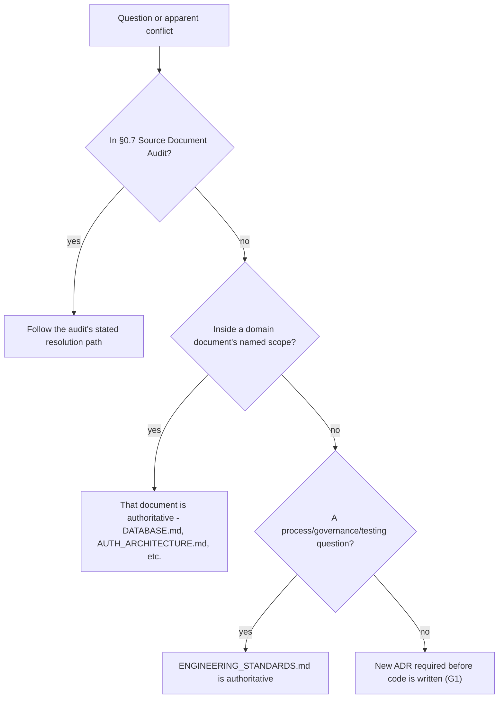

### 1.3 Decision-Making Framework (Item 6)

**Purpose.** Not every decision needs an ADR or ARB review — most engineering decisions are made locally, fast, by the engineer(s) doing the work. This framework names the three decision tiers explicitly so engineers are never guessing whether to escalate:

| Tier | Who decides | Examples | Record required |
|---|---|---|---|
| **Local** | The implementing engineer, reviewed by their PR reviewer | Function naming, internal module structure within an existing boundary, test approach | None beyond the PR itself |
| **Team** | The owning team's tech lead or CODEOWNERS group (§19) | A new internal API within an owned module, a new dependency (§257) below a cost/risk threshold | A short design note in the PR description; no ADR |
| **Architectural** | The Architecture Review Board (§1.1), per §1.4's classification | Anything that changes a decision recorded in a prior document, introduces a new cross-cutting mechanism, or has Major/Breaking classification | A formal ADR (§1.5) |

### 1.4 Architectural Change Policy (Item 7)

**Purpose.** The classification scheme this phase's mandate requires, used by every gate that asks "does this need architecture review":

| Classification | Definition | Example | ADR required? | Review authority |
|---|---|---|---|---|
| **Minor architectural change** | Extends an existing, already-recorded pattern without altering its shape (a new Domain Intelligence module following `ENTERPRISE_INTELLIGENCE_ARCHITECTURE.md` §6.0's shared template; a new feature module following `FRONTEND_ARCHITECTURE.md` §1.5's six-subfolder shape) | Adding a seventeenth Domain Intelligence module | No — cited as an instance of an existing decision | Team tier (§1.3) |
| **Major architectural change** | Introduces a new mechanism, new external dependency class, or measurably changes a documented trade-off (introducing the Phase 3 dedicated graph engine per `ENTERPRISE_INTELLIGENCE_ARCHITECTURE.md` ADR-EI-001; splitting Redis per `CLOUD_INFRASTRUCTURE.md` ADR-INFRA-008) | Triggering a phase-gated migration a prior document already named as a future decision point | Yes — a "Phased Trigger" ADR confirming the named trigger condition was actually met | ARB |
| **Breaking architectural change** | Alters or reverses a decision a prior document recorded as binding (changing `AUTH_ARCHITECTURE.md`'s single-origin API decision; changing `FRONTEND_ARCHITECTURE.md`'s CSR-only decision) | Adopting an SSR meta-framework | Yes — a full ADR including migration and rollback plan, plus sign-off from the owning document's steward (§19) | ARB + originating document's CODEOWNERS, unanimous |

**Migration and rollback requirements.** Major and Breaking changes must include, in their ADR, a stated migration plan (how existing state/code moves to the new shape) and rollback plan (how to revert if the change proves wrong in production) *before* approval — an ADR without both is returned for revision, never approved conditionally "to be determined later."

### 1.5 ADR Governance (Item 8)

**Purpose.** Every ADR in this document series (`BACKEND_ARCHITECTURE.md`'s ADR-001–009, `AI_PLATFORM_ARCHITECTURE.md`'s ADR-AI-001–020, `CLOUD_INFRASTRUCTURE.md`'s ADR-INFRA-001–012, `FRONTEND_ARCHITECTURE.md`'s ADR-FE-001–025, `ENTERPRISE_INTELLIGENCE_ARCHITECTURE.md`'s ADR-EI-001–035, and this document's own ADR-ENG series, §"Mandatory ADRs") follows one binding format and lifecycle — this document does not introduce a new format, it names the one already in consistent use and makes its lifecycle explicit.

**Format (binding, restated from every prior document's convention).** Context, Decision, Alternatives Considered, Trade-offs, Consequences, Future Review — this document's own mandate additionally requires **Security Impact, Performance Impact, Scalability Impact, and Migration Impact** as explicit fields for every new ADR from this point forward (a stricter bar this document sets for itself and for all future ADRs across the series, applied retroactively only as a documentation note, never as a requirement to rewrite the nine prior documents' existing ADRs).

**Lifecycle.** Proposed → Under Review (ARB or Team tier per §1.3–§1.4) → Accepted (binding, cited by future documents) → Superseded (a later ADR explicitly replaces it, never silently) → Deprecated (the mechanism it governs is being retired, §261).

**Diagram 2 — ADR Lifecycle**

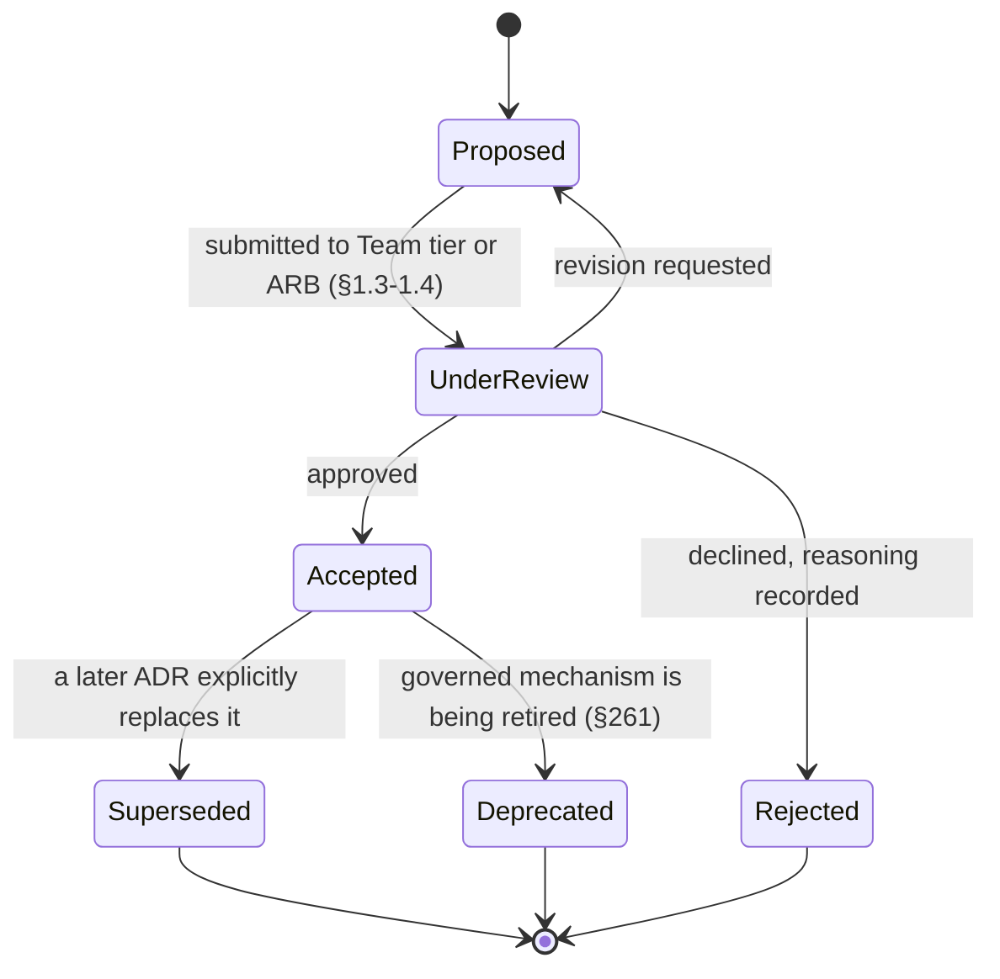

### 1.6 Technical Debt Governance (Item 9)

**Purpose.** Technical debt is tracked in a **Technical Debt Register** (a lightweight, queryable log — not a separate document, an operational artifact each team maintains) with, for every entry: owner, description, originating PR/ADR, business/engineering cost if unaddressed, and a review date. G9 ("technical debt is never invisible") is enforced by requiring every RULE-tagged EXCEPTION (§0.3) to be a Register entry by construction — an exception without a Register entry is not a valid exception.

**Data Flow.** A debt item is created either reactively (an EXCEPTION granted under time pressure) or proactively (a team identifying a shortcut it deliberately took) → reviewed at the cadence defined by its severity (a security-adjacent debt item reviews monthly; a cosmetic one reviews quarterly) → either remediated (§271, Technical Debt Retirement checklist) or explicitly re-approved for continued deferral, never silently rolled forward without re-approval.

### 1.7 Engineering Risk Management (Item 10)

**Purpose.** A lightweight risk register (distinct from the Technical Debt Register — a risk is a *possible future* cost; debt is an *already-accepted* cost) tracks named, scored risks (likelihood × impact, standard qualitative scoring) surfaced from any source: an ARB review, a postmortem (§151), a security review (§161), or a capacity-planning exercise (§216). High-scored risks are a standing input to Engineering Capacity Allocation (§265) — risk mitigation is budgeted work, not work that happens only if time remains.

**Diagram 3 — Architecture Governance End-to-End Flow**

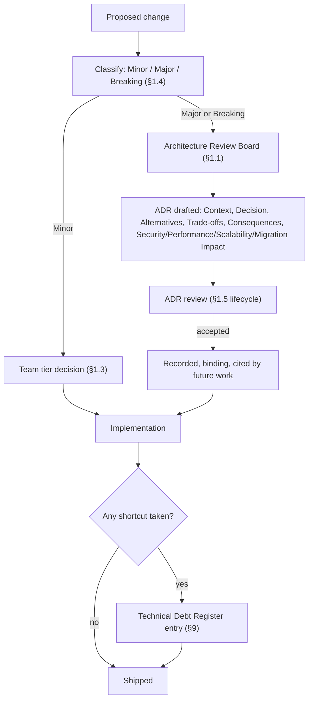

---

## Part 2 — Repository Architecture & Ownership

### 2.1 Repository Architecture (Item 11) & 2.2 Monorepo Governance (Item 12)

**Purpose & Architecture.** `ARCHITECTURE.md`'s existing npm-workspaces monorepo (`frontend/`, `backend/`, `docs/`, `database/`, `assets/`, `prompts/`) is cited as binding and is the correct shape through at least SCALE horizon (§0.5) — a monorepo keeps the ten architecture documents' cross-references (which this entire series depends on: `BACKEND_ARCHITECTURE.md` citing `AUTH_ARCHITECTURE.md`, `FRONTEND_ARCHITECTURE.md` citing `BACKEND_ARCHITECTURE.md`, and so on) enforceable as actual, atomic, cross-package commits rather than coordinated multi-repository releases. **Anti-gold-plating check (§0.4):** a polyrepo split is not adopted now because its problem (independent team release cadence) does not exist below ENTERPRISE horizon; its trigger is a specific team's release cadence being measurably blocked by unrelated teams' monorepo CI failures, not team headcount alone; the simpler alternative already in place is npm workspaces plus CODEOWNERS-scoped CI (§12.7); removal/replacement is a Major architectural change (§1.4) requiring an ARB-approved migration plan.

**Monorepo Governance rules (RULE unless noted).** One `package.json` per top-level workspace package (`frontend`, `backend`, and any future extracted package, e.g. a future `packages/shared-types`); no package may depend on another via a relative filesystem path outside its own workspace boundary — only via the workspace's declared package name, so a future extraction to a separate repository is a dependency-resolution change, not a code change (mirrors `BACKEND_ARCHITECTURE.md`'s port/adapter portability philosophy applied to repository structure itself).

### 2.3 Package Boundaries (Item 13), 2.4 Dependency Rules (Item 14) & 2.5 Dependency Direction (Item 15)

**Purpose.** Extends `FRONTEND_ARCHITECTURE.md` §1.2's five-layer dependency model and `BACKEND_ARCHITECTURE.md`'s module/bounded-context dependency rule (ADR-001–002) as the binding, monorepo-wide package-boundary law, restated once here as the umbrella rule both documents' package-level enforcement derives from: **a package/module may depend only on packages/modules at a strictly lower layer, or on `shared`/`common`, never sideways, never upward** (HARD REQUIREMENT — this is the single most load-bearing structural rule in the codebase, since every port/adapter, every bounded-context, and every feature-module boundary described across all nine prior documents assumes it holds).

### 2.6 Circular Dependency Prevention (Item 16)

**Purpose.** A circular dependency is structurally impossible under §2.5's strict-downward rule if the rule is actually enforced — Circular Dependency Prevention names the enforcement mechanism: an automated dependency-graph linter runs in CI (§125–§130) on every PR, failing the build on any detected cycle, in either the frontend's five-layer model or the backend's module/bounded-context model. This is a HARD REQUIREMENT precisely because a cycle, once merged, is exponentially harder to remove the longer it persists — caught at PR time, it is a one-file fix; caught a year later, it can be a multi-sprint untangling project.

### 2.7 Module Ownership (Item 17) & 2.8 Domain Ownership (Item 18)

**Purpose.** Every module (backend bounded context per `BACKEND_ARCHITECTURE.md`, frontend feature per `FRONTEND_ARCHITECTURE.md` §1.5, Enterprise Intelligence Domain Intelligence module per `ENTERPRISE_INTELLIGENCE_ARCHITECTURE.md` §6.0) has exactly one owning team (§238–§246), recorded in that module's own `OWNERS` metadata and enforced by §2.9's CODEOWNERS mechanism — module ownership is 1:1 at NOW/NEXT horizon and remains 1:1 at every horizon for *code* ownership even as *domain* ownership (which business capability a module serves) may span multiple modules owned by different teams collaborating via the exact cross-module contracts (`BACKEND_ARCHITECTURE.md`'s public-interface-or-Event-Bus rule, `FRONTEND_ARCHITECTURE.md`'s registry pattern, `ENTERPRISE_INTELLIGENCE_ARCHITECTURE.md`'s Cross-Agent Collaboration) those documents already specify.

### 2.9 CODEOWNERS Strategy (Item 19)

**Purpose.** A single, monorepo-root CODEOWNERS mechanism maps file-path patterns to owning teams/individuals, generated from and kept in sync with §2.7's module-ownership metadata (never hand-maintained as a second, divergent source) — every prior document's own "owning module" boundary becomes a CODEOWNERS pattern automatically: `frontend/src/features/ai-copilot/**` maps to whichever team owns the AI Copilot feature module, `backend/src/modules/billing/**` to the Billing bounded context's owning team. CODEOWNERS enforcement (§60) is what makes §1.3's Team-tier decisions and §1.4's ownership-gated Major/Breaking review actually mechanical rather than aspirational.

**Diagram 4 — Repository & Module Ownership Graph (representative slice)**

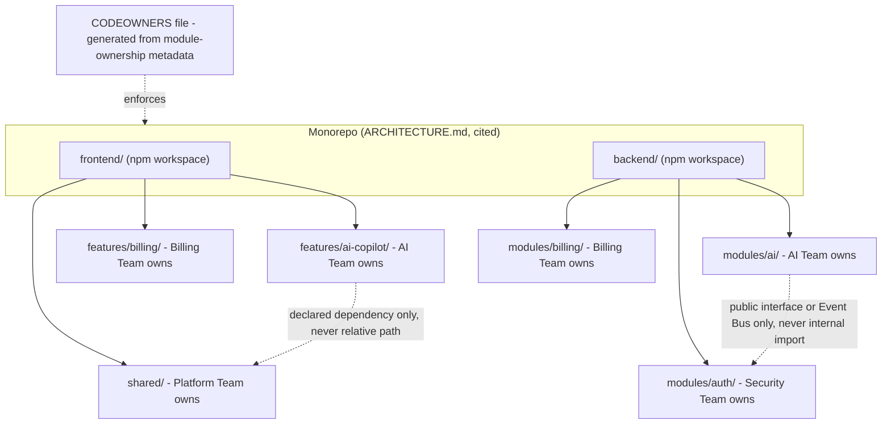

**Diagram 5 — Package Dependency Direction Enforcement**

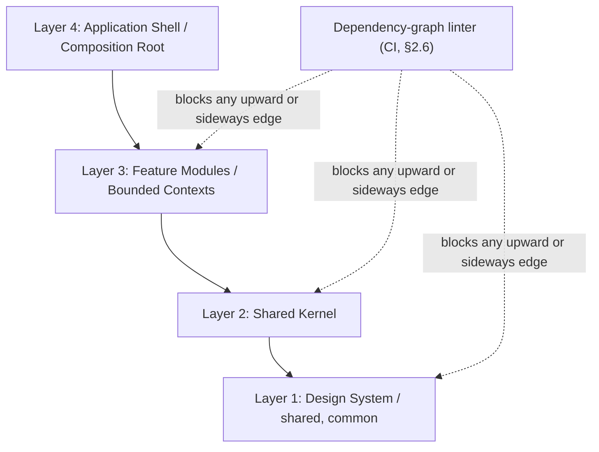

---

## Part 3 — Naming Conventions

*Common to this Part:* every naming standard below is a RULE unless marked otherwise, enforced by lint (§122) wherever mechanically checkable, and extends — never contradicts — a naming convention a prior document already established (`design-system/conventions.md` §23 for component naming, `DATABASE.md`'s Prisma-schema conventions, `API_CONTRACT.md`'s resource-naming conventions).

### 3.1 Naming Conventions (Item 20) — Overview Table

| Domain (Item #) | Convention | Example | Source of truth |
|---|---|---|---|
| Files (21) | `PascalCase.tsx` for components, `camelCase.ts` for utilities (frontend, cited from `design-system/conventions.md` §23); `camelCase.ts` throughout backend modules | `Button.tsx`, `cn.ts`, `authService.ts` | `design-system/conventions.md` §23, extended to backend here |
| Types/Interfaces (22) | `PascalCase`, no `I`-prefix; a component's prop type is `<Component>Props` (cited) | `WorkspaceMember`, `ButtonProps` | `design-system/conventions.md` §23 |
| Functions (23) | `camelCase`, verb-first for actions, `is`/`has`/`should` prefix for booleans (cited, extended from component-prop convention to all functions) | `resolveWorkspaceContext()`, `isSeatEligibleForEscalation()` | `design-system/conventions.md` §23, generalized here |
| Database (24) | `PascalCase` model names, `camelCase` fields (Prisma convention, cited from `DATABASE.md`'s shipped schema), `snake_case` only at the physical column level where Prisma's `@map` is used for legacy/external compatibility | `WorkspaceMember`, `createdAt` | `DATABASE.md` |
| API (25) | Plural, kebab-case resource paths, cited from `API_CONTRACT.md` §2's URI conventions | `/v1/workspace-members` | `API_CONTRACT.md` |
| Events (26) | `domain.entity.action` dot-namespaced, past-tense action, cited from `BACKEND_ARCHITECTURE.md`'s Event Bus design (ADR-007) and extended to `ENTERPRISE_INTELLIGENCE_ARCHITECTURE.md`'s Cross-Agent Collaboration event types | `workspace.member.invited`, `agent.decision.recommended` | `BACKEND_ARCHITECTURE.md` §13.1, extended here |
| Configuration (27) | `camelCase` in-application config keys, mapped from `SCREAMING_SNAKE_CASE` environment variables at the config-loader boundary (`BACKEND_ARCHITECTURE.md` §2.4's fail-fast loader, cited) | `db.connectionString` ← `DATABASE_URL` | `BACKEND_ARCHITECTURE.md` §2.4 |
| Environment Variables (28) | `SCREAMING_SNAKE_CASE`, namespaced by concern where ambiguity is possible (`AI_PROVIDER_OPENAI_API_KEY` not `API_KEY`) | `JWT_SIGNING_KEY`, `REDIS_URL` | New here — first binding statement of a namespacing rule beyond what `.env.example` files already imply |

**Trade-offs.** A single overview table (versus nine independent subsections) is a deliberate density choice (§0.2) — every one of these conventions was already either fully specified by a prior document (columns 20–26) or is a small, mechanically-enforceable addition (27–28) not carrying enough independent decision weight to warrant separate prose treatment.

**Diagram 6 — Naming Convention Enforcement Pipeline**

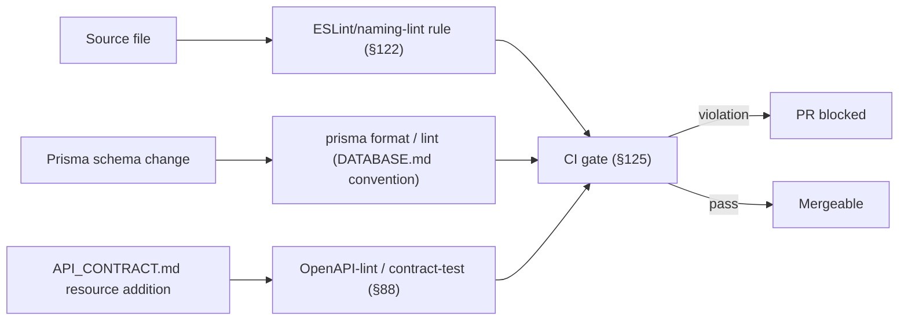

---

## Part 4 — TypeScript, Nullability & Error Handling

### 4.1 TypeScript Standards (Item 29) & 4.2 Strict Type Safety (Item 30)

**Purpose.** Resolves Source Document Audit item A4 (§0.7): TypeScript strict mode (`strict: true` and its full family — `noImplicitAny`, `strictNullChecks`, `noUncheckedIndexedAccess`) is a HARD REQUIREMENT across both `frontend/` and `backend/` workspaces, sharing the root `tsconfig.base.json` `ARCHITECTURE.md` already established as the shared strict-compiler baseline (cited). Minimum supported TypeScript version tracks the latest stable release no more than one minor version behind, reviewed at each Dependency Governance cycle (§257); minimum Node.js version is the root `README.md`'s existing `>= 20.11.0` (cited, first formally cross-referenced as binding engineering policy here, closing A4).

**Rule.** `any` is banned by lint (RULE, not HARD REQUIREMENT — a narrowly-scoped, commented `// eslint-disable` escape hatch exists for genuine third-party-type-gap cases, logged as a Technical Debt Register entry per §1.6, reviewed each time that dependency is upgraded). `unknown` plus explicit narrowing is the required alternative at every boundary where an external type is not statically known (an API response before Zod validation, `API_CONTRACT.md`/`AI_PLATFORM_ARCHITECTURE.md`-sourced payloads, cited).

### 4.3 Nullability Policy (Item 31)

**Purpose.** `strictNullChecks` (§4.2) makes `null`/`undefined` explicit at the type level; this policy governs which of the two a codebase uses for which meaning, since TypeScript itself does not enforce a convention: **`undefined`** means "not yet provided / optional" (default for optional fields, function parameters, uninitialized state); **`null`** means "explicitly, deliberately absent" (a database column intentionally cleared, a `DATABASE.md`-modeled nullable foreign key). Mixing the two for the same semantic meaning within one module is a lint-flagged GUIDELINE violation, not a HARD REQUIREMENT, since some external API shapes (an upstream provider's JSON) impose their own convention BizPilot AI's own types must faithfully mirror rather than silently normalize.

### 4.4 Error Handling Standards (Item 32), 4.5 Exception Taxonomy (Item 33) & 4.6 Result/Error Design (Item 34)

**Purpose.** Cites and generalizes `BACKEND_ARCHITECTURE.md` ADR-008 (typed domain errors only past the port boundary, raw infrastructure exceptions translated and never propagated) as the binding pattern across the entire backend, and extends it to the frontend's error-boundary tiering (`FRONTEND_ARCHITECTURE.md` §7.4–§7.5, cited) as the same philosophy applied client-side: **every error that can occur is a named, typed member of a documented taxonomy** — `ValidationError`, `AuthorizationError`, `NotFoundError`, `ConflictError`, `ExternalProviderError` (the last covering `AI_PLATFORM_ARCHITECTURE.md`'s provider-failover scenarios and Part 13's ecosystem-connector failures, cited), each mapping deterministically to an `API_CONTRACT.md` RFC 7807 error response shape (cited) — never a bare `throw new Error("something went wrong")` reaching a boundary.

**Result/Error Design.** Domain-layer and Use-Case-layer functions that can fail in an *expected*, handleable way (a validation failure, a business-rule rejection per `ENTERPRISE_INTELLIGENCE_ARCHITECTURE.md` §9.8's Business Rule Engine) return a typed Result (a discriminated union, `{ ok: true, value } | { ok: false, error }`), reserving thrown exceptions for genuinely *unexpected* failures (a database connection loss, a programming defect) — this distinction is a RULE, not a HARD REQUIREMENT, since retrofitting every existing function to the Result pattern on day one is disproportionate; new Domain/Use-Case code follows it from this document's adoption date forward, with existing code migrated opportunistically (tracked as a Technical Debt Register entry only if a specific function's exception-based error handling has caused a real incident).

---

## Part 5 — Logging, Correlation & Distributed Tracing Conventions

### 5.1 Logging Standards (Item 35) & 5.2 Structured Logging (Item 36)

**Purpose.** Fully specified by `BACKEND_ARCHITECTURE.md` §5.6 (structured JSON logs, cited) and `CLOUD_INFRASTRUCTURE.md` §11.2 (centralized collection, log scrubbing at the Collector stage, cited) — this document adds the field-schema RULE those documents left implicit: every log line includes, at minimum, `timestamp`, `level`, `service`, `correlationId` (§5.4), `workspaceId` where applicable (never omitted for a workspace-scoped operation, since its absence would make `CLOUD_INFRASTRUCTURE.md` §11.2's log-correlation-by-`workspaceId` queries incomplete), and `message` — structured as key-value fields, never string-interpolated into `message` itself.

### 5.3 Sensitive Data Redaction (Item 37)

**Purpose.** Extends `CLOUD_INFRASTRUCTURE.md` §11.2's Collector-stage scrubbing (cited) with the specific, binding redaction list every log call site is linted against: credentials, tokens, full payment/financial identifiers, and any field `ENTERPRISE_INTELLIGENCE_ARCHITECTURE.md` Part 15's Data Classification (§167) marks as Restricted — a HARD REQUIREMENT enforced by a pre-commit and CI static-analysis rule scanning for known-sensitive field names being passed to a logger call, not solely relying on the Collector-stage scrub as the only control (Defense in Depth, §0.6).

### 5.4 Correlation IDs (Item 38) & 5.5 Request IDs (Item 39)

**Purpose.** Fully specified by `FRONTEND_ARCHITECTURE.md` §13.3 (client-generated correlation ID attached to every outgoing API call) and `ENTERPRISE_INTELLIGENCE_ARCHITECTURE.md` §15.7 (extended one hop further to AI provider calls) — cited as the binding, single correlation-ID scheme spanning frontend interaction, backend request, and AI provider call. Request ID is the backend-internal-only sub-identifier (one per HTTP request, distinct from but linked to the broader correlation ID, which can span multiple requests within one user-perceived operation, e.g., a multi-step AI Employee task per `ENTERPRISE_INTELLIGENCE_ARCHITECTURE.md` §9.1).

### 5.6 Distributed Tracing Conventions (Item 40)

**Purpose.** Fully specified by `BACKEND_ARCHITECTURE.md` §5.6 (OpenTelemetry instrumentation) and `CLOUD_INFRASTRUCTURE.md` §11.3 (trace store, sampling policy — 100% sampling for errors/high-latency requests, cited) — this document's addition is a span-naming convention: `{layer}.{module}.{operation}` (e.g., `usecase.billing.createInvoice`, `agent.ai-cfo.recommendAction`), mechanically distinguishing which architectural layer (§1.2 of `FRONTEND_ARCHITECTURE.md`, or `BACKEND_ARCHITECTURE.md`'s own layering) a given span belongs to directly in trace visualizations, without requiring a lookup against source code.

**Diagram 7 — Correlation ID Propagation Across the Full Stack**

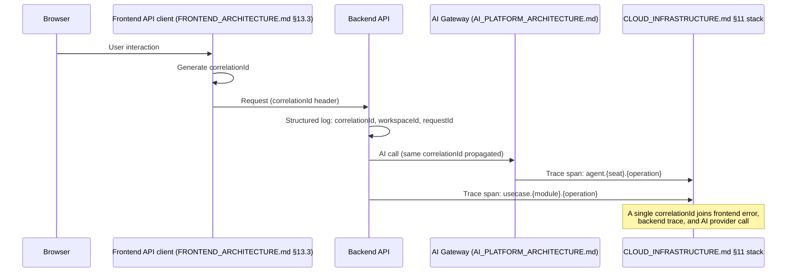

---

## Part 6 — Code Quality & Documentation Standards

### 6.1 Code Quality Standards (Item 41) & 6.2 Complexity Budgets (Item 42)

**Purpose.** Complexity is bounded by measurable budgets, not by subjective review taste — a RULE, lint-enforced, with a documented EXCEPTION path for genuinely irreducible complexity (a state-machine-shaped function that is more readable whole than artificially split, e.g., portions of `FRONTEND_ARCHITECTURE.md` §9.6's Workflow Builder canvas logic or `ENTERPRISE_INTELLIGENCE_ARCHITECTURE.md` §9.2's Decision Engine routing logic).

### 6.3 Function Complexity Limits (Item 43) & 6.4 File Complexity Limits (Item 44)

| Metric | Budget | Enforcement |
|---|---|---|
| Cyclomatic complexity per function | ≤ 10 (GUIDELINE up to 15 with reviewer sign-off, RULE hard cap at 15) | Lint |
| Function length | ≤ 60 lines (GUIDELINE) | Lint warning |
| File length | ≤ 400 lines (GUIDELINE); ≤ 600 lines (RULE hard cap, EXCEPTION requires Team-tier sign-off, §1.3) | Lint |
| Parameters per function | ≤ 4 positional (beyond that, an options object is required, RULE) | Lint |

### 6.5 Dependency Complexity (Item 45)

**Purpose.** Extends §2.4–§2.6's structural dependency rules with a *quantitative* budget: a module's fan-out (number of distinct modules it depends on) and fan-in (number of modules depending on it) are both tracked; a module with unusually high fan-in is a strong signal it should be promoted toward `shared`/`common` (mirroring `FRONTEND_ARCHITECTURE.md` §2.5's "promote on second use" policy, cited, generalized here to backend modules), a module with unusually high fan-out is a signal its own boundary is drawn wrong and is flagged for Team-tier review (§1.3), not automatically blocked.

### 6.6 Code Duplication Policy (Item 46)

**Purpose.** Duplication detection runs in CI (a token-similarity scanner) as a GUIDELINE signal, never a hard block — consistent with `FRONTEND_ARCHITECTURE.md` §2.5's explicit rejection of premature abstraction (promote only on genuine second use), three near-identical blocks below a configured similarity threshold are surfaced for review, not auto-flagged as violations, since a false-positive block on legitimately-similar-but-conceptually-distinct code would directly contradict that document's own YAGNI discipline.

### 6.7 Dead Code Policy (Item 47)

**Purpose.** Unreferenced exports, unreachable branches, and unused dependencies are detected in CI (RULE) and block merge — dead code is a Technical Debt Register liability with zero offsetting value, unlike duplication, which sometimes represents a deliberate, reasoned trade-off (§6.6). The one sanctioned exception: code behind a Feature Flag (`BACKEND_ARCHITECTURE.md` §7.7, cited) that is currently dark but scheduled for near-term rollout is not "dead," and the dead-code scanner is configured to recognize flag-gated branches as live.

### 6.8 Comments & Documentation (Item 48) & 6.9 Documentation Standards (Item 49)

**Purpose.** Restates `FRONTEND_ARCHITECTURE.md`'s and every prior document's own default-to-no-comments discipline as binding platform-wide: a comment is written only when it captures a non-obvious *why* (a workaround, a hidden constraint, a citation to the specific prior-document decision the code implements) — never a restatement of *what* well-named code already shows. Every module's public interface (the `index.ts` boundary `BACKEND_ARCHITECTURE.md` and `FRONTEND_ARCHITECTURE.md` both already require) carries a short, one-paragraph module-level doc comment stating its owning bounded context/feature and linking to the architecture document section that governs it — this is the one place documentation is required, not optional, since it is a module's entire externally-visible contract.

### 6.10 API Documentation (Item 50)

**Purpose.** Generated, not hand-maintained, from `API_CONTRACT.md`'s OpenAPI-conformant conventions (cited) plus inline type/schema annotations — API documentation drift (docs saying one thing, the contract implementation doing another) is structurally prevented by generation rather than caught by review, the same "define once, derive everywhere" discipline this entire document series applies repeatedly.

### 6.11 Architecture Documentation (Item 51)

**Purpose.** The ten documents in this series (plus this one) *are* the architecture documentation — this item's binding rule is narrower and more operational: any Major or Breaking architectural change (§1.4) updates the relevant prior document's affected section *in the same PR* as the code change, never as a follow-up "docs debt" ticket — an architecture document that lags the code it describes has failed at its one job, and this document treats documentation currency as a merge-blocking concern for architecturally-significant changes specifically (not for every PR, which would be disproportionate for Minor changes).

### 6.12 Inline Documentation (Item 52)

**Purpose.** JSDoc/TSDoc-style inline documentation is required (RULE) only for public exports of `shared`/`common` packages (§2.3) — the highest-fan-in, most-reused code in the system, where a consumer cannot reasonably be expected to read the implementation to understand the contract — and is explicitly not required (RECOMMENDATION only) for feature-internal or module-internal code, consistent with §6.8's default-to-no-comments philosophy applied at the function-doc granularity too.

**Diagram 8 — Code Quality Gate at PR Time**

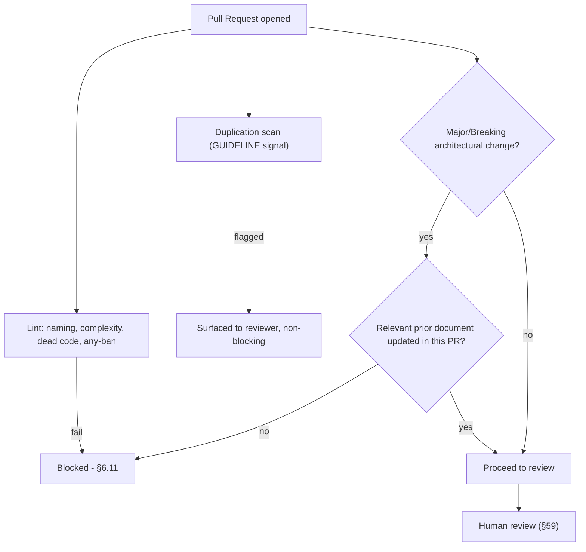

---

## Part 7 — Git Strategy, Branching & Pull Request Standards

### 7.1 Git Strategy (Item 53) & 7.2 Branching Strategy (Item 54)

**Purpose.** Fully specified by `CLOUD_INFRASTRUCTURE.md` §6.1 (trunk-based development, short-lived feature branches, no persistent environment branches, cited) — restated here as binding for `docs/` and this document series itself, not only application code: an architecture-document change follows the identical PR/review path as a code change, since these documents are, per §6.11, load-bearing engineering artifacts.

### 7.3 Commit Standards (Item 55) & 7.4 Commit Message Convention (Item 56)

**Purpose.** Conventional Commits format (`type(scope): summary`, e.g., `feat(billing): add invoice line-item editor`, `fix(auth): correct refresh-token race condition`) is a RULE, machine-parsed to auto-generate the Changelog (§66) and to classify PR size/risk (§7.6) — types are constrained to a fixed, documented set (`feat`, `fix`, `refactor`, `docs`, `test`, `chore`, `perf`, `security`) so tooling can rely on them exhaustively rather than pattern-matching free text.

### 7.5 Pull Request Standards (Item 57) & 7.6 PR Size Policy (Item 58)

**Purpose.** A PR template (enforced, not merely suggested) requires: what changed, why, which prior document(s) it touches (if any), test coverage added, and rollback consideration. PR size is a GUIDELINE, not a hard block (a large, mechanical rename should not be penalized identically to a large, risky logic change) — but a PR exceeding a configured diff-size threshold requires an explicit size-justification note and, per §59, an additional reviewer.

### 7.7 Review Requirements (Item 59) & 7.8 CODEOWNERS Enforcement (Item 60)

**Purpose.** Minimum one approval from a CODEOWNERS-matched reviewer (§2.9) is a HARD REQUIREMENT for merge to the trunk branch — CODEOWNERS enforcement is mechanical (a PR cannot merge without a matching-team approval, no override except the documented emergency path, §255). Architecturally-significant PRs (§1.4's Major/Breaking classification) additionally require ARB sign-off, layered on top of, not instead of, ordinary CODEOWNERS review.

### 7.9 Merge Strategy (Item 61)

**Purpose.** Squash-merge to trunk (cited from `CLOUD_INFRASTRUCTURE.md` §6.1, generalized as the platform-wide default) — keeps trunk history one commit per logical change, matching the Conventional Commit (§7.4) that drives changelog generation; a rebase-merge exception exists (RULE with EXCEPTION) for a PR whose author deliberately structured multiple, independently-reviewable Conventional Commits worth preserving individually.

### 7.10 Protected Branches (Item 62), 7.11 Release Branches (Item 63) & 7.12 Hotfix Strategy (Item 64)

**Purpose.** The trunk branch is protected (no direct push, no force-push, §7.7's review requirement enforced by the platform, not by convention) — restating `CLOUD_INFRASTRUCTURE.md` §6.1's rejection of persistent release branches (GitFlow) as binding here too: there are no long-lived release branches. A hotfix (§9's emergency deployment path, §255) is a normal trunk-based PR expedited through review urgency, never a special branch topology — the *speed* of review changes under §255's Emergency Change Policy, the *mechanism* (trunk-based PR) does not.

**Diagram 9 — Git & PR Lifecycle**

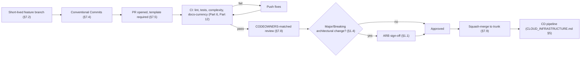

---

## Part 8 — Versioning, Feature Flags & Progressive Delivery

### 8.1 Semantic Versioning (Item 65) & 8.2 Changelog Governance (Item 66)

**Purpose.** Fully specified by `CLOUD_INFRASTRUCTURE.md` §6.4 (three independent versioning schemes — API version per `API_CONTRACT.md`, immutable Git-SHA image tags, and platform-release SemVer — deliberately decoupled, cited) — this document adds only the Changelog generation mechanism: auto-generated from Conventional Commits (§7.4) grouped by type, published per platform release tag, human-edited only to add release-note narrative context a raw commit-type grouping cannot express (a RECOMMENDATION, not required for every release).

### 8.3 Feature Flags (Item 67), 8.4 Progressive Delivery (Item 68) & 8.5 Canary Releases (Item 69)

**Purpose.** Fully specified by `BACKEND_ARCHITECTURE.md` §7.7's `FeatureFlagEngine`, `CLOUD_INFRASTRUCTURE.md` §5.1's canary-by-default deployment strategy, and `FRONTEND_ARCHITECTURE.md` §4.8/§6.6's UI-visible flag rendering (all cited, none redesigned) — this document's addition is the engineering-process rule those documents implied but did not state as a merge gate: **any code path guarded by a feature flag must have its flag's default state and rollout owner recorded at PR merge time**, not left implicit — a flag with no recorded owner is a Technical Debt Register violation (§1.6) the moment it merges, since an unowned flag is precisely how "temporary" flags accumulate indefinitely (§67's own long-term maintainability risk, addressed by making ownership a merge-time fact, not a later audit finding).

### 8.6 Rollback Standards (Item 70)

**Purpose.** Fully specified by `CLOUD_INFRASTRUCTURE.md` §6.5 (Git-revert-of-manifest rollback, GitOps-reconciled, automated on canary health-gate breach, cited) — this document's addition is the *code-level* precondition every PR must satisfy for that infrastructure-level rollback to actually be safe: any migration accompanying the PR follows §9.3's expand/contract pattern (so the prior code version remains valid against the schema after rollback), and any mutation follows `BACKEND_ARCHITECTURE.md` §8.5's idempotency-key pattern (so a rolled-back-then-reapplied action cannot double-execute) — rollback safety is reviewed as an explicit PR checklist item (§ "Mandatory Engineering Checklists," Production Deployment checklist) precisely because `CLOUD_INFRASTRUCTURE.md`'s infrastructure-level rollback mechanism assumes, but cannot itself verify, that the application code it reverts to is still schema-compatible.

**Diagram 10 — Feature Flag Lifecycle**

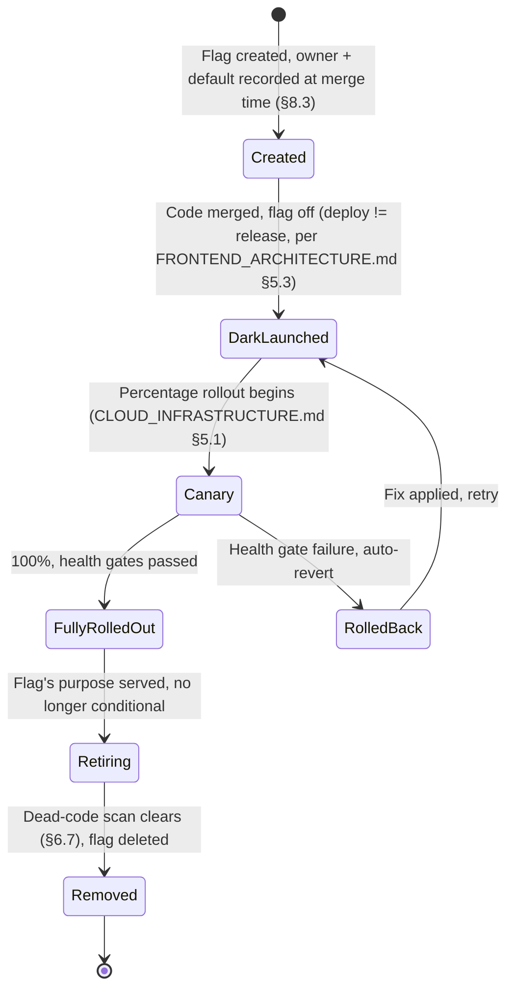

---

## Part 9 — Data & API Evolution Governance

### 9.1 Database Migration Governance (Item 71), 9.2 Backward-Compatible Migrations (Item 72) & 9.3 Expand-and-Contract Pattern (Item 73)

**Purpose.** Fully specified by `CLOUD_INFRASTRUCTURE.md` §8.3 (Prisma Migrate as a pre-deploy CI/CD Job gate, expand/contract discipline for canary-compatible schema changes, cited) — this document's addition is the review-gate mechanics: every migration PR requires a second, migration-specialist reviewer (in addition to §7.7's ordinary CODEOWNERS review) at SCALE horizon and beyond (§0.5) — at NOW/NEXT horizon, the single reviewer bar of §7.7 suffices, since the primary risk (a destructive migration reaching production) is already fully mitigated by `CLOUD_INFRASTRUCTURE.md` §8.3's pipeline gate regardless of team size.

### 9.4 Data Migration Safety (Item 74) & 9.5 Schema Change Governance (Item 75)

**Purpose.** A destructive schema change (a column drop, a type-narrowing change) is classified as a Major or Breaking architectural change (§1.4) unconditionally — never a Minor one, regardless of how small the diff looks — since `DATABASE.md` is the single source of truth for the entire platform (`BACKEND_ARCHITECTURE.md` §15.6, cited repeatedly across this series) and a mistaken destructive migration has no code-level rollback, only `CLOUD_INFRASTRUCTURE.md` §8.2's backup-restore path, which is materially slower and lossier than a code revert.

### 9.6 API Evolution (Item 76), 9.7 API Compatibility (Item 77) & 9.8 Deprecation Policy (Item 78)

**Purpose.** Fully specified by `API_CONTRACT.md` §2's URI versioning (cited) — this document's addition is the deprecation *timeline* policy `API_CONTRACT.md` did not itself set: a deprecated API version is supported for a minimum notice period (RULE, duration set per-release based on the change's Enterprise-customer impact, never shorter than one full platform release cycle, §8.1) with deprecation communicated via the `API_CONTRACT.md`-conformant response headers that document's error/response design already anticipates supporting extension fields for.

### 9.9 Versioning Strategy (Item 79)

**Purpose.** Not a fourth, independent versioning scheme — this item is fully answered by §8.1's citation of `CLOUD_INFRASTRUCTURE.md` §6.4's three-scheme decoupling (API version, image tag, platform release version), restated here only to confirm it is deliberately not duplicated.

### 9.10 Event Contract Governance (Item 80), 9.11 Event Compatibility (Item 81) & 9.12 Contract Testing (Item 82)

**Purpose.** Extends `BACKEND_ARCHITECTURE.md` §13.1's Kafka-compatible event-schema design (ADR-007, cited) with a binding compatibility rule: an event schema change is additive-only (new optional fields) within a given event-type version — any breaking change to an event's shape requires a new, co-existing event-type version (`domain.entity.action.v2`, extending §3.1's `domain.entity.action` naming convention with an explicit version suffix only when a breaking change is unavoidable), never an in-place mutation of an existing event type's consumers might already depend on. Contract Testing (§88, detailed in Part 10) is the automated mechanism verifying every event producer and consumer agree on a given event-type version's current shape before merge.

**Diagram 11 — Database Migration Lifecycle**

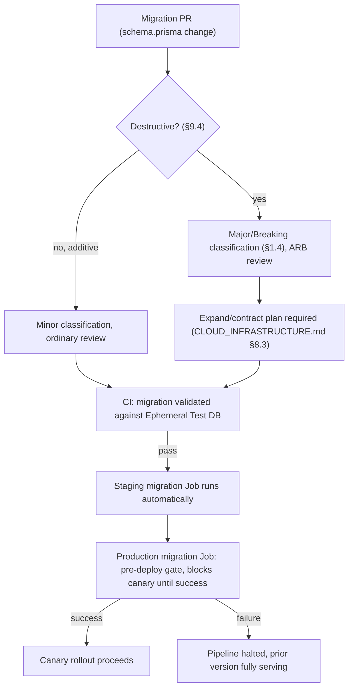

**Diagram 12 — API & Event Contract Evolution**

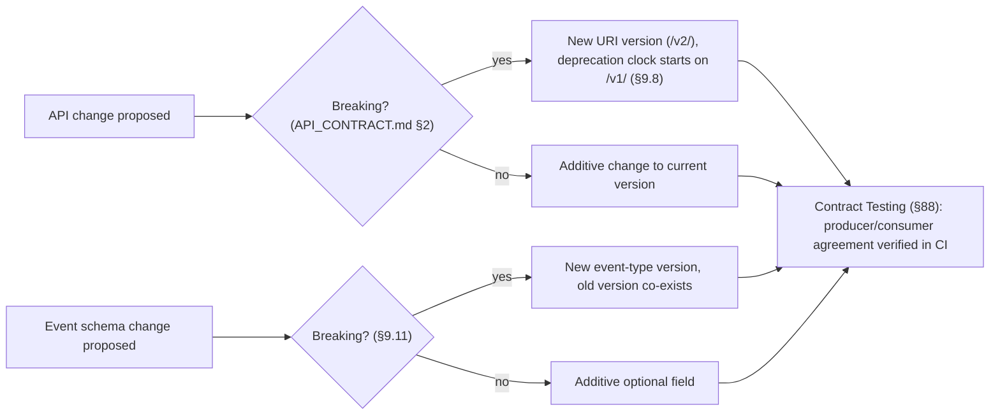

---

## Part 10 — Testing Philosophy

### 10.1 Testing Philosophy (Item 83)

**Purpose.** A test exists to answer one question: *"if this breaks, will we know before a user does?"* — every testing type below (§10.2–§10.22) is justified against that question, not adopted because a testing pyramid diagram conventionally includes it (§0.4's anti-gold-plating framework applied to testing specifically). BizPilot AI's testing philosophy has one binding addition beyond conventional software testing: **AI-generated and AI-decided behavior (`AI_PLATFORM_ARCHITECTURE.md`'s Agent Runtime, `ENTERPRISE_INTELLIGENCE_ARCHITECTURE.md`'s AI Workforce) is evaluated with the same rigor as deterministic code, using different techniques suited to probabilistic output — "it seems to work" is never an accepted quality bar for either category** (G6).

### 10.2 Testing Pyramid (Item 84)

**Diagram 13 — Testing Pyramid & Test Execution Pipeline**

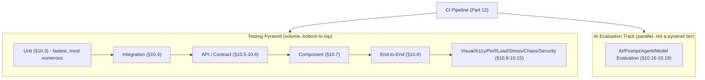

### 10.3 Unit Testing (Item 85)

**Purpose.** Every Domain-layer and Use-Case-layer function (`BACKEND_ARCHITECTURE.md`'s layering, cited) and every pure/presentational component (`FRONTEND_ARCHITECTURE.md` §2.4's container/presentational split, cited) is unit-testable in isolation by construction — the architecture's own separation of concerns is what makes this tractable rather than aspirational. RULE: no PR introducing new Domain/Use-Case logic merges without unit coverage of its branches; GUIDELINE (not RULE) for Presentational-tier UI, where visual/interaction correctness is often better verified by Component (§10.7) or Visual Regression (§10.9) testing than unit assertions.

### 10.4 Integration Testing (Item 86)

**Purpose.** Runs against `CLOUD_INFRASTRUCTURE.md` §2.1's Ephemeral Test environment (a real, disposable Postgres instance, cited) specifically because `DATABASE.md`'s constraint and migration-safety guarantees are only actually verified against a real database, never a mock — restating that document's own stated rationale for the Ephemeral Test tier's existence.

### 10.5 API Testing (Item 87) & 10.6 Contract Testing (Item 88)

**Purpose.** API Testing verifies a live endpoint's behavior against `API_CONTRACT.md`'s conventions end-to-end (status codes, RFC 7807 error shape, pagination). Contract Testing (also cited at §9.12 for events) verifies, at the *schema* level, that a producer (backend) and every consumer (frontend, another backend module, an external webhook subscriber) agree on shape — run in CI against the OpenAPI-generated contract (§6.10), catching a breaking change before it reaches a human reviewer's attention, not relying on manual review to notice a subtle field-type change.

### 10.7 Component Testing (Item 89)

**Purpose.** Frontend Business Components and Patterns (`FRONTEND_ARCHITECTURE.md` §2.1–§2.2, cited) are tested in isolation with mocked Server State (§5.2 of that document) — verifying rendering/interaction logic without a live backend, distinct from and faster than End-to-End testing (§10.8), which verifies the same surfaces against the real, integrated stack.

### 10.8 End-to-End Testing (Item 90)

**Purpose.** Runs against Staging (`CLOUD_INFRASTRUCTURE.md` §2.1, cited) for the smallest set of genuinely critical, cross-system user journeys (`PRD.md`'s stated golden paths) — E2E suites are deliberately kept small (the top of the pyramid, §10.2) since they are the slowest and most brittle category; broad coverage is the job of the lower tiers, E2E exists only to catch cross-system integration failures no lower tier can see.

### 10.9 Visual Regression Testing (Item 91)

**Purpose.** Screenshot-diff testing against `design-system/foundations.md`'s token-driven visual language (cited) — catches an unintended visual change (a token misuse, a broken responsive breakpoint per `FRONTEND_ARCHITECTURE.md` §3.3) that functional tests structurally cannot detect. GUIDELINE-tier for most components; RULE-tier for the shipped Design System's own Primitive layer specifically, since a visual regression there has platform-wide blast radius (§3.1 of this document's citation of `FRONTEND_ARCHITECTURE.md` §3.1's design-system-as-reviewed-layer discipline).

### 10.10 Accessibility Testing (Item 92)

**Purpose.** Fully specified by `FRONTEND_ARCHITECTURE.md` §11.1 (axe-core-equivalent automated lint as a CI merge gate, mandatory manual review for novel interactive surfaces like the Workflow Builder canvas, cited) — restated as binding here, not re-derived.

### 10.11 Performance Testing (Item 93), 10.12 Load Testing (Item 94) & 10.13 Stress Testing (Item 95)

**Purpose.** Fully specified by `CLOUD_INFRASTRUCTURE.md` §15.2 (synthetic load tests against Staging, required before any Production launch milestone and capacity-relevant architecture change, cited) — Load Testing verifies behavior at expected peak; Stress Testing (this document's addition — `CLOUD_INFRASTRUCTURE.md` named the practice, this document distinguishes the sub-type) verifies behavior *beyond* expected peak, specifically validating that degradation is graceful (§10.14's chaos-adjacent failure-mode verification) rather than catastrophic, and that autoscaling (`CLOUD_INFRASTRUCTURE.md` §12.2, cited) recovers correctly once load subsides.

### 10.14 Chaos Testing (Item 96)

**Purpose.** Fully specified by `CLOUD_INFRASTRUCTURE.md` §15.3 (maturity-gated, deferred to SCALE horizon and beyond, Staging-first, cited) — restated as binding, with this document's addition being the *test-writing* discipline: every chaos experiment is written as a reusable, re-runnable test case (not a one-off manual exercise), building a permanent regression suite for failure-mode assumptions over time, consistent with `BACKEND_ARCHITECTURE.md` §9's own already-named "kill a random instance mid-refresh-rotation" test case as the founding example of this pattern.

### 10.15 Security Testing (Item 97)

**Purpose.** Covers both automated (§12's dependency/secret/container scanning) and manual (§161's Security Review, penetration testing at ENTERPRISE horizon and beyond) layers — detailed fully in Part 15 (Security Engineering) rather than duplicated here; this item exists in the Testing Philosophy taxonomy specifically to make explicit that security testing is a testing discipline with the same CI-gate treatment as any other category, not a separate, later audit process (restates §0.6's Secure-by-Design posture as a testing-pyramid citizen).

### 10.16 AI Evaluation Testing (Item 98), 10.17 AI Regression Testing (Item 99) & 10.18 Prompt Regression Testing (Item 100)

**Purpose.** A dedicated, parallel evaluation track (Diagram 13) alongside the conventional pyramid, run against a maintained **Evaluation Dataset** (§10.21) of representative inputs with known-good expected outputs or scoring rubrics — never against live production traffic as the primary signal. AI Evaluation Testing verifies a given AI surface (an `AI_PLATFORM_ARCHITECTURE.md` Prompt/Agent, an `ENTERPRISE_INTELLIGENCE_ARCHITECTURE.md` AI Employee) meets its quality bar *before* it ships; AI Regression Testing re-runs that same evaluation on every relevant change (a prompt edit, a model/provider swap per `AI_PLATFORM_ARCHITECTURE.md`'s Provider Router) to catch a quality regression a purely functional test cannot see, since the code may be "correct" (it compiles, it calls the right API) while the *output quality* silently degrades. Prompt Regression Testing is the narrowest, most frequent instance of this — every `AI_PLATFORM_ARCHITECTURE.md` §3 Prompt Registry change runs the full Evaluation Dataset before merge, a HARD REQUIREMENT (never optional, given how easily a well-intentioned prompt edit can silently degrade quality on inputs not manually spot-checked).

### 10.19 Agent Evaluation (Item 101) & 10.20 Model Evaluation (Item 102)

**Purpose.** Agent Evaluation extends AI Evaluation Testing to `AI_PLATFORM_ARCHITECTURE.md` §9's full Planner→Executor→Critic→Reflection loop and `ENTERPRISE_INTELLIGENCE_ARCHITECTURE.md`'s AI Employee Mandates — scored not only on final output correctness but on reasoning-trace quality (E5's explainability requirement, restated here as a *tested*, not merely *hoped-for*, property) and tool-use appropriateness (did the agent call the right tool, with the right permission scope, per `AUTH_ARCHITECTURE.md`'s RBAC). Model Evaluation is the narrower case of comparing a candidate model/provider swap's output quality, cost, and latency against the currently-deployed one (feeding `AI_PLATFORM_ARCHITECTURE.md`'s Provider Router selection and this document's §188 Model Rollout gate) before any traffic shifts.

### 10.21 Dataset Governance (Item 103)

**Purpose.** Every Evaluation Dataset (§10.16) is versioned, reviewed for representativeness (does it actually reflect the input distribution `PRD.md`'s personas and `ENTERPRISE_INTELLIGENCE_ARCHITECTURE.md`'s Domain Intelligence signals produce, not merely convenient synthetic examples), and periodically refreshed from real (anonymized, per `AUTH_ARCHITECTURE.md` §6's data-minimization posture, cited) production patterns — a stale evaluation dataset is a Technical Debt Register item, since it silently degrades the entire AI Regression Testing discipline's ability to catch real-world failure modes.

### 10.22 Test Data Management (Item 104)

**Purpose.** Test data is synthetic or anonymized by default, RULE, never a raw production data copy — restating `CLOUD_INFRASTRUCTURE.md` §2.1's own Staging-environment data policy as binding for every lower environment tier too (Local, Ephemeral Test), and extending `AI_PLATFORM_ARCHITECTURE.md`'s and `ENTERPRISE_INTELLIGENCE_ARCHITECTURE.md`'s data-minimization principles to the testing discipline specifically — a HARD REQUIREMENT, since production-data-as-test-data is both a privacy violation and, per G10, precisely the kind of shortcut this document's Constitution (§ final section) singles out as never acceptable.

**Diagram 14 — AI Evaluation & Regression Testing Pipeline**

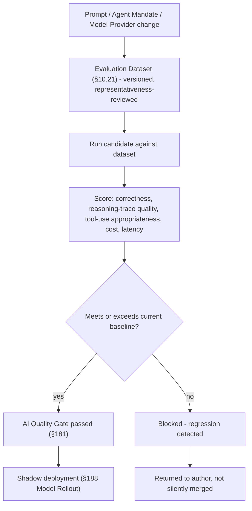

---

## Part 11 — Developer Environment & Tooling

### 11.1 Test Environment Strategy (Item 105)

**Purpose.** Fully specified by `CLOUD_INFRASTRUCTURE.md` Part 2's five-tier model (Local, Ephemeral Test, Staging, Production, Enterprise-Isolated, cited) — this document's contribution is naming it the single binding environment taxonomy for every testing type in Part 10, so no team invents a sixth, locally-named environment concept.

### 11.2 Local Development (Item 106), 11.3 Developer Environment (Item 107) & 11.4 Environment Parity (Item 108)

**Purpose.** Fully specified by `CLOUD_INFRASTRUCTURE.md` §2.1 (container-compose orchestration running the identical images CI builds, cited) — Environment Parity is the binding invariant this enables: a bug that only reproduces in Staging or Production and never Locally is, by definition, an environment-parity gap, tracked as a Technical Debt Register item and prioritized proportional to how often it recurs (a single occurrence is noted; a recurring pattern triggers a Team-tier review of what Local is missing).

### 11.5 Local Infrastructure (Item 109) & 11.6 Development Containers (Item 110)

**Purpose.** Local Postgres/Redis run as containers (cited, `CLOUD_INFRASTRUCTURE.md` §2.1), never as natively-installed services — this document's binding addition: a Dev Container specification (a reproducible, versioned container image matching the CI runner's own base image, §12.2) is the RECOMMENDATION-tier default for onboarding (§247), lowering the "works on my machine" risk class to near-zero for any engineer who adopts it, without mandating it for engineers with an already-working native setup (a GUIDELINE, not a RULE — forcing container-based development on every engineer regardless of their own workflow preference is disproportionate to the problem it solves at NOW/NEXT horizon).

### 11.7 Seed Data (Item 111)

**Purpose.** The `database/` directory `ARCHITECTURE.md` already names (cited) holds versioned seed scripts — realistic-shaped, synthetic (§10.22) data covering every major `DATABASE.md` entity and, from `ENTERPRISE_INTELLIGENCE_ARCHITECTURE.md`'s Phase 1 onward, at least one seeded AI Employee seat per role (§2.3 of that document) so local development can exercise the AI Workforce without live provider calls (§11.9's Fake Services).

### 11.8 Mocking Policy (Item 112), 11.9 Fake Services (Item 113) & 11.10 Service Virtualization (Item 114)

**Purpose.** Three distinct fidelity tiers, chosen per use case, never one-size-fits-all: **Mocking** (a function/module-level test double, used in Unit Testing, §10.3) — cheapest, lowest fidelity; **Fake Services** (a lightweight, in-process implementation of an external dependency's port, e.g., a fake `AIProviderPort` returning deterministic canned responses for `AI_PLATFORM_ARCHITECTURE.md`'s Provider Router in local/CI environments, avoiding real provider cost and nondeterminism) — used in Integration and Component Testing; **Service Virtualization** (a recorded/replayed real-provider interaction, used sparingly, only where a Fake Service's simplification would hide a real integration risk, e.g., verifying `API_CONTRACT.md`-conformant error-shape translation from a specific external provider's actual error responses). The choice among the three is a GUIDELINE per test, not a RULE — over-mocking (fidelity too low for the risk being tested) and over-virtualizing (fidelity/cost too high for the risk) are both named anti-patterns reviewers watch for.

### 11.11 Developer CLI (Item 115), 11.12 Project Scaffolding (Item 116) & 11.13 Code Generation (Item 117)

**Purpose.** A single, monorepo-root CLI (RECOMMENDATION at NOW horizon, RULE by NEXT horizon once more than a handful of engineers are onboarding regularly) wraps the common developer workflows already implied across this series — spinning up `CLOUD_INFRASTRUCTURE.md` §2.1's Local stack, scaffolding a new `FRONTEND_ARCHITECTURE.md` §1.5-shaped feature module or `BACKEND_ARCHITECTURE.md` bounded context from a template, and generating `API_CONTRACT.md`-conformant client/server types from the OpenAPI contract (§6.10) — every generated artifact traces to an already-decided pattern in a prior document, the CLI automates applying that pattern correctly, it never invents a new one.

**Anti-gold-plating check (§0.4).** Why it exists: manual scaffolding drifts from the documented pattern over time as engineers copy-paste and half-adapt an older example. What problem it solves: pattern drift, onboarding friction. When necessary: once a second engineer needs to scaffold a new module (NOW→NEXT boundary). Trigger: observed drift between two recently-created modules' folder shapes. Simpler alternative: a well-maintained `docs/`-linked template folder plus copy-paste, sufficient for a solo founder. Removal condition: if code generation itself becomes a maintenance burden exceeding the drift it prevents, which is monitored via CLI-usage telemetry (§237).

### 11.14 Automated Refactoring (Item 118)

**Purpose.** Codemods (automated, scripted refactors) are the RULE-tier mechanism for any RENAME or STRUCTURAL move touching more than a small, configured number of call sites (a naming-convention correction discovered late, a module boundary move per §2.7) — never a hand-executed, PR-by-PR migration for that class of change, since a partially-completed manual rename is a worse state than the original inconsistency it was meant to fix.

### 11.15 Developer Tooling (Item 119) & 11.16 IDE Standards (Item 120)

**Purpose.** A shared, versioned editor-configuration file (format-on-save, linked lint/type-check extensions) is committed to the repository root (RECOMMENDATION, not RULE — an engineer's choice of editor is not centrally mandated, only the *configuration* of whichever editor they use, to the extent that editor supports shared config).

### 11.17 Formatting (Item 121), 11.18 Linting (Item 122) & 11.19 Type Checking (Item 123)

**Purpose.** Fully specified by `ARCHITECTURE.md`'s already-shipped Prettier + ESLint (flat config) + strict TypeScript baseline (cited) — restated as HARD REQUIREMENT CI gates, non-negotiable, auto-fixable where the tooling supports it (formatting) and blocking where it does not (lint errors, type errors).

### 11.20 Pre-Commit Validation (Item 124)

**Purpose.** A local pre-commit hook runs the fast subset of §11.17–§11.19's checks (formatting, lint, type-check on changed files only — never the full test suite, which belongs in CI, §125, to avoid making every local commit slow) — a RULE for the hook's *existence and availability*, a GUIDELINE for whether an individual engineer keeps it enabled versus relying on CI to catch the same issues slightly later, since CI (§125) is the actual, non-bypassable gate regardless of local hook configuration.

**Diagram 15 — Developer Onboarding Flow**

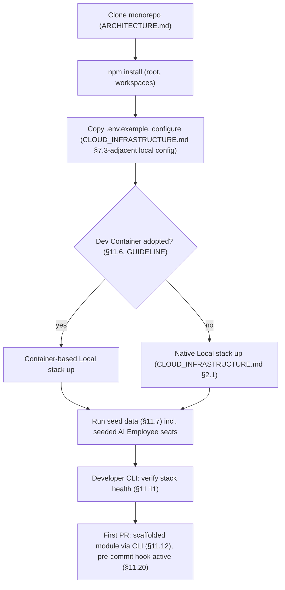

**Diagram 16 — Mocking / Fake Service / Service Virtualization Fidelity Spectrum**

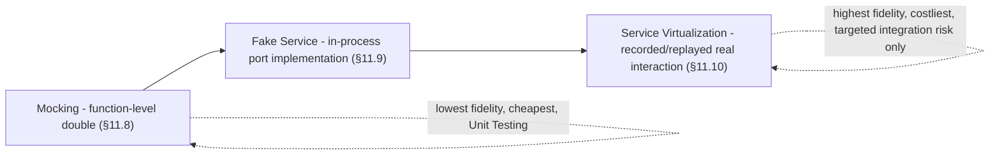

---

## Part 12 — CI Architecture & Supply Chain Security

### 12.1 CI Architecture (Item 125) & 12.2 CI Pipeline (Item 126)

**Purpose.** Fully specified by `CLOUD_INFRASTRUCTURE.md` §5.2 (typecheck → lint → unit/integration tests on every PR; image build/CVE-scan/push on trunk merge, cited) — this document's addition is the explicit, ordered gate list every PR's CI run executes, in order (fail-fast, cheapest checks first): (1) formatting/lint (§11.17–§11.18), (2) type-check (§11.19), (3) dependency-graph/circular-dependency check (§2.6), (4) unit tests (§10.3), (5) integration tests (§10.4), (6) contract tests (§10.6), (7) complexity/dead-code/duplication scans (§6.2–§6.7), (8) security scanning (§12.7–§12.10), (9) architecture-documentation-currency check (§6.11).

### 12.3 Parallel CI (Item 127), 12.4 Build Caching (Item 128) & 12.5 Test Caching (Item 129)

**Purpose.** Test parallelization and dependency/build-layer caching are RULE-tier once pipeline duration measurably exceeds a configured developer-experience budget (a specific, trackable Engineering Metric, §231) — restating `CLOUD_INFRASTRUCTURE.md` §5.2's own stated rationale ("slow pipelines get manually worked around, which is itself a process-health signal") as this document's binding trigger condition, per §0.4's anti-gold-plating framework: NOW horizon needs neither (a small test suite runs fast serially); the signal that triggers adoption is pipeline duration crossing the budget, not a calendar date or team-size milestone alone.

### 12.6 Artifact Management (Item 130)

**Purpose.** Fully specified by `CLOUD_INFRASTRUCTURE.md` §4.1 (private container registry, immutable Git-SHA tags, cited) — this document's addition is retention policy: build artifacts (container images, generated API clients) are retained per a lifecycle policy tied to `CLOUD_INFRASTRUCTURE.md` §6.5's rollback window (an image must remain available at least as long as a rollback to it is plausible), never retained indefinitely by default, per §9.1's storage-lifecycle-tiering philosophy applied to build artifacts specifically.

### 12.7 Security Scanning (Item 131), 12.8 Dependency Scanning (Item 132), 12.9 Secret Scanning (Item 133), 12.10 License Compliance (Item 134) & 12.11 Container Scanning (Item 135)

**Purpose.** Fully specified by `BACKEND_ARCHITECTURE.md`'s and `CLOUD_INFRASTRUCTURE.md` §4.1's CVE-scan CI gate (cited, HARD REQUIREMENT: high/critical findings block merge, non-overridable by default) — this document's additions: **Secret Scanning** runs on every commit (not only PRs) as a HARD REQUIREMENT, since a secret committed and later force-removed from a branch head may still exist in Git history, making prevention (pre-commit + CI) strictly more valuable than post-hoc remediation, restating §0.6's "Secrets Never in Source" posture as a testing-pyramid citizen exactly as §10.15 does for general security testing; **License Compliance** scanning flags any new dependency (§257) carrying a copyleft or otherwise incompatible license as a RULE-tier block, reviewed by whoever holds Vendor/License Risk stewardship (§258–§259); **Container Scanning** is the image-level instance of §12.8's dependency scanning, applied to the base-image lineage `FRONTEND_ARCHITECTURE.md`... — *(citation correction: base-image lineage is `CLOUD_INFRASTRUCTURE.md` §4.1's concern, not `FRONTEND_ARCHITECTURE.md`'s)* — applied to `CLOUD_INFRASTRUCTURE.md` §4.1's shared base-image lineage specifically, since a base-image CVE affects every application image built on it simultaneously.

### 12.12 Supply Chain Security (Item 136), 12.13 Software Bill of Materials (Item 137), 12.14 Reproducible Builds (Item 138) & 12.15 Build Provenance (Item 139)

**Purpose.** A Software Bill of Materials (SBOM) is generated per release artifact (RULE at SCALE horizon and beyond; RECOMMENDATION at NOW/NEXT, since its primary consumer — an Enterprise customer's own vendor-security-review process, `ENTERPRISE_INTELLIGENCE_ARCHITECTURE.md` Part 12's Vendor Intelligence-adjacent concern — does not yet exist at NOW horizon) enumerating every dependency and its version, feeding both §12.8's ongoing vulnerability monitoring and Enterprise customer compliance requests (§172–§174). Reproducible Builds (a given source commit always produces a bit-identical artifact) and Build Provenance (a cryptographically-verifiable record of exactly which CI run, which commit, and which dependencies produced a given artifact) are named, GUIDELINE-tier at NOW/NEXT/SCALE, becoming RULE-tier at ENTERPRISE horizon — their trigger is a specific Enterprise or government customer's (per `ENTERPRISE_INTELLIGENCE_ARCHITECTURE.md`'s stated persona range) supply-chain-attestation requirement, not adopted speculatively ahead of that concrete need (§0.4).

**Diagram 17 — CI Pipeline Gate Order**

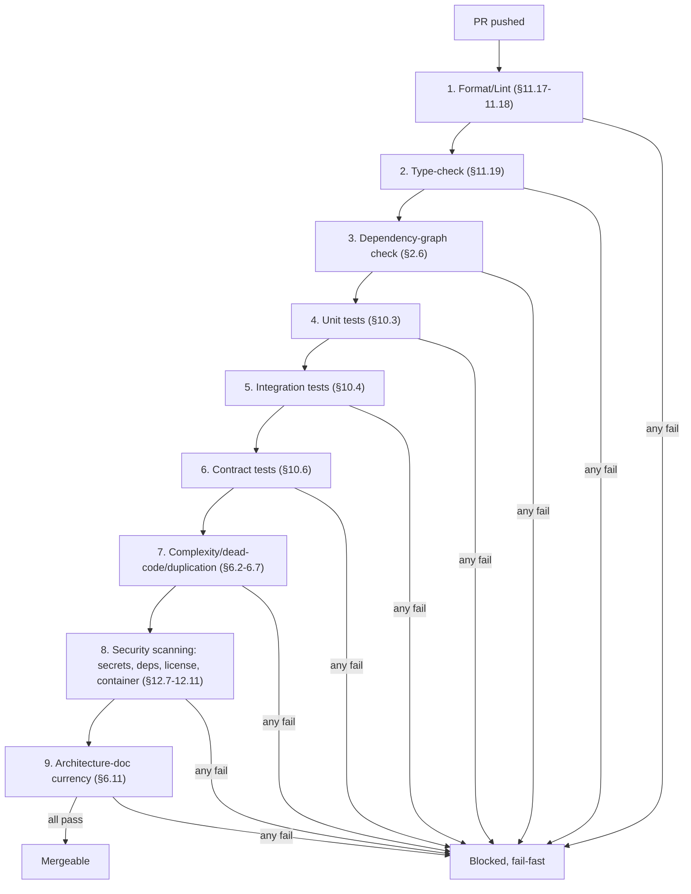

**Diagram 18 — Supply Chain Security & SBOM Flow**

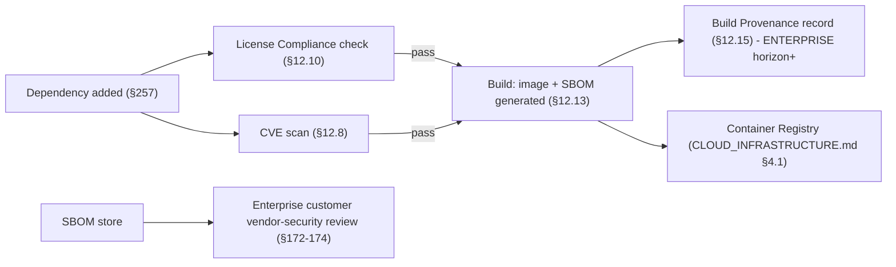

---

## Part 13 — Release Engineering, Production Readiness & Reliability Governance

### 13.1 Release Engineering (Item 140) & 13.2 Deployment Gates (Item 141)

**Purpose.** Fully specified by `CLOUD_INFRASTRUCTURE.md` Part 5 (GitOps-mediated deploy, canary-by-default, migration-before-traffic gate, cited) — this document's addition is the full DEVELOPMENT → REVIEW → CI → STAGING → CANARY → PRODUCTION lifecycle this phase's mandate explicitly requires, with entry/exit criteria per stage, detailed in its own dedicated section (§ "Mandatory Production Gates," below) rather than duplicated here.

### 13.3 Production Readiness (Item 142) & 13.4 Service Readiness (Item 143)

**Purpose.** Fully specified by `CLOUD_INFRASTRUCTURE.md` §15.4–§15.5's Production Readiness Checklist (cited) — this document's addition is Service Readiness as the per-*module* (not per-platform) instance of that checklist, required before any new backend bounded context or frontend feature module first reaches Production: health/readiness/liveness endpoints wired (`BACKEND_ARCHITECTURE.md` §10.1, cited), an owning CODEOWNERS team assigned (§2.9), and a rollback path verified (§8.6) — detailed as the "New Service" checklist in § "Mandatory Engineering Checklists."

### 13.5 Reliability Standards (Item 144), 13.6 SLI/SLO/SLA Governance (Item 145) & 13.7 Error Budgets (Item 146)

**Purpose.** Extends `CLOUD_INFRASTRUCTURE.md` §11.1/§11.4's RED/USE-metric SLIs (cited) with the binding governance layer those metrics feed: every Service-Ready module (§13.4) declares an SLO (a target — e.g., 99.9% success rate over a rolling 30-day window) derived from its SLIs; an SLA (an external, customer-facing commitment) exists only for a subset of SLOs explicitly promoted to that status by Enterprise Governance-equivalent sign-off (`ENTERPRISE_INTELLIGENCE_ARCHITECTURE.md` §15.1's Governance role, cited, generalized here to engineering-reliability commitments), never silently — an internal SLO becoming an external SLA is itself a Major-classification decision (§1.4) given its contractual weight.

**Error Budgets.** The gap between 100% and a declared SLO is that service's error budget for the period — when a service is within budget, feature velocity (canary rollouts, experiments, §8.4–§8.5) proceeds normally; when a service has exhausted its budget, new feature rollout for that service is paused (RULE, not HARD REQUIREMENT — an Emergency Change per §255 may still proceed) in favor of reliability-focused work until the budget recovers, a direct, mechanical link between reliability data and Engineering Capacity Allocation (§265).

**Diagram 19 — Error Budget Governance Loop**

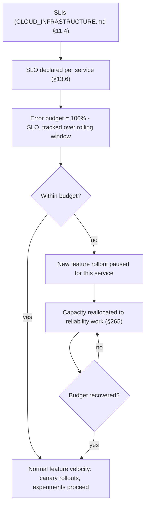

---

## Part 14 — Incident Management & Disaster Recovery Engineering

### 14.1 Incident Management (Item 147), 14.2 Incident Severity (Item 148), 14.3 Incident Commander (Item 149) & 14.4 Escalation Policy (Item 150)

**Purpose.** Fully specified by `CLOUD_INFRASTRUCTURE.md` §11.6 (P1/P2/P3 severity tiers, automatic incident-record creation, default-IC-is-the-paged-on-call model, independent status page, cited) — restated here as binding on the *engineering process* specifically: every incident record links not only telemetry (as `CLOUD_INFRASTRUCTURE.md` already specifies) but the specific PR(s)/ADR(s)/deploys correlated by timestamp to the incident window, making "what changed right before this" a structural, not investigative-effort-dependent, part of the incident record from the start.

### 14.5 Postmortem Standards (Item 151) & 14.6 Blameless Culture (Item 152)

**Purpose.** Fully specified by `CLOUD_INFRASTRUCTURE.md` §11.6 (blameless, written within a fixed post-incident window, tracked follow-up actions, cited) — this document's addition is the postmortem's mandatory linkage to §1.6's Technical Debt Register and §1.7's Risk Register: every postmortem action item is filed as one or the other (never left as free-floating prose with no tracked owner), closing the loop between "we learned something" and "the system is measurably safer as a result" (G10).

### 14.7 Reliability Review (Item 153)

**Purpose.** A recurring (cadence scales with horizon, §0.5 — quarterly at NOW/NEXT, monthly at SCALE+) cross-service review of SLO attainment (§13.6), open postmortem action items (§14.5), and Risk Register (§1.7) trend — the standing forum where Error Budget governance (§13.7) and Engineering Capacity Allocation (§265) decisions are actually made, not left to ad hoc negotiation between teams.

### 14.8 Disaster Recovery Engineering (Item 154), 14.9 Backup Verification (Item 155), 14.10 Restore Testing (Item 156) & 14.11 Business Continuity (Item 157)

**Purpose.** Fully specified by `CLOUD_INFRASTRUCTURE.md` §8.2–§8.5 (RPO < 5 min, RTO < 60 min at Phase 1–2, rehearsed DR runbook, Redis-loss-is-degradation-not-data-loss classification, cited) — this document's addition is the *engineering-process* binding: Restore Testing (a documented, actually-executed test restore, not merely a claimed-working backup) is a HARD REQUIREMENT on the same recurring cadence `CLOUD_INFRASTRUCTURE.md` §15.1 already named for its Platform Health Checks, tracked as a completed/overdue status on the Engineering Health Dashboard (§237) so a lapsed restore-test is visible at a glance, not discovered only during a real disaster.

**Diagram 20 — Incident Lifecycle**

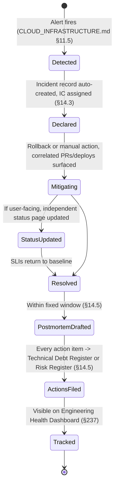

**Diagram 21 — Postmortem Lifecycle**

```mermaid
flowchart LR
    INCIDENT[Incident resolved] --> DRAFT["Draft within fixed window - blameless (§14.6)"]
    DRAFT --> TIMELINE[Timeline reconstructed from correlated telemetry + PRs/ADRs]
    TIMELINE --> ROOTCAUSE[Root cause identified, no individual blame assigned]
    ROOTCAUSE --> ACTIONS{"Action item type?"}
    ACTIONS -->|code/process fix needed| DEBT["Technical Debt Register entry (§1.6)"]
    ACTIONS -->|future risk to monitor| RISK["Risk Register entry (§1.7)"]
    DEBT & RISK --> REVIEW["Reliability Review cadence (§14.7)"]
```

**Diagram 22 — Disaster Recovery & Restore Testing Cycle**

```mermaid
flowchart TB
    BACKUP["Continuous backup (CLOUD_INFRASTRUCTURE.md §8.2)"] --> SCHEDULE["Restore Test scheduled (§14.10)"]
    SCHEDULE --> EXECUTE["Restore actually executed against non-Production target"]
    EXECUTE --> VERIFY{"Restore successful, data valid?"}
    VERIFY -->|yes| LOGGED["Logged: pass, dashboard updated (§237)"]
    VERIFY -->|no| INCIDENT_LIKE["Treated as a reliability incident - postmortem (§14.5)"]
    LOGGED --> NEXTCYCLE["Next cycle scheduled"]
    INCIDENT_LIKE --> FIX["DR runbook or backup mechanism fixed"]
    FIX --> SCHEDULE
```

---

## Part 15 — Security Engineering

### 15.1 Security Engineering (Item 158) & 15.2 Secure Coding Standards (Item 159)

**Purpose.** Restates §0.6's nine security postures as binding on the engineering *workflow*, not only the running system (the phase mandate's explicit instruction: "security must be built into engineering workflow rather than treated as a final audit"). Secure Coding Standards are the specific, lint-enforceable subset: no raw SQL string concatenation (Prisma's parameterized-query interface, `DATABASE.md`, cited, is the only sanctioned data-access path), no client-supplied identifier trusted without workspace-membership validation (`AUTH_ARCHITECTURE.md`'s RBAC, cited, re-checked at every layer per G7), no secret or credential ever committed (§12.9), every external-input boundary validated via Zod (`FRONTEND_ARCHITECTURE.md` §5.5 and `API_CONTRACT.md`'s shared validation-at-the-boundary philosophy, cited).

### 15.3 Threat Modeling (Item 160) & 15.4 Security Review (Item 161)

**Purpose.** Threat Modeling is required (RULE) for any Major/Breaking architectural change (§1.4) touching authentication, authorization, tenant isolation, or AI-agent tool permissions — performed as part of the ARB review (§1.1), using `AUTH_ARCHITECTURE.md`'s and `ENTERPRISE_INTELLIGENCE_ARCHITECTURE.md` §14's existing Defense-in-Depth layer model (cited) as the analysis frame, not a separately-invented methodology. Security Review is the equivalent gate for any security-sensitive PR (§ "Mandatory Engineering Quality Gates" table), performed by the Security Team (§244) or, at NOW/NEXT horizon, the most security-experienced available reviewer, never skipped for team-size reasons.

### 15.5 Secrets Management (Item 162)

**Purpose.** Fully specified by `CLOUD_INFRASTRUCTURE.md` §7.2 (managed KMS/secrets service, CSI-driver injection at pod startup, never plain Kubernetes Secrets alone, cited) — this document's addition is the local-development-time equivalent: a developer's local `.env` file (git-ignored, per `ARCHITECTURE.md`'s existing `.env.example` convention, cited) is populated from a per-engineer credential vault entry, never a shared, hand-copied secret passed over chat/email — a RULE closing the most common real-world secrets-leak vector (informal sharing), not only the in-repository one §12.9 already covers.

### 15.6 Authentication Engineering Rules (Item 163) & 15.7 Authorization Engineering Rules (Item 164)

**Purpose.** Fully specified by `AUTH_ARCHITECTURE.md` in its entirety (cited, not redesigned) — this document's addition is the engineering-process rule: no module implements its own authentication check or session-validation logic independently; every authenticated boundary calls the shared, centrally-maintained auth middleware/hook (`BACKEND_ARCHITECTURE.md`'s and `FRONTEND_ARCHITECTURE.md`'s existing shared infrastructure, cited) — a HARD REQUIREMENT, since a hand-rolled, locally-reimplemented auth check is exactly how a subtle bypass gets introduced undetected. Authorization Engineering Rules apply the identical binding to RBAC permission checks, extended explicitly to `ENTERPRISE_INTELLIGENCE_ARCHITECTURE.md`'s AI Employee action authorization (§2.1 of that document, cited) — an AI Employee's tool call is checked against the exact same shared RBAC mechanism a human user's API call is, never a parallel, AI-specific authorization path.

### 15.8 Tenant Isolation Rules (Item 165)

**Purpose.** Fully specified by `DATABASE.md` §3.1 (`workspaceId` scoping), `FRONTEND_ARCHITECTURE.md` §4.6 (query-key namespacing, cache-isolation invariant), and `ENTERPRISE_INTELLIGENCE_ARCHITECTURE.md` E7/§14.1 (consent-gated cross-workspace aggregation) — all cited, restated here as a single, unconditional engineering rule (HARD REQUIREMENT, G7): **every database query, cache key, log line, and AI context assembly touching workspace-scoped data includes an explicit `workspaceId` filter or namespace, verified by a dedicated CI lint rule scanning for Prisma queries missing a `workspaceId` clause on any workspace-scoped model** — tenant isolation is the single invariant this document treats as non-negotiable at every layer simultaneously, never trusted to any one layer alone (Defense in Depth, §0.6).

### 15.9 Privacy Engineering (Item 166), 15.10 Data Classification (Item 167), 15.11 Data Retention (Item 168) & 15.12 Data Deletion (Item 169)

**Purpose.** Data Classification is the binding taxonomy every other privacy mechanism in this document references: **Public** (marketing content), **Internal** (non-sensitive operational data), **Confidential** (business data — the majority of `DATABASE.md`'s schema), **Restricted** (credentials, financial identifiers, anything `AUTH_ARCHITECTURE.md` §6 already treats as compliance-sensitive) — every `DATABASE.md` model is tagged with a classification (a Technical Debt Register item is opened for any existing model found untagged during the classification rollout, not treated as a blocking retrofit requirement).

**Data Retention & Deletion.** Resolves Source Document Audit item A6 (§0.7) procedurally, without presuming the specific durations: every model's owning team (§2.7) proposes a retention period appropriate to its Data Classification, reviewed by whoever holds Enterprise Governance stewardship (`ENTERPRISE_INTELLIGENCE_ARCHITECTURE.md` §15.1, cited) and recorded per-model — Data Deletion (a user- or compliance-triggered removal) is verified to propagate through `DATABASE.md`'s operational rows, `ENTERPRISE_INTELLIGENCE_ARCHITECTURE.md` §15.5's Digital Twin/Knowledge Graph recompute (cited), and `CLOUD_INFRASTRUCTURE.md`'s backup retention window (a deletion is not "complete" from a compliance perspective until it has aged out of backups too, tracked explicitly, never assumed).

### 15.13 Auditability (Item 170)

**Purpose.** Fully specified by `CLOUD_INFRASTRUCTURE.md` §14.6 (append-only audit infrastructure, system-process-write-only, human-read-only even for break-glass operators) and `ENTERPRISE_INTELLIGENCE_ARCHITECTURE.md` §9.5 (every AI decision's Reasoning Trace as an audit event) — cited, restated as binding on every engineering-process action this document itself governs: an ADR approval (§1.5), a Decision Level change (`ENTERPRISE_INTELLIGENCE_ARCHITECTURE.md` §9.7, cited), an Emergency Change (§255), and a Data Deletion (§15.12) are all, without exception, audit-infrastructure events.

### 15.14 Compliance Engineering (Item 171), 15.15 SOC 2 Readiness (Item 172), 15.16 ISO 27001 Readiness (Item 173) & 15.17 Enterprise Security Controls (Item 174)

**Purpose.** Compliance Engineering is the practice of making every control this Part already defines *demonstrable*, not merely present — SOC 2 Type II readiness in particular depends on showing controls operated consistently over a review period, which `CLOUD_INFRASTRUCTURE.md` §14.4 already identified as a natural consequence of IaC-declared, GitOps-reconciled infrastructure (cited); this document extends that same "consistency is structural, not asserted" property to the engineering process itself — every gate in this document (§ "Mandatory Engineering Quality Gates") is automatable-by-default specifically because an automated gate's consistent operation is trivially demonstrable to an auditor, while a manually-remembered process step is not. ISO 27001 Readiness and Enterprise Security Controls (the specific, contractually-negotiated controls an Enterprise customer may require, e.g., SSO enforcement, dedicated audit-log export) are tracked as a checklist (§ "Mandatory Engineering Checklists," Security-Sensitive Feature) rather than a standing architectural commitment, since their specific shape is customer- and certification-cycle-dependent.

**Diagram 23 — Security Review Lifecycle**

```mermaid
flowchart TB
    PR["PR classified security-sensitive (§ Quality Gates table)"] --> THREATMODEL{"Touches authn/authz/tenant-isolation/AI-permissions?"}
    THREATMODEL -->|yes| TM["Threat Modeling required (§15.3), part of ARB review"]
    THREATMODEL -->|no| SECREVIEW["Security Review by Security Team (§15.4)"]
    TM --> SECREVIEW
    SECREVIEW --> TENANTLINT["Automated tenant-isolation lint (§15.8): workspaceId clause check"]
    TENANTLINT -->|fail| BLOCK[Blocked]
    TENANTLINT -->|pass| SECRETSCAN["Secret scan (§12.9)"]
    SECRETSCAN -->|pass| APPROVED[Approved]
    APPROVED --> AUDIT["Audit Infrastructure event recorded (§15.13)"]
```

**Diagram 24 — Tenant Isolation Defense-in-Depth Enforcement**

```mermaid
flowchart TB
    REQ[Request touches workspace-scoped data] --> L1["Database query: workspaceId filter (DATABASE.md §3.1, lint-enforced)"]
    REQ --> L2["Cache key: workspace-namespaced (FRONTEND_ARCHITECTURE.md §4.6)"]
    REQ --> L3["Log line: workspaceId field included (§5.2)"]
    REQ --> L4["AI context assembly: workspace-scoped Context Engine (ENTERPRISE_INTELLIGENCE_ARCHITECTURE.md Part 4)"]
    L1 & L2 & L3 & L4 --> VERIFY["No single layer trusted alone (G7, Defense in Depth §0.6)"]
```

**Diagram 25 — Data Classification & Retention/Deletion Flow**

```mermaid
flowchart LR
    MODEL["DATABASE.md model"] --> CLASSIFY["Data Classification tagged: Public/Internal/Confidential/Restricted (§15.10)"]
    CLASSIFY --> RETENTION["Retention period proposed by owning team, approved by Governance (§15.11)"]
    DELETE_TRIGGER["Deletion request or compliance trigger"] --> PROPAGATE["Propagate: DATABASE.md rows -> Digital Twin/Knowledge Graph recompute -> backup aging (§15.12)"]
    PROPAGATE --> COMPLETE{"Aged out of backups too?"}
    COMPLETE -->|no| PENDING["Deletion pending, tracked"]
    COMPLETE -->|yes| VERIFIED["Deletion verified complete"]
```

---

## Part 16 — AI Engineering Governance

*Common to this Part:* BizPilot AI is an AI-native company (mission statement, this phase's mandate); every mechanism below exists specifically to prevent "it seems to work" from ever being a shipped AI quality bar (G6), extending — never redesigning — `AI_PLATFORM_ARCHITECTURE.md`'s subsystems and `ENTERPRISE_INTELLIGENCE_ARCHITECTURE.md`'s AI Workforce governance floors.

### 16.1 AI Safety Engineering (Item 175) & 16.2 AI Governance (Item 176)

**Purpose.** Restates `ENTERPRISE_INTELLIGENCE_ARCHITECTURE.md` §15.2's two-tier governance model (non-negotiable floors vs. business-configurable defaults, cited, ADR-EI-032) as binding on the engineering *process* that ships AI features: no PR touching an AI Employee's Mandate (`AI_PLATFORM_ARCHITECTURE.md` §3's Prompt Registry, cited), tool permissions, or Autonomous Decision Level configuration merges without passing every gate in this Part — these are, by definition, always Major-or-Breaking-classified changes (§1.4), never Minor, regardless of how small the diff appears.

### 16.3 AI Permission Boundaries (Item 177) & 16.4 Agent Safety Rules (Item 178)

**Purpose.** Fully specified by `AI_PLATFORM_ARCHITECTURE.md`'s Tool Calling/Permissions (reusing RBAC, "no elevated AI service account," cited) and `ENTERPRISE_INTELLIGENCE_ARCHITECTURE.md` E3 (cited) — this document's engineering-process addition: a CI-enforced static check verifies that any new AI tool registration (`AI_PLATFORM_ARCHITECTURE.md` §9's Tool Registry, cited) declares a permission scope that is a strict subset of the invoking AI Employee's own RBAC role — the exact same automated check §3.4's Agent Delegation intersection-not-union rule (`ENTERPRISE_INTELLIGENCE_ARCHITECTURE.md` ADR-EI-007, cited) requires, now enforced mechanically at merge time rather than only reasoned about at design time.

### 16.5 Human Approval Requirements (Item 179)

**Purpose.** Fully specified by `ENTERPRISE_INTELLIGENCE_ARCHITECTURE.md` §9.6–§9.7 (Human Approval Architecture, five-level Autonomous Decision Level ladder, non-negotiable floors for Fraud Detection and AI-CFO fund transfers, cited) — this document's addition is the merge-time verification: any PR raising a seat's configured maximum Decision Level above L1 must reference the specific Organizational Learning calibration evidence (`ENTERPRISE_INTELLIGENCE_ARCHITECTURE.md` §11.3, cited) justifying the increase, checked by the ARB reviewer, never merged on the strength of "this AI Employee seems reliable" alone (G6 applied to the single highest-stakes AI governance action in the entire document series).

### 16.6 AI Observability (Item 180) & 16.7 AI Quality Gates (Item 181)

**Purpose.** AI Observability is fully specified by `ENTERPRISE_INTELLIGENCE_ARCHITECTURE.md` §15.7 (correlation ID spanning frontend, backend, and AI provider call, cited) — this document's addition is the **AI Quality Gate**, the mandatory, measurable bar this phase's mandate requires in place of subjective "it seems to work" judgment. Every AI-surface PR (a prompt, agent, or model-provider change) must pass all five dimensions before merge, each with an explicit numeric or categorical threshold set per AI surface (not a single platform-wide number, since an AI CFO's financial-recommendation accuracy bar is not the AI Marketing Director's campaign-copy quality bar) and recorded alongside the surface's Mandate:

| Dimension | What it measures | Source |
|---|---|---|
| **Quality** | Output correctness/usefulness against the Evaluation Dataset (§10.21) | `AI_PLATFORM_ARCHITECTURE.md` §9's Agent Runtime output, scored by Model/Agent Evaluation (§10.19–§10.20) |
| **Hallucination rate** | Rate of unsupported/fabricated claims, specifically for any surface citing Digital Twin/Knowledge Graph facts (`ENTERPRISE_INTELLIGENCE_ARCHITECTURE.md` Part 1, cited) | Evaluation Dataset with ground-truth entity citations |
| **Safety** | Adherence to `AI_PLATFORM_ARCHITECTURE.md`'s Safety/Moderation/PII ports and `ENTERPRISE_INTELLIGENCE_ARCHITECTURE.md`'s non-negotiable governance floors | Automated Safety-port evaluation, never sampled manually as the sole check |
| **Cost** | Token/compute cost per invocation against `AI_PLATFORM_ARCHITECTURE.md`'s AI Credits budget | AI Credits accounting, cited |
| **Latency** | Time-to-first-token and time-to-completion against `FRONTEND_ARCHITECTURE.md` §13.3's tracked custom timing marks | Frontend RUM, cited |

**Failure condition.** Any dimension regressing beyond its declared threshold relative to the current production baseline blocks merge — a HARD REQUIREMENT, since this is the mechanism that makes G6 enforceable rather than aspirational.

### 16.8 AI Cost Governance (Item 182) & 16.9 AI Credit Governance (Item 183)

**Purpose.** Fully specified by `AI_PLATFORM_ARCHITECTURE.md`'s AI Credits/Token Accounting/Cost Forecasting/Budget Protection subsystems and `ENTERPRISE_INTELLIGENCE_ARCHITECTURE.md` §16.2's per-AI-Employee-seat cost attribution (both cited) — this document's addition: any AI surface whose measured cost dimension (§16.7) exceeds its declared budget by a configured margin automatically opens a Technical Debt Register item (never silently absorbed into rising cloud spend) and is reviewed at the next Reliability Review (§14.7)-equivalent AI-cost review cadence.

### 16.10 Model Provider Governance (Item 184)

**Purpose.** Fully specified by `AI_PLATFORM_ARCHITECTURE.md`'s Provider Router and Provider Capability Matrix (cited) — this document's addition: adding a new model provider is a Major architectural change (§1.4) requiring an ADR documenting the provider's data-handling terms against `AUTH_ARCHITECTURE.md` §6's compliance posture (cited) *before* any production traffic is routed to it, never approved retroactively after integration.

### 16.11 Prompt Governance (Item 185) & 16.12 Prompt Versioning (Item 186)

**Purpose.** Fully specified by `AI_PLATFORM_ARCHITECTURE.md` §3's Prompt Registry (versioned, reviewable prompt assets, cited) — this document's addition: every prompt change is a Conventional Commit of type `feat`/`fix` scoped to its owning AI surface (§7.4), runs the full Prompt Regression Testing suite (§10.18, HARD REQUIREMENT), and is reviewed by that surface's CODEOWNERS (§2.9) — prompts are source-controlled, reviewed artifacts, never edited directly in a provider's console or a database row bypassing this pipeline.

### 16.13 AI Experimentation (Item 187)

**Purpose.** Fully specified by `FRONTEND_ARCHITECTURE.md` §13.7–§13.8 and `ENTERPRISE_INTELLIGENCE_ARCHITECTURE.md` §7.8's Business Experiment Engine (both reusing `BACKEND_ARCHITECTURE.md` §7.7's `FeatureFlagEngine`, cited, the document series' repeated three-layer-reuse pattern) — restated as binding here with no new mechanism.

### 16.14 Model Rollout (Item 188) & 16.15 Model Rollback (Item 189)

**Purpose.** Fully specified by `AI_PLATFORM_ARCHITECTURE.md` §14's Shadow Deployment/Canary Release pattern for models (cited) and `ENTERPRISE_INTELLIGENCE_ARCHITECTURE.md`'s Migration Strategy (§18.3 of that document, the shadow-deployment model-upgrade gate for L2+ seats, cited, Diagram 35 of that document) — this document's addition: rollback of a model/provider change follows the identical mechanism as any other production rollback (§8.6, Git-revert-of-manifest), since the Provider Router's model selection is itself GitOps-declared configuration, not a runtime-mutable database row — a HARD REQUIREMENT that keeps model rollback exactly as fast and deterministic as any other infrastructure rollback.

### 16.16 AI Failure Handling (Item 190) & 16.17 AI Incident Response (Item 191)

**Purpose.** AI Failure Handling extends `BACKEND_ARCHITECTURE.md` §9's circuit-breaker/retry/DLQ resilience patterns (cited) to AI-provider-specific failure modes: a provider timeout or rate-limit triggers `AI_PLATFORM_ARCHITECTURE.md`'s Provider Router failover (cited), never a bare user-facing error, wherever a failover-capable alternative provider exists for that capability. AI Incident Response is the AI-specific instance of §14.1's general Incident Management process, with one addition: an AI-quality incident (a hallucination cluster, a Decision Level action producing a materially wrong recommendation) triggers an immediate, automatic Decision Level review (never waiting for the next scheduled Reliability Review) for the specific AI Employee seat and action-type involved, and — per `ENTERPRISE_INTELLIGENCE_ARCHITECTURE.md`'s Diagram 21-equivalent postmortem-to-register pipeline (cited) — always produces at least one Risk Register or Technical Debt Register entry, never closed as "one-off, no action needed" for a governance-relevant AI failure.

**Diagram 26 — AI Evaluation & Quality Gate Lifecycle**

```mermaid
flowchart TB
    CHANGE["Prompt / Agent / Model-Provider change (§16.11-16.14)"] --> CLASSIFY["Major/Breaking classification (§1.4) - always, never Minor"]
    CLASSIFY --> EVAL["Run against Evaluation Dataset (§10.21)"]
    EVAL --> Q1["Quality dimension"]
    EVAL --> Q2["Hallucination rate dimension"]
    EVAL --> Q3["Safety dimension"]
    EVAL --> Q4["Cost dimension"]
    EVAL --> Q5["Latency dimension"]
    Q1 & Q2 & Q3 & Q4 & Q5 --> GATE{"All five within declared threshold vs. production baseline?"}
    GATE -->|no| BLOCKED["Blocked - regression on at least one dimension"]
    GATE -->|yes| SHADOW["Shadow deployment (AI_PLATFORM_ARCHITECTURE.md §14)"]
    SHADOW --> CANARY["Canary rollout"]
    CANARY --> PROD["Production - AI Observability active (§16.6)"]
    PROD -->|quality incident| AIINCIDENT["AI Incident Response (§16.17): immediate Decision Level review"]
```

**Diagram 27 — Model / Prompt Release Lifecycle**

```mermaid
stateDiagram-v2
    [*] --> Drafted: Prompt/model change authored, versioned in Prompt Registry (§16.12)
    Drafted --> RegressionTested: Full Evaluation Dataset run (§10.18, HARD REQUIREMENT)
    RegressionTested --> CodeownersReview: Owning AI surface CODEOWNERS review (§16.11)
    CodeownersReview --> Shadow: Shadow deployment, real traffic comparison
    Shadow --> Canary: Quality Gate (§16.7) passed
    Canary --> FullyLive: Health gates passed
    Canary --> RolledBack: Regression detected -> Git-revert rollback (§16.15)
    RolledBack --> Drafted: Fix and retry
    FullyLive --> [*]
```

**Diagram 28 — AI Incident Lifecycle**

```mermaid
flowchart TB
    DETECT["AI quality signal degrades (§16.6 Observability)"] --> CLASSIFY_INC{"Governance-relevant? (hallucination cluster, wrong Decision Level action)"}
    CLASSIFY_INC -->|yes| DECLARE["AI Incident declared - Incident Management (§14.1) + immediate Decision Level review"]
    CLASSIFY_INC -->|no| MONITOR["Monitored, not escalated"]
    DECLARE --> MITIGATE["Model/prompt rollback (§16.15) or Decision Level lowered"]
    MITIGATE --> POSTMORTEM["Postmortem (§14.5), blameless"]
    POSTMORTEM --> REGISTER["Risk Register or Technical Debt Register entry - never closed with no action"]
```

---

## Part 17 — Data Engineering & Analytics Standards

### 17.1 Data Engineering Standards (Item 192), 17.2 Data Quality (Item 193) & 17.3 Data Validation (Item 194)

**Purpose.** Extends `DATABASE.md`'s schema-level constraints and `ENTERPRISE_INTELLIGENCE_ARCHITECTURE.md` Part 1's Digital Twin materialization (both cited) with the engineering-process discipline: Data Quality is monitored as a first-class metric (§193's own item, distinct from application correctness) — null-rate drift, referential-integrity violations caught before they reach the Digital Twin projection, and Domain Intelligence signal staleness (`ENTERPRISE_INTELLIGENCE_ARCHITECTURE.md` §1.1's Staleness Tracker, cited) surfaced on the Engineering Health Dashboard (§237). Data Validation is Zod-schema-enforced at every ingestion boundary (§15.2's citation, restated), never trusted to a downstream consumer to catch.

### 17.4 Data Lineage (Item 195) & 17.5 Data Contracts (Item 196)

**Purpose.** Data Lineage is fully specified by `ENTERPRISE_INTELLIGENCE_ARCHITECTURE.md` E10 and §9.5's Reasoning Trace provenance chain (cited) — every derived signal (a Domain Intelligence output, a Business Health sub-score) is traceable back to the `DATABASE.md` rows and events that produced it, a property this document's engineering process protects by requiring any new derived-signal computation to declare its inputs explicitly (no signal computed from an undocumented, ad hoc query against multiple tables without a named lineage path). Data Contracts are the schema-level agreement between a producer and consumer of any cross-module data flow — enforced by §9.12's Contract Testing, extended here to internal Domain Intelligence module boundaries (`ENTERPRISE_INTELLIGENCE_ARCHITECTURE.md` §6.0's shared template, cited), not only external API/event boundaries.

### 17.6 Analytics Engineering (Item 197), 17.7 Warehouse Governance (Item 198) & 17.8 BI Governance (Item 199)

**Purpose.** Distinct from the operational `DATABASE.md` schema and the Digital Twin (both optimized for transactional/reasoning workloads) — Analytics Engineering names the (currently NOW-horizon-deferred, per §0.4's anti-gold-plating framework) future analytical-warehouse layer, triggered specifically by cross-workspace, cross-time-horizon analytical query patterns that would otherwise degrade the operational database's own performance budget (§209–§210). Warehouse Governance and BI Governance (access control, metric-definition consistency for any future business-intelligence tooling) are named now, deferred in implementation, so that when the trigger condition is met the governance model — not only the infrastructure — is already decided.

### 17.9 Metrics Governance (Item 200)

**Purpose.** Every named metric across this document series (Business Health sub-scores, `ENTERPRISE_INTELLIGENCE_ARCHITECTURE.md` §5; SLIs, `CLOUD_INFRASTRUCTURE.md` §11; AI Quality Gate dimensions, §16.7) has exactly one canonical computation, owned by one team, never independently recomputed with subtly different logic by a second team — a metric-definition registry (a lightweight, versioned catalog, not a new platform) is the binding source of truth, referenced rather than reimplemented wherever a metric appears in a dashboard (§237) or report (`ENTERPRISE_INTELLIGENCE_ARCHITECTURE.md` §10.8's Executive Reporting Engine, cited).

### 17.10 Product Analytics Standards (Item 201) & 17.11 Event Tracking Standards (Item 202)

**Purpose.** Fully specified by `FRONTEND_ARCHITECTURE.md` §13.6's single, typed analytics abstraction (cited) — Event Tracking Standards extend §3.1's dot-namespaced event-naming convention to product-analytics events specifically (`feature.action.outcome`, e.g., `copilot.message.sent`), distinct from but namespace-consistent with `BACKEND_ARCHITECTURE.md`'s domain-event naming (§3.1's table).

### 17.12 Experimentation Standards (Item 203) & 17.13 A/B Testing Governance (Item 204)

**Purpose.** Fully specified by §16.13's citation (`FRONTEND_ARCHITECTURE.md` §13.7–§13.8, `ENTERPRISE_INTELLIGENCE_ARCHITECTURE.md` §7.8, both built on `BACKEND_ARCHITECTURE.md`'s `FeatureFlagEngine`, cited) — this document's addition: any A/B test's success metric must be a §17.9-registered metric, never an ad hoc, one-off calculation invented for that single experiment, so experiment results remain comparable across the organization's history.

### 17.14 Privacy-Safe Analytics (Item 205)

**Purpose.** Restates `AUTH_ARCHITECTURE.md` §6's data-minimization posture as binding on every analytics event: no Restricted-classification field (§15.10) is ever included in a product-analytics event payload, enforced by the same static field-name scanning §5.3 already applies to log calls, applied here to analytics-emission call sites.

**Diagram 29 — Data Governance Flow: Lineage, Contracts & Quality**

```mermaid
flowchart TB
    SOURCE["DATABASE.md operational rows"] --> EVENT["Domain event (BACKEND_ARCHITECTURE.md Event Bus)"]
    EVENT --> TWIN["Digital Twin materialization (ENTERPRISE_INTELLIGENCE_ARCHITECTURE.md Part 1)"]
    TWIN --> SIGNAL["Derived signal - lineage declared (§17.4)"]
    SIGNAL --> CONTRACT["Data Contract with consumer module (§17.5), Contract Testing (§9.12)"]
    CONTRACT --> METRIC["Registered in Metrics Governance catalog (§17.9)"]
    METRIC --> DASH["Dashboard / Executive Reporting Engine"]
    SOURCE -.quality monitored.-> QUALITY["Data Quality: null-rate, referential integrity, staleness (§17.2)"]
    QUALITY --> DASHBOARD_HEALTH["Engineering Health Dashboard (§237)"]
```

---

## Part 18 — Performance Engineering

### 18.1 Performance Engineering (Item 206) & 18.2 Frontend Performance Budgets (Item 207)

**Purpose.** Fully specified by `FRONTEND_ARCHITECTURE.md` §12.1 (CI-enforced initial-load/bundle-size/runtime-rendering budgets, F11, cited) — restated as a binding merge gate: a PR whose bundle-size or rendering-budget check regresses beyond a configured threshold is blocked (RULE, EXCEPTION path requires Team-tier sign-off with a stated remediation plan, never a silent budget increase).

### 18.3 Backend Performance Budgets (Item 208)

**Purpose.** The backend-equivalent budget `FRONTEND_ARCHITECTURE.md` §12 defined for the frontend: p50/p95/p99 latency budgets per API endpoint class (`API_CONTRACT.md`'s resource catalog, cited), checked against `CLOUD_INFRASTRUCTURE.md` §11.4's RED metrics in Staging load tests (§10.12) before any capacity-relevant change reaches Production, mirroring that document's own Production Readiness gate.

### 18.4 Database Performance (Item 209) & 18.5 Query Performance (Item 210)

**Purpose.** Fully specified by `CLOUD_INFRASTRUCTURE.md` §8.1's connection-pooling and read-replica architecture (cited) — this document's addition: any new query pattern touching a table above a configured row-count threshold requires an `EXPLAIN`-verified index-usage check in review (RULE), and any migration adding a new query path to a high-traffic endpoint (§18.3) includes its query plan in the PR description — catching an N+1 or missing-index regression at review time, not after a Staging load test (§10.12) surfaces it expensively.

### 18.6 Cache Governance (Item 211)

**Purpose.** Fully specified by `BACKEND_ARCHITECTURE.md` §5.8's two-tier cache (ADR-004, cited) and `FRONTEND_ARCHITECTURE.md` §5.9's targeted-invalidation discipline (cited) — this document's addition: every new cache entry declares its invalidation trigger explicitly at the call site (a comment or typed annotation citing which event invalidates it) — an un-invalidatable or unclear-invalidation cache entry is a review-blocking finding, since stale-cache bugs are disproportionately expensive to diagnose relative to the review-time cost of requiring this declaration upfront.

### 18.7 Network Performance (Item 212), 18.8 Bundle Budgets (Item 213) & 18.9 Core Web Vitals (Item 214)

**Purpose.** Fully specified by `FRONTEND_ARCHITECTURE.md` §12.4–§12.9 (three-tier code splitting, asset/image/font optimization via `CLOUD_INFRASTRUCTURE.md` §9's CDN pipeline, cited) — Core Web Vitals-equivalent metrics are the specific, industry-standard subset of `FRONTEND_ARCHITECTURE.md` §13.3's RUM timing marks tracked as a dedicated performance-budget category, given their outsized correlation with perceived quality for the authenticated, highly-interactive product surface `FRONTEND_ARCHITECTURE.md` ADR-FE-003 already scoped this platform around.

**Diagram 30 — Performance Budget Enforcement Across the Stack**

```mermaid
flowchart TB
    FE_BUDGET["Frontend: bundle size, rendering, Core Web Vitals (§18.2, §18.9)"] --> CI_FE["CI gate: FRONTEND_ARCHITECTURE.md §12 budgets"]
    BE_BUDGET["Backend: p50/p95/p99 latency per endpoint class (§18.3)"] --> LOADTEST["Staging load test (§10.12)"]
    DB_BUDGET["Database: query plan review for high-traffic paths (§18.5)"] --> PRREVIEW["PR review: EXPLAIN plan required"]
    CACHE_BUDGET["Cache: invalidation trigger declared per entry (§18.6)"] --> PRREVIEW
    CI_FE & LOADTEST & PRREVIEW --> GATE{"All budgets within threshold?"}
    GATE -->|no| BLOCK[Blocked]
    GATE -->|yes| SHIP[Mergeable]
```

---

## Part 19 — Scalability Engineering

### 19.1 Scalability Engineering (Item 215), 19.2 Capacity Planning (Item 216) & 19.3 Load Modeling (Item 217)

**Purpose.** Fully specified by `CLOUD_INFRASTRUCTURE.md` §12.1 (load-testing-informed, recurring-cadence capacity review, generous Phase 1 headroom as bounded insurance, cited) — this document's addition: Load Modeling (deriving expected traffic shape from `PRD.md`'s persona/journey assumptions before real telemetry exists, and from real telemetry once it does) is the explicit input to `CLOUD_INFRASTRUCTURE.md`'s capacity review, formalized as a Reliability Review (§14.7) agenda item, not left as an unstructured, ad hoc estimation exercise.

### 19.4 Bottleneck Detection (Item 218)

**Purpose.** Extends `CLOUD_INFRASTRUCTURE.md` §11's RED/USE metrics (cited) with the engineering-process rule: a service or query consistently operating above 70% of a resource budget (a GUIDELINE-tier warning threshold, not a hard gate, since transient spikes are expected and not every threshold breach warrants action) is flagged for Capacity Planning review before it becomes an incident, closing the gap between "the metrics showed it coming" and "someone actually looked."

### 19.5 Horizontal Scaling (Item 219) & 19.6 Vertical Scaling (Item 220)

**Purpose.** Fully specified by `CLOUD_INFRASTRUCTURE.md` P8 (horizontal as the default scaling axis) and §12.2's three-tier autoscaling stack (cited) — restated as binding engineering practice: new backend code is written stateless-by-default (no in-process state that would prevent horizontal replica addition) as a RULE, with the narrow, explicitly-justified exception of `BACKEND_ARCHITECTURE.md` §5.8's L1 in-process cache (cited, already justified there) and `CLOUD_INFRASTRUCTURE.md` §10.3's singleton Scheduler (cited, already justified there) — any new stateful-in-process pattern beyond these two named, pre-approved exceptions requires an ADR.

### 19.7 Queue Scaling (Item 221) & 19.8 Database Scaling (Item 222)

**Purpose.** Fully specified by `CLOUD_INFRASTRUCTURE.md` §10.2 (queue-depth-driven Worker HPA, cited) and §8.1 (read replicas, connection pooling, cited) — restated as binding, with this document's addition being the engineering-review trigger: a new job type added to `BACKEND_ARCHITECTURE.md`'s queue (§8, cited) must state its expected volume and idempotency guarantee (§8.5 of that document, cited) in the PR description, since both directly inform whether the existing autoscaling configuration remains sufficient.

### 19.9 AI Inference Scaling (Item 223)

**Purpose.** Fully specified by `CLOUD_INFRASTRUCTURE.md` §13.1–§13.2 (opt-in, scale-to-zero GPU node pool, hybrid-cloud GPU sourcing, cited) and `AI_PLATFORM_ARCHITECTURE.md`'s Provider Router (cited) — restated as binding, with the same anti-gold-plating trigger discipline (§0.4) explicitly reinforced: self-hosted inference infrastructure remains unactivated until the specific, named trigger conditions those documents already state (cost economics at high volume, or an Enterprise data-residency requirement) are actually observed, never provisioned speculatively.

**Diagram 31 — Scaling Decision Tree**

```mermaid
flowchart TD
    LOAD[Load/capacity signal observed] --> TYPE{"What is scaling?"}
    TYPE -->|API/Worker replica count| HPA["Horizontal Pod Autoscaling (CLOUD_INFRASTRUCTURE.md §12.2)"]
    TYPE -->|Database read load| REPLICA["Add/scale read replica (§19.8)"]
    TYPE -->|Queue backlog| QUEUEHPA["Queue-depth-driven Worker HPA (§19.7)"]
    TYPE -->|AI inference cost/latency at scale| GPUCHECK{"Named trigger condition met? (§19.9)"}
    GPUCHECK -->|yes| GPUACTIVATE["Activate GPU node pool (CLOUD_INFRASTRUCTURE.md §13.2)"]
    GPUCHECK -->|no| PROVIDERROUTE["Continue via Provider Router (AI_PLATFORM_ARCHITECTURE.md)"]
    HPA & REPLICA & QUEUEHPA --> REVIEW["Capacity Planning review (§19.2)"]
```

---

## Part 20 — Cost Engineering

### 20.1 Cost Engineering (Item 224) & 20.2 Cloud Cost Governance (Item 225)

**Purpose.** Fully specified by `CLOUD_INFRASTRUCTURE.md` §12.3 (commitment discounts, spot-instance Worker pool, per-domain cost attribution, cost-anomaly-as-security-signal, cited) — restated as binding engineering practice: any PR introducing a new managed-service dependency or materially changing resource requests/limits includes a stated cost-impact estimate in its description, reviewed alongside the code change itself, not discovered only in the next billing cycle.

### 20.3 AI Token Cost Governance (Item 226)

**Purpose.** Fully specified by §16.8–§16.9's citation of `AI_PLATFORM_ARCHITECTURE.md`'s AI Credits system (cited) — restated as binding: AI Token Cost is tracked as a first-class Quality Gate dimension (§16.7), not merely an accounting afterthought, closing the loop between "this feature works" and "this feature is economically sustainable at the pricing `PRD.md`'s subscription plans assume."

### 20.4 Infrastructure Cost Allocation (Item 227) & 20.5 Workspace Cost Attribution (Item 228)

**Purpose.** Fully specified by `CLOUD_INFRASTRUCTURE.md` §12.3's per-domain cost tagging (cited) and `ENTERPRISE_INTELLIGENCE_ARCHITECTURE.md` §16.2's per-AI-Employee-seat cost attribution (cited) — Workspace Cost Attribution extends both one level further: a workspace's total infrastructure + AI cost is computable end-to-end (compute, storage, AI Credits) feeding both internal margin analysis and, at ENTERPRISE horizon, customer-facing usage-based billing transparency (`PRD.md`'s subscription-plan feature inventory, cited).

### 20.6 FinOps (Item 229)

**Purpose.** The organizational practice (not a new tool) of treating cost as a continuously-reviewed engineering signal — folded into the Reliability Review cadence (§14.7) as a standing agenda item once cost data volume justifies a dedicated review (SCALE horizon and beyond, per §0.4's trigger discipline), never a separate, competing governance process at NOW/NEXT horizon where a lightweight monthly check suffices.

**Diagram 32 — Cost Attribution Flow**

```mermaid
flowchart TB
    INFRA["Infrastructure spend (CLOUD_INFRASTRUCTURE.md §12.3)"] --> DOMAIN["Per-domain cost tagging"]
    AICOST["AI provider spend (AI_PLATFORM_ARCHITECTURE.md AI Credits)"] --> SEAT["Per-AI-Employee-seat attribution (ENTERPRISE_INTELLIGENCE_ARCHITECTURE.md §16.2)"]
    DOMAIN & SEAT --> WORKSPACE["Workspace Cost Attribution (§20.5)"]
    WORKSPACE --> MARGIN["Internal margin analysis"]
    WORKSPACE --> BILLING["Enterprise usage-based billing transparency (ENTERPRISE horizon+)"]
    WORKSPACE --> ANOMALY["Cost-anomaly alert (CLOUD_INFRASTRUCTURE.md §12.3) - doubles as security signal"]
```

---

## Part 21 — Engineering Metrics

### 21.1 Engineering Metrics (Item 230) — Overview Table

| Category (Item #) | Representative metrics | Feeds |
|---|---|---|
| Developer Productivity (231) | PR cycle time, deploy frequency (`CLOUD_INFRASTRUCTURE.md` §5.3's DORA-aligned signal, cited), CI pipeline duration (§12.3) | Engineering Health Dashboard (§237), Team-tier retrospectives |
| Reliability (232) | SLO attainment (§13.6), error budget status (§13.7), incident count/severity (§14.2) | Reliability Review (§14.7) |
| Quality (233) | Test coverage trend, escaped-defect rate (bugs found in Production vs. caught in CI), duplication/complexity trend (§6.2–§6.6) | Team-tier retrospectives, ARB |
| Security (234) | Open CVE count by severity (§12.8), secret-scan findings (§12.9, target zero), time-to-patch | Security Review cadence (§15.4) |
| AI Quality (235) | Quality/hallucination/safety/cost/latency dimensions (§16.7), Decision Level track record (`ENTERPRISE_INTELLIGENCE_ARCHITECTURE.md` §11.3, cited) | AI incident review (§16.17), Governance (§15.1) |
| Business Engineering (236) | Feature lead time (idea to Production), Business Success Metrics correlation (`ENTERPRISE_INTELLIGENCE_ARCHITECTURE.md` §16.4, cited) | Executive-level engineering reporting |

### 21.2 Engineering Health Dashboard (Item 237)

**Purpose.** A single, cross-cutting dashboard (built on `CLOUD_INFRASTRUCTURE.md` §11's observability stack, cited — not a new tool) aggregating every category in §21.1's table plus §1.6's Technical Debt Register status, §1.7's Risk Register status, and §14.10's Restore-Testing freshness — the one artifact every engineering leader (§248–§251) and the ARB (§1.1) reviews at a standing cadence, so no signal in this document requires hunting across nine different tools to find.

**Diagram 33 — Engineering Health Dashboard Composition**

```mermaid
flowchart TB
    subgraph Sources["Metric Sources"]
        PROD["Developer Productivity (§231)"]
        REL["Reliability (§232)"]
        QUAL["Quality (§233)"]
        SEC["Security (§234)"]
        AIQ["AI Quality (§235)"]
        BIZ["Business Engineering (§236)"]
        DEBT["Technical Debt Register (§1.6)"]
        RISK["Risk Register (§1.7)"]
        DR["Restore-Test freshness (§14.10)"]
    end
    Sources --> DASH["Engineering Health Dashboard (§21.2)"]
    DASH --> ARB["Architecture Review Board review"]
    DASH --> RELREVIEW["Reliability Review (§14.7)"]
    DASH --> EXEC["Executive-level reporting"]
```

---

## Part 22 — Team Topology, Ownership & Technical Leadership

### 22.1 Team Topologies (Item 238) & 22.2 Service Ownership (Item 239)

**Purpose.** At NOW/NEXT horizon (§0.5), one small, cross-functional team (or a single engineer) owns everything — this section's team-name table (§22.3) describes the *roles* a growing organization differentiates into, not a mandate to pre-hire eight specialized teams before the product justifies them (§0.4's anti-gold-plating framework applied to org design, not only technology). Service Ownership follows §2.7's Module Ownership 1:1 rule exactly — a team, not an individual, owns a module at SCALE horizon and beyond, so ownership survives individual turnover.

### 22.3 Platform Team (Item 240), Product Teams (241), AI Team (242), Data Team (243), Security Team (244), Infrastructure Team (245) & Developer Experience Team (246)

| Team | Owns (citing the relevant prior document) | Emerges at |
|---|---|---|
| **Platform Team** | `frontend/src/shared`/`backend/src/common` (§2.3), the Design System's stewardship (`FRONTEND_ARCHITECTURE.md` §3.1, cited), CODEOWNERS/CI tooling itself | NEXT horizon |
| **Product Teams** | Individual feature modules/bounded contexts (`FRONTEND_ARCHITECTURE.md` §1.5, `BACKEND_ARCHITECTURE.md` module structure, both cited), organized around `PRD.md`'s feature inventory | NOW horizon (as sub-groups of one team), formalized at NEXT |
| **AI Team** | `AI_PLATFORM_ARCHITECTURE.md`'s subsystems, `ENTERPRISE_INTELLIGENCE_ARCHITECTURE.md`'s AI Workforce (Part 2 of that document), Prompt Registry stewardship | NEXT–SCALE horizon |
| **Data Team** | Part 17's data engineering/analytics standards, `ENTERPRISE_INTELLIGENCE_ARCHITECTURE.md`'s Digital Twin/Knowledge Graph (Part 1 of that document) stewardship | SCALE horizon |
| **Security Team** | Part 15's security engineering, `AUTH_ARCHITECTURE.md` stewardship | NEXT horizon (often a shared responsibility before a dedicated hire) |
| **Infrastructure Team** | `CLOUD_INFRASTRUCTURE.md`'s entire domain | NEXT–SCALE horizon |
| **Developer Experience Team** | Part 11 of this document (tooling, CLI, onboarding) | SCALE horizon — its own trigger (§0.4): onboarding friction or CI pipeline duration measurably degrading Developer Productivity metrics (§21.1) across more than one Product Team simultaneously |

### 22.4 Onboarding Standards (Item 247)

**Purpose.** Fully specified by §11's Diagram 15 (Developer Onboarding Flow, cited) — this document's addition: a new engineer's first PR is, by design, a §11.13-CLI-scaffolded, Minor-classified change (§1.4), never their first exposure to an ARB-reviewed Major change, so onboarding builds confidence in the mechanical workflow (§7's Git/PR lifecycle) before it demands architectural judgment.

### 22.5 Engineering Career Framework (Item 248), 22.6 Technical Leadership (Item 249), 22.7 Staff/Principal Engineer Responsibilities (Item 250) & 22.8 Engineering Manager Responsibilities (Item 251)

**Purpose.** A career framework distinguishing an Individual Contributor track (scope of technical ownership: a function → a module → a bounded context/feature domain → cross-cutting platform concerns) from a Management track (scope of people/process ownership) — named here only insofar as it assigns accountability for this document's own mechanisms: **Staff/Principal Engineers** are the default Architecture Review Board membership (§1.1) at NOW/NEXT horizon and chair specific domain reviews (a Staff Engineer with AI Platform depth chairs AI-surface ARB reviews, §16) at SCALE horizon and beyond; **Engineering Managers** own Engineering Capacity Allocation (§265) and are accountable for their team's Technical Debt Register (§1.6) not growing unbounded, reviewed at the Reliability Review cadence (§14.7).

### 22.9 Technical Decision Reviews (Item 252) & 22.10 Architecture Review Board (Item 253)

**Purpose.** Fully specified by §1.1 and §1.3–§1.4 (cited) — restated here in the org-topology context: the ARB's membership composition (§22.7) scales from one person to a rotating cross-team body along the exact same NOW→GLOBAL horizon (§0.5) every other mechanism in this document uses, never introduced as a separate, independently-timed organizational milestone.

### 22.11 Production Change Review (Item 254) & 22.12 Emergency Change Policy (Item 255)

**Purpose.** Production Change Review is §13's Deployment Gate's human-checkpoint component (detailed fully in § "Mandatory Production Gates," below). Emergency Change Policy is the sanctioned, logged exception to §7.7's ordinary CODEOWNERS-review requirement and §7.10's protected-branch discipline: a P1 incident (`CLOUD_INFRASTRUCTURE.md` §11.5, cited) may deploy a fix with a single, any-available-CODEOWNERS-team-member approval rather than the full ordinary review, but — HARD REQUIREMENT, no exception to the exception — the change is still a normal trunk-based PR (§7.12's citation restated: no special branch topology), is retroactively reviewed at full rigor within one business day, and always produces a postmortem entry (§14.5) regardless of whether the underlying incident itself does.

**Diagram 34 — Team Topology Evolution (NOW -> GLOBAL)**

```mermaid
flowchart LR
    NOW["NOW: 1 team, all roles blended"] --> NEXT["NEXT: Platform + Product + Security (shared) + Infra emerge"]
    NEXT --> SCALE["SCALE: + AI Team, Data Team, Developer Experience Team"]
    SCALE --> ENT["ENTERPRISE: Full team differentiation, dedicated Security/Infra"]
    ENT --> GLOBAL["GLOBAL: Regional/multi-org team structures (ENTERPRISE_INTELLIGENCE_ARCHITECTURE.md Part 14 parallel)"]
```

**Diagram 35 — Service Ownership Graph**

```mermaid
flowchart TB
    PLATFORM["Platform Team"] --> SHARED["shared/, common/ (§2.3)"]
    PRODUCT_A["Product Team A"] --> MOD_A["Feature module / bounded context A"]
    PRODUCT_B["Product Team B"] --> MOD_B["Feature module / bounded context B"]
    AI_TEAM["AI Team"] --> AISYS["AI_PLATFORM_ARCHITECTURE.md subsystems + AI Workforce"]
    SECURITY["Security Team"] --> AUTHSYS["AUTH_ARCHITECTURE.md + Part 15 of this document"]
    INFRA["Infrastructure Team"] --> CLOUDSYS["CLOUD_INFRASTRUCTURE.md domain"]
    MOD_A -.public interface or Event Bus only.-> SHARED
    MOD_B -.public interface or Event Bus only.-> SHARED
    AISYS -.RBAC-scoped, no elevated access.-> AUTHSYS
```

---

## Part 23 — Dependency, Legacy & Innovation Governance

### 23.1 Open Source Governance (Item 256) & 23.2 Third-Party Dependency Governance (Item 257)

**Purpose.** Every new dependency (npm package, external API, model provider per §16.10) is added through one gate: License Compliance check (§12.10), CVE baseline scan (§12.8), and a stated justification (what problem it solves, why an existing dependency or first-party code doesn't already solve it — restating §0.4's anti-gold-plating framework as a literal PR-template field for this specific decision class). A dependency below a configured low-risk threshold (a well-established, permissively-licensed, actively-maintained package) is a Team-tier decision (§1.3); above it, Architectural tier.

### 23.3 Vendor Risk (Item 258) & 23.4 License Risk (Item 259)

**Purpose.** Vendor Risk extends §12.10's per-dependency license check to the relationship level — a managed-service vendor (`CLOUD_INFRASTRUCTURE.md` §1.2's compute/edge providers, an AI model provider per §16.10) is reviewed against `CLOUD_INFRASTRUCTURE.md` P18's vendor-lock-in-minimization principle (cited) at onboarding and at each Dependency Governance cycle — is it still behind a port/adapter (`BACKEND_ARCHITECTURE.md` §11, cited), is a replacement genuinely feasible, not merely theoretically so. License Risk is tracked per-dependency (§257) and in aggregate (a Technical Debt Register rollup) so a slow accumulation of marginally-risky licenses is visible before it becomes a genuine compliance blocker at an Enterprise sales cycle (§172–§174).

### 23.5 Dependency Retirement (Item 260) & 23.6 Deprecation Lifecycle (Item 261)

**Purpose.** A dependency (internal module, external package, or an entire mechanism this document itself defines, per §0.4's own "when to remove or replace it" requirement) enters Deprecation when its replacement is decided and available — never removed atomically — following the same expand/contract discipline §9.3 already established for schema changes, generalized here to any deprecatable artifact: mark deprecated (with a removal-eligible date) → migrate consumers → confirm zero remaining references (§6.7's dead-code scanner, cited) → remove.

**Diagram 36 — Dependency & Deprecation Lifecycle**

```mermaid
stateDiagram-v2
    [*] --> Proposed: New dependency proposed (§23.2)
    Proposed --> Gated: License + CVE + justification check
    Gated --> Active: Approved, in use
    Active --> FlaggedForRetirement: Better alternative available, or Vendor Risk review flags it (§23.3)
    FlaggedForRetirement --> Deprecated: Replacement available, migration begins
    Deprecated --> ConsumersMigrated: Expand/contract pattern (§9.3 generalized)
    ConsumersMigrated --> Removed: Dead-code scan confirms zero references (§6.7)
    Removed --> [*]
```

### 23.7 Legacy Code Strategy (Item 262) & 23.8 Rewrite vs. Refactor Framework (Item 263)

**Purpose.** "Legacy" is defined precisely here, not left to connotation: code that still functions correctly but no longer follows a since-updated pattern this document or a prior architecture document now specifies. The Rewrite vs. Refactor decision follows a named framework, not case-by-case improvisation: **Refactor** when the code's external contract (API shape, module boundary) is sound and only its internals need to change — the default, lower-risk choice; **Rewrite** only when the external contract itself is wrong or the internals are so entangled that incremental refactor cost, honestly estimated, exceeds a clean rewrite's cost *and* the surface area is well-understood enough to specify a rewrite's acceptance criteria confidently — a Rewrite decision is always Architectural tier (§1.3), never a Team-tier judgment call, given its risk profile.

### 23.9 Technical Debt Budget (Item 264) & 23.10 Engineering Capacity Allocation (Item 265)

**Purpose.** Extends §1.6's Technical Debt Register with a quantitative budget: a configured percentage of each team's capacity (a RECOMMENDATION starting point, tuned per Reliability Review, §14.7, findings — not a fixed platform-wide number this document mandates, since the right percentage is itself team- and product-phase-dependent) is allocated to debt remediation each cycle, reviewed by the Engineering Manager (§22.8) accountable for that team's Register not growing unbounded (G9).

### 23.11 Innovation Budget (Item 266), 23.12 Research-to-Production Pipeline (Item 267), 23.13 Internal Prototypes (Item 268), 23.14 Experimental Features (Item 269), 23.15 Graduation Criteria (Item 270) & 23.16 Productionization Checklist (Item 271)

**Purpose.** A separate, smaller capacity allocation (RECOMMENDATION, emerging at SCALE horizon per §0.4's trigger discipline — the signal is a specific, named research question, e.g., evaluating a new AI capability from `AI_PLATFORM_ARCHITECTURE.md` Part 15's future-direction list, not innovation-for-its-own-sake) funds Internal Prototypes and Experimental Features — explicitly exempted from most of this document's HARD REQUIREMENTs (a prototype is not production code) but never exempted from §15.8's Tenant Isolation Rule or §0.6's Secrets-Never-in-Source posture, which apply unconditionally regardless of a codebase's maturity status. **Graduation Criteria** (the bar a prototype must clear to become a real feature) is the Productionization Checklist (detailed in § "Mandatory Engineering Checklists") — an experimental feature graduates only by passing the identical New Feature / New Service checklist any first-party feature must pass, never grandfathered in with reduced rigor because it "already works in prototype."

**Diagram 37 — Research-to-Production Pipeline**

```mermaid
flowchart LR
    IDEA["Research question (Innovation Budget, §23.11)"] --> PROTOTYPE["Internal Prototype - exempt from most gates, NOT exempt from Tenant Isolation / Secrets rules"]
    PROTOTYPE --> VALIDATE{"Validates the idea?"}
    VALIDATE -->|no| ARCHIVE["Archived, learnings recorded"]
    VALIDATE -->|yes| FLAG["Experimental Feature - behind a feature flag (§8.3), limited exposure"]
    FLAG --> GRADUATE{"Graduation Criteria met? (§23.15)"}
    GRADUATE -->|no| ITERATE["Iterate under flag"]
    GRADUATE -->|yes| CHECKLIST["Productionization Checklist - full New Feature bar, no exceptions"]
    CHECKLIST --> PRODUCTION["Shipped as a first-party feature"]
```

---

## Part 24 — Engineering Maturity Model (Overview)

### 24.1 Engineering Maturity Model (Item 272)

**Purpose.** Names the five levels this document's mandate requires — **Foundation, Production, Scale, Enterprise, Global Platform** — mapped 1:1 to §0.5's NOW/NEXT/SCALE/ENTERPRISE/GLOBAL horizons and to every phase-gated mechanism cited throughout this document (`CLOUD_INFRASTRUCTURE.md`'s own Phase 1/2/3 language, `ENTERPRISE_INTELLIGENCE_ARCHITECTURE.md`'s Ten-Year Roadmap). The full, dimension-by-dimension specification (architecture, testing, security, observability, deployment, team structure, developer experience, reliability, AI governance, data governance, technical debt policy expectations per level) is detailed in its own dedicated section immediately below, per this phase's explicit mandate that it not be folded into the numbered-item treatment alone.

### 24.2 Startup Stage (Item 273) → 24.6 Global Stage (Item 277)

Named and cited as Levels 1–5 respectively — see the dedicated Maturity Model section below for full detail; not duplicated here.

### 24.7 Ten-Year Engineering Evolution (Item 278)

**Purpose.** Mirrors `ENTERPRISE_INTELLIGENCE_ARCHITECTURE.md` §18.4's Ten-Year Evolution Roadmap structure (cited) applied to engineering practice itself rather than product capability — detailed at the close of the Maturity Model section below, since the two are the same underlying curve viewed from different angles (product capability grows exactly as fast as the engineering system safely permits it to).

---

## Mandatory Maturity Model

*This section satisfies the phase mandate's explicit requirement for a standalone, five-level maturity model with architecture, testing, security, observability, deployment, team structure, developer experience, reliability, AI governance, data governance, and technical debt policy expectations defined for every level.*

### Level 1 — Foundation (NOW horizon, 1–10 engineers)

| Dimension | Expectation |
|---|---|
| Architecture | Monorepo (§2.1), five-layer/module structure followed but lightly enforced (lint gates exist; ARB is one Staff Engineer or the founder) |
| Testing | Unit + Integration (§10.3–§10.4) required for Domain/Use-Case logic; E2E limited to golden paths (§10.8); no Chaos Testing (§10.14, explicitly deferred) |
| Security | Secure Coding Standards (§15.2) and Secrets Management (§15.5) fully enforced from day one — these are HARD REQUIREMENTs at every level, never phase-gated; formal penetration testing deferred |
| Observability | `CLOUD_INFRASTRUCTURE.md` §11's stack live; dashboards exist but Reliability Review (§14.7) is informal/ad hoc |
| Deployment | Trunk-based, canary-by-default (`CLOUD_INFRASTRUCTURE.md` §5.1, cited) already active — this is a Level-1 baseline, not a later maturity gain |
| Team structure | One team, all roles blended (§22.1) |
| Developer experience | Native Local stack or Dev Container (§11.2–§11.6), CLI emerging (§11.11) |
| Reliability | SLOs declared for critical paths only; error budget tracked informally |
| AI governance | AI Employees, if any, capped at L0/L1 platform-wide default (`ENTERPRISE_INTELLIGENCE_ARCHITECTURE.md` ADR-EI-004, cited) — no exception |
| Data governance | Data Classification tagging in progress, not yet complete; Retention policy drafted, not yet enforced per-model |
| Technical debt policy | Register exists; budget (§23.9) informal, reviewed opportunistically |

### Level 2 — Production (NEXT horizon, 10–50 engineers)

| Dimension | Expectation |
|---|---|
| Architecture | ARB formalized as a small rotating group (§1.1); Major/Breaking classification (§1.4) consistently applied |
| Testing | Full pyramid (§10.2) active including Visual Regression (§10.9) and Accessibility (§10.10); AI Evaluation Testing (§10.16) mandatory for any shipped AI surface |
| Security | Security Team role exists (shared responsibility, §22.3); Threat Modeling (§15.3) required for auth/tenant/AI-permission changes |
| Observability | Reliability Review (§14.7) formalized, quarterly cadence |
| Deployment | Build/test caching (§12.4–§12.5) adopted once pipeline duration crosses budget (§0.4 trigger) |
| Team structure | Platform, Security (shared), Infrastructure roles emerge (§22.3) |
| Developer experience | Onboarding flow (§22.4) documented and used; pre-commit validation standard |
| Reliability | SLOs cover all Service-Ready modules (§13.4); error budgets actively gate feature rollout (§13.7) |
| AI governance | First L2 Decision Level graduations, evidence-gated (§16.5); AI Quality Gates (§16.7) fully enforced |
| Data governance | Data Classification complete for core models; per-model retention policy formally recorded |
| Technical debt policy | Budget percentage set explicitly (§23.9), reviewed each Reliability Review |

### Level 3 — Scale (SCALE horizon, 50–200 engineers)

| Dimension | Expectation |
|---|---|
| Architecture | Package-boundary/circular-dependency linting fully automated (§2.6); Knowledge Graph Phase 3 graph-engine trigger evaluated (`ENTERPRISE_INTELLIGENCE_ARCHITECTURE.md` ADR-EI-001, cited) |
| Testing | Chaos Testing begins in Staging (§10.14, `CLOUD_INFRASTRUCTURE.md` §15.3's maturity gate, cited); Dataset Governance (§10.21) formal refresh cadence active |
| Security | Dedicated Security Team (§22.3); SBOM generation becomes RULE-tier (§12.13) |
| Observability | Developer Experience Team emerges specifically because pipeline/onboarding friction is now cross-team (§22.3's trigger) |
| Deployment | Multi-AZ database (`CLOUD_INFRASTRUCTURE.md` §8.1, cited) standard; Redis cache/queue split evaluated (ADR-INFRA-008, cited) |
| Team structure | AI Team and Data Team formalized (§22.3) |
| Developer experience | CLI-driven scaffolding/codegen (§11.11–§11.13) standard, not optional |
| Reliability | Restore Testing (§14.10) on a strict, monitored cadence; DR runbook rehearsed |
| AI governance | Selective L3 autonomy for well-calibrated, bounded action-types (`ENTERPRISE_INTELLIGENCE_ARCHITECTURE.md` §9.7, cited) |
| Data governance | Analytics Engineering/Warehouse layer (§17.6) trigger condition evaluated |
| Technical debt policy | Rewrite vs. Refactor Framework (§23.8) invoked for the first genuinely legacy subsystems |

### Level 4 — Enterprise (ENTERPRISE horizon, 200–1,000 engineers)

| Dimension | Expectation |
|---|---|
| Architecture | Enterprise-Isolated environments (`CLOUD_INFRASTRUCTURE.md` §2.1, cited) live for dedicated-tenant customers; Reproducible Builds/Build Provenance (§12.14–§12.15) become RULE-tier |
| Testing | Full AI Evaluation track mature across every AI Employee role (`ENTERPRISE_INTELLIGENCE_ARCHITECTURE.md` Part 2, cited) |
| Security | SOC 2 Type II and ISO 27001 readiness (§15.15–§15.16) demonstrable, not merely designed-for; Enterprise Security Controls (§15.17) contractually delivered |
| Observability | Regional Architecture (`CLOUD_INFRASTRUCTURE.md`/`ENTERPRISE_INTELLIGENCE_ARCHITECTURE.md` §14.3–§14.5, cited) live, Stage C multi-region |
| Deployment | Reproducible/provenance-verified builds standard for regulated customers |
| Team structure | Full team differentiation (§22.3's table complete) |
| Developer experience | Career framework (§22.5) formally documented across IC/Management tracks |
| Reliability | External SLAs exist for a defined subset of SLOs (§13.6) |
| AI governance | L4 autonomy live for tightly-bounded action-types within pre-approved budgets; governance floors (§16.2) audited by external compliance review |
| Data governance | Holding Company Architecture (`ENTERPRISE_INTELLIGENCE_ARCHITECTURE.md` Part 14, cited) live for multi-company customers; Data Residency infrastructure-backed |
| Technical debt policy | Debt budget formally tied to Engineering Capacity Allocation (§23.10) at the portfolio level, not per-team only |

### Level 5 — Global Platform (GLOBAL horizon, 1,000+ engineers)

| Dimension | Expectation |
|---|---|
| Architecture | Micro-frontend/polyrepo extraction (`FRONTEND_ARCHITECTURE.md` §1.1, cited) evaluated if team-cadence trigger is actually met, never assumed necessary by headcount alone |
| Testing | Full chaos engineering program in Production (maturity-gated, `CLOUD_INFRASTRUCTURE.md` §15.3, cited) |
| Security | Continuous, always-on compliance demonstration across multiple certification regimes simultaneously |
| Observability | Global, multi-region Engineering Health Dashboard (§21.2) aggregation |
| Deployment | Full active multi-region (`CLOUD_INFRASTRUCTURE.md` §13.4 Stage C, cited) across all regions a global customer base requires |
| Team structure | Regional/multi-organization team structures paralleling `ENTERPRISE_INTELLIGENCE_ARCHITECTURE.md` Part 14's holding-company architecture |
| Developer experience | Fully self-service platform (internal developer platform maturity) — the Developer Experience Team's own product, at this scale, is effectively an internal product with its own roadmap |
| Reliability | Cross-region failover tested and demonstrably fast, not merely theoretically designed |
| AI governance | AI Workforce operating at scale across every role (`ENTERPRISE_INTELLIGENCE_ARCHITECTURE.md` Part 2, cited) with mature, multi-year Organizational Learning calibration history informing every Decision Level |
| Data governance | Global data residency and holding-company aggregation fully operational across all consenting entities |
| Technical debt policy | Debt and Risk Registers are themselves data-driven inputs to long-range (multi-year) engineering strategy, not only operational hygiene |

**Diagram 38 — Five-Level Engineering Maturity Model**

```mermaid
flowchart LR
    L1["Level 1: Foundation - 1-10 eng"] --> L2["Level 2: Production - 10-50 eng"]
    L2 --> L3["Level 3: Scale - 50-200 eng"]
    L3 --> L4["Level 4: Enterprise - 200-1000 eng"]
    L4 --> L5["Level 5: Global Platform - 1000+ eng"]
    L1 -.HARD REQUIREMENTs identical at every level.-> L5
```

**Diagram 39 — Startup → Enterprise Engineering Evolution (Ten-Year View)**

```mermaid
flowchart TB
    Y1["Year 1: Level 1 Foundation - trunk-based, canary-by-default from day one"]
    Y1 --> Y2["Year 1-2: Level 2 Production - ARB formalized, full testing pyramid"]
    Y2 --> Y3["Year 2-4: Level 3 Scale - Chaos Testing, dedicated AI/Data teams"]
    Y3 --> Y5["Year 4-7: Level 4 Enterprise - SOC2/ISO27001, Regional Architecture live"]
    Y5 --> Y10["Year 7-10: Level 5 Global Platform - full multi-region, mature AI Workforce governance"]
```

---

## Mandatory Engineering Quality Gates

*Twelve gate types, per this phase's explicit mandate, each with Owner, Required Checks, Automation, Human Approval, Failure Condition, Rollback Path, and Audit Requirements. Every gate cites the mechanism it enforces rather than inventing a new one.*

### Gate 1 — Code Merge

| Field | Definition |
|---|---|
| **Owner** | CODEOWNERS-matched team (§2.9) |
| **Required Checks** | §12.2's ordered nine-step CI pipeline (lint, type-check, dependency-graph, unit, integration, contract, complexity/dead-code/duplication, security scanning, docs-currency) |
| **Automation** | Fully automated (HARD REQUIREMENT) |
| **Human Approval** | ≥1 CODEOWNERS-matched reviewer (§7.7); +ARB if Major/Breaking (§1.4) |
| **Failure Condition** | Any CI step fails, or required approval absent |
| **Rollback Path** | Not yet merged — no rollback needed; revert PR if discovered post-merge |
| **Audit Requirements** | PR history itself (Git) is the audit trail; architecturally-significant merges also log to Audit Infrastructure (§15.13) |

### Gate 2 — Database Migration

| Field | Definition |
|---|---|
| **Owner** | Migration author + migration-specialist reviewer at SCALE+ (§9.1) |
| **Required Checks** | Expand/contract validation (§9.3), Ephemeral Test DB run (`CLOUD_INFRASTRUCTURE.md` §8.3, cited), destructive-change classification (§9.4) |
| **Automation** | Pre-deploy CI/CD Job gate (`CLOUD_INFRASTRUCTURE.md` §8.3, cited) — blocks canary until success |
| **Human Approval** | Second reviewer for destructive changes (Major/Breaking, §1.4); ARB for schema changes altering a `DATABASE.md`-recorded decision |
| **Failure Condition** | Migration Job fails, or destructive change lacks expand/contract plan |
| **Rollback Path** | Prior version fully serving if Job fails pre-traffic-shift (`CLOUD_INFRASTRUCTURE.md` §8.3, cited); backup-restore (§8.2) for a post-deploy discovered defect |
| **Audit Requirements** | Migration Job execution logged to Audit Infrastructure; schema diff attached to PR |

### Gate 3 — API Change

| Field | Definition |
|---|---|
| **Owner** | Owning bounded context's CODEOWNERS |
| **Required Checks** | `API_CONTRACT.md`-conformance lint, Contract Testing (§10.6), breaking-change classification (§9.6–§9.7) |
| **Automation** | OpenAPI-lint + contract-test CI gate (§6.10) |
| **Human Approval** | CODEOWNERS review; ARB if breaking (new URI version required, §9.8) |
| **Failure Condition** | Contract test failure, or breaking change without a new version |
| **Rollback Path** | Git-revert of manifest (`CLOUD_INFRASTRUCTURE.md` §6.5, cited); prior API version remains served during deprecation window (§9.8) |
| **Audit Requirements** | API changelog entry generated from Conventional Commit (§7.4) |

### Gate 4 — Dependency Addition

| Field | Definition |
|---|---|
| **Owner** | Requesting engineer; Team-tier or Architectural-tier per §1.3 based on risk |
| **Required Checks** | License Compliance (§12.10), CVE baseline (§12.8), stated justification (§23.2) |
| **Automation** | License/CVE scan automated; justification-presence check via PR template |
| **Human Approval** | Team-tier for low-risk; ARB + Vendor Risk review (§23.3) for high-risk or new managed-service class |
| **Failure Condition** | Incompatible license, known-critical CVE with no patch, or missing justification |
| **Rollback Path** | Dependency Retirement lifecycle (§23.5) if approved-then-later-flagged |
| **Audit Requirements** | Logged to SBOM (§12.13) on next release build |

### Gate 5 — Security-Sensitive Change

| Field | Definition |
|---|---|
| **Owner** | Security Team (§22.3) or most-experienced available reviewer at NOW/NEXT |
| **Required Checks** | Threat Modeling if touching authn/authz/tenant-isolation/AI-permissions (§15.3); tenant-isolation lint (§15.8); secret scan (§12.9) |
| **Automation** | Tenant-isolation lint and secret scan are HARD REQUIREMENT automated gates |
| **Human Approval** | Security Review (§15.4), mandatory, never skipped for team-size reasons |
| **Failure Condition** | Tenant-isolation lint failure (unconditional block), unmitigated threat-model finding |
| **Rollback Path** | Standard Git-revert (§8.6); security-classified incident path (§15.4, §14.1) if discovered post-deploy |
| **Audit Requirements** | Security Review recorded to Audit Infrastructure (§15.13); Restricted-classification data flows documented |

### Gate 6 — AI Model Change

| Field | Definition |
|---|---|
| **Owner** | AI Team (§22.3), Model Provider Governance ADR author (§16.10) |
| **Required Checks** | Full AI Quality Gate (§16.7): quality, hallucination, safety, cost, latency vs. baseline; data-handling terms review (§16.10) |
| **Automation** | Evaluation Dataset run automated (§10.21); five-dimension threshold check automated |
| **Human Approval** | ARB (Major/Breaking, always, §1.4); provider-terms sign-off against `AUTH_ARCHITECTURE.md` §6 |
| **Failure Condition** | Any of the five dimensions regresses beyond threshold |
| **Rollback Path** | Git-revert of Provider Router configuration (§16.15) — GitOps-declared, never runtime-mutable |
| **Audit Requirements** | Shadow-deployment comparison data retained; AI Observability trace (§16.6) |

### Gate 7 — Prompt Change

| Field | Definition |
|---|---|
| **Owner** | Owning AI surface's CODEOWNERS (§16.11) |
| **Required Checks** | Prompt Regression Testing (§10.18), HARD REQUIREMENT, full Evaluation Dataset |
| **Automation** | Fully automated regression run |
| **Human Approval** | CODEOWNERS review; ARB if the prompt governs an L2+ Decision Level seat |
| **Failure Condition** | Any regression on the Evaluation Dataset |
| **Rollback Path** | Prompt Registry version revert (§16.12), same GitOps-mediated mechanism as §16.15 |
| **Audit Requirements** | Versioned in Prompt Registry (`AI_PLATFORM_ARCHITECTURE.md` §3, cited); linked reasoning-trace samples retained |

### Gate 8 — Production Deployment

| Field | Definition |
|---|---|
| **Owner** | Release author + on-call (`CLOUD_INFRASTRUCTURE.md` §5.3, cited) |
| **Required Checks** | Full § "Mandatory Production Gates" lifecycle below |
| **Automation** | Canary health-gate evaluation, automated (`CLOUD_INFRASTRUCTURE.md` §5.1, cited) |
| **Human Approval** | Release-tag gate (`CLOUD_INFRASTRUCTURE.md` §5.3, cited) — restricted role |
| **Failure Condition** | Canary health-gate breach at any stage |
| **Rollback Path** | Automated Git-revert rollback (§8.6, `CLOUD_INFRASTRUCTURE.md` §6.5, cited) |
| **Audit Requirements** | Deploy event logged to Audit Infrastructure; release notes generated (§8.2) |

### Gate 9 — Emergency Deployment

| Field | Definition |
|---|---|
| **Owner** | Incident Commander (§14.3) |
| **Required Checks** | §22.12's Emergency Change Policy — single-approver, still a trunk-based PR |
| **Automation** | Same CI pipeline as ordinary merge; not bypassed, only expedited review |
| **Human Approval** | Any available CODEOWNERS-team member (reduced from ordinary bar, never zero) |
| **Failure Condition** | CI failure still blocks — Emergency status does not waive automated checks, only human-review latency |
| **Rollback Path** | Identical automated rollback mechanism as Gate 8 |
| **Audit Requirements** | Retroactive full review within one business day; mandatory postmortem entry regardless of incident severity (§22.12) |

### Gate 10 — Infrastructure Change

| Field | Definition |
|---|---|
| **Owner** | Infrastructure Team (§22.3) |
| **Required Checks** | IaC plan/diff review (`CLOUD_INFRASTRUCTURE.md` §7.1, cited), Staging-before-Production apply |
| **Automation** | Automated `plan`-equivalent posted to PR; automated `apply` in CI |
| **Human Approval** | Mandatory infrastructure-focused reviewer for shared-module changes (`CLOUD_INFRASTRUCTURE.md` §7.1, cited) |
| **Failure Condition** | Plan/diff shows unintended resource deletion or a drift-check mismatch |
| **Rollback Path** | Prior IaC state reapplied via the same pipeline |
| **Audit Requirements** | IaC apply logged to Audit Infrastructure; drift-check results retained |

### Gate 11 — Feature Flag Activation

| Field | Definition |
|---|---|
| **Owner** | Flag owner recorded at merge time (§8.3) |
| **Required Checks** | Canary percentage-rollout health gates (`CLOUD_INFRASTRUCTURE.md` §5.1, cited) |
| **Automation** | Percentage-rollout progression and health-gate evaluation automated |
| **Human Approval** | Flag owner initiates each rollout stage; no ARB review required unless the flag governs an AI Decision Level (routes to Gate 6/7 instead) |
| **Failure Condition** | Health-gate breach at any rollout percentage |
| **Rollback Path** | Automated percentage rollback to 0% |
| **Audit Requirements** | Flag state-change history retained (§8's Diagram 10 lifecycle) |

### Gate 12 — Enterprise Feature Release

| Field | Definition |
|---|---|
| **Owner** | Product Team + Enterprise Governance stewardship (`ENTERPRISE_INTELLIGENCE_ARCHITECTURE.md` §15.1, cited) |
| **Required Checks** | Full Productionization Checklist (§23.16); Enterprise Security Controls checklist (§15.17); Data Residency verification if applicable (§14.5 of `ENTERPRISE_INTELLIGENCE_ARCHITECTURE.md`, cited) |
| **Automation** | Same underlying CI/CD pipeline as any release; Enterprise-specific checks are additive, not a separate pipeline |
| **Human Approval** | ARB + Enterprise Governance sign-off, both required |
| **Failure Condition** | Any unmet checklist item; unresolved Data Residency requirement for a specific customer commitment |
| **Rollback Path** | Standard rollback (Gate 8), plus customer-communication protocol (outside this document's scope, owned by Product) |
| **Audit Requirements** | Full audit trail retained for the duration of the customer contract, exceeding standard retention where contractually required (§15.11) |

**Diagram 40 — Quality Gate Coverage Map**

```mermaid
flowchart TB
    CHANGE[Any proposed change] --> TYPE{"Change type"}
    TYPE -->|Code| G1["Gate 1: Code Merge"]
    TYPE -->|Schema| G2["Gate 2: DB Migration"]
    TYPE -->|Wire contract| G3["Gate 3: API Change"]
    TYPE -->|New package| G4["Gate 4: Dependency"]
    TYPE -->|Auth/tenant/AI-perms| G5["Gate 5: Security-Sensitive"]
    TYPE -->|Model/provider| G6["Gate 6: AI Model Change"]
    TYPE -->|Prompt| G7["Gate 7: Prompt Change"]
    TYPE -->|Release| G8["Gate 8: Production Deployment"]
    TYPE -->|P1 fix| G9["Gate 9: Emergency Deployment"]
    TYPE -->|IaC| G10["Gate 10: Infrastructure Change"]
    TYPE -->|Flag rollout| G11["Gate 11: Feature Flag Activation"]
    TYPE -->|Enterprise-scoped| G12["Gate 12: Enterprise Feature Release"]
    G1 & G2 & G3 & G4 & G5 & G6 & G7 & G8 & G9 & G10 & G11 & G12 --> AUDIT["Audit Infrastructure (§15.13) - every gate"]
```

---

## Mandatory Production Gates: DEVELOPMENT → REVIEW → CI → STAGING → CANARY → PRODUCTION

*Per this phase's explicit mandate — Entry Criteria, Automated Checks, Human Checks, Exit Criteria, Failure Conditions, Rollback, and Audit Trail for every stage.*

### Stage 1 — Development

| Field | Definition |
|---|---|
| **Entry Criteria** | A Team-tier or Architectural-tier decision (§1.3) has been made; for Architectural changes, an ADR exists (§1.5) |
| **Automated Checks** | Pre-commit validation (§11.20) if enabled locally |
| **Human Checks** | None yet — this is individual/pair work |
| **Exit Criteria** | Branch pushed, PR opened (§7.5) |
| **Failure Conditions** | N/A — failure here simply means continued local iteration |
| **Rollback** | N/A — nothing shared yet |
| **Audit Trail** | Git commit history (§7.3–§7.4) |

### Stage 2 — Review

| Field | Definition |
|---|---|
| **Entry Criteria** | PR opened with completed template (§7.5) |
| **Automated Checks** | None beyond what CI (Stage 3) independently runs in parallel |
| **Human Checks** | CODEOWNERS-matched review (§7.7–§7.8); ARB if Major/Breaking (§1.4) |
| **Exit Criteria** | Required approvals obtained |
| **Failure Conditions** | Reviewer requests changes; ARB rejects (returns to Stage 1) |
| **Rollback** | N/A — not yet merged |
| **Audit Trail** | PR review comments and approval records (platform-native) |

### Stage 3 — CI

| Field | Definition |
|---|---|
| **Entry Criteria** | PR pushed (runs continuously through Stage 2, gates merge regardless of review outcome) |
| **Automated Checks** | §12.2's full nine-step ordered pipeline |
| **Human Checks** | None — CI is fully automated by design (G5) |
| **Exit Criteria** | All nine steps pass |
| **Failure Conditions** | Any step fails — fail-fast, cheapest checks first |
| **Rollback** | N/A — merge is blocked, nothing shipped |
| **Audit Trail** | CI run logs retained per Artifact Management policy (§12.6) |

### Stage 4 — Staging

| Field | Definition |
|---|---|
| **Entry Criteria** | Merged to trunk (Stage 2 + 3 both passed) |
| **Automated Checks** | Automatic deploy (`CLOUD_INFRASTRUCTURE.md` §5.3, cited); migration Job runs (Gate 2); E2E suite (§10.8) runs against Staging |
| **Human Checks** | None required for automatic Staging deploy; exploratory manual verification is a GUIDELINE, not gating |
| **Exit Criteria** | Staging health checks pass; release tag created when ready for Production (`CLOUD_INFRASTRUCTURE.md` §5.3, cited) |
| **Failure Conditions** | Migration Job failure halts before traffic; E2E failure blocks tag creation |
| **Rollback** | Staging redeploys automatically on next trunk merge — no formal rollback needed, it is not customer-facing |
| **Audit Trail** | Staging deploy history; E2E run results |

### Stage 5 — Canary

| Field | Definition |
|---|---|
| **Entry Criteria** | Release tag pushed (restricted role, §22.11); pre-deploy Production migration Job succeeded (Gate 2) |
| **Automated Checks** | Percentage-rollout health-gate evaluation at each stage (5% → 25% → 50% → 100%, `CLOUD_INFRASTRUCTURE.md` §5.1, cited) against RED-metric SLIs (§13.6) |
| **Human Checks** | On-call monitors; no per-stage manual approval required by default (automation-first, G5) unless the release is Gate 12-classified (Enterprise Feature), which requires explicit stage-advance approval |
| **Exit Criteria** | 100% traffic reached with all health gates passed |
| **Failure Conditions** | Any stage's health gate breached (error rate, latency, or — for AI-surface releases — any §16.7 Quality Gate dimension) |
| **Rollback** | Automatic Git-revert to prior manifest (§8.6), typically completing within the canary stage's own bake-period timescale |
| **Audit Trail** | Canary stage transitions and health-gate evaluations logged to Audit Infrastructure |

### Stage 6 — Production

| Field | Definition |
|---|---|
| **Entry Criteria** | Canary reached 100% with passing health gates |
| **Automated Checks** | Continuous SLI monitoring (§13.6); error budget tracking (§13.7); cost-anomaly alerting (§20.2) |
| **Human Checks** | None required for steady-state; Reliability Review (§14.7) is the recurring, non-blocking human checkpoint |
| **Exit Criteria** | N/A — Production is a steady state, not a terminal gate with an "exit," until the next release cycle begins |
| **Failure Conditions** | SLO breach triggers Incident Management (§14.1); error-budget exhaustion pauses further feature rollout for that service (§13.7) |
| **Rollback** | Identical mechanism as Stage 5's canary rollback, invoked at any point post-100% if a delayed-onset defect surfaces |
| **Audit Trail** | Full observability stack (`CLOUD_INFRASTRUCTURE.md` §11, cited); every AI decision's Reasoning Trace (§9.5 of `ENTERPRISE_INTELLIGENCE_ARCHITECTURE.md`, cited) |

**Diagram 41 — Full Development-to-Production Lifecycle**

```mermaid
flowchart LR
    DEV["1. Development"] --> REVIEW["2. Review"]
    DEV --> CI["3. CI"]
    REVIEW --> MERGE{"Both Review + CI passed?"}
    CI --> MERGE
    MERGE -->|yes| STAGING["4. Staging - auto-deploy"]
    MERGE -->|no| DEV
    STAGING --> TAG{"Release tag created?"}
    TAG -->|yes| CANARY["5. Canary - 5% -> 25% -> 50% -> 100%"]
    TAG -->|no| STAGING
    CANARY -->|health gate fail| ROLLBACK["Automated rollback"]
    ROLLBACK --> DEV
    CANARY -->|all gates pass| PRODUCTION["6. Production - steady state"]
    PRODUCTION -->|SLO breach| INCIDENT["Incident Management (§14.1)"]
    INCIDENT --> ROLLBACK
```

**Diagram 42 — Deployment Lifecycle with Gate Ownership**

```mermaid
flowchart TB
    subgraph Automated["Fully Automated (G5)"]
        CIGATE["CI (Stage 3)"]
        CANARYGATE["Canary health gates (Stage 5)"]
    end
    subgraph HumanGated["Human-Gated"]
        REVIEWGATE["Review (Stage 2): CODEOWNERS + ARB"]
        TAGGATE["Release tag (Stage 4->5): restricted role"]
    end
    DEV["Development"] --> REVIEWGATE
    DEV --> CIGATE
    REVIEWGATE & CIGATE --> STAGING["Staging"]
    STAGING --> TAGGATE --> CANARYGATE --> PROD["Production"]
```

---

## Mandatory ADRs

*Forty formal ADRs, per this phase's explicit mandate, each with the twelve fields §1.5 established as this document's stricter format: Number, Title, Status, Context, Problem, Decision, Alternatives, Consequences, Security Impact, Performance Impact, Scalability Impact, Migration Impact. Status is `Accepted` for all forty unless noted.*

**ADR-ENG-001 — Monorepo Retained Through Scale Horizon**
Context: nine architecture documents cross-reference each other constantly. Problem: a polyrepo split would turn atomic cross-document changes into coordinated multi-repo releases. Decision: retain the npm-workspaces monorepo (§2.1) through at least SCALE horizon. Alternatives: polyrepo from Level 2. Consequences: single CI pipeline scales with total codebase size, mitigated by §12.3's parallelization. Security Impact: none. Performance Impact: CI duration grows with monorepo size, offset by caching (§12.4). Scalability Impact: revisited only if a specific team's release cadence is measurably blocked (§0.4 trigger). Migration Impact: a future split is package-boundary-preserving (§2.3), not a rewrite.

**ADR-ENG-002 — Strict Downward Dependency Direction as HARD REQUIREMENT**
Context: `FRONTEND_ARCHITECTURE.md`'s five-layer model and `BACKEND_ARCHITECTURE.md`'s module rule both assume no cycles. Problem: an unenforced convention erodes at team scale. Decision: automated dependency-graph linting blocks any upward/sideways edge (§2.5–§2.6). Alternatives: convention-only enforcement. Consequences: a caught-at-PR-time cycle is a one-file fix; caught later, a multi-sprint untangling. Security Impact: preserves module isolation boundaries relevant to tenant isolation. Performance Impact: negligible CI cost. Scalability Impact: the single most load-bearing structural rule at every horizon. Migration Impact: none — day-one rule.

**ADR-ENG-003 — CODEOWNERS Generated from Module-Ownership Metadata**
Context: ownership must map cleanly to review/gate enforcement. Problem: hand-maintained CODEOWNERS drifts from actual module boundaries. Decision: CODEOWNERS is generated from §2.7's ownership metadata, never independently edited. Alternatives: manual CODEOWNERS file. Consequences: ownership changes are a metadata PR, not a separate file edit prone to drift. Security Impact: prevents stale-owner approval gaps. Performance Impact: none. Scalability Impact: scales cleanly to 1,000+ modules. Migration Impact: none.

**ADR-ENG-004 — Five-Tier Rule Taxonomy**
Context: not every engineering preference should be a mandatory rule (explicit phase mandate). Problem: over-ruling erodes compliance culture; under-ruling erodes safety. Decision: HARD REQUIREMENT / RULE / GUIDELINE / RECOMMENDATION / EXCEPTION (§0.3), tagged explicitly per statement. Alternatives: a flat binary rule/non-rule system. Consequences: tooling (CI, review) treats each tag differently, enabling proportionate enforcement. Security Impact: security-critical statements are tagged HARD REQUIREMENT specifically to prevent exception-erosion. Performance Impact: none. Scalability Impact: the taxonomy itself never changes across horizons. Migration Impact: none — foundational to this document.

**ADR-ENG-005 — Source-of-Truth Precedence Order**
Context: nine-plus-one documents could, in principle, appear to conflict. Problem: ambiguity resolved by "whoever read it last" is unauditable. Decision: a fixed four-step precedence order (§1.2). Alternatives: seniority-based or most-recent-document-wins resolution. Consequences: every apparent conflict has one deterministic resolution path. Security Impact: prevents a security-relevant document being silently overridden by a later, less-specific one. Performance Impact: none. Scalability Impact: holds at every horizon without modification. Migration Impact: none.

**ADR-ENG-006 — Three-Tier Architectural Change Classification**
Context: phase mandate requires a formal "can this change the architecture" mechanism. Problem: without classification, every change either gets excessive review or insufficient review. Decision: Minor/Major/Breaking (§1.4), each with a distinct review authority and required artifact. Alternatives: single-tier "everything gets ARB review" or "nothing does." Consequences: review overhead is proportionate to actual risk. Security Impact: security-relevant changes are structurally routed to at least Major tier. Performance Impact: none. Scalability Impact: ARB composition scales (§22.10) without the classification scheme itself changing. Migration Impact: none.

**ADR-ENG-007 — ADR Format Extended with Impact Fields**
Context: nine prior documents' ADRs used a six-field format. Problem: Security/Performance/Scalability/Migration impact were often implicit, not explicit. Decision: this document and all future ADRs add four mandatory fields (§1.5); prior ADRs are not retroactively rewritten. Alternatives: leave the six-field format unchanged. Consequences: future ADRs are more auditable; a documentation-only, non-disruptive change. Security Impact: forces explicit security-impact reasoning per decision going forward. Performance Impact: none. Scalability Impact: none. Migration Impact: none — additive, not retroactive.

**ADR-ENG-008 — Technical Debt Register as Mandatory Exception Companion**
Context: G9 requires debt to be visible, never invisible. Problem: an EXCEPTION (§0.3) without a tracked record is functionally identical to an undocumented rule violation. Decision: every RULE-tagged exception must be a Register entry by construction (§1.6). Alternatives: trust-based, undocumented exceptions. Consequences: debt accumulation is queryable and reviewable, not anecdotal. Security Impact: prevents security-relevant exceptions from silently persisting. Performance Impact: none. Scalability Impact: the Register itself scales via §21.2's dashboard aggregation. Migration Impact: none.

**ADR-ENG-009 — TypeScript Strict Mode as HARD REQUIREMENT**
Context: audit item A4 found no cross-workspace TS policy. Problem: inconsistent strictness produces latent null/type bugs. Decision: `strict: true` family, shared `tsconfig.base.json`, HARD REQUIREMENT both workspaces (§4.2). Alternatives: per-workspace strictness levels. Consequences: closes A4; a small number of `any`-escape-hatch exceptions tracked via §4.2's EXCEPTION path. Security Impact: type safety reduces a class of injection/coercion bugs. Performance Impact: none (compile-time only). Scalability Impact: holds unmodified at every horizon. Migration Impact: none — already largely the case per `ARCHITECTURE.md`.

**ADR-ENG-010 — Result Pattern for Expected Failures, Exceptions for Unexpected Ones**
Context: `BACKEND_ARCHITECTURE.md` ADR-008 already separated domain errors from infrastructure exceptions. Problem: without a further split, expected business-rule rejections and genuine defects are handled identically. Decision: typed Result for expected failures; thrown exceptions only for unexpected ones (§4.6), new code only, no retrofit mandate. Alternatives: exceptions for everything. Consequences: Business Rule Engine rejections (`ENTERPRISE_INTELLIGENCE_ARCHITECTURE.md` §9.8) become ordinary, typed control flow. Security Impact: none direct. Performance Impact: avoids exception-throw overhead on the hot business-rule-check path. Scalability Impact: none. Migration Impact: opportunistic, incident-driven only.

**ADR-ENG-011 — Unified Correlation ID, Frontend Through AI Provider**
Context: `FRONTEND_ARCHITECTURE.md` §13.3 and `ENTERPRISE_INTELLIGENCE_ARCHITECTURE.md` §15.7 each extended correlation IDs one hop further. Problem: without a single owning statement, the scheme could fragment per team. Decision: one correlation ID scheme spans the full stack (§5.4), cited and bound here as platform-wide. Alternatives: per-layer independent correlation IDs, joined manually. Consequences: a single query joins frontend error, backend trace, and AI provider call. Security Impact: aids incident forensics. Performance Impact: negligible header overhead. Scalability Impact: holds at GLOBAL horizon across regions. Migration Impact: none — already implemented per cited documents.

**ADR-ENG-012 — Numeric, Lint-Enforced Complexity Budgets**
Context: subjective review-time complexity judgment is inconsistent across reviewers. Problem: complexity accumulates invisibly without a measurable ceiling. Decision: cyclomatic complexity ≤10, file length ≤600 lines hard cap, etc. (§6.3–§6.4), lint-enforced with a documented EXCEPTION path. Alternatives: reviewer judgment alone. Consequences: consistent enforcement; genuinely irreducible complexity (state-machine-shaped code) gets an explicit, reviewed exception rather than being forced into an artificial split. Security Impact: lower complexity correlates with fewer logic-error vulnerabilities. Performance Impact: none. Scalability Impact: budgets reviewed, not tightened automatically, as codebase matures. Migration Impact: existing violations grandfathered, flagged only on next touch.

**ADR-ENG-013 — Duplication Detection as GUIDELINE, Not Hard Block**
Context: `FRONTEND_ARCHITECTURE.md` §2.5 already rejected premature abstraction. Problem: a hard duplication block would force premature, wrong abstractions. Decision: duplication scanning is a review-surfaced GUIDELINE (§6.6), never a merge block. Alternatives: hard-block above a similarity threshold. Consequences: consistent with promote-on-second-use policy across the series. Security Impact: none. Performance Impact: none. Scalability Impact: none. Migration Impact: none.

**ADR-ENG-014 — Architecture Documentation Currency as a Merge Gate**
Context: G1 requires documentation before infrastructure; documentation can still lag code after initial authorship. Problem: a prior document that lags its own implementation has failed its purpose. Decision: Major/Breaking PRs update the relevant prior document in the same PR (§6.11), CI-checked. Alternatives: follow-up "docs debt" tickets. Consequences: the ten-document series stays synchronized with the codebase by construction. Security Impact: prevents security-relevant architecture drift going undocumented. Performance Impact: none. Scalability Impact: proportionate — only Major/Breaking changes gated, not every PR. Migration Impact: none.

**ADR-ENG-015 — Trunk-Based Development Extended to `docs/`**
Context: `CLOUD_INFRASTRUCTURE.md` §6.1 established trunk-based development for application code. Problem: without extension, architecture documents could drift onto a separate review path. Decision: `docs/` follows the identical PR/review path (§7.1). Alternatives: a lighter-weight docs-only process. Consequences: architecture documents receive the same rigor as code. Security Impact: none direct. Performance Impact: none. Scalability Impact: none. Migration Impact: none — already the de facto practice across this document series.

**ADR-ENG-016 — Conventional Commits Drive Changelog and PR Classification**
Context: changelog generation and PR-size/risk classification both need a machine-parsable signal. Problem: free-text commit messages cannot be reliably parsed. Decision: Conventional Commits, fixed type set (§7.4), machine-parsed. Alternatives: free-text commits with manual changelog curation. Consequences: automated changelog generation (§8.2); reduces manual release-notes effort. Security Impact: `security` commit type enables targeted security-changelog extraction for compliance reporting. Performance Impact: none. Scalability Impact: holds unmodified at every horizon. Migration Impact: none — enforced from adoption forward.

**ADR-ENG-017 — Squash-Merge Default with Rebase-Merge Exception**
Context: `CLOUD_INFRASTRUCTURE.md` §6.1 favors trunk simplicity. Problem: some PRs contain genuinely independent, individually-reviewable commits worth preserving. Decision: squash-merge default, rebase-merge RULE-with-EXCEPTION for deliberately-structured multi-commit PRs (§7.9). Alternatives: rebase-merge always, or squash-merge always with no exception. Consequences: trunk history stays one-commit-per-logical-change by default without losing flexibility for the rare deliberate case. Security Impact: none. Performance Impact: none. Scalability Impact: none. Migration Impact: none.

**ADR-ENG-018 — Emergency Deployment Is a Trunk-Based PR, Never a Special Branch**
Context: `CLOUD_INFRASTRUCTURE.md` §6.3 already rejected persistent release/hotfix branch topology. Problem: emergency pressure tempts a special, less-rigorous branch path. Decision: Emergency Change Policy (§22.12) expedites *review latency* only, never the mechanism or the CI gate itself. Alternatives: a dedicated hotfix branch with reduced CI. Consequences: emergency fixes remain fully auditable and mechanically identical to ordinary changes. Security Impact: prevents emergency-pressure-driven security-gate bypass. Performance Impact: none. Scalability Impact: none. Migration Impact: none.

**ADR-ENG-019 — Three Versioning Schemes Remain Deliberately Decoupled**
Context: `CLOUD_INFRASTRUCTURE.md` §6.4 already decoupled API version, image tag, and platform SemVer. Problem: a fourth, engineering-standards-specific scheme could re-couple them accidentally. Decision: this document introduces no new versioning scheme (§9.9), citing and confirming the existing three. Alternatives: an "engineering release version" distinct from platform SemVer. Consequences: avoids the exact confusion the original decoupling was designed to prevent. Security Impact: none. Performance Impact: none. Scalability Impact: none. Migration Impact: none.

**ADR-ENG-020 — Event Schemas Are Additive-Only Within a Version**
Context: `BACKEND_ARCHITECTURE.md` ADR-007 designed the Event Bus toward Kafka-compatible semantics. Problem: an in-place breaking event-shape change silently breaks consumers with no compile-time signal. Decision: additive-only within a version; breaking changes require a new, co-existing event-type version (§9.10–§9.11). Alternatives: in-place mutation with consumer coordination via communication alone. Consequences: Contract Testing (§9.12) can verify producer/consumer agreement mechanically. Security Impact: prevents a silent consumer-side authorization-relevant field misinterpretation. Performance Impact: negligible. Scalability Impact: holds as event volume grows. Migration Impact: a breaking event change is itself a migration, following the same discipline as API deprecation (§9.8).

**ADR-ENG-021 — Feature Flag Ownership Recorded at Merge Time**
Context: `BACKEND_ARCHITECTURE.md` §7.7 defined the flag engine; ownership discipline was implicit. Problem: unowned flags accumulate indefinitely, a known industry failure mode. Decision: owner + default state recorded as a merge-time fact (§8.3); absence is an immediate Technical Debt Register violation. Alternatives: periodic flag audits after the fact. Consequences: flag sprawl is prevented at the source, not cleaned up reactively. Security Impact: none direct. Performance Impact: none. Scalability Impact: prevents flag-count growth from becoming unmanageable at SCALE+. Migration Impact: existing unowned flags (if any) retroactively assigned during rollout.

**ADR-ENG-022 — Rollback Safety Is an Explicit PR Checklist Precondition**
Context: `CLOUD_INFRASTRUCTURE.md` §6.5's infrastructure rollback assumes, but cannot verify, application-level compatibility. Problem: a migration or mutation not following expand/contract or idempotency discipline makes infrastructure-level rollback unsafe even though the mechanism itself works. Decision: rollback safety is a named PR checklist item (§8.6, § Checklists below). Alternatives: assume every change is rollback-safe by default. Consequences: closes the gap between "the rollback mechanism works" and "the rollback mechanism produces a correct result." Security Impact: none direct. Performance Impact: none. Scalability Impact: none. Migration Impact: none.

**ADR-ENG-023 — AI Behavior Evaluated with Same-or-Greater Rigor Than Human Code**
Context: phase mandate, G6: "it seems to work" is never acceptable for AI features. Problem: probabilistic AI output resists conventional deterministic-test techniques. Decision: a dedicated, parallel AI Evaluation track (§10.1–§10.2) with measurable, threshold-gated dimensions. Alternatives: manual spot-checking as the primary AI quality signal. Consequences: every AI surface has a falsifiable quality bar, not a subjective one. Security Impact: catches safety-relevant regressions before production exposure. Performance Impact: adds evaluation-run latency to AI-surface PRs, an accepted cost. Scalability Impact: Evaluation Dataset governance (§10.21) scales with AI surface count. Migration Impact: none — binding from this document's adoption.

**ADR-ENG-024 — AI Evaluation Is a Parallel Track, Not a Pyramid Tier**
Context: conventional testing pyramids don't cleanly accommodate probabilistic output. Problem: forcing AI evaluation into the unit/integration/E2E hierarchy misrepresents its actual failure modes. Decision: AI Evaluation runs alongside the pyramid, not within it (Diagram 13). Alternatives: treating prompt tests as a pyramid tier. Consequences: AI-specific quality dimensions (hallucination, reasoning-trace quality) get their own scoring model instead of being awkwardly forced into pass/fail unit-test semantics. Security Impact: none direct. Performance Impact: none. Scalability Impact: none. Migration Impact: none.

**ADR-ENG-025 — Prompt Regression Testing Is a HARD REQUIREMENT**
Context: a prompt edit can silently degrade quality on inputs not manually spot-checked. Problem: without mandatory regression testing, prompt quality is only as good as an editor's manual review diligence. Decision: full Evaluation Dataset run required on every Prompt Registry change (§10.18), no exception. Alternatives: RULE-tier with an exception path. Consequences: the single highest-frequency AI-change type gets the strictest possible gate. Security Impact: catches safety-port regressions specifically. Performance Impact: adds CI latency to prompt PRs, accepted. Scalability Impact: dataset size/coverage grows with prompt surface count. Migration Impact: none.

**ADR-ENG-026 — Test Data Is Synthetic/Anonymized Everywhere, HARD REQUIREMENT**
Context: `CLOUD_INFRASTRUCTURE.md` §2.1 established this for Staging specifically. Problem: without extension, Local/Ephemeral Test tiers could informally use production-shaped real data. Decision: binding across every environment tier below Production (§10.22). Alternatives: policy limited to Staging only. Consequences: closes a realistic privacy-violation vector at the lowest-scrutiny tiers, where it is most likely to be overlooked. Security Impact: direct — the primary purpose of this ADR. Performance Impact: none. Scalability Impact: none. Migration Impact: none — a bright line, no grandfathering.

**ADR-ENG-027 — Dev Containers Are a GUIDELINE, Not a RULE**
Context: `CLOUD_INFRASTRUCTURE.md` §2.1 already specified container-based Local infrastructure. Problem: mandating a specific container-dev-environment workflow for every engineer is disproportionate at NOW/NEXT horizon. Decision: RECOMMENDATION-tier default for onboarding, not centrally mandated (§11.6). Alternatives: RULE-tier mandatory adoption. Consequences: lowers onboarding friction without forcing an existing, working native setup to change. Security Impact: none. Performance Impact: none. Scalability Impact: revisited if environment-parity gaps (§11.4) recur frequently enough to justify mandating it. Migration Impact: none.

**ADR-ENG-028 — Three-Tier Test-Double Fidelity Spectrum**
Context: mocking, fake services, and service virtualization solve different problems at different costs. Problem: a one-size-fits-all test-double policy either over-mocks (hiding real risk) or over-virtualizes (excessive cost). Decision: three named tiers, chosen per test per §11.8–§11.10, GUIDELINE not RULE. Alternatives: a single, uniform test-double policy. Consequences: reviewers watch for both over-mocking and over-virtualizing as named anti-patterns. Security Impact: none direct. Performance Impact: keeps test-suite runtime proportionate to actual fidelity need. Scalability Impact: none. Migration Impact: none.

**ADR-ENG-029 — Codemods Required Above a Call-Site Threshold**
Context: large mechanical renames/moves are error-prone when done by hand across many files. Problem: a partially-completed manual migration is worse than the original inconsistency. Decision: automated codemods are RULE-tier above a configured call-site count (§11.14). Alternatives: hand-executed, PR-by-PR migration always. Consequences: large structural changes complete atomically or not at all. Security Impact: none. Performance Impact: none. Scalability Impact: increasingly necessary as codebase size grows. Migration Impact: this ADR governs future migrations, not retroactive.

**ADR-ENG-030 — CI Gate Ordering Is Fail-Fast, Cheapest First**
Context: nine CI gate types (§12.2) have very different execution costs. Problem: running expensive checks before cheap ones wastes CI compute and developer wait time on PRs that would have failed a cheap check anyway. Decision: fixed ordering, lint/type-check first, security scanning near the end (§12.2). Alternatives: parallel, unordered execution of all checks. Consequences: faster feedback loop for the most common failure classes. Security Impact: security scanning still runs on every PR, only later in sequence, never skipped. Performance Impact: direct, positive — the entire point of this ADR. Scalability Impact: ordering remains valid as check count grows. Migration Impact: none.

**ADR-ENG-031 — Secret Scanning Runs on Every Commit, Not Only PRs**
Context: a secret force-removed from a branch head may persist in Git history. Problem: PR-only scanning misses secrets introduced and removed within the same branch before PR review. Decision: commit-level scanning, HARD REQUIREMENT (§12.9). Alternatives: PR-diff-only scanning. Consequences: prevention, not remediation, is the primary control. Security Impact: direct, the core purpose of this ADR. Performance Impact: negligible per-commit cost. Scalability Impact: none. Migration Impact: existing history is scanned once at adoption; findings remediated per §15.5.

**ADR-ENG-032 — SBOM/Reproducible Builds/Provenance Are ENTERPRISE-Horizon-Gated**
Context: these mechanisms' primary consumer (an Enterprise/government customer's vendor-security review) does not exist at NOW/NEXT/SCALE horizon. Problem: building them speculatively is exactly the premature-complexity cost §0.4 warns against. Decision: GUIDELINE at NOW–SCALE, RULE at ENTERPRISE+, trigger is a concrete customer requirement (§12.14–§12.15). Alternatives: build from day one for "best practice." Consequences: engineering effort is deferred to when it has a real consumer. Security Impact: none reduced — CVE/dependency scanning (§12.8) remains binding at every horizon regardless. Performance Impact: none. Scalability Impact: the named trigger, not headcount, governs activation. Migration Impact: additive when triggered, no rework of existing pipeline.

**ADR-ENG-033 — Error Budget Exhaustion Mechanically Pauses Feature Rollout**
Context: `CLOUD_INFRASTRUCTURE.md` §11 defines SLIs; a governance layer was needed to act on them. Problem: without a mechanical link, reliability data can be observed without changing prioritization. Decision: budget exhaustion pauses new feature rollout for that service by default (§13.7), RULE not HARD REQUIREMENT (Emergency Change, §255, may still proceed). Alternatives: purely advisory error-budget reporting. Consequences: directly ties Engineering Capacity Allocation (§265) to reliability data. Security Impact: none direct. Performance Impact: none. Scalability Impact: holds per-service, scales with service count. Migration Impact: none.

**ADR-ENG-034 — Postmortem Actions Always File to a Register, Never Left Untracked**
Context: `CLOUD_INFRASTRUCTURE.md` §11.6 requires blameless postmortems; tracking discipline was implicit. Problem: an untracked action item is indistinguishable from a forgotten one. Decision: every action item files to the Technical Debt Register or Risk Register (§14.5–§14.6), no third "informal" option. Alternatives: free-text postmortem documents with no structured follow-up. Consequences: closes the loop between "we learned something" and "the system measurably improved" (G10). Security Impact: security-relevant postmortem findings are guaranteed tracked, not lost in prose. Performance Impact: none. Scalability Impact: registers scale via dashboard aggregation (§21.2). Migration Impact: none.

**ADR-ENG-035 — Restore Testing Is a HARD REQUIREMENT on a Monitored Cadence**
Context: `CLOUD_INFRASTRUCTURE.md` §8.2 already stated "an untested backup is not a working backup." Problem: without dashboard visibility, a lapsed restore test is discovered only during a real disaster. Decision: HARD REQUIREMENT cadence, status visible on the Engineering Health Dashboard (§14.9–§14.10, §21.2). Alternatives: policy-only requirement with no visibility mechanism. Consequences: a lapsed test is visible at a glance, escalatable before it matters. Security Impact: none direct. Performance Impact: none. Scalability Impact: cadence tightens at higher maturity levels (§ Maturity Model). Migration Impact: none.

**ADR-ENG-036 — Tenant Isolation Is Unconditional and Layer-Redundant**
Context: `DATABASE.md`, `FRONTEND_ARCHITECTURE.md`, and `ENTERPRISE_INTELLIGENCE_ARCHITECTURE.md` each independently established workspace-scoping at their own layer. Problem: without an umbrella statement, isolation could be assumed satisfied by one layer alone. Decision: HARD REQUIREMENT at every layer simultaneously, lint-enforced at the database-query layer specifically (§15.8). Alternatives: trusting the outermost (API) layer's authorization check alone. Consequences: a bug at any single layer cannot alone cause a cross-tenant data leak. Security Impact: the single most consequential security ADR in this document. Performance Impact: negligible lint-time cost. Scalability Impact: holds unmodified through GLOBAL horizon and multi-region (`CLOUD_INFRASTRUCTURE.md` §13.4, cited). Migration Impact: existing queries retroactively linted at adoption, violations treated as P1-severity findings.

**ADR-ENG-037 — Four-Tier Data Classification as the Universal Privacy Taxonomy**
Context: `AUTH_ARCHITECTURE.md` §6 established a compliance posture without a formal classification scheme every model maps to. Problem: without one taxonomy, retention, redaction, and analytics-eligibility decisions are made ad hoc per model. Decision: Public/Internal/Confidential/Restricted (§15.10), binding for retention (§15.11), redaction (§5.3), and analytics (§17.14). Alternatives: per-domain, locally-invented classification schemes. Consequences: one classification drives every downstream privacy control consistently. Security Impact: direct — Restricted-tier data gets the strictest handling everywhere it appears. Performance Impact: none. Scalability Impact: new models are tagged at creation, not retrofitted in bulk later. Migration Impact: existing untagged models tracked as a rollout Technical Debt item, not a blocking retrofit.

**ADR-ENG-038 — Any AI Mandate/Permission/Decision-Level Change Is Unconditionally Major-or-Breaking**
Context: `ENTERPRISE_INTELLIGENCE_ARCHITECTURE.md` §9.7's Decision Level ladder is the platform's single highest-stakes safety mechanism. Problem: a small-looking diff to a prompt or permission scope could otherwise be miscategorized as Minor. Decision: these changes are never Minor-classified, regardless of diff size (§16.2). Alternatives: classification based on diff size/complexity alone. Consequences: every AI-authority change gets ARB review, no exception. Security Impact: direct, foundational to AI Governance. Performance Impact: adds review latency to these specific changes, an accepted cost given the stakes. Scalability Impact: holds as AI Workforce headcount (`ENTERPRISE_INTELLIGENCE_ARCHITECTURE.md` Part 2) grows. Migration Impact: none — binding from adoption.

**ADR-ENG-039 — Five-Dimension AI Quality Gate Replaces Subjective Evaluation**
Context: phase mandate: never allow "it seems to work" as an AI quality bar. Problem: without named, measurable dimensions, AI quality assessment defaults to reviewer intuition. Decision: quality, hallucination rate, safety, cost, latency (§16.7), each with an explicit, per-surface threshold, all five required to pass. Alternatives: a single combined "AI quality score." Consequences: a regression on any one dimension is independently visible and independently actionable, avoiding the collapsed-score risk `ENTERPRISE_INTELLIGENCE_ARCHITECTURE.md` ADR-EI-018 already identified for Decision/Confidence scoring, applied here to AI Quality Gates by the same reasoning. Security Impact: the safety dimension is a direct, mandatory security control. Performance Impact: the cost/latency dimensions directly enforce performance discipline on AI surfaces. Scalability Impact: per-surface thresholds scale independently as AI Workforce roles proliferate. Migration Impact: existing AI surfaces (if any predate this gate) are baselined retroactively, not exempted.

**ADR-ENG-040 — Model/Prompt Rollback Uses the Identical GitOps Mechanism as Any Other Rollback**
Context: `AI_PLATFORM_ARCHITECTURE.md`'s Provider Router and Prompt Registry are both GitOps-declared configuration. Problem: a bespoke, AI-specific rollback mechanism would be slower and less battle-tested than the platform's general rollback path. Decision: Git-revert-of-manifest (§8.6, `CLOUD_INFRASTRUCTURE.md` §6.5, cited) is the sole rollback mechanism for models and prompts too (§16.15). Alternatives: a dedicated AI-configuration rollback tool. Consequences: model/prompt rollback inherits the exact speed and determinism guarantee every other infrastructure rollback already has. Security Impact: none direct — a consistency/reliability decision. Performance Impact: rollback completes within the same fast timescale as any canary rollback. Scalability Impact: none. Migration Impact: none — already the natural consequence of Provider Router/Prompt Registry being GitOps-declared.

**Diagram 43 — ADR Decision Map**

```mermaid
flowchart TB
    G["Engineering Principles G1-G10"]
    G --> D001["001 Monorepo"] --> D002["002 Dependency Direction"] --> D003["003 CODEOWNERS gen"]
    G --> D004["004 Rule Taxonomy"] --> D005["005 SoT Precedence"] --> D006["006 Change Classification"]
    D006 --> D007["007 ADR Impact Fields"] --> D008["008 Debt Register"]
    G --> D009["009 TS Strict"] --> D010["010 Result Pattern"]
    G --> D023["023 AI same rigor (G6)"] --> D024["024 Parallel AI track"]
    D024 --> D025["025 Prompt Regression HARD"] --> D026["026 Synthetic test data HARD"]
    G --> D036["036 Tenant Isolation unconditional"] --> D037["037 Data Classification"]
    D023 --> D038["038 AI change always Major+"] --> D039["039 Five-dim Quality Gate"] --> D040["040 GitOps rollback for AI"]
    D033["033 Error budget pauses rollout"] --> D034["034 Postmortem -> Register"] --> D035["035 Restore Testing HARD"]
```

---

## Mandatory Engineering Checklists

*Sixteen production-ready checklists, per this phase's explicit mandate. Each item cites the section governing it — no checklist item is invented without a traceable rule.*

### 1. New Feature

- [ ] Classified Minor/Major/Breaking (§1.4); ADR filed if Major/Breaking
- [ ] Feature module follows `FRONTEND_ARCHITECTURE.md` §1.5's six-subfolder shape or `BACKEND_ARCHITECTURE.md`'s bounded-context shape
- [ ] CODEOWNERS entry added (§2.9)
- [ ] Unit + Integration coverage for new Domain/Use-Case logic (§10.3–§10.4)
- [ ] Feature flag owner + default recorded if flag-gated (§8.3)
- [ ] Frontend/backend performance budgets checked (§18.2–§18.3)
- [ ] Accessibility Testing passed if user-facing (§10.10)
- [ ] Product Analytics events follow naming convention (§17.11)

### 2. New Service

- [ ] Service Readiness checklist (§13.4): health/readiness/liveness endpoints wired
- [ ] Owning CODEOWNERS team assigned (§2.9)
- [ ] SLO declared (§13.6)
- [ ] Rollback path verified (§8.6)
- [ ] Dependency-graph check passes, no new cycle (§2.6)
- [ ] Cost-impact estimate stated (§20.2)
- [ ] Observability wired to `CLOUD_INFRASTRUCTURE.md` §11 stack

### 3. New Database Table

- [ ] Naming convention followed (§3.1 table row "Database")
- [ ] Data Classification tagged (§15.10)
- [ ] Retention policy proposed (§15.11)
- [ ] `workspaceId` scoping present if workspace-relevant (§15.8, lint-verified)
- [ ] Knowledge Graph entity mapping considered if business-relevant (`ENTERPRISE_INTELLIGENCE_ARCHITECTURE.md` §1.2, cited)

### 4. Database Migration

- [ ] Destructive-change classification performed (§9.4)
- [ ] Expand/contract plan attached if Major/Breaking (§9.3)
- [ ] Validated against Ephemeral Test DB (§9.1)
- [ ] Second reviewer obtained if SCALE horizon+ (§9.1)
- [ ] Query plan reviewed for new high-traffic paths (§18.5)

### 5. API Endpoint

- [ ] `API_CONTRACT.md`-conformant (versioning, pagination, error shape)
- [ ] Contract test added (§10.6)
- [ ] Breaking-change classification performed; new URI version if breaking (§9.6–§9.8)
- [ ] Rate-limit tier confirmed (`API_CONTRACT.md`, cited)
- [ ] OpenAPI documentation generated, not hand-written (§6.10)

### 6. External Integration

- [ ] OAuth-scoped vs. sandboxed-plugin classification performed (`ENTERPRISE_INTELLIGENCE_ARCHITECTURE.md` §13.0, cited)
- [ ] Vendor Risk reviewed (§23.3)
- [ ] Data-handling terms checked against `AUTH_ARCHITECTURE.md` §6
- [ ] Fake Service or Service Virtualization test double built for CI (§11.9–§11.10)
- [ ] Failure/timeout handling verified (circuit breaker, retry, per `BACKEND_ARCHITECTURE.md` §9, cited)

### 7. AI Feature

- [ ] AI Quality Gate passed: quality, hallucination, safety, cost, latency (§16.7)
- [ ] Evaluation Dataset covers representative inputs (§10.21)
- [ ] Autonomous Decision Level explicitly set, defaulting L0/L1 (`ENTERPRISE_INTELLIGENCE_ARCHITECTURE.md` §9.7, cited)
- [ ] Human Approval Architecture wired if L2+ (§16.5)
- [ ] Reasoning Trace rendering verified (§9.5 of `ENTERPRISE_INTELLIGENCE_ARCHITECTURE.md`, cited)
- [ ] AI Governance floors checked — not applicable to a floor-restricted action-type (§16.2)

### 8. AI Agent

- [ ] Mandate sourced from Prompt Registry, versioned (§16.11–§16.12)
- [ ] Tool permissions verified as RBAC subset of assigned role (§16.3)
- [ ] Position in AI Employee Hierarchy recorded (`ENTERPRISE_INTELLIGENCE_ARCHITECTURE.md` §2.2, cited)
- [ ] Agent Evaluation passed, including tool-use appropriateness (§10.19)
- [ ] Memory scope tiers declared (Workspace/Business/Organizational shared, Working/Session private, cited)

### 9. Prompt

- [ ] Prompt Regression Testing passed, full Evaluation Dataset (§10.18, HARD REQUIREMENT)
- [ ] Owning AI surface CODEOWNERS review obtained (§16.11)
- [ ] Conventional Commit type correct (§7.4)
- [ ] Versioned in Prompt Registry (§16.12)

### 10. Model Provider

- [ ] ADR filed (Major architectural change, §16.10)
- [ ] Data-handling terms reviewed against `AUTH_ARCHITECTURE.md` §6
- [ ] Model Evaluation run against current baseline (§10.20)
- [ ] Provider Capability Matrix updated (`AI_PLATFORM_ARCHITECTURE.md`, cited)
- [ ] Cost/latency dimensions baselined before any production traffic routes to it

### 11. Dependency

- [ ] License Compliance check passed (§12.10)
- [ ] CVE baseline scan passed (§12.8)
- [ ] Justification stated: problem solved, why not existing code (§23.2)
- [ ] Vendor Risk reviewed if new managed-service class (§23.3)
- [ ] SBOM will include it on next release build (§12.13)

### 12. Security-Sensitive Feature

- [ ] Threat Modeling performed (§15.3)
- [ ] Security Review obtained, never skipped (§15.4)
- [ ] Tenant-isolation lint passed (§15.8)
- [ ] Secret scan passed (§12.9)
- [ ] Data Classification confirmed for any new Restricted-tier field (§15.10)
- [ ] Audit Infrastructure event verified (§15.13)

### 13. Production Deployment

- [ ] Full DEV→REVIEW→CI→STAGING→CANARY→PRODUCTION lifecycle stages passed (§ Mandatory Production Gates)
- [ ] Rollback path verified pre-deploy, not assumed (§8.6)
- [ ] Migration Job (if any) succeeded before traffic shift (Gate 2)
- [ ] Release notes generated from Conventional Commits (§8.2)
- [ ] On-call aware of the deploy window

### 14. Emergency Deployment

- [ ] Incident declared, IC assigned (§14.3)
- [ ] Single-approver review obtained, not zero (§22.12)
- [ ] Standard CI pipeline still passed, not bypassed (§22.12)
- [ ] Retroactive full review scheduled within one business day
- [ ] Postmortem entry filed regardless of incident severity (§14.5)

### 15. Incident Closure

- [ ] SLIs confirmed returned to baseline (§14.1)
- [ ] Status page updated if user-facing (`CLOUD_INFRASTRUCTURE.md` §11.6, cited)
- [ ] Postmortem drafted within fixed window, blameless (§14.5–§14.6)
- [ ] Every action item filed to Technical Debt Register or Risk Register, none left untracked (§14.6)
- [ ] Correlated PRs/deploys/ADRs attached to the incident record

### 16. Technical Debt Retirement

- [ ] Register entry's original cost/reason re-verified as still accurate
- [ ] Remediation classified Minor/Major/Breaking (§1.4)
- [ ] Regression coverage added for the remediated area (§10.3–§10.4)
- [ ] Register entry closed, not merely marked "in progress" indefinitely
- [ ] If the debt was security- or tenant-isolation-adjacent, Security Review confirms closure (§15.4)

**Diagram 44 — Checklist Governance Map**

```mermaid
flowchart TB
    subgraph BuildTime["Build-time checklists"]
        NF["New Feature"] --- NS["New Service"] --- NDT["New DB Table"] --- DM["DB Migration"] --- AE["API Endpoint"] --- EI["External Integration"]
    end
    subgraph AISpecific["AI-specific checklists"]
        AIF["AI Feature"] --- AIA["AI Agent"] --- PR["Prompt"] --- MP["Model Provider"]
    end
    subgraph Governance["Governance checklists"]
        DEP["Dependency"] --- SSF["Security-Sensitive Feature"]
    end
    subgraph Operational["Operational checklists"]
        PD["Production Deployment"] --- ED["Emergency Deployment"] --- IC["Incident Closure"] --- TDR["Technical Debt Retirement"]
    end
    BuildTime & AISpecific & Governance --> QUALITYGATES["Mandatory Engineering Quality Gates"]
    Operational --> PRODGATES["Mandatory Production Gates"]
```

---

## The BizPilot Engineering Constitution

*The 35 highest-priority engineering laws every engineer — and every AI Employee — building BizPilot AI is bound by. Every one of these is enforceable through a mechanism already defined in this document; none is aspirational prose.*

1. **Architecture is documented before it becomes infrastructure.** (§1.1, G1)
2. **Every prior document is cited, never contradicted, and never silently redesigned.** A change to a recorded decision is an ADR, not a diff.
3. **When documents disagree, the Source-of-Truth Hierarchy decides — never whoever read it last.** (§1.2)
4. **Tenant boundaries are never optional, and never trusted to one layer alone.** (§15.8, G7)
5. **Every workspace-scoped query carries its `workspaceId`, or it does not merge.** (ADR-ENG-036)
6. **Secrets never enter source control — not once, not temporarily, not "just for testing."** (§15.5, §0.6)
7. **Production data is never test data, in any environment, at any horizon.** (§10.22, ADR-ENG-026)
8. **AI behavior is evaluated, not assumed — "it seems to work" ships nothing.** (G6, ADR-ENG-023)
9. **Every AI action is bound by the same RBAC a human would need — no elevated AI service account, ever.** (E3, §16.3)
10. **Autonomy is earned in graduated steps, and only a human can grant the next one.** (`ENTERPRISE_INTELLIGENCE_ARCHITECTURE.md` §9.7, ADR-EI-021, cited)
11. **An AI Employee's authority never exceeds its assigned seat's role.** (§16.3, `ENTERPRISE_INTELLIGENCE_ARCHITECTURE.md` E3)
12. **The AI CFO does not move money. No Decision Level changes that.** (`ENTERPRISE_INTELLIGENCE_ARCHITECTURE.md` ADR-EI-014, cited)
13. **Fraud findings go to a human, every time — no exception process exists for this one.** (`ENTERPRISE_INTELLIGENCE_ARCHITECTURE.md` ADR-EI-013, cited)
14. **Every production change is reversible before it is made, not after it fails.** (G8, §8.6)
15. **Rollback is a Git revert, never a manual, improvised recovery.** (§8.6, `CLOUD_INFRASTRUCTURE.md` §6.5)
16. **Every migration expands before it contracts.** (§9.3)
17. **Observability is part of the feature, not a follow-up ticket.** (§5.1–§5.6, §16.6)
18. **Every error is a typed, named citizen of a taxonomy — never a bare, undifferentiated throw.** (§4.5)
19. **A comment explains why, never what — the code already says what.** (§6.8)
20. **Complexity is paid for by scale that has arrived, never scale that is merely imagined.** (§0.5, §0.4)
21. **A rule without a reason traceable to a real invariant is not a rule — it is a preference wearing a badge.** (§0.3, G3)
22. **Technical debt must have an owner, a reason, and an expiry — or it is not a debt, it is a lie the codebase tells about itself.** (G9, §1.6)
23. **Every exception is logged. An unlogged exception is a violation wearing a disguise.** (ADR-ENG-008)
24. **Blameless review of failure is how the system gets safer — blame is how it learns to hide failure instead.** (G10, §14.6)
25. **A postmortem without a tracked action item taught no one anything.** (ADR-ENG-034)
26. **Security is reviewed at design time, not discovered at audit time.** (§0.6, §15.1)
27. **Every dependency answers: what problem does this solve, and what happens the day we remove it.** (§0.4, §23.2)
28. **No mechanism is adopted because it is fashionable — every one answers why, when, and what it replaces.** (§0.4)
29. **The simplest system that is still correct is the correct system.** (§0.4, YAGNI throughout the series)
30. **A backup that has never been restored is not a backup — it is a hope.** (§14.10, ADR-ENG-035)
31. **An unowned feature flag is a liability wearing the costume of a feature.** (ADR-ENG-021)
32. **Every AI decision leaves a trace a human can read and challenge.** (E5, `ENTERPRISE_INTELLIGENCE_ARCHITECTURE.md` §9.5)
33. **Consent to share data across a boundary is explicit, per boundary, and revocable at any time — never inferred.** (E7, `ENTERPRISE_INTELLIGENCE_ARCHITECTURE.md` §14.1)
34. **A change that cannot be explained to the next engineer should not be merged by this one.** (§6.9, §6.11)
35. **This Constitution is not optional reading — it is the only thing every engineer, human or AI, is bound by without exception.**

**Diagram 45 — The Constitution's Enforcement Mapping**

```mermaid
flowchart TB
    CONST["The BizPilot Engineering Constitution (35 laws)"]
    CONST --> GATES["Mandatory Engineering Quality Gates (12 gate types)"]
    CONST --> PRODGATES["Mandatory Production Gates (6-stage lifecycle)"]
    CONST --> ADRS["40 ADRs - each law traces to at least one"]
    CONST --> CHECKLISTS["16 Engineering Checklists"]
    CONST --> MATURITY["5-Level Maturity Model"]
    GATES & PRODGATES & ADRS & CHECKLISTS & MATURITY --> ENFORCED["No law in this Constitution is aspirational - every one is CI-enforced, review-gated, or audit-tracked"]
```

---

## Closing Statement

This document is deliberately the most process-heavy, least product-visible document in the series — its entire purpose is to be the reason the other nine documents remain buildable, safely changeable, and trustworthy as BizPilot AI grows from one engineer to a thousand. Every mechanism here traces to a real invariant one of those nine documents already established; nothing here invents a new architecture, only the discipline that keeps the existing one intact under the pressure of growth, incident, deadline, and scale. The six items in §0.7's Source Document Audit remain genuinely open — they are not weaknesses of this document, they are evidence that this document did what its mandate asked: it looked honestly at nine large, independently-authored architecture documents and reported what it actually found, rather than quietly papering over the gaps a project of this size will always have. Closing them is the first item of business for whoever holds Architecture Governance stewardship (§1.1) once this document ships.

**Diagram 46 — The Eleven-Document Architecture Series**

```mermaid
flowchart TB
    PRD["1. PRD.md"] --> DB["2. DATABASE.md"]
    DB --> AUTH["3. AUTH_ARCHITECTURE.md"]
    AUTH --> API["4. API_CONTRACT.md"]
    API --> BE["5. BACKEND_ARCHITECTURE.md"]
    BE --> AI["6. AI_PLATFORM_ARCHITECTURE.md"]
    AI --> CLOUD["7. CLOUD_INFRASTRUCTURE.md"]
    CLOUD --> FE["8. FRONTEND_ARCHITECTURE.md"]
    FE --> EI["9. ENTERPRISE_INTELLIGENCE_ARCHITECTURE.md"]
    EI --> ENG["10. ENGINEERING_STANDARDS.md (this document)"]
    ENG -.governs how all nine are built, changed, and operated.-> PRD
    ENG -.governs how all nine are built, changed, and operated.-> DB
    ENG -.governs how all nine are built, changed, and operated.-> AUTH
    ENG -.governs how all nine are built, changed, and operated.-> API
    ENG -.governs how all nine are built, changed, and operated.-> BE
    ENG -.governs how all nine are built, changed, and operated.-> AI
    ENG -.governs how all nine are built, changed, and operated.-> CLOUD
    ENG -.governs how all nine are built, changed, and operated.-> FE
    ENG -.governs how all nine are built, changed, and operated.-> EI
```

**Diagram 47 — The Five-Question Ladder Meets the Engineering Operating System**

```mermaid
flowchart LR
    subgraph Product["What the platform does (Documents 1-9)"]
        OBSERVE["Observe, Understand, Predict, Recommend, Act"]
    end
    subgraph Engineering["How it is safely built (Document 10)"]
        GOVERN["Governance, Gates, Testing, AI Governance, Constitution"]
    end
    Engineering -.enables safe, continuous evolution of.-> Product
    Product -.generates the real-world evidence that justifies raising.-> Engineering
```

---

*End of `ENGINEERING_STANDARDS.md`. Extends and is fully consistent with `PRD.md`, `DATABASE.md`, `AUTH_ARCHITECTURE.md`, `API_CONTRACT.md`, `BACKEND_ARCHITECTURE.md`, `AI_PLATFORM_ARCHITECTURE.md`, `CLOUD_INFRASTRUCTURE.md`, `FRONTEND_ARCHITECTURE.md`, and `ENTERPRISE_INTELLIGENCE_ARCHITECTURE.md`. No prior decision in any of those is redesigned or contradicted here — six genuine ambiguities were found and are tracked openly in §0.7 rather than silently resolved.*

---

## Appendix — Supplementary Diagrams

*Three diagrams completing the mandate's named diagram categories at concrete-instance detail beyond what Diagrams 1–47 captured: Technical Debt Lifecycle, Production Readiness, and Developer Environment.*

**Diagram 48 — Technical Debt Lifecycle**

```mermaid
stateDiagram-v2
    [*] --> Identified: EXCEPTION granted, or reactive/proactive discovery (§1.6)
    Identified --> Registered: Technical Debt Register entry - owner, reason, cost, review date
    Registered --> UnderReview: Reviewed at severity-appropriate cadence
    UnderReview --> Reapproved: Still justified, deferral continues
    UnderReview --> Scheduled: Remediation scheduled against Debt Budget (§23.9)
    Reapproved --> UnderReview: Next cadence
    Scheduled --> Remediated: Technical Debt Retirement checklist passed
    Remediated --> Closed: Regression coverage added, entry closed
    Closed --> [*]
```

**Diagram 49 — Production Readiness Composition**

```mermaid
flowchart TB
    PR["Production Readiness (§13.3)"]
    PR --> SR["Service Readiness: health/readiness/liveness (§13.4)"]
    PR --> SLO["SLO declared (§13.6)"]
    PR --> ROLLBACK["Rollback path verified (§8.6)"]
    PR --> OBS["Observability wired (Part 5, §16.6)"]
    PR --> SEC["Security Review passed if sensitive (§15.4)"]
    PR --> COST["Cost-impact estimated (§20.2)"]
    SR & SLO & ROLLBACK & OBS & SEC & COST --> READY["Eligible for Stage 5 Canary (Mandatory Production Gates)"]
```

**Diagram 50 — Developer Environment Composition**

```mermaid
flowchart TB
    subgraph Environment["Developer Environment (§11.2-11.10)"]
        LOCAL["Local stack: container-compose (CLOUD_INFRASTRUCTURE.md §2.1)"]
        SEED["Seed data incl. AI Employee seats (§11.7)"]
        DOUBLES["Mocking / Fake Services / Service Virtualization (§11.8-11.10)"]
        CLI["Developer CLI: scaffolding, codegen (§11.11-11.13)"]
        IDECONFIG["Shared IDE config (§11.16)"]
        PRECOMMIT["Pre-commit hook (§11.20)"]
    end
    LOCAL --> SEED --> DOUBLES
    CLI --> LOCAL
    IDECONFIG & PRECOMMIT -.local quality gate, fast subset.-> LOCAL
    Environment --> PARITY["Environment Parity verified against Staging (§11.4)"]
```

---

## Phase 11 Completion Report

| Metric | Count |
|---|---|
| Total line count | 2,244 |
| Total Mermaid diagrams | 50 |
| Total formal ADRs | 40 (ADR-ENG-001 through ADR-ENG-040) |
| Total engineering checklists | 16 |
| Total mandatory quality gates | 12 |
| Total maturity levels | 5 (Foundation, Production, Scale, Enterprise, Global Platform) |
| Total constitutional principles | 35 |
| Unresolved architectural contradictions | 0 true contradictions found; 6 documented ambiguities tracked in §0.7 with explicit resolution paths (none silently resolved) |
| Unresolved risks | Tracked structurally via the Risk Register mechanism (§1.7) this document establishes — no specific open risk exists yet because the Register itself is new; the six §0.7 audit items are its first seeded entries |
| Files created or modified | Created: `docs/ENGINEERING_STANDARDS.md`. Modified: `README.md` (Documentation list + Roadmap) |
