# BizPilot AI — Enterprise Intelligence Platform Architecture

**Status:** Architecture Decision Document (ADD) — governs the layer that transforms BizPilot AI from a SaaS platform into an AI-native Business Operating System.
**Depends on (immutable, cited not redesigned here):** [PRD.md](PRD.md), [DATABASE.md](DATABASE.md), [AUTH_ARCHITECTURE.md](AUTH_ARCHITECTURE.md), [API_CONTRACT.md](API_CONTRACT.md), [BACKEND_ARCHITECTURE.md](BACKEND_ARCHITECTURE.md), [AI_PLATFORM_ARCHITECTURE.md](AI_PLATFORM_ARCHITECTURE.md), [CLOUD_INFRASTRUCTURE.md](CLOUD_INFRASTRUCTURE.md), [FRONTEND_ARCHITECTURE.md](FRONTEND_ARCHITECTURE.md).
**Scope:** How BizPilot AI continuously observes, understands, predicts, recommends, and — within explicitly governed limits — acts on behalf of an entire business: from a single-founder startup to a multi-company holding structure, a regulated enterprise, or a government organization, without redesigning a single decision made in the eight documents above.

---

## 0. Document Conventions

### 0.1 What this document is not

This document does not redesign the data model (`DATABASE.md`), identity/authorization system (`AUTH_ARCHITECTURE.md`), wire contract (`API_CONTRACT.md`), backend module system (`BACKEND_ARCHITECTURE.md`), AI subsystems (`AI_PLATFORM_ARCHITECTURE.md`), infrastructure (`CLOUD_INFRASTRUCTURE.md`), or frontend platform (`FRONTEND_ARCHITECTURE.md`). Every AI Employee defined here is a named, role-scoped configuration of the Agent Runtime `AI_PLATFORM_ARCHITECTURE.md` §9 already fully specifies — this document does not invent a second agent framework. Every piece of "intelligence" defined here is a derived, read-optimized projection computed from data `DATABASE.md` already owns as the single source of truth (`BACKEND_ARCHITECTURE.md` §15.6's principle, restated once here and binding throughout: **nothing in this document is ever a second source of truth**). No source code, APIs, frontend implementation, or backend implementation appears in this document — only architecture, decisions, and diagrams.

### 0.2 A note on document density

At 140 named items, several of which are structurally repeated instances of one template (nine AI Executive roles; sixteen Domain Intelligence modules; seven External Intelligence types; eleven Ecosystem Integration Intelligence types), full independent treatment of every instance would both exceed what any reader could absorb and obscure the decisions that actually differentiate one instance from another. Consistent with every document in this series, this document defines a **shared template once per repeated group**, then gives each instance a **compact, differentiated entry** — full narrative depth only where an instance's design genuinely diverges from its siblings (an AI CFO's authority boundaries differ meaningfully from an AI Marketing Director's; Revenue Intelligence's forecasting dependency differs meaningfully from Expense Intelligence's). Every one of the 140 requested items is addressed by name; not every one receives equal ink, because not every one carries equal decision weight. Per-item fields are condensed from the requested eighteen into eight prose/table groups: **Purpose & Architecture**; **Inputs, Outputs & Internal Components**; **Data Flow & Decision/Reasoning Logic**; **Dependencies**; **Security, Privacy & Failure Recovery**; **Performance & Scalability**; **Operational Considerations & Trade-offs**; **Future Evolution**.

### 0.3 Enterprise Intelligence Vision (Item 1)

BizPilot AI's Enterprise Intelligence Layer is the difference between a business *using* software and a business *operating on* an intelligence substrate that watches, understands, and increasingly acts alongside it. Every module in this document answers one of five escalating questions the business operating system must be able to answer, in order: **What is happening?** (observation — the Enterprise Digital Twin, Part 1). **What does it mean?** (understanding — the Context Engines and Intelligence modules, Parts 4–8). **What will happen?** (prediction — Forecasting and Simulation, Part 9). **What should happen?** (recommendation — the Decision Engine, Part 10). **What can safely happen automatically?** (action — Autonomous Decision Levels, Part 10, and the AI Workforce, Part 2). The architecture is built so that a business can adopt this capability incrementally — starting at "what is happening," ending, only when it has earned the trust and the governance to do so, at "what can happen automatically" — never forced further along that ladder than its own configuration allows.

### 0.4 Business Operating System Philosophy (Item 2)

A traditional SaaS platform is a set of tools a human operates. A Business Operating System is a substrate that operates *with* the human: it maintains a persistent model of the business (the Digital Twin, Part 1), staffs that model with AI Employees occupying real organizational seats (Part 2) rather than treating "AI" as a bolted-on chat feature, and treats every one of those AI Employees' actions as subject to the same authority, accountability, and audit structure a human employee's actions would be subject to — never as a categorically different, less-governed class of actor. This philosophy is what separates BizPilot AI from "a SaaS tool with an AI assistant": the AI Employees are not a feature of the operating system, they are participants *within* it, occupying the same organizational graph a human executive occupies (Part 1's Business Entity Graph), bound by the same RBAC permission catalog (`AUTH_ARCHITECTURE.md`, cited throughout Part 2) a human employee is bound by.

### 0.5 Enterprise Intelligence Principles (Item 3)

| # | Principle | What it constrains |
|---|---|---|
| E1 | The Digital Twin is a projection, never a second source of truth | Every fact the Enterprise Intelligence Layer reasons about is derived from `DATABASE.md`'s operational schema and `AI_PLATFORM_ARCHITECTURE.md`'s memory tiers — never independently written to as authoritative |
| E2 | AI Employees are Agent Runtime instances, never a second agent framework | Every AI Employee (Part 2) is a named, role-scoped configuration of `AI_PLATFORM_ARCHITECTURE.md` §9's existing Planner→Executor→Critic→Reflection loop |
| E3 | No AI Employee ever holds broader authority than its assigned human-equivalent role | Every AI action is bound by `AUTH_ARCHITECTURE.md`'s RBAC permission catalog — restating `AI_PLATFORM_ARCHITECTURE.md`'s "no elevated AI service account" rule at the organizational level |
| E4 | Autonomy is earned and graduated, never assumed | Every AI Employee action is scoped to an explicit Autonomous Decision Level (Part 10) — observation and recommendation are the default; unattended action is the exception, configured deliberately per business, per action-type |
| E5 | Every decision is explainable and traceable | No recommendation or action reaches a human or takes effect without a reconstructible reasoning trace (Part 10) — a black-box decision is not a shippable decision |
| E6 | Simulations never mutate reality | The Business Simulation Engine and "What If" Engine (Part 9) operate on ephemeral forks of the Digital Twin — a scenario is discarded or explicitly promoted by a human, never silently written back |
| E7 | Multi-tenancy and multi-company isolation are structural, not conventional | Extending `DATABASE.md`'s `workspaceId` scoping and `FRONTEND_ARCHITECTURE.md`'s query-key namespacing discipline, holding-company-level aggregation (Part 14) never silently crosses an isolation boundary a subsidiary hasn't explicitly consented to share |
| E8 | Intelligence modules compute signals, they do not silently become actions | A Domain Intelligence module's output (Parts 5–8) is a scored signal consumed by the Recommendation/Decision Engine (Part 10) — it never directly triggers an autonomous action, keeping observation/understanding architecturally separate from action |
| E9 | Governance scales with capability, never lags behind it | Every new autonomous capability ships with its governance control (audit trail, approval gate, decision level default) already in place — governance is not a follow-up phase |
| E10 | External intelligence is attributed and never silently blended with internal fact | Data sourced from Part 12's external intelligence modules is tagged by provenance throughout the Knowledge Graph (Part 1) — an AI Employee's reasoning trace always distinguishes "the business's own data" from "external market signal" |

### 0.6 Enterprise Intelligence Architecture — Capability Map

**Diagram 1 — Enterprise Intelligence Capability Map (the five-question ladder)**

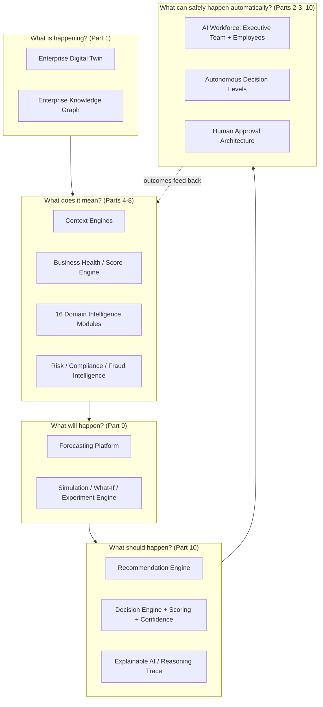

### 0.7 Relationship to Prior Documents

| Prior document | What it already committed to (cited, not redesigned) | What this document adds |
|---|---|---|
| `DATABASE.md` §3.1, and its full model catalog | `workspaceId`-scoped multi-tenancy, the operational schema (users, workspaces, business profiles, and every domain model) as sole source of truth | The Knowledge Graph as a projection over that schema (Part 1), and the Domain Intelligence layer that reads it (Parts 5–8) |
| `AUTH_ARCHITECTURE.md`'s RBAC permission catalog, session model | Role/permission catalog, `WorkspaceMember` roles, least-privilege enforcement | AI Employees bound to that exact catalog (Part 2), never a parallel AI-specific permission system |
| `API_CONTRACT.md`'s resource/versioning/SSE conventions | The wire contract every intelligence module's data ultimately flows through | Nothing new at the contract level — intelligence surfaces are additional resources following the same conventions |
| `BACKEND_ARCHITECTURE.md` §7.7 `FeatureFlagEngine`, §8.5 idempotency, §11 ports, §15.6 source-of-truth philosophy | Feature-gated rollout, safe-retry mutations, port/adapter abstraction, Postgres-as-truth | Business Experiment Engine reuses the flag engine (Part 9); every autonomous action reuses the idempotency pattern (Part 10); E1 restates §15.6 at the intelligence-layer level |
| `AI_PLATFORM_ARCHITECTURE.md` §2–§9 (AI Gateway, Prompt/Context/Memory engines, Hybrid Search, Agent Runtime, Tool Calling, Multi-Agent, Workflow Engine, AI Credits) | The entire agent execution substrate | Every AI Employee (Part 2) *is* an Agent Runtime instance; the Context Engines (Part 4) extend the Context Builder; Cross-Agent Collaboration (Part 3) extends Multi-Agent communication; nothing here re-implements a model call, a memory tier, or a tool-permission check |
| `CLOUD_INFRASTRUCTURE.md` §2.1 Enterprise-Isolated environments, §11 observability, §13.4 multi-region staging, §14.6 audit infrastructure | Dedicated-tenant infrastructure pattern, the telemetry/tracing stack, phased multi-region rollout, append-only audit store | Holding Company Architecture (Part 14) reuses Enterprise-Isolated environments for subsidiaries requiring hard isolation; Business Telemetry (Part 16) is a business-semantic layer over that same observability stack; every AI Employee decision is an audit-infrastructure event |
| `FRONTEND_ARCHITECTURE.md` §4.10 Dashboard Shell, §9.5 AI Employee Workspace step-tree, §13.7 experimentation, §14.1 plugin sandboxing | The Dashboard Shell, the step-tree AI-run visualization, flag-based experimentation, iframe-sandboxed plugin execution | The Executive Command Center (Part 11) is rendered through the Dashboard Shell; every AI Employee's reasoning trace (Part 10) renders through the exact step-tree UI already built for the single-agent case; Business Experiment Engine reuses the experimentation framework; third-party connectors (Part 13) that execute code reuse plugin sandboxing |

---

## Part 1 — Enterprise Digital Twin & Knowledge Graph

### 1.1 Enterprise Digital Twin (Item 4)

**Purpose & Architecture.** A continuously-materialized, AI-consumable representation of the business's actual current state — the substrate every other module in this document reads from. It is **not** a separate database: it is a read-optimized projection combining (a) `DATABASE.md`'s operational schema (the authoritative record of every workspace, member, deal, invoice, project, and so on), (b) `AI_PLATFORM_ARCHITECTURE.md` §6's layered memory tiers (Working through Long-Term, cited), and (c) the Enterprise Knowledge Graph's relationship layer (§1.2). The Digital Twin is refreshed incrementally as operational data changes (via the same event-driven invalidation pattern `CLOUD_INFRASTRUCTURE.md`'s architecture and `FRONTEND_ARCHITECTURE.md` §5.9's real-time cache invalidation already establish for keeping derived views current) — never batch-rebuilt from scratch as a default mode, though a full rebuild remains available as a recovery path (§1.1 Failure Recovery, below).

**Inputs, Outputs & Internal Components.** Inputs: every write to `DATABASE.md`'s schema, emitted as a domain event (`BACKEND_ARCHITECTURE.md`'s Event Bus, cited); external intelligence feeds (Part 12) tagged by provenance (E10). Outputs: a queryable, entity-and-relationship-shaped view consumed by every Context Engine (Part 4), Intelligence module (Parts 5–8), and the Simulation Engine (Part 9, which forks it). Internal components: an **Entity Materializer** (projects operational rows into Digital Twin entities), a **Relationship Materializer** (feeds the Knowledge Graph, §1.2), and a **Staleness Tracker** (marks which entities have pending, not-yet-materialized updates, so a consumer can distinguish "current" from "eventually consistent" data — critical for a Decision Engine, Part 10, that must know how fresh its inputs are before acting).

**Data Flow & Decision Logic.** Write to `DATABASE.md` → domain event emitted → Entity/Relationship Materializer consumes it → Digital Twin projection updated → dependent Intelligence modules' cached signals (Parts 5–8) are invalidated and recomputed on next read, mirroring `FRONTEND_ARCHITECTURE.md` §5.9's targeted-invalidation-over-full-clear discipline applied at the business-intelligence layer rather than the UI-cache layer.

**Dependencies.** `DATABASE.md` (sole source of truth), `BACKEND_ARCHITECTURE.md`'s Event Bus, `AI_PLATFORM_ARCHITECTURE.md` §6 memory tiers, §1.2's Knowledge Graph.

**Security, Privacy & Failure Recovery.** The Digital Twin inherits `DATABASE.md`'s and `AUTH_ARCHITECTURE.md`'s workspace-scoping and RBAC exactly — a query against the Digital Twin is authorized identically to a query against the underlying operational data, never a separate, looser authorization surface. Recovery: because the Digital Twin is a pure, deterministic projection (E1), it is always fully reconstructible from `DATABASE.md` plus the memory tiers — a corrupted or lost projection is a rebuild, never a data-loss event, directly inheriting `CLOUD_INFRASTRUCTURE.md` §8.5's Business Continuity classification of "recoverable-from-source-of-truth" systems.

**Performance & Scalability.** Incremental, event-driven materialization keeps the Twin's staleness bounded (typically sub-second to low-second) without requiring every read to touch the full operational schema — the same "cache computed from source of truth, invalidated on write" shape as `FRONTEND_ARCHITECTURE.md` §5.9's server-state cache, applied one layer deeper in the stack.

**Operational Considerations & Trade-offs.** Projection freshness versus rebuild cost is the central trade-off: full rebuilds are correctness-guaranteed but expensive at scale and reserved for genuine corruption recovery or schema-evolution migrations (Part 18); incremental materialization is the default and carries a small, tracked (Staleness Tracker) risk of eventual-consistency lag the Decision Engine (Part 10) must account for before high-stakes autonomous action.

**Future Evolution.** As Part 14's multi-company holding structures mature, the Digital Twin gains a hierarchical shape (a subsidiary's Twin, and a holding company's aggregate Twin built from consenting subsidiaries' Twins) without changing its fundamental projection-not-source-of-truth nature.

### 1.2 Enterprise Knowledge Graph (Item 5) & 1.3 Business Entity Graph (Item 6)

**Purpose & Architecture.** The relationship layer of the Digital Twin: a typed graph of business entities (Organization, Department, Employee — human or AI, Customer, Vendor, Product, Deal, Project, Document, Decision) and typed, weighted relationships between them (reports-to, owns, depends-on, affects, mentions, negotiated-with). "Business Entity Graph" (item 6) names the entity/node layer specifically; "Enterprise Knowledge Graph" (item 5) names the full graph including edges and the query/traversal capability over them — one system, described together because splitting them would fragment a single coherent decision.

**Internal Components.** Entities are materialized 1:1 from `DATABASE.md`'s relational rows (a `Deal` row becomes a `Deal` node, a foreign key becomes a structural edge) — a direct, deterministic projection, never a hand-maintained parallel model. Semantic edges (a document *mentions* a customer, two deals are *similar*) are derived from `AI_PLATFORM_ARCHITECTURE.md` §6–§7's embedding/`pgvector` similarity infrastructure, cited and reused rather than reimplemented — the Knowledge Graph's semantic layer is a consumer of that existing vector infrastructure, not a second one.

**Data Flow & Decision Logic (graph storage decision).** Phase 1–2: relationships are modeled as a generic, indexed edge table within the existing Postgres database (`sourceEntityType`, `sourceEntityId`, `targetEntityType`, `targetEntityId`, `relationshipType`, `weight`, `metadata`), traversed via recursive queries — deliberately *not* a new database technology, consistent with `CLOUD_INFRASTRUCTURE.md`'s vendor-minimization discipline (P18 of that document) and this document's E1. Phase 3: if graph-traversal query complexity or latency genuinely outgrows what indexed recursive Postgres queries can serve (a capacity-planning-driven decision, mirroring `CLOUD_INFRASTRUCTURE.md` §12.1's discipline), a dedicated graph-query engine is introduced strictly as an **additional, CDC-fed read index** — never the source of truth, never a write target — see ADR-EI-001 (Part 17).

**Dependencies.** `DATABASE.md` (entity source), `AI_PLATFORM_ARCHITECTURE.md` §6–§7 (semantic edges), §1.1's Digital Twin (the graph is its relationship layer).

**Security, Privacy & Failure Recovery.** Every graph query is workspace-scoped and RBAC-checked identically to §1.1; a corrupted graph index is rebuilt deterministically from `DATABASE.md` plus the vector store, the same recoverability guarantee as the Digital Twin itself.

**Performance & Scalability.** Phase-gated exactly as `CLOUD_INFRASTRUCTURE.md`'s own subsystems are (§9.4's shared-Redis-then-split pattern is the direct precedent this decision follows) — the graph-storage technology is deferred, not the graph *capability*, which exists from Phase 1 via the Postgres edge table.

**Future Evolution.** The CDC-fed dedicated graph engine (if triggered) is designed as a drop-in acceleration layer behind the identical query interface, so every consumer (Context Engines, Part 4; Decision Engine, Part 10) is unaffected by the underlying storage migration — the same "swap the implementation behind a stable interface" discipline `BACKEND_ARCHITECTURE.md`'s ports and `AI_PLATFORM_ARCHITECTURE.md`'s provider abstractions already apply elsewhere.

### 1.4 Relationship Intelligence (Item 7)

**Purpose & Architecture.** The reasoning layer over the Knowledge Graph's raw edges: computing derived relationship *insights* — which customers are at risk because their champion (an Employee entity) recently changed roles (an edge mutation detected), which deals are stalled because a dependency edge (an unresolved blocking task) hasn't closed, which vendors have unusually concentrated relationship weight (a single-vendor dependency risk). Relationship Intelligence is a consumer of the Knowledge Graph, feeding Risk Intelligence (Part 8) and the Recommendation Engine (Part 10), never a third graph-adjacent storage layer.

**Data Flow & Decision Logic.** Graph edge change (§1.2) → Relationship Intelligence's pattern detectors evaluate the changed neighborhood (not the whole graph, for performance — a bounded-radius traversal) → a derived insight, scored and provenance-tagged, is emitted to the Recommendation Engine.

**Operational Considerations & Trade-offs.** Bounded-radius evaluation (versus whole-graph re-evaluation on every change) trades some cross-graph pattern-detection completeness for tractable, real-time-compatible performance — full-graph analysis (e.g., detecting an emergent multi-hop risk pattern) is run as a scheduled, coarser-grained batch job (`BACKEND_ARCHITECTURE.md` §8's Scheduler, cited) rather than on every single edge mutation.

### 1.5 Organization Modeling (Item 8), 1.6 Department Modeling (Item 9) & 1.7 Employee Modeling (Item 10)

**Purpose & Architecture.** These three items are the specific entity types the Knowledge Graph's org-chart neighborhood is built from, extending — never replacing — `DATABASE.md`'s existing workspace/member/role models. **Organization** is the top-level entity (a workspace, or, for a holding company, Part 14's Organization Group). **Department** is a new, lightweight grouping entity (a node with a name, a mandate, and a reports-to edge to another Department or the Organization root) that both human and AI Employees (Part 2) are assigned to via a membership edge — modeled additively over `DATABASE.md`'s existing member/role tables, not a schema redesign. **Employee** modeling is the critical unification point: a single Employee entity type carries an `occupancyType` of `HUMAN`, `AI`, or `HYBRID` (an AI-assisted human) — an AI Employee (Part 2) is not a different kind of node in the graph, it *is* an Employee entity, occupying a seat, with a reports-to edge, exactly as a human Employee would, which is the concrete graph-level expression of §0.4's Business Operating System Philosophy.

**Data Flow & Decision Logic.** An Employee entity's `occupancyType` determines which downstream systems engage it: `HUMAN` and `HYBRID` seats surface in `FRONTEND_ARCHITECTURE.md`'s Workspace Shell as ordinary team members; `AI` and `HYBRID` seats additionally instantiate an Agent Runtime configuration (Part 2) bound to that seat's Department mandate and reports-to chain.

**Security, Privacy & Failure Recovery.** An AI Employee's seat carries the exact same RBAC role assignment (`AUTH_ARCHITECTURE.md`) a human occupying that seat would carry — reassigning a seat from `HUMAN` to `AI` occupancy is a role-assignment change, not a new permission grant, closing off any possibility of an AI Employee silently acquiring broader authority than the seat itself confers (E3).

**Future Evolution.** The `occupancyType` model is what makes Part 2's AI Workforce architecture non-disruptive to adopt incrementally — a business can staff a Department with a human, an AI, or both, and change that assignment over time, without any structural change to the Organization/Department graph itself.

**Diagram 2 — Enterprise Knowledge Graph: Entity & Relationship Model**

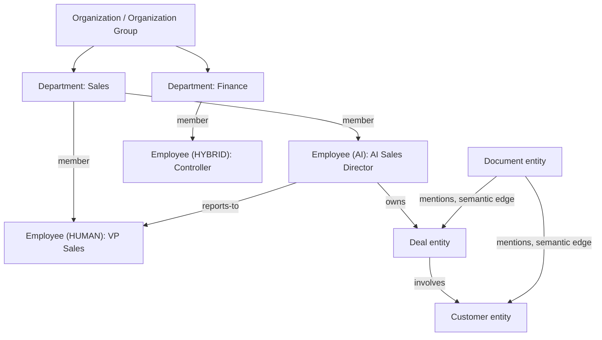

**Diagram 3 — Digital Twin Materialization Pipeline**

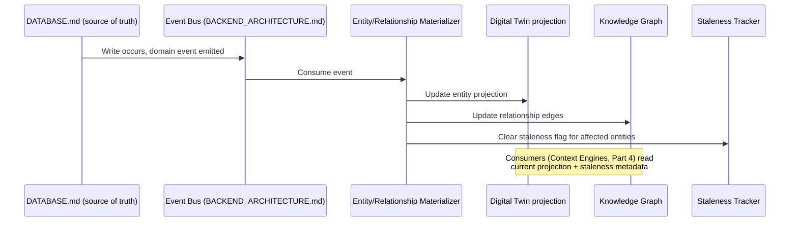

---

## Part 2 — AI Workforce Architecture

### 2.1 AI Workforce Architecture (Item 11)

**Purpose & Architecture.** The AI Workforce is the set of AI Employees (§1.7) staffing an organization's Department structure (§1.6), each a named, role-scoped Agent Runtime instance (E2). "Architecture," here, names the four things every AI Employee shares regardless of role: **(1) a Mandate** — a role-scoped system prompt sourced from `AI_PLATFORM_ARCHITECTURE.md` §3's Prompt Registry, versioned and reviewable like any other prompt asset; **(2) an Authority Boundary** — the exact `AUTH_ARCHITECTURE.md` RBAC role and permission set the seat carries, plus an assigned Autonomous Decision Level per action-type (Part 10); **(3) a Context Scope** — which Context Engine (Part 4) resolves its working context, scoped to its Department and reports-to chain by default; **(4) a Memory Scope** — which tiers of `AI_PLATFORM_ARCHITECTURE.md` §6's memory architecture it reads/writes, per §2.7's Memory Synchronization model.

**Inputs, Outputs & Internal Components.** Inputs: the Digital Twin (Part 1) scoped by its Context Engine; delegated tasks (§2.6); Decision Council deliberations (§2.9) it participates in. Outputs: recommendations and (where its Decision Level permits) actions, both always carrying a reasoning trace (Part 10); delegated sub-tasks to subordinate AI Employees.

**Data Flow & Decision Logic.** A task reaches an AI Employee (via a human request, a scheduled review cadence, or a triggering business event from the Digital Twin) → its Context Engine assembles working context → its Agent Runtime configuration (Planner→Executor→Critic→Reflection, `AI_PLATFORM_ARCHITECTURE.md` §9, cited) executes bounded by its Authority Boundary → output is a recommendation, a Decision-Level-gated action, or a delegation.

**Dependencies.** `AI_PLATFORM_ARCHITECTURE.md` §2–§9 in full (this is the substrate every AI Employee runs on), `AUTH_ARCHITECTURE.md`'s RBAC, Part 1's Digital Twin/Knowledge Graph, Part 4's Context Engines, Part 10's Decision Engine and Autonomous Decision Levels.

**Security, Privacy & Failure Recovery.** An AI Employee's Agent Runtime instance is stateless between invocations except for its assigned Memory Scope tiers — a crashed or misbehaving AI Employee is recoverable by simply re-invoking it from its Mandate and current Memory Scope, never requiring special-cased recovery logic distinct from any other Agent Runtime invocation `AI_PLATFORM_ARCHITECTURE.md` already handles.

**Performance & Scalability.** AI Employee invocations run on the exact compute/cost infrastructure `AI_PLATFORM_ARCHITECTURE.md` and `CLOUD_INFRASTRUCTURE.md` already provision (AI Gateway, Provider Router, GPU-readiness) — the AI Workforce introduces no new execution substrate to scale, only a new *organizing structure* over the existing one.

**Operational Considerations & Trade-offs.** Modeling every AI Employee as a full Agent Runtime instance (rather than a lighter-weight, single-purpose automation) costs more per-invocation compute/token budget than a narrow scripted automation would, an explicit, accepted trade given that the value of an AI Employee is precisely its ability to reason across its Mandate's full scope, not execute one fixed script.

**Future Evolution.** As Part 14's multi-company holding structures mature, an AI Employee's Authority Boundary and Context Scope both become parameterizable per-subsidiary, without any change to the Agent Runtime substrate itself.

### 2.2 AI Employee Hierarchy (Item 12)

**Purpose & Architecture.** The reports-to structure among AI (and human) Employees is not a separate hierarchy from the organization's real org chart (§1.5–§1.7) — it *is* that org chart, filtered to seats with `AI` or `HYBRID` occupancy. An AI Employee's position in the hierarchy determines its default escalation path (§2.8's Conflict Resolution), its delegation authority (§2.6), and which Context Engine scope (Part 4) it defaults to (an AI Department Director gets department-wide context; an AI individual-contributor-equivalent gets task-scoped context only).

**Diagram 4 — AI Employee Hierarchy (mirrors the real org chart, §1.5-1.7)**

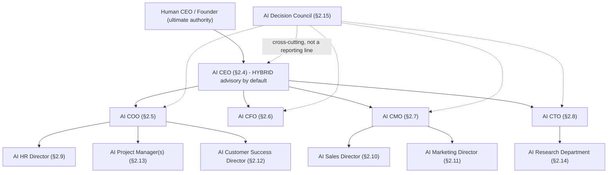

### 2.3 AI Executive Team (Item 13) — Shared Template

**Purpose & Architecture.** Items 14–22 (AI CEO, COO, CFO, CMO, CTO, HR Director, Sales Director, Marketing Director, Customer Success Director) share one template, instantiated per role: **Mandate scope** (which Department(s) and business questions the role owns); **Default Decision Level** (Part 10 — every role defaults conservatively and is only raised deliberately, per business, per action-type, E4); **Primary Intelligence modules consumed** (Parts 5–8, the role's "instrument panel"); **Typical delegation targets** (§2.13's AI Project Managers and department individual-contributor-equivalent seats). Every AI Executive, without exception, defaults to a `HYBRID`-oriented advisory posture — recommending to and collaborating with a human executive or owner rather than assuming full autonomous authority — consistent with E4 and with `PRD.md`'s stated persona range spanning solo founders (who likely want strong AI-executive support) through enterprises (where an AI Executive is far more likely to augment an incumbent human executive than replace one).

**Dependencies (shared across all nine).** `AUTH_ARCHITECTURE.md` RBAC (the specific role/permission set differs per instance, listed below); Part 4's Context Engines (Organization-scoped for CEO/COO/CFO, Department-scoped for the rest); Part 10's Decision Engine and Autonomous Decision Levels.

**Security, Privacy & Failure Recovery (shared).** Every AI Executive's Authority Boundary is independently configured — compromising or misconfiguring one role's permissions never grants another role's authority, since each is a distinct RBAC role assignment (§1.7), not a shared "AI executive" superuser concept.

### AI Executive Instances (Items 14–22)

| Role (Item #) | Mandate scope | Primary Intelligence modules consumed (Parts 5–8) | Typical actions at default (conservative) Decision Level |
|---|---|---|---|
| **AI CEO** (14) | Whole-organization strategic view; synthesizes every other executive's input for the human CEO/founder | Business Health Engine, KPI/Goal/OKR Intelligence, Strategic Analytics (Part 11) | Surfaces cross-department recommendations and convenes the AI Decision Council (§2.15) for decisions spanning multiple domains; never unilaterally overrides another AI Executive's domain |
| **AI COO** (15) | Operational execution, cross-department coordination, project/workflow health | Operations, Supply Chain, Inventory, Support Intelligence | Recommends process/workflow changes (Part 10's Workflow Intelligence); flags execution risk to AI CEO |
| **AI CFO** (16) | Financial health, cashflow, budget allocation, forecasting oversight | Revenue, Profitability, Cashflow, Expense, Finance, Accounting Intelligence, Revenue Forecasting | Recommends budget/pricing actions; **never authorized to execute a fund transfer or irreversible financial commitment autonomously at any Decision Level short of explicit Enterprise Governance sign-off** (Part 15) |
| **AI CMO** (17) | Brand, marketing strategy, cross-channel performance | Marketing Intelligence, Customer Intelligence, Market/Competitive Intelligence (Part 12) | Recommends campaign/positioning changes; coordinates with AI Marketing Director for execution |
| **AI CTO** (18) | Technology strategy, AI Research Department oversight, platform health signals | Operational Metrics, AI Quality Metrics (Part 16) | Recommends technical/AI-capability investment priorities; the one AI Executive role most directly informed by this document series' own prior architecture documents as inputs |
| **AI HR Director** (19) | Workforce (human and AI seat) health, hiring, retention | Human Resources, Hiring, Retention Intelligence, Productivity Intelligence | Recommends hiring/retention actions; **AI Employee seat provisioning itself (creating a new AI Employee) always requires explicit human approval regardless of Decision Level** (Part 10, Part 15) |
| **AI Sales Director** (20) | Pipeline, deal health, sales team performance | Sales Intelligence, Customer Intelligence, Revenue Forecasting | Recommends deal prioritization, at higher-trust configurations may draft (never autonomously send, per Part 10's approval gates for external communication) outreach |
| **AI Marketing Director** (21) | Campaign execution, channel performance | Marketing Intelligence, Customer Forecasting | Recommends/optionally executes campaign adjustments within a pre-approved budget envelope (an explicit, bounded Decision Level configuration, Part 10) |
| **AI Customer Success Director** (22) | Retention, support quality, account health | Support Intelligence, Retention Intelligence, Customer Intelligence | Recommends at-risk-account interventions; escalates to AI Sales Director or human for contract-level actions |

### 2.13 AI Project Manager (Item 23)

**Purpose & Architecture.** Distinct from the Executive Team in scope, not in mechanism — an AI Project Manager is a per-project (not per-Department) Agent Runtime instance, typically delegated to (§2.6) by an AI Executive or spawned directly for a defined initiative, tracking task/milestone health against `DATABASE.md`'s project/task models and `BACKEND_ARCHITECTURE.md`'s Workflow Engine (both cited), surfacing blockers via Relationship Intelligence (§1.4) rather than a bespoke tracking mechanism.

**Future Evolution.** Multiple concurrent AI Project Managers are the first genuinely multi-instance-of-one-role case in the Workforce — their coordination (when two projects compete for the same resource) is handled by §2.7's Negotiation protocol exactly as it would be between two Executive-tier roles, no special-cased mechanism required.

### 2.14 AI Research Department (Item 24)

**Purpose & Architecture.** A distinct AI Employee grouping (reporting to the AI CTO, Diagram 4) whose Mandate is explicitly exploratory rather than execution-oriented — synthesizing External Intelligence (Part 12), running Business Simulation Engine scenarios (Part 9) at the AI CEO's or Decision Council's request, and feeding Organizational Learning (Part 11) with structured findings. It is the one AI Workforce grouping whose default Decision Level is capped at Recommend-only platform-wide (Part 10) — a research function that could autonomously act would contradict its own exploratory mandate.

### 2.15 AI Decision Council (Item 25)

**Purpose & Architecture.** The AI Workforce's structured, cross-functional deliberation body — convened (by the AI CEO, by a human, or by an automated trigger when the Decision Engine, Part 10, detects a decision whose scored impact spans multiple Executives' domains) rather than a standing, always-running process. The Council is explicitly **not** a single mega-agent with combined authority — it is a bounded-round, moderated multi-agent deliberation (§2.16's Cross-Agent Collaboration protocol) among the relevant AI Executives, producing a synthesized recommendation with each participant's individual reasoning trace preserved and attributable (never collapsed into one opaque "the Council decided" output — E5 applies to Council output exactly as it does to any single AI Employee's).

**Data Flow & Decision Logic.** Trigger (cross-domain decision detected or requested) → AI CEO (or designated moderator role) convenes relevant Executives → each contributes its domain's Intelligence-module-informed position → bounded negotiation (§2.17) resolves disagreement → a synthesized recommendation, with dissenting positions explicitly preserved rather than silently dropped, is submitted to the Decision Engine (Part 10) for scoring and, if applicable, the Human Approval Architecture.

**Dependencies.** Every AI Executive role (§2.4–§2.12), §2.16–§2.19's collaboration/negotiation/conflict/delegation protocols, Part 10's Decision Engine.

**Operational Considerations & Trade-offs.** A moderated, bounded-round deliberation is slower than a single-agent decision, an explicit, accepted cost for decisions whose cross-domain impact justifies the deliberateness — the trigger threshold (which decisions warrant convening the Council versus being handled by one Executive alone) is itself a configurable, business-specific parameter, defaulting conservatively (more decisions routed to Council review, not fewer) until a business's own Organizational Learning (Part 11) history justifies loosening it.

**Diagram 5 — AI Decision Council Deliberation Flow**

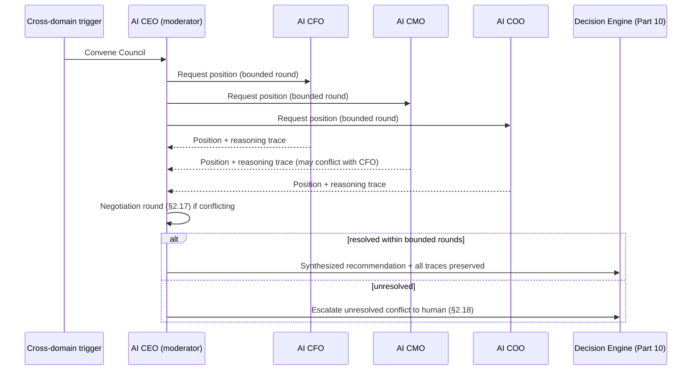

---

## Part 3 — Cross-Agent Collaboration

### 3.1 Cross-Agent Collaboration (Item 26)

**Purpose & Architecture.** AI Employees communicate exclusively through `AI_PLATFORM_ARCHITECTURE.md`'s existing Multi-Agent communication subsystem (its Event Bus, cited directly, never a second messaging mechanism) — typed events (`proposal`, `objection`, `approval`, `delegation`, `status-update`) published and subscribed to per the Event Bus's existing pattern, with the AI Employee Hierarchy (§2.2) determining default subscription scope (an AI Employee subscribes to its own Department's events and its direct reports'/manager's events by default, not the entire organization's event stream, for the same tractability reason `FRONTEND_ARCHITECTURE.md` §6.3 scopes its WebSocket presence channel per workspace rather than globally).

**Inputs, Outputs & Internal Components.** Inputs: typed collaboration events from peer/subordinate/superior AI Employees. Outputs: the same, plus — when collaboration concludes — a synthesized position or delegated task. Internal components: none new — this is entirely a usage pattern over `AI_PLATFORM_ARCHITECTURE.md`'s existing Event Bus and Agent Runtime, which is the point (E2).

**Data Flow & Decision Logic.** An AI Employee's Planner step (`AI_PLATFORM_ARCHITECTURE.md` §9) may determine that its current task requires another AI Employee's input or authority — it publishes a typed `proposal` or `delegation` event rather than attempting the out-of-scope action itself, honoring its own Authority Boundary (§2.1) by construction rather than by external enforcement alone.

**Dependencies.** `AI_PLATFORM_ARCHITECTURE.md` §9's Multi-Agent communication and Event Bus, §2.2's Hierarchy for default subscription scoping.

**Security, Privacy & Failure Recovery.** Collaboration events carry the same workspace/RBAC scoping as any other Digital Twin access — an AI Employee cannot receive or act on a collaboration event outside its own Authority Boundary, event bus visibility notwithstanding (defense in depth: bus-level scoping *and* authority-level enforcement, neither alone is trusted as sufficient).

**Operational Considerations & Trade-offs.** Bounding subscription scope to hierarchy-adjacent events (rather than organization-wide visibility) trades some cross-cutting awareness for tractable event volume and for the least-privilege posture E3 requires — an AI Employee that genuinely needs broader visibility for a specific task requests it explicitly (via delegation, §3.4, or Council convening, §2.15) rather than defaulting to broad access.

### 3.2 Agent Negotiation (Item 27)

**Purpose & Architecture.** A structured, **bounded-round** proposal/counter-proposal protocol for resolving resource or priority conflicts between AI Employees (the canonical example: AI CFO proposes a budget cut an AI CMO's campaign plan depends on) — never an unbounded, open-ended exchange, directly mirroring `AI_PLATFORM_ARCHITECTURE.md` §9's Agent Runtime bounded-iteration-and-budget philosophy applied to inter-agent exchange rather than single-agent reasoning.

**Data Flow & Decision Logic.** Round 1: each party states its position with supporting Intelligence-module evidence (Parts 5–8). Round 2 (if unresolved): each party may revise its position once, informed by the other's Round 1 evidence. Round 3 (if still unresolved): negotiation terminates and escalates to Conflict Resolution (§3.3) — the round cap is a configurable business parameter, defaulting to three, chosen to bound compute/token cost (E4-adjacent discipline reused from the AI Platform's cost-protection concerns, `AI_PLATFORM_ARCHITECTURE.md` cited) while giving genuine resolution opportunity before escalating.

**Operational Considerations & Trade-offs.** A hard round cap trades some resolution completeness (a negotiation that might have resolved in round four never gets the chance) for predictable cost and latency — accepted because unresolved negotiations still make progress by narrowing the disagreement before escalating, rather than escalating a completely unexamined conflict.

### 3.3 Agent Conflict Resolution (Item 28)

**Purpose & Architecture.** The escalation ladder invoked when Negotiation (§3.2) fails to resolve within its round cap: **(1) AI Decision Council review** (§2.15, if the conflict spans domains a Council convening would naturally cover) — **(2) Human Approval Architecture** (Part 10, if Council review also fails to resolve, or if either party's action is at a Decision Level requiring human sign-off regardless) — **never** silent unilateral resolution by one AI Employee overriding another, even when one party's role is nominally senior in the Hierarchy (§2.2) — seniority informs *whose recommendation carries more weight in deliberation*, it never grants authority to silently override, which would violate E5's traceability requirement.

**Diagram 6 — Agent Negotiation & Conflict Resolution Escalation Ladder**

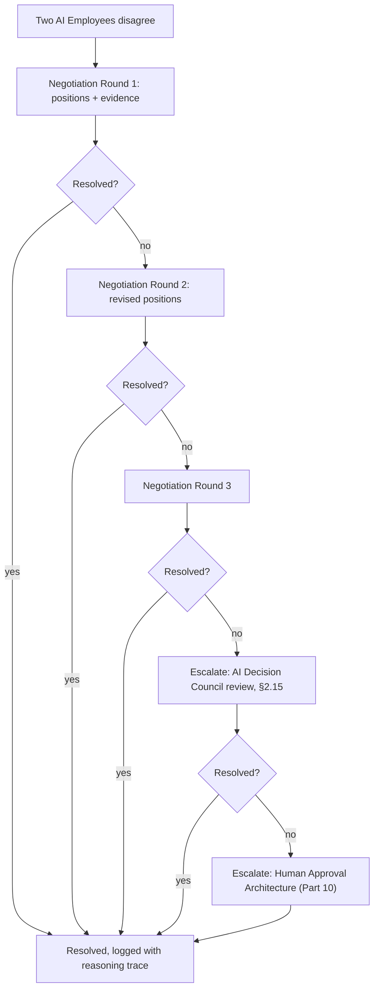

### 3.4 Agent Delegation (Item 29)

**Purpose & Architecture.** An AI Employee may delegate a sub-task to a subordinate AI Employee (its Hierarchy report, §2.2, or a purpose-spawned AI Project Manager, §2.13) — implemented as a scoped Agent Runtime sub-invocation whose Authority Boundary is **always a subset of, never broader than,** the delegator's own (E3, enforced structurally: a delegation event's permission payload is computed as an intersection of the delegator's Authority Boundary and the delegate's own role-based permissions, never a union). This mirrors real organizational delegation exactly — a manager can ask a report to do something within the report's own role, never grant the report authority the manager doesn't itself possess.

**Dependencies.** §2.1's Authority Boundary model, `AUTH_ARCHITECTURE.md` RBAC (the permission-intersection computation is an RBAC operation, not a new authorization mechanism).

**Security, Privacy & Failure Recovery.** Because delegated authority is structurally bounded (an intersection, never a union), a delegation chain of any depth cannot accumulate authority beyond what the top-of-chain delegator legitimately holds — closing a privilege-escalation-via-delegation-chain vector before it can exist.

### 3.5 Agent Memory Synchronization (Item 30)

**Purpose & Architecture.** Extends `AI_PLATFORM_ARCHITECTURE.md` §6's layered memory architecture (Working, Session, User, Workspace, Business, Organizational, Long-Term, cited) with an explicit sharing rule across AI Employees: **Workspace, Business, and Organizational tiers are shared** across every AI Employee in that workspace (an AI CFO's learned context about a customer's payment history is available to the AI Sales Director without manual re-briefing) — **Working and Session tiers remain private** to the individual AI Employee invocation that produced them (one AI Employee's in-progress reasoning is not another's to read mid-task, preserving both performance — no need to synchronize ephemeral state broadly — and the integrity of each AI Employee's own accountable reasoning trace, E5).

**Data Flow & Decision Logic.** An AI Employee's Reflection step (`AI_PLATFORM_ARCHITECTURE.md` §9) that produces a durable learning (not just task-local reasoning) writes it to the Workspace/Business/Organizational tier, from which it becomes available to every other AI Employee's Context Engine (Part 4) on their next invocation — never pushed proactively into another AI Employee's active context, always pulled on-demand by the consuming Context Engine, keeping memory synchronization read-driven rather than requiring a broadcast mechanism.

**Operational Considerations & Trade-offs.** Read-driven (pull) synchronization over push-broadcast trades some latency (a peer's learning isn't instantly reflected in another AI Employee's next reasoning step until that step actually queries shared memory) for materially simpler, more scalable architecture — no fan-out broadcast infrastructure is needed, consistent with keeping the AI Workforce's coordination overhead proportional to actual task frequency, not to Workforce headcount.

**Diagram 7 — Agent Memory Synchronization Across Tiers**

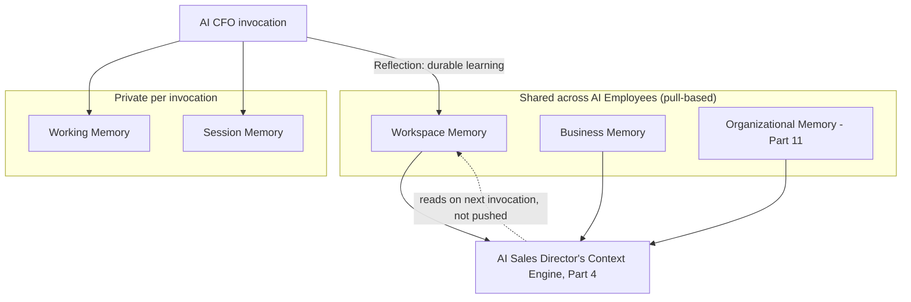

---

## Part 4 — Context Engines

*Common to this Part:* every Context Engine is a specialization of `AI_PLATFORM_ARCHITECTURE.md` §4's existing Context Builder — this Part does not introduce a new context-assembly mechanism, it defines the four scopes the AI Workforce's Hierarchy (§2.2) resolves context at.

### 4.1 Business Context Engine (Item 31)

**Purpose & Architecture.** The broadest scope — assembles whole-organization context (Digital Twin state, Business Health Engine score, active Decision Council deliberations) for the AI CEO and for any cross-department reasoning task. Built entirely on `AI_PLATFORM_ARCHITECTURE.md` §4's Context Builder, §4's Compression/Ranking/Window-Optimization (cited) applied at organization scale.

### 4.2 Organization Context Engine (Item 32)

**Purpose & Architecture.** A refinement of the Business Context Engine scoped to a specific legal/operational Organization entity (§1.5) — relevant once Part 14's holding-company structures mean "the business" is no longer a single Organization; this engine is what lets an AI Executive reason about one subsidiary without inadvertently blending in another's data (E7).

### 4.3 Department Context Engine (Item 33)

**Purpose & Architecture.** Scoped to a single Department (§1.6) and its Knowledge Graph neighborhood — the default context scope for every AI Executive role except the AI CEO (§2.4–§2.12's table). Assembles the Department's relevant Domain Intelligence module outputs (Parts 5–8) rather than the whole Digital Twin, keeping context window usage proportional to the task's actual scope (`AI_PLATFORM_ARCHITECTURE.md` §4's Window-Optimization, cited, applied at this narrower default).

### 4.4 Employee Context Engine (Item 34)

**Purpose & Architecture.** The narrowest scope — a single Employee entity's (human or AI, §1.7) task-local context, used by AI Project Managers (§2.13) and any individual-contributor-equivalent AI seat. Also the context scope for `FRONTEND_ARCHITECTURE.md`'s AI Copilot (§9.1 of that document, cited) when a human employee asks a personal, task-scoped question rather than a department- or business-wide one — the same Context Engine hierarchy serves both AI Employee reasoning and the human-facing Copilot, avoiding two parallel context-assembly systems.

**Diagram 8 — Context Engine Scope Hierarchy**

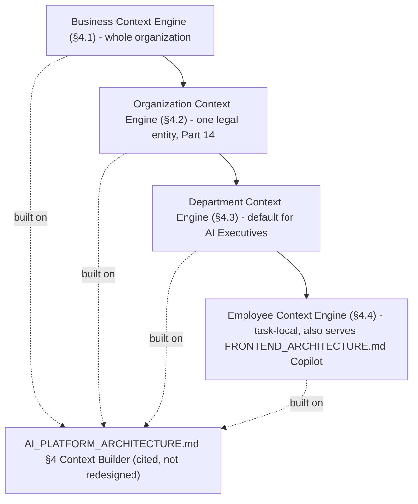

---

## Part 5 — Business Health & Performance Scoring

### 5.1 Business Health Engine (Item 35) & 5.2 Business Score Engine (Item 36)

**Purpose & Architecture.** The Business Health Engine computes one continuously-updated, composite score (and a small set of sub-scores per major domain — financial, operational, customer, workforce) analogous to a business "credit score," aggregating weighted signals from every Domain Intelligence module (Part 6). The Business Score Engine (item 36) is the underlying, reusable **scoring framework** — normalization, weighting, and time-decay logic — that the Business Health Engine is the primary consumer of, but which also underlies Decision Scoring (Part 10) and KPI/Goal gap-scoring (§5.3–§5.5): one scoring framework, multiple consumers, never independently reimplemented per use case.

**Inputs, Outputs & Internal Components.** Inputs: every Domain Intelligence module's scored signal (Part 6), each tagged with a business-type-aware default weight (a services SMB's weighting differs from a SaaS startup's, per a configurable weighting profile). Outputs: the composite Health score and sub-scores, consumed by the Executive Command Center (Part 11) and the Recommendation Engine (Part 10, as a prioritization signal — a recommendation touching a currently-weak Health sub-score is ranked higher, all else equal).

**Data Flow & Decision Logic.** Domain Intelligence module recomputes a signal (triggered by Digital Twin updates, Part 1) → Business Score Engine normalizes and weights it → Business Health Engine recomposes the affected sub-score and composite score → Executive Command Center's cached display value is invalidated (the same targeted-invalidation discipline as Part 1's Digital Twin and `FRONTEND_ARCHITECTURE.md` §5.9).

**Operational Considerations & Trade-offs.** A single composite score risks oversimplifying a genuinely multi-dimensional business state — mitigated by always surfacing sub-scores alongside the composite (never composite-only), and by every score being traceable (E5) back to the specific Domain Intelligence signals that produced it, so "why is my Health score down" is always an answerable, not a black-box, question.

### 5.3 KPI Intelligence (Item 37), 5.4 Goal Intelligence (Item 38) & 5.5 OKR Intelligence (Item 39)

**Purpose & Architecture.** Three related, increasingly-structured tracking models over the same underlying mechanism: KPI Intelligence tracks arbitrary user-defined metrics against Digital Twin data; Goal Intelligence adds a target and timeframe; OKR Intelligence adds the Objective/Key-Result structure specifically, including cross-Department Key Result ownership (an edge in the Knowledge Graph, §1.2, linking an OKR entity to the Department(s) and Employee(s) — human or AI — accountable for it). All three are AI-assisted: gap detection (is a KPI trending away from its target), and recommendation generation (routed through the Recommendation Engine, Part 10) when a gap is detected, rather than purely passive tracking dashboards.

**Dependencies.** `DATABASE.md`'s presumed goal/metric-tracking data model (cited, extended with the Knowledge Graph ownership edges above, not redesigned), Part 1's Digital Twin (the data KPIs are computed from), Part 10's Recommendation Engine.

### 5.6 Performance Intelligence (Item 40) & 5.7 Productivity Intelligence (Item 41)

**Purpose & Architecture.** Performance Intelligence aggregates goal/OKR attainment and Domain Intelligence signals into per-Department and per-Employee (human and AI alike — E-consistent with §1.7's unified Employee model) performance views, feeding the AI HR Director's Mandate (§2.9's table) and Organizational Learning (Part 11). Productivity Intelligence is its throughput-focused sibling — task/workflow completion velocity, sourced from `BACKEND_ARCHITECTURE.md`'s Workflow Engine execution data (cited), including, notably, **AI Employee productivity metrics on the same footing as human productivity metrics** — an AI Sales Director's recommendation-acceptance rate and task-completion velocity are tracked exactly as a human Sales Director's would be, feeding AI Quality Metrics (Part 16) and, ultimately, whether a business chooses to raise that seat's Autonomous Decision Level (Part 10) over time.

**Diagram 9 — Business Health Engine Score Composition**

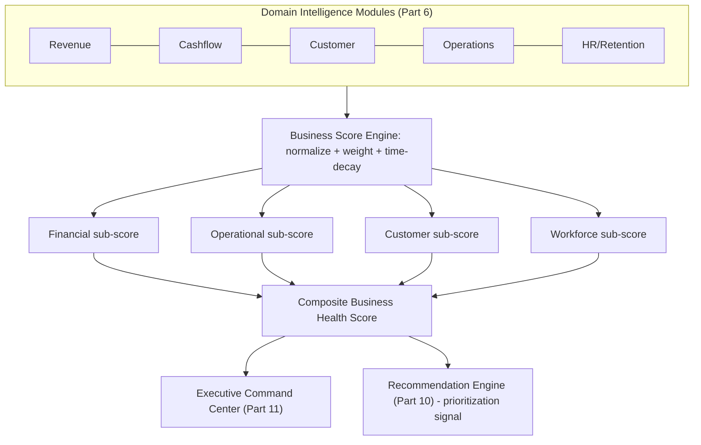

---

## Part 6 — Domain Intelligence Modules

### 6.0 Shared Template

**Purpose & Architecture (shared).** Every Domain Intelligence module follows one shape: it ingests a specific slice of the Digital Twin (Part 1) already sourced from `DATABASE.md`'s operational schema, computes domain-specific signals and a normalized sub-score (via the shared Business Score Engine, §5.2), and publishes those signals to two consumers — the Business Health Engine (§5.1) and the Recommendation Engine (Part 10) — while never itself triggering an action (E8: intelligence computes signals, it does not act). Each module is also the specific "instrument panel" one or more AI Executive roles' Mandate (§2.3's table) is built to consume.

**Dependencies (shared).** Part 1's Digital Twin (data source), §5.2's Business Score Engine (scoring framework), Part 9's Forecasting Platform (several modules feed or consume forecasts), Part 10's Recommendation/Decision Engine (consumer of every module's output).

**Security, Privacy & Failure Recovery (shared).** Every module inherits workspace/RBAC scoping identically to the Digital Twin (§1.1) — a module never has broader read access than the underlying data it's computed from would already permit the requesting AI Employee or human. Recovery is identical to §1.1's: every module's signal is a deterministic computation over Digital Twin data, always fully recomputable, never an independent source of truth.

### 6.1 Revenue Intelligence (Item 42)

**Purpose & Architecture.** Tracks revenue recognition, growth rate, and composition (new vs. expansion vs. renewal) from `DATABASE.md`'s billing/subscription models (cited), feeding Revenue Forecasting (§9.3) directly and the AI CFO's and AI Sales Director's Mandates. Its signal includes cohort-level decomposition (not just a top-line number) specifically because the Recommendation Engine (Part 10) needs enough granularity to recommend a *specific* lever (e.g., "expansion revenue from this cohort is underperforming," not merely "revenue is down"), consistent with E5's explainability requirement extending to intelligence signals, not only to final decisions.

### 6.2 Profitability Intelligence (Item 43) & 6.3 Cashflow Intelligence (Item 44)

**Purpose & Architecture.** Profitability Intelligence composes Revenue Intelligence with Expense Intelligence (§6.4) into margin and unit-economics signals. Cashflow Intelligence is architecturally distinct and deliberately more real-time-sensitive than either — it is the module most directly wired to Forecasting (§9.1's short-horizon cash-runway projection is treated as a first-class, always-on Cashflow Intelligence output, not an optional add-on) because cash-runway risk is the single most time-critical signal for the majority of `PRD.md`'s SMB personas, and because the AI CFO's default Decision Level (§2.3's table) explicitly forbids autonomous fund movement — meaning Cashflow Intelligence's entire value is in early, accurate, explainable warning, never in autonomous remediation.

### 6.4 Expense Intelligence (Item 45)

**Purpose & Architecture.** Categorized expense tracking and anomaly detection (an expense spike outside a category's historical pattern) feeding Fraud Detection (§8.4) as one of its primary signal sources, and Profitability Intelligence (§6.2) as a direct input — the one Domain Intelligence module with the most direct data-flow relationship to a Part 8 risk module, worth naming explicitly since expense anomalies are frequently the earliest observable signal of either fraud or simple operational drift.

### 6.5 Customer Intelligence (Item 46)

**Purpose & Architecture.** The most Knowledge-Graph-dependent Domain Intelligence module (§1.2–§1.4) — a Customer entity's health score is computed not just from its own transactional data but from its Relationship Intelligence neighborhood (champion changes, support-ticket-sentiment edges, deal-stage edges), directly feeding Retention Intelligence (§6.16), Sales Intelligence (§6.6), and the AI Customer Success Director's Mandate. Customer Intelligence is also the module External Intelligence's Competitive Intelligence (Part 12) most frequently cross-references, when a churn-risk signal correlates with a competitor's product launch.

### 6.6–6.16 Remaining Domain Intelligence Modules (Items 47–57)

| Module (Item #) | Primary data source (cited from `DATABASE.md`) | Primary consumer(s) | Distinguishing note |
|---|---|---|---|
| **Sales Intelligence** (47) | Deal/pipeline models | AI Sales Director | Pipeline velocity and stage-conversion signals, cross-referenced with Customer Intelligence (§6.5) for account-level context |
| **Marketing Intelligence** (48) | Campaign/channel models | AI CMO, AI Marketing Director | Feeds and is fed by Customer Forecasting (§9.4) for channel-attribution-informed forecasting |
| **Finance Intelligence** (49) | General ledger-adjacent models | AI CFO | The umbrella module Profitability/Cashflow/Expense Intelligence (§6.2–§6.4) roll up into for board/investor-facing reporting (Part 11) |
| **Accounting Intelligence** (50) | Transaction/reconciliation models | AI CFO, Finance Intelligence | Reconciliation-anomaly detection, the module most directly cross-referenced by Fraud Detection (§8.4) alongside Expense Intelligence |
| **Operations Intelligence** (51) | Project/workflow/task models | AI COO | Feeds Workflow Optimization (§10.12) directly |
| **Supply Chain Intelligence** (52) | Vendor/order/fulfillment models | AI COO | Relationship Intelligence (§1.4) surfaces single-vendor concentration risk here specifically |
| **Inventory Intelligence** (53) | Inventory/stock models | AI COO, Supply Chain Intelligence | Feeds Demand Forecasting (§9.2) as both a consumer and a validation signal (forecast accuracy checked against actual stock-out/overstock events) |
| **Support Intelligence** (54) | Ticket/conversation models | AI Customer Success Director | Sentiment-tagged Relationship Intelligence edges (§1.4) originate primarily here |
| **Human Resources Intelligence** (55) | Employee/workforce models (human and AI seats alike, §1.7) | AI HR Director | The one module whose subject includes AI Employees themselves — an AI seat's Productivity Intelligence (§5.7) feed is HR Intelligence's input exactly as a human seat's would be |
| **Hiring Intelligence** (56) | Requisition/candidate models | AI HR Director | Recommends seat provisioning (human or AI) — AI seat creation itself always requires explicit human approval (§2.3's table, Part 10) regardless of this module's recommendation confidence |
| **Retention Intelligence** (57) | Combines HR Intelligence (workforce) and Customer Intelligence (customer) retention signals under one scoring lens | AI HR Director, AI Customer Success Director | The one module explicitly dual-purposed across two AI Executive Mandates, since "retention" as a business concept spans both workforce and customer domains |

**Diagram 10 — Domain Intelligence Module Data Flow (representative subset)**

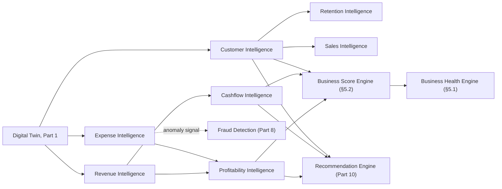

---

## Part 7 — Forecasting Platform & Business Simulation

### 7.1 Forecasting Platform (Item 58)

**Purpose & Architecture.** A shared time-series forecasting infrastructure — model selection, training-data assembly from Business Telemetry (Part 16), confidence-interval computation — that Demand (§7.2), Revenue (§7.3), and Customer (§7.4) Forecasting are specific instantiations of, rather than three independently-built forecasting stacks. Model execution runs on the exact AI Gateway/Provider Router infrastructure `AI_PLATFORM_ARCHITECTURE.md` §2–§3 already provisions (cited, not a new inference substrate), whether the specific technique is a classical time-series model or an LLM-assisted forecasting approach — the Provider Router's existing capability-matrix-based selection (`AI_PLATFORM_ARCHITECTURE.md`, cited) is reused to pick the right technique per forecasting task rather than this document inventing a parallel model-selection mechanism.

**Inputs, Outputs & Internal Components.** Inputs: Business Telemetry (Part 16) historical series, relevant Domain Intelligence signals (Part 6) as leading indicators, External Intelligence (Part 12) as exogenous variables where relevant (e.g., Economic Intelligence informing Revenue Forecasting). Outputs: point forecasts with explicit confidence intervals — never a bare point estimate — consumed by the Business Simulation Engine (§7.5) as its baseline projection and by the Recommendation Engine (Part 10) directly.

**Data Flow & Decision Logic.** Scheduled (`BACKEND_ARCHITECTURE.md` §8 Scheduler, cited) and on-demand forecast runs both feed the same model-training/selection pipeline; forecast accuracy is tracked against realized outcomes over time and fed to Organizational Learning (Part 11) and AI Quality Metrics (Part 16), closing a calibration feedback loop — a forecasting model whose confidence intervals are consistently too narrow or too wide is a detectable, correctable condition, not a silent failure mode.

**Operational Considerations & Trade-offs.** Confidence intervals are always surfaced to the consuming Decision Engine (Part 10), which is what allows E4's graduated-autonomy principle to apply to forecasting-informed decisions specifically — a low-confidence forecast structurally cannot support a high-autonomy autonomous action, since Decision Scoring (§10.4) incorporates forecast confidence as an input.

### 7.2 Demand Forecasting (Item 59), 7.3 Revenue Forecasting (Item 60) & 7.4 Customer Forecasting (Item 61)

**Purpose & Architecture.** Three named instantiations of §7.1's platform: **Demand Forecasting** predicts product/service demand, cross-validated against Inventory Intelligence's actual stock-out/overstock events (§6.13, cited) as a real-world accuracy check; **Revenue Forecasting** predicts revenue trajectory, the AI CFO's primary planning input, combining Revenue Intelligence's (§6.1) cohort decomposition with Sales Intelligence's (§6.6) pipeline signals; **Customer Forecasting** predicts acquisition, expansion, and churn trajectories, combining Customer Intelligence (§6.5) and Marketing Intelligence (§6.7).

### 7.5 Business Simulation Engine (Item 62), 7.6 Digital Scenario Engine (Item 63) & 7.7 "What If" Engine (Item 64)

**Purpose & Architecture.** These three items name one system at increasing specificity: the Business Simulation Engine is the general capability; a Digital Scenario is a specific, named, ephemeral fork of the Digital Twin (Part 1) with hypothetical inputs changed; the "What If" Engine is the interactive, ad hoc entry point a human or an AI Employee (typically the AI Research Department, §2.14, or an AI Executive preparing a Decision Council position, §2.15) uses to spin one up. **E6 is the binding invariant across all three: a scenario is always a fork, never a mutation** — created by copying the relevant Digital Twin subgraph into an isolated, clearly-labeled scenario namespace, run through the same Forecasting Platform (§7.1) and Domain Intelligence modules (Part 6) that operate on real data, and either discarded or explicitly, deliberately promoted (a human- or Decision-Council-approved action that then becomes a real, tracked business decision, Part 10 — promotion is never automatic).

**Data Flow & Decision Logic.** Scenario creation: fork the relevant Digital Twin subgraph → apply hypothetical deltas (e.g., "reduce marketing spend by 20%") → re-run Forecasting Platform and affected Domain Intelligence modules against the forked state → present comparative results (baseline vs. scenario) → scenario is discarded by default at session end unless a human explicitly saves or promotes it.

**Dependencies.** Part 1's Digital Twin (the fork source), §7.1's Forecasting Platform, Part 6's Domain Intelligence modules (re-run against forked state), Part 10's Decision Engine (the promotion path).

**Security, Privacy & Failure Recovery.** Because a scenario is an isolated fork, a runaway or erroneous simulation cannot corrupt the real Digital Twin under any failure mode — the strongest possible containment guarantee, achieved architecturally (namespace isolation) rather than by convention or careful coding discipline alone.

**Performance & Scalability.** Forking cost is proportional to the scenario's declared scope (a single-Department "what if" is cheap; a whole-organization scenario is more expensive) — scope is always explicit at scenario creation, never implicitly "the whole Digital Twin" by default, keeping typical simulation cost bounded.

**Operational Considerations & Trade-offs.** Explicit, human-gated promotion (versus allowing a sufficiently-confident scenario to auto-promote into a real decision) trades some automation convenience for an unambiguous, auditable line between "we explored this" and "we decided this" — judged essential given how easily a compelling simulation result could otherwise be mistaken for a validated real-world outcome.

### 7.8 Business Experiment Engine (Item 65)

**Purpose & Architecture.** Distinct from simulation (§7.5–§7.7) in one critical respect: a Business Experiment runs against **real** operations, not a forked projection — a live pricing A/B test, a live campaign-variant test. It is architected as a direct, business-level reuse of `FRONTEND_ARCHITECTURE.md` §13.7–§13.8's experimentation framework, which is itself built on `BACKEND_ARCHITECTURE.md` §7.7's `FeatureFlagEngine` `PERCENTAGE_ROLLOUT` capability — the same primitive now serving a third, business-strategy-level purpose beyond its original infrastructure-canary (`CLOUD_INFRASTRUCTURE.md` §5.1) and product-feature-flag (`FRONTEND_ARCHITECTURE.md` §4.8) uses, an explicit, deliberate instance of this document series' recurring "one primitive, multiple layers of reuse" pattern.

**Security, Privacy & Failure Recovery.** Because a live Business Experiment affects real customers/revenue, launching one is itself gated by the Human Approval Architecture (Part 10) at a Decision Level no lower than the action it experiments with would itself require — an experiment is not a loophole around approval gates, it carries the same governance weight as the action it tests.

**Diagram 11 — Simulation vs. Experiment: Fork-and-Discard vs. Live-and-Gated**

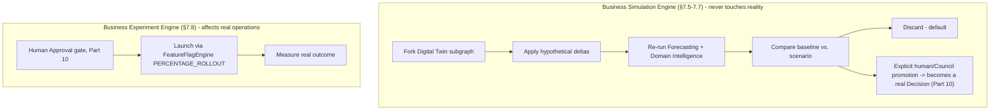

---

## Part 8 — Risk, Opportunity & Compliance Intelligence

### 8.1 Risk Intelligence (Item 66) & 8.2 Opportunity Intelligence (Item 67)

**Purpose & Architecture.** Two symmetric aggregation layers over every Domain Intelligence module (Part 6) and Relationship Intelligence (§1.4): Risk Intelligence surfaces negative-tail signals (a concentration risk, a churn-risk cluster, a cashflow warning) as a unified, ranked risk register; Opportunity Intelligence surfaces the positive-tail symmetric case (an underexploited expansion-revenue cohort, a market gap surfaced by Competitive Intelligence, Part 12). Both feed the Recommendation Engine (Part 10) as prioritization inputs and the Executive Command Center (Part 11) as a standing view, never bypassing either to act directly (E8).

**Data Flow & Decision Logic.** Every Domain Intelligence module's signal is evaluated against configurable risk/opportunity thresholds (business-specific, defaulting conservatively) — a signal crossing a threshold is promoted into the Risk or Opportunity register with its full provenance chain (which module, which underlying Digital Twin entities) preserved for E5's traceability requirement.

### 8.3 Threat Intelligence (Item 68)

**Purpose & Architecture.** The externally-facing specialization of Risk Intelligence — competitive, market, regulatory, and cyber-adjacent threats, sourced primarily from Part 12's External Intelligence modules and, for cyber-specific signals, from `CLOUD_INFRASTRUCTURE.md` §14's security-operations telemetry (cited, this document does not redesign that security posture, only surfaces its business-relevant implications at the Executive Command Center level, Part 11).

### 8.4 Fraud Detection (Item 69)

**Purpose & Architecture.** Pattern-detection over Expense Intelligence (§6.4) and Accounting Intelligence (§6.10) anomalies specifically, cross-referenced against Relationship Intelligence (§1.4) for structurally suspicious patterns (e.g., a vendor entity newly connected to an unusual concentration of expense edges). Fraud Detection is deliberately the **one Domain-adjacent module explicitly forbidden from autonomous remediation at any Decision Level** (Part 10) — a suspected-fraud finding always routes to human review, never to an autonomous freeze/block action, regardless of confidence score, given the severe cost of a false positive against a legitimate transaction and the severe cost of tipping off a genuine bad actor via an automated response.

**Security, Privacy & Failure Recovery.** Fraud Detection findings are written to the audit infrastructure (`CLOUD_INFRASTRUCTURE.md` §14.6, cited) with elevated retention and access restrictions, mirroring how that document treats its own security-classified audit events.

### 8.5 Compliance Intelligence (Item 70) & 8.6 Policy Intelligence (Item 71)

**Purpose & Architecture.** Compliance Intelligence monitors the Digital Twin for state that may violate an applicable regulatory obligation (data-residency posture per `CLOUD_INFRASTRUCTURE.md` §13.4, cited; industry-specific obligations surfaced via Regulatory Intelligence, Part 12), producing findings routed to Enterprise Governance (Part 15). Policy Intelligence is the internal-facing sibling — monitoring adherence to the business's *own* configured policies (an approval-threshold policy, a data-handling policy) rather than external regulation, and is the module the AI Decision Council (§2.15) and Human Approval Architecture (Part 10) consult to determine whether a given decision's configured governance requirements have actually been satisfied before it's allowed to proceed.

**Dependencies.** Part 12's Regulatory Intelligence (external obligation source), `AUTH_ARCHITECTURE.md`'s compliance posture and `CLOUD_INFRASTRUCTURE.md` §14.4's compliance-readiness controls (both cited), Part 15's Enterprise Governance (consumer).

**Operational Considerations & Trade-offs.** Compliance and Policy Intelligence are kept as two distinct modules — despite structural similarity — because conflating external regulatory obligation with internal policy would blur an important distinction for a Governance Board (Part 15) reviewing findings: a Compliance finding is a legal-exposure signal; a Policy finding is an internal-process-adherence signal, and they warrant different review urgency and different remediation owners.

**Diagram 12 — Risk, Opportunity & Compliance Signal Aggregation**

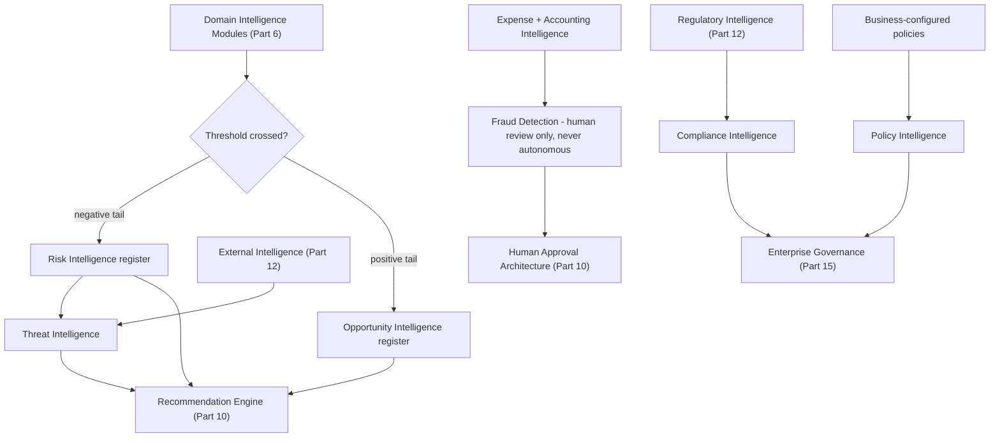

---

## Part 9 — Decision Engine, Explainability & Autonomy

*Common to this Part:* this is the safety-critical center of the entire Enterprise Intelligence Layer — every principle in §0.5 (especially E3, E4, E5, E9) is enforced concretely by the mechanisms defined here. Nothing in this Part introduces a new execution mechanism; it governs *when and how* the AI Workforce (Part 2) is permitted to convert a recommendation into an action.

### 9.1 Recommendation Engine (Item 72)

**Purpose & Architecture.** Consumes every Intelligence module's output (Parts 5–8) plus Forecasting (Part 7) and produces ranked, human-or-AI-Employee-consumable recommendations — the Recommendation Engine **never itself acts**; it is strictly upstream of the Decision Engine (§9.2), the architectural embodiment of E8 at the recommendation/action boundary specifically.

**Data Flow & Decision Logic.** Signal crosses a relevance/priority threshold (informed by the Business Health Engine, §5.1, and Risk/Opportunity registers, §8.1–§8.2) → a candidate recommendation is drafted, with supporting evidence citations to the specific Digital Twin entities and Intelligence signals behind it (E5) → routed to Decision Scoring (§9.3).

### 9.2 Decision Engine (Item 73)

**Purpose & Architecture.** The Decision Engine is what actually determines whether a scored, confidence-rated recommendation is (a) surfaced to a human for manual action, (b) surfaced with a one-click-approve affordance, (c) executed autonomously with notification, or (d) executed autonomously without notification — the choice among these four is governed entirely by §9.7's Autonomous Decision Levels, never by the Decision Engine's own independent judgment call. The Decision Engine is best understood as a **routing and gating layer**, not an independent source of authority — its authority is entirely delegated from the business's own configured governance (Part 15).

**Inputs, Outputs & Internal Components.** Inputs: a scored recommendation (§9.1), its Decision Score and Confidence Score (§9.3–§9.4), the acting AI Employee's (or human's) Autonomous Decision Level for that specific action-type (§9.7). Outputs: a routed decision (one of the four paths above), always paired with a Reasoning Trace (§9.5) and, where applicable, a Human Approval Architecture (§9.6) invocation.

**Dependencies.** §9.1's Recommendation Engine, §9.3–§9.4's Scoring/Confidence, §9.5's Reasoning Trace, §9.6's Human Approval Architecture, §9.7's Autonomous Decision Levels, `AUTH_ARCHITECTURE.md`'s RBAC (the ultimate source of an AI Employee's action-execution permission, never bypassed by a high Decision Score alone).

### 9.3 Decision Scoring (Item 74) & 9.4 Confidence Engine (Item 75)

**Purpose & Architecture.** Decision Scoring computes expected business impact (magnitude and direction, informed by Forecasting's confidence intervals, §7.1) via the shared Business Score Engine (§5.2) applied to a candidate decision rather than a standing metric. The Confidence Engine computes a distinct, separately-tracked score: how certain the underlying evidence and forecast actually are — **impact and confidence are never collapsed into one number**, because a high-impact, low-confidence recommendation and a low-impact, high-confidence one warrant categorically different treatment (the first demands human review regardless of configured autonomy; the second is a reasonable autonomous-action candidate even at a conservative Decision Level default).

**Data Flow & Decision Logic.** Both scores feed the Decision Engine's (§9.2) routing choice directly: an Autonomous Decision Level (§9.7) is defined not as a flat "AI may act" toggle but as a **(minimum confidence, maximum impact-without-approval)** pair per action-type — the actual routing decision is a lookup against that pair, computed fresh per candidate decision, never a static, one-time authority grant.

**Operational Considerations & Trade-offs.** Calibration (does a "90% confidence" recommendation actually turn out correct roughly 90% of the time) is tracked against realized outcomes via Organizational Learning (Part 11) and AI Quality Metrics (Part 16) — an uncalibrated Confidence Engine is treated as a defect requiring remediation, not an acceptable permanent state, since the entire graduated-autonomy model (E4) depends on confidence scores actually meaning what they claim to mean.

### 9.5 Explainable AI (Item 76) & Reasoning Trace Architecture (Item 77)

**Purpose & Architecture.** Every recommendation and decision carries a reconstructible reasoning trace extending `AI_PLATFORM_ARCHITECTURE.md` §9's existing Planner→Executor→Critic→Reflection trace (cited) upward from single-agent-execution granularity to business-decision granularity: which Intelligence module signals were consulted, which Digital Twin entities they trace to, which Decision Council deliberation (if any, §2.15) contributed, and the Decision/Confidence scores computed. This is rendered to a human through the exact step-tree visualization `FRONTEND_ARCHITECTURE.md` §9.5 already built for AI Employee Workspace supervision (cited directly, not a new UI concept) — a business-level decision's trace and a single agent-run's trace share one rendering surface, generalized rather than duplicated.

**Security, Privacy & Failure Recovery.** Reasoning traces are written to the audit infrastructure (`CLOUD_INFRASTRUCTURE.md` §14.6, cited) as append-only records — a trace is never edited or deleted after the fact, including by the AI Employee that produced it, closing off any possibility of post-hoc reasoning revision that would undermine E5's accountability guarantee.

### 9.6 Human Approval Architecture (Item 78)

**Purpose & Architecture.** Extends `AI_PLATFORM_ARCHITECTURE.md`'s Tool Permissions "requires confirmation" gate (cited) from individual tool calls to business-decision granularity, and reuses `FRONTEND_ARCHITECTURE.md` §9.5's blocking-Dialog human-in-the-loop pattern (cited) as its exact rendering mechanism — an approval request interrupts the relevant human's (or AI Executive's, per §9.7's delegation-of-approval-authority case) workflow with the full Reasoning Trace (§9.5) attached, never a bare "approve?" prompt lacking justification.

**Data Flow & Decision Logic.** Approval requests route to the specific human (or, where explicitly configured, a designated AI Executive with delegated approval authority within its own Authority Boundary, §2.1) accountable for that action-type — routing is determined by the Organization/Department structure (Part 1) and `AUTH_ARCHITECTURE.md`'s role assignments, never by the requesting AI Employee choosing its own approver.

**Operational Considerations & Trade-offs.** Approval-request volume is a tracked operational metric (Part 16) — a Decision Level configuration generating excessive approval fatigue (many low-stakes requests) is treated as a signal to reconsider that action-type's threshold (§9.7), rather than accepted as an inevitable cost of safety; conversely, a Decision Level raised too aggressively without a track record to justify it is flagged by Policy Intelligence (§8.6) as a governance concern.

### 9.7 Autonomous Decision Levels (Item 79)

**Purpose & Architecture.** The graduated authority scale every AI Employee's every action-type is configured against (E4), defined once and applied platform-wide:

| Level | Name | Behavior | Default applicability |
|---|---|---|---|
| **L0** | Observe | AI Employee may read/analyze, produces no recommendation | Any new AI Employee seat's initial state for any new action-type, before enough Organizational Learning history exists to justify more |
| **L1** | Recommend | Surfaces a ranked recommendation; takes no action | The platform-wide default for every action-type on every seat unless explicitly raised |
| **L2** | Act-with-approval | Drafts the action; requires Human Approval Architecture (§9.6) sign-off before execution | Common for medium-impact, well-understood, repeatable actions once a track record exists |
| **L3** | Act-with-notification | Executes autonomously, immediately notifies the accountable human; a bounded post-hoc reversal window applies where the action-type supports reversal | Reserved for low-impact, high-confidence, reversible action-types with strong calibration history |
| **L4** | Full autonomy within budget | Executes autonomously within a pre-approved, bounded budget/scope envelope (e.g., a marketing spend adjustment within an approved band, `FRONTEND_ARCHITECTURE.md` §13.7-adjacent experiment-budget framing, cited) with periodic (not per-action) human review | The narrowest, most deliberately-gated tier; **never** available to Fraud Detection (§8.4) or any autonomous fund-transfer/irreversible-financial-commitment action-type (§2.3's AI CFO row), regardless of confidence or track record |

**Data Flow & Decision Logic.** Level is configured **per business, per action-type, per seat** — never a single global toggle — and is only ever raised by explicit human/Governance action (Part 15), never by an AI Employee raising its own authority, and never silently inherited from a similar action-type without explicit configuration (a high L3 confidence on "adjust ad spend" grants nothing toward "send a customer contract amendment," even though both might be handled by the same AI Executive).

**Security, Privacy & Failure Recovery.** Every L3/L4 autonomous action reuses `BACKEND_ARCHITECTURE.md` §8.5's idempotency-key pattern (cited) so a retried or duplicated execution attempt (e.g., after a transient failure) cannot double-apply — the same safe-retry discipline `CLOUD_INFRASTRUCTURE.md` and `FRONTEND_ARCHITECTURE.md` already apply to their own mutation paths, extended here to autonomous business actions specifically because the stakes of an unintended double-execution are categorically higher than an ordinary UI mutation.

**Operational Considerations & Trade-offs.** Level defaults are conservative platform-wide (L0/L1) specifically so that a business's *own* Organizational Learning history (Part 11), not this document's assumptions, is what justifies any escalation — the ladder exists precisely to make "how much do I trust this AI Employee with this specific action" an evidence-based, per-business, per-action-type decision rather than a platform-wide assumption baked into the architecture.

**Future Evolution.** As `AI_PLATFORM_ARCHITECTURE.md` Part 15's future local/fine-tuned models and `AI_PLATFORM_ARCHITECTURE.md` §9's multi-agent maturity evolve, the calibration data feeding this ladder gets richer — the ladder itself, and its human-governed-escalation-only invariant, is designed to remain unchanged regardless.

### 9.8 Business Rule Engine (Item 80)

**Purpose & Architecture.** A deterministic, non-AI complement to the Decision Engine — explicit, human-authored business rules (e.g., "always flag any invoice over $X for review," "never approve a discount below Y% margin") that the Decision Engine consults as a **hard constraint layer**, evaluated before any AI-generated recommendation's Decision Score is allowed to result in an L2+ action — a rule violation always blocks, regardless of how high a Decision Score or Confidence Score an AI Employee computed, giving a business an unambiguous, auditable floor beneath the probabilistic Decision Engine.

### 9.9 Automation Intelligence (Item 81), 9.10 Workflow Intelligence (Item 82) & 9.11 Workflow Optimization (Item 83)

**Purpose & Architecture.** Automation Intelligence identifies candidate processes worth automating (a recurring, low-variance task pattern detected in `BACKEND_ARCHITECTURE.md`'s Workflow Engine execution history, cited) and routes the recommendation through the same Decision Engine/Autonomous Decision Level machinery as any other recommendation — automating a process is itself a governed decision, not a separate, ungoverned capability. Workflow Intelligence monitors live workflow health (bottleneck detection, SLA-risk signals) feeding Operations Intelligence (§6.11). Workflow Optimization is its prescriptive sibling, recommending specific workflow restructuring, rendered through `FRONTEND_ARCHITECTURE.md`'s Workflow Builder UI and Automation Builder (§9.6–§9.7 of that document, cited directly — this document's recommendations populate that existing canvas, they do not introduce a second workflow-editing surface).

**Diagram 13 — Decision Engine Routing Logic**

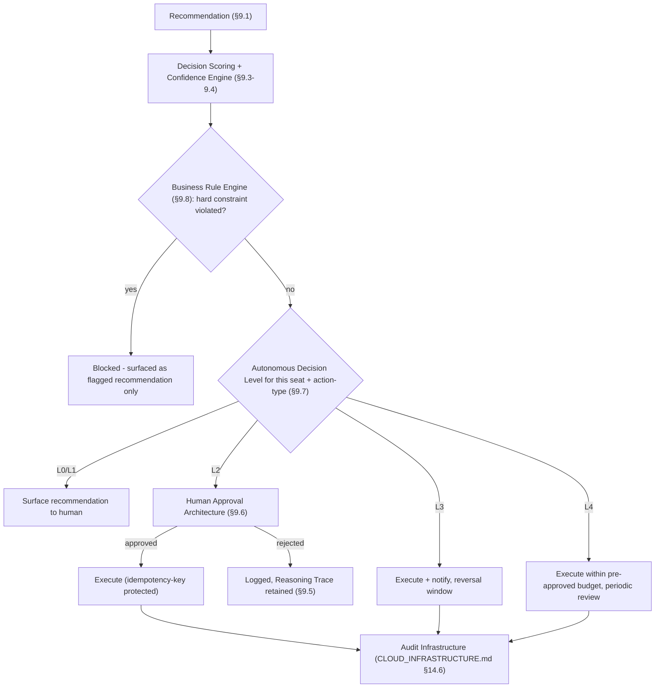

**Diagram 14 — Reasoning Trace Composition**

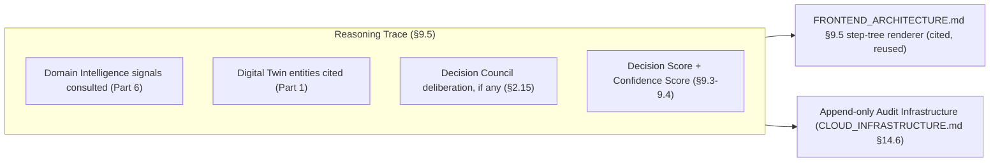

---

## Part 10 — Executive Command Center & Reporting

### 10.1 Executive Command Center (Item 84) & 10.2 Executive Cockpit (Item 85)

**Purpose & Architecture.** The human-facing surface of the entire Enterprise Intelligence Layer — rendered entirely through `FRONTEND_ARCHITECTURE.md`'s existing Dashboard Shell (§4.10 of that document, cited) and Analytics Dashboard widget model (§10.4, cited), never a parallel dashboard framework. "Command Center" names the full surface (Business Health, Risk/Opportunity registers, pending Approvals, AI Decision Council activity); "Executive Cockpit" names its most condensed, at-a-glance configuration — the small set of composite signals (Business Health score, §5.1; open high-priority Approvals, §9.6; active Risk register items, §8.1) a time-constrained executive or founder persona (`PRD.md`'s stated personas) needs without navigating further.

**Inputs, Outputs & Internal Components.** Inputs: Business Health Engine (§5.1), Risk/Opportunity Intelligence (§8.1–§8.2), pending Human Approval requests (§9.6), AI Decision Council activity (§2.15). Each renders as an independent widget (per `FRONTEND_ARCHITECTURE.md` §10.4's per-widget-independent-query design, cited) so a slow or failing Intelligence module never blocks the rest of the Command Center from rendering.

**Security, Privacy & Failure Recovery.** Widget-level data is scoped by the viewing human's own RBAC role exactly as any other `API_CONTRACT.md` resource would be — an AI Employee's Reasoning Trace (§9.5) is visible to the Command Center viewer only to the extent their role permits visibility into that AI Employee's Department, never a Command-Center-specific broadened visibility exception.

### 10.3 Company Timeline (Item 86), 10.4 Business Timeline (Item 87), 10.5 Decision Timeline (Item 88) & 10.6 Strategic Timeline (Item 89)

**Purpose & Architecture.** Four specialized, filtered views over one underlying event stream — Business Memory (Part 11) — never four separately-stored timelines. **Company Timeline** is the unfiltered chronological record of every material business event (from the Digital Twin's domain events, Part 1). **Business Timeline** filters to operationally-significant events (deal closed, hire made, incident occurred). **Decision Timeline** filters specifically to Decision Engine (§9.2) outputs — every recommendation, approval, autonomous action, and Council deliberation, each linked to its Reasoning Trace (§9.5). **Strategic Timeline** filters to Goal/OKR (§5.4–§5.5) milestones and Decision Council-level (§2.15) strategic decisions specifically — the view a board or investor-facing report (§10.8) is typically built from.

**Data Flow & Decision Logic.** A single, append-only event log (feeding Business Memory, Part 11) is written once per material event; each of the four Timeline views is a filtered, indexed query over that same log — adding a fifth timeline view in the future is a new filter definition, never new storage.

### 10.7 Unified Business Dashboard (Item 90)

**Purpose & Architecture.** The default, configurable landing view combining Executive Cockpit (§10.2) widgets with Department-scoped views (via the Department Context Engine, §4.3) — the single surface a human toggles between "whole business" and "my department" scope from, rather than navigating to entirely separate dashboards, directly reusing `FRONTEND_ARCHITECTURE.md`'s responsive grid (§3.3 of that document, cited) and workspace-switching model (§4.5–§4.6, cited) for the scope-toggle interaction specifically.

### 10.8 Executive Reporting Engine (Item 91)

**Purpose & Architecture.** Generates structured, periodic (or on-demand) reports — board decks, investor updates, department reviews — by composing Business Health (§5.1), Strategic Timeline (§10.6), and Domain Intelligence (Part 6) signals into a narrative template, with an AI Executive (typically AI CEO or the domain-relevant Executive, §2.3's table) drafting the narrative synthesis subject to the same Human Approval Architecture (§9.6) gate any externally-facing communication requires (E4 applied to communication specifically: drafting is a low-risk AI action; sending/publishing is never autonomous).

### 10.9 Strategic Analytics (Item 92) & 10.10 Cross-Department Analytics (Item 93)

**Purpose & Architecture.** Strategic Analytics is longer-horizon, Goal/OKR-and-Forecast-informed analysis (feeding and fed by the Strategic Timeline, §10.6); Cross-Department Analytics is the specific capability of correlating signals across Domain Intelligence modules owned by different Departments (e.g., correlating Marketing Intelligence spend patterns with Sales Intelligence pipeline velocity) — a capability that depends directly on the Enterprise Knowledge Graph (§1.2) already modeling Department boundaries as graph structure rather than as siloed, uncorrelatable data stores, which is precisely what makes cross-department correlation a query over existing structure rather than a bespoke integration project per pair of Departments.

**Diagram 15 — Executive Command Center Composition**

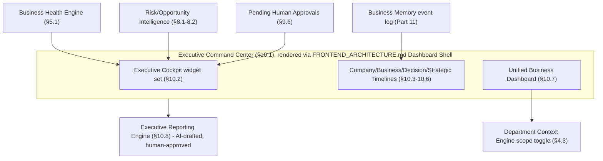

**Diagram 16 — Cross-Department Analytics via Knowledge Graph**

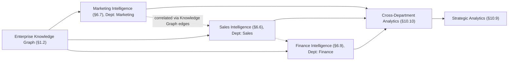

---

## Part 11 — Organizational Memory & Learning

### 11.1 Business Memory (Item 94) & 11.2 Long-Term Company Memory (Item 95)

**Purpose & Architecture.** Business Memory is the append-only event log Part 10's four Timeline views project from — every material Digital Twin change, every Decision Engine (§9.2) output, every Decision Council deliberation (§2.15). Long-Term Company Memory is its retention-extended tier, mapped directly onto `AI_PLATFORM_ARCHITECTURE.md` §6's existing Long-Term memory tier (cited, not a new tier) — the Organizational memory tier §3.5 of this document already established as shared across AI Employees is, at sufficient time depth, exactly this Long-Term Company Memory.

**Data Flow & Decision Logic.** Every event written to Business Memory is provenance-tagged (E10: internal Digital Twin fact vs. External Intelligence, Part 12) and outcome-linked where applicable — a Decision Engine action's eventual realized outcome (did the forecast hold, did the recommendation's predicted impact materialize) is written back as a linked follow-up event, never overwriting the original decision record, preserving a complete, honest history including of decisions that did not pan out as predicted.

### 11.3 Organizational Learning (Item 96)

**Purpose & Architecture.** The active consumer of outcome-linked Business Memory (§11.1): a scheduled (`BACKEND_ARCHITECTURE.md` §8 Scheduler, cited) process that re-evaluates Confidence Engine (§9.4) calibration, Business Score Engine (§5.2) weighting defaults, and Autonomous Decision Level (§9.7) track records against realized outcomes — the concrete mechanism by which "a business's own history justifies raising an AI Employee's autonomy" (§9.7's Operational Considerations) actually operates, rather than remaining an abstract claim.

**Data Flow & Decision Logic.** Outcome-linked events accumulate → Organizational Learning's scheduled pass computes calibration deltas (was a 90%-confidence recommendation right ~90% of the time) → deltas feed AI Quality Metrics (Part 16) and generate a Policy Intelligence (§8.6)-reviewable recommendation to adjust a specific Decision Level, **never an automatic Decision Level change** — Organizational Learning informs Governance (Part 15), it does not itself hold authority to alter authority (E9's governance-scales-with-capability principle applied reflexively to the learning system itself).

**Operational Considerations & Trade-offs.** Requiring human/Governance sign-off on every Decision-Level adjustment (rather than allowing Organizational Learning to self-tune autonomy) costs responsiveness — a well-calibrated AI Employee doesn't automatically get more trusted faster — an explicit, deliberate trade favoring auditable, deliberate trust-building over algorithmic self-escalation of AI authority, which this document treats as a bright line not worth crossing for convenience.

### 11.4 Knowledge Evolution (Item 97)

**Purpose & Architecture.** Tracks how the Enterprise Knowledge Graph's (§1.2) entity and relationship structure itself changes over time — not the *values* within entities (that's ordinary Digital Twin updates, Part 1) but structural evolution: a Department reorganizing, a new relationship-type emerging as meaningful (e.g., a business starts tracking "referral-source" edges it didn't model before). Knowledge Evolution feeds schema-evolution planning (Part 18's Migration Strategy) by surfacing which structural patterns a business's actual usage has organically developed, informing which ones might warrant formal Knowledge Graph schema extension.

### 11.5 External Knowledge Integration (Item 98)

**Purpose & Architecture.** The ingestion boundary where Part 12's External Intelligence modules' findings are written into the Digital Twin/Knowledge Graph as provenance-tagged external entities and edges (E10) — a competitor's product launch becomes a graph entity connected to the relevant internal Customer/Deal entities it may affect, never blended indistinguishably with internally-sourced fact. Ingestion runs through `AI_PLATFORM_ARCHITECTURE.md`'s multi-modal content-extraction pipeline (cited) for unstructured external sources (news articles, filings), and through `BACKEND_ARCHITECTURE.md`'s Plugin/Connector Engine (cited, extended in Part 13) for structured external sources.

**Diagram 17 — Business Memory, Learning & Calibration Feedback Loop**

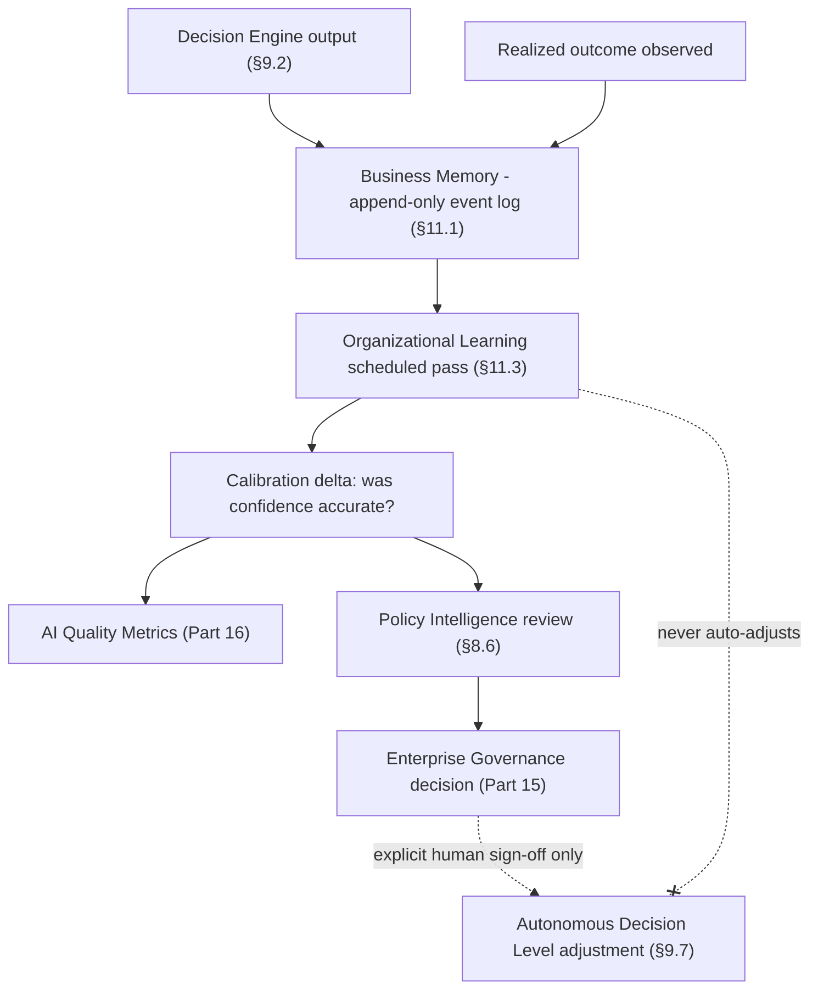

---

## Part 12 — External Intelligence

### 12.0 Shared Template

**Purpose & Architecture (shared).** Every module in this Part ingests unstructured or structured external data (news, filings, market data feeds, partner/vendor records) through `AI_PLATFORM_ARCHITECTURE.md`'s multi-modal extraction pipeline or `BACKEND_ARCHITECTURE.md`'s Connector Engine (both cited, Part 13 details connector-specific architecture), writes findings into the Digital Twin/Knowledge Graph as provenance-tagged external entities (§11.5, E10), and feeds Threat/Opportunity Intelligence (§8.2–§8.3) and the relevant Domain Intelligence modules (Part 6) — never bypassing the provenance-tagging or intelligence-not-action boundary (E8) any internal module observes.

### 12.1 Competitive Intelligence (Item 99)

**Purpose & Architecture.** Tracks competitor entities (product launches, pricing changes, market positioning) sourced externally, cross-referenced against Customer Intelligence (§6.5) churn-risk signals and Sales Intelligence (§6.6) win/loss patterns — the module most directly consumed by the AI CMO and AI Sales Director Mandates (§2.3's table).

### 12.2 Market Intelligence (Item 100) & 12.3 Industry Intelligence (Item 101)

**Purpose & Architecture.** Market Intelligence tracks addressable-market-level signals (demand trends, category growth); Industry Intelligence tracks the specific industry/vertical context a business operates within (relevant benchmarks, typical Business Health Engine, §5.1, weighting profiles for that industry) — Industry Intelligence is, notably, the source of the business-type-aware default weighting profiles §5.1 references, closing the loop between external classification and internal scoring configuration.

### 12.4 Economic Intelligence (Item 102)

**Purpose & Architecture.** Macroeconomic signals (interest rates, inflation, sector-specific economic indicators) consumed primarily as an exogenous variable in Revenue and Demand Forecasting (§7.2–§7.3), never as a direct Decision Engine input on its own — economic signals inform forecast confidence intervals, they do not themselves trigger recommendations.

### 12.5 Regulatory Intelligence (Item 103)

**Purpose & Architecture.** Tracks applicable regulatory obligations relevant to the business's industry and operating regions, the direct external source Compliance Intelligence (§8.5) evaluates the Digital Twin against — the boundary between the two is precise: Regulatory Intelligence tracks *what the rules are*, Compliance Intelligence evaluates *whether the business currently satisfies them*.

### 12.6 Partner Intelligence (Item 104) & 12.7 Vendor Intelligence (Item 105)

**Purpose & Architecture.** Both extend Relationship Intelligence (§1.4) and Supply Chain Intelligence (§6.12) with externally-sourced health signals about specific partner/vendor entities (a vendor's own financial distress signals, a partner's strategic shifts) — feeding the same single-vendor-concentration-risk detection §6.12 already performs, now informed by external, not just internal-relationship-graph-derived, signal.

**Diagram 18 — External Intelligence Ingestion & Provenance Tagging**

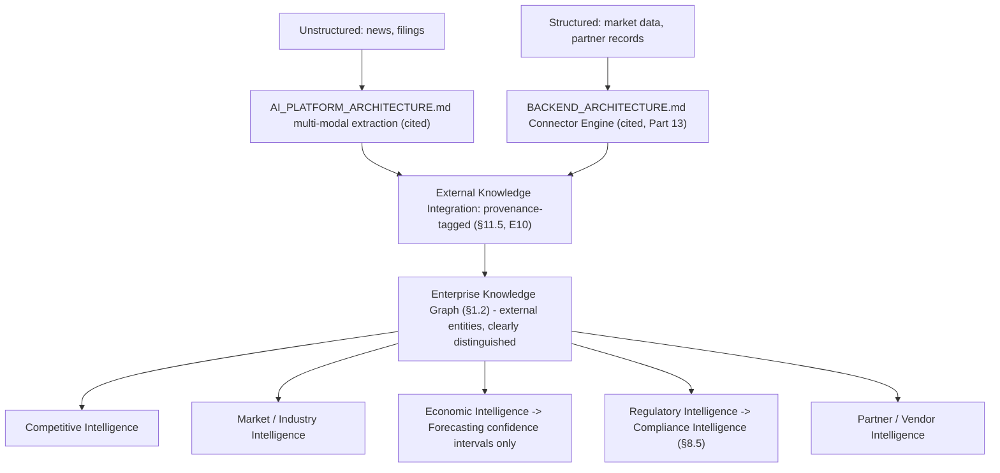

---

## Part 13 — Ecosystem Integration Intelligence

### 13.0 Shared Template & the Sandbox-vs-OAuth Distinction

**Purpose & Architecture (shared).** Every module in this Part extends `BACKEND_ARCHITECTURE.md`'s Plugin/Connector Engine (cited, not redesigned) with domain-specific ingestion and normalization logic mapping an external system's data into the Digital Twin/Knowledge Graph (Part 1). **A binding distinction governs which security posture applies:** a connector that only reads/writes data via a scoped OAuth-authorized API (a calendar read, a CRM sync) is an ordinary, `AUTH_ARCHITECTURE.md`-governed integration — it never executes third-party code inside BizPilot AI's runtime. A connector that involves executing third-party-authored logic (a custom ERP-specific transformation script, a marketplace plugin, `FRONTEND_ARCHITECTURE.md` §14.1) is subject to that document's full iframe/message-passing plugin sandboxing (cited directly) — the two are never conflated, since the risk profile of "read my calendar" and "run this third party's code" is categorically different (E3-adjacent least-privilege reasoning applied to non-AI third-party integrations too).

### 13.1 AI Marketplace Integration (Item 106) & 13.2 Plugin Intelligence (Item 107)

**Purpose & Architecture.** AI Marketplace Integration is the Enterprise Intelligence Layer's consumption of `FRONTEND_ARCHITECTURE.md` §14.2's Marketplace UI (cited) and `BACKEND_ARCHITECTURE.md`'s Plugin Engine — specifically, marketplace-distributed Domain Intelligence extensions (an industry-specific Intelligence module a third party builds) register their outputs into the Business Score Engine (§5.2) exactly as a first-party Domain Intelligence module would, subject to the same sandboxing (§13.0) for any executed logic. Plugin Intelligence is the meta-capability of *reasoning about* installed plugins themselves — which plugins a business has installed, their observed reliability (feeding AI Quality Metrics, Part 16), and recommending plugin additions/removals via the ordinary Recommendation Engine (§9.1) path.

### 13.3 Connector Intelligence (Item 108)

**Purpose & Architecture.** The general capability underlying every specific connector below (§13.4–§13.11) — monitoring connector health (sync failures, data-freshness lag against the Staleness Tracker, §1.1), and surfacing connector-health degradation to the AI COO's Mandate (§2.3's table) as an Operations Intelligence (§6.11) signal, since a stale CRM sync directly degrades every downstream Domain Intelligence module's accuracy.

### 13.4 ERP Intelligence (Item 109), 13.5 CRM Intelligence (Item 110) & 13.6 Accounting Platform Integration (Item 111)

**Purpose & Architecture.** Three named connector-intelligence instances feeding the Digital Twin from systems of record a business already operates: ERP Intelligence normalizes operational/inventory data into Operations and Inventory Intelligence (§6.11, §6.13); CRM Intelligence normalizes external CRM data into Sales and Customer Intelligence (§6.6, §6.5) — for a business using BizPilot AI as its CRM directly, this module is inert, since `DATABASE.md` is already the source; for a business with an existing external CRM, this is the reconciliation boundary; Accounting Platform Integration normalizes external accounting-system data into Finance and Accounting Intelligence (§6.9–§6.10), with reconciliation-mismatch detection feeding Fraud Detection (§8.4) exactly as an internally-sourced accounting anomaly would.

### 13.7 Calendar Intelligence (Item 112), 13.8 Email Intelligence (Item 113) & 13.9 Meeting Intelligence (Item 114)

**Purpose & Architecture.** Three OAuth-scoped (never sandboxed-plugin, §13.0) connectors feeding the Employee Context Engine (§4.4) and Relationship Intelligence (§1.4) — a meeting's attendee list becomes graph edges; an email thread's participants and sentiment (via `AI_PLATFORM_ARCHITECTURE.md`'s multi-modal extraction, cited) become Customer/Deal-entity-linked signals feeding Sales and Customer Intelligence. Meeting Intelligence specifically extends into structured outcome capture (action items, decisions made in a meeting) written directly into Business Memory (§11.1) and, where a decision was made, cross-referenced against whether it later appears as a formal Decision Engine (§9.2) record — surfacing a gap (decisions made informally in meetings but never formally tracked) as an Organizational Learning (§11.3) observation.

### 13.10 Document Intelligence (Item 115) & 13.11 Enterprise Search Intelligence (Item 116)

**Purpose & Architecture.** Document Intelligence extends `AI_PLATFORM_ARCHITECTURE.md`'s multi-modal content-extraction pipeline and `FRONTEND_ARCHITECTURE.md` §10.1's File Manager UI (both cited) with business-semantic entity extraction — a contract document becomes a Document entity with *mentions* edges to the Customer/Deal it relates to (§1.2). Enterprise Search Intelligence extends `AI_PLATFORM_ARCHITECTURE.md` §7's Hybrid Search (cited) and `FRONTEND_ARCHITECTURE.md` §8.2–§8.3's Global Search (cited) with Knowledge-Graph-aware ranking — a search result is ranked not only by textual/semantic relevance but by its graph proximity to the querying Employee's own Department/Context Engine scope (§4.3–§4.4), surfacing organizationally-relevant results ahead of merely textually-similar ones.

**Diagram 19 — Ecosystem Integration: Sandboxed vs. OAuth-scoped Connectors**

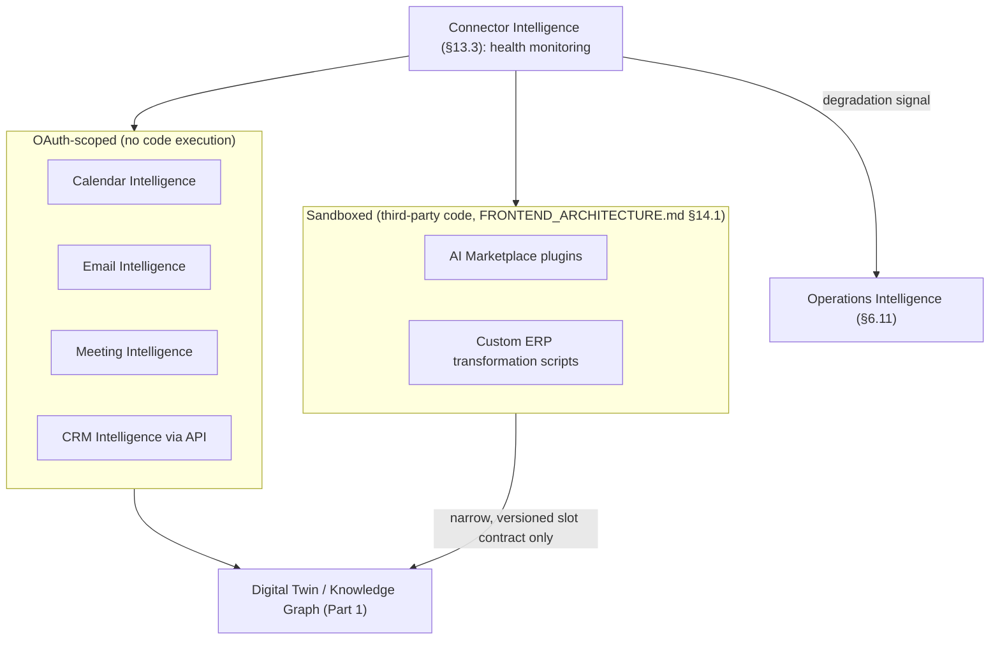

---

## Part 14 — Multi-Company & Global Enterprise Architecture

### 14.1 Cross-Workspace Intelligence (Item 117)

**Purpose & Architecture.** Extends `DATABASE.md`'s `workspaceId`-scoped multi-tenancy and `FRONTEND_ARCHITECTURE.md` §4.6's query-key namespacing discipline (both cited) with an explicit, **consent-gated** aggregation capability: a user who is a member of multiple workspaces (already possible per the existing multi-tenancy model) may enable cross-workspace Intelligence aggregation — but only as an opt-in per-workspace-pair configuration, never an implicit consequence of shared membership (E7). This is the foundation §14.2's Holding Company Architecture builds on.

**Data Flow & Decision Logic.** Each workspace's Digital Twin (Part 1) remains fully independent and isolated by default; Cross-Workspace Intelligence computes an **aggregate view** (e.g., combined Business Health across three consenting workspaces) as a derived, read-only composition — never merging the underlying Digital Twins or Knowledge Graphs into one shared graph, preserving each workspace's independent isolation boundary even while participating in aggregation.

### 14.2 Holding Company Architecture (Item 118)

**Purpose & Architecture.** Introduces an **Organization Group** entity — a parent construct owning references to multiple member workspaces (subsidiaries), each remaining a fully independent `DATABASE.md` workspace with its own Digital Twin, Knowledge Graph, and AI Workforce. The Organization Group is itself an entity in a *separate, group-level* Knowledge Graph layer (§1.2's pattern, one level up) — its own Organization Context Engine (§4.2) scope — with cross-subsidiary Relationship Intelligence (§1.4) available where subsidiaries have opted into Cross-Workspace Intelligence (§14.1). A holding company's AI CEO-equivalent (a Group-level AI Executive, an extension of §2.3's template scoped to the Organization Group rather than a single workspace) synthesizes across consenting subsidiaries, never silently reading a non-consenting one.

**Inputs, Outputs & Internal Components.** Inputs: each consenting subsidiary's aggregate Cross-Workspace Intelligence output (§14.1) — never raw subsidiary-level Digital Twin access by default, preserving each subsidiary's own local governance (Part 15) authority over its own data. Outputs: group-level Business Health composition, group-level Strategic Analytics (§10.9 pattern, one level up).

**Dependencies.** §14.1's Cross-Workspace Intelligence (the consent-gated aggregation mechanism this is built on), `CLOUD_INFRASTRUCTURE.md` §2.1's Enterprise-Isolated environment pattern (cited — a subsidiary requiring genuinely hard infrastructure isolation, not merely logical `workspaceId` isolation, is provisioned exactly per that document's existing pattern, not a new one).

**Security, Privacy & Failure Recovery.** A subsidiary's withdrawal of Cross-Workspace consent (§14.1) immediately and completely removes it from every group-level aggregate on next recomputation — consent is enforced at query time, not just at initial aggregation setup, so a stale consent grant can never silently persist a subsidiary's data in group-level views after withdrawal.

### 14.3 Global Enterprise Architecture (Item 119), 14.4 Regional Architecture (Item 120) & 14.5 Data Residency Strategy (Item 121)

**Purpose & Architecture.** Global Enterprise Architecture is the Organization-Group-scale (§14.2) or single-large-enterprise-scale application of `CLOUD_INFRASTRUCTURE.md` §13.4's three-stage multi-region rollout (cited directly, not redesigned: Stage A single-region-with-DR, Stage B read replicas, Stage C full active regions) to the Enterprise Intelligence Layer specifically — a region-local Digital Twin and Knowledge Graph for latency and residency reasons, with group-level aggregation (§14.2) composing across regions exactly as it composes across workspaces. Regional Architecture names the region-local deployment unit this implies: a full Enterprise Intelligence stack (Digital Twin, Domain Intelligence, AI Workforce) instantiated per active region under `CLOUD_INFRASTRUCTURE.md` §13.4 Stage C, never a single global instance with region-tagged rows.

**Data Flow & Decision Logic.** Data Residency Strategy is the binding rule this entire Part operationalizes: a workspace's (or subsidiary's) data — including its Digital Twin, Knowledge Graph, and every Domain Intelligence signal derived from it — never leaves its assigned region except through the same explicit, consent-gated Cross-Workspace Intelligence aggregation mechanism (§14.1), which itself only ever transmits **derived, aggregate signals**, never raw entity-level data, across a residency boundary — a direct, deliberate extension of E7 and E10 to the geographic dimension.

**Security, Privacy & Failure Recovery.** Residency enforcement is infrastructure-backed (`CLOUD_INFRASTRUCTURE.md` §13.4's region-local deployment, cited), not merely an application-layer policy — the same defense-in-depth discipline (`CLOUD_INFRASTRUCTURE.md` P19) applied to a compliance boundary rather than only a security boundary.

**Diagram 20 — Holding Company / Organization Group Architecture**

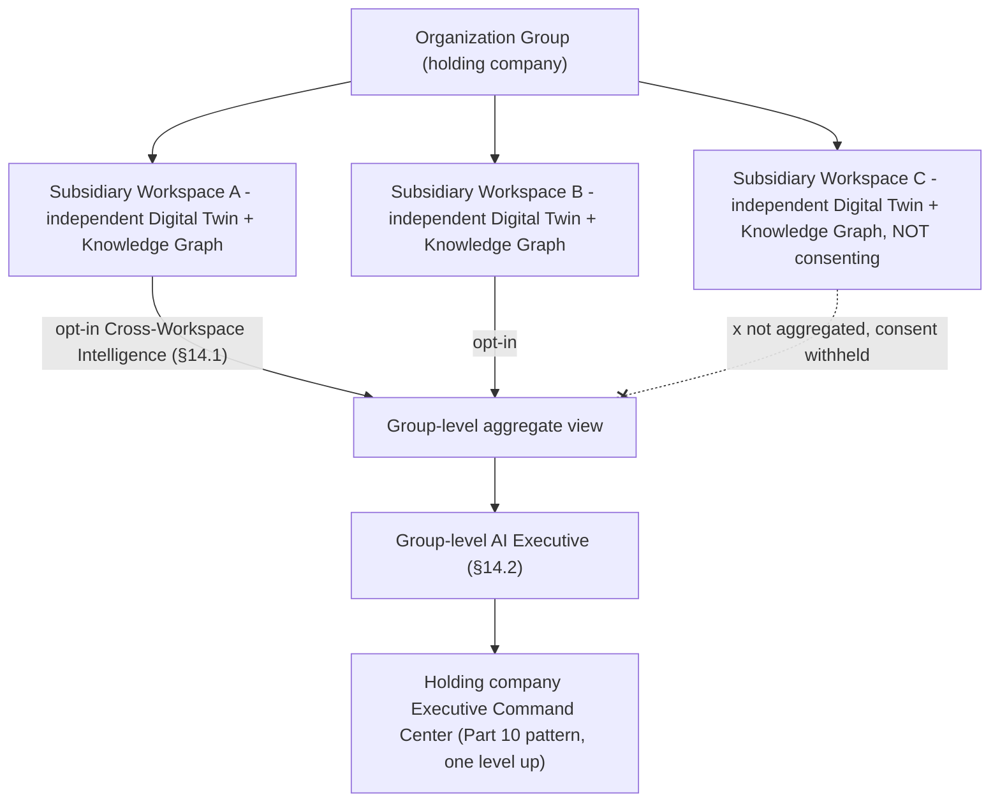

**Diagram 21 — Regional Data Residency Enforcement**

```mermaid
flowchart TB
    subgraph RegionA["Region A (CLOUD_INFRASTRUCTURE.md §13.4 Stage C)"]
        TWIN_A["Digital Twin + Knowledge Graph, Region A workspaces"]
    end
    subgraph RegionB["Region B"]
        TWIN_B["Digital Twin + Knowledge Graph, Region B workspaces"]
    end
    TWIN_A -->|"raw entity data: never crosses region"| TWIN_A
    TWIN_A -.derived aggregate signal only, if consented.-> AGGREGATE["Group-level aggregate (§14.2)"]
    TWIN_B -.derived aggregate signal only, if consented.-> AGGREGATE
```

---

## Part 15 — Governance, Safety, Privacy & Security

### 15.1 Enterprise Governance (Item 122)

**Purpose & Architecture.** The human authority structure that owns every configuration decision this document repeatedly defers to: Autonomous Decision Level assignment/escalation (§9.7), AI Employee seat provisioning (§2.9's table), Cross-Workspace consent (§14.1), and Business Rule Engine (§9.8) constraints. Governance is modeled as a configurable role assignment (an existing `AUTH_ARCHITECTURE.md` RBAC role, e.g. Workspace Owner/Admin, granted the specific Governance-scoped permissions this document's mechanisms check against) — not a new identity system, extending the existing permission catalog with a new, explicit permission namespace for these governance actions specifically.

**Data Flow & Decision Logic.** Every governance action (raising a Decision Level, provisioning an AI seat, approving Cross-Workspace consent) is itself written to the audit infrastructure (`CLOUD_INFRASTRUCTURE.md` §14.6, cited) and to Business Memory (§11.1) — governance decisions are first-class, traceable business events, subject to the same E5 explainability standard as any AI-generated decision.

### 15.2 AI Governance (Item 123) & 15.3 Responsible AI (Item 124)

**Purpose & Architecture.** AI Governance is Enterprise Governance's specific application to the AI Workforce (Part 2) and Decision Engine (Part 9) — the set of standing policies (default-conservative Decision Levels, the Fraud-Detection-never-autonomous rule §8.4, the AI-CFO-never-autonomous-fund-transfer rule §2.3's table) that this document has already established as binding invariants rather than configurable defaults, distinguishing **non-negotiable AI Governance floors** (hard-coded in this architecture, not businessconfigurable) from **business-configurable Decision Level defaults** (§9.7, which a business's own Governance role tunes). Responsible AI is the broader practice this governance operationalizes: fairness (an AI Employee's recommendations are monitored for disparate-impact patterns, particularly the AI HR Director's hiring-adjacent recommendations, §6.15, via AI Quality Metrics, Part 16), transparency (E5, universally applied), and human oversight (E4, universally applied) — restated here as the governance program's guiding commitments rather than as new mechanisms, since every mechanism enacting them is already defined in Parts 9 and 16.

### 15.4 Safety Architecture (Item 125)

**Purpose & Architecture.** Synthesizes every safety-relevant mechanism already defined across this document into one named architecture, extending `AI_PLATFORM_ARCHITECTURE.md`'s own Safety/Moderation/PII ports (cited, not redesigned) upward to the business-decision level: the Business Rule Engine (§9.8) as a deterministic floor, Autonomous Decision Levels (§9.7) as graduated authority, Human Approval Architecture (§9.6) as the default gate for consequential action, Fraud Detection's (§8.4) hard never-autonomous rule, and the AI Decision Council's (§2.15) bounded-negotiation-then-human-escalation ladder (§3.3) as the multi-agent-specific safety mechanism. No new safety primitive is introduced in this section — its contribution is naming the composition explicitly, since a safety architecture that exists only as scattered individual rules is harder to audit than one named, cross-referenced whole.

**Diagram 22 — Safety Architecture Composition**

```mermaid
flowchart TB
    SAFETY["Safety Architecture (§15.4)"]
    SAFETY --> RULES["Business Rule Engine - deterministic floor (§9.8)"]
    SAFETY --> ADL["Autonomous Decision Levels - graduated authority (§9.7)"]
    SAFETY --> APPROVAL["Human Approval Architecture - default gate (§9.6)"]
    SAFETY --> FRAUD["Fraud Detection - hard never-autonomous rule (§8.4)"]
    SAFETY --> CONFLICT["Conflict Resolution escalation ladder (§3.3)"]
    SAFETY --> AIPLATSAFETY["AI_PLATFORM_ARCHITECTURE.md Safety/Moderation/PII ports (cited)"]
    RULES & ADL & APPROVAL & FRAUD & CONFLICT --> AUDIT["Audit Infrastructure (CLOUD_INFRASTRUCTURE.md §14.6)"]
```

### 15.5 Enterprise Privacy (Item 126)

**Purpose & Architecture.** Extends `AUTH_ARCHITECTURE.md` §6's GDPR/SOC 2 posture and data-minimization principle (cited) with the Knowledge Graph-specific implication: an entity subject to a data-deletion request (`AUTH_ARCHITECTURE.md`'s existing compliance mechanism) must be removed not only from `DATABASE.md`'s operational rows but from the Digital Twin projection and every Knowledge Graph edge referencing it (§1.1's deterministic-recomputation property is what makes this tractable — a deletion at the source, followed by a Digital Twin recompute, structurally cannot leave a stale graph fragment behind, unlike a hand-maintained parallel graph store would risk).

### 15.6 Security Architecture (Item 127)

**Purpose & Architecture.** No new security mechanism — this section is a binding citation: every AI Employee action is authorized through `AUTH_ARCHITECTURE.md`'s existing RBAC exactly as a human action would be (E3); every network/infrastructure control is `CLOUD_INFRASTRUCTURE.md` §14's existing Defense-in-Depth stack (WAF, network segmentation, IAM tiers, cited); every third-party-code-executing connector is `FRONTEND_ARCHITECTURE.md` §14.1's plugin sandbox (cited, §13.0 of this document). The Enterprise Intelligence Layer introduces no parallel security perimeter.

### 15.7 Observability (Item 128)

**Purpose & Architecture.** Extends `CLOUD_INFRASTRUCTURE.md` §11's observability stack (OpenTelemetry-compatible metrics/logs/traces, cited) with business-semantic telemetry — detailed as Business Telemetry, Part 16 — and with AI-Employee-specific tracing: every Agent Runtime invocation backing an AI Employee (§2.1) is traced with the same correlation-ID discipline `FRONTEND_ARCHITECTURE.md` §13.3 already established for frontend-to-backend correlation, extended one hop further to link a human-visible Reasoning Trace (§9.5) to its exact underlying model-provider calls (`AI_PLATFORM_ARCHITECTURE.md`'s own observability requirements, cited) — a single correlation ID spans frontend interaction, backend request, and AI provider call.

**Diagram 23 — Governance & Safety Authority Model**

```mermaid
flowchart TB
    HUMAN["Human Governance role (AUTH_ARCHITECTURE.md RBAC, new governance permission namespace)"]
    HUMAN -->|configures| ADL_DEFAULT["Business-configurable Decision Level defaults (§9.7)"]
    FLOOR["Non-negotiable AI Governance floors (§15.2) - hard-coded, not configurable"]
    FLOOR --> FRAUD_RULE["Fraud Detection: never autonomous"]
    FLOOR --> CFO_RULE["AI CFO: never autonomous fund transfer"]
    FLOOR --> SEAT_RULE["AI seat provisioning: always human-approved"]
    ADL_DEFAULT --> WORKFORCE["AI Workforce action authority (Part 2, Part 9)"]
    FLOOR --> WORKFORCE
    WORKFORCE -.every action.-> AUDIT["Audit Infrastructure"]
    LEARN["Organizational Learning (§11.3)"] -.recommends, never changes directly.-> HUMAN
```

---

## Part 16 — Business Telemetry & Metrics

### 16.1 Business Telemetry (Item 129)

**Purpose & Architecture.** The business-semantic event stream every Digital Twin update (Part 1), Domain Intelligence recomputation (Part 6), and Decision Engine action (Part 9) emits — layered on top of, and flowing through, `CLOUD_INFRASTRUCTURE.md` §11's existing OpenTelemetry-compatible observability stack (cited, not a second telemetry pipeline). Where `CLOUD_INFRASTRUCTURE.md`'s telemetry answers "is the system healthy" (RED/USE metrics), Business Telemetry answers "is the business healthy and what changed" — the two share transport and storage infrastructure, differing only in event semantics.

### 16.2 Operational Metrics (Item 130)

**Purpose & Architecture.** The Enterprise Intelligence Layer's own operational health — Digital Twin materialization lag (§1.1's Staleness Tracker, surfaced as a metric), Recommendation Engine and Decision Engine throughput/latency, Agent Runtime invocation volume and cost (`AI_PLATFORM_ARCHITECTURE.md`'s AI Credits/cost-accounting, cited) attributable per AI Employee seat — feeding both `CLOUD_INFRASTRUCTURE.md` §12's capacity planning (cited) and this document's own AI Workforce cost-governance (a business can see, per AI Employee, what its "salary" in compute/token cost actually is, a directly useful Executive Command Center, Part 10, view).

### 16.3 AI Quality Metrics (Item 131)

**Purpose & Architecture.** Tracks recommendation-acceptance rate, Confidence Engine (§9.4) calibration accuracy, and Decision Level track-record per AI Employee seat and per action-type — the concrete measurement layer Organizational Learning (§11.3) consumes and Responsible AI (§15.3) monitoring (fairness/disparate-impact checks specifically) is built on. An AI Employee with a degrading acceptance rate or calibration accuracy is surfaced to Enterprise Governance (§15.1) as a review candidate — potentially for retraining its Mandate/Prompt (`AI_PLATFORM_ARCHITECTURE.md` §3's Prompt Registry, cited), for lowering its Decision Level, or, in the rare case, for reverting a seat to `HUMAN`/`HYBRID` occupancy (§1.7).

### 16.4 Business Success Metrics (Item 132)

**Purpose & Architecture.** The outward-facing measure of whether the Enterprise Intelligence Layer is actually delivering on §0.3's Vision — tracked as realized Business Health Engine (§5.1) trend over time, Decision Engine action outcome accuracy (§9.2, sourced from §11.1's outcome-linked Business Memory), and time-to-decision reduction (how much faster a business reaches a well-reasoned decision with AI Workforce support versus its own historical baseline) — the metric set a business (and, in aggregate and anonymized, BizPilot AI's own product organization) uses to know whether this entire document's architecture is working, closing the loop back to §0.3's opening claim.

**Diagram 24 — Business Telemetry & Metrics Layering**

```mermaid
flowchart TB
    subgraph Infra["CLOUD_INFRASTRUCTURE.md §11 stack (cited)"]
        OTEL[OpenTelemetry Collector]
    end
    TWIN["Digital Twin updates (Part 1)"] --> BT["Business Telemetry (§16.1)"]
    DECISIONS["Decision Engine actions (Part 9)"] --> BT
    BT --> OTEL
    OTEL --> OPM["Operational Metrics (§16.2)"]
    OTEL --> AIQ["AI Quality Metrics (§16.3)"]
    OPM & AIQ --> BSM["Business Success Metrics (§16.4)"]
    BSM --> ECC["Executive Command Center (Part 10)"]
    AIQ --> LEARN["Organizational Learning (§11.3)"]
```

---

## Part 17 — Architectural Decision Records, Major Engineering Decisions & Trade-off Analysis

*Format:* Context / Decision / Alternatives Considered / Trade-offs / Consequences / Future Review, consistent with every prior document in this series. Items 133 (ADRs), 134 (Major Engineering Decisions), and 135 (Trade-off Analysis) are addressed together — each ADR below *is* a major engineering decision, and its Trade-offs field *is* this document's trade-off analysis for that decision; no separate restatement follows.

### ADR-EI-001: Knowledge Graph Storage — Postgres Edge Table (Phase 1–2), CDC-fed Graph Engine (Phase 3)

- **Context.** The Enterprise Knowledge Graph (§1.2) needs relationship storage and traversal; `CLOUD_INFRASTRUCTURE.md` and this document's E1 both discourage introducing new source-of-truth technologies without justification.
- **Decision.** Relationships are a generic, indexed edge table in the existing Postgres database at Phase 1–2, with a dedicated graph-query engine introduced only as a Phase 3, CDC-fed *read index* if traversal complexity genuinely demands it.
- **Alternatives Considered.** A dedicated graph database from day one — rejected as premature given P18-style vendor-minimization discipline and unproven Phase-1 need.
- **Trade-offs.** Recursive-CTE traversal is less ergonomic than native graph-query syntax, accepted until scale justifies the added infrastructure.
- **Consequences.** Every consumer queries a stable interface; the storage migration (if triggered) is invisible above that interface.
- **Future Review.** Triggered by traversal-latency capacity-planning data, mirroring `CLOUD_INFRASTRUCTURE.md` §9.4's shared-Redis-then-split precedent.

### ADR-EI-002: AI Employees Are Agent Runtime Instances, Not a Second Framework

- **Context.** The AI Workforce (Part 2) needed an execution substrate.
- **Decision.** Every AI Employee is a named, role-scoped `AI_PLATFORM_ARCHITECTURE.md` §9 Agent Runtime configuration.
- **Alternatives Considered.** A bespoke "AI Employee" execution engine — rejected as duplicate infrastructure solving an already-solved problem (E2).
- **Trade-offs.** None material; this is a pure reuse decision.
- **Consequences.** Every AI Platform improvement (model routing, cost controls, safety ports) benefits the AI Workforce automatically.
- **Future Review.** Not expected to change.

### ADR-EI-003: Unified Employee Entity with `occupancyType`

- **Context.** The organization graph (§1.5–§1.7) needed to represent human and AI staff without forking the model.
- **Decision.** One Employee entity type with `HUMAN`/`AI`/`HYBRID` occupancy, occupying real org-chart seats.
- **Alternatives Considered.** A separate "AI Agent" entity type distinct from Employee — rejected as contradicting §0.4's Business Operating System Philosophy directly.
- **Trade-offs.** Requires every consumer to handle occupancy-type branching, a small, worthwhile cost.
- **Consequences.** Seat reassignment (human ↔ AI ↔ hybrid) is a role-assignment change, not a structural one.
- **Future Review.** Not expected to change.

### ADR-EI-004: AI Executives Default to HYBRID-Advisory Posture

- **Context.** `PRD.md` spans solo founders through enterprises; assuming full AI executive autonomy by default would be inappropriate for most.
- **Decision.** Every AI Executive (§2.3) defaults to Recommend-level (L1) authority, escalated only per E4.
- **Alternatives Considered.** Defaulting to higher autonomy for perceived product differentiation — rejected as contradicting E4 and E9.
- **Trade-offs.** Slower perceived "AI magic" at first use, accepted for trust-building correctness.
- **Consequences.** Every business's autonomy curve is evidence-based (§11.3), not assumed.
- **Future Review.** Reviewed if aggregate Organizational Learning data across the customer base suggests a different conservative-default calibration.

### ADR-EI-005: AI Decision Council as Bounded Multi-Agent Deliberation, Not a Mega-Agent

- **Context.** Cross-domain decisions need multiple AI Executives' input.
- **Decision.** A moderated, bounded-round deliberation (§2.15) with every participant's trace preserved, never a single combined-authority agent.
- **Alternatives Considered.** One "super-agent" with access to every domain — rejected: collapses E5's per-role explainability and reintroduces the elevated-authority risk E3 exists to prevent.
- **Trade-offs.** Slower than a single-agent decision, accepted for traceability and authority-boundary integrity.
- **Consequences.** A Council recommendation is always attributable to its constituent positions.
- **Future Review.** Convening-threshold tuning is ongoing, per-business.

### ADR-EI-006: Negotiation Round Cap

- **Context.** Inter-agent negotiation (§3.2) could otherwise run unbounded.
- **Decision.** A configurable, default-three-round cap before mandatory escalation.
- **Alternatives Considered.** Unbounded negotiation until convergence — rejected: unpredictable cost/latency, mirrors `AI_PLATFORM_ARCHITECTURE.md`'s bounded-iteration philosophy.
- **Trade-offs.** Some resolvable-in-round-4 conflicts escalate unnecessarily, accepted for predictability.
- **Consequences.** Escalation (§3.3) is a well-exercised, not exceptional, path.
- **Future Review.** Cap is business-configurable; not expected to change structurally.

### ADR-EI-007: Delegated Authority as Permission Intersection, Never Union

- **Context.** Agent Delegation (§3.4) could otherwise become a privilege-escalation vector.
- **Decision.** A delegated task's permission set is computed as an intersection of delegator and delegate authority.
- **Alternatives Considered.** Union-based delegation for convenience — rejected outright as violating E3.
- **Trade-offs.** None material; this is a pure safety decision.
- **Consequences.** No delegation chain, regardless of depth, can exceed top-of-chain authority.
- **Future Review.** Not expected to change; a bright line.

### ADR-EI-008: Memory Synchronization — Shared Business Tiers, Private Working/Session Tiers

- **Context.** AI Employees need shared organizational context without losing individually-accountable reasoning.
- **Decision.** Workspace/Business/Organizational memory tiers are shared (pull-based); Working/Session tiers remain private per invocation.
- **Alternatives Considered.** Full memory sharing across all tiers — rejected: would blur individual accountability (E5) and add unnecessary broadcast overhead.
- **Trade-offs.** Some latency before a peer's learning is reflected elsewhere, accepted for architectural simplicity.
- **Consequences.** No fan-out broadcast infrastructure is needed.
- **Future Review.** Not expected to change.

### ADR-EI-009: Context Engines as Specializations of the Existing Context Builder

- **Context.** Four context scopes (Part 4) were needed for the AI Workforce.
- **Decision.** All four are specializations of `AI_PLATFORM_ARCHITECTURE.md` §4's Context Builder, not a new assembly mechanism.
- **Alternatives Considered.** A bespoke Enterprise-Intelligence-specific context system — rejected as duplicate infrastructure.
- **Trade-offs.** None material.
- **Consequences.** The same engine serves both AI Employee reasoning and the human-facing Copilot.
- **Future Review.** Not expected to change.

### ADR-EI-010: One Shared Business Score Engine, Not Per-Module Scoring

- **Context.** Business Health, KPI/Goal/OKR, and Decision Scoring all needed normalization logic.
- **Decision.** One reusable Business Score Engine (§5.2) underlies all three.
- **Alternatives Considered.** Independent scoring logic per consumer — rejected as duplicate, inconsistently-calibrated infrastructure.
- **Trade-offs.** Requires the shared engine to be generic enough for multiple consumers, a worthwhile design constraint.
- **Consequences.** A scoring-methodology improvement benefits every consumer simultaneously.
- **Future Review.** Revisited if a consumer's scoring need genuinely diverges from the shared model's expressiveness.

### ADR-EI-011: Composite Health Score Always Paired with Sub-scores

- **Context.** A single Business Health number risks oversimplifying multi-dimensional business state.
- **Decision.** The Business Health Engine (§5.1) always surfaces sub-scores alongside the composite, never composite-only.
- **Alternatives Considered.** Composite-only for UI simplicity — rejected as undermining E5's explainability requirement.
- **Trade-offs.** Slightly more complex default dashboard view, accepted for interpretability.
- **Consequences.** "Why is my score down" is always answerable.
- **Future Review.** Not expected to change.

### ADR-EI-012: Domain Intelligence Modules Never Act Directly (E8)

- **Context.** Sixteen Domain Intelligence modules (Part 6) compute business signals.
- **Decision.** Every module's output is strictly a signal to the Recommendation/Decision Engine — never a direct trigger for action.
- **Alternatives Considered.** Allowing high-confidence modules to act directly for latency — rejected: collapses the observation/action separation E8 is built to preserve, and bypasses Decision Scoring/Confidence/Rule-Engine gating.
- **Trade-offs.** An extra hop versus direct action, a deliberate, non-negotiable safety cost.
- **Consequences.** Every action, regardless of originating module, passes through one auditable gate (Part 9).
- **Future Review.** Not expected to change; a bright line.

### ADR-EI-013: Fraud Detection Is Never Autonomous at Any Decision Level

- **Context.** Fraud findings (§8.4) carry asymmetric false-positive/false-negative costs.
- **Decision.** Fraud Detection is hard-capped at human-review-only, overriding even an L4-configured seat.
- **Alternatives Considered.** Allowing high-confidence fraud findings to auto-freeze accounts — rejected given the severity of a false positive against a legitimate transaction.
- **Trade-offs.** Slower response to genuine fraud, accepted given the alternative's cost.
- **Consequences.** This is one of AI Governance's (§15.2) non-negotiable floors.
- **Future Review.** Reviewed only through a formal Enterprise Governance policy process, never a routine Decision Level tuning.

### ADR-EI-014: AI CFO Never Authorized for Autonomous Fund Transfer

- **Context.** Financial actions carry outsized, often-irreversible consequence.
- **Decision.** No Decision Level configuration permits autonomous fund transfer or irreversible financial commitment by the AI CFO or any seat.
- **Alternatives Considered.** Allowing L4 autonomy for small, bounded transfers — rejected as an unjustified risk given the category of harm, distinct from the reversible/bounded actions L4 is designed for elsewhere.
- **Trade-offs.** None accepted as reasonable; this is a hard floor, not a tuned trade-off.
- **Consequences.** Every financial action requiring capital movement passes through Human Approval Architecture (§9.6) regardless of confidence.
- **Future Review.** Reviewed only through formal Governance process.

### ADR-EI-015: Forecasting Reuses the AI Gateway's Provider Router

- **Context.** Forecasting (§7.1) needed model-selection logic.
- **Decision.** Reuses `AI_PLATFORM_ARCHITECTURE.md`'s existing Provider Router capability-matrix selection rather than a parallel forecasting-model-selection mechanism.
- **Alternatives Considered.** A dedicated forecasting-model registry — rejected as duplicate infrastructure.
- **Trade-offs.** None material.
- **Consequences.** Forecasting benefits automatically from Provider Router improvements (failover, cost optimization).
- **Future Review.** Not expected to change.

### ADR-EI-016: Simulations Are Ephemeral Forks, Never Mutate Reality (E6)

- **Context.** The Business Simulation Engine (§7.5–§7.7) needed a containment guarantee.
- **Decision.** Every scenario is an isolated fork of the Digital Twin, discarded by default, promoted only via explicit human/Council action.
- **Alternatives Considered.** Allowing high-confidence scenarios to auto-promote — rejected: risks mistaking a compelling projection for a validated real decision.
- **Trade-offs.** Requires explicit promotion friction, accepted as essential.
- **Consequences.** A runaway simulation cannot corrupt real business state under any failure mode.
- **Future Review.** Not expected to change; a bright line.

### ADR-EI-017: Business Experiment Engine Reuses the FeatureFlagEngine (Third-Layer Reuse)

- **Context.** Live business experiments needed a rollout mechanism.
- **Decision.** Reuses `BACKEND_ARCHITECTURE.md` §7.7's `FeatureFlagEngine`, already reused by `CLOUD_INFRASTRUCTURE.md` (canary) and `FRONTEND_ARCHITECTURE.md` (product experimentation) — now a third layer of reuse.
- **Alternatives Considered.** A business-strategy-specific experimentation platform — rejected as duplicate infrastructure for an already-proven-general primitive.
- **Trade-offs.** None material; a strong reuse signal justifies the decision further each time.
- **Consequences.** Launching an experiment is gated by Human Approval Architecture at the same level as the action it tests.
- **Future Review.** Revisited only if experiment sophistication outgrows the flag model.

### ADR-EI-018: Decision Score and Confidence Score Are Never Collapsed

- **Context.** A recommendation's expected impact and the certainty behind it are different questions.
- **Decision.** Decision Scoring (§9.3) and the Confidence Engine (§9.4) remain two distinct, independently-tracked scores.
- **Alternatives Considered.** A single combined "priority" score — rejected: a high-impact/low-confidence and low-impact/high-confidence recommendation warrant categorically different routing, which a collapsed score would obscure.
- **Trade-offs.** More surface area for a human/AI Employee to interpret, accepted for correctness.
- **Consequences.** Autonomous Decision Levels (§9.7) can express a `(min confidence, max impact)` pair meaningfully.
- **Future Review.** Not expected to change.

### ADR-EI-019: Reasoning Traces Render Through the Existing Step-Tree UI

- **Context.** Business-decision-level reasoning traces (§9.5) needed a rendering surface.
- **Decision.** Reuses `FRONTEND_ARCHITECTURE.md` §9.5's AI Employee Workspace step-tree visualization exactly, generalized rather than duplicated.
- **Alternatives Considered.** A dedicated business-decision trace UI — rejected as duplicate frontend infrastructure for a structurally identical problem.
- **Trade-offs.** None material.
- **Consequences.** A single-agent execution trace and a Decision-Council-level trace share one mental model for the human viewer.
- **Future Review.** Not expected to change.

### ADR-EI-020: Human Approval Reuses the Blocking-Dialog Human-in-the-Loop Pattern

- **Context.** Business-decision approvals (§9.6) needed a UI interruption mechanism.
- **Decision.** Reuses `FRONTEND_ARCHITECTURE.md` §9.5's blocking Dialog pattern for Agent Runtime tool-approval, generalized to business-decision approvals.
- **Alternatives Considered.** A separate approval-inbox-only pattern with no blocking interruption — rejected as insufficiently attention-grabbing for genuinely consequential decisions, though a non-blocking inbox remains available for lower-urgency L2 approvals.
- **Trade-offs.** None material for the specific case of interruption-worthy approvals.
- **Consequences.** Consistent human-in-the-loop UX regardless of whether the loop is a single tool call or a business decision.
- **Future Review.** Not expected to change.

### ADR-EI-021: Autonomous Decision Levels — Human-Governed Escalation Only, Never Self-Escalation

- **Context.** The AI Workforce's authority (§9.7) needed a graduated, trustworthy escalation model.
- **Decision.** A five-level ladder (L0–L4), where Organizational Learning (§11.3) informs but never directly executes a Decision Level change — only a human Governance action can.
- **Alternatives Considered.** Allowing high-calibration AI Employees to self-escalate their own authority — rejected as an unacceptable line to cross regardless of demonstrated accuracy, per E9.
- **Trade-offs.** Slower trust-building responsiveness, an explicit, deliberate cost.
- **Consequences.** Every authority increase is a deliberate, auditable, human act.
- **Future Review.** Not expected to change; this is the document's single most load-bearing safety invariant.

### ADR-EI-022: Business Rule Engine as a Deterministic Floor Beneath the Probabilistic Decision Engine

- **Context.** Purely probabilistic Decision Scoring/Confidence could, in principle, permit an action a business considers categorically unacceptable regardless of score.
- **Decision.** Explicit, human-authored rules (§9.8) are evaluated first and can hard-block any recommendation, unconditionally.
- **Alternatives Considered.** Relying on Confidence/Decision Scoring thresholds alone — rejected as insufficiently legible/auditable for hard organizational constraints.
- **Trade-offs.** Requires businesses to author rules explicitly, a worthwhile up-front cost for an unambiguous floor.
- **Consequences.** A business has a deterministic, non-probabilistic safety net independent of AI calibration quality.
- **Future Review.** Rule catalog evolves per business; the engine's floor-priority position over scoring does not.

### ADR-EI-023: Automation Itself Is a Governed Decision

- **Context.** Automation Intelligence (§9.9) could identify automatable processes.
- **Decision.** Automating a process routes through the identical Decision Engine/Decision Level machinery as any other recommendation — it is never a separately-ungoverned capability.
- **Alternatives Considered.** Treating automation recommendations as inherently low-risk and fast-tracked — rejected: automating the wrong process at the wrong trust level carries real risk, deserving the same governance as any other action.
- **Trade-offs.** None material.
- **Consequences.** The AI Workforce cannot expand its own operating footprint without passing through the same governed path every other action does.
- **Future Review.** Not expected to change.

### ADR-EI-024: Executive Command Center Renders Through the Existing Dashboard Shell

- **Context.** The Enterprise Intelligence Layer needed a human-facing surface (Part 10).
- **Decision.** Built entirely on `FRONTEND_ARCHITECTURE.md` §4.10's Dashboard Shell and §10.4's widget model, never a parallel dashboard framework.
- **Alternatives Considered.** A dedicated Enterprise Intelligence frontend surface — rejected as duplicate frontend infrastructure `FRONTEND_ARCHITECTURE.md` already fully specifies.
- **Trade-offs.** None material.
- **Consequences.** Every frontend performance/accessibility/theming guarantee that document already established applies here without additional work.
- **Future Review.** Not expected to change.

### ADR-EI-025: Four Timeline Views Over One Shared Event Log

- **Context.** Company, Business, Decision, and Strategic Timelines (§10.3–§10.6) needed a storage model.
- **Decision.** One append-only Business Memory event log (§11.1), with each Timeline a filtered, indexed query over it.
- **Alternatives Considered.** Four independently-maintained timeline stores — rejected as unnecessary duplication and a drift risk between views that should logically be consistent subsets of one truth.
- **Trade-offs.** None material.
- **Consequences.** A fifth future timeline view is a new filter, not new storage.
- **Future Review.** Not expected to change.

### ADR-EI-026: Organizational Learning Recommends, Never Auto-Adjusts, Decision Levels

- **Context.** Confidence calibration (§11.3) could, in principle, algorithmically tune AI Employee authority.
- **Decision.** Organizational Learning's calibration output feeds Policy Intelligence and Enterprise Governance as a recommendation only — Decision Level changes remain exclusively human-executed.
- **Alternatives Considered.** Algorithmic self-tuning of Decision Levels based on calibration accuracy — rejected as the same unacceptable self-escalation risk ADR-EI-021 rules out.
- **Trade-offs.** Slower trust-building, the identical, deliberate cost as ADR-EI-021.
- **Consequences.** The learning loop and the authority-granting loop remain structurally, permanently separate.
- **Future Review.** Not expected to change.

### ADR-EI-027: External Knowledge Is Always Provenance-Tagged, Never Blended (E10)

- **Context.** External Intelligence (Part 12) findings enter the same Knowledge Graph as internal fact.
- **Decision.** Every external entity/edge carries explicit provenance, distinguished throughout every downstream reasoning trace.
- **Alternatives Considered.** Treating external and internal data uniformly once ingested — rejected: an AI Employee's reasoning trace (E5) must be able to say "this claim came from a third-party source," a meaningfully different trust level than internal operational fact.
- **Trade-offs.** Additional metadata and query-time distinction logic, accepted for trustworthiness.
- **Consequences.** A human reviewing a Reasoning Trace can independently judge how much to trust an externally-sourced input.
- **Future Review.** Not expected to change.

### ADR-EI-028: Ecosystem Connectors Split by OAuth-scoped vs. Sandboxed-Plugin Security Posture

- **Context.** Eleven Ecosystem Integration Intelligence modules (Part 13) have varying risk profiles.
- **Decision.** Pure data-access connectors use ordinary OAuth-scoped API integration; any connector executing third-party code uses `FRONTEND_ARCHITECTURE.md` §14.1's full plugin sandbox.
- **Alternatives Considered.** Sandboxing every connector uniformly for simplicity — rejected as disproportionate overhead for connectors that never execute foreign code.
- **Trade-offs.** Two security postures to maintain instead of one, accepted because the risk profiles are genuinely different.
- **Consequences.** A calendar-read connector is materially lower-friction to build and audit than a code-executing marketplace plugin.
- **Future Review.** Re-evaluated per new connector type at build time.

### ADR-EI-029: Cross-Workspace Intelligence Is Consent-Gated and Opt-in (E7)

- **Context.** A user with membership in multiple workspaces could otherwise enable implicit cross-workspace data blending.
- **Decision.** Aggregation (§14.1) requires explicit, per-workspace-pair consent, never inferred from shared membership alone.
- **Alternatives Considered.** Implicit aggregation for any shared-membership user for convenience — rejected as a direct violation of workspace isolation, a foundational guarantee since `DATABASE.md`.
- **Trade-offs.** More setup friction for legitimate multi-workspace users, accepted given the isolation stakes.
- **Consequences.** Holding Company Architecture (§14.2) inherits a sound, consent-respecting foundation.
- **Future Review.** Not expected to change.

### ADR-EI-030: Holding Company Aggregation Never Merges Subsidiary Digital Twins

- **Context.** Organization Groups (§14.2) need group-level intelligence without undermining subsidiary autonomy.
- **Decision.** Group-level views compose derived, read-only aggregate signals from consenting subsidiaries — subsidiary Digital Twins/Knowledge Graphs remain fully independent and never merge.
- **Alternatives Considered.** A single merged group-wide graph for query simplicity — rejected as incompatible with per-subsidiary governance autonomy (Part 15) and E7.
- **Trade-offs.** Group-level queries are somewhat less expressive than a fully merged graph would allow, accepted for isolation integrity.
- **Consequences.** Consent withdrawal takes effect immediately and completely, since nothing was ever structurally merged to begin with.
- **Future Review.** Not expected to change.

### ADR-EI-031: Data Residency Is Infrastructure-Backed, Not Policy-Only

- **Context.** Regulatory data-residency obligations (§14.5) need a genuinely enforceable guarantee.
- **Decision.** Residency is enforced by region-local instantiation of the entire Enterprise Intelligence stack (`CLOUD_INFRASTRUCTURE.md` §13.4 Stage C, cited), not merely an application-layer access-control policy.
- **Alternatives Considered.** Logical residency tagging within a single global deployment — rejected as an application-layer-only control insufficient for hard regulatory guarantees, contradicting Defense-in-Depth (`CLOUD_INFRASTRUCTURE.md` P19).
- **Trade-offs.** Materially more infrastructure complexity, accepted given the regulatory stakes for the enterprise/government personas this document explicitly targets.
- **Consequences.** A residency guarantee is a genuine, auditable infrastructure fact, not a promise resting on application code correctness alone.
- **Future Review.** Tracks `CLOUD_INFRASTRUCTURE.md`'s own multi-region staging triggers.

### ADR-EI-032: AI Governance Floors Are Non-Negotiable, Distinct from Business-Configurable Defaults

- **Context.** Some safety invariants (Fraud Detection, AI CFO fund transfer, AI seat provisioning approval) must never be configurable away by any business, however trusted its AI Workforce's track record.
- **Decision.** A named, explicit two-tier governance model (§15.2): hard-coded floors versus business-tunable Decision Level defaults.
- **Alternatives Considered.** Making every governance parameter business-configurable for maximum flexibility — rejected: certain categories of harm are severe and irreversible enough that no calibration history justifies removing the floor.
- **Trade-offs.** Reduces flexibility for advanced/highly-trusted businesses in a narrow set of cases, an explicit, accepted cost.
- **Consequences.** A business cannot, even inadvertently through aggressive Governance configuration, disable the platform's own non-negotiable safety invariants.
- **Future Review.** Floor list reviewed only through a formal, versioned policy-change process, never routine configuration.

### ADR-EI-033: No Parallel Security Perimeter for the Enterprise Intelligence Layer

- **Context.** This document's AI Workforce and Intelligence modules touch highly sensitive business data.
- **Decision.** Every authorization, network, and sandboxing control is a direct reuse of `AUTH_ARCHITECTURE.md`, `CLOUD_INFRASTRUCTURE.md` §14, and `FRONTEND_ARCHITECTURE.md` §14.1 — no second security system is introduced.
- **Alternatives Considered.** A dedicated Enterprise-Intelligence-specific security layer given the sensitivity of business-wide data access — rejected: a second security system is a second thing to keep correct and audited, and offers no benefit the existing, already-hardened stack doesn't provide when correctly applied.
- **Trade-offs.** None material; this is a pure consistency and reduced-attack-surface decision.
- **Consequences.** A security review of this document's mechanisms is, in practice, a review of correct reuse, not of new primitives.
- **Future Review.** Not expected to change.

### ADR-EI-034: Business Telemetry Shares Transport with the Existing Observability Stack

- **Context.** Business-semantic events (§16.1) needed a transport and storage layer.
- **Decision.** Flows through `CLOUD_INFRASTRUCTURE.md` §11's existing OpenTelemetry-compatible stack, differentiated by event semantics only, not a second telemetry pipeline.
- **Alternatives Considered.** A dedicated business-analytics event pipeline — rejected as duplicate infrastructure and a second correlation-ID domain to reconcile during incident response.
- **Trade-offs.** None material.
- **Consequences.** A single incident-response or analytics query can span infrastructure health and business events without cross-system correlation work.
- **Future Review.** Not expected to change.

### ADR-EI-035: AI Employee Productivity Is Measured on the Same Footing as Human Productivity

- **Context.** Performance and Productivity Intelligence (§5.6–§5.7) needed a measurement model spanning both occupancy types.
- **Decision.** AI seats are tracked with the identical Productivity Intelligence metrics (completion velocity, recommendation-acceptance rate) as human seats, feeding the same HR Intelligence (§6.14) module.
- **Alternatives Considered.** A separate AI-specific performance-metrics system distinct from human HR metrics — rejected as contradicting §0.4's unified Employee model and Philosophy directly.
- **Trade-offs.** Requires AI-specific metrics (token cost, calibration accuracy, §16.3) to be reconciled into the same reporting surface as human metrics like engagement or attendance, a design constraint accepted for organizational consistency.
- **Consequences.** An AI Employee's case for a raised Decision Level (§9.7) is built from the same evidentiary standard a human's promotion case would be.
- **Future Review.** Not expected to change.

**Diagram 25 — ADR Decision Map**

```mermaid
flowchart TB
    PRINCIPLES["Enterprise Intelligence Principles E1-E10"]
    PRINCIPLES --> D001["ADR-001 KG storage phasing"]
    PRINCIPLES --> D002["ADR-002 Agent Runtime reuse"]
    D002 --> D003["ADR-003 Unified Employee entity"]
    D003 --> D004["ADR-004 HYBRID-advisory default"]
    D004 --> D005["ADR-005 Council: bounded, not mega-agent"]
    D005 --> D006["ADR-006 Negotiation round cap"]
    D006 --> D007["ADR-007 Delegation: intersection not union"]
    D002 --> D008["ADR-008 Memory sync tiering"]
    D002 --> D009["ADR-009 Context Engine reuse"]
    PRINCIPLES --> D010["ADR-010 Shared Score Engine"]
    D010 --> D011["ADR-011 Composite + sub-scores"]
    PRINCIPLES --> D012["ADR-012 Modules never act (E8)"]
    D012 --> D013["ADR-013 Fraud never autonomous"]
    D012 --> D014["ADR-014 CFO never autonomous transfer"]
    PRINCIPLES --> D016["ADR-016 Simulation fork-only (E6)"]
    PRINCIPLES --> D018["ADR-018 Score vs Confidence distinct"]
    D018 --> D021["ADR-021 Autonomous Decision Levels"]
    D021 --> D022["ADR-022 Rule Engine as floor"]
    D021 --> D026["ADR-026 Learning recommends, never auto-adjusts"]
    D021 --> D032["ADR-032 Non-negotiable governance floors"]
    PRINCIPLES --> D029["ADR-029 Cross-Workspace consent-gated (E7)"]
    D029 --> D030["ADR-030 Holding Co never merges Twins"]
    D030 --> D031["ADR-031 Residency infrastructure-backed"]
    PRINCIPLES --> D033["ADR-033 No parallel security perimeter"]
```

### Supplementary Diagrams

The following diagrams complete the required categories (KPI/goal tracking, forecasting pipelines, enterprise workflow, AI reasoning flow, digital twin state, organization hierarchy detail, decision-level trust progression, and the full-system architecture view) at concrete-instance detail beyond what Diagrams 1–25 captured.

**Diagram 26 — KPI / Goal / OKR Intelligence Tracking**

```mermaid
flowchart TB
    DEFINE["Human defines KPI/Goal/OKR (§5.3-5.5)"] --> KG["Ownership edge in Knowledge Graph (§1.2): Department/Employee accountable"]
    TWIN["Digital Twin (Part 1)"] --> TRACK["Continuous tracking against target"]
    KG --> TRACK
    TRACK --> GAP{"Gap detected vs. trajectory?"}
    GAP -->|no| OK["On track - visible in Executive Command Center"]
    GAP -->|yes| REC["Recommendation Engine (§9.1): gap-closing suggestion"]
    REC --> ROUTE["Decision Engine routing (§9.2)"]
```

**Diagram 27 — Forecasting Pipeline Detail**

```mermaid
flowchart LR
    HIST["Business Telemetry historical series (Part 16)"] --> ASSEMBLE["Training-data assembly"]
    LEADING["Domain Intelligence leading indicators (Part 6)"] --> ASSEMBLE
    EXOGENOUS["External Intelligence exogenous variables (Part 12)"] --> ASSEMBLE
    ASSEMBLE --> SELECT["Provider Router model selection (AI_PLATFORM_ARCHITECTURE.md, cited)"]
    SELECT --> RUN["Forecast run"]
    RUN --> INTERVAL["Point forecast + confidence interval"]
    INTERVAL --> CONSUME1["Business Simulation Engine baseline (§7.5)"]
    INTERVAL --> CONSUME2["Decision Engine input (§9.2)"]
    REALIZED["Realized outcome, later"] --> CALIB["Calibration check"]
    CALIB --> LEARN["Organizational Learning (§11.3)"]
```

**Diagram 28 — Enterprise Workflow: Cross-Department Process Health**

```mermaid
flowchart TB
    WFENGINE["BACKEND_ARCHITECTURE.md Workflow Engine execution (cited)"] --> WFINTEL["Workflow Intelligence (§9.10)"]
    WFINTEL --> BOTTLENECK{"Bottleneck / SLA risk detected?"}
    BOTTLENECK -->|yes| WFOPT["Workflow Optimization recommendation (§9.11)"]
    WFOPT --> BUILDER["FRONTEND_ARCHITECTURE.md Workflow Builder UI (cited)"]
    WFINTEL --> OPSINTEL["Operations Intelligence (§6.11)"]
    AUTOINTEL["Automation Intelligence (§9.9)"] --> WFENGINE
    AUTOINTEL -.governed like any decision.-> DE["Decision Engine (§9.2)"]
```

**Diagram 29 — AI Reasoning Flow: Single AI Employee Task Execution**

```mermaid
flowchart TB
    TASK[Task reaches AI Employee] --> CTX["Context Engine assembles scope (Part 4)"]
    CTX --> PLAN["Planner (AI_PLATFORM_ARCHITECTURE.md §9)"]
    PLAN --> EXEC["Executor: consults Domain Intelligence (Part 6)"]
    EXEC --> CRITIC["Critic evaluation"]
    CRITIC -->|revise| PLAN
    CRITIC -->|pass| SCORE["Decision Scoring + Confidence (§9.3-9.4)"]
    SCORE --> RULES["Business Rule Engine check (§9.8)"]
    RULES --> LEVEL["Decision Engine routing by Decision Level (§9.7)"]
    LEVEL --> OUTPUT["Recommendation or gated/autonomous action"]
    OUTPUT --> TRACE["Reasoning Trace recorded (§9.5)"]
```

**Diagram 30 — Digital Twin State Transitions**

```mermaid
stateDiagram-v2
    [*] --> Current: Entity materialized (§1.1)
    Current --> Stale: Write occurs upstream, event pending
    Stale --> Current: Materializer processes event
    Current --> Forked: Simulation Engine forks (§7.5), read-only copy
    Forked --> Discarded: Default - session ends
    Forked --> Promoted: Explicit human/Council action
    Promoted --> Current: Becomes a real, tracked decision (Part 9)
    Current --> Rebuilding: Corruption recovery or migration (Part 18)
    Rebuilding --> Current: Deterministic rebuild from DATABASE.md complete
```

**Diagram 31 — Autonomous Decision Level Trust Progression (per seat, per action-type)**

```mermaid
flowchart LR
    L0["L0: Observe (initial default)"] --> L1["L1: Recommend (platform default)"]
    L1 -->|"track record + explicit human Governance approval"| L2["L2: Act-with-approval"]
    L2 -->|"track record + approval"| L3["L3: Act-with-notification"]
    L3 -->|"track record + approval, bounded action-types only"| L4["L4: Full autonomy within budget"]
    L4 -.never available.-x FRAUDCFO["Fraud Detection / AI CFO fund transfer (governance floors)"]
    L2 -.can be lowered.-> L1
    L3 -.can be lowered.-> L1
```

**Diagram 32 — Organization Hierarchy Detail: Mixed Human/AI/Hybrid Department**

```mermaid
flowchart TB
    DEPT["Department: Customer Success"]
    DEPT --> DIR["AI Customer Success Director (AI seat, §2.12)"]
    DIR --> LEAD["Human Team Lead (HUMAN seat)"]
    DIR --> CSM1["Customer Success Manager (HYBRID seat: human + AI-assisted)"]
    DIR --> CSM2["Customer Success Manager (HUMAN seat)"]
    LEAD -->|reports-to edge| DIR
    CSM1 -->|reports-to edge| LEAD
    CSM2 -->|reports-to edge| LEAD
```

**Diagram 33 — Full Enterprise Intelligence System Architecture**

```mermaid
flowchart TB
    subgraph L1["Foundation (Part 1)"]
        TWIN[Digital Twin]
        KG[Knowledge Graph]
    end
    subgraph L2["Workforce (Parts 2-4)"]
        WORKFORCE[AI Executive Team + Employees]
        COLLAB[Cross-Agent Collaboration]
        CTXENGINE[Context Engines]
    end
    subgraph L3["Understanding (Parts 5-8)"]
        HEALTH[Business Health/Score]
        DOMAIN[16 Domain Intelligence Modules]
        RISK[Risk/Compliance/Fraud]
    end
    subgraph L4["Prediction (Part 9 old numbering / Part 7)"]
        FORECAST[Forecasting]
        SIM[Simulation/Experiment]
    end
    subgraph L5["Decision (Part 9)"]
        DE[Decision Engine + ADL + Approval]
    end
    subgraph L6["Surface (Part 10)"]
        ECC[Executive Command Center]
    end
    subgraph L7["Memory & External (Parts 11-13)"]
        MEMORY[Business Memory / Learning]
        EXTERNAL[External + Ecosystem Intelligence]
    end
    subgraph L8["Scale & Governance (Parts 14-16)"]
        MULTI[Multi-Company / Regional]
        GOV[Governance / Safety / Security]
        TELE[Telemetry / Metrics]
    end
    L1 --> L2 --> L3 --> L4 --> L5 --> L6
    L5 --> WORKFORCE
    L6 --> MEMORY
    MEMORY --> L3
    L7 --> L1
    L8 -.governs.-> L2
    L8 -.governs.-> L5
```

---

## Part 18 — Failure Scenarios, Disaster Recovery, Migration & Ten-Year Evolution

### 18.1 Failure Scenarios (Item 136)

| Scenario | Impact | Mitigation (already designed) |
|---|---|---|
| Digital Twin materialization falls behind (Staleness Tracker shows growing lag) | Decision Engine inputs become stale; low-confidence-appropriate response needed | §1.1's staleness metadata is a direct Decision Scoring input (§9.3) — a stale Twin structurally cannot support high-Decision-Level autonomous action |
| An AI Executive's Confidence Engine becomes miscalibrated (overconfident) | Risk of poor-quality L2+ actions being approved too readily | Organizational Learning's (§11.3) calibration tracking surfaces this to Governance (§15.1) before it silently compounds |
| Two AI Executives deadlock beyond the Negotiation round cap on a recurring basis | Repeated escalations degrade Decision Council (§2.15) efficiency | Treated as an Organizational Learning signal itself — a recurring deadlock pattern is a Business Rule Engine (§9.8) candidate (codify the resolution as a standing rule) |
| A subsidiary withdraws Cross-Workspace consent mid-aggregation-cycle | Group-level Business Health (§14.2) view briefly reflects stale aggregate composition | Consent is enforced at query time (§14.2's Security field) — the next aggregate recomputation is immediately correct, no manual intervention required |
| A sandboxed marketplace plugin (§13.1) supplies corrupted or malicious Domain Intelligence signals | A compromised or buggy Intelligence signal could pollute Decision Scoring | Plugin-supplied signals are provenance-tagged (E10) and subject to Plugin Intelligence's (§13.2) reliability tracking — a degrading-reliability plugin is surfaced for removal via the ordinary Recommendation Engine path, never silently trusted indefinitely |
| Enterprise Governance role is vacant or unresponsive (e.g., sole founder unavailable) | Pending L2 Approvals (§9.6) and Decision Level changes stall | An explicit, business-configured backup-approver chain (an `AUTH_ARCHITECTURE.md` RBAC delegation, cited) is the designed mitigation — the platform never auto-approves in the absence of a human, per E4 |
| A region hosting part of a multi-region Organization Group becomes unavailable | That region's subsidiaries' Digital Twins are unreachable; group-level aggregate degrades gracefully to available regions | Directly inherits `CLOUD_INFRASTRUCTURE.md` §8.4's DR posture (RPO/RTO targets, cited) — the aggregate view marks affected subsidiaries as unavailable rather than silently omitting or fabricating their contribution |

### 18.2 Disaster Recovery Strategy (Item 137)

**Purpose & Architecture.** The Enterprise Intelligence Layer introduces no new DR mechanism — it fully inherits `CLOUD_INFRASTRUCTURE.md` §8.4's RPO/RTO targets and cross-region backup replication (cited), because every piece of state it depends on (`DATABASE.md`'s operational data, `AI_PLATFORM_ARCHITECTURE.md`'s memory tiers) is already covered by that document's DR posture, and the Digital Twin/Knowledge Graph (Part 1) are, by design (E1), always fully reconstructible from that recovered state. The one Enterprise-Intelligence-specific addition is **Reasoning Trace and Business Memory recovery priority**: on DR failover, Business Memory (§11.1) and audit-infrastructure records (`CLOUD_INFRASTRUCTURE.md` §14.6) are prioritized for earliest availability, ahead of live Domain Intelligence recomputation, since accountability/audit continuity is judged more urgent to restore than live dashboard freshness during an active recovery event.

**Diagram 34 — Enterprise Intelligence Layer DR Recovery Sequence**

```mermaid
sequenceDiagram
    participant DR as CLOUD_INFRASTRUCTURE.md §8.4 DR runbook
    participant DB as DATABASE.md restored
    participant MEM as AI_PLATFORM_ARCHITECTURE.md memory tiers restored
    participant AUDIT as Audit + Business Memory (priority)
    participant TWIN as Digital Twin rebuild
    participant DOMAIN as Domain Intelligence recompute
    DR->>DB: Restore from cross-region backup
    DR->>MEM: Restore memory tiers
    DB->>AUDIT: Prioritized: audit + Business Memory availability
    DB->>TWIN: Deterministic rebuild (§1.1)
    MEM->>TWIN: Rebuild relationship/semantic layer
    TWIN->>DOMAIN: Recompute Domain Intelligence signals (Part 6)
    DOMAIN->>DOMAIN: Business Health / Decision Engine resume
```

### 18.3 Migration Strategy (Item 138)

**Purpose & Architecture.** Two distinct migration categories: **(a) Knowledge Graph schema evolution** — new entity/relationship types (informed by Knowledge Evolution, §11.4) are additive, versioned extensions to the graph model, following the identical expand/contract discipline `CLOUD_INFRASTRUCTURE.md` §8.3 already established for `DATABASE.md` schema migrations (cited, reused, not reinvented); **(b) AI Workforce capability migration** — as `AI_PLATFORM_ARCHITECTURE.md`'s model/provider landscape evolves (new model capabilities, Part 15 of that document's future local/fine-tuned models), AI Employee Mandates (§2.1) are re-validated against Organizational Learning history (§11.3) before any underlying model change is allowed to silently alter a seat's real-world behavior at its currently-configured Decision Level — a model upgrade is never assumed behavior-neutral for a seat holding L2+ autonomy without re-validation.

**Diagram 35 — AI Workforce Model-Upgrade Migration Gate**

```mermaid
flowchart TB
    UPGRADE["AI_PLATFORM_ARCHITECTURE.md: new model/provider available"] --> CHECK{"Seat currently at L2+ Decision Level?"}
    CHECK -->|no, L0/L1 only| APPLY["Apply upgrade directly - low risk"]
    CHECK -->|yes| SHADOW["Shadow deployment: run new model in parallel, AI_PLATFORM_ARCHITECTURE.md §14 canary pattern, cited"]
    SHADOW --> COMPARE["Compare outputs against Organizational Learning calibration history"]
    COMPARE --> GATE{"Behavior consistent within tolerance?"}
    GATE -->|yes| APPLY
    GATE -->|no| HOLD["Hold at prior model; Governance review required (Part 15)"]
```

### 18.4 Ten-Year Evolution Roadmap (Item 139)

| Horizon | Milestone | Depends on |
|---|---|---|
| **Now – Year 1** | Digital Twin + Knowledge Graph (Part 1) live; AI Executives ship at default L0/L1; Executive Command Center (Part 10) as primary surface | Parts 1, 2, 4–6, 9 (L0/L1 only), 10 |
| **Year 1–2** | Domain Intelligence (Part 6) and Forecasting (Part 7) mature across all sixteen modules; first businesses graduate specific action-types to L2 via Organizational Learning-informed Governance decisions | §9.7, §11.3, real customer calibration history |
| **Year 2–3** | AI Decision Council (§2.15) and Cross-Agent Collaboration (Part 3) fully active; Business Simulation Engine (§7.5–§7.7) generally available | Part 2's full Workforce roster live and interacting |
| **Year 3–5** | Selective L3/L4 autonomy live for well-calibrated, bounded action-types (marketing spend within budget, workflow automation); Holding Company Architecture (Part 14) live for early multi-company customers | §9.7's full ladder exercised in production; Part 14's consent/aggregation model proven |
| **Year 5–7** | AI Marketplace (§13.1) and third-party Domain Intelligence extensions mature; Regional Architecture (§14.3–§14.5) reaches Stage C multi-region for enterprise/government customers | `CLOUD_INFRASTRUCTURE.md` §13.4 Stage C maturity |
| **Year 7–10** | AI Research Department (§2.14) and Knowledge Evolution (§11.4) driving structural Knowledge Graph extension proposals; the platform's own Business Success Metrics (§16.4) inform a possible Enterprise Intelligence Layer architectural review — the first point this document anticipates its own successor might be warranted | A full decade of Organizational Learning history across the customer base |

### 18.5 Future Research Directions (Item 140)

Named explicitly as open, **not yet architected**, questions this document deliberately leaves for future work rather than answering prematurely: (1) whether a future dedicated graph-query engine (ADR-EI-001's Phase 3 trigger) should also become a *write* path for certain relationship types, which would require revisiting E1's projection-only invariant carefully; (2) whether Autonomous Decision Levels should ever support a more granular, continuous trust score rather than five discrete levels, once enough cross-customer calibration data exists to make that granularity meaningful rather than false precision; (3) how AI-to-AI negotiation (§3.2) across *different businesses'* AI Workforces (e.g., an AI Sales Director negotiating with a customer's own AI-native procurement system) might work — explicitly out of scope for this document, which governs only intra-business agent collaboration; (4) whether the Business Simulation Engine (§7.5–§7.7) could eventually support real-time, continuously-updating "living scenarios" rather than point-in-time forks, and what that would require of E6's containment guarantee; (5) how Responsible AI (§15.3) fairness monitoring should evolve as AI Employees take on more consequential HR-adjacent (§6.14–§6.16) recommendations at scale, a question this document treats as requiring dedicated, focused future research rather than a premature answer here.

**Diagram 36 — Ten-Year Evolution Roadmap**

```mermaid
flowchart LR
    Y1["Now-Y1: Twin + Graph live, L0/L1 default"] --> Y2["Y1-2: Domain Intelligence mature, first L2 graduations"]
    Y2 --> Y3["Y2-3: Decision Council + Simulation GA"]
    Y3 --> Y5["Y3-5: Selective L3/L4, Holding Company live"]
    Y5 --> Y7["Y5-7: Marketplace maturity, Regional Stage C"]
    Y7 --> Y10["Y7-10: Knowledge Evolution-driven graph extension, architecture review"]
```

### 18.6 Additional Diagrams

**Diagram 37 — Enterprise Intelligence Maturity / Capability Adoption Map**

```mermaid
flowchart TB
    L0MAT["Maturity 0: Observation only - Digital Twin + Command Center"] --> L1MAT["Maturity 1: Understanding - Domain Intelligence + Business Health live"]
    L1MAT --> L2MAT["Maturity 2: Prediction - Forecasting + Simulation adopted"]
    L2MAT --> L3MAT["Maturity 3: Recommendation - Decision Engine surfacing, L0/L1 only"]
    L3MAT --> L4MAT["Maturity 4: Supervised action - selective L2 graduations"]
    L4MAT --> L5MAT["Maturity 5: Bounded autonomy - selective L3/L4 within Governance floors"]
    L5MAT -.each step requires Organizational Learning evidence + human Governance sign-off.-> L4MAT
```

**Diagram 38 — Signal-to-Boardroom Traceability (External Source to Executive Decision)**

```mermaid
flowchart LR
    SRC["External source: news, filing, market feed (Part 12)"] --> INGEST["External Knowledge Integration, provenance-tagged (§11.5)"]
    INGEST --> KGNODE["Knowledge Graph external entity (§1.2)"]
    KGNODE --> DOMAIN["Domain Intelligence signal (Part 6)"]
    DOMAIN --> SCORE["Business Score Engine (§5.2)"]
    SCORE --> REC["Recommendation Engine (§9.1)"]
    REC --> COUNCIL["AI Decision Council, if cross-domain (§2.15)"]
    COUNCIL --> DE["Decision Engine routing (§9.2)"]
    DE --> ECC["Executive Command Center (Part 10)"]
    ECC --> HUMAN["Human executive decision"]
```

**Diagram 39 — AI Employee Cost & Budget Attribution**

```mermaid
flowchart TB
    SEAT["AI Employee seat (§2.1)"] --> INVOKE["Agent Runtime invocation"]
    INVOKE --> COST["AI_PLATFORM_ARCHITECTURE.md Credits/cost accounting (cited)"]
    COST --> ATTR["Per-seat cost attribution (§16.2 Operational Metrics)"]
    ATTR --> BUDGET{"Within L4 pre-approved budget envelope? (§9.7)"}
    BUDGET -->|yes| CONTINUE["Continue autonomous operation"]
    BUDGET -->|no| PAUSE["Pause, route to Human Approval (§9.6)"]
    ATTR --> ECC["Executive Command Center: per-seat 'salary' view (Part 10)"]
```

**Diagram 40 — Business Health Sub-score Drill-down (KPI Graph)**

```mermaid
flowchart TB
    COMPOSITE["Composite Business Health Score (§5.1)"] --> FIN["Financial sub-score"]
    COMPOSITE --> OPS["Operational sub-score"]
    COMPOSITE --> CUST["Customer sub-score"]
    COMPOSITE --> WF["Workforce sub-score"]
    FIN --> FIN1["Revenue Intelligence (§6.1)"]
    FIN --> FIN2["Cashflow Intelligence (§6.3)"]
    FIN --> FIN3["Profitability Intelligence (§6.2)"]
    CUST --> CUST1["Customer Intelligence (§6.5)"]
    CUST --> CUST2["Retention Intelligence (§6.16)"]
    WF --> WF1["HR Intelligence (§6.14)"]
    WF --> WF2["Productivity Intelligence (§5.7)"]
```

**Diagram 41 — Enterprise Governance Review Cadence (Operational)**

```mermaid
stateDiagram-v2
    [*] --> Continuous: Business Telemetry + AI Quality Metrics (Part 16) flow continuously
    Continuous --> ScheduledReview: Organizational Learning scheduled pass (§11.3)
    ScheduledReview --> GovernanceQueue: Calibration deltas + Policy Intelligence findings queued
    GovernanceQueue --> HumanReview: Enterprise Governance role reviews (§15.1)
    HumanReview --> Approved: Decision Level / policy change approved
    HumanReview --> Deferred: Held for more evidence
    Approved --> Continuous: New configuration takes effect, logged to audit
    Deferred --> Continuous
```

---

## Closing Statement

This document is deliberately conservative about one thing above all others: the pace at which the AI Workforce (Part 2) is trusted with real authority. Every mechanism in Part 9 exists to make that trust graduated, evidence-based, and always reversible by a human — never assumed, never self-granted, never silently expanded. Everything else in this document — the Digital Twin, the Knowledge Graph, sixteen Domain Intelligence modules, Forecasting and Simulation, External and Ecosystem Intelligence, Multi-Company Architecture — exists to make the *observation, understanding, and recommendation* rungs of §0.3's five-question ladder as rich and as trustworthy as possible, precisely so that the *action* rung, when a business chooses to climb it, rests on a foundation that has already earned the right to be trusted. This is the Enterprise Intelligence Layer that turns BizPilot AI from a SaaS platform a business uses into a Business Operating System a business runs on — built entirely on, and never in contradiction with, the eight architecture documents that came before it.

---

*End of `ENTERPRISE_INTELLIGENCE_ARCHITECTURE.md`. Extends and is fully consistent with `PRD.md`, `DATABASE.md`, `AUTH_ARCHITECTURE.md`, `API_CONTRACT.md`, `BACKEND_ARCHITECTURE.md`, `AI_PLATFORM_ARCHITECTURE.md`, `CLOUD_INFRASTRUCTURE.md`, and `FRONTEND_ARCHITECTURE.md`. No prior decision in any of those is redesigned or contradicted here.*
