# BizPilot AI — Frontend Platform Architecture

**Status:** Architecture Decision Document (ADD) — governs all frontend engineering decisions for the next decade of BizPilot AI.
**Depends on (immutable, cited not redesigned here):** [PRD.md](PRD.md), [DATABASE.md](DATABASE.md), [AUTH_ARCHITECTURE.md](AUTH_ARCHITECTURE.md), [API_CONTRACT.md](API_CONTRACT.md), [BACKEND_ARCHITECTURE.md](BACKEND_ARCHITECTURE.md), [AI_PLATFORM_ARCHITECTURE.md](AI_PLATFORM_ARCHITECTURE.md), [CLOUD_INFRASTRUCTURE.md](CLOUD_INFRASTRUCTURE.md), and the already-shipped [design-system](design-system/README.md) (`foundations.md`, `components.md`, `conventions.md`) with its reference implementation in `frontend/src/shared/components/` and `frontend/src/styles/`.
**Scope:** How BizPilot AI's frontend is organized, rendered, state-managed, themed, secured, observed, and evolved — from a single-founder MVP to a white-labelable, plugin-extensible, multi-million-user AI operating system, without an architectural rewrite at any point on that curve.

---

## 0. Document Conventions

### 0.1 What this document is not

This document does not redesign the data model (`DATABASE.md`), identity system (`AUTH_ARCHITECTURE.md`), wire contract (`API_CONTRACT.md`), backend module system (`BACKEND_ARCHITECTURE.md`), AI subsystems (`AI_PLATFORM_ARCHITECTURE.md`), deployment/runtime infrastructure (`CLOUD_INFRASTRUCTURE.md`), or the design system's tokens, component inventory, and folder layering already shipped and documented in `docs/design-system/`. Where those documents have already made a decision — the token architecture, the four-layer component folder split (`ui/ → feedback/, overlay/ → layout/`), the `features/<feature>/{api,components,hooks,pages,schemas,types}` folder shape, the single-origin API (`AUTH_ARCHITECTURE.md` §5.2), SSE-based AI streaming (`API_CONTRACT.md` §2) — this document extends it with the frontend-engineering layer built *on top*, never a competing answer. Per every prior document's constraint, this document contains no source code, no JSX, no CSS, and no component implementations; it defines architecture, decisions, and diagrams only.

### 0.2 A note on document density

122 named sections at full eleven-field depth would run past 8,000 lines and drown the decisions that actually differentiate BizPilot AI's frontend under repeated boilerplate. As in every prior document in this series, this document defines shared conventions once and gives full depth — condensed from the requested eleven fields into seven prose groups (**Purpose & Architecture**; **Responsibilities & Design Decisions**; **Engineering Rationale & Alternatives Considered**; **Trade-offs**; **Security Considerations**; **Performance & Scalability Considerations**; **Future Evolution**) — to every section that carries a genuine, BizPilot-AI-specific decision. Sections that are pure composition of already-decided primitives (for example, "Popover" once "Dialog System" and Radix's floating-UI integration are established) are treated at compact depth with explicit citation rather than repeated from first principles. All 122 requested items are addressed; not all receive equal ink, because not all carry equal decision weight.

### 0.3 Frontend Vision (Item 1)

BizPilot AI's frontend is the cockpit of an AI-native business operating system: the surface where a founder, an operator, or eventually an autonomous AI Employee directs and observes work. It must feel as immediate as a native application, treat AI-generated and streamed content as a first-class rendering primitive rather than a bolted-on chat widget, scale in the same codebase from a single-user free plan to a white-labeled enterprise deployment serving thousands of organizations, and remain extensible to a third-party plugin and marketplace ecosystem without that extensibility compromising its own security or performance. Ten years from now, this architecture should still be recognizable — not because nothing changed, but because every extension (desktop, mobile, offline, multi-window, a more autonomous AI Workspace) was anticipated as an additive layer rather than requiring the foundation to be re-poured.

### 0.4 Engineering Philosophy (Item 2)

**"Boring where it doesn't matter, exceptional where it does."** Radix UI and React Aria already supply correct keyboard navigation, focus management, and ARIA semantics for structural primitives (dialogs, menus, selects) — BizPilot AI does not re-invent that, per the design system's own stated philosophy (`components.md` §8–on: "the design system supplies styling and composition, Radix supplies behavior"). Custom engineering effort is reserved for the surfaces that actually differentiate the product: the AI Copilot's streaming conversation UI, the Workflow Builder's canvas, the Command Palette, and the real-time collaboration layer. Everything else — forms, tables, dialogs, navigation — is composed from proven, accessible primitives, styled through the existing token system, never rebuilt from scratch out of a desire for novelty. This philosophy is the frontend's version of `BACKEND_ARCHITECTURE.md`'s own restraint: reuse a boring, correct mechanism broadly; spend novel engineering only where it is load-bearing for the product's differentiation.

### 0.5 Frontend Principles (Item 3)

| # | Principle | What it constrains |
|---|---|---|
| F1 | Feature-based, not type-based | Code is organized by business capability (`features/<feature>/`), never by technical layer (`components/`, `hooks/`, `reducers/` at the app root) |
| F2 | Server state and client state are never conflated | TanStack Query owns anything the backend is authoritative for; no server-derived data is ever duplicated into a client store |
| F3 | One streaming primitive, reused everywhere | Every AI-streamed or real-time surface (chat, agent runs, live collaboration) is built on the same transport abstraction (§ Part 6), never a one-off per feature |
| F4 | Composition over configuration | Complex UI (tables, forms, the Workflow Builder) is composed from small, single-responsibility primitives, not driven by a giant configuration object |
| F5 | Accessibility is inherited, not layered on | WCAG conformance comes from building on Radix/React Aria by construction (`foundations.md` principle 4), not from a later audit-and-patch pass |
| F6 | Tokens are the only source of visual truth | No component ever hardcodes a color, radius, shadow, or spacing value — this is already design-system law (`foundations.md` §1) and this document extends it platform-wide, including to white-label theming (§ Part 3) |
| F7 | Multi-tenancy is a routing and state concern from day one | Workspace context is resolved once, at the routing layer, and threaded through every query key and permission check — never retrofitted |
| F8 | Deploy is decoupled from release, on the frontend too | Feature flags (cited from `BACKEND_ARCHITECTURE.md` §7.7) gate UI-visible functionality independently of what code has shipped, mirroring `CLOUD_INFRASTRUCTURE.md` §6.6's infrastructure-level decoupling |
| F9 | No cross-feature imports | Restates `ARCHITECTURE.md`'s existing rule; shared logic is promoted to `shared/`, never imported feature-to-feature directly |
| F10 | Progressive platform extension, never a rewrite | Desktop, mobile, offline, and multi-window are additive shells around the same core (§ Part 14) — no decision made here is allowed to foreclose them |
| F11 | Performance budgets are enforced, not aspirational | Bundle-size and rendering budgets (§ Part 12) are checked in CI, the same discipline `BACKEND_ARCHITECTURE.md` and `CLOUD_INFRASTRUCTURE.md` apply to their own gates |
| F12 | Plugins render into contracts, never into the DOM directly | Extensibility (§ Part 14) is a versioned slot API, not arbitrary code execution in the host application's JavaScript context |

### 0.6 Architectural Goals (Item 4)

Scale from 10 to 10,000,000+ users without a rewrite (matching every prior document's stated scale target); support thousands of concurrently active organizations, each with isolated workspace state; render AI-streamed content at token-arrival latency, not request-completion latency; keep the initial interactive paint fast enough to feel instant on a mid-tier device; make every interactive element keyboard-operable and screen-reader-correct by default; make white-labeling a configuration change, not a fork; make the plugin surface safe enough that a malicious or buggy plugin cannot compromise the host application or read another workspace's data.

### 0.7 Design Constraints (Item 5)

The named technology stack (React 19, TypeScript, Vite, React Router, TanStack Query, React Hook Form, Tailwind CSS, Framer Motion, Radix UI, Zod, React Aria, Floating UI, Monaco Editor, React Virtuoso, Recharts, with Motion One under future evaluation) is fixed for this document — no alternative framework or state-management library is proposed. The application is a client-side-rendered (CSR) single-page application built by Vite; no server-side-rendering meta-framework is in the named stack, which is treated as a deliberate, documented constraint (§ Part 12, ADR-FE-003) rather than an oversight. The backend's single-origin API (`AUTH_ARCHITECTURE.md` §5.2) means the frontend never performs subdomain-per-workspace routing — workspace context is a client-side and path concept, not a DNS concept. Every visual value must trace to an existing or newly-declared design token (`foundations.md` §1) — this document introduces no parallel styling mechanism.

### 0.8 Scalability Strategy (Item 6)

Identical framing to every prior document in this series: the architecture's *shape* does not change from Phase 1 (10–10K users, a handful of workspaces) through Phase 3 (1M–10M+ users, thousands of organizations, white-label deployments) — only its *configuration and content* does. A new feature is a new `features/<feature>/` module; a new tenant is a new workspace context resolved at login, never a new deployment; a new white-label brand is a new token set, never a new codebase; a new plugin is a new slot registration, never a core-application change. Where a phase boundary changes a concrete technique (e.g., when route-level code splitting alone stops being sufficient and component-level splitting is added, § Part 12), that boundary is named explicitly in the relevant section rather than left implicit.

### 0.9 Relationship to Prior Documents

| Prior document / artifact | What it already committed to (cited, not redesigned) | What this document adds |
|---|---|---|
| `design-system/foundations.md`, `components.md`, `conventions.md` | Token architecture (primitive → semantic, light/dark via CSS-variable swap), full component inventory (`Button`, `Input`, `Select`, `Modal`, `Dropdown`, `Toast`, `Table`, etc.), four-layer folder split, two-motion-system rule (CSS keyframes for Radix-owned overlays, Framer Motion for everything else), naming conventions | The application-level architecture that *consumes* this design system: feature modules, state management, routing, AI-native surfaces, and everything needed to go from a component library to a full product |
| `ARCHITECTURE.md` | `features/<feature>/{api,components,hooks,pages,schemas,types}` shape, `shared/` layering, no-cross-feature-imports rule, `@/*` alias | The internal architecture of what goes inside `api/`, `hooks/`, and `pages/` — state ownership, data flow, and composition rules |
| `AUTH_ARCHITECTURE.md` §5.2, §3.6, §8 | Single API origin, `__Host-`-prefixed HttpOnly cookies (no client-readable token), RBAC permission catalog | Route protection and permission-aware rendering (§ Part 4) built on that cookie-based session and permission model, never introducing client-side token storage |
| `API_CONTRACT.md` §2, §5.6 | URI versioning, cursor pagination, RFC 7807 errors, SSE for AI generation, signed-URL file delivery | The frontend data-fetching, error-rendering, and streaming-consumption architecture built on those exact contracts |
| `BACKEND_ARCHITECTURE.md` §7.7, §8.5 | `FeatureFlagEngine` (percentage rollout), idempotency-key pattern for safe retries | UI-visible feature-flag rendering (§ Part 4) and the frontend's own idempotency discipline for optimistic mutations (§ Part 5) |
| `AI_PLATFORM_ARCHITECTURE.md` §5–§9 | Layered memory, multi-modal content model, Agent Runtime (Planner→Executor→Critic loop), Tool Calling | The rendering layer for all of it: Conversation UI, Streaming Chat, AI Employee Workspace, Workflow Builder (§ Part 9) |
| `CLOUD_INFRASTRUCTURE.md` §3.3, §9.1, §6.6 | CDN-fronted signed-URL file delivery, `FeatureFlagEngine` reused for canary/A-B rollout | Image/asset optimization pipeline (§ Part 12) and the frontend experimentation framework (§ Part 13) built on that same flag/canary mechanism |

---

## Part 1 — Frontend Platform Overview & High-Level Architecture

### 1.1 Frontend Platform Overview (Item 7)

**Purpose & Architecture.** The frontend is a single Vite-built React 19 SPA, organized as a **shell + feature-module** system: an outer Application Shell (§4.9) owns global providers, routing, and theme; a Workspace Shell (§4.11) owns per-workspace chrome (sidebar, top nav, command palette) once a user has selected a workspace; feature modules (`features/<feature>/`) render inside that chrome and own their own data, state, and pages. This mirrors `BACKEND_ARCHITECTURE.md`'s bounded-context discipline applied to the frontend: a feature module is the frontend's bounded context, communicating with others only through `shared/` primitives or narrow, explicit cross-feature contracts (§1.3), never through deep imports.

**Responsibilities & Design Decisions.** The platform is responsible for: rendering every surface named in `PRD.md`'s feature inventory; consuming `API_CONTRACT.md`'s REST and SSE surfaces; enforcing `AUTH_ARCHITECTURE.md`'s session and permission model client-side (as UX, never as the security boundary — the backend remains authoritative); and hosting the AI-native experiences that are BizPilot AI's core differentiation.

**Engineering Rationale & Alternatives Considered.** A shell + feature-module system was chosen over (a) a single flat `pages/` directory — rejected, does not scale past a handful of features without becoming an unnavigable dumping ground; (b) a micro-frontend architecture (independently deployed sub-applications) — rejected for the current phase, since it introduces cross-application state-sharing and versioning overhead disproportionate to a single team's velocity needs, revisited only if org structure genuinely requires independent feature-team deployment cadence (§17).

**Trade-offs.** A monolithic SPA is simpler to develop and reason about than micro-frontends, at the cost of a larger single bundle mitigated entirely by route- and feature-level code splitting (§12.4–§12.5).

**Security Considerations.** The frontend shell is the enforcement point for UX-level route protection (§4.4) but never the sole enforcement point for authorization — every sensitive action is re-validated server-side per `AUTH_ARCHITECTURE.md`, consistent with the standing principle that client-side checks are a UX courtesy, not a security boundary.

**Performance & Scalability Considerations.** Feature modules are the unit of both code-splitting (§12.5) and team ownership, so platform scale (more features, more engineers) and bundle scale (more code shipped) grow together in a way that stays manageable — a new feature module adds to total codebase size but not to any existing route's bundle.

**Future Evolution.** The bounded-module structure is what makes a future migration to micro-frontends (if organizational scale ever demands it) a boundary-preserving extraction rather than a redesign — each feature module already has the shape a micro-frontend would need.

### 1.2 High-Level Frontend Architecture (Item 8)

**Purpose & Architecture.** Five architectural layers, strictly one-directional in their dependency rule (a lower layer never imports from a higher one — restating `ARCHITECTURE.md`'s Clean Architecture boundary at finer grain): **(1) Design System** (`shared/components/{ui,feedback,overlay,layout}`, tokens) — zero knowledge of routes, data, or business logic; **(2) Shared Kernel** (`shared/{hooks,lib,types,utils,constants}` plus the state, streaming, and API-client infrastructure this document defines) — framework-agnostic or React-generic utilities with no feature knowledge; **(3) Feature Modules** (`features/<feature>/`) — business logic, composed from layers 1–2, never importing another feature module directly; **(4) Application Shell** (`app/`) — providers, router configuration, composes feature modules into routes; **(5) Entry** (`main.tsx`-equivalent) — mounts the Application Shell.

**Responsibilities & Design Decisions.** This is the same layering `ARCHITECTURE.md` and `conventions.md` §24 already sketch (Design System's own internal `ui → feedback/overlay → layout` sub-layering, §1.4 below, nests inside layer 1); this document's contribution is naming layers 2–5 with the same rigor layer 1 already has, and stating the cross-layer rule explicitly: **layer N may depend on any layer < N, never on layer ≥ N, and never sideways within layer 3 (feature-to-feature).**

**Engineering Rationale & Alternatives Considered.** A five-layer model (rather than the simpler three-layer "components/hooks/pages" convention common in smaller apps) is justified specifically by BizPilot AI's stated ten-year, multi-million-user, plugin-extensible ambition — a flatter model works for a small app and becomes unmaintainable well before Phase 2 scale, per the same reasoning `BACKEND_ARCHITECTURE.md` applied to its own layered backend.

**Trade-offs.** More upfront structure to learn for a new engineer, repaid by every feature module being predictable in shape regardless of which team wrote it.

**Security Considerations.** The Application Shell layer is where cross-cutting security concerns (CSP compliance, §13.2; session bootstrapping, §4.4) are centralized — a feature module never independently decides how authentication is checked.

**Performance & Scalability Considerations.** The layering is also the code-splitting boundary set (§12.4–§12.5): the Design System and Shared Kernel ship in a common vendor-ish chunk; each feature module is its own lazily-loaded chunk; the Application Shell is the smallest possible eagerly-loaded chunk.

**Future Evolution.** A sixth layer (Plugin Runtime, § Part 14) is designed to slot between layers 3 and 4 without renumbering anything — plugins are treated architecturally as a constrained, sandboxed sibling to feature modules, not a special case bolted elsewhere.

**Diagram 1 — Five-Layer High-Level Architecture**

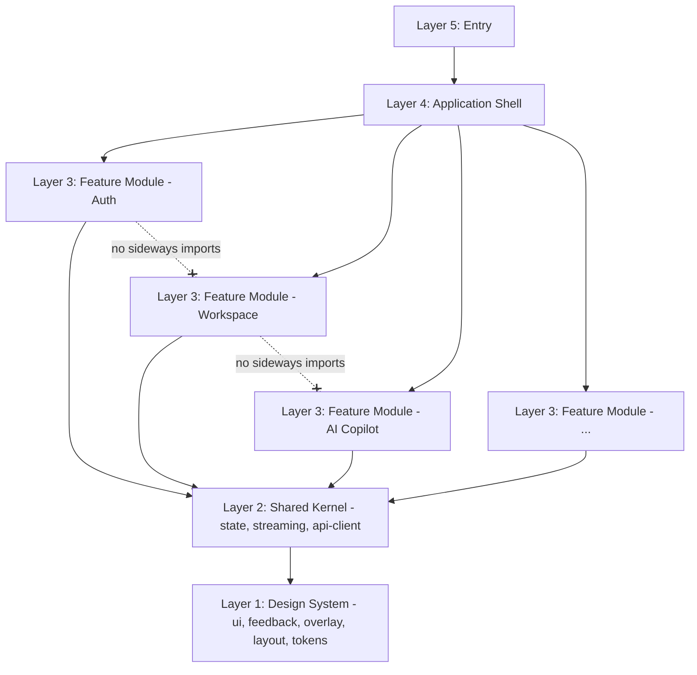
```mermaid
flowchart TB
    L5[Layer 5: Entry] --> L4[Layer 4: Application Shell]
    L4 --> L3A[Layer 3: Feature Module - Auth]
    L4 --> L3B[Layer 3: Feature Module - Workspace]
    L4 --> L3C[Layer 3: Feature Module - AI Copilot]
    L4 --> L3D[Layer 3: Feature Module - ...]
    L3A --> L2[Layer 2: Shared Kernel - state, streaming, api-client]
    L3B --> L2
    L3C --> L2
    L3D --> L2
    L2 --> L1[Layer 1: Design System - ui, feedback, overlay, layout, tokens]
    L3A -.no sideways imports.-x L3B
    L3B -.no sideways imports.-x L3C
```

### 1.3 Module Dependency Graph (Item 9)

**Purpose & Architecture.** Extends the layering (§1.2) into an explicit, enforced dependency graph checked by lint rules (an import-boundary linter configured to fail CI on a layer or feature-boundary violation, the frontend equivalent of `BACKEND_ARCHITECTURE.md`'s dependency-rule enforcement). Feature modules that must communicate (e.g., the Notifications feature reacting to an event from the AI Copilot feature) do so through one of two sanctioned channels: (a) a shared, framework-level event bus living in the Shared Kernel (layer 2), never a direct import; or (b) shared server state via TanStack Query's cache, when the coupling is really "both features read the same resource," not genuine cross-feature logic coupling.

**Engineering Rationale & Alternatives Considered.** An enforced (not merely documented) boundary is chosen because a documented-only convention reliably erodes at team scale — the same lesson `BACKEND_ARCHITECTURE.md` applied to its own module boundaries, reused here rather than re-derived.

**Trade-offs.** The event bus adds a small amount of indirection versus a direct import for genuinely simple cross-feature notifications, accepted because the alternative (permitting direct feature-to-feature imports "just this once") has no natural stopping point once started.

**Future Evolution.** The event bus is deliberately the same conceptual shape as `BACKEND_ARCHITECTURE.md`'s backend Event Bus (§7 of that document) — not the same transport, but the same "decoupled publish/subscribe over direct calls" philosophy, so an engineer moving between frontend and backend code recognizes the pattern immediately.

**Diagram 2 — Module Dependency Graph**

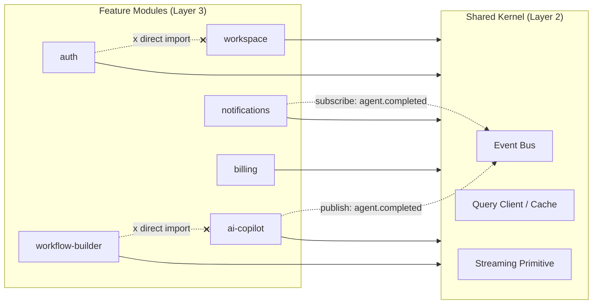
```mermaid
flowchart LR
    subgraph Features["Feature Modules (Layer 3)"]
        AUTH[auth]
        WS[workspace]
        AI[ai-copilot]
        WF[workflow-builder]
        NOTIF[notifications]
        BILL[billing]
    end
    subgraph Kernel["Shared Kernel (Layer 2)"]
        EVBUS[Event Bus]
        QUERY[Query Client / Cache]
        STREAM[Streaming Primitive]
    end
    AUTH --> Kernel
    WS --> Kernel
    AI --> Kernel
    WF --> Kernel
    NOTIF --> Kernel
    BILL --> Kernel
    AI -."publish: agent.completed".-> EVBUS
    NOTIF -."subscribe: agent.completed".-> EVBUS
    AUTH -.x direct import.-x WS
    WF -.x direct import.-x AI
```

### 1.4 Folder Architecture (Item 10)

**Purpose & Architecture.** Restates and extends `ARCHITECTURE.md` §Frontend and `conventions.md` §24 verbatim as the binding folder contract, adding the state, streaming, and plugin infrastructure this document introduces:

```
frontend/src/
├── app/                    # Layer 4 — providers, router config, shell composition
├── features/<feature>/     # Layer 3 — api/, components/, hooks/, pages/, schemas/, state/, types/
├── shared/
│   ├── components/         # Layer 1 — ui/, feedback/, overlay/, layout/ (unchanged, cited)
│   ├── hooks/, lib/, types/, utils/, constants/   # Layer 2 (unchanged, cited)
│   ├── state/               # NEW — client-state store factory, AI-state slice infra
│   ├── streaming/            # NEW — SSE/WebSocket streaming primitive (§ Part 6)
│   └── query/                 # NEW — TanStack Query client config, query-key factory
├── plugins/                 # NEW — plugin runtime & slot registry (§ Part 14)
├── config/, assets/, styles/ # unchanged, cited
```

**Responsibilities & Design Decisions.** Each feature module gains one new optional subfolder — `state/` — for feature-local client state (§5.3) that does not belong in the Shared Kernel's global store; a feature without local UI state simply omits it, per the design system's own established economy (`conventions.md`'s "don't add a token/folder that isn't needed" ethos applied one level up).

**Trade-offs.** Three new top-level `shared/` folders (`state/`, `streaming/`, `query/`) versus folding them into the existing `lib/` — rejected, because each is substantial enough infrastructure (§ Part 5, Part 6) to warrant its own discoverable location, matching the granularity `conventions.md` already applies to `components/`'s four sub-folders.

**Future Evolution.** `plugins/` is added at the top level, sibling to `features/`, specifically to make explicit that plugins are architecturally distinct from first-party feature modules (§ Part 14) — never nested inside `features/` where they might be mistaken for one.

### 1.5 Feature-Based Architecture (Item 11)

**Purpose & Architecture.** Fully specified by `ARCHITECTURE.md` and §1.4 above; this section adds the internal shape of a feature module's own six subfolders and the rule governing what belongs in each: `api/` — TanStack Query hooks and the feature's typed API-client calls (§5.2), never raw `fetch` calls scattered through components; `components/` — presentational, feature-scoped components not reusable enough to promote to `shared/`; `hooks/` — feature-scoped non-data hooks (derived UI logic); `pages/` — route-level components registered with the router (§4.2), composing `components/` and `api/`; `schemas/` — Zod schemas, shared between React Hook Form validation and (where the shape matches) TanStack Query response parsing; `state/` — feature-local client state (§1.4).

**Engineering Rationale & Alternatives Considered.** A feature's `api/` hooks are the *only* sanctioned place a component calls the network — enforced by the same import-boundary linting as §1.3, so that a data-fetching change (a new cache-invalidation rule, a new retry policy) has exactly one place to be made per feature.

**Trade-offs.** Requires slightly more indirection (a component calls a named hook like `useWorkspaceMembers()` rather than an inline query) for a large, durable win in testability and cache-policy consistency.

**Future Evolution.** As a feature grows large enough to warrant its own internal sub-features (e.g., `workflow-builder` eventually containing `workflow-builder/canvas`, `workflow-builder/node-library`), the same six-subfolder shape recurses one level, never flattening into a different convention.

### 1.6 Layered Frontend Architecture (Item 12)

**Purpose & Architecture.** Synthesizes §1.2–§1.5 into the single canonical layering diagram this entire document builds on, and states the one rule that makes it enforceable: **every import either points strictly downward across the five layers, or is a same-layer, same-feature import.** There is no other sanctioned import shape anywhere in the frontend codebase.

**Diagram 3 — Layered Frontend Architecture (canonical)**

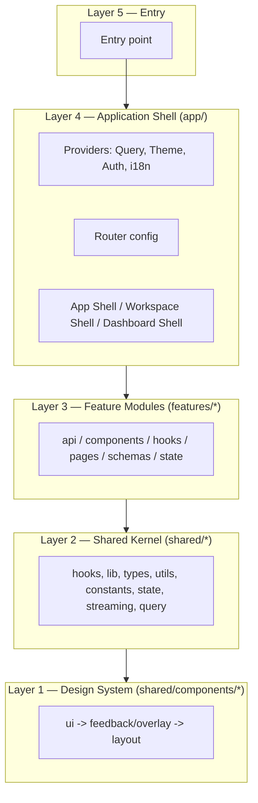
```mermaid
flowchart TB
    subgraph L5["Layer 5 — Entry"]
        MAIN[Entry point]
    end
    subgraph L4["Layer 4 — Application Shell (app/)"]
        PROV[Providers: Query, Theme, Auth, i18n]
        ROUTER[Router config]
        SHELLS[App Shell / Workspace Shell / Dashboard Shell]
    end
    subgraph L3["Layer 3 — Feature Modules (features/*)"]
        FM[api / components / hooks / pages / schemas / state]
    end
    subgraph L2["Layer 2 — Shared Kernel (shared/*)"]
        SK[hooks, lib, types, utils, constants, state, streaming, query]
    end
    subgraph L1["Layer 1 — Design System (shared/components/*)"]
        DS[ui -> feedback/overlay -> layout]
    end
    MAIN --> L4 --> L3 --> L2 --> L1
```

---

## Part 2 — Component System

*Common to this Part:* the design system's own layering (`ui → feedback/overlay → layout`, `components.md`, `conventions.md` §22–24) is cited, not redesigned. This Part defines the taxonomy *above* that layering — how design-system primitives, cross-feature patterns, and feature-specific business components relate.

### 2.1 Atomic Design Strategy (Item 13)

**Purpose & Architecture.** BizPilot AI deliberately adopts a **pragmatic four-tier taxonomy** rather than textbook Atomic Design's five-tier atoms/molecules/organisms/templates/pages vocabulary — the existing design system already organizes by *dependency layer* (`ui/feedback/overlay/layout`, `conventions.md` §24) rather than by abstract composition size, and this document keeps that vocabulary rather than introducing a second, competing one. The four tiers are: **Primitives** (design-system `ui/`, `feedback/`, `overlay/` — presentational, data-driven via props only, per `components.md` §8's own stated rule); **Patterns** (design-system `layout/` plus new cross-feature, still-presentational compositions — a `DataTable` pattern, an `EmptyState`-with-action pattern — promoted to `shared/` the first time a second feature needs it, never speculatively); **Business Components** (feature-owned, feature-`components/`-scoped, wired to feature state/data — e.g., `WorkspaceSwitcher`, `InvoiceLineItemEditor`); **Screens** (feature `pages/`, route-registered, composing Business Components).

**Engineering Rationale & Alternatives Considered.** Textbook Atomic Design's atom/molecule/organism boundary is notoriously subjective in practice (is a labeled input a molecule or an organism?) and was rejected specifically because it does not map cleanly onto the dependency-direction rule (`conventions.md` §24) that already governs the shipped design system — a taxonomy that doesn't match an enforced import boundary is decoration, not architecture.

**Trade-offs.** A four-tier model is coarser-grained than five-tier Atomic Design, accepted because the enforced dependency-direction rule (§1.6) is doing the real architectural work; the taxonomy is a naming/discovery aid on top of it, not a substitute for it.

**Future Evolution.** The "promote on second use, never speculatively" rule for Patterns is the frontend's own instance of YAGNI, reused verbatim from the discipline every prior document in this series applies to its own subsystems.

### 2.2 Component Taxonomy (Item 14)

**Purpose & Architecture.** A single decision table extends `components.md`'s "Where new components go" table (already covering the four design-system folders) up one level, covering all four tiers:

| Component does this... | Goes in... |
|---|---|
| Visual primitive, no feature knowledge, reusable everywhere | `shared/components/{ui,feedback,overlay}` (existing rule, `components.md`) |
| App-chrome composition of primitives, no feature knowledge | `shared/components/layout` (existing rule) |
| Cross-feature composition with light structure but no feature-specific data shape (e.g., a generic paginated data table) | A new `shared/components/patterns/` entry, promoted on second use |
| Renders feature data, wired to feature `api/`/`state/` | Feature's own `components/` |
| Registered with the router, composes Business Components | Feature's own `pages/` |

**Trade-offs.** Introducing a fifth design-system-adjacent folder (`patterns/`) versus overloading `layout/` — rejected overloading, since `layout/`'s existing definition (`components.md`) is specifically app-chrome composition, and a generic `DataTable` is not chrome; a distinct folder keeps `layout/`'s definition from eroding.

**Future Evolution.** `patterns/` is expected to grow the fastest of any design-system-adjacent folder as the product matures — it is where cross-cutting product conventions (how empty states, bulk-selection toolbars, and filter bars look platform-wide) accumulate.

### 2.3 UI Composition Rules (Item 15)

**Purpose & Architecture.** Three composition rules, binding across all four tiers: (1) **props down, events up** — no tier reaches into a descendant's internals or global mutable state to communicate, consistent with React's own data-flow model and with `conventions.md`'s `onX` event-prop naming convention; (2) **compound components over prop explosion** — a component needing many structurally-related pieces (as `Card`, `Table`, `Modal`, `Select` already do, per `conventions.md` §23) exposes sibling named exports, never a single component accepting a dozen configuration props; (3) **`asChild`/`buttonVariants`-style style-without-behavior escape hatches** are reserved for Primitives only (already the pattern for `Button` per `components.md` §8) — Business Components never expose an `asChild`-equivalent, since their behavior is feature-specific and not meant to be borrowed.

**Trade-offs.** Compound components cost a small amount of import verbosity (`CardHeader`, `CardContent`, `CardFooter` as separate imports) versus a single configurable `Card`, accepted for the tree-shakeability and per-part typing `conventions.md` §23 already justified for the design system, extended here as binding for any new Pattern-tier component.

### 2.4 Container vs. Presentational Components (Item 16)

**Purpose & Architecture.** The classic container/presentational split, mapped precisely onto the four-tier taxonomy: **Primitives and Patterns are always presentational** (props and callbacks only, no data fetching, no business logic — already law for Primitives per `components.md` §8, extended to Patterns here); **Business Components are containers** — they call feature `api/` hooks (§1.5), own or read feature `state/`, and pass resolved data down to Primitives/Patterns as plain props; **Screens (`pages/`) are the outermost containers**, composing Business Components and handling route-level concerns (params, loaders, §4.2).

**Engineering Rationale & Alternatives Considered.** A strict split (rather than allowing Primitives to optionally fetch their own data, as some component libraries permit) is chosen because it is what makes Primitives reusable across a future desktop or mobile shell (§ Part 14) without modification — a data-fetching Primitive would carry a web-fetch assumption that a React Native mobile shell cannot satisfy identically.

**Trade-offs.** Requires every Business Component to explicitly thread loading/error/data states down through props, more verbose than a self-fetching component, in direct exchange for the reuse and testability payoff.

**Future Evolution.** This exact split is what allows §14's future React Native mobile shell to reuse every Business Component's *logic* (the container) while swapping only the Primitive layer underneath it for React Native equivalents — a stated, load-bearing design decision, not an incidental benefit.

### 2.5 Shared Component Policy (Item 17)

**Purpose & Architecture.** A component is promoted from a feature's `components/` into `shared/components/patterns/` (or, if genuinely feature-agnostic and primitive, into `ui/feedback/overlay`) under one rule: **on its second real usage by a different feature**, never speculatively ahead of that need (restating §2.1's YAGNI framing as policy). Promotion is a PR that moves the file, strips any feature-specific naming/logic, and updates both call sites — never a copy-paste duplication left to silently drift.

**Engineering Rationale & Alternatives Considered.** "Promote eagerly, in case it's reused later" was rejected — it is exactly how component libraries accumulate never-reused, speculative abstractions that add maintenance surface without ever paying for themselves, the same anti-pattern every prior document in this series explicitly designs against (`BACKEND_ARCHITECTURE.md`'s and `AI_PLATFORM_ARCHITECTURE.md`'s repeated YAGNI framing, reused here).

**Trade-offs.** A short window where two features have near-duplicate components before the second usage triggers promotion, accepted as strictly better than a wrong, premature abstraction that has to be un-generalized later.

### 2.6 Business Component Policy (Item 18)

**Purpose & Architecture.** Business Components remain in their owning feature's `components/` folder permanently unless promoted per §2.5 — they are never pre-emptively "shared-ified." A Business Component may depend on any lower layer (Shared Kernel, Design System) freely, and may depend on its own feature's `api/`, `hooks/`, `state/`, but never on another feature's internals (§1.3).

**Security Considerations.** Business Components are the layer responsible for permission-aware rendering (§4.7) — they are where a `usePermission()` check gates whether an action is rendered at all, keeping Primitives and Patterns entirely permission-agnostic and reusable regardless of the viewer's role.

**Diagram 4 — Component Taxonomy & Data Flow**

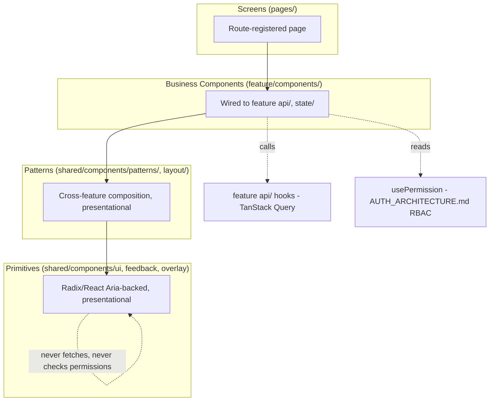
```mermaid
flowchart TB
    subgraph Screens["Screens (pages/)"]
        PAGE[Route-registered page]
    end
    subgraph Business["Business Components (feature/components/)"]
        BIZ[Wired to feature api/, state/]
    end
    subgraph Patterns["Patterns (shared/components/patterns/, layout/)"]
        PAT[Cross-feature composition, presentational]
    end
    subgraph Primitives["Primitives (shared/components/ui, feedback, overlay)"]
        PRIM[Radix/React Aria-backed, presentational]
    end
    PAGE --> BIZ --> PAT --> PRIM
    BIZ -."calls".-> API[feature api/ hooks - TanStack Query]
    BIZ -."reads".-> PERM[usePermission - AUTH_ARCHITECTURE.md RBAC]
    PRIM -."never fetches, never checks permissions".-> PRIM
```

---

## Part 3 — Design System Architecture, Theming & White-labeling

*Common to this Part:* Items 20–28 (Token System, Typography Engine, Color Engine, Spacing System, Elevation System, Motion System, Icon Strategy) are **already fully specified** in `design-system/foundations.md` §1–§6 and §21 — two-layer primitive/semantic tokens, the 15px-default Inter type scale, the neutral/brand/accent/semantic color scales, the 8px/4px-half-step spacing grid, the shadow-plus-hairline-border elevation model, the CSS-keyframes-for-Radix / Framer-Motion-for-everything-else motion split, and Lucide-exclusive icons at three fixed sizes. This document cites each verbatim and does not reproduce their tables; it addresses only what `foundations.md` left unspecified — governance, grid layout, illustration, and runtime theming — at full depth.

### 3.1 Design System Architecture (Item 19)

**Purpose & Architecture.** The design system is versioned and owned as its own layer (Layer 1, §1.2) with a change-review policy distinct from feature code: any change to a token (`theme.css`) or a Primitive's public prop contract requires review from whoever owns design-system stewardship (a role, not necessarily a dedicated team at Phase 1) specifically because such a change is platform-wide-blast-radius by construction — every consumer of `bg-primary` or `<Button variant>` is affected simultaneously.

**Responsibilities & Design Decisions.** The design system guarantees three contracts to every feature module: (1) visual values are only ever consumed via token, never hardcoded (`foundations.md` principle 3); (2) Primitive prop contracts (`variant`, `size`, `isLoading`, etc., `conventions.md` §23) are stable and additive-only within a major version; (3) every Primitive is theme-agnostic by construction (no `dark:` variants in component code, `foundations.md` §1).

**Engineering Rationale & Alternatives Considered.** Treating the design system as a reviewed, semi-independent layer (rather than "just more application code anyone edits freely") was chosen because BizPilot AI's white-label ambition (§3.6) makes token stability a product guarantee, not merely a developer-experience nicety — a silently-breaking token change could visually break every white-labeled tenant's brand simultaneously.

**Trade-offs.** An additional review gate on design-system changes is friction versus unrestricted editing, accepted because the blast radius asymmetry (one bad token change vs. one bad feature-component change) justifies it.

**Future Evolution.** As the plugin ecosystem (§ Part 14) matures, the design system's Primitive layer becomes the *only* styling surface plugins are permitted to consume — its contract stability requirement becomes load-bearing for third-party compatibility, not just first-party consistency.

### 3.2 Token System, Typography Engine, Color Engine, Spacing System, Elevation System, Motion System, Icon Strategy (Items 20, 21, 22, 23, 25, 26, 27)

Fully specified in `foundations.md` §1–§6, §21 (cited, not reproduced). This document's only addition: every one of these token categories is also a **theming axis** consumed by §3.5's Theme Engine and §3.6's white-label mechanism — a fact `foundations.md` did not need to state (it predates the white-label requirement) but which this document makes explicit: any future token added to any of these categories must be added as a *semantic* token re-declared per theme (`conventions.md` §22's existing rule), never as a primitive value referenced directly, or it silently breaks white-label re-theming the day it's introduced.

### 3.3 Responsive Grid System (Item 24)

**Purpose & Architecture.** A token-driven breakpoint scale (mobile/tablet/desktop/wide, matching Tailwind's default breakpoint philosophy) governs three responsive concerns uniformly: the Workspace Shell's sidebar collapse behavior (§4.11), Dashboard/Analytics grid layouts (§10.4), and general page-level responsive flow. Layout uses CSS Grid/Flexbox utility composition (Tailwind), never a bespoke grid component library, consistent with F6 (tokens are the only source of visual truth) — spacing between grid items uses the existing 8px/4px spacing tokens (§3.2), never ad hoc gap values.

**Responsibilities & Design Decisions.** Three responsive tiers are named explicitly: **Compact** (mobile — single-column, sidebar becomes an overlay drawer per `foundations.md`'s existing note that Framer Motion drives "the mobile `Sidebar` drawer"); **Standard** (tablet/small-desktop — collapsed/icon-only sidebar, single-column content with a max-width constraint); **Wide** (large desktop — full sidebar, multi-column dashboard grids, §10.4).

**Engineering Rationale & Alternatives Considered.** Three tiers (not five or six) is chosen to match `PRD.md`'s stated primary usage context (a business operator at a desk, occasionally on a tablet) — BizPilot AI is not primarily a mobile-first product at this phase, so the grid system optimizes for desktop/tablet fidelity first, mobile-workable second, distinct from a consumer social app's mobile-first default.

**Trade-offs.** Optimizing desktop-first is a conscious bet aligned with the stated primary persona; revisited only if usage data (§13.5) shows materially higher mobile-web usage than anticipated, ahead of any dedicated native mobile app (§14.5).

**Future Evolution.** The three-tier model is designed to compose cleanly with a future native mobile app's own layout system (§14.5) rather than being extended to serve mobile web as a mobile-app substitute — the grid system is not trying to be a mobile app.

### 3.4 Illustration Strategy (Item 28)

**Purpose & Architecture.** Illustration is deliberately minimal and reserved for two contexts only: empty states (via the existing `EmptyState` component, `components.md`) and onboarding/marketing surfaces — never as general UI decoration, consistent with `foundations.md`'s "restraint over decoration" principle 1. Illustrations are SVG assets (theme-aware via `currentColor`/token-referenced fills where feasible, matching the icon strategy's `currentColor` inheritance rule, `foundations.md` §6) stored in `shared/assets/images` and referenced by empty-state/onboarding Business Components, never inlined ad hoc per feature.

**Trade-offs.** A restrained illustration strategy (versus an illustration-heavy, characterful brand style) is a direct extension of the existing Linear/Stripe-inspired restraint principle, not a new stylistic decision — kept consistent rather than introducing a second visual voice.

**Future Evolution.** A white-labeled tenant's ability to swap illustration assets (§3.6) is deferred — Phase 1–2 illustrations are BizPilot-AI-branded on every tenant; per-tenant illustration override is revisited only if Enterprise white-label contracts specifically require it, since it is a materially larger asset-pipeline commitment than token-based recoloring.

### 3.5 Theme Engine (Item 29)

**Purpose & Architecture.** Extends `conventions.md` §22's existing build-time CSS-variable theming mechanism (`:root`/`.dark` token re-declaration) with a **runtime layer**: on session start, the resolved workspace's brand configuration (§3.6) is fetched and applied by setting a scoped set of CSS custom properties directly on the document root — layered *on top of* the existing light/dark token declarations, overriding only the specific brand-relevant tokens (`--primary`, `--ring`, and a small, explicit allowlist) rather than replacing the entire token set. Light/dark mode (§3.5b) and brand theming are two **orthogonal axes** applied independently — switching dark mode never resets brand overrides, and vice versa, since both are implemented as CSS custom-property layers rather than as competing theme objects.

**Responsibilities & Design Decisions.** Only tokens on an explicit, narrow allowlist are brand-overridable (primary color family, logo asset, product name string) — the vast majority of tokens (spacing, typography, elevation, neutral scale) remain fixed platform-wide, per F6 and per `foundations.md`'s existing rule that most tokens exist precisely so components never need per-tenant variants.

**Engineering Rationale & Alternatives Considered.** A narrow, explicit override allowlist (versus letting a tenant re-theme every token) was chosen deliberately: unrestricted re-theming would let a white-label tenant produce a visually broken or inaccessible (contrast-failing) product, which `foundations.md`'s WCAG-AA-by-formula color system (§60 of that doc) is specifically designed to prevent — allowing full override would silently undo that guarantee.

**Trade-offs.** Less white-label visual flexibility than a full-repaint theming system, accepted as the correct trade given F6 and the accessibility guarantee it protects; revisited only with an accompanying automated contrast-validation gate if broader override is ever required (§3.6).

**Security Considerations.** Brand configuration is fetched over the same authenticated API surface as any other workspace resource (`API_CONTRACT.md`) and is sanitized before being applied as CSS custom properties or an `` `src` — never interpreted as raw HTML/CSS, closing an otherwise-realistic tenant-controlled-CSS-injection vector.

**Performance & Scalability Considerations.** Brand override application is a single, batched CSS-custom-property write on session bootstrap (§4.9), not a per-component re-render — every Primitive already resolves color via `var(--primary)` indirection (`conventions.md` §22), so brand theming is "free" in exactly the way `conventions.md` already predicted for dark mode.

### 3.6 Dark Mode Architecture (Item 30)

**Purpose & Architecture.** Fully specified by the existing `.dark` class-toggle mechanism (`conventions.md` §22, `foundations.md` throughout) — cited, not redesigned. This document adds only the persistence and system-preference-detection policy: dark/light/system preference is read from `prefers-color-scheme` on first load, overridable per-user, and persisted client-side (§5.7's Persistent State allowlist) — never persisted server-side as a workspace-level setting, since it is a personal, not organizational, preference (distinct from brand theming, §3.5, which *is* workspace-level).

**Future Evolution.** Should a future Enterprise requirement demand an organization-enforced (not just user-preferred) light/dark mode, that is modeled as an additional brand-config field (§3.5's allowlist gains a "force theme" entry), not a parallel mechanism.

### 3.7 Brand Customization & 3.8 White-label Support (Items 31–32)

**Purpose & Architecture.** White-labeling is a **product tier and configuration concern**, built entirely on the Theme Engine (§3.5) plus three additional, narrowly-scoped surfaces: (1) the product name/logo appearing in the Application Shell's chrome (§4.9) and any transactional surface (email templates are a backend/`AI_PLATFORM_ARCHITECTURE.md`-adjacent concern, cited not owned here); (2) a custom domain option, which is a `CLOUD_INFRASTRUCTURE.md` §3.2 DNS/edge-routing concern this document only consumes, not redesigns; (3) the brand-token override allowlist (§3.5). A white-labeled tenant runs the **identical build artifact** as every other tenant — white-labeling is entirely a runtime, per-workspace configuration state, never a per-tenant fork or separate build, directly extending `CLOUD_INFRASTRUCTURE.md` §2.1's Enterprise-Isolated environment pattern (same infrastructure modules, different parameters) to the frontend (same bundle, different runtime brand config).

**Engineering Rationale & Alternatives Considered.** A per-tenant fork or build-time theming (a separate Vite build per white-label tenant) was explicitly rejected: it would multiply CI/CD pipeline count linearly with tenant count, directly contradicting `CLOUD_INFRASTRUCTURE.md`'s entire deployment-pipeline design (§5 of that document) which assumes one build artifact per release. Runtime theming keeps white-labeling additive to, not multiplicative against, the existing CD pipeline.

**Trade-offs.** Runtime-only theming cannot rebrand anything baked into the static bundle at build time (e.g., the marketing/auth pages' own hardcoded copy, if any) — accepted, and explicitly scoped: white-labeling applies to the authenticated product surface, not to BizPilot AI's own marketing site, which is out of scope for a white-label tenant by product definition.

**Security Considerations.** A white-label tenant's brand configuration is workspace-scoped data, subject to the exact same `workspaceId`-based access control as any other workspace resource (`DATABASE.md` §3.1, `AUTH_ARCHITECTURE.md`'s RBAC) — no special-cased security surface is introduced for it.

**Future Evolution.** The narrow, allowlist-based approach (§3.5) is what keeps white-label support cheap to extend — adding a new brand-overridable token later is a one-line allowlist addition, not a re-architecture, mirroring the "configuration change, not architecture change" payoff pattern used throughout `CLOUD_INFRASTRUCTURE.md`.

**Diagram 5 — Theme Resolution & White-label Flow**

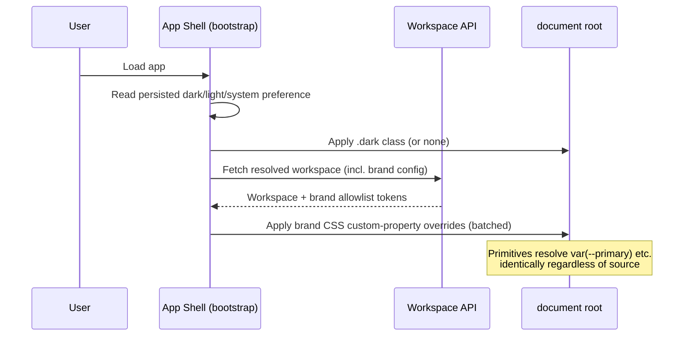
```mermaid
sequenceDiagram
    participant U as User
    participant Shell as App Shell (bootstrap)
    participant API as Workspace API
    participant DOM as document root
    U->>Shell: Load app
    Shell->>Shell: Read persisted dark/light/system preference
    Shell->>DOM: Apply .dark class (or none)
    Shell->>API: Fetch resolved workspace (incl. brand config)
    API-->>Shell: Workspace + brand allowlist tokens
    Shell->>DOM: Apply brand CSS custom-property overrides (batched)
    Note over DOM: Primitives resolve var(--primary) etc.<br/>identically regardless of source
```

**Diagram 6 — Token Layering (Primitive → Semantic → Theme → Brand)**

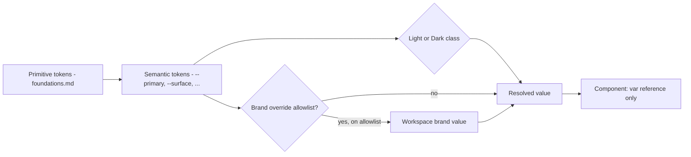
```mermaid
flowchart LR
    PRIM[Primitive tokens - foundations.md] --> SEM[Semantic tokens - --primary, --surface, ...]
    SEM --> MODE{Light or Dark class}
    MODE --> RESOLVED[Resolved value]
    SEM --> BRAND{Brand override allowlist?}
    BRAND -->|yes, on allowlist| OVERRIDE[Workspace brand value]
    BRAND -->|no| RESOLVED
    OVERRIDE --> RESOLVED
    RESOLVED --> COMPONENT[Component: var reference only]
```

---

## Part 4 — Navigation, Routing, Multi-tenancy & Application Shells

### 4.1 Navigation Architecture (Item 33)

**Purpose & Architecture.** Navigation is modeled as data, not JSX: each feature module optionally exports a navigation-descriptor object (label, icon, route, required permission, feature-flag key) consumed by the Workspace Shell's `Sidebar` (`shared/components/layout/Sidebar.tsx`, already shipped) — the Sidebar itself remains a pure, presentational Pattern-tier component (§2.2) rendering whatever descriptor list it is given, never hardcoding per-feature entries. A central navigation registry (Shared Kernel) aggregates every feature's descriptors at Application Shell bootstrap.

**Responsibilities & Design Decisions.** The registry, not the Sidebar, is responsible for filtering entries by permission (§4.7) and feature flag (§4.8) before the Sidebar ever renders them — keeping the Sidebar's existing `NavLinkRow` active-state logic (already implemented and bug-fixed in the design-system phase) untouched and unaware of authorization entirely.

**Engineering Rationale & Alternatives Considered.** A data-driven registry (versus each feature manually inserting itself into a shared `<Sidebar>` JSX tree) was chosen specifically to preserve F9 (no cross-feature imports) — a feature registering a descriptor never imports the Sidebar or any other feature's navigation code.

**Trade-offs.** An extra indirection layer (descriptor → registry → Sidebar) versus direct JSX composition, accepted because it is the only shape compatible with F9 and with the plugin system (§ Part 14) later contributing navigation entries through the identical registry mechanism, not a special case.

**Future Evolution.** Plugin-contributed navigation entries (§14.1) use the exact same descriptor shape, validated against the same permission/flag filtering — plugins get no navigation-registration capability first-party features don't also have.

### 4.2 Routing Architecture (Item 34) & 4.3 Nested Routing (Item 35)

**Purpose & Architecture.** React Router owns all client-side routing, structured in three nested tiers mirroring the shell hierarchy (§1.2): **Root routes** (public — auth pages, marketing, outside any shell); **Workspace routes** (`/w/:workspaceId/*`, wrapped by the Workspace Shell, §4.11); **Feature routes** (nested under Workspace routes, each feature's `pages/` registering its own sub-tree via a route-config export, aggregated centrally the same way navigation descriptors are, §4.1). Route-level code splitting (§12.5) is applied at the Feature-route boundary by default.

**Responsibilities & Design Decisions.** The `:workspaceId` path segment is the single source of truth for "which workspace am I in" — consistent with `AUTH_ARCHITECTURE.md` §5.2's single-origin decision (no subdomain-per-workspace), workspace context is a **route parameter**, not a DNS or session-only concept, making it deep-linkable, bookmarkable, and shareable, and making every TanStack Query key (§5.2) trivially derivable from the current route.

**Engineering Rationale & Alternatives Considered.** Path-segment workspace scoping (`/w/:workspaceId/...`) was chosen over (a) subdomain-per-workspace — rejected, contradicts `AUTH_ARCHITECTURE.md` §5.2 directly; (b) a session-only, non-URL workspace context — rejected, breaks deep-linking and makes "open this exact dashboard in a new tab" impossible, an explicit `PRD.md` collaboration expectation.

**Trade-offs.** Every feature route is one path segment deeper than a non-multi-tenant app would need, a negligible cost for the deep-linking and query-key-derivation payoff.

**Security Considerations.** A route-level loader/guard (§4.4) validates the requesting user's membership in `:workspaceId` before any feature route renders — an unauthorized workspace ID in the URL never reaches feature code, closing an IDOR-shaped UX gap even though the backend remains the authoritative enforcement point per `AUTH_ARCHITECTURE.md`.

**Diagram 7 — Nested Routing Structure**

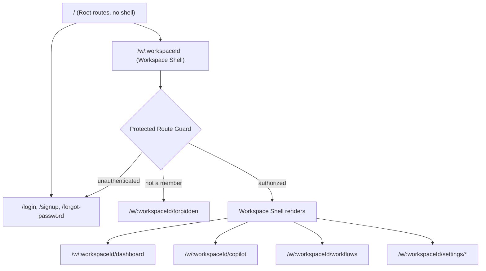
```mermaid
flowchart TB
    ROOT["/  (Root routes, no shell)"] --> AUTHPAGES["/login, /signup, /forgot-password"]
    ROOT --> WSROOT["/w/:workspaceId  (Workspace Shell)"]
    WSROOT --> GUARD{Protected Route Guard}
    GUARD -->|unauthenticated| AUTHPAGES
    GUARD -->|not a member| FORBIDDEN["/w/:workspaceId/forbidden"]
    GUARD -->|authorized| WSSHELL[Workspace Shell renders]
    WSSHELL --> DASH["/w/:workspaceId/dashboard"]
    WSSHELL --> AI["/w/:workspaceId/copilot"]
    WSSHELL --> WF["/w/:workspaceId/workflows"]
    WSSHELL --> SETTINGS["/w/:workspaceId/settings/*"]
```

### 4.4 Protected Routes (Item 36)

**Purpose & Architecture.** A single, reusable route-guard wrapper checks session validity (via a lightweight, cached "current session" query resolved at Application Shell bootstrap, §4.9) before rendering any Workspace-scoped route — unauthenticated requests redirect to `/login`, preserving the originally-requested URL for post-login redirect. This is UX routing convenience only; it is never the security boundary, restating F-nothing-new but worth stating precisely: every API call the guarded route makes is independently authorized server-side per `AUTH_ARCHITECTURE.md`, regardless of what the guard rendered.

**Trade-offs.** A single shared guard (versus per-feature ad hoc auth checks) guarantees consistent redirect/loading-state UX across every protected route and is the only pattern compatible with F9.

### 4.5 Workspace Switching (Item 37) & 4.6 Multi-tenant UI (Item 38)

**Purpose & Architecture.** Switching workspaces is a **client-side navigation**, not a re-authentication: the user's session (`AUTH_ARCHITECTURE.md` cookie) is workspace-agnostic — it proves *who* the user is; *which workspace* is active is resolved by the `:workspaceId` route param (§4.2) checked against the user's membership list (returned once at login/session-resolution). Switching workspace navigates to the equivalent route under the new `:workspaceId`, which triggers TanStack Query's workspace-scoped cache (§5.2's query-key convention: every workspace-scoped query key is namespaced `[workspaceId, resource, ...params]`) to serve cached data if already fetched for that workspace, or fetch fresh otherwise — never a full page reload.

**Responsibilities & Design Decisions.** Multi-tenant UI correctness rests on one invariant, stated explicitly because it is easy to violate accidentally: **no client-state store (§5.3) or query cache entry may ever be read across a workspace-ID boundary.** The query-key namespacing convention makes this structurally true for server state; client UI state (§5.3) that is workspace-scoped (e.g., "which sidebar section is expanded") is itself namespaced by `workspaceId` in its store key.

**Engineering Rationale & Alternatives Considered.** Cache-key namespacing (versus clearing the entire TanStack Query cache on every workspace switch) was chosen specifically for the collaboration UX benefit of instant switch-back — a user bouncing between two workspaces they're a member of sees cached data immediately on return, rather than a full refetch every time, at the cost of higher client memory usage bounded by TanStack Query's own garbage collection (§5.9).

**Security Considerations.** Workspace-membership validation happens both client-side (route guard, §4.4, for UX) and server-side (every API call, per `AUTH_ARCHITECTURE.md`) — a stale client-side membership list (e.g., a user just removed from a workspace by another admin) fails safely, since the server rejects the request and the frontend's global error handling (§7.4) redirects to a workspace-selection screen on a 403 workspace-scoped error.

**Diagram 8 — Workspace Switching Sequence**

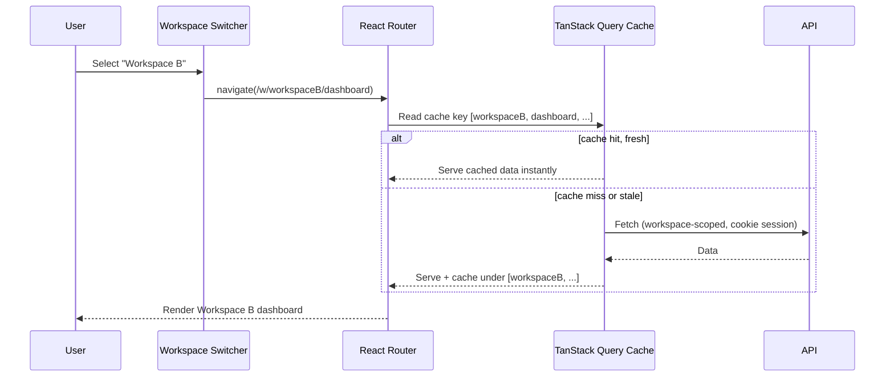
```mermaid
sequenceDiagram
    participant U as User
    participant Nav as Workspace Switcher
    participant Router as React Router
    participant Query as TanStack Query Cache
    participant API as API
    U->>Nav: Select "Workspace B"
    Nav->>Router: navigate(/w/workspaceB/dashboard)
    Router->>Query: Read cache key [workspaceB, dashboard, ...]
    alt cache hit, fresh
        Query-->>Router: Serve cached data instantly
    else cache miss or stale
        Query->>API: Fetch (workspace-scoped, cookie session)
        API-->>Query: Data
        Query-->>Router: Serve + cache under [workspaceB, ...]
    end
    Router-->>U: Render Workspace B dashboard
```

### 4.7 Permission-aware Rendering (Item 39)

**Purpose & Architecture.** A single `usePermission(permissionKey)` hook (Shared Kernel), backed by the resolved permission set returned at session/workspace resolution (`AUTH_ARCHITECTURE.md`'s RBAC permission catalog, cited not redesigned), is the *only* sanctioned way any component decides whether to render an action, a nav entry (§4.1), or a route (§4.4). It returns a boolean, never a partial/ambiguous state — a permission is either present or absent in the resolved set.

**Security Considerations.** Restated deliberately: this is a UX-quality mechanism (hiding actions a user cannot take, avoiding a confusing "click and get denied" experience) — the sole authorization enforcement point remains the backend, per `AUTH_ARCHITECTURE.md`. `usePermission` failing open (a bug that returns `true` incorrectly) is a UX bug, not a security incident, precisely because nothing downstream trusts it as an access-control decision.

### 4.8 Feature Flag Rendering (Item 40)

**Purpose & Architecture.** A parallel `useFeatureFlag(flagKey)` hook, backed by `BACKEND_ARCHITECTURE.md` §7.7's `FeatureFlagEngine` resolved per-user/per-workspace at session bootstrap, gates UI-visible functionality independently of permission (F8) — a user can be fully permitted to use a feature that is simply not yet flagged on for them (a canary rollout, `CLOUD_INFRASTRUCTURE.md` §5.1's generalized canary mechanism, now visible at the UI layer too).

**Engineering Rationale & Alternatives Considered.** Keeping `usePermission` and `useFeatureFlag` as two distinct hooks (rather than one combined "can render" check) preserves the important semantic distinction between *authorization* (who is allowed) and *rollout* (what is currently enabled) — collapsing them would make it impossible to reason about why a given user can't see a given feature during an incident.

**Future Evolution.** `useFeatureFlag` is also the mechanism experimentation (§13.6) and A/B testing (§13.7) are built on — a flag with a `PERCENTAGE_ROLLOUT` type (already defined in `BACKEND_ARCHITECTURE.md`) doubles as an experiment arm assignment, reusing rather than duplicating infrastructure.

### 4.9 Application Shell (Item 41)

**Purpose & Architecture.** The outermost Layer 4 composition: global providers (TanStack Query client, §5.2; theme/dark-mode, §3.6; i18n, §11.2; error boundary, §7.4) mounted once, plus the router (§4.2). The Application Shell resolves the current session (§4.4) and, if present, the workspace membership list (§4.6) exactly once at bootstrap — every downstream shell and feature reads this resolved state rather than each independently re-fetching it.

**Performance & Scalability Considerations.** Bootstrap resolution is the one sequential, render-blocking data dependency the entire app has (session → membership → route render); it is kept minimal by design (a single, small "who am I / what am I a member of" endpoint, `API_CONTRACT.md`-conformant) specifically so it does not become a perceived-performance bottleneck (§12.1's rendering-strategy budget accounts for it explicitly).

### 4.10 Dashboard Shell (Item 42) & 4.11 Workspace Shell (Item 43)

**Purpose & Architecture.** The **Workspace Shell** wraps every `/w/:workspaceId/*` route with the persistent chrome already built in the design-system phase (`Sidebar`, `TopNav`, composed via `DashboardLayout`, `components.md`/`conventions.md` layout folder) plus this document's additions: the navigation registry (§4.1), the workspace switcher (§4.5), and the Command Palette (§8.6) mount point. The **Dashboard Shell** is a narrower, nested layout *within* the Workspace Shell specifically for grid-based analytics/overview surfaces (§10.4) — it exists as a distinct, nested layout (not a re-styling of the Workspace Shell) because dashboard routes need a responsive grid container (§3.3) that most other feature routes do not.

**Trade-offs.** Two named shells (rather than one shell handling every layout need via props) keeps each shell's responsibility narrow — the Workspace Shell never grows dashboard-grid-specific logic, and the Dashboard Shell never duplicates sidebar/nav chrome, since it nests inside the Workspace Shell rather than beside it.

**Diagram 9 — Shell Composition Hierarchy**

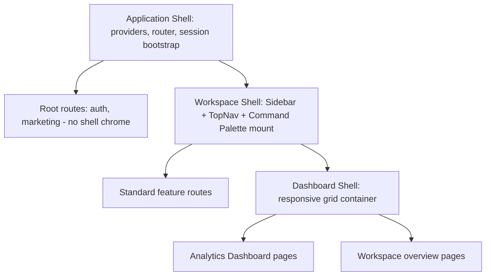
```mermaid
flowchart TB
    APP[Application Shell: providers, router, session bootstrap]
    APP --> ROOT[Root routes: auth, marketing - no shell chrome]
    APP --> WSSHELL[Workspace Shell: Sidebar + TopNav + Command Palette mount]
    WSSHELL --> FEATROUTE[Standard feature routes]
    WSSHELL --> DASHSHELL[Dashboard Shell: responsive grid container]
    DASHSHELL --> ANALYTICS[Analytics Dashboard pages]
    DASHSHELL --> OVERVIEW[Workspace overview pages]
```

---

## Part 5 — State Management Architecture

*Common to this Part:* F2 (server state and client state are never conflated) is the organizing principle. Every state category below has exactly one owning tool; no state is ever duplicated across two categories, and no component reaches for a category other than the one that actually owns the data it needs.

### 5.1 State Management Architecture (Item 44)

**Purpose & Architecture.** Six distinct state categories, each with a single owning mechanism: **Server State** (§5.2, TanStack Query) — anything the backend is authoritative for; **Client/UI State** (§5.3, a lightweight local-first store) — ephemeral, view-only state; **URL State** (§5.4, React Router) — shareable/bookmarkable filter/sort/pagination state; **Form State** (§5.5, React Hook Form + Zod) — in-progress user input; **AI State** (§5.6) — streaming, append-only AI conversation/agent state; **Persistent State** (§5.7) — the narrow, explicit allowlist of client-persisted preferences.

**Responsibilities & Design Decisions.** The decision procedure for "which category does this state belong to" is itself part of the architecture, not left to per-feature judgment: *Does the backend own the canonical value?* → Server State. *Is it purely about the current view's presentation and gone on navigation?* → Client State. *Should reloading the page or sharing the URL reproduce it?* → URL State. *Is it in-progress, uncommitted user input?* → Form State. *Is it a streaming, partially-arrived AI response?* → AI State. *Does it need to survive a browser restart, and is it non-sensitive?* → Persistent State (and only then).

**Engineering Rationale & Alternatives Considered.** A single, unified global store (e.g., putting server-fetched data into the same client store as UI state) was explicitly rejected — it is precisely the anti-pattern F2 exists to prevent, reintroducing the cache-invalidation and staleness bugs TanStack Query's dedicated server-state model solves, the same lesson that has driven the broader React ecosystem away from "one store for everything" over the past several years.

**Trade-offs.** Six categories is more upfront conceptual surface than "just use one store," repaid every time a developer doesn't have to ask "is this cached data stale" about state that was never cache in the first place.

**Diagram 10 — State Category Decision Tree**

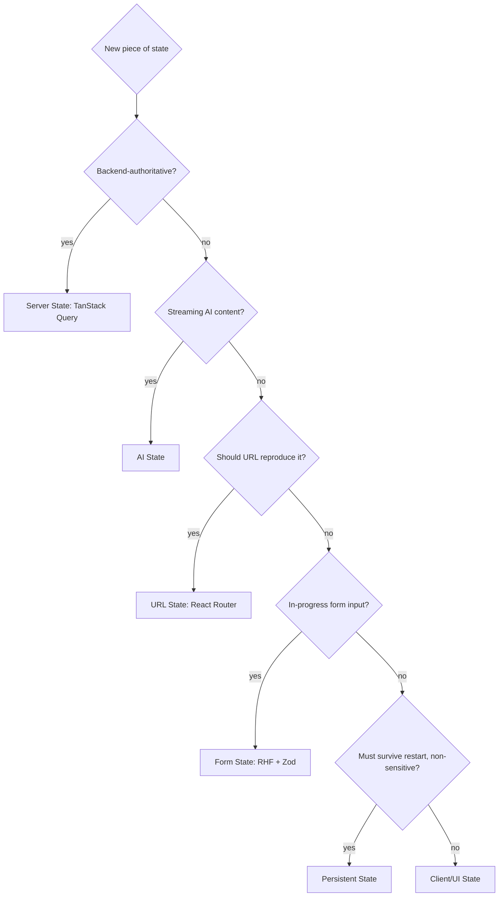
```mermaid
flowchart TD
    START{New piece of state} --> Q1{Backend-authoritative?}
    Q1 -->|yes| SERVER[Server State: TanStack Query]
    Q1 -->|no| Q2{Streaming AI content?}
    Q2 -->|yes| AI[AI State]
    Q2 -->|no| Q3{Should URL reproduce it?}
    Q3 -->|yes| URLST[URL State: React Router]
    Q3 -->|no| Q4{In-progress form input?}
    Q4 -->|yes| FORM[Form State: RHF + Zod]
    Q4 -->|no| Q5{Must survive restart, non-sensitive?}
    Q5 -->|yes| PERSIST[Persistent State]
    Q5 -->|no| CLIENT[Client/UI State]
```

### 5.2 Server State (Item 45)

**Purpose & Architecture.** TanStack Query is the exclusive server-state layer. Query keys follow a strict, generated convention: `[workspaceId, resourceType, resourceId?, ...paramsHash]`, produced by a typed query-key factory per feature (living in that feature's `api/`) rather than hand-written arrays — eliminating an entire class of cache bugs caused by inconsistent key shape between the query and its invalidation call. Every feature's `api/` folder (§1.5) exposes typed hooks (`useWorkspaceMembers()`, not raw `useQuery` calls in components), wrapping `API_CONTRACT.md`-conformant REST calls through a shared, typed API client (Shared Kernel) that centrally handles auth-cookie inclusion, RFC 7807 error parsing (`API_CONTRACT.md`'s error shape), and correlation-ID header injection (§13.3).

**Engineering Rationale & Alternatives Considered.** A generated, namespaced key convention (versus ad hoc key arrays per call site) was chosen specifically because §4.6's multi-tenant cache-isolation invariant depends on every query key actually being workspace-namespaced — leaving this to developer discipline alone was judged too fragile given the correctness stakes (a cache-isolation bug means one tenant briefly seeing another's data).

**Security Considerations.** Because `workspaceId` is always the leading key segment (§5.1's decision procedure, §4.6), a workspace switch or logout can deterministically evict exactly the right cache subtree via a key-prefix invalidation, never relying on a full-cache clear to achieve isolation.

**Performance & Scalability Considerations.** Query defaults (stale time, cache/garbage-collection time) are tuned per resource class, not globally uniform: rarely-changing resources (workspace settings) get long stale times; frequently-changing, collaboration-sensitive resources (§6.2's real-time-updated data) get short stale times and are additionally invalidated by WebSocket/SSE events (§6.2), not polling.

### 5.3 Client State (Item 46)

**Purpose & Architecture.** A lightweight, local-first client store (a Zustand-equivalent, matching the design-system's already-minimal dependency philosophy — no heavyweight state-management framework) holds genuinely ephemeral, view-only state: sidebar collapsed/expanded, active modal/drawer identity, command palette open/closed, in-progress (not-yet-submitted) multi-step wizard position. Feature-local client state lives in that feature's `state/` folder (§1.4); cross-feature client state (rare, e.g., global command palette open state) lives in the Shared Kernel's `state/`.

**Engineering Rationale & Alternatives Considered.** React Context was considered and rejected as the default mechanism for anything beyond narrow, rarely-changing values (theme, i18n locale, §4.9's providers) — Context's re-render-the-whole-subtree-on-change behavior is a poor fit for frequently-changing UI state at scale, which a selector-based external store avoids by construction.

**Trade-offs.** An external store is one more dependency and concept versus "just use `useState` and prop-drill," accepted only where state genuinely needs to be read by components that aren't in a direct parent-child relationship — `useState`/`useReducer` remain the default for state genuinely local to one component subtree, per the principle of using the simplest tool that fits, not reaching for the global store reflexively.

### 5.4 URL State (Item 47)

**Purpose & Architecture.** React Router's search params (and, where relevant, route params beyond `:workspaceId`) own any state where "reload the page" or "share this link" should reproduce the current view: table filters/sort/page (§10.6–§10.7), the active tab on a multi-tab settings page, the currently-open record in a list-detail view. A typed search-params hook per such surface (feature-local, `hooks/`) wraps React Router's raw string-based API with Zod-validated parsing (§5.5's schema infrastructure reused for URL params too), never leaving raw, unvalidated string parsing scattered through components.

**Trade-offs.** URL state is more verbose to wire than an equivalent client-state store entry, accepted deliberately for every case where shareability/bookmarkability is a real product requirement (`PRD.md`'s collaboration-oriented personas make this the common case, not the exception, for BizPilot AI specifically).

### 5.5 Form State (Item 48)

**Purpose & Architecture.** React Hook Form owns all in-progress form state, validated by Zod schemas living in each feature's `schemas/` folder (§1.5) — the same schema-first validation philosophy `AUTH_ARCHITECTURE.md` and `API_CONTRACT.md` apply server-side, mirrored (not shared verbatim, since frontend and backend are separate deployables, but kept in the same *shape* deliberately) on the frontend so a validation rule change is a predictable, symmetric edit in both places. Form submission always goes through a feature's `api/` mutation hook (§5.2), never a raw fetch call inside a form component.

**Engineering Rationale & Alternatives Considered.** Uncontrolled-input-based React Hook Form (versus a fully-controlled form-state approach) was chosen for its materially better re-render performance on large forms — a real concern given `PRD.md`'s business-profile and settings forms can have dozens of fields, and controlled re-render-per-keystroke does not scale to that field count without deliberate memoization workarounds RHF avoids by design.

**Security Considerations.** Client-side Zod validation is a UX layer only — every mutation is re-validated server-side (`AUTH_ARCHITECTURE.md`/`API_CONTRACT.md`'s existing validation-at-the-boundary principle), restating F-nothing-new but worth stating precisely given how easy it is to mistake client validation for a security control.

### 5.6 AI State (Item 49)

**Purpose & Architecture.** AI conversation and agent-run state is deliberately **not** modeled as ordinary TanStack Query server state, because it does not fit that model: it arrives incrementally (token-by-token, §6), is append-only during a stream, and needs partial, in-progress rendering before the backend has a "final" record to serve. A dedicated AI-state slice (Shared Kernel, consumed by the AI Copilot and AI Employee Workspace features, § Part 9) holds the *in-flight* portion of a conversation/agent run, sourced from the Streaming Primitive (§6.1); once a stream completes, the finalized message/run is reconciled into TanStack Query's cache as ordinary server state (the message now has a durable ID and is fetchable like any other resource) and evicted from the AI-state slice — a deliberate **hand-off**, not a permanent duplication.

**Engineering Rationale & Alternatives Considered.** Forcing streaming content through TanStack Query from the first token (e.g., via manual cache manipulation on every chunk) was rejected — it fights the library's request/response mental model and its cache-invalidation semantics, producing exactly the kind of awkward, bug-prone workaround a dedicated, purpose-built AI-state slice avoids.

**Performance & Scalability Considerations.** The AI-state slice is designed for high-frequency, small updates (one state update per streamed token or chunk) without triggering full-tree re-renders — achieved via the same selector-based subscription model as Client State (§5.3), so only the actively-rendering message component re-renders per chunk, not the entire conversation view.

**Future Evolution.** The hand-off boundary (streaming → finalized server state) is also precisely where offline-mode (§14.4) reconciliation and multi-window (§14.6) state synchronization will need to hook in — named now as a clean seam, not discovered later as a retrofit point.

### 5.7 Persistent State (Item 50)

**Purpose & Architecture.** A narrow, explicit, code-reviewed allowlist of client-persisted values — dark/light/system preference (§3.6), sidebar collapsed state, last-active workspace ID (for bootstrap redirect convenience only, never for authorization) — stored via `localStorage`, chosen deliberately over any broader "persist everything" middleware. Nothing on the allowlist is ever sensitive: session tokens are never client-persisted, per `AUTH_ARCHITECTURE.md` §3.6's `HttpOnly` cookie decision, which this document does not revisit and explicitly reinforces at the frontend-state-architecture level.

**Security Considerations.** The allowlist's existence as an explicit, reviewed list (rather than an opt-out "persist by default" pattern) is itself the control that prevents an accidental future addition of sensitive data to client storage — a new persisted key is a visible, reviewable diff to this list, not a silent default.

### 5.8 Offline State (Item 51)

**Purpose & Architecture.** Deferred in full (§14.4, Future Offline Mode) but designed for now: because Server State (§5.2) and AI State (§5.6) are already cleanly separated from Client/Persistent State, a future offline layer can intercept TanStack Query's own persistence extension point (queuing mutations, serving stale-but-available cached data) without needing to also unwind any accidental server/client state conflation — a direct dividend of F2 being enforced from day one.

**Future Evolution.** The specific mechanism (service worker + a mutation outbox + conflict resolution policy) is scoped in §14.4; this section exists so the state architecture is verified compatible with that future need now, before any code makes it harder.

### 5.9 Cache Strategy (Item 52)

**Purpose & Architecture.** TanStack Query's cache is the platform's single server-state cache, tiered by resource volatility (§5.2): static/rarely-changing resources use long stale times and pure invalidation-on-mutation; collaboration-sensitive resources use short stale times *plus* real-time invalidation via the Streaming Primitive's WebSocket channel (§6.2) — an incoming "resource updated" event triggers a targeted `invalidateQueries` call scoped by the exact query-key prefix affected, never a blanket cache clear. Garbage collection time (how long an inactive query's data is retained before eviction) is tuned longer for workspace-switch-relevant resources (§4.6's instant-switch-back UX) and shorter for large, memory-heavy resources (e.g., a big analytics payload) to bound memory growth in a long-lived session.

**Trade-offs.** Real-time invalidation requires every mutating backend operation to emit a corresponding real-time event with enough addressing information to compute the affected query-key prefix — an explicit backend/frontend contract (documented per-resource in each feature's `api/`) rather than an automatic mechanism, accepted as the necessary cost of avoiding both stale UI and wasteful polling.

### 5.10 Optimistic Updates (Item 53)

**Purpose & Architecture.** Used selectively, not universally: low-risk, high-frequency, easily-reversible interactions (toggling a setting, reordering a list, adding a comment) apply an optimistic TanStack Query cache update immediately on user action, with automatic rollback to the prior cached value if the server mutation fails — never for financial, billing, or otherwise hard-to-reverse mutations (those show a pending/loading state and wait for server confirmation, full stop). Every optimistic mutation is paired with an idempotency key (`BACKEND_ARCHITECTURE.md` §8.5's pattern, cited and reused frontend-side) so a retried mutation after a network blip cannot double-apply.

**Engineering Rationale & Alternatives Considered.** A blanket "always optimistic" policy was rejected — for a business-operations product where some actions are financially consequential (`PRD.md`'s billing/invoicing surfaces), the UX cost of an occasional visible loading spinner is far smaller than the trust cost of a UI that briefly shows an action succeeding before reverting it, especially for money-adjacent actions.

**Trade-offs.** A per-mutation, judgment-based policy (rather than a single global rule) requires each feature to explicitly decide and document its own mutations' optimism, a small ongoing design cost accepted in exchange for getting the risk-sensitive cases right.

**Diagram 11 — Server State, Real-time Invalidation & Optimistic Update Flow**

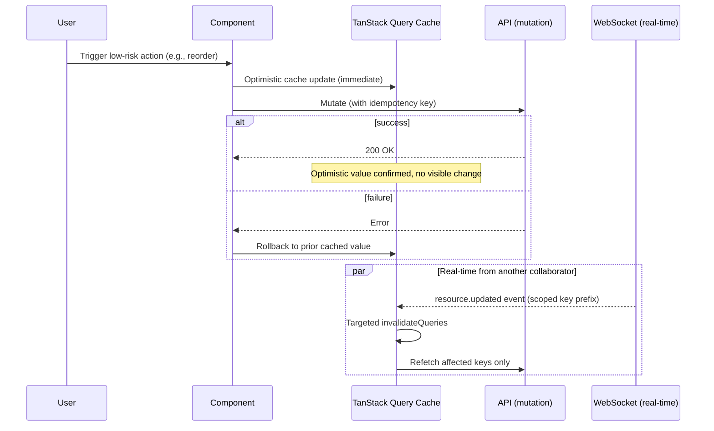
```mermaid
sequenceDiagram
    participant U as User
    participant UI as Component
    participant Q as TanStack Query Cache
    participant API as API (mutation)
    participant WS as WebSocket (real-time)
    U->>UI: Trigger low-risk action (e.g., reorder)
    UI->>Q: Optimistic cache update (immediate)
    UI->>API: Mutate (with idempotency key)
    alt success
        API-->>UI: 200 OK
        Note over Q: Optimistic value confirmed, no visible change
    else failure
        API-->>UI: Error
        UI->>Q: Rollback to prior cached value
    end
    par Real-time from another collaborator
        WS-->>Q: resource.updated event (scoped key prefix)
        Q->>Q: Targeted invalidateQueries
        Q->>API: Refetch affected keys only
    end
```

---

## Part 6 — Streaming Architecture & Real-time UI

### 6.1 Streaming Architecture (Item 54)

**Purpose & Architecture.** F3's "one streaming primitive, reused everywhere" is implemented as a single Shared Kernel abstraction (`shared/streaming/`) exposing one hook-based API regardless of transport — consumers (§6.2's real-time invalidation, § Part 9's AI Copilot) never talk to `EventSource` or a WebSocket client directly. Internally, the primitive dispatches to one of two transports (§6.3–§6.4) based on the stream's directionality, resolved once per stream type, not per call site.

**Responsibilities & Design Decisions.** The primitive owns connection lifecycle (open, reconnect-with-backoff, close), message parsing (into typed events, matching whatever shape the backend contract defines, `API_CONTRACT.md` §2), and the hand-off into AI State (§5.6) or targeted cache invalidation (§5.9) — no feature module manages a raw connection object itself.

**Engineering Rationale & Alternatives Considered.** A single abstraction over two transports (rather than exposing SSE and WebSocket as two entirely separate feature-facing APIs) was chosen so that a future transport change (e.g., migrating a specific stream from SSE to WebSocket as its needs evolve) is a change inside the Shared Kernel, invisible to every consumer — the same "hide the implementation behind a stable interface" discipline `BACKEND_ARCHITECTURE.md`'s port/adapter pattern applies backend-side, mirrored frontend-side.

**Trade-offs.** A unifying abstraction costs a small amount of internal complexity (branching on transport) concentrated in one well-tested module, in exchange for every consumer being transport-agnostic.

### 6.2 Real-time UI (Item 55)

**Purpose & Architecture.** "Real-time" on BizPilot AI's frontend means two distinct things, handled by two distinct mechanisms: **(a) collaborative presence/live-updates** (another user editing the same resource, a workflow run's live status) — WebSocket-backed (§6.3), bidirectional; **(b) AI generation streaming** (Copilot responses, agent-run progress) — SSE-backed (§6.4), unidirectional, matching `API_CONTRACT.md` §2's existing SSE decision for AI generation exactly. A component never needs to know which of the two underlies a given real-time surface — it consumes the unified primitive (§6.1) and receives typed events.

**Trade-offs.** Maintaining two transports (rather than using WebSocket for everything, including AI streaming) is a deliberate choice, not an accident of matching the existing backend contract — see ADR-FE-004 (§16) for the full reasoning, summarized here: SSE is simpler, plays better with HTTP infrastructure (proxies, `CLOUD_INFRASTRUCTURE.md` §3's Ingress/CDN layer) for one-directional token streams, and is what `API_CONTRACT.md` already committed to; WebSocket is reserved for the genuinely bidirectional cases SSE cannot serve at all.

### 6.3 WebSocket Strategy (Item 56)

**Purpose & Architecture.** A single, workspace-scoped WebSocket connection (opened once per active workspace by the Workspace Shell, §4.11, closed on workspace switch or app close) carries every bidirectional real-time concern: presence (who else is viewing/editing a resource), live cursor/selection state for collaborative surfaces (the Workflow Builder canvas, § Part 9), and resource-change events feeding §5.9's targeted cache invalidation. Messages are typed and namespaced by concern (`presence.*`, `resource.*`) so a single connection safely multiplexes many features, avoiding the connection-count-per-feature scaling problem a naive per-feature-socket design would hit.

**Engineering Rationale & Alternatives Considered.** One shared connection (versus one WebSocket per feature or per open resource) was chosen specifically to bound connection count as the number of simultaneously-relevant real-time concerns grows with product surface area — a per-resource-open-tab connection model would not survive a user with many browser tabs open against the same workspace.

**Scalability Considerations.** This is also the frontend-side reason `CLOUD_INFRASTRUCTURE.md`'s WebSocket-serving infrastructure (implicitly, the Load Balancer/Ingress layer, cited not redesigned here) needs sticky-session-aware or connection-count-aware capacity planning — flagged here as a cross-document dependency worth naming explicitly, not a gap in either document alone.

**Monitoring & Failure Modes.** Reconnection uses exponential backoff with jitter (matching the retry philosophy `BACKEND_ARCHITECTURE.md` §9 already applies server-side); on reconnect, the client re-subscribes to its current resource-presence set and triggers a one-time reconciliation refetch (§5.9) for anything that might have changed while disconnected, rather than assuming the cache is still accurate.

### 6.4 SSE Strategy (Item 57)

**Purpose & Architecture.** Server-Sent Events, matching `API_CONTRACT.md` §2's existing `text/event-stream` content-negotiated AI-generation contract exactly, carry every unidirectional AI-token stream: Copilot chat responses, Agent Runtime step-by-step progress (§9.5), Workflow Engine execution status. A stream is opened per active generation and closed on completion, error, or user-initiated cancellation (which sends a distinct cancellation request, not just a client-side connection close, so the backend can stop incurring AI provider cost per `AI_PLATFORM_ARCHITECTURE.md`'s cost-protection concerns).

**Trade-offs.** SSE's native browser reconnection behavior is intentionally *not* relied upon for mid-generation resume — a dropped AI generation stream is treated as failed and surfaced to the user with a retry affordance, rather than attempting to silently resume a partial generation, since partial-resume correctness would require the backend to support a resumable-generation contract `API_CONTRACT.md` does not currently define (a possible future extension, not assumed here).

### 6.5 Polling Strategy (Item 58)

**Purpose & Architecture.** Polling is the explicit **fallback-only** mechanism, never the default, used in exactly two cases: (a) environments where neither WebSocket nor SSE connections are reachable (restrictive corporate network/proxy configurations, detected via connection-failure fallback logic in the Streaming Primitive, §6.1); (b) a small number of low-frequency, non-collaborative status checks where the overhead of a persistent connection is disproportionate to the update frequency (e.g., checking whether a long-running export job has completed, polled at a coarse interval).

**Trade-offs.** Explicitly minimizing polling's footprint (versus a simpler, polling-everywhere baseline) costs more transport-layer engineering (§6.1, §6.3, §6.4) up front, accepted because polling at BizPilot AI's target scale (millions of users, thousands of active workspaces) would impose backend load `CLOUD_INFRASTRUCTURE.md`'s capacity planning (§12.1 of that document) did not size for as a default pattern.

**Diagram 12 — Streaming Primitive & Transport Selection**

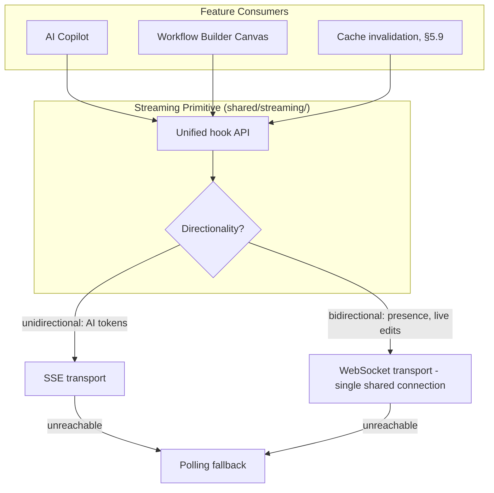
```mermaid
flowchart TB
    subgraph Consumers["Feature Consumers"]
        COPILOT[AI Copilot]
        WFCANVAS[Workflow Builder Canvas]
        CACHE_INV[Cache invalidation, §5.9]
    end
    subgraph Primitive["Streaming Primitive (shared/streaming/)"]
        UNIFIED[Unified hook API]
        ROUTER{Directionality?}
    end
    COPILOT --> UNIFIED
    WFCANVAS --> UNIFIED
    CACHE_INV --> UNIFIED
    UNIFIED --> ROUTER
    ROUTER -->|unidirectional: AI tokens| SSE[SSE transport]
    ROUTER -->|bidirectional: presence, live edits| WS[WebSocket transport - single shared connection]
    SSE -->|unreachable| POLL[Polling fallback]
    WS -->|unreachable| POLL
```

**Diagram 13 — SSE Streaming Chat Sequence**

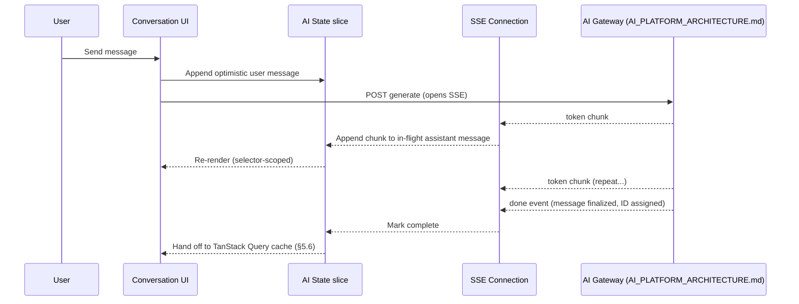
```mermaid
sequenceDiagram
    participant U as User
    participant UI as Conversation UI
    participant AIState as AI State slice
    participant SSE as SSE Connection
    participant API as AI Gateway (AI_PLATFORM_ARCHITECTURE.md)
    U->>UI: Send message
    UI->>AIState: Append optimistic user message
    UI->>API: POST generate (opens SSE)
    API-->>SSE: token chunk
    SSE-->>AIState: Append chunk to in-flight assistant message
    AIState-->>UI: Re-render (selector-scoped)
    API-->>SSE: token chunk (repeat...)
    API-->>SSE: done event (message finalized, ID assigned)
    SSE-->>AIState: Mark complete
    AIState-->>UI: Hand off to TanStack Query cache (§5.6)
```

---

## Part 7 — Loading, Errors, Feedback & Overlay Systems

*Common to this Part:* Items 65–70 (Notification/Toast, Dialog, Drawer, Popover, Context Menu, Command Palette) build directly on the already-shipped `overlay/` primitives (`Modal`, `Dropdown`) and `feedback/` primitives (`Toast`, `Toaster`, `Alert`, `Skeleton`, `EmptyState`) documented in `components.md` — cited, not redesigned, with this document adding only the application-level orchestration (queueing, stacking, focus-return) each needs.

### 7.1 Loading Architecture (Item 59) & 7.2 Skeleton Strategy (Item 60)

**Purpose & Architecture.** Two loading treatments, chosen by whether content shape is known ahead of time — already stated as design-system law in `foundations.md` §21 ("Loading states use `Skeleton`'s shimmer... whenever content shape is known ahead of time... Reserve `Spinner` for buttons and unknown-duration/unknown-shape operations"). This document's addition: every Server-State-backed (§5.2) list/detail view has a co-located Skeleton variant matching its final layout exactly (same grid, same card structure), authored alongside the real component, never a generic placeholder reused across unrelated views — a skeleton that doesn't match its resolved layout causes a jarring layout shift, which this rule exists to prevent.

**Performance Considerations.** Skeletons are rendered synchronously on first paint for any route whose data dependency is not yet resolved, working together with Suspense (§7.3) rather than as an ad hoc `isLoading` boolean check duplicated per component.

### 7.3 Suspense Architecture (Item 61)

**Purpose & Architecture.** React Suspense, integrated with TanStack Query's Suspense-compatible query mode, is used for route-level and major-panel-level loading boundaries (a Suspense boundary wraps each feature route, §4.2, with its matching Skeleton, §7.2, as fallback) — not for every individual component, which would fragment loading states into an incoherent cascade of tiny spinners. Fine-grained, in-place loading (a single button's `isLoading`, §5.10's optimistic-mutation pending state) uses ordinary TanStack Query mutation state, not Suspense.

**Engineering Rationale & Alternatives Considered.** Suspense at route/panel granularity (versus Suspense everywhere or nowhere) mirrors the same "boring where it doesn't matter, exceptional where it does" philosophy (§0.4) — Suspense's coordination benefit (avoiding waterfall loading spinners) matters most at the granularity a user actually perceives as "this view is loading," not at every individual data dependency.

### 7.4 Error Boundary Strategy (Item 62) & 7.5 Recovery UX (Item 63)

**Purpose & Architecture.** A three-tier error boundary hierarchy: **(1) Application Shell boundary** — catches catastrophic, unrecovered errors, renders a full-page fallback with a reload affordance and reports to frontend observability (§13.1); **(2) Feature-route boundary** — wraps each feature route (paired with its Suspense boundary, §7.3), catches feature-scoped errors, renders an in-shell error state (chrome/navigation remains usable) with a retry affordance that resets the boundary and re-triggers the failed query; **(3) Business Component-local boundaries** — used sparingly, only where a single panel's failure genuinely should not take down its parent view (e.g., one widget on the Dashboard Shell's grid, §10.4, failing independently of its siblings).

**Responsibilities & Design Decisions.** Recovery UX distinguishes error classes surfaced by `API_CONTRACT.md`'s RFC 7807 error shape: validation errors render inline at the Form State layer (§5.5), never as a boundary-level crash; authorization errors (403) redirect per §4.6's workspace-membership-change handling; not-found errors (404) render a dedicated empty/not-found state (`EmptyState`, cited); every other server/network error falls through to the nearest boundary's generic retry UI.

**Trade-offs.** Three tiers (rather than one global boundary) costs more boundary-placement decisions per feature, repaid by preventing an unrelated panel's transient failure from taking down an entire workspace session — directly serving `PRD.md`'s reliability expectations for a business-critical tool.

**Diagram 14 — Error Boundary Hierarchy & Recovery Flow**

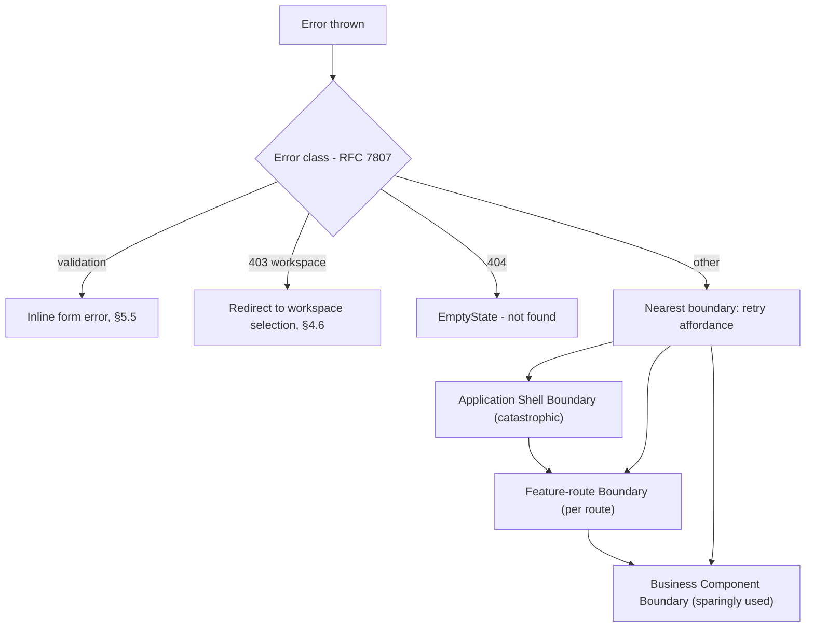
```mermaid
flowchart TB
    APPB["Application Shell Boundary (catastrophic)"]
    APPB --> FEATB["Feature-route Boundary (per route)"]
    FEATB --> COMPB["Business Component Boundary (sparingly used)"]
    ERR[Error thrown] --> CLASS{Error class - RFC 7807}
    CLASS -->|validation| INLINE[Inline form error, §5.5]
    CLASS -->|403 workspace| REDIRECT[Redirect to workspace selection, §4.6]
    CLASS -->|404| EMPTY[EmptyState - not found]
    CLASS -->|other| NEARBOUNDARY[Nearest boundary: retry affordance]
    NEARBOUNDARY --> COMPB
    NEARBOUNDARY --> FEATB
    NEARBOUNDARY --> APPB
```

### 7.6 Notification Architecture (Item 64) & 7.7 Toast Engine (Item 65)

**Purpose & Architecture.** Two distinct notification classes, not to be confused: **Toasts** (ephemeral, self-dismissing, already fully implemented via `Toast`/`Toaster`, `components.md`) — used for confirming the result of a just-completed user action, always triggered client-side by a mutation's success/error handler, never by a real-time server event; **Persistent Notifications** (a Business-Component-tier feature, backed by Server State, §5.2, and pushed live via the WebSocket channel, §6.3) — durable, workspace-relevant events (someone mentioned you, an automation completed) that survive navigation and are visible in a dedicated notification center, distinct from the transient Toast queue.

**Engineering Rationale & Alternatives Considered.** Conflating the two (using Toasts for real-time server-pushed events too) was rejected — a Toast's ephemeral, single-viewport lifetime is wrong for an event the user might not be looking at the screen for; a real-time event needs a durable, revisitable representation, which only the Persistent Notification model provides.

**Trade-offs.** Two systems cost more surface than one, accepted because they solve genuinely different UX problems (action confirmation vs. durable async awareness) that a single system would serve poorly for at least one of the two cases.

### 7.8 Dialog System (Item 66), 7.9 Drawer System (Item 67), 7.10 Popover System (Item 68), 7.11 Context Menu (Item 69)

**Purpose & Architecture.** All four are Radix-primitive-backed overlay Patterns, extending the already-shipped `Modal` (Radix `Dialog`) and `Dropdown` (Radix `DropdownMenu`) exactly per `components.md`'s stated approach ("Radix supplies behavior") plus Floating UI (named in the stack) for positioning where Radix's own positioning (`Popover`, context-menu triggers) needs augmenting for edge-of-viewport collision handling. **Dialog** (`Modal`, cited) — blocking, centered, for focused single-task flows (confirmations, create/edit forms). **Drawer** — a new Pattern-tier component, a side-anchored, non-blocking-of-background-scroll Radix `Dialog` variant, animated via Framer Motion per `foundations.md` §21's existing rule that non-Radix-mount-lifecycle animation goes through Framer Motion — used for detail-panel-alongside-list UX (inspecting one record without leaving its list context). **Popover** — Radix `Popover` + Floating UI positioning, for contextual, non-modal supplementary content (a field's help text expanded, a quick-edit form). **Context Menu** — Radix `ContextMenu`, right-click/long-press-triggered, reusing the exact same menu-item rendering as `Dropdown` (shared internal Pattern, never two separate menu-item implementations).

**Responsibilities & Design Decisions.** An **overlay stack manager** (Shared Kernel) tracks z-index layering and focus-return across all four systems plus Toasts — opening a Popover from within a Dialog, for instance, must return focus correctly to the Dialog on Popover close, a coordination concern too easy to get wrong per-overlay-type independently, so it is centralized once.

**Security & Accessibility Considerations.** Focus trapping (Dialog, Drawer) and focus return (all four) are Radix-guaranteed behaviors (`components.md`'s cited rationale for using Radix at all) — this document's overlay stack manager exists specifically to preserve that guarantee when overlays compose/nest, which is exactly where hand-rolled focus management most commonly breaks.

### 7.12 Command Palette (Item 70)

**Purpose & Architecture.** A global, keyboard-invoked (§8.1) command surface — search-driven (built on the same search infrastructure as §8.2's Global Search, reused not duplicated), listing navigable destinations (sourced from the navigation registry, §4.1, so it never drifts out of sync with the Sidebar), invocable actions (feature-contributed, via a command-registry contract analogous to §4.1's navigation-descriptor pattern), and — distinctively for an AI-native product — a direct hand-off into the AI Copilot (§9.1) for a natural-language query that doesn't match a known command or destination.

**Engineering Rationale & Alternatives Considered.** Command registration reuses the identical descriptor-registry pattern as navigation (§4.1) rather than inventing a second registration mechanism — consistency across the two closely-related systems was judged more valuable than any marginal difference in their requirements.

**Performance Considerations.** Command and destination search runs client-side against the already-resolved navigation/command registries (near-instant, no network round-trip) for anything not requiring a natural-language AI hand-off; only the AI hand-off path incurs the SSE round-trip latency (§6.4) of an actual generation request.

**Diagram 15 — Overlay Stack & Focus Management**

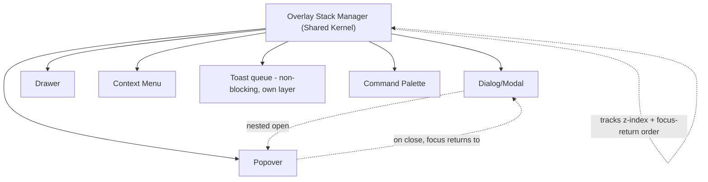
```mermaid
flowchart TB
    STACK["Overlay Stack Manager (Shared Kernel)"]
    STACK --> DIALOG[Dialog/Modal]
    STACK --> DRAWER[Drawer]
    STACK --> POPOVER[Popover]
    STACK --> CTXMENU[Context Menu]
    STACK --> TOAST[Toast queue - non-blocking, own layer]
    STACK --> CMDK[Command Palette]
    DIALOG -."nested open".-> POPOVER
    POPOVER -."on close, focus returns to".-> DIALOG
    STACK -."tracks z-index + focus-return order".-> STACK
```

---

## Part 8 — Keyboard, Search & Global Interaction

### 8.1 Keyboard Shortcut System (Item 71)

**Purpose & Architecture.** A single, centralized keyboard-shortcut registry (Shared Kernel) — features register shortcuts declaratively (key combination, scope, handler reference) rather than attaching raw `keydown` listeners ad hoc, preventing the two most common shortcut bugs: silent conflicts between two features claiming the same combination, and shortcuts firing while focus is inside a text input where they shouldn't. Shortcuts are scoped (global — available everywhere in the Workspace Shell; contextual — only while a specific view/overlay is focused) and the registry resolves conflicts by scope precedence (contextual overrides global) at registration time, failing loudly (a dev-time warning) on an unresolvable conflict rather than silently picking one.

**Accessibility Considerations.** Every mouse-invokable action exposed via a keyboard shortcut must already be independently reachable via standard tab-order keyboard navigation (F5) — shortcuts are an accelerator, never the only path to an action, consistent with WCAG's operable principle (§11.1).

**Future Evolution.** The same registry is the mechanism a future desktop app's native menu/shortcut bar (§14.3) reads from, rather than desktop shortcuts being defined a second time in a platform-specific format.

### 8.2 Search UX (Item 72) & 8.3 Global Search (Item 73)

**Purpose & Architecture.** Global Search is workspace-scoped (§4.6's namespacing applied to search queries too), debounced client-side, and queries a backend search surface (`AI_PLATFORM_ARCHITECTURE.md` §7's Hybrid Search — vector + full-text — cited, not redesigned) returning typed, ranked results across resource types (documents, conversations, workflows, people). Results render via a shared result-item Pattern component keyed by resource type, so adding a new searchable resource type is a rendering-adapter addition, not a new search UI. Search UX (as distinct from the Global Search surface specifically) is the shared interaction contract every in-app search/filter input follows: debounce timing, empty-state treatment, and keyboard-navigable result lists, applied consistently whether the search is Global Search, a table's filter box (§10.6), or the Command Palette's destination search (§7.12, which delegates its non-AI-hand-off path to this same infrastructure).

**Performance Considerations.** Debouncing and request cancellation (aborting a superseded in-flight search request when the user keeps typing) are handled once in the shared search hook, not reimplemented per surface — eliminating a common source of race-condition bugs (an earlier, slower response overwriting a later, faster one).

**Diagram 16 — Global Search Flow**

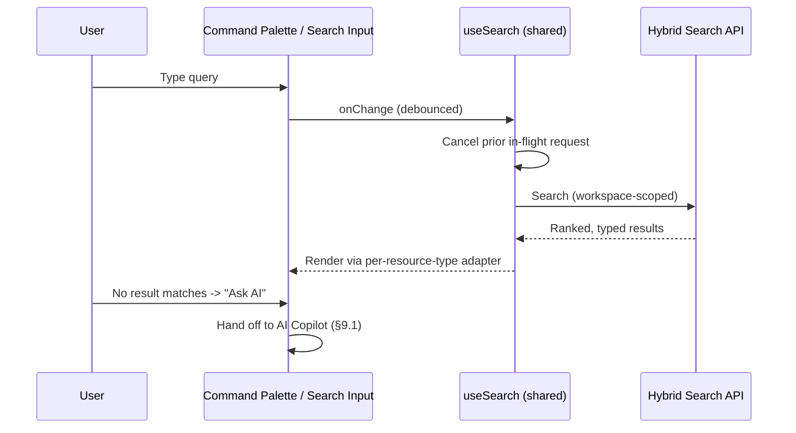
```mermaid
sequenceDiagram
    participant U as User
    participant CMDK as Command Palette / Search Input
    participant Hook as useSearch (shared)
    participant API as Hybrid Search API
    U->>CMDK: Type query
    CMDK->>Hook: onChange (debounced)
    Hook->>Hook: Cancel prior in-flight request
    Hook->>API: Search (workspace-scoped)
    API-->>Hook: Ranked, typed results
    Hook-->>CMDK: Render via per-resource-type adapter
    U->>CMDK: No result matches -> "Ask AI"
    CMDK->>CMDK: Hand off to AI Copilot (§9.1)
```

---

## Part 9 — AI-Native Experiences

*Common to this Part:* every subsystem here is a rendering layer for subsystems `AI_PLATFORM_ARCHITECTURE.md` already fully specified (AI Gateway, Prompt/Context/Memory engines, Agent Runtime, Tool Calling, Workflow Engine) — this Part never redefines what those subsystems do, only how they are presented.

### 9.1 AI Copilot Interface (Item 74)

**Purpose & Architecture.** The Copilot is a persistent, workspace-scoped surface (a Drawer, §7.9, or a dedicated route depending on context density — both share the identical Conversation UI, §9.2) reachable from the Workspace Shell's chrome and from the Command Palette's AI hand-off (§7.12). It is the primary entry point to `AI_PLATFORM_ARCHITECTURE.md`'s AI Gateway (§2 of that document) and carries workspace/business context automatically (per that document's Context Builder, §4) so the user never has to manually re-state what workspace or record they're asking about.

**Responsibilities & Design Decisions.** The Copilot interface owns conversation history rendering (§9.2), input composition (including attaching files/context, wired to `BACKEND_ARCHITECTURE.md`'s file-handling pipeline), and tool-call/agent-action visualization (§9.5) — it does not itself decide *what* the AI does; that remains entirely `AI_PLATFORM_ARCHITECTURE.md`'s domain.

**Trade-offs.** A single, persistent Copilot surface (rather than a separate chat instance per feature) keeps conversation context continuous as a user moves through the product, at the cost of needing careful context-scoping (§9.1's context-per-workspace framing) so a conversation started in one feature doesn't confusingly carry irrelevant context into another.

### 9.2 Conversation UI (Item 75) & 9.3 Streaming Chat (Item 76)

**Purpose & Architecture.** The conversation list is virtualized via React Virtuoso (named in the stack specifically for this class of problem) since AI conversations can grow arbitrarily long — rendering every message unvirtualized would degrade badly at scale, the same reasoning applied to any large list (§10.7). Each message renders through a **pluggable content-block renderer**: plain text (with Markdown parsing, sanitized per §13.2's XSS-hardening rule before render), code blocks (Monaco Editor, read-only mode, syntax-highlighted per detected language), tool-call cards (a structured, collapsible summary of what the AI did, not raw JSON), charts (Recharts, §10.5), and image blocks (from `AI_PLATFORM_ARCHITECTURE.md`'s multi-modal generation pipeline) — directly extending that document's multi-modal content model to the rendering layer, one renderer per content-block type, extensible by adding a new block-type renderer rather than modifying the conversation list itself.

**Responsibilities & Design Decisions.** Streaming Chat (§9.3) is the in-flight rendering state (§5.6's AI State) of the last block in the renderer: while a message streams, it renders through the same content-block renderer pipeline incrementally (a code block starts rendering in Monaco as soon as enough of it has arrived to be syntactically meaningful, not only once complete) rather than showing raw, unformatted streaming text until the stream ends.

**Engineering Rationale & Alternatives Considered.** A pluggable content-block renderer (versus a single monolithic message-rendering component with a large conditional) was chosen because `AI_PLATFORM_ARCHITECTURE.md`'s stated multi-modal roadmap (audio, video understanding, Part 15's future capabilities) means new content-block types are an expected, recurring addition — the renderer registry is designed for that from the start, not extended awkwardly later.

**Security Considerations.** AI-generated Markdown/HTML content is always passed through the same sanitization boundary as any other user/AI-generated content before rendering (§13.2) — an LLM's output is treated as untrusted input for rendering purposes, regardless of how much the platform otherwise trusts its own AI Gateway's provider selection.

### 9.4 Prompt Library UI (Item 77)

**Purpose & Architecture.** A Business-Component-tier feature surface over `AI_PLATFORM_ARCHITECTURE.md`'s Prompt Registry/Library (§3 of that document) — browsing, previewing, and invoking saved/shared prompts, rendered as ordinary Server State (§5.2) list/detail views using standard Table/List patterns (§10.6), with an "insert into Copilot" action that hands off directly into the Conversation UI's input composer (§9.1) rather than duplicating input handling.

### 9.5 AI Employee Workspace (Item 78)

**Purpose & Architecture.** A distinct shell (nested within the Workspace Shell, alongside but structurally separate from the Dashboard Shell, §4.10) purpose-built for supervising a running Agent Runtime execution (`AI_PLATFORM_ARCHITECTURE.md` §9's Planner→Executor→Critic→Reflection loop) — not a chat thread, but a **step-tree/timeline visualization**: each planned step, its execution status, tool calls made (rendered via the same tool-call-card renderer as §9.2, reused not duplicated), and the Critic's evaluation, laid out so a user can see an agent's reasoning trace at a glance and intervene (pause, redirect, approve a sensitive action) at any step, wired to the Agent Runtime's control surface via the same SSE streaming as any other AI-generation surface (§6.4).

**Responsibilities & Design Decisions.** Human-in-the-loop approval gates (for actions `AI_PLATFORM_ARCHITECTURE.md`'s Tool Permissions model flags as requiring confirmation) render as a blocking Dialog (§7.8) within this shell — the one case where the AI Employee Workspace intentionally interrupts its own timeline flow, since an unreviewed sensitive action is a correctness/trust risk the UI must not let slide past unnoticed.

**Future Evolution.** This shell is explicitly named as the direct ancestor of §14.7's Future AI Workspace — today it supervises one agent run at a time; the future evolution is multi-agent, multi-run supervision built by generalizing this same step-tree visualization, not replacing it.

### 9.6 Workflow Builder UI (Item 79) & 9.7 Automation Builder (Item 80)

**Purpose & Architecture.** A custom-built node-graph canvas (no node-graph library is named in the stack, so this is first-party engineering, deliberately scoped as one of the few areas warranting bespoke work per §0.4's philosophy) visualizing `AI_PLATFORM_ARCHITECTURE.md`'s/`BACKEND_ARCHITECTURE.md`'s Workflow Engine state machine: nodes represent steps, edges represent transitions/conditions, and the canvas supports pan/zoom, drag-to-connect, and inline node configuration (opened via Popover or Drawer, §7.9–§7.10, depending on configuration complexity). Canvas state during editing is Client State (§5.3, not yet persisted); saving persists the graph as Server State (§5.2) via the Workflow Engine's API surface.

**Engineering Rationale & Alternatives Considered.** Building the canvas first-party (versus adopting a third-party node-graph library) was a deliberate, scoped exception to preferring proven primitives (§0.4) — evaluated and accepted because BizPilot AI's node/edge semantics (permission-aware nodes, AI-step nodes with their own streaming preview, §9.5's step visualization reused inside individual nodes) are specific enough that a generic library would require extensive escape-hatching, likely costing more engineering effort than a scoped first-party canvas built directly against this document's existing Streaming (§6) and State (§5) primitives.

**Trade-offs.** More engineering investment and ongoing maintenance than adopting a library, accepted given the canvas is one of BizPilot AI's core product differentiators (`PRD.md`'s automation-builder feature inventory) where bespoke quality has direct product value, consistent with §0.4's stated exception criteria.

**Responsibilities & Design Decisions.** The Automation Builder (§9.7) — the narrower, business-rule-trigger-action automation surface distinct from the more general AI Workflow Builder — reuses the identical canvas engine and node/edge rendering primitives, differing only in its available node types and its underlying data model, avoiding a second, duplicate canvas implementation for what is architecturally the same UI problem at a different scope.

**Performance Considerations.** Large graphs (many nodes/edges) use viewport-based rendering (only nodes within or near the visible canvas area are fully rendered; off-screen nodes render as lightweight placeholders) — the canvas's own form of virtualization, conceptually identical to React Virtuoso's list virtualization (§9.2, §10.7) even though the canvas itself is bespoke.

**Diagram 17 — AI Copilot Conversation Rendering Pipeline**

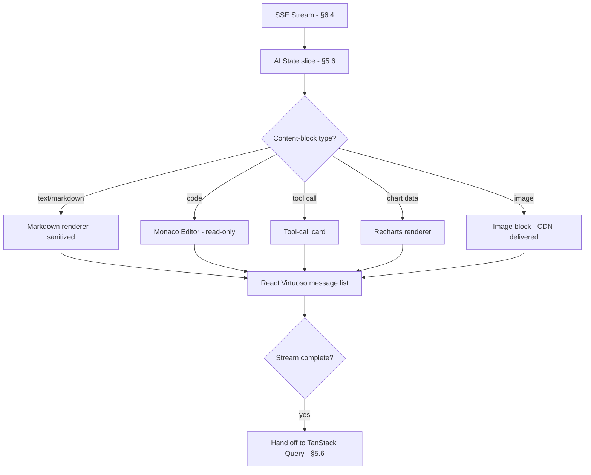
```mermaid
flowchart TB
    STREAM[SSE Stream - §6.4] --> AISTATE[AI State slice - §5.6]
    AISTATE --> RENDERER{Content-block type?}
    RENDERER -->|text/markdown| MD[Markdown renderer - sanitized]
    RENDERER -->|code| MONACO[Monaco Editor - read-only]
    RENDERER -->|tool call| TOOLCARD[Tool-call card]
    RENDERER -->|chart data| RECHARTS[Recharts renderer]
    RENDERER -->|image| IMG[Image block - CDN-delivered]
    MD & MONACO & TOOLCARD & RECHARTS & IMG --> VIRTUOSO[React Virtuoso message list]
    VIRTUOSO --> COMPLETE{Stream complete?}
    COMPLETE -->|yes| HANDOFF[Hand off to TanStack Query - §5.6]
```

**Diagram 18 — AI Employee Workspace Step-Tree Supervision**

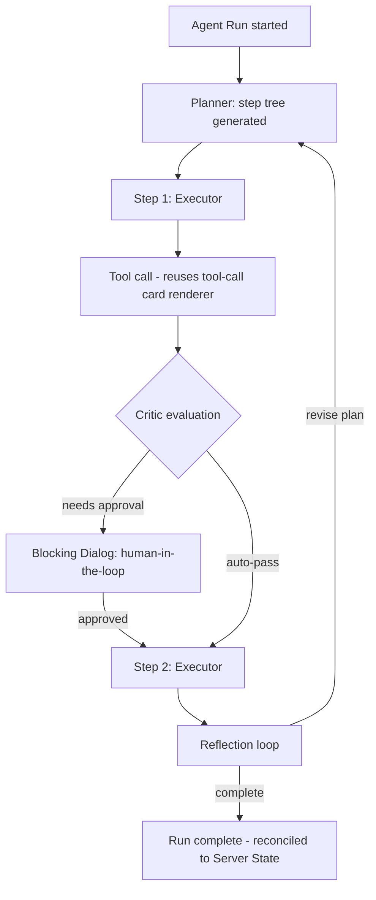
```mermaid
flowchart TB
    RUN[Agent Run started] --> PLAN[Planner: step tree generated]
    PLAN --> STEP1[Step 1: Executor]
    STEP1 --> TOOLCALL1[Tool call - reuses tool-call card renderer]
    TOOLCALL1 --> CRITIC1{Critic evaluation}
    CRITIC1 -->|needs approval| GATE[Blocking Dialog: human-in-the-loop]
    GATE -->|approved| STEP2[Step 2: Executor]
    CRITIC1 -->|auto-pass| STEP2
    STEP2 --> REFLECT[Reflection loop]
    REFLECT -->|revise plan| PLAN
    REFLECT -->|complete| DONE[Run complete - reconciled to Server State]
```

---

## Part 10 — Content & Data Surfaces

### 10.1 File Manager UI (Item 81) & 10.2 Media Manager (Item 82)

**Purpose & Architecture.** Both are Business-Component-tier feature surfaces over `BACKEND_ARCHITECTURE.md` §12's file/media pipeline and `CLOUD_INFRASTRUCTURE.md` §9's CDN-fronted signed-URL delivery (both cited, not redesigned). The File Manager renders a virtualized (§10.7), sortable/filterable (URL State, §5.4) list/grid of workspace files, backed by Server State (§5.2) with optimistic upload progress modeled as AI-State-adjacent transient state (an upload-in-progress entry exists only client-side until the backend confirms it, then hands off to Server State — the same hand-off pattern as §5.6, reused for uploads rather than AI streams). The Media Manager is the File Manager's specialization for image/video/audio assets specifically, adding thumbnail-grid rendering and a lightbox/preview overlay (built on the Dialog system, §7.8), reusing the File Manager's data layer entirely rather than maintaining a second one.

**Performance Considerations.** Thumbnails are always CDN-delivered at a size-appropriate variant (never the full-resolution asset downscaled client-side) — a direct consumption of `CLOUD_INFRASTRUCTURE.md` §9's storage/CDN architecture, cited as the reason the frontend never needs its own image-resizing logic.

### 10.3 Image Generation UI (Item 83)

**Purpose & Architecture.** A Business-Component surface over `AI_PLATFORM_ARCHITECTURE.md`'s multi-modal generation pipeline, structurally similar to Streaming Chat (§9.3) but with a distinct content type: a generation request opens an SSE stream (§6.4) that yields progressive-quality previews where the provider supports them, finalizing into a Media Manager (§10.2) asset once complete — the generated image is handed off into the exact same Server-State-backed asset model every other uploaded file uses, so a generated image is indistinguishable from an uploaded one anywhere else in the product.

### 10.4 Analytics Dashboard (Item 84) & 10.5 Charts Strategy (Item 85)

**Purpose & Architecture.** The Analytics Dashboard is the primary consumer of the Dashboard Shell's responsive grid (§4.10, §3.3) — a configurable grid of chart/metric-tile widgets, each an independent Server-State query (§5.2, allowing per-widget loading/error/skeleton states, §7.1, rather than one blocking fetch for the whole dashboard). Recharts (named in the stack) is the exclusive charting library — chosen and used consistently rather than mixed with alternatives, per the same "no mixed libraries for one concern" discipline `foundations.md` §6 already applies to icons. Chart color always resolves from the design system's token layer (§3.2's note that data-viz may consume primitive color scales directly, `foundations.md` §1's usage rule, cited) — never a hardcoded hex value — so charts automatically stay correct across light/dark mode (§3.6) and white-label brand overrides (§3.7) without per-chart theming code.

**Engineering Rationale & Alternatives Considered.** Per-widget independent queries (versus one aggregated dashboard-data endpoint) was chosen so a single slow or failing metric never blocks the rest of the dashboard from rendering — directly reusing the Business-Component-tier error-boundary pattern (§7.4's tier 3) per widget.

**Performance Considerations.** Widgets outside the current viewport (a long, scrollable dashboard) defer their query until they scroll into view (an intersection-observer-gated query trigger), avoiding a burst of simultaneous requests on dashboard load — the dashboard's own lightweight analogue to virtualization (§10.7).

### 10.6 Table Architecture (Item 86), 10.7 Virtualization Strategy (Item 87), 10.8 Infinite Scrolling (Item 88)

**Purpose & Architecture.** A single, shared **headless table pattern** (Pattern-tier, `shared/components/patterns/`) composes the existing `Table`/`TableHeader`/`TableRow`/`TableCell` primitives (`components.md`, cited) with sorting, column-filtering, and selection *behavior* supplied by the pattern layer — no third-party table library is named in the stack, so this is built directly on Radix's composability plus React Virtuoso for row virtualization, the same "scoped first-party build where the stack doesn't already name a fit" exception rationale as the Workflow Builder canvas (§9.6), here justified by the sheer pervasiveness of tables across `PRD.md`'s feature inventory making a consistent, shared implementation worth owning directly rather than fitting a generic external table library's own opinions.

**Responsibilities & Design Decisions.** Row virtualization (React Virtuoso) is the default for any table or list expected to exceed roughly one to two hundred rows — applied uniformly whether the underlying data source is fully loaded (client-side virtualization only) or itself paginated (§10.8). Sort/filter state is URL State (§5.4) by default (shareable, survives reload) with an explicit opt-out to Client State (§5.3) for tables embedded inside a Dialog/Drawer (§7.8–§7.9) where URL-level shareability doesn't apply.

**Infinite Scrolling (Item 88).** Implemented as TanStack Query's infinite-query mode feeding React Virtuoso's own end-reached callback — the two are designed to compose (Virtuoso requests more rows as the user approaches the rendered window's end; the infinite query fetches and appends the next page) rather than as two independently-built mechanisms bolted together. Cursor-based pagination (`API_CONTRACT.md` §2's default pagination mode, cited) maps directly onto this model; offset-based pagination (that document's opt-in mode for small catalogs) uses conventional paged Table Architecture instead of infinite scroll, since offset pagination's product fit is explicitly the small-catalog case where infinite scroll adds no value.

**Performance & Scalability Considerations.** Virtualization is the single most load-bearing performance decision in this Part — without it, any of the File Manager (§10.1), a large analytics table, or a long AI conversation (§9.2) would degrade linearly and then catastrophically with row/message count; with it, rendering cost stays bounded by viewport size regardless of total data volume, a hard requirement given `PRD.md`'s stated scale targets for Enterprise workspaces.

**Diagram 19 — Virtualized, Infinitely-Scrolling Table Data Flow**

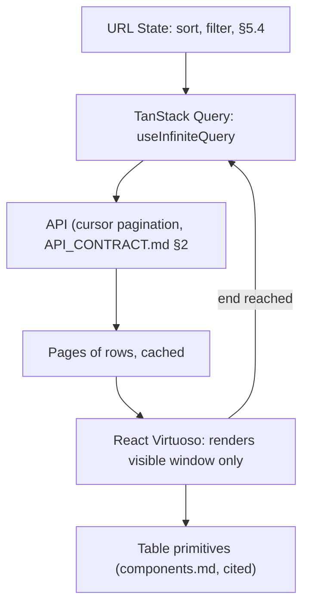
```mermaid
flowchart TB
    URLSTATE[URL State: sort, filter, §5.4] --> QUERY[TanStack Query: useInfiniteQuery]
    QUERY --> API["API (cursor pagination, API_CONTRACT.md §2"]
    API --> PAGES[Pages of rows, cached]
    PAGES --> VIRTUOSO[React Virtuoso: renders visible window only]
    VIRTUOSO -->|end reached| QUERY
    VIRTUOSO --> ROWS["Table primitives (components.md, cited)"]
```

**Diagram 20 — Analytics Dashboard Widget Lifecycle**

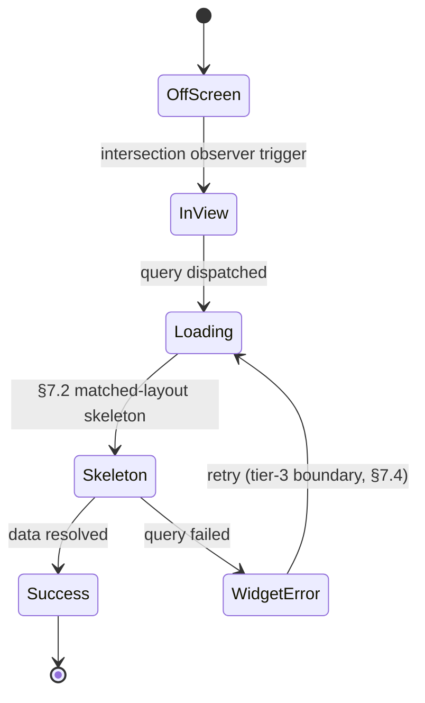
```mermaid
stateDiagram-v2
    [*] --> OffScreen
    OffScreen --> InView: intersection observer trigger
    InView --> Loading: query dispatched
    Loading --> Skeleton: §7.2 matched-layout skeleton
    Skeleton --> Success: data resolved
    Skeleton --> WidgetError: query failed
    WidgetError --> Loading: retry (tier-3 boundary, §7.4)
    Success --> [*]
```

---

## Part 11 — Accessibility & Internationalization

### 11.1 Accessibility, WCAG AA (Item 89)

**Purpose & Architecture.** WCAG 2.1 AA is the binding conformance target platform-wide, achieved primarily by inheritance (F5, §0.5) rather than by audit: Radix UI and React Aria (both named in the stack specifically for this reason) supply correct semantics, focus management, and ARIA wiring for every structural primitive (`components.md`'s stated rationale, cited); `foundations.md`'s color system is formula-verified to meet 4.5:1 contrast for both light and dark themes (§60 of that document); every interactive primitive has a visible focus ring by default (`foundations.md` principle 4). This document's addition is process, not mechanism: any new Pattern or Business Component that introduces custom interactive behavior *not* covered by an existing Radix/React Aria primitive requires an explicit accessibility review before merge — the one place manual verification is still required, precisely because it's the one place inheritance doesn't automatically cover.

**Responsibilities & Design Decisions.** Automated accessibility linting (axe-core-equivalent, run in CI) catches the mechanically-detectable subset (missing labels, contrast regressions, invalid ARIA usage) as a merge gate, mirroring the CI-gate discipline `BACKEND_ARCHITECTURE.md` and `CLOUD_INFRASTRUCTURE.md` already apply to their own quality bars; it is a floor, not a substitute for the manual review triggered above for novel interaction patterns.

**Trade-offs.** Building custom interactive surfaces (the Workflow Builder canvas, §9.6; the Command Palette, §7.12) costs meaningfully more accessibility engineering effort than a Radix-wrapped primitive would, an accepted, explicit cost of the scoped first-party-build exceptions made in §0.4, §9.6, and §10.6 — not an oversight, a named trade-off those decisions carry.

### 11.2 Keyboard Accessibility (Item 90)

**Purpose & Architecture.** Every interactive surface is fully operable without a pointing device — restating and generalizing §8.1's shortcut-accelerator rule: keyboard operability is the baseline, shortcuts are the accelerator on top of it, never the only path. Tab order follows visual/logical reading order by construction (source order, no unexplained `tabIndex` reordering) except where a widget's own ARIA pattern (a Radix `Menu`, `Tabs`, or the bespoke Workflow Builder canvas) defines its own internal arrow-key navigation model, in which case that widget's documented ARIA authoring-practice pattern is followed exactly, not approximated.

### 11.3 Screen Reader Strategy (Item 91)

**Purpose & Architecture.** Live regions (`aria-live`) are used deliberately and sparingly for genuinely important asynchronous updates a screen-reader user must not miss — a completed AI generation (§9.3), a real-time collaboration event materially changing the current view (§6.2) — never applied blanket to every state change, which would produce an unusable wall of announcements. Streaming Chat (§9.3) in particular is designed to announce only stream-completion, not every incoming token, avoiding exactly that failure mode for the platform's highest-frequency streaming surface.

**Trade-offs.** Under-announcing (missing a state change a screen-reader user genuinely needed) is treated as the worse failure than over-announcing being merely restrained — but both are actively designed against per-surface, not left to a single blanket policy, given how differently AI streaming's token-level cadence and a discrete "record updated" event should each be handled.

### 11.4 Internationalization (Item 92) & 11.5 Localization (Item 93)

**Purpose & Architecture.** All user-facing strings are externalized through an i18n provider (Application Shell, §4.9) from day one, even though BizPilot AI's Phase 1 launch may ship a single locale — extracting strings later, across an already-large codebase, is a materially more expensive migration than requiring the discipline from the start, the same "cheap now, expensive later" reasoning `CLOUD_INFRASTRUCTURE.md` applies to its own phase-gated decisions. Locale-sensitive formatting (dates, numbers, currency — directly relevant to `PRD.md`'s billing/invoicing surfaces) uses the browser's native internationalization API rather than a hand-rolled formatter, and is always resolved from the user's or workspace's locale setting, never inferred solely from browser language, since a workspace's business locale (relevant for currency/date formatting in shared documents) and an individual user's display-language preference are two independently-set values.

**Trade-offs.** Externalizing every string from day one adds a small amount of per-PR overhead (wrapping a string in the translation call) for a single-locale launch that doesn't yet benefit from it, accepted specifically because `PRD.md`'s stated ambition (a global AI operating system) makes multi-locale support a near-certain, not speculative, future need — this is judged a case where the usual YAGNI discipline (§2.5, §2.1) is overridden by the cost asymmetry of retrofitting i18n later versus the marginal cost of doing it correctly now.

### 11.6 RTL Readiness (Item 94)

**Purpose & Architecture.** Layout uses logical CSS properties (`start`/`end` rather than `left`/`right`, already Tailwind's modern default direction for spacing/positioning utilities) throughout the design system and every Pattern/Business Component built on it, so that RTL locale support (Arabic, Hebrew) is a `dir="rtl"` attribute flip plus font/icon-mirroring review, not a layout rewrite — the same "pay the small ongoing cost now, avoid the expensive retrofit later" reasoning as §11.4. Icons that carry inherent directionality (a "forward" arrow, for instance) are flagged in the icon strategy (`foundations.md` §6, extended here) as RTL-mirroring-required, tracked as a short, explicit list rather than assumed automatic.

**Future Evolution.** RTL is explicitly "readiness," not shipped support (item 94's own naming, honored precisely) — full RTL QA and locale-specific typography (a non-Latin script may need a different type scale than Inter's Latin-optimized metrics, `foundations.md` §2) is deferred to whenever a specific RTL-locale market entry is planned, at which point the logical-properties groundwork already in place makes that a scoped QA effort, not an architecture change.

**Diagram 21 — Accessibility Inheritance Model**

```mermaid
flowchart TB
    subgraph Inherited["Inherited by construction (no per-component work)"]
        RADIX[Radix UI: focus mgmt, ARIA wiring]
        ARIA_LIB[React Aria: complex widget patterns]
        TOKENS["foundations.md color/contrast formula"]
    end
    subgraph Enforced["Enforced by CI"]
        LINT[axe-core-equivalent lint gate]
    end
    subgraph Manual["Manual review required"]
        NOVEL["Novel interactive surfaces: Workflow Builder canvas §9.6, Command Palette §7.12"]
    end
    Inherited --> PRIMITIVES[Primitives, Patterns]
    PRIMITIVES --> BIZ[Business Components]
    BIZ --> Enforced
    NOVEL --> Enforced
    Enforced -->|fail| BLOCKED[Merge blocked]
    Enforced -->|pass, novel surface| Manual
```

---

## Part 12 — Performance Optimization

### 12.1 Performance Optimization (Item 95) & 12.2 Rendering Strategy (Item 96)

**Purpose & Architecture.** The application is a client-side-rendered (CSR) Vite SPA — no SSR meta-framework is in the named stack (§0.7), a deliberate, documented constraint (ADR-FE-003, §16) rather than an oversight. Performance is managed through explicit, CI-enforced budgets (F11) covering three dimensions: **initial load** (time to interactive for the authenticated app shell, §4.9's bootstrap sequence being the critical path); **bundle size** (per-route and per-feature-chunk ceilings, §12.5); **runtime rendering** (avoiding unnecessary re-renders at the frequencies §5.6's AI-token-streaming and §6.3's real-time-event surfaces specifically stress).

**Engineering Rationale & Alternatives Considered.** CSR-only (rather than adopting a meta-framework for SSR) was accepted as a trade-off, not treated as cost-free: SSR would improve initial paint and SEO for public-facing surfaces, but the named stack's authenticated, highly-interactive, real-time product surface (the vast majority of the product, per `PRD.md`) benefits far less from SSR than a content-heavy public site would, while a meta-framework migration would touch every routing and data-fetching decision in this document — judged not worth the disruption for the product's actual shape. Public marketing/SEO-sensitive pages (if and when they exist) are explicitly scoped as a separate, optionally-prerendered surface outside this SPA's authenticated shell, not solved by adopting SSR platform-wide.

**Trade-offs.** Weaker default SEO and a slightly slower first meaningful paint than an SSR equivalent, accepted given the product's authenticated-app-first shape; revisited only if a public, content-heavy, SEO-critical surface becomes a genuine product requirement (§16, §17).

### 12.3 Memoization Rules (Item 97)

**Purpose & Architecture.** Memoization (`memo`, `useMemo`, `useCallback`) is applied deliberately at specific, identified hot paths — the AI-State-driven streaming message list (§5.6, §9.2/§9.3), the Command Palette's search-as-you-type results (§7.12), real-time-event-driven list updates (§6.3) — never reflexively across the entire codebase. A component is memoized when profiling (not intuition) shows it re-rendering at a frequency or cost that matters; blanket memoization is explicitly discouraged as it adds comparison overhead and cognitive load without benefit for the large majority of components that re-render rarely or cheaply.

**Engineering Rationale & Alternatives Considered.** "Memoize everything defensively" was rejected — it is a common, well-documented anti-pattern that trades code clarity for performance gains that usually don't materialize outside genuinely hot paths, and this document instead names the specific hot paths (above) where the trade is worth making, keeping the rule falsifiable and reviewable rather than a vague blanket instruction.

### 12.4 Lazy Loading (Item 98), 12.5 Route Splitting (Item 99), 12.6 Bundle Splitting (Item 100)

**Purpose & Architecture.** Three nested splitting boundaries, largest to smallest: **Route splitting** — every feature route (§4.2) is a separate lazily-loaded chunk by default, the primary and largest-grain splitting boundary, directly aligned with the Feature Module layer (§1.2) so a chunk boundary and an ownership boundary are the same boundary; **Component-level lazy loading** — large, infrequently-mounted components within an already-loaded route (Monaco Editor's editor engine, the Workflow Builder canvas, §9.6) are further split and loaded on first actual use, not bundled into their parent route's chunk, since not every session that visits a route containing them actually triggers their use; **Vendor/shared-chunk splitting** — the Design System (Layer 1) and Shared Kernel (Layer 2) ship in a distinct, aggressively long-cache-lived chunk separate from feature chunks, since it changes far less frequently than feature code and benefits from a cache lifetime feature chunks (which change on every related feature deploy) cannot share.

**Performance & Scalability Considerations.** This three-tier structure is what keeps bundle growth *feature-proportional* rather than *platform-proportional* — adding the fiftieth feature module adds one new lazily-loaded chunk, never increases the size of the first route a user's session actually needs to download.

### 12.7 Asset Optimization (Item 101) & 12.8 Image Optimization (Item 102)

**Purpose & Architecture.** Bundled static assets (icons, illustrations, §3.4) are optimized at build time (SVG minification, tree-shaken icon imports — Lucide's per-icon import model, already implicit in `foundations.md` §6's "Lucide React exclusively," means only icons actually used ship, not the whole icon set). User/AI-generated images (§10.2, §10.3) are never bundled — they are always CDN-delivered via `CLOUD_INFRASTRUCTURE.md` §9's signed-URL/CDN pipeline, cited as this document's sole image-delivery mechanism, at a size-appropriate variant chosen by rendering context (thumbnail, inline preview, full lightbox) rather than the frontend requesting and downscaling a full-resolution asset client-side.

### 12.9 Font Loading (Item 103)

**Purpose & Architecture.** Fully specified by `foundations.md` §2 and `conventions.md` §22 already: Inter variable, self-hosted via `@fontsource-variable/inter`, imported once from the styles entry point — cited verbatim, no external font request, no FOUT/FOIT race, nothing added here beyond confirming this remains the binding decision platform-wide, including for any future white-labeled tenant (§3.7's brand allowlist does not include typography — a white-label tenant's product still renders in Inter, consistent with §3.4's decision to keep most tokens fixed platform-wide).

**Diagram 22 — Bundle Splitting & Chunk Loading Strategy**

```mermaid
flowchart TB
    subgraph Eager["Eagerly loaded (Application Shell)"]
        SHELL[app/ - providers, router config]
        VENDOR["Design System + Shared Kernel chunk (long cache lifetime)"]
    end
    subgraph RouteChunks["Route-level chunks (lazy)"]
        R1[Feature route: Dashboard]
        R2[Feature route: AI Copilot]
        R3[Feature route: Workflow Builder]
    end
    subgraph ComponentChunks["Component-level chunks (lazy, on first use)"]
        MONACO[Monaco Editor engine]
        CANVAS[Workflow Canvas engine]
    end
    SHELL --> RouteChunks
    VENDOR -.shared by.-> RouteChunks
    R2 -.loads on use.-> MONACO
    R3 -.loads on use.-> CANVAS
```

---

## Part 13 — Security & Observability

### 13.1 Security (Item 104)

**Purpose & Architecture.** The frontend's security posture is built entirely on decisions already made upstream, applied consistently: sessions are `AUTH_ARCHITECTURE.md` §3.6's `__Host-`-prefixed, `HttpOnly`, `Secure`, `SameSite=Strict` cookies — the frontend never reads, stores, or transmits a token itself, meaning there is structurally no token for client-side JavaScript (including a compromised dependency or a plugin, § Part 14) to exfiltrate. Every mutating request includes the CSRF protections `AUTH_ARCHITECTURE.md` already specifies for cookie-based sessions (cited, not redesigned). Permission-aware rendering (§4.7) and route protection (§4.4) are explicitly documented, again, as UX conveniences layered on top of server-side enforcement, never a substitute for it.

**Responsibilities & Design Decisions.** All AI-generated and user-generated content (§9.2, §9.4, comments, descriptions, any Markdown/rich-text surface) passes through one shared, centrally-maintained sanitization boundary before rendering — a single reviewed dependency and configuration, not per-feature ad hoc sanitization calls, closing the most realistic XSS vector for an AI-native product where a meaningful fraction of rendered content did not originate from the platform's own first-party code.

**Trade-offs.** Centralizing sanitization costs a small amount of flexibility (a feature cannot invent its own permissive rendering rule for "just this one case") in exchange for exactly one place to audit and harden — accepted without reservation given the severity asymmetry between XSS risk and that flexibility.

### 13.2 CSP Compatibility (Item 105)

**Purpose & Architecture.** The build is architected to be compatible with a strict Content-Security-Policy from day one: Vite's production build emits externally-referenced, hashed/fingerprinted script and style files (no inline `<script>`, no inline event handlers, no `style` attribute-based dynamic styling in any Primitive) — meaning a strict CSP (`script-src 'self'`, no `unsafe-inline`, no `unsafe-eval`) can be applied at `CLOUD_INFRASTRUCTURE.md` §3's Ingress/edge layer without the frontend needing a CSP-incompatibility exception. This ruled out, at evaluation time, any animation or state library requiring runtime `eval`-based code generation — none of the named stack's libraries (Framer Motion, TanStack Query, Zod, Radix, React Aria, Floating UI) require one, confirmed as a binding compatibility constraint on any future library addition too.

**Security Considerations.** Any future dependency addition to the stack is evaluated against CSP-compatibility as a hard gate, not an afterthought — a library requiring `unsafe-eval` is disqualified regardless of its other merits, given how much of this document's Defense-in-Depth posture (mirroring `CLOUD_INFRASTRUCTURE.md` §14's P19) depends on a strict CSP actually holding.

### 13.3 Observability (Item 106), 13.4 Frontend Logging (Item 107), 13.5 Monitoring (Item 108)

**Purpose & Architecture.** Frontend observability extends `BACKEND_ARCHITECTURE.md` §5.6's correlation-ID discipline to the browser: every outgoing API call (via the shared, typed API client, §5.2) attaches a client-generated request/correlation ID, allowing a frontend error report to be joined, end-to-end, with the exact backend trace (`CLOUD_INFRASTRUCTURE.md` §11.3's distributed tracing, cited) that served it — an incident responder investigating a user-reported bug can go from a frontend error report directly into the corresponding backend trace without a manual, error-prone timestamp-based correlation.

**Responsibilities & Design Decisions.** Real User Monitoring (RUM) captures Core Web Vitals-equivalent timing metrics (initial load, route-transition latency, §12's budgets made observable in production, not just in CI) plus custom timing marks for the platform's own critical interactions (time-to-first-token for AI streaming, §6.4; command palette open-to-result latency, §7.12). Frontend error reporting captures unhandled exceptions and error-boundary catches (§7.4) with the same correlation-ID linkage, routed to the same observability stack `CLOUD_INFRASTRUCTURE.md` §11 already established (an open-standard, vendor-agnostic stack per that document's ADR-INFRA-010, cited and extended to the frontend rather than introducing a second, frontend-only observability vendor).

**Trade-offs.** Reusing the backend's open-standard observability stack (rather than a frontend-specialized proprietary RUM vendor) trades some frontend-specific out-of-the-box tooling for one unified stack an on-call engineer already knows how to query — the same P18 (vendor lock-in minimization) reasoning `CLOUD_INFRASTRUCTURE.md` applied to its own stack choice, applied here to keep the two consistent rather than introducing a second observability vendor relationship.

### 13.6 Analytics Instrumentation (Item 109)

**Purpose & Architecture.** A single, typed event-tracking abstraction (Shared Kernel) is the only sanctioned way any feature emits a product-analytics event — never a direct call to a specific analytics vendor's SDK scattered through feature code, preserving the same vendor-swappability discipline as every other externally-facing integration in this document series. Events are workspace- and (where consented) user-scoped, respecting the same data-minimization posture `AUTH_ARCHITECTURE.md` §6 already established for the platform's compliance posture.

### 13.7 Experimentation Framework (Item 110) & 13.8 A/B Testing (Item 111)

**Purpose & Architecture.** Built entirely on §4.8's `useFeatureFlag` hook and `BACKEND_ARCHITECTURE.md` §7.7's `FeatureFlagEngine` `PERCENTAGE_ROLLOUT` capability — an experiment is a flag with two or more named variant arms, and A/B testing is the specific two-arm case of that same general mechanism, exactly mirroring how `CLOUD_INFRASTRUCTURE.md` §5.1's ADR-generalized its infrastructure-level canary mechanism from the identical flag primitive. No separate experimentation SDK or vendor is introduced; variant assignment is resolved once at session bootstrap (§4.9) alongside every other flag, and exposure events (which variant a user actually saw) are emitted through §13.6's same analytics abstraction, correlated by the same flag key the assignment came from.

**Engineering Rationale & Alternatives Considered.** Reusing the existing flag engine (rather than adopting a dedicated third-party experimentation platform) was chosen specifically because it is the third distinct consumer of the exact same primitive (infrastructure canary, UI feature-gating, and now experimentation) — a strong signal that the primitive is genuinely general-purpose and that introducing a parallel, dedicated system would be duplicate infrastructure solving an already-solved problem.

**Diagram 23 — Frontend Observability & Correlation Flow**

```mermaid
sequenceDiagram
    participant U as User
    participant UI as Component
    participant Client as API Client (shared)
    participant API as Backend API
    participant OTel as CLOUD_INFRASTRUCTURE.md §11 stack
    U->>UI: Interaction triggers request
    UI->>Client: Call feature api/ hook
    Client->>Client: Attach correlation ID
    Client->>API: Request (correlation ID header)
    API->>OTel: Emit trace (same correlation ID)
    alt error
        Client-->>UI: Error (correlation ID attached)
        UI->>OTel: Frontend error report (same correlation ID)
        Note over OTel: Frontend error and backend trace joined by ID
    end
```

**Diagram 24 — Feature Flag as Shared Primitive Across Three Consumers**

```mermaid
flowchart TB
    ENGINE["FeatureFlagEngine (BACKEND_ARCHITECTURE.md §7.7)"]
    ENGINE --> INFRA["Infrastructure canary (CLOUD_INFRASTRUCTURE.md §5.1)"]
    ENGINE --> UIFLAG["UI feature-gating (§4.8 useFeatureFlag)"]
    ENGINE --> EXPERIMENT["Experimentation / A-B testing (§13.7-13.8)"]
    UIFLAG --> NAV[Navigation registry filtering, §4.1]
    UIFLAG --> ROUTES[Route-level gating, §4.2]
    EXPERIMENT --> ANALYTICS[Exposure events, §13.6]
```

---

## Part 14 — Extensibility, Marketplace & Future Platforms

### 14.1 Plugin-ready Frontend (Item 112)

**Purpose & Architecture.** Extends `BACKEND_ARCHITECTURE.md`'s sandboxed Plugin Engine (that document's §7-adjacent extensibility subsystem, cited not redesigned) to the frontend with a **versioned slot API**, not arbitrary code execution in the host application's JavaScript context (F12) — a plugin registers UI contributions (a navigation entry via §4.1's exact registry mechanism, a Dashboard widget via §10.4's widget contract, a Command Palette action via §7.12's command-registry contract) that render inside a strictly sandboxed execution context (an iframe with a narrow, message-passing-based bridge API, or an equivalently isolated mechanism), never as directly-mounted React components sharing the host application's module scope, memory, or DOM tree unguarded.

**Responsibilities & Design Decisions.** The slot API is a stable, additive-only, semantically-versioned contract (mirroring §3.1's design-system contract-stability discipline, applied here to an external-facing, third-party-consumed surface where breaking stability is even more costly) — a plugin declares which slot types and API version it targets, and the host runtime provides only version-compatible contributions, refusing (with a clear error surfaced in a plugin-management UI, not a silent failure) an incompatible one.

**Engineering Rationale & Alternatives Considered.** Iframe/message-passing sandboxing (versus a more convenient but unsafe in-process plugin API, e.g., handing a plugin a raw reference to host application state or components) was chosen because a plugin is, by definition, less-trusted code — allowing it direct access to host state or the DOM tree would let a buggy or malicious plugin read another workspace's data still resident in memory, corrupt host application state, or exfiltrate the session's data despite `AUTH_ARCHITECTURE.md`'s cookie-only token discipline (§13.1) protecting against network-level exfiltration but not against an in-process plugin simply reading whatever the host has already fetched.

**Trade-offs.** Sandboxed, message-passing plugin communication is materially slower and more constrained for a plugin author than direct in-process access would be, an explicit, accepted cost given the security stakes — a plugin ecosystem that compromised host application or cross-tenant data would be catastrophic to `PRD.md`'s Enterprise trust posture, far outweighing the developer-experience cost to plugin authors.

**Security Considerations.** Plugin-contributed slots never receive a capability broader than the specific data the slot contract explicitly passes in (e.g., a Dashboard widget slot receives only the specific metric data it's configured to display, never a general query client reference) — the same least-privilege principle `CLOUD_INFRASTRUCTURE.md` §14.3 applies to infrastructure IAM, applied here to the frontend's own internal capability surface.

### 14.2 Marketplace-ready UI (Item 113)

**Purpose & Architecture.** A Business-Component-tier surface (analogous in shape to §9.4's Prompt Library UI) for browsing, installing, and managing plugins/templates/prompt packs — ordinary Server State (§5.2) list/detail views over a marketplace API surface (`BACKEND_ARCHITECTURE.md`'s Plugin Engine and Marketplace subsystems, cited), with an install action that registers the plugin's declared slot contributions (§14.1) into the relevant registries (navigation, §4.1; command, §7.12; dashboard widgets, §10.4) — installation is purely additive registration, never a build-time or deploy-time step, consistent with the "same build artifact for every tenant" principle established for white-labeling (§3.7) and extended here to plugins.

**Trade-offs.** Runtime-only plugin installation (versus a build-time plugin bundling step) mirrors §3.7's white-labeling trade-off precisely and for the same reason — keeping plugin installation additive to, not multiplicative against, the CI/CD pipeline `CLOUD_INFRASTRUCTURE.md` §5 already defined.

### 14.3 Future Desktop Application (Item 114)

**Purpose & Architecture.** A native desktop wrapper (a Tauri/Electron-equivalent, named generically per this document series' consistent vendor-agnostic-in-prose convention) around the identical Application Shell (§4.9) and feature modules — no application logic is desktop-specific; the wrapper contributes only platform-native chrome (a native menu bar reading from §8.1's keyboard-shortcut registry, native window controls, native notifications bridging §7.6's Persistent Notification model) and, eventually, filesystem-level integration points a browser sandbox cannot offer.

**Trade-offs.** Building the desktop shell as a thin wrapper (rather than a separate native codebase) trades some platform-native polish for near-zero incremental application logic to maintain — the entire product surface (§ Parts 4–10) works unmodified inside it by construction, a direct payoff of F10 (progressive platform extension, never a rewrite).

### 14.4 Future Offline Mode (Item 115)

**Purpose & Architecture.** Extends §5.8's Offline State groundwork: a service worker intercepts network requests, serving cached GET responses (via TanStack Query's persistence extension point, §5.8) when offline, and queues mutations (an "outbox" pattern) for replay on reconnect — every queued mutation reuses the exact idempotency-key discipline already established for optimistic updates (§5.10, `BACKEND_ARCHITECTURE.md` §8.5), so a replayed mutation after an extended offline period cannot double-apply. Conflict resolution (a resource changed both offline-locally and server-side during the disconnection window) is deferred as an explicit, named open problem (§17) rather than glossed over — the honest answer at this document's authoring time is that a general conflict-resolution policy is a substantial design effort in its own right, scoped for a dedicated future design pass, not solved incidentally here.

### 14.5 Future Mobile Application (Item 116)

**Purpose & Architecture.** A React Native application is the anticipated path, sharing the Shared Kernel's data/state/streaming layers (§ Parts 5–6, all framework-agnostic or React-generic, not DOM-dependent) and design tokens (§3.2, translated into React Native's styling model rather than Tailwind CSS directly) but **not** sharing DOM-based Primitives (§2.4's container/presentational split is precisely what makes this possible — a mobile Business Component reuses the web Business Component's container logic while swapping in React-Native-native Primitives underneath, exactly as stated in §2.4's Future Evolution).

**Trade-offs.** Not sharing UI components (only logic) between web and a future mobile app costs a full native Primitive layer to build, accepted because attempting to share React DOM components with React Native (via a web-view wrapper or a DOM-emulation layer) reliably produces a worse native experience than genuinely native components — judged not worth the code-sharing convenience for a product where perceived quality matters as much as `PRD.md`'s competitive positioning implies.

### 14.6 Future Multi-window Experience (Item 117)

**Purpose & Architecture.** Deferred to the desktop shell (§14.3), where a native windowing API (unavailable to a browser tab) makes it meaningful — a user popping the AI Employee Workspace (§9.5) or a Workflow Builder canvas (§9.6) into its own window while continuing other work in the main window. Because both surfaces are already self-contained feature modules (§1.5) communicating only through the Shared Kernel's event bus (§1.3) and Server/AI State (never through direct component-tree coupling to a specific window instance), a future multi-window implementation is an Application Shell-level windowing concern, not a change to either feature module itself.

### 14.7 Future AI Workspace (Item 118)

**Purpose & Architecture.** The stated long-term evolution of §9.5's AI Employee Workspace: from supervising one agent run at a time toward a multi-agent, multi-run command-center view — generalizing the same step-tree/timeline visualization (§9.5, Diagram 18) to render several concurrent runs, with cross-run coordination surfaced (per `AI_PLATFORM_ARCHITECTURE.md`'s Multi-Agent communication subsystem, cited) rather than each run rendered in isolation. Explicitly not built now (YAGNI, consistent with this entire document's phase-gating discipline) — named here specifically so §9.5's architecture is verified compatible with this direction (a single-run-shaped step-tree component that couldn't generalize to multi-run would be a retrofit risk this document chooses to rule out in advance, the same anticipatory discipline `CLOUD_INFRASTRUCTURE.md` applied to its own multi-region staging, §13.4 of that document).

**Diagram 25 — Plugin Sandboxing & Slot Contract**

```mermaid
flowchart TB
    subgraph Host["Host Application (trusted)"]
        REG_NAV[Navigation Registry, §4.1]
        REG_CMD[Command Registry, §7.12]
        REG_WIDGET[Dashboard Widget Registry, §10.4]
        BRIDGE[Sandboxed Message-Passing Bridge]
    end
    subgraph Plugin["Plugin Runtime (untrusted, isolated)"]
        PLUGIN_IFRAME[Plugin code - iframe or equivalent isolation]
    end
    MARKET[Marketplace UI, §14.2] -->|install: register contract| REG_NAV
    MARKET --> REG_CMD
    MARKET --> REG_WIDGET
    REG_NAV & REG_CMD & REG_WIDGET --> BRIDGE
    BRIDGE <-."narrow, versioned message contract only".-> PLUGIN_IFRAME
    PLUGIN_IFRAME -.x direct DOM/state access.-x Host
```

**Diagram 26 — Progressive Platform Extension (Web -> Desktop -> Mobile -> Multi-window)**

```mermaid
flowchart LR
    CORE["Core: Application Shell + Feature Modules + Shared Kernel (Parts 1-13)"]
    CORE --> WEB[Web SPA - today]
    CORE --> DESKTOP["Desktop wrapper, §14.3 - native chrome only"]
    DESKTOP --> MULTIWIN["Multi-window, §14.6"]
    CORE -."logic + state shared, Primitives swapped".-> MOBILE["React Native, §14.5"]
    CORE -."service worker + outbox".-> OFFLINE["Offline Mode, §14.4"]
```

---

## Part 15 — Architectural Decision Records (Item 119)

*Format:* Context / Decision / Alternatives Considered / Trade-offs / Consequences / Future Review, consistent with the ADR convention established across every prior document in this series.

### ADR-FE-001: Feature-based Folder Architecture

- **Context.** `ARCHITECTURE.md` already committed to `features/<feature>/` but this document's ten-year, plugin-extensible scope required deciding whether that holds at scale.
- **Decision.** Feature-based organization (F1) remains binding platform-wide, extended with the internal six-subfolder shape (§1.5) and enforced import boundaries (§1.3).
- **Alternatives Considered.** (a) Type-based (`components/`, `hooks/`, `reducers/` at app root) — rejected: does not scale past a handful of screens without becoming unnavigable. (b) Domain-driven nested modules mirroring backend bounded contexts one-to-one — rejected: frontend feature boundaries (driven by UI/UX cohesion) don't always align with backend bounded-context boundaries (driven by data ownership), and forcing them to match would distort one or the other.
- **Trade-offs.** More folders to navigate for a trivial feature versus a flatter structure's simplicity, accepted for consistency at scale.
- **Consequences.** Every new engineer learns one predictable shape regardless of feature; the import-boundary linter (§1.3) is enforceable specifically because the boundary is structural, not just conventional.
- **Future Review.** Revisited only if a specific feature genuinely outgrows the six-subfolder shape (§1.5's Future Evolution already anticipates one-level recursion for this case).

### ADR-FE-002: Five-Layer Dependency Model

- **Context.** The existing design system already enforces a four-folder dependency layering internally; the rest of the application needed an equally rigorous model.
- **Decision.** Five strictly one-directional layers (§1.2): Design System, Shared Kernel, Feature Modules, Application Shell, Entry.
- **Alternatives Considered.** A flatter three-layer "components/hooks/pages" convention — rejected as insufficient for the stated multi-million-user, plugin-extensible ambition (§0.6).
- **Trade-offs.** More upfront structure to learn, repaid by predictability at scale.
- **Consequences.** Code-splitting boundaries (§12.4–§12.6) and the Plugin Runtime's insertion point (§ Part 14) both derive directly from this layering.
- **Future Review.** Revisited only if a sixth layer (beyond the already-anticipated Plugin Runtime slot) proves necessary.

### ADR-FE-003: Client-Side Rendering Only (No SSR Meta-Framework)

- **Context.** The named stack includes Vite and React Router but no SSR meta-framework; the product is overwhelmingly an authenticated, highly-interactive surface.
- **Decision.** CSR-only SPA (§12.1–§12.2), with public/SEO-sensitive pages explicitly scoped outside this document's authenticated shell.
- **Alternatives Considered.** Adopting an SSR meta-framework — rejected: would touch every routing/data-fetching decision in this document for a benefit (SEO, first-paint) disproportionate to the product's actual (mostly-authenticated) shape.
- **Trade-offs.** Weaker default SEO/first-paint versus an SSR equivalent, accepted given the product's shape.
- **Consequences.** Performance strategy (§ Part 12) is entirely CSR-optimization-focused (splitting, virtualization, budgets) rather than hydration-optimization-focused.
- **Future Review.** Revisited if a genuine public, content-heavy, SEO-critical surface becomes a product requirement.

### ADR-FE-004: Dual Streaming Transport (SSE for AI, WebSocket for Bidirectional Real-time)

- **Context.** `API_CONTRACT.md` §2 already committed to SSE for AI generation; real-time collaboration (presence, live edits) is inherently bidirectional, which SSE cannot serve.
- **Decision.** SSE exclusively for AI-generation token streams (§6.4); a single shared WebSocket connection per workspace for everything bidirectional (§6.3); both hidden behind one unified Streaming Primitive (§6.1).
- **Alternatives Considered.** WebSocket for everything, including AI streaming — rejected: contradicts `API_CONTRACT.md`'s existing contract and adds unneeded bidirectional complexity to a fundamentally one-directional problem.
- **Trade-offs.** Two transports to maintain versus one, justified by matching each to its actual directionality and by SSE's better fit with HTTP infrastructure for one-directional streams.
- **Consequences.** `CLOUD_INFRASTRUCTURE.md`'s WebSocket-capacity planning must account for one persistent connection per active workspace session, not per feature (§6.3's Scalability Considerations).
- **Future Review.** Revisited only if a specific AI-generation use case genuinely requires bidirectional mid-stream interaction SSE cannot express.

### ADR-FE-005: TanStack Query as Exclusive Server-State Owner

- **Context.** F2 requires server state and client state to never be conflated; a single owning mechanism for server state was required.
- **Decision.** TanStack Query exclusively owns server state (§5.2), with a generated, workspace-namespaced query-key convention.
- **Alternatives Considered.** A unified global store holding both server and client state — rejected outright as the specific anti-pattern F2 exists to prevent.
- **Trade-offs.** Requires disciplined key-factory usage per feature versus ad hoc key arrays, justified by the multi-tenant cache-isolation invariant (§4.6) depending on it.
- **Consequences.** Workspace switching (§4.5), real-time invalidation (§5.9), and optimistic updates (§5.10) all compose cleanly because they share one server-state model.
- **Future Review.** Revisited only if a future offline mode (§14.4) requires a persistence layer TanStack Query's own extension points cannot serve.

### ADR-FE-006: AI State as a Distinct Category from Server State

- **Context.** Streaming AI content arrives incrementally and needs partial rendering before a durable server record exists — a poor fit for TanStack Query's request/response model.
- **Decision.** A dedicated AI-state slice (§5.6) holds in-flight streaming content, handing off to ordinary Server State once a stream completes.
- **Alternatives Considered.** Forcing streaming content through TanStack Query via manual per-chunk cache manipulation — rejected as fighting the library's cache-invalidation semantics.
- **Trade-offs.** A second state mechanism to maintain, justified by the clean, well-defined hand-off boundary it creates.
- **Consequences.** That hand-off boundary is also the intended integration point for future offline (§14.4) and multi-window (§14.6) synchronization.
- **Future Review.** Revisited if a future streaming primitive (e.g., a resumable-generation backend contract) changes the shape of what "in-flight" means.

### ADR-FE-007: Selective, Not Universal, Optimistic Updates

- **Context.** Optimistic UI improves perceived performance but risks showing a user an action succeeding before it actually has.
- **Decision.** Optimistic updates (§5.10) are applied only to low-risk, easily-reversible interactions, paired with idempotency keys; financial/billing mutations always wait for server confirmation.
- **Alternatives Considered.** A blanket "always optimistic" policy — rejected given `PRD.md`'s billing/invoicing surfaces' trust sensitivity.
- **Trade-offs.** A per-mutation judgment call adds ongoing design overhead versus one global rule, accepted to get risk-sensitive cases right.
- **Consequences.** Each feature must explicitly document its own mutations' optimism policy in its `api/` layer.
- **Future Review.** Revisited if product data shows users are meaningfully frustrated by non-optimistic flows currently classified as high-risk.

### ADR-FE-008: Workspace Context as a Route Parameter

- **Context.** `AUTH_ARCHITECTURE.md` §5.2 already decided against subdomain-per-workspace routing at the API layer.
- **Decision.** `:workspaceId` is a path segment (§4.2), the single source of truth for active-workspace context, driving query-key namespacing (§5.2) directly.
- **Alternatives Considered.** (a) Subdomain-per-workspace — rejected, contradicts `AUTH_ARCHITECTURE.md` directly. (b) Session-only, non-URL context — rejected, breaks deep-linking, an explicit `PRD.md` collaboration requirement.
- **Trade-offs.** One extra path segment on every route, negligible against the deep-linking payoff.
- **Consequences.** Workspace switching (§4.5) is a pure client-side navigation with instant cache-backed switch-back, never a re-authentication.
- **Future Review.** Revisited only if `AUTH_ARCHITECTURE.md`'s single-origin decision itself is ever revisited (out of this document's scope).

### ADR-FE-009: Lightweight External Store for Client State

- **Context.** Ephemeral UI state needs a mechanism that scales past React Context's re-render-the-subtree behavior.
- **Decision.** A lightweight, selector-based external store (Zustand-equivalent, §5.3) for cross-component client state; `useState`/`useReducer` remain default for single-subtree-local state.
- **Alternatives Considered.** React Context as the default — rejected for frequently-changing state given its whole-subtree re-render behavior at scale.
- **Trade-offs.** One more dependency/concept versus Context-only, accepted only where genuinely warranted (not reflexively).
- **Consequences.** AI State (§5.6) and Client State share the same selector-based subscription model, keeping their performance characteristics consistent.
- **Future Review.** Revisited if React's own built-in state-sharing primitives close the performance gap this decision is based on.

### ADR-FE-010: Runtime Token-Driven Theming for White-label (No Per-tenant Build)

- **Context.** White-labeling must not multiply the CI/CD pipeline `CLOUD_INFRASTRUCTURE.md` §5 already committed to one-build-artifact-per-release.
- **Decision.** A runtime Theme Engine (§3.5) applies workspace brand configuration as a CSS custom-property layer on top of the existing token system; every tenant runs the identical build.
- **Alternatives Considered.** A separate build per white-label tenant — rejected, multiplies pipeline count linearly with tenant count.
- **Trade-offs.** Cannot rebrand anything baked into the static bundle at build time; accepted since white-labeling is explicitly scoped to the authenticated product surface, not marketing pages.
- **Consequences.** Adding white-label support was additive to the CD pipeline, not disruptive to it.
- **Future Review.** Revisited only if a static-bundle-level rebrand (e.g., a tenant-specific favicon baked at build time) is genuinely required by a contract.

### ADR-FE-011: Narrow, Explicit Brand-Override Allowlist

- **Context.** Unrestricted per-tenant re-theming risks producing a contrast-failing, inaccessible product, undermining `foundations.md`'s WCAG-AA-by-formula color system.
- **Decision.** Only a small, explicit set of tokens (primary color family, logo, product name) is brand-overridable (§3.5); the vast majority of tokens remain fixed platform-wide.
- **Alternatives Considered.** Full token override capability — rejected without an accompanying automated contrast-validation gate, which does not yet exist.
- **Trade-offs.** Less white-label visual flexibility, accepted to protect the accessibility guarantee.
- **Consequences.** White-label onboarding is fast (a small config form) rather than a bespoke re-theming project per tenant.
- **Future Review.** Revisited if a contrast-validation gate is built, at which point the allowlist could be safely widened.

### ADR-FE-012: Pragmatic Four-Tier Taxonomy over Textbook Atomic Design

- **Context.** The existing design system already organizes by dependency layer, not abstract composition size.
- **Decision.** Primitives / Patterns / Business Components / Screens (§2.1), aligned with the enforced dependency-direction rule.
- **Alternatives Considered.** Textbook atoms/molecules/organisms/templates/pages — rejected as subjective in practice and not mapped to any enforced boundary.
- **Trade-offs.** Coarser-grained than five-tier Atomic Design, accepted because the dependency rule does the real architectural work.
- **Consequences.** New-component placement decisions are answerable by a lookup table (§2.2), not a judgment call.
- **Future Review.** Revisited only if a fifth tier's absence causes recurring placement ambiguity in practice.

### ADR-FE-013: Promote-on-Second-Use Component Policy

- **Context.** Speculative component promotion is a known source of premature, wrong abstractions.
- **Decision.** A component promotes from feature-local to shared only on its second real cross-feature usage (§2.5).
- **Alternatives Considered.** Eager promotion "in case it's reused" — rejected as the specific anti-pattern this policy exists to prevent.
- **Trade-offs.** A short window of near-duplicate components across two features, accepted as better than a wrong abstraction requiring later un-generalization.
- **Consequences.** `shared/components/patterns/` grows organically and stays genuinely reused, not speculative.
- **Future Review.** Not expected to change; consistent with every prior document's YAGNI discipline.

### ADR-FE-014: Bespoke Workflow Builder Canvas

- **Context.** No node-graph library is named in the stack; the Workflow Builder (§9.6) needs BizPilot-AI-specific node semantics (permission-aware nodes, AI-step streaming previews).
- **Decision.** First-party canvas engineering, a deliberate, scoped exception to preferring proven primitives (§0.4).
- **Alternatives Considered.** Adopting a generic third-party node-graph library — rejected: BizPilot AI's specific node/edge semantics would require extensive escape-hatching, likely costing more than a scoped first-party build.
- **Trade-offs.** More engineering investment and ongoing maintenance, justified as a core product differentiator warranting bespoke quality.
- **Consequences.** The canvas is a named accessibility-review-required surface (§11.1) precisely because it isn't Radix/React-Aria-backed.
- **Future Review.** Revisited if a suitable third-party library later matures enough to reduce escape-hatching cost below the maintenance cost of the first-party build.

### ADR-FE-015: Bespoke Headless Table Architecture

- **Context.** No table library is named in the stack; tables are pervasive across `PRD.md`'s feature inventory.
- **Decision.** A shared, first-party headless table Pattern (§10.6) composing existing Table primitives with sort/filter/selection behavior, using React Virtuoso for row virtualization.
- **Alternatives Considered.** A generic third-party table library — rejected: would impose its own opinions across a pervasive-enough surface that owning it directly was judged worthwhile.
- **Trade-offs.** More first-party code to maintain, justified by table consistency across the entire product.
- **Consequences.** Every table in the product shares the exact same virtualization, URL-state, and accessibility behavior by construction.
- **Future Review.** Revisited only if table requirements diverge enough across features that one shared implementation stops fitting cleanly.

### ADR-FE-016: React Virtuoso as Default Virtualization for Large Lists

- **Context.** AI conversations, tables, and file lists can all grow large enough that unvirtualized rendering degrades badly.
- **Decision.** React Virtuoso (named in the stack) is the default for any list/table expected to exceed roughly 100–200 rows (§10.7), applied uniformly across the Table Architecture and the Conversation UI.
- **Alternatives Considered.** Per-surface bespoke virtualization — rejected as unnecessary duplication given one library already fits both use cases well.
- **Trade-offs.** None material; this is a low-risk, high-payoff consistency decision.
- **Consequences.** Rendering cost stays bounded by viewport size regardless of total data volume, a hard requirement at Enterprise scale.
- **Future Review.** Not expected to change absent a stack-level library swap.

### ADR-FE-017: Shared Registry Pattern for Navigation, Commands, and Plugin Contributions

- **Context.** Navigation (§4.1), the Command Palette (§7.12), and future plugin contributions (§14.1) all need a way to register UI entries without cross-module imports (F9).
- **Decision.** One consistent descriptor-registry pattern reused across all three, rather than three separate registration mechanisms.
- **Alternatives Considered.** Bespoke registration per surface — rejected: inconsistent patterns across closely-related systems increase cognitive load for no benefit.
- **Trade-offs.** None material; consistency was judged strictly better here.
- **Consequences.** Plugins get no special registration capability first-party features don't already have (§14.1).
- **Future Review.** Extended, not replaced, as new registrable surfaces (e.g., a future Dashboard widget marketplace entry) are added.

### ADR-FE-018: Iframe/Message-Passing Plugin Sandboxing

- **Context.** Plugins are less-trusted code that could, if given direct in-process access, read cross-tenant data still resident in host memory or corrupt host state.
- **Decision.** Plugins render inside a strictly sandboxed context communicating only through a narrow, versioned message-passing bridge (§14.1), never as directly-mounted components sharing host module scope.
- **Alternatives Considered.** A convenient in-process plugin API with direct component/state access — rejected given the severity of a plugin-caused cross-tenant data leak to `PRD.md`'s Enterprise trust posture.
- **Trade-offs.** Slower, more constrained plugin development experience, explicitly accepted given the security stakes.
- **Consequences.** Every plugin slot contract passes in only the specific data it needs, never a general capability.
- **Future Review.** Revisited only if a stronger in-browser isolation primitive than iframes becomes broadly available and mature.

### ADR-FE-019: Feature-Flag-Engine Reuse for Experimentation/A-B Testing

- **Context.** `BACKEND_ARCHITECTURE.md` §7.7's `FeatureFlagEngine` already supports `PERCENTAGE_ROLLOUT`; `CLOUD_INFRASTRUCTURE.md` §5.1 already generalized it for infrastructure canary.
- **Decision.** Frontend experimentation and A/B testing (§13.7–§13.8) reuse the identical flag primitive as a third consumer, rather than adopting a dedicated experimentation vendor.
- **Alternatives Considered.** A dedicated third-party experimentation platform — rejected as duplicate infrastructure for an already-solved problem.
- **Trade-offs.** Possibly less experimentation-specific tooling polish (statistical significance dashboards, etc.) than a dedicated vendor, accepted for now given the strong reuse signal.
- **Consequences.** Variant assignment and canary rollout share one resolution mechanism, resolved once at session bootstrap.
- **Future Review.** Revisited if experimentation volume/sophistication outgrows what the flag engine's percentage-rollout model can express.

### ADR-FE-020: Centralized Content Sanitization Boundary

- **Context.** AI-generated and user-generated content is rendered throughout the product (§9.2, §9.4, comments, descriptions).
- **Decision.** One shared, centrally-maintained sanitization boundary (§13.1) is the only path any such content takes before rendering.
- **Alternatives Considered.** Per-feature ad hoc sanitization — rejected: an easy-to-miss XSS vector if left to per-call-site discipline.
- **Trade-offs.** Slightly less per-feature rendering flexibility, an easy trade given the severity of the risk being closed.
- **Consequences.** A single dependency/configuration to audit and harden platform-wide.
- **Future Review.** Revisited if a new content-block type (§9.2's pluggable renderer) introduces a rendering mode the current sanitizer doesn't cover.

### ADR-FE-021: CSP Compatibility as a Hard Dependency-Selection Gate

- **Context.** `CLOUD_INFRASTRUCTURE.md` §14.2's Defense-in-Depth posture depends on a strict CSP actually being enforceable at the edge.
- **Decision.** No inline scripts, no `unsafe-eval`; every future dependency addition is evaluated against CSP compatibility as a disqualifying gate, not an afterthought (§13.2).
- **Alternatives Considered.** Allowing `unsafe-inline`/`unsafe-eval` exceptions case by case — rejected: each exception weakens the CSP for the entire application, not just the requesting feature.
- **Trade-offs.** Disqualifies some otherwise-convenient libraries; none of the currently-named stack libraries are affected.
- **Consequences.** The frontend can adopt a strict CSP with zero incompatibility exceptions.
- **Future Review.** Re-evaluated on every proposed new major dependency.

### ADR-FE-022: Reuse Backend's Open-Standard Observability Stack

- **Context.** `CLOUD_INFRASTRUCTURE.md` ADR-INFRA-010 already chose an open-standard (OpenTelemetry-compatible) stack for the backend, specifically to avoid vendor lock-in (P18).
- **Decision.** Frontend RUM, logging, and error reporting (§13.3–§13.5) feed the same stack via the same correlation-ID discipline, rather than introducing a dedicated frontend-only RUM vendor.
- **Alternatives Considered.** A frontend-specialized proprietary RUM product — rejected: introduces a second vendor relationship and breaks the end-to-end trace correlation this decision is built to preserve.
- **Trade-offs.** Somewhat less frontend-specific out-of-the-box dashboarding than a specialized vendor, accepted for the unified-stack payoff.
- **Consequences.** An incident responder can trace a frontend error into its exact backend request without manual correlation.
- **Future Review.** Revisited if the open-standard stack's frontend tooling maturity proves genuinely insufficient at scale.

### ADR-FE-023: i18n Externalization from Day One

- **Context.** `PRD.md`'s stated ambition is a global AI operating system; Phase 1 may launch single-locale.
- **Decision.** Every user-facing string is externalized through an i18n provider from the start (§11.4), overriding this document's usual YAGNI discipline.
- **Alternatives Considered.** Deferring i18n until multi-locale is an active requirement — rejected: retrofitting string externalization across an already-large codebase is judged materially more expensive than the small, ongoing per-PR cost of doing it from the start.
- **Trade-offs.** Marginal overhead on every PR touching user-facing text for a single-locale launch that doesn't yet benefit, an explicit, accepted exception to YAGNI given the cost asymmetry.
- **Consequences.** A future locale addition is a translation-content effort, not an engineering migration.
- **Future Review.** Not expected to change; this is a durable, load-bearing exception, not a placeholder decision.

### ADR-FE-024: React Native for Future Mobile, Sharing Logic Not Components

- **Context.** A future native mobile app is anticipated (§14.5); DOM-based Primitives cannot run in React Native directly.
- **Decision.** Mobile shares the Shared Kernel's data/state/streaming logic and design tokens, but uses a separate, genuinely-native Primitive layer — enabled by the container/presentational split (§2.4) established for entirely different reasons.
- **Alternatives Considered.** A web-view-wrapped or DOM-emulation approach to maximize component sharing — rejected: reliably produces a worse native experience than genuinely native components.
- **Trade-offs.** A full native Primitive layer must eventually be built, accepted given the perceived-quality stakes `PRD.md`'s competitive positioning implies.
- **Consequences.** §2.4's container/presentational split, made for web-architecture reasons, turns out to be exactly what mobile code-sharing needs — a compounding payoff of an earlier decision.
- **Future Review.** Revisited only once a mobile app is actually greenlit and scoped.

### ADR-FE-025: Desktop as a Thin Native Wrapper

- **Context.** A future desktop application is anticipated (§14.3); native chrome (menu bar, native notifications, filesystem access) is unavailable to a browser tab.
- **Decision.** A Tauri/Electron-equivalent wrapper around the identical Application Shell and feature modules, contributing only platform-native chrome, no desktop-specific application logic.
- **Alternatives Considered.** A separate native desktop codebase — rejected: would duplicate the entire product surface for no benefit the thin-wrapper approach doesn't already capture.
- **Trade-offs.** Somewhat less platform-native polish than a fully bespoke native app, accepted given near-zero incremental application-logic maintenance in exchange.
- **Consequences.** The entire product (§ Parts 4–10) works inside the desktop shell unmodified, a direct payoff of F10.
- **Future Review.** Revisited only if desktop-specific product requirements (deep OS integration) genuinely exceed what a thin wrapper can offer.

**Diagram 27 — ADR Decision Map**

```mermaid
flowchart TB
    PRINCIPLES[Frontend Principles F1-F12] --> D001[ADR-001 Feature-based folders]
    PRINCIPLES --> D002[ADR-002 Five-layer model]
    PRINCIPLES --> D003[ADR-003 CSR only]
    PRINCIPLES --> D004[ADR-004 Dual streaming transport]
    PRINCIPLES --> D005[ADR-005 TanStack Query exclusive]
    D005 --> D006[ADR-006 AI State distinct]
    D005 --> D007[ADR-007 Selective optimism]
    D001 --> D008[ADR-008 Workspace as route param]
    PRINCIPLES --> D009[ADR-009 External client store]
    D010[ADR-010 Runtime theming] --> D011[ADR-011 Narrow brand allowlist]
    D002 --> D012[ADR-012 Four-tier taxonomy]
    D012 --> D013[ADR-013 Promote on second use]
    D012 --> D014[ADR-014 Bespoke Workflow canvas]
    D012 --> D015[ADR-015 Bespoke Table architecture]
    D015 --> D016[ADR-016 Virtuoso default]
    D001 --> D017[ADR-017 Shared registry pattern]
    D017 --> D018[ADR-018 Plugin sandboxing]
    D018 --> D019[ADR-019 Flag-engine reuse]
    PRINCIPLES --> D020[ADR-020 Centralized sanitization]
    D020 --> D021[ADR-021 CSP gate]
    PRINCIPLES --> D022[ADR-022 Shared observability stack]
    PRINCIPLES --> D023[ADR-023 i18n from day one]
    D002 --> D024[ADR-024 React Native, shared logic]
    D002 --> D025[ADR-025 Desktop thin wrapper]
```

---

## Part 16 — Supplementary Diagrams

The following four diagrams complete the required diagram categories (component hierarchy, workspace lifecycle, dedicated cache flow, and frontend rendering pipeline) not fully captured at concrete-instance detail by Diagrams 1–27, bringing the total to 31.

**Diagram 28 — Frontend Rendering Pipeline (CSR Boot Sequence)**

```mermaid
flowchart TB
    HTML[Static HTML shell served] --> JSPARSE[Vite-built JS bundles: Entry + Vendor chunk parsed]
    JSPARSE --> MOUNT[Entry mounts Application Shell, §4.9]
    MOUNT --> PROVIDERS[Providers initialize: Query Client, Theme, i18n, Error Boundary]
    PROVIDERS --> BOOTSTRAP["Session + workspace membership resolved (§4.9 bootstrap)"]
    BOOTSTRAP --> ROUTEMATCH[Router matches current URL, §4.2]
    ROUTEMATCH --> SUSPENSE["Suspense boundary: route chunk lazy-loaded, §12.5"]
    SUSPENSE --> SKELETON["Skeleton shown, §7.2"]
    SUSPENSE --> RESOLVED[Feature route chunk + data resolved]
    RESOLVED --> PAINT[Interactive paint]
```

**Diagram 29 — Concrete Component Hierarchy (Example: AI Copilot Route)**

```mermaid
flowchart TB
    SCREEN["Page: CopilotPage (features/ai-copilot/pages)"]
    SCREEN --> BIZ1["Business Component: ConversationContainer"]
    SCREEN --> BIZ2["Business Component: CopilotInputComposer"]
    BIZ1 --> PAT1["Pattern: VirtualizedMessageList (React Virtuoso)"]
    PAT1 --> PAT2["Pattern: ContentBlockRenderer"]
    PAT2 --> PRIM1["Primitive: Card (shared/components/ui)"]
    PAT2 --> PRIM2["Primitive: Monaco code block wrapper"]
    BIZ2 --> PRIM3["Primitive: Textarea (shared/components/ui)"]
    BIZ2 --> PRIM4["Primitive: Button (shared/components/ui)"]
```

**Diagram 30 — Workspace Lifecycle**

```mermaid
stateDiagram-v2
    [*] --> Created: workspace created (DATABASE.md)
    Created --> Active: first member session
    Active --> MemberAdded: invite accepted
    Active --> MemberRemoved: membership revoked
    MemberRemoved --> Active: client cache prefix evicted, §4.6
    Active --> Switched: user navigates to different workspace, §4.5
    Switched --> Active: cache served from namespaced key or refetched
    Active --> BrandConfigured: white-label brand set, §3.7
    BrandConfigured --> Active
    Active --> Archived: workspace archived (backend-owned)
    Archived --> [*]
```

**Diagram 31 — Dedicated Cache Invalidation Flow**

```mermaid
flowchart TB
    MUT[Local mutation] --> KEYCALC["Compute affected query-key prefixes (feature api/)"]
    KEYCALC --> INVALIDATE["queryClient.invalidateQueries(prefix)"]
    WSEVENT["WebSocket: resource.updated event, §6.3"] --> KEYCALC2["Map event to key prefix"]
    KEYCALC2 --> INVALIDATE
    INVALIDATE --> ACTIVE{Query currently rendered?}
    ACTIVE -->|yes| REFETCH[Immediate background refetch]
    ACTIVE -->|no| MARKSTALE[Marked stale, refetch on next mount]
    REFETCH --> RERENDER[Component re-renders with fresh data]
```

---

## Part 17 — Risk Analysis, Trade-offs & Migration Roadmap

### 17.1 Risk Analysis (Item 120)

| Risk | Where it lives | Mitigation as designed |
|---|---|---|
| Bespoke Workflow Builder canvas (§9.6) accumulates accessibility debt outside Radix/React Aria's inherited guarantees | §9.6, §11.1 | Mandatory manual accessibility review gate for any novel interactive surface (§11.1) |
| Plugin sandbox message-passing bridge (§14.1) becomes a performance bottleneck for data-heavy widgets | §14.1 | Slot contracts pass only the specific data needed, never a broad capability; bridge overhead is bounded per-slot, not per-render |
| CSR-only architecture (ADR-FE-003) limits SEO if a public content surface is ever needed | §12.1, ADR-FE-003 | Explicitly scoped out of this document's authenticated shell; revisited independently if that need materializes |
| Shared workspace WebSocket connection (§6.3) becomes a single point of contention under very high per-workspace concurrent-session counts | §6.3 | Flagged as a cross-document dependency on `CLOUD_INFRASTRUCTURE.md`'s connection-capacity planning |
| i18n externalization (ADR-FE-023) adds ongoing per-PR overhead before it delivers value | §11.4, ADR-FE-023 | Accepted deliberately given retrofit cost asymmetry; reviewed if overhead proves higher than anticipated |
| Two state-adjacent mechanisms (AI State §5.6, Client State §5.3) sharing a similar selector-based store shape could be conflated by new engineers | §5.1, §5.6 | The explicit decision tree (Diagram 10) and hand-off boundary (§5.6) are the documented disambiguation mechanism |
| Bespoke Table Architecture (ADR-FE-015) must independently keep pace with React 19/Radix upgrades a third-party library would handle for free | §10.6, ADR-FE-015 | Accepted given the pervasiveness-driven ownership rationale; revisited if maintenance cost grows disproportionate |

### 17.2 Trade-offs (Item 121, consolidated)

Every individual trade-off is already stated in its owning section and ADR; the cross-cutting pattern worth naming once is that this document repeatedly chose **first-party ownership of a small, deliberately-scoped set of genuinely differentiating surfaces** (Workflow Builder canvas, Table Architecture, the AI-native rendering pipeline) **over first-party ownership of everything**, while defaulting to **proven, inherited primitives** (Radix, React Aria, TanStack Query, React Hook Form) for the large majority of the surface area that is not differentiating. This is the single organizing trade-off (§0.4) that every other trade-off in this document is an instance of.

### 17.3 Migration Roadmap (Item 122)

| From | To | Trigger | Section |
|---|---|---|---|
| Single-locale UI with externalized strings | Multi-locale, translated UI | Business decision to enter a new-language market | §11.4–§11.5, ADR-FE-023 |
| LTR-only layout | RTL-supported layout | Business decision to enter an RTL-locale market | §11.6 |
| Narrow brand-override allowlist | Widened token override set | Automated contrast-validation gate built | §3.5, ADR-FE-011 |
| No offline support | Service-worker-backed offline mode | Product requirement + conflict-resolution policy design completed | §5.8, §14.4 |
| Single-run AI Employee Workspace | Multi-agent Future AI Workspace | `AI_PLATFORM_ARCHITECTURE.md` Multi-Agent subsystem reaches production readiness | §9.5, §14.7 |
| Web-only | Desktop thin wrapper | Product decision to ship desktop | §14.3, ADR-FE-025 |
| Web-only | React Native mobile app | Product decision to ship native mobile | §14.5, ADR-FE-024 |
| Desktop-only windowing | Multi-window experience | Desktop shell ships and a specific multi-window UX is scoped | §14.6 |
| Flag-engine-based experimentation | Dedicated experimentation platform | Experimentation volume/sophistication outgrows percentage-rollout model | §13.7–§13.8, ADR-FE-019 |
| Monolithic SPA feature modules | Micro-frontend extraction | Organizational scale demands independent feature-team deploy cadence | §1.1 |

### 17.4 Closing Statement

This document is deliberately silent on which specific third-party vendor fills any interchangeable role (the RUM/observability backend, the experimentation dashboard tooling, the desktop-wrapper runtime) — those are procurement decisions, revisited independently of this architecture. What this document commits to, durably, is the *shape*: a five-layer, feature-based codebase built on inherited, accessible primitives for the majority of its surface and scoped first-party engineering for its genuine differentiators; six cleanly-separated state categories; one streaming primitive serving both AI generation and real-time collaboration; a runtime, token-driven theming system that makes white-labeling a configuration change; and a plugin architecture that treats extensibility as a security boundary from day one, not an afterthought. Every future platform this document names — desktop, mobile, offline, multi-window, a more autonomous AI Workspace — is reachable from this foundation as an addition, which was the entire point of writing it this way.

---

*End of `FRONTEND_ARCHITECTURE.md`. Extends and is fully consistent with `PRD.md`, `DATABASE.md`, `AUTH_ARCHITECTURE.md`, `API_CONTRACT.md`, `BACKEND_ARCHITECTURE.md`, `AI_PLATFORM_ARCHITECTURE.md`, `CLOUD_INFRASTRUCTURE.md`, and the shipped `design-system/` documentation and reference implementation. No prior decision in any of those is redesigned or contradicted here.*
