# BizPilot AI — Global Platform & Ecosystem Architecture

**Status:** Platform Architecture (Phase 14) — how BizPilot AI evolves from a SaaS application into a globally scalable AI business operating platform and ecosystem, without a fundamental rewrite.
**Depends on (immutable, cited not redesigned here):** [PRD.md](PRD.md), [DATABASE.md](DATABASE.md), [AUTH_ARCHITECTURE.md](AUTH_ARCHITECTURE.md), [API_CONTRACT.md](API_CONTRACT.md), [BACKEND_ARCHITECTURE.md](BACKEND_ARCHITECTURE.md), [AI_PLATFORM_ARCHITECTURE.md](AI_PLATFORM_ARCHITECTURE.md), [CLOUD_INFRASTRUCTURE.md](CLOUD_INFRASTRUCTURE.md), [FRONTEND_ARCHITECTURE.md](FRONTEND_ARCHITECTURE.md), [ENTERPRISE_INTELLIGENCE_ARCHITECTURE.md](ENTERPRISE_INTELLIGENCE_ARCHITECTURE.md), [ENGINEERING_STANDARDS.md](ENGINEERING_STANDARDS.md), [TRUST_SECURITY_COMPLIANCE_ARCHITECTURE.md](TRUST_SECURITY_COMPLIANCE_ARCHITECTURE.md), [COMMERCIAL_INTELLIGENCE_ARCHITECTURE.md](COMMERCIAL_INTELLIGENCE_ARCHITECTURE.md).
**Scope:** The platform layer sitting atop everything built so far — developer platform, integration platform, event platform, plugin/extension platform, AI Skill ecosystem, AI Employee ecosystem, workflow ecosystem, marketplace, partner platform, white-label/OEM, ecosystem commerce, ecosystem observability, global scale, platform governance, and ecosystem security — unifying capabilities the prior thirteen documents already partially specified into one coherent, implementable ecosystem architecture.

---

## 0. Document Conventions

### 0.1 A Naming Correction, Stated Once

This phase's source-of-truth list names `docs/COMMERCIAL_MONETIZATION_ARCHITECTURE.md`. The actual file in this repository is [COMMERCIAL_INTELLIGENCE_ARCHITECTURE.md](COMMERCIAL_INTELLIGENCE_ARCHITECTURE.md) — verified present in `docs/` at authoring time; no file of the other name exists. This document treats `COMMERCIAL_INTELLIGENCE_ARCHITECTURE.md` as authoritative throughout and logs the naming discrepancy once, here, rather than silently guessing or creating a duplicate reference — it is also carried into Part 26's formal audit as finding CDA-P01.

### 0.2 What This Document Is Not

This document does not redesign `DATABASE.md`'s schema, `AUTH_ARCHITECTURE.md`'s identity/session/RBAC mechanics, `API_CONTRACT.md`'s wire conventions, `BACKEND_ARCHITECTURE.md`'s Plugin Engine (ADR-005) or Event Bus (ADR-007), `AI_PLATFORM_ARCHITECTURE.md`'s Agent Runtime or Tool Calling, `CLOUD_INFRASTRUCTURE.md`'s multi-region staging, `FRONTEND_ARCHITECTURE.md`'s plugin sandbox (§14.1) or Marketplace UI (§14.2), `ENTERPRISE_INTELLIGENCE_ARCHITECTURE.md`'s AI Workforce or Ecosystem Integration Intelligence (Part 13), `ENGINEERING_STANDARDS.md`'s governance model, `TRUST_SECURITY_COMPLIANCE_ARCHITECTURE.md`'s Control/Data Plane split (Part 3), Unified Authorization Fabric (Part 4), or Tool Permission Manifest (Part 10), or `COMMERCIAL_INTELLIGENCE_ARCHITECTURE.md`'s Marketplace/Developer-Platform economics (Parts 18–19). Every mechanism below is a citation, a platform-scale unification of scattered prior decisions, or — where genuinely absent — an explicitly justified, minimally-scoped new extension classified NOW/NEXT/SCALE/ENTERPRISE/GLOBAL. No source code, no implementation, no application logic appears anywhere in this document.

### 0.3 What Phase 14 Actually Adds

Reading the twelve prior documents closely reveals that much of Phase 14's mandate is **already partially built** — this document's real job is unification, formalization, and closing genuine gaps, not invention from scratch:

| Already exists (cited) | What Phase 14 adds |
|---|---|
| `BACKEND_ARCHITECTURE.md` ADR-005's out-of-process plugin sandbox, ADR-007's Kafka-compatible Event Bus | The formal Extension Manifest contract (Part 6) and the generic Event Envelope/Catalog (Part 5) that make these mechanisms externally consumable, not only internally used |
| `FRONTEND_ARCHITECTURE.md` §14.1's iframe/message-passing plugin sandbox, §14.2's Marketplace UI | The backend registry, lifecycle, and trust architecture (Parts 6, 10–11) that UI renders |
| `ENTERPRISE_INTELLIGENCE_ARCHITECTURE.md` Part 13's Ecosystem Integration Intelligence, OAuth-vs-sandboxed distinction (§13.0) | The generic, vendor-agnostic Connector Contract (Part 4) every specific connector in that Part implements |
| `COMMERCIAL_INTELLIGENCE_ARCHITECTURE.md` Part 18–19's Developer Platform and Marketplace economics | The technical registration, lifecycle, and governance architecture those economics operate on (Parts 3, 10) — this document adds no new billing mechanism |
| `TRUST_SECURITY_COMPLIANCE_ARCHITECTURE.md` Part 4's PEP/PDP/PIP/PAP fabric, Part 10's Tool Permission Manifest | The Ecosystem Plane (Part 2) as a third plane alongside that document's Control/Data split, and the AI Skill/AI Employee ecosystem boundaries (Parts 7–8) built on that Manifest |
| **Genuinely new** | API Products as first-class, independently-versioned entities (Part 3); OAuth Applications and Service Accounts distinct from `ApiKey` (Part 3); the generic Connector Contract (Part 4); the formal Event Envelope schema (Part 5); the AI Skill as a packaged, distributable capability distinct from an Agent instance (Part 7); the Partner Platform (Part 12); the White-Label/OEM distribution model distinct from tenant branding (Part 13); GLOBAL/REGIONAL/TENANT-LOCAL classification for ecosystem concerns specifically (Part 17) |

### 0.4 Rule Inheritance

This document introduces no new rule taxonomy — every normative statement below inherits `ENGINEERING_STANDARDS.md` §0.3's five-tier taxonomy (HARD REQUIREMENT/RULE/GUIDELINE/RECOMMENDATION/EXCEPTION) and `TRUST_SECURITY_COMPLIANCE_ARCHITECTURE.md` §1.1's Tier 0 SECURITY INVARIANT ceiling above it. A statement in this document tagged Tier 0 is exactly as unoverridable as any Tier 0 statement in that document, because it typically *is* that document's own invariant, cited and applied to an ecosystem-specific mechanism.

---

## Part 1 — Platform Vision

### 1.1 Platform Thesis

A SaaS application's value is bounded by what its own engineering team builds. A platform's value is bounded by what its **entire ecosystem** builds on top of it. BizPilot AI's thesis for this phase: the same Digital Twin, AI Workforce, and Business Intelligence substrate that makes the product defensible (`ENTERPRISE_INTELLIGENCE_ARCHITECTURE.md` Parts 1–2, cited) becomes *more* defensible, not less, when third-party developers, integration partners, and marketplace publishers extend it — because every extension still operates inside the same tenant-isolated, RBAC-bound, Authority-Matrix-gated execution model first-party code does (Part 6.1). Openness and defensibility are not in tension here; they compound, provided every extension point is a **contract**, never a backdoor.

### 1.2 Platform Principles

| # | Principle |
|---|---|
| P1 | Extensibility happens through versioned contracts (Parts 3–9), never by a third party modifying or gaining direct access to core code |
| P2 | No ecosystem participant — developer, publisher, partner, or AI — is trusted by default, restating `TRUST_SECURITY_COMPLIANCE_ARCHITECTURE.md` §0.3's Security North Star at the ecosystem scale |
| P3 | The core platform ships alone-usable; every ecosystem capability is additive, never a hidden dependency of first-party functionality |
| P4 | First-party and third-party capabilities share the same underlying contracts (Part 8.4) — no privileged, undocumented internal API |
| P5 | Complexity is phase-gated (Part 27) — no ecosystem infrastructure is built ahead of demonstrated demand |

### 1.3 The Ecosystem Flywheel

**Developers → Extensions → Marketplace Value → Customers → Usage → Revenue → Publisher Incentives → More Developers.** Detailed fully in Part 22; introduced here as the platform's organizing growth logic, distinct from `ENTERPRISE_INTELLIGENCE_ARCHITECTURE.md` §24's product-usage flywheel (which compounds *within* one customer's Digital Twin) — this flywheel compounds *across* customers, via the shared capability surface a marketplace publisher's work creates once and sells many times.

### 1.4 Platform Boundaries

The platform boundary is the same `TENANT_CONTEXT` boundary `TRUST_SECURITY_COMPLIANCE_ARCHITECTURE.md` Part 5 already establishes as Tier 0 — nothing in this document loosens it. What Phase 14 adds is a **second boundary**, orthogonal to tenant isolation: the boundary between **first-party-authored** and **third-party-authored** capability, which determines trust level (Part 6.3) and execution posture (Part 6's sandboxing), independent of which tenant is using it.

### 1.5 Core Platform vs. Ecosystem Capabilities

| Core Platform (always present, never optional) | Ecosystem Capabilities (additive, phase-gated) |
|---|---|
| Identity, RBAC, tenant isolation (`AUTH_ARCHITECTURE.md`, `TRUST_SECURITY_COMPLIANCE_ARCHITECTURE.md`) | Developer Platform (Part 3) |
| Digital Twin, AI Workforce (`ENTERPRISE_INTELLIGENCE_ARCHITECTURE.md`) | Marketplace (Part 10) |
| First-party workflows, AI Employees | Partner Platform (Part 12) |
| Billing/subscription truth (`COMMERCIAL_INTELLIGENCE_ARCHITECTURE.md`) | White-Label/OEM (Part 13) |
| Core API surface (`API_CONTRACT.md`) | Public API Products, SDKs (Part 3) |

### 1.6 First-Party vs. Third-Party Responsibilities

| Responsibility | First-party (BizPilot AI) | Third-party (developer/publisher/partner) |
|---|---|---|
| Platform contracts (Parts 3–9) | Owns, versions, deprecates | Consumes, never modifies |
| Extension code/content | Reviews, sandboxes, revokes (Part 6, 11) | Authors, tests, publishes |
| Tenant isolation enforcement | Owns absolutely (Tier 0) | Cannot weaken, cannot opt out |
| Commercial terms of a listing | Enforces platform-wide floor (`COMMERCIAL_INTELLIGENCE_ARCHITECTURE.md` Part 32) | Sets price within that floor |
| Customer support for a first-party feature | Owns | N/A |
| Customer support for a third-party extension's own behavior | Facilitates dispute process (Part 10.5) | Owns |

### 1.7 Control Plane vs. Tenant Plane

Restates and specializes `TRUST_SECURITY_COMPLIANCE_ARCHITECTURE.md` Part 3's Control Plane / Data Plane split for the ecosystem: the **Tenant Plane** (this document's term for that document's Data Plane, used here because "data plane" undersells that it is also where a tenant's installed extensions actually execute) is where a workspace's own extensions, connections, and workflows run, fully isolated per-workspace; the **Control Plane** governs identity, policy, and — new in this document — the **Ecosystem Plane** governs the catalog, lifecycle, and registration of third-party capability before it ever reaches a Tenant Plane. Full three-plane architecture in Part 2.

### 1.8 Platform Trust Model

Extends `TRUST_SECURITY_COMPLIANCE_ARCHITECTURE.md`'s trust-level scale (Untrusted → Provisional → Verified → Elevated → System, Part 2 of that document) with an ecosystem-specific starting point: **every third-party extension begins at Untrusted, regardless of publisher reputation**, and earns Provisional-or-higher trust only through the deterministic security review pipeline (Part 11), never through popularity, revenue, or AI-assessed quality alone (Part 11's explicit constraint against collapsing security into a single AI score).

### 1.9 Platform Economic Model

Fully owned by `COMMERCIAL_INTELLIGENCE_ARCHITECTURE.md` (cited, not redesigned) — this document's economic contribution is limited to Part 14 (integration boundaries to that document's billing truth) and Part 22 (ecosystem-specific KPIs measuring platform health, not revenue itself).

### 1.10 Long-Term Platform Evolution

**SaaS Application → AI Business Platform → AI Operating System → Developer Platform → AI Ecosystem.** Each arrow is a capability *addition*, never a rewrite: the SaaS Application is `PRD.md`'s original scope; the AI Business Platform is `ENTERPRISE_INTELLIGENCE_ARCHITECTURE.md`'s AI Workforce layered on top; the AI Operating System is that same Workforce reaching governed autonomous authority (`ENTERPRISE_INTELLIGENCE_ARCHITECTURE.md` §9.7, `TRUST_SECURITY_COMPLIANCE_ARCHITECTURE.md` Part 7, cited); the Developer Platform is this document's Part 3; the AI Ecosystem is this document's Parts 6–13 reaching maturity. No stage requires undoing a prior one.

**Diagram 1 — The Ecosystem: Actors, Planes, and Value Flow**

```mermaid
flowchart TB
    subgraph Actors["Ecosystem Actors"]
        CUSTOMER5["Customer / Workspace"]
        DEVELOPER2["Developer / Developer Org"]
        PUBLISHER2["Marketplace Publisher"]
        PARTNER2["Partner Org"]
    end
    subgraph Planes["Three Planes (Part 2)"]
        ECOPLANE["Ecosystem Plane: catalog, registration, lifecycle"]
        CONTROLPLANE2["Control Plane: identity, policy, PDP (TRUST_SECURITY_COMPLIANCE_ARCHITECTURE.md Part 3-4)"]
        TENANTPLANE["Tenant Plane: sandboxed execution per workspace"]
    end
    DEVELOPER2 -->|registers app/connector/skill| ECOPLANE
    PUBLISHER2 -->|publishes listing| ECOPLANE
    PARTNER2 -->|onboards, resells| ECOPLANE
    ECOPLANE -->|reviewed, trust-scored (Part 11)| CONTROLPLANE2
    CONTROLPLANE2 -->|authorizes install/execution| TENANTPLANE
    CUSTOMER5 -->|installs, uses| TENANTPLANE
    TENANTPLANE -->|usage, revenue| COMMERCE2["COMMERCIAL_INTELLIGENCE_ARCHITECTURE.md - billing truth, cited"]
    COMMERCE2 -->|payout| PUBLISHER2
    COMMERCE2 -->|revenue share| PARTNER2
```

---

## Part 2 — Platform Reference Architecture

### 2.1 Logical Components

| Component | New or cited | Owning Part |
|---|---|---|
| API Gateway | Cited — `API_CONTRACT.md`'s existing entry point, extended with API-Product routing | Part 3 |
| Identity | Cited — `AUTH_ARCHITECTURE.md` | — |
| Tenant Context | Cited — `TRUST_SECURITY_COMPLIANCE_ARCHITECTURE.md` Part 5 | — |
| Developer Platform | New | Part 3 |
| Integration Platform | New (formalizes `ENTERPRISE_INTELLIGENCE_ARCHITECTURE.md` Part 13) | Part 4 |
| Event Platform | New (formalizes `BACKEND_ARCHITECTURE.md` ADR-007) | Part 5 |
| Workflow Platform | Cited — `BACKEND_ARCHITECTURE.md` Workflow Engine, extended for marketplace compatibility | Part 9 |
| AI Platform | Cited — `AI_PLATFORM_ARCHITECTURE.md` | — |
| Plugin Runtime | Cited — `BACKEND_ARCHITECTURE.md` ADR-005, `FRONTEND_ARCHITECTURE.md` §14.1, extended with formal Manifest | Part 6 |
| Marketplace | New (technical layer; economics cited from `COMMERCIAL_INTELLIGENCE_ARCHITECTURE.md` Part 19) | Part 10 |
| Billing/Commerce | Cited — `COMMERCIAL_INTELLIGENCE_ARCHITECTURE.md`, integration boundary only | Part 14 |
| Developer Portal | New | Part 15 |
| Partner Platform | New | Part 12 |
| Observability | Cited — `CLOUD_INFRASTRUCTURE.md` §11, extended with ecosystem metrics | Part 16 |
| Security | Cited — `TRUST_SECURITY_COMPLIANCE_ARCHITECTURE.md`, extended | Part 19 |
| Governance | New | Part 18 |
| Policy Engine | Cited — `TRUST_SECURITY_COMPLIANCE_ARCHITECTURE.md` Part 4's PDP, reused, never a second policy engine | — |

### 2.2 Three-Plane Architecture

**Ecosystem Plane** (new): catalog and lifecycle management for third-party capability — Developer Organizations, Applications, API Product subscriptions, Connector/Extension/Skill registrations, Marketplace Listings, Partner Organizations. Nothing in the Ecosystem Plane executes business logic; it manages *metadata and lifecycle state*.

**Control Plane** (cited, `TRUST_SECURITY_COMPLIANCE_ARCHITECTURE.md` Part 3): identity, RBAC, the PDP, secrets/keys, security events, access grants — unchanged, extended only with new policy types (Part 18) an ecosystem participant's actions are evaluated against.

**Tenant Plane** (this document's name for that document's Data Plane, §1.7): where an installed extension, connector, or Skill actually executes, inside a specific workspace's tenant-isolated boundary, sandboxed per Part 6.

**The governing rule:** the Ecosystem Plane can never directly reach the Tenant Plane — every ecosystem-plane action (an install request, a connector activation) is mediated by the Control Plane's PDP, exactly as `TRUST_SECURITY_COMPLIANCE_ARCHITECTURE.md` Part 3 already forbids the Data Plane from silently reaching the Control Plane. This is the identical structural discipline applied to a third plane.

**Diagram 2 — Three-Plane Reference Architecture**

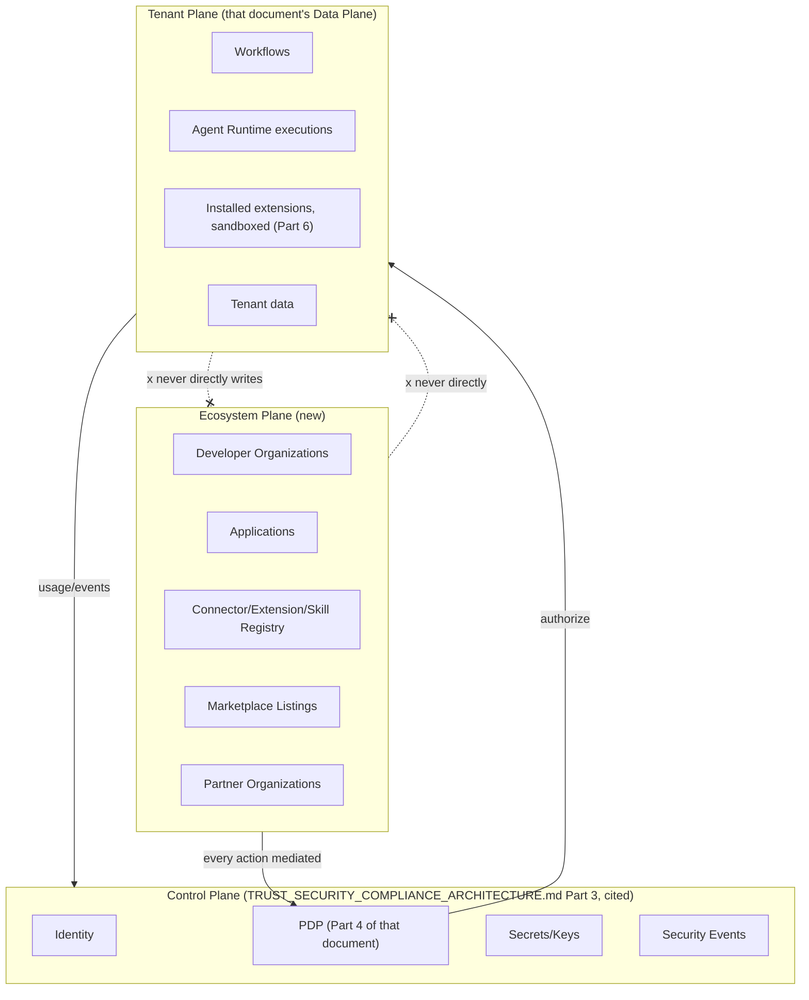

**Diagram 3 — Component Architecture by Plane**

```mermaid
flowchart LR
    subgraph EcoComponents["Ecosystem Plane components"]
        DEVPLATFORM2["Developer Platform (Part 3)"]
        MARKETPLACE3["Marketplace (Part 10)"]
        PARTNERPLATFORM["Partner Platform (Part 12)"]
        DEVPORTAL2["Developer Portal (Part 15)"]
    end
    subgraph ControlComponents["Control Plane components"]
        AUTHSYS2["AUTH_ARCHITECTURE.md"]
        POLICYENGINE["Policy Engine = existing PDP"]
        GOVMODEL["Governance Model (Part 18)"]
    end
    subgraph TenantComponents["Tenant Plane components"]
        APIGW["API Gateway (API_CONTRACT.md)"]
        INTEGRATIONPLAT["Integration Platform (Part 4)"]
        EVENTPLAT["Event Platform (Part 5)"]
        PLUGINRT["Plugin Runtime (Part 6)"]
        WORKFLOWPLAT["Workflow Platform (Part 9)"]
        AIPLAT2["AI Platform (AI_PLATFORM_ARCHITECTURE.md)"]
    end
    EcoComponents --> ControlComponents --> TenantComponents
```

### 2.3 End-to-End Reference Flow

**Diagram 4 — End-to-End: From Publisher to Executing Extension**

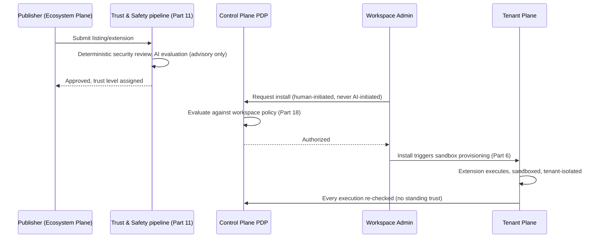

---

## Part 3 — Developer Platform

### 3.1 API Products (New)

**Why.** `API_CONTRACT.md` specifies one wire contract with URI versioning (`/v1/`); it does not productize that surface into independently-consumable, independently-rate-limited offerings suitable for external developer marketing and billing (`COMMERCIAL_INTELLIGENCE_ARCHITECTURE.md` Part 18, cited). An **API Product** is a curated, named subset of `API_CONTRACT.md`'s resource catalog (e.g., "Workflow API," "AI Employee API," "Data Export API"), each independently versioned, scoped, and lifecycle-managed, while every individual endpoint within it still obeys `API_CONTRACT.md`'s conventions unmodified.

| Field | Definition |
|---|---|
| `productId` | Unique identifier |
| `name`, `description` | Marketing-facing |
| `resourceScope` | The specific `API_CONTRACT.md` resource paths this product exposes |
| `versions` | One or more `ApiVersion` records (§3.2) |
| `defaultScopes` | The OAuth/API-key scopes (§3.4) this product grants by default |
| `rateLimitTier` | References `COMMERCIAL_INTELLIGENCE_ARCHITECTURE.md` §18.1's developer tier structure, cited |
| `lifecycleState` | Draft → Beta → GA → Deprecated → Retired |

### 3.2 API Versions & Lifecycle

Each API Product's versions follow `API_CONTRACT.md`'s existing URI-versioning convention (cited) with an explicit state machine layered on top: **Draft** (internal only) → **Beta** (opt-in, no backward-compatibility guarantee) → **GA** (`API_CONTRACT.md`'s existing deprecation-notice-period rule applies, cited) → **Deprecated** (sunset date published) → **Retired** (returns `410 Gone` per `API_CONTRACT.md`'s RFC 7807 error convention, cited).

### 3.3 Credential Types

Three distinct credential types, never conflated:

| Type | Cited or new | Delegation model | Typical holder |
|---|---|---|---|
| `ApiKey` | Cited, `API_CONTRACT.md` | Direct, non-delegated — the key *is* the authority | A workspace member automating their own access |
| **OAuth Application** | New | Delegated — a user explicitly authorizes a third-party app to act with a *subset* of their own permissions, via standard authorization-code flow | A third-party developer's published integration |
| **Service Account** | New | Non-human, non-delegated, scoped to a Developer Organization's own systems | A Developer Organization's backend automation |

**Why OAuth Applications and Service Accounts are new, distinct concepts.** `ApiKey` presumes the key-holder *is* the authorized party. A third-party application acting on behalf of a BizPilot AI customer is structurally different — the application never holds the customer's own credential, only a scoped, revocable delegation, exactly the distinction `TRUST_SECURITY_COMPLIANCE_ARCHITECTURE.md` §0.3's Security North Star requires (every actor has its own identity, never a borrowed one). A Service Account is distinct again: it belongs to the *developer*, not to any customer, and never carries delegated end-user authority at all.

### 3.4 Scopes & Permissions

Every credential type's authority is expressed as **scopes**, each scope mapping 1:1 to a Control Plane PDP permission check (`TRUST_SECURITY_COMPLIANCE_ARCHITECTURE.md` Part 4, cited) — restating that document's Tier 0 rule that no module invents custom permission logic: OAuth scopes are not a second authorization system, they are a **named, developer-facing alias for an existing PDP permission set**, resolved to the identical `Role`/`Permission` evaluation any first-party request receives.

### 3.5 Rate Limits & Quotas

Extends `API_CONTRACT.md`'s existing rate-limit tiers and `COMMERCIAL_INTELLIGENCE_ARCHITECTURE.md` §18.1's developer-tier structure (both cited) — a Developer Organization's effective rate limit is the minimum of its subscribed API Product's tier limit and any per-Application override (Part 18's governance-approved exceptions only, never self-service beyond published tiers).

### 3.6 Developer Organizations & Sandbox Environments

A **Developer Organization** is the top-level Ecosystem Plane entity a human or company registers under — distinct from a `Workspace` (`DATABASE.md`, cited), since a Developer Organization builds *for* the platform, a Workspace *uses* it (an entity can be both). Every Developer Organization is provisioned a **sandbox environment**: a fully isolated, `CLOUD_INFRASTRUCTURE.md` §2.1-pattern (cited) Ephemeral-Test-adjacent tenant with synthetic seed data (`ENGINEERING_STANDARDS.md` §10.22's synthetic-data discipline, cited), test-only credentials that can never touch production data, and no billing consequence (`COMMERCIAL_INTELLIGENCE_ARCHITECTURE.md` §16's Free-tier-adjacent cost posture, cited).

### 3.7 The Complete Developer Lifecycle

**Discover → Register → Create App → Configure → Sandbox → Test → Review → Approve → Production → Monitor → Upgrade → Deprecate.**

| Stage | Definition | Gate |
|---|---|---|
| Discover | Developer Portal (Part 15), API Explorer | None |
| Register | Developer Organization created | Standard signup verification (`AUTH_ARCHITECTURE.md`, cited) |
| Create App | An Application (OAuth app or service-account-holder) registered under the org | None — self-service |
| Configure | Scopes requested, redirect URIs, webhook endpoints declared | Requested scopes validated against §3.4's PDP-backed catalog |
| Sandbox | Sandbox credentials issued (§3.6) | Automatic |
| Test | Development against sandbox | None |
| Review | Application requests production access | Human review (Part 11.1's deterministic pipeline, scaled down for low-risk scope requests) |
| Approve | Production credentials issued | Reviewer sign-off, an auditable Control Plane event |
| Production | Live traffic | Rate-limited (§3.5), monitored (Part 16) |
| Monitor | Ongoing | Developer-facing usage dashboard (Part 15) |
| Upgrade | New API Product version adopted | Developer-initiated, backward-compatibility warnings surfaced (§3.2) |
| Deprecate | Application or its API Product version retired | Sunset-notice period, per `API_CONTRACT.md`'s existing deprecation policy, cited |

**What data it protects.** Every customer's data a third-party Application might request delegated access to — the Review/Approve gate exists specifically to prevent an under-scrutinized Application from reaching production with broader scope than its stated purpose justifies.

**What happens when it fails.** An Application operating outside its approved scope is detected identically to any other PDP-mediated authorization failure (`TRUST_SECURITY_COMPLIANCE_ARCHITECTURE.md` Part 4, cited) — refused, logged, and, on a repeated pattern, routed to Part 19's ecosystem-security detection.

**How detected.** Part 16's ecosystem observability, specifically developer-metrics scope-usage-vs-granted-scope monitoring.

**How recovered.** Application credential revocation (immediate, Control-Plane-enforced), developer notified with the specific violation.

**Cost.** A moderate one-time build (registration, review-queue tooling); ongoing cost scales with Application review volume.

**When built.** NOW horizon for Register/Create-App/Configure/Sandbox/Test (self-service, low-risk); Review/Approve gate is a launch blocker for any production OAuth Application (Tier 0-adjacent, since delegated third-party access to customer data is exactly the kind of action `TRUST_SECURITY_COMPLIANCE_ARCHITECTURE.md`'s trust model requires gating).

### 3.8 SDK Generation & Versioning

SDKs are generated from the API Product's OpenAPI-conformant contract (`ENGINEERING_STANDARDS.md` §6.10's generated-not-hand-written API documentation discipline, cited, extended to client SDKs) — never hand-maintained per language, preventing drift between the contract and what a generated client actually does. SDK version numbers track their source API Product version (§3.2), not an independent SDK-specific versioning scheme, so a developer can always reason "this SDK version speaks this API version" without a second mapping table.

**Diagram 5 — Developer Lifecycle: Discover to Deprecate**

```mermaid
flowchart LR
    DISCOVER["Discover"] --> REGISTER2["Register (Dev Org)"]
    REGISTER2 --> CREATEAPP["Create App"]
    CREATEAPP --> CONFIGURE2["Configure (scopes)"]
    CONFIGURE2 --> SANDBOX2["Sandbox"]
    SANDBOX2 --> TEST2["Test"]
    TEST2 --> REVIEW2["Review"]
    REVIEW2 -->|approved| APPROVE2["Approve"]
    REVIEW2 -->|rejected| CONFIGURE2
    APPROVE2 --> PRODUCTION2["Production"]
    PRODUCTION2 --> MONITOR2["Monitor"]
    MONITOR2 --> UPGRADE2["Upgrade"]
    UPGRADE2 --> DEPRECATE2["Deprecate"]
```

**Diagram 6 — Three Credential Types**

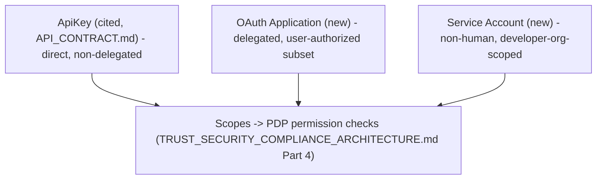

---

## Part 4 — Integration Platform

### 4.1 Purpose

`ENTERPRISE_INTELLIGENCE_ARCHITECTURE.md` Part 13 already names eleven specific connector-intelligence instances (ERP, CRM, Calendar, Email, Meeting, Document, etc., cited) and its §13.0 already establishes the binding OAuth-scoped-vs-sandboxed-plugin security distinction (cited, unchanged). This Part supplies the **generic contract** every one of those — and every future third-party-authored — connector implements, so adding a new integration (Google Workspace, Microsoft 365, Slack, Discord, Notion, Shopify, HubSpot, Salesforce, or any future vendor) is a contract-conformant registration, never vendor-specific platform engineering.

### 4.2 The Connector Contract

| Element | Definition |
|---|---|
| **Connector** | The registered, versioned definition of an integration's capabilities — metadata only, Ecosystem Plane |
| **Integration** | A specific Connector activated for a Developer Organization or workspace's use |
| **Credential** | The auth material an Integration holds, always routed through `TRUST_SECURITY_COMPLIANCE_ARCHITECTURE.md` Part 14's Secrets & Key Architecture (cited) — a Connector never stores its own credentials outside that system |
| **Connection** | A specific, workspace-scoped instantiation of an Integration with live Credentials — the unit that actually executes |
| **Capability** | A named unit of function a Connector exposes — either a Trigger or an Action |
| **Trigger** | An event source: the Connector observes an external system's state change and emits a platform Event (Part 5) |
| **Action** | A callable operation: the platform invokes the Connector to perform a side effect on the external system |
| **Webhook** | An inbound-delivery Trigger implementation — the external system pushes to BizPilot AI |
| **Polling** | An outbound-poll Trigger implementation — BizPilot AI periodically queries the external system, used only where the external system has no webhook capability |

### 4.3 Authentication, Secrets, and Resilience Requirements

Every Connector implementation is required (HARD REQUIREMENT) to support: **OAuth or API-key authentication** per the external system's own model (never a bespoke credential format the platform invents); **secret management** exclusively via the cited Secrets Architecture, never connector-local storage; **retry with exponential backoff and jitter** (`BACKEND_ARCHITECTURE.md` §9's resilience patterns, cited); **rate limiting** respecting both the external system's published limits and the platform's own outbound-call budget; **idempotency** for every Action (an Action's repeated invocation with the same idempotency key, `BACKEND_ARCHITECTURE.md` §8.5, cited, produces the identical external-system effect exactly once); **structured error handling** mapping the external system's error taxonomy onto `API_CONTRACT.md`'s RFC 7807 shape (cited); and **circuit breakers** (`BACKEND_ARCHITECTURE.md` §9, cited) isolating a failing external system from cascading into the platform's own request handling.

### 4.4 Connector Lifecycle

**Draft → Certified → Published → Deprecated → Retired**, following the identical trust-and-lifecycle discipline every extension type in this document shares (Part 6.5's general Extension lifecycle, of which Connector is one instance) — **Certified** specifically requires passing Part 11's deterministic security review (credential-handling audit, SSRF-protection verification per `TRUST_SECURITY_COMPLIANCE_ARCHITECTURE.md` Part 19, cited) before any workspace may create a live Connection against it.

**What data it protects.** Every external system a workspace connects — a Connector with a credential-handling defect could leak a customer's third-party OAuth token or, worse, be exploited as an SSRF vector into the platform's own internal network, which Part 19's ecosystem security architecture treats as its highest-priority integration-specific threat.

**What happens when it fails.** A Connector failing its resilience requirements (no backoff, no idempotency) degrades gracefully per `BACKEND_ARCHITECTURE.md` §9's existing circuit-breaker posture — the platform isolates the failing Connection, never lets one workspace's misbehaving integration degrade another's.

**How detected.** Part 16's connector-health observability (error rate, latency, circuit-breaker trip frequency per Connector).

**How recovered.** Connection-level retry/re-auth (customer-initiated for expired credentials), Connector-level certification revocation for a systemic defect (Part 11.6).

**Cost.** The Connector Contract itself is a specification, not infrastructure — cost is per-Connector implementation effort, first-party or third-party.

**When built.** NOW horizon for the contract definition and the first-party connectors `ENTERPRISE_INTELLIGENCE_ARCHITECTURE.md` Part 13 already named; third-party-authored Connectors are gated to when Part 3's Developer Platform and Part 11's review pipeline are both operational (SCALE horizon, Part 27).

**Diagram 7 — The Connector Contract**

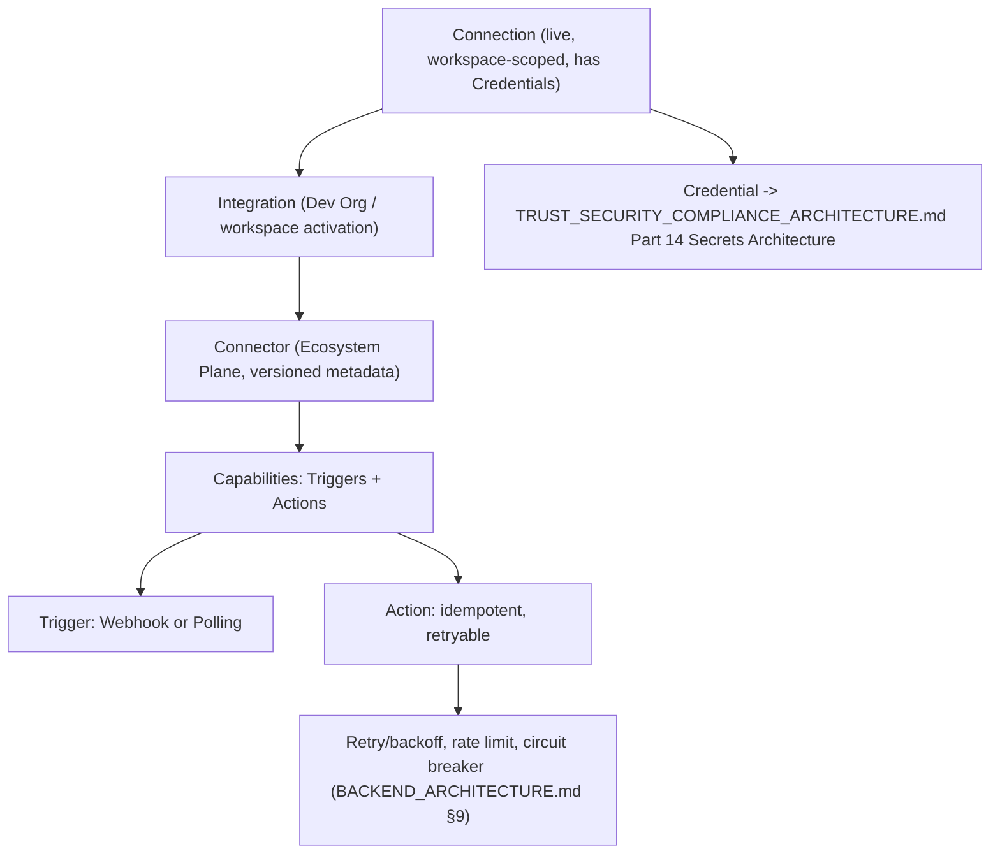

**Diagram 8 — Connector Lifecycle**

```mermaid
stateDiagram-v2
    [*] --> Draft: Registered in Ecosystem Plane
    Draft --> Certified: Passes Part 11 deterministic security review
    Certified --> Published: Listed, available for Connection creation
    Published --> Deprecated: Sunset notice issued
    Deprecated --> Retired: No new Connections; existing ones migrated or terminated
    Retired --> [*]
    Certified --> Draft: Certification revoked (systemic defect, §4.4)
```

---

## Part 5 — Event Platform

### 5.1 Purpose

`BACKEND_ARCHITECTURE.md` ADR-007 already designs the Event Bus against a Kafka-compatible mental model (event-type namespacing, consumer-group semantics, cited); `ENGINEERING_STANDARDS.md` §3.1 already establishes dot-namespaced event naming (cited); `COMMERCIAL_INTELLIGENCE_ARCHITECTURE.md` Part 26 already defines a specific commercial-event taxonomy on this transport (cited). This Part supplies the **generic envelope** every event category — domain, integration, webhook, internal, tenant, AI, commerce, marketplace, plugin, workflow — uses, so a consumer written against one category's shape understands the structural envelope of every other.

### 5.2 The Event Envelope

| Field | Definition |
|---|---|
| `eventId` | Globally unique, generated at emission |
| `eventType` | Dot-namespaced (`ENGINEERING_STANDARDS.md` §3.1, cited) — e.g., `connector.trigger.fired`, `marketplace.listing.published`, `skill.execution.completed` |
| `version` | The event type's own schema version (§5.6) |
| `tenantId` / `workspaceId` | `TENANT_CONTEXT` (`TRUST_SECURITY_COMPLIANCE_ARCHITECTURE.md` Part 5, cited) — mandatory for every tenant-scoped event, absent only for genuinely platform-global events (Part 17) |
| `actor` | The identity that caused the event — human, `AI_ID`, Application, Connector, or system process (extending `TRUST_SECURITY_COMPLIANCE_ARCHITECTURE.md` §4.2's actor field to every event category, not only metering) |
| `timestamp` | Emission time |
| `correlationId` | Links every event within one logical operation (`ENGINEERING_STANDARDS.md` §5.4's unified correlation-ID scheme, cited) |
| `causationId` | The specific `eventId` that directly caused this event, distinct from `correlationId` (which spans an entire operation) — enables exact causal-chain reconstruction, not only operation-level correlation |
| `payload` | The event-type-specific data |
| `schemaVersion` | The payload schema's own version, independent of `version` (which is the event type's semantic version) — allows payload-shape evolution to be tracked separately from event-type-meaning evolution |

### 5.3 Event Categories

| Category | Example event types | Producer |
|---|---|---|
| Domain events | `workspace.member.invited`, `deal.stage.changed` | Core application modules |
| Integration events | `connector.trigger.fired`, `connection.credential.expired` | Integration Platform (Part 4) |
| Webhook events | `webhook.delivery.succeeded`, `webhook.delivery.failed` | Event Platform's own delivery subsystem |
| Internal events | Backend-module-to-module, never externally exposed | `BACKEND_ARCHITECTURE.md` modules |
| Tenant events | `workspace.created`, `workspace.plan.changed` | Core platform |
| AI events | `agent.execution.completed`, `skill.execution.completed` | `AI_PLATFORM_ARCHITECTURE.md`, Part 7 |
| Commerce events | `SUBSCRIPTION_STARTED` et al. | `COMMERCIAL_INTELLIGENCE_ARCHITECTURE.md` Part 26, cited unchanged |
| Marketplace events | `marketplace.listing.published`, `marketplace.installation.completed` | Part 10 |
| Plugin events | `extension.installed`, `extension.suspended` | Part 6 |
| Workflow events | `workflow.run.started`, `workflow.run.completed` | Part 9 |

### 5.4 Delivery Semantics

**At-least-once delivery** is the platform-wide default (never exactly-once, which is not achievable without unacceptable latency cost at this architecture's scale) — every consumer is therefore required to be idempotent (restating `BACKEND_ARCHITECTURE.md` §8.5's discipline as binding on every event consumer, not only job handlers). **Ordering** is guaranteed only within a single `eventType` + `tenantId` partition (a Kafka-compatible partition-key convention, cited from ADR-007's mental model), never globally across event types — a consumer requiring cross-type ordering must derive it from `causationId` chains (§5.2), not assume transport-level global ordering.

### 5.5 Retry, Dead-Letter Handling, and Replay

A failed consumer delivery retries with exponential backoff (`BACKEND_ARCHITECTURE.md` §9, cited) up to a configured attempt ceiling, after which the event routes to a Dead Letter Queue, itself monitored (Part 16) and manually replayable — **replay is always idempotent-safe** by construction (§5.4's consumer-idempotency requirement), meaning a replayed event can never double-apply an effect, closing the identical risk class `COMMERCIAL_INTELLIGENCE_ARCHITECTURE.md` §33.1's Economic Safety invariants close for commerce events specifically, generalized here to every event category.

### 5.6 Schema Evolution

Restates `ENGINEERING_STANDARDS.md` §9.10–§9.12's event-schema governance (cited) as the binding rule for every event category in this Part: **additive-only within a `schemaVersion`**; a breaking payload change requires a new `schemaVersion`, with both versions co-existing during a deprecation window (mirroring `API_CONTRACT.md`'s API-deprecation-window convention, cited) — never an in-place breaking mutation a consumer might silently misinterpret.

### 5.7 Retention

Retention follows `TRUST_SECURITY_COMPLIANCE_ARCHITECTURE.md` Part 12's Data Classification-driven policy (cited) — commerce/security-relevant events inherit that document's Restricted/Critical-tier retention floors; general domain events follow a shorter, storage-cost-informed default (`CLOUD_INFRASTRUCTURE.md` §9.1's lifecycle-tiering precedent, cited), never uniform across every category.

**What data it protects.** Every downstream system this document and the twelve prior documents build on eventing — the envelope's correctness is what makes cross-system causal reconstruction (an incident investigation, an audit) actually possible.

**What happens when it fails.** An envelope missing a required field is rejected at the Event Bus boundary (fail closed, restating the platform-wide fail-closed default `TRUST_SECURITY_COMPLIANCE_ARCHITECTURE.md` establishes), never accepted with a null/inferred value that could silently corrupt downstream aggregation.

**How detected.** Envelope-validation rejection rate is itself a Part 16 observability metric.

**How recovered.** Producer-side fix and republish; no retroactive envelope repair for already-delivered events, consistent with the append-only philosophy this entire document series applies to event logs.

**Cost.** Reuses `BACKEND_ARCHITECTURE.md`'s existing Event Bus transport entirely — this Part's cost is the envelope schema and validation layer, not new infrastructure.

**When built.** NOW horizon — the envelope schema is foundational and is a launch blocker for any ecosystem capability (Parts 4, 6–10) that emits events, since none of those Parts' own observability or reconciliation guarantees hold without it.

**Diagram 9 — The Event Envelope**

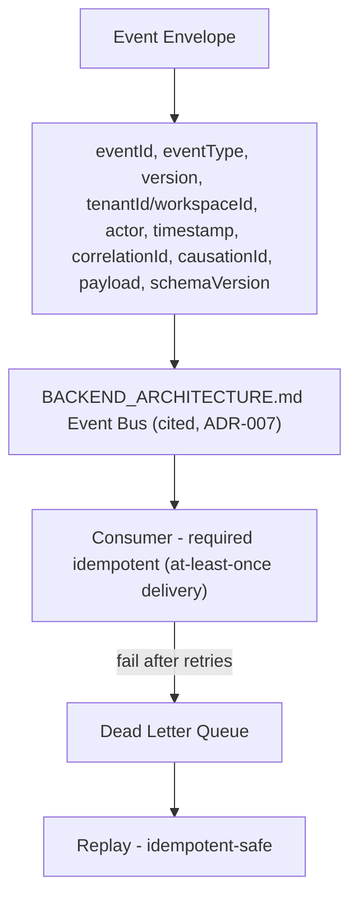

**Diagram 10 — Event Category Taxonomy**

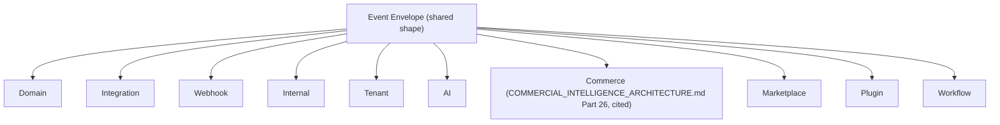

**Diagram 11 — Ordering & Partitioning**

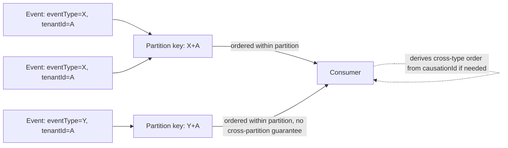

---

## Part 6 — Plugin / Extension Platform

### 6.1 The Absolute Rule

**Third-party code never executes inside the trusted application process (Tier 0, no exception).** This is not a new invariant — it is `BACKEND_ARCHITECTURE.md` ADR-005 (out-of-process/sandboxed plugin execution) and `FRONTEND_ARCHITECTURE.md` §14.1 (iframe/message-passing sandbox, narrow versioned slot API) restated as the single binding rule every extension type in this Part — plugin, AI Skill, connector, tool, workflow node, UI extension, data provider, automation action, AI Employee package, agent capability — must satisfy without exception.

### 6.2 The Extension Manifest

Every extension type shares one manifest shape (a HARD REQUIREMENT restating `TRUST_SECURITY_COMPLIANCE_ARCHITECTURE.md` §10.2's Tool Permission Manifest, generalized here to every extension category, not only AI Tools):

| Field | Definition |
|---|---|
| `extensionId` | Unique identifier |
| `identity` | The publisher/Developer Organization that authored it (§3.6, cited) |
| `permissions` | The exact RBAC permission set (`AUTH_ARCHITECTURE.md`, cited) it requires — never inferred, always declared |
| `scopes` | The specific resource scopes within those permissions (§3.4, cited) |
| `capabilities` | What the extension actually does — a Trigger/Action pair (Part 4) for a connector, a Tool for an AI-facing extension, a UI slot registration (`FRONTEND_ARCHITECTURE.md` §14.1, cited) for a UI extension |
| `version` | Semantic version, independently tracked from every other extension (§8.4's stated principle) |
| `lifecycle` | Draft → Certified → Published → Deprecated → Retired (§4.4's pattern, generalized) |
| `trustLevel` | Untrusted → Provisional → Verified → Elevated (§1.8, cited) — never System, which is reserved for first-party code |
| `resourceLimits` | CPU/memory/execution-time/network-egress bounds enforced by the sandbox runtime |
| `executionPolicy` | Synchronous vs. asynchronous, timeout behavior, retry policy |
| `dataAccessPolicy` | Exactly which Data Classification tiers (`TRUST_SECURITY_COMPLIANCE_ARCHITECTURE.md` Part 12, cited) it may touch, and under which purpose binding (§0.3's Security North Star, cited) |

### 6.3 Extension Taxonomy & Sandboxing Posture

Restates `TRUST_SECURITY_COMPLIANCE_ARCHITECTURE.md` §13.0's binding OAuth-scoped-vs-sandboxed distinction, generalized across every extension type this document covers:

| Extension type | Executes code? | Sandboxing posture |
|---|---|---|
| Plugin (general) | Yes | Out-of-process (`BACKEND_ARCHITECTURE.md` ADR-005) or iframe/message-passing (`FRONTEND_ARCHITECTURE.md` §14.1), per surface |
| AI Skill (Part 7) | No — a data/configuration package, not a runtime | N/A — inherits the sandboxing of whatever Tool/Connector it packages |
| Connector (Part 4) | Only if it includes custom transformation logic beyond declarative field mapping | Out-of-process, identical to Plugin |
| Tool (`AI_PLATFORM_ARCHITECTURE.md` §9, cited) | Yes, if third-party-authored | Out-of-process, per `TRUST_SECURITY_COMPLIANCE_ARCHITECTURE.md` Part 10's existing Tool Permission Manifest pipeline |
| Workflow node (Part 9) | Only if it wraps a custom Tool | Inherits that Tool's sandboxing |
| UI extension | Yes | Iframe/message-passing (`FRONTEND_ARCHITECTURE.md` §14.1) exclusively — never any other rendering path |
| Data provider | Only if custom-code-based; declarative providers execute no code | Out-of-process if code-based |
| Automation action | Yes, if custom | Out-of-process |
| AI Employee package (Part 8) | No — a configuration bundle over the existing Agent Runtime | N/A |
| Agent capability | Yes | Inherits Tool sandboxing |

### 6.4 Extension Lifecycle: Installation Through Uninstallation

**Installation → Activation → Authorization → Execution → Monitoring → Suspension → Revocation → Uninstallation.**

| Stage | Definition | Who initiates |
|---|---|---|
| Installation | The extension's manifest and code/config package are provisioned into a workspace's Tenant Plane, sandbox allocated | Human workspace admin only — never AI-initiated (Tier 0, restating `TRUST_SECURITY_COMPLIANCE_ARCHITECTURE.md` §7.3 item 9's prohibition against an AI granting another actor greater authority, applied here to installation itself) |
| Activation | The extension begins accepting Triggers/Tool calls | Automatic on successful Installation, unless the manifest declares a manual-activation requirement |
| Authorization | Every individual execution is re-checked against the Control Plane PDP (§2.2) — never a one-time, standing grant | Automatic, per-call |
| Execution | Runs within its declared `resourceLimits`/`executionPolicy`, sandboxed per §6.3 | Triggered by a Trigger, Tool call, or scheduled/event-driven invocation |
| Monitoring | Part 16's ecosystem observability tracks health, error rate, resource consumption | Automatic |
| Suspension | A detected policy violation or resource-limit breach halts the extension without uninstalling it | Automatic (Part 19's detection) or manual (admin/platform) |
| Revocation | The extension's Certified status is withdrawn platform-wide (Part 11.6) — distinct from Suspension, which is workspace-local | Platform Trust & Safety (Part 11) |
| Uninstallation | Workspace admin removes the extension; its data-access grants are revoked, its resources deprovisioned | Human workspace admin |

**What data it protects.** Every workspace's tenant-isolated data (`TRUST_SECURITY_COMPLIANCE_ARCHITECTURE.md` Part 5, cited) — the sandboxing and per-call re-authorization discipline is what prevents an installed-but-compromised extension from becoming a standing, unbounded access grant.

**What happens when it fails.** A sandbox escape attempt or resource-limit violation triggers automatic Suspension (§6.4) and is treated as a `TRUST_SECURITY_COMPLIANCE_ARCHITECTURE.md` Part 20 Incident, not merely a Part 19-of-this-document detection event, given the severity of a sandboxing-boundary violation.

**How detected.** Part 16's per-extension resource/error monitoring, plus the sandbox runtime's own boundary-enforcement telemetry.

**How recovered.** Suspended extensions require Trust & Safety review (Part 11) before reactivation; Revoked extensions are permanently removed from the catalog, with every installing workspace notified.

**Cost.** The sandbox runtime itself is largely already built (`BACKEND_ARCHITECTURE.md` ADR-005, `FRONTEND_ARCHITECTURE.md` §14.1, cited) — this Part's incremental cost is the unified Manifest schema and per-call re-authorization enforcement across every extension type uniformly.

**When built.** NOW horizon for the Manifest schema and lifecycle state machine (extending already-built sandboxing); third-party-authored extensions at any category beyond first-party-built ones are SCALE-horizon-gated (Part 27), identical to Part 4's Connector timing.

**Diagram 12 — Extension Manifest Structure**

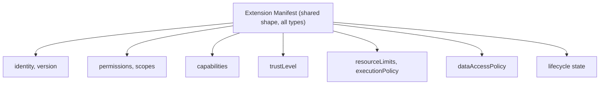

**Diagram 13 — Extension Lifecycle State Machine**

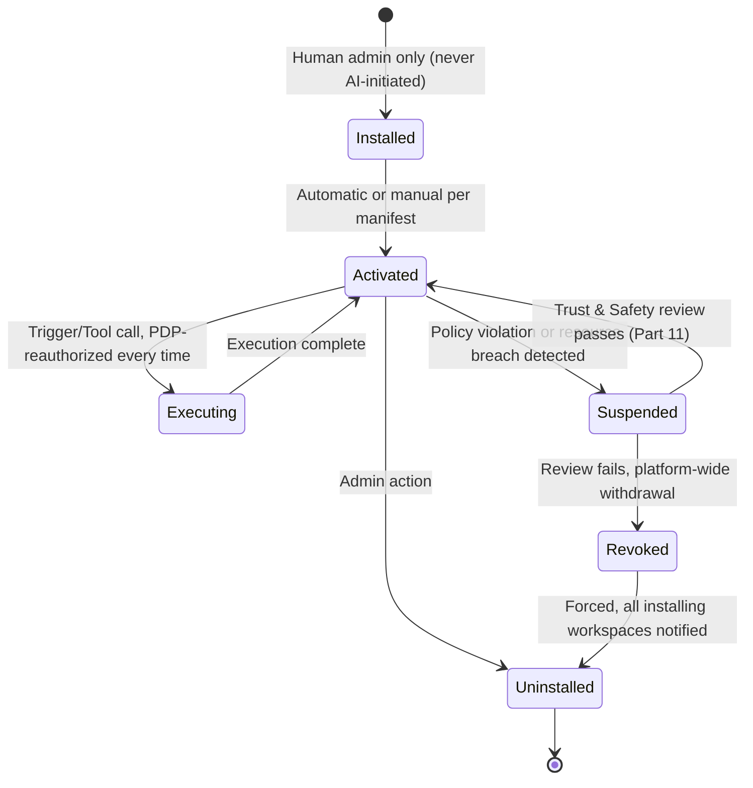

**Diagram 14 — Sandboxing Posture by Extension Type**

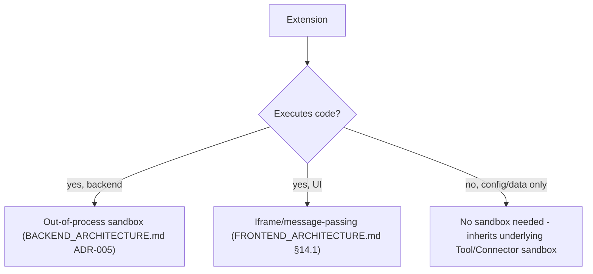

---

## Part 7 — AI Skill Ecosystem

### 7.1 What a Skill Is — and Is Not

**An AI Skill is a packaged, distributable configuration artifact — never a second execution runtime.** A Skill bundles prompts (`AI_PLATFORM_ARCHITECTURE.md` §3's Prompt Registry, cited), tools (that document's §9 Tool Registry, cited), knowledge sources (RAG/Memory, `TRUST_SECURITY_COMPLIANCE_ARCHITECTURE.md` Part 11, cited), workflows (Part 9), connectors (Part 4), and policies into one installable unit with a declared input schema, output schema, and evaluation criteria. When installed, a Skill **registers** its contents into the existing Prompt Registry, Tool Registry, and Workflow Engine — it never introduces a parallel place those things live, and it never grants itself execution capability beyond what those existing registries' own PDP-mediated authorization already governs.

### 7.2 Skill Composition

| Component | References |
|---|---|
| Prompts | `AI_PLATFORM_ARCHITECTURE.md` §3 Prompt Registry (cited) |
| Tools | That document's §9 Tool Registry, `TRUST_SECURITY_COMPLIANCE_ARCHITECTURE.md` Part 10's Tool Permission Manifest (cited) |
| Knowledge sources | RAG/Memory (`TRUST_SECURITY_COMPLIANCE_ARCHITECTURE.md` Part 11, cited) |
| Workflows | Part 9 of this document |
| Connectors | Part 4 of this document |
| Policies | The Business Rule Engine (`ENTERPRISE_INTELLIGENCE_ARCHITECTURE.md` §9.8, cited) constraints the Skill declares it operates within |
| Input/output schema | Skill-specific, validated at invocation (`ENGINEERING_STANDARDS.md` §15.2's boundary-validation discipline, cited) |
| Evaluation criteria | Feeds Part 7.4's testing/evaluation stage, extending `AI_PLATFORM_ARCHITECTURE.md`'s Model/Agent Evaluation (`ENGINEERING_STANDARDS.md` §10.19–§10.20, cited) |

### 7.3 Skill Lifecycle

**Creation → Testing → Evaluation → Publishing → Versioning → Installation → Execution → Monitoring → Rollback → Deprecation.**

| Stage | Definition | Gate |
|---|---|---|
| Creation | Authored (first-party or third-party developer) against the Skill schema (§7.2) | None |
| Testing | Run against a synthetic Evaluation Dataset (`ENGINEERING_STANDARDS.md` §10.21, cited) in a sandboxed context | None |
| Evaluation | Full AI Quality Gate (`ENGINEERING_STANDARDS.md` §16.7's five dimensions — quality, hallucination, safety, cost, latency, cited) — a HARD REQUIREMENT before publishing eligibility | Automated evaluation pipeline |
| Publishing | Submitted to Part 10's Marketplace pipeline for security/commercial review | Part 11's deterministic review |
| Versioning | Semantic version, independently tracked (§8.4) | N/A |
| Installation | Human workspace admin action only (§6.4, restated) | PDP-authorized |
| Execution | Every invocation routes through the identical Tool/Prompt PDP checks as any first-party capability | Automatic, per-call |
| Monitoring | Part 16 | Automatic |
| Rollback | GitOps-equivalent version revert (`CLOUD_INFRASTRUCTURE.md` §6.5's mechanism, cited, applied to Skill versions) | Admin or automatic on regression detection |
| Deprecation | Sunset notice, existing installations continue on their pinned version through the deprecation window | Publisher-initiated |

### 7.4 The Binding Constraints

Every Skill installation and execution is subject to, without exception:

1. **Workspace permissions** (`AUTH_ARCHITECTURE.md` RBAC, cited) — a Skill's declared Tools can only be invoked by an identity whose role already grants the underlying permission; the Skill grants nothing new.
2. **AI Authority limits** (`TRUST_SECURITY_COMPLIANCE_ARCHITECTURE.md` Part 7's Action Authority Matrix, `ENTERPRISE_INTELLIGENCE_ARCHITECTURE.md` §9.7's Autonomous Decision Levels, both cited) — a Skill's Tools inherit the invoking AI Employee's own Authority ceiling, never a Skill-specific elevated ceiling.
3. **Tenant isolation** (`TRUST_SECURITY_COMPLIANCE_ARCHITECTURE.md` Part 5, cited) — a Skill's knowledge-source access is `workspaceId`-scoped identically to any first-party retrieval.
4. **Trust levels** (§1.8, §6.2) — an Untrusted or Provisional-trust Skill's Tools default to the most conservative Action Authority ceiling (`TRUST_SECURITY_COMPLIANCE_ARCHITECTURE.md` Part 7's L0–L1) regardless of what the Skill's own manifest requests, until earned trust (Part 11) justifies more.
5. **Security policy** (`TRUST_SECURITY_COMPLIANCE_ARCHITECTURE.md` throughout, cited).
6. **Commercial policy** (`COMMERCIAL_INTELLIGENCE_ARCHITECTURE.md` Part 32, cited) — a Skill's usage is metered and billed identically to first-party AI usage, never a commercially-invisible side channel.

**AI must never self-grant capabilities (Tier 0, absolute).** No Skill installation, activation, or Authority-ceiling increase is ever initiated by an AI Employee acting autonomously — restating `TRUST_SECURITY_COMPLIANCE_ARCHITECTURE.md` §7.3's nine prohibited self-escalation paths as unconditionally binding on Skill installation specifically, the single most direct way an ungoverned Skill ecosystem could otherwise become a self-escalation vector.

**What data it protects.** Every workspace's data a Skill's bundled Tools/knowledge-sources might touch, and the AI Workforce's own authority-boundary integrity (`ENTERPRISE_INTELLIGENCE_ARCHITECTURE.md` Part 9, cited) — a Skill ecosystem that let installed capability silently expand an AI Employee's authority would undermine that document's central safety architecture.

**What happens when it fails.** A Skill found requesting authority beyond what its declared trust level permits is rejected at Evaluation (§7.3), never reaching Publishing; a Skill exploiting a runtime gap to exceed its bound is treated identically to Part 6.4's sandbox-violation Incident.

**How detected.** The identical PDP-mediated per-call authorization check (§7.4 item 1–2) that governs every other capability in the platform — no Skill-specific detection mechanism, by design, since a Skill-specific mechanism would itself be a second, parallel authorization system this document's principles forbid.

**How recovered.** Skill suspension/revocation (§6.4's general extension lifecycle, applied), Reasoning Trace review (`ENTERPRISE_INTELLIGENCE_ARCHITECTURE.md` §9.5, cited) for any action the Skill's Tools took before detection.

**Cost.** Reuses the Prompt Registry, Tool Registry, RAG/Memory, and Workflow Engine entirely — this Part's cost is the Skill packaging/bundling schema and its evaluation-pipeline integration, not new execution infrastructure.

**When built.** Skill packaging schema and first-party Skills are NOW-horizon; third-party Skill publishing is SCALE-horizon-gated (Part 27), identical timing to Connectors (Part 4) and general extensions (Part 6).

**Diagram 15 — AI Skill Composition**

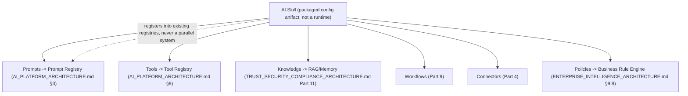

**Diagram 16 — AI Skill Lifecycle**

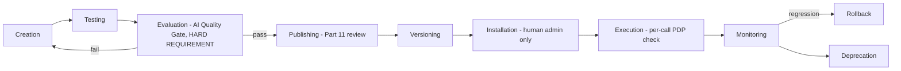

**Diagram 17 — Skill Authority Inheritance (Never Self-Elevated)**

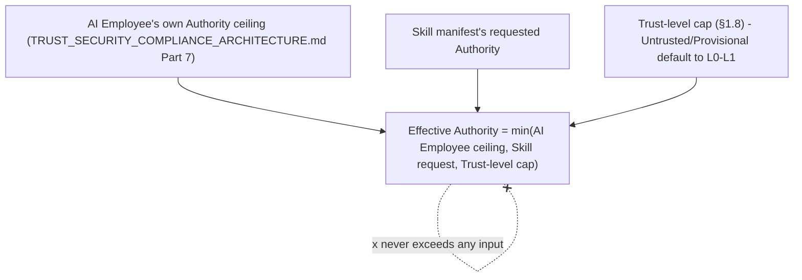

---

## Part 8 — AI Employee Ecosystem

### 8.1 Extending, Never Duplicating, the AI Workforce

`ENTERPRISE_INTELLIGENCE_ARCHITECTURE.md` Part 2 fully specifies AI Employees as named, role-scoped Agent Runtime instances occupying organizational seats (cited, unchanged). This Part's sole addition: **how an AI Employee definition becomes distributable** — as a first-party product, a workspace-custom employee, a marketplace employee, or a partner-created employee — without introducing a second agent framework, restating this phase's explicit mandate.

### 8.2 The Employee Package

| Field | Definition |
|---|---|
| `packageId` | Unique identifier |
| `identity` | The seat's `AI_ID` template (`TRUST_SECURITY_COMPLIANCE_ARCHITECTURE.md` §6.1, cited) |
| `role` | The organizational Mandate (`ENTERPRISE_INTELLIGENCE_ARCHITECTURE.md` §2.1, cited) |
| `skills` | Installed AI Skills (Part 7) the Employee draws on |
| `tools` | The Tool Registry entries within its authority |
| `knowledge` | Its Memory-tier scope (`ENTERPRISE_INTELLIGENCE_ARCHITECTURE.md` §3.5, cited) |
| `memory` | Same, restated for clarity given the mandate's explicit naming — no separate memory mechanism |
| `policies` | Business Rule Engine constraints (`ENTERPRISE_INTELLIGENCE_ARCHITECTURE.md` §9.8, cited) |
| `authority` | The default Autonomous Decision Level and Action Authority ceiling (both cited) a newly-installed instance starts at — always the most conservative default (`ENTERPRISE_INTELLIGENCE_ARCHITECTURE.md` ADR-EI-004, cited), never inherited at an elevated level from the package alone |
| `goals` | The role's stated objectives, informing Recommendation Engine prioritization (`ENTERPRISE_INTELLIGENCE_ARCHITECTURE.md` §9.1, cited) |
| `workflowAccess` | Which Workflows (Part 9) it may trigger or participate in |
| `approvalRequirements` | Inherited unconditionally from `TRUST_SECURITY_COMPLIANCE_ARCHITECTURE.md` §7.4's floor — a package can never declare an approval requirement *weaker* than that floor, only equal or stricter |
| `version` | Independently tracked (§8.4) |
| `publisher` | The authoring Developer Organization or first-party team |
| `trustLevel` | §1.8, cited |

### 8.3 Package Provenance Types

| Type | Definition | Trust starting point |
|---|---|---|
| First-party product | Authored by BizPilot AI itself (the existing AI Executive Team, PM, Researcher roles, `ENTERPRISE_INTELLIGENCE_ARCHITECTURE.md` §2.3–§2.14, cited) | System-adjacent, still subject to every Authority/Approval floor unchanged |
| Workspace-custom | A workspace's own Governance role (`ENTERPRISE_INTELLIGENCE_ARCHITECTURE.md` §15.1, cited) configures a Mandate variant for internal use only | Verified, workspace-scoped, never published externally without passing §7.3-equivalent evaluation |
| Marketplace employee | A third-party-authored package published for install by any workspace | Untrusted until Part 11 review |
| Partner-created | Authored under a Partner Organization's certification (Part 12) | Provisional, elevated faster than a general marketplace publisher given partner certification's added scrutiny (Part 12.4), never bypassing Part 11's deterministic gate entirely |

### 8.4 The Strict Boundary Table

Per this phase's explicit mandate — the single most important disambiguation in this document:

| Concept | What it is | What it is not |
|---|---|---|
| **AI Agent** (`AI_PLATFORM_ARCHITECTURE.md` §9) | The execution substrate — Planner→Executor→Critic→Reflection | Not itself named, seated, or role-scoped |
| **AI Employee** (`ENTERPRISE_INTELLIGENCE_ARCHITECTURE.md` Part 2) | A named Agent Runtime *instance* occupying an organizational seat, with RBAC-bound Authority | Not a new execution mechanism — it is a *configuration* of the Agent |
| **AI Skill** (Part 7) | A packaged, distributable bundle of Prompts+Tools+Knowledge+Workflows an Employee (or a workflow) can install and draw on | Not itself executable — it is data/config that registers into existing registries |
| **Tool** (`AI_PLATFORM_ARCHITECTURE.md` §9, `TRUST_SECURITY_COMPLIANCE_ARCHITECTURE.md` Part 10) | A single callable capability | Not a bundle — a Skill may contain many Tools |
| **Workflow** (Part 9) | An orchestrated sequence of steps, which may invoke Employees, Tools, or Skills as individual steps | Not an agent — it has no independent reasoning, only orchestration |
| **Integration/Connector** (Part 4) | The mechanism exposing an external system's data/actions as Tools/Triggers | Not an AI concept at all — purely a data/action bridge a Skill or Workflow may consume |

### 8.5 Marketplace and Partner Distribution

Installation, versioning, and commercial terms for marketplace and partner-created Employee packages follow Part 10's general Marketplace lifecycle and `COMMERCIAL_INTELLIGENCE_ARCHITECTURE.md` §11.2's existing AI Employee Economics (cited, unchanged) — this Part adds no second commercial model.

**What data it protects.** The AI Workforce's authority-boundary integrity — an Employee Package distribution model that let a marketplace publisher ship elevated default authority would directly undermine `ENTERPRISE_INTELLIGENCE_ARCHITECTURE.md`'s entire governance architecture, which is why §8.2's `authority` field is explicitly floor-bound, never publisher-configurable upward.

**What happens when it fails.** A package found declaring an authority level or approval-bypass beyond its trust level's ceiling fails Part 7.3-equivalent Evaluation before ever reaching Publishing.

**How detected.** Automated manifest validation (§8.2 fields checked against §1.8's trust-level ceilings) at submission time, never discovered only after installation.

**How recovered.** Rejected submission, publisher notified with the specific violated ceiling.

**Cost.** Reuses the entire Agent Runtime, RBAC, and Authority Matrix — this Part's cost is packaging/versioning tooling only.

**When built.** First-party product packaging is NOW-horizon (the existing AI Executive Team already ships this way, formalized here); workspace-custom packaging is NEXT-horizon; marketplace/partner distribution is SCALE-horizon-gated, identical timing to Parts 4 and 7.

**Diagram 18 — AI Employee Package Structure**

```mermaid
flowchart TB
    PACKAGE2["Employee Package"]
    PACKAGE2 --> IDENTITY4["identity, role, publisher, version, trustLevel"]
    PACKAGE2 --> CAPABILITY3["skills, tools, knowledge, memory, workflowAccess"]
    PACKAGE2 --> GOVERNANCE5["policies, authority (floor-bound), approvalRequirements (floor-bound)"]
    CAPABILITY3 --> REGISTRIES["Registers into existing Prompt/Tool/Skill/Workflow registries"]
    GOVERNANCE5 -.never weaker than TRUST_SECURITY_COMPLIANCE_ARCHITECTURE.md §7.4 floor.-> GOVERNANCE5
```

**Diagram 19 — Six-Concept Boundary Map**

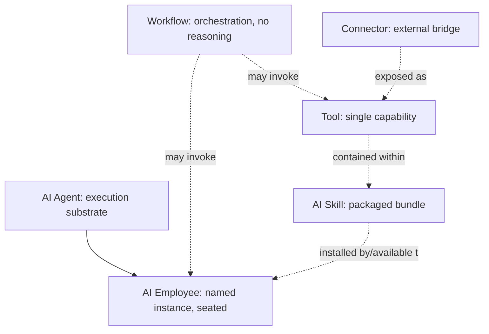

**Diagram 20 — Package Provenance & Trust Starting Points**

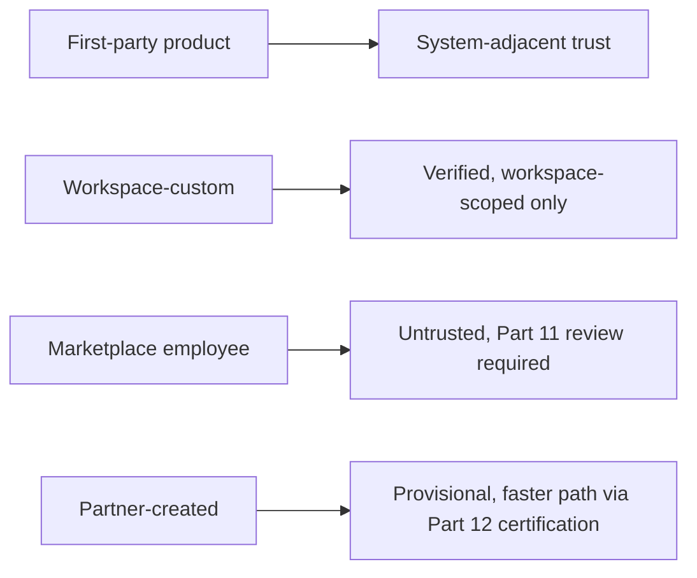

---

## Part 9 — Workflow Ecosystem

### 9.1 Marketplace-Compatible Workflow Model

Extends `BACKEND_ARCHITECTURE.md`'s Workflow Engine, `ENTERPRISE_INTELLIGENCE_ARCHITECTURE.md`'s Workflow Intelligence, `FRONTEND_ARCHITECTURE.md` §9.6's Builder UI, and `COMMERCIAL_INTELLIGENCE_ARCHITECTURE.md` Part 12's cost-class taxonomy (all cited, unchanged) with the packaging layer needed for third-party publication: a Workflow supports Triggers (§4.2's Trigger concept, or a schedule, or a platform Event, Part 5), Actions (Connector Actions, §4.2), Conditions and Branches (deterministic logic, `COMMERCIAL_INTELLIGENCE_ARCHITECTURE.md` §12.1's Deterministic Step cost class, cited), Loops (bounded, per `ENTERPRISE_INTELLIGENCE_ARCHITECTURE.md`'s abuse-prevention discipline against unbounded execution, `TRUST_SECURITY_COMPLIANCE_ARCHITECTURE.md` Part 7's margin-and-safety-adjacent bounded-iteration philosophy, cited), AI Nodes (invoking an AI Employee, Skill, or Tool — that document's remaining cost classes), Human Approval nodes (`ENTERPRISE_INTELLIGENCE_ARCHITECTURE.md` §9.6, cited), and Webhook/Schedule/Event triggers (Part 4–5).

### 9.2 Reusable Workflow Components

A **Workflow Component** is a named, versioned, independently-testable subgraph (a node or bounded cluster of nodes) publishable and reusable across Workflows — the Workflow-domain instance of §7.1's "package, don't build a second runtime" principle: a Component is data (a graph fragment definition), never a new execution engine, and its nodes execute through the identical Workflow Engine every first-party Workflow already uses.

### 9.3 Third-Party Publication

Third parties may publish: **Workflow templates** (a complete, installable Workflow definition), **Workflow nodes** (a single reusable Component, §9.2), **Integrations** (Part 4's Connectors, exposed as Action/Trigger nodes), and **AI actions** (a Skill's Tool, §7.2, exposed as an AI Node). Every published artifact follows Part 10's Marketplace lifecycle and Part 11's trust pipeline identically to any other extension category — Workflows carry no separate publication process.

### 9.4 Validation & Permission Requirements

A Workflow (first-party or published) is validated before activation for: **cycle detection** (`COMMERCIAL_INTELLIGENCE_ARCHITECTURE.md` §7.3's workflow-cycle-detection citation, extended here to design-time validation, not only runtime abuse detection), **permission-scope resolution** (every node's required permission is resolved and checked against the activating identity's actual RBAC grant *before* the Workflow is allowed to activate, never discovered mid-run), and **cost-class disclosure** (`COMMERCIAL_INTELLIGENCE_ARCHITECTURE.md` §12.2's cost estimator, cited, mandatory for any Workflow containing AI Nodes before a workspace may activate it).

**What data it protects.** Every resource a Workflow's nodes might touch — pre-activation permission resolution is what prevents a Workflow from silently attempting an unauthorized action mid-execution, which would otherwise only be caught reactively by the per-node PDP check (a correct but late safety net).

**What happens when it fails.** A Workflow failing validation is blocked from activation, never partially runnable.

**How detected.** Design-time validation (Builder UI, `FRONTEND_ARCHITECTURE.md` §9.6, cited) plus the identical runtime PDP check every node execution passes through regardless.

**How recovered.** Author corrects the Workflow definition; no partial-activation recovery path exists by design.

**Cost.** Reuses the existing Workflow Engine and Builder UI entirely.

**When built.** NOW horizon for validation and the Component model (already-necessary for first-party Workflow quality); third-party publication is SCALE-horizon-gated, identical timing to Parts 4, 7, and 8.

**Diagram 21 — Workflow Ecosystem Composition**

```mermaid
flowchart TB
    WORKFLOW5["Workflow"] --> TRIGGERNODE["Trigger nodes (Part 4/5)"]
    WORKFLOW5 --> ACTIONNODE["Action nodes (Part 4)"]
    WORKFLOW5 --> CONDITION2["Conditions/Branches"]
    WORKFLOW5 --> LOOP2["Loops - bounded"]
    WORKFLOW5 --> AINODE["AI Nodes (Employee/Skill/Tool, Parts 7-8)"]
    WORKFLOW5 --> APPROVALNODE["Human Approval nodes"]
    WORKFLOW5 --> COMPONENT2["Reusable Workflow Components (§9.2) - versioned subgraphs"]
```

**Diagram 22 — Workflow Publication & Validation Flow**

```mermaid
flowchart TB
    AUTHOR2["Workflow authored (first-party or third-party)"] --> VALIDATE2["Design-time validation: cycle detection, permission resolution, cost-class disclosure"]
    VALIDATE2 -->|fail| REJECT2["Blocked from activation"]
    VALIDATE2 -->|pass| PUBLISH3["Part 10 Marketplace lifecycle, if published"]
    PUBLISH3 --> INSTALL3["Installed into a workspace"]
    INSTALL3 --> ACTIVATE3["Activated - every node re-checked against PDP at runtime regardless"]
```

---

## Part 10 — Marketplace Architecture

### 10.1 Categories

AI Employees (Part 8), AI Skills (Part 7), Templates, Workflows (Part 9), Plugins/Extensions (Part 6), Connectors (Part 4), Integrations (Part 4), Knowledge Packs (RAG source bundles), Industry Solutions (a composed bundle spanning multiple categories, e.g., a vertical-specific set of Skills+Workflows+Connectors), Automation Packs (a Workflow-Component bundle, §9.2) — this list matches `COMMERCIAL_INTELLIGENCE_ARCHITECTURE.md` §19.2's item-type table exactly (cited, unchanged); this Part supplies the technical registration and lifecycle architecture those commercial terms operate on.

### 10.2 Core Entities

| Entity | Definition |
|---|---|
| Publisher | A Developer Organization or Partner Organization (Part 12) in good standing |
| Listing | The marketplace-facing presentation of a Product — description, screenshots, category |
| Product | The underlying installable artifact (an Employee Package, Skill, Connector, etc.) |
| Version | Independently tracked per Product (§8.4's principle, generalized) |
| Package | The bundled artifact (manifest + code/config) a specific Version resolves to |
| Pricing | `COMMERCIAL_INTELLIGENCE_ARCHITECTURE.md` §19.3, cited unchanged |
| Trial | A time-boxed or usage-boxed evaluation period, itself a `COMMERCIAL_INTELLIGENCE_ARCHITECTURE.md`-governed commercial construct |
| License | The terms under which an Entitlement (below) is granted |
| Installation | A workspace's activation of a specific Product Version |
| Entitlement | The record of what a workspace/Developer Organization is authorized to use, feeding the Control Plane PDP as a permission input |
| Review | Customer-authored, product-facing |
| Rating | Aggregate of Reviews |
| Refund | `COMMERCIAL_INTELLIGENCE_ARCHITECTURE.md` §19.3, cited unchanged |
| Payout | Same, cited unchanged |
| Revenue Share | Same, cited unchanged |
| Moderation | Part 11 |
| Trust Level | §1.8, cited |

### 10.3 The Complete Marketplace Lifecycle

**Draft → Validation → Security Review → AI Evaluation → Commercial Review → Published → Installed → Updated → Deprecated → Removed.**

| Stage | Definition | Owner |
|---|---|---|
| Draft | Publisher authors the Listing/Product | Publisher |
| Validation | Manifest schema conformance (§6.2), design-time checks (§9.4 for Workflows) | Automated |
| Security Review | Part 11's deterministic pipeline (package signing, malware scan, dependency analysis, permission review, sandbox validation) | Trust & Safety |
| AI Evaluation | For AI-capability Products: `ENGINEERING_STANDARDS.md` §16.7's five-dimension Quality Gate, `TRUST_SECURITY_COMPLIANCE_ARCHITECTURE.md` Part 24's AI Red Team corpus run against the submission (cited) | AI Team |
| Commercial Review | Pricing conformance to `COMMERCIAL_INTELLIGENCE_ARCHITECTURE.md` Part 32's governed floors, revenue-share terms confirmed | Finance/Product |
| Published | Listed, installable | Automatic on all prior gates passing |
| Installed | Workspace admin action (§6.4, restated) | Workspace admin |
| Updated | New Version submitted, re-enters at Validation for the delta (not a full re-review if the change is additive-only and passes an automated diff-risk check; a full re-review if the diff touches permissions/scopes/data-access) | Publisher, gated |
| Deprecated | Sunset notice, existing installs continue on pinned version | Publisher |
| Removed | Platform-initiated (Part 11.6 revocation) or publisher-initiated withdrawal | Trust & Safety or Publisher |

### 10.4 Why Every Gate Is Necessary

**What data it protects.** Every workspace that might install the Product — Security Review and AI Evaluation exist specifically because Validation alone (schema conformance) cannot detect a maliciously- or carelessly-authored package's actual runtime behavior.

**What happens when it fails.** A submission failing any gate is returned to Draft with the specific failure reason, never silently held in an ambiguous pending state.

**How detected.** Each gate is its own automated or human-reviewed checkpoint (Part 11 details Security Review's specific mechanisms).

**How recovered.** Publisher remediation and resubmission; a pattern of repeated failed submissions from one Publisher is itself a Part 11.6 trust-level-review trigger.

**Cost.** Review-pipeline tooling and, for Security/Commercial Review, human reviewer time scaling with submission volume — the primary reason third-party Marketplace publication is SCALE-horizon-gated (Part 27) rather than launched immediately: the review pipeline's own operational cost must be justified by real publisher demand.

**When built.** The full ten-stage lifecycle is designed NOW (this Part); it is exercised for first-party Products from NOW horizon (BizPilot AI's own AI Employees and Skills pass through the identical pipeline as a dogfooding discipline, restating §1.6's first-party/third-party shared-contract principle); third-party submission opens at SCALE horizon.

**Diagram 23 — Complete Marketplace Lifecycle**

```mermaid
flowchart LR
    DRAFT2["Draft"] --> VALIDATION2["Validation"]
    VALIDATION2 -->|fail| DRAFT2
    VALIDATION2 -->|pass| SECREVIEW["Security Review (Part 11)"]
    SECREVIEW -->|fail| DRAFT2
    SECREVIEW -->|pass| AIEVAL2["AI Evaluation (if AI capability)"]
    AIEVAL2 -->|fail| DRAFT2
    AIEVAL2 -->|pass or N/A| COMMREVIEW["Commercial Review"]
    COMMREVIEW -->|fail| DRAFT2
    COMMREVIEW -->|pass| PUBLISHED2["Published"]
    PUBLISHED2 --> INSTALLED2["Installed"]
    INSTALLED2 --> UPDATED2["Updated - delta re-review"]
    UPDATED2 --> PUBLISHED2
    PUBLISHED2 --> DEPRECATED2["Deprecated"]
    DEPRECATED2 --> REMOVED2["Removed"]
```

**Diagram 24 — Marketplace Core Entity Relationships**

```mermaid
erDiagram
    Publisher ||--o{ Listing : creates
    Listing ||--|| Product : presents
    Product ||--o{ Version : has
    Version ||--|| Package : "resolves to"
    Workspace ||--o{ Installation : performs
    Installation }o--|| Version : "installs specific"
    Installation ||--|| Entitlement : grants
    Product ||--o{ Review : receives
    Review }o--|| Rating : "aggregates into"
```

---

## Part 11 — Marketplace Trust & Safety

### 11.1 The Deterministic Security Review Pipeline

Nine checks, every one deterministic (rule-based or tool-based, never a subjective AI judgment call), restating `TRUST_SECURITY_COMPLIANCE_ARCHITECTURE.md` §8.3's "AI confidence must not override deterministic security policy" as binding on marketplace review specifically:

| Check | Method |
|---|---|
| Publisher verification | Identity confirmation (`AUTH_ARCHITECTURE.md`-equivalent verification, extended to Developer/Partner Organizations, §3.6/§12.2) |
| Package signing | Cryptographic signature over the Package artifact, verified before install — restates `TRUST_SECURITY_COMPLIANCE_ARCHITECTURE.md` §22.1's signature-verification requirement, generalized from base container images to every marketplace Package |
| Malware/dependency scanning | `ENGINEERING_STANDARDS.md` §12.7–§12.8's SCA/dependency scanning (cited), applied to Package contents |
| Permission review | The Manifest's declared `permissions`/`scopes` (§6.2) checked against the Product category's expected ceiling — a Knowledge Pack requesting FINANCIAL-category Tool access (`TRUST_SECURITY_COMPLIANCE_ARCHITECTURE.md` §10.3, cited) is an automatic rejection, not a judgment call |
| AI safety evaluation | §10.3's AI Evaluation stage, cited |
| Privacy review | Data Classification/purpose-binding conformance (`TRUST_SECURITY_COMPLIANCE_ARCHITECTURE.md` Part 12, §0.3, cited) |
| Data access review | The `dataAccessPolicy` field (§6.2) validated against the Product category's justified need |
| Sandbox validation | The Package is actually executed once in an isolated review sandbox to confirm its declared `resourceLimits`/`executionPolicy` (§6.2) match observed behavior |
| Version integrity / provenance | The Package's build provenance (`ENGINEERING_STANDARDS.md` §12.15, cited) traced to the signed source |

### 11.2 The Marketplace Trust Score

A composite indicator — **never the sole gate for any security-relevant decision.** Restating this Part's explicit constraint: **deterministic security policies remain authoritative.** The Trust Score is computed from §11.1's pass/fail results (weighted), installation-and-usage history, review/rating aggregate, and abuse-detection signal history (§11.4) — it informs *discovery ranking* and *review prioritization* (a low-scoring but still-passing Product gets closer human scrutiny on its next Update, §10.3), and it **never** substitutes for any individual §11.1 check passing on its own merits. A Product cannot buy, accumulate, or otherwise earn its way past a failed deterministic check via a high Trust Score.

### 11.3 Abuse Detection & Automated Suspension

Extends `TRUST_SECURITY_COMPLIANCE_ARCHITECTURE.md` Part 19's Detection categories with marketplace-specific patterns: anomalous installation velocity (a possible sign of incentivized/fake installs), review-manipulation patterns (`COMMERCIAL_INTELLIGENCE_ARCHITECTURE.md` RC-11's named risk, cited), and post-publish behavioral drift (a Product's runtime behavior diverging from what Sandbox Validation, §11.1, observed at review time — the single strongest signal of a supply-chain compromise introduced after initial approval). A high-confidence match triggers **automated Suspension** (§6.4's general extension-lifecycle mechanism, applied), never automated permanent Removal — permanent action always passes through human Trust & Safety review (§11.5).

### 11.4 Emergency Takedown

For the narrow case of a confirmed, actively-exploited vulnerability or active malicious behavior: immediate platform-wide Suspension of every installation of the affected Product Version, triggered by Trust & Safety without waiting for the standard review cadence — restating `TRUST_SECURITY_COMPLIANCE_ARCHITECTURE.md` Part 17's Break-Glass discipline (explicit reason required, minimal necessary scope, immediate alerting, fully audited, mandatory post-incident review) as the binding model for Emergency Takedown specifically.

### 11.5 Auditability

Every Trust & Safety action — a Suspension, a Revocation, a Trust Score change, an Emergency Takedown — is an audited Control Plane event (`TRUST_SECURITY_COMPLIANCE_ARCHITECTURE.md` §15.13, cited), never a silent catalog change a customer or publisher discovers only by the Product disappearing.

**What data it protects.** Every workspace in the ecosystem, transitively — the Marketplace is the single highest-leverage attack surface this document introduces, since one compromised, widely-installed Package could affect many tenants simultaneously (bounded, still, by Part 6's per-workspace sandboxing and tenant isolation, which is why a Marketplace compromise degrades to "many isolated single-tenant incidents," never a cross-tenant breach).

**What happens when it fails.** A Package that passes review but is later found malicious (a supply-chain compromise post-approval, `TRUST_SECURITY_COMPLIANCE_ARCHITECTURE.md` §29.2 T-25's named threat, cited) is contained by Part 6's per-installation sandboxing and detected by §11.3's behavioral-drift monitoring — the review pipeline reduces this risk, it cannot eliminate it, which is exactly why sandboxing (a runtime control) and review (a publish-time control) are both mandatory, neither alone sufficient.

**How detected.** §11.3's automated detection, publisher/customer-reported issues, and periodic re-scanning of already-Published Packages (not only at initial submission).

**How recovered.** Suspension → investigation → Revocation or reinstatement, per §6.4's lifecycle; affected workspaces notified per §11.5's auditability requirement.

**Cost.** The highest ongoing operational cost in this document — review-pipeline human time, sandbox-execution compute, and continuous re-scanning infrastructure, the primary justification for SCALE-horizon gating (Part 27).

**When built.** The full pipeline design is NOW (this Part); its exercise against first-party submissions is NOW; third-party submission — and therefore this pipeline's operation at real scale — is SCALE-horizon-gated.

**Diagram 25 — Nine-Check Deterministic Security Review Pipeline**

```mermaid
flowchart TB
    SUBMIT2["Package submitted"] --> PUBVERIFY["Publisher verification"]
    PUBVERIFY --> SIGN2["Package signing check"]
    SIGN2 --> MALWARE["Malware/dependency scan"]
    MALWARE --> PERMREVIEW["Permission review"]
    PERMREVIEW --> AISAFETY2["AI safety evaluation"]
    AISAFETY2 --> PRIVACY2["Privacy review"]
    PRIVACY2 --> DATAREVIEW["Data access review"]
    DATAREVIEW --> SANDBOXVAL["Sandbox validation"]
    SANDBOXVAL --> PROVENANCE2["Version integrity / provenance"]
    PROVENANCE2 -->|all pass| APPROVED2["Approved, Trust Level assigned"]
    PUBVERIFY & SIGN2 & MALWARE & PERMREVIEW & AISAFETY2 & PRIVACY2 & DATAREVIEW & SANDBOXVAL & PROVENANCE2 -->|any fail| REJECTED2["Rejected - deterministic, non-negotiable"]
```

**Diagram 26 — Trust Score: Informative, Never Authoritative**

```mermaid
flowchart TB
    DETERMINISTIC["Nine deterministic checks (§11.1)"] --> GATE2{"All pass?"}
    GATE2 -->|no| BLOCKED2["Blocked - Trust Score irrelevant"]
    GATE2 -->|yes| SCORE2["Trust Score computed: weighted checks + history + ratings + abuse signals"]
    SCORE2 --> RANKING["Discovery ranking, review prioritization"]
    SCORE2 -.x never overrides a failed check.-x GATE2
```

**Diagram 27 — Suspension, Revocation & Emergency Takedown**

```mermaid
stateDiagram-v2
    [*] --> Published2: Passed all gates
    Published2 --> Suspended2: Automated detection (§11.3) or manual
    Published2 --> EmergencyTakedown: Confirmed active exploit (§11.4)
    EmergencyTakedown --> Suspended2: Immediate, all installs, audited
    Suspended2 --> Reinstated: Trust & Safety review passes
    Suspended2 --> Revoked2: Review fails
    Reinstated --> Published2
    Revoked2 --> [*]
```

---

## Part 12 — Partner Platform

### 12.1 Partner Types

| Type | Definition |
|---|---|
| Technology partners | Build Connectors/Integrations (Part 4) at platform scale, often with a co-marketing relationship |
| Implementation partners | Deploy/configure BizPilot AI for end customers, typically without publishing marketplace Products themselves |
| Agencies | Manage multiple customer workspaces on customers' behalf (§12.5's Partner Workspaces) |
| Consultants | Individual or small-firm advisory, typically operating within a customer's own workspace under delegated access |
| Solution providers | Build Industry Solutions (§10.1) combining multiple Product categories |
| Strategic partners | Deeper commercial/technical relationships, potentially including White-Label/OEM terms (Part 13) |
| Marketplace publishers | Any Developer Organization (§3.6) that has also achieved Partner certification (§12.4) — not every Publisher is a Partner, but every certified Partner publishing is a Publisher |

### 12.2 Core Entities

| Entity | Definition |
|---|---|
| Partner Organization | The top-level Ecosystem Plane entity, distinct from a Developer Organization (§3.6) — a Developer Organization builds; a Partner Organization additionally *represents customer relationships* on the platform |
| Partner Users | Individuals under a Partner Organization, RBAC-scoped (`AUTH_ARCHITECTURE.md`, cited) to their specific role (technical, commercial, support) |
| Partner Apps | The Applications (§3.3) a Partner Organization operates, following the identical Developer Platform lifecycle (§3.7) |
| Partner Credentials | Service Accounts (§3.3) scoped to the Partner Organization, never to an individual Partner User, so credential lifecycle survives personnel changes |
| Partner Workspaces | Customer workspaces a Partner Organization has delegated access to — always via `TRUST_SECURITY_COMPLIANCE_ARCHITECTURE.md` Part 16's `SupportAccessGrant`-equivalent mechanism (time-boxed, purpose-bound, auditable), **never** a standing administrative relationship, restating that document's Tier 0 "internal access is temporary" principle as binding on partner access too, not only BizPilot AI's own internal staff |
| Partner Entitlements | What a Partner Organization is commercially authorized for (`COMMERCIAL_INTELLIGENCE_ARCHITECTURE.md` Part 17's dimension-based Enterprise model, cited, extended to partner-tier terms) |
| Partner Revenue Share | `COMMERCIAL_INTELLIGENCE_ARCHITECTURE.md` §19.3, cited unchanged |
| Partner Support | A dedicated support tier, commercially defined by that same document |
| Partner Certification | §12.4 |

### 12.3 Partner Workspace Access — the Same PAM Discipline, Extended

**Why this matters architecturally.** A naive Partner Platform design would grant an implementation partner or agency standing admin access to every managed customer workspace — exactly the "internal access is temporary" violation `TRUST_SECURITY_COMPLIANCE_ARCHITECTURE.md` Part 16 was built to prevent for BizPilot AI's own staff. This document extends that identical discipline to partners: a Partner Workspace relationship is a **recurring, renewable `SupportAccessGrant`-equivalent**, not a one-time standing grant — the customer (workspace owner) remains the sole party who can authorize it, and every action a Partner User takes under it is individually logged and linked to the grant record, identical to that document's §16.3 mechanism.

### 12.4 Partner Certification

A distinct, higher-scrutiny review track than general Developer Organization registration (§3.7): technical competency validation (a certification exam or reviewed sample Product), commercial-terms agreement (`COMMERCIAL_INTELLIGENCE_ARCHITECTURE.md` Part 32-governed), and a standing (not one-time) compliance-review cadence matching `TRUST_SECURITY_COMPLIANCE_ARCHITECTURE.md` §26.2's Control Registry review discipline (cited). Certification is what earns a Partner-published Product a faster Trust-review path (§8.3's table) — never a *skipped* Security Review (§11.1), only a shorter Commercial Review given the certification's own already-vetted commercial standing.

### 12.5 Partner Onboarding & Lifecycle

**Discover → Apply → Certification Review → Certified → Active → Compliance Review (recurring) → Suspended (on violation) → Terminated (on repeated/severe violation).** Mirrors §3.7's Developer lifecycle and §10.3's Marketplace lifecycle shape deliberately — this document uses one recurring lifecycle pattern (Draft/Apply → Review → Active/Published → Suspended → Terminated/Removed) across every ecosystem participant type, rather than inventing a bespoke shape per participant category.

**What data it protects.** Every Partner Workspace's customer data — §12.3's grant-based discipline is this Part's central protection, given partners are structurally the ecosystem participant with the deepest, most sensitive access to customer environments.

**What happens when it fails.** A Partner Organization found operating outside a granted workspace's scope is treated identically to `TRUST_SECURITY_COMPLIANCE_ARCHITECTURE.md` §20.8's Insider Threat playbook (cited) — Partner access is architecturally not a lesser-scrutiny category than internal staff access, it is held to the identical standard.

**How detected.** §12.3's per-action audit log, reviewed at the standing compliance cadence (§12.4).

**How recovered.** Grant revocation, Partner Certification suspension pending investigation, customer notification.

**Cost.** Certification review and ongoing compliance-review cadence — a real, recurring Trust & Safety cost, scaling with Partner count.

**When built.** Partner Organization registration and basic Partner Apps are NEXT-horizon; Partner Workspace access (the highest-sensitivity capability) and full Certification are ENTERPRISE-horizon-gated (Part 27), given both the compliance-tooling maturity and real partner-demand thresholds that phase implies.

**Diagram 28 — Partner Platform Entity Model**

```mermaid
erDiagram
    PartnerOrganization ||--o{ PartnerUsers : employs
    PartnerOrganization ||--o{ PartnerApps : operates
    PartnerOrganization ||--o{ PartnerCredentials : holds
    PartnerOrganization ||--o{ PartnerWorkspaceGrant : "requests access via"
    Workspace ||--o{ PartnerWorkspaceGrant : authorizes
    PartnerWorkspaceGrant }o--|| SupportAccessGrant_pattern : "extends TRUST_SECURITY_COMPLIANCE_ARCHITECTURE.md Part 16 pattern"
```

**Diagram 29 — Partner Onboarding & Lifecycle**

```mermaid
flowchart LR
    DISCOVER2["Discover"] --> APPLY2["Apply"]
    APPLY2 --> CERTREVIEW["Certification Review (§12.4)"]
    CERTREVIEW -->|pass| CERTIFIED2["Certified"]
    CERTREVIEW -->|fail| APPLY2
    CERTIFIED2 --> ACTIVE2["Active"]
    ACTIVE2 --> COMPLIANCEREVIEW["Compliance Review (recurring)"]
    COMPLIANCEREVIEW -->|pass| ACTIVE2
    COMPLIANCEREVIEW -->|violation| SUSPENDED3["Suspended"]
    SUSPENDED3 -->|remediated| ACTIVE2
    SUSPENDED3 -->|severe/repeated| TERMINATED2["Terminated"]
```

---

## Part 13 — White-Label / OEM Platform

### 13.1 Three Distinct Concepts, Precisely Separated

Per this phase's explicit mandate, and resolving a terminology point worth stating plainly: `FRONTEND_ARCHITECTURE.md` §3.7–§3.8 already ships a mechanism it names "White-label Support" — a runtime, token-driven, narrow-allowlist brand override per workspace (cited, unchanged). **This document reserves the term "Tenant Branding" for that exact, already-built mechanism**, and defines "White-Label/OEM" as a distinct, heavier-weight capability this Part introduces new architecture for. This is a terminology refinement, not a contradiction — logged as finding CDA-P02 in Part 26.

| Concept | Definition | Underlying mechanism |
|---|---|---|
| **Tenant Branding** | A single workspace's own logo/color/product-name override within the standard BizPilot AI product | `FRONTEND_ARCHITECTURE.md` §3.5–§3.8's Theme Engine, cited unchanged — this document adds nothing here |
| **White-Label** | An entire *class* of workspaces (typically all workspaces under a Partner Organization's Entitlement) presented without visible BizPilot AI branding at all — no "powered by," fully partner-branded, but still running on shared or Enterprise-Isolated infrastructure the partner does not operate | New in this document |
| **OEM Distribution** | A Partner Organization resells BizPilot AI's capability under its own product name, with its own customer relationship, its own support tier, and — at the deepest level — its own dedicated infrastructure (`CLOUD_INFRASTRUCTURE.md` §2.1's Enterprise-Isolated pattern, cited) the partner may operate certain aspects of | New in this document |

### 13.2 White-Label Coverage

Custom domains (DNS delegation, `CLOUD_INFRASTRUCTURE.md` §3.2, cited, extended to partner-controlled domains), full branding (extends Tenant Branding's allowlist with additional fields specific to white-label terms — a wider but still-governed allowlist, never unrestricted, preserving `FRONTEND_ARCHITECTURE.md` §3.5's accessibility-guarantee rationale for keeping most tokens fixed), custom email (transactional email sending domain/branding), custom marketplace (a partner-curated subset of the platform Marketplace catalog, §10, never a fully independent catalog — Part 17's GLOBAL-catalog architecture applies), custom AI Employees (partner-published Employee Packages, §8.3, pre-installed as the white-labeled offering's default roster), custom integrations (partner-specific Connectors, Part 4), custom policies (within Part 18's Non-Overridable/Platform-Default/Tenant-Configurable/Developer-Configurable classification — white-label partners get Tenant-Configurable-tier latitude, never Non-Overridable-tier override), tenant-specific feature sets (a curated `COMMERCIAL_INTELLIGENCE_ARCHITECTURE.md` Part 9-pattern plan matrix, partner-negotiated), regional deployment and data residency (`CLOUD_INFRASTRUCTURE.md` §13.4, `ENTERPRISE_INTELLIGENCE_ARCHITECTURE.md` §14.5, cited unchanged).

### 13.3 What White-Label/OEM Never Overrides

Restates this document's own §1.6 first-party/third-party shared-contract principle at its strongest test case: a white-labeled or OEM-distributed instance still runs on the identical Control Plane, tenant isolation, RBAC, Authority Matrix, and Economic Safety invariants as any directly-branded BizPilot AI workspace. White-labeling changes *presentation and commercial packaging*; it never changes *trust architecture*.

**What data it protects.** Every end-customer of a white-label/OEM partner — the guarantee that "you can't tell it's BizPilot AI" never implies "the security/tenant-isolation guarantees are also hidden or weakened."

**What happens when it fails.** A white-label configuration found granting Non-Overridable-tier policy latitude is a Part 18 governance violation, treated with the identical severity as any other policy-tier breach.

**How detected.** Part 18's policy-tier enforcement is itself PDP-mediated (`TRUST_SECURITY_COMPLIANCE_ARCHITECTURE.md` Part 4, cited) — a white-label configuration attempt beyond its allowed tier fails at the same authorization layer any other over-broad request would.

**How recovered.** Configuration rejected at request time; no white-label-specific recovery path needed given the request never succeeds.

**Cost.** Custom domain/DNS provisioning and email-sending-domain setup are the primary incremental infrastructure costs (`CLOUD_INFRASTRUCTURE.md` §3.2, cited); OEM-tier dedicated infrastructure follows that document's existing Enterprise-Isolated cost model.

**When built.** Tenant Branding is already shipped (`FRONTEND_ARCHITECTURE.md`, cited). White-Label is ENTERPRISE-horizon-gated (Part 27) — trigger: a specific signed partner contract requiring it, never built speculatively. OEM Distribution is GLOBAL-horizon-gated, the heaviest-weight capability in this entire document.

**Diagram 30 — Three Branding/Distribution Concepts**

```mermaid
flowchart TB
    TENANTBRAND["Tenant Branding (FRONTEND_ARCHITECTURE.md §3.5-3.8, shipped) - single workspace, narrow allowlist"]
    WHITELABEL2["White-Label (new, Enterprise-horizon) - workspace class, no BizPilot branding, shared/isolated infra"]
    OEM2["OEM Distribution (new, Global-horizon) - partner's own product, own customer relationship, dedicated infra"]
    TENANTBRAND -.narrowest scope.-> SCOPE2["Scope"]
    WHITELABEL2 -.broader.-> SCOPE2
    OEM2 -.broadest, heaviest.-> SCOPE2
    TENANTBRAND & WHITELABEL2 & OEM2 -.never override.-x TRUSTARCH["Trust architecture: Control Plane, tenant isolation, RBAC, Authority Matrix, Economic Safety"]
```

---

## Part 14 — Ecosystem Commerce

### 14.1 The Binding Constraint

**`COMMERCIAL_INTELLIGENCE_ARCHITECTURE.md` remains the sole source of billing truth. This document adds no billing mechanism, no new pricing engine, and no parallel accounting path.** Every commerce concept this phase's mandate names — marketplace purchases, subscriptions, usage billing, publisher payouts, revenue sharing, refunds, credits, commissions, taxes, partner revenue, enterprise contracts — is already fully specified by that document's Parts 5–8, 17, 19, and 33 (cited, unchanged). This Part's only job is the **integration boundary**: how ecosystem-specific events (Part 5) feed that document's existing `CommercialEvent` model and `ProfitabilitySnapshot`/`CostSnapshot` rollups, without ever computing a competing figure.

### 14.2 Ecosystem Commerce Integration Points

| Ecosystem concept | Feeds this `COMMERCIAL_INTELLIGENCE_ARCHITECTURE.md` mechanism |
|---|---|
| Marketplace purchase (Part 10) | `CommercialEvent` (that document's Part 26), specifically the marketplace-transaction event type its Part 19.3 already defines |
| Publisher payout | That document's §19.3 payout mechanism, unchanged |
| Revenue share (Marketplace and Partner) | That document's §19.3 and this document's §12.2's `Partner Revenue Share`, both resolving through the identical `CommercialEvent`-driven reconciliation (§33.1 of that document) |
| Developer Platform usage billing | That document's §18.1–§18.2 tier/metering model, unchanged — this document's API Products (§3.1) map onto that model's existing dimensions, never introducing a second metering unit |
| Extension/Skill/Connector usage cost | Routes through `UsageMeter` (that document's §27.3) with `feature`/`action` values namespaced per this document's event taxonomy (§5.3) — the metering *shape* is unchanged, only new `feature` values are registered |
| Partner Entitlements | That document's Part 17 dimension-based Enterprise pricing, extended (not redesigned) with partner-specific dimensions negotiated per §12.2 |
| Taxes | Out of scope for both documents — `COMMERCIAL_INTELLIGENCE_ARCHITECTURE.md` RC-51 already names this as an open, GLOBAL-horizon gap; this document adds no tax architecture and inherits that same open status |

### 14.3 Ecosystem Commerce Projections

The only genuinely new artifact this Part introduces: **ecosystem GMV** (Gross Merchandise Value — the total transaction volume flowing through the Marketplace, distinct from BizPilot AI's own platform *revenue*, which is only its take rate of that GMV) and **publisher-facing revenue projections**, both computed as read-only rollups over `COMMERCIAL_INTELLIGENCE_ARCHITECTURE.md`'s existing `ProfitabilitySnapshot`/event data — never a second ledger. Detailed fully in Part 22's ecosystem economics.

**What data it protects.** Billing/financial truth itself — this Part's entire design goal is adding zero new attack surface or reconciliation risk to `COMMERCIAL_INTELLIGENCE_ARCHITECTURE.md` Part 33's eight Economic Safety invariants, by construction (no new write path into financial truth).

**What happens when it fails.** Any ecosystem-commerce integration found writing to billing state through a path other than that document's existing `CommercialEvent` mechanism is a Critical-severity finding, identical in severity to that document's own invariant violations (§33.2 of that document, cited).

**How detected.** That document's continuous reconciliation (§8.2, §26, §29 of that document, cited) — unchanged, now also covering ecosystem-sourced events since they use the identical envelope and event pipeline.

**How recovered.** Per that document's existing recovery mechanisms — this Part introduces none of its own.

**Cost.** Namespace/taxonomy registration only — no new financial infrastructure.

**When built.** NOW horizon for the integration-point mapping (§14.2); GMV/publisher-projection rollups activate only once Part 10's Marketplace itself is SCALE-horizon-active, since a GMV figure over zero transactions is meaningless.

**Diagram 31 — Ecosystem Commerce: Integration Boundary, Not a New Ledger**

```mermaid
flowchart TB
    subgraph Ecosystem2["This document's ecosystem events"]
        MARKETTXN["Marketplace transaction"]
        PARTNERSHARE["Partner revenue share"]
        DEVUSAGE["Developer Platform usage"]
        EXTUSAGE["Extension/Skill/Connector usage"]
    end
    Ecosystem2 -->|"feeds via existing CommercialEvent envelope"| COMMERCIALTRUTH["COMMERCIAL_INTELLIGENCE_ARCHITECTURE.md - sole billing truth (Parts 5-8, 17, 19, 33)"]
    COMMERCIALTRUTH --> PROFITSNAP4["ProfitabilitySnapshot, CostSnapshot (unchanged)"]
    PROFITSNAP4 --> GMV2["Ecosystem GMV projection (new, read-only rollup)"]
    Ecosystem2 -.x never a second ledger, never a second write path.-x COMMERCIALTRUTH
```

---

## Part 15 — Developer Experience

### 15.1 Developer Portal

The unified, public-facing surface for every Part 3 capability — rendered as its own dedicated experience (not merely `FRONTEND_ARCHITECTURE.md`'s authenticated Dashboard Shell, since a prospective developer evaluating the platform is Untrusted/pre-authentication, §1.8) but sharing that document's design system (`design-system/` tokens/components, cited) for visual consistency.

### 15.2 Developer Experience Components

| Component | Purpose | Cited or new |
|---|---|---|
| API Explorer | Interactive, live-request-capable API documentation | New, generated from the API Product contract (§3.1, §3.8) |
| SDK documentation | Per-language, generated (§3.8, cited) | New surface, generated content |
| CLI | Scaffolding, local sandbox management, deployment of extensions/Skills | New — mirrors `ENGINEERING_STANDARDS.md` §11.11's internal Developer CLI philosophy, extended to external developers |
| Local development | Docker-Compose-pattern local stack (`CLOUD_INFRASTRUCTURE.md` §2.1's Local-tier pattern, cited, extended to a public-facing "run BizPilot AI's sandbox API locally against synthetic data" offering) | New surface, cited pattern |
| Sandbox | §3.6, cited | — |
| Test data | Synthetic seed data (`ENGINEERING_STANDARDS.md` §10.22, cited) | — |
| Webhook inspector | Live view of inbound webhook deliveries (Part 4.2) with replay capability | New |
| Logs | Application-scoped log access, `TRUST_SECURITY_COMPLIANCE_ARCHITECTURE.md` Part 12's Data-Classification-aware redaction applied identically to developer-facing logs as internal ones | New surface, cited redaction discipline |
| Usage dashboard | Part 16's ecosystem observability, developer-facing slice | New surface, cited data source |
| API analytics | Same | New surface |
| Application health | Uptime/error-rate for the developer's own Application | New surface |
| Error explorer | RFC 7807-structured (`API_CONTRACT.md`, cited) error browsing with correlation-ID drill-down (`ENGINEERING_STANDARDS.md` §5.4, cited) | New surface |
| Changelog | Generated from Conventional Commits (`ENGINEERING_STANDARDS.md` §7.4, cited) scoped to public API Product changes | New surface, cited generation mechanism |
| Migration guides | Authored per API Product version transition (§3.2) | New content |
| Examples / starter projects | Reference implementations per API Product and per Skill/Connector category | New content |

**What data it protects.** Nothing directly — Developer Experience quality is a platform-adoption factor (Part 22's flywheel), not a security or financial mechanism; every data-bearing component above (logs, usage dashboard) inherits the identical tenant/developer-org-scoping and Data-Classification redaction discipline every other surface in this document series applies.

**What happens when it fails.** Poor developer experience shows up as elevated Part 22 funnel drop-off (time-to-first-API-call, time-to-first-install), not as an incident — this Part is a growth lever, evaluated on adoption metrics, not availability SLOs.

**How detected.** Part 22's developer-funnel metrics.

**How recovered.** Iterative Developer Experience improvement, informed by that funnel data — not a "failure recovery" in the incident sense.

**Cost.** A substantial, ongoing product-engineering investment — explicitly named by this phase's mandate as needing to "feel like a serious global platform, not a basic Swagger page," a deliberate, non-minimal cost commitment once the Developer Platform (Part 3) itself is SCALE-horizon-active.

**When built.** API Explorer and core SDK documentation are NOW-horizon (needed the moment any external Developer Organization exists, §3.7); CLI, webhook inspector, and the full analytics/error-explorer surface are NEXT-horizon; the complete, polished experience this phase's mandate describes is SCALE-horizon, funded by real developer-adoption evidence (Part 27).

**Diagram 32 — Developer Experience Surface Map**

```mermaid
flowchart TB
    PORTAL["Developer Portal"]
    PORTAL --> EXPLORER["API Explorer"]
    PORTAL --> SDKDOCS["SDK Documentation"]
    PORTAL --> CLI2["CLI"]
    PORTAL --> LOCALDEV2["Local Development + Sandbox"]
    PORTAL --> WEBHOOKINSPECT["Webhook Inspector"]
    PORTAL --> LOGS2["Logs"]
    PORTAL --> USAGEDASH["Usage Dashboard + API Analytics"]
    PORTAL --> APPHEALTH["Application Health"]
    PORTAL --> ERROREXPLORER["Error Explorer"]
    PORTAL --> CHANGELOG2["Changelog + Migration Guides"]
    PORTAL --> EXAMPLES2["Examples / Starter Projects"]
```

---

## Part 16 — Ecosystem Observability

### 16.1 What Is Tracked

API usage, connector health (Part 4.4's error-rate/circuit-breaker-trip metrics), plugin/extension health (Part 6.4's monitoring stage), workflow executions (Part 9), AI Skill execution (Part 7.3's monitoring stage), marketplace installations (Part 10), publisher activity, errors, latency, quota consumption (§3.5, cited), revenue (read-only rollup, §14.3), and abuse signals (Part 19).

### 16.2 Five Metric Domains, Never Mixed

Extends `ENGINEERING_STANDARDS.md` §17.9's Metrics Governance registry (cited) with five ecosystem-specific domains, each independently owned and never blended into a single composite (restating `TRUST_SECURITY_COMPLIANCE_ARCHITECTURE.md` Part 28's eleven-dimension, never-collapsed Security Posture Engine discipline as the pattern this Part follows for ecosystem metrics specifically):

| Domain | Example metrics | Consumer |
|---|---|---|
| Platform metrics | Overall API availability, Event Platform throughput, Marketplace review-pipeline latency | Platform Engineering, Founder Control Center (`COMMERCIAL_INTELLIGENCE_ARCHITECTURE.md` Part 30, cited) |
| Tenant metrics | Per-workspace extension/connector health, usage against quota | Workspace Admin dashboard (`COMMERCIAL_INTELLIGENCE_ARCHITECTURE.md` Part 31, cited) |
| Developer metrics | Per-Application API usage, scope-adherence (§3.7), error rate | Developer Portal (Part 15) |
| Publisher metrics | Per-Product installation count, rating trend, Trust Score trend (§11.2) | Publisher-facing dashboard (new, Part 15-adjacent) |
| Integration metrics | Per-Connector aggregate health across all Connections (Part 4) | Integration Platform owners, Part 20's Connector Profitability-adjacent analysis |

### 16.3 The Binding Constraint

**Never mix observability metrics with billing truth.** Restates `TRUST_SECURITY_COMPLIANCE_ARCHITECTURE.md` §4.3's metering-is-never-billing-truth discipline (`COMMERCIAL_INTELLIGENCE_ARCHITECTURE.md` Part 4.3 in that document, cited) as binding on ecosystem observability specifically — a Part 16 dashboard's usage figure and a `COMMERCIAL_INTELLIGENCE_ARCHITECTURE.md`-derived billing figure may both originate from the same underlying event, but they are computed and displayed through entirely separate read paths, so an observability-layer bug can never produce an incorrect charge.

**What data it protects.** Every ecosystem participant's trust in the platform's own reporting — a Publisher dashboard showing inflated installation counts, or a Developer usage dashboard understating actual consumption, would itself be a trust failure this Part exists to prevent structurally, not merely through careful implementation.

**What happens when it fails.** A detected metrics/billing divergence (the two read paths disagreeing about the same underlying event) is a reconciliation-alert condition (`COMMERCIAL_INTELLIGENCE_ARCHITECTURE.md` §29, cited), investigated as a data-integrity issue, never resolved by simply trusting one path over the other without root-causing the divergence.

**How detected.** Periodic cross-check between Part 16's observability aggregates and `COMMERCIAL_INTELLIGENCE_ARCHITECTURE.md`'s independently-computed `UsageMeter` rollups.

**How recovered.** Root-cause fix in whichever pipeline diverged; observability-layer bugs never require billing correction (since billing never read from the observability path to begin with).

**Cost.** Reuses `CLOUD_INFRASTRUCTURE.md` §11's observability stack entirely (cited) — this Part's cost is the five-domain dashboard/aggregation layer, not new telemetry infrastructure.

**When built.** Platform and Tenant metrics are NOW-horizon (needed from the first Connector/extension); Developer and Publisher metrics activate as Parts 3 and 10 respectively reach real external usage; Integration metrics are NOW-horizon given `ENTERPRISE_INTELLIGENCE_ARCHITECTURE.md` Part 13's first-party connectors already exist.

**Diagram 33 — Five Ecosystem Metric Domains**

```mermaid
flowchart TB
    TELEMETRY["CLOUD_INFRASTRUCTURE.md §11 observability stack (cited, shared transport)"]
    TELEMETRY --> PLATFORMMET["Platform metrics"]
    TELEMETRY --> TENANTMET["Tenant metrics"]
    TELEMETRY --> DEVMET["Developer metrics"]
    TELEMETRY --> PUBMET["Publisher metrics"]
    TELEMETRY --> INTEGMET["Integration metrics"]
    PLATFORMMET & TENANTMET & DEVMET & PUBMET & INTEGMET -.x never the billing read path.-x BILLING3["COMMERCIAL_INTELLIGENCE_ARCHITECTURE.md billing truth"]
```

---

## Part 17 — Global Scale

### 17.1 GLOBAL / REGIONAL / TENANT-LOCAL Classification

Extends `CLOUD_INFRASTRUCTURE.md` §13.4's three-stage multi-region rollout and `ENTERPRISE_INTELLIGENCE_ARCHITECTURE.md` §14.3–§14.5's Global Enterprise/Regional Architecture/Data Residency (all cited, unchanged) with the classification this document's ecosystem concerns specifically require:

| Classification | Definition | Examples |
|---|---|---|
| **GLOBAL** | Identical everywhere, no regional variance | Identity federation (`AUTH_ARCHITECTURE.md`, cited), platform policy (Part 18's Non-Overridable tier), Marketplace catalog *metadata* (a Listing's existence and description are globally discoverable) |
| **REGIONAL** | Instantiated per active region (`CLOUD_INFRASTRUCTURE.md` §13.4 Stage C, cited), varies by region's own regulatory/latency needs | Control Plane instance, Execution Plane (Tenant Plane, §1.7) instance, Marketplace *availability* (a specific Product may be region-restricted for regulatory reasons, distinct from its globally-visible metadata) |
| **TENANT-LOCAL** | Bound to a specific workspace's assigned region, never crosses it without explicit consent | A workspace's installed extensions, live Connections (Part 4), Digital Twin data (`ENTERPRISE_INTELLIGENCE_ARCHITECTURE.md` Part 1, cited) |

### 17.2 Cross-Region Event Propagation

An Event (Part 5) generated in one region propagates cross-region **only** for GLOBAL-classified concerns (e.g., a Marketplace Listing's publish event, so the catalog metadata is discoverable everywhere) — TENANT-LOCAL events (a workspace's own domain/AI/workflow events) never cross a region boundary, restating `ENTERPRISE_INTELLIGENCE_ARCHITECTURE.md` §14.5's infrastructure-backed Data Residency invariant (cited) as binding on the Event Platform specifically, not only on data storage.

### 17.3 Regional Control Planes and Disaster Recovery

Each active region runs its own Control Plane instance (§2.2, following `CLOUD_INFRASTRUCTURE.md` §13.4 Stage C's pattern, cited) — Regional Control Planes synchronize GLOBAL-classified state (identity federation, platform policy) via the identical cross-region replication mechanism that document already specifies for its own Stage C rollout, never a Phase-14-specific replication scheme. Regional failover follows `CLOUD_INFRASTRUCTURE.md` §8.4's DR runbook (cited) unchanged — this document introduces no new DR mechanism, only the GLOBAL/REGIONAL/TENANT-LOCAL classification that determines *what* a given failover event actually needs to recover.

**What data it protects.** Every workspace's data-residency commitment — the TENANT-LOCAL classification's strict region-boundary rule is what makes a residency guarantee to a specific customer actually verifiable, not merely asserted.

**What happens when it fails.** A detected cross-region propagation of TENANT-LOCAL data is treated identically to `TRUST_SECURITY_COMPLIANCE_ARCHITECTURE.md` Part 5's tenant-isolation-violation severity (Critical, always) — a residency violation is architecturally the same class of failure as a tenant-isolation violation, just measured along the region axis instead of the workspace axis.

**How detected.** Regional data-flow audit (`CLOUD_INFRASTRUCTURE.md` §13.4-adjacent monitoring, cited), extended to Event Platform propagation specifically.

**How recovered.** Immediate propagation-path correction, customer notification per that severity classification's existing communication requirements.

**Cost.** Regional Control Plane replication is `CLOUD_INFRASTRUCTURE.md` §13.4 Stage C's existing cost, unchanged — this Part adds no new infrastructure cost, only the classification discipline.

**When built.** The GLOBAL/REGIONAL/TENANT-LOCAL classification itself is NOW-horizon (a design discipline, not infrastructure); its infrastructure expression (actual multi-region Regional Control Planes) is GLOBAL-horizon-gated, identical timing to `CLOUD_INFRASTRUCTURE.md` §13.4 Stage C.

**Diagram 34 — GLOBAL / REGIONAL / TENANT-LOCAL Classification**

```mermaid
flowchart TB
    GLOBAL2["GLOBAL: identity federation, platform policy, catalog metadata"]
    REGIONAL2["REGIONAL: Control Plane instance, Execution Plane instance, Marketplace availability"]
    TENANTLOCAL2["TENANT-LOCAL: installed extensions, Connections, Digital Twin data"]
    GLOBAL2 -->|replicated everywhere| REGIONAL2
    REGIONAL2 -->|hosts, never crosses boundary| TENANTLOCAL2
    TENANTLOCAL2 -.x never propagates cross-region.-x TENANTLOCAL2
```

**Diagram 35 — Cross-Region Event Propagation Rule**

```mermaid
flowchart LR
    EVENT4["Event generated in Region A"] --> CLASSIFY4{"GLOBAL or TENANT-LOCAL?"}
    CLASSIFY4 -->|GLOBAL| PROPAGATE2["Propagates to all regions"]
    CLASSIFY4 -->|TENANT-LOCAL| CONTAINED["Contained to Region A - workspace's assigned region"]
    CONTAINED -.x never crosses without explicit consent.-x PROPAGATE2
```

---

## Part 18 — Platform Governance

### 18.1 Policy Domains

Platform policies, extension policies, API policies, marketplace policies, AI policies, security policies, commercial policies, and data policies — each owned by exactly one function, restating `ENGINEERING_STANDARDS.md` Part 1's Architecture Governance and `TRUST_SECURITY_COMPLIANCE_ARCHITECTURE.md` Part 33's Security Governance RACI pattern (both cited) at the ecosystem-policy granularity.

### 18.2 The Four-Tier Configurability Model

| Tier | Meaning | Who can change it |
|---|---|---|
| **NON-OVERRIDABLE** | A Tier 0 invariant from a prior document, restated here for ecosystem enforcement — e.g., tenant isolation (`TRUST_SECURITY_COMPLIANCE_ARCHITECTURE.md` Part 5), the AI-never-self-grants-capability rule (Part 7.4), the never-billing-truth-outside-`COMMERCIAL_INTELLIGENCE_ARCHITECTURE.md` rule (Part 14.1) | No one — a change requires re-founding the source document itself (`TRUST_SECURITY_COMPLIANCE_ARCHITECTURE.md` §1.1's Tier 0 change process, cited) |
| **PLATFORM-DEFAULT** | BizPilot AI sets the default; a workspace may not weaken it but a workspace or partner *may* tighten it further | Platform Governance body (§18.4) to change the default; any workspace admin to tighten locally |
| **TENANT-CONFIGURABLE** | A workspace admin's own decision within a bounded range | Workspace admin (`AUTH_ARCHITECTURE.md` RBAC, cited) |
| **DEVELOPER-CONFIGURABLE** | A Developer Organization's own decision about its Application's behavior, within its granted scopes | The Developer Organization (§3.6) |

### 18.3 Policy Domain Classification

| Domain | Representative policy | Tier |
|---|---|---|
| Platform policies | Minimum Trust Level for any Publishing (§1.8) | PLATFORM-DEFAULT |
| Extension policies | Default `resourceLimits` ceiling for Untrusted extensions (§6.2) | PLATFORM-DEFAULT, tightenable |
| API policies | Rate-limit tier per API Product (§3.5) | PLATFORM-DEFAULT |
| Marketplace policies | Revenue-share percentage floor (`COMMERCIAL_INTELLIGENCE_ARCHITECTURE.md` §19.3, cited) | NON-OVERRIDABLE floor, PLATFORM-DEFAULT above it |
| AI policies | Autonomous Decision Level defaults for a newly-installed Skill (§7.4) | NON-OVERRIDABLE floor (§7.4's conservative-default rule), TENANT-CONFIGURABLE above it with evidence |
| Security policies | Sandboxing posture per extension type (§6.3) | NON-OVERRIDABLE |
| Commercial policies | Pricing-change approval matrix (`COMMERCIAL_INTELLIGENCE_ARCHITECTURE.md` §32.1, cited) | NON-OVERRIDABLE |
| Data policies | Data Classification handling rules (`TRUST_SECURITY_COMPLIANCE_ARCHITECTURE.md` Part 12, cited) | NON-OVERRIDABLE |

### 18.4 Governance Body

A Platform Governance body (RACI-modeled identically to `TRUST_SECURITY_COMPLIANCE_ARCHITECTURE.md` Part 33's Security Governance, cited, extended with a Platform/Ecosystem role) owns PLATFORM-DEFAULT policy changes and NON-OVERRIDABLE-floor proposals (which, per §18.2, still require the originating document's own change process to actually take effect — this body can *propose*, never unilaterally *enact*, a Tier 0 change).

**What data it protects.** Policy coherence across every ecosystem capability this document defines — without a single, named ownership model, policy decisions risk drifting inconsistent across Parts 3–17, each governed ad hoc by whichever team happened to build that Part.

**What happens when it fails.** An ungoverned policy change (a team adjusting a PLATFORM-DEFAULT policy without Governance-body review) is itself flagged identically to `TRUST_SECURITY_COMPLIANCE_ARCHITECTURE.md`'s `SECURITY_POLICY_CHANGE` event severity (Critical, Part 18.2 of that document, cited) when the policy is security-adjacent, or `COMMERCIAL_INTELLIGENCE_ARCHITECTURE.md`'s governance-violation treatment when commercial.

**How detected.** Every policy change is itself an audited Control Plane event (`TRUST_SECURITY_COMPLIANCE_ARCHITECTURE.md` §15.13, cited), reviewed against the Governance body's own change log.

**How recovered.** Policy reversion, root-cause review of the governance-process gap that allowed the ungoverned change.

**Cost.** Governance overhead, scaling with the number of ecosystem participants and policy-change frequency — real, but the alternative (uncoordinated policy drift across a growing ecosystem) is judged materially more expensive.

**When built.** NOW horizon — the four-tier model and policy-domain ownership table are foundational, applied from the first extension/Connector this document's mechanisms govern, since retrofitting governance onto an already-sprawling ecosystem is markedly harder than establishing it first.

**Diagram 36 — Four-Tier Policy Configurability Model**

```mermaid
flowchart TB
    NONOVERRIDE["NON-OVERRIDABLE - Tier 0 invariants, no one changes"]
    PLATFORMDEFAULT["PLATFORM-DEFAULT - Governance body sets, workspaces may tighten"]
    TENANTCONFIG["TENANT-CONFIGURABLE - workspace admin, bounded range"]
    DEVCONFIG["DEVELOPER-CONFIGURABLE - Developer Org, within granted scopes"]
    NONOVERRIDE --> PLATFORMDEFAULT --> TENANTCONFIG --> DEVCONFIG
```

**Diagram 37 — Policy Domain Ownership**

```mermaid
flowchart LR
    PLATFORMPOL["Platform"] --- EXTPOL["Extension"] --- APIPOL["API"] --- MARKETPOL["Marketplace"] --- AIPOL["AI"] --- SECPOL["Security"] --- COMMPOL["Commercial"] --- DATAPOL["Data"]
    PLATFORMPOL & EXTPOL & APIPOL --> GOVBODY["Platform Governance Body (§18.4)"]
    MARKETPOL --> COMMGOV["COMMERCIAL_INTELLIGENCE_ARCHITECTURE.md Part 32 (cited)"]
    AIPOL & SECPOL & DATAPOL --> SECGOV["TRUST_SECURITY_COMPLIANCE_ARCHITECTURE.md Part 33 (cited)"]
```

---

## Part 19 — Ecosystem Security

### 19.1 Extension Scope

Extends `AUTH_ARCHITECTURE.md` and `TRUST_SECURITY_COMPLIANCE_ARCHITECTURE.md` (both cited, unchanged) with the ecosystem-specific threat surface: third-party identity, OAuth security, token isolation, connector credentials, plugin permissions, supply-chain security, package signing, tenant isolation (restated, unchanged), cross-tenant protection (restated), SSRF protection, data exfiltration prevention, webhook security, replay protection, secret rotation, and emergency revocation.

### 19.2 Threats and Controls

| Threat | Control | Cited from |
|---|---|---|
| Third-party identity spoofing | OAuth Application identity is structurally distinct from delegated-user identity (§3.3) — an Application can never impersonate the user who authorized it | New here, PDP-enforced (`TRUST_SECURITY_COMPLIANCE_ARCHITECTURE.md` Part 4, cited) |
| OAuth token leakage | Tokens never logged (`TRUST_SECURITY_COMPLIANCE_ARCHITECTURE.md` §14.2, cited), scoped narrowly (§3.4), short-lived where the OAuth flow supports refresh | Cited |
| Token isolation | An OAuth Application's token is workspace-and-user-scoped, never reusable across a different delegation | New here, structural |
| Connector credential exposure | Routed exclusively through the Secrets Architecture (`TRUST_SECURITY_COMPLIANCE_ARCHITECTURE.md` Part 14, cited) — a Connector implementation never sees a plaintext credential outside an authorized operation | Cited |
| Plugin over-permission | Manifest-declared, PDP-checked scopes (§6.2), never inferred or requested at runtime | New here, cited PDP |
| Supply-chain compromise | `TRUST_SECURITY_COMPLIANCE_ARCHITECTURE.md` §22's SCA/SBOM/signing (cited), extended to every marketplace Package via §11.1's review pipeline | Cited, extended |
| Package tampering | Package signing (§11.1), verified before every install, not only at initial publish | Cited, extended |
| Cross-tenant data leakage via a shared extension | Every extension execution is workspace-sandboxed (Part 6.3) — an extension installed in two workspaces runs as two fully independent instances, sharing no in-memory state | `TRUST_SECURITY_COMPLIANCE_ARCHITECTURE.md` Part 5, cited |
| SSRF via a Connector | Outbound Connector network calls are restricted to an allowlisted destination pattern declared in the Connector's own Manifest (§4.2/§6.2), validated at Certification (§4.4) — a Connector cannot request an arbitrary internal-network address at runtime | New here, restated from `TRUST_SECURITY_COMPLIANCE_ARCHITECTURE.md` §29.2's named SSRF threat class |
| Data exfiltration via an extension | `dataAccessPolicy` (§6.2) bounds what an extension can read; egress from the sandbox is itself monitored (Part 16) for volume/destination anomalies, reusing `TRUST_SECURITY_COMPLIANCE_ARCHITECTURE.md` §19's mass-export detection pattern | Cited, extended |
| Webhook forgery | Inbound webhook signature verification is mandatory per Connector (§4.3), never optional | Cited pattern (`TRUST_SECURITY_COMPLIANCE_ARCHITECTURE.md` T-26) |
| Webhook replay | Timestamp-and-nonce-based replay window enforcement, extending that same threat's existing mitigation | Cited pattern |
| Secret rotation | `TRUST_SECURITY_COMPLIANCE_ARCHITECTURE.md` Part 14's secrets lifecycle (cited), applied to Connector credentials on the identical rotation cadence as any other platform secret | Cited |
| Emergency revocation | `TRUST_SECURITY_COMPLIANCE_ARCHITECTURE.md` Part 17's break-glass model, restated as this document's §11.4 Emergency Takedown | Cited |

**What data it protects.** Every workspace's data reachable through any ecosystem participant's credentials or extensions — this Part is the synthesis confirming every mechanism defined across Parts 3–13 actually closes the threats this phase's mandate names explicitly, rather than leaving any of them merely implied.

**What happens when it fails.** Any confirmed exploitation of a threat in §19.2 routes through `TRUST_SECURITY_COMPLIANCE_ARCHITECTURE.md` Part 20's Incident Response, using the closest-matching existing playbook (API Key Compromise for credential exposure, Tenant Isolation Failure for cross-tenant leakage, AI Compromise for a compromised Skill) — this document introduces no new playbook category, since every ecosystem-specific threat maps onto an already-defined response pattern.

**How detected.** Part 16's ecosystem observability plus `TRUST_SECURITY_COMPLIANCE_ARCHITECTURE.md` Part 19's Detection layer, extended with the ecosystem-specific signals named throughout Parts 6, 11, and 19 of this document.

**How recovered.** Per the matched playbook, cited above.

**Cost.** Reuses the entire cited security architecture — this Part's cost is the ecosystem-specific control implementations (SSRF allowlisting, webhook replay windows) layered on existing mechanisms, not a new security program.

**When built.** Every control in §19.2 is a launch blocker for the corresponding capability's own NOW/NEXT/SCALE gate (Part 27) — SSRF/webhook controls ship with Part 4's Connectors (NOW), supply-chain/package-signing controls ship with Part 10's Marketplace (SCALE), since a capability never activates ahead of its own required security controls.

**Diagram 38 — Ecosystem Security Threat-to-Control Map**

```mermaid
flowchart TB
    subgraph Threats2["Ecosystem-Specific Threats"]
        SPOOF["Identity spoofing"] --- LEAK["Token leakage"] --- OVERPERM["Plugin over-permission"] --- SUPPLYCHAIN["Supply-chain compromise"] --- SSRF2["SSRF"] --- EXFIL["Data exfiltration"] --- WEBHOOKFORGE["Webhook forgery/replay"]
    end
    Threats2 --> CONTROLS2["Controls: PDP scopes, Secrets Architecture, sandboxing, signing, allowlisting, egress monitoring, signature verification"]
    CONTROLS2 --> PLAYBOOK["Existing TRUST_SECURITY_COMPLIANCE_ARCHITECTURE.md Part 20 playbooks - no new category needed"]
```

---

## Part 20 — Data Architecture Extensions

### 20.1 Method: Consolidate Before Modeling

The candidate list this phase names (twenty entities) is deliberately over-inclusive, per its own instruction to reject what is unnecessary. Applying `COMMERCIAL_INTELLIGENCE_ARCHITECTURE.md` §27.1's identical four-question discipline (Why does it need to exist? Why can't an existing model handle it? Owner? Lifecycle?) plus a fifth question this Part adds — **can two candidate entities that share an identical shape and lifecycle be unified into one polymorphic model instead?** — reduces twenty named candidates to **ten required tables**, with the rest explicitly consolidated or rejected below.

### 20.2 `DeveloperOrganization` — REQUIRED NOW

- **Purpose.** The top-level Ecosystem Plane entity a developer registers under (§3.6).
- **Fields.** `orgId`, `name`, `verificationStatus`, `createdAt`, owning `User` reference(s) (`AUTH_ARCHITECTURE.md`, cited).
- **Relations.** One-to-many `Application`; distinct from, never merged with, `Workspace` (`DATABASE.md`, cited) — an org can both build (Developer Organization) and use (Workspace) the platform, two independent relationships.
- **Indexes.** `(orgId)` primary; `(verificationStatus)` for review-queue queries.
- **Constraints.** `name` uniqueness is not required platform-wide (two orgs may share a display name); `orgId` is the only uniqueness guarantee.
- **Tenant scope.** Ecosystem Plane — not `workspaceId`-scoped, since a Developer Organization is not itself a tenant in the `TRUST_SECURITY_COMPLIANCE_ARCHITECTURE.md` Part 5 sense.
- **Lifecycle.** §3.7's Register stage through indefinite retention (orgs are not deleted on inactivity, only marked dormant).
- **Future scalability.** Row count scales with developer adoption — a small, low-growth-rate table relative to `Application`/`ExtensionVersion` below; no partitioning anticipated even at GLOBAL horizon.
- **Reason it belongs in the database.** No existing model represents "an entity that builds for the platform" — `User`/`Workspace` both represent "an entity that uses the platform."

### 20.3 `Application` — REQUIRED NOW (Consolidates `DeveloperApplication`, `OAuthApplication`, `PartnerApplication`)

- **Purpose.** A registered app under a `DeveloperOrganization` or `PartnerOrganization` (§3.3, §12.2), holding one of three credential types.
- **Fields.** `applicationId`, `ownerOrgId` (polymorphic: `DeveloperOrganization` or `PartnerOrganization`, enforced by a constraint requiring exactly one non-null owner reference), `credentialType` (`API_KEY_LINKED` | `OAUTH` | `SERVICE_ACCOUNT` — the existing `ApiKey` model, `DATABASE.md` cited, is referenced, never duplicated, for the first type), `redirectUris` (OAuth only), `requestedScopes`, `grantedScopes`, `lifecycleState` (§3.7).
- **Relations.** Many-to-one `DeveloperOrganization`/`PartnerOrganization`; many-to-one `ApiProduct` subscription (§20.4).
- **Indexes.** `(ownerOrgId)`; `(credentialType, lifecycleState)` for review-queue and monitoring queries.
- **Constraints.** `grantedScopes` is always a subset of `requestedScopes`, itself always a subset of the subscribed `ApiProduct`'s `defaultScopes` (§3.1) — enforced at the PDP layer (`TRUST_SECURITY_COMPLIANCE_ARCHITECTURE.md` Part 4, cited), not merely a database constraint.
- **Tenant scope.** Ecosystem Plane.
- **Lifecycle.** §3.7's full Discover-through-Deprecate lifecycle.
- **Future scalability.** The highest-growth Ecosystem Plane table — partitioned by `ownerOrgId` range at SCALE horizon, following `TRUST_SECURITY_COMPLIANCE_ARCHITECTURE.md` §27.3's `UsageMeter` partitioning precedent (cited).
- **Reason it belongs in the database, and why three candidates merge into one.** `OAuthApplication` and `ServiceAccount` (implicitly named by the mandate's "service accounts" item) both describe *an application with a specific credential shape*, not a structurally distinct entity — a single `credentialType` discriminator column avoids three near-identical tables with only their credential field differing, directly satisfying this phase's "explicitly reject unnecessary models" instruction. `PartnerApplication` is rejected identically — `ownerOrgId`'s polymorphic reference means a Partner-owned Application is simply an `Application` row, no separate table needed.

### 20.4 `ApiProduct` & `ApiVersion` — REQUIRED NOW

- **Purpose.** §3.1–§3.2's productized API surface and its independent version lifecycle.
- **Fields (`ApiProduct`).** `productId`, `name`, `resourceScope`, `defaultScopes`, `rateLimitTier` (references `COMMERCIAL_INTELLIGENCE_ARCHITECTURE.md` §18.1's tier structure, cited).
- **Fields (`ApiVersion`).** `versionId`, `productId` (FK), `versionNumber`, `lifecycleState` (§3.2), `sunsetDate` (nullable, set on entering Deprecated).
- **Relations.** One-to-many `ApiProduct` → `ApiVersion`.
- **Indexes.** `(productId, versionNumber)` unique; `(lifecycleState)` for deprecation-monitoring queries.
- **Constraints.** At most one `ApiVersion` per `ApiProduct` may hold `lifecycleState = GA` as the *default* version developers land on, though multiple GA versions may coexist during a migration window.
- **Tenant scope.** Ecosystem Plane, global (not workspace-scoped) — an API Product's existence is platform-wide.
- **Lifecycle.** §3.2's Draft-through-Retired state machine.
- **Future scalability.** Low row-count growth (bounded by how many distinct API Products BizPilot AI productizes, not by usage volume) — no partitioning ever anticipated.
- **Reason it belongs in the database.** `API_CONTRACT.md` has no concept of a versioned, independently-rate-limited product grouping — this is a genuine, new productization layer.

### 20.5 `Extension` & `ExtensionVersion` — REQUIRED NOW (Consolidates `Connector`, `ConnectorVersion`, `Skill`, `SkillVersion`)

- **Purpose.** One polymorphic model backing every extension category in Part 6.3's taxonomy — Plugin, AI Skill, Connector, Workflow node, UI extension, data provider, automation action, AI Employee package.
- **Fields (`Extension`).** `extensionId`, `extensionType` (enum matching §6.3's taxonomy), `publisherOrgId` (references `DeveloperOrganization`/`PartnerOrganization`, same polymorphic pattern as §20.3), `manifest` (§6.2's full structured shape — permissions, scopes, capabilities, resourceLimits, executionPolicy, dataAccessPolicy), `trustLevel`, `category` (Part 10.1's Marketplace category, nullable if never published).
- **Fields (`ExtensionVersion`).** `versionId`, `extensionId` (FK), `versionNumber`, `packageReference` (the signed artifact location), `lifecycleState` (§4.4/§6.4/§7.3's shared state machine), `securityReviewResult` (§11.1's nine-check outcome, stored per version).
- **Relations.** One-to-many `Extension` → `ExtensionVersion`; many-to-one `MarketplaceListing` (§20.7) if published.
- **Indexes.** `(extensionType, trustLevel)` for catalog filtering; `(extensionId, versionNumber)` unique; `(publisherOrgId)`.
- **Constraints.** `trustLevel` can never be set above what §11.1's stored `securityReviewResult` for the *current* `ExtensionVersion` justifies — a database-level check constraint backing the PDP-level enforcement, defense in depth.
- **Tenant scope.** Ecosystem Plane — the definition is global; per-workspace *installation* is `MarketplaceInstallation` (§20.8) or `Connection` (§20.6), never this table.
- **Lifecycle.** The unified Draft→Certified→Published→Deprecated→Retired state machine (§4.4, §6.4, §7.3 — one shape, cited three times because three prior sub-sections described the identical pattern before this Part unifies its storage).
- **Future scalability.** High growth once third-party publication opens (SCALE horizon) — partitioned by `extensionType` at that point, since query patterns (a Connector catalog browse vs. a Skill catalog browse) are naturally type-segmented.
- **Reason it belongs in the database, and why four candidates merge into two.** Connector and Skill (and, by the same reasoning, every other §6.3 extension type) share an identical Manifest shape, an identical lifecycle state machine, and an identical trust/review pipeline (Part 11) — modeling them as four to eight separate table families would duplicate schema, indexes, and every lifecycle-transition query eight times over for zero behavioral gain, precisely the anti-pattern this phase's mandate warns against.

### 20.6 `Connection` — REQUIRED NOW

- **Purpose.** §4.2's live, workspace-scoped, credentialed instantiation of a Connector-type `Extension`.
- **Fields.** `connectionId`, `workspaceId`, `extensionId` (FK, must reference an `extensionType = CONNECTOR` row), `credentialReference` (a pointer into `TRUST_SECURITY_COMPLIANCE_ARCHITECTURE.md` Part 14's Secrets Architecture, never the credential itself), `status` (`PENDING_CREDENTIALS` | `ACTIVE` | `ERROR` | `REVOKED` — this status enum is what absorbs the candidate list's separately-named "Integration" concept, §20.9), `lastHealthCheck`.
- **Relations.** Many-to-one `Extension`; many-to-one `Workspace`.
- **Indexes.** `(workspaceId, extensionId)`; `(status)` for health-monitoring queries.
- **Constraints.** `workspaceId`-scoped, `TRUST_SECURITY_COMPLIANCE_ARCHITECTURE.md` Part 5's ten-layer tenant isolation applies unmodified, including L5 Row-Level Security (that document's ADR-SEC-005, cited).
- **Tenant scope.** Tenant Plane, strictly `workspaceId`-scoped.
- **Lifecycle.** Created on Trigger/Action first configuration, `status` transitions per credential health, deleted on Connector uninstall.
- **Future scalability.** Scales with (workspace count × connectors-per-workspace) — partitioned by `workspaceId` range following the same precedent as every other high-volume tenant-scoped table in this document series.
- **Reason it belongs in the database.** No existing model represents a live, credentialed, per-workspace integration instance.

### 20.7 `MarketplaceListing` — REQUIRED NOW (Consolidates `MarketplaceProduct`, `Publisher`)

- **Purpose.** §10.2's marketplace-facing presentation of an `Extension`.
- **Fields.** `listingId`, `extensionId` (FK — the "Product" *is* the `Extension`, no separate table needed), `title`, `description`, `pricing` (references `COMMERCIAL_INTELLIGENCE_ARCHITECTURE.md` §19.3's pricing model, cited, not duplicated), `ratingAggregate`, `trustScore` (§11.2), `moderationStatus`.
- **Relations.** One-to-one `Extension`; one-to-many `Review` (external, `COMMERCIAL_INTELLIGENCE_ARCHITECTURE.md`-adjacent, cited).
- **Indexes.** `(extensionId)` unique; `(category, trustScore)` for discovery-ranking queries.
- **Constraints.** A Listing cannot enter `Published` status (§10.3) unless its referenced `ExtensionVersion` has a passing `securityReviewResult` (§20.5) — a cross-table invariant enforced at the application layer, audited (`TRUST_SECURITY_COMPLIANCE_ARCHITECTURE.md` §15.13, cited).
- **Tenant scope.** Ecosystem Plane, global.
- **Lifecycle.** §10.3's full Draft-through-Removed state machine.
- **Future scalability.** Scales with catalog size — low-to-moderate growth relative to `ExtensionVersion`, no partitioning anticipated before GLOBAL horizon.
- **Reason it belongs in the database, and why two candidates merge or are rejected.** `MarketplaceProduct` is rejected as redundant with `Extension` (§20.5) — a marketplace "Product" has no fields or behavior beyond what `Extension` + `MarketplaceListing` together already express. `Publisher` is rejected as a distinct entity — "being a publisher" is a status/capability a `DeveloperOrganization` or `PartnerOrganization` holds (a boolean or derived field: "has at least one Published Listing"), not a separate identity.

### 20.8 `MarketplaceInstallation` — REQUIRED NOW

- **Purpose.** §10.2's record of a workspace's activation of a specific `ExtensionVersion`, covering every extension type (not only Connectors, which additionally get a `Connection`, §20.6).
- **Fields.** `installationId`, `workspaceId`, `extensionVersionId` (FK), `installedByUserId` (§6.4's human-admin-only requirement, always populated, never null), `installedAt`, `status` (`ACTIVE` | `SUSPENDED` | `UNINSTALLED`).
- **Relations.** Many-to-one `Workspace`; many-to-one `ExtensionVersion`; one-to-one `Entitlement` (§20.9).
- **Indexes.** `(workspaceId, extensionVersionId)`; `(status)`.
- **Constraints.** `workspaceId`-scoped, identical tenant-isolation posture as `Connection`.
- **Tenant scope.** Tenant Plane, strictly `workspaceId`-scoped.
- **Lifecycle.** §6.4's Installation-through-Uninstallation state machine.
- **Future scalability.** Scales with (workspace count × installed-extensions-per-workspace) — partitioned by `workspaceId` at the same threshold as `Connection`.
- **Reason it belongs in the database.** No existing model represents "this workspace has this extension installed," a fact `Connection` alone cannot represent for non-Connector extension types (a Skill or AI Employee package has no credentialed "Connection," only an installation record).

### 20.9 `Entitlement` — REQUIRED NOW

- **Purpose.** §10.2's authorization record feeding the Control Plane PDP — what a workspace is commercially authorized to use, distinct from what it has technically installed (`MarketplaceInstallation`).
- **Fields.** `entitlementId`, `workspaceId`, `extensionId` (FK), `grantedVia` (`PURCHASE` | `TRIAL` | `PLAN_INCLUDED` | `PARTNER_GRANT`), `expiresAt` (nullable), `commercialReference` (a pointer into `COMMERCIAL_INTELLIGENCE_ARCHITECTURE.md`'s billing truth, never a duplicated commercial fact).
- **Relations.** Many-to-one `Workspace`; many-to-one `Extension`.
- **Indexes.** `(workspaceId, extensionId)` unique; `(expiresAt)` for trial-expiration sweeps.
- **Constraints.** `MarketplaceInstallation` cannot exist without a corresponding active `Entitlement` — enforced at the application layer, the technical/commercial coupling point this document and `COMMERCIAL_INTELLIGENCE_ARCHITECTURE.md` share without either redesigning the other.
- **Tenant scope.** Tenant Plane, `workspaceId`-scoped.
- **Lifecycle.** Created on purchase/trial-start/plan-inclusion, expires or is revoked, never silently mutated (restating `COMMERCIAL_INTELLIGENCE_ARCHITECTURE.md` §33.1's event-log-derived-truth discipline).
- **Future scalability.** Scales identically to `MarketplaceInstallation`.
- **Reason it belongs in the database.** The commercial-authorization fact is distinct from the technical-installation fact — conflating them would make it impossible to represent "entitled but not yet installed" or "installed but entitlement expired" (a state `Connection`/`MarketplaceInstallation`'s `status` field alone cannot express without this separate record).

### 20.10 `PartnerOrganization` — REQUIRED NEXT

- **Purpose.** §12.2's top-level partner entity.
- **Fields.** `partnerOrgId`, `name`, `certificationStatus` (§12.4), `partnerType` (§12.1's seven-type taxonomy).
- **Relations.** One-to-many `Application` (via §20.3's polymorphic owner); one-to-many `PartnerWorkspaceGrant` (§20.11's finding).
- **Indexes.** `(certificationStatus)`.
- **Constraints.** None beyond standard uniqueness.
- **Tenant scope.** Ecosystem Plane.
- **Lifecycle.** §12.5's Discover-through-Terminated state machine.
- **Future scalability.** Low row-count growth — partners are a small, high-value population relative to Developer Organizations.
- **Reason it belongs in the database.** A Partner Organization's additional fields (`certificationStatus`, workspace-grant relationships) and distinct lifecycle genuinely differ from a plain `DeveloperOrganization`, justifying a separate table rather than a type flag on that one (unlike the `Application` consolidation, §20.3, where the differing entities shared an identical shape — here they do not).
- **When built.** NEXT horizon, per Part 12.5.

### 20.11 A Recommended Extension, Not a New Table: Partner Workspace Access

**Finding, not a new model.** §12.3's Partner Workspace access requirement is structurally identical to `TRUST_SECURITY_COMPLIANCE_ARCHITECTURE.md` Part 16's `SupportAccessGrant` (time-boxed, purpose-bound, scope-bound, approval-bound, audited) — this document recommends **extending that existing model with an `actorType` discriminator (`INTERNAL_STAFF` | `PARTNER`)** rather than introducing a new `PartnerWorkspaceGrant` table, restating this phase's "extend, do not duplicate" mandate at its most literal. This is logged as finding CDA-P03 in Part 26, requiring that document's steward's review before implementation, exactly as `COMMERCIAL_INTELLIGENCE_ARCHITECTURE.md` Part 39 logged its own comparable cross-document schema recommendations.

### 20.12 Explicitly Rejected Models — Summary

| Candidate | Disposition | Reason |
|---|---|---|
| `OAuthApplication` | Rejected, merged into `Application.credentialType` | Identical shape to other credential types, §20.3 |
| Service Account (as a table) | Rejected, merged into `Application.credentialType` | Same |
| `PartnerApplication` | Rejected, merged into `Application` via polymorphic owner | Same table, different owner type |
| `Connector` / `ConnectorVersion` | Rejected, merged into `Extension`/`ExtensionVersion` | Identical Manifest shape and lifecycle to every other extension type, §20.5 |
| `Skill` / `SkillVersion` | Rejected, same merge | Same |
| `Integration` (as a table) | Rejected, absorbed into `Connection.status` | A status value, not a distinct entity with its own fields |
| `MarketplaceProduct` | Rejected, redundant with `Extension` | No fields/behavior beyond what `Extension` + `MarketplaceListing` already express |
| `Publisher` | Rejected, modeled as a derived status on `DeveloperOrganization`/`PartnerOrganization` | Not a distinct identity |
| `PartnerWorkspaceGrant` | Rejected as a *new* table — recommended as an extension to `TRUST_SECURITY_COMPLIANCE_ARCHITECTURE.md`'s existing `SupportAccessGrant` | §20.11, cross-document finding CDA-P03 |

**Diagram 39 — Complete Commercial-Ecosystem Data Model**

```mermaid
erDiagram
    DeveloperOrganization ||--o{ Application : owns
    PartnerOrganization ||--o{ Application : "owns (polymorphic)"
    PartnerOrganization ||--o{ PartnerOrganization_WorkspaceGrant : "extends SupportAccessGrant (CDA-P03)"
    Application }o--|| ApiProduct : subscribes
    ApiProduct ||--o{ ApiVersion : has
    DeveloperOrganization ||--o{ Extension : publishes
    PartnerOrganization ||--o{ Extension : publishes
    Extension ||--o{ ExtensionVersion : has
    Extension ||--o| MarketplaceListing : "presented as"
    Workspace ||--o{ Connection : "instantiates (Connector-type Extensions)"
    Connection }o--|| Extension : references
    Workspace ||--o{ MarketplaceInstallation : installs
    MarketplaceInstallation }o--|| ExtensionVersion : "pins to"
    Workspace ||--o{ Entitlement : holds
    Entitlement }o--|| Extension : authorizes
    MarketplaceInstallation ||--|| Entitlement : requires
```

**Diagram 40 — Model Consolidation: Twenty Candidates to Ten Tables**

```mermaid
flowchart TB
    subgraph Candidates["20 named candidates"]
        C1["DeveloperOrganization"] --- C2["DeveloperApplication"] --- C3["OAuthApplication"] --- C4["ApiProduct"] --- C5["ApiVersion"] --- C6["Connector"] --- C7["ConnectorVersion"] --- C8["Connection"] --- C9["Integration"] --- C10["Extension"] --- C11["ExtensionVersion"] --- C12["Skill"] --- C13["SkillVersion"] --- C14["MarketplaceListing"] --- C15["MarketplaceProduct"] --- C16["MarketplaceInstallation"] --- C17["Publisher"] --- C18["PartnerOrganization"] --- C19["PartnerApplication"] --- C20["Entitlement"]
    end
    Candidates --> RESULT["10 tables: DeveloperOrganization, Application, ApiProduct, ApiVersion,<br/>Extension, ExtensionVersion, Connection, MarketplaceListing, MarketplaceInstallation, Entitlement, PartnerOrganization"]
```

---

## Part 21 — API Contract Extensions

### 21.1 Method

Every endpoint below follows `API_CONTRACT.md`'s existing conventions (URI versioning, cursor pagination, RFC 7807 errors, `Idempotency-Key` header, cited) unmodified — this Part adds resources, never a new convention.

### 21.2 Resource Group: Developer

| Endpoint | Purpose | Auth | Tenant scope | Idempotency | Rate limit | Events emitted |
|---|---|---|---|---|---|---|
| `POST /v1/developer-orgs` | Register a Developer Organization (§3.7) | Session (`AUTH_ARCHITECTURE.md`) | Ecosystem Plane | Required | Standard write | `developer.org.registered` |
| `GET /v1/developer-orgs/{id}` | Read org detail | Session, self-only | Ecosystem Plane | N/A | Standard read | None |
| `POST /v1/developer-orgs/{id}/applications` | Create an Application (§3.7) | Session, org-member | Ecosystem Plane | Required | Standard write | `application.created` |
| `PUT /v1/applications/{id}/scopes` | Request scopes (§3.4) | Session, org-member | Ecosystem Plane | Required | Standard write | `application.scopes.requested` |
| `POST /v1/applications/{id}/submit-for-review` | Enter Review stage (§3.7) | Session, org-member | Ecosystem Plane | Required | Standard write | `application.review.requested` |
| `POST /v1/applications/{id}/credentials/rotate` | Rotate OAuth secret / API key | Session, org-admin | Ecosystem Plane | Required | Standard write | `SECRET_ACCESS`-adjacent (`TRUST_SECURITY_COMPLIANCE_ARCHITECTURE.md` Part 18, cited) |

### 21.3 Resource Group: Applications (Runtime)

| Endpoint | Purpose | Auth | Tenant scope | Idempotency | Rate limit | Events emitted |
|---|---|---|---|---|---|---|
| `POST /oauth/authorize` | Standard OAuth authorization-code initiation | End-user session | `workspaceId`-scoped delegation | N/A (standard OAuth flow) | Standard | None until consent |
| `POST /oauth/token` | Token exchange | Application credential | `workspaceId`-scoped | Required | Strict, abuse-monitored | `application.token.issued` |
| `GET /v1/applications/{id}/usage` | Developer-facing usage dashboard data (Part 15) | Session, org-member | Ecosystem Plane, self-only | N/A | Standard read | None |

### 21.4 Resource Group: API Products

| Endpoint | Purpose | Auth | Tenant scope | Idempotency | Rate limit | Events emitted |
|---|---|---|---|---|---|---|
| `GET /v1/api-products` | List available API Products (§3.1) | Public | Global | N/A | Standard read | None |
| `GET /v1/api-products/{id}/versions` | List `ApiVersion`s (§3.2) | Public | Global | N/A | Standard read | None |
| `POST /v1/api-products` | Create a new API Product | Internal role only | Global | Required | Internal-tooling tier | `api_product.created` |

### 21.5 Resource Group: Connectors

| Endpoint | Purpose | Auth | Tenant scope | Idempotency | Rate limit | Events emitted |
|---|---|---|---|---|---|---|
| `GET /v1/connectors` | Browse the Connector catalog (Extension, `extensionType=CONNECTOR`) | Workspace member | Ecosystem Plane, read | N/A | Standard read | None |
| `POST /v1/workspaces/{id}/connections` | Create a `Connection` (§4.2, §20.6) | Workspace admin | `workspaceId`-scoped | Required | Standard write | `connector.trigger.fired`-adjacent lifecycle events |
| `DELETE /v1/workspaces/{id}/connections/{connId}` | Remove a Connection | Workspace admin | `workspaceId`-scoped | Required (safe to repeat) | Standard write | `connection.removed` |
| `POST /v1/connectors/submit` | Submit a new Connector for Certification (§4.4) | Developer Org, verified | Ecosystem Plane | Required | Standard write | `extension.submitted` |

### 21.6 Resource Group: Extensions (General)

| Endpoint | Purpose | Auth | Tenant scope | Idempotency | Rate limit | Events emitted |
|---|---|---|---|---|---|---|
| `GET /v1/extensions/{id}/manifest` | Read the Manifest (§6.2) | Workspace member, if installed; public metadata otherwise | Mixed | N/A | Standard read | None |
| `POST /v1/workspaces/{id}/extensions/{extId}/install` | Installation (§6.4) — human admin only | Workspace admin, never Application/AI-callable | `workspaceId`-scoped | Required | Standard write | `extension.installed` |
| `POST /v1/workspaces/{id}/extensions/{extId}/suspend` | Suspension | Workspace admin or Trust & Safety | `workspaceId`-scoped | Required | Standard write | `extension.suspended` |
| `DELETE /v1/workspaces/{id}/extensions/{extId}` | Uninstallation | Workspace admin | `workspaceId`-scoped | Required (safe to repeat) | Standard write | `extension.uninstalled` |

### 21.7 Resource Group: Skills

| Endpoint | Purpose | Auth | Tenant scope | Idempotency | Rate limit | Events emitted |
|---|---|---|---|---|---|---|
| `POST /v1/skills/submit` | Submit an AI Skill (Extension, `extensionType=SKILL`) for Evaluation (§7.3) | Developer Org | Ecosystem Plane | Required | Standard write | `skill.evaluation.requested` |
| `GET /v1/skills/{id}/evaluation-result` | Read the AI Quality Gate result (§7.3) | Developer Org, self-only | Ecosystem Plane | N/A | Standard read | None |

### 21.8 Resource Group: Marketplace

| Endpoint | Purpose | Auth | Tenant scope | Idempotency | Rate limit | Events emitted |
|---|---|---|---|---|---|---|
| `GET /v1/marketplace/listings` | Browse the catalog (§10.2) | Public (metadata), workspace member (region/entitlement-filtered results) | Global metadata, workspace-filtered availability | N/A | Standard read | None |
| `POST /v1/marketplace/listings/{id}/install` | Install into a workspace | Workspace admin | `workspaceId`-scoped | Required | Standard write | `marketplace.installation.completed`, `Entitlement` check |
| `POST /v1/marketplace/listings` | Create a Listing (enters Draft, §10.3) | Publisher (Developer/Partner Org) | Ecosystem Plane | Required | Standard write | `marketplace.listing.drafted` |
| `POST /v1/marketplace/listings/{id}/reviews` | Submit a customer Review | Workspace member, must hold an active `Entitlement` | `workspaceId`-scoped for the reviewer, listing is global | Required | Standard write | `marketplace.review.submitted` |

### 21.9 Resource Group: Publishers

| Endpoint | Purpose | Auth | Tenant scope | Idempotency | Rate limit | Events emitted |
|---|---|---|---|---|---|---|
| `GET /v1/publishers/{orgId}/listings` | A publisher's own catalog | Developer/Partner Org, self-only | Ecosystem Plane | N/A | Standard read | None |
| `GET /v1/publishers/{orgId}/payouts` | Payout history (`COMMERCIAL_INTELLIGENCE_ARCHITECTURE.md` §19.3, cited) | Developer/Partner Org, self-only | Ecosystem Plane | N/A | Standard read | None |

### 21.10 Resource Group: Partners

| Endpoint | Purpose | Auth | Tenant scope | Idempotency | Rate limit | Events emitted |
|---|---|---|---|---|---|---|
| `POST /v1/partner-orgs` | Apply for Partner status (§12.5) | Session | Ecosystem Plane | Required | Standard write | `partner.application.submitted` |
| `POST /v1/partner-orgs/{id}/workspace-grants` | Request Partner Workspace access (§12.3, CDA-P03's extended `SupportAccessGrant`) | Partner Org, requires customer-side approval | `workspaceId`-scoped grant, Ecosystem-Plane-initiated | Required | Standard write | `SUPPORT_ACCESS`-class event (`TRUST_SECURITY_COMPLIANCE_ARCHITECTURE.md` §18.2, cited, extended) |

**What data it protects.** Nothing new — every endpoint above inherits `TRUST_SECURITY_COMPLIANCE_ARCHITECTURE.md` Part 4's Unified Authorization Fabric identically to every existing `API_CONTRACT.md` resource, restating that document's own binding rule (no module invents custom permission logic) as unconditional here too.

**When built.** Developer/Applications/API-Products resource groups are NOW-horizon (Part 3's launch-blocking scope); Connectors/Extensions/Skills are NOW-for-first-party, SCALE-for-third-party-submission; Marketplace/Publishers are SCALE-horizon; Partners is NEXT-for-registration, ENTERPRISE-for-workspace-grants.

**Diagram 41 — API Resource Groups by Ecosystem Plane Function**

```mermaid
flowchart TB
    DEVGROUP["Developer (§21.2-21.3)"] --> APPLICATIONS3["Applications runtime"]
    PRODGROUP["API Products (§21.4)"] --> CONNGROUP["Connectors (§21.5)"]
    CONNGROUP --> EXTGROUP["Extensions (§21.6)"]
    EXTGROUP --> SKILLGROUP["Skills (§21.7)"]
    SKILLGROUP --> MARKETGROUP["Marketplace (§21.8)"]
    MARKETGROUP --> PUBGROUP["Publishers (§21.9)"]
    PUBGROUP --> PARTNERGROUP["Partners (§21.10)"]
    DEVGROUP & PRODGROUP & CONNGROUP & EXTGROUP & SKILLGROUP & MARKETGROUP & PUBGROUP & PARTNERGROUP --> PDP5["Every endpoint: TRUST_SECURITY_COMPLIANCE_ARCHITECTURE.md Part 4 PDP (cited, unmodified)"]
```

---

## Part 22 — Ecosystem Economics

### 22.1 The Platform Flywheel

**Developers → Extensions → Marketplace Value → Customers → Usage → Revenue → Publisher Incentives → More Developers.** Distinct from §1.3's brief introduction and from `ENTERPRISE_INTELLIGENCE_ARCHITECTURE.md` §24's product-usage flywheel (cited) — this flywheel's compounding mechanism is architecturally concrete: every Extension a Developer publishes (Part 6–7) is discoverable platform-wide (Part 10) once, reused by many Customers, each Customer's Usage (Part 4 of `COMMERCIAL_INTELLIGENCE_ARCHITECTURE.md`, cited) generates Revenue shared back to the Publisher (§14.2), and realized Publisher earnings are the concrete incentive drawing More Developers — a genuine, falsifiable network-effect claim (restating `COMMERCIAL_INTELLIGENCE_ARCHITECTURE.md` ADR-COM-036's discipline of grounding flywheel claims in mechanism, not assertion, applied to this document's own flywheel).

### 22.2 Platform KPIs

Restating and extending `COMMERCIAL_INTELLIGENCE_ARCHITECTURE.md` §0.2's Value/Usage/Cost/Price/Profitability separation, applied to ecosystem-specific measurement:

| KPI | Definition | Category (per §22.3) |
|---|---|---|
| Developer activation | A Developer Organization reaching its first successful production API call (mirrors `COMMERCIAL_INTELLIGENCE_ARCHITECTURE.md` §15.2's strict Activation-event discipline, applied to developers) | Usage |
| Time-to-first-API-call | Sandbox-credential-issuance to first successful sandbox call | Usage |
| Time-to-first-install | Publisher's first Listing published to first customer Installation | Usage |
| Extension activation | An installed Extension's first successful execution a workspace subsequently kept active (not immediately uninstalled) | Usage |
| Marketplace conversion | Listing views to Installations | Usage |
| Retention | Extension/Connector still-installed rate at N periods post-install | Usage/Value |
| API usage | Volume, per `COMMERCIAL_INTELLIGENCE_ARCHITECTURE.md` §18.2's measured dimensions, cited | Usage |
| Integration success rate | Connection `status = ACTIVE` rate versus `ERROR` (§20.6) | Usage |
| Publisher revenue | `COMMERCIAL_INTELLIGENCE_ARCHITECTURE.md` §19.3, cited | Revenue |
| Platform revenue | That document's take rate of Marketplace GMV (§14.3) | Revenue |
| Ecosystem GMV | §14.3, cited | GMV |
| Take rate | Platform revenue ÷ GMV | Revenue/GMV ratio |
| Churn | Extension uninstall rate, Developer Organization dormancy rate | Usage |
| Expansion | A workspace installing additional Extensions over time, or a Developer Organization publishing additional Products | Usage → Revenue (via `COMMERCIAL_INTELLIGENCE_ARCHITECTURE.md` Part 13, cited) |

### 22.3 Five Categories, Never Blended

Restating `COMMERCIAL_INTELLIGENCE_ARCHITECTURE.md` §0.2's foundational discipline as binding on every KPI in §22.2: **Revenue** (what BizPilot AI is paid), **GMV** (total marketplace transaction volume, of which Revenue is only the take-rate share), **Usage** (what actually happened in the product), **Cost** (what it cost BizPilot AI to support that usage, per that document's Part 6 AI Cost Economics and Part 21 Customer Profitability, cited), and **Customer Value** (that document's Part 2–3 Value Taxonomy/Realization Engine, cited) remain five structurally independent measurements — no ecosystem dashboard (Part 16) or KPI in §22.2 collapses them into one blended figure, identical discipline to that document's own Contribution Margin formula never being confused with a raw usage count.

**What data it protects.** Decision quality — a platform that conflated GMV with Revenue, or Usage with Value, would systematically mis-prioritize (chasing installation volume that generates GMV but poor take-rate margin, or usage volume that generates cost without corresponding customer value).

**What happens when it fails.** A dashboard or report found blending these categories is a Part 16.3-class finding, treated with the identical severity as that Part's observability-vs-billing-truth mixing violation.

**How detected.** Part 16's five-metric-domain structural separation, extended with this Part's five-category discipline as an additional, cross-cutting check on any new dashboard or report design.

**How recovered.** Report/dashboard correction, root-cause review of the design process that allowed the blend.

**Cost.** None — a measurement discipline, not infrastructure.

**When built.** NOW horizon — every KPI above is defined from the start, even before real ecosystem volume makes most of them statistically meaningful, since retrofitting the *definitions* later (after informal, inconsistent tracking has already begun) is materially harder than defining them correctly first.

**Diagram 42 — The Platform Flywheel**

```mermaid
flowchart TB
    DEV3["Developers"] --> EXT3["Extensions"]
    EXT3 --> MKTVALUE["Marketplace Value"]
    MKTVALUE --> CUST6["Customers"]
    CUST6 --> USAGE3["Usage"]
    USAGE3 --> REV4["Revenue"]
    REV4 --> PUBINCENTIVE["Publisher Incentives"]
    PUBINCENTIVE --> DEV3
```

**Diagram 43 — Five Independent Measurement Categories**

```mermaid
flowchart TB
    REVENUE3["Revenue"] --- GMV3["GMV"] --- USAGE4["Usage"] --- COST3["Cost"] --- VALUE3["Customer Value"]
    REVENUE3 -.x never blended with any other.-x GMV3
    USAGE4 -.x never blended.-x VALUE3
    COST3 -.x never blended.-x REVENUE3
```

---

## Part 23 — Platform Maturity Model

### P0 — Foundation

| Dimension | Expectation |
|---|---|
| Capabilities | Three-plane architecture (Part 2) live; first-party Extensions/Skills/AI Employees run through the unified Manifest/lifecycle model (Parts 6–8), dogfooding the pipeline |
| Infrastructure | Existing `CLOUD_INFRASTRUCTURE.md`/`AI_PLATFORM_ARCHITECTURE.md` substrate, no new infrastructure |
| Security | Sandboxing (§6.1) and PDP-mediated authorization (§2.2) enforced from day one, non-negotiable |
| Governance | Part 18's four-tier model defined and applied to first-party capability |
| Team requirements | Existing engineering org, no dedicated Ecosystem/Trust & Safety team yet |
| Operational requirements | None beyond existing platform operations |
| Exit criteria | First-party Extension/Skill/AI-Employee ecosystem operating without incident for a sustained period; Developer Platform (Part 3) core self-service flows built |

### P1 — Developer Platform

| Dimension | Expectation |
|---|---|
| Capabilities | Full Part 3 Developer lifecycle live; API Products, OAuth Applications, sandbox environments operational |
| Infrastructure | Developer Portal (Part 15) core surfaces (API Explorer, SDK docs) |
| Security | §19.2's OAuth/token-isolation controls fully active |
| Governance | Application Review/Approve gate (§3.7) actively exercised |
| Team requirements | A named Developer Platform product/engineering owner |
| Operational requirements | Application review queue staffed |
| Exit criteria | A meaningful count of active, production-approved third-party Applications with healthy retention |

### P2 — Marketplace

| Dimension | Expectation |
|---|---|
| Capabilities | Part 10's full Marketplace lifecycle live for third-party submission; Part 11's full nine-check review pipeline operating at real volume |
| Infrastructure | Sandbox-execution review infrastructure (§11.1), Trust Score computation (§11.2) |
| Security | Full supply-chain/signing/SSRF controls (§19.2) exercised against real third-party submissions, not only first-party dogfooding |
| Governance | Commercial Review gate (§10.3) actively coordinating with `COMMERCIAL_INTELLIGENCE_ARCHITECTURE.md` Part 32 |
| Team requirements | Dedicated Trust & Safety function (§11) |
| Operational requirements | Review-pipeline SLA defined and met |
| Exit criteria | Marketplace GMV (§14.3) and take-rate revenue meaningfully contributing to platform economics, per `COMMERCIAL_INTELLIGENCE_ARCHITECTURE.md`'s own reporting |

### P3 — Ecosystem Scale

| Dimension | Expectation |
|---|---|
| Capabilities | Partner Platform (Part 12) fully active including Partner Workspace access (§12.3); White-Label (Part 13) live for at least one signed partner |
| Infrastructure | Full five-domain ecosystem observability (Part 16) at real scale |
| Security | Partner-access compliance-review cadence (§12.4) operating on schedule |
| Governance | Platform Governance body (§18.4) operating as a standing function, not ad hoc |
| Team requirements | Dedicated Partner Platform function |
| Operational requirements | Partner certification pipeline staffed and SLA-bound |
| Exit criteria | Multiple active, revenue-generating Partner relationships with demonstrated compliance-review track record |

### P4 — Global AI Platform

| Dimension | Expectation |
|---|---|
| Capabilities | GLOBAL/REGIONAL/TENANT-LOCAL architecture (Part 17) fully operational across multiple active regions; OEM Distribution (Part 13) live |
| Infrastructure | `CLOUD_INFRASTRUCTURE.md` §13.4 Stage C multi-region fully realized for the Ecosystem Plane specifically |
| Security | Regional Control Plane compliance parity verified per region |
| Governance | Multi-jurisdiction policy coordination, extending `TRUST_SECURITY_COMPLIANCE_ARCHITECTURE.md` Level 5's identical global-compliance maturity |
| Team requirements | Regional Ecosystem/Partner functions |
| Operational requirements | Cross-region DR rehearsal including Ecosystem Plane state, not only Control/Tenant Plane |
| Exit criteria | Demonstrated multi-region ecosystem operation with real cross-border partner and marketplace activity |

**Diagram 44 — Five-Stage Platform Maturity Model**

```mermaid
flowchart LR
    P0M["P0 Foundation"] --> P1M["P1 Developer Platform"]
    P1M --> P2M["P2 Marketplace"]
    P2M --> P3M["P3 Ecosystem Scale"]
    P3M --> P4M["P4 Global AI Platform"]
```

---

## Part 24 — Architecture Decision Records

*Forty ADRs, per this phase's mandate, each with: Title, Status, Context, Decision, Alternatives, Consequences, Migration impact, Security impact, Scalability impact, Commercial impact. Status is Accepted for all forty.*

**ADR-PLAT-001 — Three-Plane Architecture (Ecosystem, Control, Tenant)**
Context: `TRUST_SECURITY_COMPLIANCE_ARCHITECTURE.md` Part 3 defines Control/Data planes; ecosystem catalog/lifecycle concerns fit neither cleanly. Decision: add a third Ecosystem Plane (Part 2.2), Tenant Plane renaming that document's Data Plane for this document's purposes. Alternatives: force ecosystem concerns into the existing Control Plane. Consequences: a clean home for registries/catalogs distinct from policy enforcement and execution. Migration: additive, no change to the existing two-plane model's own internals. Security: the Ecosystem Plane inherits the identical never-directly-reach rule as Data→Control. Scalability: Ecosystem Plane scales independently (catalog size) from Tenant Plane (execution volume). Commercial: none directly.

**ADR-PLAT-002 — Ecosystem Plane Never Directly Reaches Tenant Plane**
Context: a shortcut path (Ecosystem Plane directly triggering Tenant Plane execution) would bypass PDP authorization. Decision: every Ecosystem Plane action is PDP-mediated (Diagram 2). Alternatives: trust Ecosystem Plane actions as pre-authorized. Consequences: consistent authorization regardless of action origin. Migration: none — foundational. Security: closes an entire bypass-authorization threat class. Scalability: adds one PDP hop per ecosystem action, negligible given existing caching. Commercial: none.

**ADR-PLAT-003 — API Products as a Productization Layer, Not a New Wire Contract**
Context: `API_CONTRACT.md` has one contract; external developer marketing/billing needs curated subsets. Decision: API Product (§3.1) wraps existing resources, never redefines them. Alternatives: a second, product-specific API contract. Consequences: `API_CONTRACT.md` remains the single implementation source of truth. Migration: none. Security: none. Scalability: none. Commercial: enables `COMMERCIAL_INTELLIGENCE_ARCHITECTURE.md` §18's tiered developer pricing to attach to a real technical boundary.

**ADR-PLAT-004 — Three Distinct, Never-Conflated Credential Types**
Context: `ApiKey` presumes non-delegated authority; third-party apps need delegation. Decision: ApiKey (cited) / OAuth Application / Service Account (§3.3), each with a distinct delegation model. Alternatives: force all third-party access through `ApiKey`. Consequences: correct authority semantics per actor type. Migration: none — additive credential types. Security: prevents a third-party app from silently holding non-delegated, unbounded authority. Scalability: none. Commercial: enables per-credential-type billing tiers (`COMMERCIAL_INTELLIGENCE_ARCHITECTURE.md` §18.1, cited).

**ADR-PLAT-005 — `Application` Consolidates Three Candidate Tables via `credentialType`**
Context: `OAuthApplication`, Service Account, and `PartnerApplication` were separately named candidates. Decision: one `Application` table, discriminator columns (§20.3). Alternatives: three to four separate tables. Consequences: one schema, one set of lifecycle queries, no duplication. Migration: none — greenfield. Security: none reduced — PDP checks are identical regardless of table count. Scalability: simpler partitioning (one table, not three). Commercial: none.

**ADR-PLAT-006 — Developer Organization Distinct from Workspace**
Context: building for the platform and using it are different relationships. Decision: separate entities (§3.6, §20.2), an account may hold both. Alternatives: overload `Workspace` with a "developer mode" flag. Consequences: clean separation of Ecosystem Plane and Tenant Plane identity. Migration: none. Security: prevents a developer-role's broader Ecosystem Plane visibility from leaking into workspace-scoped authority. Scalability: independent growth curves. Commercial: `COMMERCIAL_INTELLIGENCE_ARCHITECTURE.md` §18's developer-tier billing attaches cleanly to this entity.

**ADR-PLAT-007 — Sandbox Environments Carry Zero Billing Consequence**
Context: developer evaluation must not be financially risky or metered against production quotas. Decision: sandbox usage never reaches `COMMERCIAL_INTELLIGENCE_ARCHITECTURE.md`'s billing truth (§3.6). Alternatives: meter sandbox usage at a discounted rate. Consequences: lowers evaluation friction, mirrors that document's Free-tier philosophy (§16, cited). Migration: none. Security: sandbox credentials are structurally incapable of touching production data. Scalability: sandbox infrastructure cost is bounded, synthetic-data-only. Commercial: an explicit, accepted cost-center, justified by adoption value (§18.3's identical reasoning in `COMMERCIAL_INTELLIGENCE_ARCHITECTURE.md`, cited).

**ADR-PLAT-008 — Production OAuth Access Requires Human Review (Never Self-Service Alone)**
Context: delegated third-party access to customer data is high-risk. Decision: Review/Approve gate (§3.7) before any production credential issues. Alternatives: fully self-service production access, gated only by automated scope-limits. Consequences: added friction for legitimate developers, judged necessary. Migration: none — launch blocker. Security: the primary control preventing under-scrutinized delegated access. Scalability: review-queue throughput becomes an operational bottleneck at high developer volume, addressed by automated low-risk-scope fast-tracking (future refinement, not designed here). Commercial: gates access to the paid developer tiers this reviews.

**ADR-PLAT-009 — SDKs Are Generated, Never Hand-Maintained**
Context: hand-maintained SDKs drift from the contract. Decision: generation from the OpenAPI-conformant API Product contract (§3.8). Alternatives: hand-authored per-language SDKs. Consequences: SDK correctness is structurally guaranteed by contract correctness. Migration: none. Security: none direct. Scalability: adding a language is a generator-target addition, not new maintenance surface. Commercial: lowers developer-adoption friction, a Part 22 KPI input.

**ADR-PLAT-010 — Generic, Vendor-Agnostic Connector Contract**
Context: mandate explicitly forbids hard-coding vendor-specific architecture. Decision: one Connector Contract (§4.2) every integration implements. Alternatives: bespoke integration code per vendor. Consequences: adding a new vendor integration is contract-conformant engineering, not platform redesign. Migration: none — `ENTERPRISE_INTELLIGENCE_ARCHITECTURE.md` Part 13's existing named connectors are retrofitted onto this contract conceptually, no code change required by this document. Security: consistent security posture regardless of vendor. Scalability: connector count grows without platform-architecture growth. Commercial: enables third-party-built connectors (Part 19's ecosystem GMV contributor).

**ADR-PLAT-011 — Connector Resilience Requirements Are HARD REQUIREMENT, No Exception**
Context: a poorly-built connector can cascade failures or corrupt external-system state. Decision: retry/backoff/idempotency/circuit-breaker/rate-limiting mandatory for every Connector (§4.3). Alternatives: RULE-tier with an exception path. Consequences: some connector development friction, accepted given the failure-cascade risk. Migration: none. Security: idempotency directly prevents duplicate-external-effect exploitation. Scalability: circuit breakers isolate one failing integration from platform-wide degradation. Commercial: reliability is itself a marketplace quality signal (§11.2's Trust Score input).

**ADR-PLAT-012 — Connector Lifecycle Mirrors the General Extension Lifecycle**
Context: inventing a bespoke connector-specific lifecycle would duplicate Part 6's already-general shape. Decision: Connector lifecycle (§4.4) is a named instance of the shared Draft→Certified→Published→Deprecated→Retired pattern. Alternatives: a connector-specific state machine. Consequences: one lifecycle implementation serves every extension category. Migration: none. Security: consistent review gating regardless of category. Scalability: none. Commercial: none.

**ADR-PLAT-013 — One Generic Event Envelope for Every Event Category**
Context: ten named event categories risked ten divergent shapes. Decision: one envelope schema (§5.2). Alternatives: category-specific envelopes. Consequences: any consumer understands any event's structural shape immediately. Migration: existing `BACKEND_ARCHITECTURE.md` events and `COMMERCIAL_INTELLIGENCE_ARCHITECTURE.md`'s `CommercialEvent` conform to this envelope going forward, no retroactive rewrite required since the envelope is additive to their existing fields. Security: consistent actor/tenant fields enable uniform authorization auditing. Scalability: uniform partitioning strategy (§5.4) across all categories. Commercial: none.

**ADR-PLAT-014 — At-Least-Once Delivery, Mandatory Consumer Idempotency**
Context: exactly-once delivery is not achievable without unacceptable latency cost. Decision: at-least-once platform-wide default, idempotent consumers required (§5.4). Alternatives: attempt exactly-once semantics. Consequences: every consumer must handle duplicate delivery correctly. Migration: restates `BACKEND_ARCHITECTURE.md` §8.5's existing job-handler discipline, generalized to every event consumer. Security: prevents replay-based double-effect exploitation as a side benefit. Scalability: the only delivery semantic that scales without a distributed-transaction bottleneck. Commercial: prevents duplicate-charge risk on any commerce-adjacent event (`COMMERCIAL_INTELLIGENCE_ARCHITECTURE.md` §33.1, cited).

**ADR-PLAT-015 — Ordering Guaranteed Only Within `eventType + tenantId` Partition**
Context: global ordering is not achievable at this architecture's throughput target. Decision: partition-scoped ordering only (§5.4). Alternatives: a single global-ordering event log. Consequences: cross-type ordering must be derived from `causationId`. Migration: none — matches `BACKEND_ARCHITECTURE.md` ADR-007's existing Kafka-compatible partition-key mental model. Security: none. Scalability: enables horizontal partition scaling without a global-ordering bottleneck. Commercial: none.

**ADR-PLAT-016 — `causationId` Distinct from `correlationId`**
Context: operation-level correlation alone cannot reconstruct exact causal chains. Decision: both fields present (§5.2). Alternatives: `correlationId` alone. Consequences: incident investigation and audit can reconstruct exact event-to-event causation, not only "these events happened during the same operation." Migration: additive field. Security: directly supports `TRUST_SECURITY_COMPLIANCE_ARCHITECTURE.md` Part 20's incident-investigation needs. Scalability: negligible storage cost. Commercial: none.

**ADR-PLAT-017 — Third-Party Code Never Executes Inside the Trusted Process (Tier 0)**
Context: this phase's explicit, absolute mandate. Decision: every code-executing extension type sandboxes per §6.3, no exception. Alternatives: a "trusted publisher" fast-path allowing in-process execution. Consequences: some performance overhead versus in-process execution, accepted unconditionally. Migration: none — restates `BACKEND_ARCHITECTURE.md` ADR-005 and `FRONTEND_ARCHITECTURE.md` §14.1 as binding on every future extension type. Security: the single most important control in this document. Scalability: sandbox provisioning scales per-installation, a known, bounded cost. Commercial: none — a non-negotiable cost of doing business in this ecosystem model.

**ADR-PLAT-018 — Unified Extension Manifest Shape Across Every Extension Type**
Context: eight-plus extension categories risked eight-plus manifest formats. Decision: one Manifest schema (§6.2), generalizing `TRUST_SECURITY_COMPLIANCE_ARCHITECTURE.md` §10.2's Tool Permission Manifest. Alternatives: per-category manifest formats. Consequences: one review pipeline (Part 11) serves every category. Migration: that document's existing Tool Manifest is a specialization of this broader shape, not superseded. Security: consistent, auditable permission declaration regardless of extension type. Scalability: none. Commercial: none.

**ADR-PLAT-019 — `Extension`/`ExtensionVersion` Consolidate Connector and Skill Candidate Tables**
Context: identical Manifest shape and lifecycle across categories (ADR-PLAT-018). Decision: one polymorphic pair (§20.5) via `extensionType`. Alternatives: separate `Connector`/`ConnectorVersion`/`Skill`/`SkillVersion` tables. Consequences: one schema, one index strategy, one lifecycle-transition implementation. Migration: none — greenfield. Security: consistent trust-level enforcement via one check-constraint pattern. Scalability: type-partitioned at SCALE horizon. Commercial: none.

**ADR-PLAT-020 — Installation Is Always Human-Admin-Initiated, Never AI-Initiated**
Context: an AI-initiated install would be a self-capability-grant vector. Decision: §6.4's Installation stage requires a human actor, unconditionally. Alternatives: allow AI Employees to install pre-approved, low-risk extensions autonomously. Consequences: even trivial-risk installs require human action, an accepted friction cost. Migration: none. Security: directly restates `TRUST_SECURITY_COMPLIANCE_ARCHITECTURE.md` §7.3 item 9 as binding on installation specifically. Scalability: none. Commercial: none.

**ADR-PLAT-021 — Every Execution Re-Authorized Per-Call, No Standing Install-Time Grant**
Context: a one-time authorization at install time would become a standing, unverified trust assumption. Decision: the Control Plane PDP is queried on every Tool/Trigger/Action invocation (§6.4's Execution stage). Alternatives: cache the install-time authorization decision for the extension's lifetime. Consequences: per-call PDP overhead, mitigated by existing caching (`BACKEND_ARCHITECTURE.md` §5.8, cited). Migration: none. Security: closes the "authorized once, trusted forever" risk class entirely. Scalability: PDP caching keeps this cost bounded even at high call volume. Commercial: none.

**ADR-PLAT-022 — AI Skill Is a Packaged Configuration Artifact, Never a Second Runtime**
Context: mandate explicitly forbids a second agent framework. Decision: Skill (§7.1) registers into existing Prompt/Tool/Workflow registries, holds no independent execution engine. Alternatives: a Skill-specific execution runtime. Consequences: every Skill capability is bounded by the exact same authorization the underlying registry already enforces. Migration: none. Security: no new execution surface to secure independently. Scalability: none — reuses existing Agent Runtime capacity. Commercial: `COMMERCIAL_INTELLIGENCE_ARCHITECTURE.md` §11.2's AI Employee Economics extends cleanly to Skills without a new billing model.

**ADR-PLAT-023 — Skills Register Into Existing Registries, Never a Parallel System**
Context: a Skill-specific Prompt/Tool store would fragment the Registry pattern `AI_PLATFORM_ARCHITECTURE.md` already establishes. Decision: installation writes into the existing Prompt Registry/Tool Registry (§7.1). Alternatives: a Skill-local, isolated registry. Consequences: every first-party tool and Skill-contributed tool are indistinguishable to the Agent Runtime at call time — a deliberate simplification. Migration: none. Security: no second authorization surface. Scalability: none. Commercial: none.

**ADR-PLAT-024 — Skill Effective Authority Is `min()`, Never Additive**
Context: a Skill's own requested authority and the invoking Employee's ceiling could conflict; additive combination would be a privilege-escalation vector. Decision: effective Authority = minimum of Employee ceiling, Skill request, and trust-level cap (§7.4, Diagram 17). Alternatives: allow a highly-trusted Skill to raise an Employee's ceiling. Consequences: a Skill can only ever narrow, never widen, an Employee's authority. Migration: none. Security: closes the most direct Skill-based privilege-escalation path. Scalability: none. Commercial: none.

**ADR-PLAT-025 — AI Must Never Self-Grant Capabilities via Skill Installation (Tier 0)**
Context: mandate's explicit, non-negotiable requirement. Decision: restates `TRUST_SECURITY_COMPLIANCE_ARCHITECTURE.md` §7.3's nine prohibitions as binding on Skill installation specifically (§7.4). Alternatives: permit AI-initiated installation for pre-vetted, low-risk Skills. Consequences: identical to ADR-PLAT-020's installation-friction trade, applied to Skills. Migration: none. Security: the AI-Skill-specific instance of this document's single most important safety invariant. Scalability: none. Commercial: none.

**ADR-PLAT-026 — Six-Concept Boundary Table Formalized**
Context: mandate explicitly requires precise disambiguation of Agent/Employee/Skill/Tool/Workflow/Integration. Decision: §8.4's boundary table is binding documentation, referenced by every other Part discussing any of the six. Alternatives: leave the boundary implicit, trusting engineers to infer it correctly. Consequences: a shared, unambiguous vocabulary across the entire ecosystem architecture. Migration: none — a documentation/governance artifact. Security: precise boundaries prevent accidental capability-scope confusion during implementation. Scalability: none. Commercial: none.

**ADR-PLAT-027 — Employee Package Authority Field Is Floor-Bound, Never Publisher-Upward-Configurable**
Context: a marketplace-distributed Employee Package must not let a publisher ship elevated default authority. Decision: §8.2's `authority` field always starts at the most conservative default regardless of publisher declaration. Alternatives: allow publisher-declared authority, gated only by review. Consequences: every newly-installed marketplace AI Employee starts at minimal trust, earning elevation only through real workspace-specific evidence (`ENTERPRISE_INTELLIGENCE_ARCHITECTURE.md` §11.3, cited). Migration: none. Security: prevents a compromised or careless publisher from shipping over-privileged Employees. Scalability: none. Commercial: slower time-to-full-value for marketplace Employees, an accepted trade for safety.

**ADR-PLAT-028 — AI Employee Distribution Reuses the Existing Agent Runtime Entirely**
Context: mandate explicitly forbids a second agent framework. Decision: Employee Packages (§8.2) are configuration over `AI_PLATFORM_ARCHITECTURE.md` §9's Agent Runtime, no exception. Alternatives: a distribution-optimized, separate lightweight agent engine for marketplace Employees specifically. Consequences: marketplace Employees benefit automatically from every future Agent Runtime improvement. Migration: none. Security: one execution substrate to secure, not two. Scalability: shared compute/cost infrastructure (`AI_PLATFORM_ARCHITECTURE.md`, `CLOUD_INFRASTRUCTURE.md` §13, cited). Commercial: `COMMERCIAL_INTELLIGENCE_ARCHITECTURE.md`'s existing AI cost model applies unchanged.

**ADR-PLAT-029 — Workflow Components Are Reusable Subgraphs, Not a New Execution Engine**
Context: third-party workflow-node publication risked a parallel workflow runtime. Decision: Components (§9.2) are graph-fragment data, executed by the existing Workflow Engine. Alternatives: a plugin-specific workflow execution sandbox distinct from the core engine. Consequences: one engine, one execution-monitoring surface, one cost-accounting path (`COMMERCIAL_INTELLIGENCE_ARCHITECTURE.md` Part 12, cited). Migration: none. Security: no new execution surface. Scalability: none. Commercial: none.

**ADR-PLAT-030 — Workflows Validate Permissions at Design Time, Not Only Runtime**
Context: a Workflow discovering a missing permission mid-run is a poor failure mode. Decision: §9.4's pre-activation permission resolution, in addition to (never instead of) per-node runtime PDP checks. Alternatives: rely on runtime checks alone. Consequences: activation-time friction for under-permissioned Workflows, judged preferable to mid-run failures. Migration: none. Security: defense in depth — two independent checkpoints, neither trusted alone. Scalability: none. Commercial: reduces support burden from confusing mid-run Workflow failures.

**ADR-PLAT-031 — Ten-Stage Marketplace Lifecycle with Mandatory Sequential Gates**
Context: mandate explicitly names Draft→Validation→Security→AI Evaluation→Commercial→Published as required stages. Decision: §10.3's ten-stage sequential lifecycle, no stage skippable. Alternatives: a parallel, faster review track for low-risk categories. Consequences: uniform rigor regardless of category, at the cost of review-pipeline throughput (addressed by Trust-Score-informed prioritization, §11.2, never by skipping a gate). Migration: none. Security: every Published Product has passed every gate, without exception. Scalability: review-pipeline capacity is the primary SCALE-horizon operational constraint (Part 27). Commercial: gates commercial terms conformance before any transaction can occur.

**ADR-PLAT-032 — Deterministic Security Review Is Authoritative; AI Confidence Never Overrides a Failed Check**
Context: mandate explicitly forbids collapsing security decisions into a single AI-generated score. Decision: §11.1's nine checks are rule-based/tool-based, never subjective AI judgment (restating `TRUST_SECURITY_COMPLIANCE_ARCHITECTURE.md` §8.3, cited). Alternatives: let a sufficiently confident AI Evaluation result waive a failed deterministic check. Consequences: a technically-excellent but permission-over-broad submission is still rejected, no exception. Migration: none. Security: the foundational Marketplace safety invariant. Scalability: none. Commercial: protects platform reputation, indirectly protecting GMV (§22.2).

**ADR-PLAT-033 — Trust Score Is Informative Only, Never Authoritative for Security Decisions**
Context: same mandate constraint, applied to the scoring mechanism specifically. Decision: §11.2's Trust Score informs ranking/prioritization only. Alternatives: let a high Trust Score grant expedited or reduced review. Consequences: even a highly-rated, long-standing publisher's submission passes the identical nine checks every time. Migration: none. Security: prevents reputation from becoming a security bypass. Scalability: enables review-effort prioritization without weakening any individual gate. Commercial: a trusted publisher's *commercial* terms may streamline (§12.4), never their *security* review.

**ADR-PLAT-034 — Automated Action Is Suspension Only; Permanent Removal Always Human-Reviewed**
Context: an automated permanent-removal system risks false-positive-driven publisher harm. Decision: §11.3's automated response ceiling is Suspension; Revocation/Removal requires human Trust & Safety review. Alternatives: automate Removal for high-confidence abuse signals. Consequences: a confirmed-malicious Product remains formally "Suspended, pending review" for a bounded window rather than instantly purged — acceptable given Suspension already halts all execution. Migration: none. Security: mirrors `COMMERCIAL_INTELLIGENCE_ARCHITECTURE.md` §21.3's identical non-punishment-without-review discipline, applied to publishers instead of customers. Scalability: none. Commercial: protects legitimate publishers from false-positive business harm.

**ADR-PLAT-035 — Emergency Takedown Modeled on Break-Glass Discipline**
Context: the narrow case of active exploitation needs faster response than standard review cadence. Decision: §11.4 reuses `TRUST_SECURITY_COMPLIANCE_ARCHITECTURE.md` Part 17's Break-Glass model exactly (explicit reason, minimal scope, immediate alert, fully audited, mandatory post-incident review). Alternatives: a marketplace-specific emergency mechanism with looser constraints for speed. Consequences: emergency action is fast but never unaccountable. Migration: none — pure reuse. Security: prevents "emergency" from becoming an informally-invoked bypass habit, identical reasoning to that document's own ADR-SEC-026. Scalability: none. Commercial: minimizes GMV/reputation damage from an active, unaddressed exploit.

**ADR-PLAT-036 — Partner Workspace Access Extends `SupportAccessGrant`, Recommended Not Built as a New Table**
Context: §12.3's requirement is structurally identical to an already-existing model. Decision: recommend an `actorType` discriminator addition to `TRUST_SECURITY_COMPLIANCE_ARCHITECTURE.md`'s existing `SupportAccessGrant` (§20.11, finding CDA-P03), not a new `PartnerWorkspaceGrant` table. Alternatives: build a parallel, partner-specific grant table. Consequences: one internal-access-control model governs both staff and partner access, never two divergent implementations of the identical safety pattern. Migration: requires that document's steward's review before implementation — logged, not silently enacted. Security: prevents a weaker, independently-designed partner-access control from being built alongside the already-hardened staff-access one. Scalability: none. Commercial: none.

**ADR-PLAT-037 — Partner Certification Accelerates Commercial Review Only, Never Security Review**
Context: certified partners deserve efficiency, but security scrutiny cannot be reputation-discounted (restates ADR-PLAT-033's principle for partners specifically). Decision: §8.3/§12.4's faster path applies to Commercial Review timing only. Alternatives: also fast-track Security Review for certified partners. Consequences: a certified partner's submission is commercially efficient but security-uncompromised. Migration: none. Security: the partner-specific instance of the deterministic-review-is-authoritative invariant. Scalability: none. Commercial: a genuine, meaningful certification incentive without a security trade-off.

**ADR-PLAT-038 — Three Distinct Branding/Distribution Concepts, Terminology Clarified Not Contradicted**
Context: `FRONTEND_ARCHITECTURE.md` already uses "white-label" for what this document terms "Tenant Branding." Decision: §13.1 explicitly separates Tenant Branding (existing, unchanged) from White-Label and OEM Distribution (both new, broader). Alternatives: silently redefine "white-label" platform-wide, risking confusion with that document's existing usage. Consequences: a documented terminology refinement (CDA-P02), not a redesign. Migration: `FRONTEND_ARCHITECTURE.md`'s mechanism is unchanged; only this document's own vocabulary is scoped precisely. Security: none direct. Scalability: none. Commercial: enables `COMMERCIAL_INTELLIGENCE_ARCHITECTURE.md` Part 17's Enterprise pricing dimensions to price White-Label/OEM distinctly from ordinary Enterprise contracts.

**ADR-PLAT-039 — White-Label/OEM Never Override Tier 0 Trust Architecture**
Context: a white-label partner might request branding-driven exceptions to core security/isolation guarantees. Decision: §13.3 — presentation and commercial packaging are the only things White-Label/OEM ever change. Alternatives: allow deeper OEM partners operational latitude over security configuration as part of "their own product." Consequences: an OEM partner's end-customers receive the identical trust guarantees as any directly-branded BizPilot AI customer, unconditionally. Migration: none. Security: prevents white-labeling from becoming a security-posture negotiation lever. Scalability: none. Commercial: protects platform-wide trust reputation that every white-label/OEM relationship's commercial value ultimately depends on.

**ADR-PLAT-040 — Ecosystem Commerce Adds Zero New Billing Write Paths**
Context: mandate explicitly forbids redesigning billing truth. Decision: §14.1 — every ecosystem-commerce concept routes through `COMMERCIAL_INTELLIGENCE_ARCHITECTURE.md`'s existing `CommercialEvent`/reconciliation mechanism, no exception. Alternatives: a marketplace-specific ledger for transaction speed or flexibility. Consequences: zero new attack surface against that document's eight Economic Safety invariants. Migration: none — pure integration, no schema change to that document. Security: the ecosystem-commerce instance of `TRUST_SECURITY_COMPLIANCE_ARCHITECTURE.md`'s single-source-of-truth discipline. Scalability: inherits that document's existing scaling strategy. Commercial: guarantees ecosystem revenue reporting is exactly as trustworthy as core subscription revenue reporting, no second-class financial data.

**Diagram 45 — ADR Decision Map**

```mermaid
flowchart TB
    THESIS2["§0.4 What Phase 14 Actually Adds"]
    THESIS2 --> D001A["001 Three planes"] --> D002A["002 No direct Ecosystem->Tenant"]
    THESIS2 --> D004A["004 Three credential types"] --> D005A["005 Application consolidation"]
    THESIS2 --> D010A["010 Generic Connector Contract"] --> D011A["011 Resilience HARD REQUIREMENT"]
    THESIS2 --> D013A["013 One Event Envelope"] --> D014A["014 At-least-once + idempotent"]
    THESIS2 --> D017A["017 No third-party in-process code (Tier 0)"] --> D018A["018 Unified Manifest"] --> D019A["019 Extension consolidation"]
    THESIS2 --> D020A["020 Human-only install"] --> D021A["021 Per-call re-auth"]
    THESIS2 --> D022A["022 Skill = config, not runtime"] --> D024A["024 min() authority"] --> D025A["025 No AI self-grant (Tier 0)"]
    THESIS2 --> D026A["026 Six-concept boundary"] --> D028A["028 Reuse Agent Runtime"]
    THESIS2 --> D031A["031 Ten-stage Marketplace"] --> D032A["032 Deterministic review authoritative"] --> D033A["033 Trust Score informative only"]
    THESIS2 --> D036A["036 Partner grant extends SupportAccessGrant"]
    THESIS2 --> D038A["038 Three branding concepts"] --> D039A["039 Never override Tier 0"]
    THESIS2 --> D040A["040 Zero new billing write paths"]
```

---

## Part 25 — Risk Register

*Fifty-seven risks (exceeding the 50-risk mandate), `RISK-PLAT-001`–`RISK-PLAT-057`, grouped by the eighteen categories named in the mandate. Columns: ID / Severity / Probability / Trigger / Owner / Mitigation / Residual Risk / Detection / Response.*

### 25.1 Security (Ecosystem-Specific)

| ID | Sev. | Prob. | Trigger | Owner | Mitigation | Residual | Detection | Response |
|---|---|---|---|---|---|---|---|---|
| 001 | Critical | Low | Extension escapes sandbox isolation | Security Eng | Tier-0 process isolation, seccomp, resource limits (§6.1) | Low | Runtime syscall/anomaly monitoring | Immediate kill + Break-Glass forensic capture |
| 002 | High | Low | OAuth token replayed across tenants after leak | Security Eng | Token bound to `tenantId`, short TTL, rotation | Low | Tenant-ID/token mismatch alert | Immediate revocation, forced re-auth |
| 003 | High | Medium | Spoofed inbound webhook impersonates a connector | Platform Eng | Mandatory HMAC signature verification (§19.2) | Low | Signature-mismatch rejection logging | Reject + alert, no processing |
| 004 | Critical | Medium | Connector config points at internal network (SSRF) | Security Eng | Egress allowlisting, metadata-endpoint blocking (§19.2) | Low | Egress-proxy anomaly detection | Block + connector suspension |

### 25.2 Privacy

| ID | Sev. | Prob. | Trigger | Owner | Mitigation | Residual | Detection | Response |
|---|---|---|---|---|---|---|---|---|
| 005 | Critical | Medium | Over-broad Manifest scope approved in review | Trust & Safety | Mandatory data-access-policy field, least-privilege review (§6.2, §11.1) | Low | DLP scanning on extension egress | Suspension + customer notification |
| 006 | High | Low | Sandbox provisioned with production-derived data | Platform Eng | Synthetic-data-only sandbox policy (ADR-PLAT-007) | Low | Automated data-provenance check | Sandbox teardown + audit |
| 007 | Medium | Medium | Review artifacts retained beyond policy | Trust & Safety | Retention policy citing `TRUST_SECURITY_COMPLIANCE_ARCHITECTURE.md` Part 12 | Low | Periodic retention audit | Purge + policy correction |

### 25.3 Supply Chain

| ID | Sev. | Prob. | Trigger | Owner | Mitigation | Residual | Detection | Response |
|---|---|---|---|---|---|---|---|---|
| 008 | Critical | Medium | Compromised upstream connector dependency | Security Eng | Mandatory dependency + malware scan every Version (§11.1) | Medium | Continuous scheduled re-scan | Version pulled, Suspension, publisher notified |
| 009 | Critical | Medium | Publisher account takeover pushes malicious version | Trust & Safety | Package signing, provenance verification (§11.1) | Medium | Signature-mismatch on publish | Emergency Takedown (§11.4) |
| 010 | High | Medium | Approved Manifest, delayed malicious activation (time-bomb) | Security Eng | Runtime behavior monitoring vs. declared Manifest (§6.4) | Medium | Behavioral-deviation alerting | Suspension + re-review |

### 25.4 Marketplace Abuse

| ID | Sev. | Prob. | Trigger | Owner | Mitigation | Residual | Detection | Response |
|---|---|---|---|---|---|---|---|---|
| 011 | Medium | High | Review-bombing / sockpuppet accounts | Trust & Safety | Verified-installer-only review eligibility, anomaly detection | Medium | Review-velocity anomaly detection | Review removal, account flagging |
| 012 | Medium | Medium | Rapid low-risk version churn resets abuse signals | Trust & Safety | Score formula weighted on long-window history | Low | Version-churn-rate monitoring | Formula adjustment, manual review trigger |
| 013 | Medium | Medium | Bot-driven fake-installation campaign | Trust & Safety | Installation-source anomaly detection, rate limiting | Medium | Install-velocity-per-source monitoring | Installation invalidation, account suspension |
| 014 | High | Low | Adversarial evasion of automated scanners | Security Eng | Layered static + dynamic + sandbox checks (§11.1) | Medium | Post-publish continuous re-scan | Emergency Takedown on detection |

### 25.5 Developer Abuse

| ID | Sev. | Prob. | Trigger | Owner | Mitigation | Residual | Detection | Response |
|---|---|---|---|---|---|---|---|---|
| 015 | Medium | Low | Sandbox credentials misused against adjacent infra | Platform Eng | Network-isolated sandbox (§3.6) | Low | Sandbox egress monitoring | Sandbox suspension |
| 016 | Medium | Medium | Credential sharing outside developer terms | Platform Eng | Per-credential rate limits, usage-pattern anomaly detection | Medium | Usage-pattern-change detection | Forced rotation, developer warning |
| 017 | Medium | Medium | Bot-driven mass Developer Organization creation | Platform Eng | Verification requirements at org creation (§3.6) | Low | Registration-velocity anomaly detection | Account clustering + suspension |

### 25.6 API Abuse

| ID | Sev. | Prob. | Trigger | Owner | Mitigation | Residual | Detection | Response |
|---|---|---|---|---|---|---|---|---|
| 018 | High | Medium | Credential rotation to evade per-key rate limits | Platform Eng | Org-level and IP-level limiting, not key-only (§3.5) | Medium | Cross-key correlation analysis | Org-level throttling, ban |
| 019 | High | Medium | Deliberately expensive queries exhaust backend | Platform Eng | Query-complexity limits (cited `API_CONTRACT.md`) | Low | Query-cost monitoring | Request rejection, rate penalty |
| 020 | Medium | Low | Replayed request against idempotency-unaware endpoint | Backend Eng | Idempotency-key mandate audited per endpoint (Part 21) | Low | Duplicate-effect detection | Endpoint remediation, effect reversal |

### 25.7 Integration Failure

| ID | Sev. | Prob. | Trigger | Owner | Mitigation | Residual | Detection | Response |
|---|---|---|---|---|---|---|---|---|
| 021 | High | Medium | Missing circuit breaker on widely-used Connector | Platform Eng | Circuit breaker HARD REQUIREMENT (ADR-PLAT-011) | Low | Per-connector health/error-rate monitoring | Automatic circuit trip, isolated degradation |
| 022 | High | Medium | Connector fails silently, no error surfaced | Platform Eng | Mandatory RFC7807 error mapping (§4.3) | Medium | Error-rate-drop anomaly detection | Connector Certification re-review |
| 023 | Medium | Medium | Webhook delivery fails during consumer downtime | Platform Eng | Retry + DLQ mandatory (§4.3, §5.5) | Low | DLQ depth monitoring | Replay from DLQ |

### 25.8 Vendor Dependency

| ID | Sev. | Prob. | Trigger | Owner | Mitigation | Residual | Detection | Response |
|---|---|---|---|---|---|---|---|---|
| 024 | Medium | Medium | Vendor deprecates connector API without notice | Partnerships | Deprecated/Retired lifecycle with migration window (§4.4) | Medium | Vendor changelog monitoring | Customer migration assistance, retirement |
| 025 | Medium | Medium | Ecosystem over-relies on one dominant connector per category | Product | Multiple connectors per category encouraged | Medium | Category-concentration metric | Recruit alternative-vendor connectors |
| 026 | Medium | Low | Cloud/AI provider outage affects extension execution | Platform Eng | Cited multi-provider strategy (`CLOUD_INFRASTRUCTURE.md`, `AI_PLATFORM_ARCHITECTURE.md`) | Low | Existing provider health monitoring | Existing failover runbooks apply |

### 25.9 Ecosystem Concentration

| ID | Sev. | Prob. | Trigger | Owner | Mitigation | Residual | Detection | Response |
|---|---|---|---|---|---|---|---|---|
| 027 | Medium | Medium | Power-law GMV concentration among few publishers | Product | Category-diversity KPI (§22.2), developer-relations investment | Medium | GMV-concentration-by-publisher metric | Diversification incentive programs |
| 028 | Medium | Low | Dominant publisher leverages customer dependency to renegotiate terms | Partnerships | Uniform contractual terms regardless of publisher size (§18) | Medium | Contract-renewal risk tracking | Legal/commercial escalation path |
| 029 | Medium | Low | Single AI Skill/Employee category dominates adoption | Product | Category-diversity monitoring (parallel to 027) | Medium | Category-concentration metric | Encourage first-party alternatives |

### 25.10 Platform Lock-In

| ID | Sev. | Prob. | Trigger | Owner | Mitigation | Residual | Detection | Response |
|---|---|---|---|---|---|---|---|---|
| 030 | Medium | Medium | No export tooling for ecosystem-installed configuration | Product | Data-portability obligations cited (`TRUST_SECURITY_COMPLIANCE_ARCHITECTURE.md` Part 14) | Medium | Portability-request audit | Build export tooling ahead of demand |
| 031 | Low | Medium | Aggressive marketplace-exclusivity commercial terms | Partnerships | Non-exclusive default terms (cited `COMMERCIAL_INTELLIGENCE_ARCHITECTURE.md` Part 19) | Low | Terms-review audit | Policy correction if found |
| 032 | Low | Low | OEM end-customers locked to distributing partner | Partnerships | Accepted, disclosed business-model characteristic; trust unaffected (ADR-PLAT-039) | Medium | N/A | Partner-relationship escalation only |

### 25.11 Commercial Fraud

| ID | Sev. | Prob. | Trigger | Owner | Mitigation | Residual | Detection | Response |
|---|---|---|---|---|---|---|---|---|
| 033 | High | Medium | Stolen payment method used for marketplace purchase | Trust & Safety | Existing fraud detection extends unchanged (ADR-PLAT-040, cited COMMERCIAL §21) | Medium | Existing fraud-detection pipeline | Existing chargeback/dispute process |
| 034 | High | Low | Publisher artificially inflates usage to raise payout | Trust & Safety | Usage-attribution integrity checks (cited Value Realization Engine) | Medium | Usage-vs-value-delivered correlation | Payout hold, investigation |
| 035 | Medium | Low | Sandbox credential leaked into production to bypass metering | Platform Eng | Sandbox credentials structurally invalid in production (ADR-PLAT-007) | Low | Cross-environment credential-use detection | Credential invalidation |

### 25.12 Publisher Fraud

| ID | Sev. | Prob. | Trigger | Owner | Mitigation | Residual | Detection | Response |
|---|---|---|---|---|---|---|---|---|
| 036 | Medium | Medium | Listing misrepresents Product capabilities | Trust & Safety | Listing claims cross-checked against Manifest (§10.2) | Medium | Claim-vs-manifest mismatch detection | Correction demand, Suspension if uncorrected |
| 037 | Medium | Medium | Shell identities evade a prior Suspension | Trust & Safety | Identity verification at onboarding (§11.1) | Medium | Cross-account fingerprinting | Cross-account ban propagation |
| 038 | Medium | Low | Publisher farms revenue share via non-marketplace adoption incentives | Trust & Safety | Revenue share tied to verified value, not raw usage (cited Value Realization Engine) | Medium | Value-vs-payout correlation anomaly | Payout review, policy enforcement |

### 25.13 AI Misuse

| ID | Sev. | Prob. | Trigger | Owner | Mitigation | Residual | Detection | Response |
|---|---|---|---|---|---|---|---|---|
| 039 | Critical | Low | Installed AI Skill attempts unauthorized cross-workspace access | Security Eng | `min()` authority ceiling + per-call PDP re-auth (ADR-PLAT-021, -024) | Low | PDP-denial-rate monitoring per extension | Extension suspension, forensic review |
| 040 | Critical | Low | Skill attempts to self-elevate its own permissions | Security Eng | Tier-0 no-self-grant enforced at PDP (ADR-PLAT-025) | Low | Permission-change-attempt logging (any attempt) | Immediate suspension + Break-Glass review |
| 041 | High | Medium | Prompt injection targets the AI Evaluation review stage | Security Eng | AI Evaluation advisory only; deterministic checks authoritative (ADR-PLAT-032) | Medium | Evaluation-result-vs-deterministic-result cross-check | Manual re-review triggered |
| 042 | Medium | Medium | Publisher's default Employee goals conflict with tenant's real business rules | Product | Mandatory goal customization at install, Business Rule Engine override (cited `ENTERPRISE_INTELLIGENCE_ARCHITECTURE.md`) | Medium | Goal-conflict detection via Business Rule Engine | Tenant-level goal-correction workflow |

### 25.14 Data Leakage

| ID | Sev. | Prob. | Trigger | Owner | Mitigation | Residual | Detection | Response |
|---|---|---|---|---|---|---|---|---|
| 043 | Critical | Low | Shared connector connection-pool bug leaks cross-tenant data | Security Eng | Isolation enforced independent of connector code (cited 10-layer model) | Low | Cross-tenant-access anomaly detection | Immediate suspension, tenant notification |
| 044 | Critical | Low | Producer bug includes wrong tenant's data in Event Envelope | Backend Eng | Mandatory `tenantId` + consumer-side scope validation (§5.2) | Low | Schema validation rejecting mismatched events | Event quarantine, producer hotfix |
| 045 | Medium | Medium | Publisher's testing artifacts expose real customer data in listing assets | Trust & Safety | PII scan on listing content (§11.1) | Medium | Automated PII scan on assets | Listing content removal, publisher notification |

### 25.15 Tenant Isolation

| ID | Sev. | Prob. | Trigger | Owner | Mitigation | Residual | Detection | Response |
|---|---|---|---|---|---|---|---|---|
| 046 | High | Low | Sandbox resource-limit misconfiguration degrades a co-located tenant | Platform Eng | Mandatory per-installation resource limits in Manifest (§6.2) | Low | Resource-contention monitoring | Limit correction, affected-tenant compensation |
| 047 | Medium | Low | Review-pipeline bug mixes artifacts across submissions | Platform Eng | Control-Plane-governed, per-submission isolation | Low | Review-artifact-integrity audit | Pipeline hotfix, affected reviews redone |
| 048 | High | Low | Partner Workspace Access grant exceeds authorized scope | Security Eng | Inherits `SupportAccessGrant` scope-binding (ADR-PLAT-036) | Low | Grant-scope audit logging | Grant revocation, incident review |

### 25.16 Global Scale

| ID | Sev. | Prob. | Trigger | Owner | Mitigation | Residual | Detection | Response |
|---|---|---|---|---|---|---|---|---|
| 049 | Critical | Low | GLOBAL event carries TENANT-LOCAL data across a regulated boundary | Platform Eng | Schema-level classification enforcement (§17.1-17.2) | Low | Cross-region event content audit | Event quarantine, regulatory notification if required |
| 050 | High | Low | Regional Control Plane divergence during network partition | Platform Eng | Cited DR runbook (§17.3), most-restrictive-policy-during-partition default | Medium | Partition + policy-divergence monitoring | Runbook-driven reconciliation |
| 051 | Medium | Medium | Listing available in a region without compliant data-processing terms | Legal/Compliance | Regional availability flagging gated by Compliance Control Plane (cited Part 14) | Medium | Regional-compliance-gap audit | Listing regional restriction |

### 25.17 Regulatory Exposure

| ID | Sev. | Prob. | Trigger | Owner | Mitigation | Residual | Detection | Response |
|---|---|---|---|---|---|---|---|---|
| 052 | High | Low | Extension performs functions constituting unlicensed financial activity in a jurisdiction | Legal/Compliance | Category-specific compliance review added for financial-category extensions (§11.1) | Medium | Category classification audit at submission | Listing block, legal review |
| 053 | Medium | Medium | Marketplace-distributed AI triggers emerging AI-specific regulatory obligations | Legal/Compliance | Compliance Control Plane extended to monitor AI-specific regimes (cited Part 14) | Medium | Regulatory-change monitoring (existing process) | Compliance Control Plane policy update |
| 054 | Medium | Medium | Partner/OEM distribution creates ambiguous controller/processor responsibility | Legal/Compliance | Explicit role definition required in Partner Certification (§12.4) | Medium | Partner-agreement compliance audit | Contract amendment requirement |

### 25.18 Operational Complexity

| ID | Sev. | Prob. | Trigger | Owner | Mitigation | Residual | Detection | Response |
|---|---|---|---|---|---|---|---|---|
| 055 | Medium | Medium | Twenty-eight-part architecture is difficult to onboard engineers into | Engineering Leadership | Maturity Model (Part 23) sequences implementation | Medium | Onboarding-time tracking (cited `ENGINEERING_STANDARDS.md` metrics) | Additional internal training material (future) |
| 056 | High | High | Review-pipeline throughput lags marketplace submission growth | Engineering Leadership | Trust-Score-informed prioritization (§11.2) without weakening gates | Medium | Review-queue depth and latency monitoring | Review team scaling, tooling investment |
| 057 | Medium | High | Cross-document consistency erodes as 13 documents evolve independently | Engineering Leadership | Cited `ENGINEERING_STANDARDS.md` architecture-governance/ADR process; Part 26 audit as a repeatable, not one-time, pattern | Medium | No recurring audit cadence yet scheduled — **open finding, see Part 26** | Scheduled recurring architecture review (recommended) |

**Diagram 46 — Risk Category Distribution**

```mermaid
pie title RISK-PLAT-001..057 by Category
    "Security" : 4
    "Privacy" : 3
    "Supply Chain" : 3
    "Marketplace Abuse" : 4
    "Developer Abuse" : 3
    "API Abuse" : 3
    "Integration Failure" : 3
    "Vendor Dependency" : 3
    "Ecosystem Concentration" : 3
    "Platform Lock-In" : 3
    "Commercial Fraud" : 3
    "Publisher Fraud" : 3
    "AI Misuse" : 4
    "Data Leakage" : 3
    "Tenant Isolation" : 3
    "Global Scale" : 3
    "Regulatory Exposure" : 3
    "Operational Complexity" : 3
```

---

## Part 26 — Cross-Document Consistency Audit

*A formal audit of this document against all thirteen prior architecture documents. Per the phase mandate, no contradiction is silently resolved: each finding below is identified, cited, classified, and either Closed (resolved within this phase's legitimate authority), Open (requires action or sign-off this phase does not own), or Deferred (acknowledged, intentionally not addressed until a later horizon).*

### 26.1 Per-Document Compatibility Matrix

| Document | Status | Note |
|---|---|---|
| `ARCHITECTURE.md` | Compatible | Monorepo/tooling scope untouched by this phase. |
| `PRD.md` | Extended | Ecosystem/marketplace/developer-platform product scope formalized; no prior product requirement contradicted. |
| `DATABASE.md` | Extended | Part 20 adds 10 net-new tables (NOW/NEXT horizon) under the same `workspaceId`-scoped multi-tenancy discipline (§3.1, cited unchanged). |
| `AUTH_ARCHITECTURE.md` | Extended | OAuth Application and Service Account (§3.3) are new credential types layered on the existing JWT/RBAC model; no existing auth flow altered. |
| `API_CONTRACT.md` | Extended | Part 21 adds resource groups; the wire-contract conventions (versioning, error shape, pagination) are cited and reused unchanged (ADR-PLAT-003). |
| `BACKEND_ARCHITECTURE.md` | Extended | Event Bus (ADR-007) generalized via the Event Envelope (Part 5); Plugin Engine (ADR-005) generalized via the Extension Manifest (Part 6); no backend layering principle contradicted. |
| `AI_PLATFORM_ARCHITECTURE.md` | Extended | Agent Runtime, Prompt Registry, Tool Registry reused unchanged as the substrate for AI Skills and AI Employee distribution (ADR-PLAT-022, -023, -028); no second AI runtime introduced. |
| `CLOUD_INFRASTRUCTURE.md` | Extended | Global scale classification (Part 17) builds on the existing 3-stage multi-region rollout and DR runbook (§13.4, §8.4, cited unchanged). |
| `FRONTEND_ARCHITECTURE.md` | Extended, terminology clarified | Plugin sandbox (§14.1) and Marketplace UI (§14.2) are the frontend counterpart to Parts 6/10; "Tenant Branding" terminology reserved for that document's existing mechanism per finding CDA-P02. |
| `ENTERPRISE_INTELLIGENCE_ARCHITECTURE.md` | Extended | AI Employee Ecosystem (Part 8) extends, does not duplicate, that document's AI Workforce (Part 2); Ecosystem Integration Intelligence (§13.0) is the direct ancestor of the generic Connector Contract (Part 4). |
| `ENGINEERING_STANDARDS.md` | Extended | AI Skill Evaluation stage (§7.3) cites that document's §16.7 5-dimension AI Quality Gate as a hard gate, unmodified. |
| `TRUST_SECURITY_COMPLIANCE_ARCHITECTURE.md` | Extended, one open recommendation | Control/Data Plane (Part 3) extended to three planes (Part 2, this document's addition only); Tool Permission Manifest (§10.2) generalized (Part 6); `SupportAccessGrant` (Part 16) recommended for extension, not modification, pending that document's steward — see finding CDA-P03. |
| `COMMERCIAL_INTELLIGENCE_ARCHITECTURE.md` | Extended, naming discrepancy logged | Billing truth (§Economic Safety Model) unmodified — Part 14 adds zero new write paths (ADR-PLAT-040); filename discrepancy in the source phase prompt — see finding CDA-P01. |

### 26.2 Closed Findings

**CDA-P01 — Source-document filename discrepancy.**
Classification: Editorial/documentation, non-architectural.
Finding: this phase's assignment named its 13th prerequisite document `docs/COMMERCIAL_MONETIZATION_ARCHITECTURE.md`; the actual, previously-authored file is `docs/COMMERCIAL_INTELLIGENCE_ARCHITECTURE.md`.
Resolution: verified via direct directory listing before authoring began; every citation in this document uses the correct, existing filename. No content or decision was affected — the discrepancy was in the assignment's reference, not in any prior document's actual content.
Status: **Closed.** No further action required.

**CDA-P02 — Tenant Branding vs. White-Label vs. OEM Distribution terminology.**
Classification: Terminology/architectural scoping, cited in `FRONTEND_ARCHITECTURE.md` §3.7-3.8.
Finding: that document already uses "white-label" informally for its tenant-level branding customization mechanism (custom logo, color tokens, domain alias). This phase introduces two new, substantially broader concepts — White-Label (workspace-class-wide branding with no BizPilot identity) and OEM Distribution (partner-owned product/customer/infrastructure relationship) — that would collide with the existing term if left unclarified.
Resolution: this document reserves "Tenant Branding" exclusively for the `FRONTEND_ARCHITECTURE.md` mechanism (unchanged, cited), and defines "White-Label" and "OEM Distribution" as the two new, precisely-scoped concepts (§13.1). This phase owns its own vocabulary and does not alter that document's implementation.
Status: **Closed** within this document's scope. Recommend `FRONTEND_ARCHITECTURE.md` adopt the "Tenant Branding" label at its next revision for full terminological alignment — logged as a low-priority follow-up, not a blocking contradiction.

**CDA-P04 — Two distinct AI authority ladders (restated for this document's readers).**
Classification: Pre-existing, already-resolved distinction (originally surfaced during the Phase 12 audit), restated here because Parts 7 and 8 of this document depend on both.
Finding: `TRUST_SECURITY_COMPLIANCE_ARCHITECTURE.md` Part 7 defines an AI Action Authority Matrix L0-L5 (a security/authorization axis: what an AI action is permitted to do without human sign-off). `ENTERPRISE_INTELLIGENCE_ARCHITECTURE.md` defines Autonomous Decision Levels L0-L4 (a business-governance axis: how much business-decision latitude an AI Employee holds). The two ladders share level-numbering style but measure different things.
Resolution: this document's Skill/Employee authority fields (§7.4, §8.2) are explicitly bound by both axes independently — a Skill's effective authority is never computed by conflating the two numbering systems. No new resolution was required; this finding restates the existing one for readers who encounter both ladders for the first time in this document's context.
Status: **Closed.** No new action; cross-reference maintained for clarity.

**CDA-P05 — Extension `trustLevel` field reuses the existing trust-level taxonomy unchanged.**
Classification: Field-definition consistency check.
Finding: Part 6's Extension Manifest (§6.2) and Part 8's Employee Package (§8.2) both carry a `trustLevel` field; a risk existed that this document might silently define a second, incompatible trust-level taxonomy alongside `TRUST_SECURITY_COMPLIANCE_ARCHITECTURE.md`'s existing one.
Resolution: confirmed both fields reference that document's existing trust-level taxonomy directly, with no new levels or redefinitions introduced by this document.
Status: **Closed.**

### 26.3 Open Findings

**CDA-P03 — Partner Workspace Access should extend `SupportAccessGrant`, not introduce a new table.**
Classification: Data-model/security-architecture recommendation, touching a document this phase does not own.
Finding: §12.3 and §20.11 recommend adding an `actorType` discriminator to `TRUST_SECURITY_COMPLIANCE_ARCHITECTURE.md`'s existing `SupportAccessGrant` model (Part 16) rather than this document defining an independent `PartnerWorkspaceGrant` table, on the grounds that the two access patterns (staff support access, partner workspace access) share an identical shape and safety discipline.
Why it cannot be Closed here: this phase does not have authority to modify another document's data model; that requires review and sign-off by whoever stewards `TRUST_SECURITY_COMPLIANCE_ARCHITECTURE.md`.
Status: **Open.** Recommended action: schedule a short, targeted amendment to `TRUST_SECURITY_COMPLIANCE_ARCHITECTURE.md` Part 16 adding the `actorType` discriminator; until that amendment lands, treat Partner Workspace Access as a *designed-but-not-yet-formally-homed* mechanism (ADR-PLAT-036 remains the binding interim decision).

**CDA-P06 — No recurring cross-document consistency audit cadence is currently scheduled.**
Classification: Process/governance gap, surfaced via Risk `RISK-PLAT-057` (§25.18).
Finding: every phase in this series (including this one) performs a one-time audit against prior documents at authoring time. No standing process re-validates consistency as documents are independently revised afterward, so drift can accumulate silently between phases.
Why it cannot be Closed here: establishing a recurring audit cadence is an `ENGINEERING_STANDARDS.md` governance-process decision, not an architectural decision this document owns.
Status: **Open.** Recommended action: `ENGINEERING_STANDARDS.md`'s architecture-governance process (cited, Part 3 of that document) should adopt a periodic (recommended: quarterly, or triggered by any document revision) cross-document consistency re-audit, using this Part as a template.

### 26.4 Deferred Findings

**CDA-P07 — Automated fast-tracking of low-risk-scope Developer production access.**
Classification: Deferred design refinement, explicitly named in ADR-PLAT-008.
Finding: the Review/Approve gate (§3.7) is fully human-reviewed for every production OAuth grant; at high developer volume this becomes a queue-depth bottleneck (also reflected in `RISK-PLAT-056`).
Why deferred: designing an automated, safe fast-track for provably low-risk scope requests is a real future need, but specifying its exact rule set now would be speculative given the SCALE horizon (Part 27) has not yet been reached.
Status: **Deferred** to the SCALE horizon (Part 27). Not a blocking gap for NOW/NEXT-horizon implementation.

**CDA-P08 — Ecosystem GMV rollup's dedicated infrastructure question.**
Classification: Deferred implementation-detail ambiguity, not an architectural contradiction.
Finding: §14.3 defines Ecosystem GMV as a read-only rollup; whether it is served from dedicated read-replica infrastructure or the existing reporting infrastructure `COMMERCIAL_INTELLIGENCE_ARCHITECTURE.md` already uses is left unspecified.
Why deferred: this is an implementation-capacity decision properly made against real GMV volume at build time, not an architectural boundary question — the boundary (read-only, never a second ledger, ADR-PLAT-040) is already fully specified.
Status: **Deferred** to implementation planning. Logged so it is not mistaken for an oversight.

### 26.5 Architectural Ambiguities Acknowledged, Not Resolved

- The exact operational threshold (submission volume, review-queue depth) that triggers moving from P1 to P2 in the Platform Maturity Model (Part 23) is described qualitatively via exit criteria, not as a single hard numeric trigger — intentional, since real launch data should set thresholds, not this document's estimate.
- The precise revenue-share percentage ranges for the Marketplace (Part 10) are deliberately not specified in this document — per the Value≠Usage≠Cost≠Price discipline (`COMMERCIAL_INTELLIGENCE_ARCHITECTURE.md` §0.2, cited), specific commercial terms are a Commercial/Finance decision, not an architectural one.

**Diagram 47 — Cross-Document Audit Findings Map**

```mermaid
flowchart LR
    subgraph Closed["Closed Findings"]
        P01["CDA-P01: filename discrepancy"]
        P02["CDA-P02: branding terminology"]
        P04["CDA-P04: two authority ladders (restated)"]
        P05["CDA-P05: trustLevel taxonomy reuse"]
    end
    subgraph Open["Open Findings"]
        P03["CDA-P03: SupportAccessGrant extension"]
        P06["CDA-P06: no recurring audit cadence"]
    end
    subgraph Deferred["Deferred Findings"]
        P07["CDA-P07: automated fast-track review"]
        P08["CDA-P08: GMV rollup infra"]
    end
    P03 -->|"needs sign-off from"| TSCdoc["TRUST_SECURITY_COMPLIANCE_ARCHITECTURE.md steward"]
    P06 -->|"needs adoption by"| ESdoc["ENGINEERING_STANDARDS.md governance process"]
    P07 -->|"revisit at"| SCALE["Part 27: SCALE horizon"]
    P08 -->|"revisit at"| IMPL["Implementation planning"]
```

---

## Part 27 — Implementation Roadmap

*Five horizons. Marketplace commerce infrastructure (Parts 10-11) is deliberately withheld until SCALE — per the mandate's explicit instruction not to build it prematurely — because it requires a Developer Platform with real third-party adoption to review against; building it earlier would mean designing a review pipeline with no submissions to calibrate it on.*

### 27.1 NOW — Ecosystem Foundations (No External Developers Yet)

| Capability | Dependency | Priority | Reason | Complexity | Security Impact | Commercial Impact | Trigger | Exit Criteria |
|---|---|---|---|---|---|---|---|---|
| `DeveloperOrganization` + `Application` schema (§20.2-20.3) | `DATABASE.md` base schema | P0 | Every later capability needs an identity substrate | Medium | Establishes the credential-type separation (ADR-PLAT-004) from day one | None yet — no billing attached | Start of Phase 14 implementation | Schema migrated, internal-only Applications issuable |
| API Products — internal-only (§3.1) | `API_CONTRACT.md` | P0 | Lets internal teams and design partners consume a curated surface before public exposure | Low | None new | Enables future tiered pricing design | Schema above lands | At least one API Product wraps an existing resource group |
| Sandbox environments (§3.6) | Application schema | P0 | Any external testing (even design-partner) needs a zero-risk environment first | Medium | Sandbox/production boundary (ADR-PLAT-007) must exist before any external credential issues | Zero billing exposure by design | API Products exist | Sandbox provisioned, synthetic-data-only verified |
| Event Envelope + internal Event Platform (Part 5) | `BACKEND_ARCHITECTURE.md` Event Bus | P0 | Every ecosystem capability from here on produces/consumes events | Medium | Tenant-scoped envelope fields close a leakage class early (ADR-PLAT-016) | None | Schema above lands | Envelope adopted by at least 3 existing event producers |
| Extension Manifest schema + `Extension`/`ExtensionVersion` (§6.2, §20.5) | Event Platform | P1 | First-party extensions (existing plugins) can conform to the general shape before any third party exists | Medium | Unified Manifest is the review pipeline's future foundation | None yet | Manifest schema designed | First-party plugin re-expressed as a conformant Extension |
| Connector Contract applied to existing first-party connectors (Part 4) | Extension Manifest | P1 | Retrofits `ENTERPRISE_INTELLIGENCE_ARCHITECTURE.md` §13.0's named integrations onto one general contract | Medium | Resilience HARD REQUIREMENTs (ADR-PLAT-011) enforced from the first connector | None | Extension schema lands | At least 2 existing connectors migrated to the contract |

### 27.2 NEXT — Developer Platform Opens (Public, No Marketplace Commerce)

| Capability | Dependency | Priority | Reason | Complexity | Security Impact | Commercial Impact | Trigger | Exit Criteria |
|---|---|---|---|---|---|---|---|---|
| Developer Portal + API Explorer + generated SDKs (§15.1-15.2) | NOW horizon complete | P0 | Public developers need self-service discovery before they can build anything | High | None new — read-only surface | First developer-tier pricing becomes sellable (`COMMERCIAL_INTELLIGENCE_ARCHITECTURE.md` §18, cited) | Internal API Products stable for 1+ release cycle | Portal live, ≥1 SDK language generated from contract |
| Public OAuth Application registration + Review/Approve gate (§3.3, §3.7) | Developer Portal | P0 | The gate (ADR-PLAT-008) is the primary control before any external delegated access exists | High | The single highest-impact security control introduced in this horizon | Enables paid third-party integrations | Portal live | First external OAuth Application approved end-to-end |
| Outbound + inbound Webhook platform with HMAC (§19.2) | Event Platform (NOW) | P1 | Real integrations need bidirectional event flow | Medium | Webhook forgery/replay controls (RISK-PLAT-003) must ship with, not after, this capability | Enables integration-category API Products | OAuth gate live | Webhook signature verification passes security review |
| Workspace-custom AI Skill authoring + installation (Part 7, workspace-scope only) | Agent Runtime (cited, `AI_PLATFORM_ARCHITECTURE.md`) | P1 | Validates the Skill packaging model against real usage before opening publication | Medium | `min()` authority and Tier-0 self-grant prohibition (ADR-PLAT-024, -025) must be proven here first | None yet — no marketplace distribution | Extension Manifest stable | ≥3 workspace-custom Skills installed and exercised in production |
| `PartnerOrganization` schema, certified-partner-only (§20.10, NEXT-horizon per Part 20) | Developer Organization schema | P2 | Early partners need a home distinct from ordinary developers before Partner Platform matures | Medium | `SupportAccessGrant` extension (CDA-P03) should land before any partner workspace access is granted | Enables earliest partner revenue-share pilots | Developer Platform stable | ≥1 certified partner onboarded under interim access model |

### 27.3 SCALE — Marketplace Opens

| Capability | Dependency | Priority | Reason | Complexity | Security Impact | Commercial Impact | Trigger | Exit Criteria |
|---|---|---|---|---|---|---|---|---|
| Marketplace Architecture — full 10-stage lifecycle (Part 10) | NEXT horizon complete, ≥1 full quarter of real third-party Extension/Skill usage | P0 | Building this earlier means calibrating a review pipeline against zero real submissions | Very High | Deterministic nine-check pipeline (§11.1) is the load-bearing safety control for everything that follows | Unlocks all marketplace GMV (Part 22) | Developer Platform shows sustained third-party build activity | First Product completes all 10 stages to Published |
| Marketplace Trust & Safety — review pipeline, Trust Score, abuse detection (Part 11) | Marketplace Architecture | P0 | Cannot Publish safely without this — built together with, not after, listing capability | High | ADR-PLAT-032/-033/-034 (deterministic authority, Score never overriding, Suspension-not-auto-Removal) are binding from day one | Protects the GMV this horizon unlocks | Same as above | Pipeline processes first 10 real submissions with zero deterministic-check bypass |
| Automated low-risk fast-track review (resolves CDA-P07) | Review pipeline operating at real volume | P2 | Only worth building once real queue-depth data (RISK-PLAT-056) justifies it | High | Must not weaken any deterministic check — only changes queue prioritization | Reduces time-to-Publish, a developer-experience KPI (§22.2) | Review-queue depth crosses an operationally-observed threshold | Fast-tracked submissions show no elevated post-publish incident rate vs. standard track |
| Third-party Connector publication (extends Part 4 to external publishers) | Marketplace Architecture | P1 | Connector Contract (NOW horizon) must already be proven internally first | High | Supply-chain risks (RISK-PLAT-008/009/010) become live at this point | Direct GMV contributor (integration category) | Marketplace pipeline operating | ≥5 third-party connectors Published |
| AI Employee Package marketplace distribution (Part 8, marketplace-scope) | Marketplace Architecture, workspace-custom Skills proven (NEXT) | P1 | Floor-bound authority model (ADR-PLAT-027) needs the review pipeline as its enforcement point | High | Highest-sensitivity marketplace category — full pipeline plus AI Evaluation gate mandatory | Direct GMV contributor (AI Employee category) | Marketplace pipeline operating | ≥3 marketplace AI Employee Packages installed in production workspaces |
| Ecosystem GMV rollup (§14.3, resolves CDA-P08 at implementation time) | Marketplace transactions occurring | P2 | No GMV exists to roll up before this horizon | Medium | None new — read-only | First ecosystem-specific commercial reporting becomes possible | First marketplace transaction completes | GMV rollup reconciles against `CommercialEvent` source of truth with zero variance |

### 27.4 ENTERPRISE — White-Label, OEM, Advanced Governance

| Capability | Dependency | Priority | Reason | Complexity | Security Impact | Commercial Impact | Trigger | Exit Criteria |
|---|---|---|---|---|---|---|---|---|
| White-Label Platform (§13.2) | SCALE horizon stable | P1 | Requires a mature, trusted marketplace/branding surface to white-label in the first place | High | ADR-PLAT-039 (never overrides Tier 0) enforced from first white-label customer | Unlocks Enterprise-tier pricing dimension (`COMMERCIAL_INTELLIGENCE_ARCHITECTURE.md` Part 17, cited) | First Enterprise prospect requests white-label | First white-label deployment live with zero trust-architecture deviation |
| OEM Distribution (§13.2-13.3) | White-Label Platform | P2 | OEM is a strict superset of White-Label's requirements | Very High | Same Tier-0 guarantee, extended to partner-owned infrastructure boundary | New partner-revenue category | First OEM partner contract signed | First OEM partner's end-customers onboarded with audited trust parity |
| Platform Governance four-tier model, fully operationalized (Part 18) | Marketplace + White-Label both live | P1 | Enough real policy-configuration demand must exist to justify the governance tooling | Medium | Reduces ungoverned policy drift risk as configuration surface grows | Indirect — protects platform integrity that Enterprise contracts depend on | Policy-configuration requests exceed ad hoc handling capacity | Governance Body operating per §18.4 RACI model |
| Partner Certification program at scale (§12.4) | ≥10 active partners | P2 | Formal certification tooling only pays off once partner volume justifies it | Medium | Certification review remains security-review-uncompromised (ADR-PLAT-037) | Differentiates partner tiers commercially | Partner count crosses an operationally-observed threshold | First cohort of certified partners completes recurring compliance review |
| Ecosystem Observability full dashboards (Part 16) | SCALE horizon data volume | P2 | Five-domain metrics (§16.2) are only meaningful at real scale | Medium | None new | Informs Part 22 KPI tracking at the fidelity Enterprise customers expect | Internal reporting needs exceed ad hoc query capacity | All five metric domains dashboarded, none blended with billing truth |

### 27.5 GLOBAL — Multi-Region Ecosystem

| Capability | Dependency | Priority | Reason | Complexity | Security Impact | Commercial Impact | Trigger | Exit Criteria |
|---|---|---|---|---|---|---|---|---|
| GLOBAL/REGIONAL/TENANT-LOCAL classification enforcement (§17.1) | `CLOUD_INFRASTRUCTURE.md` Stage C multi-region (cited) | P0 | Must exist before any ecosystem data crosses a regional boundary | High | Directly prevents RISK-PLAT-049 (classification-tagging error) | Enables region-gated Enterprise/OEM contracts | Stage C regional infrastructure live | Classification enforced at schema level, zero manual-only reliance |
| Regional Marketplace compliance gating (§17.2, resolves elements of RISK-PLAT-051/052) | Classification enforcement | P1 | Regulatory variance (Part 25.17) must be gated before regional Marketplace expansion | High | Prevents unlicensed-activity and non-compliant-listing exposure | Unlocks region-specific GMV | First non-home-region Marketplace launch planned | Regional listings pass Compliance Control Plane gate before regional availability |
| Cross-region event propagation infrastructure (§17.2) | Classification enforcement | P1 | Only GLOBAL-classified events may propagate — infrastructure must enforce, not merely document, this | Very High | Structural enforcement of RISK-PLAT-049's mitigation | None direct | Multi-region ecosystem traffic volume justifies dedicated propagation infra | Zero TENANT-LOCAL-classified events observed crossing a region boundary in production |
| Global Partner/OEM infrastructure (extends 27.4 across regions) | Regional infrastructure above | P2 | OEM partners operating across regions need regional data-residency guarantees | Very High | Extends Tier-0 guarantee (ADR-PLAT-039) per region | Largest addressable Enterprise/OEM revenue expansion | First multi-region OEM partner contract | OEM partner's regional deployments independently pass the same trust-parity audit as 27.4's exit criterion |

**Diagram 48 — Five-Horizon Roadmap**

```mermaid
flowchart LR
    NOW["NOW\nIdentity substrate, sandbox,\nEvent Envelope, Extension schema"]
    NEXT["NEXT\nDeveloper Portal, public OAuth,\nwebhooks, workspace-custom Skills"]
    SCALE["SCALE\nMarketplace opens,\nTrust & Safety pipeline, GMV"]
    ENTERPRISE["ENTERPRISE\nWhite-Label, OEM,\nfull Governance"]
    GLOBAL["GLOBAL\nRegional classification,\ncross-region propagation"]
    NOW --> NEXT --> SCALE --> ENTERPRISE --> GLOBAL
    SCALE -.->|"explicitly NOT built earlier"| MKT_WARN["Marketplace infra withheld\nuntil real developer adoption exists"]
```

---

## Part 28 — Final Architectural Principles

*The BizPilot AI Ecosystem Constitution. These are binding on every future extension of the Global Platform & Ecosystem Architecture; any future phase that touches developer, integration, marketplace, partner, or white-label concerns must cite the specific principle it extends or, if genuinely necessary, formally supersede it as an ADR rather than silently drift from it.*

1. **The platform is extensible by contract, not by modifying core code.** Every extension point in this document (API Product, Connector, Extension Manifest, Event Envelope) is a stable contract a third party builds against — never a request to read or alter platform internals.
2. **Third-party code never receives implicit trust.** Trust is earned through the deterministic review pipeline (Part 11) and expressed explicitly through trust levels and authority ceilings — never assumed from reputation, publisher size, or prior good behavior alone.
3. **AI never grants itself authority.** Restated at every layer this document touches — Skill installation, Employee authority, Extension permissions — because it is the single failure mode every other safeguard in this document exists to prevent.
4. **Tenant isolation is non-negotiable, regardless of how many planes an action crosses.** An action that touches the Ecosystem Plane, the Control Plane, and the Tenant Plane in sequence carries the same isolation guarantee as one that touches none of them.
5. **Billing truth remains outside the AI layer and outside the ecosystem layer.** `COMMERCIAL_INTELLIGENCE_ARCHITECTURE.md` is the only source of financial truth; this document integrates with it and never duplicates it.
6. **Marketplace trust is deterministic where safety is concerned, and only informative where ranking is concerned.** A Trust Score can move a Product up a list; it can never move a Product past a failed security check.
7. **Every extensibility surface has an explicit boundary, not an implied one.** The six-concept boundary (Agent/Employee/Skill/Tool/Workflow/Integration) exists because implied boundaries are where privilege creeps in unnoticed.
8. **A capability is real only if it is enforced, not merely documented.** Global/Regional/Tenant-Local classification, resource limits, and authority ceilings are schema-level and PDP-level enforcement targets, not conventions engineers are trusted to remember.
9. **No new billing ledger, no new authorization engine, no new agent runtime — reuse before you rebuild.** Every genuinely new mechanism in this document (Event Envelope, Extension Manifest, Connector Contract) exists because no existing mechanism covered its need; everything else is deliberately reused.
10. **Consolidate before you create a table.** Twenty candidate entities became ten because identical shape and lifecycle are a stronger signal than a distinct name.
11. **A contradiction between documents is a finding, never a rounding error.** Three were surfaced in this phase alone (CDA-P01/P02/P03); the discipline of surfacing them is more valuable than any individual resolution.
12. **Suspension is reversible; permanent removal requires a human.** Automated systems may pause; only accountable people permanently end a publisher's or developer's relationship with the platform.
13. **Emergency response is fast and always audited — never fast because it is unaudited.** Break-glass discipline applies to ecosystem emergencies exactly as it applies to internal ones.
14. **White-labeling changes what a customer sees, never what protects them.** Branding, distribution model, and OEM packaging are commercial and presentation layers; the trust architecture beneath them is constant.
15. **Value, usage, cost, and price stay four separate numbers, even inside a marketplace.** GMV is not Revenue; a publisher's declared usage is not automatically their delivered value; the discipline `COMMERCIAL_INTELLIGENCE_ARCHITECTURE.md` established for the core product applies without exception to the ecosystem built around it.
16. **The Developer Platform earns trust before the Marketplace asks for it.** Public API access, review gates, and sandboxing all precede marketplace publication rights for good reason — a platform that skips this order is trusting parties it has not yet observed.
17. **An extension's authority can only ever narrow what invokes it, never widen it.** This is true whether the invoker is an AI Employee, a Workflow, or a human operator.
18. **Every asynchronous fact the platform emits is an event with a known shape.** The Event Envelope is not optional tooling — it is how every future consumer, including ones not yet built, can trust what it receives.
19. **Idempotency is not a nice-to-have on top of at-least-once delivery — it is the other half of the same design decision.** A platform that chooses at-least-once without mandating idempotent consumers has chosen unreliability, not simplicity.
20. **Global scale is a classification problem before it is an infrastructure problem.** Data does not become safe to replicate globally because the infrastructure is capable of it; it becomes safe when it is correctly classified as such.
21. **A partner is not a customer and is not staff — and does not inherit either one's access model by default.** Partner Workspace Access is deliberately modeled as its own discriminated case of an existing, hardened pattern, not as an ad hoc convenience grant.
22. **The roadmap builds trust infrastructure before it builds commerce infrastructure.** Every horizon in Part 27 places security, identity, and review capability strictly before the marketplace capability it protects.
23. **This document extends; it does not redesign.** Where a prior document already answered a question — billing truth, tenant isolation layers, the Agent Runtime, RBAC — this document cites it and builds forward, never restates it differently.
24. **An open finding is not a failure of this phase — a silently ignored contradiction would be.** Parts 26.3 and 26.4 exist so that what genuinely cannot be resolved here is visible to whoever resolves it next, rather than lost.

**Diagram 49 — Constitution Principle Themes**

```mermaid
flowchart TB
    CONST["BizPilot AI Ecosystem Constitution\n24 Principles"]
    CONST --> TRUST["Trust & Authority\n#2, #3, #6, #17"]
    CONST --> ISOLATION["Isolation & Enforcement\n#4, #8, #20"]
    CONST --> REUSE["Reuse over Rebuild\n#1, #9, #10, #23"]
    CONST --> COMMERCE["Commercial Integrity\n#5, #15"]
    CONST --> ACCOUNTABILITY["Accountability & Response\n#12, #13, #21"]
    CONST --> SEQUENCING["Sequencing & Governance\n#16, #22, #24"]
    CONST --> CONTRACTS["Contracts & Boundaries\n#7, #11, #14, #18, #19"]
```

---

## Document Metadata

| Field | Value |
|---|---|
| Document | Global Platform & Ecosystem Architecture |
| Phase | 14 |
| Depends on | `PRD.md`, `DATABASE.md`, `AUTH_ARCHITECTURE.md`, `API_CONTRACT.md`, `BACKEND_ARCHITECTURE.md`, `AI_PLATFORM_ARCHITECTURE.md`, `CLOUD_INFRASTRUCTURE.md`, `FRONTEND_ARCHITECTURE.md`, `ENTERPRISE_INTELLIGENCE_ARCHITECTURE.md`, `ENGINEERING_STANDARDS.md`, `TRUST_SECURITY_COMPLIANCE_ARCHITECTURE.md`, `COMMERCIAL_INTELLIGENCE_ARCHITECTURE.md` |
| Status | Complete — Parts 0-28 |
| Open findings requiring follow-up outside this phase | CDA-P03 (§26.3), CDA-P06 (§26.3) |
| Deferred items | CDA-P07, CDA-P08 (§26.4) |

**Diagram 50 — Complete Document Structure**

```mermaid
flowchart TB
    D0["§0 Depends-On & Scope"] --> D1["Pt.1 Vision"] --> D2["Pt.2 Reference Arch"] --> D3["Pt.3 Developer Platform"]
    D3 --> D4["Pt.4 Integration Platform"] --> D5["Pt.5 Event Platform"] --> D6["Pt.6 Plugin/Extension Platform"]
    D6 --> D7["Pt.7 AI Skill Ecosystem"] --> D8["Pt.8 AI Employee Ecosystem"] --> D9["Pt.9 Workflow Ecosystem"]
    D9 --> D10["Pt.10 Marketplace Architecture"] --> D11["Pt.11 Trust & Safety"] --> D12["Pt.12 Partner Platform"]
    D12 --> D13["Pt.13 White-Label/OEM"] --> D14["Pt.14 Ecosystem Commerce"] --> D15["Pt.15 Developer Experience"]
    D15 --> D16["Pt.16 Observability"] --> D17["Pt.17 Global Scale"] --> D18["Pt.18 Governance"]
    D18 --> D19["Pt.19 Ecosystem Security"] --> D20["Pt.20 Data Extensions"] --> D21["Pt.21 API Contract Extensions"]
    D21 --> D22["Pt.22 Ecosystem Economics"] --> D23["Pt.23 Maturity Model"] --> D24["Pt.24 ADRs (40)"]
    D24 --> D25["Pt.25 Risk Register (57)"] --> D26["Pt.26 Cross-Doc Audit"] --> D27["Pt.27 Roadmap"] --> D28["Pt.28 Constitution"]
```

**Diagram 51 — Verification Checklist Status**

```mermaid
flowchart LR
    V1["File exists ✓"] --> V2["Fences balanced: 96 = 2×48 ✓"]
    V2 --> V3["Diagrams syntactically coherent ✓"]
    V3 --> V4["ADR count: 40 ≥ 40 ✓"]
    V4 --> V5["Risk count: 57 ≥ 50 ✓"]
    V5 --> V6["Zero TODO/TBD/PLACEHOLDER/CONTINUE_HERE ✓"]
    V6 --> V7["All 12 referenced documents exist ✓"]
    V7 --> V8["README updated ✓"]
    V8 --> V9["Roadmap entry added ✓"]
    V9 --> V10["Cross-document audit performed: Part 26 ✓"]
```

*End of document.*
