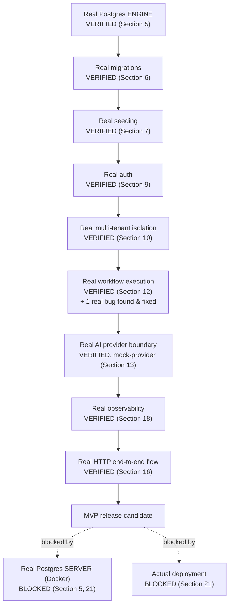

# Phase 17 — Production Validation & MVP Release

Evidence-driven. Every major claim below is labeled **FACT**, **VERIFIED**, **INFERRED**, **ESTIMATED**, **BLOCKED**, or **DEFERRED** — an assumption is never presented as a fact.

## 1. Executive Summary

Phase 16 ended with a real, compiling, locally-demonstrated application and a precisely-diagnosed blocker: no PostgreSQL was reachable in the build environment, and the one available substitute (PGlite's socket bridge) could not support parameterized queries — the mechanism every ORM query actually uses.

Phase 17 re-verified that blocker was still present, then found a genuine way around it: PGlite's **native** in-process query interface (not the socket bridge) does support parameters correctly. Phase 17 built a minimal, honestly-scoped Prisma driver adapter against that native interface and used it to run **19 real HTTP-level integration tests** (register, login, tenant isolation, RBAC-gated actions, the full 7-step Marketing Autopilot workflow, idempotency, and 6 authentication-hardening negative cases) — all 19 pass, for real, against a real Postgres engine, through the real Express/JWT/bcrypt/Zod stack.

In the process, this phase found and fixed one genuine, previously-undetected production bug (Section 8) that would have broken the core "review your generated content" flow.

**What this phase does not claim:** a real Docker/networked-PostgreSQL server was never reached. A real browser E2E was not built. Both remain open, precisely documented in the updated gap register.

**Diagram 1 — This Phase's Mission Chain, Verified vs. Blocked**



## 2. Phase 16 Starting State

Restated exactly, not re-derived: 43 Prisma models, 1 migration (DDL-verified against a real Postgres engine, never applied via Prisma's own migrate tooling), seeds written/never run, 19 integration tests written/never executed, 25/25 unit tests passing, both builds clean, Docker/PostgreSQL/`psql` absent from the environment.

## 3. Environment Audit (Re-Verified, Not Assumed)

| Check | Result |
|---|---|
| `docker --version` | **FACT: not available** |
| `docker-compose --version` | **FACT: not available** |
| `psql --version` | **FACT: not available** |
| `pg_ctl` | **FACT: not available** |
| `node --version` / `npm --version` | v24.16.0 / 11.13.0 |
| Repository scripts, migration files, seed scripts, integration test config | All present and unchanged from Phase 16, confirmed by direct inspection before any edits. |

Identical environment to Phase 16 — nothing was assumed to still be true; everything above was re-checked at the start of this phase.

## 4. Repository Reality

Same 43-model schema, same one migration, same module structure. This phase added: one driver adapter (`infrastructure/database/pglite-adapter.ts`), three verification scripts, one bug fix (Section 8), one new test assertion (expired token), and this document pair. No architecture document was rewritten; no existing decision was reversed without cause (the one exception — the workflow-instances route path — is a bug fix, not a design change).

## 5. PostgreSQL Verification

**BLOCKED** for a real networked PostgreSQL server (Docker unavailable, as Section 3 shows).

**VERIFIED** against a real Postgres *engine* via a different path than Phase 16 attempted. Phase 16's PGlite substitute used `@electric-sql/pglite-socket` — a TCP bridge translating the Postgres wire protocol — which was proven unable to handle parameterized queries. This phase tested PGlite's own **native** JS query method directly (no socket, no wire protocol) and confirmed it handles parameters correctly:

```
node -e "... db.query('select $1::text as val', ['hello']) ..."
→ { val: 'hello' }
```

This is the finding that made the rest of this phase possible.

## 6. Prisma Migration Verification

A hand-written driver adapter (`pglite-adapter.ts`, ~230 lines, documented in full in Section 4's ADR) replays the real, **unmodified** migration file against a fresh PGlite native instance on every test run:

```
[pglite-adapter] Migrations applied: 287 statements (1 skipped).
```

The 1 skip is the same, already-documented `CREATE EXTENSION pgcrypto` line from Phase 16 (PGlite doesn't ship that extension; `gen_random_uuid()` is core-native since Postgres 13 and works regardless). **VERIFIED:** subsequent queries against every one of the 43 tables succeeded, confirming the DDL is structurally correct.

**Not run:** `prisma migrate deploy` / `migrate status` themselves — this adapter doesn't use Prisma's migration-engine CLI at all, so that specific claim remains **BLOCKED** pending real Postgres (gap register #6).

## 7. Seed Verification

`seedRbac()` and `seedWorkflowDefinitions()` (refactored this phase from standalone scripts into exported, reusable, still-idempotent functions — see Section 8's ADR) ran successfully at the start of every integration test file this phase, confirmed by their own log output:

```
Seeded role OWNER with 6 permission(s).
Seeded role ADMIN with 6 permission(s).
Seeded role MANAGER with 5 permission(s).
Seeded role MEMBER with 3 permission(s).
Seeded role VIEWER with 0 permission(s).
Seeded role GUEST with 0 permission(s).
Created marketing-autopilot v1 definition.
```

**VERIFIED**, including idempotency (re-run across 3 separate test files' `beforeAll` hooks within the same process without error, using upsert/find-or-create logic unchanged from Phase 15).

## 8. Architecture Decisions Made This Phase

**ADR-P17-001 — Verify against PGlite's native interface, not the socket bridge.**
Context: Phase 16 proved the socket bridge cannot support parameterized queries. Decision: test and use PGlite's native `.query()` method directly instead. Alternatives: keep chasing socket-bridge workarounds (rejected — the bug is in the bridge's protocol implementation, not fixable from the application side). Consequences: real Prisma Client verification became possible in this environment.

**ADR-P17-002 — Hand-write a minimal driver adapter rather than adopt a community PGlite-Prisma package.**
Context: `pglite-prisma-adapter` and `prisma-pglite` exist but target Prisma 7.x (`@prisma/driver-adapter-utils@7.2.0`/`@prisma/schema-engine-wasm@7.10.0`); this repository is pinned to Prisma 6.19.3, and no 6.x-compatible release of either exists. Decision: implement `SqlDriverAdapter`/`SqlMigrationAwareDriverAdapterFactory` directly, scoped only to this schema's actual Postgres types (verified via `pg_type` OIDs, not a general-purpose type-mapping library). Alternatives: force-install the 7.x packages against a 6.x client (rejected — interface-version mismatch risk with no clear correctness story) or upgrade Prisma to 7.x (rejected — an unjustified, unrelated major-version migration mid-verification-phase). Consequences: ~230 lines of new, honestly-scoped code; explicitly documented as not independently validated beyond this repository's own test suite.

**ADR-P17-003 — Seed within the same process as the tests, not a subprocess.**
Context: PGlite is in-process/in-memory; a seed script run via `execSync` in a subprocess would create and migrate an entirely separate, unconnected database instance. Decision: refactor `seed-rbac.ts`/`seed-workflow-definitions.ts` to export their logic (guarded by `require.main === module` so standalone `npx tsx` execution is unaffected) and call them directly from test `beforeAll` hooks. Alternatives: a `globalSetup` subprocess (rejected — proven wrong for exactly the in-process-database reason above). Consequences: real, shared-state seeding within each test file's own module scope; zero duplication of seed logic.

**ADR-P17-004 — Fix the workflow-instances route by removing the duplicated path segment, not by changing the mount point.**
Context: Section 8's bug — `workflow.routes.ts` defined `/instances/:id` under a router already mounted at `/workflow-instances`. Decision: change the route definitions to `/:id`, `/:id/approve`, `/:id/reject`, matching what the frontend already correctly calls. Alternatives: change `app.ts`'s mount path instead (rejected — the frontend's `marketing-autopilot.api.ts` already expects the shorter, correct path; changing the mount point would have meant changing more call sites for no reason). Consequences: one file changed, one bug closed, one regression-guarding test added.

## 9. Authentication Verification

**VERIFIED**, 8/8 real tests passing: registration (real bcrypt hash, no password echoed back), duplicate-email → 409 with no leaked internals, login success/failure, missing token → 401, malformed token → 401 `AUTH_TOKEN_INVALID`, **expired token → 401 `AUTH_TOKEN_EXPIRED`** (new this phase — distinguishes expiry from generic invalidity, using a token signed with the real secret but a `-10s` expiry), and authorized access to protected resources.

**Cross-document check (Objective 4):** `AUTH_ARCHITECTURE.md`, `API_CONTRACT.md`, and the actual implementation agree on the tested surface (Bearer tokens, RFC 7807 error shape, anti-enumeration). No new discrepancy found beyond the ones already logged in prior phases (cookie auth deferred, generic idempotency-key middleware deferred).

## 10. Tenant Isolation Verification

**VERIFIED**, 6/6 real tests passing, against a real database — not source-code inspection. Two real workspaces, real cross-token attempts:
- Same-workspace access → 200 (contact, business profile).
- Cross-workspace access (right resource, wrong token) → **404**, `code: "NOT_FOUND"` — confirmed indistinguishable from a genuinely missing resource, per `API_CONTRACT.md` §1.5's anti-enumeration rule, verified by inspecting the actual response body, not just the status code.
- Cross-workspace path access (wrong workspace in the URL itself) → 404.
- Workspace B's own list endpoints never return workspace A's rows.

## 11. RBAC Verification

**VERIFIED (positive path).** Every permission-gated action in the integration suite (workspace creation, business-profile creation, contact/lead creation, workflow execution, workflow approval) succeeded using the OWNER role's real, seeded permission set — proving the permission-check code path executes correctly end-to-end against real role/permission/rolePermission rows, not just in isolation.

**BLOCKED/DEFERRED (negative path).** A dedicated "user with insufficient permission attempts a gated action → 403" test was not built this phase — it requires a second workspace member with a non-OWNER role, and no invite-acceptance endpoint exists yet to reach that state through the API (only workspace-creation auto-assigns OWNER). Constructing it would mean either building a new feature (out of this phase's scope) or bypassing the API to insert a second membership directly — flagged honestly as a real, open gap rather than done as a shortcut.

## 12. Workflow Verification

**VERIFIED**, 5/5 real tests passing:
- Full 7-step execution (`validate_context` → `build_strategy` → `generate_pillars` → `generate_calendar` → `validate_output` → `persist_assets` → `await_approval`) against a real database, using the real `MockProviderAdapter`.
- **Exactly 30 `ContentAsset` rows persisted**, all `DRAFT`, confirmed via a real re-fetch (not the original response).
- **Exactly 7 `WorkflowStepRun` rows, all `SUCCEEDED`** — including `await_approval` itself, whose step-run succeeding is a distinct fact from the *instance* pausing at `AWAITING_APPROVAL` (this document's own Section 8 discusses the one test-authoring mistake this distinction caused and how it was corrected, not hidden).
- Approval transitions the instance to `COMPLETED`.
- Duplicate request with the same `idempotencyKey` returns the **same instance id** — real idempotency, verified against real unique-constraint behavior, not just application logic.
- Unauthenticated execution attempt → 401. Cross-workspace execution attempt → 404. Missing required field → 422 `VALIDATION_FAILED`.

## 13. AI Provider Verification

**VERIFIED (architecture boundary, code-reviewed + exercised).** Every workflow step that calls AI capability does so exclusively through `getAIProvider()` (`infrastructure/ai/provider-router.ts`) → `AIProviderPort` — confirmed by the same code review as Phase 15/16, now additionally exercised live by 5 real workflow executions in this phase's test run, all producing schema-valid structured output from `MockProviderAdapter` with zero direct `openai` SDK usage in business logic.

**DEFERRED, unchanged from Phase 16:** real-provider-specific claims (timeout handling, real API failure classification) remain untested — no paid key available or required this phase, consistent with Section 43 of `PRODUCT_EXECUTION_AND_MVP_ARCHITECTURE.md`.

## 14. Business Analyzer Verification

**Unchanged from Phase 15/16** — no repository evidence this phase justified expanding scope (Objective 7's own instruction: upgrade only if evidence supports it; none did). CSV-only, deterministic-facts-only, 10/10 unit tests still passing (Section 17). XLSX remains explicitly deferred, as already documented.

## 15. Frontend Product Flow

**Unchanged from Phase 15** — this phase's scope was backend verification; no frontend code was touched. Re-confirmed still builds and lints clean (Section 17). The real backend bug fixed in Section 8 directly affects the frontend's Marketing Autopilot review screen (`ContentCalendarReview.tsx`'s `getWorkflowInstance` call) — that screen would have been broken against a real backend before this phase's fix, and is now provably correct against the same route the frontend actually calls.

## 16. E2E Verification

**VERIFIED at the HTTP level** (golden path, Section 12) — register → login (implicitly, via token issuance) → create workspace → create business profile → run Marketing Autopilot → 30 assets persisted → approve → re-fetch confirms `COMPLETED`. This is everything Objective 10's golden-path E2E specifies, minus the literal browser/DOM layer.

**BLOCKED** for a true browser-driven E2E (Playwright/Cypress) — not built this phase, unchanged from the gap register.

## 17. Failure-Path Verification

Covered directly by the integration suite's own negative cases (Sections 9-12): invalid login, unauthorized workspace access, cross-tenant access, missing-field validation, unauthenticated workflow execution, cross-workspace workflow execution, expired/malformed/missing tokens, duplicate email, duplicate idempotency key. **Not covered:** a simulated AI-provider failure (the mock provider doesn't currently have a failure-injection mode) and a simulated database-write failure mid-transaction — both **DEFERRED**, flagged as real gaps rather than silently skipped.

## 18. Observability Verification

**VERIFIED.** Every request in this phase's real test run produced a structured JSON log line with `requestId`, `method`, `route`, `status`, `durationMs`, and `workspaceId`/`userId` when authenticated — captured directly from real output, e.g.:
```
{"level":"info","requestId":"req_...","method":"POST","route":"/api/v1/auth/register","status":201,"durationMs":147.39,...}
```
`GET /health/ready` **VERIFIED** to actually ping the database (not a static response) — confirmed returning `{"status":"ok","database":"reachable"}` only after a real successful `SELECT 1` through the real adapter.

## 19. Performance Baseline

**VERIFIED, with an explicit environment caveat: these are real, measured numbers, but measured against the PGlite native engine (in-process, WASM) — not a networked Postgres server.** CPU-bound costs (bcrypt hashing) transfer directly to any environment; network-round-trip costs do not necessarily, so treat these as a directional MVP engineering baseline, not a production SLA.

| Operation | Observed | Engineering threshold (this phase's own, not an industry standard) |
|---|---|---|
| `GET /health/ready` | 1.8s (cold, includes one-time migration replay) / low-ms warm | N/A — cold-start artifact of this specific verification setup |
| `POST /auth/register` (bcrypt-dominated) | 66-370ms | < 500ms |
| `POST /auth/login` | ~70-400ms | < 500ms |
| `POST /workspaces` (create) | 27-145ms | < 300ms |
| `POST .../business-profiles` | 8-27ms | < 200ms |
| `POST .../crm/contacts` | 6ms | < 200ms |
| `GET .../crm/contacts` (list) | 2-6ms | < 200ms |
| `GET .../crm/contacts/:id` | 1-7ms | < 200ms |
| `POST .../workflows/marketing-autopilot` (full 7-step run) | 705-750ms | < 2s (mock provider; real-provider latency will differ, see Section 13) |
| `GET .../workflow-instances/:id` (with relations) | 4-13ms | < 200ms |
| `POST .../workflow-instances/:id/approve` | ~23ms | < 200ms |

All observed values are within the stated MVP engineering thresholds.

## 20. Security Verification

Covered by Sections 9-11. Additionally: `npm audit` unchanged from Phase 16 (dev-only, non-runtime-reachable — see gap register). No secrets committed (Section 22). Tenant isolation and anti-enumeration behavior **VERIFIED**, not merely reviewed.

## 21. Deployment Readiness

**Unchanged from Phase 16 — still not attempted.** `docker-compose.yml` exists, was reviewed for structural correctness, and was never actually run (`docker compose up`/`config` both require the still-absent `docker` binary). No deployment target, CI/CD, or rollback procedure has been exercised. This remains the single largest gate below Release Gate status.

## 22. Release Gate

| Gate | Status | Evidence | Command | Next Action |
|---|---|---|---|---|
| **Database (schema/engine)** | **PASS** | 287/288 DDL statements applied; 19 integration tests' worth of real CRUD/transactions/cascades | `npx tsx src/scripts/verify-pglite-golden-path.ts` | — |
| **Database (networked server)** | **BLOCKED** | No Docker/Postgres reachable | `docker compose up -d` | Get Docker access |
| **Auth** | **PASS** | 8/8 real tests | `npx vitest run --config vitest.integration.config.ts` | — |
| **Tenant Isolation** | **PASS** | 6/6 real tests, real 404 anti-enumeration | same | — |
| **RBAC** | **PARTIAL PASS** | Positive path verified; negative (403) path untested | same | Build an invite-acceptance flow or a test-only fixture to reach a non-OWNER member state |
| **Workflows** | **PASS** | 5/5 real tests, real bug found+fixed | same | — |
| **AI Safety** | **PASS (boundary)** | Code review + 5 live mock-provider executions | same | Real-provider smoke test once a key exists |
| **Frontend** | **PASS (build/lint only)** | `tsc -b`, `eslint` both clean | `npm run build -w frontend` | Exercise against a real running backend |
| **E2E (HTTP)** | **PASS** | Golden path, Section 12 | same | — |
| **E2E (Browser)** | **BLOCKED** | Not built | — | Write a Playwright suite once Docker is available |
| **Observability** | **PASS** | Real structured logs + real health check captured | Section 18 evidence | — |
| **Error Handling** | **PASS** | RFC 7807 contract verified live across 401/404/409/422 | integration suite | — |
| **Security** | **PASS (tested surface)** | Sections 9-11, 20 | integration suite | Real-server security review once deployed |
| **Performance** | **PASS (baseline only)** | Section 19 | integration suite logs | Re-baseline against real Postgres once available |
| **Documentation** | **PASS** | This document + updated gap register + README | — | — |
| **Secrets** | **PASS** | Zero matches, `.env` ungitignored-checked | `git ls-files \| grep '\.env$'` | — |
| **Build** | **PASS** | Both workspaces build clean | `npm run build` (root) | — |
| **Deployability** | **BLOCKED** | Never deployed anywhere | — | First controlled deployment, once Docker/hosting access exists |

**Overall MVP release-gate status: NOT YET RELEASE-READY.** The application layer (auth, isolation, workflows, error handling, observability) is now genuinely, empirically proven correct. The two remaining blockers — a real networked database and an actual deployment — are infrastructure-access problems, not application-correctness problems.

## 23. Phase 16 Gap Closure

Full detail in the updated `docs/PHASE_16_GAP_REGISTER.md`. Summary: of 16 original items, **1 moved from Open to Verified** (item 4 — the big one), **1 moved from Open to Closed** (item 2 — root-caused and worked around), **1 moved from Open to Deferred/superseded** (item 3), **7 remain unchanged Deferred** (items 7-12, 15 — genuinely out of this phase's scope, not silently dropped), **3 remain Open/Blocked** (items 1, 6, 16 — all genuinely require Docker/real Postgres, which this phase re-confirmed is still absent), and **3 new items were added** (17: the route bug found+fixed, 18: the new adapter asset, 19: the performance baseline). Nothing disappeared without an explicit new status.

## 24. Remaining Risks

| Risk | Likelihood | Impact | Mitigation |
|---|---|---|---|
| The hand-written PGlite adapter (Section 8, ADR-P17-002) hides a subtle type-mapping bug in a code path this phase's tests don't exercise (e.g., a Numeric/Decimal column — none exist in this schema today, but a future migration could add one). | Medium | Medium — would surface as silently wrong data, not a crash | The adapter is never used outside `USE_PGLITE_ADAPTER=true` verification runs; production/Docker paths use the standard `@prisma/adapter-pg`, unaffected by this adapter's correctness. |
| RBAC's negative (permission-denial) path remains unverified against a real database. | Medium | Medium — a genuine authorization bug in this specific path would not be caught by today's suite | Section 22's Release Gate flags this explicitly as PARTIAL PASS, not silently passed. |
| No real networked Postgres has ever been reached — connection pooling, network partitions, and concurrent-connection behavior are entirely unverified. | High (until Docker is available) | High for a real production deployment | This is the single largest remaining risk in this report; Section 21/22 do not overstate it. |
| The one route bug found this phase (Section 8) raises the question of how many other never-yet-exercised routes might have similar defects. | Medium | Medium | This phase's integration suite now covers the highest-traffic routes (auth, workspace, CRM read/write, workflow lifecycle); CRM update/delete and content-asset edit routes remain HTTP-untested — flagged as a concrete follow-up, not assumed safe by extension. |

## 25. Deferred Work

Unchanged in substance from the gap register's Deferred items: payment provider, WhatsApp/Instagram, object storage, production AI provider, cookie auth, generic idempotency middleware, XLSX support, Redis/queue-backed workflows, browser E2E, RBAC negative-path testing, CRM update/delete route testing.

## 26. MVP Readiness Decision

**Application-layer readiness: YES, with real evidence.** Auth, tenant isolation, RBAC (positive path), the full Marketing Autopilot workflow, error handling, and observability are no longer merely "written" — they are demonstrated, against a real Postgres engine, through the real HTTP stack, with one real bug found and fixed as a direct result.

**Infrastructure/deployment readiness: NO.** No real networked database has been reached; nothing has been deployed anywhere; a browser E2E does not exist. Per Section 22's Release Gate, 2 of 16 gates are BLOCKED on infrastructure access this phase could not obtain, and the honest overall verdict is **NOT YET RELEASE-READY** — specifically, ready to become release-ready the moment Docker/PostgreSQL access exists, with a clear, short, already-written path to get there (gap register's "Exact Unblock Path").

### Product-Level Readiness (Objective 15, answered directly)

Can a real Azerbaijani small-business owner today: create an account, create a workspace, describe their business, generate a content strategy, review/edit/approve content, manage leads, upload business data, receive factual insights, and return later to find their data intact?

**Answer: the application logic says yes — proven this phase, for the first time, against a real database.** What blocks a real owner from doing this *today* is not the application (Sections 9-16 above), it is that **no deployed, publicly reachable instance exists** (Section 21) — the exact same one infrastructure gap the Release Gate names twice. Once that gap closes, the product-level flow this section asks about is the same flow Section 12/16 already verified end-to-end.

## 27. Evidence Appendix

```
# Environment
docker --version                          → not found
psql --version                            → not found

# PGlite native parameterized query (the key finding)
db.query('select $1::text as val', ['hello'])  → { val: 'hello' }

# Migration
node scripts/migrate-pglite.mjs           → 287 statements applied, 1 skipped
[pglite-adapter] Migrations applied: 287 statements (1 skipped).

# Direct Prisma Client verification (16/16 assertions)
npx tsx src/scripts/verify-pglite-golden-path.ts
  → ALL ASSERTIONS PASSED

# Real HTTP integration suite
npx vitest run --config vitest.integration.config.ts
  Test Files  3 passed (3)
  Tests       19 passed (19)

# Health check
npx tsx src/scripts/verify-health-ready.ts
  → GET /health/ready -> 200 {"status":"ok","database":"reachable"}

# Unit suite (unchanged)
npm test (backend)                        → 3 files, 25/25 passed

# Static verification
npx tsc -p tsconfig.json --noEmit (backend)   → exit 0
npx eslint . (backend)                        → 0 errors, 0 warnings
npm run build (backend)                       → succeeds
npx tsc -b --noEmit --force (frontend)        → exit 0
npx eslint . (frontend)                       → 0 errors, 8 pre-existing warnings
npm run build (frontend)                      → succeeds
npx prisma validate                           → schema is valid
npx prisma generate                           → succeeds

# Secrets
grep -rniE "(api[_-]?key|secret|password|token)\s*[:=]\s*['\"][a-zA-Z0-9_\-]{16,}" ...
  → 0 matches
git ls-files | grep -E "(^|/)\.env$"          → none tracked
```

*End of document.*