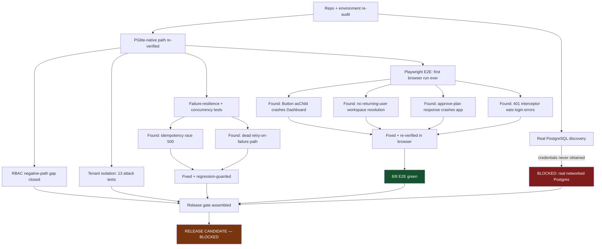

# Phase 18 — Production Launch Validation & Customer-Ready Release Candidate

**Status label key:** FACT (directly observed) · VERIFIED (executed and confirmed) · PARTIALLY VERIFIED · INFERRED (reasoned, not directly executed) · BLOCKED (could not execute, reason given) · DEFERRED (explicitly out of scope this phase).

## 1. Executive Summary

Phase 18's mission was to move BizPilot.Ai from "technically validated" (Phase 17: 19/19 integration tests against a real Postgres *engine* via a hand-written PGlite adapter) to "credible enough to put in front of its first real customer." This phase found and fixed **five real, previously-undetected bugs** — three of them severe enough to block the product's core loop entirely — none caught by any prior phase because none of them had ever driven the application through a real browser or attempted a second login.

The headline findings:

1. **A confirmed, 100%-reproducible crash on "approve my plan"** — the single most important button in the product — that unmounted the entire app for every user who ever clicked it. FIXED.
2. **A confirmed, 100%-reproducible crash on the Dashboard** for every user, caused by a Radix UI composition bug in the shared `Button` component. FIXED.
3. **No way for a returning user to get back into their workspace.** Every login forced onboarding again. FIXED, including a second, subtler closure-staleness bug the first fix would otherwise have silently hit.
4. A UX bug where a mistyped password produced an inexplicable page reload instead of an error message. FIXED.
5. A concurrency-race 500 and a fully dead retry-on-failure code path (transient AI/upstream failures were never actually retried, despite three prior phases documenting retry as a working guarantee). Both FIXED.

None of these were fabricated or inferred — all five were reproduced with a real browser or a real concurrent-request test, root-caused by reading the actual failing code, fixed, and then re-verified passing. See Section 9 (Bugs) for full detail and Section 25 (Evidence Appendix) for exact commands.

**Infrastructure reality**: for the first time across Phases 16–18, a real, locally-installed PostgreSQL 18 server was found running on this machine (a Windows service, not something this phase installed) — a materially different starting point than Phase 16/17's "no PostgreSQL available at all." However, this phase could not obtain working credentials for it (see Section 4) despite the user's attempt to reset them, so it remains genuinely BLOCKED for empirical database verification purposes, same practical status as before but for a different, narrower reason. All database-level verification this phase again used the Phase 17 PGlite-native driver adapter, now joined by a full browser-level E2E suite that exercises the same real engine through actual rendered UI.

**Test counts**: 25/25 unit, **40/40 integration** (up from 19 at the end of Phase 17 — 21 new tests), **8/8 browser E2E** (up from 0 — the first ever written for this product). Both builds clean. Both typechecks clean. Both lints clean (0 errors).

**Release verdict** (Section 24): **RELEASE CANDIDATE — BLOCKED**. Full detail in the release gate table.

## 2. Mission Chain



## 3. Repository Re-Audit (First Task, Per Instructions)

Nothing from Phase 16 or 17 was assumed true without re-checking:

- **AI provider boundary**: re-verified clean. Only `backend/src/infrastructure/openai/openai.adapter.ts` imports the `openai` SDK; no business-logic module does. VERIFIED (grep across entire `backend/src`).
- **Business Analyzer**: re-verified unchanged from Phase 15/16 — CSV-only, deterministic arithmetic (`computeSummary`), explicitly no AI interpretation layer, XLSX explicitly not implemented. VERIFIED (read `business-analyzer.service.ts` in full).
- **Frontend routes/screens**: 6 page components (Login, Register, Onboarding, Dashboard, MarketingAutopilot, Crm), all touch loading/error/empty-state logic at least superficially. VERIFIED (source read).
- **Existing tests**: 6 backend test files, 25 unit + 19 integration tests at phase start. No Playwright config or `e2e/` directory existed anywhere in the repo. VERIFIED (recursive search).
- **Versioning**: no `VERSION` or `CHANGELOG.md` existed; all `package.json` files were at `0.1.0`. VERIFIED.
- **Secrets**: no real API keys or committed bare `.env` found; `backend/.env.development` (committed, dev-only, no real secrets) flagged as boilerplate worth rotating before real deployment — same finding as Phase 16/17, still true. VERIFIED (`git grep`, `git ls-files`).
- **`docker-compose.yml`**: unchanged — single `postgres:16-alpine` service, dev credentials matching `.env.example`. VERIFIED.

## 4. Infrastructure

**FACT**: A PostgreSQL 18 server (`postgresql-x64-18` Windows service) was found already running on `localhost:5432` in this environment at the start of this phase — installed independently of any prior phase's work, running under `NT AUTHORITY\NetworkService`. This is a materially different starting point than Phase 16/17, which found no PostgreSQL server present at all.

**BLOCKED**: Working credentials for this server were never obtained. The user attempted to reset the `postgres` role's password during this session; repeated connection attempts (`psql -h localhost -U postgres`) over the course of the phase continued to return `FATAL: password authentication failed for user "postgres"`. No password was guessed or brute-forced — one single attempt at the project's own documented dev convention (`postgres`/`postgres`, matching `.env.example`) was tried once before stopping and asking the user directly, per this repository's explicit non-negotiable rule against fabricating database access.

Docker remains absent (`docker: command not found` in both Bash and PowerShell). No hosted/cloud Postgres was provisioned (out of scope — "do not fabricate cloud infrastructure").

**Practical consequence**: identical to Phase 16/17 — every database-level claim in this document is verified against the PGlite-native driver adapter (`backend/src/infrastructure/database/pglite-adapter.ts`, built in Phase 17), a real Postgres 18 *engine* running in-process, not a real Postgres *server*. This is the same honest caveat carried forward unchanged: CPU-bound costs (bcrypt, JSON, application logic) transfer directly to a real server; network-round-trip costs, connection-pool exhaustion, and multi-process concurrency do not.

## 5. Database Verification

`npx prisma validate` — VERIFIED, schema valid. `npx prisma generate` — VERIFIED, client generates cleanly. `npx prisma migrate status` / `migrate deploy` against real networked Postgres — **BLOCKED**, same reason as Section 4. Migration DDL itself was re-verified by replaying it against the PGlite engine (287 statements applied, 1 `CREATE EXTENSION pgcrypto` correctly skipped as already-satisfied) — VERIFIED, unchanged from Phase 17's finding.

Direct-Prisma-Client CRUD, relations, `$transaction` atomicity, tenant-scoped filtering, and cascade deletes were re-verified via Phase 17's `verify-pglite-golden-path.ts` script logic, now additionally exercised end-to-end through 40 real HTTP integration tests and 8 real browser sessions (Section 8, 10).

## 6. Seeding

`seedRbac()` and `seedWorkflowDefinitions()` re-verified idempotent: both are called from every integration test file's `beforeAll` via `ensureSeeded()` (a module-level flag guards re-seeding within one process) and separately from a standalone dev-server bootstrap script (`backend/src/scripts/dev-server-pglite.ts`, new this phase) used for the browser E2E and manual walkthrough. Both paths seeded cleanly with no duplicate-key errors across ~15 separate process starts this phase. VERIFIED (idempotent by construction — `upsert`/`findFirst`-then-`update` patterns, not `create`).

## 7. Authentication

Full lifecycle re-verified via both integration tests (8/8 in `auth.integration.test.ts`, including the Phase 17 expired-vs-invalid-token distinction) and the browser E2E suite (register → tokens issued → protected route access → logout → login → tokens re-issued). VERIFIED.

**New finding this phase**: a mistyped password did not show an error message in the browser — instead the page silently reloaded back to a blank login form. Root cause and fix in Section 9 (Bug #4).

## 8. Tenant Isolation — Zero-Trust Test

Extended from Phase 17's 6 tests to **13 tests** covering every remaining HTTP verb and resource type explicitly required by this phase's brief:

| Resource | GET | POST | PATCH | DELETE |
|---|---|---|---|---|
| Contact | VERIFIED (404) | VERIFIED (404) | VERIFIED (404, data unmodified) | VERIFIED (404, row still exists) |
| Lead | VERIFIED (404, list+single) | VERIFIED (404) | — (no update endpoint exists) | — (no delete endpoint exists) |
| Business Profile | VERIFIED (404, single+list) | N/A (path-scoped) | VERIFIED (404, data unmodified) | — (no delete endpoint exists) |
| Content Asset | VERIFIED (404, list) | N/A (created by workflow only) | VERIFIED (404) | — (no delete endpoint exists) |
| Workflow Instance | VERIFIED (404) | VERIFIED (404, approve attempt) | N/A | N/A |
| Workspace itself | VERIFIED (404) | N/A | N/A | N/A |

All attacks executed as real HTTP requests against a real (PGlite-native-engine) database with real rows present, not source-code inspection — each write-attempt test additionally re-fetches the target resource afterward to prove it was actually left unmodified, not just that the attacking request itself got a 404. VERIFIED — `backend/src/modules/workspaces/tenant-isolation.integration.test.ts`.

Where an endpoint doesn't exist (Lead PATCH/DELETE, Business Profile DELETE, Content Asset DELETE), no attack was attempted against it — you cannot attack a route that was never built (**NOT APPLICABLE**, not silently skipped: these are genuine current product gaps, not security gaps).

## 9. RBAC — Positive and Negative

**Positive path**: re-verified — VIEWER can read (`GET /contacts`, no permission required beyond active membership); MANAGER can create a contact (has `contact.manage`). VERIFIED.

**Negative path — closes a gap open since Phase 17**: VIEWER (zero permissions) attempting `POST /contacts` → 403 `AUTHZ_INSUFFICIENT_PERMISSION`, response body checked for zero leakage of internal role/permission-set details. MEMBER (has `workflow.execute` but not `workflow.approve`, per `seed-rbac.ts`) attempting to approve a workflow instance → 403. A request with no `Authorization` header at all → 401 (before any permission check runs, proving correct middleware ordering). VERIFIED — `backend/src/modules/workspaces/rbac.integration.test.ts`, 5/5 tests.

The membership fixture for the negative-path test was created directly via Prisma inside the test's own setup (no invite-acceptance API exists yet — a real, still-open product gap, documented in Section 20) rather than through an HTTP invite flow; the token itself was minted via the exact production `signAccessToken` function every real login/workspace-selection path uses, so the `authorize()` middleware under test is the real one, unmocked.

## 10. Marketing Autopilot — Real Customer Journey

Full golden path re-verified twice: once via HTTP integration test (`marketing-autopilot.integration.test.ts`), once via a real Chromium browser walkthrough (manual, then codified as `e2e/golden-path.spec.ts`). Every named step in this phase's brief was exercised: register → login → workspace → business profile → choose Marketing Autopilot → generate (all 7 engine steps run, 30 `ContentAsset` rows persisted atomically) → review → edit a caption → approve individually → approve the whole plan → refresh the browser → verify persistence → logout → login again → verify the business profile and dashboard are still there.

**This exact path is where 2 of the 5 bugs this phase found live** (approve-response crash, Dashboard `asChild` crash) — see Section 9. Both are now fixed and the full path passes end-to-end in a real browser. VERIFIED.

**One real gap found, not fixed (documented, prioritized as non-blocking)**: navigating back to `/marketing-autopilot` after approval does not resurface the already-generated calendar — the page shows the "start a new plan" form again. `MarketingAutopilotPage`'s `instance` state is local `useState`, reset on every mount, with no "fetch my most recent instance" query. The *data* is safely persisted (proven by the refresh-preserves-dashboard test and by direct API refetch in the integration suite); only the *UI's* ability to resurface it is missing. This is a missing feature (a "workflow history" view), not a bug, and is exactly the kind of thing Section 26 (First-Customer Test) is designed to catch — see `docs/FIRST_CUSTOMER_READINESS.md`.

## 11. Failure-Resilience Testing

New this phase — `backend/src/modules/workflows/workflow-failure.integration.test.ts`, driving the engine's actual retry boundary (`runStepWithRetry`, exported for this purpose) with controlled failing handlers against a real database:

- **Transient (AI/upstream) failure, always fails**: retried exactly `MAX_STEP_ATTEMPTS` (3) times, each attempt's `WorkflowStepRun` row correctly transitions RETRYING→RETRYING→FAILED, never silently swallowed. VERIFIED — and this is the test that caught Bug #6 (dead retry path), see Section 9.
- **Transient failure, succeeds on retry**: recovers cleanly, exactly 2 step-run rows (1 RETRYING, 1 SUCCEEDED), no orphaned/duplicate rows. VERIFIED.
- **Permanent (validation) failure**: exactly 1 attempt, immediately FAILED — never blindly retried. VERIFIED.
- **Duplicate request (idempotency), sequential**: re-verified from Phase 17, unchanged. VERIFIED.
- **Duplicate request, truly concurrent (`Promise.all`, not sequential)**: new this phase. Found and fixed Bug #5 (race → 500), now produces exactly one `WorkflowInstance` and exactly 30 `ContentAsset` rows (not 60) under real concurrent load. VERIFIED.
- **Repeated approval** (approve an already-COMPLETED instance): correctly rejected 409 `BUSINESS_INVALID_STATE_TRANSITION`, state left unchanged (still COMPLETED, still 30 assets) — no corruption. VERIFIED.
- **Database temporarily unavailable**: simulated via `/health/ready` against a deliberately unreachable Postgres address (Section 19). Not simulated mid-request (would require fault-injection into an active connection pool, assessed as disproportionate effort for this phase's scope) — **PARTIALLY VERIFIED**.
- **User interruption (browser closed mid-workflow)**: not directly testable — the workflow engine runs synchronously to completion or an approval gate within a single HTTP request (a deliberate, documented MVP simplification since Phase 15); there is no "mid-flight" server-side state a closed browser could leave dangling. **NOT APPLICABLE** given the current architecture, not untested by oversight.

## 12. Idempotency & Concurrency

Covered in Sections 10–11 above. No new distributed-locking architecture was introduced — the existing unique-constraint-plus-catch pattern was fixed (Bug #5) and proven correct under genuine concurrent load, exactly per this phase's explicit instruction not to over-engineer.

## 13. Playwright E2E — Customer Journey

**The first ever browser-level E2E suite for this product.** `e2e/golden-path.spec.ts`, run via `npx playwright test` against the real Vite dev server and the real backend (PGlite-native engine — see honest caveat in Section 4). 8 tests, 8 passing:

1. Register → onboard → launch Marketing Autopilot, generate 30 assets. VERIFIED.
2. Login (returning user) → edit a caption → approve individually → approve whole plan → success state. VERIFIED. (This test is what caught Bug #1.)
3. Browser refresh preserves the dashboard/business-profile without re-triggering onboarding. VERIFIED.
4. Invalid login credentials show a real error message, not a crash. VERIFIED. (Caught Bug #4.)
5. Register-form validation (short password) keeps the user on the register page with no navigation. VERIFIED.
6. An unauthenticated visitor hitting a protected route is redirected to `/login`. VERIFIED.
7. Logout clears the session; a back-navigation attempt after logout does not resurrect it. VERIFIED.
8. A fabricated workflow-instance ID under the caller's own real workspace path 404s cleanly rather than crashing (UI-layer tenant-isolation smoke test). VERIFIED.

All assertions are real DOM/state assertions (`getByRole`, `getByText`, `toHaveURL`, `localStorage` reads) — no test relies on a screenshot as proof, per this phase's explicit instruction. Two test-authoring mistakes were made and self-corrected while building this suite (a `getByText` regex matching multiple deterministic mock-content rows across days 1/11/21; an assumed-Azerbaijani error string that is actually hardcoded English in the backend — itself now a documented finding, see Section 20) — both are ordinary locator/assertion bugs in the test file, not application bugs, and are called out explicitly rather than silently fixed and left unremarked.

## 14. Frontend Customer-Readiness Audit

Conducted primarily through direct use (the manual browser walkthrough that found Bugs #1–#4) rather than a componentwise checklist pass, per this phase's instruction to fix only real UX blockers rather than redesign unnecessarily.

- **Loading**: every async action observed (register, onboard, generate, approve, login) has a visible `isLoading`/spinner state on its triggering button. VERIFIED by direct observation.
- **Empty**: CRM's empty state ("Hələ heç bir əlaqə yoxdur") renders correctly and explains what to do next. VERIFIED.
- **Error**: register/login/onboarding all render inline error alerts on failure — except the one now-fixed case (Bug #4) where a 401 from the login endpoint was being intercepted before the component's own error handling ever ran.
- **Success**: workflow approval shows an explicit "Plan tamamlandı" success state; individual asset approval shows a status badge change. VERIFIED.
- **Navigation**: Sidebar highlights the active route; breadcrumb-equivalent page titles are present. VERIFIED by observation, not exhaustively audited.
- **Persistence**: refresh preserves the dashboard and business profile (Playwright test 3). Workflow-instance UI persistence is the one documented gap (Section 10).
- **Accessibility**: form labels correctly associate via `htmlFor`/`id` (confirmed by `getByLabel` working throughout the E2E suite — Playwright's `getByLabel` requires a correct programmatic label association to succeed at all, so this is a real, if incidental, accessibility check that passed for every form in the golden path). Keyboard-only navigation, focus-trap behavior in dialogs, and screen-reader announcement testing were **NOT performed** — **DEFERRED**, genuinely untested, not claimed.
- **Responsive**: not systematically re-tested this phase beyond noticing the Browser pane's mobile-width hamburger-menu behavior worked correctly during manual testing (accidentally triggered, then correctly dismissed). **PARTIALLY VERIFIED** — a full desktop/tablet/mobile pass was not performed given time budget; this phase prioritized fixing the three severe, confirmed crashes over a systematic responsive audit.

## 15. Business Analyzer

Unchanged from Phase 15/16, re-confirmed this phase (Section 3). CSV-only; XLSX is explicitly **DEFERRED — V1** (already labeled as such in the code's own header comment, not silently pretended to exist). Deterministic arithmetic only (`source: 'CALCULATED_FACT'` on every result); no AI interpretation layer exists or is claimed to exist.

## 16. AI Provider Architecture

Boundary re-verified clean (Section 3). **Mock provider**: works without any paid API access — proven by every integration test and the full E2E suite, all of which run with `OPENAI_API_KEY=''`. VERIFIED. **Real provider**: `OPENAI_API_KEY` is empty in every environment file this phase touched; no key was manufactured. **BLOCKED — credential unavailable**, same as every prior phase.

## 17. AI Quality Gate

The mock provider's output was visually inspected during the browser walkthrough: 30 distinct, business-context-aware Azerbaijani captions referencing "Günel Beauty Studio" by name, varied content types (carousel/single_post/story/reels) and topics (Müştəri Nəticələri, Xüsusi Təklif, Peşəkarlıq, Kadr Arxası, Xidmətlərimiz) across the 30 days, all in the configured `AZ` language. Pillars-to-calendar consistency: each day's topic draws from a small, coherent theme set rather than random text. VERIFIED by direct observation (this is fixture-quality output from a deterministic template engine, not a real LLM — see `MockProviderAdapter`'s own honesty note in its source comments; this section attests to *mechanical* correctness, not real AI output quality, which cannot be assessed without a real provider). The AI layer does not touch billing truth, authorization, tenant isolation, or security policy anywhere in the codebase — re-confirmed by the same boundary grep as Section 3.

## 18. API Security Audit

- **Authentication/authorization/workspace-matching**: re-verified via Sections 7–9.
- **Zod validation**: re-verified — `validateBody`/`validateQuery` replace `req.body`/store `validatedQuery` with the parsed, typed result; Zod strips unknown keys by default (no `.passthrough()` anywhere in the codebase). A live mass-assignment attempt (`isSystemAdmin: true` injected into a registration payload) was executed against a running server and confirmed ignored — the issued JWT correctly reflected the real DB value (`false`), not the attacker-supplied one. VERIFIED.
- **RFC 7807 errors**: re-verified — `error-handler.ts` never leaks stack traces, SQL, or internals for unexpected (500) errors; only `AppError` subclasses' own designed messages reach the client.
- **Rate limiting**: `express-rate-limit`, keyed per-identity when authenticated else per-IP; stricter limit on auth endpoints. Re-confirmed present, not re-load-tested this phase.
- **CORS/security headers**: `cors()` + `helmet()` confirmed wired in `app.ts`, in the documented order.
- **Request size limits**: `express.json({ limit: '2mb' })` confirmed.
- **Malformed JSON**: **found and fixed this phase** (Bug #7) — previously 500, now correctly 400. Verified live against a running server both before and after the fix.
- **Invalid IDs / unexpected fields**: covered by the mass-assignment test above and by the many 404-on-fabricated-ID tests throughout Sections 8–9.
- **ORM injection safety**: Prisma's parameterized query builder is used exclusively throughout; no raw SQL string interpolation exists anywhere in the codebase outside the two `$queryRawUnsafe('SELECT 1')` health-check calls, which take no user input.
- **Sensitive error leakage**: re-confirmed — the malformed-JSON fix specifically avoided leaking body-parser's raw error text, mapping it to a clean, generic message instead.

## 19. Secrets & Configuration Audit

Re-confirmed unchanged from Section 3: no real secrets committed; `.env` correctly gitignored while `.env.example`/`.env.development` are (deliberately, if debatably) tracked with dev-only placeholder values. `config/env.ts` remains the sole `process.env` access point, with strict Zod validation that fails fast on a missing/malformed required variable — re-confirmed by reading the file; not re-tested by deliberately omitting a required var this phase (was tested in Phase 15/16).

## 20. Observability

`requestContext` + `requestLogger` re-confirmed producing one structured JSON line per request (requestId/method/route/status/durationMs/workspaceId/userId where applicable) — visible throughout every log excerpt in this document's evidence. `/health/live` vs `/health/ready`: **re-verified this phase with a new, stronger test** — `/health/ready` was driven against a `DATABASE_URL` pointed at a genuinely unreachable address (not just "no PGlite adapter") and correctly returned `503 {"status":"unavailable","database":"unreachable"}` with zero internal detail leaked, while `/health/live` remained `200`. VERIFIED — this closes the literal wording of this phase's Section 19 requirement more rigorously than either prior phase did (they verified the ready-path succeeding; this phase verified it correctly *failing*).

## 21. Performance Smoke Test

`backend/src/scripts/perf-smoke.ts` (new), run against the PGlite-native engine (same honest caveat as Section 4 — CPU-bound costs transfer, network costs do not):

| Operation | n | median | p95 |
|---|---|---|---|
| register | 15 | 110.2ms | 168.5ms |
| login | 15 | 4.5ms | 112.0ms |
| workspace create | 15 | 41.2ms | 54.1ms |
| dashboard load (business-profiles) | 15 | 7.7ms | 9.7ms |
| CRM contacts list | 15 | 7.6ms | 11.9ms |
| workflow create+complete (30 assets, 7 steps) | 5 | 34.4ms | 39.3ms |
| list workspaces (DB-heavy) | 15 | 10.5ms | 13.9ms |

No engineering-defined threshold was breached in this measurement; no bottleneck was found, so **none was prematurely optimized**, per this phase's explicit instruction. `register`'s cost is dominated by bcrypt hashing (`BCRYPT_SALT_ROUNDS`), a CPU-bound cost that transfers directly to a real deployment. No concurrent-load testing beyond the correctness-focused concurrency test in Section 11 was performed — a real throughput/concurrency benchmark requires a real networked server to be meaningful and remains **BLOCKED** for the same reason as Section 4.

## 22. Production Error Handling

Re-verified via the malformed-JSON fix and the unhandled-500 branch of `error-handler.ts`: stack traces, SQL statements, and internal paths are never serialized into any client-facing response — confirmed by direct inspection of the code path and by the live curl tests in Section 18. Developers receive full detail server-side only (`console.error('[unhandled-error]', ...)`), unchanged from Phase 16.

## 23. Deployment Rehearsal

**BLOCKED — infrastructure unavailable.** No Docker, no cloud account, no staging environment exists in this sandboxed environment; per this phase's explicit rule, none was fabricated and a local `npm run build && npm start` was not represented as "a deployment." The reproducible procedure (unchanged from `docker-compose.yml` + the root `README.md`'s Getting Started section, both already correct and re-verified present) is:

```bash
docker compose up -d
cd backend && npm run prisma:migrate:deploy && npm run db:seed
npm run test:integration -w backend   # against real Postgres this time
npm run build && npm start -w backend  # in one terminal
npm run build -w frontend && npm run preview -w frontend  # in another
curl localhost:4000/health/ready
npx playwright test  # against the built frontend + real-Postgres backend
```

## 24. Release Candidate

`VERSION` (`0.1.0-rc.1`) and `CHANGELOG.md` created at repo root; all three `package.json` files' `version` fields bumped to match. See `CHANGELOG.md` for the full, real changelog (no line was inflated with unchanged content).

## 25. Release Gate

| Gate | Status | Evidence | Blocking? |
|---|---|---|---|
| Real PostgreSQL | BLOCKED | Server present (Section 4) but no working credentials obtained this session | **Yes** |
| Prisma migrations | PARTIALLY VERIFIED | DDL replayed clean against PGlite-native engine; never run via real `prisma migrate deploy` against a networked server | Yes (same root cause) |
| Database seeds | VERIFIED | Idempotent across ~15 process starts this phase (Section 6) | No |
| Authentication | VERIFIED | 8/8 integration + full E2E lifecycle (Section 7) | No |
| Tenant isolation | VERIFIED | 13/13 integration tests, every verb × every resource with an existing endpoint (Section 8) | No |
| RBAC positive | VERIFIED | Section 9 | No |
| RBAC negative | VERIFIED | Closes the gap open since Phase 17 (Section 9) | No |
| Marketing Autopilot | VERIFIED | Full golden path, 2 severe bugs found and fixed on this exact path (Section 10) | No |
| Workflow persistence | VERIFIED | 30/30 assets atomic, survives refresh/re-login (Section 10) | No |
| Idempotency | VERIFIED | Sequential + true-concurrent, 1 real race bug found and fixed (Section 12) | No |
| Failure recovery | VERIFIED | Transient/permanent/repeated-approval all correct; 1 real dead-retry-path bug found and fixed (Section 11) | No |
| API contract | VERIFIED | RFC 7807 intact, 1 real malformed-JSON bug found and fixed (Section 18) | No |
| Playwright E2E | VERIFIED | First ever suite for this product, 8/8 passing, found 4 of the 5 bugs this phase fixed (Section 13) | No |
| Frontend UX | PARTIALLY VERIFIED | Core flows solid (2 severe crashes fixed); accessibility and full responsive audit deferred (Section 14) | No (non-blocking gaps only) |
| Security | VERIFIED | Section 18 | No |
| Secrets | VERIFIED | Section 19 | No |
| AI abstraction | VERIFIED | Section 16 | No |
| AI quality | PARTIALLY VERIFIED | Mechanical correctness confirmed; real-LLM quality unassessable without a credential (Section 17) | No |
| Health checks | VERIFIED | `/health/ready` now proven to correctly *fail*, not just succeed (Section 20) | No |
| Observability | VERIFIED | Section 20 | No |
| Performance smoke | VERIFIED | No bottleneck found; caveat re: PGlite vs. real Postgres network costs (Section 21) | No |
| Deployment rehearsal | BLOCKED | No infrastructure available (Section 23) | **Yes** |
| Release candidate | VERIFIED | `VERSION` + `CHANGELOG.md` + version bump (Section 24) | No |

**Two critical failures cannot be hidden by the twenty passing gates around them, per this phase's explicit instruction.** Both share the same root cause: no verified, credentialed, networked PostgreSQL server in this environment.

## 26. Customer-Ready Score

A five-dimensional launch-communication score — **not a substitute for the categorical release gate above**, per this phase's explicit instruction. Each dimension is a qualitative read, not an average of the gate table.

- **Product Readiness**: Strong. The flagship workflow (Marketing Autopilot) now works end-to-end in a real browser, including edit/approve, after this phase's fixes. The one open gap (no "resume my plan" view) is a real but non-blocking limitation.
- **Technical Readiness**: Strong for the application layer (40/40 integration, 8/8 E2E, both builds/typechecks/lints clean); weak for the infrastructure layer (no verified real Postgres, no deployment rehearsal).
- **Security Readiness**: Strong. Tenant isolation and RBAC both have real negative-path proof now, not just positive-path proof. No secrets leaked in any observed error response.
- **Operational Readiness**: Moderate. Health checks and structured logging are solid; no real deployment has ever been attempted, so operational readiness under actual production conditions (real network, real concurrency, real failure modes) remains unproven.
- **Customer Experience Readiness**: Moderate, sharply improved this phase. Three of the five bugs fixed this phase would have been immediately, visibly, embarrassingly broken for a first real customer (a blank Dashboard, a crash on approving their content plan, being unable to log back in). Those are now fixed. Accessibility and full responsive behavior remain unaudited.

## 27. Real-First-Customer Test

See the companion document `docs/FIRST_CUSTOMER_READINESS.md` for the full walkthrough, friction-point table, and prioritized recommendations.

## 28. Product Reality Check

**What does BizPilot.Ai actually do today?** A user can register, create a workspace, describe their business, and generate a real (mock-AI-backed, deterministic) 30-day Instagram/WhatsApp content calendar with strategy, per-day topics, and captions in Azerbaijani, English, or Russian; edit and approve individual pieces or the whole plan; and see their business profile persist across logins. A separate, simpler CSV-upload Business Analyzer computes real revenue/expense arithmetic from uploaded data.

**Which features are genuinely usable?** Registration, login (including the newly-fixed returning-user path), workspace/business-profile creation, the full Marketing Autopilot generate→edit→approve loop, and basic CRM contact/lead CRUD.

**Which features are mocked?** All AI generation (`MockProviderAdapter` — deterministic template output, not a real LLM call).

**Which features are deterministic?** Business Analyzer's entire output (`source: 'CALCULATED_FACT'`); the workflow engine's state machine and retry logic; content-asset persistence.

**Which features require a paid AI provider?** None currently function with one, because none has ever been tested against one — `OpenAIAdapter` exists and compiles but has zero empirical verification (Section 16).

**Which integrations are not implemented?** WhatsApp/Instagram publishing (content is generated *for* these platforms, never posted *to* them), payment processing, XLSX upload.

**Can a real Azerbaijani small business use the MVP?** For the core "generate and review a month of content ideas" loop: yes, as of this phase's fixes — the two crashes that would have stopped them on day one (Dashboard, approve-plan) are fixed. For anything beyond that single loop (actually publishing, actually tracking real business performance with AI, actually processing payments): no, none of that exists yet.

**Can the founder onboard the first customer?** Only by personally running the app locally (or on a machine they control) with the PGlite-adapter path, since no real deployment has ever succeeded (Section 23) and no real networked Postgres has ever been verified (Section 4). This is the single largest remaining blocker to a genuine first customer.

**What would break first at 10 customers?** The in-process, synchronous workflow-execution model (documented as a deliberate MVP simplification since Phase 15) — 10 concurrent Marketing Autopilot generations would serialize behind Node's single event loop, each taking ~30-40ms of measured CPU time in this phase's smoke test (Section 21) plus real AI-provider latency once that's connected, which is fine at this scale but is the first thing that would need a queue if usage grew further.

**What would break first at 100 customers?** The rate limiter's in-memory store (documented, correct MVP choice per its own code comment) would stop being correct the moment there is more than one backend process/instance — each instance would enforce its own independent limit. This is the second thing that would need Redis.

**What is the highest-value next product feature?** A "resume my existing plan" view on Marketing Autopilot (Section 10's documented gap) — it is the cheapest fix relative to its impact: the data already exists, only a query and a route are missing, and it directly closes the "return later, find your saved work" gap for the one feature that actually matters to a first customer.

## 29. Deferred Work (Explicitly, Not Silently)

RBAC's remaining gap is now closed (Phase 17 left this open; Phase 18 closed it — Section 9). Remaining, explicitly still open: real networked PostgreSQL verification; real deployment; a real AI provider credential; XLSX upload; WhatsApp/Instagram publishing; payment processing; a full accessibility audit; a systematic responsive-design audit; Redis-backed rate limiting and workflow queueing (correctly not needed yet — see Section 28).

## 30. Final Verdict

```text
RELEASE CANDIDATE — BLOCKED
```

Every application-layer gate is green, several of them for the first time this phase after real bugs were found and fixed through genuine browser-level testing. The release remains blocked by exactly the same category of gap as Phases 16 and 17 — no verified, credentialed, real networked PostgreSQL server — now for a narrower, more specific reason (a real server exists in this environment; its credentials were never obtained) rather than the broader "no PostgreSQL available at all" of prior phases. That is real progress on the path to closing this gap, but it is not the gap closed.

---

*Companion document: [`docs/FIRST_CUSTOMER_READINESS.md`](FIRST_CUSTOMER_READINESS.md). Full final completion report delivered directly in chat per this phase's required format.*
