# BizPilot AI — Product Execution & MVP Architecture

**Status:** Complete. **Scope:** Product strategy, go-to-market, and implementation blueprint for turning fourteen phases of architecture documentation into a shippable, revenue-generating product. **Not in scope:** redesigning any existing architectural decision without a cited, concrete contradiction or implementation blocker.

## 0.1 How This Document Relates to the Existing Series

This is the fifteenth document in the BizPilot AI architecture series. Every prior document remains authoritative in its domain. This document does not re-derive database design, authentication, API conventions, backend layering, AI orchestration, cloud topology, frontend platform mechanics, enterprise intelligence, engineering standards, trust/security/compliance, commercial architecture, or ecosystem/marketplace design — it cites them and asks a different question than any of them asked: **given everything already designed, what is the smallest real product BizPilot AI should build first, in what order, and why will a business actually pay for it?**

**Depends on (read before this document; cited throughout, never restated):** `PRD.md`, `DATABASE.md`, `AUTH_ARCHITECTURE.md`, `API_CONTRACT.md`, `BACKEND_ARCHITECTURE.md`, `AI_PLATFORM_ARCHITECTURE.md`, `CLOUD_INFRASTRUCTURE.md`, `FRONTEND_ARCHITECTURE.md`, `ENTERPRISE_INTELLIGENCE_ARCHITECTURE.md`, `ENGINEERING_STANDARDS.md`, `TRUST_SECURITY_COMPLIANCE_ARCHITECTURE.md`, `COMMERCIAL_INTELLIGENCE_ARCHITECTURE.md`, `GLOBAL_PLATFORM_ECOSYSTEM_ARCHITECTURE.md`.

## 0.2 Repository Ground Truth (Verified Before Writing This Document)

Every claim in Parts 35-48 of this document was checked against the actual repository state, not assumed from prior documentation. As of this writing:

| Layer | Actual state | Verified by |
|---|---|---|
| Database schema | `backend/prisma/schema.prisma` exists and is real — **37 models**, matching `DATABASE.md`'s design | Direct file read |
| Backend runtime | **No `backend/src/server.ts` exists.** Every module folder (`common/`, `config/`, `infrastructure/`, `modules/`) contains only a `.gitkeep` file. Zero routes, controllers, services, or middleware are implemented. | Direct directory listing |
| AI provider integration | `backend/package.json` depends directly on the `openai` npm package with **no abstraction layer in code** — `AI_PLATFORM_ARCHITECTURE.md` §2.3's `AIProviderPort` is fully specified on paper but not yet implemented | Direct file read |
| Frontend application | Design system components are real and implemented (`frontend/src/shared/components/`: ui/, feedback/, overlay/, layout/). Every feature folder (`features/auth/`, `features/dashboard/`) contains only `.gitkeep` files — no pages, no routing, no API clients. | Direct directory listing |
| Workflow persistence | `AI_PLATFORM_ARCHITECTURE.md` §10.1 explicitly flags `WorkflowInstance` durable-state schema as **"future schema extension, not required today... out of scope for this document."** No such model exists in `schema.prisma`. | Cross-reference, confirmed absent |
| CRM data model | No `Contact`, `Lead`, or `Deal`-equivalent model exists anywhere in the 37-model schema. | Direct file read |

**This finding drives the entire posture of this document.** Fourteen phases of architecture exist; the product itself does not yet exist as running code beyond scaffolding, a real database schema, and a component library. This document is deliberately optimistic about what has already been decided well (a great deal has) and unsparing about what has not yet been built (nearly everything).

---

## Table of Contents

1. Executive Summary · 2. Product Thesis · 3. Product Vision · 4. Problem Definition · 5. Target Customer · 6. Azerbaijan-First Strategy · 7. Global Expansion Strategy · 8. Product Pillars · 9. Core User Journeys · 10. Business Copilot · 11. Business Analyzer · 12. Marketing Autopilot · 13. CRM & Sales Assistant · 14. Integration Platform · 15. Workflow Engine · 16. Data-to-Action Engine · 17. Human-in-the-Loop · 18. AI Workforce Integration · 19. Privacy & Trust · 20. UX Architecture · 21. MVP Scope · 22. V1 Scope · 23. V2 Scope · 24. Scale Roadmap · 25. Global Roadmap · 26. Monetization Strategy · 27. Pricing Architecture · 28. Competitive Positioning · 29. Product Moat · 30. Customer Acquisition Strategy · 31. Activation Strategy · 32. Retention Strategy · 33. Metrics & North Star · 34. Product Analytics · 35. Technical Implementation Blueprint · 36. Existing Architecture Reuse Map · 37. Missing Components · 38. Database Impact Analysis · 39. API Impact Analysis · 40. Backend Impact Analysis · 41. Frontend Impact Analysis · 42. AI Provider Abstraction · 43. No-API Development Strategy · 44. Integration Priority Matrix · 45. Security Requirements · 46. Testing Strategy · 47. Launch Readiness · 48. Production Readiness · 49. Risk Register · 50. ADRs · 51. Implementation Roadmap · 52. Founder Execution Plan

---

## 1. Executive Summary

BizPilot AI has fourteen phases of Staff+-quality architecture and zero lines of application code. That is not a criticism of the architecture — cross-referencing it while writing this document repeatedly turned up mechanisms (the `AIProviderPort` hexagonal abstraction, the five-tier `FREE/STARTER/PRO/BUSINESS/ENTERPRISE` plan matrix, the Autonomous Decision Level ladder, the 37-model Prisma schema) that are exactly what a real product needs and do not need to be redesigned. The gap is entirely one of sequencing: the platform has been designed top-down (ecosystem, marketplace, global scale, AI workforce) before anything has been proven bottom-up (does one real business in Baku pay for this, use it weekly, and tell another business owner about it).

This document reverses that sequence without discarding any of the work behind it. It defines one Ideal Customer Profile — small Instagram/WhatsApp-native service and retail businesses in Azerbaijan, flagship persona: beauty and wellness salons — and three killer workflows that create measurable value for that customer in the first session: a Marketing Autopilot that turns a business profile into a real 30-day content plan, a Business Analyzer that turns an uploaded spreadsheet into fact-labeled financial insight and action, and a CRM & Sales Assistant that turns an inbound WhatsApp message into a tracked, followed-up lead. It defines an MVP that can be built and demonstrated **without purchasing a paid AI API key**, using a mock provider behind the already-designed `AIProviderPort`. It defines a Workflow Engine that fills the one genuinely missing piece of core infrastructure (`WorkflowInstance` persistence, explicitly flagged as deferred in `AI_PLATFORM_ARCHITECTURE.md`) without inventing a second orchestration system. And it defines, section by section, exactly which of the 37 existing database models are sufficient as-is, which need small additions, and which — a genuinely short list — do not exist yet and must be created.

The product thesis is simple: **BizPilot AI does not win by generating more text than a generic AI chatbot. It wins by understanding one business's actual data and executing the specific, repetitive work that business owner does every week — and by doing it first, and best, in Azerbaijani.**

## 2. Product Thesis

**BizPilot AI is an AI Business Operating System, not an AI chatbot with a business skin.** The distinction is operational, not marketing: a chatbot's unit of value is a response; BizPilot AI's unit of value is a completed piece of business work — a content calendar published, a financial anomaly caught before it compounds, a lead followed up before it goes cold. Every product decision in this document is tested against one question: **does this move a real action closer to Understand → Decide → Act → Measure → Improve, or does it just produce more text?**

This thesis is not new to the architecture series — `ENTERPRISE_INTELLIGENCE_ARCHITECTURE.md`'s AI Workforce and Decision Engine, and `GLOBAL_PLATFORM_ECOSYSTEM_ARCHITECTURE.md`'s Workflow Ecosystem, were both built around the same loop. What this document adds is sequencing discipline: the full AI Workforce (nine AI Executive roles) and the full ecosystem/marketplace are real, valuable, and correctly designed — and correctly *not* what a business with one Instagram account and one WhatsApp number needs on day one. This document is the bridge between "the architecture is right" and "a real business pays for this in month one."

## 3. Product Vision

A business owner should be able to say **"Analyze my business and help me improve it"** and receive a specific, grounded response built from their actual Business Profile, their actual uploaded data, and their actual conversation history — not a generic essay about business improvement. Over time, as trust and Autonomous Decision Level (`ENTERPRISE_INTELLIGENCE_ARCHITECTURE.md` §9.7, reused unchanged, Part 17 of this document) are earned per action-type, the same owner should be able to say **"Do this for my business"** and have BizPilot AI draft, and eventually execute within explicitly configured boundaries, the specific workflow that request implies.

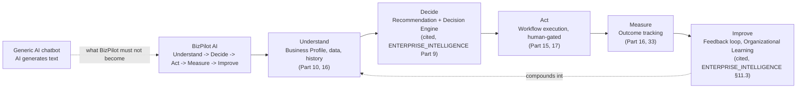

## 4. Problem Definition

**The problem is not that small businesses lack access to AI.** ChatGPT, generic copywriting tools, and template-based schedulers are all one tab away. **The problem is that none of those tools know anything about the specific business asking.** Every session starts from zero: the owner re-explains their business, re-pastes their brand voice, re-uploads context that evaporates the moment the session ends. The tool produces plausible-sounding output disconnected from what the business actually sells, who it actually serves, and what actually happened last month.

A second, distinct problem compounds the first for BizPilot AI's chosen market: **the best available AI tools are English-first and culturally generic.** An Azerbaijani beauty salon owner asking for Instagram captions in Azerbaijani, referencing local holidays, local customer communication norms, and local price sensitivity, gets noticeably worse output from every incumbent than an English-speaking, US-market business owner gets. This is not a translation problem — translating English marketing advice into Azerbaijani does not produce Azerbaijani marketing advice.

A third problem is structural, not just experiential: **even a perfect AI answer, if it is not connected to a workflow that acts, still leaves the owner to do the actual work by hand** — copy the caption into Instagram, message the customer back manually, re-key the spreadsheet total into a note app. The value BizPilot AI must deliver is on the far side of that gap, not the near side of it.

## 5. Target Customer

### 5.1 Segment Evaluation

| Segment | Pain | Ability to pay | Workflow frequency | Acquisition cost | AI automation potential | AZ market fit | Verdict |
|---|---|---|---|---|---|---|---|
| Beauty & wellness salons/studios | High — constant WhatsApp/Instagram inquiries, manual booking follow-up, weekly content pressure | Medium-High — recurring revenue, real marketing spend already | Very high — daily customer messages, weekly content need | Low — dense, visible, referral-friendly niche in Baku | Very high — all three killer workflows apply directly | Very strong — Instagram-commerce and WhatsApp-first communication are already the default | **Primary ICP** |
| Small Instagram/WhatsApp retail shops | High — same channel dynamics as salons | Medium — thinner margins, more price-sensitive | High — daily inbound DMs/messages | Low — same channel density | High — CRM + content workflows apply directly; financial analysis matters more (inventory/margin) | Very strong | **Secondary ICP, same wedge** |
| Restaurants/cafes | Medium — real but less acute than salons | Medium — thin margins, high churn as businesses | Medium — content need real, CRM need weaker (less repeat 1:1 messaging) | Low | Medium | Strong | Deferred — weaker CRM fit |
| Agencies | They resell tools, are not the end customer for a single-business Copilot | High, but wrong sales motion for MVP | N/A as a segment | Requires channel/partner motion, not direct | High, as a distribution partner later | Strong, but as GTM channel not ICP | Deferred to V2 partner motion (`GLOBAL_PLATFORM_ECOSYSTEM_ARCHITECTURE.md` Part 12, cited) |
| Freelancers | Real pain, low ability to pay a business-tier subscription | Low | Medium | Low | Medium | Medium | Rejected as primary — better served by Free tier than by product prioritization |
| Local service businesses (repair, cleaning, etc.) | Real | Medium | Medium — scheduling-heavy more than content-heavy | Medium — more fragmented, less visually discoverable | Medium | Strong | Deferred — weaker Marketing Autopilot fit (less visual/content-driven) |
| E-commerce (broader, non-Instagram-native) | Real, especially financial analysis | Medium-High | High | Medium-High — more competitive, more channels to reach | High | Medium — logistics/payment integrations less mature locally | Deferred to V2 — Integration Platform (Part 14) must mature first |
| Professional services (legal, consulting, accounting) | Real but lower content-marketing urgency | High | Low-Medium | Medium | Low-Medium for the three killer workflows specifically | Medium | Rejected as primary — weak fit to Marketing Autopilot and CRM-from-WhatsApp specifically |

### 5.2 Chosen ICP

**Primary ICP: small, Instagram/WhatsApp-native service and retail businesses in Azerbaijan — flagship persona, beauty and wellness salons/studios.** One owner-operator or small team, 1-15 staff, no dedicated marketing or finance role, WhatsApp and Instagram as the primary customer communication and discovery channels, revenue tracked in Excel/CSV or not at all, currently spending real but unmeasured time and money on content creation and customer follow-up.

This is deliberately narrow. `PRD.md`'s broader SMB target market and `ENTERPRISE_INTELLIGENCE_ARCHITECTURE.md`'s multi-company/holding-company architecture remain valid for later horizons (Part 24 of this document) — they are simply not who MVP is built for.

### 5.3 Persona: Günel, Salon Owner

Günel owns a nine-chair beauty studio in Baku. She posts to Instagram herself, usually late at night, usually without a plan. She answers WhatsApp inquiries about prices and availability between clients, from memory, inconsistently. She tracks monthly revenue in an Excel file her accountant sends back reconciled, three weeks after the month ends, by which point she cannot connect a bad month to a specific cause. She would pay for a tool that plans her month of content, answers routine WhatsApp questions correctly and consistently, and tells her — in Azerbaijani, in plain language — what her numbers actually mean and what to do about them.

## 6. Azerbaijan-First Strategy

### 6.1 What "Azerbaijan-First" Means Architecturally

Azerbaijan-first is a **go-to-market and localization-depth priority, not a hard-coded architectural assumption.** `FRONTEND_ARCHITECTURE.md`'s i18n mechanism (cited, unchanged) already treats locale as configuration; this document's addition is committing engineering effort to make Azerbaijani the **first fully-realized locale**, including business-domain terminology, not merely UI-string translation.

| Localization layer | Generic i18n (already exists) | Azerbaijan-first depth (this document's addition) |
|---|---|---|
| UI strings | `FRONTEND_ARCHITECTURE.md` i18n, cited | N/A — already sufficient |
| AI-generated content tone | N/A — provider-dependent | Prompt Registry (`AI_PLATFORM_ARCHITECTURE.md` §3.3, cited) entries authored natively in Azerbaijani, not translated from English prompts — a prompt-authoring discipline, not a new mechanism |
| Business terminology | N/A | A curated AZ business-term glossary feeding Context Engineering (`AI_PLATFORM_ARCHITECTURE.md` Part 4, cited) — new content, existing injection point |
| Local workflow templates | `Template`/`TemplateCategory` models already exist (`DATABASE.md`, cited) | AZ-specific `Template` rows (e.g. Novruz campaign content, local holiday calendar) — new data, existing schema |
| Local document understanding | RAG/document ingestion (`AI_PLATFORM_ARCHITECTURE.md` Part 7, cited) | Azerbaijani-language document parsing quality as an explicit acceptance criterion, not a new pipeline |
| Legal/tax informational assistance | N/A | §6.2 below — a distinct, carefully-bounded capability |

### 6.2 Legal/Tax Information: Explicit Boundary

BizPilot AI will **never present AI-generated legal, tax, or financial conclusions as authoritative advice.** Where a workflow touches tax-adjacent or legal-adjacent territory (for example, "what expense categories are typically deductible"), the system must:

1. Cite a versioned, sourced reference document (not the model's unverified training-time knowledge) — this requires the RAG/Knowledge Architecture (`AI_PLATFORM_ARCHITECTURE.md` Part 7, cited) pointed at a maintained corpus of authoritative Azerbaijani regulatory sources, not the general web.
2. Label the output explicitly as **informational, not advice**, every time, with no exception path.
3. Never compute or claim a specific tax liability, filing obligation, or legal conclusion — only surface sourced, cited informational content and route the business owner to a qualified professional for anything decision-bearing.
4. Track source document version and citation through the same reasoning-trace discipline `TRUST_SECURITY_COMPLIANCE_ARCHITECTURE.md` already requires for AI outputs generally (cited, unchanged).

This capability is explicitly **DEFERRED past MVP** (Part 21) — it requires a maintained, sourced corpus that does not yet exist, and shipping it prematurely with an unmaintained or unsourced corpus would be a direct violation of principle above. MVP's Business Analyzer (Part 11) surfaces financial facts and interpretations only, never tax/legal conclusions.

### 6.3 Local Market Context

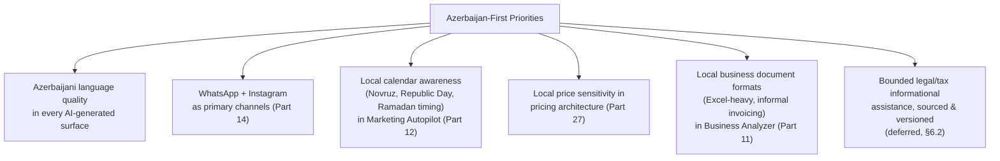

## 7. Global Expansion Strategy

The architecture must never encode an Azerbaijan-specific assumption where a locale-configurable one would do the same job — this is already `FRONTEND_ARCHITECTURE.md`'s i18n discipline and `GLOBAL_PLATFORM_ECOSYSTEM_ARCHITECTURE.md`'s GLOBAL/REGIONAL/TENANT-LOCAL classification (Part 17, cited), both reused unchanged. Global expansion is sequenced, not parallel: prove the product loop in one market with deep localization before diluting engineering effort across shallow multi-market support.

| Horizon | Geographic scope | What ships | Depends on |
|---|---|---|---|
| MVP-V1 | Azerbaijan only | Deep AZ localization (§6), no market-selection UI | — |
| V2 | Azerbaijan + Turkey (closest linguistic/cultural/market adjacency, shared regional business patterns) | Locale-configuration surfaced in UX (Part 20), second glossary/prompt set | Prompt Registry content discipline proven in AZ first |
| SCALE | Broader Turkic-language and CIS-adjacent markets | Multi-region data residency (`CLOUD_INFRASTRUCTURE.md` Stage B/C, cited) | Two-market localization pattern proven at V2 |
| GLOBAL | English-first international markets, Marketplace/ecosystem opens (`GLOBAL_PLATFORM_ECOSYSTEM_ARCHITECTURE.md`, cited) | Full ecosystem/developer platform | Sustained multi-region revenue |

## 8. Product Pillars

| # | Pillar | One-line definition | Primary document section |
|---|---|---|---|
| 1 | Business Copilot | Understands this specific business's context before answering | Part 10 |
| 2 | Data-to-Action Engine | Converts uploaded/connected data into fact-labeled insight and executable next steps | Part 16 |
| 3 | Workflow Engine | Executes the repetitive work a business owner does every week, with human-appropriate autonomy | Part 15, 17 |
| 4 | Azerbaijan-First Intelligence | Genuinely fluent, culturally and commercially grounded in the AZ market first | Part 6 |
| 5 | Integration Platform | Meets the business on the channels it already uses (WhatsApp, Instagram, Excel) rather than demanding migration | Part 14 |
| 6 | Trust by Design | Every autonomous action is bounded, auditable, and reversible by construction, reusing `TRUST_SECURITY_COMPLIANCE_ARCHITECTURE.md` unchanged | Part 19 |

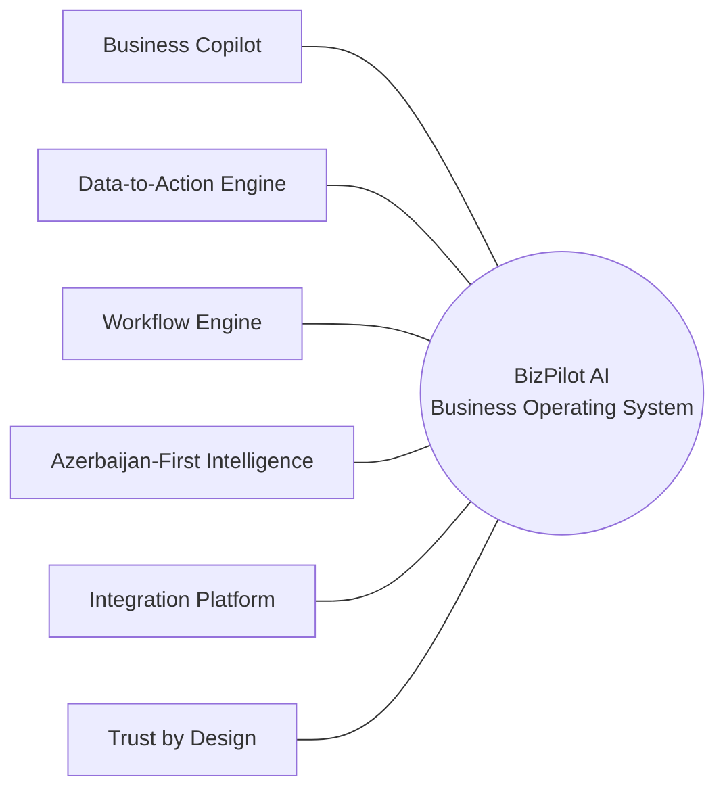

---

## 9. Core User Journeys

### 9.1 First-Session Journey (see Part 20 for full UX detail)

```mermaid
flowchart LR
    A["Create account\n(AUTH_ARCHITECTURE.md, cited)"] --> B["Create workspace\n(existing Workspace model)"]
    B --> C["Describe business\n(BusinessProfile, existing model)"]
    C --> D["Upload data\n(File, existing model)"]
    D --> E["BizPilot understands business\n(Business Copilot, Part 10)"]
    E --> F["See Business Health snapshot\n(Part 11, MVP-scoped subset)"]
    F --> G["Receive 3 recommendations\n(Decision Engine, cited)"]
    G --> H["Run first workflow\n(Marketing Autopilot or Analyzer, Part 12/11)"]
    H --> I["See measurable result\n(Part 16, 33)"]
```

### 9.2 Weekly-Use Journey

Günel (§5.3) opens BizPilot AI on a Monday. The Copilot surfaces: this week's content plan (from last month's Marketing Autopilot run, Part 12), two unanswered WhatsApp inquiries the CRM & Sales Assistant (Part 13) flagged for human response, and one financial anomaly (Part 11) from the weekend's sales upload. Each item is one click from being handled — approve the drafted caption, approve the drafted WhatsApp reply, or dismiss the anomaly with a reason. This is the loop the product must make effortless before anything else.

### 9.3 Recovery/Trust Journey

When a workflow produces a wrong or low-confidence output, the owner must be able to see *why* (Reasoning Trace, `ENTERPRISE_INTELLIGENCE_ARCHITECTURE.md` §9.5, cited), correct it in one interaction, and have that correction improve future output for their specific workspace (Organizational Learning, cited, §11.3 of that document) — never a silent failure and never a black box.

## 10. Business Copilot

### 10.1 What It Is

A conversational surface, built on the existing `Conversation`/`Message` schema (`DATABASE.md`, cited, unchanged) and the existing Orchestration Engine (`AI_PLATFORM_ARCHITECTURE.md` Part 2, cited), whose defining feature is **context assembly**, not model choice. The Copilot is only as good as what it is allowed to see about the business asking.

### 10.2 Context Sources (MVP Scope)

| Source | Existing model | MVP-included | Notes |
|---|---|---|---|
| Business Profile | `BusinessProfile` | Yes | Name, industry, description, target audience, tone, offerings — all fields already exist |
| Uploaded files | `File`, `Project`, `Folder` | Yes | Text/spreadsheet extraction feeds Business Analyzer (Part 11) and RAG context (`AI_PLATFORM_ARCHITECTURE.md` Part 7, cited) |
| Conversation history | `Conversation`, `Message` | Yes | Existing schema, no changes needed |
| Business metrics | Derived from Business Analyzer output (Part 11) | Yes, MVP-scoped | Not a new source of truth — computed, not separately stored, at MVP |
| Marketing/content history | `Template`, workflow run history (Part 15's new `WorkflowInstance`) | Yes, once first Marketing Autopilot run exists | Empty on day one by definition |
| Customer/CRM data | New `Contact`/`Lead` models (Part 38) | V1, not MVP | See Part 13, 21 |
| User permissions | `Role`, `Permission`, `WorkspaceMember` | Yes | The Copilot never sees or offers an action beyond the asking user's actual RBAC grants — enforced identically to every other authenticated request, no AI-specific bypass |

### 10.3 What the Copilot Must Never Do

Restated from `TRUST_SECURITY_COMPLIANCE_ARCHITECTURE.md` (cited, unchanged, not re-derived here): never bypass authorization, never fabricate a financial or legal conclusion (§6.2), never execute an action beyond its current Autonomous Decision Level (Part 17) for that action-type, never silently escalate its own authority.

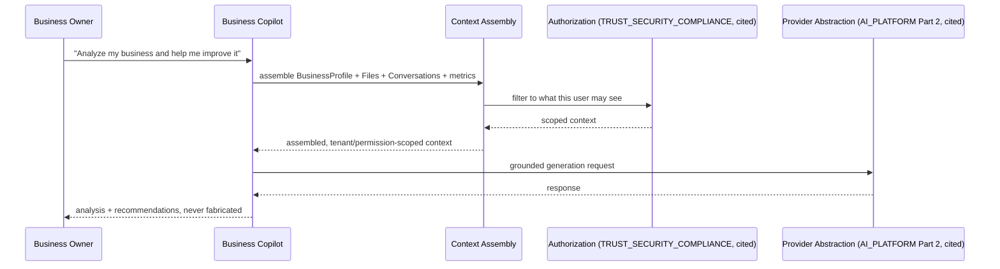

## 11. Business Analyzer

### 11.1 Purpose

Turns an uploaded Excel/CSV/structured report into revenue, expense, profit, margin, growth, and trend understanding, then — critically — into an explicit, labeled chain from fact to action.

### 11.2 The Fact/Interpretation/Recommendation Discipline

Every Business Analyzer output is composed of explicitly labeled segments, never blended:

| Label | Definition | Example |
|---|---|---|
| **Observed fact** | A value read directly from the uploaded data, no computation | "Marketing expense line: 1,200 AZN in July, 1,440 AZN in August" |
| **Calculated metric** | A deterministic computation over observed facts | "Marketing expense increased 20% month-over-month" |
| **AI interpretation** | A pattern the model identifies, explicitly flagged as interpretation | "Sales revenue over the same period did not show a proportional increase" |
| **Recommendation** | An explicit, actionable suggestion, never phrased as a conclusion | "Recommended action: review campaign-level performance and identify channels with weak conversion before increasing the marketing budget" |
| **Assumption** | Anything the analysis had to assume because the data did not specify it | "Assumes uploaded categories are consistent month-to-month; not verified against a chart of accounts" |
| **Uncertainty** | An explicit confidence qualifier, reusing `COMMERCIAL_INTELLIGENCE_ARCHITECTURE.md`'s High/Medium/Low confidence-labeling discipline (cited, same pattern applied to product output, not commercial value) | "Medium confidence — one month of comparison data is a thin sample" |

This is a **binding output contract**, not a style guideline — the rendering layer (Part 20) enforces that these five categories are visually distinct, and the Prompt Registry entry (`AI_PLATFORM_ARCHITECTURE.md` §3.3, cited) for this workflow is structured (not free text) specifically so the model cannot blend them.

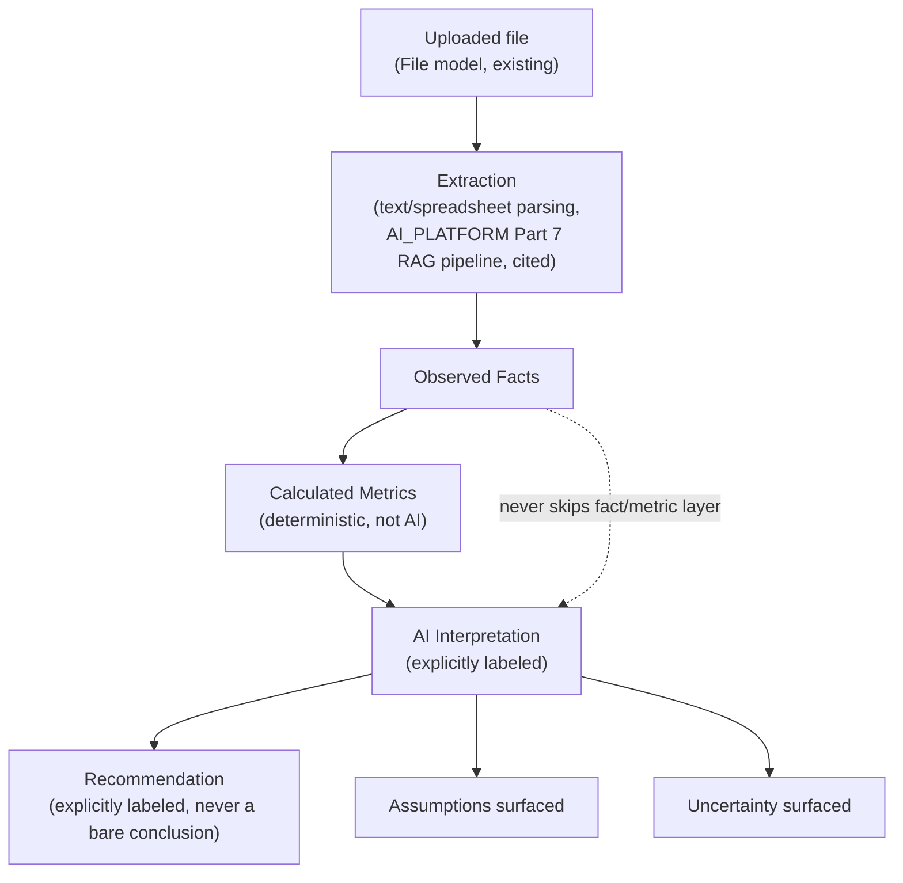

### 11.3 Never-Fabricate Rule

The Business Analyzer must never produce a financial conclusion (a specific tax liability, a specific legal compliance judgment, a specific investment recommendation — restated from the Prohibited-action boundary this entire product operates under) that is not directly traceable to an Observed Fact or Calculated Metric in the same output. This is enforced at the prompt-contract level (structured output requiring a `sourceFactIds` reference per interpretation/recommendation), not by instruction alone — an unreferenceable claim is a template-validation failure, not merely a style violation.

### 11.4 MVP Scope

MVP supports one file per analysis run, Excel/CSV only, revenue/expense/category-level analysis only (no multi-file trend analysis, no accounting-system integration — Part 14). This is deliberately narrow; Part 22-23 expand it.

## 12. Marketing Autopilot — Killer Workflow "Create My Monthly Marketing Plan"

### 12.1 Why Not "Generate 30 Posts"

A list of 30 disconnected post ideas is a generic-chatbot output — exactly what this product must not become (§2). The workflow instead runs the full chain: **business → audience → objective → strategy → content → measurement**, and every post in the resulting calendar traces back to a content pillar, which traces back to a stated objective, which traces back to the Business Profile.

### 12.2 Input Contract

| Input | Source | Required for MVP |
|---|---|---|
| Business Profile (industry, audience, offerings, tone, voice) | `BusinessProfile`, existing | Yes |
| Goals | New free-text + structured input at workflow start (no new model — stored as `WorkflowInstance.input`, Part 15) | Yes |
| Previous content performance | Deferred — requires an Integration (Part 14) to a connected social account; MVP asks the owner to describe qualitatively instead | MVP: qualitative only |
| Available products/services | `BusinessProfile.offerings` (existing JSON field) | Yes |
| Preferred channels | New structured input at workflow start | Yes, MVP defaults to Instagram + WhatsApp |

### 12.3 Processing Chain

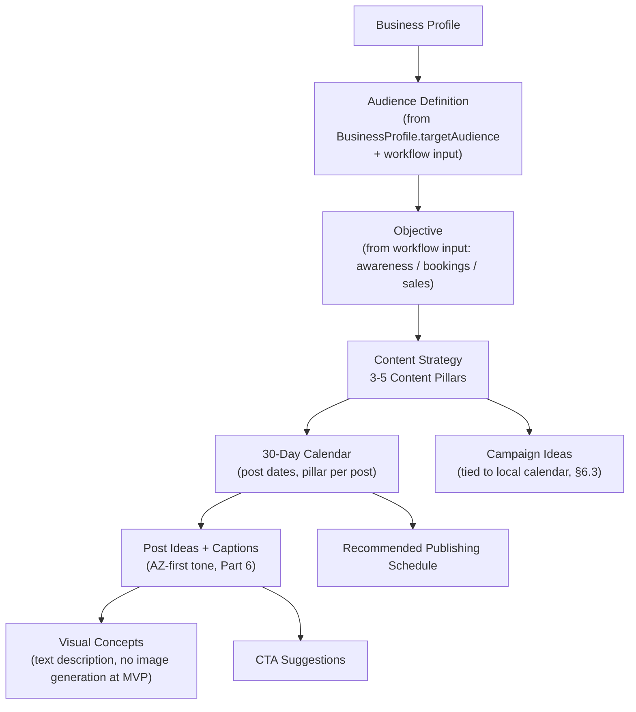

### 12.4 Output Contract

30-day calendar (date, pillar, format, caption draft, visual concept, CTA), 3-5 named content pillars each with a one-line rationale tying it to the stated objective, 2-4 campaign ideas anchored to real calendar events (§6.3), and one recommended publishing cadence. Every caption is a **draft** (Autonomy Level L1, Part 17) — MVP never auto-publishes.

### 12.5 Reusable Workflow Template

This workflow is the first instance of the general Workflow Engine (Part 15) and the general Workflow Ecosystem template shape (`GLOBAL_PLATFORM_ECOSYSTEM_ARCHITECTURE.md` Part 9, cited) — implemented as a named, versioned `WorkflowDefinition` (Part 38) with this exact input/processing/output contract, not as bespoke one-off code, specifically so it can later be forked per-industry (a restaurant's content pillars differ from a salon's) without a second workflow mechanism.

## 13. CRM & Sales Assistant — Killer Workflow "Message to Structured Process"

### 13.1 The Eleven-Step Chain (As Specified, MVP-Scoped Subset Marked)

| # | Step | MVP | Depends on |
|---|---|---|---|
| 1 | Receive message | V1 | Integration Platform, WhatsApp Business API (Part 14) |
| 2 | Identify customer | V1 | New `Contact` model (Part 38), matched on phone number |
| 3 | Create/update contact | V1 | `Contact` model |
| 4 | Classify intent | V1 | AI classification call (existing Orchestration Engine, cited) |
| 5 | Extract lead information | V1 | Structured extraction, same mechanism as Business Analyzer's structured output (§11.2) |
| 6 | Determine appropriate response | V1 | Prompt Registry entry + Business Profile context (Part 10) |
| 7 | Draft or send response per authorization | V1 (draft only, L1) / V2 (send, L2+) | Human-in-the-Loop (Part 17) |
| 8 | Create/update lead | V1 | New `Lead` model (Part 38) |
| 9 | Schedule follow-up | V1 | Workflow Engine scheduling (Part 15, reusing `BACKEND_ARCHITECTURE.md` §8.6 Scheduler, cited) |
| 10 | Record activity | V1 | Existing `Activity` model (`DATABASE.md`, cited) |
| 11 | Measure conversion | V2 | Requires Lead pipeline stages and outcome tracking maturity (Part 16) |

**MVP itself does not include this workflow end-to-end** — it requires the WhatsApp Integration (Part 14) and new CRM schema (Part 38), both classified V1. MVP validates the underlying pieces individually: intent classification and structured extraction are exercised through the Business Copilot (Part 10) against manually-pasted message text, proving the AI mechanism before the channel integration is built.

### 13.2 Authorization Discipline

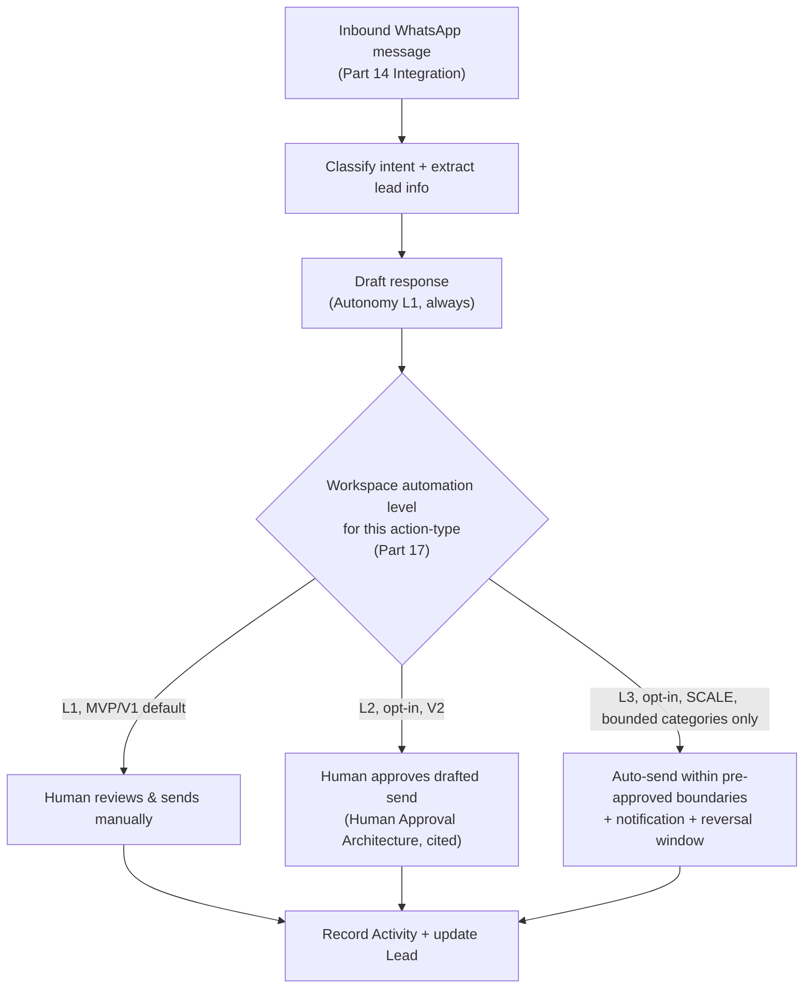

External communication automation never defaults above L1; every escalation is an explicit, per-workspace, per-action-type owner decision — restated from, not a new instance of, the binding rule already established in `ENTERPRISE_INTELLIGENCE_ARCHITECTURE.md` ADR-EI-021 and `GLOBAL_PLATFORM_ECOSYSTEM_ARCHITECTURE.md`'s Tier-0 AI-never-self-escalates rule (both cited, unchanged, Part 17 restates their application to this specific workflow).

---

## 14. Integration Platform

### 14.1 Framework, Not a Feature List

Every integration BizPilot AI ever builds implements the already-designed, generic Connector Contract (`GLOBAL_PLATFORM_ECOSYSTEM_ARCHITECTURE.md` §4.2, cited unchanged: Connector/Integration/Credential/Connection/Capability/Trigger/Action/Webhook/Polling) and the HARD REQUIREMENT resilience rules (retry/backoff/idempotency/circuit-breaker, ADR-PLAT-011, cited). This document does not define a second, simpler integration mechanism for MVP — it defines which Connectors get built first and why, using that document's existing contract from the very first one.

### 14.2 Prioritization Scoring

| Integration | Customer value | AZ relevance | Technical feasibility | Security implications | API availability | Cost | Revenue potential | Strategic defensibility | Priority |
|---|---|---|---|---|---|---|---|---|---|
| WhatsApp Business API | Very High | Very High — default channel | Medium — official API requires business verification; unofficial routes rejected (§14.3) | Medium — customer PII in messages | Available, gated | Medium (per-conversation pricing) | High — unlocks CRM & Sales Assistant (Part 13) entirely | High — hardest integration to replicate well | **P0, V1** |
| Instagram (content publishing + DM) | Very High | Very High — default channel | Medium — Meta Graph API, business account requirement | Medium | Available, gated | Low | High — unlocks Marketing Autopilot auto-publish | High | **P0, V1** |
| Excel/CSV upload | Very High | High — dominant local format | High — no external API, local parsing only | Low | N/A (file upload) | Low | Medium — enables Business Analyzer | Low — commodity capability, but required table stakes | **P0, MVP** (already required by Part 11, not a future integration) |
| Email | Medium | Medium — secondary channel locally | High — standard SMTP/IMAP or provider API | Low-Medium | Available | Low | Medium | Low — commoditized | P1, V1 |
| Telegram | Medium | Medium — secondary but real usage in AZ | High — well-documented Bot API | Low-Medium | Available, ungated | Low | Low-Medium | Low | P2, V2 |
| Google Drive / MS 365 | Low-Medium for ICP (§5) — salons rarely use these | Low for ICP | High | Medium — broad file-access scope | Available | Low | Low for ICP | Low | P3, DEFERRED past V2 |
| Bank data / local financial providers | High long-term, low near-term (ICP tracks revenue in Excel, not via bank feeds yet) | High if available | Low — limited open banking API availability in AZ market today | High — financial credential handling | Uncertain/limited | Uncertain | High if available | High if achievable — few competitors can do this locally | P2, SCALE — explicitly gated on API availability research, not committed |
| Accounting systems (local) | Medium-High | High | Uncertain — depends on specific local platform APIs | Medium | Uncertain | Uncertain | Medium | Medium | P3, SCALE, research-gated |
| Advertising platforms (Meta Ads, Google Ads) | Medium | Medium | High — well-documented APIs | Low-Medium | Available | Low-Medium | Medium — enables real content-performance feedback into Marketing Autopilot (§12.2) | Medium | P2, V2 |
| CRM external sync (HubSpot, etc.) | Low for ICP — ICP has no existing CRM to sync from | Low for ICP | High | Low | Available | Low | Low for ICP, higher for later segments | Low for ICP | P3, DEFERRED — revisit if ICP expands (Part 24) |

Full priority-matrix detail with the eight-factor scoring methodology is formalized in Part 44; this table is the product-strategy-level summary.

### 14.3 WhatsApp: Official API Only

BizPilot AI integrates **only** through Meta's official WhatsApp Business Platform API, never through unofficial/reverse-engineered WhatsApp automation. This is a binding constraint: unofficial approaches carry account-ban risk for the customer's own WhatsApp number and would make BizPilot AI complicit in a Terms-of-Service violation against a customer's primary communication channel — an unacceptable trust and business-continuity risk regardless of the short-term integration-speed advantage.

### 14.4 What Is Explicitly Not Built at MVP/V1

Bank integrations, accounting-system integrations, Google Drive/MS 365, and external CRM sync are all deliberately absent from V1. Building them before WhatsApp/Instagram/Excel would optimize for integration breadth over the specific workflows (Parts 11-13) that create first-session value for the chosen ICP (§5) — exactly the premature-breadth mistake this document exists to avoid.

## 15. Workflow Engine

### 15.1 The One Genuine Schema Gap

`AI_PLATFORM_ARCHITECTURE.md` §10.1 designs the Workflow Engine's *behavior* (a state-machine coordinator dispatching steps as Jobs on the existing Queue, reusing the Task Scheduler and Event Bus, cited unchanged) but explicitly defers its *persistence schema*: **"a `WorkflowInstance`'s durable state... requires persistence beyond what any existing `DATABASE.md` model provides — (future schema extension, not required today)."** This document is where "today" arrives — the Marketing Autopilot (Part 12), Business Analyzer (Part 11), and CRM & Sales Assistant (Part 13) all require it to exist as real, running code.

### 15.2 Minimal Required Schema (Full Field Treatment in Part 38)

Three new models, deliberately minimal: `WorkflowDefinition` (the reusable template — e.g., "Monthly Marketing Plan v1"), `WorkflowInstance` (one running/completed execution of a definition, holding current step and accumulated step outputs — exactly the state `AI_PLATFORM_ARCHITECTURE.md` §10.1 flagged as needed), and `WorkflowStepRun` (one step's individual execution record, for observability and retry, reusing the Job idempotency pattern `BACKEND_ARCHITECTURE.md` §8.5 already established). No fourth model, no bespoke DSL engine — the state machine shape is exactly what §10.1's Mermaid `stateDiagram-v2` already specifies; this document supplies the missing table definitions, not a new design.

### 15.3 Reused Infrastructure (Not Rebuilt)

| Capability | Reused from | This document's role |
|---|---|---|
| Step execution | `BACKEND_ARCHITECTURE.md` §8 Job/Queue system | None — used as-is |
| Time-based resumption | `BACKEND_ARCHITECTURE.md` §8.6 Scheduler (BullMQ repeatable jobs) | None — used as-is |
| Trigger events | `BACKEND_ARCHITECTURE.md` §13.1 Event Bus | None — used as-is |
| Retry/idempotency | `BACKEND_ARCHITECTURE.md` §8.3, §8.5 | None — used as-is |
| AI step execution | `AI_PLATFORM_ARCHITECTURE.md` Part 2 Orchestration Engine, Part 9 Agent Runtime (for multi-step reasoning steps only) | None — used as-is |
| Marketplace-compatible template shape | `GLOBAL_PLATFORM_ECOSYSTEM_ARCHITECTURE.md` Part 9 Workflow Ecosystem | `WorkflowDefinition` (§15.2) is authored to already conform to that shape, so a later marketplace-publication path (that document's SCALE horizon) requires no schema migration |

### 15.4 MVP Trigger Types

MVP supports **manual trigger only** (the owner clicks "Create My Monthly Marketing Plan" or "Analyze This File"). Scheduled, event, file-upload-as-trigger, CRM-triggered, communication-triggered, and AI-triggered workflow starts are all real, designed capabilities of the underlying Event Bus/Scheduler (already cited, reused) — they are a V1/V2 product-surface decision (Part 22-23), not a missing architectural capability.

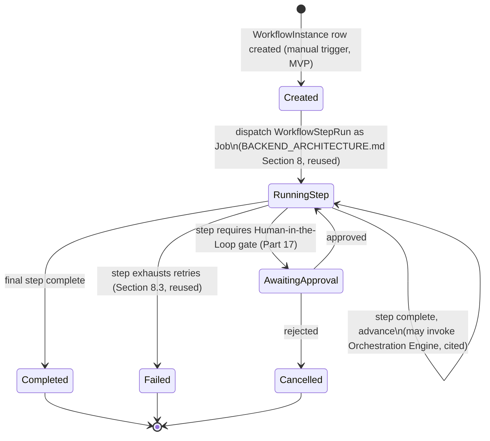

## 16. Data-to-Action Engine

### 16.1 One Loop, Not a New System

`DATA → UNDERSTANDING → INSIGHT → DECISION → WORKFLOW → ACTION → RESULT → MEASUREMENT` is not a new architecture — it is the explicit name for how Parts 10 (Copilot/Understanding), 11 (Analyzer/Insight), the Decision Engine (`ENTERPRISE_INTELLIGENCE_ARCHITECTURE.md` §9.2, cited), 15 (Workflow/Action), and Part 33 (Measurement) already connect. This section exists to state the connection explicitly, once, so no future phase mistakes any single stage for a standalone feature.

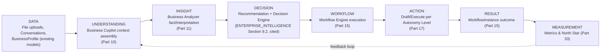

### 16.2 Ingestion & Normalization (MVP Scope)

Ingestion is file upload (existing `File` model) and conversational text (existing `Message` model) only at MVP — no connector-sourced data ingestion (Part 14 integrations feed this same pipeline starting V1). Normalization is extraction into structured facts (Business Analyzer, §11.2) — no separate normalization service; this is a processing step within the Business Analyzer workflow, not a standing pipeline component, at MVP scale.

### 16.3 Feedback Loops

MVP records whether a recommendation was accepted, edited, or dismissed (a new, minimal field set on `WorkflowInstance`, Part 38 — not a new model). This is the seed of `ENTERPRISE_INTELLIGENCE_ARCHITECTURE.md`'s Organizational Learning (§11.3, cited) — MVP does not implement that document's full learning system, but its data shape is chosen so V1/V2 can build the learning loop on top without a schema migration.

## 17. Human-in-the-Loop

### 17.1 Reusing the Existing Ladder, Not Building a Second One

The task framing that motivated this section (L0 Suggest → L1 Draft → L2 Execute-with-approval → L3 Execute-within-boundaries → L4 Highly autonomous) maps closely, but not label-for-label, onto the already fully-specified Autonomous Decision Level ladder in `ENTERPRISE_INTELLIGENCE_ARCHITECTURE.md` §9.7 (cited, unchanged). Rather than define a second, slightly-different five-level ladder — which would fracture governance across two incompatible numbering systems — **this document adopts that ladder as authoritative** and maps this product's workflow actions onto it directly:

| This document's shorthand | `ENTERPRISE_INTELLIGENCE_ARCHITECTURE.md` §9.7 level | Applies to (MVP/V1 examples) |
|---|---|---|
| Suggest only | **L0 — Observe** | A brand-new workflow action-type with no track record yet |
| Draft | **L1 — Recommend** | Platform-wide default: Marketing Autopilot captions, Business Analyzer recommendations, CRM draft replies — all MVP/V1 output stops here unless a human explicitly raises it |
| Execute after approval | **L2 — Act-with-approval** | V2, opt-in per workspace: publishing a drafted Instagram post, sending a drafted WhatsApp reply |
| Execute within boundaries | **L3 — Act-with-notification** | SCALE, opt-in, narrow action-types only, requires calibration history |
| Highly autonomous | **L4 — Full autonomy within budget** | SCALE+, explicitly never available for any financial-commitment or fraud-adjacent action-type, per that document's own binding exclusion |

### 17.2 MVP/V1 Default

**Every action-type in this document defaults to L1 (Recommend/Draft) and nothing in MVP or V1 ships above L2, opt-in only.** This is a deliberate, conservative product decision layered on top of the architecture's existing floor — the architecture permits graduated autonomy; the product strategy in this document chooses not to exercise most of that permission yet, because trust with a first cohort of real, paying Azerbaijani business owners has to be earned before it is spent.

### 17.3 Governance Restated, Not Redefined

The AI never raises its own Autonomous Decision Level — restated, not newly invented, from `ENTERPRISE_INTELLIGENCE_ARCHITECTURE.md` ADR-EI-021 and `GLOBAL_PLATFORM_ECOSYSTEM_ARCHITECTURE.md`'s Tier-0 principle (both cited). Every L2+ configuration change is an explicit, logged, workspace-owner action, using the existing `AuditLog` model (`DATABASE.md`, cited, unchanged).

## 18. AI Workforce Integration

### 18.1 MVP Workflows Are Not AI Employees

`ENTERPRISE_INTELLIGENCE_ARCHITECTURE.md` Part 2 and `GLOBAL_PLATFORM_ECOSYSTEM_ARCHITECTURE.md` Part 8 define AI Employees as named, seated, persistent Agent Runtime instances with accumulated workspace-specific memory. The three killer workflows (Parts 11-13) are **not** AI Employees at MVP — they are direct, single-purpose Workflow Engine (Part 15) executions invoking the Orchestration Engine (`AI_PLATFORM_ARCHITECTURE.md` Part 2) or, where multi-step reasoning genuinely helps (e.g., the Business Analyzer's fact-extraction-then-interpretation chain), the Agent Runtime (Part 9, cited) — but never presented to the user as a named, persistent "AI employee" persona at this stage.

### 18.2 Why This Sequencing Is Deliberate

Introducing a named AI Employee persona (e.g., "your AI Marketing Manager") before the underlying workflow has a proven, reliable output would create a trust liability: a named, personified AI failing at a task reads as a broken relationship, not a broken feature. V2 (Part 23) introduces the first real AI Employee seat — an "AI Marketing Assistant" wrapping the now-proven Marketing Autopilot workflow — once the underlying mechanism has a track record, reusing the existing Employee Package model (`GLOBAL_PLATFORM_ECOSYSTEM_ARCHITECTURE.md` §8.2, cited) without modification.

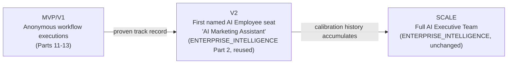

---

## 19. Privacy & Trust

### 19.1 Fully Inherited, Not Redesigned

Encryption, tenant isolation, RBAC, audit trails, retention, secure storage, secrets management, data classification, and access logging are all fully specified in `TRUST_SECURITY_COMPLIANCE_ARCHITECTURE.md` (cited, unchanged) and implemented at the schema level by `DATABASE.md`'s existing `AuditLog`, `Activity`, and tenant-scoped-everything design (cited, unchanged). This document adds nothing new to that architecture — it states which of it is load-bearing for the specific data types this product's MVP customer uploads.

### 19.2 What's Different About This Product's Data

The chosen ICP (§5) uploads financial spreadsheets and exposes customer conversations to the platform — both `TRUST_SECURITY_COMPLIANCE_ARCHITECTURE.md`'s Data Classification tiers already cover (cited: Confidential for financial data, Restricted-leaning for customer PII in messages), but MVP must operationalize the specific controls, not merely inherit the classification label:

| Control | Existing mechanism | MVP operationalization |
|---|---|---|
| Encryption at rest/in transit | `CLOUD_INFRASTRUCTURE.md`, `TRUST_SECURITY_COMPLIANCE_ARCHITECTURE.md`, cited | No new work — inherited from infrastructure layer |
| Tenant isolation | `DATABASE.md` `workspaceId` scoping, `TRUST_SECURITY_COMPLIANCE_ARCHITECTURE.md` 10-layer model, cited | No new work |
| File deletion | Existing `File.deletedAt` soft-delete + `TRUST_SECURITY_COMPLIANCE_ARCHITECTURE.md` retention/purge policy, cited | Verified end-to-end for uploaded financial spreadsheets specifically — a launch-readiness checklist item (Part 47), not new architecture |
| Export/deletion workflows | `TRUST_SECURITY_COMPLIANCE_ARCHITECTURE.md` Part 14, cited | Must exist and be user-triggerable before any AZ launch handling real customer PII — a hard MVP/V1 requirement (Part 21), not a later nice-to-have |
| AI provider data controls | `AI_PLATFORM_ARCHITECTURE.md` Part 13, cited | See §19.3 — an honesty requirement, not a technical one |

### 19.3 No Unsupported Training-Data Claims

BizPilot AI will **not** claim that any AI provider does not train on customer data unless that provider's actual, current contractual terms guarantee it in writing for the specific plan/API tier in use. The mock provider used for MVP development (Part 43) trivially satisfies this — it sends nothing anywhere. Once a real provider is selected (Part 42), the specific, current data-use terms for that provider's business/API tier must be verified and cited before any customer-facing privacy claim is made. This is a standing constraint on marketing and product copy, not merely an engineering note.

## 20. UX Architecture

### 20.1 First-Time Experience

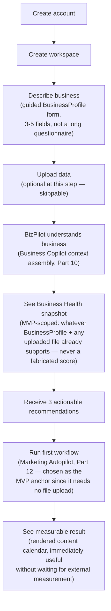

### 20.2 Design Principle: Minutes, Not Enterprise Complexity

The full Dashboard Shell, Plugin sandbox, Workflow Builder, and AI Employee Workspace (`FRONTEND_ARCHITECTURE.md` §4.10, §14.1, §9.6, §9.5, all cited) are real, already-designed surfaces — and all are explicitly **not** shown to a first-session MVP user. MVP's UI surface is deliberately a subset: onboarding (§20.1), one Copilot conversation view, one Marketing Autopilot result view, one Business Analyzer result view. Every other existing frontend-architecture surface activates progressively as V1/V2 features (Part 22-23) ship, per that document's own component system — no new frontend architecture, a curated activation order.

### 20.3 Localized From the First Screen

Every screen in §20.1 renders in Azerbaijani by default for AZ-market signups (`FRONTEND_ARCHITECTURE.md` i18n, cited) — not as a toggle discovered later, since language quality is a Pillar (Part 8), not a setting.

## 21. MVP Scope

**Definition: the smallest product capable of proving that a real Azerbaijani business owner will pay for it.**

| Included | Explicitly excluded |
|---|---|
| Auth, Workspace, BusinessProfile (existing schema, needs backend implementation only) | Any integration (WhatsApp, Instagram, email, Telegram) — Part 14 |
| Business Copilot (Part 10), text-only, manually-pasted context | CRM & Sales Assistant end-to-end (Part 13) — needs WhatsApp integration |
| Business Analyzer (Part 11), single Excel/CSV upload, revenue/expense only | Multi-file trend analysis, accounting-system integration |
| Marketing Autopilot (Part 12), full workflow, draft-only output (L1) | Auto-publish to any channel |
| Workflow Engine (Part 15) — minimal schema (§15.2), manual trigger only | Scheduled/event/CRM triggers |
| Mock AI Provider (Part 43) — real provider pluggable, not required to build MVP | Any paid AI API dependency |
| FREE + STARTER tier only (`COMMERCIAL_INTELLIGENCE_ARCHITECTURE.md` §9.2, cited, unchanged) | PRO/BUSINESS/ENTERPRISE tier feature depth |
| Export/deletion workflow (§19.2) — hard requirement, not deferred | Full Compliance Control Plane surface (`TRUST_SECURITY_COMPLIANCE_ARCHITECTURE.md` Part 14) |
| Azerbaijani localization for the MVP screen set (§20.1) | Turkey/second-market localization |

**MVP exit criterion:** a minimum of ten real Azerbaijani small-business owners (drawn from the primary ICP, §5) complete onboarding, run at least one Marketing Autopilot workflow, and at least three convert to a paid STARTER-tier subscription without founder intervention in the payment step.

## 22. V1 Scope

**Definition: the first commercially credible product** — adds the integrations and CRM schema that make the full three-killer-workflow vision (Parts 11-13) real, not merely demonstrable.

| Added over MVP | Depends on |
|---|---|
| WhatsApp Business API integration (Part 14) | Meta business verification (external, non-engineering dependency — flagged in Part 51) |
| Instagram integration (content publishing, DM read) | Meta Graph API access |
| `Contact`/`Lead` schema (Part 38) | — |
| CRM & Sales Assistant, steps 1-6, 8-10 of §13.1 (draft-response only, L1) | WhatsApp integration above |
| Real AI provider behind `AIProviderPort` (Part 42), alongside mock | Founder's provider-cost decision (flagged as external dependency, Part 51) |
| Export/deletion workflow surfaced in UI (already backend-required at MVP, §21) | — |
| Multi-file Business Analyzer (trend across 2+ uploads) | — |
| PRO tier unlocked (`COMMERCIAL_INTELLIGENCE_ARCHITECTURE.md` §9.2, cited) | — |

## 23. V2 Scope

**Definition: automation and integrations** — this is where the product starts acting, not only recommending.

| Added over V1 | Depends on |
|---|---|
| L2 (Act-with-approval) opt-in for Instagram publish and WhatsApp send (Part 17) | Track record from V1 draft-only usage |
| First named AI Employee seat — "AI Marketing Assistant" (Part 18.2) | Employee Package model (`GLOBAL_PLATFORM_ECOSYSTEM_ARCHITECTURE.md` §8.2, cited), V1 workflow track record |
| Scheduled and event-triggered workflows (Part 15.4) | — |
| Email integration (Part 14) | — |
| Advertising-platform integration for real content-performance feedback (§12.2) | — |
| Telegram integration | — |
| Turkey market localization (§7) | AZ-market retention/activation proof (Part 32) |
| BUSINESS tier unlocked | — |

## 24. Scale Roadmap

**Definition: multi-business and international expansion.**

| Added over V2 | Depends on |
|---|---|
| L3 autonomy for narrow, calibrated action-types | Sustained V2 calibration history |
| Bank/accounting integrations (Part 14, research-gated) | External API-availability research outcome |
| Full AI Executive Team (`ENTERPRISE_INTELLIGENCE_ARCHITECTURE.md` Part 2, cited unchanged) | Proven single-AI-Employee retention (V2) |
| Multi-region infrastructure (`CLOUD_INFRASTRUCTURE.md` Stage B/C, cited) | Sustained revenue outside AZ |
| Broader ICP expansion (restaurants, local services, §5.1's deferred segments) | Primary-ICP product-market fit proof |
| ENTERPRISE tier unlocked | — |

## 25. Global Roadmap

**Definition: developer platform, marketplace, advanced AI workforce, enterprise expansion** — this horizon is `GLOBAL_PLATFORM_ECOSYSTEM_ARCHITECTURE.md` in full (cited, unchanged): Developer Platform, Marketplace, Partner Platform, White-Label/OEM. Nothing in this document adds to that architecture; this section exists only to state explicitly that it remains the correct GLOBAL-horizon plan and that none of it should be pulled forward ahead of Scale-horizon proof, per that document's own Part 27 roadmap discipline (cited).

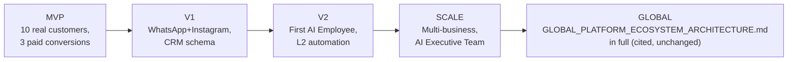

---

## 26. Monetization Strategy

### 26.1 Reuse, Not Redesign

`COMMERCIAL_INTELLIGENCE_ARCHITECTURE.md`'s five-tier `FREE/STARTER/PRO/BUSINESS/ENTERPRISE` matrix (§9.2, cited, unchanged), Value≠Usage≠Cost≠Price discipline (§0.2, cited), and Credit Economy (cited) are fully adopted as-is. This section maps this document's three killer workflows and MVP/V1/V2 scope onto that existing structure — it does not define a second pricing model.

### 26.2 Bundle Mapping

| `COMMERCIAL_INTELLIGENCE_ARCHITECTURE.md` §9.3 bundle | This document's workflows | Tier availability |
|---|---|---|
| Core Platform | Business Copilot (Part 10) | All paid tiers, limited Free |
| Automation | Workflow Engine execution (Part 15), Marketing Autopilot (Part 12) | Starter+ |
| Intelligence | Business Analyzer (Part 11) | Starter+ (basic), Pro+ (multi-file trend, V1) |
| AI Workforce | First AI Employee seat (Part 18.2, V2) | Business+ per existing gating (§9.2, cited) |
| Enterprise | N/A at this horizon | Deferred to Scale/Global (Part 24-25) |

### 26.3 Why Not Raw Token Cost

Restated from `COMMERCIAL_INTELLIGENCE_ARCHITECTURE.md`'s Value≠Usage≠Cost≠Price discipline (cited, unchanged): a business owner pays for a completed content calendar or a diagnosed financial anomaly, not for a token count. AI Credits (existing `AICredit`/`AIUsage` schema, cited) remain the internal cost-accounting mechanism; pricing is expressed to the customer in workflow-completion and capability terms (workspace plan, workflow-run allowances, seat count, automation level), exactly as that document's existing packaging methodology (§9.3, cited) already specifies.

## 27. Pricing Architecture

### 27.1 Explicit Fact/Estimate/Hypothesis Labeling

| Claim | Classification |
|---|---|
| A five-tier FREE/STARTER/PRO/BUSINESS/ENTERPRISE structure exists and is fully specified | **Fact** — `COMMERCIAL_INTELLIGENCE_ARCHITECTURE.md` §9.2 |
| STARTER tier should include: Business Copilot, Marketing Autopilot (limited monthly runs), Business Analyzer (single-file) | **Hypothesis** — derived from MVP/V1 scope (Part 21-22), not yet market-tested |
| Specific AZN price points for any tier | **Not stated in this document** — no exact price is assumed without market validation, per explicit instruction |
| A local, AZN-denominated price anchor will likely need to sit below equivalent US/EU SaaS pricing given local purchasing power | **Hypothesis**, directionally reasonable, requires validation |
| The first ten MVP customers (Part 21's exit criterion) should be offered a discounted or founder-negotiated rate rather than list price | **Recommendation**, not a commitment — enables direct pricing-sensitivity learning before list pricing is set |

### 27.2 Pricing Experiment Design

Rather than assume prices, this document specifies a **first pricing experiment**, reusing `COMMERCIAL_INTELLIGENCE_ARCHITECTURE.md`'s deferred `PricingExperiment` model (cited, that document explicitly deferred it — not required for MVP, becomes relevant once MVP's ten target customers are found): test 2-3 AZN price points for STARTER tier against the same feature bundle, measure conversion and 60-day retention per price point, before committing to a list price for V1 launch.

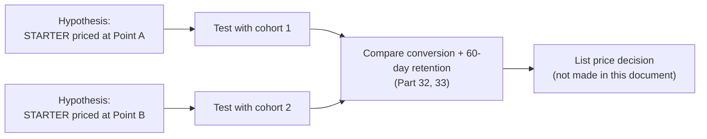

### 27.3 Free/Trial Strategy

Free tier follows `COMMERCIAL_INTELLIGENCE_ARCHITECTURE.md` §9.2's existing anti-abuse-gated Free design (cited, unchanged: V5-V7 capability classes fully gated, usage-capacity ceiling, multi-account fingerprint detection) — MVP's Free tier is simply that existing design applied to MVP's narrower feature set (Business Copilot with a low monthly-message ceiling, one Business Analyzer run, no Marketing Autopilot run — the flagship workflow is reserved as the paid-conversion driver, a product decision this document makes explicitly rather than defaulting to "everything free-tier-available at reduced volume").

## 28. Competitive Positioning

### 28.1 Category Analysis

| Category | What they do well | Where BizPilot AI differentiates | What's commoditized (don't build) | What should be integrated instead |
|---|---|---|---|---|
| Generic AI assistants (ChatGPT, Claude, Gemini consumer apps) | Raw model quality, broad general knowledge | Business-context grounding (Part 10), Azerbaijani business-domain depth (§6), workflow completion not just text | General-purpose chat UI, broad-domain Q&A | The underlying model itself — BizPilot AI is a Provider Router client (`AI_PLATFORM_ARCHITECTURE.md` §2.3-2.5, cited), never a model-training competitor |
| CRM platforms (HubSpot, generic local CRMs) | Mature pipeline/contact management at scale | AI-native lead creation directly from an inbound WhatsApp message (Part 13), not a manual data-entry CRM | Building a full enterprise-grade CRM feature set from scratch | External CRM sync is a Part 14 integration target for later segments, not a build-first-party-CRM-to-parity race |
| Marketing automation platforms (generic schedulers, Buffer-likes) | Multi-channel scheduling infrastructure at scale | Strategy-grounded content generation (§12.1's business→audience→objective chain), not merely scheduling | Building a broad multi-platform scheduler from scratch at MVP | Publishing-API integrations (Part 14) as the channel layer under BizPilot AI's strategy layer |
| Business intelligence tools (Power BI, Tableau-class) | Deep, flexible, self-serve analytics for data-mature organizations | Zero-setup, fact-labeled, action-oriented analysis (Part 11) for a business owner who has never built a dashboard | Building a general-purpose BI/dashboarding tool | N/A — different customer maturity level entirely, not a competitive collision at the chosen ICP (§5) |
| AI employee platforms (emerging category, various startups) | Ambitious, well-funded, general-purpose autonomous agent framing | Grounded in one market's real workflows first (§2), autonomy earned not assumed (Part 17) | Racing to ship the most autonomous-sounding demo | N/A — this document explicitly defers AI Employee framing to V2 (Part 18.2) rather than compete on this axis prematurely |
| Business operating systems (broad SMB all-in-one platforms) | Breadth — many modules under one login | Depth on three workflows that matter most to one well-chosen ICP, before breadth | Building every module (invoicing, HR, inventory) before any one workflow is proven | Excel/CSV ingestion (Part 11) meets the business where its existing tools already are, rather than demanding migration to a new system-of-record |

### 28.2 What Should Not Be Built

Restated plainly: a second CRM, a second content-scheduling platform, a second BI tool, a second chat UI framework, and a second agent orchestration framework are all explicitly rejected as build targets at any horizon in this document — every one of those categories is either integrated (Part 14) or already fully specified by an existing architecture document this one cites and reuses.

## 29. Product Moat

### 29.1 Realistic Defensibility Assessment

| Candidate moat | Real or aspirational? | Reasoning |
|---|---|---|
| Azerbaijani business-language intelligence | **Real, near-term** | Genuinely hard for a generalist competitor to prioritize; compounds with every AZ-market prompt/glossary iteration (§6.1) |
| Local workflow templates (AZ holiday calendar, local content patterns) | **Real, near-term** | Concrete, buildable, directly serves §12's Marketing Autopilot |
| Proprietary workflow outcome data (which recommendations get accepted/dismissed, §16.3) | **Real, compounds over time** | Classic data-network-effect pattern, but only becomes meaningfully defensible after real usage volume — not a Day 1 moat, an earned one |
| Business context/memory per workspace | **Real, compounds over time** | Directly reuses `ENTERPRISE_INTELLIGENCE_ARCHITECTURE.md`'s Organizational Learning (cited) — genuine switching cost once accumulated |
| Integration ecosystem breadth | **Aspirational at this horizon** | `GLOBAL_PLATFORM_ECOSYSTEM_ARCHITECTURE.md`'s full ecosystem (cited) is real architecture but requires Scale-horizon adoption to become a moat, not a Day 1 differentiator |
| Business knowledge graph | **Aspirational at this horizon** | `ENTERPRISE_INTELLIGENCE_ARCHITECTURE.md`'s Knowledge Graph (cited) is powerful but requires data volume this MVP does not yet have |
| AI workforce | **Aspirational at this horizon** | Real, cited architecture (Part 18) — genuinely differentiating once V2's first AI Employee has a track record, not before |
| Workflow marketplace | **Aspirational, correctly deferred** | `GLOBAL_PLATFORM_ECOSYSTEM_ARCHITECTURE.md` Part 10 (cited) — explicitly a Global-horizon capability (Part 25), listing it as a near-term moat would be dishonest |
| Vertical-specific expertise (beauty/wellness workflows specifically) | **Real, near-term, and the most underrated one** | Directly follows from a disciplined single-ICP choice (§5) — most competitors chase breadth and never earn this |

### 29.2 The Honest Statement

At MVP/V1, BizPilot AI's moat is **not** technical uniqueness — the underlying AI orchestration, workflow engine, and RBAC are good engineering, not defensible IP. The real, near-term moat is **being first, deepest, and most trusted in one language, one market, and one vertical wedge**, with the data and template advantages that position compounds honestly over the V2-Scale horizon into the genuinely harder-to-replicate moats (workforce, knowledge graph, marketplace) already designed elsewhere in this series.

## 30. Customer Acquisition Strategy

| Channel | Fit to ICP (§5) | Cost | Horizon |
|---|---|---|---|
| Direct outreach to salons/studios (founder-led, Baku-local) | Very high — dense, geographically concentrated segment | Low, time-intensive | MVP |
| Instagram/WhatsApp-native word of mouth (salon owners talk to other salon owners) | Very high — the ICP's own primary channel is the acquisition channel | Very low | MVP-V1, compounding |
| Beauty/wellness supplier and industry-association partnerships | Medium-high — trusted local intermediaries | Low-medium | V1 |
| Agency/reseller partner motion | Deferred — explicitly not the MVP motion (§5.1) | Medium | V2-Scale, reusing `GLOBAL_PLATFORM_ECOSYSTEM_ARCHITECTURE.md` Part 12 Partner Platform (cited) |
| Paid social acquisition | Real but expensive for a first cohort of 10 (Part 21) | Medium-high | V1+, once conversion economics are validated |

## 31. Activation Strategy

Activation is defined as: workspace created, Business Profile completed, and **at least one killer workflow run to completion** (Part 21's MVP exit criterion depends on this). The Marketing Autopilot (Part 12) is deliberately the anchor activation workflow — it requires no file upload (unlike the Analyzer, Part 11) and no external integration (unlike the CRM Assistant, Part 13), meaning it is reachable within the first-session journey (§20.1) end to end with zero external dependencies.

## 32. Retention Strategy

| Mechanism | Why it retains |
|---|---|
| Weekly-use journey (§9.2) | Creates a recurring reason to open the product every week, not just at onboarding |
| Organizational Learning seed (§16.3) | Output quality visibly improves the more a specific workspace is used — a compounding, non-portable reason to stay |
| Content-calendar cadence | A 30-day plan naturally creates a next-month re-engagement trigger |
| Business Analyzer trend value (V1, Part 22) | Multi-period comparison only gets more valuable with continued use, not less |

## 33. Metrics & North Star

### 33.1 North Star Metric

**Killer workflows completed per active workspace per month.** Not messages sent, not tokens generated, not logins — a completed Marketing Autopilot run, a completed Business Analyzer analysis, or a completed CRM Assistant interaction, each counted once its output was accepted or acted on (not merely generated) — directly operationalizing this document's Product Thesis (§2) as a measurable number.

### 33.2 Supporting Metrics

| Metric | Stage | Existing data source |
|---|---|---|
| Signup → activation rate (§31) | Activation | `AuditLog`/`Activity`, existing |
| Killer workflows completed per workspace per month | North Star | `WorkflowInstance` (new, Part 38) |
| Recommendation acceptance rate (§16.3) | Quality/trust | `WorkflowInstance` new fields (§16.3) |
| Free → paid conversion rate | Monetization | `Subscription`, existing |
| 30/60/90-day retention | Retention | `Activity`, existing |
| AI cost per completed workflow (never per token alone) | Unit economics | `AIUsage`, existing, reused per `COMMERCIAL_INTELLIGENCE_ARCHITECTURE.md`'s Value≠Usage≠Cost≠Price discipline (cited) |

## 34. Product Analytics

No new analytics infrastructure — `TRUST_SECURITY_COMPLIANCE_ARCHITECTURE.md`'s Ecosystem Observability discipline and `COMMERCIAL_INTELLIGENCE_ARCHITECTURE.md`'s Commercial Metering Engine (both cited, unchanged) already establish that product, commercial, and cost metrics are tracked as separate, never-blended categories. This document's only addition is the specific North Star and supporting metrics (§33), computed from existing and Part-38-added models via the existing Event Bus/Activity pipeline (cited) — no new analytics service.

---

## 35. Technical Implementation Blueprint

### 35.1 Ground Truth Restated

Per §0.2: a real, 37-model Prisma schema and a real design-system component library exist. Zero backend runtime code and zero frontend application code exist. The blueprint below is sequenced so the very first coding phase (Part 52) produces a working, demoable path through one killer workflow, using the mock AI provider (Part 43) — not a scaffold-only milestone.

### 35.2 Build Order (High Level; Part 51 Has the Full Roadmap)

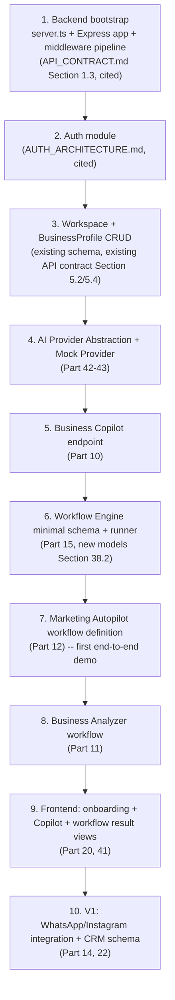

## 36. Existing Architecture Reuse Map

| Capability this document needs | Fully exists already (cited, unchanged) | Needs new code (not new design) |
|---|---|---|
| Auth, session, RBAC | `AUTH_ARCHITECTURE.md`, `Role`/`Permission`/`RolePermission`/`WorkspaceMember` (`DATABASE.md`) | Implementation only — no design gap |
| API conventions, error spec, pagination | `API_CONTRACT.md` in full | Implementation only |
| Workspace/BusinessProfile/Project/File data model | `DATABASE.md` (37 models) | Implementation only |
| AI orchestration, Provider Abstraction, Agent Runtime | `AI_PLATFORM_ARCHITECTURE.md` Parts 2, 9 | Implementation only (Part 42-43 detail the provider adapter specifically) |
| Credit/billing accounting | `DATABASE.md` `AICredit`/`AIUsage`, `BACKEND_ARCHITECTURE.md` §6.5 `CreditLedgerService` | Implementation only |
| Pricing tiers and packaging | `COMMERCIAL_INTELLIGENCE_ARCHITECTURE.md` §9.2-9.3 | Implementation only |
| Job/Queue, Scheduler, Event Bus | `BACKEND_ARCHITECTURE.md` §8, §13.1 | Implementation only |
| Workflow Engine *behavior* (state machine, step dispatch) | `AI_PLATFORM_ARCHITECTURE.md` §10.1 | Implementation only |
| Workflow Engine *persistence schema* | **Not designed anywhere** — explicitly deferred by `AI_PLATFORM_ARCHITECTURE.md` §10.1 | **New design, this document, §38.2** |
| Autonomous Decision Levels | `ENTERPRISE_INTELLIGENCE_ARCHITECTURE.md` §9.7 | Implementation only |
| Trust/security/compliance controls | `TRUST_SECURITY_COMPLIANCE_ARCHITECTURE.md` in full | Implementation only |
| Connector Contract (for Part 14 integrations) | `GLOBAL_PLATFORM_ECOSYSTEM_ARCHITECTURE.md` §4.2 | Implementation only, V1 |
| CRM data model (Contact/Lead) | **Does not exist anywhere in the 13 prior documents** | **New design, this document, §38.3** |
| Design system / UI components | `frontend/src/shared/components/` — real, implemented | Application pages consuming them (Part 41) |

## 37. Missing Components

### 37.1 Backend — Everything, Structured by What Already Has a Contract

| Missing component | API contract already exists? | Priority |
|---|---|---|
| `backend/src/server.ts` — Express bootstrap | Yes, `API_CONTRACT.md` §1.1-1.3 | P0 |
| Auth module (`backend/src/modules/auth/`) | Yes, `API_CONTRACT.md` §5.1, `AUTH_ARCHITECTURE.md` | P0 |
| Workspace module | Yes, `API_CONTRACT.md` §5.2 | P0 |
| BusinessProfile module | Yes, `API_CONTRACT.md` §5.4 | P0 |
| File upload module | Yes, `API_CONTRACT.md` §5.6 | P0 |
| AI Provider Abstraction Layer + Mock adapter (`backend/src/infrastructure/ai/`) | Design exists (`AI_PLATFORM_ARCHITECTURE.md` §2.3), no endpoint contract needed — internal | P0 |
| Business Copilot module (conversation endpoint) | Yes, `API_CONTRACT.md` §5.9-5.10 | P0 |
| Workflow Engine core (definition/instance/step runner) | Behavior yes (`AI_PLATFORM_ARCHITECTURE.md` §10.1), schema **no** (§38.2) | P0 — blocks Parts 11-13 |
| Marketing Autopilot workflow definition + prompts | No — new, Part 12 | P0 |
| Business Analyzer workflow definition + extraction | No — new, Part 11 | P1 |
| Billing/Subscription module | Yes, `API_CONTRACT.md` §5.11 | P1 |
| CRM module (`Contact`/`Lead`) | No — new, §38.3 | V1 |
| WhatsApp/Instagram Connector implementations | Contract shape yes (`GLOBAL_PLATFORM_ECOSYSTEM_ARCHITECTURE.md` §4.2), specific connectors no | V1 |

### 37.2 Frontend — Everything Above the Component Library

| Missing component | Design system dependency already exists? |
|---|---|
| App shell + router (`frontend/src/app/`) | Providers/router folders scaffolded, empty |
| Auth pages (login/signup) | `Button`, `Input`, `Card`, `Label`, `FormHelperText` all exist |
| Onboarding flow (§20.1) | `Card`, `Select`, `Textarea` exist |
| Dashboard shell | `DashboardLayout`, `Sidebar`, `TopNav` all exist and implemented |
| Copilot conversation UI | No chat-specific component yet — composable from `Card`/`Avatar`/`Skeleton` (all exist) |
| Marketing Autopilot result view (calendar rendering) | No calendar-specific component yet — new, composed from `Table`/`Card` (exist) |
| Business Analyzer result view (fact/interpretation/recommendation rendering, §11.2) | No — new, must visually distinguish the five label categories |
| API client layer (`frontend/src/shared/lib/`, axios wrapper) | `axios` dependency present, no client code yet |

## 38. Database Impact Analysis

### 38.1 Existing Models Already Sufficient (No Changes)

`User`, `Session`, `Role`, `Permission`, `RolePermission`, `Workspace`, `WorkspaceMember`, `TeamInvite`, `BusinessProfile`, `Settings`, `FeatureFlag`, `SubscriptionPlan`, `Subscription`, `Payment`, `Invoice`, `InvoiceItem`, `AICredit`, `AIUsage`, `Conversation`, `Message`, `PromptCategory`, `Prompt`, `PromptVersion`, `PromptPin`, `TemplateCategory`, `Template`, `Project`, `ProjectMember`, `Folder`, `File`, `Image`, `NotificationPreference`, `Notification`, `AuditLog`, `Activity`, `ApiKey`, `Webhook` — all 37 verified present and require no MVP/V1 schema change.

### 38.2 New Model Group: Workflow Engine Persistence (Required MVP, Blocks Parts 11-13)

Resolves the gap `AI_PLATFORM_ARCHITECTURE.md` §10.1 explicitly flagged.

| Model | Purpose | Key fields | Relations | Tenant scope | Lifecycle |
|---|---|---|---|---|---|
| `WorkflowDefinition` | Reusable template (e.g. "Monthly Marketing Plan v1") | `id`, `workspaceId` (null for platform-provided templates), `key`, `name`, `version`, `stepGraph` (Json — ordered step definitions), `isSystemDefined` (Boolean) | `workspace?`, `instances[]` | Workspace-scoped for custom, global for system-defined | Draft → Active → Deprecated (mirrors `GLOBAL_PLATFORM_ECOSYSTEM_ARCHITECTURE.md` §9.2 Workflow Component versioning, cited) |
| `WorkflowInstance` | One execution of a definition — the exact durable state `AI_PLATFORM_ARCHITECTURE.md` §10.1 flagged as needed | `id`, `workspaceId`, `workflowDefinitionId`, `triggeredByUserId`, `status` (enum: `Created`/`RunningStep`/`AwaitingApproval`/`Completed`/`Failed`/`Cancelled`), `input` (Json), `currentStepKey`, `output` (Json), `outcomeSignal` (enum: `Accepted`/`Edited`/`Dismissed`/`Pending`, feeds §16.3) | `workspace`, `workflowDefinition`, `stepRuns[]` | Workspace-scoped | State machine per §15.4's diagram |
| `WorkflowStepRun` | One step's execution record, reusing the Job idempotency pattern (`BACKEND_ARCHITECTURE.md` §8.5, cited) | `id`, `workflowInstanceId`, `stepKey`, `status`, `idempotencyKey`, `attempt`, `input` (Json), `output` (Json), `error` (Json?) | `workflowInstance` | Inherits workspace scope via instance | Pending → Running → Succeeded/Failed, retried per `BACKEND_ARCHITECTURE.md` §8.3 |

**Rejected as unnecessary:** a separate `WorkflowTrigger` table at MVP — manual-trigger-only (§15.4) means trigger configuration is a single field on `WorkflowDefinition`, not a relational table; V2's scheduled/event triggers (Part 23) can add one without migrating existing data, since it is purely additive.

### 38.3 New Model Group: Minimal CRM (Required V1, Blocks Part 13)

| Model | Purpose | Key fields | Relations | Tenant scope | Lifecycle |
|---|---|---|---|---|---|
| `Contact` | A known external person the business communicates with | `id`, `workspaceId`, `fullName`, `phone` (indexed, WhatsApp-matched), `email?`, `source` (enum: `WhatsApp`/`Instagram`/`Manual`), `businessProfileId?` | `workspace`, `businessProfile?`, `leads[]`, `activities[]` (reuses existing `Activity` model, cited) | Workspace-scoped | Created on first inbound message or manual entry |
| `Lead` | A sales opportunity tied to a `Contact` | `id`, `workspaceId`, `contactId`, `status` (enum: `New`/`Contacted`/`Qualified`/`Won`/`Lost`), `intent` (Json — classification output, §13.1 step 4-5), `followUpAt?`, `ownerUserId?` | `workspace`, `contact`, `owner?` | Workspace-scoped | New → Contacted → Qualified → Won/Lost |

**Rejected as unnecessary:** a separate `Deal`/`Opportunity` model distinct from `Lead` — for the chosen ICP (§5), a Lead's own status field is sufficient pipeline granularity; a distinct Deal entity is deferred to Scale-horizon broader-segment expansion (Part 24) if a segment with genuinely multi-stage deal cycles is added.

### 38.4 Migration Risk

Both new model groups are purely additive (new tables, no altered columns on the 37 existing models) — zero migration risk to already-designed schema, consistent with `ENGINEERING_STANDARDS.md`'s additive-schema-change discipline (cited, unchanged).

## 39. API Impact Analysis

| Resource group | Contract status | Action needed |
|---|---|---|
| Auth, Workspace, BusinessProfile, Files, Billing | Fully specified, `API_CONTRACT.md` §5.1-5.6, §5.11 | Implement as specified — zero contract design work |
| AI Generation/Conversations | Fully specified, `API_CONTRACT.md` §5.9-5.10 | Implement as specified |
| Workflows (new resource group) | **Not in `API_CONTRACT.md`** | New: `POST /workflows/definitions/{key}/instances` (start a run), `GET /workflow-instances/{id}` (status/output), `POST /workflow-instances/{id}/approve`\|`/reject` (Part 17 gate) — follow existing conventions (§2 of `API_CONTRACT.md`) exactly, additive per that document's versioning strategy (§2.1, cited) |
| Contacts/Leads (new resource group, V1) | **Not in `API_CONTRACT.md`** | New: standard CRUD + `POST /contacts/match` (phone-number lookup for inbound-message identification, §13.1 step 2) — same additive pattern |
| WhatsApp/Instagram webhook receivers (V1) | Webhook signature verification pattern exists (`API_CONTRACT.md` §4.6, `GLOBAL_PLATFORM_ECOSYSTEM_ARCHITECTURE.md` §19.2, cited) | New endpoint, existing security pattern |

## 40. Backend Impact Analysis

Per `BACKEND_ARCHITECTURE.md`'s existing module structure (§3, §14, cited, unchanged), new modules are created under the already-scaffolded `backend/src/modules/` following that document's layering (controller → service → repository, DDD tactical patterns §4). No new layering pattern, no new module convention — the modules themselves (`auth/`, `workspace/`, `business-profile/`, `files/`, `ai-copilot/`, `workflows/`, `contacts-leads/` V1) are simply the first real occupants of a directory structure that document already designed and this repository already scaffolded empty.

## 41. Frontend Impact Analysis

Per `FRONTEND_ARCHITECTURE.md`'s existing feature-based structure (cited, unchanged), new feature folders are created under the already-scaffolded `frontend/src/features/` (`auth/` and `dashboard/` already exist as empty scaffolds; `onboarding/`, `copilot/`, `workflows/` are new folders following the identical existing pattern). Every new page composes existing, already-implemented design-system components (`frontend/src/shared/components/`) — the Business Analyzer's fact/interpretation/recommendation rendering (§11.2) is the one genuinely new visual pattern required (five distinctly-styled content blocks), and even that is a composition of the existing `Card`/`Badge`/`Alert` components with new label styling, not a new component-library primitive.

---

## 42. AI Provider Abstraction

### 42.1 Already Designed — Implement, Do Not Redesign

`AI_PLATFORM_ARCHITECTURE.md` §2.3 fully specifies `AIProviderPort` (completion/chat), `EmbeddingProviderPort`, and `ModerationPort` as hexagonal ports, plus a Capability Matrix (§2.4), Dynamic Provider Selection (§2.5), and per-adapter circuit breakers with automatic failover (§11.8-11.9) — all cited, unchanged, and all currently **undocumented-in-code**: `backend/package.json` depends directly on the `openai` npm package with no port/adapter layer implemented yet (§0.2). The first concrete engineering task this section implies is exactly one thing: **write the `AIProviderPort` interface and one adapter implementing it (`OpenAIAdapter`), instead of calling the `openai` SDK directly from application code** — a refactor of intent, not a new design.

### 42.2 Why This Matters for This Document Specifically

Every one of this document's killer workflows (Parts 11-13) calls AI capabilities exclusively through this port. This is what makes Part 43's no-paid-API development strategy possible without any special-casing in workflow code: a workflow step that calls `provider.complete(...)` behaves identically whether the configured adapter is `OpenAIAdapter` or `MockProviderAdapter` (§43.2) — the Capability Matrix (§2.4, cited) simply lists one more provider entry.

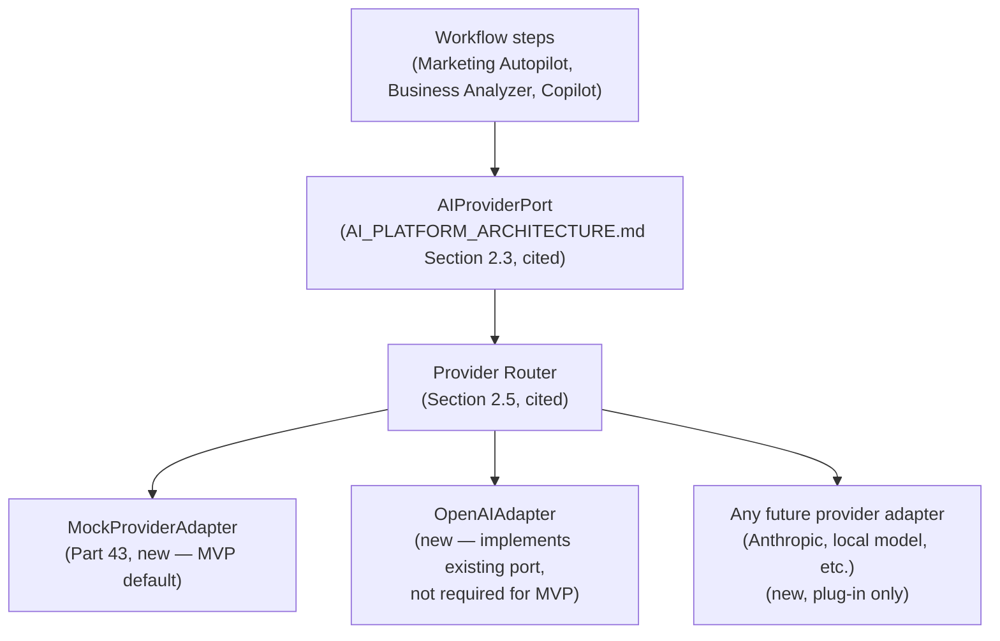

## 43. No-API Development Strategy

### 43.1 Founder Constraint, Product Requirement

The founder does not currently want to purchase a paid AI API key. This document treats that as a hard product-engineering requirement, not a temporary inconvenience: **every killer workflow (Parts 11-13) must be fully demoable, testable, and investor/customer-showable using only a `MockProviderAdapter`.**

### 43.2 Mock Provider Design

| Technique | Application |
|---|---|
| Deterministic fixture responses | `MockProviderAdapter` returns pre-authored, realistic Azerbaijani-language responses keyed by prompt-template ID (Part 12/11's Prompt Registry entries, `AI_PLATFORM_ARCHITECTURE.md` §3.3, cited) — not randomized, so demos and tests are reproducible |
| Recorded real responses (future-dated) | Once a real provider is used even briefly (e.g. a small evaluation budget), its actual output can be captured and replayed as a higher-fidelity fixture set — an *optional* quality upgrade to the fixture library, never a requirement to build MVP |
| Fake streaming | `MockProviderAdapter` chunks its fixture response and emits it through the exact same SSE frame vocabulary (`AI_PLATFORM_ARCHITECTURE.md` §11.6, cited: `event: delta`/`event: done`) on a short artificial delay, so the frontend streaming UI (§20) is built and tested against realistic behavior without a real provider connection |
| Local test datasets | Business Analyzer (Part 11) fixture spreadsheets (synthetic salon revenue/expense data) ship as committed test fixtures, exercising the extraction → fact → interpretation chain deterministically |
| Provider abstraction (Part 42) | The mechanism that makes all of the above possible without workflow-code special-casing |

### 43.3 What This Strategy Does Not Claim

Mock-provider development proves workflow *mechanics* (context assembly, fact/interpretation labeling, workflow state transitions, UI rendering) — it does not prove AI *output quality*, which genuinely requires a real provider eventually. Part 47's Launch Readiness checklist is explicit that mock-provider-only completion is sufficient for internal development and demo milestones but **not** sufficient for the MVP exit criterion (Part 21) requiring real paying customers — that requires switching the Capability Matrix's active adapter to a real provider before the first real customer cohort, a configuration change, not a code change, per §42.2's design.

## 44. Integration Priority Matrix

### 44.1 Scoring Methodology

Each candidate integration (§14.2's table) is scored 1-5 on each of the eight factors named in the founder's brief; total determines sequencing. This is the full scoring detail behind §14.2's summary table.

| Integration | Customer value | AZ relevance | Feasibility | Security risk (inverted, 5=low risk) | API availability | Cost (inverted, 5=low cost) | Revenue potential | Strategic defensibility | Total /40 |
|---|---|---|---|---|---|---|---|---|---|
| WhatsApp Business API | 5 | 5 | 3 | 3 | 4 | 3 | 5 | 5 | **33** |
| Instagram (publish + DM) | 5 | 5 | 3 | 3 | 4 | 4 | 4 | 4 | **32** |
| Excel/CSV upload | 5 | 5 | 5 | 4 | 5 | 5 | 3 | 2 | **34** |
| Email | 3 | 3 | 5 | 4 | 5 | 4 | 3 | 2 | 29 |
| Telegram | 3 | 3 | 5 | 4 | 5 | 4 | 2 | 2 | 28 |
| Advertising platforms | 3 | 3 | 4 | 4 | 4 | 3 | 3 | 3 | 27 |
| Google Drive / MS 365 | 2 | 2 | 4 | 3 | 4 | 4 | 2 | 1 | 22 |
| External CRM sync | 2 | 1 | 4 | 4 | 4 | 4 | 2 | 1 | 22 |
| Local accounting systems | 3 | 4 | 2 | 3 | 2 | 3 | 3 | 4 | 24 |
| Bank data / local financial providers | 4 | 4 | 1 | 2 | 1 | 2 | 4 | 5 | 23 |

Excel/CSV, WhatsApp, and Instagram score highest and are exactly the MVP/V1 sequencing already chosen in §14.2 — this scoring pass is a verification of that sequencing choice, not a separate decision.

## 45. Security Requirements

Fully inherited from `TRUST_SECURITY_COMPLIANCE_ARCHITECTURE.md` (cited, unchanged) — no new security architecture. This document's contribution is a launch-blocking checklist of which already-designed controls must be **implemented and verified**, not merely available in the architecture, before MVP touches any real customer's financial or customer-communication data:

- Tenant isolation (`workspaceId` scoping) enforced on every new endpoint introduced by Parts 39-40, verified by test (Part 46), not assumed from the ORM.
- File upload validation (type, size, malware scanning per `TRUST_SECURITY_COMPLIANCE_ARCHITECTURE.md`, cited) implemented before Business Analyzer (Part 11) accepts any real customer file.
- WhatsApp/Instagram webhook signature verification (§14, `API_CONTRACT.md` §4.6, cited) implemented before any V1 integration goes live — never optional, never "add later."
- Export/deletion workflow (§19.2) implemented and tested before any AZ customer's real PII is stored — a hard MVP requirement, not V1.
- Secrets (provider API keys, webhook secrets) managed per `TRUST_SECURITY_COMPLIANCE_ARCHITECTURE.md`'s existing Secrets Architecture (cited) — never committed, never logged.

## 46. Testing Strategy

Fully inherited from `ENGINEERING_STANDARDS.md`'s testing standards (cited, unchanged) — this section states the MVP-specific application of that standard, not a new testing philosophy:

| Layer | Approach | Why the mock provider (Part 43) matters here |
|---|---|---|
| Unit tests | Standard, per `ENGINEERING_STANDARDS.md` | AI-calling code is fully unit-testable against `MockProviderAdapter` without network calls or cost |
| Integration tests | Standard, per that document | Workflow state-machine transitions (Part 15) tested end-to-end deterministically against fixture responses |
| Fact/interpretation contract tests (§11.2, new to this document's scope) | Validate that every Business Analyzer output correctly labels its five categories and that every interpretation/recommendation references a `sourceFactIds` entry | Directly enforces §11.3's never-fabricate rule as a testable contract, not only a prompt instruction |
| Manual AZ-language quality review | Human review of fixture and (once available) real-provider Azerbaijani output for tone/terminology correctness (§6.1) | Not automatable — a recurring content-quality process, not a one-time gate |

## 47. Launch Readiness

MVP is launch-ready only when every item below is true — this is the gate for exposing the product to the first real customer cohort (Part 21's exit criterion), distinct from Part 48's Production Readiness (the gate for scaling past that cohort):

- [ ] All P0 backend/frontend components (Parts 37.1-37.2) implemented and passing tests (Part 46).
- [ ] Real AI provider adapter (§42.1) implemented and configured — mock-only is sufficient for internal demo, not for real customers (§43.3).
- [ ] Security requirements (Part 45) verified, not merely implemented — a distinct sign-off step.
- [ ] Export/deletion workflow functional end-to-end.
- [ ] Azerbaijani localization (§20.3) covers every MVP screen and every Prompt Registry entry used by Parts 11-12.
- [ ] At least one real (not synthetic) Business Analyzer test run against an anonymized real salon's spreadsheet, reviewed by a human for output correctness.
- [ ] STARTER-tier billing (existing `Subscription`/`Payment` models, cited) functional end-to-end, including a real payment method — Azerbaijan-relevant payment processing verified specifically, not assumed generic.

## 48. Production Readiness

Distinct from Launch Readiness (Part 47): this is the gate for operating beyond the first ten customers, fully inherited from `CLOUD_INFRASTRUCTURE.md` and `ENGINEERING_STANDARDS.md`'s production-readiness criteria (cited, unchanged) — observability, autoscaling, incident response, backup/DR, all as already specified. **This document does not claim MVP completion equals production readiness in that document's full sense** — a ten-customer MVP can and should launch on materially simpler operational infrastructure (a single-region deployment, manual on-call, no autoscaling) than that document's full production bar describes, with an explicit, planned graduation to the full standard at the V1→V2 transition once real load and real revenue justify the investment. Treating MVP infrastructure as if it were already at that document's full production bar would be exactly the kind of unjustified premature investment this entire document exists to avoid.

---

## 49. Risk Register

*Product-execution risk — distinct in kind from the technical/security risk registers already maintained in `TRUST_SECURITY_COMPLIANCE_ARCHITECTURE.md` and `GLOBAL_PLATFORM_ECOSYSTEM_ARCHITECTURE.md` (cited, not duplicated here). `RISK-EXEC-001` through `RISK-EXEC-028`.*

| ID | Category | Severity | Trigger | Mitigation |
|---|---|---|---|---|
| 001 | Product-market fit | Critical | Fewer than 3 of the first 10 target customers (Part 21) convert to paid | Pricing experiment (§27.2) before list-price commitment; founder-led direct feedback loop (Part 30) |
| 002 | Product-market fit | High | Chosen ICP (§5) proves to have lower willingness-to-pay than scored | Segment scoring (§5.1) is explicitly revisitable; Secondary ICP (Instagram/WhatsApp retail) is a fast pivot within the same wedge |
| 003 | Execution | High | Solo/small founding team cannot execute Parts 35-41's build order at the pace Part 51 assumes | Founder Execution Plan (Part 52) sequences ruthlessly to one demoable workflow first, not all three in parallel |
| 004 | Execution | Medium | Fourteen phases of architecture create analysis-paralysis pressure to "finish reading" before building | This document's own existence is the mitigation — it is the explicit permission to build a narrow slice now |
| 005 | AI cost | High | Real-provider AI cost per workflow run exceeds what STARTER-tier pricing can sustain | Mock-provider development (Part 43) delays real cost exposure until pricing experiment (§27.2) is designed; `COMMERCIAL_INTELLIGENCE_ARCHITECTURE.md`'s Margin Protection ladder (cited) applies unchanged once a real provider is live |
| 006 | AI cost | Medium | Founder's no-paid-API constraint (Part 43) is extended indefinitely, delaying real-quality validation | Launch Readiness (Part 47) makes a real provider adapter a hard gate before real customers, bounding the constraint's duration |
| 007 | Localization quality | High | Azerbaijani AI output quality is inconsistent or culturally off, undermining the core differentiator (§6) | Manual AZ-language quality review (Part 46) as a standing process, not a one-time gate |
| 008 | Localization quality | Medium | Local business terminology glossary (§6.1) is incomplete at launch | Glossary is explicitly framed as compounding content, not a one-time deliverable — gaps are expected and iterated on |
| 009 | Legal/tax boundary | Critical | Product surfaces an unsourced or incorrect tax/legal claim, damaging trust or creating liability | Hard architectural boundary (§6.2): capability deferred past MVP entirely until a sourced, versioned corpus exists |
| 010 | Legal/tax boundary | Medium | Business Analyzer (Part 11) output is misread by a customer as tax/legal advice despite labeling | Fact/interpretation/recommendation visual distinction (§11.2) is a UX requirement, not only a data-model requirement |
| 011 | Integration dependency | High | Meta (WhatsApp/Instagram) business verification (§14, Part 22) is delayed or denied | Flagged explicitly as an external, non-engineering dependency (Part 51) with no engineering workaround; V1 timeline should not assume approval speed |
| 012 | Integration dependency | Medium | Unofficial WhatsApp automation is used as a stopgap under launch-timeline pressure | Explicitly rejected regardless of timeline pressure (§14.3) — a binding constraint, not a preference |
| 013 | Integration dependency | Medium | Bank/accounting integration research (§14.2, Scale-horizon) finds no viable local API | Explicitly research-gated, not committed in any roadmap horizon — no sunk-cost pressure to force it |
| 014 | Competitive | Medium | A well-funded generalist AI assistant adds shallow AZ-language support | Vertical + local depth (§29) is harder to replicate quickly than surface-level translation; monitor but do not react by broadening scope prematurely |
| 015 | Competitive | Low | A local competitor targets the same ICP first | First-mover advantage in trust/word-of-mouth (§30) partially mitigates; not a reason to skip validation rigor |
| 016 | Monetization | High | Credit-based/usage pricing (existing architecture) is confusing to a first-time AZ SMB SaaS buyer | Pricing communicated in workflow-completion terms (§26.3), never raw credits, at the customer-facing layer |
| 017 | Monetization | Medium | Free tier cannibalizes STARTER conversion because Free is too generous | Marketing Autopilot deliberately excluded from Free (§27.3) as the specific paid-conversion lever |
| 018 | Data/privacy | Critical | A real customer's financial spreadsheet or customer PII is mishandled | Security Requirements (Part 45) as launch-blocking, verified not assumed |
| 019 | Data/privacy | Medium | An AI-provider data-use claim is made that the actual provider contract does not support | Explicit standing constraint (§19.3) — no privacy claim ships without verifying current contract terms |
| 020 | Schema/architecture | Medium | New Workflow Engine schema (§38.2) or CRM schema (§38.3) turns out to need early revision once real usage patterns emerge | Both designed deliberately minimal (rejected-model discipline, §38.2/38.3) specifically to reduce surface area for early-revision cost |
| 021 | Schema/architecture | Low | `WorkflowDefinition.stepGraph` Json-column flexibility is later found insufficient and needs a relational step-definition table | Deferred, revisit-if-needed — flagged, not preemptively built (Part 50, ADR-EXEC-009) |
| 022 | Team/founder capacity | High | No dedicated engineering resourcing beyond the founder exists yet | Part 52's execution plan is explicitly scoped assuming solo/small-team capacity, not a funded team's velocity |
| 023 | Team/founder capacity | Medium | Founder time is split between building (Parts 35-48) and selling (Parts 30-32) with neither getting enough focus | Sequencing in Part 52 explicitly interleaves build and first-customer-conversation phases rather than fully serializing them |
| 024 | Scope discipline | High | Pressure to build V2/Scale/Global-horizon capability (AI Employees, marketplace, multi-market) before MVP proof | This document's entire classification discipline (NOW/NEXT/SCALE/ENTERPRISE/GLOBAL/DEFERRED, Part 50-51) exists specifically to resist this |
| 025 | Scope discipline | Medium | New feature requests from early customers pull roadmap away from the three killer workflows before they are fully proven | North Star metric (§33.1) is workflow-completion-based specifically so scope decisions have an objective anchor |
| 026 | Cross-document consistency | Medium | This document's new schema (§38.2-38.3) or provider-abstraction implementation guidance drifts from a future revision of `AI_PLATFORM_ARCHITECTURE.md` or `DATABASE.md` | Same open governance gap already logged as `CDA-P06` in `GLOBAL_PLATFORM_ECOSYSTEM_ARCHITECTURE.md` Part 26 (cited) — this document adds no new mitigation, just another reason that finding should be resolved |
| 027 | Regulatory | Medium | Azerbaijani data-residency or consumer-protection requirements applicable to a live SMB SaaS product are not yet fully mapped | `TRUST_SECURITY_COMPLIANCE_ARCHITECTURE.md`'s Compliance Control Plane (cited) is the correct home for this; a launch-readiness action item (Part 47) to confirm before real customer PII is processed |
| 028 | External payment processing | Medium | Azerbaijan-relevant payment method support (§47) is less mature than assumed in generic `COMMERCIAL_INTELLIGENCE_ARCHITECTURE.md` billing design | Explicit Launch Readiness checklist item (Part 47) — verified before launch, not assumed from the generic billing architecture |

## 50. ADRs

*Major product and technical decisions from this document. `ADR-EXEC-001` through `ADR-EXEC-018`, using the same Title/Status/Context/Decision/Alternatives/Consequences format as the prior series (all Status: Accepted).*

**ADR-EXEC-001 — Single Primary ICP: Instagram/WhatsApp-Native Small Businesses in Azerbaijan.**
Context: the founder's brief named nine candidate segments (§5.1). Decision: score and commit to one — beauty/wellness salons as flagship persona within the broader Instagram/WhatsApp-native SMB segment. Alternatives: serve multiple segments in parallel at MVP. Consequences: every subsequent product decision (Parts 9-20) can be concrete instead of generic; the cost is explicitly deferring strong-but-secondary segments (restaurants, freelancers, professional services).

**ADR-EXEC-002 — Three Killer Workflows, Not a General-Purpose Feature Set.**
Context: the brief specified Marketing Autopilot, Business Analyzer, and CRM & Sales Assistant explicitly. Decision: these three, and only these three, define MVP-V1 product surface (Parts 11-13, 21-22). Alternatives: a broader, shallower feature set covering more of `PRD.md`'s full vision at once. Consequences: depth over breadth, directly serving the Product Thesis (§2); defers real capability the architecture already supports.

**ADR-EXEC-003 — MVP Ships With a Mock AI Provider, Not a Paid API Dependency.**
Context: explicit founder constraint. Decision: `MockProviderAdapter` (§43.2) implementing the already-designed `AIProviderPort` (`AI_PLATFORM_ARCHITECTURE.md` §2.3, cited) is the default for all development and internal-demo milestones. Alternatives: block MVP development on securing API budget first. Consequences: development proceeds immediately; real-customer launch still requires a real provider (§43.3), so this defers, not eliminates, that cost.

**ADR-EXEC-004 — Reuse `ENTERPRISE_INTELLIGENCE_ARCHITECTURE.md`'s Autonomous Decision Level Ladder, Not a New One.**
Context: the founder's brief sketched an illustrative L0-L4 autonomy scale that does not label-match the existing, fully-specified ladder. Decision: adopt the existing ladder as authoritative (§17.1), map this document's shorthand onto it. Alternatives: define a second, product-specific ladder. Consequences: one governance model platform-wide; avoids the exact kind of fractured-authority-model risk `GLOBAL_PLATFORM_ECOSYSTEM_ARCHITECTURE.md` ADR-PLAT-026 warns against in a different context.

**ADR-EXEC-005 — Every MVP/V1 Action Defaults to L1 (Draft/Recommend), Opt-In Only Above L2.**
Context: the underlying architecture permits graduated autonomy up to L4. Decision: this product deliberately does not exercise most of that permission at MVP/V1 (§17.2). Alternatives: ship at the architecture's permitted ceiling to appear more differentiated. Consequences: slower perceived automation depth at launch, in exchange for earning trust with a genuinely new market before spending it.

**ADR-EXEC-006 — WhatsApp Integration Uses Only the Official Business API.**
Context: unofficial WhatsApp automation is faster to build and widely used by competitors. Decision: official API only (§14.3), regardless of the resulting timeline dependency on Meta's business-verification process (`RISK-EXEC-011`). Alternatives: unofficial automation as a launch-speed stopgap. Consequences: real timeline risk, accepted in exchange for not putting a customer's primary business communication channel at ban risk.

**ADR-EXEC-007 — Marketing Autopilot Is the MVP Activation Anchor, Not the Business Analyzer.**
Context: both are MVP-scoped killer workflows. Decision: Marketing Autopilot is the required first-session workflow (§20.1, §31) because it needs no file upload and no integration. Alternatives: anchor on the Business Analyzer instead. Consequences: faster time-to-first-value in the onboarding journey; Business Analyzer remains fully MVP-scoped but is not the forced first interaction.

**ADR-EXEC-008 — New `WorkflowDefinition`/`WorkflowInstance`/`WorkflowStepRun` Schema, Resolving `AI_PLATFORM_ARCHITECTURE.md` §10.1's Explicit Deferral.**
Context: that document designed Workflow Engine *behavior* but explicitly deferred its persistence schema as "not required today." Decision: this document supplies the minimal three-model schema (§38.2) now, since Parts 11-13 require it to exist as running code. Alternatives: continue deferring until a later document. Consequences: the one genuine net-new schema contribution at MVP scope; deliberately minimal, per §38.2's explicit rejected-alternative note.

**ADR-EXEC-009 — `WorkflowDefinition.stepGraph` Is a Json Column, Not a Relational Step Table, at MVP.**
Context: a fully relational step-definition schema is possible but adds migration complexity before real usage patterns are known. Decision: Json column now, revisit only if real usage proves it insufficient (`RISK-EXEC-021`). Alternatives: build the fully relational version immediately. Consequences: faster to ship, deliberately deferred complexity, consistent with this document's minimal-schema discipline throughout Part 38.

**ADR-EXEC-010 — New Minimal `Contact`/`Lead` Schema, Not a Full CRM Data Model.**
Context: no CRM-adjacent model exists anywhere in the 37-model schema or any of the thirteen prior documents. Decision: two models only (§38.3), no `Deal`/`Opportunity`/`Pipeline` entity at this horizon. Alternatives: design a full CRM schema matching mature CRM platforms' data depth. Consequences: sufficient for the chosen ICP's actual sales cycle (§5.3); explicitly revisitable if broader segments are added (Part 24).

**ADR-EXEC-011 — Business Analyzer Output Is Contractually Required to Separate Fact/Metric/Interpretation/Recommendation/Assumption/Uncertainty.**
Context: the founder's brief specifically warned against blended, unlabeled financial conclusions. Decision: a structured, validated output contract (§11.2-11.3) enforced at the prompt-schema level, not by instruction alone. Alternatives: rely on prompt instructions and human review only. Consequences: a testable contract (Part 46) closes a real fabrication-risk gap generic AI financial summarization tools do not close.

**ADR-EXEC-012 — Legal/Tax Informational Assistance Is Explicitly Deferred Past MVP.**
Context: the founder's brief permits it only with sourcing/versioning/citation support that does not yet exist. Decision: defer entirely (§6.2) rather than ship an under-sourced version. Alternatives: ship a lightweight, unsourced version to capture the perceived market need sooner. Consequences: forgoes near-term feature breadth in exchange for avoiding a categorically higher-liability mistake.

**ADR-EXEC-013 — AI Employee Framing Is Deferred to V2, MVP/V1 Workflows Are Anonymous Executions.**
Context: `ENTERPRISE_INTELLIGENCE_ARCHITECTURE.md` and `GLOBAL_PLATFORM_ECOSYSTEM_ARCHITECTURE.md` both fully support a named AI Employee persona today. Decision: MVP/V1 present workflow results without a personified AI identity (§18.1); the first named seat ships in V2 once a track record exists. Alternatives: lead with AI Employee branding immediately for marketing differentiation. Consequences: less flashy initial positioning, lower trust risk from an unproven persona failing publicly.

**ADR-EXEC-014 — Azerbaijan-Only Through MVP and V1; Turkey Is the First Expansion Market, Not a Parallel Launch.**
Context: `GLOBAL_PLATFORM_ECOSYSTEM_ARCHITECTURE.md`'s global-scale architecture already supports multi-region operation. Decision: sequential, not parallel, market expansion (Part 7, 25). Alternatives: launch AZ and a second market simultaneously to de-risk single-market dependency. Consequences: deeper AZ localization quality (§6) achievable with focused effort; accepts single-market concentration risk in exchange.

**ADR-EXEC-015 — Free Tier Excludes the Marketing Autopilot Workflow Specifically.**
Context: `COMMERCIAL_INTELLIGENCE_ARCHITECTURE.md`'s existing Free-tier design gates capability classes broadly. Decision: this document additionally specifies Marketing Autopilot as a paid-only capability from Free tier (§27.3), an explicit product-strategy choice layered on that architecture. Alternatives: make all three killer workflows available in limited form on Free. Consequences: a clearer, single paid-conversion lever; some risk of under-demonstrating value pre-conversion, mitigated by Business Copilot and single Business Analyzer run remaining Free-available.

**ADR-EXEC-016 — Production Readiness (Part 48) Is Explicitly Not Required for Launch Readiness (Part 47).**
Context: `CLOUD_INFRASTRUCTURE.md` and `ENGINEERING_STANDARDS.md` define a full production-readiness bar suited to platform scale. Decision: MVP launches on a materially simpler operational footprint, with an explicit, planned graduation point, rather than building to the full bar before any real customer exists. Alternatives: hold launch until full production-readiness criteria are met. Consequences: much faster time-to-first-customer; accepted operational risk at small scale, bounded by the explicit graduation trigger (V1→V2 transition).

**ADR-EXEC-017 — This Document Does Not Redesign Pricing; It Maps Onto the Existing Five-Tier Matrix.**
Context: `COMMERCIAL_INTELLIGENCE_ARCHITECTURE.md` §9.2 already fully specifies pricing structure. Decision: no new tier, no new packaging model — only a bundle-mapping exercise (§26.2) and a pricing-experiment recommendation (§27.2) that does not commit to specific price points. Alternatives: propose concrete AZN prices now. Consequences: avoids an unsupported numeric claim; defers the actual pricing decision to validated experimentation, exactly as instructed.

**ADR-EXEC-018 — Excel/CSV Ingestion, Not a Bank/Accounting Integration, Is the MVP Financial Data Entry Point.**
Context: bank/accounting API availability in the AZ market is uncertain (§14.2). Decision: file upload against the existing `File` model is the MVP/V1 mechanism; bank/accounting integration is Scale-horizon and explicitly research-gated (Part 24, 44). Alternatives: block Business Analyzer on building a bank integration first. Consequences: MVP ships immediately using infrastructure that already exists; forgoes the (currently unverified) convenience of automatic bank-feed ingestion.

---

## 51. Implementation Roadmap

*Classified NOW / NEXT / SCALE / ENTERPRISE / GLOBAL / DEFERRED / REJECTED, per the required framing. NOW and NEXT map to MVP/V1 (Parts 21-22); SCALE/ENTERPRISE/GLOBAL map to Parts 23-25.*

| Item | Classification | Depends on | External (non-engineering) dependency |
|---|---|---|---|
| Backend bootstrap, Auth, Workspace, BusinessProfile, Files (Part 35.2 steps 1-3) | **NOW** | — | None |
| AI Provider Abstraction + Mock adapter (Part 42-43) | **NOW** | Backend bootstrap | None |
| Workflow Engine minimal schema + runner (§38.2) | **NOW** | Provider abstraction | None |
| Marketing Autopilot workflow (Part 12) | **NOW** | Workflow Engine | None |
| Business Analyzer workflow (Part 11) | **NOW** | Workflow Engine | None |
| Onboarding + Copilot + workflow-result frontend (Part 20, 41) | **NOW** | Above backend items | None |
| First 10 target customers found and onboarded (Part 21 exit criterion) | **NOW** | Frontend + workflows above | None (founder-led outreach, Part 30) |
| Real AI provider adapter activated (§42.1, §43.3) | **NOW**, gates real-customer launch specifically | Mock-provider development complete | **Founder's provider-budget decision** |
| Pricing experiment (§27.2) | **NOW**, parallel to above | First customer cohort identified | None |
| WhatsApp Business API integration | **NEXT** | Meta business verification | **Meta approval timeline (external, unpredictable)** |
| Instagram integration | **NEXT** | Meta Graph API access | **Meta approval timeline** |
| `Contact`/`Lead` schema + CRM & Sales Assistant (steps 1-6, 8-10) | **NEXT** | WhatsApp integration | Depends on above |
| Multi-file Business Analyzer trend analysis | **NEXT** | MVP Analyzer proven | None |
| L2 opt-in automation (drafted-send approval) | **SCALE-adjacent, opt-in within V2** | V1 track record | None |
| First named AI Employee seat | **SCALE-adjacent, opt-in within V2** | V2 workflow track record | None |
| Scheduled/event workflow triggers | **V2** | Workflow Engine proven at NOW/NEXT | None |
| Turkey market localization | **SCALE** | AZ retention/activation proof | None |
| Bank/accounting integrations | **SCALE, research-gated** | API-availability research | **Unresolved — may not be feasible; explicitly not committed** |
| Full AI Executive Team | **SCALE** | Single-AI-Employee retention proof | None |
| Multi-region infrastructure | **SCALE** | Sustained non-AZ revenue | None |
| Legal/tax informational assistant | **DEFERRED indefinitely**, pending sourced corpus | A maintained, versioned, sourced AZ regulatory corpus — does not yet exist | **Requires a content/compliance partnership not yet identified** |
| Developer Platform, Marketplace, Partner Platform, White-Label/OEM | **GLOBAL** — fully specified in `GLOBAL_PLATFORM_ECOSYSTEM_ARCHITECTURE.md`, cited unchanged | Sustained Scale-horizon revenue | None new |
| A second, product-specific autonomy ladder | **REJECTED** (ADR-EXEC-004) | — | — |
| A second CRM, scheduler, or BI product built from scratch | **REJECTED** (§28.2) | — | — |
| Unofficial WhatsApp automation | **REJECTED** (ADR-EXEC-006) | — | — |
| Building to full Production Readiness (Part 48) before first customer | **REJECTED for MVP** (ADR-EXEC-016) | — | — |

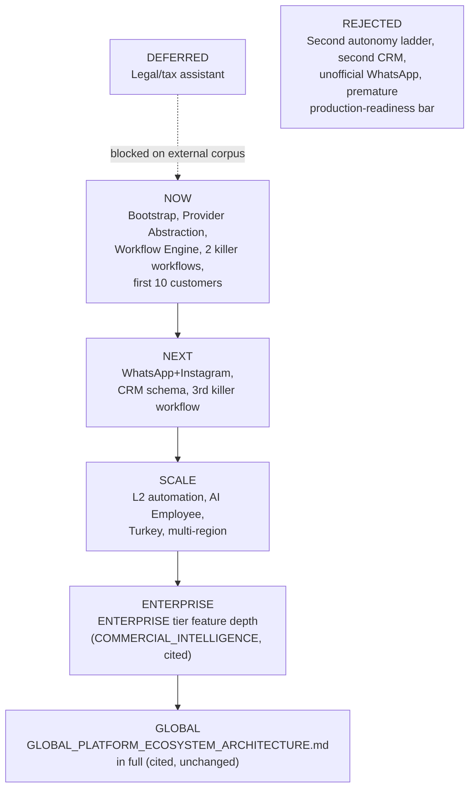

## 52. Founder Execution Plan

*Written for a solo or very small founding team, no dedicated engineering headcount assumed, no paid AI API budget assumed. Concrete and sequential — this is the section meant to be acted on directly, not read as strategy.*

### 52.1 Phase 1 — Prove the Mechanism (No Customers Yet)

1. Implement `backend/src/server.ts` and the Express bootstrap (`API_CONTRACT.md` §1.3, cited) — the single missing file blocking every other backend task.
2. Implement Auth against the already-designed `AUTH_ARCHITECTURE.md` and the already-real Prisma schema.
3. Implement Workspace + BusinessProfile CRUD — both models already exist; this is pure implementation.
4. Write `AIProviderPort` (§42.1) and `MockProviderAdapter` (§43.2) before writing any workflow code that calls AI capability — this ordering matters, since it is what keeps every subsequent step free of a paid API dependency.
5. Add the three new Workflow Engine models (§38.2) via a single additive Prisma migration.
6. Build the Marketing Autopilot workflow definition (Part 12) end-to-end against the mock provider, with fixture Azerbaijani captions authored by hand for the first fixture set.
7. **Milestone: demo the Marketing Autopilot workflow, start to finish, in a browser, to yourself.** This is the first point at which "the architecture is right" becomes "the product exists."

### 52.2 Phase 2 — Prove a Real Business Wants It

8. Build the minimal onboarding flow (§20.1) and the workflow-result view (§41) — just enough frontend to hand the product to a real salon owner without narrating it yourself.
9. Identify 10-20 candidate businesses matching the ICP (§5) through direct, in-person or Instagram-DM outreach (§30) — start this in parallel with step 8, not after it.
10. Run the Marketing Autopilot workflow live with 3-5 real business owners, watching them use it, before writing the Business Analyzer workflow. Their reaction is the first real product-market-fit signal this document can produce.
11. Build the Business Analyzer workflow (Part 11) against fixture spreadsheets, then against one real, anonymized salon spreadsheet, with the fact/interpretation/recommendation contract (§11.2) reviewed by a human for correctness before it is shown to any customer.
12. **Milestone: 10 real target-customer accounts created, each having run at least one killer workflow to completion (Part 21's MVP exit criterion, partial — activation proven, monetization next).**

### 52.3 Phase 3 — Prove Someone Will Pay

13. Make the founder's provider-budget decision (Part 42, `RISK-EXEC-006`) — activate a real `AIProviderPort` adapter behind the same interface, no application-code change required.
14. Implement STARTER-tier billing against the existing `Subscription`/`Payment` models, verified against a real, locally-relevant payment method (Part 47).
15. Run the pricing experiment (§27.2) with 2-3 price points across the available customer cohort.
16. **Milestone: 3+ of the first 10 customers convert to paid (Part 21's full MVP exit criterion).** This is the actual finish line for MVP — not a code-complete milestone, a revenue milestone.

### 52.4 Phase 4 — Earn the Right to Build V1

17. Only after Phase 3's milestone: begin Meta business-verification for WhatsApp/Instagram (§14, flagged as the longest-lead-time external dependency in this entire plan — consider starting the verification paperwork during Phase 3, since it is a waiting-on-a-third-party process, not an engineering task, and its timeline is outside this plan's control).
18. Build the `Contact`/`Lead` schema (§38.3) and CRM & Sales Assistant (Part 13) once the WhatsApp integration is live.
19. Revisit this document's ADRs (Part 50) and Risk Register (Part 49) explicitly before committing to V2 — several (notably `RISK-EXEC-001`, `RISK-EXEC-002`) should be re-scored against real Phase 1-3 data, not the pre-launch estimates recorded here.

### 52.5 What Not to Do During This Plan

Do not build any V2/Scale/Global-horizon capability (named AI Employee, marketplace, multi-market, bank integrations) during Phases 1-4 regardless of how tempting or how directly the existing architecture documents make it feel buildable — every one of them is real, well-designed, and correctly sequenced after, not before, Phase 3's revenue milestone.

---

## Document Metadata

| Field | Value |
|---|---|
| Document | Product Execution & MVP Architecture |
| Depends on | All 13 prior architecture documents (§0.1) |
| Status | Complete |
| Repository ground truth verified | Yes — §0.2, direct inspection, not assumed |
| Primary ICP decision | §5.2 — Instagram/WhatsApp-native AZ SMBs, flagship persona beauty/wellness salons |
| Net-new database models required | 5 total: `WorkflowDefinition`, `WorkflowInstance`, `WorkflowStepRun` (§38.2, MVP), `Contact`, `Lead` (§38.3, V1) |
| No-paid-API strategy | §43 — `MockProviderAdapter` behind the already-designed `AIProviderPort` |
| Open item carried from `GLOBAL_PLATFORM_ECOSYSTEM_ARCHITECTURE.md` | `CDA-P06` (no recurring cross-document audit cadence) — `RISK-EXEC-026` restates its relevance to this document's own new schema |
| MVP exit criterion | 10 target-ICP accounts activated, 3+ convert to paid STARTER tier (§21, Part 52.3) |

*End of document.*