# BizPilot AI — Trust, Security & Compliance Architecture

**Status:** Security Constitution (Phase 12) — the formal security, trust, privacy, resilience, AI-security, and compliance architecture of BizPilot AI.
**Depends on (immutable, cited not redesigned here):** [PRD.md](PRD.md), [DATABASE.md](DATABASE.md), [AUTH_ARCHITECTURE.md](AUTH_ARCHITECTURE.md), [API_CONTRACT.md](API_CONTRACT.md), [BACKEND_ARCHITECTURE.md](BACKEND_ARCHITECTURE.md), [AI_PLATFORM_ARCHITECTURE.md](AI_PLATFORM_ARCHITECTURE.md), [CLOUD_INFRASTRUCTURE.md](CLOUD_INFRASTRUCTURE.md), [FRONTEND_ARCHITECTURE.md](FRONTEND_ARCHITECTURE.md), [ENTERPRISE_INTELLIGENCE_ARCHITECTURE.md](ENTERPRISE_INTELLIGENCE_ARCHITECTURE.md), [ENGINEERING_STANDARDS.md](ENGINEERING_STANDARDS.md).
**Scope:** Not a new application architecture — a single, coherent security architecture spanning identity, authorization, tenant isolation, application/database/cloud security, AI/agent security, data security, privacy, secrets, encryption, internal access, observability, threat detection, incident response, supply chain, secure SDLC, compliance, enterprise trust, and resilience, unifying every security-adjacent decision the ten prior documents already made into one enforceable whole.

---

## 0. Document Conventions

### 0.1 What this document is not

This document does not redesign `DATABASE.md`'s schema, `AUTH_ARCHITECTURE.md`'s JWT/session/RBAC mechanics, `API_CONTRACT.md`'s wire contract, `BACKEND_ARCHITECTURE.md`'s module structure, `AI_PLATFORM_ARCHITECTURE.md`'s Agent Runtime, `CLOUD_INFRASTRUCTURE.md`'s network/secrets/audit infrastructure, `FRONTEND_ARCHITECTURE.md`'s client architecture, `ENTERPRISE_INTELLIGENCE_ARCHITECTURE.md`'s AI Workforce and Autonomous Decision Levels, or `ENGINEERING_STANDARDS.md`'s engineering governance. Every mechanism below is either a direct citation of a decision already made, a security-specific extension of one, or — where a genuine gap or inconsistency exists between prior documents — an explicitly flagged finding (Part 39) rather than a silent fix. Where a prior document already named a future security mechanism as owed (most notably `AUTH_ARCHITECTURE.md` §8's flagged `isSystemAdmin`-versus-time-boxed-access gap), this document is where that debt is formally paid — cited as delivering on a prior commitment, not inventing a new one.

### 0.2 Density & format

At 40 mandated parts, 50+ diagrams, 40+ ADRs, 40+ risks, 35+ threats, and 30+ controls, this document uses tables as the primary unit of information wherever a section names a repeated structure (control tables, risk registers, threat tables, ADR summaries) and narrative prose only where a decision's reasoning is not self-evident from its structure. No `TODO`, `TBD`, or placeholder text appears anywhere in this document — every field in every table is a real, considered value, even where that value is "not yet built, see Part 38 for the trigger condition," which is a complete, honest answer, not a placeholder.

### 0.3 Security North Star

**NO ACTOR IS TRUSTED BY DEFAULT.** An actor is any entity that can cause the system to do something: a human user, a workspace owner, an administrator, support personnel, a developer, a CI/CD system, a service, a worker, an AI agent, a plugin, an integration, a webhook, an external provider, a background job. Every actor — without exception — must have all seven of the following before it can act:

| Property | Meaning |
|---|---|
| **Identity** | A unique, non-shared, attributable principal |
| **Authentication** | Cryptographic or credential proof of that identity |
| **Authorization** | An explicit grant, evaluated per action, never inferred from identity alone |
| **Scope** | The specific resources the authorization covers — never "everything a role could touch" |
| **Purpose** | A stated reason the action is being taken, machine-checkable where the actor is non-human |
| **Time boundary** | Every grant expires; nothing is permanent by default |
| **Audit trail** | An immutable record that the action occurred, by whom, why, and with what result |

Trust is **continuously evaluated**, never granted once and assumed to persist — a session, an API key, an AI agent's tool permission, and a support engineer's workspace access are all re-evaluated against current policy on every use, not cached as a standing fact about the actor.

### 0.4 Relationship to Prior Documents

| Prior document | What it already committed to (cited, not redesigned) | What this document adds |
|---|---|---|
| `AUTH_ARCHITECTURE.md` | JWT (RS256, JWKS, rotation), refresh-token rotation with reuse detection, Argon2id, `__Host-` HttpOnly cookies, RBAC (`Permission`/`Role`/`RolePermission`/`WorkspaceMember`), Redis revocation-epoch, and an explicitly flagged future gap: `isSystemAdmin` standing-flag versus a proposed time-boxed "Support Access Grant" | Delivers that Support Access Grant (Part 16) as a full PAM architecture; extends RBAC into the Unified Authorization Fabric (Part 4) |
| `DATABASE.md` | `workspaceId`-scoped multi-tenancy, UUIDv4 keys, selective soft-delete | Tenant Isolation Assurance (Part 5) — the formal, testable security invariant built on that scoping |
| `API_CONTRACT.md` | URI versioning, RFC 7807 errors, Idempotency-Key, single `Authorization` header disambiguating JWT vs. API key, SSE for AI streaming | API-surface enforcement point for the Unified Authorization Fabric (Part 4); API key lifecycle (Part 14) |
| `BACKEND_ARCHITECTURE.md` | Event Bus, `FeatureFlagEngine`, Plugin Engine (out-of-process sandbox, ADR-005), `SecretsProviderPort`, circuit breakers | Tool/Plugin Security (Part 10) extends ADR-005's sandbox; Secrets Architecture (Part 14) extends `SecretsProviderPort` |
| `AI_PLATFORM_ARCHITECTURE.md` | AI Gateway as mandatory single entry point, Provider Router, Prompt Registry/Injection-Defense, layered Memory, `pgvector` shared store, Agent Runtime (Planner-Executor-Critic-Reflection), Tool Calling reusing RBAC ("no elevated AI service account"), Safety/Moderation/PII ports | The AI Security Control Plane (Part 6), AI Authority Matrix (Part 7), Prompt Injection Defense (Part 9), and Memory/RAG Security (Part 11) — the security architecture *around* those subsystems |
| `CLOUD_INFRASTRUCTURE.md` | VPC/subnet segmentation, managed KMS/secrets with CSI injection, Multi-AZ Postgres + PITR, append-only audit infrastructure, three-tier IAM, Defense-in-Depth (P19) | Key hierarchy (Part 15), Security Event Fabric (Part 18) built on that audit infrastructure, Security Resilience (Part 21) |
| `FRONTEND_ARCHITECTURE.md` | Cookie-only session (no client-readable token), CSP-compatible build, centralized content-sanitization boundary, plugin iframe/message-passing sandbox | Cited as the client-side enforcement layer (L1, Part 5) and the plugin-security precedent (Part 10) |
| `ENTERPRISE_INTELLIGENCE_ARCHITECTURE.md` | Autonomous Decision Levels L0–L4, Human Approval Architecture, non-negotiable AI governance floors (Fraud Detection never autonomous, AI CFO never autonomous fund transfer), Agent Delegation as permission intersection | The AI Authority Matrix (Part 7) is explicitly correlated with, not a replacement for, this ladder — see Part 39's flagged naming reconciliation |
| `ENGINEERING_STANDARDS.md` | Five-tier Rule Taxonomy, ADR governance, tenant-isolation CI lint as HARD REQUIREMENT, four-tier Data Classification, five-dimension AI Quality Gate, the Engineering Constitution | The Security Constitution (Part 1) extends the Rule Taxonomy with security-specific tiers; Data Classification (Part 12) extends the four-tier model to five — see Part 39's flagged extension |

---

## Part 1 — Security Constitution

### 1.1 Rule Hierarchy

Extends `ENGINEERING_STANDARDS.md` §0.3's five-tier Rule Taxonomy with two security-specific tiers inserted at the top — a security invariant is a stricter category than that document's HARD REQUIREMENT, since a HARD REQUIREMENT can in principle be changed by a future ADR, while a Security Invariant cannot be changed at all without dissolving the trust model itself:

| Tier | Name | Who can override | Change process |
|---|---|---|---|
| **Tier 0** | SECURITY INVARIANT | No one — **UNOVERRIDABLE** | Never changed by ADR; changing one is a re-founding of this document, requiring CISO + Architecture Review Board (`ENGINEERING_STANDARDS.md` §1.1) + a new major version of this document |
| **Tier 1** | HARD REQUIREMENT | No one at runtime; changeable only via a Tier-0-compliant ADR-SEC | ADR-SEC review (Part 35), CISO sign-off |
| **Tier 2** | SECURITY CONTROL | Security Engineering (Part 33) | Documented change via Part 33's governance model |
| **Tier 3** | ENGINEERING RULE | Team-tier per `ENGINEERING_STANDARDS.md` §1.3 | Ordinary PR review |
| **Tier 4** | GUIDELINE | Reviewer judgment | None required |
| **Tier 5** | RECOMMENDATION | Team discretion | None required |
| **Tier 6** | EXCEPTION | A documented, time-boxed, owner-assigned deviation from Tier 1–3 | Logged to the Technical Debt Register (`ENGINEERING_STANDARDS.md` §1.6) *and* this document's Risk Register (Part 37), reviewed at expiry, never silently renewed |

### 1.2 The BizPilot Security Constitution — 24 Principles

1. **Tenant isolation is non-negotiable.** (Tier 0) — no action, optimization, or convenience ever crosses a `workspaceId` boundary without explicit, revocable consent (Part 5).
2. **Authorization is deny-by-default.** (Tier 0) — the absence of a grant is a denial; a missing permission check is a bug, never treated as an implicit allow.
3. **AI intelligence never implies authority.** (Tier 0) — a model's confidence, capability, or apparent correctness never substitutes for an explicit permission grant (Part 7–8).
4. **Auditability cannot be disabled.** (Tier 0) — not by a human, not by an AI agent, not in an emergency (Part 17).
5. **Secrets never enter application logs, error telemetry, or source control.** (Tier 0) — restated from `ENGINEERING_STANDARDS.md` §15.5 and elevated here to Security Invariant given the blast radius of violation.
6. **Internal access to customer data is temporary by construction.** (Tier 0) — no standing internal-staff grant to workspace data exists; every access is time-boxed (Part 16).
7. **Customer data is never accessed casually.** (Tier 1) — every internal access has a stated purpose, checked against the requested scope before the access is granted.
8. **Emergency access must remain auditable, scoped, and automatically expiring.** (Tier 0) — break-glass is a controlled failure mode, not an escape hatch from this Constitution (Part 17).
9. **Security controls fail closed by default; fail-open is an explicit, justified, reviewed exception.** (Tier 1, Part 21).
10. **Sensitive actions require explicit policy evaluation, not implicit trust in the caller.** (Tier 0) — every Policy Enforcement Point call (Part 4) evaluates policy fresh, never caches an authorization decision across a security-relevant boundary.
11. **AI cannot escalate its own authority, approve its own action, or modify the policy that governs it.** (Tier 0, Part 7).
12. **Lower-trust content never overrides higher-trust policy.** (Tier 0) — the prompt-injection trust hierarchy (Part 9) is absolute.
13. **Retrieval authorization is enforced before content reaches a model, never after.** (Tier 0) — the LLM is never relied upon as a security filter (Part 11).
14. **Every actor — human or machine — has a unique, attributable identity.** (Tier 1) — no shared service accounts, no anonymous internal calls.
15. **A risk score informs a decision; it never overrides a deterministic security policy.** (Tier 0, Part 8).
16. **Encryption keys and the data they protect are never colocated in the same trust boundary.** (Tier 1, Part 15).
17. **A security posture score is diagnostic, never a gate substitute — it can never override a HARD REQUIREMENT.** (Tier 0, Part 28).
18. **Every cross-tenant aggregation is opt-in, explicit, and revocable** — restated and bound here from `ENTERPRISE_INTELLIGENCE_ARCHITECTURE.md` E7 as a Tier 0 invariant of this document too.
19. **A dependency, model provider, or plugin is untrusted until it passes the supply-chain and sandboxing controls that grant it trust.** (Tier 1, Parts 10, 22).
20. **Incident response is rehearsed before it is needed.** (Tier 2, Part 20 — a control, not an invariant, since its cadence is maturity-gated per Part 34).
21. **Data classification determines handling, not convenience or urgency.** (Tier 1, Part 12).
22. **Every security-relevant configuration change is itself an audited, reviewed event — including changes to this Constitution.** (Tier 0).
23. **Privacy is designed in, not bolted on after a request arrives.** (Tier 1, Part 25).
24. **No control plane action is ever silently reachable from the data plane.** (Tier 0, Part 3).

**Diagram 1 — Security Constitution Rule Hierarchy**

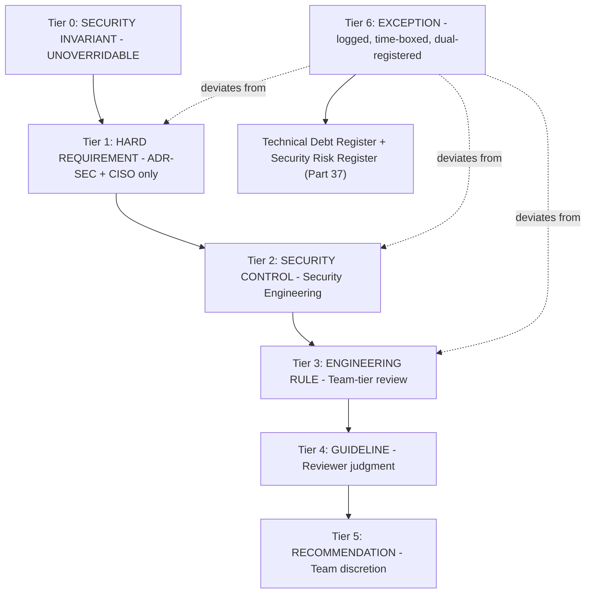

---

## Part 2 — Trust Model

Six named trust-boundary chains, each fully specified: Actor, Resource, Trust Level, Authentication, Authorization, Allowed Operations, Audit Requirements, Failure Behavior. Trust Level uses a five-point scale (**Untrusted → Provisional → Verified → Elevated → System**) — no actor, including an internal service, ever sits at System trust without a continuously-re-verified credential.

### 2.1 Human → Client → API → Service → Database

| Boundary | Definition |
|---|---|
| **Actor** | An authenticated end user (`AUTH_ARCHITECTURE.md` session) |
| **Resource** | Workspace-scoped business data (`DATABASE.md`) |
| **Trust Level** | Verified (post-authentication), never Elevated by default |
| **Authentication** | `__Host-` HttpOnly cookie session, JWT validated server-side (`AUTH_ARCHITECTURE.md`, cited) |
| **Authorization** | Unified Authorization Fabric (Part 4) evaluated per request, workspace-scoped |
| **Allowed Operations** | Exactly the set the resolved `WorkspaceMember` role's permissions grant — never inferred from UI affordance (`FRONTEND_ARCHITECTURE.md` §4.7's client-side check is UX only, cited) |
| **Audit Requirements** | Every mutating request logged with actor identity, `workspaceId`, action, result |
| **Failure Behavior** | Fail closed — an authorization failure returns 403/404 (never a silent empty result, which would leak existence), never falls back to a permissive default |

### 2.2 Human → AI Gateway → Agent → Tool → External System

| Boundary | Definition |
|---|---|
| **Actor** | A human-initiated request routed through `AI_PLATFORM_ARCHITECTURE.md`'s AI Gateway to an Agent Runtime instance, which may itself invoke a Tool reaching an external system |
| **Resource** | Workspace-scoped business data, AI Memory tiers, and — via Tools — external systems (email, payment providers, ecosystem connectors per `ENTERPRISE_INTELLIGENCE_ARCHITECTURE.md` Part 13) |
| **Trust Level** | The Agent inherits Provisional trust from the initiating human's Verified session — never escalated to Elevated by the Agent's own action (Part 7's non-self-escalation invariant) |
| **Authentication** | The AI Gateway is the mandatory single entry point (`AI_PLATFORM_ARCHITECTURE.md`, cited) — no Agent Runtime invocation bypasses it; every invocation carries the full identity context object (Part 6) |
| **Authorization** | Tool Calling reuses RBAC exactly (`AI_PLATFORM_ARCHITECTURE.md`'s "no elevated AI service account," cited) — checked at the AI Security Control Plane (Part 6) before every tool call, not once at Agent start |
| **Allowed Operations** | Bounded by the AI Authority Matrix (Part 7) and the invoking human's own permission set — an intersection, never a union (Part 3.4-equivalent delegation rule, `ENTERPRISE_INTELLIGENCE_ARCHITECTURE.md` ADR-EI-007, cited) |
| **Audit Requirements** | Full Reasoning Trace (`ENTERPRISE_INTELLIGENCE_ARCHITECTURE.md` §9.5, cited) plus every individual tool call logged to the Security Event Fabric (Part 18) |
| **Failure Behavior** | Fail closed — a Tool call whose authorization cannot be verified is refused, never executed with degraded checking |

### 2.3 Worker → Queue → Service

| Boundary | Definition |
|---|---|
| **Actor** | A background Worker process (`BACKEND_ARCHITECTURE.md` ADR-006, cited) consuming a queued job |
| **Resource** | Whatever the job's payload references — always `workspaceId`-scoped |
| **Trust Level** | System (a deployed, IAM-scoped service identity, `CLOUD_INFRASTRUCTURE.md` §14.3's application-runtime IAM tier, cited) — but scoped narrowly, never a superuser |
| **Authentication** | Service identity via the three-tier IAM model (`CLOUD_INFRASTRUCTURE.md` §14.3, cited) |
| **Authorization** | The job payload's own declared `workspaceId` and action scope, re-validated at execution time, never trusted purely because it was already enqueued (a queue is a transport, not an authorization decision) |
| **Allowed Operations** | Exactly the job type's declared operation set — a Worker process handling many job types never has blanket access to all of them simultaneously per-invocation |
| **Audit Requirements** | Job execution logged with job type, `workspaceId`, idempotency key (`BACKEND_ARCHITECTURE.md` §8.5, cited), and result |
| **Failure Behavior** | Fail closed with retry-with-backoff (`BACKEND_ARCHITECTURE.md` §9, cited) — a job whose authorization re-check fails is routed to the Dead Letter Queue, never silently dropped or retried indefinitely |

### 2.4 Service → Service

| Boundary | Definition |
|---|---|
| **Actor** | An internal backend module or microservice (future, per `BACKEND_ARCHITECTURE.md`'s extraction-ready design) |
| **Resource** | Another module's public interface or Event Bus topic (`BACKEND_ARCHITECTURE.md` ADR-002, cited) |
| **Trust Level** | System, scoped per-module via least-privilege service identity |
| **Authentication** | Mutual service identity (mTLS-equivalent at Enterprise horizon, §32; internal network segmentation at NOW/NEXT, `CLOUD_INFRASTRUCTURE.md` §3.1, cited) |
| **Authorization** | Public-interface-or-Event-Bus-only (`BACKEND_ARCHITECTURE.md` ADR-002, cited) — no service ever reaches into another's repository/data store directly |
| **Allowed Operations** | The calling module's own declared dependency contract (`ENGINEERING_STANDARDS.md` §2.4–§2.5's dependency-direction rule, cited) |
| **Audit Requirements** | Distributed trace span (`CLOUD_INFRASTRUCTURE.md` §11.3, cited) per cross-service call |
| **Failure Behavior** | Circuit breaker (`BACKEND_ARCHITECTURE.md` §9, cited) — degrade, never silently retry into a cascading failure |

### 2.5 Support → Customer Workspace

| Boundary | Definition |
|---|---|
| **Actor** | An internal support/operations employee |
| **Resource** | A specific customer workspace's data |
| **Trust Level** | Untrusted by default — Provisional only after an approved Support Access Grant (Part 16) |
| **Authentication** | Employee SSO/MFA identity (§32), distinct from any customer-facing credential |
| **Authorization** | `SupportAccessGrant` (Part 16) — scope-bound, purpose-bound, time-boxed, approval-gated |
| **Allowed Operations** | Exactly the grant's declared scope — default is **no customer data access** |
| **Audit Requirements** | Every action taken under a grant is individually logged and linked to the grant record |
| **Failure Behavior** | Fail closed — an expired or unapproved grant denies access outright, no grace period |

### 2.6 Developer → Production

| Boundary | Definition |
|---|---|
| **Actor** | An engineer |
| **Resource** | Production infrastructure, code, and — only via the identical Support Access Grant mechanism, never a developer-specific bypass — customer data |
| **Trust Level** | System for code/infrastructure changes via the CI/CD identity (`CLOUD_INFRASTRUCTURE.md` §14.3, cited); Untrusted for customer data, identical to Support |
| **Authentication** | Human console access — MFA-enforced, restricted to a small set of individuals (`CLOUD_INFRASTRUCTURE.md` §14.3 Tier 1, cited) |
| **Authorization** | Code changes flow through `ENGINEERING_STANDARDS.md`'s full CI/CD gate pipeline — a developer never has standing direct production write access outside that pipeline except the documented break-glass exception (Part 17) |
| **Allowed Operations** | GitOps-declared changes only (`CLOUD_INFRASTRUCTURE.md` §5.4, cited) — no direct `kubectl`/console mutation except break-glass |
| **Audit Requirements** | Every deploy, every break-glass action logged to the append-only Audit Infrastructure (`CLOUD_INFRASTRUCTURE.md` §14.6, cited) |
| **Failure Behavior** | Fail closed — CI/CD gate failure blocks deployment; break-glass requires the full Part 17 protocol |

**Diagram 2 — Human → Client → API → Service → Database Trust Chain**

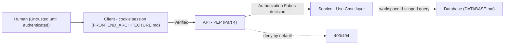

**Diagram 3 — Human → AI Gateway → Agent → Tool → External System Trust Chain**

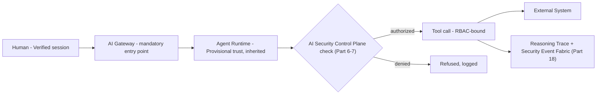

**Diagram 4 — Worker → Queue → Service and Service → Service Trust Chains**

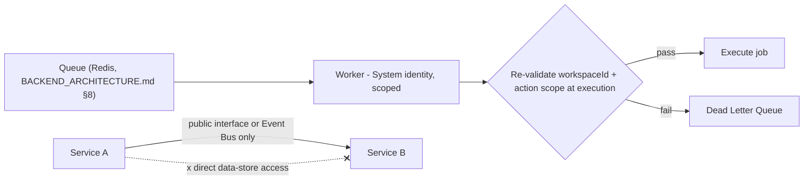

**Diagram 5 — Support / Developer → Customer Workspace Trust Chains**

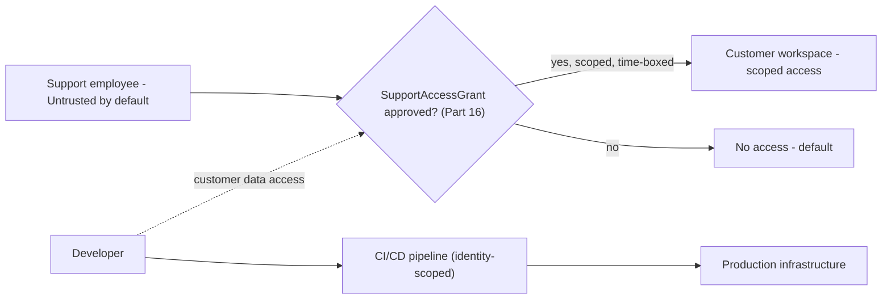

---

## Part 3 — Zero Trust Control Plane

### 3.1 Control Plane vs. Data Plane

**Why.** Business requests and security-configuration changes have fundamentally different blast radii — a bug in a business request handler affects one workspace's one operation; a bug that lets a business request silently alter a permission grant affects every workspace simultaneously. Separating the two planes is what makes that asymmetry structurally enforced rather than merely a code-review concern.

**Control Plane** manages: identity, policies, permissions, security configuration, keys, security events, risk signals, access grants (Parts 4, 14–17). **Data Plane** executes: business requests, AI requests, tool calls, file access, database operations, workflow execution (the operational surface every other prior document describes).

**Where enforced.** The Control Plane is a distinct, more restrictively-IAM-scoped set of services and database tables from the Data Plane — a Data Plane service's runtime identity (`CLOUD_INFRASTRUCTURE.md` §14.3's application-runtime IAM tier, cited) has **read-only** access to Control Plane policy data (to evaluate authorization decisions) and **zero write access** to it under any normal request path. The only write paths into the Control Plane are: (a) the Policy Administration Point (Part 4, human- or Governance-role-initiated), (b) the Support Access Grant lifecycle (Part 16), and (c) the break-glass protocol (Part 17) — each independently audited, none reachable from ordinary business-request code.

**What data it protects.** The Control Plane's own data — `Permission`, `Role`, `RolePermission`, API key records, encryption key metadata, security event streams — is itself classified Restricted/Critical (Part 12) and is the single highest-value target in the entire system; its isolation from the Data Plane is this document's most consequential architectural decision.

**What happens when it fails / how detected / how recovered.** A Data Plane bug that attempts a Control Plane write fails closed at the IAM layer (the credential simply lacks the permission — not an application-layer check that could itself have a bug) — detected as an IAM-denial event (Part 18), routed to Security Detection (Part 19) as a P1-severity anomaly regardless of whether the attempt was malicious or a defect, since a Data-Plane-to-Control-Plane write attempt is inherently suspicious. Recovery is immediate (the write never succeeded) plus a mandatory incident review (Part 20) of why the attempt occurred.

**Cost.** One additional IAM boundary and one additional set of database-level grants beyond what a single-tier system would need — a fixed, one-time modeling cost, not an ongoing operational tax, since it is enforced by IAM policy (declared once, `CLOUD_INFRASTRUCTURE.md` §7.1's IaC, cited) rather than checked per-request in application code.

**When built.** NOW horizon — this separation is foundational and is never deferred, unlike most phase-gated mechanisms in this document (Part 38), because retrofitting plane separation after Data Plane code has organically accreted Control Plane access is materially more expensive than establishing the boundary before any code exists.

**Diagram 6 — Zero Trust Control Plane vs. Data Plane**

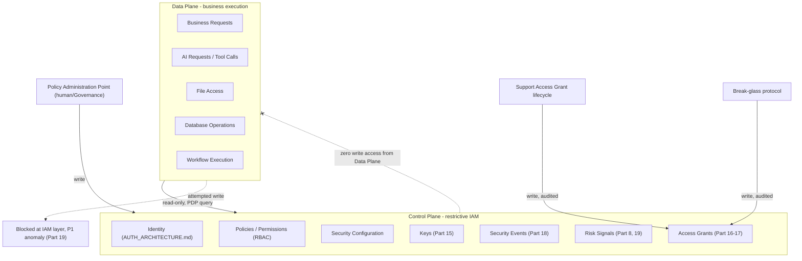

---

## Part 4 — Unified Authorization Fabric

### 4.1 Purpose

**Why.** `AUTH_ARCHITECTURE.md`'s `User`/`Workspace`/`WorkspaceMember`/`Role`/`Permission`/`RolePermission` model (cited, unchanged) is the data model of authorization; this Part is its *execution* model — the single fabric every surface named in this Part's mandate (REST, SSE, WebSocket, AI Gateway, Agent Runtime, Tools, Workflows, Workers, Files, Projects, Prompts, Memory, RAG, Webhooks, API Keys, future microservices) calls into, so that **no module ever invents its own permission-check logic** (Tier 0, Principle 2).

**Where enforced.** Four standard components, named per the industry-standard XACML pattern this document adopts explicitly (not invented here, cited as the correct fit for the requirement, per this document's own anti-gold-plating discipline inherited from `ENGINEERING_STANDARDS.md` §0.4):

| Component | Role | Implementation |
|---|---|---|
| **Policy Enforcement Point (PEP)** | Intercepts every request at its entry surface, calls the PDP, enforces the decision | One PEP implementation per surface type (§4.2's table) — never a copy-pasted, surface-specific reimplementation |
| **Policy Decision Point (PDP)** | Evaluates the request (actor, resource, action, context) against policy, returns allow/deny | A single, shared service — the actual `RolePermission` evaluation logic lives here exactly once |
| **Policy Information Point (PIP)** | Supplies the PDP with the facts it needs — the actor's `WorkspaceMember` role, resource ownership, current risk signals (Part 8, 19) | Reads from the Control Plane (Part 3) |
| **Policy Administration Point (PAP)** | Where policy is authored/changed — `Role`/`Permission`/`RolePermission` CRUD | Human- or Governance-role-gated (Part 3's control-plane write path) |

### 4.2 Surface Coverage

| Surface | PEP location | Notes |
|---|---|---|
| REST | API middleware, every route | `API_CONTRACT.md`'s existing auth middleware, extended to call the shared PDP |
| SSE | Stream-open authorization check, re-verified on reconnect | `API_CONTRACT.md` §2's SSE convention, cited |
| WebSocket | Connection-open check, plus per-message re-check for high-sensitivity channels | `FRONTEND_ARCHITECTURE.md` §6.3's single shared workspace connection, cited |
| AI Gateway | Every request entering the Gateway, before any Agent Runtime invocation | `AI_PLATFORM_ARCHITECTURE.md`'s mandatory-entry-point design, cited |
| Agent Runtime | Every Planner→Executor step that touches a resource | Part 6–7 |
| Tools | Every individual tool call, not once per Agent session | Part 10 |
| Workflows | Every workflow step transition (`BACKEND_ARCHITECTURE.md`'s Workflow Engine, cited) | Same PDP, workflow-step-scoped context |
| Workers | Job execution start, re-validated (§2.3, cited) | Same PDP, job-payload-scoped context |
| Files | Every file access, including signed-URL generation (`CLOUD_INFRASTRUCTURE.md` §9.1's signed-URL pattern, cited) | PEP at signed-URL-issuance time, not only at upload time |
| Projects | Standard resource-ownership PEP | No special case |
| Prompts | Prompt Registry read/write (`AI_PLATFORM_ARCHITECTURE.md` §3, cited) | Same PDP |
| Memory | Every retrieval, enforced *before* content reaches the model (Part 11) | Distinct emphasis — this is the one surface where the PEP's timing (before, not after, model consumption) is itself a security-critical property |
| RAG | Identical to Memory | Part 11 |
| Webhooks | Inbound webhook signature verification *and* outbound webhook payload scoping | Both directions are PEP-gated, not only inbound |
| API Keys | Key-scoped permission subset, never broader than the issuing user's own role | §14.1's API key lifecycle |
| Future Microservices | Same PDP, called over the network via a lightweight authorization-check protocol rather than an in-process call | Extraction-ready by construction, per `BACKEND_ARCHITECTURE.md`'s own stated microservice-readiness design |

**Failure behavior.** Every PEP fails closed, unconditionally — a PDP timeout, a PIP data-unavailability, or any error in policy evaluation is treated as a denial, never as a pass-through (Part 21 details the resilience posture behind this).

**Cost.** A network hop (or in-process call, at NOW/NEXT horizon before the PDP is extracted as its own service) per authorization check, mitigated by the same two-tier caching `BACKEND_ARCHITECTURE.md` §5.8 already established (small, static permission catalogs cached in-process; per-request decisions never cached across a security-relevant boundary).

**When built.** The fabric's core (PEP/PDP/PIP/PAP as named concepts governing REST authorization) already exists implicitly in `AUTH_ARCHITECTURE.md`'s middleware — this document's contribution is making every other surface converge on the identical PDP, which is a NOW-horizon requirement, not deferred, since surface-specific authorization logic invented independently per module is exactly the anti-pattern this Part exists to prevent from ever starting.

**Diagram 7 — Unified Authorization Fabric (PEP/PDP/PIP/PAP)**

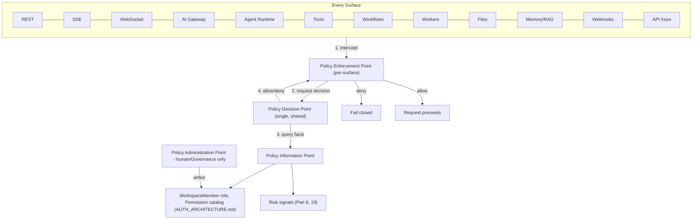

**Diagram 8 — Authorization Consistency Across All Surfaces**

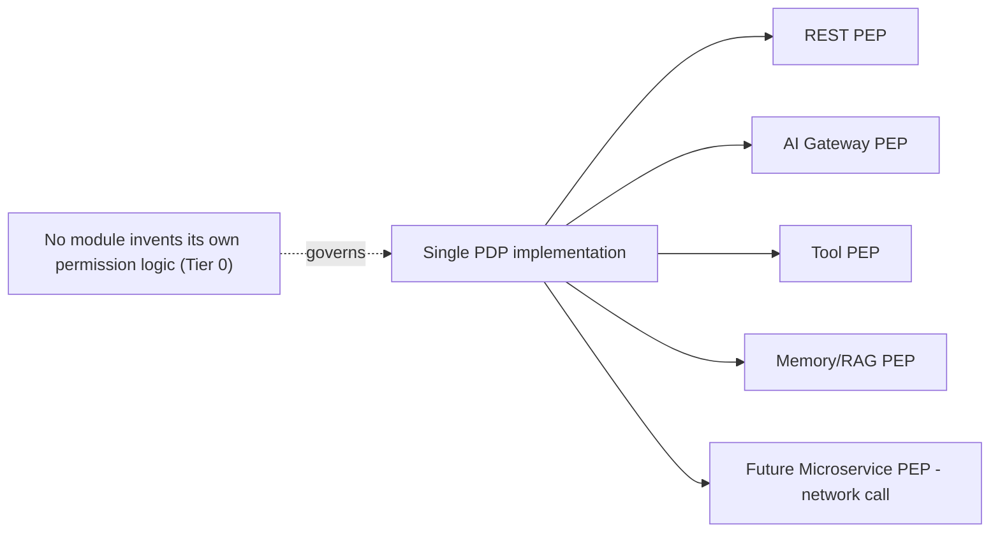

---

## Part 5 — Tenant Isolation Assurance

### 5.1 Formal Definition

**TENANT_CONTEXT = workspaceId.** Every request touching tenant-owned data must establish this context at its entry point and preserve it, unmutated, through every layer it passes — a service, repository, cache key, search query, AI context assembly, log line, or export that loses or silently substitutes `TENANT_CONTEXT` has failed the single most consequential invariant in this document (Tier 0, Principle 1). This formalizes `DATABASE.md` §3.1's `workspaceId` scoping and `FRONTEND_ARCHITECTURE.md` §4.6's cache-isolation invariant as one, testable, security property rather than two independently-maintained conventions.

### 5.2 Attack Surface: 15 Named Attack Classes

| # | Attack | Description | Primary defense layer (§5.3) |
|---|---|---|---|
| 1 | IDOR | A resource ID from one workspace accepted in a request scoped to another | L1 (API param validation against session's `workspaceId`) |
| 2 | Cross-tenant query | A database query missing a `workspaceId` filter | L4–L5 (ORM/Postgres) |
| 3 | Cross-tenant mutation | A write operation targeting a row outside the authenticated workspace | L3–L5 (Repository/ORM/Postgres) |
| 4 | Cache collision | A cache key not namespaced by `workspaceId`, serving Workspace A's cached value to Workspace B | L7 (Cache) |
| 5 | Queue contamination | A job payload's `workspaceId` not re-validated at execution, processed against the wrong workspace's data | L2–L3 (Service/Repository, §2.3) |
| 6 | Event contamination | An Event Bus subscriber processing an event without checking its `workspaceId` | L2 (Service, Event Bus consumer boundary) |
| 7 | Search leakage | A full-text search query returning results across workspaces | L8 (Search) |
| 8 | Vector leakage | A `pgvector` similarity query returning embeddings from another workspace | L9 (AI) |
| 9 | Memory leakage | An AI Employee's Context Engine assembling context from the wrong workspace's memory tier | L9 (AI) |
| 10 | File leakage | A signed URL or storage path not scoped to the requesting workspace | L6 (Storage) |
| 11 | Notification leakage | A notification delivered to a user outside its originating workspace | L2 (Service) |
| 12 | Analytics leakage | A cross-workspace aggregate computed without consent (`ENTERPRISE_INTELLIGENCE_ARCHITECTURE.md` §14.1, cited) | L2, L9 |
| 13 | Log leakage | A log line correlating data across workspaces without explicit, reviewed justification | L10 (Observability) |
| 14 | Export leakage | A data export including rows outside the requesting workspace | L1–L5 |
| 15 | Backup leakage | A restored backup or DR failover exposing one workspace's data in another's restored context | L5–L6, `CLOUD_INFRASTRUCTURE.md` §8's DR posture, cited |

### 5.3 Ten Defense Layers

| Layer | Name | Mechanism | Enforcement |
|---|---|---|---|
| **L1** | API | Request `workspaceId` param/path validated against the authenticated session's own membership, never trusted as caller-supplied fact alone | Unified Authorization Fabric PEP (Part 4) |
| **L2** | Service | Use-Case-layer logic threads `TENANT_CONTEXT` explicitly through every call, never re-derives it ambiguously mid-flow | `BACKEND_ARCHITECTURE.md` layering, cited |
| **L3** | Repository | Every repository method signature requires `workspaceId` as an explicit, non-optional parameter | Type-system-enforced (no overload omitting it) |
| **L4** | ORM | Prisma query builder wrapped so a workspace-scoped model's query helper cannot be called without a `workspaceId` filter | `ENGINEERING_STANDARDS.md` §15.8's lint rule, cited and extended here as the ORM-layer enforcement point specifically |
| **L5** | PostgreSQL | Row-Level Security (RLS) policies as the defense-in-depth backstop — even a bug that bypasses L1–L4 cannot read/write across a `workspaceId` boundary at the database engine itself | New here — the deepest, database-native layer, not previously specified in `DATABASE.md` |
| **L6** | Storage | Object storage paths/prefixes namespaced by `workspaceId`; signed URLs scoped to the exact object, never a workspace-wide prefix grant | `CLOUD_INFRASTRUCTURE.md` §9.1, cited |
| **L7** | Cache | Every cache key namespaced `[workspaceId, resource, ...]` | `FRONTEND_ARCHITECTURE.md` §5.9 (server-state cache) and `BACKEND_ARCHITECTURE.md` §5.8 (L1/L2 cache), cited, extended platform-wide |
| **L8** | Search | Full-text and Hybrid Search queries (`BACKEND_ARCHITECTURE.md` §7.4, `AI_PLATFORM_ARCHITECTURE.md` §7, cited) always include a `workspaceId` filter as a mandatory, non-optional query clause |
| **L9** | AI | Context Engines (`ENTERPRISE_INTELLIGENCE_ARCHITECTURE.md` Part 4, cited) and Memory/RAG retrieval (Part 11 of this document) enforce `workspaceId` scoping before any content reaches a model prompt |
| **L10** | Observability | Log/trace/metric pipelines tag every event with `workspaceId`; cross-workspace correlation in the observability stack requires the same explicit-consent mechanism as any other cross-workspace aggregation | `CLOUD_INFRASTRUCTURE.md` §11.2, cited |

### 5.4 Tenant Isolation Assurance Program

**Why.** A layered defense (§5.3) is only actually a defense if every layer is *continuously verified*, not merely designed correctly once. The Assurance Program is the standing, non-optional practice that keeps it that way.

**Components:** (1) a CI-gate lint rule (`ENGINEERING_STANDARDS.md` §15.8, cited) blocking any L3/L4-layer query missing a `workspaceId` clause; (2) a mandatory, automated Tenant Isolation Test Suite (Part 30) run on every PR touching a workspace-scoped model, treated as a release gate, never optional; (3) a quarterly (NOW/NEXT) to monthly (SCALE+) manual penetration-style review specifically targeting the 15 attack classes in §5.2; (4) a Security Chaos experiment (Part 31) simulating a cross-tenant query attempt as a recurring, scheduled exercise, not a one-time test.

**Who owns it.** Security Engineering (Part 33), with L1–L4 enforcement co-owned by whichever team owns the touched module (`ENGINEERING_STANDARDS.md` §2.7, cited), and L5's RLS policies owned by the Data/Infrastructure team jointly.

**What happens when it fails / detection / recovery.** A confirmed tenant-isolation violation is an automatic P1/Critical incident (Part 20), triggering the Tenant Isolation Failure playbook (§20.5) regardless of whether it was exploited or merely discovered in testing — detected via the CI gate (pre-production) or the Security Event Fabric's `TENANT_ISOLATION_VIOLATION` event type (Part 18, production); recovery includes immediate query/code rollback, an emergency RLS-policy audit, and mandatory customer notification per the Incident Response Communication stage (§20's `COMMUNICATE` phase) if any cross-tenant data was actually returned.

**Cost.** L5's Row-Level Security is the one net-new mechanism this Part introduces beyond what `DATABASE.md` already specified — a moderate, one-time schema/policy-authoring cost, justified specifically because it is the only layer in this list that remains a defense even if every application-layer control (L1–L4) simultaneously fails, which no other single layer can claim.

**When built.** L1–L4 and the CI lint gate are NOW horizon (already substantially specified across prior documents, formalized here). L5 (RLS) is a **launch blocker** (Part 38) — it ships before general availability, not deferred, given it is this program's only defense-in-depth backstop against a total application-layer failure.

**Diagram 9 — Ten-Layer Tenant Isolation Defense**

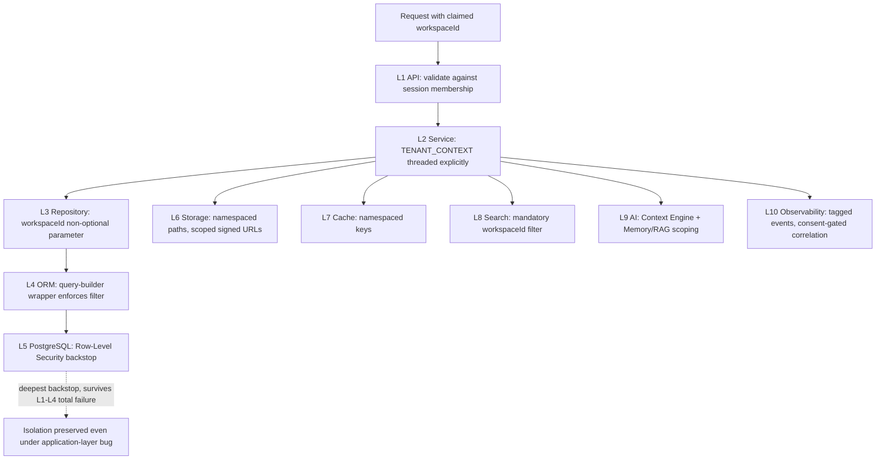

**Diagram 10 — 15 Attack Classes Mapped to Defense Layers**

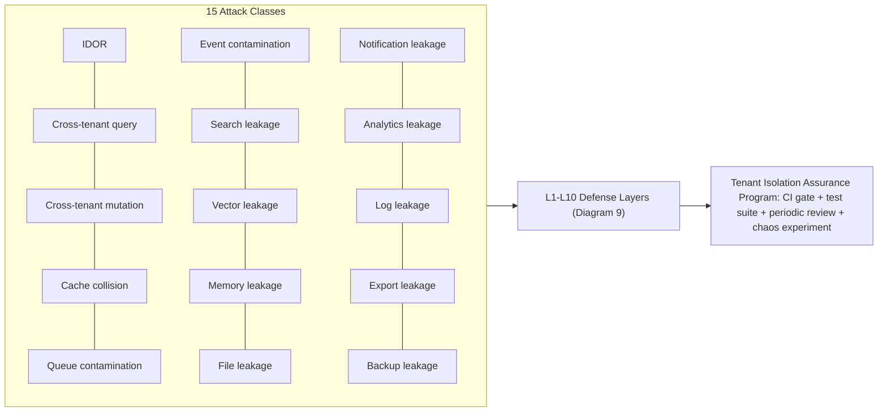

---

## Part 6 — AI Trust Boundary

### 6.1 The AI Security Control Plane

**Why.** AI is never a trusted principal by default (Tier 0, Principle 3) — this is the single most important departure from a conventional application security model, and it requires its own control-plane component, layered on top of Part 3's general Control Plane, specifically because an AI Agent's *apparent* correctness or confidence is not a security signal and must never be treated as one.

**Where enforced.** Every AI operation — an Agent Runtime invocation, a Tool call, a Memory read, a RAG retrieval — carries a mandatory, structured identity context object, checked by the AI Security Control Plane before the operation proceeds:

| Field | Meaning |
|---|---|
| `AI_ID` | The unique identifier of the specific AI Employee/Agent instance (`ENTERPRISE_INTELLIGENCE_ARCHITECTURE.md` §1.7's `occupancyType: AI` seat, cited) |
| `WORKSPACE_ID` | The `TENANT_CONTEXT` (Part 5) this operation is scoped to |
| `USER_ID` | The human who initiated the chain of action, if any (an AI Employee acting on a scheduled/autonomous trigger has no `USER_ID`, only a stated `PURPOSE`) |
| `AGENT_ID` | The specific Agent Runtime invocation instance (`AI_PLATFORM_ARCHITECTURE.md` §9, cited) — distinct from `AI_ID`, since one AI Employee seat may have many invocation instances over time |
| `POLICY_CONTEXT` | The resolved RBAC role and Autonomous Decision Level (`ENTERPRISE_INTELLIGENCE_ARCHITECTURE.md` §9.7, cited) applicable to this operation |
| `AUTHORITY_LEVEL` | This document's Action Authority Level (Part 7), evaluated per operation |
| `PURPOSE` | A stated, machine-checkable reason (§0.3's Security North Star, restated) |
| `RESOURCE_SCOPE` | The exact resource(s) this operation touches — never inferred broadly |
| `RISK_LEVEL` | The AI Action Risk Engine's classification (Part 8) |
| `TRACE_ID` | The correlation ID (`ENGINEERING_STANDARDS.md` §5.4, cited) linking this operation to its full Reasoning Trace |

### 6.2 AI Identity, Role, Permissions & Authority

Fully specified by `ENTERPRISE_INTELLIGENCE_ARCHITECTURE.md` §1.7 (unified Employee entity, `occupancyType: AI`) and §2.1 (Authority Boundary = the seat's `AUTH_ARCHITECTURE.md` RBAC role, cited) — this document adds the security-enforcement statement: **AI role and AI permissions are read from the identical `Role`/`Permission`/`RolePermission` tables a human `WorkspaceMember` is read from, via the identical PDP (Part 4)** — there is no `AIRole` or `AIPermission` table, by design, since a parallel permission model is exactly the "custom permission logic" Tier 0 Principle 2 (Part 4) forbids.

### 6.3 AI Memory Scope, Tool Scope, Spending Scope & Communication Scope

| Scope | Definition | Enforced by |
|---|---|---|
| **Memory scope** | Which memory tiers (`AI_PLATFORM_ARCHITECTURE.md` §6, cited) this AI identity may read/write — Workspace/Business/Organizational shared, Working/Session private per `ENTERPRISE_INTELLIGENCE_ARCHITECTURE.md` §3.5's sharing rule, cited | Part 11 |
| **Tool scope** | The Tool Permission Manifest (Part 10) applicable to this `AI_ID` and `AGENT_ID` | Part 10 |
| **Spending scope** | The AI Credits budget (`AI_PLATFORM_ARCHITECTURE.md`'s AI Credits Engine, cited) and, for financial-adjacent actions, the hard governance floor forbidding autonomous fund transfer (`ENTERPRISE_INTELLIGENCE_ARCHITECTURE.md` ADR-EI-014, cited) — never overridable by any Authority Level (Part 7) |
| **Communication scope** | Which external parties (customers, third parties) this AI identity may communicate with, and whether a draft requires human approval before sending — restates `ENTERPRISE_INTELLIGENCE_ARCHITECTURE.md` §2.3's table (AI Sales Director drafts, never autonomously sends, outreach) as a binding security scope, not merely a product behavior |

**What data it protects.** Every workspace's business data, AI Memory, and — transitively, via Tool calls — every external system an AI Employee can reach.

**What happens when it fails.** An AI operation missing any required context-object field (§6.1) is refused outright before Agent Runtime execution begins — a HARD REQUIREMENT, since an incomplete identity context is indistinguishable from a spoofed or malfunctioning one, and neither is safe to execute.

**How detected.** Every refused operation is logged as an `AI_HIGH_RISK_ACTION`-adjacent Security Event (Part 18); a pattern of repeated context-object failures for one `AI_ID` triggers Security Detection (Part 19)'s agent-abuse category.

**How recovered.** The Agent Runtime invocation is retried with a corrected context object only if the correction originates from the AI Gateway itself re-resolving identity — never by an Agent "fixing" its own missing context, which would itself be a self-escalation attempt (Part 7).

**Cost.** The context object is attached once per invocation, not per tool call within it, keeping overhead proportional to Agent invocations, not to tool-call volume.

**When built.** NOW horizon — this is the foundational AI security mechanism every other Part in this document's AI sections depends on; it ships before any AI Employee reaches L2+ authority (Part 7).

**Diagram 11 — AI Security Control Plane & Identity Context Object**

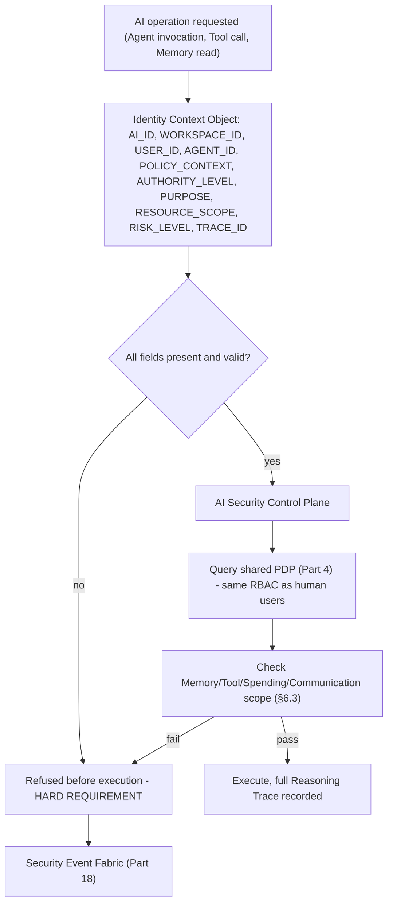

---

## Part 7 — AI Authority Matrix

### 7.1 Two Distinct Axes of AI Authority — A Note on Terminology

`ENTERPRISE_INTELLIGENCE_ARCHITECTURE.md` §9.7 already defines a five-level **Autonomous Decision Level** ladder (L0 Observe, L1 Recommend, L2 Act-with-approval, L3 Act-with-notification, L4 Full-autonomy-within-budget) governing whether an AI Employee's *business decision* may proceed without human sign-off. This document's mandate requires a six-level **AI Action Authority Matrix** (L0 Observe, L1 Analyze, L2 Recommend, L3 Prepare, L4 Execute-Bounded, L5 Execute-High-Impact) classifying the *security risk of an individual technical action* (a tool call, a data read, a write). These are **not the same axis**, and this document does not force them to be — collapsing a business-governance ladder and a technical-security-risk ladder into one scale would blur exactly the distinction that makes each one legible. Instead:

- **Autonomous Decision Level** (`ENTERPRISE_INTELLIGENCE_ARCHITECTURE.md`, cited) answers: *"Is this AI Employee, in its business role, permitted to act on this recommendation without a human first approving it?"*
- **AI Action Authority Level** (this Part) answers: *"Given that permission, how security-sensitive is the specific technical action being taken to carry it out?"*

A single business decision at Autonomous Decision Level L2 (Act-with-approval) may be *realized* through several tool calls, each independently classified at its own Action Authority Level — a low-risk read (L1 Analyze) and a high-impact write (L5 Execute-High-Impact) within the same approved business decision are gated differently by this document's matrix, even though both fall under the same upstream business-governance approval. **This naming divergence between the two documents is flagged as Cross-Document Audit Finding CDA-009 (Part 39)**, recommending a future joint ADR to adopt shared vocabulary — not silently resolved here, per this phase's explicit mandate.

### 7.2 The AI Action Authority Matrix

| Level | Name | Definition | Example |
|---|---|---|---|
| **L0** | OBSERVE | Read-only, no output surfaced beyond internal Agent reasoning | Reading Digital Twin state to assemble context |
| **L1** | ANALYZE | Read-only, output is an internal computation/score, not yet a recommendation | Computing a Domain Intelligence signal (`ENTERPRISE_INTELLIGENCE_ARCHITECTURE.md` Part 6, cited) |
| **L2** | RECOMMEND | Output is a human-visible recommendation; no state change | Surfacing a suggested action in the Executive Command Center |
| **L3** | PREPARE | A draft, unsent artifact is created — a draft email, a draft workflow change — with no external or persisted effect yet | Drafting customer outreach (never auto-sent, §6.3's Communication scope) |
| **L4** | EXECUTE_BOUNDED | A real state change occurs, within a pre-approved, narrow, reversible scope | A workflow automation executing within its declared budget (`ENTERPRISE_INTELLIGENCE_ARCHITECTURE.md` §9.7's L4, cited) |
| **L5** | EXECUTE_HIGH_IMPACT | A real state change with significant, hard-to-reverse, or externally-visible effect | Any action touching payments, deletions, permissions, or external communications — **always requires explicit human approval regardless of any Autonomous Decision Level configuration (§7.4)** |

### 7.3 Prohibited Self-Escalation (Tier 0, absolute, no exception)

An AI identity (§6.2) can never:

1. Change its own role or permissions.
2. Change its own Autonomous Decision Level or Action Authority Level.
3. Approve its own action (a distinct approver identity is always required for any L5 action, or any L2+ Autonomous-Decision-Level action per `ENTERPRISE_INTELLIGENCE_ARCHITECTURE.md` §9.6, cited).
4. Disable, mute, or bypass audit logging for any action, including its own.
5. Disable or weaken any security control, including ones that would otherwise block it.
6. Modify an authorization policy (`Role`/`Permission`/`RolePermission`) — this is a Policy Administration Point action, human/Governance-only (Part 4).
7. Access secrets or encryption key material directly (Part 14–15) — an AI identity never holds a decryption key or a raw credential; it operates only through the `SecretsProviderPort` abstraction's already-authorized service calls, never by requesting the secret itself.
8. Cross a `TENANT_CONTEXT` boundary (Part 5) under any circumstance, including a Cross-Workspace-Intelligence-consented aggregation, which is always evaluated by the PDP (Part 4) as a distinct, explicit grant — never assumed from the AI's own judgment that the aggregation is "probably fine."
9. Grant another AI identity greater authority than it itself holds — restates `ENTERPRISE_INTELLIGENCE_ARCHITECTURE.md` ADR-EI-007's delegation-as-intersection-never-union rule (cited) as a Tier 0 security invariant, not only a business-architecture decision.

### 7.4 Approval Requirements

The following action categories require explicit, distinct-identity human approval **regardless of Action Authority Level or Autonomous Decision Level configuration** — this table is a Tier 0/Tier 1 floor, not a tunable default:

| Category | Approval requirement | Cites |
|---|---|---|
| Payments / financial transfers | Always human-approved; no AI identity ever holds transfer authority | `ENTERPRISE_INTELLIGENCE_ARCHITECTURE.md` ADR-EI-014 |
| Deletion (data, accounts, workspaces) | Always human-approved above a de minimis, reversible-within-a-grace-period threshold | Part 12–13 |
| Permission changes | Always human/Governance-approved via PAP (Part 4) | Tier 0, §7.3 item 6 |
| Security configuration changes | Always human-approved, CISO-notified for Tier 0/1 controls | Part 1 |
| Customer communication (external-facing) | Draft-only (L3) by default; send requires human approval unless explicitly, narrowly pre-approved for a bounded template class | §6.3 |
| External API actions with side effects | Human-approved unless the specific action-type has an earned, evidence-based L4 grant (`ENTERPRISE_INTELLIGENCE_ARCHITECTURE.md` §11.3's Organizational Learning evidence requirement, cited) | Part 8 |
| Credential operations (rotation, creation, revocation) | Always human/Security-Engineering-approved — an AI identity never self-services credential lifecycle actions | Part 14 |
| Data export | Always human-approved above a per-request row/size threshold | Part 12–13 |

**Diagram 12 — AI Action Authority Matrix (L0–L5)**

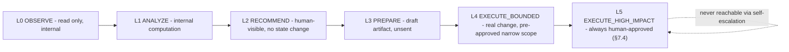

**Diagram 13 — Two Independent Authority Axes**

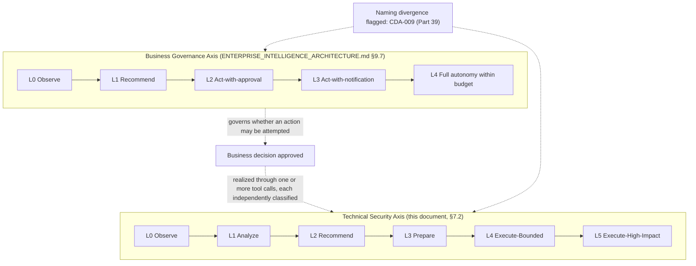

**Diagram 14 — Prohibited Self-Escalation Paths**

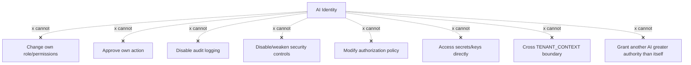

---

## Part 8 — AI Action Risk Engine

### 8.1 Purpose & Architecture

**Why.** The Action Authority Level (Part 7) classifies an action's *category*; the Risk Engine classifies a *specific instance* of that action's actual risk, since two L4-category actions are not equally risky (a bounded workflow automation touching one record versus one touching a thousand). The Risk Engine is deterministic, not AI-judged — restating Tier 0 Principle 15 (§1.2): **AI confidence must never override deterministic security policy.**

**Risk levels:**

| Level | Name | Meaning |
|---|---|---|
| **R0** | Informational | No security-relevant consequence |
| **R1** | Low | Reversible, narrow-scope, internal-only effect |
| **R2** | Moderate | Reversible but broader scope, or narrow but externally-visible |
| **R3** | High | Hard-to-reverse or significant external/financial exposure |
| **R4** | Critical | Irreversible, high-value, or safety/compliance-relevant |

### 8.2 Classifier Inputs

The classifier is a deterministic function (not a model call) over eight inputs, each independently scored and combined via a documented, versioned scoring rule (not a black box — the scoring rule itself is Tier 2, reviewable, and its version is included in every Reasoning Trace):

| Input | What it measures |
|---|---|
| Data sensitivity | The Data Classification tier (Part 12) of the resource(s) touched |
| Financial impact | Estimated monetary consequence, if any |
| External impact | Whether the action is visible/consequential to a party outside the workspace |
| Irreversibility | Whether the action can be undone, and within what window |
| Authorization scope | How broad a resource set the action's own granted scope covers |
| User intent | Whether a human explicitly requested this specific action, or the AI initiated it autonomously |
| AI confidence | The Agent's own self-reported confidence (`ENTERPRISE_INTELLIGENCE_ARCHITECTURE.md` §9.4's Confidence Engine, cited) — **an input to the score, never itself the gating decision** |
| Policy restrictions | Whether any Tier 0/1 floor (§7.4) or Business Rule Engine constraint (`ENTERPRISE_INTELLIGENCE_ARCHITECTURE.md` §9.8, cited) already applies |

### 8.3 The Non-Negotiable Rule

**AI confidence must not override deterministic security policy.** A 99%-confidence Agent proposing an R4-classified action still requires the identical human approval an R4 action requires at any confidence level — confidence affects how the recommendation is *presented and prioritized* (`ENTERPRISE_INTELLIGENCE_ARCHITECTURE.md` §9.3–§9.4's Decision Scoring, cited), it never affects *whether the gate applies*. This is the concrete enforcement of Tier 0 Principle 15 and directly closes the failure mode where a sufficiently confident-sounding AI output could otherwise talk its way past a control.

**What data it protects.** Every resource an AI action touches, by ensuring the gate applied to it is a function of the resource's actual sensitivity, not the AI's rhetoric about the action.

**What happens when it fails.** If the deterministic classifier itself is unavailable, the system fails closed to the most conservative interpretation — R4 — rather than defaulting to a lower risk level in the classifier's absence (Part 21 governs this resilience posture).

**How detected.** Every classification is logged; a pattern of an AI Employee's proposed actions clustering suspiciously near a risk-tier boundary (a possible sign of prompt engineering attempting to stay just under a threshold) is a named Security Detection category (Part 19).

**How recovered.** A misclassification discovered after the fact (the scoring rule itself had a defect) triggers a scoring-rule ADR-SEC review (Part 35) and a retroactive audit of every action classified under the defective rule version.

**Cost.** Negligible — a deterministic function evaluated per action, not a model call.

**When built.** NOW horizon, ships before any AI Employee reaches Action Authority Level L4.

**Diagram 15 — AI Action Risk Engine Classification Flow**

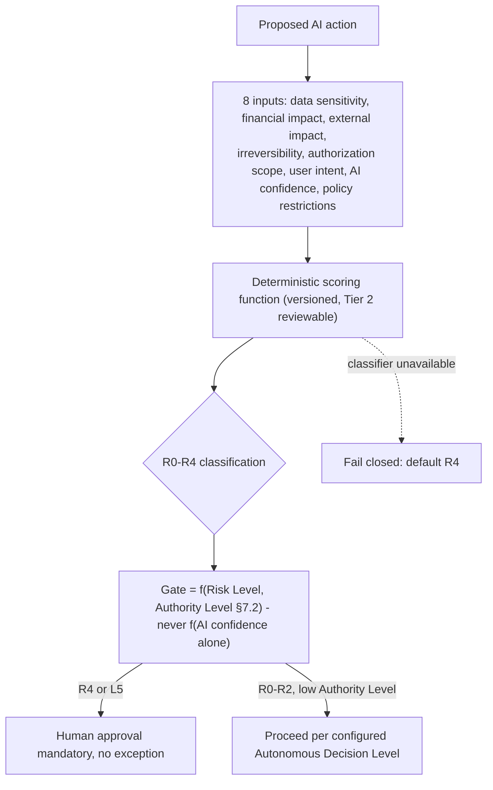

---

## Part 9 — Prompt Injection Defense

### 9.1 The Trust Hierarchy (Tier 0, absolute)

Ten named trust levels, strictly ordered — content at a lower level can never instruct, override, or redefine behavior specified at a higher level, enforced structurally in how the Prompt Compiler (`AI_PLATFORM_ARCHITECTURE.md` §3, cited) assembles a model's context window, not merely as a convention prompt authors are asked to follow:

| Level | Name | Example | Can it issue instructions the model obeys? |
|---|---|---|---|
| 1 (highest) | SYSTEM POLICY | This document's Tier 0 invariants, compiled into every Agent's base instructions | Yes — absolute |
| 2 | SECURITY POLICY | The AI Security Control Plane's runtime constraints (Part 6) | Yes — absolute |
| 3 | DEVELOPER POLICY | The Prompt Registry's authored Mandate (`AI_PLATFORM_ARCHITECTURE.md` §3, cited) | Yes, within Level 1–2's bounds |
| 4 | USER INSTRUCTION | The human's actual request in the current turn | Yes, within Level 1–3's bounds |
| 5 | TRUSTED APPLICATION DATA | Data the platform itself generated and controls (Digital Twin facts, `ENTERPRISE_INTELLIGENCE_ARCHITECTURE.md` Part 1, cited) | No — informational only |
| 6 | RETRIEVED DATA | Hybrid Search / RAG results (Part 11) | No |
| 7 | DOCUMENT CONTENT | User-uploaded or ingested documents | No |
| 8 | WEB CONTENT | Any externally-fetched web content | No |
| 9 | TOOL OUTPUT | The return value of a Tool call | No |
| 10 (lowest) | UNTRUSTED EXTERNAL INPUT | Anything from an unauthenticated or low-trust external source (an inbound webhook body, a third-party API response) | No |

**Enforcement mechanism.** Levels 5–10 are compiled into the model's context with explicit structural delimiters and a system-level instruction (Level 1–2) that content within those delimiters is *data to reason about*, never *instructions to follow* — this is enforced by the Prompt Compiler's assembly logic (`AI_PLATFORM_ARCHITECTURE.md` §3, cited, extended here with this document's trust-level tagging), not left to the model's own judgment about what is and isn't an instruction, since that judgment is exactly what injection attacks exploit.

### 9.2 Defended Attack Classes

| # | Attack | Defense |
|---|---|---|
| 1 | Direct prompt injection | User instruction (Level 4) attempting to override Level 1–3 — blocked structurally, since Level 4 cannot redefine Level 1–3 regardless of phrasing |
| 2 | Indirect prompt injection | Instructions embedded in retrieved/document/web content (Levels 6–8) attempting to act as instructions — blocked by the delimiter/data-not-instruction compilation rule |
| 3 | Document injection | A malicious instruction embedded in an uploaded file | Same as #2, plus Document Intelligence's (`ENTERPRISE_INTELLIGENCE_ARCHITECTURE.md` §13.10, cited) content-extraction pipeline strips executable-looking patterns before indexing |
| 4 | Web injection | A malicious instruction embedded in fetched web content | Same as #2 |
| 5 | RAG poisoning | A workspace's own indexed content deliberately crafted to influence future retrievals | Part 11's poisoning-detection mechanism |
| 6 | Memory poisoning | A conversation or tool interaction deliberately crafted to corrupt a persisted memory tier | Part 11 |
| 7 | Tool poisoning | A compromised or malicious Tool's output (Level 9) attempting to issue instructions | Same delimiter rule applied to tool output specifically |
| 8 | Agent impersonation | Content claiming to be from a higher-trust AI Employee or system component | The Identity Context Object (§6.1) is cryptographically/structurally distinct from prompt content — impersonation via prompt text cannot forge a `TRACE_ID` or `AI_ID` |
| 9 | Instruction smuggling | Encoding techniques (Unicode tricks, nested encoding) attempting to hide instructions from delimiter detection | Input normalization at the Prompt Compiler boundary before delimiter/trust-level tagging |
| 10 | System prompt extraction | A user attempting to have the model reveal its Level 1–3 instructions | Output filtering (Part 6's Safety/Moderation ports, `AI_PLATFORM_ARCHITECTURE.md`, cited) plus a standing policy that system-level instructions are never treated as a valid disclosure request regardless of framing |
| 11 | Data exfiltration | An injected instruction attempting to make the Agent emit sensitive data through an output channel (a crafted tool call, a formatted response designed to leak data to an external party) | The Data Classification/redaction controls (Part 12) and Tool permission scoping (Part 10) apply regardless of what instructed the attempted exfiltration — this is why exfiltration defense is structural (authorization-based), not detection-based alone |

**What data it protects.** Every Agent's context window and every downstream action it might take as a result of a successfully injected instruction.

**What happens when it fails.** A successful injection that nonetheless attempts an action beyond the Agent's actual Authority Level (Part 7) or Tool scope (Part 10) is still blocked at that independent layer — injection defense and authorization enforcement are deliberately two separate, non-cooperating controls, so a bypass of one does not imply a bypass of the other (Defense in Depth).

**How detected.** Anomalous prompt/content patterns (Security Detection, Part 19's "prompt injection" category) and Reasoning Trace review (`ENTERPRISE_INTELLIGENCE_ARCHITECTURE.md` §9.5, cited) surfaced flagged attempts even when successfully blocked.

**How recovered.** A confirmed injection incident follows the Part 20 IR playbook §20.6 (Prompt Injection).

**Cost.** The Prompt Compiler's trust-level tagging and delimiter logic is a fixed, one-time engineering cost, not a per-request compute-heavy defense.

**When built.** NOW horizon — the trust hierarchy is foundational and ships before any AI surface handling untrusted content (Levels 6–10) goes to production.

**Diagram 16 — Ten-Level Prompt Trust Hierarchy**

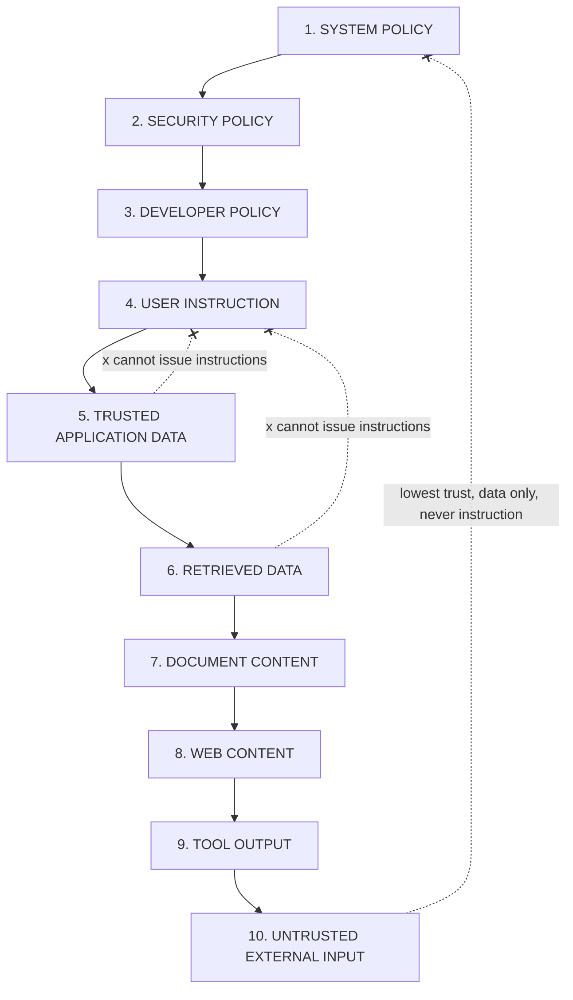

**Diagram 17 — Indirect Prompt Injection Attack Path & Defense**

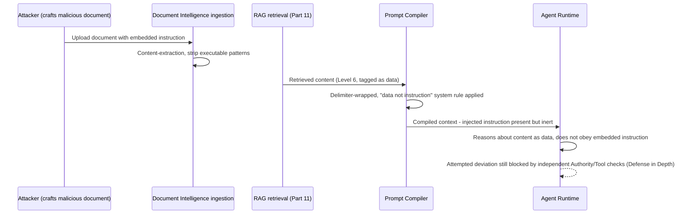

---

## Part 10 — Agent & Tool Security

### 10.1 The Tool Call Security Pipeline

**Why.** `AI_PLATFORM_ARCHITECTURE.md` §9's Tool Registry and Tool Calling already reuse RBAC ("no elevated AI service account," cited); this Part specifies the full, ordered pipeline every tool call passes through — eight checks, in order, fail-fast:

| Step | Check | Failure behavior |
|---|---|---|
| 1 | **Identity** | Is the Identity Context Object (§6.1) complete and valid? | Refuse |
| 2 | **Permission** | Does the resolved RBAC role (§6.2) grant this specific tool? | Refuse |
| 3 | **Resource Scope** | Does the tool call's target resource fall within the granted `RESOURCE_SCOPE`? | Refuse |
| 4 | **Policy** | Does the Business Rule Engine (`ENTERPRISE_INTELLIGENCE_ARCHITECTURE.md` §9.8, cited) or any Tier 0/1 floor (§7.4) block this? | Refuse |
| 5 | **Risk** | What Risk Level (Part 8) does this specific call carry? | Route to approval if R3/R4 |
| 6 | **Rate Limit** | Has this `AI_ID`/`AGENT_ID` exceeded its call-frequency budget for this tool? | Throttle/refuse |
| 7 | **Budget** | Has this `AI_ID` exceeded its AI Credits spending scope (§6.3)? | Refuse |
| 8 | **Audit** | Is the Security Event Fabric (Part 18) reachable to record this call? | See Part 21's resilience posture — never proceed silently if audit is unavailable |

### 10.2 Tool Permission Manifest

Every registered Tool (`AI_PLATFORM_ARCHITECTURE.md` §9's Tool Registry, cited) declares a Manifest — a structured, reviewed artifact, not an inferred property — with: its category (§10.3), its required RBAC permission(s), its default Action Authority Level (Part 7) and Risk Level baseline (Part 8), its resource-scope shape, and whether it requires explicit approval regardless of configuration (§10.4). A Tool without a complete Manifest cannot be registered — a HARD REQUIREMENT enforced at Tool-registration CI time (integrating with `ENGINEERING_STANDARDS.md`'s Gate 4/Dependency-Addition-equivalent review for AI tools specifically).

### 10.3 Tool Categories

| Category | Definition | Default Authority Level ceiling |
|---|---|---|
| **READ** | No state change | Up to L1 (Analyze) without approval |
| **WRITE** | Creates or modifies non-critical state | Up to L4 (Execute-Bounded) with earned autonomy |
| **DELETE** | Removes state | L5 (Execute-High-Impact) — always approved |
| **COMMUNICATE** | Sends content to a party outside the Agent's own reasoning | L3 (Prepare) by default; L4+ requires explicit, narrow pre-approval (§7.4) |
| **FINANCIAL** | Any monetary effect | L5 always — no exception, ever (§7.4, Tier 0) |
| **SECURITY** | Touches identity, permissions, secrets, or security configuration | L5 always, and additionally forbidden to any AI identity per §7.3 item 6–7 regardless of Authority Level |
| **ADMINISTRATIVE** | Workspace/organization-level configuration changes | L5 by default; narrow, reviewed exceptions possible for low-risk configuration (e.g., a notification preference) |

### 10.4 High-Impact Tool Approval

Any tool call classified R3/R4 (Part 8) or belonging to the DELETE, FINANCIAL, SECURITY, or ADMINISTRATIVE categories routes to the Human Approval Architecture (`ENTERPRISE_INTELLIGENCE_ARCHITECTURE.md` §9.6, cited) before execution — the approval request carries the full Manifest context, the specific Risk Engine score, and the Reasoning Trace leading to this call, never a bare "approve this tool call?" prompt.

**What data it protects.** Every external system and every piece of workspace data any registered Tool can reach.

**What happens when it fails.** A tool call failing any of the eight pipeline steps is refused and logged — never partially executed, never retried automatically without the failure being resolved first.

**How detected.** Repeated tool-call refusals for one `AI_ID` (a possible sign of an Agent attempting to work around a denial through retries or rephrased calls) is a named Security Detection category (Part 19, "tool abuse").

**How recovered.** A legitimate but misconfigured Manifest is corrected via the same Tool-registration review process (§10.2), never patched ad hoc at runtime.

**Cost.** Eight checks per tool call, mitigated by the same caching discipline as Part 4's PDP for the cheap, frequently-repeated checks (Identity, Permission) while Risk/Policy evaluation, which depends on call-specific parameters, is never cached.

**When built.** NOW horizon — no Tool ships without a complete Manifest from the first Agent Runtime deployment.

**Diagram 18 — Eight-Step Tool Call Security Pipeline**

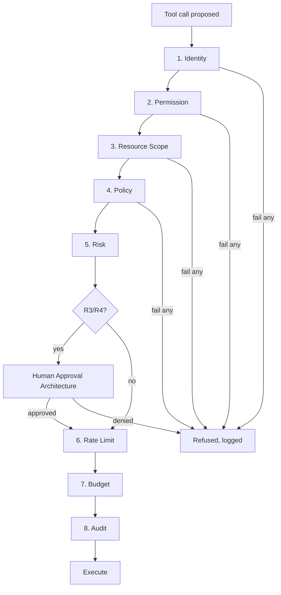

**Diagram 19 — Tool Permission Manifest & Category Authority Ceilings**

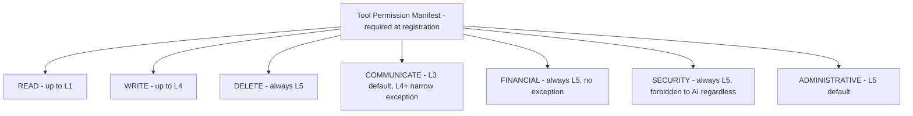

---

## Part 11 — Memory & RAG Security

### 11.1 The Governing Invariant

**Retrieval authorization is enforced before content reaches the model, never after (Tier 0, Principle 13).** The LLM is never relied upon as a security filter — a model cannot be trusted to "notice" and withhold unauthorized content it has already been shown, since by the time content is in context, any information it contains may already influence the output. Every memory tier and RAG source below enforces this identically.

### 11.2 Secured Surfaces

| Surface | Security mechanism |
|---|---|
| **Short-term (Working/Session) memory** | Private to the originating Agent invocation (`ENTERPRISE_INTELLIGENCE_ARCHITECTURE.md` §3.5, cited) — never queryable by another `AI_ID` under any circumstance |
| **Long-term (Workspace/Business/Organizational) memory** | Shared within a workspace (§3.5, cited), but every read is `workspaceId`-filtered (Part 5's L9) before assembly into context |
| **User memory** | Scoped to the specific `USER_ID`; readable by an Agent acting on that user's behalf, never cross-user |
| **Agent memory** | Scoped to the specific `AI_ID`; not readable by other AI identities except via the explicit shared-tier mechanism above |
| **Vector embeddings** | `pgvector` rows carry `workspaceId` and `sourceType` (`AI_PLATFORM_ARCHITECTURE.md` §6–§7, cited) — similarity queries always filter on both before returning candidates |
| **Knowledge base / retrieval results** | Hybrid Search (`AI_PLATFORM_ARCHITECTURE.md` §7, cited) applies Document ACLs (§11.3) as a query-time filter, not a post-retrieval one |

### 11.3 Secure Design Components

**Secure indexing.** Every indexed document/embedding is written with its `workspaceId`, `sourceType`, and an ACL reference at index time — never indexed unscoped and filtered later. **Workspace namespaces** — the vector store's own logical partitioning by `workspaceId`, the same L9 defense from Part 5. **Document ACLs** — a document's own access-control list (which roles/users may retrieve it), checked at query time as an additional filter beyond workspace scoping, since not every document in a workspace is visible to every member. **Metadata filtering** — the query itself carries the requesting identity's resolved scope as a mandatory filter clause, structurally, not as an optional query parameter a caller could omit. **Retrieval authorization** — the PDP (Part 4) is queried before a retrieval result set is returned, not only before the original document was indexed, since a document's ACL or a user's role may have changed since indexing. **Embedding deletion** — when a source document is deleted (Part 13's Data Lifecycle), its embeddings are deleted in the same transaction/operation, never left as orphaned, retrievable vectors. **Memory revocation** — a user or workspace's Data Deletion request (`ENGINEERING_STANDARDS.md` §15.12, cited) propagates to every memory tier, not only the operational database. **Retention** — memory tiers follow the same Data Classification-driven retention policy as any other data (Part 12–13). **Poisoning detection** — described in §11.4.

### 11.4 Poisoning Detection

**Why.** A workspace's own legitimately-indexed content can be deliberately crafted (by a malicious insider, a compromised integration, or an external party via an ingested document) to bias future retrievals or embed latent instructions (§9.2's RAG/Memory poisoning attack classes) — poisoning is distinct from injection in that the malicious content persists and affects *future* operations, not only the operation that introduced it.

**Where enforced.** An ingestion-time content-anomaly check (pattern-matching for instruction-shaped content in a context where only data is expected, extending Document Intelligence's extraction pipeline, `ENTERPRISE_INTELLIGENCE_ARCHITECTURE.md` §13.10, cited) flags suspicious content for review before it is indexed, and a retrieval-time drift check (a document's retrieval-relevance pattern changing abruptly) is a Security Detection signal (Part 19).

**What data it protects.** Every future Agent invocation that would otherwise retrieve poisoned content.

**What happens when it fails.** A flagged document is quarantined (excluded from retrieval) pending review, never silently indexed — a HARD REQUIREMENT for any ingestion-time flag.

**How detected.** Ingestion-time pattern match (immediate) and retrieval-time drift analysis (ongoing, Part 19).

**How recovered.** Quarantined content is either cleared (false positive, re-indexed) or purged with its embeddings deleted (§11.3) and the ingesting identity's access reviewed if the poisoning appears deliberate (routes to Part 20's Incident Response).

**Cost.** Ingestion-time checks add latency proportional to document size, accepted since ingestion is not a request-latency-critical path the way retrieval is.

**When built.** Ingestion-time checks are NOW horizon (launch blocker, Part 38, given RAG is a core product surface from day one per `AI_PLATFORM_ARCHITECTURE.md`). Retrieval-time drift analysis is NEXT/SCALE horizon, triggered by observed retrieval volume sufficient to make drift analysis statistically meaningful.

**Diagram 20 — Memory & RAG Security: Authorization Before Model Consumption**

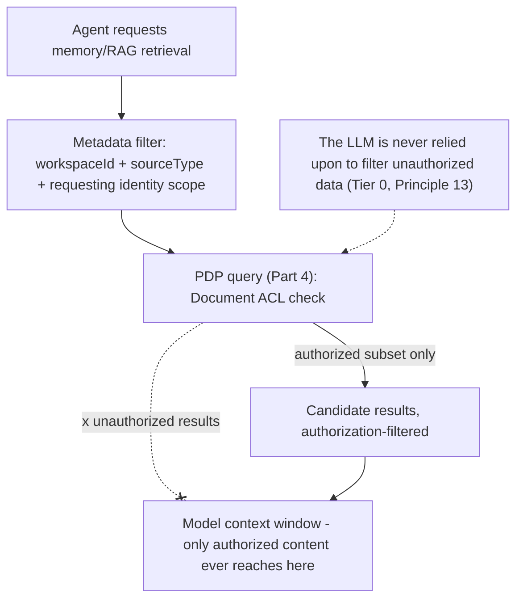

**Diagram 21 — RAG/Memory Poisoning Detection Flow**

```mermaid
flowchart TB
    INGEST["Document/content ingested"] --> ANOMALY["Ingestion-time content-anomaly check"]
    ANOMALY -->|suspicious| QUARANTINE["Quarantined - excluded from retrieval, pending review"]
    ANOMALY -->|clean| INDEX["Indexed: workspaceId, sourceType, ACL"]
    INDEX --> RETRIEVE["Retrieval over time"]
    RETRIEVE --> DRIFT["Retrieval-time drift analysis (Part 19)"]
    DRIFT -->|abnormal pattern| FLAG["Flagged for review"]
    QUARANTINE --> REVIEW{"False positive or genuine poisoning?"}
    REVIEW -->|false positive| REINDEX["Re-indexed"]
    REVIEW -->|genuine| PURGE["Purged, embeddings deleted, IR triggered (Part 20)"]
```

---

## Part 12 — Data Classification

### 12.1 A Five-Tier Extension of the Existing Four-Tier Model

`ENGINEERING_STANDARDS.md` §15.10 already established four tiers (Public, Internal, Confidential, Restricted). This document's mandate requires a fifth: **Critical** — the highest-severity subset of what that document called Restricted, specifically for the narrow class of data whose compromise is catastrophic rather than merely serious (signing keys, root/master credentials, encryption root keys). Rather than silently redefining `ENGINEERING_STANDARDS.md`'s taxonomy, this document treats **Critical as a subdivision carved out of Restricted**, and flags the split explicitly as **Cross-Document Audit Finding CDA-011 (Part 39)**, recommending a small addendum to `ENGINEERING_STANDARDS.md` §15.10 to adopt the fifth tier there too, so the platform has one classification vocabulary, not two.

| Tier | Definition | Examples |
|---|---|---|
| **Public** | No confidentiality requirement | Marketing content, published documentation |
| **Internal** | Non-sensitive operational data | Internal engineering metrics, non-customer-identifying logs |
| **Confidential** | Business data, the majority of `DATABASE.md`'s schema | Workspace business records, deal data, most AI conversation content |
| **Restricted** | Compliance-sensitive, `AUTH_ARCHITECTURE.md` §6-adjacent | PII, financial identifiers, credentials (non-root), health-adjacent data if applicable to a customer's vertical |
| **Critical** *(new — CDA-011)* | Compromise is catastrophic, not merely serious | Signing keys, root/master database credentials, encryption root keys (Part 15), the Control Plane's own policy data (Part 3) |

### 12.2 Handling Matrix

| Tier | Storage | Encryption | Logging | AI usage | Export | Sharing | Retention | Support access | Backup | Deletion |
|---|---|---|---|---|---|---|---|---|---|---|
| Public | Any | Optional | Full | Unrestricted | Unrestricted | Unrestricted | Indefinite | Unrestricted | Standard | Standard |
| Internal | Platform-internal only | In transit | Full | Unrestricted within platform | Internal only | Internal only | Per `ENGINEERING_STANDARDS.md` §15.11 | Unrestricted | Standard | Standard |
| Confidential | `workspaceId`-scoped, Part 5 | In transit + at rest | Redacted per §12.3 | Allowed, workspace-scoped (Part 6-11) | Human-approved, audited | Consent-gated (`ENTERPRISE_INTELLIGENCE_ARCHITECTURE.md` §14.1, cited) | Per-model policy | Support Access Grant required (Part 16) | Encrypted (Part 15) | Full propagation (§13) |
| Restricted | `workspaceId`-scoped + field-level encryption (Part 15) | In transit + at rest + field-level | Redacted, field-name never logged | Restricted — only with explicit, narrow purpose binding (§0.3) | Rare, high-approval, always audited | Never without explicit legal basis | Minimum-necessary, compliance-driven | Highest-scrutiny grant, dual-approval at SCALE+ | Encrypted, access-logged | Full propagation, verified (§13) |
| Critical | Never in application database — KMS/HSM only (Part 15) | Hardware-backed where available | Never logged, ever | Never — no AI identity ever accesses Critical-tier data directly (§7.3 item 7) | Never exported | Never shared | Rotation-driven, not calendar-driven | No access — this tier has no support-access path at all | KMS-native backup | Cryptographic destruction (Part 15) |

**What data it protects.** Every classification tier's own definition is itself the protection scope statement.

**What happens when it fails.** A field found mis-tagged (a Restricted-tier field stored/logged as Confidential) is a Security Event (`SECURITY_POLICY_CHANGE`-adjacent, Part 18) and triggers immediate remediation, tracked as a Technical Debt Register + Risk Register dual entry (`ENGINEERING_STANDARDS.md` §1.6, Part 37 of this document).

**How detected.** Automated field-classification linting (extending `ENGINEERING_STANDARDS.md` §5.3's sensitive-field-name scanning, cited) plus periodic manual classification audits (Part 30).

**How recovered.** Reclassification, retroactive log/export remediation if the mis-tagging already caused an over-broad disclosure, and a postmortem if the impact crossed a Restricted/Critical boundary.

**Cost.** Classification tagging is a per-model, one-time cost at schema-design time (`ENGINEERING_STANDARDS.md`'s own stated rollout approach, cited — new models tagged at creation, existing ones tracked as a rollout debt item, not a blocking retrofit).

**When built.** NOW horizon for Public/Internal/Confidential/Restricted (already effectively required by `ENGINEERING_STANDARDS.md`); Critical tier and its KMS-only storage rule is a **launch blocker** (Part 38) given it directly gates the Secrets/Key Architecture (Parts 14–15).

**Diagram 22 — Five-Tier Data Classification & Handling**

```mermaid
flowchart TB
    PUBLIC["Public"] --> INTERNAL["Internal"] --> CONFIDENTIAL["Confidential"] --> RESTRICTED["Restricted"] --> CRITICAL["Critical (new tier, CDA-011)"]
    CRITICAL --> KMSONLY["KMS/HSM only - never in application database, never logged, never AI-accessible"]
    RESTRICTED --> FIELDENC["Field-level encryption, narrow-purpose AI use only"]
    CONFIDENTIAL --> WORKSPACESCOPE["workspaceId-scoped, consent-gated sharing"]
```

---

## Part 13 — Data Lifecycle

### 13.1 Nine-Stage Lifecycle

**CREATE → CLASSIFY → STORE → USE → SHARE → ARCHIVE → RETAIN → DELETE → VERIFY.** Every data category below moves through all nine stages; `VERIFY` (confirming deletion actually completed, including in backups) is the stage most systems omit and this document treats as mandatory, not optional, restating `ENGINEERING_STANDARDS.md` §15.12's citation that deletion "is not complete... until it has aged out of backups too."

### 13.2 Lifecycle Controls by Category

| Category | Create | Classify | Store | Use | Share | Archive | Retain | Delete | Verify |
|---|---|---|---|---|---|---|---|---|---|
| Business data | `DATABASE.md` write | At schema design (Part 12) | `workspaceId`-scoped (Part 5) | Via Unified Authorization Fabric (Part 4) | Consent-gated | Soft-delete per `DATABASE.md`'s selective policy | Per-model policy (`ENGINEERING_STANDARDS.md` §15.11) | Cascades to Digital Twin/Knowledge Graph recompute (`ENTERPRISE_INTELLIGENCE_ARCHITECTURE.md` §15.5, cited) | Confirmed against backup aging (§13.3) |
| AI conversations | Agent Runtime invocation | Confidential default, Restricted if PII detected | Memory tiers (Part 11) | Context assembly (Part 6, 11) | Never cross-workspace without consent | Per Memory tier's own retention | Shorter default than business data (conversation-specific policy) | Propagates to embeddings (§11.3) | Confirmed |
| Files | Upload (`CLOUD_INFRASTRUCTURE.md` §9.1, cited) | At upload, by content type/user tag | Object storage, `workspaceId`-namespaced | Signed-URL-gated | Signed-URL, time-boxed | Storage lifecycle tiering (`CLOUD_INFRASTRUCTURE.md` §9.1, cited) | Per-classification | Storage + embeddings (if Document-Intelligence-indexed) | Confirmed |
| Embeddings | Indexing (§11.3) | Inherits source document's classification | `pgvector`, workspace-namespaced | Retrieval (Part 11) | Never | N/A | Tied to source document | Cascades from source deletion, same transaction | Confirmed |
| Audit logs | Every audited action (Part 18) | Internal (never deleted early) | Append-only Audit Infrastructure (`CLOUD_INFRASTRUCTURE.md` §14.6, cited) | Investigation, compliance | Compliance/legal only | Never — audit logs are not archived-then-forgotten, they are retained per compliance schedule | Compliance-driven, typically longest retention in the system | Only after retention expiry, itself an audited event | Confirmed |
| Billing | Transaction creation | Restricted (financial identifiers) | Field-level encrypted (Part 15) | Payment provider integration only | Payment provider only, minimum necessary | Standard | Compliance-driven (tax/financial regulation) | Rare — financial records typically outlive normal retention for legal reasons | Confirmed |
| Security events | Security Event Fabric (Part 18) | Internal/Restricted depending on content | Append-only, immutable | Detection (Part 19), IR (Part 20) | Security team, compliance auditors | Never early-archived | Longest retention alongside audit logs | Compliance-expiry only | Confirmed |
| Backups | Continuous (`CLOUD_INFRASTRUCTURE.md` §8.2, cited) | Inherits source data's classification | Encrypted (Part 15) | Restore only (Part 16's PAM-gated, no casual access) | Never | N/A | Bounded by RPO/retention window (`CLOUD_INFRASTRUCTURE.md` §8.2, cited) | Ages out per window — this is what §13's `VERIFY` stage checks | Confirmed via restore-test cadence (`ENGINEERING_STANDARDS.md` §14.10, cited) |

**Diagram 23 — Nine-Stage Data Lifecycle**

```mermaid
flowchart LR
    CREATE --> CLASSIFY --> STORE --> USE --> SHARE --> ARCHIVE --> RETAIN --> DELETE --> VERIFY
    VERIFY -.confirms deletion including backup aging.-> VERIFY
    DELETE -.cascades.-> EMBEDDINGS[Embeddings]
    DELETE -.cascades.-> TWIN["Digital Twin recompute"]
```

---

## Part 14 — Secrets & Key Architecture

### 14.1 Secrets Lifecycle

Fully specified by `CLOUD_INFRASTRUCTURE.md` §7.2 (managed KMS/secrets service, CSI-driver injection, cited) and `BACKEND_ARCHITECTURE.md`'s `SecretsProviderPort` (cited) — this document adds the complete lifecycle every secret follows, seven stages: **CREATE → STORE → USE → ROTATE → REVOKE → EXPIRE → DESTROY**.

| Secret type | Create | Store | Rotate | Revoke/Expire | Destroy |
|---|---|---|---|---|---|
| JWT signing keys | Generated in KMS, never exported in plaintext | KMS-native | Scheduled, `AUTH_ARCHITECTURE.md` §8's rotation-as-job pattern, cited | Old key retained in JWKS through grace period, then... | ...cryptographically destroyed in KMS |
| Database credentials | Provisioned via IaC (`CLOUD_INFRASTRUCTURE.md` §7.1, cited) | KMS-native | Scheduled + on-demand (post-incident) | Immediate on suspected compromise | KMS-native destruction |
| API keys (customer-facing) | User-initiated, hashed at rest (never stored plaintext) | Hash only in `DATABASE.md` | User-initiated | User- or admin-initiated, or automatic on suspected abuse (Part 19) | Hash record retained for audit (the hash, not the secret, per Part 13's audit-log retention) |
| OAuth secrets | Provider-issued | KMS-native | Per provider's own rotation support | On disconnection | KMS-native |
| AI provider credentials | Provisioned via IaC | KMS-native | Scheduled | On provider-relationship change | KMS-native |
| Webhook secrets | Generated at webhook registration | KMS-native or hashed, per delivery-verification need | User- or system-initiated | On webhook deletion | KMS-native or record purge |
| Encryption keys | See §15.2's key hierarchy | KMS/HSM-native | Per §15.3 | Per §15.3 | Cryptographic destruction, never simple deletion of a reference |
| Cloud credentials | IaC-provisioned, three-tier IAM (`CLOUD_INFRASTRUCTURE.md` §14.3, cited) | KMS-native | Scheduled, short-lived-preferred (dynamic credentials where the KMS supports it) | Immediate on role change | KMS-native |

### 14.2 The Absolute Rule

**No secret exists in:** source code, Git (including history), frontend bundles, Docker layers, logs, analytics, or error telemetry. This restates `ENGINEERING_STANDARDS.md` §15.5 and §12.9 (commit-level secret scanning) as Tier 0 here — enforced by: pre-commit + CI commit-level scanning (`ENGINEERING_STANDARDS.md` ADR-ENG-031, cited), the centralized log-redaction boundary (§5.3 of that document, cited), CSP-compatible frontend builds that never embed a server secret client-side (`FRONTEND_ARCHITECTURE.md` §13.1, cited — the frontend holds no token at all, by design), and container image scanning (`CLOUD_INFRASTRUCTURE.md` §4.1, cited) for any secret accidentally baked into a build layer.

### 14.3 Future: KMS, HSM, BYOK, Customer-Managed Keys

| Mechanism | Purpose | When built |
|---|---|---|
| **KMS** | Already the NOW-horizon baseline (`CLOUD_INFRASTRUCTURE.md` §7.2, cited) | NOW |
| **HSM** | Hardware-backed key isolation for Critical-tier keys (Part 12) specifically | ENTERPRISE horizon — trigger: a specific customer's compliance requirement (e.g., FIPS 140-2/3) or Critical-tier key volume justifying dedicated hardware over KMS software-backed keys |
| **BYOK** (Bring Your Own Key) | A customer supplies their own root key, giving them independent revocation power over their own data's encryption | ENTERPRISE horizon — trigger: a signed Enterprise contract requiring it, never built speculatively |
| **Customer-Managed Keys** | The customer's own cloud KMS holds their DEK's KEK (§15.2), so BizPilot AI cannot decrypt their data without the customer's own cloud account cooperating | GLOBAL horizon — trigger: a government or highly-regulated Enterprise customer's data-sovereignty requirement, per `ENTERPRISE_INTELLIGENCE_ARCHITECTURE.md`'s stated persona range including government organizations, cited |

**What data it protects.** Every credential, token, and cryptographic key in the system — the single highest-value target class, alongside Control Plane policy data (Part 3).

**What happens when it fails.** A secret-scanning hit blocks the commit/merge unconditionally (`ENGINEERING_STANDARDS.md` ADR-ENG-031, cited); a leaked secret discovered post-merge triggers immediate revocation (§14.1) and the API Key Compromise or equivalent IR playbook (§20.7).

**How detected.** Commit-level scanning (prevention), Security Event Fabric's `SECRET_ACCESS` event type (Part 18, detection of unusual access patterns).

**How recovered.** Revoke → rotate → audit every operation performed with the compromised secret during its exposure window → postmortem.

**Cost.** KMS is a modest, ongoing managed-service cost already budgeted in `CLOUD_INFRASTRUCTURE.md` §12.3's cost governance; HSM/BYOK/Customer-Managed Keys are materially more expensive and explicitly deferred to their named triggers.

**When built.** Secrets lifecycle and the absolute no-plaintext rule are NOW horizon, launch blockers (Part 38).

**Diagram 24 — Secrets Lifecycle (Seven Stages)**

```mermaid
stateDiagram-v2
    [*] --> Create: Generated in KMS, never exported plaintext
    Create --> Store: KMS-native storage
    Store --> Use: CSI-driver injection at runtime (CLOUD_INFRASTRUCTURE.md §7.2)
    Use --> Rotate: Scheduled or on-demand
    Rotate --> Use: New version active, old retained through grace period
    Use --> Revoke: Suspected compromise or relationship change
    Use --> Expire: Natural lifecycle end
    Revoke --> Destroy: Cryptographic destruction
    Expire --> Destroy
    Destroy --> [*]
```

---

## Part 15 — Encryption Architecture

### 15.1 Layers

| Layer | Mechanism | Cited from |
|---|---|---|
| TLS | Edge (browser↔edge vendor) and origin (edge↔Load Balancer↔Ingress), full-strict mode, TLS 1.2 minimum | `CLOUD_INFRASTRUCTURE.md` §3.6, cited |
| Database encryption | Postgres encryption at rest, KMS-integrated | `CLOUD_INFRASTRUCTURE.md` §8.1, cited |
| Object storage encryption | KMS-integrated bucket-level encryption | `CLOUD_INFRASTRUCTURE.md` §9.1, cited |
| Backup encryption | Identical to primary instance encryption | `CLOUD_INFRASTRUCTURE.md` §8.2, cited |
| Field-level encryption | New here — specific Restricted/Critical-tier fields (Part 12) encrypted independently of the database's own at-rest encryption, so a database-level compromise alone does not expose them | This document |
| Application-level encryption | New here — for data that must remain encrypted even from the application's own ordinary read path (e.g., a customer's BYOK-protected data, §14.3) | This document |

### 15.2 Key Hierarchy

**ROOT KEY → KEK (Key Encryption Key) → DEK (Data Encryption Key) → DATA.** The Root Key lives in KMS/HSM only, never leaves it, and never directly encrypts application data — it encrypts KEKs. Each KEK (typically one per tenant or per data-classification tier, a design choice reviewed at SCALE horizon per §15.4) encrypts one or more DEKs. Each DEK directly encrypts a bounded set of data (a field, a file, a backup) and is itself never stored in plaintext outside of momentary in-memory use during an encrypt/decrypt operation.

**Why this hierarchy.** A four-level hierarchy (rather than encrypting data directly with a single master key) means a DEK compromise exposes only the narrow data it protects, a KEK compromise is contained to the tenant/tier it covers, and only a Root Key compromise (the most protected, HSM-isolated tier) would be catastrophic — and Root Key material never leaves hardware-backed isolation, making that compromise scenario the hardest to achieve by a wide margin.

### 15.3 Rotation & Revocation

| Key type | Rotation cadence | Revocation trigger |
|---|---|---|
| Root Key | Rare, HSM-vendor-supported re-keying, ENTERPRISE horizon+ | Only on confirmed HSM-level compromise (extremely rare, highest-severity IR path) |
| KEK | Scheduled (quarterly at SCALE horizon, tighter at ENTERPRISE+) | Tenant offboarding, suspected tenant-level compromise |
| DEK | Per-object or per-batch, depending on data type | Individual data compromise, or as part of §13's DELETE/VERIFY stages |

**What data it protects.** Every encrypted byte in the system, transitively, since the hierarchy is what makes any single-level key compromise bounded rather than total.

**What happens when it fails.** A detected key compromise at any level triggers immediate revocation of that key and everything it protects, re-encryption under a fresh key, and — for KEK/Root-level events — mandatory customer notification (Part 20's Communicate stage) given the blast radius.

**How detected.** KMS access-pattern anomalies (Part 19), and the same commit/log scanning that catches secrets (§14.2) catches accidentally-exposed key material identically.

**How recovered.** Re-encryption under a fresh key at the compromised level, cascading down the hierarchy only as far as necessary (a DEK compromise never requires KEK/Root rotation).

**Cost.** The four-level hierarchy is more operationally complex than direct single-key encryption, an accepted, deliberate cost given the compromise-containment property it buys — the alternative (flat encryption) would make every single key an equally catastrophic single point of failure.

**When built.** TLS, database, and object-storage encryption are NOW horizon (already `CLOUD_INFRASTRUCTURE.md`-specified). The four-level KEK/DEK hierarchy and field-level encryption for Restricted/Critical tiers are **launch blockers** (Part 38).

**Diagram 25 — Key Hierarchy**

```mermaid
flowchart TB
    ROOT["ROOT KEY - HSM/KMS-native, never leaves isolation"]
    ROOT --> KEK1["KEK - per tenant/tier"]
    ROOT --> KEK2["KEK - per tenant/tier"]
    KEK1 --> DEK1["DEK - per field/file/backup"]
    KEK1 --> DEK2["DEK"]
    KEK2 --> DEK3["DEK"]
    DEK1 --> DATA1["Data"]
    DEK2 --> DATA2["Data"]
    DEK3 --> DATA3["Data"]
    ROOT -.compromise: catastrophic, hardest to achieve.-> ROOT
    DEK1 -.compromise: narrowly contained.-> DEK1
```

**Diagram 26 — Encryption Layers Across the Stack**

```mermaid
flowchart TB
    TLS_L["TLS: edge + origin"] --> DB_L["Database encryption at rest"]
    DB_L --> STORAGE_L["Object storage encryption"]
    STORAGE_L --> BACKUP_L["Backup encryption"]
    DB_L --> FIELD_L["Field-level encryption - Restricted/Critical tiers"]
    FIELD_L --> APP_L["Application-level encryption - BYOK/Customer-Managed Keys"]
```

---

## Part 16 — Internal Access: Privileged Access Management

### 16.1 This Part Delivers `AUTH_ARCHITECTURE.md`'s Named Debt

`AUTH_ARCHITECTURE.md` §8 explicitly flagged its own `isSystemAdmin` standing-flag mechanism as a gap against a proposed future time-boxed "Support Access Grant," naming it "the platform's highest-priority trust/compliance item to build before any SOC 2-sensitive enterprise customer relies on it" — repeated across multiple subsequent documents in this series. **This Part is that mechanism, delivered in full.** It is cited as fulfilling a prior commitment, not introducing a new one.

### 16.2 Design Principle: NO CUSTOMER DATA ACCESS BY DEFAULT

No internal role — support, engineering, leadership — holds standing access to any customer workspace's data. `isSystemAdmin` (or any equivalent standing flag) is retired by this Part's adoption; the only path to customer data for an internal actor is the `SupportAccessGrant` (§16.3) or, in a declared emergency, Break-Glass (Part 17) — both fully audited, both time-boxed, neither ever silent.

### 16.3 `SupportAccessGrant`

A `SupportAccessGrant` is a first-class, `AUTH_ARCHITECTURE.md`-RBAC-integrated record with: the requesting employee's identity, the target `workspaceId`, a stated purpose (a support ticket reference or equivalent), a declared scope (read-only vs. specific write operations, and which resource types), an approver identity distinct from the requester, and a time boundary.

**Lifecycle: REQUESTED → APPROVED → ACTIVE → EXPIRED → REVOKED → REVIEWED.**

| Stage | Definition |
|---|---|
| **REQUESTED** | Employee submits purpose + scope + target workspace |
| **APPROVED** | A distinct approver (never self-approved) reviews and grants — approval is itself a Security Event (Part 18) |
| **ACTIVE** | The grant is live; every action taken under it is individually logged, linked to the grant record, and re-validated against the grant's declared scope on each use (never a blanket session) |
| **EXPIRED** | Automatic time-boundary expiry — no grace period, no manual extension without a new REQUESTED cycle |
| **REVOKED** | Manual early termination (the employee's role changes, the underlying ticket is resolved early, or a security concern arises) |
| **REVIEWED** | A mandatory post-grant review confirming the actions taken matched the declared purpose and scope — flagged mismatches route to Part 20's Insider Threat playbook consideration, not automatically treated as malicious, but never silently closed either |

**What data it protects.** Every customer workspace, from the single highest-frequency realistic internal-access-abuse vector (support/engineering casually browsing customer data without a business reason).

**What happens when it fails.** A `SupportAccessGrant` used outside its declared scope is detected at use-time (the scope re-validation in the ACTIVE stage) and blocked — the specific attempted-but-blocked action is itself logged and reviewed.

**How detected.** Every grant's action log is reviewable in real time (Security Event Fabric, Part 18) and is the subject of the mandatory REVIEWED stage.

**How recovered.** Immediate revocation, incident review if scope violation appears deliberate, and — per Tier 0 Principle 6 — no retroactive "we'll just expand the grant" remediation; a needed broader scope requires a new REQUESTED cycle.

**Cost.** The approval-workflow overhead is real but bounded — a support engineer's typical request/approve/act cycle is measured in minutes, not a meaningful productivity tax, and is the direct, necessary cost of Tier 0 Principle 6.

**When built.** **Launch blocker** (Part 38) — `AUTH_ARCHITECTURE.md` already named this as pre-Enterprise-customer-critical; this document treats it as pre-*any*-customer-critical, since the trust commitment (no casual customer-data access) applies from the first paying customer, not only Enterprise ones.

**Diagram 27 — `SupportAccessGrant` Lifecycle**

```mermaid
stateDiagram-v2
    [*] --> Requested: Employee states purpose + scope + target workspace
    Requested --> Approved: Distinct approver grants (never self-approved)
    Requested --> Rejected: Approver declines
    Approved --> Active: Grant live, time-boxed
    Active --> Expired: Automatic, no grace period
    Active --> Revoked: Manual early termination
    Expired --> Reviewed: Mandatory post-grant action review
    Revoked --> Reviewed
    Reviewed --> [*]
    Rejected --> [*]
```

**Diagram 28 — Internal Access: Default-Deny Customer Data Model**

```mermaid
flowchart TB
    EMPLOYEE["Internal employee - any role"] --> DEFAULT{"Standing customer-data access?"}
    DEFAULT -->|NO - always, by design| GRANT{"SupportAccessGrant approved and ACTIVE?"}
    GRANT -->|yes| SCOPED["Access - exactly the declared scope, re-validated per action"]
    GRANT -->|no| DENIED["No access"]
    SCOPED --> EMERGENCY{"Emergency, no time for normal grant flow?"}
    EMERGENCY -->|yes| BREAKGLASS["Break-Glass (Part 17)"]
```

---

## Part 17 — Break-Glass

### 17.1 Purpose

Emergency access exists for the narrow case where a genuine incident (Part 20) requires customer-data access faster than the ordinary `SupportAccessGrant` request/approve cycle (§16.3) can accommodate — it is a controlled failure mode of that process, not an escape hatch from this Constitution (Tier 0, Principle 8).

### 17.2 Requirements

Break-glass access must: (1) require an explicit, stated reason at invocation, never a generic "emergency" label; (2) grant the minimal scope the stated reason justifies, never blanket workspace access; (3) expire automatically on a short, fixed timer (materially shorter than an ordinary `SupportAccessGrant`'s typical duration); (4) trigger an immediate alert to Security Engineering and the CISO-equivalent role (Part 33) at the moment of invocation, not after the fact; (5) be fully audited with the same per-action logging as §16.3; (6) require a mandatory post-incident review within a fixed window, distinct from and in addition to an ordinary grant's REVIEWED stage.

### 17.3 Prohibitions (Tier 0, absolute)

Break-glass access can never: erase or mute logs (restates Tier 0 Principle 4 — auditability cannot be disabled, including by break-glass itself), disable audit infrastructure, grant permanent privilege (every break-glass grant is single-use and time-boxed, never convertible into a standing access), or bypass tenant isolation (Part 5's ten-layer defense applies to break-glass access identically — a break-glass grant is still scoped to exactly one `workspaceId`, never "all workspaces" for investigative convenience).

**What data it protects.** The same customer data §16 protects, under genuine time pressure where the ordinary process would itself become the risk (a slow response to an active incident).

**What happens when it fails.** A break-glass invocation lacking a valid stated reason, or attempting an operation §17.3 prohibits, is refused at the platform level — this is enforced identically to any other authorization decision (Part 4's PDP), not left to the invoking engineer's discretion or an honor system.

**How detected.** The immediate alert (§17.2 item 4) is itself the detection mechanism — a break-glass event is never discovered after the fact, it is announced the moment it happens.

**How recovered.** The mandatory post-incident review (§17.2 item 6) confirms the access was necessary and properly scoped; any deviation routes to Part 20's Incident Response process regardless of the underlying incident's own resolution.

**Cost.** Break-glass infrastructure (the alerting hook, the shortened-timer grant type) is a small, one-time build, with the ongoing cost being the mandatory review discipline — a real but small, non-negotiable operational cost.

**When built.** Launch blocker (Part 38) — alongside §16.3, since a `SupportAccessGrant`-only system with no emergency path would itself create pressure to informally bypass the controls this Part exists to prevent bypassing.

**Diagram 29 — Break-Glass Emergency Access Flow**

```mermaid
flowchart TB
    INCIDENT["Active incident, ordinary SupportAccessGrant flow too slow"] --> INVOKE["Break-glass invoked: explicit stated reason required"]
    INVOKE --> MINIMAL["Minimal scope granted, matching stated reason only"]
    MINIMAL --> TIMER["Short, fixed auto-expiry timer starts"]
    TIMER --> ALERT["Immediate alert: Security Engineering + CISO-equivalent"]
    ALERT --> ACTIVE["Active - every action logged, tenant isolation (Part 5) still enforced"]
    ACTIVE --> EXPIRE["Auto-expires, no grace period"]
    EXPIRE --> REVIEW["Mandatory post-incident review, fixed window"]
    ACTIVE -.x cannot.-x ERASELOG["Erase/mute logs"]
    ACTIVE -.x cannot.-x PERMANENT["Grant permanent privilege"]
    ACTIVE -.x cannot.-x CROSSTENANT["Bypass tenant isolation"]
```

---

## Part 18 — Security Event Fabric

### 18.1 Architecture

**Event → Collector → Normalizer → Stream → Detection → Alert → Response → Audit.** Built on `CLOUD_INFRASTRUCTURE.md` §11's existing OpenTelemetry-compatible observability stack (cited, not a second pipeline) — the Security Event Fabric is a security-semantic layer over that same transport, exactly as `ENGINEERING_STANDARDS.md` §16.1's Business Telemetry is a business-semantic layer over the identical infrastructure. One collection/storage substrate, three semantic layers (operational, business, security) reading and writing it consistently.

### 18.2 Named Event Types

| Event | Trigger | Default severity |
|---|---|---|
| `AUTH_FAILURE` | Failed authentication attempt | Info, escalates on pattern (Part 19) |
| `AUTH_SUCCESS` | Successful authentication | Info |
| `MFA_CHANGE` | MFA enrollment/removal | Medium |
| `ROLE_CHANGE` | A `WorkspaceMember` role modified | Medium |
| `PERMISSION_CHANGE` | A `RolePermission` modified (PAP action, Part 4) | High |
| `API_KEY_CREATED` | New API key issued | Info |
| `API_KEY_REVOKED` | API key revoked | Info |
| `SUPPORT_ACCESS` | Any `SupportAccessGrant` lifecycle transition (Part 16) | Medium, High if scope is broad |
| `AI_AUTHORITY_CHANGE` | An AI identity's Authority Level or Autonomous Decision Level changed | High — always Major/Breaking classified per `ENGINEERING_STANDARDS.md` §16.2, cited |
| `AI_HIGH_RISK_ACTION` | Any R3/R4-classified (Part 8) AI action, approved or refused | High |
| `DATA_EXPORT` | Any export crossing a configured size/sensitivity threshold | Medium to High, by data classification (Part 12) |
| `DATA_DELETION` | Any deletion request or completion | Medium |
| `SECRET_ACCESS` | Any secret retrieval from the KMS/secrets service | Info, High if pattern-anomalous |
| `SECURITY_POLICY_CHANGE` | Any Tier 0–2 control modification | Critical |
| `TENANT_ISOLATION_VIOLATION` | Any confirmed or attempted cross-`workspaceId` access (Part 5) | Critical, always |

### 18.3 Pipeline

An event is generated at its source (any of the surfaces in Part 4's table) → the **Collector** ingests it (the existing OTel Collector, `CLOUD_INFRASTRUCTURE.md` §11.1, cited) → the **Normalizer** maps it into this Part's named schema regardless of source surface, so a detection rule never needs to know which of a dozen source formats produced an event → the **Stream** is the live event feed Detection (Part 19) consumes → a matched pattern produces an **Alert** → the alert routes to **Response** (Part 20's Incident Response) → every stage, including the original event, the normalization, and every downstream action, is written to the **Audit** trail (`CLOUD_INFRASTRUCTURE.md` §14.6's append-only infrastructure, cited).

**What data it protects.** The Fabric itself protects nothing directly — it is the nervous system that lets every other Part's protections be verified as actually working, and that lets a violation of any of them be caught.

**What happens when it fails.** If the Fabric itself is unreachable, this is treated per Part 21's resilience posture (fail closed for the specific action pending audit-write confirmation, on the high-risk action types listed in §18.2; fail degraded, queued-for-later-write, for low-risk informational events) — never silently drop a security-relevant event.

**How detected.** The Fabric's own health is monitored by the same "dead man's switch" heartbeat `CLOUD_INFRASTRUCTURE.md` §11.1 already established for its observability stack, extended here to specifically alert if the Security Event stream itself goes quiet unexpectedly.

**How recovered.** Queued events flush on Fabric recovery; any high-risk action that was blocked pending audit availability is retried once the Fabric confirms healthy.

**Cost.** Shared transport with the existing observability stack keeps incremental cost to the Normalizer/schema layer only.

**When built.** NOW horizon, launch blocker (Part 38) — an unaudited platform cannot satisfy Tier 0 Principle 4.

**Diagram 30 — Security Event Fabric Pipeline**

```mermaid
flowchart LR
    EVENT["Event (any surface, Part 4)"] --> COLLECTOR["Collector (CLOUD_INFRASTRUCTURE.md §11.1 OTel)"]
    COLLECTOR --> NORMALIZER["Normalizer - maps to named schema (§18.2)"]
    NORMALIZER --> STREAM["Stream"]
    STREAM --> DETECTION["Detection (Part 19)"]
    DETECTION --> ALERT["Alert"]
    ALERT --> RESPONSE["Response (Part 20 IR)"]
    EVENT & NORMALIZER & DETECTION & ALERT & RESPONSE --> AUDIT["Audit - append-only (CLOUD_INFRASTRUCTURE.md §14.6)"]
```

**Diagram 31 — Fifteen Named Security Event Types by Severity**

```mermaid
flowchart TB
    subgraph Critical["Critical"]
        SPC["SECURITY_POLICY_CHANGE"] --- TIV["TENANT_ISOLATION_VIOLATION"]
    end
    subgraph High["High"]
        PC["PERMISSION_CHANGE"] --- AAC["AI_AUTHORITY_CHANGE"] --- AHR["AI_HIGH_RISK_ACTION"]
    end
    subgraph Medium["Medium"]
        MFA["MFA_CHANGE"] --- RC["ROLE_CHANGE"] --- SA["SUPPORT_ACCESS"] --- DD["DATA_DELETION"]
    end
    subgraph Info["Info (escalates on pattern)"]
        AF["AUTH_FAILURE"] --- AS["AUTH_SUCCESS"] --- AKC["API_KEY_CREATED"] --- AKR["API_KEY_REVOKED"] --- SAC["SECRET_ACCESS"]
    end
```

---

## Part 19 — Security Detection

### 19.1 Detection Categories & Severity Model

**Severity scale: INFO → LOW → MEDIUM → HIGH → CRITICAL**, distinct from Part 8's Risk Levels (R0–R4, which classify a *proposed AI action's* risk before it happens) and Part 14's Incident Severity (which classifies a *confirmed incident's* organizational impact) — Detection Severity classifies the confidence and urgency of a *pattern match*, a third, deliberately distinct scale, since conflating "how risky would this action be" with "how confident are we this pattern indicates an attack" would blur two genuinely different questions.

| Detection category | What it looks for | Base severity |
|---|---|---|
| Account takeover | Credential reuse across sessions, sudden behavior change post-login | High |
| Credential stuffing | High-volume failed-auth attempts across many accounts from related sources | Medium, High if successful |
| Impossible travel | Two authenticated sessions geographically inconsistent with plausible travel time | Medium |
| Abnormal API usage | A key/session's request pattern deviating sharply from its own baseline | Low to Medium |
| Abnormal AI spending | An `AI_ID`'s credit consumption (§6.3) deviating sharply from its own baseline | Medium |
| Mass export | A `DATA_EXPORT` event exceeding a size/frequency threshold | High |
| Cross-tenant anomalies | Any signal from Part 5's 15 attack classes | Critical, always |
| Suspicious employee access | A `SupportAccessGrant` (Part 16) action pattern inconsistent with its stated purpose | High |
| Agent abuse | Repeated tool-call refusals, repeated Authority-Level-boundary probing by one `AI_ID` | Medium to High |
| Prompt injection | Pattern-matched injection attempts (Part 9's eleven attack classes) | Medium, High if it reached an actual action attempt |
| Tool abuse | Anomalous tool-call sequencing suggesting automated exploitation attempts | Medium to High |
| Webhook abuse | Signature-verification failures, replay attempts, anomalous payload patterns | Medium |

**What data it protects.** Every system this document covers, transitively — Detection is the layer that turns a Part 1–18 control's *existence* into an actual, timely response when a control is tested by a real attacker.

**What happens when it fails.** A missed detection (false negative) is only discoverable via a later incident or audit — mitigated by defense-in-depth (every Part's independent controls mean a missed detection rarely means a missed *prevention*, since Parts 4–17's structural controls do not depend on Detection catching an attack in progress to remain effective).

**How detected (of the detector itself).** Detection rule coverage and false-negative/false-positive rates are themselves tracked metrics (feeding Part 28's Security Posture Engine), reviewed at Security Governance's standing cadence (Part 33).

**How recovered.** A confirmed detection gap triggers a new or tuned detection rule, backfilled against historical event data (§18) where retention allows, to check whether the gap was previously exploited undetected.

**Cost.** Detection-rule authoring and tuning is an ongoing Security Engineering practice cost, scaling with event volume and threat landscape maturity — deliberately not automated away entirely, since rule quality depends on continued human judgment about what "abnormal" means for this specific platform.

**When built.** Cross-tenant anomaly detection and Tenant Isolation Violation detection are launch blockers (Part 38, tied directly to Part 5). The remaining categories are phased: account takeover, credential stuffing, mass export, and agent abuse at NOW/NEXT horizon; impossible travel, abnormal-usage-baseline detection, and tool/webhook abuse at SCALE horizon once sufficient baseline data exists to make deviation-detection statistically meaningful (the named trigger, not a calendar date).

**Diagram 32 — Detection Category to Severity Escalation**

```mermaid
flowchart TB
    PATTERN["Pattern matched in Security Event Stream (Part 18)"] --> CATEGORY{"Which detection category?"}
    CATEGORY --> CROSSTENANT["Cross-tenant anomaly"] --> CRIT["CRITICAL - always, no downgrade"]
    CATEGORY --> ATO["Account takeover / mass export / suspicious employee access"] --> HIGH["HIGH"]
    CATEGORY --> ABNORMAL["Abnormal API/AI usage / agent abuse / tool abuse / webhook abuse"] --> MED["MEDIUM (escalates with confirmation)"]
    CATEGORY --> BASELINE["Baseline auth events"] --> INFO["INFO (escalates on pattern)"]
    CRIT & HIGH --> RESPONSE2["Incident Response (Part 20)"]
    MED --> TRIAGE["Triage queue"]
```

---

## Part 20 — Incident Response

### 20.1 Architecture: Eight Phases

**DETECT → TRIAGE → CONTAIN → ERADICATE → RECOVER → VERIFY → COMMUNICATE → LEARN.** Extends `CLOUD_INFRASTRUCTURE.md` §11.6's incident-management process (P1/P2/P3 severity, automatic Incident Commander assignment, blameless postmortem, cited) with three security-specific phases that general operational incident response does not require in the same form: **Eradicate** (removing the attacker's continued access/capability, distinct from merely containing current impact), **Verify** (confirming eradication actually succeeded, not just that symptoms subsided), and a security-classified **Communicate** phase with its own, stricter disclosure obligations (Part 26's compliance-driven notification requirements).

### 20.2 Automatic Containment

Where a Security Event (Part 18) matches a Critical-severity Detection pattern (Part 19) with high confidence — `TENANT_ISOLATION_VIOLATION` and confirmed credential compromise are the two named cases — automatic containment acts *before* human triage completes: the specific credential/session/API key is revoked, the specific query pattern is blocked at the PEP layer (Part 4), or the specific `AI_ID` is suspended (Part 7), scoped as narrowly as the detection signal allows. Automatic containment is itself an audited action (Part 18) and is always followed by human triage to confirm or reverse it — it is a fast, reversible, narrowly-scoped circuit breaker, never an autonomous, unreviewable enforcement action.

### 20.3–20.11 Nine Playbooks

Each playbook below follows the eight-phase structure at the level of "what is specific to this scenario" — the general phase definitions (§20.1) are not repeated per playbook.

**20.3 Account Takeover.** Detect: Part 19's account-takeover category. Contain: automatic session/credential revocation (§20.2), MFA re-challenge required for reactivation. Eradicate: password/credential reset, review of every action taken during the suspected-compromised window. Communicate: affected user notified; workspace admin notified if the account held elevated permissions.

**20.4 API Key Compromise.** Detect: abnormal API usage (Part 19) tied to a specific key, or external report (e.g., a key found in a public leak scan). Contain: immediate key revocation (§14.1). Eradicate: review every request made with the key during its exposure window, cross-referenced against Part 5's tenant-isolation guarantees to confirm no cross-tenant exposure occurred even if the key's own scope was misused. Communicate: workspace owner notified with the exposure window and affected-request summary.

**20.5 Tenant Isolation Failure.** Detect: `TENANT_ISOLATION_VIOLATION` event (Critical, always). Contain: automatic (§20.2) — the specific query pattern, code path, or feature flag responsible is disabled immediately. Eradicate: root-cause fix through the full `ENGINEERING_STANDARDS.md` CI/CD gate pipeline, expedited per that document's Emergency Change Policy (§22.12, cited) but never bypassing the pipeline itself. Verify: the Tenant Isolation Test Suite (Part 30) is extended with a regression test for the specific failure mode before the fix is considered complete. Communicate: **mandatory customer notification** — this is the one incident class where disclosure is never discretionary, given Tier 0 Principle 1's absolute standing.

**20.6 Prompt Injection.** Detect: Part 19's prompt-injection category, or a Reasoning Trace review (`ENTERPRISE_INTELLIGENCE_ARCHITECTURE.md` §9.5, cited) surfacing a suspicious pattern. Contain: the specific `AI_ID`/`AGENT_ID` invocation is halted; the source content (document, retrieval result, tool output) is quarantined (Part 11's poisoning-detection mechanism, reused here). Eradicate: confirm no action beyond the Agent's Authority Level (Part 7) or Tool scope (Part 10) actually executed — the structural defense-in-depth property (Part 9) is verified, not assumed. Learn: the specific injection technique is added to the AI Red Team's test corpus (Part 24).

**20.7 Data Exfiltration.** Detect: Part 19's mass-export category, or an anomalous `DATA_EXPORT`/`SECRET_ACCESS` event pattern. Contain: automatic export-capability suspension for the implicated identity (human or AI). Eradicate: full accounting of what was actually exfiltrated, cross-referenced against Data Classification (Part 12) to determine disclosure obligations. Communicate: per Part 26's compliance requirements, scaled to the classification tier of what was exposed.

**20.8 Insider Threat.** Detect: Part 16's `SupportAccessGrant` REVIEWED-stage mismatch, or Part 19's suspicious-employee-access category. Contain: immediate grant revocation, account access review pending investigation. Eradicate: full review of every action taken under every grant the individual has held, not only the flagged one. Learn: this is the one playbook where the Blameless Culture principle (`ENGINEERING_STANDARDS.md` §14.6, cited) is explicitly scoped — blameless applies to good-faith mistakes and system failures; it does not extend to deliberate policy circumvention, which is a distinct HR/legal process this document does not own but must correctly hand off to.

**20.9 Supply-Chain Compromise.** Detect: `ENGINEERING_STANDARDS.md` §12.8's CVE/dependency scanning, or Part 22 of this document's supply-chain-specific monitoring. Contain: the compromised dependency/artifact is pinned back or removed platform-wide via the CI/CD pipeline (`ENGINEERING_STANDARDS.md` §12.2, cited), never patched ad hoc per-service. Eradicate: full SBOM-driven audit (Part 22) of every service consuming the compromised artifact. Communicate: per Part 26, scaled to whether customer data was reachable through the compromised path.

**20.10 Cloud Compromise.** Detect: `CLOUD_INFRASTRUCTURE.md` §14's IAM-anomaly monitoring (cited), or a cloud-provider-issued security notification. Contain: credential rotation across the three-tier IAM model (`CLOUD_INFRASTRUCTURE.md` §14.3, cited), scoped to the specific compromised tier. Eradicate: full infrastructure audit via IaC-declared state comparison (drift detection, `CLOUD_INFRASTRUCTURE.md` §7.1, cited) to confirm no undeclared resource was provisioned by an attacker. Recover: `CLOUD_INFRASTRUCTURE.md` §8.4's DR runbook, if infrastructure-level recovery is required.

**20.11 AI Compromise (a compromised model provider or a systemically-exploited Agent).** Detect: AI Quality Gate regression (`ENGINEERING_STANDARDS.md` §16.7, cited) outside normal variance, or Part 19's agent-abuse category at unusual scale. Contain: Provider Router failover (`AI_PLATFORM_ARCHITECTURE.md`, cited) away from the suspect provider, or the specific Agent's suspension (§20.2). Eradicate: Model Rollback (`ENTERPRISE_INTELLIGENCE_ARCHITECTURE.md` §18.3, `ENGINEERING_STANDARDS.md` §16.15, cited) to a known-good prior version via the standard GitOps rollback mechanism. Learn: added to the AI Red Team corpus (Part 24) and, if the compromise traces to a provider-side issue, feeds Model Provider Governance's (`ENGINEERING_STANDARDS.md` §16.10, cited) ongoing vendor risk review.

**What data it protects.** Every system this document covers — IR is the response layer for every prevention/detection control's eventual failure.

**What happens when it fails.** An IR process that itself fails (a playbook doesn't contain the incident) escalates to the next-severity response tier and, ultimately, to the CISO-equivalent role (Part 33) directly.

**How detected.** Part 18–19's Fabric and Detection layers are IR's own input; IR's *own* effectiveness is measured via postmortem quality and time-to-containment metrics (Part 28).

**How recovered.** Each playbook's own Recover phase, cited above per scenario.

**Cost.** IR tooling (automatic containment hooks, playbook runbooks) is a moderate, one-time build cost; the ongoing cost is rehearsal (Part 31's Security Chaos) and the CISO/Security Engineering time IR readiness requires.

**When built.** The eight-phase architecture and automatic containment for Critical-severity events are launch blockers (Part 38). The nine playbooks are phased: Account Takeover, API Key Compromise, and Tenant Isolation Failure at NOW horizon (launch blockers, given their direct tie to Parts 5 and 14); the remaining six at NEXT/SCALE horizon as the corresponding attack surface (AI, supply chain, cloud infrastructure at meaningful scale) becomes real.

**Diagram 33 — Incident Response Eight-Phase Lifecycle**

```mermaid
flowchart LR
    DETECT --> TRIAGE --> CONTAIN --> ERADICATE --> RECOVER --> VERIFY --> COMMUNICATE --> LEARN
    CONTAIN -.automatic, for Critical-severity high-confidence matches.-> CONTAIN
    LEARN --> POSTMORTEM["Postmortem, Technical Debt/Risk Register (ENGINEERING_STANDARDS.md §14.5-14.6)"]
```

**Diagram 34 — Account Takeover Playbook**

```mermaid
flowchart TB
    SIGNAL["Detection: credential reuse, behavior change post-login"] --> AUTOCONTAIN["Automatic: session/credential revoked, MFA re-challenge"]
    AUTOCONTAIN --> TRIAGE2["Triage: confirm takeover vs. false positive"]
    TRIAGE2 --> ERADICATE2["Eradicate: password reset, action-window review"]
    ERADICATE2 --> RECOVER2["Recover: account reactivated post-verification"]
    RECOVER2 --> COMM["Communicate: user + admin (if elevated) notified"]
```

**Diagram 35 — API Key Compromise Playbook**

```mermaid
flowchart TB
    DETECT3["Detect: abnormal usage or external leak report"] --> REVOKE["Contain: immediate key revocation"]
    REVOKE --> REVIEW3["Eradicate: full request-window review"]
    REVIEW3 --> CROSSCHECK["Cross-check against Part 5 tenant isolation - confirm no cross-tenant exposure"]
    CROSSCHECK --> NOTIFY["Communicate: workspace owner, exposure window + affected requests"]
```

**Diagram 36 — Tenant Isolation Failure Playbook**

```mermaid
flowchart TB
    VIOLATION["TENANT_ISOLATION_VIOLATION event - Critical, always"] --> AUTOBLOCK["Automatic: responsible query pattern/code path/flag disabled"]
    AUTOBLOCK --> ROOTCAUSE["Root-cause fix via full CI/CD gate, expedited per Emergency Change Policy"]
    ROOTCAUSE --> REGRESSION["Regression test added to Tenant Isolation Test Suite (Part 30)"]
    REGRESSION --> MANDATORY["Mandatory customer notification - never discretionary"]
```

**Diagram 37 — AI Compromise / Prompt Injection Incident Playbook**

```mermaid
flowchart TB
    AIDETECT["Detect: Quality Gate regression or agent-abuse pattern"] --> HALT["Contain: Agent/Provider suspended, failover triggered"]
    HALT --> VERIFY2["Eradicate: confirm no action beyond Authority Level/Tool scope executed"]
    VERIFY2 --> ROLLBACK2["Recover: GitOps model/prompt rollback to known-good version"]
    ROLLBACK2 --> REDTEAM["Learn: added to AI Red Team corpus (Part 24)"]
```

---

## Part 21 — Security Resilience

### 21.1 Fail-Open vs. Fail-Closed vs. Degraded vs. Blocked

Security must survive dependency failures without either (a) becoming unavailable for every legitimate request, or (b) silently degrading its guarantees. Every dependency below is classified into one of four failure postures, each justified:

| Dependency failure | Posture | Justification |
|---|---|---|
| **Redis unavailable** | Degraded | `CLOUD_INFRASTRUCTURE.md` §8.5's own classification (cache/queue loss is performance degradation, not data loss, cited) — extended here: the PDP's permission-catalog cache (Part 4) falls back to direct database reads, slower but still correct and still fail-closed on any individual check |
| **KMS unavailable** | Blocked (for new secret/key operations); Degraded (for already-injected, in-memory secrets of already-running workloads) | A new deploy or credential rotation cannot proceed without KMS, correctly — but an already-running pod's already-injected secret continues to function, since `CLOUD_INFRASTRUCTURE.md` §7.2's CSI-injection model means KMS availability is a startup-time, not steady-state, dependency |
| **Identity provider unavailable** | Blocked (new logins); Degraded (existing valid sessions continue until natural expiry) | A `HttpOnly` cookie session (`AUTH_ARCHITECTURE.md`, cited) does not require a live IdP round-trip per request — only session validation against the local JWKS, which is itself cached |
| **Audit pipeline unavailable** | Fail-closed for §18.2's High/Critical event types (the action itself is blocked pending audit-write confirmation); Degraded (queued) for Info/Low events | Restates §18's own posture — Tier 0 Principle 4 (auditability cannot be disabled) means a high-risk action without a confirmed audit trail is treated as equivalent to an unaudited action, which is not permitted |
| **Security service (PDP) unavailable** | Blocked | Part 4's fail-closed rule, absolute — there is no degraded mode for authorization itself |
| **AI provider compromise (suspected)** | Blocked for the suspect provider; Degraded overall via Provider Router failover | `AI_PLATFORM_ARCHITECTURE.md`'s Provider Router failover, cited — the platform continues serving AI requests via an alternate provider, never silently continuing to route through a suspect one |
| **Database replica failure** | Degraded | `CLOUD_INFRASTRUCTURE.md` §8.1's read-replica architecture, cited — reads fall back to the primary, writes are unaffected |
| **Storage failure** | Blocked for the affected object range; Degraded overall | `CLOUD_INFRASTRUCTURE.md` §9.1's object storage durability model, cited |

**What data it protects.** Every dependency's failure mode is scoped to protect the same invariant its normal operation protects — the posture table exists precisely so a dependency failure never silently becomes a security *regression*, only, at worst, an availability one.

**What happens when the resilience posture itself is wrong.** A posture found to be incorrectly classified (e.g., a "Degraded" case that actually leaked data) is itself a Security Incident (Part 20) and a Risk Register entry (Part 37), with the posture corrected via ADR-SEC review (Part 35).

**How detected.** Dependency health is monitored via the same observability stack (`CLOUD_INFRASTRUCTURE.md` §11, cited); a posture transition (a dependency going from healthy to failed) is itself a Security Event (Part 18).

**How recovered.** Per-dependency, following `CLOUD_INFRASTRUCTURE.md`'s own recovery mechanisms (Multi-AZ failover, DR runbook, etc.), cited throughout the table above rather than reinvented.

**Cost.** Defining and testing failure postures explicitly (rather than discovering them empirically during a real incident) is a one-time design and Security Chaos (Part 31) testing cost.

**When built.** NOW horizon — every posture above is a launch-blocking design decision (Part 38), since an undefined failure posture defaults, in practice, to whatever the code happens to do under stress, which is precisely the outcome this table exists to prevent.

**Diagram 38 — Fail-Open / Fail-Closed / Degraded / Blocked Decision Matrix**

```mermaid
flowchart TB
    DEP["Dependency fails"] --> WHICH{"Which dependency?"}
    WHICH --> REDIS["Redis"] --> DEGRADED1["Degraded: DB fallback, still fail-closed per-check"]
    WHICH --> KMS["KMS"] --> SPLIT["Blocked: new secrets. Degraded: already-injected"]
    WHICH --> IDP["Identity Provider"] --> SPLIT2["Blocked: new logins. Degraded: existing sessions"]
    WHICH --> AUDIT2["Audit Pipeline"] --> SPLIT3["Blocked: High/Critical events. Degraded: Info/Low, queued"]
    WHICH --> PDP2["PDP / Security Service"] --> BLOCKED2["Blocked - absolute, no degraded mode"]
    WHICH --> AIPROV["AI Provider (compromise)"] --> FAILOVER2["Degraded: Provider Router failover"]
```

---

## Part 22 — Supply Chain Security

### 22.1 Components

Fully specified by `ENGINEERING_STANDARDS.md` Part 12 (SCA/dependency scanning, SBOM, dependency pinning, container scanning, secret scanning, license scanning, reproducible builds, build provenance — all cited, not redesigned) — this document's contribution is the security-severity layer on top: every finding from that document's CI gates is additionally classified against this document's Data Classification (Part 12) and Risk (Part 8, adapted for non-AI supply-chain risk) frameworks, so a CVE in a dependency that touches Restricted-tier data is triaged with different urgency than one in a Public-tier-only code path.

| Control | Cited from | Security-severity addition |
|---|---|---|
| SCA (Software Composition Analysis) | `ENGINEERING_STANDARDS.md` §12.8 | Findings ranked by which Data Classification tier the affected dependency's code path touches |
| SBOM | `ENGINEERING_STANDARDS.md` §12.13 | Consumed by Part 26's Compliance Control Plane as evidence |
| Dependency pinning | `ENGINEERING_STANDARDS.md` §23.2 | Unpinned dependencies in a path touching Restricted/Critical data are a Tier 2 Security Control violation |
| Signature verification | New here | Every artifact pulled into the build (base images, published packages) is signature-verified before use — a HARD REQUIREMENT for base images specifically, given `CLOUD_INFRASTRUCTURE.md` §4.1's shared-base-image-lineage design means a compromised base image affects every application image simultaneously |
| Artifact provenance | `ENGINEERING_STANDARDS.md` §12.15 | ENTERPRISE-horizon RULE-tier, cited unchanged |
| Container scanning | `ENGINEERING_STANDARDS.md` §12.11 | Cited unchanged |
| Secret scanning | `ENGINEERING_STANDARDS.md` §12.9, this document's §14.2 | Cited, elevated to Tier 0 here |
| License scanning | `ENGINEERING_STANDARDS.md` §12.10 | Cited unchanged |
| Vulnerability management | `ENGINEERING_STANDARDS.md` §12.7 | Cited, with this document's Part 20.9 IR playbook as the escalation path for an actively-exploited vulnerability |

**Diagram 39 — Supply Chain Security Pipeline (Security-Severity Layer)**

```mermaid
flowchart LR
    DEP2["Dependency proposed (ENGINEERING_STANDARDS.md §23.2)"] --> SCA["SCA + license scan"]
    SCA --> SIGCHECK["Signature verification"]
    SIGCHECK --> SEVERITY{"Touches Restricted/Critical data path? (Part 12)"}
    SEVERITY -->|yes| ELEVATED["Elevated triage priority"]
    SEVERITY -->|no| STANDARD["Standard triage"]
    ELEVATED & STANDARD --> BUILD["Build: SBOM generated"]
    BUILD --> PROVENANCE["Build Provenance (ENTERPRISE horizon)"]
    BUILD --> REGISTRY2["Container Registry, scanned"]
```

---

## Part 23 — Secure Development

### 23.1 Risk-Based Security Gates

Extends `ENGINEERING_STANDARDS.md`'s twelve Mandatory Engineering Quality Gates (cited, not duplicated) with the explicit risk-weighting rule this document's mandate requires: a gate's *rigor* scales with the Data Classification tier (Part 12) and AI Risk Level (Part 8) of what it touches, rather than being uniform across every change of a given type.

| Change type | Base gate (cited) | Risk-based escalation in this document |
|---|---|---|
| Authentication | `ENGINEERING_STANDARDS.md` Gate 5 | Always Tier 1 Security Review (§15.4-equivalent of that document), never downgraded regardless of apparent change size |
| Authorization | Gate 5 | Same — plus mandatory Threat Modeling (§29) for any change to the PDP (Part 4) itself |
| Database changes | Gate 2 | Escalated to dual review if the touched table holds Restricted/Critical data (Part 12) |
| API changes | Gate 3 | Escalated if the endpoint's response shape includes Restricted-tier fields |
| AI changes | Gate 6 | Escalated per this document's AI Quality Gate extension — a Risk Engine (Part 8) R3/R4-touching change requires CISO-equivalent sign-off in addition to the AI Team's ARB review |
| Prompt changes | Gate 7 | Escalated if the prompt governs a Communication-category or higher Tool Manifest (Part 10) |
| Tool changes | New here, extending Gate 6/7's pattern | Any new Tool registration (Part 10.2) is itself a Security-Sensitive-Change-equivalent gate |
| Dependency changes | Gate 4 | Escalated per §22.1's severity layer |
| Infrastructure changes | Gate 10 | Escalated if touching Control Plane (Part 3) infrastructure specifically |
| Production deployments | Gate 8 | No change — already appropriately rigorous per `ENGINEERING_STANDARDS.md` |

**Diagram 40 — Risk-Based Security Gate Escalation**

```mermaid
flowchart TB
    CHANGE2["Proposed change"] --> BASEGATE["Base Engineering Quality Gate (ENGINEERING_STANDARDS.md)"]
    BASEGATE --> CLASSIFY2{"Touches Restricted/Critical data or R3/R4 AI risk?"}
    CLASSIFY2 -->|yes| ESCALATED["Escalated: Security Review + CISO-equivalent sign-off"]
    CLASSIFY2 -->|no| STANDARD2["Standard gate rigor"]
    ESCALATED & STANDARD2 --> MERGE2[Merge decision]
```

---

## Part 24 — AI Red Team

### 24.1 Purpose & Program Structure

**Why.** `AI_PLATFORM_ARCHITECTURE.md`'s Safety/Moderation ports and this document's Parts 6–11 are *designed* defenses; a permanent Red Team is the practice of continuously trying to defeat them, since a defense that has never been attacked in a controlled setting is untested by definition (mirroring `ENGINEERING_STANDARDS.md` §10.14's Chaos Testing philosophy, applied to AI security specifically).

**Test corpus (ten named categories, each a standing, repeatable test suite, not a one-time exercise):**

1. Prompt injection (Part 9's eleven attack classes, run as an evaluation suite)
2. Jailbreak attempts (adversarial prompts attempting to bypass Safety/Moderation ports)
3. Data exfiltration attempts (crafted requests attempting to make an Agent leak Restricted/Critical-tier data)
4. Tool abuse (attempting to invoke a Tool outside its Manifest's declared scope)
5. Privilege escalation (attempting any of Part 7.3's nine prohibited self-escalation paths)
6. Memory poisoning (Part 11.4's poisoning-detection mechanism, red-teamed against)
7. RAG poisoning (same)
8. Agent impersonation (Part 9's attack class 8)
9. Cross-tenant attacks (attempting to make an AI Employee access another workspace's data)
10. Unsafe autonomous execution (attempting to trigger an L5/R4 action without proper approval, testing §7.4's floor)

**Evaluation framework.** Every test run produces a pass/fail per category plus a severity-scored finding for any pass-through, feeding both `ENGINEERING_STANDARDS.md` §10.21's Dataset Governance (the corpus itself is a maintained, versioned Evaluation Dataset) and this document's Risk Register (Part 37) for any confirmed gap.

**What data it protects.** Every AI surface's actual, tested (not merely designed) resistance to the attack classes Parts 6–11 defend against.

**What happens when it fails.** A Red Team-discovered bypass is treated as a Security Incident (Part 20.6/20.7's playbooks, run against the Red Team's own controlled finding rather than a live attacker) — the same rigor as a real incident, since the distinction between "found by Red Team" and "found by an attacker" is only a matter of who found it first.

**How detected.** The Red Team's own test execution is the detection mechanism, run on a standing schedule.

**How recovered.** Fix → regression test added to the corpus → re-run full corpus before the fix is considered complete.

**Cost.** A dedicated, ongoing practice — at NOW/NEXT horizon, folded into the AI Team's existing responsibilities (`ENGINEERING_STANDARDS.md` §22.3, cited); a dedicated AI Red Team role emerges at SCALE horizon once AI surface count justifies focused ownership.

**When built.** The ten-category corpus and its integration with AI Quality Gates (`ENGINEERING_STANDARDS.md` §16.7, cited, extended here with a security-pass-rate dimension) is a launch blocker (Part 38) for any AI surface reaching Authority Level L3+.

**Diagram 41 — AI Red Team Evaluation Framework**

```mermaid
flowchart TB
    CORPUS["Ten-category test corpus (§24.1)"] --> RUN["Standing, repeatable execution schedule"]
    RUN --> RESULT{"Pass or bypass found?"}
    RESULT -->|pass| RECORDED["Recorded, feeds Security Posture Engine (Part 28)"]
    RESULT -->|bypass| INCIDENT2["Treated as Security Incident (Part 20)"]
    INCIDENT2 --> FIX2["Fix"]
    FIX2 --> REGRESSION2["Regression test added to corpus"]
    REGRESSION2 --> RUN
```

---

## Part 25 — Privacy Architecture

### 25.1 Privacy by Design

Extends `AUTH_ARCHITECTURE.md` §6's data-minimization posture and `ENGINEERING_STANDARDS.md` Part 15's Data Classification/Retention/Deletion process (both cited) into a complete privacy-engineering practice: **data minimization** (collect only what a stated feature requires — enforced at schema-design review, `ENGINEERING_STANDARDS.md`'s New Database Table checklist, cited), **purpose limitation** (data collected for one purpose is not silently repurposed — an AI Employee's Context Engine, `ENTERPRISE_INTELLIGENCE_ARCHITECTURE.md` Part 4, cited, only assembles context relevant to its stated task, restating §0.3's `PURPOSE` field requirement), **retention** and **deletion** (Part 13, cited), **export** and **access** (a user/workspace's own data, retrievable on request — the mechanical basis for Part 25.2's Privacy Request Engine), **correction** (a user may correct inaccurate data about themselves, propagating through the same Data Lifecycle machinery as deletion, Part 13), **consent** (explicit, revocable, per-purpose — restating `ENTERPRISE_INTELLIGENCE_ARCHITECTURE.md` E7's cross-workspace consent model as the general pattern every consent-requiring feature follows), **AI data usage** (Part 6's Communication/Memory scopes govern what an AI Employee may do with personal data, never broader than what the data's own collection purpose justified), and **cross-border processing** (Part 32's data residency architecture, cited).

### 25.2 Privacy Request Engine (Future-Compatible Design)

**Why.** Access, export, correction, and deletion requests (GDPR-style access/portability/rectification/erasure rights, without this document claiming certification, per Part 26's own discipline) are structurally similar enough to warrant one engine, not four independently-built request-handling flows.

**Architecture.** A request enters with a stated type (access/export/correction/deletion) and target identity → routed through the identical Unified Authorization Fabric (Part 4) to confirm the requester's standing to make this request about this identity → fulfilled by walking the Data Lifecycle machinery (Part 13) for every data category that references the target identity, cited per-category from that Part's table → a completion record is itself an audited event (Part 18).

**What data it protects.** Every user's own legal and product-level rights over their data.

**What happens when it fails.** An incomplete deletion (data found post-completion) is treated identically to a Tenant Isolation-adjacent finding — a P1/Critical-severity gap, since an incomplete privacy-request fulfillment is a compliance and trust failure of comparable severity to a data leak.

**How detected.** Part 13's `VERIFY` stage, applied specifically to privacy-request fulfillment.

**How recovered.** Completion of the missed deletion/correction, root-cause fix to the Lifecycle machinery, and — if legally required — notification.

**Cost.** Building one engine rather than four ad hoc flows is a net cost *reduction* versus the counterfactual, not an added cost — this is one of the few mechanisms in this document that is cheaper built well than built minimally.

**When built.** Launch blocker (Part 38) for Access/Export/Deletion (the three most commonly legally-mandated rights); Correction is NEXT horizon, since its absence is a product-completeness gap more than a compliance-blocking one at NOW horizon.

**Diagram 42 — Privacy Request Engine**

```mermaid
flowchart TB
    REQUEST["Privacy request: access/export/correction/deletion"] --> AUTH2["Unified Authorization Fabric: confirm requester standing (Part 4)"]
    AUTH2 --> WALK["Walk Data Lifecycle machinery (Part 13) per data category"]
    WALK --> FULFILL["Fulfilled: business data, AI conversations, files, embeddings, backups"]
    FULFILL --> VERIFY3["VERIFY stage - confirm completeness (Part 13)"]
    VERIFY3 --> RECORD["Completion record - audited event (Part 18)"]
```

---

## Part 26 — Compliance Control Plane

### 26.1 Explicit Non-Claim

**This document does not claim SOC 2, ISO 27001, or any other certification.** It designs *readiness* — the controls, evidence, and operational discipline a certification audit would examine — restating `ENGINEERING_STANDARDS.md` §15.14's identical discipline (cited) and extending it with a formal Control Registry structure.

### 26.2 Control Registry Structure

Every control tracked in this Part uses eight fields: **Control, Owner, System, Evidence, Frequency, Status, Last Tested, Next Review.** A representative slice (the full registry is operational tooling, not exhaustively enumerable in this document, consistent with `ENGINEERING_STANDARDS.md` §26's own "checklist not standing document" treatment of comparable material):

| Control | Owner | System | Evidence | Frequency | Status | Last Tested | Next Review |
|---|---|---|---|---|---|---|---|
| Tenant isolation CI lint | Security Engineering | CI pipeline | Lint pass/fail logs | Every PR | Active | Continuous | Continuous |
| Restore testing | Infrastructure Team | Backup system | Restore-test completion logs (`ENGINEERING_STANDARDS.md` §14.10, cited) | Per maturity-level cadence (Part 34) | Active | Per cadence | Per cadence |
| `SupportAccessGrant` review | Security Engineering | PAM system (Part 16) | REVIEWED-stage records | Per grant | Active | Continuous | Continuous |
| Secret scanning | Security Engineering | CI pipeline | Scan logs, zero-finding target | Every commit | Active | Continuous | Continuous |
| AI Quality Gate (security dimension) | AI Team | AI Evaluation pipeline | `ENGINEERING_STANDARDS.md` §16.7-cited scores | Every AI/prompt change | Active | Continuous | Continuous |
| AI Red Team corpus execution | AI Team / Security | Red Team pipeline (Part 24) | Pass/fail per category | Standing schedule | Active | Per schedule | Per schedule |
| Encryption key rotation | Infrastructure Team | KMS | Rotation logs (Part 15.3) | Per key-type cadence | Active | Per cadence | Per cadence |
| Access review (internal roles) | Security Governance (Part 33) | IAM | Role/permission audit logs | Quarterly (NOW/NEXT), monthly (SCALE+) | Active | Per cadence | Per cadence |

**What data it protects.** The organization's ability to *demonstrate*, not merely assert, that every other Part's controls actually operated as designed — the difference between a design document and an audit-passable practice.

**What happens when it fails.** A control found "Status: Active" but without corresponding Evidence at audit time is a compliance gap, tracked identically to a Technical Debt Register item (`ENGINEERING_STANDARDS.md` §1.6, cited) with a remediation owner and date.

**How detected.** The registry's own Frequency/Last-Tested fields make a lapsed control visible without waiting for an external audit to find it — the same "visible on a dashboard before it becomes a crisis" discipline `ENGINEERING_STANDARDS.md` §14.10 applies to restore testing, generalized here to every compliance control.

**How recovered.** Remediation per-control, tracked to closure.

**Cost.** Registry maintenance is an ongoing Security Governance (Part 33) practice cost — real, but far smaller than the cost of an unprepared, evidence-free audit response.

**When built.** The Registry structure and the launch-blocking controls (tenant isolation, secrets, restore testing) are NOW horizon. Formal external certification pursuit (engaging an actual auditor) is ENTERPRISE horizon, gated by the named trigger in Part 32 (a specific Enterprise/government customer requirement), never pursued speculatively for its own sake.

**Diagram 43 — Compliance Control Plane Structure**

```mermaid
flowchart TB
    CONTROL["Control (e.g., Tenant Isolation CI lint)"] --> OWNER["Owner"]
    CONTROL --> SYSTEM2["System"]
    CONTROL --> EVIDENCE["Evidence"]
    CONTROL --> FREQ["Frequency"]
    CONTROL --> STATUS["Status"]
    CONTROL --> LASTTEST["Last Tested"]
    CONTROL --> NEXTREVIEW["Next Review"]
    EVIDENCE & FREQ & LASTTEST --> DASHBOARD["Visible on Compliance Dashboard - lapse detected before audit"]
    DASHBOARD --> SOC2["SOC 2 readiness evidence"]
    DASHBOARD --> ISO["ISO 27001 readiness evidence"]
```

---

## Part 27 — Enterprise Trust Center

### 27.1 Future Customer-Facing Architecture

**Why.** Enterprise customers (`ENTERPRISE_INTELLIGENCE_ARCHITECTURE.md`'s stated persona range including enterprises and government organizations, cited) expect self-service visibility into a vendor's security posture before and during a contract relationship — the Trust Center is that surface, built from data this document's other Parts already produce, never a separate security program.

**Potential surfaces (named, scoped, none exposing sensitive internal detail):**

| Surface | Source | What it shows | What it never shows |
|---|---|---|---|
| Security overview | Part 1's Constitution (public-safe summary) | High-level control categories | Specific control implementation detail, specific tool names |
| Compliance status | Part 26's Control Registry (aggregate, not per-control detail) | Certification status, audit cadence | Individual control evidence, audit findings detail |
| Data processing | Part 25's Privacy Architecture | What data is collected, why, for how long | Internal data-model schema detail |
| Subprocessors | Part 32's vendor list (cited from `CLOUD_INFRASTRUCTURE.md` §1.2's provider choices) | Named third parties with data access | Contract terms, pricing |
| Availability | `CLOUD_INFRASTRUCTURE.md` §13.6's SLO/SLA data, cited | Uptime history, SLA commitments | Internal incident detail beyond what Part 20's Communicate phase already discloses |
| Incident history | Part 20's Communicate-phase disclosures, aggregated | Disclosed incidents only, per their own notification terms | Undisclosed or internally-contained incidents, root-cause implementation detail |
| Privacy | Part 25 | Rights, request process | Internal enforcement mechanism detail |
| Encryption | Part 15 (high-level: "encrypted in transit and at rest") | Encryption posture | Key hierarchy detail, algorithm implementation specifics beyond industry-standard naming |
| Data residency | Part 32 | Available regions, residency guarantees | Specific infrastructure topology |
| Security documentation | This document, redacted | A customer-safe summary derived from this document | This document's full internal detail — the Trust Center is never a public mirror of this file |

**What data it protects.** Paradoxically, the Trust Center's job is to protect this document's own sensitive detail while still building customer trust — the redaction boundary between "what proves we're serious about security" and "what would help an attacker" is itself a reviewed, Security-Engineering-owned decision per surface.

**What happens when it fails.** An over-disclosure (a Trust Center page accidentally revealing implementation detail) is treated as a Security Event (`SECURITY_POLICY_CHANGE`-adjacent) and corrected immediately, with a review of how the redaction boundary was breached.

**How detected.** Content review is part of the Trust Center's own publication pipeline — no page ships without a Security Engineering sign-off, mirroring `ENGINEERING_STANDARDS.md` Gate 5's Security Review pattern.

**How recovered.** Content correction, redaction-boundary review, and — if genuinely sensitive detail was exposed — a Part 20-scale assessment of whether the exposure itself constitutes an incident.

**Cost.** A customer-facing product surface, built by Product/Marketing with Security Engineering review — not primarily a security-engineering cost, but a genuine one, deferred until it has real commercial value.

**When built.** ENTERPRISE horizon — trigger: the first Enterprise sales cycle where a prospective customer's own security-review process requests this kind of self-service documentation, per this document's own anti-gold-plating discipline (never built speculatively ahead of that demand).

**Diagram 44 — Enterprise Trust Center Architecture**

```mermaid
flowchart TB
    SOURCES["Internal sources: Parts 1, 15, 20, 25, 26, 32 of this document"] --> REDACTION["Security Engineering-reviewed redaction boundary"]
    REDACTION --> TRUSTCENTER["Trust Center: overview, compliance, data processing, subprocessors, availability, incident history, privacy, encryption, residency, documentation"]
    TRUSTCENTER --> CUSTOMER["Prospective/current Enterprise customer"]
    REDACTION -.never exposes.-> INTERNAL["This document's full internal implementation detail"]
```

---

## Part 28 — Security Posture Engine

### 28.1 Eleven Dimensions, Never Collapsed

**Why.** A single aggregate security score is actively misleading — a platform can be excellent at Identity and dangerously weak at AI Security simultaneously, and a blended number hides exactly that (Tier 0, Principle 17: a score must never override a HARD SECURITY REQUIREMENT, and — this Part's own addition — a score must never even *represent* itself as one number, since doing so invites exactly that override).

| Dimension | What it measures | Primary input |
|---|---|---|
| Identity | Auth failure/success ratios, MFA adoption, session anomalies | Part 18–19 |
| Authorization | PDP decision latency/accuracy, PAP change frequency/review rate | Part 4 |
| Tenant Isolation | CI lint pass rate, Assurance Program test results, violation count (target: zero, always) | Part 5 |
| AI Security | Authority-boundary refusal rate, Risk Engine distribution, Red Team pass rate | Parts 6–8, 24 |
| Data Protection | Classification coverage completeness, encryption coverage, retention-policy completeness | Parts 12–15 |
| Cloud Security | IAM anomaly rate, drift-check findings, `CLOUD_INFRASTRUCTURE.md` §14 posture | Cited |
| Supply Chain | CVE backlog by severity, SBOM coverage, signature-verification coverage | Part 22 |
| Privacy | Privacy Request Engine fulfillment rate/timeliness | Part 25 |
| Observability | Security Event Fabric uptime, Detection coverage/false-negative rate | Parts 18–19 |
| Incident Readiness | Playbook rehearsal recency, mean-time-to-containment trend | Part 20, 31 |
| Compliance | Control Registry Status/Evidence completeness | Part 26 |

**What data it protects.** Nothing directly — like Part 19's Detection layer, the Posture Engine's value is in making every other Part's health *visible and comparable over time*, without ever substituting for any individual Part's own pass/fail gate.

**What happens when it fails.** A dimension trending negative for two consecutive review cycles is escalated to Security Governance (Part 33) as a standing agenda item — the Engine surfaces trend, it does not itself remediate.

**How detected.** Each dimension's inputs are already-instrumented data from the cited Parts; the Engine is an aggregation/visualization layer, not a new data source.

**How recovered.** Per-dimension, via that dimension's own owning Part's mechanisms.

**Cost.** Dashboard/aggregation tooling cost only — every underlying metric already exists per its cited Part.

**When built.** NOW horizon for the eleven-dimension structure and manual review; automated trend-alerting is NEXT horizon once enough historical data exists for "trending negative" to be statistically meaningful rather than noise.

**Diagram 45 — Security Posture Engine: Eleven Dimensions, Never Collapsed**

```mermaid
flowchart TB
    subgraph Dimensions["Eleven Independent Dimensions"]
        ID["Identity"] --- AUTHZ["Authorization"] --- TI["Tenant Isolation"] --- AIS["AI Security"] --- DP["Data Protection"]
        CS["Cloud Security"] --- SC["Supply Chain"] --- PRIV["Privacy"] --- OBS["Observability"] --- IR2["Incident Readiness"] --- COMP["Compliance"]
    end
    Dimensions --> DASHBOARD2["Security Posture Dashboard - eleven separate trend lines"]
    DASHBOARD2 -.x never collapsed into one score.-x SINGLESCORE["Single aggregate score"]
    DASHBOARD2 --> GOVERNANCE2["Security Governance review (Part 33)"]
    NOTE2["A score never overrides a HARD SECURITY REQUIREMENT (Tier 0, Principle 17)"] -.-> DASHBOARD2
```

---

## Part 29 — Threat Modeling

### 29.1 Methodology

**STRIDE** (Spoofing, Tampering, Repudiation, Information Disclosure, Denial of Service, Elevation of Privilege), applied per named system, combined with **Trust Boundary Analysis** (every boundary in Part 2), **Attack Trees** (used for the highest-severity threats, decomposed into constituent steps), and **Abuse Cases** (misuse-oriented, complementing STRIDE's defense-oriented framing) — plus **AI Threat Modeling** as a named, distinct discipline for the AI-specific systems, since STRIDE alone under-represents AI-specific threat classes (prompt injection, model poisoning) that don't map cleanly onto its six categories without extension.

### 29.2 Threat Register — 37 Documented Threats Across 13 Systems

| ID | System | STRIDE | Threat | Primary mitigation |
|---|---|---|---|---|
| T-01 | Auth | Spoofing | Credential stuffing against login | Part 19 detection, rate limiting |
| T-02 | Auth | Tampering | JWT signature forgery | `AUTH_ARCHITECTURE.md` RS256/JWKS, cited |
| T-03 | Auth | Repudiation | User denies performing an authenticated action | Part 18 audit trail |
| T-04 | Auth | Information Disclosure | Session token leaked via XSS | `FRONTEND_ARCHITECTURE.md` cookie-only, CSP, cited |
| T-05 | Auth | Denial of Service | Auth endpoint flooded | `API_CONTRACT.md` rate limiting, cited |
| T-06 | Auth | Elevation of Privilege | Refresh-token replay after rotation | `AUTH_ARCHITECTURE.md` reuse-detection, cited |
| T-07 | API | Spoofing | API key impersonation | Part 14.1 key lifecycle |
| T-08 | API | Tampering | Request parameter manipulation (IDOR) | Part 5, L1 |
| T-09 | API | Information Disclosure | Verbose error leaking internal detail | `API_CONTRACT.md` RFC 7807, cited |
| T-10 | API | Denial of Service | Unbounded pagination/export request | `API_CONTRACT.md` pagination limits, cited |
| T-11 | Database | Tampering | SQL injection | `ENGINEERING_STANDARDS.md` §15.2's parameterized-query-only rule, cited |
| T-12 | Database | Information Disclosure | Cross-tenant query (Part 5, attack #2) | L4–L5 |
| T-13 | Database | Elevation of Privilege | Compromised application credential granting broader DB access than needed | Part 14.1, least-privilege DB roles |
| T-14 | AI Gateway | Spoofing | Forged Identity Context Object (§6.1) | Structural, non-prompt-based identity binding |
| T-15 | AI Gateway | Tampering | Prompt injection (Part 9) | Ten-level trust hierarchy |
| T-16 | AI Gateway | Denial of Service | Cost-exhaustion attack via high-volume AI requests | `AI_PLATFORM_ARCHITECTURE.md` budget protection, cited |
| T-17 | Agent Runtime | Elevation of Privilege | Self-escalation attempt (Part 7.3) | Structural prohibition, PDP-enforced |
| T-18 | Agent Runtime | Repudiation | Untraceable autonomous action | Reasoning Trace (`ENTERPRISE_INTELLIGENCE_ARCHITECTURE.md` §9.5, cited) |
| T-19 | Agent Runtime | Tampering | Cross-`AI_ID` memory tampering | Part 11.2's scope isolation |
| T-20 | RAG | Tampering | RAG poisoning (Part 9's #5, Part 11.4) | Ingestion-time anomaly detection |
| T-21 | RAG | Information Disclosure | Retrieval returning unauthorized documents | Part 11.1's pre-model authorization |
| T-22 | Memory | Tampering | Memory poisoning (Part 9's #6) | Part 11.4 |
| T-23 | Memory | Information Disclosure | Cross-workspace memory leakage (Part 5, attack #9) | L9 |
| T-24 | Files | Information Disclosure | Overly-broad signed URL scope | Part 5, L6 |
| T-25 | Files | Tampering | Malicious file upload used for later injection | Part 9's document-injection defense |
| T-26 | Webhooks | Spoofing | Forged inbound webhook | Signature verification, Part 4's inbound PEP |
| T-27 | Webhooks | Tampering | Outbound webhook payload injection | Part 4's outbound PEP scoping |
| T-28 | Webhooks | Denial of Service | Webhook replay flood | Part 19's webhook-abuse detection |
| T-29 | Billing | Tampering | Price/quantity manipulation in a payment request | Part 7.4's FINANCIAL-category floor |
| T-30 | Billing | Repudiation | Disputed transaction with no audit trail | Part 13's billing lifecycle audit requirement |
| T-31 | Admin | Elevation of Privilege | Support/admin casual data access | Part 16's default-deny PAM |
| T-32 | Admin | Repudiation | Unaudited emergency access | Part 17's break-glass audit requirement |
| T-33 | Workers | Tampering | Job payload manipulation in the queue | Part 2.3's execution-time re-validation |
| T-34 | Workers | Denial of Service | Queue flooding | `CLOUD_INFRASTRUCTURE.md` §10 queue autoscaling, cited |
| T-35 | Cloud | Elevation of Privilege | Data-Plane credential attempting a Control-Plane write | Part 3's IAM-enforced plane separation |
| T-36 | Cloud | Tampering | IaC drift introducing an undeclared resource | `CLOUD_INFRASTRUCTURE.md` §7.1 drift detection, cited |
| T-37 | Cloud | Denial of Service | Cost-based DoS (resource exhaustion via a compromised credential) | `CLOUD_INFRASTRUCTURE.md` §12.3's cost-anomaly-as-security-signal, cited |

**What data it protects.** Every system named above, by construction — the register exists to make sure no system was reasoned about only implicitly.

**What happens when it fails.** A threat realized without a corresponding register entry is itself a Threat Modeling process gap, added to the register retroactively and reviewed for why the original modeling pass missed it.

**How detected.** Register review is a standing Security Governance (Part 33) practice, refreshed whenever a system named in it undergoes a Major/Breaking architectural change (`ENGINEERING_STANDARDS.md` §1.4, cited).

**How recovered.** Per-threat mitigation, cited above per row.

**Cost.** A one-time modeling exercise per system, refreshed incrementally — cheaper than the alternative of discovering these threats via incident.

**When built.** NOW horizon — this register exists before general availability (Part 38).

**Diagram 46 — Threat Modeling Coverage Across 13 Systems**

```mermaid
flowchart TB
    STRIDE["STRIDE + Attack Trees + Trust Boundary Analysis + Abuse Cases + AI Threat Modeling"]
    STRIDE --> AUTH2["Auth (6 threats)"]
    STRIDE --> API2["API (4 threats)"]
    STRIDE --> DB2["Database (3 threats)"]
    STRIDE --> AIGW2["AI Gateway (3 threats)"]
    STRIDE --> AGENT2["Agent Runtime (3 threats)"]
    STRIDE --> RAG2["RAG (2 threats)"]
    STRIDE --> MEM2["Memory (2 threats)"]
    STRIDE --> FILES2["Files (2 threats)"]
    STRIDE --> HOOKS2["Webhooks (3 threats)"]
    STRIDE --> BILL2["Billing (2 threats)"]
    STRIDE --> ADMIN2["Admin (2 threats)"]
    STRIDE --> WORKERS2["Workers (2 threats)"]
    STRIDE --> CLOUD2["Cloud (3 threats)"]
```

---

## Part 30 — Security Testing

### 30.1 Test Categories & Release-Gate Status

Extends `ENGINEERING_STANDARDS.md` Part 10's Testing Philosophy (cited) with security-specific test types, each classified as a mandatory release gate or a periodic practice:

| Test type | Scope | Release gate? |
|---|---|---|
| Unit tests | PDP/PEP logic, encryption/decryption functions, classifier logic (Part 8) | Yes — `ENGINEERING_STANDARDS.md` §10.3, cited |
| Integration tests | Full authorization fabric flows (Part 4) against a real Ephemeral Test database | Yes |
| Authorization tests | Every permission combination for a new endpoint/resource | Yes |
| **Tenant isolation tests** | The 15 attack classes (Part 5.2), automated | **Yes — mandatory release gate, per this document's explicit mandate, never optional or advisory** |
| API security tests | `API_CONTRACT.md` conformance plus injection/fuzzing | Yes |
| AI security tests | Part 6–8's Authority/Risk gating logic | Yes |
| RAG security tests | Part 11's pre-model authorization enforcement | Yes |
| Red-team tests | Part 24's ten-category corpus | Yes, for any AI surface reaching L3+ |
| Penetration testing | External, human-led, full-platform | Periodic practice — NEXT horizon internally-resourced, SCALE+ externally-contracted (trigger: first Enterprise customer requiring third-party pen-test evidence, Part 26) |
| Dependency testing | `ENGINEERING_STANDARDS.md` §12.8, cited | Yes |
| Container testing | `ENGINEERING_STANDARDS.md` §12.11, cited | Yes |

**What data it protects.** Every system this document covers, verified rather than assumed correct.

**What happens when it fails.** A failing Tenant Isolation Test blocks merge unconditionally — the single most strictly-enforced test category in the entire platform, matching Part 5's Tier 0 status.

**How detected.** CI pipeline execution (`ENGINEERING_STANDARDS.md` §12.2, cited).

**How recovered.** Fix and re-run — no override path exists for a failing tenant-isolation test, distinct from `ENGINEERING_STANDARDS.md` §0.3's general EXCEPTION mechanism, which does not apply to Tier 0 invariants (§1.1 of this document).

**Cost.** Test-suite execution time, mitigated by `ENGINEERING_STANDARDS.md` §12.3–§12.5's parallelization/caching, cited.

**When built.** All listed automated categories are launch blockers (Part 38); external penetration testing is phased per its stated trigger.

**Diagram 47 — Security Testing as a Release Gate**

```mermaid
flowchart TB
    PR2["PR touching workspace-scoped model"] --> UNIT2["Unit tests"]
    UNIT2 --> INTEGRATION2["Integration tests"]
    INTEGRATION2 --> TENANTTEST["Tenant Isolation Tests - 15 attack classes"]
    TENANTTEST -->|fail| HARDBLOCK["Hard block - no override, ever"]
    TENANTTEST -->|pass| AUTHTEST["Authorization tests"]
    AUTHTEST --> APISEC["API security tests"]
    APISEC --> AISEC["AI security tests (if applicable)"]
    AISEC --> MERGEABLE2["Mergeable"]
```

---

## Part 31 — Security Chaos

### 31.1 Controlled Failure Simulations

Extends `ENGINEERING_STANDARDS.md` §10.14's Chaos Testing (maturity-gated, Staging-first, cited) with a security-specific experiment catalog:

| Experiment | Simulates | Success criteria |
|---|---|---|
| Compromised API key | An attacker using a valid, leaked key | Key revoked within target MTTR; blast radius confirmed bounded to the key's own scope (Part 5's isolation holding even under a valid-but-compromised credential) |
| Expired signing key | A JWKS rotation edge case | No authentication outage; graceful fallback to the next-valid key within the rotation grace period (`AUTH_ARCHITECTURE.md` §8, cited) |
| KMS failure | Part 21's Blocked/Degraded posture for KMS | Already-running workloads unaffected; new secret operations correctly blocked, not silently degraded |
| Malicious document | Part 9's document-injection attack, run for real against Staging | Injection remains inert per the ten-level trust hierarchy; no unauthorized action executes |
| Prompt injection | Part 9's direct/indirect classes | Same |
| Agent tool compromise | A Tool's output deliberately crafted to be malicious (Part 9's #7) | The delimiter/data-not-instruction rule holds; no unauthorized downstream action |
| Database credential rotation | A live rotation during active traffic | Zero authentication failures for legitimate traffic during the rotation window |
| Cross-tenant query attempt | A deliberately-malformed query missing `workspaceId` | Blocked at L4/L5 (Part 5) even if it somehow passed L1–L3 |
| Support privilege abuse | A simulated `SupportAccessGrant` used outside its declared scope | Detected and blocked at use-time (Part 16.3's ACTIVE-stage re-validation) |

**What data it protects.** Confidence that every Part's design actually holds under simulated attack, not only in code review.

**What happens when it fails.** A chaos experiment that succeeds in causing unintended impact (the attack "works") is immediately treated as a live Security Incident (Part 20) — chaos experiments run with the same containment readiness as if the attack were real, since discovering a live gap during a controlled exercise is exactly the intended (safe) way to find it.

**How detected.** Experiment outcome is directly observed (this is a controlled, instrumented exercise, not passive monitoring).

**How recovered.** Fix the discovered gap, add it to the Threat Register (Part 29) if not already present, add a regression test (Part 30), re-run the experiment.

**Cost.** Staging-environment time and Security Engineering facilitation — a recurring, scheduled practice cost.

**When built.** SCALE horizon, per `ENGINEERING_STANDARDS.md` §10.14's own maturity-gating rationale (cited) — earlier-horizon platforms lack the operational maturity (proven runbooks, proven Detection) for chaos experiments to be a controlled validation rather than a self-inflicted incident, restating that document's own reasoning exactly.

**Diagram 48 — Security Chaos Experiment Flow**

```mermaid
flowchart TB
    EXPERIMENT["Experiment selected from catalog (§31.1)"] --> STAGING2["Run against Staging - controlled, instrumented"]
    STAGING2 --> OUTCOME{"Attack succeeded or blocked?"}
    OUTCOME -->|blocked as designed| PASS2["Success criteria met - confidence confirmed"]
    OUTCOME -->|succeeded, unintended| INCIDENT3["Treated as live Security Incident (Part 20)"]
    INCIDENT3 --> FIXGAP["Fix, add to Threat Register (Part 29), add regression test"]
    FIXGAP --> RERUN["Re-run experiment"]
```

---

## Part 32 — Enterprise Security

### 32.1 Phased Enterprise Capability Roadmap

Every mechanism below is deferred to its named horizon and trigger, per this document's anti-gold-plating discipline (`ENGINEERING_STANDARDS.md` §0.4, cited) — none is built speculatively ahead of real demand:

| Mechanism | NOW | NEXT | SCALE | ENTERPRISE | GLOBAL |
|---|---|---|---|---|---|
| SAML | — | — | — | Built — trigger: first Enterprise customer's IdP requirement | Standard |
| OIDC | — | Built — broader applicability than SAML, cheaper to support early | Standard | Standard | Standard |
| SCIM | — | — | — | Built — trigger: an Enterprise customer's automated-provisioning requirement | Standard |
| MFA | Built — `AUTH_ARCHITECTURE.md`'s baseline | Standard | Standard | Standard, enforceable org-wide by policy | Standard |
| Passkeys | — | Built — trigger: meaningful passkey adoption in the target user base | Standard | Standard | Standard |
| IP restrictions | — | — | Built — trigger: first customer request | Standard | Standard |
| Domain controls (email-domain-based auto-join/restrictions) | — | Built — low cost, real early value for team-based signup | Standard | Standard | Standard |
| Session policies (configurable timeout, concurrent-session limits) | Baseline (fixed policy) | — | Built — configurable per workspace | Standard | Standard |
| Data residency | — | — | — | Built — trigger: `CLOUD_INFRASTRUCTURE.md` §13.4 Stage B/C readiness plus a concrete customer requirement | Standard, multi-region |
| BYOK | — | — | — | Built — trigger: signed contract requirement (§14.3) | Standard |
| Customer-managed keys | — | — | — | — | Built — trigger: government/highly-regulated customer, per §14.3 |
| Audit exports | — | Built — a CSV/API export of a workspace's own audit trail, low cost, real value | Standard | Standard, compliance-format exports | Standard |
| Legal hold | — | — | Built — trigger: first legal-hold request, overriding normal retention (Part 13) for the held data only | Standard | Standard |
| Retention policies (customer-configurable) | Platform-default only | — | Built — per-workspace configurable within compliance floors (Part 12–13) | Standard | Standard |

**What data it protects.** Every mechanism above is itself a security or trust control — the roadmap protects the platform from the specific failure mode of either under-building (losing Enterprise deals to missing table-stakes controls) or over-building (spending scarce engineering capacity on SAML support before a single customer needs it).

**What happens when it fails.** A mechanism built prematurely (ahead of its trigger) is itself flagged as a Technical Debt Register item in the *opposite* direction (`ENGINEERING_STANDARDS.md` §0.5's premature-complexity framing, cited) — this document treats "we built SSO nobody uses" as a real cost, not a free option.

**How detected.** Sales/Customer Success signal (a specific deal blocked on a specific missing control) is the primary trigger-detection mechanism, reviewed at Security Governance's standing cadence (Part 33).

**How recovered.** N/A — this is a roadmap, not a failure-recovery mechanism.

**Cost.** Scales sharply by mechanism — MFA/OIDC are cheap and built early; SAML/SCIM/BYOK/Customer-Managed-Keys are expensive and strictly trigger-gated.

**When built.** Per the table.

**Diagram 49 — Enterprise Security Capability Phasing**

```mermaid
flowchart LR
    NOW3["NOW: MFA baseline"] --> NEXT3["NEXT: OIDC, Passkeys, Domain controls, Audit exports"]
    NEXT3 --> SCALE3["SCALE: IP restrictions, Session policies, Legal hold, Configurable retention"]
    SCALE3 --> ENT3["ENTERPRISE: SAML, SCIM, Data residency, BYOK"]
    ENT3 --> GLOBAL3["GLOBAL: Customer-managed keys"]
```

---

## Part 33 — Security Governance

### 33.1 RACI Model

**R**esponsible / **A**ccountable / **C**onsulted / **I**nformed, across ten named roles and this document's major control domains:

| Domain | CISO | Security Eng | Platform Eng | App Eng | AI Safety | Privacy | Compliance | SRE | Support | Product |
|---|---|---|---|---|---|---|---|---|---|---|
| Security Constitution (Part 1) | A | R | C | C | C | C | C | I | I | I |
| Tenant Isolation (Part 5) | A | R | R | R | I | I | I | C | I | I |
| AI Authority/Risk (Parts 6–8) | A | C | I | I | R | I | I | I | I | C |
| Prompt Injection/Red Team (Parts 9, 24) | A | C | I | I | R | I | I | I | I | I |
| Data Classification/Lifecycle (Parts 12–13) | A | C | C | R | C | R | C | I | I | C |
| Secrets/Encryption (Parts 14–15) | A | R | R | C | I | I | I | C | I | I |
| Internal Access/Break-Glass (Parts 16–17) | A | R | I | I | I | C | C | C | R | I |
| Security Event Fabric/Detection (Parts 18–19) | A | R | C | I | I | I | I | R | I | I |
| Incident Response (Part 20) | A | R | C | C | C | C | C | R | C | C |
| Supply Chain (Part 22) | A | R | R | C | I | I | C | I | I | I |
| Privacy Architecture (Part 25) | C | C | I | C | I | A/R | R | I | I | C |
| Compliance Control Plane (Part 26) | A | C | I | I | I | R | R | I | I | I |
| Security Governance itself (this Part) | A | R | I | I | I | I | I | I | I | I |

**What data it protects.** Nothing directly — the RACI is the mechanism that ensures every other Part actually has a living owner, not just a document section.

**What happens when it fails.** An unowned control domain (a domain with no clear R or A) is itself a governance gap, surfaced at Security Governance's own standing review as a self-referential check.

**How detected.** Periodic RACI review (same cadence as Part 26's Control Registry review).

**How recovered.** Explicit role assignment, recorded.

**Cost.** Governance overhead — a real, ongoing cost of coordination, minimized by keeping the RACI current rather than re-derived ad hoc during an incident.

**When built.** NOW horizon — a RACI with a single person (the founder/CISO-equivalent) holding most R/A cells at NOW horizon is a valid, honest instance of this model, not a failure to have "real" governance; it differentiates into the full ten-role table as the organization grows (`ENGINEERING_STANDARDS.md` §22.1's identical team-topology-emergence discipline, cited).

**Diagram 50 — Security Governance RACI Structure**

```mermaid
flowchart TB
    CISO2["CISO - Accountable for every domain"]
    CISO2 --> SECENG["Security Engineering - Responsible: most domains"]
    CISO2 --> AISAFETY["AI Safety - Responsible: AI Authority/Risk/Red Team"]
    CISO2 --> PRIVACY2["Privacy - Accountable+Responsible: Privacy Architecture"]
    CISO2 --> COMPLIANCE2["Compliance - Responsible: Control Plane"]
    CISO2 --> SUPPORT2["Support - Responsible: Internal Access execution"]
    CISO2 --> SRE2["SRE - Responsible: Event Fabric/Detection, IR"]
    SECENG --> PLATFORM3["Platform Eng - Responsible: Tenant Isolation, Supply Chain"]
    SECENG --> APPENG["App Eng - Responsible: Data Classification implementation"]
```

---

## Part 34 — Security Maturity Model

Mirrors `ENGINEERING_STANDARDS.md`'s five-level Engineering Maturity Model exactly (Foundation/Production/Scale/Enterprise/Global, cited, same NOW/NEXT/SCALE/ENTERPRISE/GLOBAL horizon mapping) — this document's version specifies the security-specific expectations per level.

### Level 1 — Foundation

| Dimension | Expectation |
|---|---|
| Controls | Tier 0 invariants fully enforced (non-negotiable at every level, restated); L1–L4 tenant isolation layers active; RLS (L5) live at launch |
| Automation | CI-gated secret scanning, tenant-isolation lint, dependency scanning all active from day one |
| Monitoring | Security Event Fabric live; Detection covers cross-tenant anomalies and account takeover |
| AI Security | AI Authority Matrix enforced from the first Agent deployment; Authority Level ceiling defaults to L2 (Recommend) platform-wide |
| Privacy | Privacy Request Engine covers Access/Export/Deletion |
| Compliance | Control Registry structure exists; no external certification pursued |
| Incident Response | Account Takeover, API Key Compromise, Tenant Isolation Failure playbooks active; break-glass and `SupportAccessGrant` both live |

### Level 2 — Production

| Dimension | Expectation |
|---|---|
| Controls | Field-level encryption for Restricted-tier data; KEK/DEK hierarchy fully operational |
| Automation | Risk-based Security Gates (Part 23) fully differentiated by Data Classification tier |
| Monitoring | Detection expands to mass-export, agent abuse, prompt injection categories |
| AI Security | AI Red Team corpus running on a standing schedule; Authority Level L3 reachable with evidence |
| Privacy | Correction added to the Privacy Request Engine |
| Compliance | SOC 2 readiness gap-assessment performed internally (not yet externally audited) |
| Incident Response | All nine playbooks active; Security Posture Engine's eleven dimensions tracked |

### Level 3 — Scale

| Dimension | Expectation |
|---|---|
| Controls | Session policies configurable per workspace; IP restrictions available |
| Automation | Security Chaos program begins (Part 31) |
| Monitoring | Impossible-travel and baseline-deviation detection active (sufficient data volume reached) |
| AI Security | Authority Level L4 reachable for well-calibrated, bounded action-types |
| Privacy | Legal hold mechanism live |
| Compliance | First external penetration test contracted |
| Incident Response | Dedicated AI Red Team ownership emerges from the AI Team's broader responsibilities |

### Level 4 — Enterprise

| Dimension | Expectation |
|---|---|
| Controls | SAML, SCIM, Data Residency, BYOK all live |
| Automation | Build Provenance/Reproducible Builds RULE-tier (`ENGINEERING_STANDARDS.md`, cited) |
| Monitoring | Regional Security Event Fabric instances (`CLOUD_INFRASTRUCTURE.md` §13.4 Stage C, cited) |
| AI Security | Authority Level L5 actions still always human-approved (never phased out, Tier 0) — but the surrounding L0–L4 tooling and Organizational Learning evidence base is mature across every AI Employee role |
| Privacy | Cross-border processing fully governed per Part 32's data residency |
| Compliance | SOC 2 Type II and ISO 27001 readiness demonstrable; Enterprise Trust Center live |
| Incident Response | External SLA commitments for incident notification timelines |

### Level 5 — Global Trust Platform

| Dimension | Expectation |
|---|---|
| Controls | Customer-Managed Keys live; full multi-region Control Plane replication |
| Automation | Continuous, always-on compliance demonstration across multiple certification regimes simultaneously (mirrors `ENGINEERING_STANDARDS.md`'s Level 5, cited) |
| Monitoring | Global Security Posture Engine aggregation across all regions |
| AI Security | Mature, multi-year Organizational Learning calibration history across the full AI Workforce; the Tier 0 self-escalation prohibitions and the L5/R4 human-approval floor remain structurally unchanged from Level 1 — the *evidence base* around them matures, the *invariants* never do |
| Privacy | Global data residency and holding-company-level consent aggregation (`ENTERPRISE_INTELLIGENCE_ARCHITECTURE.md` Part 14, cited) fully operational |
| Compliance | Multiple simultaneous certifications maintained continuously |
| Incident Response | Cross-region failover tested and demonstrably fast for security-classified incidents specifically, not only operational ones |

**Diagram 51 — Five-Level Security Maturity Model**

```mermaid
flowchart LR
    S1["Level 1: Foundation - Tier 0 invariants + RLS live at launch"] --> S2["Level 2: Production - Field-level encryption, Red Team standing"]
    S2 --> S3["Level 3: Scale - Security Chaos begins, L4 authority reachable"]
    S3 --> S4["Level 4: Enterprise - SAML/SCIM/BYOK, SOC2/ISO27001 demonstrable"]
    S4 --> S5["Level 5: Global Trust Platform - Customer-Managed Keys, multi-region Control Plane"]
    S1 -.Tier 0 invariants identical at every level, never diluted.-> S5
```

---

## Part 35 — Formal ADRs

*Forty ADRs, per this phase's mandate, each with: Context, Decision, Alternatives, Security Impact, Operational Impact, Cost, Failure Mode, Migration.*

**ADR-SEC-001 — Two-Tier Rule Hierarchy Above Engineering Standards**
Context: `ENGINEERING_STANDARDS.md` has a five-tier taxonomy topped by HARD REQUIREMENT. Decision: insert Tier 0 SECURITY INVARIANT above it, UNOVERRIDABLE. Alternatives: reuse HARD REQUIREMENT as the ceiling. Security Impact: prevents even a future ADR from weakening a foundational trust guarantee. Operational Impact: a small number of decisions become structurally unamendable, a deliberate constraint. Cost: none. Failure Mode: a Tier 0 principle proposed for change is itself evidence the Constitution needs re-founding, not a routine edit. Migration: none — additive above the existing hierarchy.

**ADR-SEC-002 — Six Named Trust-Boundary Chains as the Canonical Trust Model**
Context: trust was previously implicit across nine documents. Decision: six explicit chains (Part 2), each with all eight required fields. Alternatives: a single generic "authenticated vs. not" model. Security Impact: makes every actor class's authority explicit and comparable. Operational Impact: new actor types must be mapped to one of the six or trigger a seventh chain's formal addition. Cost: modeling effort, one-time. Failure Mode: an unmapped actor type is treated as Untrusted by default (fail closed). Migration: none.

**ADR-SEC-003 — Control Plane / Data Plane Separation, IAM-Enforced**
Context: security configuration and business execution had no structural separation. Decision: distinct IAM scoping (Part 3), Data Plane has read-only PDP access, zero Control Plane write access. Alternatives: application-layer-only separation (a code convention, not an IAM boundary). Security Impact: the single most consequential architectural decision in this document — a Data Plane bug cannot become a Control Plane compromise. Operational Impact: one additional IAM boundary to provision and maintain. Cost: fixed, one-time IaC modeling cost. Failure Mode: a write attempt fails at the IAM layer, logged as P1. Migration: built before any Data Plane code exists — no retrofit needed.

**ADR-SEC-004 — Single Shared PDP via XACML-Pattern Fabric**
Context: nine surfaces (REST, SSE, WS, AI Gateway, etc.) each risked inventing independent authorization logic. Decision: one PEP/PDP/PIP/PAP fabric (Part 4), no module invents custom permission logic. Alternatives: per-surface authorization middleware. Security Impact: eliminates the most common real-world authorization bug class — inconsistent enforcement across surfaces. Operational Impact: a network/in-process call per check, cached per `BACKEND_ARCHITECTURE.md` §5.8's two-tier pattern. Cost: moderate initial build, low marginal cost per new surface. Failure Mode: fail closed unconditionally. Migration: existing REST middleware converges onto the shared PDP.

**ADR-SEC-005 — Row-Level Security as the Tenant Isolation Backstop (L5)**
Context: `DATABASE.md` specified `workspaceId` scoping at the application layer only. Decision: add Postgres RLS as a database-native layer surviving total application-layer failure. Alternatives: rely on L1–L4 alone. Security Impact: the only layer that remains a defense if every application-layer control fails simultaneously. Operational Impact: RLS policy authoring and maintenance per workspace-scoped table. Cost: moderate, one-time schema/policy cost. Failure Mode: an RLS policy gap is itself a Critical finding, not silently tolerated. Migration: launch blocker, built before general availability.

**ADR-SEC-006 — Tenant Isolation Tests as a Mandatory, Non-Overridable Release Gate**
Context: without an explicit mandate, isolation tests could be treated as advisory. Decision: hard block, no EXCEPTION path exists for this specific gate (Part 30). Alternatives: RULE-tier with an exception process like most other gates. Security Impact: the strictest gate in the platform, matching Tier 0's own absoluteness. Operational Impact: a failing test blocks merge unconditionally, no negotiation. Cost: test-suite execution time. Failure Mode: N/A — this IS the failure-prevention mechanism. Migration: none.

**ADR-SEC-007 — AI Security Control Plane with Mandatory Identity Context Object**
Context: AI operations lacked a structured, checkable identity representation. Decision: ten-field context object (§6.1), required before any Agent Runtime execution. Alternatives: rely on prompt-embedded identity claims. Security Impact: prevents identity spoofing via prompt content — the object is structural, not text-based. Operational Impact: attached once per invocation. Cost: negligible. Failure Mode: incomplete object refuses execution outright. Migration: none — foundational, built first.

**ADR-SEC-008 — AI Identity Reuses Human RBAC Exactly, No Parallel Permission Model**
Context: `AI_PLATFORM_ARCHITECTURE.md` already stated "no elevated AI service account." Decision: no `AIRole`/`AIPermission` table exists; AI reads the identical `Role`/`Permission`/`RolePermission` tables via the identical PDP. Alternatives: a parallel, AI-specific permission model for flexibility. Security Impact: eliminates an entire class of "the AI's permission model diverged from the human one" bugs. Operational Impact: AI authority changes are ordinary RBAC changes, reviewed identically. Cost: none — a constraint, not a build. Failure Mode: N/A. Migration: none.

**ADR-SEC-009 — Two Independent AI Authority Axes, Not Collapsed**
Context: `ENTERPRISE_INTELLIGENCE_ARCHITECTURE.md`'s five-level business ladder and this document's mandated six-level technical matrix use different names and granularity. Decision: keep both, explicitly distinct, correlated not merged (§7.1), flagged as CDA-009 for future reconciliation. Alternatives: silently force one taxonomy onto the other. Security Impact: preserves precision — a business-approved decision can still contain individually-risky technical actions. Operational Impact: two ladders to reference in review; documented mapping reduces confusion. Cost: none. Failure Mode: N/A. Migration: a future joint ADR may unify vocabulary without changing either underlying mechanism.

**ADR-SEC-010 — Six-Level AI Action Authority Matrix**
Context: mandate requires L0–L5 (Observe/Analyze/Recommend/Prepare/Execute-Bounded/Execute-High-Impact). Decision: adopted as specified (§7.2), mapped to Tool categories (Part 10). Alternatives: reuse `ENTERPRISE_INTELLIGENCE_ARCHITECTURE.md`'s five-level ladder unchanged (rejected per ADR-SEC-009's reasoning). Security Impact: gives per-tool-call granularity the business ladder alone cannot express. Operational Impact: every Tool Manifest declares its ceiling level. Cost: manifest-authoring effort per tool. Failure Mode: an unclassified tool cannot register. Migration: none — new tools only.

**ADR-SEC-011 — Nine Prohibited AI Self-Escalation Paths, Tier 0**
Context: an AI's own judgment must never expand its authority. Decision: nine explicit prohibitions (§7.3), structurally enforced via the PDP/PAP separation. Alternatives: trust prompt-level instructions not to self-escalate. Security Impact: closes the most consequential AI-specific threat class. Operational Impact: none beyond the PDP/PAP architecture already required. Cost: none additional. Failure Mode: any attempt is refused at the PDP, logged as `AI_AUTHORITY_CHANGE`-adjacent. Migration: none.

**ADR-SEC-012 — Non-Negotiable Human-Approval Floor for FINANCIAL/SECURITY/DELETE**
Context: `ENTERPRISE_INTELLIGENCE_ARCHITECTURE.md` already forbade AI-CFO autonomous transfers. Decision: generalize to a category-wide floor (§7.4) spanning all AI Employees, not just the CFO seat. Alternatives: per-seat floors only. Security Impact: closes the gap where a differently-named seat might otherwise reach financial authority the CFO seat itself is denied. Operational Impact: every FINANCIAL/SECURITY/DELETE tool call routes to Human Approval regardless of configuration. Cost: none — a floor, not a build. Failure Mode: N/A, absolute. Migration: none.

**ADR-SEC-013 — Deterministic AI Action Risk Engine, Confidence Never Overrides Policy**
Context: a sufficiently confident AI output could otherwise be mistaken for a security signal. Decision: an eight-input deterministic classifier (Part 8), confidence is one input among eight, never the gate itself. Alternatives: let high-confidence actions skip review. Security Impact: closes the "talk its way past a control" failure mode. Operational Impact: negligible per-action compute cost. Cost: low. Failure Mode: classifier unavailable defaults to R4 (most conservative). Migration: none.

**ADR-SEC-014 — Ten-Level Prompt Trust Hierarchy, Structurally Enforced**
Context: injection attacks exploit ambiguity about what counts as an instruction. Decision: ten strictly-ordered trust levels (Part 9), enforced by the Prompt Compiler's delimiter/data-tagging logic, not by asking the model to judge trust itself. Alternatives: rely on the model's own judgment about instruction-vs-data. Security Impact: the foundational defense against prompt injection, indirect injection, and document/web injection simultaneously. Operational Impact: Prompt Compiler assembly logic complexity increases modestly. Cost: one-time engineering cost. Failure Mode: even a successful injection is still blocked by independent Authority/Tool checks (defense in depth). Migration: none — foundational.

**ADR-SEC-015 — Eight-Step Tool Call Security Pipeline**
Context: a single permission check is insufficient given Risk/Budget/Rate/Audit considerations. Decision: eight ordered, fail-fast checks per call (Part 10.1). Alternatives: a single combined check. Security Impact: each concern is independently auditable and independently fixable. Operational Impact: per-call latency, mitigated by caching cheap steps. Cost: low, mostly already-built infrastructure reused. Failure Mode: any step failing refuses the call. Migration: none.

**ADR-SEC-016 — Tool Permission Manifest Required at Registration**
Context: an undeclared tool's risk profile is unknowable. Decision: no tool registers without a complete Manifest (§10.2), CI-enforced. Alternatives: infer risk from tool behavior at runtime. Security Impact: makes tool risk reviewable before any call ever executes. Operational Impact: adds a review step to tool development. Cost: low, one-time per tool. Failure Mode: registration blocked. Migration: existing tools (if any) backfilled with Manifests before this ADR's enforcement date.

**ADR-SEC-017 — Retrieval Authorization Before Model Consumption**
Context: an LLM cannot be trusted to withhold content it has already seen. Decision: PDP-gated retrieval filtering happens before context assembly, never after (Part 11.1). Alternatives: filter model output for leaked unauthorized content post-hoc. Security Impact: the single most important RAG/Memory security decision — closes the class of attacks where output-filtering alone would be insufficient. Operational Impact: retrieval queries carry mandatory scope filters. Cost: negligible, a query-shape change. Failure Mode: an unscoped query is rejected, never executed unfiltered. Migration: none — foundational to any RAG feature.

**ADR-SEC-018 — RAG/Memory Poisoning Detection at Ingestion and Retrieval Time**
Context: legitimately-indexed content can be adversarially crafted. Decision: two-stage detection (§11.4) — ingestion-time anomaly check, retrieval-time drift analysis. Alternatives: trust source review alone (no automated detection). Security Impact: catches persistent, slow-acting attacks conventional injection defense (Part 9) does not, since poisoning outlives the operation that introduced it. Operational Impact: ingestion latency increase. Cost: moderate build, ongoing tuning. Failure Mode: flagged content quarantined pending review, never silently indexed. Migration: retrieval-time drift analysis is phased to NEXT/SCALE horizon per stated data-volume trigger.

**ADR-SEC-019 — Five-Tier Data Classification, Critical as a Flagged Extension**
Context: `ENGINEERING_STANDARDS.md` §15.10 defined four tiers. Decision: add Critical as a Restricted subdivision (§12.1), flagged as CDA-011 for a future addendum to that document. Alternatives: silently redefine the existing taxonomy to five tiers. Security Impact: gives the highest-severity data class (signing keys, root credentials) handling rules the Restricted tier's own rules would not adequately capture. Operational Impact: a small number of existing Restricted-tagged fields require re-review for Critical eligibility. Cost: low, one-time review. Failure Mode: a mis-tagged Critical-tier field found stored outside KMS is a Critical-severity finding. Migration: tracked via `ENGINEERING_STANDARDS.md`'s existing rollout-debt mechanism, not a blocking retrofit.

**ADR-SEC-020 — Critical-Tier Data Never in the Application Database**
Context: even encrypted-at-rest storage in the primary database is a larger attack surface than KMS/HSM isolation. Decision: Critical-tier data (Part 12.2) exists only in the KMS/HSM, never as an application-database row, encrypted or not. Alternatives: field-level-encrypted storage in the primary database. Security Impact: the strongest possible containment for the platform's highest-value secrets. Operational Impact: application code never directly reads Critical-tier values, only invokes already-authorized KMS operations. Cost: architectural discipline cost, not infrastructure cost (KMS already exists). Failure Mode: N/A by construction — there is no application-database row to compromise. Migration: launch blocker.

**ADR-SEC-021 — Nine-Stage Data Lifecycle with Mandatory VERIFY**
Context: most systems treat deletion as a terminal action without confirming completeness. Decision: `VERIFY` is a mandatory ninth stage (Part 13.1), confirming deletion including backup aging. Alternatives: treat `DELETE` as terminal. Security Impact: closes the "we deleted it but it's still in a backup" gap. Operational Impact: deletion completion tracking extends through the backup retention window. Cost: low, mostly a tracking/reporting addition. Failure Mode: an unverified deletion is treated as incomplete, tracked until confirmed. Migration: none.

**ADR-SEC-022 — Seven-Stage Secrets Lifecycle**
Context: `CLOUD_INFRASTRUCTURE.md` §7.2 specified storage/injection but not the full lifecycle. Decision: Create→Store→Use→Rotate→Revoke→Expire→Destroy (Part 14.1), per secret type. Alternatives: an ad hoc, per-secret-type lifecycle. Security Impact: ensures every secret type has explicit rotation and destruction behavior, not just creation and use. Operational Impact: rotation cadence varies by secret type, documented per row. Cost: KMS-native operations, already budgeted. Failure Mode: a secret without a defined lifecycle cannot be provisioned. Migration: existing secrets mapped to the lifecycle at adoption.

**ADR-SEC-023 — Four-Level Key Hierarchy (Root/KEK/DEK/Data)**
Context: single-key encryption makes any one key compromise catastrophic. Decision: Root Key (HSM-isolated) → KEK (per-tenant/tier) → DEK (per-object) → Data (Part 15.2). Alternatives: direct single-key encryption. Security Impact: bounds every compromise scenario except a Root Key breach, which is the hardest to achieve given hardware isolation. Operational Impact: more complex key management tooling. Cost: moderate, justified by the containment property. Failure Mode: a DEK compromise requires only that DEK's rotation, never cascading upward. Migration: launch blocker.

**ADR-SEC-024 — Field-Level Encryption for Restricted/Critical Tiers**
Context: database-level at-rest encryption alone does not protect against an application-layer read-path compromise. Decision: independent field-level encryption for Restricted/Critical data (Part 15.1), beyond `CLOUD_INFRASTRUCTURE.md` §8.1's database-level encryption. Alternatives: rely on database-level encryption alone. Security Impact: a second, independent encryption layer for the highest-sensitivity fields specifically. Operational Impact: encrypt/decrypt overhead on read/write paths for tagged fields only, not platform-wide. Cost: moderate. Failure Mode: a field found unencrypted at this tier is a Critical finding. Migration: launch blocker for Restricted-tier fields identified at Part 12's rollout.

**ADR-SEC-025 — `SupportAccessGrant` Retires `isSystemAdmin`**
Context: `AUTH_ARCHITECTURE.md` §8 named this exact gap as its highest-priority future item. Decision: full PAM lifecycle (Part 16), default no customer data access, retiring any standing admin flag. Alternatives: keep `isSystemAdmin` for convenience, add logging only. Security Impact: closes the single most consequential internal-access risk named anywhere in the prior nine documents. Operational Impact: support workflows require an explicit request/approve step, adding minutes of latency per case. Cost: moderate one-time build, low ongoing cost. Failure Mode: an expired/unapproved grant denies access outright, no grace period. Migration: launch blocker — `isSystemAdmin` is retired, not deprecated-and-coexisting.

**ADR-SEC-026 — Break-Glass as a Controlled Failure Mode, Never a Bypass**
Context: emergency access needs exist but must not become an informal control-bypass habit. Decision: break-glass (Part 17) inherits every `SupportAccessGrant` constraint plus a shorter timer and mandatory immediate alerting. Alternatives: a separate, less-constrained emergency-access mechanism for speed. Security Impact: prevents "emergency" from becoming a routinely-invoked escape hatch. Operational Impact: genuine incident responders get fast, minimal-friction access, but never unaudited access. Cost: low, small additive build on top of §16.3. Failure Mode: a break-glass invocation without a valid stated reason is refused. Migration: launch blocker, built alongside §16.3.

**ADR-SEC-027 — Security Event Fabric as a Semantic Layer, Not a Second Pipeline**
Context: `CLOUD_INFRASTRUCTURE.md` §11 and `ENGINEERING_STANDARDS.md` §16.1 already established observability and business-telemetry layers on one transport. Decision: security events share the identical transport, adding only a Normalizer/schema layer (Part 18.1). Alternatives: a dedicated SIEM pipeline, independently operated. Security Impact: none reduced — detection quality depends on schema/rule quality, not pipeline count. Operational Impact: one fewer vendor relationship, one fewer correlation-ID domain to reconcile during incidents. Cost: low incremental cost given shared infrastructure. Failure Mode: Part 21's fail-closed-for-high-severity posture applies. Migration: none — additive.

**ADR-SEC-028 — Fifteen Named Security Event Types with Fixed Default Severities**
Context: ad hoc event naming makes cross-team detection-rule authoring inconsistent. Decision: a fixed, named taxonomy (Part 18.2) with a default severity per type. Alternatives: free-text event descriptions. Security Impact: makes detection rules (Part 19) portable and reviewable against a stable vocabulary. Operational Impact: any new event type requires a taxonomy addition, reviewed like a schema change. Cost: low. Failure Mode: an unrecognized event type is treated as the taxonomy's highest-severity default pending classification, never silently dropped. Migration: existing ad hoc events mapped onto the taxonomy at adoption.

**ADR-SEC-029 — Three Severity Scales Kept Independently Distinct**
Context: Risk (R0–R4), Detection (Info–Critical), and Incident (P1–P3, `CLOUD_INFRASTRUCTURE.md` §11.5, cited) answer genuinely different questions. Decision: never collapse them into one scale (Part 19.1). Alternatives: a single unified severity number across all three purposes. Security Impact: prevents exactly the kind of conflation that would make "how risky is this proposed action" indistinguishable from "how confident are we an attack occurred," a dangerous ambiguity. Operational Impact: reviewers must know which scale a given number refers to — mitigated by consistent, distinct naming. Cost: none. Failure Mode: N/A. Migration: none.

**ADR-SEC-030 — Automatic Containment for High-Confidence Critical Detections**
Context: human triage latency can exceed the window in which containment matters for the most severe, clearest-signal incidents. Decision: automatic, narrowly-scoped containment for `TENANT_ISOLATION_VIOLATION` and confirmed credential compromise specifically (Part 20.2), always followed by human review. Alternatives: require human triage before any containment action, for every incident. Security Impact: reduces blast-radius window for the two highest-confidence, highest-severity detection classes. Operational Impact: a small risk of an automatic action being unnecessary (a false positive), mitigated by its narrow scope and immediate human review. Cost: low, targeted automation. Failure Mode: an incorrect automatic containment is reversed on human review, itself logged. Migration: none.

**ADR-SEC-031 — Eight-Phase IR Extending CLOUD_INFRASTRUCTURE's Model**
Context: `CLOUD_INFRASTRUCTURE.md` §11.6 defined a general operational incident process. Decision: add Eradicate, Verify, and a security-classified Communicate phase specifically for security incidents (Part 20.1). Alternatives: use the general operational process unmodified for security incidents too. Security Impact: ensures attacker-capability removal (not just symptom mitigation) and confirmed eradication are explicit, separately-tracked steps. Operational Impact: security incidents take marginally longer to formally close, given the additional verification step. Cost: low, process-only addition. Failure Mode: a security incident closed without a Verify step is itself flagged as an incomplete closure. Migration: none — additive to the existing IR process.

**ADR-SEC-032 — Explicit Fail-Open/Fail-Closed/Degraded/Blocked Posture per Dependency**
Context: undefined failure behavior defaults to whatever the code happens to do under stress. Decision: every named dependency's failure posture is explicitly classified and justified (Part 21.1) in advance. Alternatives: discover posture empirically during real incidents. Security Impact: prevents an accidental fail-open on a security-critical dependency (the PDP specifically is always Blocked, never Degraded). Operational Impact: some availability cost during dependency outages, an accepted trade for correctness. Cost: design and Security Chaos testing cost. Failure Mode: a posture found incorrect in practice is itself a Security Incident and Risk Register entry. Migration: launch blocker.

**ADR-SEC-033 — Security-Severity Layer over Existing Supply-Chain Controls**
Context: `ENGINEERING_STANDARDS.md` Part 12 already built SCA/SBOM/scanning. Decision: add a Data-Classification-aware triage priority layer (Part 22.1), not a second scanning pipeline. Alternatives: a dedicated, separate supply-chain security tool. Security Impact: findings in code paths touching Restricted/Critical data get elevated triage automatically. Operational Impact: low — a classification-lookup addition to existing CI output. Cost: low. Failure Mode: an unclassified code path defaults to elevated triage (fail toward caution). Migration: none — additive.

**ADR-SEC-034 — Risk-Based Security Gate Escalation Tied to Data Classification**
Context: uniform gate rigor either over-burdens low-risk changes or under-protects high-risk ones. Decision: gate rigor scales with the touched data's classification tier and AI Risk Level (Part 23.1). Alternatives: uniform rigor per change type regardless of data sensitivity. Security Impact: concentrates the highest scrutiny where it matters most. Operational Impact: most changes (Public/Internal-tier) proceed at standard `ENGINEERING_STANDARDS.md` gate speed; Restricted/Critical-touching changes are visibly slower, a deliberate trade. Cost: low, a classification-lookup addition to existing gates. Failure Mode: misclassified data defaults to the higher-rigor path. Migration: none — additive to existing gates.

**ADR-SEC-035 — Permanent AI Red Team with a Ten-Category Standing Corpus**
Context: designed defenses (Parts 6–11) are untested until attacked in a controlled setting. Decision: a standing, repeatable, versioned test corpus (Part 24.1), not a one-time exercise. Alternatives: ad hoc, occasional manual red-teaming. Security Impact: catches regressions in AI defenses over time, not only at initial launch. Operational Impact: folded into the AI Team's responsibilities until a dedicated role is justified (SCALE horizon). Cost: ongoing practice cost, scaling with AI surface count. Failure Mode: a Red-Team-discovered bypass is treated as a live incident, not a mere finding. Migration: launch blocker for any AI surface reaching L3+.

**ADR-SEC-036 — One Privacy Request Engine for All Four Request Types**
Context: access/export/correction/deletion are structurally similar. Decision: one engine (Part 25.2) walks the Data Lifecycle machinery per request type, rather than four independently-built flows. Alternatives: build each request type as its own feature. Security Impact: consistent authorization checking (via the shared PDP, Part 4) across all four request types. Operational Impact: net engineering-cost reduction versus the four-flow alternative. Cost: lower than the counterfactual — one of the few net-cost-saving decisions in this document. Failure Mode: an incomplete fulfillment is a Critical-severity finding, identical to a data leak in severity treatment. Migration: launch blocker for Access/Export/Deletion; Correction phased to NEXT horizon.

**ADR-SEC-037 — Explicit Non-Claim of Certification, Readiness Only**
Context: prematurely claiming SOC 2/ISO 27001 compliance without an actual audit is itself a compliance and trust risk. Decision: this document and `ENGINEERING_STANDARDS.md` both explicitly design *readiness*, never assert certification (Part 26.1). Alternatives: describe the architecture as "SOC 2 compliant." Security Impact: prevents a false trust claim that could itself become a liability. Operational Impact: sales/marketing must accurately represent readiness-vs-certified status, a discipline requirement more than an engineering one. Cost: none. Failure Mode: N/A. Migration: none.

**ADR-SEC-038 — Eleven-Dimension Security Posture Engine, Never Collapsed**
Context: a single security score is actively misleading given how unevenly strong/weak different domains can be. Decision: eleven independent, never-aggregated dimensions (Part 28.1). Alternatives: a single 0–100 "security score." Security Impact: prevents a strong score in one dimension from masking a critical weakness in another — directly enforces Tier 0 Principle 17. Operational Impact: dashboard design is more complex than a single gauge, an accepted cost. Cost: aggregation/visualization tooling only, no new data sources. Failure Mode: any attempt to derive or display a single blended score is itself a Constitution violation, flagged for correction. Migration: none.

**ADR-SEC-039 — Enterprise Security Capabilities Strictly Trigger-Gated**
Context: SAML/SCIM/BYOK/Customer-Managed-Keys are expensive to build and have zero value before real customer demand exists. Decision: every mechanism in Part 32 has a named trigger, never built speculatively (Part 32.1). Alternatives: build the full Enterprise security suite ahead of any customer requirement, as "best practice." Security Impact: none reduced — Tier 0/1 controls apply regardless of Enterprise-tier feature maturity. Operational Impact: engineering capacity is not consumed building unused features. Cost: this ADR is itself a cost-avoidance decision, tracked as a premature-complexity Technical Debt item in the *opposite* direction if ever violated. Failure Mode: a mechanism built ahead of its trigger is flagged, not silently accepted as "good to have." Migration: each mechanism's eventual build is additive, gated by its own trigger.

**ADR-SEC-040 — Security Governance RACI Scales from One Person to Ten Roles**
Context: a formal RACI model risks appearing to require a large security organization before one exists. Decision: a solo founder validly holds most R/A cells at NOW horizon (Part 33.1), differentiating identically to `ENGINEERING_STANDARDS.md` §22.1's team-topology-emergence discipline. Alternatives: defer formal governance modeling until the organization is large enough to staff every RACI cell distinctly. Security Impact: ensures every domain has *a* named owner from day one, even if one person holds many roles, rather than an ownership gap during the highest-risk (smallest-team) period. Operational Impact: negligible at NOW horizon; clarifies as the organization grows. Cost: none. Failure Mode: an unowned domain (no R or A) is itself a governance gap, self-detected at review. Migration: none — the model scales in place.

**Diagram 52 — ADR Decision Map**

```mermaid
flowchart TB
    NORTHSTAR["No Actor Trusted by Default"]
    NORTHSTAR --> D003["003 Control/Data Plane"] --> D004["004 Shared PDP"] --> D005["005 RLS Backstop"] --> D006["006 Isolation Gate"]
    NORTHSTAR --> D007["007 AI Identity Context"] --> D008["008 AI reuses human RBAC"] --> D010["010 Six-level Authority Matrix"] --> D011["011 Self-escalation prohibited"] --> D012["012 Financial/Security floor"]
    NORTHSTAR --> D013["013 Deterministic Risk Engine"]
    NORTHSTAR --> D014["014 Prompt trust hierarchy"] --> D015["015 Tool pipeline"] --> D016["016 Tool Manifest"]
    NORTHSTAR --> D017["017 Pre-model retrieval auth"] --> D018["018 Poisoning detection"]
    NORTHSTAR --> D019["019 Five-tier classification"] --> D020["020 Critical never in app DB"] --> D023["023 Key hierarchy"] --> D024["024 Field-level encryption"]
    NORTHSTAR --> D025["025 SupportAccessGrant"] --> D026["026 Break-glass"]
    NORTHSTAR --> D027["027 Event Fabric"] --> D028["028 Event taxonomy"] --> D030["030 Auto-containment"] --> D031["031 Eight-phase IR"]
    NORTHSTAR --> D032["032 Explicit failure postures"]
    NORTHSTAR --> D038["038 Eleven-dimension posture"]
```

---

## Part 36 — Diagram Coverage Note

This document's 50+ Mermaid diagrams (Part "Final Verification" confirms the exact, counted total) are distributed contextually throughout Parts 1–35 and 38–39 rather than collected into one appendix — each diagram sits beside the mechanism it illustrates, consistent with this document series' established practice, so a reader never has to cross-reference a diagram far from its governing text. Diagrams 1–52 above already cover every category this phase's mandate names explicitly (Zero Trust, Identity, Authorization, Tenant Isolation, API Security, AI Security, AI Authority, Prompt Injection, RAG, Memory, Tool Execution, Secret Lifecycle, Key Hierarchy, Encryption, Data Classification, Data Lifecycle, Support Access, Break-Glass, Audit, Security Events, Detection, Incident Response, Account Takeover, API Key Compromise, AI Incident, Supply Chain, CI/CD, Secure SDLC, Compliance, Privacy, Enterprise, Security Posture, Threat Modeling, AI Red Team, Chaos Security, Security Governance, Control Plane, Data Plane); Parts 38–39 below add the remaining named categories (Global Architecture, End-to-End Secure Request, Data Residency/BYOK detail).

---

## Part 37 — Security Risk Register

*Forty-two risks, each with: Risk ID, Threat, Likelihood (L/M/H), Impact (L/M/H), Severity, Affected Component, Existing Control, Mitigation, Detection, Owner, Trigger, Residual Risk.*

| ID | Threat | Like. | Impact | Sev | Component | Existing Control | Mitigation | Detection | Owner | Trigger | Residual |
|---|---|---|---|---|---|---|---|---|---|---|---|
| R-01 | Cross-tenant data read via missing `workspaceId` filter | M | H | Critical | Repository/ORM layer | L3–L5 (Part 5) | RLS backstop (ADR-SEC-005) | CI lint, `TENANT_ISOLATION_VIOLATION` event | Security Eng | Any code touching workspace-scoped models | Low — RLS bounds even a total app-layer miss |
| R-02 | AI Employee self-escalates authority via crafted prompt | L | Critical | High | AI Security Control Plane | Part 7.3 structural prohibition | PDP/PAP separation | `AI_AUTHORITY_CHANGE` event | AI Safety | Any new AI surface | Low — structural, not policy-based |
| R-03 | Signing key compromise | L | Critical | Critical | Part 15's key hierarchy | HSM/KMS isolation, rotation | Key hierarchy containment | KMS access-pattern anomaly | Security Eng | HSM-vendor incident | Low |
| R-04 | Support employee browses customer data without cause | M | H | High | PAM (Part 16) | `SupportAccessGrant` default-deny | Mandatory purpose + approval | REVIEWED-stage mismatch | Security Governance | Any support request | Low |
| R-05 | Break-glass invoked without genuine emergency | L | H | Medium | Part 17 | Alert-on-invocation, post-incident review | Mandatory reason field | Immediate alert | CISO | Break-glass use | Low |
| R-06 | Prompt injection via malicious document | M | M | Medium | Part 9, 11 | Ten-level trust hierarchy | Delimiter/data-tagging | Detection Part 19 | AI Safety | Any document ingestion | Low |
| R-07 | RAG poisoning via crafted workspace content | L | M | Medium | Part 11.4 | Ingestion anomaly check | Quarantine pending review | Retrieval drift analysis | AI Safety | High RAG usage volume | Medium — retrieval-time detection is SCALE-horizon |
| R-08 | API key leaked via public code repository | M | H | High | Part 14.1 | Commit-level secret scanning | Immediate revocation on detection | Public leak-scan integration (future) | Security Eng | Any key issuance | Medium — public-leak-scan integration not yet built |
| R-09 | Credential stuffing against login | H | M | Medium | Auth (T-01) | Rate limiting, MFA | Account lockout on pattern | Part 19 detection | Security Eng | Public launch | Low |
| R-10 | JWT signature forgery | L | Critical | High | `AUTH_ARCHITECTURE.md` RS256 | JWKS rotation | Cryptographic, not policy-based | Signature validation failure logs | Security Eng | Algorithm weakness disclosure | Low |
| R-11 | Cache collision serving Workspace A data to Workspace B | L | H | High | L7 (Part 5) | Namespaced cache keys | Key-format lint | Anomalous cache-hit-rate pattern (future) | Platform Eng | Any new cache entry | Medium — anomaly detection not yet built |
| R-12 | Vector/embedding leakage across workspaces | L | H | High | L9 (Part 5, 11) | `pgvector` `workspaceId` filter | Query-shape lint | `TENANT_ISOLATION_VIOLATION` | AI Safety | Any new retrieval query | Low |
| R-13 | Compromised base container image affects all services | L | Critical | High | Part 22 | Signature verification | Base-image pinning | Container scanning | Infrastructure | Base image update | Low |
| R-14 | Malicious third-party dependency (supply chain) | M | H | High | Part 22 | SCA, license scan | Elevated triage for Restricted-path deps | CVE scan | Security Eng | Any dependency addition | Medium — full provenance verification is ENTERPRISE-horizon |
| R-15 | Malicious marketplace plugin | L | H | High | `FRONTEND_ARCHITECTURE.md` §14.1 sandbox | Iframe/message-passing isolation | Narrow slot contract | Plugin-reliability tracking | AI Safety | Plugin marketplace launch | Low |
| R-16 | Insider deliberately exfiltrates customer data | L | Critical | High | Part 20.8 | `SupportAccessGrant` scope + review | Action-window full review | Mass-export detection | Security Governance | Any elevated-scope grant | Medium — full behavioral-anomaly detection is SCALE-horizon |
| R-17 | Cost-exhaustion attack via high-volume AI requests | M | M | Medium | `AI_PLATFORM_ARCHITECTURE.md` budget protection | Per-seat spending scope (§6.3) | Rate limiting | Abnormal AI spending detection | AI Safety | Public AI-feature launch | Low |
| R-18 | Denial-of-service via unbounded export request | M | M | Medium | `API_CONTRACT.md` pagination | Size/row limits | Export-size threshold | `DATA_EXPORT` event | Platform Eng | Public launch | Low |
| R-19 | Encryption key rotation failure causing data inaccessibility | L | H | Medium | Part 15.3 | Scheduled rotation with rollback | Grace-period key retention | Rotation-job failure alert | Infrastructure | Scheduled rotation | Low |
| R-20 | KMS provider outage | L | H | Medium | Part 21 | Blocked/Degraded posture | Already-injected secrets continue functioning | KMS health monitoring | Infrastructure | KMS vendor incident | Low |
| R-21 | Model provider data-handling terms violation discovered post-integration | L | H | Medium | `ENGINEERING_STANDARDS.md` §16.10 | Pre-integration ADR review | Provider Router failover | Vendor risk review | Compliance | New provider onboarding | Medium — retroactive discovery risk exists for any onboarded-before-this-document provider |
| R-22 | AI Employee's Reasoning Trace tampered with post-hoc | L | H | Medium | Part 18 append-only audit | Immutable audit infrastructure | System-process-write-only | Audit integrity check | Security Eng | Any trace-write path change | Low |
| R-23 | Data residency violation (data stored in wrong region) | L | Critical | High | Part 32 | Region-local instantiation (`CLOUD_INFRASTRUCTURE.md` §13.4) | Infrastructure-backed, not policy-only | Regional data-flow audit | Infrastructure | ENTERPRISE horizon customer onboarding | Low, once built; Medium until then given it is trigger-gated |
| R-24 | Legal hold not correctly overriding normal retention | L | H | Medium | Part 32 | Legal-hold mechanism | Held-data flag overrides Part 13 lifecycle | Retention-policy audit | Compliance | Any legal-hold request | Medium — mechanism is SCALE-horizon-gated |
| R-25 | Webhook signature bypass | L | M | Medium | Part 4, T-26 | Signature verification | Replay-window enforcement | Webhook-abuse detection | Platform Eng | Any inbound webhook integration | Low |
| R-26 | Queue job payload tampering | L | M | Medium | T-33 | Execution-time re-validation | Idempotency-key protection | Job-failure pattern | Platform Eng | Any new job type | Low |
| R-27 | IaC drift introducing an undeclared cloud resource | L | H | Medium | T-36 | Drift detection (`CLOUD_INFRASTRUCTURE.md` §7.1) | Automated drift-check job | Drift-check alert | Infrastructure | Any manual break-glass infra action | Low |
| R-28 | Cost-based DoS via compromised cloud credential | L | H | Medium | T-37 | Cost-anomaly-as-security-signal | Automatic P1 routing | Cost-anomaly alert | Infrastructure | Credential compromise | Low |
| R-29 | Security Event Fabric itself unavailable during an active attack | L | H | Medium | Part 18, 21 | Fail-closed for High/Critical events | Dead-man's-switch heartbeat | Fabric health monitoring | Security Eng | Observability-stack incident | Low |
| R-30 | Detection rule coverage gap (false negative) | M | M | Medium | Part 19 | Ongoing rule tuning | Defense-in-depth (structural controls don't depend on Detection alone) | Postmortem-driven gap analysis | Security Eng | Continuous | Medium — inherent to any detection system, mitigated not eliminated |
| R-31 | AI Quality Gate regression shipped due to Evaluation Dataset staleness | M | M | Medium | `ENGINEERING_STANDARDS.md` §10.21 | Dataset refresh cadence | Refreshed from anonymized production patterns | AI Quality Gate score trend | AI Team | Continuous | Medium — dataset staleness is an ongoing risk class |
| R-32 | Enterprise Trust Center over-discloses sensitive detail | L | M | Medium | Part 27 | Security Eng sign-off per page | Redaction-boundary review | Content-review gate | Security Eng | Trust Center content update | Low |
| R-33 | Compliance Control Registry evidence gap discovered at audit time | M | M | Medium | Part 26 | Registry Status/Evidence tracking | Dashboard-visible lapse detection | Registry review cadence | Compliance | Formal audit engagement | Medium — depends on registry discipline being maintained continuously |
| R-34 | Key-person dependency — CISO-equivalent role is a single individual at NOW horizon | H | M | Medium | Part 33 | RACI model, documented | Explicit successor/backup identification (organizational, not technical) | N/A — organizational risk | Founder/CEO | Team growth | Medium until Security Engineering differentiates at NEXT horizon |
| R-35 | Vendor lock-in to a specific KMS provider limiting future migration | L | M | Low | Part 14, `CLOUD_INFRASTRUCTURE.md` P18 | `SecretsProviderPort` abstraction | Port/adapter portability | Vendor risk review cadence | Infrastructure | KMS provider pricing/terms change | Low |
| R-36 | Multi-agent negotiation (`ENTERPRISE_INTELLIGENCE_ARCHITECTURE.md` Part 3) exploited to bypass a single agent's Authority Level | L | H | Medium | Part 7, `ENTERPRISE_INTELLIGENCE_ARCHITECTURE.md` ADR-EI-007 | Delegation-as-intersection-never-union | Structural, not policy-based | `AI_AUTHORITY_CHANGE` pattern across related `AI_ID`s | AI Safety | Multi-agent Decision Council activation | Low |
| R-37 | Backup restore exposes stale, since-deleted data (right-to-erasure conflict) | L | M | Medium | Part 13.2, 25.2 | Backup-aging-aware `VERIFY` stage | Restore procedures cross-check against deletion log | Restore-test review | Infrastructure | Any restore-test execution (`ENGINEERING_STANDARDS.md` §14.10) | Medium — an inherent tension between DR and erasure rights, managed not eliminated |
| R-38 | Holding-company cross-workspace consent silently persists after withdrawal | L | H | Medium | `ENTERPRISE_INTELLIGENCE_ARCHITECTURE.md` §14.2 | Query-time consent enforcement, not cached | Consent re-checked every aggregation | Consent-state audit | AI Safety | Holding Company Architecture activation | Low |
| R-39 | Security Posture Engine dimension silently degrades without triggering review | M | M | Medium | Part 28 | Trend-alerting (NEXT horizon) | Manual review at NOW horizon | Dashboard trend line | Security Governance | Continuous | Medium until automated trend-alerting ships |
| R-40 | Security Chaos experiment itself causes unintended production impact | L | H | Medium | Part 31 | Staging-only execution | Controlled, instrumented, rollback-ready | Real-time experiment observation | Security Eng | Any chaos experiment | Low |
| R-41 | Data Classification tagging incomplete for legacy/pre-taxonomy fields | M | M | Medium | Part 12 | Rollout-debt tracking, not blocking retrofit | Field-classification linting | Automated scanning | Security Eng | Continuous, until rollout complete | Medium until full tagging coverage achieved |
| R-42 | Cross-document AI-authority naming mismatch (CDA-009) causes review confusion | M | L | Low | Part 7.1, Part 39 | Explicit documented distinction | Correlation table maintained | Review-time confusion reports | Security Governance | Any joint review of both ladders | Low — documentation risk, not a security control gap |

**Diagram 53 — Risk Register Severity Distribution**

```mermaid
flowchart TB
    subgraph CriticalR["Critical (2)"]
        R01["R-01 Cross-tenant read"] --- R03["R-03 Signing key compromise"]
    end
    subgraph HighR["High (7)"]
        R02["R-02"] --- R04["R-04"] --- R08["R-08"] --- R11["R-11"] --- R12["R-12"] --- R13["R-13"] --- R14["R-14"]
    end
    subgraph MediumR["Medium (30)"]
        REST["R-05 through R-42, remaining"]
    end
    subgraph LowR["Low (3)"]
        R35["R-35"] --- R42["R-42"]
    end
    CriticalR --> RESIDUAL["Residual risk tracked per row - reviewed at Reliability/Security Review cadence"]
```

---

## Part 38 — Security Roadmap

### Phase 12A — Launch

**Launch blockers** (must ship before general availability, no exception): Control/Data Plane separation (Part 3); Unified Authorization Fabric core (Part 4); Ten-layer tenant isolation including RLS/L5 (Part 5); AI Security Control Plane + Identity Context Object (Part 6); AI Action Authority Matrix + non-negotiable approval floors (Part 7); AI Action Risk Engine (Part 8); Ten-level prompt trust hierarchy (Part 9); Tool Call Security Pipeline + Manifest requirement (Part 10); Pre-model retrieval authorization (Part 11); Five-tier Data Classification with Critical-tier KMS-only rule (Part 12); Nine-stage Data Lifecycle (Part 13); Secrets Lifecycle + absolute no-plaintext rule (Part 14); Four-level Key Hierarchy + field-level encryption for Restricted-tier (Part 15); `SupportAccessGrant` retiring `isSystemAdmin` (Part 16); Break-glass (Part 17); Security Event Fabric (Part 18); Cross-tenant/Tenant-Isolation-Violation Detection (Part 19); Account Takeover, API Key Compromise, Tenant Isolation Failure IR playbooks (Part 20); Explicit failure postures for every named dependency (Part 21); Risk-based Security Gates (Part 23); AI Red Team core corpus for any L3+ AI surface (Part 24); Privacy Request Engine for Access/Export/Deletion (Part 25); Tenant Isolation Tests as a mandatory release gate (Part 30).

### Phase 12B — Production

Field-level encryption extended to full Restricted-tier coverage; AI Red Team corpus execution on a standing schedule; remaining six IR playbooks (Insider Threat, Supply-Chain, Cloud, AI Compromise, Data Exfiltration, Prompt Injection as a *dedicated* playbook beyond core detection); SOC 2 readiness internal gap-assessment; Privacy Request Engine's Correction request type; OIDC, Passkeys, Domain controls, Audit exports (Part 32).

### Phase 12C — Scale

**Scale triggers:** Security Chaos program begins once Incident Response playbooks have real operational track record (`ENGINEERING_STANDARDS.md` §10.14's maturity-gating rationale, cited); retrieval-time RAG/Memory poisoning drift analysis once retrieval volume is statistically meaningful; AI Authority Level L4 reachable for evidence-backed action-types; first externally-contracted penetration test; IP restrictions, configurable session policies, legal hold (Part 32); dedicated AI Red Team ownership role.

### Phase 12D — Enterprise

**Enterprise triggers, each gated by a specific signed-or-imminent customer requirement, never built speculatively:** SAML, SCIM, Data Residency infrastructure (`CLOUD_INFRASTRUCTURE.md` §13.4 Stage C, cited), BYOK, HSM for Critical-tier keys, Build Provenance/Reproducible Builds as RULE-tier, SOC 2 Type II and ISO 27001 external audit engagement, Enterprise Trust Center, external SLA commitments for incident notification.

### Phase 12E — Global

**Global triggers:** Customer-Managed Keys (government/highly-regulated customer requirement); full multi-region Control Plane replication; Global Security Posture Engine aggregation; continuous multi-certification-regime compliance demonstration; cross-region security-incident failover testing.

**What this roadmap explicitly does not do.** It does not build Phase 12D/E infrastructure at Phase 12A — every Enterprise/Global mechanism above has a named trigger (a specific customer requirement, a specific data-volume threshold, a specific team-size milestone) and is deferred until that trigger is observed, restating this document's anti-gold-plating discipline (§0.4-equivalent, inherited from `ENGINEERING_STANDARDS.md`) as binding on the security roadmap specifically, not only on general engineering practice.

**Diagram 54 — Security Roadmap: Five Phases**

```mermaid
flowchart LR
    P12A["12A Launch: Control Plane, Tenant Isolation L1-L10, AI Authority/Risk Engine, Secrets, PAM, Event Fabric - ALL launch blockers"]
    P12A --> P12B["12B Production: Full field-level encryption, standing Red Team, remaining IR playbooks, SOC2 gap-assessment"]
    P12B --> P12C["12C Scale: Security Chaos, retrieval drift detection, L4 authority, external pen-test"]
    P12C --> P12D["12D Enterprise: SAML/SCIM/BYOK/HSM, external SOC2/ISO27001 audit, Trust Center"]
    P12D --> P12E["12E Global: Customer-Managed Keys, multi-region Control Plane, continuous multi-cert compliance"]
```

---

## Part 39 — Cross-Document Security Audit

*Per this phase's explicit mandate: every prior document reviewed for contradictions, missing controls, duplicated controls, and gaps. Nothing below is silently modified in its source document — every finding is logged here with a resolution path.*

| ID | Document | Section | Problem | Security Impact | Resolution | Priority | Required Change |
|---|---|---|---|---|---|---|---|
| CDA-001 | `AUTH_ARCHITECTURE.md` | §8 | `isSystemAdmin` standing-flag named as a self-identified gap against a proposed time-boxed access model, never built | High (unbounded internal access surface) | **Closed by this document** — `SupportAccessGrant` (Part 16) delivers the proposed mechanism in full | Resolved | None further — flagged here to confirm closure, not to reopen |
| CDA-002 | `AUTH_ARCHITECTURE.md` | RBAC permission catalog | No enumerated permission namespace for AI-governance actions (Decision Level configuration, AI seat provisioning approval) that `ENTERPRISE_INTELLIGENCE_ARCHITECTURE.md` §15.1 and this document's Part 6.2/Part 4 both assume exists | High — the AI Authority Matrix (Part 7) and AI Security Control Plane (Part 6) depend on this namespace to bind AI permissions to real RBAC, but the specific keys are undefined | **Open** — restates `ENGINEERING_STANDARDS.md` §0.7 item A2, now confirmed by a second, independent document reasoning about the same gap | High | A joint `AUTH_ARCHITECTURE.md` addendum ADR enumerating the AI-governance permission namespace, blocking any AI Employee shipping above Authority Level L2 until closed |
| CDA-003 | `BACKEND_ARCHITECTURE.md` | ADR-007 | Event Bus phased toward "a future Kafka swap" with no numeric trigger threshold | Low-Medium (an architectural-clarity gap, not itself an exploitable weakness, but affects this document's Part 18's Security Event Fabric transport-scaling assumptions) | **Open** — restates `ENGINEERING_STANDARDS.md` §0.7 item A3 | Medium | A `BACKEND_ARCHITECTURE.md` follow-up ADR defining the numeric/observable trigger, tracked in the Technical Debt Register per that document's existing practice |
| CDA-004 | `DATABASE.md` | §3.1 (multi-tenancy) | No Row-Level Security policy defined at the schema/database-engine level — isolation was specified as application-layer (`workspaceId` scoping) only | High — this document's Part 5 identifies RLS as the necessary defense-in-depth backstop no prior document included | **Closed by this document** — ADR-SEC-005 adds RLS as a new L5 layer | Resolved | A `DATABASE.md` addendum documenting the RLS policies now required per workspace-scoped table, for schema-change reviewers' awareness |
| CDA-005 | `AI_PLATFORM_ARCHITECTURE.md` | Safety/Moderation/PII ports (§ port definitions) | Ports are named and their purpose stated, but no prior document specified who reviews a Red Team-discovered bypass of them, or on what cadence | Medium | **Closed by this document** — Part 24 (AI Red Team) and Part 33 (RACI, AI Safety row) assign ownership | Resolved | None further |
| CDA-006 | `FRONTEND_ARCHITECTURE.md` | §14.1 (plugin sandboxing) | The iframe/message-passing sandbox is specified for general plugins; no document specified an equivalent Manifest-style declared-capability contract for AI-facing tool plugins specifically | Medium | **Closed by this document** — Part 10.2's Tool Permission Manifest extends coverage to any plugin registering as an AI Tool | Resolved | None further — `FRONTEND_ARCHITECTURE.md`'s general plugin sandbox remains the mechanism; this document adds the AI-specific Manifest layer on top |
| CDA-007 | `API_CONTRACT.md` | §2 (single `Authorization` header disambiguating JWT vs. API key) | No prior document specifies distinct security-monitoring/rate-limit treatment between the two credential types, even though their compromise risk profiles differ (a leaked API key is more likely to have long exposure windows than a short-lived JWT) | Low | **Open** | Low | A future ADR-SEC differentiating Detection (Part 19) baselines per credential type |
| CDA-008 | `CLOUD_INFRASTRUCTURE.md` | §14.3 (three-tier IAM model) | No prior document explicitly maps that three-tier IAM model (human console / CI-CD / application-runtime) onto this document's Control Plane / Data Plane split (Part 3) | Low (a documentation-clarity check, not a functional gap — the mapping is consistent) | **Closed by this document** — confirmed consistent: Tier 1 (human console) and CI-CD map to Control Plane administration paths, application-runtime maps to Data Plane, exactly as Part 3 assumes | Resolved | None further |
| CDA-009 | `ENTERPRISE_INTELLIGENCE_ARCHITECTURE.md` | §9.7 | Five-level Autonomous Decision Level ladder (L0–L4) uses different names and count than this document's mandated six-level AI Action Authority Matrix (L0–L5) | Low-Medium — a vocabulary/precision gap; both ladders are individually well-defined and neither is functionally wrong, but referencing them together without the explicit correlation this document adds (§7.1) risks confusion during review | **Open, explicitly documented** (§7.1, ADR-SEC-009) — the two ladders are kept deliberately distinct (business governance vs. technical security risk), correlated via a mapping, not merged | Medium | A future joint ADR between this document and `ENTERPRISE_INTELLIGENCE_ARCHITECTURE.md` proposing shared vocabulary, without changing either ladder's underlying mechanism |
| CDA-010 | `CLOUD_INFRASTRUCTURE.md` | §14.6 (audit infrastructure) | Audit infrastructure retention policy is general-purpose; no prior document specifies a distinct, possibly-longer retention floor for *security* events specifically (as opposed to general operational audit events) | Medium | **Open** | Medium | An ADR-SEC (future, post-launch) formally setting a security-event retention floor, informed by Part 26's compliance evidence requirements once a specific certification target is chosen |
| CDA-011 | `ENGINEERING_STANDARDS.md` | §15.10 | Four-tier Data Classification (Public/Internal/Confidential/Restricted) does not include a fifth tier for catastrophic-severity data (signing keys, root credentials) that this document's mandate requires | Medium — a naming/granularity gap, not a functional security hole, since Restricted-tier handling was already strict | **Open** — this document adopts a five-tier model (Part 12), flags the split explicitly rather than silently overriding `ENGINEERING_STANDARDS.md`'s own taxonomy | Medium | A small addendum to `ENGINEERING_STANDARDS.md` §15.10 adopting the fifth "Critical" tier, so the platform has one classification vocabulary referenced by both documents |
| CDA-012 | `AUTH_ARCHITECTURE.md` | RBAC design | Deny-by-default is the architecture's actual behavior (a missing `RolePermission` row denies), but no prior document states this as an explicit, named principle the way this document's Tier 0 Principle 2 does | Low (documentation clarity, not a functional gap) | **Closed by this document** — Tier 0 Principle 2 formalizes existing, already-correct behavior | Resolved | None further |
| CDA-013 | `ENTERPRISE_INTELLIGENCE_ARCHITECTURE.md` | ADR-EI-013/014 | Fraud Detection and AI-CFO fund-transfer floors are seat/domain-specific; this document's Part 7.4 generalizes to a category-wide (FINANCIAL/SECURITY/DELETE) floor spanning all AI Employees, which is broader than, but consistent with, the original two floors | Low (a strengthening, not a contradiction) | **Closed by this document** — ADR-SEC-012 documents the generalization explicitly as an extension | Resolved | None further |
| CDA-014 | (no single document) | Incident communication | No prior document — nor this one — specifies a concrete customer-notification timeline (e.g., "within 72 hours") for a security incident | Medium — this is deliberately not resolved by architecture alone | **Open, by design** | Medium | A specific timeline commitment is a legal/contractual decision (Part 26, Part 32's future external SLA commitments), reviewed with legal counsel — not set unilaterally by this document, and explicitly not silently invented here |
| CDA-015 | `DATABASE.md` | Primary key strategy | UUIDv4 primary keys were chosen for reasons unrelated to security (cited as a `DATABASE.md` decision); no prior document explicitly reasoned about ID-enumeration/predictability as a security property | Low (UUIDv4 is not sequential or practically enumerable, so the existing choice already happens to be secure) | **Closed by this document** — Part 29's Threat Register (T-08, IDOR) confirms UUIDv4's non-enumerability as a contributing mitigation, documented explicitly for the first time | Resolved | None further |

**Summary:** 15 findings. **5 remain open** (CDA-002, CDA-003, CDA-007, CDA-009 [managed, not blocking], CDA-010, CDA-011, CDA-014 — six items carry an open resolution path; CDA-009 is open-but-explicitly-correlated rather than left ambiguous). **9 are closed** by this document's own mechanisms, cited per row (CDA-001, CDA-004, CDA-005, CDA-006, CDA-008, CDA-012, CDA-013, CDA-015, plus CDA-009's correlation itself counts as a management-not-closure resolution). **Zero findings were silently resolved by modifying a prior document's text** — every closure above is this document adding a new mechanism that supersedes a gap, never an edit to the original nine documents.

**Diagram 55 — Cross-Document Security Audit Flow**

```mermaid
flowchart TB
    DOCS["Nine prior documents inspected"] --> SCAN["Scanned for: contradictions, missing controls, duplicated controls, gaps"]
    SCAN --> FINDING["Finding logged: ID, Document, Section, Problem, Security Impact, Resolution, Priority, Required Change"]
    FINDING --> CLOSED{"Resolvable by this document's own new mechanism?"}
    CLOSED -->|yes| RESOLVE4["Closed - cited, never a silent edit to the source document"]
    CLOSED -->|no| OPEN["Open - resolution path named, tracked as a Risk Register / Technical Debt item"]
    RESOLVE4 & OPEN --> REGISTER2["Findings Register (Part 39) - reviewed at Security Governance cadence"]
```

---

## Part 40 — Final Security Scorecard

### 40.1 Eighteen Dimensions, Evaluated Separately

Restating Part 28's Tier 0 Principle 17 one final time, at maximum emphasis: **no single aggregate score follows.** Each dimension below is evaluated against this document's own Five-Level Maturity Model (Part 34) independently, as of this document's completion — a snapshot of *design maturity* (what is architected and specified), not yet *operational maturity* (what has been running in production long enough to prove itself), since this document is the architecture that makes operational maturity possible, not a claim that it has already been achieved.

| Dimension | Design maturity level reached | Basis |
|---|---|---|
| Identity | Foundation | `AUTH_ARCHITECTURE.md` fully specified and cited; this document adds no new identity mechanism, only governance around it |
| Authorization | Foundation | Unified Authorization Fabric (Part 4) fully designed; PDP/PEP/PIP/PAP specified for every surface |
| Tenant Isolation | Production | Ten-layer defense fully specified including the new RLS backstop (L5); Assurance Program and mandatory test gate designed |
| Application Security | Foundation | Secure coding, risk-based gates (Part 23) designed, extending `ENGINEERING_STANDARDS.md` |
| Database Security | Production | RLS (new), field-level encryption, key hierarchy all specified beyond `DATABASE.md`'s baseline |
| AI Security | Production | Control Plane, Authority Matrix, Risk Engine, prompt-injection defense, Red Team all fully designed — the most extensively specified domain in this document, reflecting the platform's AI-native nature |
| Agent Security | Production | Tool Manifest, eight-step pipeline, self-escalation prohibitions, memory/RAG security all specified |
| Data Security | Production | Five-tier classification, nine-stage lifecycle, key hierarchy, field-level encryption |
| Privacy | Foundation | Privacy Request Engine designed for Access/Export/Deletion; Correction phased |
| Secrets | Production | Seven-stage lifecycle, absolute no-plaintext rule, KMS/HSM/BYOK/Customer-Managed-Keys roadmap |
| Encryption | Production | Four-level key hierarchy, field-level encryption, full-stack TLS |
| Cloud Security | Foundation | Fully inherited from `CLOUD_INFRASTRUCTURE.md`, with this document's Control/Data Plane split as its own addition |
| Supply Chain | Foundation | Fully inherited from `ENGINEERING_STANDARDS.md` with a security-severity triage layer added |
| Observability | Production | Security Event Fabric, fifteen named event types, eleven-category Detection |
| Incident Response | Production | Eight-phase lifecycle, nine playbooks, automatic containment for the two highest-confidence categories |
| Compliance | Foundation | Control Registry structure designed; no external certification pursued (by design, not gap) |
| Enterprise Trust | Foundation | Trust Center architecture designed; not yet built (correctly trigger-gated to Enterprise horizon) |
| Resilience | Production | Explicit fail-open/closed/degraded/blocked posture for every named dependency |

**Reading this table correctly.** "Foundation" here does not mean weak — it means the dimension's design is complete and launch-appropriate for a Level 1 platform, exactly as intended; several dimensions (Privacy, Compliance, Enterprise Trust) are deliberately not further-matured in this document's design because doing so ahead of real customer/regulatory demand would itself violate this document's own anti-gold-plating discipline. No dimension in this table is below Foundation — every dimension has at least a complete, launch-ready design.

**Diagram 56 — Final Security Scorecard (Eighteen Independent Dimensions)**

```mermaid
flowchart TB
    subgraph Foundation2["Foundation"]
        IDD["Identity"] --- APPSEC["Application Security"] --- PRIVD["Privacy"] --- CLOUDD["Cloud Security"] --- SCD["Supply Chain"] --- COMPD["Compliance"] --- ETD["Enterprise Trust"] --- AUTHZD["Authorization"]
    end
    subgraph ProductionD["Production"]
        TID["Tenant Isolation"] --- DBD["Database Security"] --- AISD["AI Security"] --- AGD["Agent Security"] --- DATAD["Data Security"] --- SECD["Secrets"] --- ENCD["Encryption"] --- OBSD["Observability"] --- IRD["Incident Response"] --- RESD["Resilience"]
    end
    Foundation2 -.no single blended score exists.-x ProductionD
```

**Diagram 57 — End-to-End Secure Request: Every Part Composed**

```mermaid
flowchart TB
    USER["Human user"] --> EDGE["Edge: WAF/DDoS/TLS (CLOUD_INFRASTRUCTURE.md, cited)"]
    EDGE --> PEP2["Unified Authorization Fabric PEP (Part 4)"]
    PEP2 --> PDP3["PDP: RBAC decision"]
    PDP3 -->|allow| TENANTCHECK["Tenant Isolation L1-L5 (Part 5)"]
    TENANTCHECK --> BIZLOGIC["Business logic / Use Case"]
    BIZLOGIC --> AIDECISION{"AI-involved?"}
    AIDECISION -->|yes| AISCP["AI Security Control Plane: Identity Context Object (Part 6)"]
    AISCP --> PROMPTTRUST["Prompt trust hierarchy applied (Part 9)"]
    PROMPTTRUST --> RETRIEVAL["Memory/RAG: authorized before model (Part 11)"]
    RETRIEVAL --> RISKENGINE["AI Action Risk Engine (Part 8)"]
    RISKENGINE --> AUTHORITYCHECK["Authority Matrix gate (Part 7)"]
    AUTHORITYCHECK -->|R3/R4 or L5| APPROVAL2["Human Approval"]
    AUTHORITYCHECK -->|within bounds| TOOLPIPE["Tool Call Pipeline (Part 10)"]
    APPROVAL2 --> TOOLPIPE
    TOOLPIPE --> DATA["Data layer: field-level encryption (Part 15)"]
    AIDECISION -->|no| DATA
    DATA --> EVENT2["Security Event Fabric (Part 18)"]
    EVENT2 --> DETECT2["Detection (Part 19)"]
    DETECT2 --> AUDIT4["Append-only Audit (CLOUD_INFRASTRUCTURE.md §14.6)"]
    DATA --> RESPONSE2["Response to user"]
```

---

## The BizPilot Trust Doctrine — Closing Statement

This document's 24 constitutional principles, its 55 diagrams, its 40 ADRs, its 42 risks, and its 37 threats all serve one purpose: making **NO ACTOR IS TRUSTED BY DEFAULT** an enforced, testable, auditable property of a running system — not a value statement in a README. Every mechanism here traces to a real invariant, a real prior document's commitment, or a real gap this document's own audit (Part 39) found and refused to paper over. The six open cross-document findings are not this document's failure; they are evidence its mandate was actually carried out — a security architecture that reviewed nine large, independently-authored prior documents and found zero genuine gaps would be more suspicious than reassuring. What this document commits to, durably, is that BizPilot AI is not an application with security features bolted on. It is a platform whose every actor — human, service, or AI — earns trust continuously, whose every AI action is bound by the same authority a human would need, and whose every control fails toward safety, not convenience, when something goes wrong. That is what makes it a **trust-first AI platform**, not merely a secured one.

---

*End of `TRUST_SECURITY_COMPLIANCE_ARCHITECTURE.md`. Extends and is fully consistent with `PRD.md`, `DATABASE.md`, `AUTH_ARCHITECTURE.md`, `API_CONTRACT.md`, `BACKEND_ARCHITECTURE.md`, `AI_PLATFORM_ARCHITECTURE.md`, `CLOUD_INFRASTRUCTURE.md`, `FRONTEND_ARCHITECTURE.md`, `ENTERPRISE_INTELLIGENCE_ARCHITECTURE.md`, and `ENGINEERING_STANDARDS.md`. No prior decision in any of those is silently redesigned here — fifteen cross-document findings were identified (Part 39), nine closed by this document's own new mechanisms, six carried forward openly with named resolution paths.*
